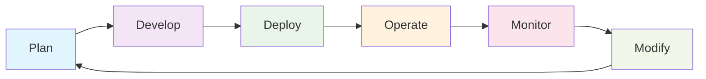
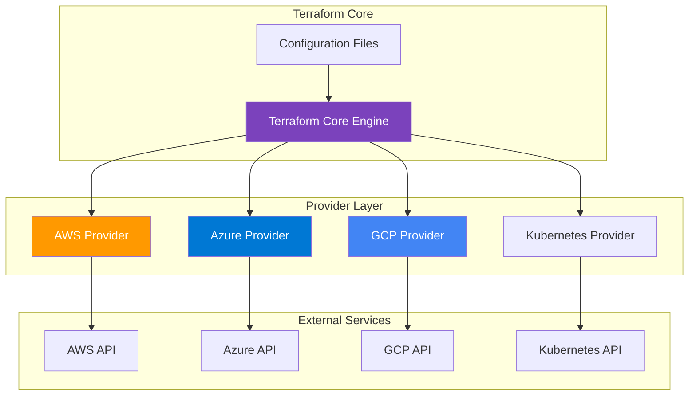
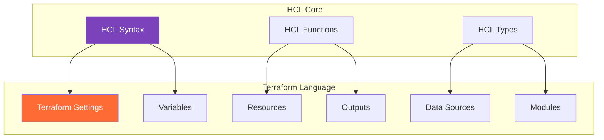
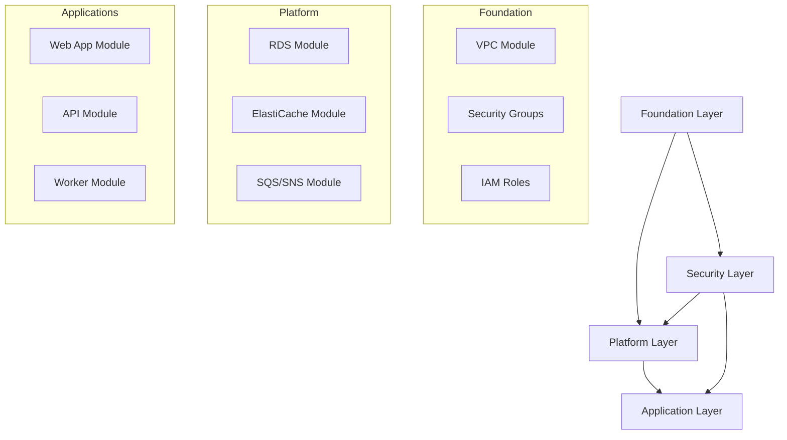
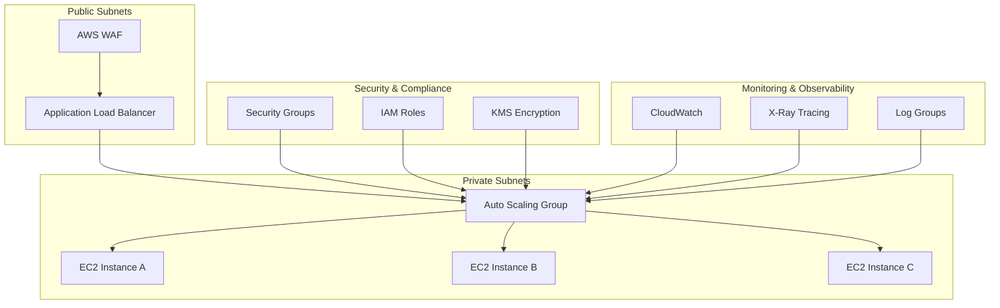
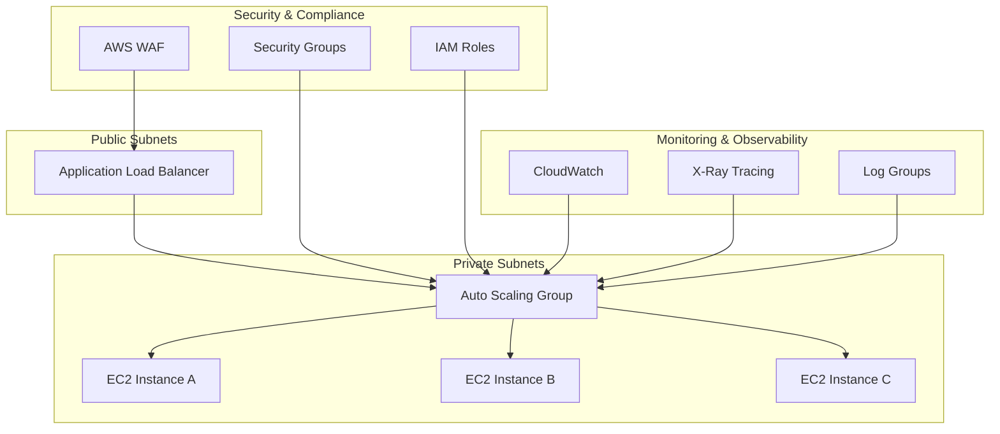

# 🚀 HashiCorp Terraform Associate Certification Training Program

## 📋 Module Overview

01. [Infrastructure as Code Concepts](#️-module-1-infrastructure-as-code-concepts)
02. [HashiCorp Introduction](#-module-2-hashicorp-introduction)  
03. [Terraform Basics](#-module-3-terraform-basics)
04. [Terraform Provisioners](#️-module-4-terraform-provisioners)
05. [Terraform Providers](#-module-5-terraform-providers)
06. [Terraform Language](#-module-6-terraform-language)
07. [Variables and Data](#-module-7-variables-and-data)
08. [Meta Arguments](#-module-8-meta-arguments)
09. [Expressions](#-module-9-expressions)
10. [Terraform State](#-module-10-terraform-state)
11. [Initialization](#-module-11-initialization)
12. [Writing and Modifying](#️-module-12-writing-and-modifying)
13. [Plan and Apply](#-module-13-plan-and-apply)
14. [Resource Drift Management](#-module-14-resource-drift-management)
15. [Import and Refresh Operations](#-module-15-import-and-refresh-operations)
16. [Terraform Troubleshooting and Debugging](#-module-16-terraform-troubleshooting-and-debugging)
17. [Finding and Using Terraform Modules](#-module-17-finding-and-using-terraform-modules)
18. [Standard Module Structure and Development](#️-module-18-standard-module-structure-and-development)
19. [Publishing and Advanced Module Patterns](#-module-19-publishing-and-advanced-module-patterns)


## 📋 Course Prerequisites

### 🎯 Required Skills
Before starting this course, you should have:

- **🖥️ Basic Terminal/Command Line Skills**
  - Navigation (`cd`, `ls`, `pwd`)
  - File operations (`mkdir`, `rm`, `cp`, `mv`)
  - Text editing with `vscode`, or your preferred editor
  - Understanding of environment variables

- **☁️ Cloud Architecture Fundamentals**
  - Basic understanding of cloud concepts (compute, storage, networking)
  - Experience with at least one major cloud provider (AWS, Azure, or GCP)
  - Knowledge of basic infrastructure components (VMs, networks, security groups)

- **🛠️ Development Fundamentals**
  - Basic understanding of version control (Git)
  - Familiarity with JSON/YAML syntax
  - Basic scripting experience (Bash, PowerShell, or Python)

### 💻 Required Installations

#### Core Tools
```bash
# Terraform (Latest version)
# Visit: https://www.terraform.io/downloads.html
# Or use package manager:

# macOS
brew install terraform

# Windows (Chocolatey)
choco install terraform

# Linux (Ubuntu/Debian)
sudo apt-get update && sudo apt-get install -y gnupg software-properties-common curl
curl -fsSL https://apt.releases.hashicorp.com/gpg | sudo apt-key add -
sudo apt-add-repository "deb [arch=amd64] https://apt.releases.hashicorp.com $(lsb_release -cs) main"
sudo apt-get update && sudo apt-get install terraform
```

#### Code Editor (VS Code Required)
```bash
# Visual Studio Code - Download from https://code.visualstudio.com/
# Required Extensions:
code --install-extension HashiCorp.terraform
code --install-extension ms-vscode.vscode-json
code --install-extension redhat.vscode-yaml

# Optional but Recommended Extensions:
code --install-extension GitHub.copilot                    # AI assistance
code --install-extension ms-vscode.powershell             # PowerShell support
code --install-extension ms-vscode-remote.remote-ssh      # Remote development
code --install-extension eamodio.gitlens                  # Enhanced Git features
```

#### Cloud CLI Tools
```bash
# AWS CLI v2 (if using AWS)
curl "https://awscli.amazonaws.com/awscli-exe-linux-x86_64.zip" -o "awscliv2.zip"
unzip awscliv2.zip
sudo ./aws/install

# Azure CLI (if using Azure)
curl -sL https://aka.ms/InstallAzureCLIDeb | sudo bash

# Google Cloud SDK (if using GCP)
curl https://sdk.cloud.google.com | bash
exec -l $SHELL
```

#### Additional Tools
```bash
# Git (Version Control)
sudo apt-get install git  # Linux
brew install git          # macOS

# jq (JSON processor - helpful for parsing outputs)
sudo apt-get install jq   # Linux
brew install jq           # macOS

# curl (API testing)
# Usually pre-installed on most systems
```

### 🔐 Account Setup Required

- **HashiCorp Account**: Sign up at [HashiCorp Cloud Platform](https://portal.cloud.hashicorp.com/)
- **Cloud Provider Account**: At least one of:
  - AWS Free Tier Account
  - Azure Free Account  
  - Google Cloud Platform Free Tier
- **GitHub Account**: For version control and collaboration

---

## 🎯 Course Overview

### 🏆 Learning Outcomes
By the end of this course, you will be able to:

- ✅ **Understand Infrastructure as Code (IaC) concepts** and best practices
- ✅ **Master Terraform fundamentals** including syntax, workflow, and state management
- ✅ **Write, plan, and apply Terraform configurations** with confidence
- ✅ **Work with providers, resources, and data sources** effectively
- ✅ **Implement advanced Terraform features** like modules, expressions, and meta-arguments
- ✅ **Manage Terraform state** and understand state file operations
- ✅ **Use Terraform Cloud** for collaboration and remote operations
- ✅ **Pass the HashiCorp Terraform Associate Certification Exam**

### 📊 Course Structure

This course follows the official HashiCorp Terraform Associate exam objectives and is structured as follows:

| Module | Topic | Duration | Difficulty | Hands-On Labs |
|--------|-------|----------|------------|---------------|
| 1 | 🏗️ Infrastructure as Code Concepts | 2 hours | 🟢 Beginner | 2 labs |
| 2 | 🔷 HashiCorp Introduction | 1 hour | 🟢 Beginner | 1 lab |
| 3 | ⚡ Terraform Basics | 3 hours | 🟢 Beginner | 4 labs |
| 4 | 🛠️ Terraform Provisioners | 2 hours | 🟡 Intermediate | 3 labs |
| 5 | 🔌 Terraform Providers | 2 hours | 🟡 Intermediate | 2 labs |
| 6 | 📝 Terraform Language | 1.5 hours | 🟡 Intermediate | 2 labs |
| 7 | 📊 Variables and Data | 2.5 hours | 🟡 Intermediate | 3 labs |
| 8 | 🎯 Meta Arguments | 2 hours | 🟡 Intermediate | 3 labs |
| 9 | 🔧 Expressions | 2 hours | 🟡 Intermediate | 3 labs |
| 10 | 📁 Terraform State | 2.5 hours | 🟡 Intermediate | 3 labs |
| 11 | 🚀 Initialization | 1.5 hours | 🟡 Intermediate | 2 labs |
| 12 | ✍️ Writing and Modifying | 2 hours | 🟡 Intermediate | 3 labs |
| 13 | 🚀 Plan and Apply | 2.5 hours | 🟡 Intermediate | 4 labs |
| 14 | 🔄 Resource Drift Management | 1.5 hours | 🟡 Intermediate | 2 labs |
| 15 | 📥 Import and Refresh Operations | 2 hours | 🔴 Advanced | 3 labs |
| 16 | 🔧 Terraform Troubleshooting and Debugging | 1.5 hours | 🔴 Advanced | 2 labs |
| 17 | 📦 Finding and Using Terraform Modules | 2 hours | 🟡 Intermediate | 3 labs |
| 18 | 🏗️ Standard Module Structure and Development | 3 hours | 🔴 Advanced | 4 labs |
| 19 | 🚀 Publishing and Advanced Module Patterns | 2.5 hours | 🔴 Advanced | 3 labs |

**Total Course Time**: ~38 hours of content + ~54 hands-on labs

---

## 📚 Study Recommendations

### 🎯 Study Timeline by Experience Level

#### 🔰 **Beginner** (New to IaC, 30+ hours recommended)
- **Week 1-2**: Complete Modules 1-3 (Foundation building)
- **Week 3**: Complete Modules 4-6 (Core concepts)
- **Week 4**: Complete Modules 7-9 (Advanced topics)
- **Week 5**: Practice exams and review
- **Daily commitment**: 1-2 hours

#### 🎓 **Intermediate** (Some IaC experience, 15-20 hours recommended)
- **Week 1**: Complete Modules 1-5 (Quick foundation + focus areas)
- **Week 2**: Complete Modules 6-9 (Advanced concepts)
- **Week 3**: Practice exams and hands-on projects
- **Daily commitment**: 1.5 hours

#### 🚀 **Advanced** (Experienced with IaC/DevOps, 10-12 hours recommended)
- **Week 1**: Review Modules 1-6 (Focus on Terraform-specific concepts)
- **Week 2**: Deep dive Modules 7-9 + Practice exams
- **Daily commitment**: 1-2 hours

### 📖 Recommended Study Strategy

1. **🎬 Watch Module Content** - Understand concepts first
2. **💻 Complete Hands-On Labs** - Apply knowledge immediately  
3. **📝 Take Notes** - Document key commands and concepts
4. **🔄 Practice Regularly** - Repetition builds muscle memory
5. **🧪 Experiment** - Try variations of examples
6. **📊 Take Practice Exams** - Test your knowledge

### 📚 Additional Resources

#### Official Documentation
- [Terraform Documentation](https://www.terraform.io/docs)
- [HashiCorp Learn](https://learn.hashicorp.com/terraform)
- [Terraform Registry](https://registry.terraform.io/)

#### Community Resources
- [Terraform Best Practices](https://www.terraform-best-practices.com/)
- [Terraform AWS Examples](https://github.com/terraform-aws-modules)
- [r/Terraform Subreddit](https://www.reddit.com/r/Terraform/)

---

## 🗓️ Module Structure & Learning Objectives

### 📋 Learning Approach
Each module follows this proven structure:
- **🎯 Learning Objectives** - Clear goals for the module
- **📖 Concept Introduction** - Theory and background
- **💡 Pro Tips** - Expert insights and best practices  
- **💻 Hands-On Exercises** - Practical application
- **✅ Knowledge Check** - Validate understanding
- **🎯 Module Summary** - Key takeaways

---

## 🏗️ Module 1: Infrastructure as Code Concepts
*Duration: 2 hours | Labs: 2*

### 🎯 Learning Objectives
By the end of this module, you will be able to:
- ✅ Define Infrastructure as Code and explain its benefits
- ✅ Compare declarative vs imperative approaches
- ✅ Understand infrastructure lifecycle management
- ✅ Explain idempotency and its importance
- ✅ Distinguish between provisioning, deployment, and orchestration
- ✅ Identify configuration drift and mitigation strategies
- ✅ Compare mutable vs immutable infrastructure
- ✅ Understand GitOps principles

### 📚 Topics Covered

#### 🔍 What is Infrastructure as Code?
Infrastructure as Code (IaC) is the practice of managing and provisioning computing infrastructure through machine-readable definition files, rather than physical hardware configuration or interactive configuration tools.

**🔑 Key Benefits:**
- **⚡ Speed & Efficiency**: Automated provisioning vs manual setup
- **🔄 Consistency**: Eliminates configuration drift
- **📋 Documentation**: Infrastructure becomes self-documenting
- **🔄 Version Control**: Track changes and rollback capabilities
- **💰 Cost Management**: Better resource optimization
- **🔒 Security**: Standardized security configurations

#### 🛠️ Popular Infrastructure as Code Tools

| Tool | Type | Cloud Focus | Language |
|------|------|-------------|----------|
| **Terraform** | Declarative | Multi-cloud | HCL |
| **CloudFormation** | Declarative | AWS-only | JSON/YAML |
| **Azure ARM** | Declarative | Azure-only | JSON |
| **Pulumi** | Imperative | Multi-cloud | Multiple |
| **Ansible** | Declarative | Multi-cloud | YAML |

💡 **Pro Tip**: Terraform's cloud-agnostic approach makes it the most versatile choice for multi-cloud strategies!

#### 📋 Declarative vs Imperative

**🎯 Declarative Approach** (Terraform's approach):
```hcl
# You declare WHAT you want
resource "aws_instance" "web" {
  ami           = "ami-0c02fb55956c7d316"
  instance_type = "t2.micro"
  
  tags = {
    Name = "WebServer"
  }
}
```

**⚙️ Imperative Approach**:
```bash
# You specify HOW to do it
aws ec2 run-instances \
  --image-id ami-0c02fb55956c7d316 \
  --instance-type t2.micro \
  --tag-specifications 'ResourceType=instance,Tags=[{Key=Name,Value=WebServer}]'
```

#### 🔄 Infrastructure Lifecycle



**🎯 Lifecycle Advantages:**
- **🔄 Repeatable**: Same process every time
- **📊 Predictable**: Known outcomes and timelines
- **🔍 Auditable**: Every change is tracked
- **⚡ Scalable**: Process works for 1 or 1000 resources

#### 🗓️ Infrastructure Lifecycle: Day Zero, One, and Two

The transcript emphasizes a **simplified 3-phase approach** to infrastructure lifecycle:

**📅 Day Zero - Planning & Design Phase**
```hcl
# Example: Initial planning configuration
terraform {
  required_version = ">= 1.0"
  required_providers {
    aws = {
      source  = "hashicorp/aws"
      version = "~> 5.0"
    }
  }
}

# Planning the infrastructure architecture
locals {
  environment = "production"
  region      = "us-west-2"
  
  # Day Zero: Define what we need
  infrastructure_requirements = {
    compute_instances = 3
    database_required = true
    load_balancer     = true
  }
}
```

**🔨 Day One - Development & Iteration Phase**
```hcl
# Day One: Implementing and testing the infrastructure
resource "aws_instance" "web" {
  count         = local.infrastructure_requirements.compute_instances
  ami           = "ami-0c02fb55956c7d316"
  instance_type = "t2.micro"
  
  # Iterating and testing configurations
  tags = {
    Name        = "WebServer-${count.index + 1}"
    Environment = local.environment
    Phase       = "day-one-testing"
  }
}

# Testing with terraform plan/apply cycles
```

**🚀 Day Two - Production & Maintenance Phase**
```hcl
# Day Two: Production-ready with monitoring and maintenance
resource "aws_instance" "production_web" {
  count                  = local.infrastructure_requirements.compute_instances
  ami                   = "ami-0c02fb55956c7d316"
  instance_type         = "t2.medium"  # Upgraded for production
  monitoring            = true
  disable_api_termination = true      # Production protection
  
  tags = {
    Name        = "ProdWebServer-${count.index + 1}"
    Environment = "production"
    Phase       = "day-two-live"
    Backup      = "daily"
  }
}
```

💡 **Pro Tip**: IaC starts on **Day Zero**! The earlier you involve infrastructure as code in your project, the better your outcomes will be.

⚠️ **Important**: These "days" don't represent 24-hour periods - they're **broad phases** of your infrastructure project lifecycle.

#### 🎯 Idempotency Explained

**❌ Non-Idempotent Example**:
```bash
# Running this twice creates two instances!
aws ec2 run-instances --image-id ami-12345 --instance-type t2.micro
```

**✅ Idempotent Example**:
```hcl
# Running terraform apply multiple times = same result
resource "aws_instance" "web" {
  ami           = "ami-12345"
  instance_type = "t2.micro"
}
```

💡 **Pro Tip**: Idempotency means you can run the same operation multiple times with the same result - no duplicates, no errors!

#### 🔄 Configuration Drift Management

**Configuration Drift** occurs when the actual infrastructure differs from what's defined in your IaC configuration files.

**❌ Common Drift Scenarios:**

```bash
# Someone manually modifies resources in AWS Console
aws ec2 modify-instance-attribute --instance-id i-1234567890abcdef0 --instance-type t2.large

# Security team adds manual firewall rules
aws ec2 authorize-security-group-ingress --group-id sg-12345678 --protocol tcp --port 3306

# Database admin changes RDS settings manually
aws rds modify-db-instance --db-instance-identifier mydb --allocated-storage 200
```

**✅ Terraform's Drift Detection:**

```hcl
# Your Terraform configuration
resource "aws_instance" "web" {
  ami           = "ami-0c02fb55956c7d316"
  instance_type = "t2.micro"  # Original configuration
  
  tags = {
    Name = "WebServer"
  }
}

# After manual change, Terraform detects drift
# terraform plan will show:
# ~ instance_type = "t2.large" -> "t2.micro" (drift detected)
```

**🔧 Drift Remediation Commands:**

```bash
# 1. Detect drift
terraform plan

# 2. Fix drift (apply desired state)
terraform apply

# 3. Import manually created resources
terraform import aws_instance.manual i-1234567890abcdef0

# 4. Refresh state to detect changes
terraform refresh
```

🎯 **Key Insight**: Terraform is **exceptionally good at drift detection and remediation** compared to other IaC tools - this is one of its major strengths!

### 💻 **Exercise 1.1**: IaC Concepts Quiz
**Duration**: 15 minutes

Answer these questions to test your understanding:

1. **What is the main advantage of declarative over imperative IaC?**
   - A) Faster execution
   - B) You specify what you want, not how to get it
   - C) Better error handling
   - D) More programming languages supported

2. **Which scenario demonstrates idempotency?**
   - A) Running a script that creates a new file each time
   - B) Running a command that ensures a service is started (no change if already started)
   - C) Deleting all files in a directory
   - D) Adding a new user account

3. **What is configuration drift?**
   - A) Moving infrastructure between regions
   - B) When actual infrastructure differs from the defined configuration
   - C) Network latency issues
   - D) Version control conflicts

<details>
<summary>🔍 Click for Answers</summary>

1. **B** - Declarative IaC lets you specify the desired end state
2. **B** - Idempotent operations produce the same result regardless of how many times they're run
3. **B** - Configuration drift occurs when manual changes cause actual infrastructure to differ from IaC definitions

</details>

### 💻 **Exercise 1.2**: Infrastructure Lifecycle Planning
**Duration**: 30 minutes

**Scenario**: Your company wants to migrate from manual server provisioning to IaC.

**Task**: Create a migration plan that addresses:

1. **📋 Current State Assessment**
   - List 3 problems with manual provisioning
   - Identify infrastructure components to migrate

2. **🎯 Target State Design**
   - Choose IaC tool and justify your choice
   - Define success criteria

3. **🗺️ Migration Strategy**
   - Plan the migration phases
   - Identify risks and mitigation strategies

**📝 Template**:
```markdown
## Migration Plan: Manual to IaC

### Current State Problems
1. 
2. 
3. 

### Target State
- **IaC Tool**: [Your choice]
- **Justification**: 
- **Success Criteria**:
  - [ ] 
  - [ ] 
  - [ ] 

### Migration Phases
**Phase 1**: 
**Phase 2**: 
**Phase 3**: 

### Risk Mitigation
| Risk | Impact | Mitigation |
|------|---------|------------|
|      |         |            |
```

---

## ✅ Module 1 Summary

### 🎯 Key Takeaways
- **🏗️ IaC transforms infrastructure management** from manual to automated
- **📋 Declarative approach** focuses on desired state, not steps
- **🔄 Idempotency ensures consistency** and prevents duplicate resources
- **⚡ Infrastructure lifecycle** provides structure and repeatability
- **🎯 GitOps principles** bring software development practices to infrastructure

### 🔑 Essential Commands Learned
```bash
# Verification commands you should know
terraform version    # Check Terraform installation
which terraform     # Locate Terraform binary
echo $PATH          # Verify PATH includes Terraform
```

### 💡 Pro Tips Recap
- Always prefer declarative over imperative for infrastructure
- Idempotency is your friend - embrace it!
- Configuration drift is the enemy - detect and prevent it
- Infrastructure should be treated like application code

---

**🎉 Congratulations!** You've completed Module 1. You now understand the fundamental concepts that make Infrastructure as Code so powerful. 

**➡️ Ready for Module 2?** Let me know when you'd like to continue with the HashiCorp Introduction module!

---

---

## 🔷 Module 2: HashiCorp Introduction
*Duration: 1 hour | Labs: 1*

### 🎯 Learning Objectives
By the end of this module, you will be able to:
- ✅ Understand HashiCorp's role in the DevOps ecosystem
- ✅ Explain what Terraform is and its core purpose
- ✅ Distinguish between Terraform OSS and Terraform Cloud/Enterprise
- ✅ Identify Terraform's position in HashiCorp's product suite
- ✅ Understand Terraform's architecture and core components
- ✅ Explain Terraform's multi-cloud capabilities

### 📚 Topics Covered

#### 🏢 HashiCorp Company Overview

HashiCorp is a company focused on **infrastructure automation** and **security**. Founded in 2012, they've built a suite of tools that work together to solve modern infrastructure challenges.

**🔑 HashiCorp's Mission**: 
> *"To enable organizations to provision, secure, and run any infrastructure for any application"*

#### 🛠️ HashiCorp Product Suite

| Product | Purpose | Category | Open Source |
|---------|---------|----------|-------------|
| **🔷 Terraform** | Infrastructure provisioning | Infrastructure | ✅ Yes |
| **🔒 Vault** | Secrets management | Security | ✅ Yes |
| **🌐 Consul** | Service discovery & mesh | Networking | ✅ Yes |
| **🚀 Nomad** | Workload orchestration | Runtime | ✅ Yes |
| **📦 Packer** | Image building | Infrastructure | ✅ Yes |
| **🛡️ Boundary** | Secure remote access | Security | ✅ Yes |
| **🚢 Waypoint** | Application deployment | Application | ✅ Yes |

💡 **Pro Tip**: All HashiCorp tools follow similar principles - they're declarative, use HCL (HashiCorp Configuration Language), and integrate seamlessly!

#### 📜 HashiCorp Terraform Certification Prerequisites

**🎓 Recommended Background:**
Before diving into Terraform certification, you should have foundational cloud knowledge:

- **☁️ Cloud Provider Experience**: AWS Solutions Architect Associate, Azure Administrator, or Google Cloud Associate
- **💻 DevOps Fundamentals**: Understanding of automation, scripting, and infrastructure concepts
- **🛠️ System Administration**: Experience with Linux/Windows server management

**⏰ Study Time Recommendations:**

| Experience Level | Study Time | Description |
|------------------|------------|-------------|
| **🟢 Beginner** | **30+ hours** | New to IaC, no prior automation experience, no cloud certifications |
| **🟡 Intermediate** | **12 hours** | Experienced with IaC tools (CloudFormation, ARM, Bicep), holds cloud certifications |
| **🔵 General Study Plan** | **14 days** | 1-2 hours daily for comprehensive preparation |

**💡 Pro Tip**: Don't try to learn cloud fundamentals and Terraform simultaneously - master your cloud provider first!

#### 🎯 Terraform Certification Exam Details

**📋 Exam Overview:**
- **⏱️ Duration**: 60 minutes (90 minutes seat time including setup)
- **❓ Questions**: 57 questions total
- **📊 Passing Score**: ~70% (scaled scoring)
- **🎯 Target Score**: Aim for 80-85% on practice exams
- **🏢 Format**: Proctored online or test center (PSI)

**📝 Question Types:**
- **Multiple Choice** - Select one correct answer
- **Multiple Select** - Choose multiple correct answers  
- **Fill-in-the-Blank** - Type command names, flags, or terraform syntax

**⚠️ Important Notes:**
- No penalty for wrong answers - always answer every question
- Questions are short and practical (not theory-heavy)
- Focus on hands-on experience over memorization

#### 🎓 Certification Exam Domains

The Terraform Associate Certification covers **9 domains** (exact weighting not provided by HashiCorp):

1. **🏗️ Understand Infrastructure as Code (IaC) Concepts**
2. **🎯 Understand the Purpose of Terraform (vs other IaC)**
3. **⚡ Understand Terraform Basics**
4. **🔄 Use the Core Terraform Workflow**
5. **🔧 Interact with Terraform Modules**
6. **📦 Use Terraform Outside of Core Workflow**
7. **🏛️ Implement and Maintain State**
8. **📝 Read, Generate, and Modify Configuration**
9. **☁️ Understand Terraform Cloud Capabilities**

#### 🔷 What is Terraform?

**Terraform** is an **Infrastructure as Code (IaC)** tool that allows you to **build, change, and version infrastructure** safely and efficiently.

**🎯 Core Purpose:**
- **Provision** infrastructure resources across multiple providers
- **Manage** the complete lifecycle of infrastructure
- **Version control** infrastructure changes
- **Collaborate** on infrastructure development

**🔑 Key Characteristics:**
- **☁️ Cloud Agnostic**: Works with AWS, Azure, GCP, and 1000+ providers
- **📋 Declarative**: You describe what you want, not how to get it
- **🔄 Idempotent**: Same configuration = same result every time
- **📊 State Management**: Tracks what resources exist and their configuration
- **🗺️ Execution Planning**: Shows what will change before making changes

#### 🔄 Terraform vs Traditional Infrastructure Management

**❌ Traditional Approach:**
```bash
# Manual AWS Console clicks or CLI commands
aws ec2 run-instances --image-id ami-12345 --instance-type t2.micro
aws ec2 create-security-group --group-name web-sg
aws ec2 authorize-security-group-ingress --group-name web-sg --protocol tcp --port 80
# ... many more commands
# No easy way to track what was created or replicate it
```

**✅ Terraform Approach:**
```hcl
# Single configuration file describes entire infrastructure
resource "aws_instance" "web" {
  ami           = "ami-12345"
  instance_type = "t2.micro"
  
  vpc_security_group_ids = [aws_security_group.web.id]
  
  tags = {
    Name = "WebServer"
  }
}

resource "aws_security_group" "web" {
  name = "web-sg"
  
  ingress {
    from_port   = 80
    to_port     = 80
    protocol    = "tcp"
    cidr_blocks = ["0.0.0.0/0"]
  }
}
```

#### ☁️ Terraform Deployment Options

**🆓 Terraform Open Source (OSS)**
- Free to use
- Run locally or in CI/CD
- Manual state management
- Individual or small team usage

**☁️ Terraform Cloud**
- SaaS offering by HashiCorp
- Remote state management
- Team collaboration features
- Policy enforcement
- Private module registry

**🏢 Terraform Enterprise**
- Self-hosted version of Terraform Cloud
- Enterprise security and compliance
- Air-gapped environments
- Advanced governance features

#### 🌍 Multi-Cloud Capabilities

**🎯 Why Multi-Cloud Matters:**
- **🛡️ Avoid vendor lock-in**: Don't put all eggs in one basket
- **🌐 Geographic distribution**: Use best regions from different providers
- **💰 Cost optimization**: Leverage competitive pricing
- **🔄 Disaster recovery**: Failover between providers
- **🎯 Best-of-breed**: Use each provider's strongest services

**Example Multi-Cloud Setup:**
```hcl
# AWS Provider for compute
provider "aws" {
  region = "us-west-2"
}

# Azure Provider for databases  
provider "azurerm" {
  features {}
}

# Google Cloud for ML services
provider "google" {
  project = "my-project"
  region  = "us-central1"
}

# Create resources across all three clouds
resource "aws_instance" "web" {
  ami           = "ami-12345"
  instance_type = "t2.micro"
}

resource "azurerm_mysql_server" "database" {
  name                = "mydb-server"
  resource_group_name = azurerm_resource_group.main.name
  location            = azurerm_resource_group.main.location
  # ... configuration
}

resource "google_ml_engine_model" "ml_model" {
  name = "my_ml_model"
  # ... configuration
}
```

### 💻 **Exercise 2.1**: Terraform Installation Verification
**Duration**: 15 minutes

Let's verify your Terraform installation and explore basic commands.

**Step 1: Verify Installation**
```bash
# Open VS Code terminal (Ctrl+` or Cmd+`)
terraform version

# Expected output:
# Terraform v1.6.0
# on darwin_amd64 (or your platform)
```

**Step 2: Explore Help System**
```bash
# Get general help
terraform --help

# Get help for specific commands
terraform plan --help
terraform apply --help
terraform destroy --help
```

**Step 3: Create Your First Terraform Directory**
```bash
# Create project directory
mkdir ~/terraform-learning
cd ~/terraform-learning

# Open in VS Code
code .
```

**Step 4: Create a Simple Configuration**

Create a file called `main.tf` in VS Code:
```hcl
# This is a comment in HCL
terraform {
  required_version = ">= 1.0"
  
  required_providers {
    local = {
      source  = "hashicorp/local"
      version = "~> 2.0"
    }
  }
}

# Create a local file - no cloud provider needed!
resource "local_file" "hello" {
  filename = "hello.txt"
  content  = "Hello from Terraform! 🚀"
}

# Output the file content
output "file_content" {
  value = local_file.hello.content
}
```

**Step 5: Initialize and Apply**
```bash
# Initialize Terraform (downloads providers)
terraform init

# Plan the changes
terraform plan

# Apply the changes
terraform apply
# Type 'yes' when prompted

# Verify the file was created
ls -la
cat hello.txt
```

**Step 6: Explore State**
```bash
# View current state
terraform show

# List resources in state
terraform state list
```

**Step 7: Clean Up**
```bash
# Destroy resources
terraform destroy
# Type 'yes' when prompted

# Verify file was deleted
ls -la
```

💡 **Pro Tip**: Notice how Terraform tracks what it created in the state file and can cleanly remove it!

---

## ✅ Module 2 Summary

### 🎯 Key Takeaways
- **🏢 HashiCorp** builds integrated tools for infrastructure automation
- **🔷 Terraform** is the infrastructure provisioning tool in their suite
- **☁️ Multi-cloud support** prevents vendor lock-in and enables best-of-breed approaches
- **📊 State management** is what makes Terraform powerful and reliable
- **🔌 Provider system** enables Terraform to work with any API
- **📋 HCL syntax** is human-readable and version-control friendly

### 🔑 Essential Commands Learned
```bash
terraform version        # Check Terraform version
terraform init          # Initialize working directory
terraform plan          # Preview changes
terraform apply         # Apply changes
terraform destroy       # Remove resources
terraform show          # Display current state
terraform state list    # List managed resources
```

### 💡 Pro Tips Recap
- Start simple with local resources before moving to cloud providers
- Always run `terraform plan` before `terraform apply`
- State files contain sensitive information - protect them!
- Use version constraints for providers to ensure consistency

---

**🎉 Congratulations!** You've completed Module 2 and now understand HashiCorp's ecosystem and Terraform's role within it. You've also created your first Terraform configuration!

**➡️ Ready for Module 3?** Let me know when you'd like to continue with Terraform Basics - where we'll dive deep into the core workflow and commands!

---

---

## ⚡ Module 3: Terraform Basics
*Duration: 3 hours | Labs: 4*

### 🎯 Learning Objectives
By the end of this module, you will be able to:
- ✅ Understand the complete Terraform lifecycle and workflow
- ✅ Master the core Terraform commands (init, plan, apply, destroy)
- ✅ Explain change automation and execution planning
- ✅ Visualize execution plans and understand resource graphs
- ✅ Identify Terraform use cases and best practices
- ✅ Work with input variables, local values, and outputs
- ✅ Understand Terraform modules and file organization
- ✅ Use Terraform Cloud for remote operations

### 📚 Topics Covered

#### 🔄 The Terraform Lifecycle

The Terraform lifecycle represents the complete process of managing infrastructure from creation to destruction. Understanding this lifecycle is crucial for effective infrastructure management.

**🔑 Lifecycle Phases:**

1. **📝 Write**: Create `.tf` configuration files
2. **📋 Plan**: Preview changes with `terraform plan`
3. **⚡ Apply**: Execute changes with `terraform apply`
4. **🔧 Manage**: Monitor and maintain infrastructure
5. **🔄 Update**: Modify configuration and repeat cycle
6. **💥 Destroy**: Clean up resources with `terraform destroy`

#### ⚡ Change Automation

Terraform's change automation ensures that infrastructure changes are:
- **🎯 Predictable**: Same configuration = same result
- **📋 Planned**: Preview changes before applying
- **🔄 Repeatable**: Consistent across environments
- **📊 Tracked**: State file maintains current status

**Traditional vs Terraform Change Management:**

| Traditional | Terraform |
|-------------|-----------|
| Manual changes | Automated changes |
| Inconsistent results | Consistent results |
| No change preview | Plan before apply |
| Hard to rollback | Easy rollback |
| Documentation separate | Self-documenting |

#### 📋 Execution Plans

Execution plans are Terraform's way of showing you exactly what will happen before making any changes.

**🔍 Plan Output Symbols:**
- **`+`** = Resource will be **created**
- **`-`** = Resource will be **destroyed**  
- **`~`** = Resource will be **modified**
- **`-/+`** = Resource will be **replaced** (destroyed then created)

**Example Plan Output:**
```bash
Terraform will perform the following actions:

  # aws_instance.web will be created
  + resource "aws_instance" "web" {
      + ami           = "ami-12345"
      + instance_type = "t2.micro"
      + tags          = {
          + "Name" = "WebServer"
        }
    }

  # aws_security_group.web will be modified
  ~ resource "aws_security_group" "web" {
        id     = "sg-12345"
        name   = "web-sg"
      ~ ingress {
          + from_port = 443
          + to_port   = 443
            protocol  = "tcp"
        }
    }

Plan: 1 to add, 1 to change, 0 to destroy.
```

💡 **Pro Tip**: Always run `terraform plan` before `terraform apply` to avoid surprises!

#### 📊 Visualizing Execution Plans

**🗺️ Terraform Graph**
Terraform builds a **dependency graph** from your configuration and uses it to determine the correct order for resource operations. You can visualize this graph using `terraform graph`.

**📝 Basic Usage:**
```bash
# Generate dependency graph
terraform graph

# Create visual graph (requires GraphViz installed)
terraform graph | dot -Tsvg > graph.svg

# or with png output

terraform graph | dot -Tpng > graph.png

# Open in browser
open graph.svg  # macOS
xdg-open graph.svg  # Linux
```

**🔧 Installing GraphViz:**
```bash
# macOS
brew install graphviz

# Ubuntu/Debian
sudo apt install graphviz

# CentOS/RHEL
sudo yum install graphviz
```

**🎯 What the Graph Shows:**
- **Resource dependencies**: Which resources depend on others
- **Parallel execution**: Resources that can be created simultaneously
- **Execution order**: The sequence Terraform will follow
- **Data source relationships**: How data flows between resources

**📈 Dependency Graph Example:**
```hcl
# This configuration creates dependencies
resource "aws_vpc" "main" {
  cidr_block = "10.0.0.0/16"
}

resource "aws_subnet" "public" {
  vpc_id     = aws_vpc.main.id  # Depends on VPC
  cidr_block = "10.0.1.0/24"
}

resource "aws_instance" "web" {
  subnet_id = aws_subnet.public.id  # Depends on subnet
  ami       = "ami-12345"
  instance_type = "t2.micro"
}
```

The graph shows: **VPC → Subnet → Instance** dependency chain.

💡 **Pro Tip**: Use `terraform graph` to understand complex resource relationships and optimize your configuration for parallel execution!

#### 🔄 Resource Replacement with --replace Flag

**🚨 Replacing terraform taint**
The `terraform taint` command was deprecated in Terraform v0.15.2. The modern approach uses the `--replace` flag with `terraform plan` and `terraform apply`.

**🎯 When to Use --replace:**
- **💥 Resource corruption**: When a resource becomes damaged or degraded
- **🔧 Configuration changes**: When certain changes require resource recreation
- **🧪 Testing scenarios**: When you need to force resource recreation for testing
- **📦 Image updates**: When updating AMIs, container images, or similar immutable resources

**📝 Basic Usage:**
```bash
# Plan resource replacement
terraform plan -replace="aws_instance.web"

# Apply resource replacement
terraform apply -replace="aws_instance.web"

# Replace multiple resources (one at a time)
terraform apply -replace="aws_instance.web[0]" -replace="aws_instance.web[1]"
```

**🔍 Replacement vs Update:**
```hcl
# This resource configuration
resource "aws_instance" "web" {
  ami           = "ami-12345"      # Old AMI
  instance_type = "t2.micro"
  
  tags = {
    Name = "WebServer"
  }
}
```

**Example Scenarios:**
```bash
# Scenario 1: Force recreation due to corruption
terraform apply -replace="aws_instance.web"

# Scenario 2: Replace specific instance in a count/for_each
terraform apply -replace="aws_instance.web[0]"
terraform apply -replace='aws_instance.servers["web"]'

# Scenario 3: Combine with other changes
terraform apply -replace="aws_instance.web" -var="instance_type=t3.micro"
```

**🚨 Important Limitations:**
- **One resource at a time**: Can only replace single resources, not multiple in one flag
- **Destructive operation**: Resource will be destroyed and recreated
- **Dependency aware**: Terraform will handle dependent resource updates automatically
- **State consistency**: Replacement maintains state file consistency

**💡 Modern Best Practices:**
```bash
# ✅ Modern approach
terraform plan -replace="aws_instance.web"

# ❌ Deprecated approach (don't use)
terraform taint aws_instance.web
terraform plan
```

💡 **Pro Tip**: Always run `terraform plan -replace` first to review the replacement impact before applying!

### 💻 **Exercise 3.1**: Core Terraform Workflow
**Duration**: 30 minutes

Let's practice the complete Terraform workflow with a real cloud resource.

**Step 1: Setup Project Structure**
```bash
# Create new project directory
mkdir ~/terraform-aws-basics
cd ~/terraform-aws-basics

# Open in VS Code
code .
```

**Step 2: Create Main Configuration**

Create `main.tf`:
```hcl
# Configure the AWS Provider
terraform {
  required_version = ">= 1.0"
  
  required_providers {
    aws = {
      source  = "hashicorp/aws"
      version = "~> 5.0"
    }
  }
}

provider "aws" {
  region = var.aws_region
}

# Create a VPC
resource "aws_vpc" "main" {
  cidr_block           = "10.0.0.0/16"
  enable_dns_hostnames = true
  enable_dns_support   = true
  
  tags = {
    Name        = "terraform-basics-vpc"
    Environment = "learning"
  }
}

# Create an Internet Gateway
resource "aws_internet_gateway" "main" {
  vpc_id = aws_vpc.main.id
  
  tags = {
    Name = "terraform-basics-igw"
  }
}

# Create a subnet
resource "aws_subnet" "public" {
  vpc_id                  = aws_vpc.main.id
  cidr_block              = "10.0.1.0/24"
  availability_zone       = data.aws_availability_zones.available.names[0]
  map_public_ip_on_launch = true
  
  tags = {
    Name = "terraform-basics-public-subnet"
  }
}

# Data source to get available AZs
data "aws_availability_zones" "available" {
  state = "available"
}
```

**Step 3: Create Variables File**

Create `variables.tf`:
```hcl
variable "aws_region" {
  description = "AWS region for resources"
  type        = string
  default     = "us-west-2"
}

variable "environment" {
  description = "Environment name"
  type        = string
  default     = "learning"
}
```

**Step 4: Create Outputs File**

Create `outputs.tf`:
```hcl
output "vpc_id" {
  description = "ID of the VPC"
  value       = aws_vpc.main.id
}

output "vpc_cidr_block" {
  description = "CIDR block of the VPC"
  value       = aws_vpc.main.cidr_block
}

output "subnet_id" {
  description = "ID of the public subnet"
  value       = aws_subnet.public.id
}

output "availability_zone" {
  description = "Availability zone of the subnet"
  value       = aws_subnet.public.availability_zone
}
```

**Step 5: Initialize Terraform**
```bash
# Initialize the working directory
terraform init

# Verify initialization
ls -la
# You should see .terraform/ directory and .terraform.lock.hcl file
```

**Step 6: Validate Configuration**
```bash
# Check syntax and configuration
terraform validate

# Format code (optional but recommended)
terraform fmt
```

**Step 7: Plan the Infrastructure**
```bash
# Create execution plan
terraform plan

# Save plan to file for review
terraform plan -out=tfplan

# Review the saved plan
terraform show tfplan
```

**Step 8: Apply the Configuration**
```bash
# Apply the changes (will prompt for confirmation)
terraform apply

# Or apply with auto-approval (be careful!)
terraform apply -auto-approve
```

**Step 9: Explore the State**
```bash
# View current state
terraform show

# List all resources in state
terraform state list

# Show specific resource details
terraform state show aws_vpc.main
```

**Step 10: Clean Up**
```bash
# Destroy all resources
terraform destroy

# Verify resources are gone
terraform show
```

💡 **Pro Tip**: Notice how Terraform tracks dependencies and creates resources in the correct order!

#### 🎯 Use Cases for Terraform

**🏢 Enterprise Use Cases:**
- **☁️ Multi-cloud deployments**: Consistent infrastructure across providers
- **🔄 Environment provisioning**: Dev, staging, production environments
- **📦 Application infrastructure**: Complete application stacks
- **🛡️ Compliance automation**: Standardized, auditable infrastructure
- **💾 Disaster recovery**: Rapid infrastructure recreation

**🔧 Common Patterns:**
```hcl
# 1. Network Foundation
resource "aws_vpc" "main" { /* ... */ }
resource "aws_subnet" "private" { /* ... */ }
resource "aws_subnet" "public" { /* ... */ }

# 2. Security Groups
resource "aws_security_group" "web" { /* ... */ }
resource "aws_security_group" "database" { /* ... */ }

# 3. Compute Resources
resource "aws_instance" "web" { /* ... */ }
resource "aws_rds_instance" "database" { /* ... */ }

# 4. Load Balancing
resource "aws_lb" "main" { /* ... */ }
resource "aws_lb_target_group" "web" { /* ... */ }
```

---

## ✅ Module 3 Summary

### 🎯 Key Takeaways
- **🔄 Terraform lifecycle** follows a predictable Write → Plan → Apply → Manage cycle
- **📋 Execution plans** show exactly what will change before applying
- **🗺️ Resource graphs** ensure proper dependency resolution and parallel execution
- **📊 Variables** make configurations flexible and reusable across environments
- **🏷️ Local values** compute derived values and reduce repetition
- **📤 Outputs** extract information from infrastructure for use by other systems
- **📥 Data sources** query existing infrastructure and cloud provider APIs

### 🔑 Essential Commands Learned
```bash
terraform init          # Initialize working directory
terraform validate      # Check configuration syntax
terraform fmt          # Format configuration files
terraform plan         # Preview changes
terraform apply        # Apply changes
terraform destroy      # Remove all resources
terraform output       # Display output values
terraform show         # Display current state
terraform state list   # List resources in state
terraform state show   # Show specific resource details
```

### 💡 Pro Tips Recap
- Always run `terraform plan` before `terraform apply`
- Use variables to make configurations reusable
- Leverage local values for computed and derived values
- Use data sources to reference existing infrastructure
- Tag all resources consistently for better organization
- Keep sensitive outputs marked as sensitive
- Use validation rules to catch errors early

---

## 🧠 Knowledge Check: Module 3 Quiz

Test your understanding of Terraform Basics with these questions:

### 📝 Quiz Questions

**1. What is the correct order of the core Terraform workflow?**
- A) Plan → Write → Apply → Destroy
- B) Write → Plan → Apply → Manage  
- C) Init → Write → Plan → Apply
- D) Apply → Plan → Write → Validate

**2. Which symbol in a Terraform plan output indicates a resource will be replaced?**
- A) `+`
- B) `~` 
- C) `-/+`
- D) `-`

**3. What command would you use to visualize Terraform's dependency graph?**
- A) `terraform show`
- B) `terraform graph`
- C) `terraform state list`
- D) `terraform validate`

**4. Which type of Terraform value is computed at apply time and cannot be used in resource count?**
- A) Input variables
- B) Local values
- C) Output values
- D) Data source attributes

**5. What is the modern replacement for the deprecated `terraform taint` command?**
- A) `terraform destroy --target`
- B) `terraform apply --replace`
- C) `terraform refresh --replace`
- D) `terraform state rm`

**6. Which block type is used to query existing infrastructure?**
- A) `resource`
- B) `variable`
- C) `data`
- D) `output`

**7. What makes Terraform operations idempotent?**
- A) HCL syntax validation
- B) Provider version constraints
- C) State file tracking of current infrastructure
- D) Execution plan generation

**8. Which validation constraint ensures a variable contains a valid email address?**
- A) `validation { condition = length(var.email) > 0 }`
- B) `validation { condition = can(regex(".*@.*", var.email)) }`
- C) `validation { condition = var.email != "" }`
- D) `validation { condition = contains(var.email, "@") }`

<details>
<summary>🔍 Click for Answers</summary>

1. **B** - The core Terraform workflow follows Write → Plan → Apply → Manage cycle
2. **C** - The `-/+` symbol indicates a resource will be replaced (destroyed then created)
3. **B** - `terraform graph` generates a visual representation of resource dependencies
4. **D** - Data source attributes are computed at apply time and cannot be used in resource count
5. **B** - `terraform apply --replace` is the modern replacement for deprecated `terraform taint`
6. **C** - `data` blocks are used to query existing infrastructure and cloud provider APIs
7. **C** - State file tracking makes Terraform idempotent by knowing current infrastructure state
8. **B** - Using `can(regex(".*@.*", var.email))` provides basic email format validation

</details>

---

**🎉 Congratulations!** You've completed Module 3 and now understand the core Terraform workflow, variables, outputs, and data sources. You've built real AWS infrastructure and learned to make it flexible and maintainable!

**➡️ Ready for Module 4?** Let me know when you'd like to continue with Terraform Provisioners - where we'll learn how to configure resources after they're created!

---

---

## 🛠️ Module 4: Modern Infrastructure Configuration
*Duration: 2 hours | Labs: 3*

### 🎯 Learning Objectives
By the end of this module, you will be able to:
- ✅ **Implement Cloud-Init for reliable instance initialization**
- ✅ **Use Packer to build pre-configured machine images**  
- ✅ **Understand modern approaches to infrastructure configuration**
- ✅ Work with terraform_data resources for advanced workflows
- ✅ Identify when configuration management tools are appropriate
- ✅ Understand Terraform provisioners and their limitations
- ✅ Know when provisioners are still appropriate (edge cases)
- ✅ Configure provisioners only when modern approaches aren't suitable

### 📚 Topics Covered

## ⚡ Modern Infrastructure Configuration Approaches

**🎯 The Modern Way**: Instead of configuring resources after creation, modern infrastructure follows **immutable infrastructure** principles:

1. **☁️ Cloud-Init**: Built-in VM initialization (recommended for most cases)
2. **📦 Packer**: Pre-built golden images with software already installed  
3. **🔧 Configuration Management**: Dedicated tools for complex configuration
4. **📋 User Data**: Cloud-provider native initialization scripts

**⚠️ Why Avoid Provisioners?**
- **🐌 Slower**: Network-dependent, runs after resource creation
- **❌ Less Reliable**: Connection failures, timing issues
- **🔄 Not Idempotent**: May fail on re-runs
- **🤝 Coupling**: Creates tight coupling between infrastructure and configuration
- **🔐 Security**: Requires SSH/WinRM access and credentials

**✅ When Modern Approaches Are Better:**
- **📦 Software Installation**: Use pre-built images (Packer) or Cloud-Init
- **⚙️ Service Configuration**: Use Cloud-Init YAML or config management tools
- **📁 File Management**: Bake files into images or use Cloud-Init write_files
- **🔄 Service Management**: Use Cloud-Init runcmd or systemd units
- **🏗️ Initial Setup**: Always prefer Cloud-Init over provisioners

---

## ☁️ Cloud-Init: The Recommended Approach

**Cloud-Init** is an industry standard for cross-platform cloud instance initialization. It's the **first choice** for most instance setup tasks.

**🎯 Why Cloud-Init is Superior:**
- **🚀 Faster**: Runs during instance boot, no network setup delay
- **🔒 More Secure**: No SSH/WinRM credentials needed
- **✅ More Reliable**: Built into cloud images, handles retries automatically
- **🔄 Idempotent**: Safe to run multiple times
- **📱 Standardized**: Works across all major cloud providers
- **🔧 Feature-Rich**: Package management, file creation, user management, service control

**📝 Basic Cloud-Init with User Data:**
```hcl
# Modern approach - Cloud-Init handles everything
resource "aws_instance" "web" {
  ami           = data.aws_ami.amazon_linux.id
  instance_type = "t2.micro"
  
  # Cloud-Init configuration - runs on first boot
  user_data = <<-EOF
    #!/bin/bash
    yum update -y
    yum install -y httpd git nodejs npm
    systemctl start httpd
    systemctl enable httpd
    
    # Create web content
    cat > /var/www/html/index.html <<HTML
    <h1>Modern Web Server</h1>
    <p>Configured with Cloud-Init - No provisioners needed!</p>
    <p>Instance ID: $(curl -s http://169.254.169.254/latest/meta-data/instance-id)</p>
    HTML
    
    # Download and setup application
    git clone https://github.com/company/web-app.git /opt/app
    cd /opt/app && npm install
    systemctl restart httpd
  EOF
  
  tags = {
    Name = "cloud-init-web-server"
  }
}
```

**🔧 Advanced Cloud-Init with YAML Configuration:**
```hcl
# Advanced Cloud-Init with structured YAML
locals {
  cloud_init_config = <<-EOF
    #cloud-config
    package_update: true
    package_upgrade: true
    
    packages:
      - httpd
      - git
      - nodejs
      - npm
      - docker
    
    # Create users
    users:
      - name: appuser
        groups: wheel,docker
        shell: /bin/bash
        sudo: ['ALL=(ALL) NOPASSWD:ALL']
    
    # Write configuration files
    write_files:
      - path: /etc/httpd/conf.d/app.conf
        content: |
          <VirtualHost *:80>
              ServerName ${var.domain_name}
              DocumentRoot /var/www/html
              ErrorLog /var/log/httpd/error.log
              CustomLog /var/log/httpd/access.log combined
          </VirtualHost>
        permissions: '0644'
        owner: root:root
      
      - path: /opt/app/config.json
        content: |
          {
            "environment": "${var.environment}",
            "database_url": "${var.db_connection_string}",
            "log_level": "info"
          }
        permissions: '0640'
        owner: appuser:appuser
    
    # Run commands in order
    runcmd:
      - systemctl enable httpd docker
      - systemctl start httpd docker
      - usermod -aG docker appuser
      - git clone https://github.com/company/web-app.git /opt/app
      - chown -R appuser:appuser /opt/app
      - cd /opt/app && npm install --production
      - systemctl restart httpd
      - docker pull nginx:alpine
    
    # Final message
    final_message: "Server setup completed successfully with Cloud-Init!"
  EOF
}

resource "aws_instance" "web_advanced" {
  ami           = data.aws_ami.amazon_linux.id
  instance_type = "t2.micro"
  
  # Base64 encode for complex YAML configurations
  user_data = base64encode(local.cloud_init_config)
  
  tags = {
    Name = "advanced-cloud-init-server"
  }
}
```

**💡 Cloud-Init Best Practices:**
- ✅ Use YAML format for complex configurations
- ✅ Leverage package management instead of manual installs
- ✅ Use write_files for configuration templates
- ✅ Set proper file permissions and ownership
- ✅ Use runcmd for ordered command execution
- ✅ Test configurations with cloud-init validate

---

## 📦 Packer: Pre-Built Golden Images

**Packer** is HashiCorp's tool for building immutable, pre-configured machine images. This is the **ultimate solution** for complex software stacks.

**🎯 Why Packer is Superior:**
- **⚡ Fastest Deployment**: Everything pre-installed, just boot and run
- **🏗️ Immutable Infrastructure**: Same image = same result every time
- **🔒 Security**: No runtime configuration = reduced attack surface  
- **📊 Consistency**: Identical environments across dev/stage/prod
- **🧪 Testable**: Test images before deployment
- **📦 Reusable**: One image, many instances

**📝 Basic Packer Template:**
```json
{
  "variables": {
    "aws_access_key": "{{env `AWS_ACCESS_KEY_ID`}}",
    "aws_secret_key": "{{env `AWS_SECRET_ACCESS_KEY`}}",
    "region": "us-west-2",
    "app_version": "{{env `APP_VERSION`}}"
  },
  
  "builders": [
    {
      "type": "amazon-ebs",
      "access_key": "{{user `aws_access_key`}}",
      "secret_key": "{{user `aws_secret_key`}}",
      "region": "{{user `region`}}",
      "source_ami": "ami-12345",
      "instance_type": "t2.micro",
      "ssh_username": "ec2-user",
      "ami_name": "web-app-{{user `app_version`}}-{{timestamp}}"
    }
  ],
  
  "provisioners": [
    {
      "type": "shell",
      "inline": [
        "sudo yum update -y",
        "sudo yum install -y httpd nodejs npm docker git",
        "sudo systemctl enable httpd docker"
      ]
    },
    {
      "type": "file",
      "source": "./app/",
      "destination": "/tmp/app/"
    },
    {
      "type": "shell",
      "inline": [
        "sudo mv /tmp/app /opt/",
        "sudo chown -R ec2-user:ec2-user /opt/app",
        "cd /opt/app && npm install --production",
        "sudo systemctl start httpd",
        "sudo docker pull nginx:alpine",
        "sudo systemctl stop httpd"
      ]
    }
  ],
  
  "post-processors": [
    {
      "type": "manifest",
      "output": "manifest.json"
    }
  ]
}
```

**🔄 Using Packer Images with Terraform:**
```hcl
# Data source to find latest Packer-built AMI
data "aws_ami" "web_app" {
  most_recent = true
  owners      = ["self"]
  
  filter {
    name   = "name"
    values = ["web-app-*"]
  }
  
  filter {
    name   = "state"
    values = ["available"]
  }
  
  # Optional: filter by tag
  filter {
    name   = "tag:Environment"
    values = [var.environment]
  }
}

# Deploy using pre-built image - minimal configuration needed
resource "aws_instance" "web" {
  ami           = data.aws_ami.web_app.id
  instance_type = "t2.micro"
  
  # Minimal user data - just environment-specific config
  user_data = <<-EOF
    #!/bin/bash
    # Everything is pre-installed, just configure environment
    sed -i 's/ENVIRONMENT_PLACEHOLDER/${var.environment}/g' /opt/app/config.json
    systemctl start httpd
    systemctl start docker
    
    # Optional: Pull latest application data
    cd /opt/app && git pull origin main
    systemctl reload httpd
  EOF
  
  tags = {
    Name = "packer-web-server"
    Version = data.aws_ami.web_app.tags["Version"]
  }
}
```

**💡 Packer + Terraform Workflow:**
1. **🔨 Build Phase**: Packer creates golden images with all software
2. **🚀 Deploy Phase**: Terraform deploys instances from those images  
3. **⚡ Result**: Fastest, most reliable deployments possible

**🛠️ Packer Best Practices:**
- ✅ Version your images with timestamps or git commits
- ✅ Test images before tagging as production-ready
- ✅ Use multiple builders for different environments
- ✅ Keep sensitive data in runtime configuration, not images
- ✅ Automate image building in CI/CD pipelines

---

## 🔧 When to Use Configuration Management Tools

For **complex, ongoing configuration management**, dedicated tools are often better than Terraform:

**🎯 Popular Configuration Management Tools:**
- **📘 Ansible**: Agentless, YAML-based, great for ad-hoc tasks
- **🐙 Chef**: Ruby-based, powerful, enterprise-focused
- **🎭 Puppet**: Declarative, strong compliance features
- **🧂 Salt**: Fast, scalable, event-driven

**✅ Use Configuration Management When:**
- Complex application deployments across many servers
- Ongoing configuration drift remediation
- Compliance and security policy enforcement  
- Multi-stage application rollouts
- Integration with existing CM infrastructure

**🔄 Terraform + Configuration Management Pattern:**
```hcl
# Terraform provisions infrastructure
resource "aws_instance" "app_servers" {
  count         = var.server_count
  ami           = data.aws_ami.base.id
  instance_type = "t3.medium"
  
  # Minimal Cloud-Init for CM tool bootstrap
  user_data = <<-EOF
    #!/bin/bash
    yum update -y
    
    # Install Ansible
    amazon-linux-extras install ansible2 -y
    
    # Download and run playbook
    cd /tmp
    git clone https://github.com/company/ansible-playbooks.git
    ansible-playbook -i localhost, -c local playbooks/web-server.yml
  EOF
  
  tags = {
    Name = "app-server-${count.index + 1}"
    Role = "web-server"
  }
}
```

---

## 🚀 terraform_data Resource (Modern Approach)

The `terraform_data` resource is the **modern replacement** for the deprecated `null_resource`. Use it for advanced Terraform workflows.

**📝 Basic Usage for Triggers:**
```hcl
# Use terraform_data to trigger actions based on changes
resource "terraform_data" "app_deployment" {
  input = {
    app_version    = var.app_version
    config_hash    = filemd5("configs/app.conf")
    deploy_trigger = var.force_redeploy ? timestamp() : null
  }
}

resource "aws_instance" "app" {
  ami           = data.aws_ami.app.id
  instance_type = "t2.micro"
  
  # Reference terraform_data to trigger replacement
  replace_triggered_by = [
    terraform_data.app_deployment.output
  ]
  
  # Modern approach: everything in Cloud-Init
  user_data = base64encode(templatefile("templates/cloud-init.yaml", {
    app_version = terraform_data.app_deployment.input.app_version
    config_hash = terraform_data.app_deployment.input.config_hash
  }))
  
  tags = {
    Name = "app-server"
    Version = terraform_data.app_deployment.input.app_version
  }
}
```

---

## ⚠️ Legacy Provisioners: Edge Cases Only

**🚨 Use provisioners ONLY when modern approaches won't work:**

### When Provisioners Might Still Be Needed:

**🔍 Rare Edge Cases:**
1. **🔧 Legacy Systems**: Working with very old systems that don't support Cloud-Init
2. **🌐 Non-Cloud Resources**: On-premise resources without modern initialization
3. **🔗 External Integrations**: Calling external APIs after resource creation
4. **📊 Custom Notifications**: Complex logging or monitoring integrations
5. **🧪 Testing/Development**: Quick one-off scripts during development

### ⚠️ Provisioner Types (Use Sparingly)

**🏠 Local Provisioners** (run on your local machine):
- `local-exec`: Execute commands locally - **use only for notifications/logging**

**🌐 Remote Provisioners** (run on the target resource):
- `remote-exec`: Execute commands on remote resource
- `file`: Copy files to remote resource

#### 💻 Local-Exec Provisioner

The `local-exec` provisioner executes commands on the machine running Terraform (your local machine or CI/CD server).

**📝 Basic Syntax:**
```hcl
resource "aws_instance" "web" {
  ami           = "ami-12345"
  instance_type = "t2.micro"
  
  provisioner "local-exec" {
    command = "echo 'Instance ${self.id} created!'"
  }
}
```

**🔧 Advanced Example:**
```hcl
resource "aws_instance" "web" {
  ami           = "ami-12345"
  instance_type = "t2.micro"
  
  tags = {
    Name = "web-server"
  }
  
  provisioner "local-exec" {
    command = "echo 'Instance Details:' > instance-info.txt"
  }
  
  provisioner "local-exec" {
    command = "echo 'ID: ${self.id}' >> instance-info.txt"
  }
  
  provisioner "local-exec" {
    command = "echo 'Public IP: ${self.public_ip}' >> instance-info.txt"
  }
  
  # Run a script with environment variables
  provisioner "local-exec" {
    command = "./notify-team.sh"
    
    environment = {
      INSTANCE_ID = self.id
      PUBLIC_IP   = self.public_ip
      ENVIRONMENT = "production"
    }
  }
  
  # Run only on destroy
  provisioner "local-exec" {
    when    = destroy
    command = "echo 'Instance ${self.id} is being destroyed'"
  }
}
```

**💡 Pro Tip**: Use `local-exec` for notifications, local logging, or triggering external systems!

#### 🌐 Remote-Exec Provisioner

The `remote-exec` provisioner executes commands on the remote resource after it's created.

**📝 Basic Syntax:**
```hcl
resource "aws_instance" "web" {
  ami           = "ami-12345"
  instance_type = "t2.micro"
  key_name      = "my-key"
  
  connection {
    type        = "ssh"
    user        = "ec2-user"
    private_key = file("~/.ssh/id_rsa")
    host        = self.public_ip
  }
  
  provisioner "remote-exec" {
    inline = [
      "sudo yum update -y",
      "sudo yum install -y httpd",
      "sudo systemctl start httpd",
      "sudo systemctl enable httpd"
    ]
  }
}
```

**🔧 Advanced Example with Script:**
```hcl
resource "aws_instance" "web" {
  ami                    = "ami-12345"
  instance_type          = "t2.micro"
  key_name              = "my-key"
  vpc_security_group_ids = [aws_security_group.web.id]
  
  connection {
    type        = "ssh"
    user        = "ec2-user"
    private_key = file(var.private_key_path)
    host        = self.public_ip
    timeout     = "5m"
  }
  
  # Copy and run a script
  provisioner "file" {
    source      = "scripts/setup-web-server.sh"
    destination = "/tmp/setup-web-server.sh"
  }
  
  provisioner "remote-exec" {
    inline = [
      "chmod +x /tmp/setup-web-server.sh",
      "sudo /tmp/setup-web-server.sh"
    ]
  }
  
  # Run a heredoc script
  provisioner "remote-exec" {
    script = "scripts/configure-monitoring.sh"
  }
}
```

#### 📁 File Provisioner

The `file` provisioner copies files or directories from your local machine to the remote resource.

**📝 Basic Syntax:**
```hcl
resource "aws_instance" "web" {
  ami           = "ami-12345"
  instance_type = "t2.micro"
  key_name      = "my-key"
  
  connection {
    type        = "ssh"
    user        = "ec2-user"
    private_key = file("~/.ssh/id_rsa")
    host        = self.public_ip
  }
  
  # Copy a single file
  provisioner "file" {
    source      = "config/app.conf"
    destination = "/tmp/app.conf"
  }
  
  # Copy entire directory
  provisioner "file" {
    source      = "scripts/"
    destination = "/tmp/scripts/"
  }
  
  # Copy with content (inline)
  provisioner "file" {
    content     = templatefile("templates/nginx.conf.tpl", {
      server_name = "example.com"
      port        = 80
    })
    destination = "/tmp/nginx.conf"
  }
}
```

#### 🔗 Connection Blocks

Connection blocks tell provisioners how to connect to remote resources.

**🔐 SSH Connection:**
```hcl
connection {
  type        = "ssh"
  user        = "ec2-user"
  password    = var.instance_password  # Not recommended
  private_key = file(var.private_key_path)
  host        = self.public_ip
  port        = 22
  timeout     = "5m"
  
  # SSH Agent
  agent = true
  
  # Bastion/Jump host
  bastion_host        = "bastion.example.com"
  bastion_user        = "admin"
  bastion_private_key = file("bastion-key.pem")
}
```

**💻 WinRM Connection (Windows):**
```hcl
connection {
  type     = "winrm"
  user     = "Administrator"
  password = var.admin_password
  host     = self.public_ip
  port     = 5985
  https    = false
  insecure = true
  timeout  = "10m"
}
```

### 💻 **Exercise 4.1**: Local-Exec and Remote-Exec Provisioners
**Duration**: 25 minutes

Let's practice using both local and remote provisioners with a real AWS instance.

**Step 1: Setup Project Structure**
```bash
# Create new project directory
mkdir ~/terraform-provisioners
cd ~/terraform-provisioners

# Create directories for scripts
mkdir scripts
mkdir config

# Open in VS Code
code .
```

**Step 2: Create Main Configuration**

Create `main.tf`:
```hcl
terraform {
  required_version = ">= 1.0"
  
  required_providers {
    aws = {
      source  = "hashicorp/aws"
      version = "~> 5.0"
    }
  }
}

provider "aws" {
  region = var.aws_region
}

# Get latest Amazon Linux 2 AMI
data "aws_ami" "amazon_linux" {
  most_recent = true
  owners      = ["amazon"]
  
  filter {
    name   = "name"
    values = ["amzn2-ami-hvm-*-x86_64-gp2"]
  }
}

# Create key pair for SSH access
resource "aws_key_pair" "main" {
  key_name   = "terraform-provisioner-key"
  public_key = file(var.public_key_path)
}

# Security group for SSH and HTTP
resource "aws_security_group" "web" {
  name_prefix = "terraform-provisioner-"
  
  ingress {
    from_port   = 22
    to_port     = 22
    protocol    = "tcp"
    cidr_blocks = ["0.0.0.0/0"]
  }
  
  ingress {
    from_port   = 80
    to_port     = 80
    protocol    = "tcp"
    cidr_blocks = ["0.0.0.0/0"]
  }
  
  egress {
    from_port   = 0
    to_port     = 0
    protocol    = "-1"
    cidr_blocks = ["0.0.0.0/0"]
  }
}

# EC2 Instance with provisioners
resource "aws_instance" "web" {
  ami                    = data.aws_ami.amazon_linux.id
  instance_type          = "t2.micro"
  key_name              = aws_key_pair.main.key_name
  vpc_security_group_ids = [aws_security_group.web.id]
  
  tags = {
    Name = "terraform-provisioner-demo"
  }
  
  # Local provisioner - runs on your machine
  provisioner "local-exec" {
    command = "echo 'Instance ${self.id} is being created...'"
  }
  
  # Wait for instance to be ready
  provisioner "local-exec" {
    command = "sleep 30"
  }
  
  # Connection block for remote provisioners
  connection {
    type        = "ssh"
    user        = "ec2-user"
    private_key = file(var.private_key_path)
    host        = self.public_ip
    timeout     = "5m"
  }
  
  # Remote provisioner - update system
  provisioner "remote-exec" {
    inline = [
      "sudo yum update -y",
      "sudo yum install -y httpd",
      "sudo systemctl start httpd",
      "sudo systemctl enable httpd"
    ]
  }
  
  # Copy web content
  provisioner "file" {
    content = templatefile("${path.module}/config/index.html.tpl", {
      instance_id = self.id
      public_ip   = self.public_ip
      timestamp   = timestamp()
    })
    destination = "/tmp/index.html"
  }
  
  # Move web content and set permissions
  provisioner "remote-exec" {
    inline = [
      "sudo mv /tmp/index.html /var/www/html/",
      "sudo chown apache:apache /var/www/html/index.html",
      "sudo systemctl restart httpd"
    ]
  }
  
  # Local provisioner - log completion
  provisioner "local-exec" {
    command = "echo 'Web server setup completed for ${self.public_ip}' >> deployment.log"
  }
  
  # Cleanup on destroy
  provisioner "local-exec" {
    when    = destroy
    command = "echo 'Instance ${self.id} destroyed at ${timestamp()}' >> deployment.log"
  }
}
```

**Step 3: Create Supporting Files**

Create `variables.tf`:
```hcl
variable "aws_region" {
  description = "AWS region"
  type        = string
  default     = "us-west-2"
}

variable "public_key_path" {
  description = "Path to public key file"
  type        = string
  default     = "~/.ssh/id_rsa.pub"
}

variable "private_key_path" {
  description = "Path to private key file"
  type        = string
  default     = "~/.ssh/id_rsa"
}
```

**Step 4: Deploy and Test**
```bash
# Initialize Terraform
terraform init

# Plan the deployment
terraform plan

# Apply (this will take a few minutes)
terraform apply

# Test the web server
curl $(terraform output -raw web_url)

# Check deployment log
cat deployment.log
```

**Step 5: Clean Up**
```bash
# Destroy resources
terraform destroy

# Check final log entry
cat deployment.log
```

💡 **Pro Tip**: Notice how provisioners run in order and how local-exec can be used for logging and notifications!

---

#### 🚀 terraform_data Resource (Modern Approach)

The `terraform_data` resource is the **modern replacement** for the deprecated `null_resource`. It's designed to hold arbitrary data and trigger recreations based on input changes.

**📝 Basic Usage:**
```hcl
resource "terraform_data" "web_server_setup" {
  # Trigger recreation when any of these change
  input = {
    server_config = var.server_config
    app_version   = var.app_version
    environment   = var.environment
  }
  
  # Lifecycle management
  lifecycle {
    replace_triggered_by = [
      aws_instance.web.ami,
      aws_instance.web.instance_type
    ]
  }
}

resource "aws_instance" "web" {
  ami           = "ami-12345"
  instance_type = "t2.micro"
  
  # Reference terraform_data to establish dependency
  depends_on = [terraform_data.web_server_setup]
  
  # Provisioner using terraform_data trigger
  provisioner "local-exec" {
    command = "echo 'Deploying app version: ${terraform_data.web_server_setup.input.app_version}'"
  }
}
```

**🔧 Advanced Example with Triggers:**
```hcl
# Use terraform_data for conditional provisioning
resource "terraform_data" "app_deployment" {
  input = {
    app_version    = var.app_version
    config_hash    = filemd5("config/app.conf")
    deploy_trigger = timestamp()
  }
}

resource "aws_instance" "app_server" {
  ami           = data.aws_ami.amazon_linux.id
  instance_type = "t2.micro"
  key_name      = aws_key_pair.main.key_name
  
  connection {
    type        = "ssh"
    user        = "ec2-user"
    private_key = file(var.private_key_path)
    host        = self.public_ip
  }
  
  # Provisioner triggered by terraform_data changes
  provisioner "remote-exec" {
    inline = [
      "echo 'Deploying version: ${terraform_data.app_deployment.input.app_version}'",
      "curl -o /tmp/app.tar.gz https://releases.company.com/app-${terraform_data.app_deployment.input.app_version}.tar.gz",
      "sudo tar -xzf /tmp/app.tar.gz -C /opt/app/",
      "sudo systemctl restart app-service"
    ]
  }
}

# Output the deployment info
output "deployment_info" {
  value = terraform_data.app_deployment.input
}
```

**💡 Benefits of terraform_data over null_resource:**
- More explicit and purpose-built
- Better integration with Terraform's dependency system
- Cleaner state management
- Future-proof as null_resource is deprecated

---

#### ☁️ Cloud-Init: The Better Alternative

**Cloud-Init** is an industry standard for cross-platform cloud instance initialization. It's the **recommended approach** instead of provisioners for most instance setup tasks.

**🎯 What is Cloud-Init?**
- **Industry standard** for VM initialization
- **Built into most cloud images** (Amazon Linux, Ubuntu, CentOS, etc.)
- **Runs automatically** on first boot
- **Declarative configuration** using YAML
- **More reliable** than provisioners

**📝 Basic Cloud-Init with User Data:**
```hcl
# Cloud-Init script as user data
resource "aws_instance" "web" {
  ami           = data.aws_ami.amazon_linux.id
  instance_type = "t2.micro"
  
  # Cloud-Init configuration
  user_data = <<-EOF
    #!/bin/bash
    yum update -y
    yum install -y httpd
    systemctl start httpd
    systemctl enable httpd
    
    # Create simple web page
    cat > /var/www/html/index.html <<HTML
    <h1>Web Server Deployed with Cloud-Init</h1>
    <p>Instance ID: $(curl -s http://169.254.169.254/latest/meta-data/instance-id)</p>
    <p>Deployed at: $(date)</p>
    HTML
  EOF
  
  tags = {
    Name = "cloud-init-web-server"
  }
}
```

**🔧 Advanced Cloud-Init with YAML Configuration:**
```hcl
# Cloud-Init YAML configuration
locals {
  cloud_init_config = <<-EOF
    #cloud-config
    package_update: true
    packages:
      - httpd
      - git
      - nodejs
      - npm
    
    write_files:
      - path: /etc/httpd/conf.d/app.conf
        content: |
          <VirtualHost *:80>
              ServerName ${var.domain_name}
              DocumentRoot /var/www/html
              ErrorLog /var/log/httpd/error.log
              CustomLog /var/log/httpd/access.log combined
          </VirtualHost>
        permissions: '0644'
    
    runcmd:
      - systemctl start httpd
      - systemctl enable httpd
      - git clone https://github.com/company/web-app.git /var/www/html
      - npm install -g pm2
      - systemctl restart httpd
    
    final_message: "Web server setup completed successfully!"
  EOF
}

resource "aws_instance" "web_advanced" {
  ami           = data.aws_ami.amazon_linux.id
  instance_type = "t2.micro"
  
  # Base64 encode the cloud-init config for complex YAML
  user_data = base64encode(local.cloud_init_config)
  
  tags = {
    Name = "advanced-cloud-init-server"
  }
}
```

**⚡ Why Choose Cloud-Init over Provisioners?**
- **✅ More Reliable**: Runs during instance boot, not after Terraform
- **✅ Built-in**: No SSH/WinRM connection required
- **✅ Faster**: No network dependency after instance creation
- **✅ Idempotent**: Cloud-Init handles retries and failures
- **✅ Standardized**: Works across all major cloud providers

---

#### 📦 Packer Integration

**Packer** is HashiCorp's automated image builder service. It's often the **best alternative** to provisioners for complex setups.

**🎯 What is Packer?**
- **Automated image building** for multiple platforms
- **Pre-baked images** with software already installed
- **Immutable infrastructure** approach
- **Integrates with Terraform** for complete workflows

**📝 Basic Packer Template Example:**
```json
{
  "builders": [
    {
      "type": "amazon-ebs",
      "access_key": "{{user `aws_access_key`}}",
      "secret_key": "{{user `aws_secret_key`}}",
      "region": "us-west-2",
      "source_ami": "ami-12345",
      "instance_type": "t2.micro",
      "ssh_username": "ec2-user",
      "ami_name": "web-server-{{timestamp}}"
    }
  ],
  "provisioners": [
    {
      "type": "shell",
      "inline": [
        "sudo yum update -y",
        "sudo yum install -y httpd nodejs npm",
        "sudo systemctl enable httpd"
      ]
    },
    {
      "type": "file",
      "source": "app/",
      "destination": "/tmp/"
    },
    {
      "type": "shell",
      "inline": [
        "sudo mv /tmp/app/* /var/www/html/",
        "sudo chown -R apache:apache /var/www/html"
      ]
    }
  ]
}
```

**🔄 Using Packer-Built AMI with Terraform:**
```hcl
# Data source to find Packer-built AMI
data "aws_ami" "web_server" {
  most_recent = true
  owners      = ["self"]
  
  filter {
    name   = "name"
    values = ["web-server-*"]
  }
  
  filter {
    name   = "state"
    values = ["available"]
  }
}

# Use the pre-built AMI (no provisioners needed!)
resource "aws_instance" "web" {
  ami           = data.aws_ami.web_server.id
  instance_type = "t2.micro"
  
  # Just start the service - everything is pre-installed
  user_data = <<-EOF
    #!/bin/bash
    systemctl start httpd
  EOF
  
  tags = {
    Name = "packer-built-web-server"
  }
}
```

**💡 Packer + Terraform Workflow:**
1. **🔨 Packer**: Build and configure golden images
2. **🚀 Terraform**: Deploy infrastructure using those images
3. **⚡ Result**: Faster deployments, consistent environments

---

#### 📚 Certification Context

**⚠️ Important for HashiCorp Terraform Associate Certification:**

According to the current certification guide, **provisioners are no longer heavily emphasized** in the exam. The focus has shifted to:

**✅ Recommended Approaches:**
- **Cloud-Init/User Data** for instance initialization
- **Packer** for pre-built images
- **Configuration Management** tools (Ansible, Chef, Puppet)
- **Terraform modules** for reusable infrastructure patterns

**📖 What You Still Need to Know:**
- Basic understanding of provisioner types (`local-exec`, `remote-exec`, `file`)
- Connection blocks for SSH/WinRM
- When provisioners are appropriate (rare cases)
- Why alternatives are preferred

**🎯 Exam Focus Areas:**
- Infrastructure as Code principles
- Provider configuration and usage
- State management and workflows
- Terraform Cloud and Enterprise features

**💡 Study Tip**: While provisioners are still covered in training materials, spend more time mastering state management, providers, and Terraform Cloud features for exam success!

---

## ✅ Module 4 Summary

### 🎯 Key Takeaways
- **🔧 Provisioners** are used as a last resort for post-creation configuration
- **💻 Local-exec** runs commands on your local machine
- **🌐 Remote-exec** runs commands on the target resource
- **📁 File provisioner** copies files from local to remote resources
- **🔗 Connection blocks** define how to connect to remote resources
- **🚀 terraform_data** is the modern replacement for null_resource
- **☁️ Cloud-Init** is often a better alternative to provisioners

### 🔑 Essential Concepts Learned
- Provisioner types and when to use each
- Connection configuration for SSH and WinRM
- File copying and template rendering
- Trigger-based resource recreation
- Best practices and alternatives

### 💡 Pro Tips Recap
- Use provisioners sparingly - prefer Cloud-Init or user data
- Always include proper error handling and timeouts
- Use terraform_data instead of null_resource for new projects
- Consider configuration management tools for complex setups
- Test provisioners thoroughly in development environments

---

## 🧠 Knowledge Check: Module 4 Quiz

Test your understanding of Terraform Provisioners with these questions:

### 📝 Quiz Questions

**1. Which provisioner runs commands on your local machine where Terraform is executed?**
- A) remote-exec
- B) local-exec  
- C) file
- D) cloud-init

**2. What is the modern replacement for the deprecated null_resource?**
- A) data_resource
- B) terraform_data
- C) null_data
- D) local_resource

**3. Which connection type is used for Windows instances?**
- A) ssh
- B) rdp
- C) winrm
- D) powershell

**4. According to HashiCorp best practices, when should provisioners be used?**
- A) For all infrastructure configuration
- B) As the primary method for software installation
- C) As a last resort when other options aren't available
- D) Only for local operations

**5. What is Cloud-Init?**
- A) A Terraform provisioner type
- B) An industry standard for cross-platform VM initialization
- C) A configuration management tool
- D) A local-exec command

**6. Which tool is recommended for building pre-configured machine images?**
- A) Ansible
- B) Cloud-Init
- C) Packer
- D) Puppet

**7. What happens when a provisioner fails during terraform apply?**
- A) Terraform continues with other resources
- B) The resource is marked as tainted and creation fails
- C) Terraform automatically retries the provisioner
- D) Only a warning is displayed

**8. Which provisioner argument allows you to run commands only when a resource is destroyed?**
- A) on_failure = destroy
- B) when = destroy
- C) lifecycle = destroy
- D) trigger = destroy

**9. In the current HashiCorp Terraform Associate certification, provisioners are:**
- A) The primary focus of the exam
- B) No longer heavily emphasized
- C) Required for all questions
- D) Only tested in advanced scenarios

**10. What is the recommended approach for instance initialization instead of provisioners?**
- A) Manual SSH configuration
- B) Cloud-Init with user data
- C) Remote desktop connections
- D) Configuration management only

<details>
<summary>🔍 Click for Answers</summary>

1. **B** - `local-exec` provisioner runs commands on your local machine where Terraform is executed
2. **B** - `terraform_data` is the modern replacement for the deprecated `null_resource`
3. **C** - `winrm` (Windows Remote Management) is used for connecting to Windows instances
4. **C** - HashiCorp recommends using provisioners as a last resort when other options aren't available
5. **B** - Cloud-Init is an industry standard for cross-platform cloud instance initialization
6. **C** - Packer is HashiCorp's tool for building pre-configured, immutable machine images
7. **B** - When a provisioner fails, the resource is marked as tainted and the creation fails
8. **B** - `when = destroy` allows provisioners to run only when a resource is being destroyed
9. **B** - In the current certification, provisioners are no longer heavily emphasized
10. **B** - Cloud-Init with user data is the recommended approach for instance initialization

</details>

---

**🎉 Congratulations!** You've completed Module 4 and now understand how to use Terraform provisioners effectively. You've learned when to use them, how to configure them, and what alternatives exist!

**➡️ Ready for Module 5?** Let me know when you'd like to continue with Terraform Providers - where we'll explore the plugin ecosystem that makes Terraform so powerful!

---

---

## 🔌 Module 5: Terraform Providers
*Duration: 2 hours | Labs: 2*

### 🎯 Learning Objectives
By the end of this module, you will be able to:
- ✅ Understand what Terraform providers are and how they work
- ✅ Navigate and use the Terraform Registry
- ✅ Configure multiple providers in a single configuration
- ✅ Use provider aliases for multi-region deployments
- ✅ Understand provider versioning and constraints
- ✅ Work with major cloud providers (AWS, Azure, GCP)
- ✅ Use community and partner providers
- ✅ Debug provider-related issues

### 📚 Topics Covered

#### 🔌 What are Terraform Providers?

Terraform providers are **plugins** that enable Terraform to interact with APIs, cloud services, and other platforms. They act as a **translation layer** between Terraform's configuration language and external services.

**🎯 Key Concepts:**
- **🔧 Plugins**: Providers are executable plugins that Terraform downloads and runs
- **📡 API Interface**: Each provider knows how to communicate with specific APIs
- **🏗️ Resource Management**: Providers define what resources and data sources are available
- **🔄 CRUD Operations**: Providers handle Create, Read, Update, Delete operations

**🏗️ Provider Architecture:**


#### 🏪 Terraform Registry

The [Terraform Registry](https://registry.terraform.io/) is the **central repository** for Terraform providers and modules.

**🌟 Registry Categories:**
- **🏢 Official Providers**: Maintained by HashiCorp (AWS, Azure, GCP, etc.)
- **🤝 Partner Providers**: Maintained by technology partners
- **👥 Community Providers**: Maintained by the community

**📊 Popular Providers:**
| Provider | Maintainer | Resources | Use Case |
|----------|------------|-----------|----------|
| **AWS** | HashiCorp | 900+ | Amazon Web Services |
| **Azure** | HashiCorp | 500+ | Microsoft Azure |
| **Google** | HashiCorp | 400+ | Google Cloud Platform |
| **Kubernetes** | HashiCorp | 100+ | Kubernetes clusters |
| **Docker** | Community | 50+ | Container management |
| **Helm** | HashiCorp | 20+ | Kubernetes package management |

#### ⚙️ Provider Configuration

**📝 Basic Provider Configuration:**
```hcl
terraform {
  required_version = ">= 1.0"
  
  required_providers {
    aws = {
      source  = "hashicorp/aws"
      version = "~> 5.0"
    }
    azurerm = {
      source  = "hashicorp/azurerm"
      version = "~> 3.0"
    }
  }
}

# Configure AWS Provider
provider "aws" {
  region = "us-west-2"
}

# Configure Azure Provider
provider "azurerm" {
  features {}
}
```

**🔧 Advanced Provider Configuration:**
```hcl
terraform {
  required_providers {
    aws = {
      source  = "hashicorp/aws"
      version = "~> 5.0"
    }
  }
}

provider "aws" {
  region = var.aws_region
  
  # Authentication (multiple options)
  access_key = var.aws_access_key  # Not recommended
  secret_key = var.aws_secret_key  # Not recommended
  profile    = "default"           # AWS CLI profile
  
  # Assume role for cross-account access
  assume_role {
    role_arn     = "arn:aws:iam::123456789012:role/TerraformRole"
    session_name = "terraform-session"
  }
  
  # Default tags for all resources
  default_tags {
    tags = {
      Environment = "production"
      ManagedBy   = "terraform"
      Owner       = "platform-team"
    }
  }
  
  # Retry configuration
  retry_mode      = "adaptive"
  max_retries     = 3
  
  # Endpoints (for testing or custom endpoints)
  endpoints {
    s3  = "http://localhost:4566"  # LocalStack
    ec2 = "http://localhost:4566"
  }
}
```

#### 🏷️ Provider Aliases

Provider aliases allow you to use **multiple configurations** of the same provider (e.g., different regions or accounts).

**🌍 Multi-Region Example:**
```hcl
terraform {
  required_providers {
    aws = {
      source  = "hashicorp/aws"
      version = "~> 5.0"
    }
  }
}

# Default provider (us-west-2)
provider "aws" {
  region = "us-west-2"
}

# Alias for East Coast
provider "aws" {
  alias  = "east"
  region = "us-east-1"
}

# Alias for Europe
provider "aws" {
  alias  = "europe"
  region = "eu-west-1"
}

# Resources using different providers
resource "aws_s3_bucket" "west_coast" {
  bucket = "my-app-west-coast-bucket"
  # Uses default provider (us-west-2)
}

resource "aws_s3_bucket" "east_coast" {
  provider = aws.east
  bucket   = "my-app-east-coast-bucket"
}

resource "aws_s3_bucket" "europe" {
  provider = aws.europe
  bucket   = "my-app-europe-bucket"
}
```

**🏢 Multi-Account Example:**
```hcl
provider "aws" {
  alias  = "production"
  region = "us-west-2"
  
  assume_role {
    role_arn = "arn:aws:iam::111111111111:role/TerraformRole"
  }
}

provider "aws" {
  alias  = "staging"
  region = "us-west-2"
  
  assume_role {
    role_arn = "arn:aws:iam::222222222222:role/TerraformRole"
  }
}

# Production resources
resource "aws_vpc" "prod" {
  provider   = aws.production
  cidr_block = "10.0.0.0/16"
  
  tags = {
    Name = "production-vpc"
  }
}

# Staging resources
resource "aws_vpc" "staging" {
  provider   = aws.staging
  cidr_block = "10.1.0.0/16"
  
  tags = {
    Name = "staging-vpc"
  }
}
```

#### 📊 Provider Versioning

Provider versioning ensures **consistency** and **compatibility** across your infrastructure.

**🔍 Version Constraint Operators:**
- **`= 1.2.3`**: Exactly version 1.2.3
- **`>= 1.2`**: Version 1.2 or newer
- **`~> 1.2`**: Any version in the 1.2.x series
- **`~> 1.2.0`**: Any version from 1.2.0 to 1.2.x (but not 1.3.0)
- **`>= 1.2, < 2.0`**: Version 1.2 or newer, but less than 2.0

**📝 Version Examples:**
```hcl
terraform {
  required_providers {
    # Exact version (not recommended for production)
    aws = {
      source  = "hashicorp/aws"
      version = "= 5.31.0"
    }
    
    # Pessimistic constraint (recommended)
    azurerm = {
      source  = "hashicorp/azurerm"
      version = "~> 3.80"  # 3.80.x series
    }
    
    # Range constraint
    google = {
      source  = "hashicorp/google"
      version = ">= 4.0, < 6.0"
    }
    
    # Minimum version
    kubernetes = {
      source  = "hashicorp/kubernetes"
      version = ">= 2.0"
    }
  }
}
```

💡 **Pro Tip**: Use `~>` (pessimistic constraint) for production to get patch updates while avoiding breaking changes!

### 💻 **Exercise 5.1**: Multi-Cloud Provider Configuration
**Duration**: 30 minutes

Let's practice configuring multiple providers and using aliases for a multi-cloud deployment.

**Step 1: Setup Project Structure**
```bash
# Create new project directory
mkdir ~/terraform-multi-cloud
cd ~/terraform-multi-cloud

# Create directories
mkdir scripts
mkdir configs

# Open in VS Code
code .
```

**Step 2: Create Multi-Cloud Configuration**

Create `main.tf`:
```hcl
terraform {
  required_version = ">= 1.0"
  
  required_providers {
    aws = {
      source  = "hashicorp/aws"
      version = "~> 5.0"
    }
    azurerm = {
      source  = "hashicorp/azurerm"
      version = "~> 3.0"
    }
    google = {
      source  = "hashicorp/google"
      version = "~> 4.0"
    }
    random = {
      source  = "hashicorp/random"
      version = "~> 3.0"
    }
  }
}

# Generate random suffix for unique resource names
resource "random_id" "suffix" {
  byte_length = 4
}

locals {
  suffix = random_id.suffix.hex
  common_tags = {
    Project     = "multi-cloud-demo"
    Environment = "learning"
    ManagedBy   = "terraform"
  }
}
```

**Step 3: Configure AWS Providers**

Add to `main.tf`:
```hcl
# AWS Primary Region (us-west-2)
provider "aws" {
  region = "us-west-2"
  
  default_tags {
    tags = local.common_tags
  }
}

# AWS Secondary Region (us-east-1)
provider "aws" {
  alias  = "east"
  region = "us-east-1"
  
  default_tags {
    tags = local.common_tags
  }
}

# AWS Resources
resource "aws_s3_bucket" "west" {
  bucket = "terraform-demo-west-${local.suffix}"
}

resource "aws_s3_bucket" "east" {
  provider = aws.east
  bucket   = "terraform-demo-east-${local.suffix}"
}

resource "aws_s3_bucket_versioning" "west" {
  bucket = aws_s3_bucket.west.id
  versioning_configuration {
    status = "Enabled"
  }
}

resource "aws_s3_bucket_versioning" "east" {
  provider = aws.east
  bucket   = aws_s3_bucket.east.id
  versioning_configuration {
    status = "Enabled"
  }
}
```

**Step 4: Configure Azure Provider**

Add to `main.tf`:
```hcl
# Azure Provider
provider "azurerm" {
  features {}
}

# Azure Resources
resource "azurerm_resource_group" "main" {
  name     = "terraform-demo-${local.suffix}"
  location = "West US 2"
  
  tags = local.common_tags
}

resource "azurerm_storage_account" "main" {
  name                     = "terraformdemo${local.suffix}"
  resource_group_name      = azurerm_resource_group.main.name
  location                 = azurerm_resource_group.main.location
  account_tier             = "Standard"
  account_replication_type = "LRS"
  
  tags = local.common_tags
}

resource "azurerm_storage_container" "main" {
  name                  = "demo-container"
  storage_account_name  = azurerm_storage_account.main.name
  container_access_type = "private"
}
```

**Step 5: Configure Google Cloud Provider**

Add to `main.tf`:
```hcl
# Google Cloud Provider
provider "google" {
  project = var.gcp_project_id
  region  = "us-west1"
}

# Google Cloud Resources
resource "google_storage_bucket" "main" {
  name          = "terraform-demo-gcp-${local.suffix}"
  location      = "US-WEST1"
  force_destroy = true
  
  versioning {
    enabled = true
  }
  
  labels = {
    project     = "multi-cloud-demo"
    environment = "learning"
    managed-by  = "terraform"
  }
}

resource "google_storage_bucket_object" "demo" {
  name    = "demo.txt"
  bucket  = google_storage_bucket.main.name
  content = "Hello from Google Cloud Storage!"
}
```

**Step 6: Create Variables and Outputs**

Create `variables.tf`:
```hcl
variable "gcp_project_id" {
  description = "Google Cloud Project ID"
  type        = string
  default     = "my-demo-project"  # Replace with your project ID
}

variable "aws_region_primary" {
  description = "Primary AWS region"
  type        = string
  default     = "us-west-2"
}

variable "aws_region_secondary" {
  description = "Secondary AWS region"
  type        = string
  default     = "us-east-1"
}
```

Create `outputs.tf`:
```hcl
# AWS Outputs
output "aws_s3_buckets" {
  description = "AWS S3 bucket information"
  value = {
    west = {
      name   = aws_s3_bucket.west.bucket
      region = aws_s3_bucket.west.region
      arn    = aws_s3_bucket.west.arn
    }
    east = {
      name   = aws_s3_bucket.east.bucket
      region = aws_s3_bucket.east.region
      arn    = aws_s3_bucket.east.arn
    }
  }
}

# Azure Outputs
output "azure_storage" {
  description = "Azure storage account information"
  value = {
    resource_group   = azurerm_resource_group.main.name
    storage_account  = azurerm_storage_account.main.name
    container_name   = azurerm_storage_container.main.name
    location         = azurerm_resource_group.main.location
  }
}

# Google Cloud Outputs
output "gcp_storage" {
  description = "Google Cloud storage information"
  value = {
    bucket_name = google_storage_bucket.main.name
    bucket_url  = google_storage_bucket.main.url
    location    = google_storage_bucket.main.location
  }
}

# Provider Information
output "provider_versions" {
  description = "Provider versions used"
  value = {
    random_suffix = local.suffix
    terraform_version = "Used Terraform >= 1.0"
  }
}
```

**Step 7: Deploy and Test**
```bash
# Initialize Terraform
terraform init

# Validate configuration
terraform validate

# Plan the deployment
terraform plan

# Apply (Note: This requires valid cloud credentials)
# terraform apply

# View provider information
terraform providers

# Check lock file
cat .terraform.lock.hcl
```

💡 **Pro Tip**: Notice how each provider has its own authentication method and resource naming conventions!

#### 🛠️ Provider Commands

**🔍 Essential Provider Commands:**
```bash
# Initialize and download providers
terraform init

# List installed providers
terraform providers

# Show provider requirements
terraform version

# Force provider re-initialization
terraform init -upgrade

# Lock provider versions
terraform providers lock

# Mirror providers for air-gapped environments
terraform providers mirror ./mirror

# Debug provider issues
export TF_LOG=DEBUG
terraform plan
```

#### 🐛 Debugging Provider Issues

**🔧 Common Provider Problems:**

1. **Authentication Issues:**
```bash
# Check AWS credentials
aws sts get-caller-identity

# Check Azure login
az account show

# Check GCP authentication
gcloud auth list
```

2. **Version Conflicts:**
```bash
# Check lock file
cat .terraform.lock.hcl

# Update providers
terraform init -upgrade

# Force specific version
terraform init -upgrade -provider=hashicorp/aws
```

3. **Provider Download Issues:**
```bash
# Use different registry mirror
terraform init -plugin-dir=/path/to/providers

# Skip provider verification (not recommended)
terraform init -verify-plugins=false
```

#### 🏢 Enterprise Provider Considerations

**🔒 Security Best Practices:**
- **🔐 Never hardcode credentials** in configuration files
- **🎭 Use IAM roles and service principals** for authentication
- **🔄 Rotate credentials regularly** using automated tools
- **📊 Monitor provider API usage** for cost and security
- **🛡️ Use least-privilege access** for Terraform service accounts

**🏭 Enterprise Features:**
```hcl
# Provider configuration with enterprise features
provider "aws" {
  region = var.aws_region
  
  # Use assume role for cross-account access
  assume_role {
    role_arn     = var.terraform_role_arn
    session_name = "terraform-${var.environment}"
    external_id  = var.external_id
  }
  
  # Default tags for compliance
  default_tags {
    tags = {
      ManagedBy    = "terraform"
      Environment  = var.environment
      CostCenter   = var.cost_center
      Owner        = var.owner_email
      Compliance   = "required"
    }
  }
  
  # Retry configuration for reliability
  retry_mode  = "adaptive"
  max_retries = 5
}
```

---

## ✅ Module 5 Summary

### 🎯 Key Takeaways
- **🔌 Providers** are plugins that enable Terraform to interact with external APIs
- **🏪 Terraform Registry** is the central hub for finding and using providers
- **🏷️ Provider aliases** enable multi-region and multi-account deployments
- **📊 Version constraints** ensure consistency and prevent breaking changes
- **🔧 Provider configuration** supports authentication, retry logic, and defaults
- **🌍 Multi-cloud strategies** are enabled by provider flexibility
- **🛡️ Security best practices** are essential for enterprise deployments

### 🔑 Essential Commands Learned
```bash
terraform init              # Download and install providers
terraform providers         # List installed providers  
terraform providers lock    # Lock provider versions
terraform init -upgrade     # Update providers
terraform version          # Show Terraform and provider versions
```

### 💡 Pro Tips Recap
- Use `~>` version constraints for production stability
- Always use provider aliases for multi-region deployments
- Never hardcode credentials in configuration files
- Use default tags for consistent resource management
- Monitor provider API usage for cost optimization
- Test provider configurations in development first

---

**🎉 Congratulations!** You've completed Module 5 and now understand how to work with Terraform providers effectively. You've learned about the registry, versioning, aliases, and multi-cloud configurations!

**➡️ Ready for Module 6?** Let me know when you'd like to continue with Terraform Language - where we'll dive deep into HCL syntax and advanced language features!

---

---

## 📝 Module 6: Terraform Language
*Duration: 1.5 hours | Labs: 2*

### 🎯 Learning Objectives
By the end of this module, you will be able to:
- ✅ Understand HCL (HashiCorp Configuration Language) syntax and structure
- ✅ Use Terraform settings blocks effectively
- ✅ Work with alternate JSON syntax when needed
- ✅ Understand the relationship between HCL and Terraform language
- ✅ Apply proper syntax for blocks, arguments, and expressions
- ✅ Use comments and formatting best practices
- ✅ Debug syntax errors and language issues

### 📚 Topics Covered

#### 📖 HashiCorp Configuration Language (HCL)

**HCL** is the underlying language that powers Terraform configurations. It's designed to be both **human-readable** and **machine-friendly**.

**🎯 Key Characteristics:**
- **👥 Human-friendly**: Easy to read and write
- **🤖 Machine-friendly**: Structured and parseable
- **🔧 Extensible**: Can be extended for different use cases
- **🌍 Multi-purpose**: Used across HashiCorp products

**🏗️ HCL vs Terraform Language:**


**📋 HCL is used in:**
- **Terraform**: Infrastructure as Code
- **Vault**: Secrets management policies
- **Consul**: Service configuration
- **Nomad**: Job specifications
- **Packer**: Template definitions
- **Waypoint**: Application configuration

#### 🧱 HCL Syntax Fundamentals

**📝 Basic Structure:**
```hcl
# This is a comment

# Block with type and label
block_type "label" {
  # Arguments (key-value pairs)
  argument_name = "value"
  another_arg   = 123
  
  # Nested block
  nested_block {
    nested_argument = true
  }
}
```

**🔧 Complete Example:**
```hcl
# Terraform settings block
terraform {
  required_version = ">= 1.0"
  
  required_providers {
    aws = {
      source  = "hashicorp/aws"
      version = "~> 5.0"
    }
  }
}

# Provider block
provider "aws" {
  region = var.aws_region
  
  default_tags {
    tags = {
      Environment = "production"
      ManagedBy   = "terraform"
    }
  }
}

# Resource block
resource "aws_instance" "web" {
  ami           = "ami-12345"
  instance_type = "t2.micro"
  
  tags = {
    Name = "web-server"
  }
}

# Data source block
data "aws_availability_zones" "available" {
  state = "available"
}

# Variable block
variable "aws_region" {
  description = "AWS region for resources"
  type        = string
  default     = "us-west-2"
}

# Output block
output "instance_id" {
  description = "ID of the EC2 instance"
  value       = aws_instance.web.id
}
```

#### ⚙️ Terraform Settings Block

The `terraform` block configures Terraform behavior and requirements.

**📋 Basic Terraform Settings:**
```hcl
terraform {
  # Minimum Terraform version
  required_version = ">= 1.0"
  
  # Required providers
  required_providers {
    aws = {
      source  = "hashicorp/aws"
      version = "~> 5.0"
    }
    random = {
      source  = "hashicorp/random"
      version = "~> 3.0"
    }
  }
  
  # Backend configuration
  backend "s3" {
    bucket = "my-terraform-state"
    key    = "infrastructure/terraform.tfstate"
    region = "us-west-2"
  }
  
  # Experimental features
  experiments = [
    example_alt_syntax
  ]
}
```

**🔧 Advanced Settings:**
```hcl
terraform {
  required_version = ">= 1.0, < 2.0"
  
  required_providers {
    aws = {
      source                = "hashicorp/aws"
      version               = "~> 5.0"
      configuration_aliases = [aws.east, aws.west]
    }
  }
  
  # Cloud backend (Terraform Cloud)
  cloud {
    organization = "my-org"
    
    workspaces {
      name = "my-workspace"
    }
  }
  
  # Provider metadata
  provider_meta "aws" {
    module_name = "my-module"
  }
}
```

#### 💬 Comments and Formatting

**📝 Comment Styles:**
```hcl
# Single line comment

// Alternative single line comment

/*
  Multi-line comment
  Can span multiple lines
  Useful for documentation blocks
*/

resource "aws_instance" "web" {
  ami           = "ami-12345"  # Inline comment
  instance_type = "t2.micro"  // Alternative inline comment
  
  /*
    This is a complex configuration
    that requires detailed explanation
  */
  user_data = base64encode(templatefile("user_data.sh", {
    environment = var.environment
  }))
}
```

**🎨 Formatting Best Practices:**
```hcl
# Use consistent indentation (2 spaces recommended)
resource "aws_instance" "web" {
  ami           = "ami-12345"
  instance_type = "t2.micro"
  
  # Align equals signs for readability
  vpc_security_group_ids = [aws_security_group.web.id]
  subnet_id              = aws_subnet.public.id
  
  # Group related arguments
  tags = {
    Name        = "web-server"
    Environment = var.environment
    Project     = "terraform-demo"
  }
}

# Use blank lines to separate logical sections
variable "environment" {
  description = "Environment name"
  type        = string
  default     = "dev"
}

variable "instance_type" {
  description = "EC2 instance type"
  type        = string
  default     = "t2.micro"
}
```

#### 🔄 Alternate JSON Syntax

Terraform supports **JSON syntax** as an alternative to HCL for programmatic generation.

**📝 HCL vs JSON Comparison:**

**HCL Syntax:**
```hcl
resource "aws_instance" "web" {
  ami           = "ami-12345"
  instance_type = "t2.micro"
  
  tags = {
    Name = "web-server"
  }
}
```

**JSON Syntax:**
```json
{
  "resource": {
    "aws_instance": {
      "web": {
        "ami": "ami-12345",
        "instance_type": "t2.micro",
        "tags": {
          "Name": "web-server"
        }
      }
    }
  }
}
```

**🔧 When to Use JSON:**
- **🤖 Programmatic generation**: When generating configs with scripts
- **🔗 API integration**: When receiving configurations from APIs
- **📊 Data processing**: When converting from other data formats
- **🛠️ Tool integration**: When integrating with JSON-based tools

**⚠️ JSON Limitations:**
- **💬 No comments**: JSON doesn't support comments
- **📖 Less readable**: More verbose than HCL
- **🔧 Limited expressions**: Some Terraform features work better in HCL

### 💻 **Exercise 6.1**: HCL Syntax and Structure
**Duration**: 20 minutes

Let's practice HCL syntax by creating a well-structured Terraform configuration.

**Step 1: Setup Project Structure**
```bash
# Create new project directory
mkdir ~/terraform-language-demo
cd ~/terraform-language-demo

# Open in VS Code
code .
```

**Step 2: Create a Comprehensive Configuration**

Create `main.tf` with proper HCL syntax:
```hcl
/*
  Terraform Language Demo
  
  This configuration demonstrates proper HCL syntax,
  formatting, and structure best practices.
*/

terraform {
  required_version = ">= 1.0"
  
  required_providers {
    aws = {
      source  = "hashicorp/aws"
      version = "~> 5.0"
    }
    random = {
      source  = "hashicorp/random"
      version = "~> 3.0"
    }
    local = {
      source  = "hashicorp/local"
      version = "~> 2.0"
    }
  }
}

# Provider configuration with proper formatting
provider "aws" {
  region = var.aws_region
  
  # Default tags applied to all resources
  default_tags {
    tags = local.common_tags
  }
}

# Local values for computed and reusable values
locals {
  # Environment-specific settings
  environment = var.environment
  
  # Common tags applied to all resources
  common_tags = {
    Environment = local.environment
    Project     = "terraform-language-demo"
    ManagedBy   = "terraform"
    Owner       = "platform-team"
  }
  
  # Computed naming convention
  name_prefix = "${local.environment}-demo"
  
  # Configuration map
  instance_config = {
    dev = {
      instance_type = "t2.micro"
      volume_size   = 20
    }
    staging = {
      instance_type = "t2.small"
      volume_size   = 30
    }
    prod = {
      instance_type = "t2.medium"
      volume_size   = 50
    }
  }
}

# Random ID for unique resource naming
resource "random_id" "suffix" {
  byte_length = 4
}

# Data source to get latest AMI
data "aws_ami" "ubuntu" {
  most_recent = true
  owners      = ["099720109477"] # Canonical
  
  filter {
    name   = "name"
    values = ["ubuntu/images/hvm-ssd/ubuntu-jammy-22.04-amd64-server-*"]
  }
  
  filter {
    name   = "virtualization-type"
    values = ["hvm"]
  }
}

# VPC for our resources
resource "aws_vpc" "main" {
  cidr_block           = "10.0.0.0/16"
  enable_dns_hostnames = true
  enable_dns_support   = true
  
  tags = merge(local.common_tags, {
    Name = "${local.name_prefix}-vpc"
  })
}

# Internet Gateway
resource "aws_internet_gateway" "main" {
  vpc_id = aws_vpc.main.id
  
  tags = merge(local.common_tags, {
    Name = "${local.name_prefix}-igw"
  })
}

# Public subnet
resource "aws_subnet" "public" {
  vpc_id                  = aws_vpc.main.id
  cidr_block              = "10.0.1.0/24"
  availability_zone       = data.aws_availability_zones.available.names[0]
  map_public_ip_on_launch = true
  
  tags = merge(local.common_tags, {
    Name = "${local.name_prefix}-public-subnet"
    Type = "public"
  })
}

# Data source for availability zones
data "aws_availability_zones" "available" {
  state = "available"
}

# Security group with proper formatting
resource "aws_security_group" "web" {
  name_prefix = "${local.name_prefix}-web-"
  vpc_id      = aws_vpc.main.id
  description = "Security group for web servers"
  
  # HTTP access
  ingress {
    description = "HTTP"
    from_port   = 80
    to_port     = 80
    protocol    = "tcp"
    cidr_blocks = ["0.0.0.0/0"]
  }
  
  # HTTPS access
  ingress {
    description = "HTTPS"
    from_port   = 443
    to_port     = 443
    protocol    = "tcp"
    cidr_blocks = ["0.0.0.0/0"]
  }
  
  # SSH access (conditional based on environment)
  dynamic "ingress" {
    for_each = local.environment != "prod" ? [1] : []
    
    content {
      description = "SSH"
      from_port   = 22
      to_port     = 22
      protocol    = "tcp"
      cidr_blocks = [aws_vpc.main.cidr_block]
    }
  }
  
  # All outbound traffic
  egress {
    from_port   = 0
    to_port     = 0
    protocol    = "-1"
    cidr_blocks = ["0.0.0.0/0"]
  }
  
  tags = merge(local.common_tags, {
    Name = "${local.name_prefix}-web-sg"
  })
}

# EC2 instance with environment-specific configuration
resource "aws_instance" "web" {
  ami           = data.aws_ami.ubuntu.id
  instance_type = local.instance_config[local.environment].instance_type
  subnet_id     = aws_subnet.public.id
  
  vpc_security_group_ids = [aws_security_group.web.id]
  
  root_block_device {
    volume_type = "gp3"
    volume_size = local.instance_config[local.environment].volume_size
    encrypted   = true
    
    tags = merge(local.common_tags, {
      Name = "${local.name_prefix}-web-root-volume"
    })
  }
  
  user_data = base64encode(templatefile("${path.module}/user_data.sh", {
    environment = local.environment
    project     = "terraform-language-demo"
  }))
  
  tags = merge(local.common_tags, {
    Name = "${local.name_prefix}-web-${random_id.suffix.hex}"
    Type = "web-server"
  })
}

# Local file to demonstrate local provider
resource "local_file" "deployment_info" {
  filename = "${path.module}/deployment-info.json"
  
  content = jsonencode({
    deployment_id = random_id.suffix.hex
    environment   = local.environment
    timestamp     = timestamp()
    resources = {
      vpc_id      = aws_vpc.main.id
      subnet_id   = aws_subnet.public.id
      instance_id = aws_instance.web.id
    }
  })
}
```

**Step 3: Create Supporting Files**

Create `variables.tf`:
```hcl
# Input variables with proper documentation and validation

variable "aws_region" {
  description = "AWS region for resource deployment"
  type        = string
  default     = "us-west-2"
  
  validation {
    condition     = can(regex("^[a-z0-9-]+$", var.aws_region))
    error_message = "AWS region must be a valid region identifier."
  }
}

variable "environment" {
  description = "Environment name (dev, staging, prod)"
  type        = string
  default     = "dev"
  
  validation {
    condition     = contains(["dev", "staging", "prod"], var.environment)
    error_message = "Environment must be one of: dev, staging, prod."
  }
}

variable "allowed_cidr_blocks" {
  description = "List of CIDR blocks allowed to access resources"
  type        = list(string)
  default     = ["0.0.0.0/0"]
  
  validation {
    condition = alltrue([
      for cidr in var.allowed_cidr_blocks :
      can(cidrhost(cidr, 0))
    ])
    error_message = "All values must be valid CIDR blocks."
  }
}
```

Create `outputs.tf`:
```hcl
# Output values with proper descriptions

output "vpc_info" {
  description = "VPC information"
  value = {
    id         = aws_vpc.main.id
    cidr_block = aws_vpc.main.cidr_block
    arn        = aws_vpc.main.arn
  }
}

output "instance_info" {
  description = "EC2 instance information"
  value = {
    id          = aws_instance.web.id
    public_ip   = aws_instance.web.public_ip
    private_ip  = aws_instance.web.private_ip
    ami_id      = aws_instance.web.ami
    type        = aws_instance.web.instance_type
  }
}

output "deployment_metadata" {
  description = "Deployment metadata"
  value = {
    environment     = local.environment
    deployment_id   = random_id.suffix.hex
    name_prefix     = local.name_prefix
    availability_zone = aws_subnet.public.availability_zone
  }
}

# Sensitive output example
output "internal_endpoints" {
  description = "Internal service endpoints"
  sensitive   = true
  value = {
    private_ip = aws_instance.web.private_ip
    subnet_id  = aws_subnet.public.id
  }
}
```

Create `user_data.sh`:
```bash
#!/bin/bash
# User data script with template variables

# Update system
apt-get update
apt-get upgrade -y

# Install basic packages
apt-get install -y nginx htop curl wget

# Create index page
cat > /var/www/html/index.html << EOF
<!DOCTYPE html>
<html>
<head>
    <title>Terraform Language Demo</title>
    <style>
        body { font-family: Arial, sans-serif; margin: 40px; }
        .info { background: #f0f8ff; padding: 20px; border-radius: 5px; }
        .highlight { color: #7B42BC; font-weight: bold; }
    </style>
</head>
<body>
    <h1>📝 Terraform Language Demo</h1>
    <div class="info">
        <h2>Configuration Details</h2>
        <p><strong>Environment:</strong> <span class="highlight">${environment}</span></p>
        <p><strong>Project:</strong> <span class="highlight">${project}</span></p>
        <p><strong>Deployed:</strong> $(date)</p>
        <p><strong>Server:</strong> $(hostname)</p>
    </div>
    <p>This server was provisioned using proper HCL syntax and formatting!</p>
</body>
</html>
EOF

# Start nginx
systemctl start nginx
systemctl enable nginx

# Log deployment
echo "$(date): Server provisioned for environment: ${environment}" >> /var/log/terraform-deployment.log
```

**Step 4: Test and Validate**
```bash
# Initialize Terraform
terraform init

# Validate syntax and configuration
terraform validate

# Format code (notice the improvements)
terraform fmt

# Plan with different environments
terraform plan -var="environment=dev"
terraform plan -var="environment=staging"
terraform plan -var="environment=prod"

# Check for syntax issues
terraform plan -detailed-exitcode
```

💡 **Pro Tip**: Notice how proper formatting and comments make the configuration much more readable and maintainable!

#### 🐛 Debugging Language Issues

**🔧 Common HCL Syntax Errors:**

1. **Missing Quotes:**
```hcl
# ❌ Incorrect
resource aws_instance web {
  ami = ami-12345
}

# ✅ Correct  
resource "aws_instance" "web" {
  ami = "ami-12345"
}
```

2. **Incorrect Block Structure:**
```hcl
# ❌ Incorrect
resource "aws_instance" "web" 
  ami = "ami-12345"
  instance_type = "t2.micro"

# ✅ Correct
resource "aws_instance" "web" {
  ami           = "ami-12345"
  instance_type = "t2.micro"
}
```

3. **Invalid Characters in Identifiers:**
```hcl
# ❌ Incorrect
resource "aws_instance" "web-server-1" {
  # Hyphens not allowed in resource names
}

# ✅ Correct
resource "aws_instance" "web_server_1" {
  # Underscores are allowed
}
```

**🛠️ Debugging Commands:**
```bash
# Check syntax
terraform validate

# Format and check for issues
terraform fmt -check

# Detailed validation
terraform validate -json

# Enable debug logging
export TF_LOG=DEBUG
terraform plan
```

#### 🎨 Style Guide and Best Practices

**📏 Formatting Standards:**
- **Indentation**: Use 2 spaces (not tabs)
- **Alignment**: Align equals signs for readability
- **Spacing**: Use blank lines to separate logical sections
- **Comments**: Use `#` for single-line, `/* */` for multi-line

**🏗️ Structure Best Practices:**
```hcl
# 1. Terraform settings at the top
terraform {
  required_version = ">= 1.0"
  # ... provider requirements
}

# 2. Provider configurations
provider "aws" {
  # ... configuration
}

# 3. Local values
locals {
  # ... computed values
}

# 4. Data sources
data "aws_ami" "ubuntu" {
  # ... data source configuration
}

# 5. Resources (grouped logically)
resource "aws_vpc" "main" {
  # ... resource configuration
}

# 6. Outputs at the end
output "vpc_id" {
  # ... output configuration
}
```

**📝 Naming Conventions:**
- **Resources**: Use descriptive names (`web_server`, not `instance1`)
- **Variables**: Use snake_case (`instance_type`, not `instanceType`)
- **Outputs**: Be descriptive (`vpc_info`, not `vpc`)
- **Tags**: Use consistent naming (`Environment`, `Project`, `ManagedBy`)

---

## ✅ Module 6 Summary

### 🎯 Key Takeaways
- **📖 HCL** is the human-friendly language that powers Terraform
- **⚙️ Terraform settings block** configures behavior and requirements
- **🔄 JSON syntax** is available for programmatic generation
- **💬 Comments and formatting** improve code readability and maintainability
- **🐛 Proper syntax** prevents errors and improves debugging
- **🎨 Style consistency** makes configurations more professional
- **🏗️ Structure standards** improve code organization

### 🔑 Essential Concepts Learned
- HCL syntax fundamentals (blocks, arguments, expressions)
- Terraform settings block configuration
- Comment styles and formatting best practices
- JSON vs HCL syntax comparison
- Debugging and validation techniques
- Professional style guidelines

### 💡 Pro Tips Recap
- Always use `terraform fmt` to maintain consistent formatting
- Add meaningful comments for complex configurations
- Use descriptive names for resources and variables
- Structure files logically with clear sections
- Validate syntax regularly during development
- Prefer HCL over JSON for human-written configurations

---

**🎉 Congratulations!** You've completed Module 6 and now understand HCL syntax, Terraform language features, and best practices for writing clean, maintainable configurations!

**➡️ Ready for Module 7?** Let me know when you'd like to continue with Variables and Data - where we'll explore advanced variable types, validation, and data sources!

---

---

## 📊 Module 7: Variables and Data
*Duration: 2.5 hours | Labs: 3*

### 🎯 Learning Objectives
By the end of this module, you will be able to:
- ✅ Master input variables with advanced types and validation
- ✅ Use variable definition files and environment variables
- ✅ Understand variable precedence and loading order
- ✅ Create and use output values effectively
- ✅ Work with local values for computed expressions
- ✅ Use data sources to query existing infrastructure
- ✅ Implement variable validation and sensitive handling
- ✅ Reference named values across configurations

### 📚 Topics Covered

#### 📥 Input Variables

Input variables serve as **parameters** for Terraform configurations, making them flexible and reusable across different environments.

**🎯 Variable Declaration Syntax:**
```hcl
variable "name" {
  description = "Description of the variable"
  type        = string
  default     = "default_value"
  sensitive   = false
  nullable    = true
  
  validation {
    condition     = length(var.name) > 0
    error_message = "Name cannot be empty."
  }
}
```

**📋 Variable Types:**

**🔤 String Variables:**
```hcl
variable "environment" {
  description = "Environment name"
  type        = string
  default     = "dev"
  
  validation {
    condition     = contains(["dev", "staging", "prod"], var.environment)
    error_message = "Environment must be dev, staging, or prod."
  }
}

variable "project_name" {
  description = "Name of the project"
  type        = string
  
  validation {
    condition     = can(regex("^[a-zA-Z0-9-_]+$", var.project_name))
    error_message = "Project name must contain only alphanumeric characters, hyphens, and underscores."
  }
}
```

**🔢 Number Variables:**
```hcl
variable "instance_count" {
  description = "Number of instances to create"
  type        = number
  default     = 1
  
  validation {
    condition     = var.instance_count >= 1 && var.instance_count <= 10
    error_message = "Instance count must be between 1 and 10."
  }
}

variable "disk_size" {
  description = "Disk size in GB"
  type        = number
  default     = 20
  
  validation {
    condition     = var.disk_size >= 20 && var.disk_size <= 1000
    error_message = "Disk size must be between 20 and 1000 GB."
  }
}
```

**✅ Boolean Variables:**
```hcl
variable "enable_monitoring" {
  description = "Enable monitoring for resources"
  type        = bool
  default     = true
}

variable "public_access" {
  description = "Allow public access"
  type        = bool
  default     = false
}
```

**📋 List Variables:**
```hcl
variable "availability_zones" {
  description = "List of availability zones"
  type        = list(string)
  default     = ["us-west-2a", "us-west-2b", "us-west-2c"]
  
  validation {
    condition     = length(var.availability_zones) >= 2
    error_message = "At least 2 availability zones must be specified."
  }
}

variable "allowed_ports" {
  description = "List of allowed ports"
  type        = list(number)
  default     = [80, 443, 22]
  
  validation {
    condition = alltrue([
      for port in var.allowed_ports : port >= 1 && port <= 65535
    ])
    error_message = "All ports must be between 1 and 65535."
  }
}
```

**🗺️ Map Variables:**
```hcl
variable "tags" {
  description = "Tags to apply to resources"
  type        = map(string)
  default = {
    Environment = "dev"
    Project     = "terraform-demo"
    ManagedBy   = "terraform"
  }
}

variable "instance_types" {
  description = "Instance types per environment"
  type        = map(string)
  default = {
    dev     = "t2.micro"
    staging = "t2.small"
    prod    = "t2.medium"
  }
}
```

**🏗️ Object Variables:**
```hcl
variable "vpc_config" {
  description = "VPC configuration"
  type = object({
    cidr_block           = string
    enable_dns_hostnames = bool
    enable_dns_support   = bool
    tags                 = map(string)
  })
  
  default = {
    cidr_block           = "10.0.0.0/16"
    enable_dns_hostnames = true
    enable_dns_support   = true
    tags = {
      Name = "main-vpc"
    }
  }
}

variable "database_config" {
  description = "Database configuration"
  type = object({
    engine         = string
    engine_version = string
    instance_class = string
    allocated_storage = number
    backup_retention_period = number
    multi_az = bool
  })
  
  validation {
    condition     = contains(["mysql", "postgres"], var.database_config.engine)
    error_message = "Database engine must be mysql or postgres."
  }
}
```

**📋 Complex Nested Types:**
```hcl
variable "subnets" {
  description = "Subnet configurations"
  type = map(object({
    cidr_block        = string
    availability_zone = string
    public           = bool
    tags             = map(string)
  }))
  
  default = {
    public_1 = {
      cidr_block        = "10.0.1.0/24"
      availability_zone = "us-west-2a"
      public           = true
      tags = {
        Name = "public-subnet-1"
        Type = "public"
      }
    }
    private_1 = {
      cidr_block        = "10.0.10.0/24"
      availability_zone = "us-west-2a"
      public           = false
      tags = {
        Name = "private-subnet-1"
        Type = "private"
      }
    }
  }
}
```

#### 🔒 Sensitive Variables

**🛡️ Sensitive Variable Handling:**
```hcl
variable "database_password" {
  description = "Database password"
  type        = string
  sensitive   = true
  
  validation {
    condition     = length(var.database_password) >= 8
    error_message = "Password must be at least 8 characters long."
  }
}

variable "api_keys" {
  description = "API keys for external services"
  type        = map(string)
  sensitive   = true
  default     = {}
}

# Using sensitive variables
resource "aws_db_instance" "main" {
  identifier = "main-database"
  
  engine         = "mysql"
  engine_version = "8.0"
  instance_class = "db.t3.micro"
  
  allocated_storage = 20
  storage_encrypted = true
  
  db_name  = "maindb"
  username = "admin"
  password = var.database_password  # Marked as sensitive
  
  skip_final_snapshot = true
  
  tags = {
    Name = "main-database"
  }
}
```

#### 📂 Variable Definition Files

**📁 terraform.tfvars (Auto-loaded):**
```hcl
# terraform.tfvars
environment    = "production"
instance_count = 3
project_name   = "web-application"

availability_zones = [
  "us-west-2a",
  "us-west-2b",
  "us-west-2c"
]

tags = {
  Environment = "production"
  Project     = "web-application"
  Owner       = "platform-team"
  CostCenter  = "engineering"
}

vpc_config = {
  cidr_block           = "10.1.0.0/16"
  enable_dns_hostnames = true
  enable_dns_support   = true
  tags = {
    Name = "production-vpc"
  }
}
```

**🌍 Environment-Specific Files:**
```hcl
# dev.tfvars
environment    = "dev"
instance_count = 1
instance_types = {
  dev = "t2.micro"
}

# staging.tfvars  
environment    = "staging"
instance_count = 2
instance_types = {
  staging = "t2.small"
}

# prod.tfvars
environment    = "prod"
instance_count = 5
instance_types = {
  prod = "t2.medium"
}
```

**🔄 Variable Loading Precedence (Highest to Lowest):**
1. **Command line flags**: `-var` and `-var-file`
2. **Environment variables**: `TF_VAR_name`
3. **terraform.tfvars.json**
4. **terraform.tfvars**
5. ***.auto.tfvars.json** (alphabetical order)
6. ***.auto.tfvars** (alphabetical order)
7. **Variable defaults** in configuration files

#### 📤 Output Values

Output values expose information about your infrastructure for use by other configurations, scripts, or users.

**🎯 Basic Output Syntax:**
```hcl
output "name" {
  description = "Description of the output"
  value       = expression
  sensitive   = false
  depends_on  = [resource.example]
}
```

**📊 Simple Outputs:**
```hcl
# Basic resource attribute outputs
output "vpc_id" {
  description = "ID of the VPC"
  value       = aws_vpc.main.id
}

output "instance_public_ip" {
  description = "Public IP address of the instance"
  value       = aws_instance.web.public_ip
}

output "database_endpoint" {
  description = "Database connection endpoint"
  value       = aws_db_instance.main.endpoint
  sensitive   = true  # Contains sensitive connection info
}
```

**🗺️ Complex Outputs:**
```hcl
# Object output with multiple attributes
output "vpc_info" {
  description = "Complete VPC information"
  value = {
    id                = aws_vpc.main.id
    cidr_block        = aws_vpc.main.cidr_block
    arn               = aws_vpc.main.arn
    default_route_table_id = aws_vpc.main.default_route_table_id
    dhcp_options_id   = aws_vpc.main.dhcp_options_id
  }
}

# List output with for expression
output "subnet_ids" {
  description = "List of subnet IDs"
  value = [
    for subnet in aws_subnet.private : subnet.id
  ]
}

# Map output with computed values
output "instance_details" {
  description = "Instance details by name"
  value = {
    for name, instance in aws_instance.web : name => {
      id         = instance.id
      public_ip  = instance.public_ip
      private_ip = instance.private_ip
      az         = instance.availability_zone
    }
  }
}
```

**🔗 Conditional Outputs:**
```hcl
# Output that depends on conditions
output "load_balancer_dns" {
  description = "Load balancer DNS name (only if created)"
  value       = var.create_load_balancer ? aws_lb.main[0].dns_name : null
}

# Output with conditional sensitivity
output "admin_password" {
  description = "Admin password for the database"
  value       = var.create_database ? aws_db_instance.main[0].password : null
  sensitive   = var.create_database
}
```

#### 🏷️ Local Values

Local values assign names to expressions, making configurations more readable and reducing repetition.

**🔧 Basic Local Values:**
```hcl
locals {
  # Simple computed values
  environment = var.environment
  region      = var.aws_region
  
  # String interpolation
  name_prefix = "${local.environment}-${var.project_name}"
  
  # Conditional logic
  instance_type = local.environment == "prod" ? "t3.large" : "t3.micro"
  
  # Complex expressions
  availability_zones = slice(data.aws_availability_zones.available.names, 0, 3)
}
```

**📋 Advanced Local Values:**
```hcl
locals {
  # Common tags applied to all resources
  common_tags = {
    Environment = local.environment
    Project     = var.project_name
    ManagedBy   = "terraform"
    Owner       = var.owner_email
    CostCenter  = var.cost_center
  }
  
  # Environment-specific configuration
  env_config = {
    dev = {
      instance_type = "t3.micro"
      min_size      = 1
      max_size      = 2
      desired_size  = 1
    }
    staging = {
      instance_type = "t3.small"
      min_size      = 1
      max_size      = 3
      desired_size  = 2
    }
    prod = {
      instance_type = "t3.medium"
      min_size      = 2
      max_size      = 10
      desired_size  = 3
    }
  }
  
  # Current environment configuration
  current_config = local.env_config[local.environment]
  
  # Computed CIDR blocks
  subnet_cidrs = {
    for i, az in local.availability_zones :
    az => cidrsubnet(var.vpc_cidr, 8, i)
  }
  
  # Security group rules
  ingress_rules = {
    http = {
      port        = 80
      protocol    = "tcp"
      cidr_blocks = ["0.0.0.0/0"]
    }
    https = {
      port        = 443
      protocol    = "tcp"
      cidr_blocks = ["0.0.0.0/0"]
    }
    ssh = {
      port        = 22
      protocol    = "tcp"
      cidr_blocks = [var.vpc_cidr]
    }
  }
}
```

#### 📥 Data Sources

Data sources allow Terraform to **query existing infrastructure** and **external systems** to retrieve information for use in your configurations. They are **read-only** and don't create or modify resources.

**🎯 Key Benefits:**
- **🔍 Discover existing resources** without managing them
- **🔗 Reference external infrastructure** in your configurations  
- **📊 Get dynamic information** like current IP addresses or AMI IDs
- **🏗️ Build on existing foundations** without importing resources

**🔍 Basic Data Source Syntax:**
```hcl
data "provider_type" "name" {
  # Configuration arguments
  argument = "value"
  
  # Optional filters
  filter {
    name   = "filter_name"
    values = ["filter_value"]
  }
}

# Reference data source attributes
resource "example_resource" "main" {
  attribute = data.provider_type.name.attribute_name
}
```

### 🟢 Simple Use Cases

**📍 Environment Information:**
```hcl
# Get current AWS region
data "aws_region" "current" {}

# Get current AWS account information
data "aws_caller_identity" "current" {}

# Get current partition (aws, aws-cn, aws-us-gov)
data "aws_partition" "current" {}

# Use in resource tags
resource "aws_s3_bucket" "example" {
  bucket = "my-bucket-${data.aws_caller_identity.current.account_id}"
  
  tags = {
    Region    = data.aws_region.current.name
    AccountId = data.aws_caller_identity.current.account_id
    Partition = data.aws_partition.current.partition
  }
}
```

**🌍 Availability Zones:**
```hcl
# Get all available AZs
data "aws_availability_zones" "available" {
  state = "available"
}

# Get AZs excluding specific ones
data "aws_availability_zones" "filtered" {
  state = "available"
  
  exclude_names = ["us-west-2d"]  # Exclude problematic AZ
}

# Use in subnet creation
resource "aws_subnet" "public" {
  count = length(data.aws_availability_zones.available.names)
  
  vpc_id            = aws_vpc.main.id
  cidr_block        = "10.0.${count.index + 1}.0/24"
  availability_zone = data.aws_availability_zones.available.names[count.index]
  
  map_public_ip_on_launch = true
  
  tags = {
    Name = "public-subnet-${count.index + 1}"
    AZ   = data.aws_availability_zones.available.names[count.index]
  }
}
```

**🖼️ Latest AMI Images:**
```hcl
# Get latest Ubuntu AMI
data "aws_ami" "ubuntu" {
  most_recent = true
  owners      = ["099720109477"] # Canonical
  
  filter {
    name   = "name"
    values = ["ubuntu/images/hvm-ssd/ubuntu-jammy-22.04-amd64-server-*"]
  }
  
  filter {
    name   = "virtualization-type"
    values = ["hvm"]
  }
}

# Get latest Amazon Linux 2 AMI
data "aws_ami" "amazon_linux" {
  most_recent = true
  owners      = ["amazon"]
  
  filter {
    name   = "name"
    values = ["amzn2-ami-hvm-*-x86_64-gp2"]
  }
}

# Get Windows Server AMI
data "aws_ami" "windows" {
  most_recent = true
  owners      = ["amazon"]
  
  filter {
    name   = "name"
    values = ["Windows_Server-2022-English-Full-Base-*"]
  }
  
  filter {
    name   = "platform"
    values = ["windows"]
  }
}

# Use in instance creation
resource "aws_instance" "web" {
  ami           = data.aws_ami.ubuntu.id
  instance_type = "t3.micro"
  
  tags = {
    Name        = "web-server"
    AMI_Name    = data.aws_ami.ubuntu.name
    AMI_Date    = data.aws_ami.ubuntu.creation_date
    Platform    = data.aws_ami.ubuntu.platform_details
  }
}
```

### 🟡 Medium Use Cases

**🌐 Existing VPC and Networking:**
```hcl
# Find existing VPC by tag
data "aws_vpc" "existing" {
  filter {
    name   = "tag:Name"
    values = ["production-vpc"]
  }
}

# Alternative: Find VPC by CIDR
data "aws_vpc" "by_cidr" {
  cidr_block = "10.0.0.0/16"
}

# Get all subnets in the VPC
data "aws_subnets" "private" {
  filter {
    name   = "vpc-id"
    values = [data.aws_vpc.existing.id]
  }
  
  filter {
    name   = "tag:Type"
    values = ["private"]
  }
}

# Get public subnets
data "aws_subnets" "public" {
  filter {
    name   = "vpc-id"
    values = [data.aws_vpc.existing.id]
  }
  
  filter {
    name   = "tag:Type"
    values = ["public"]
  }
}

# Get detailed information for each subnet
data "aws_subnet" "private_details" {
  for_each = toset(data.aws_subnets.private.ids)
  id       = each.value
}

data "aws_subnet" "public_details" {
  for_each = toset(data.aws_subnets.public.ids)
  id       = each.value
}

# Use existing network infrastructure
resource "aws_instance" "app" {
  count = length(data.aws_subnets.private.ids)
  
  ami                    = data.aws_ami.ubuntu.id
  instance_type          = "t3.small"
  subnet_id              = data.aws_subnets.private.ids[count.index]
  vpc_security_group_ids = [aws_security_group.app.id]
  
  tags = {
    Name   = "app-server-${count.index + 1}"
    Subnet = data.aws_subnet.private_details[data.aws_subnets.private.ids[count.index]].tags.Name
    AZ     = data.aws_subnet.private_details[data.aws_subnets.private.ids[count.index]].availability_zone
  }
}
```

**🔐 Security Groups and IAM:**
```hcl
# Find existing security group
data "aws_security_group" "database" {
  filter {
    name   = "tag:Name"
    values = ["database-sg"]
  }
  
  filter {
    name   = "vpc-id"
    values = [data.aws_vpc.existing.id]
  }
}

# Get existing IAM role
data "aws_iam_role" "ec2_role" {
  name = "EC2-SSM-Role"
}

# Get IAM policy document for assume role
data "aws_iam_policy_document" "ec2_assume_role" {
  statement {
    actions = ["sts:AssumeRole"]
    
    principals {
      type        = "Service"
      identifiers = ["ec2.amazonaws.com"]
    }
  }
}

# Get existing IAM policy
data "aws_iam_policy" "ssm_managed_instance" {
  name = "AmazonSSMManagedInstanceCore"
}

# Create instance profile using existing role
resource "aws_iam_instance_profile" "ec2_profile" {
  name = "ec2-instance-profile"
  role = data.aws_iam_role.ec2_role.name
}

# Use in EC2 instance
resource "aws_instance" "secure_instance" {
  ami                    = data.aws_ami.ubuntu.id
  instance_type          = "t3.micro"
  iam_instance_profile   = aws_iam_instance_profile.ec2_profile.name
  vpc_security_group_ids = [data.aws_security_group.database.id]
  
  tags = {
    Name = "secure-instance"
  }
}
```

**📊 External Data and HTTP:**
```hcl
# Get current public IP
data "http" "current_ip" {
  url = "https://ifconfig.me/ip"
  
  request_headers = {
    Accept = "text/plain"
  }
}

# Get configuration from external API
data "http" "service_config" {
  url = "https://api.example.com/config"
  
  request_headers = {
    Authorization = "Bearer ${var.api_token}"
    Accept        = "application/json"
  }
}

# Local file data
data "local_file" "ssh_key" {
  filename = "~/.ssh/id_rsa.pub"
}

# Template file with variables
data "template_file" "user_data" {
  template = file("${path.module}/templates/user_data.sh.tpl")
  
  vars = {
    environment     = var.environment
    region          = data.aws_region.current.name
    config_endpoint = jsondecode(data.http.service_config.response_body).endpoint
  }
}

# Use external data in security group
resource "aws_security_group" "admin_access" {
  name_prefix = "admin-access-"
  vpc_id      = data.aws_vpc.existing.id
  
  ingress {
    description = "SSH from admin IP"
    from_port   = 22
    to_port     = 22
    protocol    = "tcp"
    cidr_blocks = ["${chomp(data.http.current_ip.response_body)}/32"]
  }
  
  tags = {
    Name     = "admin-access-sg"
    AdminIP  = chomp(data.http.current_ip.response_body)
  }
}
```

### 🔴 Complex Use Cases

**🏗️ Multi-Tier Architecture Discovery:**
```hcl
# Complex VPC discovery with multiple criteria
data "aws_vpcs" "production" {
  filter {
    name   = "tag:Environment"
    values = ["production"]
  }
  
  filter {
    name   = "tag:Project"
    values = [var.project_name]
  }
  
  filter {
    name   = "state"
    values = ["available"]
  }
}

# Get detailed information for each production VPC
data "aws_vpc" "production_details" {
  for_each = toset(data.aws_vpcs.production.ids)
  id       = each.value
}

# Find the "main" production VPC based on tags
locals {
  main_vpc_id = [
    for vpc_id, vpc in data.aws_vpc.production_details :
    vpc_id if lookup(vpc.tags, "Type", "") == "main"
  ][0]
  
  main_vpc = data.aws_vpc.production_details[local.main_vpc_id]
}

# Get all route tables in the main VPC
data "aws_route_tables" "main_vpc" {
  vpc_id = local.main_vpc_id
}

# Get detailed route table information
data "aws_route_table" "main_vpc_details" {
  for_each         = toset(data.aws_route_tables.main_vpc.ids)
  route_table_id   = each.value
}

# Categorize subnets by type and tier
data "aws_subnets" "web_tier" {
  filter {
    name   = "vpc-id"
    values = [local.main_vpc_id]
  }
  
  filter {
    name   = "tag:Tier"
    values = ["web"]
  }
  
  filter {
    name   = "tag:Type"
    values = ["public"]
  }
}

data "aws_subnets" "app_tier" {
  filter {
    name   = "vpc-id"
    values = [local.main_vpc_id]
  }
  
  filter {
    name   = "tag:Tier"
    values = ["application"]
  }
  
  filter {
    name   = "tag:Type"
    values = ["private"]
  }
}

data "aws_subnets" "db_tier" {
  filter {
    name   = "vpc-id"
    values = [local.main_vpc_id]
  }
  
  filter {
    name   = "tag:Tier"
    values = ["database"]
  }
  
  filter {
    name   = "tag:Type"
    values = ["private"]
  }
}

# Get subnet details for each tier
data "aws_subnet" "web_tier_details" {
  for_each = toset(data.aws_subnets.web_tier.ids)
  id       = each.value
}

data "aws_subnet" "app_tier_details" {
  for_each = toset(data.aws_subnets.app_tier.ids)
  id       = each.value
}

data "aws_subnet" "db_tier_details" {
  for_each = toset(data.aws_subnets.db_tier.ids)
  id       = each.value
}

# Create locals for organized subnet information
locals {
  web_subnets = {
    for id, subnet in data.aws_subnet.web_tier_details : 
    subnet.availability_zone => {
      id         = subnet.id
      cidr_block = subnet.cidr_block
      az         = subnet.availability_zone
    }
  }
  
  app_subnets = {
    for id, subnet in data.aws_subnet.app_tier_details : 
    subnet.availability_zone => {
      id         = subnet.id
      cidr_block = subnet.cidr_block
      az         = subnet.availability_zone
    }
  }
  
  db_subnets = {
    for id, subnet in data.aws_subnet.db_tier_details : 
    subnet.availability_zone => {
      id         = subnet.id
      cidr_block = subnet.cidr_block
      az         = subnet.availability_zone
    }
  }
}
```

**🔍 Service Discovery and Integration:**
```hcl
# Discover existing RDS instances
data "aws_db_instances" "existing" {}

# Get details for specific database
data "aws_db_instance" "main_db" {
  db_instance_identifier = "production-main-db"
}

# Find load balancers
data "aws_lb" "main_alb" {
  name = "production-main-alb"
}

# Get load balancer listeners
data "aws_lb_listener" "main_alb_https" {
  load_balancer_arn = data.aws_lb.main_alb.arn
  port              = 443
}

# Discover ECS cluster
data "aws_ecs_cluster" "main" {
  cluster_name = "production-cluster"
}

# Get ECS services in cluster
data "aws_ecs_service" "web_service" {
  service_name = "web-service"
  cluster_arn  = data.aws_ecs_cluster.main.arn
}

# Find existing S3 buckets
data "aws_s3_bucket" "static_assets" {
  bucket = "production-static-assets-${data.aws_caller_identity.current.account_id}"
}

data "aws_s3_bucket" "logs" {
  bucket = "production-logs-${data.aws_caller_identity.current.account_id}"
}

# Get CloudFront distribution
data "aws_cloudfront_distribution" "main" {
  id = var.cloudfront_distribution_id
}

# Complex integration using discovered services
resource "aws_ecs_service" "api_service" {
  name            = "api-service"
  cluster         = data.aws_ecs_cluster.main.id
  task_definition = aws_ecs_task_definition.api.arn
  desired_count   = 3
  
  load_balancer {
    target_group_arn = aws_lb_target_group.api.arn
    container_name   = "api"
    container_port   = 8080
  }
  
  network_configuration {
    subnets         = [for subnet in local.app_subnets : subnet.id]
    security_groups = [aws_security_group.api_service.id]
  }
  
  depends_on = [data.aws_lb_listener.main_alb_https]
}

# Create target group that integrates with existing ALB
resource "aws_lb_target_group" "api" {
  name     = "api-service-tg"
  port     = 8080
  protocol = "HTTP"
  vpc_id   = local.main_vpc_id
  
  health_check {
    enabled             = true
    healthy_threshold   = 2
    interval            = 30
    matcher             = "200"
    path                = "/health"
    port                = "traffic-port"
    protocol            = "HTTP"
    timeout             = 5
    unhealthy_threshold = 2
  }
  
  tags = {
    Name = "api-service-target-group"
  }
}

# Add listener rule to existing ALB
resource "aws_lb_listener_rule" "api_service" {
  listener_arn = data.aws_lb_listener.main_alb_https.arn
  priority     = 100
  
  action {
    type             = "forward"
    target_group_arn = aws_lb_target_group.api.arn
  }
  
  condition {
    path_pattern {
      values = ["/api/*"]
    }
  }
}
```

**💻 Exercise 7.2**: Data Source Integration
**Duration**: 25 minutes

Let's practice using data sources to integrate with existing infrastructure.

**Step 1: Create Data Source Configuration**

Create `data_sources.tf`:
```hcl
# Environment discovery
data "aws_region" "current" {}
data "aws_caller_identity" "current" {}
data "aws_availability_zones" "available" {
  state = "available"
}

# Network discovery
data "aws_vpc" "default" {
  default = true
}

data "aws_subnets" "default" {
  filter {
    name   = "vpc-id"
    values = [data.aws_vpc.default.id]
  }
}

data "aws_subnet" "default_details" {
  for_each = toset(data.aws_subnets.default.ids)
  id       = each.value
}

# AMI discovery
data "aws_ami" "latest_ubuntu" {
  most_recent = true
  owners      = ["099720109477"]
  
  filter {
    name   = "name"
    values = ["ubuntu/images/hvm-ssd/ubuntu-jammy-22.04-amd64-server-*"]
  }
  
  filter {
    name   = "virtualization-type"
    values = ["hvm"]
  }
}

# External IP discovery
data "http" "current_ip" {
  url = "https://ifconfig.me/ip"
}

# Local configuration
data "local_file" "config" {
  filename = "${path.module}/config.json"
}

# Create config.json file
resource "local_file" "config" {
  filename = "${path.module}/config.json"
  content = jsonencode({
    environment = var.environment
    region      = data.aws_region.current.name
    vpc_id      = data.aws_vpc.default.id
    timestamp   = timestamp()
  })
}
```

**Step 2: Use Data Sources in Resources**

Create `main.tf`:
```hcl
# Security group using discovered information
resource "aws_security_group" "web" {
  name_prefix = "web-sg-"
  vpc_id      = data.aws_vpc.default.id
  description = "Security group for web servers"
  
  # Allow HTTP from anywhere
  ingress {
    description = "HTTP"
    from_port   = 80
    to_port     = 80
    protocol    = "tcp"
    cidr_blocks = ["0.0.0.0/0"]
  }
  
  # Allow SSH from current IP only
  ingress {
    description = "SSH from current IP"
    from_port   = 22
    to_port     = 22
    protocol    = "tcp"
    cidr_blocks = ["${chomp(data.http.current_ip.response_body)}/32"]
  }
  
  egress {
    from_port   = 0
    to_port     = 0
    protocol    = "-1"
    cidr_blocks = ["0.0.0.0/0"]
  }
  
  tags = {
    Name      = "web-security-group"
    VPC       = data.aws_vpc.default.tags.Name
    Region    = data.aws_region.current.name
    CreatedBy = "terraform-data-sources-demo"
  }
}

# EC2 instances using data sources
resource "aws_instance" "web" {
  count = min(length(data.aws_subnets.default.ids), 2) # Max 2 instances
  
  ami                    = data.aws_ami.latest_ubuntu.id
  instance_type          = "t2.micro"
  subnet_id              = data.aws_subnets.default.ids[count.index]
  vpc_security_group_ids = [aws_security_group.web.id]
  
  user_data = base64encode(templatefile("${path.module}/user_data.sh", {
    instance_number = count.index + 1
    region         = data.aws_region.current.name
    account_id     = data.aws_caller_identity.current.account_id
    vpc_id         = data.aws_vpc.default.id
    subnet_id      = data.aws_subnets.default.ids[count.index]
    config_data    = data.local_file.config.content
  }))
  
  tags = {
    Name = "web-server-${count.index + 1}"
    AZ   = data.aws_subnet.default_details[data.aws_subnets.default.ids[count.index]].availability_zone
    AMI  = data.aws_ami.latest_ubuntu.name
  }
}
```

**Step 3: Create User Data Script**

Create `user_data.sh`:
```bash
#!/bin/bash
# Update system
apt-get update
apt-get upgrade -y

# Install nginx
apt-get install -y nginx

# Create custom index page with discovered information
cat > /var/www/html/index.html << EOF
<!DOCTYPE html>
<html>
<head>
    <title>Data Sources Demo</title>
    <style>
        body { font-family: Arial, sans-serif; margin: 40px; }
        .info { background: #f0f8ff; padding: 20px; border-radius: 5px; margin: 10px 0; }
        .highlight { color: #7B42BC; font-weight: bold; }
    </style>
</head>
<body>
    <h1>🔍 Terraform Data Sources Demo</h1>
    
    <div class="info">
        <h2>Instance Information</h2>
        <p><strong>Instance Number:</strong> <span class="highlight">${instance_number}</span></p>
        <p><strong>Region:</strong> <span class="highlight">${region}</span></p>
        <p><strong>Account ID:</strong> <span class="highlight">${account_id}</span></p>
        <p><strong>VPC ID:</strong> <span class="highlight">${vpc_id}</span></p>
        <p><strong>Subnet ID:</strong> <span class="highlight">${subnet_id}</span></p>
    </div>
    
    <div class="info">
        <h2>Configuration Data</h2>
        <pre>${config_data}</pre>
    </div>
    
    <p>This server was provisioned using Terraform data sources to discover existing infrastructure!</p>
</body>
</html>
EOF

# Start nginx
systemctl start nginx
systemctl enable nginx

# Log deployment information
echo "$(date): Instance ${instance_number} deployed in ${region}" >> /var/log/terraform-deployment.log
```

**Step 4: Test Data Source Integration**
```bash
# Initialize and apply
terraform init
terraform plan
terraform apply

# View discovered information
terraform output

# Test web servers
curl $(terraform output -raw instance_public_ips | jq -r '.[0]')

# Clean up
terraform destroy
```

💡 **Pro Tip**: Data sources are perfect for integrating new resources with existing infrastructure without needing to import or manage existing resources!

---

## ✅ Module 7 Summary

**🎯 Learning Objectives Achieved:**
- ✅ Mastered **input variables** with all data types and validation
- ✅ Understood **variable definition files** and loading precedence
- ✅ Implemented **output values** for information sharing
- ✅ Created **local values** to reduce repetition and improve maintainability
- ✅ Leveraged **data sources** for infrastructure discovery and integration

**🔑 Key Concepts Covered:**
- **Variable Types**: string, number, bool, list, map, object, complex nested types
- **Validation Rules**: Custom validation with conditions and error messages
- **Sensitive Variables**: Protecting confidential information in configurations
- **Variable Files**: `.tfvars`, `.auto.tfvars`, `.tfvars.json` formats
- **Loading Precedence**: Understanding how Terraform resolves variable values
- **Data Sources**: Simple, medium, and complex use cases for infrastructure discovery

**💼 Professional Skills Developed:**
- **Configuration Management**: Organizing variables and outputs effectively
- **Security Best Practices**: Handling sensitive data appropriately
- **Infrastructure Integration**: Using data sources to build on existing resources
- **Code Organization**: Structuring configurations for maintainability
- **Dynamic Configuration**: Creating flexible, reusable Terraform modules

**🏗️ Technical Achievements:**
- Built complete AWS infrastructure with variables, locals, and data sources
- Implemented advanced data source queries for multi-tier architecture discovery
- Created dynamic security groups with external IP integration
- Developed template-based configurations with variable substitution
- Established patterns for infrastructure discovery and integration

**➡️ Next Steps**: Ready to explore **Meta Arguments** where you'll learn to control resource behavior with `depends_on`, `count`, `for_each`, and lifecycle management!

---

# 🔧 Module 8: Meta Arguments

**⏱️ Duration**: 60 minutes  
**🎯 Difficulty**: Intermediate  
**📋 Prerequisites**: Completed Modules 1-7

## 🎯 Learning Objectives

By the end of this module, you will be able to:

- ✅ **Control resource dependencies** using `depends_on` for explicit ordering
- ✅ **Create multiple resource instances** using `count` and `for_each`
- ✅ **Manage resource lifecycles** with lifecycle blocks and rules
- ✅ **Configure provider aliases** for multi-region and multi-account deployments
- ✅ **Implement advanced resource patterns** for complex infrastructure scenarios
- ✅ **Debug and troubleshoot** meta argument configurations effectively

---

## 📚 What Are Meta Arguments?

**Meta arguments** are special arguments available to **all resource types** that control how Terraform manages resources. They modify resource behavior beyond the resource's own configuration.

**🔧 Available Meta Arguments:**
- **`depends_on`** - Explicit dependencies
- **`count`** - Multiple instances with numeric indexing
- **`for_each`** - Multiple instances with key-value mapping
- **`provider`** - Non-default provider selection
- **`lifecycle`** - Resource lifecycle management

```hcl
# Meta arguments example
resource "aws_instance" "web" {
  # Regular resource arguments
  ami           = "ami-12345"
  instance_type = "t3.micro"
  
  # Meta arguments
  count      = 3                    # Create 3 instances
  depends_on = [aws_vpc.main]       # Wait for VPC
  provider   = aws.us_west_2        # Use specific provider
  
  lifecycle {
    create_before_destroy = true    # Lifecycle rule
  }
  
  tags = {
    Name = "web-${count.index}"     # Use count.index
  }
}
```

---

## 🔗 depends_on: Explicit Dependencies

Terraform automatically handles **implicit dependencies** through resource references, but sometimes you need **explicit control** over resource creation order.

### 🎯 When to Use depends_on

**✅ Use depends_on when:**
- Dependencies aren't expressed through resource attributes
- You need to ensure ordering for external reasons
- Resources have logical dependencies not visible to Terraform
- Working with provisioners that need specific ordering

**❌ Avoid depends_on when:**
- You can use resource attribute references instead
- The dependency is already implicit
- You're trying to work around configuration issues

### 🔧 Basic depends_on Usage

```hcl
# VPC and Internet Gateway
resource "aws_vpc" "main" {
  cidr_block           = "10.0.0.0/16"
  enable_dns_hostnames = true
  enable_dns_support   = true
  
  tags = {
    Name = "main-vpc"
  }
}

resource "aws_internet_gateway" "main" {
  vpc_id = aws_vpc.main.id  # Implicit dependency
  
  tags = {
    Name = "main-igw"
  }
}

# Route table with explicit dependency
resource "aws_route_table" "public" {
  vpc_id = aws_vpc.main.id
  
  # Explicit dependency - IGW must exist first
  depends_on = [aws_internet_gateway.main]
  
  route {
    cidr_block = "0.0.0.0/0"
    gateway_id = aws_internet_gateway.main.id
  }
  
  tags = {
    Name = "public-route-table"
  }
}

# Security group that depends on multiple resources
resource "aws_security_group" "web" {
  name_prefix = "web-sg-"
  vpc_id      = aws_vpc.main.id
  
  # Multiple explicit dependencies
  depends_on = [
    aws_vpc.main,
    aws_internet_gateway.main,
    aws_route_table.public
  ]
  
  ingress {
    from_port   = 80
    to_port     = 80
    protocol    = "tcp"
    cidr_blocks = ["0.0.0.0/0"]
  }
  
  egress {
    from_port   = 0
    to_port     = 0
    protocol    = "-1"
    cidr_blocks = ["0.0.0.0/0"]
  }
  
  tags = {
    Name = "web-security-group"
  }
}
```

### 🏗️ Complex Dependencies with Modules

```hcl
# Module dependencies
module "networking" {
  source = "./modules/networking"
  
  vpc_cidr = var.vpc_cidr
  environment = var.environment
}

module "database" {
  source = "./modules/database"
  
  vpc_id     = module.networking.vpc_id
  subnet_ids = module.networking.private_subnet_ids
  
  # Explicit dependency on networking module
  depends_on = [module.networking]
}

module "application" {
  source = "./modules/application"
  
  vpc_id           = module.networking.vpc_id
  subnet_ids       = module.networking.public_subnet_ids
  database_endpoint = module.database.endpoint
  
  # Wait for both networking and database
  depends_on = [
    module.networking,
    module.database
  ]
}
```

---

## 🔢 count: Creating Multiple Resources

The **`count`** meta argument creates multiple instances of a resource using **numeric indexing**.

### 🎯 Basic count Usage

```hcl
# Create multiple EC2 instances
resource "aws_instance" "web" {
  count = 3  # Creates 3 instances: web[0], web[1], web[2]
  
  ami           = data.aws_ami.ubuntu.id
  instance_type = "t3.micro"
  subnet_id     = aws_subnet.public[count.index].id
  
  tags = {
    Name = "web-server-${count.index + 1}"  # web-server-1, web-server-2, web-server-3
    Index = count.index                      # 0, 1, 2
  }
}

# Create subnets across availability zones
resource "aws_subnet" "public" {
  count = length(data.aws_availability_zones.available.names)
  
  vpc_id            = aws_vpc.main.id
  cidr_block        = "10.0.${count.index + 1}.0/24"
  availability_zone = data.aws_availability_zones.available.names[count.index]
  
  map_public_ip_on_launch = true
  
  tags = {
    Name = "public-subnet-${count.index + 1}"
    AZ   = data.aws_availability_zones.available.names[count.index]
  }
}
```

### 🔄 Dynamic count with Variables

```hcl
# variables.tf
variable "instance_count" {
  description = "Number of instances to create"
  type        = number
  default     = 2
  
  validation {
    condition     = var.instance_count >= 1 && var.instance_count <= 10
    error_message = "Instance count must be between 1 and 10."
  }
}

variable "environment" {
  description = "Environment name"
  type        = string
  default     = "dev"
}

# main.tf
locals {
  # Conditional count based on environment
  instance_count = var.environment == "prod" ? var.instance_count * 2 : var.instance_count
}

resource "aws_instance" "app" {
  count = local.instance_count
  
  ami           = data.aws_ami.ubuntu.id
  instance_type = var.environment == "prod" ? "t3.small" : "t2.micro"
  
  tags = {
    Name        = "${var.environment}-app-${count.index + 1}"
    Environment = var.environment
    Index       = count.index
  }
}

# Output all instance IDs
output "instance_ids" {
  description = "List of instance IDs"
  value       = aws_instance.app[*].id
}

# Output specific instance
output "first_instance_ip" {
  description = "IP of the first instance"
  value       = aws_instance.app[0].public_ip
}
```

### ⚠️ count Limitations and Considerations

```hcl
# ❌ PROBLEM: Removing middle element causes recreation
variable "server_names" {
  default = ["web1", "web2", "web3"]
}

resource "aws_instance" "servers" {
  count = length(var.server_names)
  
  ami           = data.aws_ami.ubuntu.id
  instance_type = "t2.micro"
  
  tags = {
    Name = var.server_names[count.index]
  }
}

# If you remove "web2", "web3" becomes "web2" and gets recreated!
```

💡 **Pro Tip**: Use `for_each` instead of `count` when dealing with collections that might change, as it uses keys instead of numeric indices!

---

## 🗝️ for_each: Key-Value Resource Creation

The **`for_each`** meta argument creates multiple instances using **keys from a map or set**, providing more stable resource management than `count`.

### 🎯 for_each with Sets

```hcl
# Create instances for specific environments
variable "environments" {
  description = "Set of environments to create"
  type        = set(string)
  default     = ["dev", "staging", "prod"]
}

resource "aws_instance" "env_servers" {
  for_each = var.environments
  
  ami           = data.aws_ami.ubuntu.id
  instance_type = each.key == "prod" ? "t3.medium" : "t2.micro"
  
  tags = {
    Name        = "${each.key}-server"      # each.key = "dev", "staging", "prod"
    Environment = each.key
  }
}

# Output all instances
output "environment_servers" {
  value = {
    for env, instance in aws_instance.env_servers :
    env => {
      id        = instance.id
      public_ip = instance.public_ip
    }
  }
}
```

### 🗺️ for_each with Maps

```hcl
# Complex configuration with maps
variable "server_config" {
  description = "Server configurations"
  type = map(object({
    instance_type = string
    volume_size   = number
    environment   = string
  }))
  
  default = {
    web = {
      instance_type = "t3.small"
      volume_size   = 20
      environment   = "prod"
    }
    api = {
      instance_type = "t3.medium"
      volume_size   = 30
      environment   = "prod"
    }
    worker = {
      instance_type = "t3.large"
      volume_size   = 50
      environment   = "prod"
    }
  }
}

resource "aws_instance" "servers" {
  for_each = var.server_config
  
  ami           = data.aws_ami.ubuntu.id
  instance_type = each.value.instance_type
  
  root_block_device {
    volume_size = each.value.volume_size
    volume_type = "gp3"
    encrypted   = true
  }
  
  tags = {
    Name        = "${each.key}-server"           # each.key = "web", "api", "worker"
    Type        = each.key
    Environment = each.value.environment         # each.value = entire object
    VolumeSize  = each.value.volume_size
  }
}

# Create security groups for each server type
resource "aws_security_group" "server_sg" {
  for_each = var.server_config
  
  name_prefix = "${each.key}-sg-"
  vpc_id      = aws_vpc.main.id
  description = "Security group for ${each.key} servers"
  
  # Dynamic rules based on server type
  dynamic "ingress" {
    for_each = each.key == "web" ? [80, 443] : each.key == "api" ? [8080] : []
    content {
      from_port   = ingress.value
      to_port     = ingress.value
      protocol    = "tcp"
      cidr_blocks = ["0.0.0.0/0"]
    }
  }
  
  egress {
    from_port   = 0
    to_port     = 0
    protocol    = "-1"
    cidr_blocks = ["0.0.0.0/0"]
  }
  
  tags = {
    Name = "${each.key}-security-group"
    Type = each.key
  }
}
```

### 🔄 for_each with Data Sources

```hcl
# Get all availability zones
data "aws_availability_zones" "available" {
  state = "available"
}

# Create subnets in each AZ using for_each
locals {
  # Convert list to set for for_each
  availability_zones = toset(data.aws_availability_zones.available.names)
}

resource "aws_subnet" "public" {
  for_each = local.availability_zones
  
  vpc_id            = aws_vpc.main.id
  availability_zone = each.key
  cidr_block        = "10.0.${index(sort(data.aws_availability_zones.available.names), each.key) + 1}.0/24"
  
  map_public_ip_on_launch = true
  
  tags = {
    Name = "public-subnet-${each.key}"
    AZ   = each.key
    Type = "public"
  }
}

# Create NAT gateways in each public subnet
resource "aws_eip" "nat" {
  for_each = aws_subnet.public
  
  domain = "vpc"
  
  tags = {
    Name = "nat-eip-${each.key}"
  }
}

resource "aws_nat_gateway" "main" {
  for_each = aws_subnet.public
  
  allocation_id = aws_eip.nat[each.key].id
  subnet_id     = each.value.id
  
  tags = {
    Name = "nat-gateway-${each.key}"
  }
  
  depends_on = [aws_internet_gateway.main]
}
```

---

## ♻️ lifecycle: Resource Lifecycle Management

The **`lifecycle`** meta argument controls how Terraform manages resource creation, updates, and destruction.

### 🔧 Lifecycle Rules

```hcl
resource "aws_instance" "web" {
  ami           = data.aws_ami.ubuntu.id
  instance_type = var.instance_type
  
  lifecycle {
    # Create new resource before destroying old one
    create_before_destroy = true
    
    # Prevent accidental destruction
    prevent_destroy = false  # Set to true for production
    
    # Ignore changes to these attributes
    ignore_changes = [
      ami,           # Ignore AMI updates
      user_data,     # Ignore user data changes
      tags["LastUpdated"]  # Ignore specific tag changes
    ]
  }
  
  tags = {
    Name        = "web-server"
    LastUpdated = timestamp()
  }
}
```

### 🛡️ Advanced Lifecycle Management

```hcl
# Database with protection
resource "aws_db_instance" "main" {
  identifier = "main-database"
  
  engine         = "mysql"
  engine_version = "8.0"
  instance_class = "db.t3.micro"
  
  allocated_storage = 20
  storage_type      = "gp2"
  storage_encrypted = true
  
  db_name  = var.db_name
  username = var.db_username
  password = var.db_password
  
  backup_retention_period = 7
  backup_window          = "03:00-04:00"
  maintenance_window     = "sun:04:00-sun:05:00"
  
  skip_final_snapshot = false
  final_snapshot_identifier = "${var.db_name}-final-snapshot-${formatdate("YYYY-MM-DD-hhmm", timestamp())}"
  
  lifecycle {
    # Prevent accidental deletion
    prevent_destroy = true
    
    # Ignore password changes (managed externally)
    ignore_changes = [password]
    
    # Always create new before destroying (for zero downtime)
    create_before_destroy = false  # Not recommended for databases
  }
  
  tags = {
    Name        = "main-database"
    Environment = var.environment
    Backup      = "enabled"
  }
}

# Auto Scaling Group with lifecycle management
resource "aws_launch_template" "app" {
  name_prefix   = "app-template-"
  image_id      = data.aws_ami.ubuntu.id
  instance_type = var.instance_type
  
  vpc_security_group_ids = [aws_security_group.app.id]
  
  user_data = base64encode(templatefile("${path.module}/user_data.sh", {
    environment = var.environment
  }))
  
  lifecycle {
    create_before_destroy = true
  }
  
  tag_specifications {
    resource_type = "instance"
    tags = {
      Name        = "app-instance"
      Environment = var.environment
    }
  }
}

resource "aws_autoscaling_group" "app" {
  name                = "app-asg"
  vpc_zone_identifier = aws_subnet.private[*].id
  target_group_arns   = [aws_lb_target_group.app.arn]
  health_check_type   = "ELB"
  
  min_size         = var.min_size
  max_size         = var.max_size
  desired_capacity = var.desired_capacity
  
  launch_template {
    id      = aws_launch_template.app.id
    version = "$Latest"
  }
  
  lifecycle {
    create_before_destroy = true
    ignore_changes       = [desired_capacity]  # Allow auto-scaling
  }
  
  tag {
    key                 = "Name"
    value               = "app-asg-instance"
    propagate_at_launch = true
  }
}
```

---

## 🔄 provider: Multi-Provider Configurations

The **`provider`** meta argument selects a specific provider configuration when you have multiple provider aliases.

### 🌍 Multi-Region AWS Setup

```hcl
# Provider configurations
terraform {
  required_providers {
    aws = {
      source  = "hashicorp/aws"
      version = "~> 5.0"
    }
  }
}

# Default provider (us-west-2)
provider "aws" {
  region = "us-west-2"
  
  default_tags {
    tags = {
      Project     = var.project_name
      Environment = var.environment
      ManagedBy   = "terraform"
    }
  }
}

# East region provider
provider "aws" {
  alias  = "east"
  region = "us-east-1"
  
  default_tags {
    tags = {
      Project     = var.project_name
      Environment = var.environment
      ManagedBy   = "terraform"
      Region      = "us-east-1"
    }
  }
}

# Europe provider
provider "aws" {
  alias  = "europe"
  region = "eu-west-1"
  
  default_tags {
    tags = {
      Project     = var.project_name
      Environment = var.environment
      ManagedBy   = "terraform"
      Region      = "eu-west-1"
    }
  }
}

# Resources in default region (us-west-2)
resource "aws_s3_bucket" "main" {
  bucket = "${var.project_name}-main-${random_id.bucket_suffix.hex}"
}

# Resources in us-east-1 (required for CloudFront)
resource "aws_s3_bucket" "east" {
  provider = aws.east  # Use the east provider
  
  bucket = "${var.project_name}-east-${random_id.bucket_suffix.hex}"
}

# Resources in Europe
resource "aws_s3_bucket" "europe" {
  provider = aws.europe  # Use the europe provider
  
  bucket = "${var.project_name}-europe-${random_id.bucket_suffix.hex}"
}

# CloudFront distribution (must use us-east-1 for ACM certificate)
resource "aws_acm_certificate" "main" {
  provider = aws.east  # ACM certificates for CloudFront must be in us-east-1
  
  domain_name       = var.domain_name
  validation_method = "DNS"
  
  lifecycle {
    create_before_destroy = true
  }
}

resource "aws_cloudfront_distribution" "main" {
  # CloudFront is global but uses us-east-1 for certificates
  provider = aws.east
  
  origin {
    domain_name = aws_s3_bucket.main.bucket_regional_domain_name
    origin_id   = "S3-${aws_s3_bucket.main.bucket}"
    
    s3_origin_config {
      origin_access_identity = aws_cloudfront_origin_access_identity.main.cloudfront_access_identity_path
    }
  }
  
  enabled             = true
  default_root_object = "index.html"
  
  default_cache_behavior {
    allowed_methods        = ["DELETE", "GET", "HEAD", "OPTIONS", "PATCH", "POST", "PUT"]
    cached_methods         = ["GET", "HEAD"]
    target_origin_id       = "S3-${aws_s3_bucket.main.bucket}"
    compress              = true
    viewer_protocol_policy = "redirect-to-https"
    
    forwarded_values {
      query_string = false
      cookies {
        forward = "none"
      }
    }
  }
  
  viewer_certificate {
    acm_certificate_arn = aws_acm_certificate.main.arn
    ssl_support_method  = "sni-only"
  }
  
  restrictions {
    geo_restriction {
      restriction_type = "none"
    }
  }
}
```

### 🏢 Multi-Account AWS Setup

```hcl
# Production account provider
provider "aws" {
  alias  = "prod"
  region = "us-west-2"
  
  assume_role {
    role_arn = "arn:aws:iam::${var.prod_account_id}:role/TerraformRole"
  }
  
  default_tags {
    tags = {
      Environment = "production"
      Account     = "prod"
    }
  }
}

# Development account provider
provider "aws" {
  alias  = "dev"
  region = "us-west-2"
  
  assume_role {
    role_arn = "arn:aws:iam::${var.dev_account_id}:role/TerraformRole"
  }
  
  default_tags {
    tags = {
      Environment = "development"
      Account     = "dev"
    }
  }
}

# Resources in production account
resource "aws_vpc" "prod" {
  provider = aws.prod
  
  cidr_block           = "10.0.0.0/16"
  enable_dns_hostnames = true
  enable_dns_support   = true
  
  tags = {
    Name = "prod-vpc"
  }
}

# Resources in development account
resource "aws_vpc" "dev" {
  provider = aws.dev
  
  cidr_block           = "10.1.0.0/16"
  enable_dns_hostnames = true
  enable_dns_support   = true
  
  tags = {
    Name = "dev-vpc"
  }
}

# Cross-account VPC peering
resource "aws_vpc_peering_connection" "prod_to_dev" {
  provider = aws.prod
  
  vpc_id      = aws_vpc.prod.id
  peer_vpc_id = aws_vpc.dev.id
  peer_region = "us-west-2"
  
  tags = {
    Name = "prod-to-dev-peering"
  }
}

# Accept peering connection in dev account
resource "aws_vpc_peering_connection_accepter" "dev_accept" {
  provider = aws.dev
  
  vpc_peering_connection_id = aws_vpc_peering_connection.prod_to_dev.id
  auto_accept              = true
  
  tags = {
    Name = "dev-accept-peering"
  }
}
```

---

## 💻 **Exercise 8.1**: Complete Meta Arguments Implementation
**Duration**: 45 minutes

Let's build a comprehensive multi-tier application using all meta arguments.

**Step 1: Project Structure**
```bash
mkdir terraform-meta-arguments
cd terraform-meta-arguments

# Create file structure
touch {main,variables,outputs,providers}.tf
mkdir -p modules/{networking,compute,database}
```

**Step 2: Provider Configuration (`providers.tf`)**
```hcl
terraform {
  required_version = ">= 1.0"
  
  required_providers {
    aws = {
      source  = "hashicorp/aws"
      version = "~> 5.0"
    }
    random = {
      source  = "hashicorp/random"
      version = "~> 3.4"
    }
  }
}

# Primary region provider
provider "aws" {
  region = var.primary_region
  
  default_tags {
    tags = {
      Project     = var.project_name
      Environment = var.environment
      ManagedBy   = "terraform"
      Region      = var.primary_region
    }
  }
}

# Secondary region for disaster recovery
provider "aws" {
  alias  = "secondary"
  region = var.secondary_region
  
  default_tags {
    tags = {
      Project     = var.project_name
      Environment = var.environment
      ManagedBy   = "terraform"
      Region      = var.secondary_region
      Purpose     = "disaster-recovery"
    }
  }
}

# Random provider for unique naming
provider "random" {}
```

**Step 3: Variables (`variables.tf`)**
```hcl
variable "project_name" {
  description = "Name of the project"
  type        = string
  default     = "meta-args-demo"
}

variable "environment" {
  description = "Environment name"
  type        = string
  default     = "dev"
  
  validation {
    condition     = contains(["dev", "staging", "prod"], var.environment)
    error_message = "Environment must be dev, staging, or prod."
  }
}

variable "primary_region" {
  description = "Primary AWS region"
  type        = string
  default     = "us-west-2"
}

variable "secondary_region" {
  description = "Secondary AWS region for DR"
  type        = string
  default     = "us-east-1"
}

variable "server_configurations" {
  description = "Server configurations for different tiers"
  type = map(object({
    instance_type = string
    min_size      = number
    max_size      = number
    desired_size  = number
    ports         = list(number)
  }))
  
  default = {
    web = {
      instance_type = "t3.small"
      min_size      = 2
      max_size      = 6
      desired_size  = 2
      ports         = [80, 443]
    }
    api = {
      instance_type = "t3.medium"
      min_size      = 2
      max_size      = 8
      desired_size  = 3
      ports         = [8080, 8443]
    }
    worker = {
      instance_type = "t3.large"
      min_size      = 1
      max_size      = 4
      desired_size  = 2
      ports         = []
    }
  }
}

variable "enable_disaster_recovery" {
  description = "Enable disaster recovery in secondary region"
  type        = bool
  default     = false
}
```

**Step 4: Main Configuration (`main.tf`)**
```hcl
# Random suffix for unique naming
resource "random_id" "suffix" {
  byte_length = 4
}

# Data sources
data "aws_availability_zones" "primary" {
  state = "available"
}

data "aws_availability_zones" "secondary" {
  provider = aws.secondary
  state    = "available"
}

data "aws_ami" "ubuntu" {
  most_recent = true
  owners      = ["099720109477"]
  
  filter {
    name   = "name"
    values = ["ubuntu/images/hvm-ssd/ubuntu-jammy-22.04-amd64-server-*"]
  }
  
  filter {
    name   = "virtualization-type"
    values = ["hvm"]
  }
}

# Primary region networking
resource "aws_vpc" "primary" {
  cidr_block           = "10.0.0.0/16"
  enable_dns_hostnames = true
  enable_dns_support   = true
  
  tags = {
    Name = "${var.project_name}-primary-vpc"
  }
}

# Internet Gateway with explicit dependency
resource "aws_internet_gateway" "primary" {
  vpc_id = aws_vpc.primary.id
  
  tags = {
    Name = "${var.project_name}-primary-igw"
  }
}

# Public subnets using for_each
locals {
  primary_azs = slice(data.aws_availability_zones.primary.names, 0, 3)
}

resource "aws_subnet" "public" {
  for_each = toset(local.primary_azs)
  
  vpc_id            = aws_vpc.primary.id
  availability_zone = each.key
  cidr_block        = "10.0.${index(local.primary_azs, each.key) + 1}.0/24"
  
  map_public_ip_on_launch = true
  
  tags = {
    Name = "${var.project_name}-public-${each.key}"
    Type = "public"
  }
}

# Private subnets using for_each
resource "aws_subnet" "private" {
  for_each = toset(local.primary_azs)
  
  vpc_id            = aws_vpc.primary.id
  availability_zone = each.key
  cidr_block        = "10.0.${index(local.primary_azs, each.key) + 10}.0/24"
  
  tags = {
    Name = "${var.project_name}-private-${each.key}"
    Type = "private"
  }
}

# Route table with explicit dependency
resource "aws_route_table" "public" {
  vpc_id = aws_vpc.primary.id
  
  depends_on = [aws_internet_gateway.primary]
  
  route {
    cidr_block = "0.0.0.0/0"
    gateway_id = aws_internet_gateway.primary.id
  }
  
  tags = {
    Name = "${var.project_name}-public-rt"
  }
}

# Route table associations using for_each
resource "aws_route_table_association" "public" {
  for_each = aws_subnet.public
  
  subnet_id      = each.value.id
  route_table_id = aws_route_table.public.id
}

# NAT Gateways using for_each
resource "aws_eip" "nat" {
  for_each = aws_subnet.public
  
  domain = "vpc"
  
  depends_on = [aws_internet_gateway.primary]
  
  tags = {
    Name = "${var.project_name}-nat-eip-${each.key}"
  }
}

resource "aws_nat_gateway" "main" {
  for_each = aws_subnet.public
  
  allocation_id = aws_eip.nat[each.key].id
  subnet_id     = each.value.id
  
  depends_on = [aws_internet_gateway.primary]
  
  tags = {
    Name = "${var.project_name}-nat-${each.key}"
  }
}

# Private route tables using for_each
resource "aws_route_table" "private" {
  for_each = aws_subnet.private
  
  vpc_id = aws_vpc.primary.id
  
  route {
    cidr_block     = "0.0.0.0/0"
    nat_gateway_id = aws_nat_gateway.main[each.key].id
  }
  
  tags = {
    Name = "${var.project_name}-private-rt-${each.key}"
  }
}

resource "aws_route_table_association" "private" {
  for_each = aws_subnet.private
  
  subnet_id      = each.value.id
  route_table_id = aws_route_table.private[each.key].id
}

# Security groups using for_each
resource "aws_security_group" "app_tiers" {
  for_each = var.server_configurations
  
  name_prefix = "${each.key}-sg-"
  vpc_id      = aws_vpc.primary.id
  description = "Security group for ${each.key} tier"
  
  # Dynamic ingress rules
  dynamic "ingress" {
    for_each = each.value.ports
    content {
      from_port   = ingress.value
      to_port     = ingress.value
      protocol    = "tcp"
      cidr_blocks = each.key == "web" ? ["0.0.0.0/0"] : [aws_vpc.primary.cidr_block]
    }
  }
  
  egress {
    from_port   = 0
    to_port     = 0
    protocol    = "-1"
    cidr_blocks = ["0.0.0.0/0"]
  }
  
  tags = {
    Name = "${var.project_name}-${each.key}-sg"
    Tier = each.key
  }
  
  lifecycle {
    create_before_destroy = true
  }
}

# Launch templates using for_each
resource "aws_launch_template" "app_tiers" {
  for_each = var.server_configurations
  
  name_prefix   = "${each.key}-lt-"
  image_id      = data.aws_ami.ubuntu.id
  instance_type = each.value.instance_type
  
  vpc_security_group_ids = [aws_security_group.app_tiers[each.key].id]
  
  user_data = base64encode(templatefile("${path.module}/user_data.sh", {
    tier        = each.key
    environment = var.environment
    ports       = jsonencode(each.value.ports)
  }))
  
  tag_specifications {
    resource_type = "instance"
    tags = {
      Name = "${var.project_name}-${each.key}-instance"
      Tier = each.key
    }
  }
  
  lifecycle {
    create_before_destroy = true
  }
}

# Auto Scaling Groups using for_each
resource "aws_autoscaling_group" "app_tiers" {
  for_each = var.server_configurations
  
  name                = "${var.project_name}-${each.key}-asg"
  vpc_zone_identifier = values(aws_subnet.private)[*].id
  
  min_size         = each.value.min_size
  max_size         = each.value.max_size
  desired_capacity = each.value.desired_size
  
  health_check_type         = "EC2"
  health_check_grace_period = 300
  
  launch_template {
    id      = aws_launch_template.app_tiers[each.key].id
    version = "$Latest"
  }
  
  # Explicit dependencies
  depends_on = [
    aws_nat_gateway.main,
    aws_route_table_association.private
  ]
  
  tag {
    key                 = "Name"
    value               = "${var.project_name}-${each.key}-asg-instance"
    propagate_at_launch = true
  }
  
  tag {
    key                 = "Tier"
    value               = each.key
    propagate_at_launch = true
  }
  
  lifecycle {
    create_before_destroy = true
    ignore_changes       = [desired_capacity]
  }
}

# Disaster Recovery in Secondary Region (conditional)
resource "aws_vpc" "secondary" {
  count = var.enable_disaster_recovery ? 1 : 0
  
  provider = aws.secondary
  
  cidr_block           = "10.1.0.0/16"
  enable_dns_hostnames = true
  enable_dns_support   = true
  
  tags = {
    Name    = "${var.project_name}-secondary-vpc"
    Purpose = "disaster-recovery"
  }
  
  lifecycle {
    prevent_destroy = false
  }
}

# Secondary region subnets (using count for simplicity in DR)
resource "aws_subnet" "secondary_public" {
  count = var.enable_disaster_recovery ? length(slice(data.aws_availability_zones.secondary.names, 0, 2)) : 0
  
  provider = aws.secondary
  
  vpc_id            = aws_vpc.secondary[0].id
  availability_zone = data.aws_availability_zones.secondary.names[count.index]
  cidr_block        = "10.1.${count.index + 1}.0/24"
  
  map_public_ip_on_launch = true
  
  tags = {
    Name    = "${var.project_name}-secondary-public-${count.index + 1}"
    Purpose = "disaster-recovery"
  }
}
```

**Step 5: Create User Data Script (`user_data.sh`)**
```bash
#!/bin/bash
# Update system
apt-get update
apt-get upgrade -y

# Install basic tools
apt-get install -y curl wget jq nginx

# Create application directory
mkdir -p /opt/app

# Create tier-specific configuration
cat > /opt/app/config.json << EOF
{
  "tier": "${tier}",
  "environment": "${environment}",
  "ports": ${ports},
  "instance_id": "$(curl -s http://169.254.169.254/latest/meta-data/instance-id)",
  "availability_zone": "$(curl -s http://169.254.169.254/latest/meta-data/placement/availability-zone)",
  "local_ipv4": "$(curl -s http://169.254.169.254/latest/meta-data/local-ipv4)"
}
EOF

# Configure nginx with tier-specific page
cat > /var/www/html/index.html << EOF
<!DOCTYPE html>
<html>
<head>
    <title>${tier} Tier - ${environment}</title>
    <style>
        body { font-family: Arial, sans-serif; margin: 40px; }
        .tier-${tier} { background: linear-gradient(135deg, #667eea 0%, #764ba2 100%); }
        .info { background: #f0f8ff; padding: 20px; border-radius: 5px; margin: 10px 0; }
        .highlight { color: #7B42BC; font-weight: bold; }
    </style>
</head>
<body class="tier-${tier}">
    <h1>🔧 ${tier} Tier Server</h1>
    <div class="info">
        <h2>Server Information</h2>
        <p><strong>Tier:</strong> <span class="highlight">${tier}</span></p>
        <p><strong>Environment:</strong> <span class="highlight">${environment}</span></p>
        <p><strong>Instance ID:</strong> <span class="highlight">$(curl -s http://169.254.169.254/latest/meta-data/instance-id)</span></p>
        <p><strong>Availability Zone:</strong> <span class="highlight">$(curl -s http://169.254.169.254/latest/meta-data/placement/availability-zone)</span></p>
    </div>
    <p>This server demonstrates Terraform meta arguments!</p>
</body>
</html>
EOF

# Start services
systemctl start nginx
systemctl enable nginx

# Log deployment
echo "$(date): ${tier} tier instance deployed in ${environment}" >> /var/log/terraform-deployment.log
```

**Step 6: Outputs (`outputs.tf`)**
```hcl
output "vpc_info" {
  description = "VPC information"
  value = {
    primary = {
      id         = aws_vpc.primary.id
      cidr_block = aws_vpc.primary.cidr_block
    }
    secondary = var.enable_disaster_recovery ? {
      id         = aws_vpc.secondary[0].id
      cidr_block = aws_vpc.secondary[0].cidr_block
    } : null
  }
}

output "subnet_info" {
  description = "Subnet information"
  value = {
    public = {
      for az, subnet in aws_subnet.public :
      az => {
        id         = subnet.id
        cidr_block = subnet.cidr_block
      }
    }
    private = {
      for az, subnet in aws_subnet.private :
      az => {
        id         = subnet.id
        cidr_block = subnet.cidr_block
      }
    }
  }
}

output "auto_scaling_groups" {
  description = "Auto Scaling Group information"
  value = {
    for tier, asg in aws_autoscaling_group.app_tiers :
    tier => {
      name         = asg.name
      min_size     = asg.min_size
      max_size     = asg.max_size
      desired_size = asg.desired_capacity
    }
  }
}

output "security_groups" {
  description = "Security group information"
  value = {
    for tier, sg in aws_security_group.app_tiers :
    tier => {
      id   = sg.id
      name = sg.name
    }
  }
}

output "nat_gateways" {
  description = "NAT Gateway information"
  value = {
    for az, nat in aws_nat_gateway.main :
    az => {
      id        = nat.id
      public_ip = aws_eip.nat[az].public_ip
    }
  }
}
```

**Step 7: Deploy and Test**
```bash
# Initialize
terraform init

# Plan with disaster recovery disabled
terraform plan

# Apply
terraform apply

# Test with disaster recovery enabled
terraform plan -var="enable_disaster_recovery=true"
terraform apply -var="enable_disaster_recovery=true"

# View outputs
terraform output

# Clean up
terraform destroy
```

**🔍 What This Exercise Demonstrates:**

1. **`depends_on`**: Explicit dependencies between networking components
2. **`count`**: Conditional disaster recovery resources
3. **`for_each`**: Dynamic subnet, security group, and ASG creation
4. **`provider`**: Multi-region deployment with aliases
5. **`lifecycle`**: Resource protection and creation strategies

💡 **Pro Tip**: Meta arguments are powerful tools for managing complex infrastructure patterns. Use them thoughtfully to create maintainable and scalable Terraform configurations!

---

## ✅ Module 8 Summary

**🎯 Learning Objectives Achieved:**
- ✅ Mastered **explicit dependencies** with `depends_on` for resource ordering
- ✅ Implemented **multiple resource creation** using `count` and `for_each`
- ✅ Configured **resource lifecycle management** with lifecycle blocks
- ✅ Established **multi-provider configurations** with aliases
- ✅ Built **complex infrastructure patterns** using all meta arguments

**🔑 Key Concepts Covered:**
- **Meta Arguments**: Special arguments available to all resource types
- **depends_on**: Explicit dependency management and ordering control
- **count**: Numeric indexing for multiple resource instances
- **for_each**: Key-value mapping for stable resource management
- **provider**: Multi-region and multi-account provider configurations
- **lifecycle**: Resource creation, update, and destruction control

**💼 Professional Skills Developed:**
- **Dependency Management**: Understanding implicit vs explicit dependencies
- **Resource Scaling**: Creating multiple resources efficiently
- **Multi-Cloud Strategy**: Managing resources across regions and accounts
- **Lifecycle Control**: Protecting critical resources and managing updates
- **Infrastructure Patterns**: Implementing enterprise-grade configurations

**🏗️ Technical Achievements:**
- Built multi-tier application with all meta arguments
- Implemented disaster recovery across multiple regions
- Created dynamic security groups and auto-scaling groups
- Established cross-account VPC peering connections
- Developed comprehensive infrastructure with lifecycle protection

**🔧 Advanced Patterns Mastered:**
- **Conditional Resources**: Using `count` for optional infrastructure
- **Dynamic Configuration**: Using `for_each` with complex data structures
- **Cross-Region Deployment**: Multi-provider configurations with aliases
- **Resource Protection**: Lifecycle rules for critical infrastructure
- **Dependency Orchestration**: Explicit ordering for complex deployments

**➡️ Next Steps**: Ready to explore **Expressions** where you'll learn about advanced Terraform language features including conditionals, loops, and dynamic blocks!

---

# 🧮 Module 9: Expressions

**⏱️ Duration**: 70 minutes  
**🎯 Difficulty**: Advanced  
**📋 Prerequisites**: Completed Modules 1-8

## 🎯 Learning Objectives

By the end of this module, you will be able to:

- ✅ **Master Terraform data types** and value handling
- ✅ **Create dynamic string templates** with interpolation and directives
- ✅ **Implement conditional logic** using ternary operators
- ✅ **Build complex transformations** with for expressions
- ✅ **Simplify iterations** using splat expressions
- ✅ **Generate dynamic configurations** with dynamic blocks
- ✅ **Apply mathematical and logical operators** effectively

---

## 📚 What Are Expressions?

**Expressions** are the building blocks of Terraform configurations that **compute and return values**. They can reference variables, perform calculations, transform data, and implement complex logic.

**🔧 Expression Categories:**
- **🎯 Types and Values** - Data type handling
- **📝 String Templates** - Dynamic string construction
- **🔢 Operators** - Mathematical and logical operations
- **❓ Conditional Expressions** - If/else logic
- **🔄 For Expressions** - Data transformation loops
- **⭐ Splat Expressions** - Collection element extraction
- **🧱 Dynamic Blocks** - Dynamic resource configuration

```hcl
# Expression examples
locals {
  # Simple value expression
  environment = "production"
  
  # Mathematical expression
  instance_count = var.base_count * 2
  
  # Conditional expression
  instance_type = var.environment == "prod" ? "t3.large" : "t2.micro"
  
  # For expression
  subnet_cidrs = [for i in range(3) : "10.0.${i + 1}.0/24"]
  
  # String template
  bucket_name = "${var.project}-${local.environment}-${random_id.suffix.hex}"
}
```

---

## 🎯 Types and Values

Terraform supports **primitive types**, **complex types**, and **structural types** for handling different kinds of data.

### 🔤 Primitive Types

```hcl
# String type
variable "environment" {
  description = "Environment name"
  type        = string
  default     = "development"
}

# Number type (integer or float)
variable "instance_count" {
  description = "Number of instances"
  type        = number
  default     = 3
}

variable "cpu_credits" {
  description = "CPU credits per hour"
  type        = number
  default     = 24.5
}

# Boolean type
variable "enable_monitoring" {
  description = "Enable detailed monitoring"
  type        = bool
  default     = true
}

# Using primitive types
resource "aws_instance" "web" {
  count = var.instance_count  # number
  
  ami           = data.aws_ami.ubuntu.id
  instance_type = "t3.micro"
  
  monitoring = var.enable_monitoring  # bool
  
  tags = {
    Name        = "web-${count.index + 1}"
    Environment = var.environment  # string
  }
}
```

### 📋 Collection Types

```hcl
# List type - ordered collection
variable "availability_zones" {
  description = "List of availability zones"
  type        = list(string)
  default     = ["us-west-2a", "us-west-2b", "us-west-2c"]
}

# Set type - unordered unique collection
variable "allowed_ports" {
  description = "Set of allowed ports"
  type        = set(number)
  default     = [80, 443, 22]
}

# Map type - key-value pairs
variable "instance_tags" {
  description = "Map of instance tags"
  type        = map(string)
  default = {
    Environment = "production"
    Project     = "web-app"
    Owner       = "platform-team"
  }
}

# Using collection types
resource "aws_subnet" "public" {
  count = length(var.availability_zones)  # list length
  
  vpc_id            = aws_vpc.main.id
  availability_zone = var.availability_zones[count.index]  # list access
  cidr_block        = "10.0.${count.index + 1}.0/24"
  
  tags = var.instance_tags  # map assignment
}

resource "aws_security_group" "web" {
  name_prefix = "web-sg-"
  vpc_id      = aws_vpc.main.id
  
  # Dynamic ingress using set
  dynamic "ingress" {
    for_each = var.allowed_ports
    content {
      from_port   = ingress.value
      to_port     = ingress.value
      protocol    = "tcp"
      cidr_blocks = ["0.0.0.0/0"]
    }
  }
}
```

### 🏗️ Structural Types

```hcl
# Object type - structured data
variable "database_config" {
  description = "Database configuration"
  type = object({
    engine_version    = string
    instance_class    = string
    allocated_storage = number
    backup_enabled    = bool
    backup_window     = string
    maintenance_window = string
    multi_az          = bool
  })
  
  default = {
    engine_version     = "8.0"
    instance_class     = "db.t3.micro"
    allocated_storage  = 20
    backup_enabled     = true
    backup_window      = "03:00-04:00"
    maintenance_window = "sun:04:00-sun:05:00"
    multi_az          = false
  }
}

# Tuple type - ordered collection of different types
variable "server_specs" {
  description = "Server specifications [name, cpu, memory, storage]"
  type        = tuple([string, number, number, number])
  default     = ["web-server", 2, 4096, 100]
}

# Using structural types
resource "aws_db_instance" "main" {
  identifier = "main-database"
  
  engine         = "mysql"
  engine_version = var.database_config.engine_version
  instance_class = var.database_config.instance_class
  
  allocated_storage = var.database_config.allocated_storage
  storage_type      = "gp2"
  storage_encrypted = true
  
  backup_retention_period = var.database_config.backup_enabled ? 7 : 0
  backup_window          = var.database_config.backup_window
  maintenance_window     = var.database_config.maintenance_window
  
  multi_az = var.database_config.multi_az
  
  tags = {
    Name = "main-database"
    Type = "mysql"
  }
}

# Using tuple
locals {
  server_name    = var.server_specs[0]  # string
  server_cpu     = var.server_specs[1]  # number
  server_memory  = var.server_specs[2]  # number
  server_storage = var.server_specs[3]  # number
}
```

---

## 📝 String Templates

String templates enable **dynamic string construction** with interpolation and conditional logic.

### 🔗 String Interpolation

```hcl
# Basic interpolation
locals {
  project_name = "my-app"
  environment  = "production"
  region       = "us-west-2"
  
  # Simple interpolation
  bucket_name = "${local.project_name}-${local.environment}-bucket"
  
  # Complex interpolation with functions
  resource_name = "${upper(local.project_name)}-${lower(local.environment)}-${replace(local.region, "-", "")}"
  
  # Interpolation with expressions
  instance_name = "${local.project_name}-${local.environment}-${formatdate("YYYY-MM-DD", timestamp())}"
}

# Multi-line string with interpolation
resource "local_file" "config" {
  filename = "app-config.yaml"
  content = <<-EOT
    application:
      name: ${local.project_name}
      environment: ${local.environment}
      region: ${local.region}
      version: ${var.app_version}
      
    database:
      host: ${aws_db_instance.main.endpoint}
      port: ${aws_db_instance.main.port}
      name: ${aws_db_instance.main.db_name}
      
    cache:
      host: ${aws_elasticache_cluster.main.cache_nodes[0].address}
      port: ${aws_elasticache_cluster.main.cache_nodes[0].port}
  EOT
}

# Interpolation in resource arguments
resource "aws_instance" "web" {
  count = 3
  
  ami           = data.aws_ami.ubuntu.id
  instance_type = "t3.micro"
  
  user_data = base64encode(templatefile("${path.module}/user_data.sh", {
    instance_name = "${local.project_name}-web-${count.index + 1}"
    environment   = local.environment
    app_version   = var.app_version
    db_endpoint   = aws_db_instance.main.endpoint
  }))
  
  tags = {
    Name = "${local.project_name}-web-${count.index + 1}"
    FQDN = "${local.project_name}-web-${count.index + 1}.${local.environment}.example.com"
  }
}
```

### 🎛️ String Directives

```hcl
# Conditional directives
locals {
  environment = "production"
  debug_mode  = false
  features    = ["auth", "analytics", "monitoring"]
}

# If/else directives
resource "local_file" "nginx_config" {
  filename = "nginx.conf"
  content = <<-EOT
    server {
        listen 80;
        server_name example.com;
        
        %{if local.environment == "production"}
        # Production configuration
        access_log /var/log/nginx/access.log;
        error_log /var/log/nginx/error.log;
        %{else}
        # Development configuration
        access_log /dev/stdout;
        error_log /dev/stderr;
        %{endif}
        
        %{if local.debug_mode}
        # Debug headers
        add_header X-Debug-Mode "enabled";
        add_header X-Environment "${local.environment}";
        %{endif}
        
        location / {
            proxy_pass http://backend;
            %{if contains(local.features, "auth")}
            proxy_set_header Authorization $http_authorization;
            %{endif}
        }
        
        %{if contains(local.features, "monitoring")}
        location /health {
            access_log off;
            return 200 "healthy\n";
        }
        %{endif}
    }
  EOT
}

# For directives for iteration
resource "local_file" "docker_compose" {
  filename = "docker-compose.yml"
  content = <<-EOT
    version: '3.8'
    services:
      %{for service in ["web", "api", "worker"]}
      ${service}:
        image: ${local.project_name}/${service}:${var.app_version}
        environment:
          - ENV=${local.environment}
          - SERVICE=${service}
        %{if service == "web"}
        ports:
          - "80:8080"
        %{endif}
        %{if service == "api"}
        ports:
          - "8080:8080"
        %{endif}
      %{endfor}
  EOT
}

# Advanced directive usage
locals {
  environments = {
    dev = {
      instance_type = "t2.micro"
      min_size     = 1
      max_size     = 2
    }
    staging = {
      instance_type = "t3.small"
      min_size     = 2
      max_size     = 4
    }
    prod = {
      instance_type = "t3.medium"
      min_size     = 3
      max_size     = 10
    }
  }
}

resource "local_file" "terraform_vars" {
  filename = "auto.tfvars"
  content = <<-EOT
    # Auto-generated Terraform variables for ${local.environment}
    
    %{for env, config in local.environments}
    %{if env == local.environment}
    # Configuration for ${env} environment
    instance_type = "${config.instance_type}"
    min_size      = ${config.min_size}
    max_size      = ${config.max_size}
    
    # Environment-specific settings
    %{if env == "prod"}
    enable_monitoring = true
    backup_retention  = 30
    multi_az         = true
    %{else}
    enable_monitoring = false
    backup_retention  = 7
    multi_az         = false
    %{endif}
    %{endif}
    %{endfor}
  EOT
}
```

---

## 🔢 Operators

Terraform supports **arithmetic**, **comparison**, and **logical operators** for expressions.

### ➕ Arithmetic Operators

```hcl
locals {
  # Basic arithmetic
  base_count = 5
  multiplier = 2
  
  # Addition and subtraction
  total_instances = local.base_count + 3        # 8
  reduced_count   = local.base_count - 1        # 4
  
  # Multiplication and division
  scaled_count    = local.base_count * local.multiplier  # 10
  half_count      = local.base_count / 2                 # 2.5
  
  # Modulo
  remainder = local.base_count % 3              # 2
  
  # Complex calculations
  memory_gb = var.memory_mb / 1024
  storage_cost = var.storage_gb * var.cost_per_gb * 24 * 30  # Monthly cost
  
  # CPU calculations
  total_cpu = var.instance_count * var.cpu_per_instance
  cpu_utilization = (local.total_cpu / var.max_cpu) * 100
}

# Using arithmetic in resource configuration
resource "aws_instance" "web" {
  count = local.total_instances
  
  ami           = data.aws_ami.ubuntu.id
  instance_type = local.memory_gb > 8 ? "t3.large" : "t3.medium"
  
  root_block_device {
    volume_size = var.base_storage + (count.index * 10)  # Increasing storage
    volume_type = "gp3"
  }
  
  tags = {
    Name = "web-${count.index + 1}"
    Cost = "$${local.storage_cost}"
  }
}
```

### 🔍 Comparison Operators

```hcl
locals {
  environment = "production"
  instance_count = 5
  cpu_threshold = 80
  memory_gb = 16
  
  # Equality and inequality
  is_production = local.environment == "production"      # true
  not_dev       = local.environment != "development"     # true
  
  # Numerical comparisons
  high_capacity    = local.instance_count > 3           # true
  low_capacity     = local.instance_count < 10          # true
  meets_minimum    = local.instance_count >= 5          # true
  under_maximum    = local.instance_count <= 20         # true
  
  # Complex comparisons
  needs_scaling = local.cpu_threshold > 75 && local.memory_gb < 32
  is_enterprise = local.instance_count >= 10 || local.memory_gb >= 64
}

# Using comparisons in conditionals
resource "aws_autoscaling_group" "web" {
  name = "web-asg"
  
  min_size         = local.is_production ? 3 : 1
  max_size         = local.high_capacity ? 20 : 10
  desired_capacity = local.instance_count
  
  # Conditional scaling policies
  enabled_metrics = local.needs_scaling ? [
    "GroupMinSize",
    "GroupMaxSize",
    "GroupDesiredCapacity",
    "GroupInServiceInstances",
    "GroupTotalInstances"
  ] : []
  
  tag {
    key                 = "Environment"
    value               = local.environment
    propagate_at_launch = true
  }
  
  tag {
    key                 = "Tier"
    value               = local.is_enterprise ? "enterprise" : "standard"
    propagate_at_launch = true
  }
}
```

### 🧠 Logical Operators

```hcl
locals {
  environment     = "production"
  enable_backup   = true
  enable_monitoring = true
  instance_count  = 5
  region         = "us-west-2"
  
  # AND operator
  production_ready = local.environment == "production" && local.enable_backup
  fully_monitored  = local.enable_monitoring && local.instance_count > 1
  
  # OR operator
  needs_backup = local.environment == "production" || local.instance_count > 3
  multi_region = local.region == "us-west-2" || local.region == "us-east-1"
  
  # NOT operator
  not_development = !startswith(local.environment, "dev")
  backup_disabled = !local.enable_backup
  
  # Complex logical expressions
  high_availability = (
    local.environment == "production" && 
    local.instance_count >= 3 && 
    local.enable_monitoring
  )
  
  cost_optimized = (
    local.environment != "production" || 
    (local.instance_count <= 5 && !local.enable_backup)
  )
}

# Using logical operators in resource configuration
resource "aws_db_instance" "main" {
  identifier = "main-database"
  
  engine         = "mysql"
  engine_version = "8.0"
  instance_class = local.high_availability ? "db.t3.medium" : "db.t3.micro"
  
  # Conditional backup configuration
  backup_retention_period = local.needs_backup ? 7 : 0
  backup_window          = local.needs_backup ? "03:00-04:00" : null
  
  # Multi-AZ for high availability
  multi_az = local.high_availability
  
  # Monitoring configuration
  monitoring_interval = local.fully_monitored ? 60 : 0
  monitoring_role_arn = local.fully_monitored ? aws_iam_role.rds_monitoring[0].arn : null
  
  # Performance insights
  performance_insights_enabled = local.production_ready && local.fully_monitored
  
  tags = {
    Environment      = local.environment
    HighAvailability = local.high_availability ? "true" : "false"
    CostOptimized    = local.cost_optimized ? "true" : "false"
  }
}

# Conditional resources based on logical expressions
resource "aws_iam_role" "rds_monitoring" {
  count = local.fully_monitored ? 1 : 0
  
  name = "rds-monitoring-role"
  
  assume_role_policy = jsonencode({
    Version = "2012-10-17"
    Statement = [
      {
        Action = "sts:AssumeRole"
        Effect = "Allow"
        Principal = {
          Service = "monitoring.rds.amazonaws.com"
        }
      }
    ]
  })
}
```

---

## ❓ Conditional Expressions

Conditional expressions implement **if/else logic** using the ternary operator pattern.

### 🎯 Basic Conditionals

```hcl
# Basic ternary operator: condition ? true_value : false_value
locals {
  environment = "production"
  
  # Simple conditionals
  instance_type = var.environment == "prod" ? "t3.large" : "t2.micro"
  storage_size  = var.environment == "prod" ? 100 : 20
  backup_enabled = var.environment == "prod" ? true : false
  
  # String conditionals
  log_level = var.debug_mode ? "DEBUG" : "INFO"
  domain    = var.environment == "prod" ? "example.com" : "dev.example.com"
  
  # Numeric conditionals
  instance_count = var.environment == "prod" ? 5 : 1
  timeout        = var.environment == "prod" ? 300 : 60
}

resource "aws_instance" "web" {
  count = local.instance_count
  
  ami           = data.aws_ami.ubuntu.id
  instance_type = local.instance_type
  
  root_block_device {
    volume_size = local.storage_size
    volume_type = "gp3"
    encrypted   = var.environment == "prod" ? true : false
  }
  
  tags = {
    Name        = "web-${count.index + 1}"
    Environment = var.environment
    Backup      = local.backup_enabled ? "enabled" : "disabled"
  }
}
```

### 🔗 Nested Conditionals

```hcl
locals {
  environment = "staging"
  region      = "us-west-2"
  team_size   = 10
  
  # Nested conditionals
  instance_type = (
    var.environment == "prod" ? "t3.large" :
    var.environment == "staging" ? "t3.medium" :
    "t2.micro"
  )
  
  # Complex nested logic
  backup_retention = (
    var.environment == "prod" ? 30 :
    var.environment == "staging" ? 7 :
    var.environment == "dev" ? 1 :
    0
  )
  
  # Multi-condition evaluation
  monitoring_level = (
    var.environment == "prod" && local.team_size > 5 ? "comprehensive" :
    var.environment == "prod" ? "standard" :
    var.environment == "staging" ? "basic" :
    "minimal"
  )
  
  # Region-specific conditionals
  availability_zones = (
    local.region == "us-west-2" ? ["us-west-2a", "us-west-2b", "us-west-2c"] :
    local.region == "us-east-1" ? ["us-east-1a", "us-east-1b", "us-east-1c"] :
    local.region == "eu-west-1" ? ["eu-west-1a", "eu-west-1b", "eu-west-1c"] :
    []
  )
}

# Using nested conditionals in resources
resource "aws_db_instance" "main" {
  identifier = "main-database"
  
  engine         = "mysql"
  engine_version = "8.0"
  
  # Nested conditional for instance class
  instance_class = (
    var.environment == "prod" && local.team_size > 20 ? "db.r5.xlarge" :
    var.environment == "prod" ? "db.t3.medium" :
    var.environment == "staging" ? "db.t3.small" :
    "db.t3.micro"
  )
  
  allocated_storage = (
    var.environment == "prod" ? 500 :
    var.environment == "staging" ? 100 :
    20
  )
  
  backup_retention_period = local.backup_retention
  
  # Conditional multi-AZ
  multi_az = var.environment == "prod" ? true : false
  
  # Conditional encryption
  storage_encrypted = (
    var.environment == "prod" || 
    (var.environment == "staging" && local.team_size > 10)
  ) ? true : false
  
  tags = {
    Environment     = var.environment
    MonitoringLevel = local.monitoring_level
    TeamSize        = local.team_size
  }
}
```

### 📋 Conditionals with Collections

```hcl
locals {
  environment = "production"
  features = ["auth", "monitoring", "backup"]
  regions  = ["us-west-2", "us-east-1"]
  
  # Conditional lists
  security_groups = var.environment == "prod" ? [
    aws_security_group.web.id,
    aws_security_group.database.id,
    aws_security_group.monitoring.id
  ] : [
    aws_security_group.web.id
  ]
  
  # Conditional maps
  instance_tags = var.environment == "prod" ? {
    Environment = "production"
    Backup      = "enabled"
    Monitoring  = "comprehensive"
    Compliance  = "required"
  } : {
    Environment = var.environment
    Backup      = "disabled"
    Monitoring  = "basic"
  }
  
  # Feature-based conditionals
  enabled_services = [
    "web",
    contains(local.features, "auth") ? "auth-service" : null,
    contains(local.features, "monitoring") ? "monitoring-service" : null,
    contains(local.features, "backup") ? "backup-service" : null,
  ]
  
  # Filter out null values
  active_services = compact(local.enabled_services)
}

# Using conditionals with for_each
resource "aws_instance" "services" {
  for_each = toset(local.active_services)
  
  ami           = data.aws_ami.ubuntu.id
  instance_type = each.key == "web" ? "t3.medium" : "t3.small"
  
  vpc_security_group_ids = each.key == "web" ? local.security_groups : [aws_security_group.internal.id]
  
  user_data = base64encode(templatefile("${path.module}/user_data/${each.key}.sh", {
    environment = var.environment
    service     = each.key
    features    = join(",", local.features)
  }))
  
  tags = merge(local.instance_tags, {
    Name    = "${each.key}-service"
    Service = each.key
  })
}
```

---

## 🔄 For Expressions

For expressions enable **data transformation** and **collection manipulation** with powerful iteration capabilities.

### 📋 List Transformations

```hcl
locals {
  # Source data
  environments = ["dev", "staging", "prod"]
  base_ports   = [80, 443, 8080]
  users        = ["alice", "bob", "charlie", "diana"]
  
  # Basic list transformations
  environment_buckets = [
    for env in local.environments : "${var.project}-${env}-bucket"
  ]
  
  # List with conditionals
  production_buckets = [
    for env in local.environments : "${var.project}-${env}-bucket"
    if env == "prod" || env == "staging"
  ]
  
  # Numeric transformations
  https_ports = [
    for port in local.base_ports : port + 8000
    if port != 80
  ]
  
  # String transformations
  user_emails = [
    for user in local.users : "${user}@example.com"
  ]
  
  # Complex transformations
  user_configs = [
    for i, user in local.users : {
      username = user
      user_id  = i + 1000
      email    = "${user}@example.com"
      home_dir = "/home/${user}"
      groups   = user == "alice" ? ["admin", "users"] : ["users"]
    }
  ]
}

# Using transformed lists in resources
resource "aws_s3_bucket" "environment_buckets" {
  for_each = toset(local.environment_buckets)
  
  bucket = each.key
  
  tags = {
    Environment = regex("-(\\w+)-bucket$", each.key)[0]
    Purpose     = "application-storage"
  }
}

resource "aws_iam_user" "users" {
  for_each = {
    for config in local.user_configs : config.username => config
  }
  
  name = each.value.username
  path = "/users/"
  
  tags = {
    Email  = each.value.email
    UserID = each.value.user_id
  }
}
```

### 🗺️ Map Transformations

```hcl
locals {
  # Source maps
  environments = {
    dev = {
      instance_type = "t2.micro"
      min_size     = 1
      max_size     = 2
    }
    staging = {
      instance_type = "t3.small"
      min_size     = 2
      max_size     = 4
    }
    prod = {
      instance_type = "t3.medium"
      min_size     = 3
      max_size     = 10
    }
  }
  
  # Transform map values
  environment_configs = {
    for env, config in local.environments : env => {
      instance_type = config.instance_type
      min_size     = config.min_size
      max_size     = config.max_size
      storage_size = config.instance_type == "t3.medium" ? 100 : 50
      backup_enabled = env == "prod"
    }
  }
  
  # Filter and transform
  production_configs = {
    for env, config in local.environments : env => config
    if env == "prod" || env == "staging"
  }
  
  # Create new map structure
  instance_types_by_env = {
    for env, config in local.environments : 
    upper(env) => config.instance_type
  }
  
  # Complex map transformations
  detailed_configs = {
    for env, config in local.environments : env => {
      # Basic config
      instance_type = config.instance_type
      scaling = {
        min_size = config.min_size
        max_size = config.max_size
        desired  = config.min_size
      }
      
      # Conditional features
      features = {
        monitoring = env == "prod"
        backup     = env != "dev"
        encryption = env == "prod"
        multi_az   = env == "prod"
      }
      
      # Computed values
      cost_estimate = (
        config.min_size * 
        (config.instance_type == "t3.medium" ? 50 : 
         config.instance_type == "t3.small" ? 25 : 10) *
        24 * 30
      )
    }
  }
}

# Using transformed maps
resource "aws_launch_template" "app" {
  for_each = local.detailed_configs
  
  name_prefix   = "${each.key}-app-"
  image_id      = data.aws_ami.ubuntu.id
  instance_type = each.value.instance_type
  
  monitoring {
    enabled = each.value.features.monitoring
  }
  
  block_device_mappings {
    device_name = "/dev/sda1"
    ebs {
      volume_size = each.key == "prod" ? 100 : 50
      volume_type = "gp3"
      encrypted   = each.value.features.encryption
    }
  }
  
  tag_specifications {
    resource_type = "instance"
    tags = {
      Environment   = each.key
      CostEstimate  = "$${each.value.cost_estimate}/month"
      Monitoring    = each.value.features.monitoring ? "enabled" : "disabled"
    }
  }
}
```

### 🔄 Advanced For Expressions

```hcl
locals {
  # Complex nested data
  applications = {
    web = {
      environments = ["dev", "staging", "prod"]
      ports       = [80, 443]
      replicas    = { dev = 1, staging = 2, prod = 5 }
    }
    api = {
      environments = ["staging", "prod"]
      ports       = [8080, 8443]
      replicas    = { staging = 3, prod = 8 }
    }
    worker = {
      environments = ["prod"]
      ports       = []
      replicas    = { prod = 3 }
    }
  }
  
  # Flatten nested structure
  app_instances = flatten([
    for app_name, app_config in local.applications : [
      for env in app_config.environments : {
        app         = app_name
        environment = env
        replicas    = app_config.replicas[env]
        ports       = app_config.ports
        key         = "${app_name}-${env}"
      }
    ]
  ])
  
  # Convert to map for for_each
  app_instances_map = {
    for instance in local.app_instances : instance.key => instance
  }
  
  # Group by environment
  instances_by_env = {
    for env in distinct([for instance in local.app_instances : instance.environment]) : env => [
      for instance in local.app_instances : instance if instance.environment == env
    ]
  }
  
  # Calculate totals
  total_instances = sum([
    for instance in local.app_instances : instance.replicas
  ])
  
  # Environment summaries
  env_summaries = {
    for env, instances in local.instances_by_env : env => {
      total_instances = sum([for instance in instances : instance.replicas])
      applications    = length(instances)
      total_ports     = length(distinct(flatten([for instance in instances : instance.ports])))
    }
  }
}

# Create resources from transformed data
resource "aws_autoscaling_group" "app_instances" {
  for_each = local.app_instances_map
  
  name                = each.value.key
  vpc_zone_identifier = data.aws_subnets.private.ids
  
  min_size         = each.value.replicas
  max_size         = each.value.replicas * 2
  desired_capacity = each.value.replicas
  
  launch_template {
    id      = aws_launch_template.app[each.value.app].id
    version = "$Latest"
  }
  
  tag {
    key                 = "Name"
    value               = each.value.key
    propagate_at_launch = true
  }
  
  tag {
    key                 = "Application"
    value               = each.value.app
    propagate_at_launch = true
  }
  
  tag {
    key                 = "Environment"
    value               = each.value.environment
    propagate_at_launch = true
  }
}

# Output summaries
output "environment_summaries" {
  description = "Summary of instances by environment"
  value       = local.env_summaries
}

output "total_instances" {
  description = "Total number of instances across all environments"
  value       = local.total_instances
}
```

---

## ⭐ Splat Expressions

Splat expressions provide a **concise syntax** for extracting values from collections, serving as shorthand for common for expressions.

### 📋 Basic Splat Operations

```hcl
# Sample data
locals {
  servers = [
    { name = "web1", ip = "10.0.1.10", type = "web" },
    { name = "web2", ip = "10.0.1.11", type = "web" },
    { name = "api1", ip = "10.0.2.10", type = "api" },
    { name = "api2", ip = "10.0.2.11", type = "api" }
  ]
  
  # Splat expressions - extract single attribute
  server_names = local.servers[*].name    # ["web1", "web2", "api1", "api2"]
  server_ips   = local.servers[*].ip      # ["10.0.1.10", "10.0.1.11", "10.0.2.10", "10.0.2.11"]
  server_types = local.servers[*].type    # ["web", "web", "api", "api"]
  
  # Equivalent for expressions (more verbose)
  server_names_verbose = [for server in local.servers : server.name]
  server_ips_verbose   = [for server in local.servers : server.ip]
}

# Using splat with resources
resource "aws_instance" "servers" {
  for_each = {
    for server in local.servers : server.name => server
  }
  
  ami           = data.aws_ami.ubuntu.id
  instance_type = each.value.type == "web" ? "t3.small" : "t3.medium"
  private_ip    = each.value.ip
  
  tags = {
    Name = each.value.name
    Type = each.value.type
  }
}

# Splat with resource references
output "instance_ids" {
  description = "All instance IDs"
  value       = values(aws_instance.servers)[*].id
}

output "instance_public_ips" {
  description = "All public IP addresses"
  value       = values(aws_instance.servers)[*].public_ip
}
```

### 🔄 Advanced Splat Usage

```hcl
locals {
  # Complex nested data
  applications = {
    web = {
      instances = [
        { name = "web1", az = "us-west-2a", size = "small" },
        { name = "web2", az = "us-west-2b", size = "small" }
      ]
      load_balancer = { name = "web-lb", port = 80 }
    }
    api = {
      instances = [
        { name = "api1", az = "us-west-2a", size = "medium" },
        { name = "api2", az = "us-west-2b", size = "medium" },
        { name = "api3", az = "us-west-2c", size = "medium" }
      ]
      load_balancer = { name = "api-lb", port = 8080 }
    }
  }
  
  # Extract nested values with splat
  all_instance_names = flatten([
    for app in values(local.applications) : app.instances[*].name
  ])
  
  # Load balancer names
  lb_names = values(local.applications)[*].load_balancer.name
  
  # All availability zones used
  all_azs = distinct(flatten([
    for app in values(local.applications) : app.instances[*].az
  ]))
  
  # Instance sizes by application
  instance_sizes_by_app = {
    for app_name, app_config in local.applications :
    app_name => app_config.instances[*].size
  }
}

# Create subnets for all AZs
resource "aws_subnet" "app_subnets" {
  for_each = toset(local.all_azs)
  
  vpc_id            = aws_vpc.main.id
  availability_zone = each.key
  cidr_block        = "10.0.${index(local.all_azs, each.key) + 1}.0/24"
  
  tags = {
    Name = "app-subnet-${each.key}"
    AZ   = each.key
  }
}

# Create instances for each application
resource "aws_instance" "app_instances" {
  for_each = {
    for app_name, app_config in local.applications :
    app_name => app_config
  }
  
  # Use splat to count instances
  count = length(each.value.instances)
  
  ami               = data.aws_ami.ubuntu.id
  instance_type     = each.value.instances[count.index].size == "small" ? "t3.small" : "t3.medium"
  availability_zone = each.value.instances[count.index].az
  subnet_id         = aws_subnet.app_subnets[each.value.instances[count.index].az].id
  
  tags = {
    Name        = each.value.instances[count.index].name
    Application = each.key
    Size        = each.value.instances[count.index].size
  }
}
```

### 🎯 Splat with Conditionals

```hcl
locals {
  # Server configurations with different attributes
  all_servers = [
    { name = "web1", type = "web", public = true, backup = false },
    { name = "web2", type = "web", public = true, backup = true },
    { name = "db1", type = "database", public = false, backup = true },
    { name = "cache1", type = "cache", public = false, backup = false },
    { name = "api1", type = "api", public = true, backup = true }
  ]
  
  # Filter then splat
  public_servers = [
    for server in local.all_servers : server if server.public
  ]
  public_server_names = local.public_servers[*].name
  
  # Backup-enabled servers
  backup_servers = [
    for server in local.all_servers : server if server.backup
  ]
  backup_server_names = local.backup_servers[*].name
  
  # Group by type, then use splat
  servers_by_type = {
    for type in distinct(local.all_servers[*].type) : type => [
      for server in local.all_servers : server if server.type == type
    ]
  }
  
  # Extract names by type using splat
  web_server_names = local.servers_by_type["web"][*].name
  db_server_names  = local.servers_by_type["database"][*].name
}

# Create security groups based on server types
resource "aws_security_group" "server_type_sgs" {
  for_each = local.servers_by_type
  
  name_prefix = "${each.key}-sg-"
  vpc_id      = aws_vpc.main.id
  description = "Security group for ${each.key} servers"
  
  # Dynamic ingress based on server type
  dynamic "ingress" {
    for_each = each.key == "web" ? [80, 443] : each.key == "api" ? [8080] : each.key == "database" ? [3306] : []
    content {
      from_port   = ingress.value
      to_port     = ingress.value
      protocol    = "tcp"
      cidr_blocks = each.key == "database" ? ["10.0.0.0/8"] : ["0.0.0.0/0"]
    }
  }
  
  tags = {
    Name        = "${each.key}-security-group"
    ServerCount = length(each.value)
    ServerNames = join(",", each.value[*].name)
  }
}

# Outputs using splat expressions
output "all_server_info" {
  description = "Summary of all servers"
  value = {
    total_servers    = length(local.all_servers)
    public_servers   = local.public_server_names
    backup_servers   = local.backup_server_names
    web_servers      = local.web_server_names
    database_servers = local.db_server_names
    server_types     = distinct(local.all_servers[*].type)
  }
}
```

---

## 🧱 Dynamic Blocks

Dynamic blocks enable **programmatic generation** of nested configuration blocks, making configurations more flexible and maintainable.

### 🔧 Basic Dynamic Blocks

```hcl
# Traditional static configuration (repetitive)
resource "aws_security_group" "web_static" {
  name_prefix = "web-static-"
  vpc_id      = aws_vpc.main.id
  
  ingress {
    from_port   = 80
    to_port     = 80
    protocol    = "tcp"
    cidr_blocks = ["0.0.0.0/0"]
  }
  
  ingress {
    from_port   = 443
    to_port     = 443
    protocol    = "tcp"
    cidr_blocks = ["0.0.0.0/0"]
  }
  
  ingress {
    from_port   = 22
    to_port     = 22
    protocol    = "tcp"
    cidr_blocks = ["10.0.0.0/8"]
  }
}

# Dynamic configuration (flexible)
locals {
  ingress_rules = [
    { port = 80, protocol = "tcp", cidr_blocks = ["0.0.0.0/0"], description = "HTTP" },
    { port = 443, protocol = "tcp", cidr_blocks = ["0.0.0.0/0"], description = "HTTPS" },
    { port = 22, protocol = "tcp", cidr_blocks = ["10.0.0.0/8"], description = "SSH" }
  ]
}

resource "aws_security_group" "web_dynamic" {
  name_prefix = "web-dynamic-"
  vpc_id      = aws_vpc.main.id
  description = "Dynamic security group for web servers"
  
  dynamic "ingress" {
    for_each = local.ingress_rules
    content {
      description = ingress.value.description
      from_port   = ingress.value.port
      to_port     = ingress.value.port
      protocol    = ingress.value.protocol
      cidr_blocks = ingress.value.cidr_blocks
    }
  }
  
  egress {
    from_port   = 0
    to_port     = 0
    protocol    = "-1"
    cidr_blocks = ["0.0.0.0/0"]
  }
  
  tags = {
    Name = "web-dynamic-sg"
    Rules = length(local.ingress_rules)
  }
}
```

### 🎛️ Complex Dynamic Blocks

```hcl
locals {
  # Environment-specific configurations
  environments = {
    dev = {
      instance_type = "t2.micro"
      ports = [
        { port = 80, source = "0.0.0.0/0", description = "HTTP" },
        { port = 22, source = "10.0.0.0/8", description = "SSH" }
      ]
      block_devices = [
        { device_name = "/dev/sda1", volume_size = 20, volume_type = "gp2" }
      ]
      monitoring = false
    }
    staging = {
      instance_type = "t3.small"
      ports = [
        { port = 80, source = "0.0.0.0/0", description = "HTTP" },
        { port = 443, source = "0.0.0.0/0", description = "HTTPS" },
        { port = 22, source = "10.0.0.0/8", description = "SSH" }
      ]
      block_devices = [
        { device_name = "/dev/sda1", volume_size = 50, volume_type = "gp3" },
        { device_name = "/dev/sdb", volume_size = 100, volume_type = "gp3" }
      ]
      monitoring = true
    }
    prod = {
      instance_type = "t3.medium"
      ports = [
        { port = 80, source = "0.0.0.0/0", description = "HTTP" },
        { port = 443, source = "0.0.0.0/0", description = "HTTPS" },
        { port = 8080, source = "10.0.0.0/8", description = "Admin" },
        { port = 22, source = "10.0.0.0/8", description = "SSH" }
      ]
      block_devices = [
        { device_name = "/dev/sda1", volume_size = 100, volume_type = "gp3" },
        { device_name = "/dev/sdb", volume_size = 500, volume_type = "gp3" },
        { device_name = "/dev/sdc", volume_size = 1000, volume_type = "gp3" }
      ]
      monitoring = true
    }
  }
}

# Dynamic security groups for each environment
resource "aws_security_group" "app" {
  for_each = local.environments
  
  name_prefix = "${each.key}-app-sg-"
  vpc_id      = aws_vpc.main.id
  description = "Security group for ${each.key} application servers"
  
  # Dynamic ingress rules
  dynamic "ingress" {
    for_each = each.value.ports
    content {
      description = ingress.value.description
      from_port   = ingress.value.port
      to_port     = ingress.value.port
      protocol    = "tcp"
      cidr_blocks = [ingress.value.source]
    }
  }
  
  egress {
    from_port   = 0
    to_port     = 0
    protocol    = "-1"
    cidr_blocks = ["0.0.0.0/0"]
  }
  
  tags = {
    Name        = "${each.key}-app-sg"
    Environment = each.key
    PortCount   = length(each.value.ports)
  }
}

# Dynamic launch templates
resource "aws_launch_template" "app" {
  for_each = local.environments
  
  name_prefix   = "${each.key}-app-lt-"
  image_id      = data.aws_ami.ubuntu.id
  instance_type = each.value.instance_type
  
  vpc_security_group_ids = [aws_security_group.app[each.key].id]
  
  # Dynamic block device mappings
  dynamic "block_device_mappings" {
    for_each = each.value.block_devices
    content {
      device_name = block_device_mappings.value.device_name
      ebs {
        volume_size           = block_device_mappings.value.volume_size
        volume_type           = block_device_mappings.value.volume_type
        encrypted             = each.key == "prod"
        delete_on_termination = true
      }
    }
  }
  
  # Conditional monitoring
  dynamic "monitoring" {
    for_each = each.value.monitoring ? [1] : []
    content {
      enabled = true
    }
  }
  
  user_data = base64encode(templatefile("${path.module}/user_data.sh", {
    environment = each.key
    ports       = jsonencode(each.value.ports[*].port)
  }))
  
  tag_specifications {
    resource_type = "instance"
    tags = {
      Name         = "${each.key}-app-instance"
      Environment  = each.key
      InstanceType = each.value.instance_type
      Monitoring   = each.value.monitoring ? "enabled" : "disabled"
    }
  }
  
  lifecycle {
    create_before_destroy = true
  }
}
```

### 🔄 Nested Dynamic Blocks

```hcl
locals {
  # Complex application configuration
  applications = {
    web = {
      environments = ["dev", "staging", "prod"]
      load_balancer = {
        listeners = [
          { port = 80, protocol = "HTTP", target_port = 8080 },
          { port = 443, protocol = "HTTPS", target_port = 8080, certificate_arn = var.ssl_cert_arn }
        ]
        health_check = {
          path     = "/health"
          port     = 8080
          protocol = "HTTP"
          matcher  = "200"
        }
      }
      auto_scaling = {
        min_size = 2
        max_size = 10
        target_groups = ["web-tg-80", "web-tg-443"]
      }
    }
    api = {
      environments = ["staging", "prod"]
      load_balancer = {
        listeners = [
          { port = 8080, protocol = "HTTP", target_port = 8080 },
          { port = 8443, protocol = "HTTPS", target_port = 8080, certificate_arn = var.ssl_cert_arn }
        ]
        health_check = {
          path     = "/api/health"
          port     = 8080
          protocol = "HTTP"
          matcher  = "200,202"
        }
      }
      auto_scaling = {
        min_size = 3
        max_size = 15
        target_groups = ["api-tg-8080", "api-tg-8443"]
      }
    }
  }
}

# Application Load Balancers with nested dynamic blocks
resource "aws_lb" "app" {
  for_each = local.applications
  
  name               = "${each.key}-alb"
  internal           = false
  load_balancer_type = "application"
  security_groups    = [aws_security_group.alb[each.key].id]
  subnets            = data.aws_subnets.public.ids
  
  enable_deletion_protection = each.key == "prod" ? true : false
  
  tags = {
    Name        = "${each.key}-alb"
    Application = each.key
  }
}

# Target groups with dynamic health checks
resource "aws_lb_target_group" "app" {
  for_each = {
    for app_name, app_config in local.applications :
    app_name => app_config
  }
  
  name     = "${each.key}-tg"
  port     = 8080
  protocol = "HTTP"
  vpc_id   = aws_vpc.main.id
  
  # Dynamic health check configuration
  dynamic "health_check" {
    for_each = [each.value.load_balancer.health_check]
    content {
      enabled             = true
      healthy_threshold   = 2
      unhealthy_threshold = 2
      timeout             = 5
      interval            = 30
      path                = health_check.value.path
      port                = health_check.value.port
      protocol            = health_check.value.protocol
      matcher             = health_check.value.matcher
    }
  }
  
  tags = {
    Name        = "${each.key}-target-group"
    Application = each.key
  }
}

# Load balancer listeners with nested dynamic blocks
resource "aws_lb_listener" "app" {
  for_each = {
    for pair in flatten([
      for app_name, app_config in local.applications : [
        for listener in app_config.load_balancer.listeners : {
          app      = app_name
          port     = listener.port
          protocol = listener.protocol
          target_port = listener.target_port
          certificate_arn = lookup(listener, "certificate_arn", null)
          key = "${app_name}-${listener.port}"
        }
      ]
    ]) : pair.key => pair
  }
  
  load_balancer_arn = aws_lb.app[each.value.app].arn
  port              = each.value.port
  protocol          = each.value.protocol
  
  # Conditional SSL certificate
  dynamic "certificate_arn" {
    for_each = each.value.certificate_arn != null ? [each.value.certificate_arn] : []
    content {
      certificate_arn = certificate_arn.value
    }
  }
  
  default_action {
    type             = "forward"
    target_group_arn = aws_lb_target_group.app[each.value.app].arn
  }
  
  tags = {
    Application = each.value.app
    Port        = each.value.port
    Protocol    = each.value.protocol
  }
}

# Auto Scaling Groups with dynamic target group attachments
resource "aws_autoscaling_group" "app" {
  for_each = local.applications
  
  name                = "${each.key}-asg"
  vpc_zone_identifier = data.aws_subnets.private.ids
  
  min_size         = each.value.auto_scaling.min_size
  max_size         = each.value.auto_scaling.max_size
  desired_capacity = each.value.auto_scaling.min_size
  
  target_group_arns = [aws_lb_target_group.app[each.key].arn]
  
  launch_template {
    id      = aws_launch_template.app[each.key].id
    version = "$Latest"
  }
  
  # Dynamic tags
  dynamic "tag" {
    for_each = {
      Name        = "${each.key}-asg-instance"
      Application = each.key
      Environment = "multi"
    }
    content {
      key                 = tag.key
      value               = tag.value
      propagate_at_launch = true
    }
  }
  
  lifecycle {
    create_before_destroy = true
  }
}
```

---

## 💻 **Exercise 9.1**: Advanced Expressions Implementation
**Duration**: 50 minutes

Let's build a comprehensive multi-environment application using all expression types.

**Step 1: Project Structure**
```bash
mkdir terraform-expressions
cd terraform-expressions

# Create file structure
touch {main,variables,outputs,locals}.tf
mkdir -p templates
```

**Step 2: Variables (`variables.tf`)**
```hcl
variable "project_name" {
  description = "Name of the project"
  type        = string
  default     = "expressions-demo"
}

variable "environments" {
  description = "Environment configurations"
  type = map(object({
    instance_type     = string
    min_instances     = number
    max_instances     = number
    enable_monitoring = bool
    backup_retention  = number
    allowed_ports     = list(number)
    features         = set(string)
    database_config = object({
      instance_class = string
      storage_gb     = number
      multi_az       = bool
    })
  }))
  
  default = {
    dev = {
      instance_type     = "t2.micro"
      min_instances     = 1
      max_instances     = 3
      enable_monitoring = false
      backup_retention  = 1
      allowed_ports     = [80, 22]
      features         = ["basic"]
      database_config = {
        instance_class = "db.t3.micro"
        storage_gb     = 20
        multi_az       = false
      }
    }
    staging = {
      instance_type     = "t3.small"
      min_instances     = 2
      max_instances     = 6
      enable_monitoring = true
      backup_retention  = 7
      allowed_ports     = [80, 443, 22]
      features         = ["basic", "analytics"]
      database_config = {
        instance_class = "db.t3.small"
        storage_gb     = 100
        multi_az       = false
      }
    }
    prod = {
      instance_type     = "t3.medium"
      min_instances     = 3
      max_instances     = 12
      enable_monitoring = true
      backup_retention  = 30
      allowed_ports     = [80, 443, 8080, 22]
      features         = ["basic", "analytics", "monitoring", "backup"]
      database_config = {
        instance_class = "db.r5.large"
        storage_gb     = 500
        multi_az       = true
      }
    }
  }
}

variable "regions" {
  description = "AWS regions for deployment"
  type        = list(string)
  default     = ["us-west-2", "us-east-1"]
}

variable "team_members" {
  description = "Team member configurations"
  type = list(object({
    name  = string
    role  = string
    email = string
  }))
  
  default = [
    { name = "alice", role = "admin", email = "alice@example.com" },
    { name = "bob", role = "developer", email = "bob@example.com" },
    { name = "charlie", role = "developer", email = "charlie@example.com" },
    { name = "diana", role = "operator", email = "diana@example.com" }
  ]
}
```

**Step 3: Locals with Complex Expressions (`locals.tf`)**
```hcl
locals {
  # String template expressions
  timestamp = formatdate("YYYY-MM-DD-hhmm", timestamp())
  
  # Conditional expressions
  primary_region = var.regions[0]
  is_multi_region = length(var.regions) > 1
  
  # For expressions - transform environments
  environment_configs = {
    for env, config in var.environments : env => {
      # Basic config
      instance_type = config.instance_type
      scaling = {
        min = config.min_instances
        max = config.max_instances
        desired = config.min_instances
      }
      
      # Conditional features
      monitoring_enabled = config.enable_monitoring
      backup_enabled = contains(config.features, "backup")
      analytics_enabled = contains(config.features, "analytics")
      
      # Computed values
      estimated_cost = (
        config.min_instances * 
        (config.instance_type == "t3.medium" ? 40 : 
         config.instance_type == "t3.small" ? 20 : 10) *
        24 * 30
      )
      
      # String interpolation
      bucket_name = "${var.project_name}-${env}-${local.timestamp}"
      log_group = "/aws/ec2/${var.project_name}/${env}"
      
      # Database configuration with conditionals
      database = {
        instance_class = config.database_config.instance_class
        storage_gb = config.database_config.storage_gb
        backup_retention = config.backup_retention
        multi_az = config.database_config.multi_az
        encrypted = env == "prod" ? true : false
        identifier = "${var.project_name}-${env}-db"
      }
    }
  }
  
  # Splat expressions
  all_ports = distinct(flatten(values(var.environments)[*].allowed_ports))
  all_features = distinct(flatten(values(var.environments)[*].features))
  environment_names = keys(var.environments)
  
  # For expression with filtering
  production_envs = [
    for env, config in var.environments : env
    if config.enable_monitoring && config.backup_retention > 7
  ]
  
  # Team member transformations
  team_by_role = {
    for role in distinct(var.team_members[*].role) : role => [
      for member in var.team_members : member if member.role == role
    ]
  }
  
  admin_emails = [
    for member in var.team_members : member.email
    if member.role == "admin"
  ]
  
  # Complex nested expressions
  security_rules = flatten([
    for env, config in var.environments : [
      for port in config.allowed_ports : {
        env = env
        port = port
        description = (
          port == 80 ? "HTTP" :
          port == 443 ? "HTTPS" :
          port == 8080 ? "Admin" :
          port == 22 ? "SSH" :
          "Custom-${port}"
        )
        source = (
          port == 22 ? "10.0.0.0/8" :
          port == 8080 ? "10.0.0.0/8" :
          "0.0.0.0/0"
        )
        key = "${env}-${port}"
      }
    ]
  ])
  
  # Map for for_each usage
  security_rules_map = {
    for rule in local.security_rules : rule.key => rule
  }
  
  # Calculate totals using expressions
  total_min_instances = sum(values(var.environments)[*].min_instances)
  total_max_instances = sum(values(var.environments)[*].max_instances)
  total_estimated_cost = sum(values(local.environment_configs)[*].estimated_cost)
  
  # Environment summary with complex expressions
  environment_summary = {
    for env, config in local.environment_configs : env => {
      resources = {
        instances = "Min: ${config.scaling.min}, Max: ${config.scaling.max}"
        database = config.database.identifier
        storage = "${config.database.storage_gb}GB"
        bucket = config.bucket_name
      }
      features = {
        monitoring = config.monitoring_enabled ? "✅" : "❌"
        backup = config.backup_enabled ? "✅" : "❌"
        analytics = config.analytics_enabled ? "✅" : "❌"
        multi_az = config.database.multi_az ? "✅" : "❌"
      }
      cost = "$${config.estimated_cost}/month"
    }
  }
}
```

**Step 4: Main Configuration with Dynamic Blocks (`main.tf`)**
```hcl
# Data sources
data "aws_availability_zones" "available" {
  state = "available"
}

data "aws_ami" "ubuntu" {
  most_recent = true
  owners      = ["099720109477"]
  
  filter {
    name   = "name"
    values = ["ubuntu/images/hvm-ssd/ubuntu-jammy-22.04-amd64-server-*"]
  }
}

# VPC
resource "aws_vpc" "main" {
  cidr_block           = "10.0.0.0/16"
  enable_dns_hostnames = true
  enable_dns_support   = true
  
  tags = {
    Name = "${var.project_name}-vpc"
    Environments = join(",", local.environment_names)
  }
}

# Internet Gateway
resource "aws_internet_gateway" "main" {
  vpc_id = aws_vpc.main.id
  
  tags = {
    Name = "${var.project_name}-igw"
  }
}

# Subnets using for expressions
resource "aws_subnet" "public" {
  count = length(data.aws_availability_zones.available.names)
  
  vpc_id            = aws_vpc.main.id
  cidr_block        = "10.0.${count.index + 1}.0/24"
  availability_zone = data.aws_availability_zones.available.names[count.index]
  
  map_public_ip_on_launch = true
  
  tags = {
    Name = "${var.project_name}-public-${count.index + 1}"
    AZ   = data.aws_availability_zones.available.names[count.index]
  }
}

# Security groups with dynamic blocks
resource "aws_security_group" "app" {
  for_each = var.environments
  
  name_prefix = "${each.key}-app-sg-"
  vpc_id      = aws_vpc.main.id
  description = "Security group for ${each.key} application"
  
  # Dynamic ingress rules using complex expressions
  dynamic "ingress" {
    for_each = {
      for rule in local.security_rules : rule.key => rule
      if rule.env == each.key
    }
    content {
      description = ingress.value.description
      from_port   = ingress.value.port
      to_port     = ingress.value.port
      protocol    = "tcp"
      cidr_blocks = [ingress.value.source]
    }
  }
  
  egress {
    from_port   = 0
    to_port     = 0
    protocol    = "-1"
    cidr_blocks = ["0.0.0.0/0"]
  }
  
  tags = {
    Name = "${each.key}-app-sg"
    Environment = each.key
    PortCount = length(each.value.allowed_ports)
    Features = join(",", each.value.features)
  }
}

# Launch templates with conditional blocks
resource "aws_launch_template" "app" {
  for_each = local.environment_configs
  
  name_prefix   = "${each.key}-app-lt-"
  image_id      = data.aws_ami.ubuntu.id
  instance_type = each.value.instance_type
  
  vpc_security_group_ids = [aws_security_group.app[each.key].id]
  
  # Conditional monitoring block
  dynamic "monitoring" {
    for_each = each.value.monitoring_enabled ? [1] : []
    content {
      enabled = true
    }
  }
  
  # Dynamic block device mappings
  dynamic "block_device_mappings" {
    for_each = each.key == "prod" ? [
      { device = "/dev/sda1", size = 50 },
      { device = "/dev/sdb", size = 100 }
    ] : [
      { device = "/dev/sda1", size = 20 }
    ]
    content {
      device_name = block_device_mappings.value.device
      ebs {
        volume_size = block_device_mappings.value.size
        volume_type = "gp3"
        encrypted   = each.key == "prod"
        delete_on_termination = true
      }
    }
  }
  
  user_data = base64encode(templatefile("${path.module}/templates/user_data.sh.tpl", {
    environment = each.key
    project     = var.project_name
    features    = join(",", var.environments[each.key].features)
    log_group   = each.value.log_group
    bucket_name = each.value.bucket_name
  }))
  
  tag_specifications {
    resource_type = "instance"
    tags = {
      Name        = "${each.key}-app-instance"
      Environment = each.key
      Project     = var.project_name
      Features    = join(",", var.environments[each.key].features)
      Cost        = each.value.estimated_cost
    }
  }
}

# S3 buckets using string templates
resource "aws_s3_bucket" "app" {
  for_each = local.environment_configs
  
  bucket = each.value.bucket_name
  
  tags = {
    Name        = each.value.bucket_name
    Environment = each.key
    Purpose     = "application-storage"
  }
}

# CloudWatch Log Groups with conditional creation
resource "aws_cloudwatch_log_group" "app" {
  for_each = {
    for env, config in local.environment_configs : env => config
    if config.monitoring_enabled
  }
  
  name              = each.value.log_group
  retention_in_days = each.key == "prod" ? 90 : 30
  
  tags = {
    Name        = each.value.log_group
    Environment = each.key
  }
}

# RDS instances with complex conditionals
resource "aws_db_instance" "app" {
  for_each = local.environment_configs
  
  identifier = each.value.database.identifier
  
  engine         = "mysql"
  engine_version = "8.0"
  instance_class = each.value.database.instance_class
  
  allocated_storage = each.value.database.storage_gb
  storage_type      = "gp2"
  storage_encrypted = each.value.database.encrypted
  
  db_name  = replace(var.project_name, "-", "_")
  username = "admin"
  password = "temporary-password-change-me"
  
  backup_retention_period = each.value.database.backup_retention
  backup_window          = "03:00-04:00"
  maintenance_window     = "sun:04:00-sun:05:00"
  
  multi_az = each.value.database.multi_az
  
  skip_final_snapshot = each.key != "prod"
  final_snapshot_identifier = each.key == "prod" ? "${each.value.database.identifier}-final-${local.timestamp}" : null
  
  tags = {
    Name        = each.value.database.identifier
    Environment = each.key
    MultiAZ     = each.value.database.multi_az ? "enabled" : "disabled"
    Encrypted   = each.value.database.encrypted ? "enabled" : "disabled"
  }
}
```

**Step 5: Create User Data Template (`templates/user_data.sh.tpl`)**
```bash
#!/bin/bash
# User data script for ${project} ${environment} environment

# Update system
apt-get update
apt-get upgrade -y

# Install CloudWatch agent if monitoring enabled
%{if contains(split(",", features), "monitoring")}
wget https://amazoncloudwatch-agent.s3.amazonaws.com/ubuntu/amd64/latest/amazon-cloudwatch-agent.deb
dpkg -i amazon-cloudwatch-agent.deb
%{endif}

# Install application dependencies
apt-get install -y nginx awscli jq

# Configure application
cat > /opt/app-config.json << EOF
{
  "environment": "${environment}",
  "project": "${project}",
  "features": [${jsonencode(split(",", features))}],
  "log_group": "${log_group}",
  "bucket_name": "${bucket_name}",
  "timestamp": "$(date -u +%Y-%m-%dT%H:%M:%SZ)"
}
EOF

# Create nginx configuration
cat > /var/www/html/index.html << EOF
<!DOCTYPE html>
<html>
<head>
    <title>${project} - ${environment}</title>
    <style>
        body { font-family: Arial, sans-serif; margin: 40px; }
        .env-${environment} { background: linear-gradient(135deg, #667eea 0%, #764ba2 100%); color: white; padding: 20px; border-radius: 10px; }
        .info { background: #f0f8ff; padding: 15px; margin: 10px 0; border-radius: 5px; }
        .feature { display: inline-block; background: #4CAF50; color: white; padding: 5px 10px; margin: 2px; border-radius: 3px; }
    </style>
</head>
<body>
    <div class="env-${environment}">
        <h1>🧮 ${project} - ${upper(environment)} Environment</h1>
        <p>Terraform Expressions Demo Application</p>
    </div>
    
    <div class="info">
        <h2>Environment Information</h2>
        <p><strong>Environment:</strong> ${environment}</p>
        <p><strong>Project:</strong> ${project}</p>
        <p><strong>Instance ID:</strong> <span id="instance-id">Loading...</span></p>
        <p><strong>Availability Zone:</strong> <span id="az">Loading...</span></p>
    </div>
    
    <div class="info">
        <h2>Enabled Features</h2>
        %{for feature in split(",", features)}
        <span class="feature">${feature}</span>
        %{endfor}
    </div>
    
    <div class="info">
        <h2>Configuration</h2>
        <p><strong>Log Group:</strong> ${log_group}</p>
        <p><strong>S3 Bucket:</strong> ${bucket_name}</p>
        <p><strong>Deployment Time:</strong> $(date)</p>
    </div>
    
    <script>
        // Fetch instance metadata
        fetch('http://169.254.169.254/latest/meta-data/instance-id')
            .then(response => response.text())
            .then(data => document.getElementById('instance-id').textContent = data);
            
        fetch('http://169.254.169.254/latest/meta-data/placement/availability-zone')
            .then(response => response.text())
            .then(data => document.getElementById('az').textContent = data);
    </script>
</body>
</html>
EOF

# Start services
systemctl start nginx
systemctl enable nginx

# Log deployment
echo "$(date): ${environment} environment deployed for ${project}" >> /var/log/terraform-deployment.log

%{if contains(split(",", features), "monitoring")}
# Send custom metric to CloudWatch
aws cloudwatch put-metric-data --region $(curl -s http://169.254.169.254/latest/meta-data/placement/region) --namespace "${project}/${environment}" --metric-data MetricName=InstanceDeployment,Value=1,Unit=Count
%{endif}
```

**Step 6: Outputs with Expression Examples (`outputs.tf`)**
```hcl
# Simple outputs
output "project_info" {
  description = "Basic project information"
  value = {
    name = var.project_name
    timestamp = local.timestamp
    regions = var.regions
    primary_region = local.primary_region
    is_multi_region = local.is_multi_region
  }
}

# Outputs using splat expressions
output "environment_summary" {
  description = "Summary of all environments"
  value = {
    environments = local.environment_names
    total_min_instances = local.total_min_instances
    total_max_instances = local.total_max_instances
    total_estimated_cost = "$${local.total_estimated_cost}/month"
    all_features = local.all_features
    all_ports = local.all_ports
    production_environments = local.production_envs
  }
}

# Complex outputs using for expressions
output "detailed_environment_info" {
  description = "Detailed information for each environment"
  value = local.environment_summary
}

# Team information using expressions
output "team_info" {
  description = "Team member information"
  value = {
    total_members = length(var.team_members)
    members_by_role = local.team_by_role
    admin_contacts = local.admin_emails
    all_members = var.team_members[*].name
  }
}

# Resource outputs using splat and for expressions
output "infrastructure_details" {
  description = "Infrastructure resource details"
  value = {
    vpc_id = aws_vpc.main.id
    subnet_ids = aws_subnet.public[*].id
    availability_zones = aws_subnet.public[*].availability_zone
    
    security_groups = {
      for env, sg in aws_security_group.app :
      env => {
        id = sg.id
        name = sg.name
      }
    }
    
    databases = {
      for env, db in aws_db_instance.app :
      env => {
        identifier = db.identifier
        endpoint = db.endpoint
        port = db.port
        multi_az = db.multi_az
      }
    }
    
    s3_buckets = values(aws_s3_bucket.app)[*].bucket
    
    log_groups = {
      for env, lg in aws_cloudwatch_log_group.app :
      env => lg.name
    }
  }
}

# Conditional outputs
output "monitoring_resources" {
  description = "Resources created for monitoring"
  value = {
    for env, config in local.environment_configs :
    env => {
      monitoring_enabled = config.monitoring_enabled
      log_group = config.monitoring_enabled ? aws_cloudwatch_log_group.app[env].name : "disabled"
    }
    if config.monitoring_enabled
  }
}
```

**Step 7: Deploy and Test**
```bash
# Initialize
terraform init

# Plan and review expressions
terraform plan

# Apply configuration
terraform apply

# Test expressions in Terraform console
terraform console

# Try these expressions in console:
# > local.environment_summary
# > local.security_rules_map
# > values(aws_s3_bucket.app)[*].bucket
# > [for env, config in var.environments : "${env}: ${config.instance_type}"]

# View outputs
terraform output

# Clean up
terraform destroy
```

**🔍 What This Exercise Demonstrates:**

1. **Types and Values**: Complex object and collection type handling
2. **String Templates**: Dynamic string construction with conditionals
3. **Operators**: Mathematical, comparison, and logical operations
4. **Conditional Expressions**: Nested ternary operators and feature flags
5. **For Expressions**: Data transformation and filtering
6. **Splat Expressions**: Efficient collection value extraction
7. **Dynamic Blocks**: Programmatic resource configuration

💡 **Pro Tip**: Expressions are the heart of Terraform's flexibility. Master them to create highly dynamic and maintainable infrastructure configurations!

---

## ✅ Module 9 Summary

**🎯 Learning Objectives Achieved:**
- ✅ Mastered **Terraform data types** including primitives, collections, and structural types
- ✅ Created **dynamic string templates** with interpolation and conditional directives
- ✅ Implemented **conditional logic** using ternary operators and complex nested conditions
- ✅ Built **complex transformations** with for expressions and data manipulation
- ✅ Simplified **iterations** using splat expressions for efficient value extraction
- ✅ Generated **dynamic configurations** with dynamic blocks and programmatic resource creation
- ✅ Applied **mathematical and logical operators** for complex calculations and comparisons

**🔑 Key Concepts Covered:**
- **Data Types**: Primitive (string, number, bool), Collection (list, set, map), Structural (object, tuple)
- **String Templates**: Interpolation with `${}`, conditional directives with `%{if}`, iteration with `%{for}`
- **Operators**: Arithmetic (+, -, *, /, %), Comparison (==, !=, <, >, <=, >=), Logical (&&, ||, !)
- **Conditional Expressions**: Ternary operators, nested conditionals, feature-based conditions
- **For Expressions**: List transformations, map transformations, filtering, complex nested operations
- **Splat Expressions**: Collection value extraction, nested attribute access, filtering patterns
- **Dynamic Blocks**: Programmatic block generation, conditional block creation, nested dynamic structures

**💼 Professional Skills Developed:**
- **Advanced Configuration Management**: Creating flexible, data-driven infrastructure configurations
- **Template Engineering**: Building dynamic templates with conditional logic and iteration
- **Data Transformation**: Converting and manipulating complex data structures efficiently
- **Pattern Recognition**: Identifying when to use different expression types for optimal solutions
- **Code Optimization**: Writing maintainable and performant Terraform configurations
- **Complex Logic Implementation**: Handling sophisticated business requirements in infrastructure code

**🏗️ Technical Achievements:**
- Built comprehensive multi-environment application with all expression types
- Implemented dynamic security groups with conditional rules based on environment
- Created complex data transformations with nested for expressions and filtering
- Developed template-based user data scripts with conditional feature installation
- Established patterns for cost calculation, resource scaling, and feature management
- Demonstrated advanced splat usage for efficient collection manipulation

**🧮 Advanced Expression Patterns Mastered:**
- **Conditional Resource Creation**: Using expressions to control resource deployment
- **Dynamic Configuration Generation**: Template-based configuration file creation
- **Complex Data Structures**: Multi-level nested objects with computed values
- **Cost Estimation**: Mathematical expressions for infrastructure cost calculations
- **Feature Flag Implementation**: Boolean logic for conditional feature enablement
- **Multi-Environment Scaling**: Expression-based scaling policies across environments

**🎨 Expression Best Practices:**
- **Readability**: Breaking complex expressions into manageable local values
- **Performance**: Using splat expressions for efficient collection operations
- **Maintainability**: Organizing expressions logically with clear naming conventions
- **Flexibility**: Creating reusable expression patterns for common operations
- **Documentation**: Using descriptive variable names and comments for complex logic

**➡️ Next Steps**: Ready to explore **Terraform State Management** where you'll learn about state files, state commands, and state best practices!

---

# 📁 Module 10: Terraform State

**⏱️ Duration**: 45 minutes  
**🎯 Difficulty**: Intermediate  
**📋 Prerequisites**: Completed Modules 1-9

## 🎯 Learning Objectives

By the end of this module, you will be able to:

- ✅ **Understand Terraform state** and its critical role in infrastructure management
- ✅ **Manage state files** with commands like `state mv`, `state rm`, and `state show`
- ✅ **Work with state backups** and recovery mechanisms
- ✅ **Use state CLI commands** effectively for troubleshooting and management
- ✅ **Implement state best practices** for team collaboration and security
- ✅ **Handle state conflicts** and corruption scenarios

---

## 📚 What is Terraform State?

**Terraform state** is a **JSON file** that maps your Terraform configuration to the real-world resources it manages. It's the **source of truth** that tracks resource metadata, dependencies, and current status.

**🔍 Key State Concepts:**
- **🗂️ State File** - JSON database of managed resources
- **🔄 State Tracking** - Maps configuration to real infrastructure  
- **📊 Resource Metadata** - Stores attributes, dependencies, and status
- **🔒 State Locking** - Prevents concurrent modifications
- **💾 State Backends** - Local vs remote state storage

```hcl
# Example: How Terraform tracks resources in state
resource "aws_instance" "web" {
  ami           = "ami-12345"
  instance_type = "t3.micro"
  
  tags = {
    Name = "web-server"
  }
}

# After apply, state file contains:
# {
#   "resources": [
#     {
#       "type": "aws_instance",
#       "name": "web",
#       "provider": "provider.aws",
#       "instances": [
#         {
#           "attributes": {
#             "id": "i-1234567890abcdef0",
#             "ami": "ami-12345",
#             "instance_type": "t3.micro",
#             "public_ip": "54.123.45.67",
#             ...
#           }
#         }
#       ]
#     }
#   ]
# }
```

### 🎯 Why State is Critical

**📊 Resource Tracking:**
- Maps configuration names to real resource IDs
- Tracks resource dependencies and relationships
- Stores sensitive data like passwords and keys
- Enables performance optimization through caching

**🔄 Change Detection:**
- Compares current state vs desired configuration
- Identifies what needs to be created, updated, or destroyed
- Prevents duplicate resource creation
- Enables drift detection and correction

**⚡ Performance Benefits:**
- Caches resource attributes to avoid API calls
- Enables parallel operations through dependency graph
- Reduces plan/apply time for large infrastructures
- Supports incremental updates

---

## 🛠️ State Management Commands

Terraform provides powerful CLI commands for state inspection and manipulation.

### 📋 terraform state list

List all resources in the state file.

```bash
# List all resources
terraform state list

# Output example:
aws_vpc.main
aws_internet_gateway.main
aws_subnet.public[0]
aws_subnet.public[1]
aws_subnet.private[0]
aws_subnet.private[1]
aws_security_group.web
aws_instance.web[0]
aws_instance.web[1]

# Filter resources by type
terraform state list aws_instance

# Filter with patterns
terraform state list 'aws_subnet.*'
```

### 🔍 terraform state show

Show detailed information about a specific resource.

```bash
# Show specific resource
terraform state show aws_instance.web[0]

# Output example:
# aws_instance.web[0]:
resource "aws_instance" "web" {
    ami                                  = "ami-12345"
    arn                                  = "arn:aws:ec2:us-west-2:123456789:instance/i-1234567890"
    associate_public_ip_address          = true
    availability_zone                    = "us-west-2a"
    cpu_core_count                       = 1
    cpu_threads_per_core                 = 1
    disable_api_stop                     = false
    disable_api_termination              = false
    ebs_optimized                        = false
    get_password_data                    = false
    hibernation                          = false
    id                                   = "i-1234567890"
    instance_initiated_shutdown_behavior = "stop"
    instance_state                       = "running"
    instance_type                        = "t3.micro"
    # ... more attributes
}

# Show with JSON output
terraform state show -json aws_instance.web[0] | jq
```

### 🔄 terraform state mv

Move resources within state or rename them.

```bash
# Rename a resource
terraform state mv aws_instance.web aws_instance.web_server

# Move resource to different module
terraform state mv aws_instance.web module.web.aws_instance.server

# Move entire module
terraform state mv module.web module.web_servers

# Move resources with count/for_each
terraform state mv 'aws_instance.web[0]' 'aws_instance.web_servers[0]'
terraform state mv 'aws_instance.web["primary"]' 'aws_instance.web_servers["primary"]'

# Bulk move with patterns
for i in {0..2}; do
  terraform state mv "aws_instance.web[$i]" "aws_instance.web_servers[$i]"
done
```

### ❌ terraform state rm

Remove resources from state without destroying them.

```bash
# Remove single resource
terraform state rm aws_instance.web[0]

# Remove multiple resources
terraform state rm aws_instance.web[0] aws_instance.web[1]

# Remove all instances of a resource
terraform state rm 'aws_instance.web'

# Remove entire module
terraform state rm module.web

# Remove with confirmation
terraform state rm -dry-run aws_instance.web[0]  # Preview only
terraform state rm aws_instance.web[0]           # Actually remove
```

**⚠️ Important Notes:**
- Resources removed from state still exist in your infrastructure
- Use this when you want to stop managing a resource with Terraform
- The resource won't be destroyed by `terraform destroy`
- You can re-import the resource later if needed

---

## 💾 State Backups and Recovery

Terraform automatically creates backups to protect against state corruption and accidental changes.

### 🔄 Automatic Backups

```bash
# Terraform creates backups automatically
ls -la terraform.tfstate*
# terraform.tfstate         <- Current state
# terraform.tfstate.backup  <- Previous state

# View backup contents
terraform state show -state=terraform.tfstate.backup aws_instance.web
```

### 📁 Manual Backup Management

```bash
# Create manual backup before risky operations
cp terraform.tfstate terraform.tfstate.$(date +%Y%m%d-%H%M%S)

# Or use terraform command
terraform state pull > backup-$(date +%Y%m%d-%H%M%S).tfstate

# Restore from backup
cp terraform.tfstate.backup terraform.tfstate

# Or push specific backup
terraform state push backup-20231201-143000.tfstate
```

### 🔒 Remote State Management

When using remote backends, state management requires different approaches and considerations.

#### 🌐 Remote State Backends

```hcl
# S3 backend with versioning for backups
terraform {
  backend "s3" {
    bucket         = "my-terraform-state"
    key            = "prod/terraform.tfstate"
    region         = "us-west-2"
    versioning     = true  # Enable versioning for backups
    
    # State locking
    dynamodb_table = "terraform-state-lock"
    
    # Encryption
    encrypt = true
    kms_key_id = "arn:aws:kms:us-west-2:123456789:key/12345678-1234-1234-1234-123456789012"
  }
}

# Azure backend
terraform {
  backend "azurerm" {
    resource_group_name  = "terraform-rg"
    storage_account_name = "terraformstate"
    container_name       = "tfstate"
    key                  = "prod.terraform.tfstate"
    
    # Optional: Access key or use Azure CLI/MSI
    access_key = var.storage_access_key
  }
}

# Terraform Cloud backend
terraform {
  backend "remote" {
    organization = "my-organization"
    
    workspaces {
      name = "production-infrastructure"
    }
  }
}

# Google Cloud Storage backend
terraform {
  backend "gcs" {
    bucket = "my-terraform-state"
    prefix = "terraform/state"
    
    # Optional: Credentials
    credentials = "path/to/service-account-key.json"
  }
}
```

#### 🔧 Remote State Operations

**📊 State Inspection with Remote Backends:**
```bash
# Pull remote state to local file for inspection
terraform state pull > remote-state.json

# View remote state structure
terraform state pull | jq '.resources[].type' | sort | uniq -c

# Show specific resource from remote state
terraform state show aws_instance.web[0]

# List all resources in remote state
terraform state list
```

**🔄 Remote State Movement Operations:**
```bash
# State mv works the same with remote backends
terraform state mv aws_instance.web[0] aws_instance.primary

# However, operations require state locking
# If lock fails, you may see:
# Error: Error acquiring the state lock
# Lock Info:
#   ID:        12345678-1234-1234-1234-123456789012
#   Path:      my-terraform-state/prod/terraform.tfstate
#   Operation: OperationTypeApply
#   Who:       user@hostname
#   Version:   1.6.0
#   Created:   2023-12-01 14:30:00.123456789 +0000 UTC
#   Info:      

# Force unlock if necessary (use with caution!)
terraform force-unlock 12345678-1234-1234-1234-123456789012
```

**🔒 Remote State Security Considerations:**
```bash
# Encrypt state at rest (S3 example)
aws s3api put-bucket-encryption \
  --bucket my-terraform-state \
  --server-side-encryption-configuration '{
    "Rules": [{
      "ApplyServerSideEncryptionByDefault": {
        "SSEAlgorithm": "aws:kms",
        "KMSMasterKeyID": "arn:aws:kms:us-west-2:123456789:key/12345678-1234-1234-1234-123456789012"
      }
    }]
  }'

# Enable versioning for recovery
aws s3api put-bucket-versioning \
  --bucket my-terraform-state \
  --versioning-configuration Status=Enabled

# Set up access logging
aws s3api put-bucket-logging \
  --bucket my-terraform-state \
  --bucket-logging-status file://logging.json
```

#### ⚠️ Remote State Limitations

**🚫 Operations Not Available with Terraform Cloud:**
```bash
# These operations are LIMITED or UNAVAILABLE with Terraform Cloud:

# ❌ terraform state pull (limited access)
terraform state pull  # May not work or require special permissions

# ❌ terraform state push (not allowed)
terraform state push terraform.tfstate  # Error: not supported

# ❌ Direct state file manipulation
# Cannot directly edit state files in Terraform Cloud

# ❌ Manual state recovery
# Must use Terraform Cloud UI or API for state management
```

**✅ Available Remote State Operations:**
```bash
# ✅ These operations work with all remote backends:
terraform state list
terraform state show aws_instance.web[0]
terraform state mv aws_instance.web[0] aws_instance.primary
terraform state rm aws_instance.web[0]
terraform import aws_instance.web i-1234567890abcdef0

# ✅ Terraform Cloud specific operations:
# Use Terraform Cloud UI for:
# - State version history
# - State rollback
# - State download (via UI)
# - Workspace settings
```

#### 🔄 Remote State Recovery Strategies

**📁 S3 Backend Recovery:**
```bash
# List state versions
aws s3api list-object-versions \
  --bucket my-terraform-state \
  --prefix prod/terraform.tfstate

# Download specific version
aws s3api get-object \
  --bucket my-terraform-state \
  --key prod/terraform.tfstate \
  --version-id "version-id-here" \
  terraform.tfstate.recovered

# Restore to current (if using local state temporarily)
terraform state push terraform.tfstate.recovered

# Or copy back to S3 as current version
aws s3 cp terraform.tfstate.recovered \
  s3://my-terraform-state/prod/terraform.tfstate
```

**🔧 Azure Backend Recovery:**
```bash
# List blob versions (if versioning enabled)
az storage blob list \
  --container-name tfstate \
  --account-name terraformstate \
  --include snapshots

# Download specific version
az storage blob download \
  --container-name tfstate \
  --name prod.terraform.tfstate \
  --file terraform.tfstate.recovered \
  --account-name terraformstate
```

**☁️ Terraform Cloud Recovery:**
```bash
# Use Terraform Cloud API
curl \
  --header "Authorization: Bearer $TF_CLOUD_TOKEN" \
  --header "Content-Type: application/vnd.api+json" \
  "https://app.terraform.io/api/v2/workspaces/$WORKSPACE_ID/state-versions"

# Download specific state version via API
curl \
  --header "Authorization: Bearer $TF_CLOUD_TOKEN" \
  "https://app.terraform.io/api/v2/state-versions/$STATE_VERSION_ID/download" \
  --output terraform.tfstate.recovered
```

#### 🎯 Remote State Best Practices

**🔐 Security Best Practices:**
- **Encryption**: Always encrypt state at rest and in transit
- **Access Control**: Use IAM/RBAC to limit state access
- **Audit Logging**: Enable access logging for compliance
- **Network Security**: Use VPC endpoints or private networks when possible

**🔄 Operational Best Practices:**
- **State Locking**: Always use state locking for team environments
- **Versioning**: Enable versioning for recovery capabilities
- **Backup Strategy**: Regular automated backups to separate locations
- **Monitoring**: Alert on state lock timeouts and access patterns

**👥 Team Collaboration:**
- **Shared Backend**: Use centralized remote backend for all team members
- **Consistent Configuration**: Standardize backend configuration across projects
- **Access Management**: Implement proper role-based access controls
- **Change Management**: Use proper workflows for state modifications

---

## 💻 **Exercise 10.1**: State Management Hands-On
**Duration**: 25 minutes

⚠️ **Important Note**: This exercise assumes **local state** or **reachable remote state** (like S3/Azure backends). Many of these operations **will NOT work** with **Terraform Cloud** remote backend due to security restrictions. For Terraform Cloud users, use the UI for state management operations.

Let's practice essential state management operations.

**Step 1: Create Infrastructure**
```bash
mkdir terraform-state-demo
cd terraform-state-demo

cat > main.tf << EOF
resource "aws_vpc" "main" {
  cidr_block = "10.0.0.0/16"
  tags = { Name = "state-demo-vpc" }
}

resource "aws_instance" "web" {
  count         = 2
  ami           = "ami-12345"  # Update with valid AMI
  instance_type = "t2.micro"
  
  tags = {
    Name = "web-\${count.index + 1}"
  }
}
EOF

terraform init
terraform apply
```

**Step 2: Practice State Commands**
```bash
# List all resources
terraform state list

# Show specific resource
terraform state show aws_instance.web[0]

# Create backup
terraform state pull > backup.tfstate

# Rename resource
terraform state mv aws_instance.web[0] aws_instance.primary

# Remove from state
terraform state rm aws_instance.web[1]

# View changes
terraform plan
```

**Step 3: Recovery Operations**
```bash
# Restore backup if needed (LOCAL STATE ONLY)
terraform state push backup.tfstate

# Re-import removed resource (works with all backends)
terraform import 'aws_instance.web[1]' i-1234567890abcdef0

# Clean up
terraform destroy
```

**Step 4: Remote State Considerations**
```bash
# If using S3 backend, these operations work:
terraform state list                    # ✅ Works
terraform state show aws_instance.web[0] # ✅ Works  
terraform state mv aws_instance.web[0] aws_instance.primary # ✅ Works
terraform state rm aws_instance.web[1]  # ✅ Works
terraform import aws_instance.web i-123 # ✅ Works

# These operations have limitations:
terraform state pull > backup.tfstate   # ✅ S3/Azure, ❌ Terraform Cloud
terraform state push backup.tfstate     # ✅ S3/Azure, ❌ Terraform Cloud

# For Terraform Cloud users:
# - Use the web UI for state history and rollback
# - Use API calls for advanced state operations
# - State pull/push operations are restricted for security
```

💡 **Pro Tip**: Always backup state before risky operations. For remote backends, use versioning (S3) or the platform's built-in state history (Terraform Cloud)!

---

## ✅ Module 10 Summary

**🎯 Learning Objectives Achieved:**
- ✅ Understood **Terraform state** and its critical role in infrastructure tracking
- ✅ Mastered **state commands** including `list`, `show`, `mv`, `rm`, and `pull/push`
- ✅ Implemented **state backup** strategies and recovery procedures
- ✅ Applied **state CLI commands** for troubleshooting and management
- ✅ Learned **state best practices** for team collaboration and security
- ✅ Handled **state conflicts** and corruption recovery scenarios

**🔑 Key Concepts Covered:**
- **State File Structure**: JSON format, resources, metadata, dependencies
- **State Commands**: Inspection, manipulation, and recovery operations
- **State Backups**: Automatic and manual backup strategies
- **State Security**: Remote backends, encryption, and access control
- **State Operations**: Import, export, move, and remove procedures

**💼 Professional Skills Developed:**
- **State Management**: Effective state file administration and maintenance
- **Troubleshooting**: Diagnosing and resolving state-related issues
- **Disaster Recovery**: Backup and restoration procedures for state files
- **Team Collaboration**: Shared state management best practices
- **Security Implementation**: State encryption and access control

**➡️ Next Steps**: Ready to explore **Terraform Initialization** where you'll master `terraform init`, provider installation, and project setup!

---

# 🚀 Module 11: Initialization

**⏱️ Duration**: 30 minutes  
**🎯 Difficulty**: Beginner to Intermediate  
**📋 Prerequisites**: Completed Modules 1-10

## 🎯 Learning Objectives

By the end of this module, you will be able to:

- ✅ **Master terraform init** and understand all its functions
- ✅ **Manage provider installation** and version constraints
- ✅ **Work with terraform get** for module management
- ✅ **Configure backend initialization** for remote state
- ✅ **Troubleshoot initialization issues** effectively
- ✅ **Implement initialization best practices** for team workflows

---

## 🚀 terraform init

The `terraform init` command **initializes a Terraform working directory** and is the **first command** you run for any Terraform project.

### 🔧 What terraform init Does

**📦 Provider Installation:**
- Downloads and installs required providers
- Verifies provider signatures and checksums
- Creates `.terraform` directory with provider binaries

**📁 Module Installation:**
- Downloads modules from various sources
- Caches modules locally for performance
- Resolves module dependencies

**🔧 Backend Configuration:**
- Initializes the configured backend
- Migrates state between backends if needed
- Sets up remote state storage and locking

**📋 Working Directory Setup:**
- Creates `.terraform.lock.hcl` for dependency locking
- Validates configuration syntax
- Prepares directory for other Terraform operations

### 🎯 Basic terraform init Usage

```bash
# Basic initialization
terraform init

# Initialize with verbose output
terraform init -verbose

# Re-initialize (useful after adding providers/modules)
terraform init -reconfigure

# Initialize without downloading modules
terraform init -get=false

# Initialize without downloading providers
terraform init -get-plugins=false
```

### 📊 terraform init Output Explained

```bash
$ terraform init

Initializing the backend...

Initializing provider plugins...
- Finding hashicorp/aws versions matching "~> 5.0"...
- Installing hashicorp/aws v5.25.0...
- Installed hashicorp/aws v5.25.0 (signed by HashiCorp)

Terraform has created a lock file .terraform.lock.hcl to record the provider
selections it made above. Include this file in your version control repository
so that Terraform can guarantee to make the same selections by default when
you run "terraform init" in the future.

Terraform has been successfully initialized!

You may now begin working with Terraform. Try running "terraform plan" to see
any changes that are required for your infrastructure. If you ever set or change
modules or backend configuration for Terraform, rerun this command to reinitialize
your working directory. If you forget, other commands will detect it and remind
you to do so if necessary.
```

---

## 📦 Provider Management

### 🔧 Provider Installation Process

```hcl
# terraform block with provider requirements
terraform {
  required_version = ">= 1.0"
  
  required_providers {
    aws = {
      source  = "hashicorp/aws"
      version = "~> 5.0"
    }
    random = {
      source  = "hashicorp/random"
      version = "~> 3.4"
    }
    local = {
      source  = "hashicorp/local"
      version = "~> 2.4"
    }
  }
}
```

```bash
# Initialize downloads providers based on requirements
terraform init

# Check installed providers
ls -la .terraform/providers/
# registry.terraform.io/
# └── hashicorp/
#     ├── aws/
#     │   └── 5.25.0/
#     │       └── linux_amd64/
#     │           └── terraform-provider-aws_v5.25.0_x5
#     ├── random/
#     └── local/
```

### 🔒 Provider Lock File

The `.terraform.lock.hcl` file ensures **consistent provider versions** across environments.

```hcl
# .terraform.lock.hcl (generated automatically)
provider "registry.terraform.io/hashicorp/aws" {
  version     = "5.25.0"
  constraints = "~> 5.0"
  hashes = [
    "h1:ABC123...",
    "h1:DEF456...",
    "zh:789GHI...",
  ]
}

provider "registry.terraform.io/hashicorp/random" {
  version     = "3.4.3"
  constraints = "~> 3.4"
  hashes = [
    "h1:JKL789...",
    "h1:MNO012...",
  ]
}
```

**🔑 Lock File Management:**
```bash
# Upgrade providers to latest allowed versions
terraform init -upgrade

# Update specific provider
terraform init -upgrade -target=provider.aws

# Recreate lock file
rm .terraform.lock.hcl
terraform init
```

### 🌍 Provider Installation Sources

```hcl
terraform {
  required_providers {
    # HashiCorp official provider
    aws = {
      source  = "hashicorp/aws"
      version = "~> 5.0"
    }
    
    # Community provider
    github = {
      source  = "integrations/github"
      version = "~> 5.0"
    }
    
    # Custom/private provider
    custom = {
      source  = "company.com/team/custom"
      version = "~> 1.0"
    }
    
    # Local provider (development)
    local-dev = {
      source  = "local/company/dev"
      version = "1.0.0"
    }
  }
}
```

---

## 📁 terraform get

The `terraform get` command downloads and updates modules referenced in your configuration.

### 🔧 Module Download Process

```hcl
# Module usage in configuration
module "vpc" {
  source = "terraform-aws-modules/vpc/aws"
  version = "~> 5.0"
  
  name = "my-vpc"
  cidr = "10.0.0.0/16"
  
  azs             = ["us-west-2a", "us-west-2b", "us-west-2c"]
  private_subnets = ["10.0.1.0/24", "10.0.2.0/24", "10.0.3.0/24"]
  public_subnets  = ["10.0.101.0/24", "10.0.102.0/24", "10.0.103.0/24"]
  
  enable_nat_gateway = true
  enable_vpn_gateway = true
}

module "security_group" {
  source = "terraform-aws-modules/security-group/aws"
  version = "~> 4.0"
  
  name        = "web-server-sg"
  description = "Security group for web servers"
  vpc_id      = module.vpc.vpc_id
  
  ingress_cidr_blocks = ["0.0.0.0/0"]
  ingress_rules       = ["http-80-tcp", "https-443-tcp"]
}
```

### 📦 Module Sources

```hcl
# Different module sources
module "from_registry" {
  source  = "terraform-aws-modules/vpc/aws"
  version = "~> 5.0"
}

module "from_git" {
  source = "git::https://github.com/company/terraform-modules.git//aws-vpc?ref=v1.2.3"
}

module "from_git_ssh" {
  source = "git::ssh://git@github.com/company/terraform-modules.git//aws-vpc?ref=main"
}

module "from_local" {
  source = "./modules/vpc"
}

module "from_s3" {
  source = "s3::https://s3.amazonaws.com/bucket/path/module.zip"
}

module "from_http" {
  source = "https://example.com/modules/vpc.zip"
}
```

### 🔄 terraform get Commands

```bash
# Download/update all modules
terraform get

# Update modules to latest versions
terraform get -update

# Download modules recursively
terraform get -recursive

# Verify module downloads without downloading
terraform get -verify

# Combine with init for complete setup
terraform init  # Downloads providers AND modules
```

### 📁 Module Cache Structure

```bash
# Module cache location
ls -la .terraform/modules/
# modules.json          <- Module manifest
# vpc/                  <- Downloaded VPC module
# security_group/       <- Downloaded security group module

# View module manifest
cat .terraform/modules/modules.json
{
  "Modules": [
    {
      "Key": "vpc",
      "Source": "terraform-aws-modules/vpc/aws",
      "Version": "5.1.2",
      "Dir": ".terraform/modules/vpc"
    },
    {
      "Key": "security_group", 
      "Source": "terraform-aws-modules/security-group/aws",
      "Version": "4.17.2",
      "Dir": ".terraform/modules/security_group"
    }
  ]
}
```

---

## 🔧 Backend Initialization

### 🏗️ Backend Configuration

```hcl
# Local backend (default)
terraform {
  # No backend block = local backend
}

# S3 backend
terraform {
  backend "s3" {
    bucket         = "my-terraform-state"
    key            = "prod/terraform.tfstate"
    region         = "us-west-2"
    dynamodb_table = "terraform-state-lock"
    encrypt        = true
  }
}

# Azure backend
terraform {
  backend "azurerm" {
    resource_group_name  = "terraform-rg"
    storage_account_name = "terraformstate"
    container_name       = "tfstate"
    key                  = "prod.terraform.tfstate"
  }
}

# Terraform Cloud backend
terraform {
  backend "remote" {
    organization = "my-org"
    
    workspaces {
      name = "my-workspace"
    }
  }
}
```

### 🔄 Backend Migration

```bash
# Initial setup with local backend
terraform init
terraform apply

# Add S3 backend configuration to terraform block
# Then migrate state
terraform init -migrate-state

# Output:
# Do you want to copy existing state to the new backend?
#   Pre-existing state was found while migrating the previous "local" backend to the
#   newly configured "s3" backend. No existing state was found in the newly
#   configured "s3" backend. Do you want to copy this state to the new "s3"
#   backend? Enter "yes" to copy and "no" to start with an empty state.
#
#   Enter a value: yes

# Reconfigure backend (change backend settings)
terraform init -reconfigure

# Force backend reconfiguration
terraform init -force-copy
```

---

## 💻 **Exercise 11.1**: Complete Initialization Workflow
**Duration**: 20 minutes

Let's practice the complete initialization process with providers, modules, and backends.

**Step 1: Project Setup**
```bash
mkdir terraform-init-demo
cd terraform-init-demo
```

**Step 2: Create Configuration with Providers and Modules**
Create `main.tf`:
```hcl
terraform {
  required_version = ">= 1.0"
  
  required_providers {
    aws = {
      source  = "hashicorp/aws"
      version = "~> 5.0"
    }
    random = {
      source  = "hashicorp/random"
      version = "~> 3.4"
    }
  }
}

provider "aws" {
  region = "us-west-2"
}

# Random suffix for unique naming
resource "random_id" "suffix" {
  byte_length = 4
}

# Use community VPC module
module "vpc" {
  source  = "terraform-aws-modules/vpc/aws"
  version = "~> 5.0"
  
  name = "init-demo-${random_id.suffix.hex}"
  cidr = "10.0.0.0/16"
  
  azs             = ["us-west-2a", "us-west-2b"]
  private_subnets = ["10.0.1.0/24", "10.0.2.0/24"]
  public_subnets  = ["10.0.101.0/24", "10.0.102.0/24"]
  
  enable_nat_gateway = true
  enable_vpn_gateway = false
  
  tags = {
    Environment = "demo"
    Purpose     = "initialization-demo"
  }
}

# Use community security group module
module "web_security_group" {
  source  = "terraform-aws-modules/security-group/aws"
  version = "~> 5.0"
  
  name        = "web-sg-${random_id.suffix.hex}"
  description = "Security group for web servers"
  vpc_id      = module.vpc.vpc_id
  
  ingress_cidr_blocks = ["0.0.0.0/0"]
  ingress_rules       = ["http-80-tcp", "https-443-tcp"]
  
  egress_rules = ["all-all"]
  
  tags = {
    Environment = "demo"
  }
}

# Output values
output "vpc_id" {
  description = "VPC ID"
  value       = module.vpc.vpc_id
}

output "security_group_id" {
  description = "Security Group ID"
  value       = module.web_security_group.security_group_id
}
```

**Step 3: Initial Initialization**
```bash
# Initialize with verbose output
terraform init -verbose

# Examine what was created
ls -la .terraform/
ls -la .terraform/providers/
ls -la .terraform/modules/

# View lock file
cat .terraform.lock.hcl

# View module manifest
cat .terraform/modules/modules.json | jq
```

**Step 4: Module Management**
```bash
# Update modules to latest versions
terraform get -update

# Re-initialize after module updates
terraform init

# Verify configuration
terraform validate
terraform plan
```

**Step 5: Backend Migration**
Create `backend.tf`:
```hcl
terraform {
  backend "s3" {
    bucket = "your-terraform-state-bucket"  # Replace with your bucket
    key    = "init-demo/terraform.tfstate"
    region = "us-west-2"
  }
}
```

```bash
# Migrate to S3 backend (if you have S3 bucket)
terraform init -migrate-state

# Or reconfigure for different backend
terraform init -reconfigure
```

**Step 6: Troubleshooting Common Issues**
```bash
# Clear and reinitialize if needed
rm -rf .terraform/
rm .terraform.lock.hcl
terraform init

# Initialize with specific provider versions
terraform init -upgrade

# Debug initialization issues
terraform init -verbose 2>&1 | tee init.log
```

**Step 7: Apply and Cleanup**
```bash
# Apply configuration
terraform apply

# Clean up
terraform destroy
```

💡 **Pro Tip**: Always commit `.terraform.lock.hcl` to version control to ensure consistent provider versions across your team!

---

## ✅ Module 11 Summary

**🎯 Learning Objectives Achieved:**
- ✅ Mastered **terraform init** and all its initialization functions
- ✅ Managed **provider installation** with version constraints and lock files
- ✅ Worked with **terraform get** for efficient module management
- ✅ Configured **backend initialization** for remote state storage
- ✅ Troubleshot **initialization issues** with debugging techniques
- ✅ Implemented **initialization best practices** for team collaboration

**🔑 Key Concepts Covered:**
- **Initialization Process**: Provider download, module installation, backend setup
- **Provider Management**: Version constraints, lock files, upgrade procedures
- **Module Sources**: Registry, Git, local, and HTTP module sources
- **Backend Migration**: Moving between local and remote state backends
- **Troubleshooting**: Common initialization issues and resolution strategies

**💼 Professional Skills Developed:**
- **Project Setup**: Efficient Terraform project initialization workflows
- **Dependency Management**: Provider and module version control
- **Team Collaboration**: Consistent initialization across team members
- **Backend Configuration**: Remote state setup and migration procedures
- **Troubleshooting**: Diagnosing and resolving initialization problems

**➡️ Next Steps**: Ready to explore **Writing and Modifying** where you'll master `terraform fmt`, `validate`, and `console` commands!

---

# ✍️ Module 12: Writing and Modifying

**⏱️ Duration**: 35 minutes  
**🎯 Difficulty**: Beginner to Intermediate  
**📋 Prerequisites**: Completed Modules 1-11

## 🎯 Learning Objectives

By the end of this module, you will be able to:

- ✅ **Format code consistently** with `terraform fmt`
- ✅ **Validate configurations** using `terraform validate`
- ✅ **Debug interactively** with `terraform console`
- ✅ **Implement code quality practices** for Terraform projects
- ✅ **Integrate formatting and validation** into CI/CD workflows
- ✅ **Troubleshoot configuration issues** effectively

---

## 🎨 terraform fmt - Code Formatting

The `terraform fmt` command **automatically formats** Terraform configuration files to a **canonical format** and **style**.

### 🔧 Basic terraform fmt Usage

```bash
# Format all .tf files in current directory
terraform fmt

# Format specific file
terraform fmt main.tf

# Format files recursively in subdirectories
terraform fmt -recursive

# Check if files need formatting (exit code 0 = no changes needed)
terraform fmt -check

# Show diff of what would be changed
terraform fmt -diff

# Write changes to stdout instead of files
terraform fmt -write=false main.tf
```

### 📋 What terraform fmt Does

**🎯 Indentation and Spacing:**
- Standardizes indentation (2 spaces)
- Removes trailing whitespace
- Ensures consistent spacing around operators
- Aligns resource arguments properly

**🔤 Formatting Rules:**
- Sorts argument assignments alphabetically within blocks
- Normalizes string quotation (removes unnecessary quotes)
- Formats multi-line strings consistently
- Standardizes comment formatting

### 💻 Before and After Examples

**Before formatting:**
```hcl
resource "aws_instance"   "web" {
ami= "ami-12345"
  instance_type ="t3.micro"
    availability_zone=   "us-west-2a"
vpc_security_group_ids=["sg-12345"]

  tags={
Name="web-server"
    Environment = "production"
  Owner="team@company.com"
  }
}

variable "instance_count" {
type=number
default=1
description   ="Number of instances to create"

  validation{
condition=var.instance_count > 0 && var.instance_count <= 10
error_message="Instance count must be between 1 and 10."
}
}
```

**After `terraform fmt`:**
```hcl
resource "aws_instance" "web" {
  ami                    = "ami-12345"
  availability_zone      = "us-west-2a"
  instance_type          = "t3.micro"
  vpc_security_group_ids = ["sg-12345"]

  tags = {
    Environment = "production"
    Name        = "web-server"
    Owner       = "team@company.com"
  }
}

variable "instance_count" {
  type        = number
  default     = 1
  description = "Number of instances to create"

  validation {
    condition     = var.instance_count > 0 && var.instance_count <= 10
    error_message = "Instance count must be between 1 and 10."
  }
}
```

### 🔄 Advanced terraform fmt Options

```bash
# Check formatting in CI/CD pipeline
terraform fmt -check -recursive
echo $?  # Exit code: 0 = properly formatted, 3 = needs formatting

# Show what would change without modifying files
terraform fmt -diff -check

# Format specific file types only
find . -name "*.tf" -exec terraform fmt {} \;

# Format and show results
terraform fmt -diff -write=true

# Integration with VS Code (automatic on save)
# Add to VS Code settings.json:
{
  "terraform.format.enable": true,
  "editor.formatOnSave": true
}
```

---

## ✅ terraform validate - Configuration Validation

The `terraform validate` command **validates the syntax** and **internal consistency** of Terraform configuration files.

### 🔧 Basic terraform validate Usage

```bash
# Validate current directory configuration
terraform validate

# Validate with JSON output
terraform validate -json

# Validate without requiring terraform init
terraform validate -no-color
```

### 📋 What terraform validate Checks

**✅ Syntax Validation:**
- HCL syntax correctness
- Block structure validity
- Argument name spelling
- Proper quotation and brackets

**🔍 Semantic Validation:**
- Resource type existence
- Required argument presence
- Argument type correctness
- Reference validity (local scope only)

**⚠️ What validate Does NOT Check:**
- Provider availability (requires `terraform init`)
- Resource existence in real infrastructure
- Cross-resource dependencies outside current configuration
- Provider-specific argument validation

### 💻 Validation Examples

**Valid Configuration:**
```hcl
terraform {
  required_providers {
    aws = {
      source  = "hashicorp/aws"
      version = "~> 5.0"
    }
  }
}

provider "aws" {
  region = var.aws_region
}

variable "aws_region" {
  type        = string
  description = "AWS region"
  default     = "us-west-2"
  
  validation {
    condition     = can(regex("^[a-z]{2}-[a-z]+-[0-9]$", var.aws_region))
    error_message = "AWS region must be in the format xx-xxxx-x."
  }
}

resource "aws_vpc" "main" {
  cidr_block           = "10.0.0.0/16"
  enable_dns_hostnames = true
  enable_dns_support   = true
  
  tags = {
    Name = "main-vpc"
  }
}

output "vpc_id" {
  description = "VPC ID"
  value       = aws_vpc.main.id
}
```

```bash
$ terraform validate
Success! The configuration is valid.
```

**Invalid Configuration Examples:**

```hcl
# Syntax error - missing closing brace
resource "aws_instance" "web" {
  ami           = "ami-12345"
  instance_type = "t3.micro"
# Missing closing brace
```

```bash
$ terraform validate
Error: Unclosed configuration block

  on main.tf line 2, in resource "aws_instance" "web":
   2: resource "aws_instance" "web" {

There is no closing brace for this block before the end of the file.
```

```hcl
# Invalid argument name
resource "aws_instance" "web" {
  ami           = "ami-12345"
  instance_type = "t3.micro"
  invalid_arg   = "value"  # This argument doesn't exist
}
```

```bash
$ terraform validate
Error: Unsupported argument

  on main.tf line 4, in resource "aws_instance" "web":
   4:   invalid_arg = "value"

An argument named "invalid_arg" is not expected here.
```

```hcl
# Type mismatch
variable "instance_count" {
  type    = number
  default = "not_a_number"  # String provided for number type
}
```

```bash
$ terraform validate
Error: Invalid default value for variable

  on main.tf line 3, in variable "instance_count":
   3:   default = "not_a_number"

This default value is not compatible with the variable's type constraint:
number required.
```

### 🔄 Advanced Validation

```bash
# Validate with detailed JSON output
terraform validate -json | jq

# Example JSON output for errors:
{
  "valid": false,
  "error_count": 1,
  "warning_count": 0,
  "diagnostics": [
    {
      "severity": "error",
      "summary": "Unsupported argument",
      "detail": "An argument named \"invalid_arg\" is not expected here.",
      "range": {
        "filename": "main.tf",
        "start": {
          "line": 4,
          "column": 3,
          "byte": 89
        },
        "end": {
          "line": 4,
          "column": 14,
          "byte": 100
        }
      }
    }
  ]
}

# Use in CI/CD pipeline
terraform validate -json > validation_results.json
if [ $(jq -r '.valid' validation_results.json) = "false" ]; then
  echo "Validation failed!"
  jq -r '.diagnostics[].summary' validation_results.json
  exit 1
fi
```

---

## 🔧 terraform console - Interactive Console

The `terraform console` command provides an **interactive console** for evaluating **Terraform expressions** and **testing functions**.

### 🎯 Basic terraform console Usage

```bash
# Start interactive console
terraform console

# Evaluate expression from command line
echo "var.environment" | terraform console

# Use with input file
echo 'length(["a", "b", "c"])' | terraform console

# Exit console
> exit
# or Ctrl+C / Ctrl+D
```

### 💻 Console Examples

**Testing Variables and Locals:**
```bash
$ terraform console
> var.environment
"production"

> var.instance_count
3

> local.common_tags
{
  "Environment" = "production"
  "ManagedBy" = "terraform"
  "Project" = "web-app"
}
```

**Testing Functions:**
```bash
> length(["web", "app", "db"])
3

> upper("hello world")
"HELLO WORLD"

> join("-", ["web", "server", "01"])
"web-server-01"

> split(",", "apple,banana,cherry")
[
  "apple",
  "banana", 
  "cherry",
]

> cidrsubnet("10.0.0.0/16", 8, 1)
"10.0.1.0/24"

> formatdate("YYYY-MM-DD", timestamp())
"2023-12-01"
```

**Testing Expressions:**
```bash
> var.environment == "production" ? "prod" : "dev"
"prod"

> [for i in range(3) : "server-${i + 1}"]
[
  "server-1",
  "server-2", 
  "server-3",
]

> {for k, v in var.tags : k => upper(v)}
{
  "environment" = "PRODUCTION"
  "project" = "WEB-APP"
}

> flatten([["a", "b"], ["c", "d"]])
[
  "a",
  "b",
  "c", 
  "d",
]
```

**Testing Resource References:**
```bash
> aws_vpc.main.id
"vpc-12345678"

> aws_subnet.public[*].id
[
  "subnet-12345",
  "subnet-67890",
]

> data.aws_availability_zones.available.names
[
  "us-west-2a",
  "us-west-2b",
  "us-west-2c",
]
```

### 🔧 Advanced Console Usage

**Complex Expression Testing:**
```bash
> local.subnet_configs = {
>   for az in data.aws_availability_zones.available.names :
>   az => {
>     cidr = cidrsubnet(var.vpc_cidr, 8, index(data.aws_availability_zones.available.names, az))
>     az   = az
>   }
> }

> local.subnet_configs
{
  "us-west-2a" = {
    "az" = "us-west-2a"
    "cidr" = "10.0.0.0/24"
  }
  "us-west-2b" = {
    "az" = "us-west-2b" 
    "cidr" = "10.0.1.0/24"
  }
  "us-west-2c" = {
    "az" = "us-west-2c"
    "cidr" = "10.0.2.0/24"
  }
}
```

**Function Exploration:**
```bash
# Test JSON encoding/decoding
> jsonencode({name = "test", count = 3})
"{\"count\":3,\"name\":\"test\"}"

> jsondecode("{\"name\":\"test\",\"count\":3}")
{
  "count" = 3
  "name" = "test"
}

# Test template functions
> templatefile("${path.module}/user_data.tpl", {hostname = "web01"})
"#!/bin/bash\necho 'Setting hostname to web01'\nhostname web01\n"

# Test validation functions
> can(regex("^[0-9]+$", "123"))
true

> can(regex("^[0-9]+$", "abc"))
false
```

---

## 💻 **Exercise 12.1**: Code Quality Workflow
**Duration**: 20 minutes

Let's practice a complete code quality workflow with formatting, validation, and interactive debugging.

**Step 1: Create Poorly Formatted Configuration**
```bash
mkdir terraform-quality-demo
cd terraform-quality-demo
```

Create `main.tf` with intentional formatting issues:
```hcl
terraform{
required_providers{
aws={
source="hashicorp/aws"
version="~> 5.0"
}
}
}

provider "aws"{
region=var.aws_region
}

variable "aws_region"{
type=string
default="us-west-2"
description   ="AWS region for resources"

validation{
condition=contains(["us-west-2","us-east-1","eu-west-1"], var.aws_region)
error_message="Region must be us-west-2, us-east-1, or eu-west-1."
}
}

variable "environment"{
type=string
default="dev"
}

variable   "instance_count" {
type=number
default=2
}

locals{
common_tags={
Environment=var.environment
ManagedBy="terraform"
Project="quality-demo"
}
}

resource "aws_vpc"    "main"{
cidr_block="10.0.0.0/16"
enable_dns_hostnames=true
enable_dns_support=true

tags=merge(local.common_tags,{
Name="main-vpc"
})
}

resource "aws_subnet" "public"{
count=var.instance_count
vpc_id=aws_vpc.main.id
cidr_block=cidrsubnet(aws_vpc.main.cidr_block,8,count.index)
availability_zone=data.aws_availability_zones.available.names[count.index]
map_public_ip_on_launch=true

tags=merge(local.common_tags,{
Name="public-subnet-${count.index + 1}"
Type="public"
})
}

data "aws_availability_zones""available"{
state="available"
}

output "vpc_id"{
description="VPC ID"
value=aws_vpc.main.id
}

output "subnet_ids"{
description="Public subnet IDs"
value=aws_subnet.public[*].id
}
```

**Step 2: Check Current Formatting**
```bash
# Check if formatting is needed
terraform fmt -check
echo "Exit code: $?"  # Should be 3 (needs formatting)

# Show what would change
terraform fmt -diff
```

**Step 3: Format the Code**
```bash
# Format all files
terraform fmt

# Verify formatting is now correct
terraform fmt -check
echo "Exit code: $?"  # Should be 0 (properly formatted)

# View the formatted result
cat main.tf
```

**Step 4: Validate Configuration**
```bash
# Initialize first (required for validation with providers)
terraform init

# Validate configuration
terraform validate

# Get detailed JSON output
terraform validate -json | jq
```

**Step 5: Interactive Console Testing**
```bash
# Start console
terraform console

# Test variables
> var.aws_region
> var.environment
> var.instance_count

# Test locals
> local.common_tags

# Test functions
> length(data.aws_availability_zones.available.names)
> cidrsubnet("10.0.0.0/16", 8, 0)
> cidrsubnet("10.0.0.0/16", 8, 1)

# Test complex expressions
> [for i in range(var.instance_count) : "subnet-${i + 1}"]
> {for i in range(var.instance_count) : "subnet-${i}" => cidrsubnet("10.0.0.0/16", 8, i)}

# Exit console
> exit
```

**Step 6: Add Validation Error for Testing**
Add this to `main.tf`:
```hcl
# Intentional error for testing
resource "aws_instance" "invalid" {
  ami           = "ami-12345"
  instance_type = "t3.micro"
  invalid_arg   = "this will cause validation error"
}
```

```bash
# Validate again (should fail)
terraform validate

# Check JSON output
terraform validate -json | jq '.diagnostics'
```

**Step 7: Fix Error and Final Validation**
```bash
# Remove the invalid resource
# Edit main.tf to remove the invalid resource block

# Format and validate
terraform fmt
terraform validate

# Test in console
terraform console
> aws_vpc.main.cidr_block
> aws_subnet.public[0].cidr_block
> exit
```

**Step 8: CI/CD Integration Script**
Create `validate.sh`:
```bash
#!/bin/bash
set -e

echo "🎨 Checking Terraform formatting..."
terraform fmt -check -recursive
if [ $? -ne 0 ]; then
  echo "❌ Terraform files need formatting. Run 'terraform fmt -recursive'"
  exit 1
fi
echo "✅ Terraform formatting is correct"

echo "🔍 Validating Terraform configuration..."
terraform validate
if [ $? -ne 0 ]; then
  echo "❌ Terraform validation failed"
  exit 1
fi
echo "✅ Terraform validation passed"

echo "🚀 All quality checks passed!"
```

```bash
chmod +x validate.sh
./validate.sh
```

**Step 9: VS Code Integration**
Create `.vscode/settings.json`:
```json
{
  "terraform.format.enable": true,
  "editor.formatOnSave": true,
  "files.associations": {
    "*.tf": "terraform",
    "*.tfvars": "terraform"
  },
  "terraform.validate.enable": true,
  "terraform.codelens.enable": true
}
```

💡 **Pro Tip**: Integrate `terraform fmt -check` and `terraform validate` into your CI/CD pipeline to ensure consistent code quality!

---

## ✅ Module 12 Summary

**🎯 Learning Objectives Achieved:**
- ✅ Mastered **code formatting** with `terraform fmt` for consistent style
- ✅ Implemented **configuration validation** using `terraform validate`
- ✅ Learned **interactive debugging** with `terraform console`
- ✅ Established **code quality practices** for Terraform projects
- ✅ Integrated **formatting and validation** into development workflows
- ✅ Developed **troubleshooting skills** for configuration issues

**🔑 Key Concepts Covered:**
- **Code Formatting**: Automatic formatting, style consistency, CI/CD integration
- **Configuration Validation**: Syntax checking, semantic validation, error reporting
- **Interactive Console**: Expression testing, function exploration, debugging
- **Quality Workflows**: Pre-commit hooks, automated checks, team standards
- **IDE Integration**: VS Code configuration, automatic formatting, real-time validation

**💼 Professional Skills Developed:**
- **Code Quality**: Maintaining consistent, readable Terraform code
- **Debugging Techniques**: Using console for expression testing and troubleshooting
- **Workflow Integration**: Automating quality checks in development pipelines
- **Team Collaboration**: Establishing coding standards and practices
- **Problem Solving**: Identifying and resolving configuration issues

**➡️ Next Steps**: Ready to explore **Plan and Apply** where you'll master execution planning, applying changes, and saved plans!

---

# 🚀 Module 13: Plan and Apply

**⏱️ Duration**: 40 minutes  
**🎯 Difficulty**: Intermediate  
**📋 Prerequisites**: Completed Modules 1-12

## 🎯 Learning Objectives

By the end of this module, you will be able to:

- ✅ **Master terraform plan** for change preview and validation
- ✅ **Execute terraform apply** safely and effectively
- ✅ **Work with saved plans** for controlled deployments
- ✅ **Understand execution workflows** and best practices
- ✅ **Implement approval processes** for infrastructure changes
- ✅ **Troubleshoot plan and apply issues** efficiently

---

## 📋 terraform plan - Execution Planning

The `terraform plan` command creates an **execution plan** showing what actions Terraform will take to achieve the desired state defined in your configuration.

### 🔧 Basic terraform plan Usage

```bash
# Basic plan - shows what will change
terraform plan

# Plan with variable file
terraform plan -var-file="production.tfvars"

# Plan with inline variables
terraform plan -var="environment=prod" -var="instance_count=3"

# Plan with detailed output
terraform plan -detailed-exitcode

# Plan and save to file
terraform plan -out=tfplan

# Plan with refresh disabled
terraform plan -refresh=false

# Plan targeting specific resources
terraform plan -target=aws_instance.web
```

### 📊 Understanding Plan Output

**Plan Output Structure:**
```bash
$ terraform plan

Terraform used the selected providers to generate the following execution plan.
Resource actions are indicated with the following symbols:
  + create
  ~ update in-place
  - destroy
  +/- create_replacement (destroy and then create)

Terraform will perform the following actions:

  # aws_instance.web will be created
  + resource "aws_instance" "web" {
      + ami                                  = "ami-12345"
      + arn                                  = (known after apply)
      + associate_public_ip_address          = (known after apply)
      + availability_zone                    = (known after apply)
      + cpu_core_count                       = (known after apply)
      + cpu_threads_per_core                 = (known after apply)
      + disable_api_stop                     = (known after apply)
      + disable_api_termination              = (known after apply)
      + ebs_optimized                        = (known after apply)
      + get_password_data                    = false
      + host_id                              = (known after apply)
      + id                                   = (known after apply)
      + instance_initiated_shutdown_behavior = (known after apply)
      + instance_state                       = (known after apply)
      + instance_type                        = "t3.micro"
      + ipv6_address_count                   = (known after apply)
      + ipv6_addresses                       = (known after apply)
      + key_name                             = (known after apply)
      + monitoring                           = (known after apply)
      + outpost_arn                          = (known after apply)
      + password_data                        = (known after apply)
      + placement_group                      = (known after apply)
      + placement_partition_number           = (known after apply)
      + primary_network_interface_id         = (known after apply)
      + private_dns_name_options             = (known after apply)
      + private_ip                           = (known after apply)
      + public_dns                           = (known after apply)
      + public_ip                            = (known after apply)
      + secondary_private_ips                = (known after apply)
      + security_groups                      = (known after apply)
      + source_dest_check                    = true
      + subnet_id                            = (known after apply)
      + tags_all                             = (known after apply)
      + tenancy                              = (known after apply)
      + user_data                            = (known after apply)
      + user_data_base64                     = (known after apply)
      + user_data_replace_on_change          = false
      + vpc_security_group_ids               = (known after apply)
    }

Plan: 1 to add, 0 to change, 0 to destroy.
```

### 🎯 Plan Action Symbols

**📝 Action Symbols Explained:**
- **`+`** - **Create**: New resource will be created
- **`~`** - **Update**: Resource will be modified in-place
- **`-`** - **Destroy**: Resource will be deleted
- **`+/-`** - **Replace**: Resource will be destroyed and recreated
- **`<=`** - **Read**: Data source will be read
- **`#`** - **Comment**: Explanatory text about the action

### 🔄 Advanced Plan Options

```bash
# Plan with specific output format
terraform plan -json > plan.json

# Plan with parallelism control
terraform plan -parallelism=10

# Plan with refresh only (no changes)
terraform plan -refresh-only

# Plan to destroy all resources
terraform plan -destroy

# Plan with resource targeting
terraform plan -target=module.database
terraform plan -target=aws_instance.web[0]

# Plan with variable validation
terraform plan -var="instance_count=0"  # May trigger validation errors

# Plan with state file specification
terraform plan -state=custom.tfstate
```

### 📊 Plan Exit Codes

```bash
# Check plan exit codes for automation
terraform plan -detailed-exitcode
echo $?

# Exit code meanings:
# 0 = No changes needed
# 1 = Error occurred
# 2 = Changes are needed

# Use in CI/CD scripts
if terraform plan -detailed-exitcode; then
  case $? in
    0)
      echo "✅ No changes needed"
      ;;
    1)
      echo "❌ Plan failed"
      exit 1
      ;;
    2)
      echo "📋 Changes detected, proceeding with apply"
      terraform apply -auto-approve
      ;;
  esac
fi
```

---

## ⚡ terraform apply - Executing Changes

The `terraform apply` command **executes the actions** proposed in a Terraform plan to reach the desired state.

### 🔧 Basic terraform apply Usage

```bash
# Apply with interactive approval
terraform apply

# Apply with auto-approval (use with caution)
terraform apply -auto-approve

# Apply from saved plan
terraform apply tfplan

# Apply with variable file
terraform apply -var-file="production.tfvars"

# Apply with inline variables
terraform apply -var="environment=prod"

# Apply targeting specific resources
terraform apply -target=aws_instance.web

# Apply with parallelism control
terraform apply -parallelism=5
```

### 📋 Apply Process Flow

**Apply Execution Steps:**
1. **Plan Generation**: Creates execution plan (unless using saved plan)
2. **Plan Review**: Shows proposed changes for approval
3. **User Confirmation**: Waits for "yes" confirmation (unless auto-approved)
4. **Resource Operations**: Executes create, update, destroy operations
5. **State Update**: Updates state file with new resource information
6. **Output Display**: Shows results and any output values

### 💻 Apply Output Example

```bash
$ terraform apply

Terraform used the selected providers to generate the following execution plan.
Resource actions are indicated with the following symbols:
  + create

Terraform will perform the following actions:

  # aws_instance.web will be created
  + resource "aws_instance" "web" {
      + ami           = "ami-12345"
      + instance_type = "t3.micro"
      # ... (truncated for brevity)
    }

Plan: 1 to add, 0 to change, 0 to destroy.

Do you want to perform these actions?
  Terraform will perform the actions described above.
  Only 'yes' will be accepted to approve.

  Enter a value: yes

aws_instance.web: Creating...
aws_instance.web: Still creating... [10s elapsed]
aws_instance.web: Still creating... [20s elapsed]
aws_instance.web: Creation complete after 22s [id=i-1234567890abcdef0]

Apply complete! Resources: 1 added, 0 changed, 0 destroyed.

Outputs:

instance_id = "i-1234567890abcdef0"
public_ip = "54.123.45.67"
```

### 🔄 Advanced Apply Options

```bash
# Apply with JSON output
terraform apply -json

# Apply with custom state file
terraform apply -state=custom.tfstate

# Apply with backup state file
terraform apply -backup=backup.tfstate

# Apply without backup (not recommended)
terraform apply -backup="-"

# Apply with lock timeout
terraform apply -lock-timeout=60s

# Apply with input disabled
terraform apply -input=false

# Apply and replace specific resource
terraform apply -replace=aws_instance.web[0]
```

---

## 💾 Saved Plans - Controlled Deployments

**Saved plans** allow you to **separate planning from execution**, enabling better **change control** and **approval workflows**.

### 🔧 Creating and Using Saved Plans

```bash
# Create and save plan
terraform plan -out=production.tfplan

# Review saved plan (human readable)
terraform show production.tfplan

# Review saved plan (JSON format)
terraform show -json production.tfplan > production-plan.json

# Apply saved plan
terraform apply production.tfplan

# Apply saved plan with auto-approval (plan already approved)
terraform apply production.tfplan  # No additional confirmation needed
```

### 📊 Saved Plan Benefits

**🎯 Change Control Benefits:**
- **Separation of Concerns**: Planning and execution can be done by different people/systems
- **Approval Workflows**: Plans can be reviewed and approved before execution
- **Consistency**: Exact same plan is executed regardless of time delay
- **Audit Trail**: Plans can be stored and versioned for compliance
- **Rollback Planning**: Can create destroy plans for rollback scenarios

### 🔄 Saved Plan Workflow Example

```bash
# Step 1: Developer creates plan
terraform plan -var-file="production.tfvars" -out=prod-$(date +%Y%m%d-%H%M%S).tfplan

# Step 2: Save plan details for review
terraform show prod-20231201-143000.tfplan > plan-review.txt

# Step 3: Submit for approval (via Git, ticketing system, etc.)
git add prod-20231201-143000.tfplan plan-review.txt
git commit -m "Production infrastructure changes for deployment #123"
git push

# Step 4: After approval, apply the exact plan
terraform apply prod-20231201-143000.tfplan

# Step 5: Clean up plan files
rm prod-20231201-143000.tfplan plan-review.txt
```

### 🔒 Saved Plan Security Considerations

```bash
# Saved plans contain sensitive data - handle carefully
terraform show -json production.tfplan | jq '.planned_values.root_module.resources[].values' | grep -i password

# Encrypt saved plans if storing long-term
gpg --symmetric --cipher-algo AES256 production.tfplan

# Decrypt when needed
gpg --decrypt production.tfplan.gpg > production.tfplan

# Set proper file permissions
chmod 600 *.tfplan

# Use secure storage for plan files
aws s3 cp production.tfplan s3://secure-terraform-plans/ --sse aws:kms
```

---

## 🔄 Plan and Apply Workflows

### 🎯 Development Workflow

```bash
# Development iteration cycle
while true; do
  # 1. Make configuration changes
  vim main.tf
  
  # 2. Format and validate
  terraform fmt
  terraform validate
  
  # 3. Plan changes
  terraform plan
  
  # 4. Review and apply if acceptable
  read -p "Apply changes? (y/n): " -n 1 -r
  echo
  if [[ $REPLY =~ ^[Yy]$ ]]; then
    terraform apply
  fi
  
  # 5. Test and iterate
  echo "Testing infrastructure..."
  # ... testing commands ...
  
  read -p "Continue development? (y/n): " -n 1 -r
  echo
  if [[ ! $REPLY =~ ^[Yy]$ ]]; then
    break
  fi
done
```

### 🏢 Production Workflow

```bash
#!/bin/bash
# production-deploy.sh

set -e

ENVIRONMENT="production"
PLAN_FILE="${ENVIRONMENT}-$(date +%Y%m%d-%H%M%S).tfplan"
PLAN_SUMMARY="${ENVIRONMENT}-plan-summary.txt"

echo "🚀 Starting production deployment workflow"

# Step 1: Validate configuration
echo "📋 Validating configuration..."
terraform fmt -check
terraform validate

# Step 2: Create execution plan
echo "📊 Creating execution plan..."
terraform plan \
  -var-file="${ENVIRONMENT}.tfvars" \
  -out="${PLAN_FILE}" \
  -detailed-exitcode

PLAN_EXIT_CODE=$?

# Step 3: Handle plan results
case $PLAN_EXIT_CODE in
  0)
    echo "✅ No changes needed"
    exit 0
    ;;
  1)
    echo "❌ Planning failed"
    exit 1
    ;;
  2)
    echo "📋 Changes detected, creating plan summary"
    ;;
esac

# Step 4: Generate plan summary
terraform show "${PLAN_FILE}" > "${PLAN_SUMMARY}"

echo "📄 Plan summary created: ${PLAN_SUMMARY}"
echo "💾 Plan file created: ${PLAN_FILE}"

# Step 5: Manual approval checkpoint
echo "⏸️  Please review the plan and approve before continuing"
echo "   Plan file: ${PLAN_FILE}"
echo "   Summary: ${PLAN_SUMMARY}"
echo ""
read -p "🔐 Type 'APPROVE' to continue with deployment: " approval

if [ "$approval" != "APPROVE" ]; then
  echo "❌ Deployment cancelled"
  exit 1
fi

# Step 6: Execute approved plan
echo "⚡ Executing approved plan..."
terraform apply "${PLAN_FILE}"

# Step 7: Cleanup
echo "🧹 Cleaning up plan files..."
rm "${PLAN_FILE}" "${PLAN_SUMMARY}"

echo "✅ Production deployment completed successfully!"
```

### 🔄 CI/CD Integration

```yaml
# .github/workflows/terraform.yml
name: Terraform CI/CD

on:
  pull_request:
    branches: [main]
  push:
    branches: [main]

jobs:
  plan:
    runs-on: ubuntu-latest
    steps:
      - uses: actions/checkout@v3
      
      - name: Setup Terraform
        uses: hashicorp/setup-terraform@v2
        with:
          terraform_version: 1.6.0
          
      - name: Terraform Init
        run: terraform init
        
      - name: Terraform Format Check
        run: terraform fmt -check
        
      - name: Terraform Validate
        run: terraform validate
        
      - name: Terraform Plan
        id: plan
        run: |
          terraform plan -detailed-exitcode -out=tfplan
          echo "exitcode=$?" >> $GITHUB_OUTPUT
          
      - name: Save Plan
        if: steps.plan.outputs.exitcode == 2
        uses: actions/upload-artifact@v3
        with:
          name: terraform-plan
          path: tfplan
          
      - name: Comment PR
        if: github.event_name == 'pull_request'
        uses: actions/github-script@v6
        with:
          script: |
            const output = `
            #### Terraform Format and Style 🖌️ \`${{ steps.fmt.outcome }}\`
            #### Terraform Initialization ⚙️ \`${{ steps.init.outcome }}\`
            #### Terraform Validation 🤖 \`${{ steps.validate.outcome }}\`
            #### Terraform Plan 📖 \`${{ steps.plan.outcome }}\`
            
            <details><summary>Show Plan</summary>
            
            \`\`\`terraform
            ${{ steps.plan.outputs.stdout }}
            \`\`\`
            
            </details>
            `;
            
            github.rest.issues.createComment({
              issue_number: context.issue.number,
              owner: context.repo.owner,
              repo: context.repo.repo,
              body: output
            });

  apply:
    needs: plan
    runs-on: ubuntu-latest
    if: github.ref == 'refs/heads/main' && github.event_name == 'push'
    environment: production
    
    steps:
      - uses: actions/checkout@v3
      
      - name: Setup Terraform
        uses: hashicorp/setup-terraform@v2
        with:
          terraform_version: 1.6.0
          
      - name: Terraform Init
        run: terraform init
        
      - name: Download Plan
        uses: actions/download-artifact@v3
        with:
          name: terraform-plan
          
      - name: Terraform Apply
        run: terraform apply tfplan
```

---

## 💻 **Exercise 13.1**: Complete Plan and Apply Workflow
**Duration**: 25 minutes

Let's practice the complete plan and apply workflow with saved plans and approval processes.

**Step 1: Setup Infrastructure Project**
```bash
mkdir terraform-plan-apply-demo
cd terraform-plan-apply-demo
```

Create `main.tf`:
```hcl
terraform {
  required_providers {
    aws = {
      source  = "hashicorp/aws"
      version = "~> 5.0"
    }
  }
}

provider "aws" {
  region = var.aws_region
}

variable "aws_region" {
  type        = string
  description = "AWS region"
  default     = "us-west-2"
}

variable "environment" {
  type        = string
  description = "Environment name"
  default     = "dev"
}

variable "instance_count" {
  type        = number
  description = "Number of instances"
  default     = 1
  
  validation {
    condition     = var.instance_count >= 1 && var.instance_count <= 5
    error_message = "Instance count must be between 1 and 5."
  }
}

locals {
  common_tags = {
    Environment = var.environment
    Project     = "plan-apply-demo"
    ManagedBy   = "terraform"
  }
}

data "aws_availability_zones" "available" {
  state = "available"
}

data "aws_ami" "ubuntu" {
  most_recent = true
  owners      = ["099720109477"]
  
  filter {
    name   = "name"
    values = ["ubuntu/images/hvm-ssd/ubuntu-jammy-22.04-amd64-server-*"]
  }
}

resource "aws_vpc" "main" {
  cidr_block           = "10.0.0.0/16"
  enable_dns_hostnames = true
  enable_dns_support   = true
  
  tags = merge(local.common_tags, {
    Name = "${var.environment}-vpc"
  })
}

resource "aws_internet_gateway" "main" {
  vpc_id = aws_vpc.main.id
  
  tags = merge(local.common_tags, {
    Name = "${var.environment}-igw"
  })
}

resource "aws_subnet" "public" {
  count = min(var.instance_count, length(data.aws_availability_zones.available.names))
  
  vpc_id                  = aws_vpc.main.id
  cidr_block              = "10.0.${count.index + 1}.0/24"
  availability_zone       = data.aws_availability_zones.available.names[count.index]
  map_public_ip_on_launch = true
  
  tags = merge(local.common_tags, {
    Name = "${var.environment}-public-${count.index + 1}"
    Type = "public"
  })
}

resource "aws_route_table" "public" {
  vpc_id = aws_vpc.main.id
  
  route {
    cidr_block = "0.0.0.0/0"
    gateway_id = aws_internet_gateway.main.id
  }
  
  tags = merge(local.common_tags, {
    Name = "${var.environment}-public-rt"
  })
}

resource "aws_route_table_association" "public" {
  count = length(aws_subnet.public)
  
  subnet_id      = aws_subnet.public[count.index].id
  route_table_id = aws_route_table.public.id
}

resource "aws_security_group" "web" {
  name_prefix = "${var.environment}-web-"
  vpc_id      = aws_vpc.main.id
  description = "Security group for web servers"
  
  ingress {
    description = "HTTP"
    from_port   = 80
    to_port     = 80
    protocol    = "tcp"
    cidr_blocks = ["0.0.0.0/0"]
  }
  
  ingress {
    description = "SSH"
    from_port   = 22
    to_port     = 22
    protocol    = "tcp"
    cidr_blocks = ["10.0.0.0/8"]
  }
  
  egress {
    from_port   = 0
    to_port     = 0
    protocol    = "-1"
    cidr_blocks = ["0.0.0.0/0"]
  }
  
  tags = merge(local.common_tags, {
    Name = "${var.environment}-web-sg"
  })
}

resource "aws_instance" "web" {
  count = var.instance_count
  
  ami                    = data.aws_ami.ubuntu.id
  instance_type          = "t2.micro"
  subnet_id              = aws_subnet.public[count.index % length(aws_subnet.public)].id
  vpc_security_group_ids = [aws_security_group.web.id]
  
  user_data = base64encode(templatefile("${path.module}/user_data.sh", {
    instance_name = "${var.environment}-web-${count.index + 1}"
    environment   = var.environment
  }))
  
  tags = merge(local.common_tags, {
    Name = "${var.environment}-web-${count.index + 1}"
  })
}

output "vpc_id" {
  description = "VPC ID"
  value       = aws_vpc.main.id
}

output "instance_details" {
  description = "Instance details"
  value = {
    for idx, instance in aws_instance.web : idx => {
      id        = instance.id
      public_ip = instance.public_ip
      az        = instance.availability_zone
    }
  }
}

output "web_urls" {
  description = "Web server URLs"
  value       = [for instance in aws_instance.web : "http://${instance.public_ip}"]
}
```

Create `user_data.sh`:
```bash
#!/bin/bash
apt-get update
apt-get install -y nginx

cat > /var/www/html/index.html << EOF
<!DOCTYPE html>
<html>
<head>
    <title>${instance_name}</title>
</head>
<body>
    <h1>Welcome to ${instance_name}</h1>
    <p>Environment: ${environment}</p>
    <p>Instance ID: \$(curl -s http://169.254.169.254/latest/meta-data/instance-id)</p>
    <p>Availability Zone: \$(curl -s http://169.254.169.254/latest/meta-data/placement/availability-zone)</p>
    <p>Deployed at: \$(date)</p>
</body>
</html>
EOF

systemctl start nginx
systemctl enable nginx
```

Create `dev.tfvars`:
```hcl
aws_region     = "us-west-2"
environment    = "dev"
instance_count = 1
```

Create `prod.tfvars`:
```hcl
aws_region     = "us-west-2"
environment    = "prod"
instance_count = 3
```

**Step 2: Basic Plan and Apply**
```bash
# Initialize
terraform init

# Format and validate
terraform fmt
terraform validate

# Basic plan
terraform plan

# Plan with variables
terraform plan -var-file="dev.tfvars"

# Apply with interactive approval
terraform apply -var-file="dev.tfvars"
```

**Step 3: Saved Plans Workflow**
```bash
# Create saved plan
terraform plan -var-file="prod.tfvars" -out=production.tfplan

# Review the saved plan
terraform show production.tfplan

# Create human-readable summary
terraform show production.tfplan > production-plan-summary.txt

# Review the summary
cat production-plan-summary.txt

# Apply the saved plan (no additional approval needed)
terraform apply production.tfplan
```

**Step 4: Plan Analysis and Exit Codes**
```bash
# Test plan exit codes
terraform plan -var-file="prod.tfvars" -detailed-exitcode
echo "Exit code: $?"

# Make a change and test again
echo '# This is a comment' >> main.tf
terraform plan -var-file="prod.tfvars" -detailed-exitcode
echo "Exit code: $?"

# Revert change
git checkout main.tf
```

**Step 5: Advanced Planning**
```bash
# Plan with targeting
terraform plan -target=aws_instance.web[0]

# Plan for destruction
terraform plan -destroy -var-file="prod.tfvars"

# Plan with JSON output
terraform plan -var-file="prod.tfvars" -json > plan.json
cat plan.json | jq '.resource_changes[].change.actions'

# Plan with refresh only
terraform plan -refresh-only
```

**Step 6: Approval Workflow Script**
Create `deploy.sh`:
```bash
#!/bin/bash

set -e

ENVIRONMENT=${1:-dev}
PLAN_FILE="${ENVIRONMENT}-$(date +%Y%m%d-%H%M%S).tfplan"

echo "🚀 Starting deployment for environment: $ENVIRONMENT"

# Validate
terraform fmt -check
terraform validate

# Create plan
echo "📋 Creating execution plan..."
terraform plan -var-file="${ENVIRONMENT}.tfvars" -out="$PLAN_FILE" -detailed-exitcode

case $? in
  0)
    echo "✅ No changes needed"
    exit 0
    ;;
  1)
    echo "❌ Planning failed"
    exit 1
    ;;
  2)
    echo "📊 Changes detected"
    ;;
esac

# Show plan summary
echo "📄 Plan Summary:"
terraform show "$PLAN_FILE" | head -20

# Manual approval
echo ""
read -p "🔐 Approve deployment? Type 'yes' to continue: " approval

if [ "$approval" != "yes" ]; then
  echo "❌ Deployment cancelled"
  rm "$PLAN_FILE"
  exit 1
fi

# Apply
echo "⚡ Applying changes..."
terraform apply "$PLAN_FILE"

# Cleanup
rm "$PLAN_FILE"
echo "✅ Deployment completed!"
```

```bash
chmod +x deploy.sh
./deploy.sh dev
```

**Step 7: Testing Changes**
```bash
# Make infrastructure change
sed -i 's/instance_count = 1/instance_count = 2/' dev.tfvars

# Plan the change
terraform plan -var-file="dev.tfvars"

# Apply with auto-approval
terraform apply -var-file="dev.tfvars" -auto-approve

# Verify outputs
terraform output
```

**Step 8: Cleanup**
```bash
# Plan destruction
terraform plan -destroy -var-file="dev.tfvars"

# Destroy infrastructure
terraform destroy -var-file="dev.tfvars" -auto-approve
```

💡 **Pro Tip**: Always use saved plans for production deployments to ensure exact change control and enable proper approval workflows!

---

## ✅ Module 13 Summary

**🎯 Learning Objectives Achieved:**
- ✅ Mastered **terraform plan** for comprehensive change preview and validation
- ✅ Executed **terraform apply** safely with proper approval workflows
- ✅ Implemented **saved plans** for controlled and auditable deployments
- ✅ Understood **execution workflows** and industry best practices
- ✅ Established **approval processes** for infrastructure change management
- ✅ Developed **troubleshooting skills** for plan and apply operations

**🔑 Key Concepts Covered:**
- **Execution Planning**: Plan generation, output interpretation, exit codes
- **Change Application**: Apply processes, approval workflows, automation
- **Saved Plans**: Plan storage, security, approval workflows, consistency
- **Workflow Integration**: Development cycles, production processes, CI/CD
- **Change Control**: Approval gates, audit trails, rollback strategies

**💼 Professional Skills Developed:**
- **Change Management**: Controlled infrastructure deployment processes
- **Risk Mitigation**: Safe application of infrastructure changes
- **Workflow Design**: Efficient development and production workflows  
- **Automation Integration**: CI/CD pipeline implementation
- **Compliance**: Audit trails and approval documentation

**🌟 Advanced Techniques Mastered:**
- **Plan Analysis**: Understanding complex change sets and dependencies
- **Approval Workflows**: Manual and automated approval processes
- **Security Practices**: Secure handling of sensitive plan data
- **Production Deployment**: Enterprise-grade change control processes
- **Troubleshooting**: Resolving plan and apply issues effectively

**➡️ Next Steps**: Ready to explore **Resource Drift Management** where you'll learn to detect, understand, and resolve infrastructure drift scenarios!

---

# 🔄 Module 14: Resource Drift Management

**⏱️ Duration**: 35 minutes  
**🎯 Difficulty**: Intermediate to Advanced  
**📋 Prerequisites**: Completed Modules 1-13

## 🎯 Learning Objectives

By the end of this module, you will be able to:

- ✅ **Understand configuration drift** and its impact on infrastructure
- ✅ **Detect drift scenarios** using Terraform tools and techniques
- ✅ **Resolve drift issues** with appropriate Terraform commands
- ✅ **Use terraform apply -replace** for damaged or degraded resources
- ✅ **Master resource addressing** for precise resource targeting
- ✅ **Implement drift prevention** strategies and best practices

---

## 🌊 Understanding Configuration Drift

**Configuration drift** occurs when your **actual infrastructure state** differs from your **expected infrastructure state** as defined in your Terraform configuration.

### 🔍 What is Configuration Drift?

**Configuration drift** is when provisioned infrastructure has an **unexpected configuration change** due to:

- **👥 Manual Changes**: Team members manually adjusting resources via cloud consoles
- **🔒 Security Incidents**: Malicious actors modifying infrastructure
- **🤖 Automated Systems**: Other automation tools making conflicting changes
- **⚠️ System Failures**: Infrastructure components failing or degrading
- **🔧 Maintenance Activities**: Uncoordinated maintenance or updates

### 📊 Types of Drift

**🎯 Resource Property Drift:**
- Security group rules changed manually
- Instance types modified outside Terraform
- Tags added, removed, or modified
- Network configurations altered

**🗑️ Resource Deletion Drift:**
- Resources deleted manually from cloud console
- Resources terminated by external automation
- Resources removed due to billing or policy enforcement

**➕ Resource Addition Drift:**
- New resources created manually
- Resources created by other IaC tools
- Auto-scaling creating unmanaged resources

### 💥 Impact of Configuration Drift

**🚨 Security Risks:**
```hcl
# Expected: Restrictive security group
resource "aws_security_group" "web" {
  name = "web-sg"
  
  ingress {
    from_port   = 443
    to_port     = 443
    protocol    = "tcp"
    cidr_blocks = ["10.0.0.0/8"]  # Internal only
  }
}

# Reality: Someone opened it to the world via console
# ingress {
#   from_port   = 443
#   to_port     = 443
#   protocol    = "tcp"
#   cidr_blocks = ["0.0.0.0/0"]  # ⚠️ SECURITY RISK!
# }
```

**💸 Cost Impact:**
```hcl
# Expected: Cost-optimized instance
resource "aws_instance" "web" {
  ami           = "ami-12345"
  instance_type = "t3.micro"  # Expected: $8.50/month
}

# Reality: Someone upgraded via console
# instance_type = "m5.xlarge"  # Actual: $140/month ⚠️
```

**🔧 Operational Issues:**
- **Service Disruption**: Critical features disabled
- **Compliance Violations**: Security policies not enforced
- **Backup Failures**: Backup configurations removed
- **Monitoring Gaps**: Monitoring configurations lost

---

## 🔍 Detecting Configuration Drift

Terraform provides several methods to detect when your infrastructure has drifted from the expected state.

### 📋 terraform plan - Primary Drift Detection

The most common way to detect drift is through `terraform plan`:

```bash
# Run plan to detect drift
terraform plan

# Example output showing drift:
Terraform will perform the following actions:

  # aws_security_group.web will be updated in-place
  ~ resource "aws_security_group" "web" {
        id                     = "sg-12345678"
        name                   = "web-sg"
        # ... other attributes unchanged

      ~ ingress {
          ~ cidr_blocks      = [
              - "0.0.0.0/0",    # Someone opened this manually
              + "10.0.0.0/8",   # Terraform wants to restrict it
            ]
            from_port        = 443
            protocol         = "tcp"
            to_port          = 443
        }
    }

Plan: 0 to add, 1 to change, 0 to destroy.
```

### 🔄 terraform plan -refresh-only - State Synchronization

Use refresh-only mode to see what has changed without proposing fixes:

```bash
# Check for drift without proposing changes
terraform plan -refresh-only

# Example output:
Note: Objects have changed outside of Terraform

Terraform detected the following changes made outside of Terraform since the
last "terraform apply":

  # aws_instance.web has been deleted
  - resource "aws_instance" "web" {
      - ami                                  = "ami-12345" -> null
      - instance_type                        = "t3.micro" -> null
      - id                                   = "i-1234567890abcdef0" -> null
      # ... (12 unchanged attributes hidden)
    }

This is a refresh-only plan, so Terraform will not take any actions, but it
can update the Terraform state to reflect the updated values.
```

---

## 🔧 Resolving Configuration Drift

Terraform provides three primary methods to resolve configuration drift depending on the scenario.

### 🔄 Method 1: Standard Apply (Most Common)

When drift is detected and you want to **restore the desired state**:

```bash
# Detect drift
terraform plan

# Apply corrections to restore desired state
terraform apply

# Example scenario: Security group rule was opened manually
# Terraform will close it back to the configured state
```

**📋 When to Use:**
- Manual changes should be reverted
- Configuration represents the desired state
- Changes were unauthorized or accidental

### 🔄 Method 2: Update Configuration (Accept Changes)

When manual changes should be **accepted and codified**:

```bash
# Someone manually added a useful tag
# Instead of reverting, update your configuration

# Before (in main.tf):
resource "aws_instance" "web" {
  ami           = "ami-12345"
  instance_type = "t3.micro"
  
  tags = {
    Name = "web-server"
  }
}

# After (accepting the manual change):
resource "aws_instance" "web" {
  ami           = "ami-12345"
  instance_type = "t3.micro"
  
  tags = {
    Name        = "web-server"
    Environment = "production"  # Accept this manual addition
    Owner       = "team-alpha"  # Accept this manual addition
  }
}

# Now plan should show no changes
terraform plan
```

**📋 When to Use:**
- Manual changes were beneficial improvements
- Changes align with operational requirements
- Changes should be preserved going forward

### 🔄 Method 3: Refresh-Only (Sync State)

When you want to **acknowledge changes without correcting them**:

```bash
# Update state to match reality without changing infrastructure
terraform apply -refresh-only

# This updates your state file to reflect current reality
# Useful when resources were intentionally deleted/modified
```

**📋 When to Use:**
- Resources were intentionally removed outside Terraform
- Want to sync state with reality
- Planning to update configuration later

---

## 🔁 Resource Replacement for Damaged Resources

When resources become **damaged or degraded** beyond what Terraform can detect, you need to force replacement.

### ⚠️ When Resources Need Replacement

**🔧 System-Level Issues:**
- Virtual machine corrupted or unresponsive
- Database instance in inconsistent state
- Load balancer not routing traffic properly
- Container instances stuck in unhealthy state

**🔒 Security Concerns:**
- Instance potentially compromised
- Certificates or keys may be leaked
- Unknown modifications to system files

**📊 Performance Degradation:**
- Resource performance significantly degraded
- Memory leaks or resource exhaustion
- Network connectivity issues

### 🔄 terraform apply -replace (Current Method)

```bash
# Replace a single resource
terraform apply -replace=aws_instance.web

# Replace specific instance in a count/for_each
terraform apply -replace=aws_instance.web[0]
terraform apply -replace='aws_instance.web["primary"]'

# Replace resource in a module
terraform apply -replace=module.database.aws_db_instance.main

# Plan replacement first (recommended)
terraform plan -replace=aws_instance.web
# Review the plan, then apply
terraform apply -replace=aws_instance.web
```

### ⚠️ Deprecated: terraform taint

```bash
# OLD METHOD (deprecated in v0.15.2)
terraform taint aws_instance.web
terraform apply

# NEW METHOD (current)
terraform apply -replace=aws_instance.web

# Why the change?
# - taint didn't show you what would happen
# - replace shows plan before execution
# - replace is safer and more explicit
```

---

## 📍 Resource Addressing

**Resource addressing** is crucial for targeting specific resources in drift resolution and replacement operations.

### 🎯 Address Structure

A resource address identifies resources in your configuration:

```
[module path]resource_type.resource_name[instance key]
```

**📋 Components:**
- **Module Path**: `module.module_name.` (optional)
- **Resource Type**: `aws_instance`, `aws_s3_bucket`, etc.
- **Resource Name**: User-defined name in configuration
- **Instance Key**: `[0]`, `["key"]` for count/for_each (optional)

### 💻 Resource Addressing Examples

```hcl
# Configuration examples for addressing
resource "aws_instance" "web" {
  count         = 3
  ami           = "ami-12345"
  instance_type = "t3.micro"
}

resource "aws_instance" "database" {
  for_each = {
    primary   = "t3.large"
    secondary = "t3.medium"
  }
  
  ami           = "ami-12345"
  instance_type = each.value
}

module "networking" {
  source = "./modules/vpc"
}
```

```bash
# Addressing examples:

# Single resource
aws_instance.web

# Specific instance with count
aws_instance.web[0]    # First instance (index 0)
aws_instance.web[2]    # Third instance (index 2)

# Specific instance with for_each
aws_instance.database["primary"]
aws_instance.database["secondary"]

# All instances
aws_instance.web       # All instances in count/for_each

# Module resources
module.networking.aws_vpc.main
module.networking.aws_subnet.public[0]

# Complex module addressing
module.web_tier.aws_instance.servers[0]
```

### 🔍 Finding Resource Addresses

```bash
# List all resources to find addresses
terraform state list

# Example output:
aws_instance.web[0]
aws_instance.web[1]
aws_instance.web[2]
aws_instance.database["primary"]
aws_instance.database["secondary"]
aws_security_group.web
aws_vpc.main

# Show specific resource details
terraform state show 'aws_instance.web[0]'

# Use addresses in commands
terraform plan -target=aws_instance.web[0]
terraform apply -replace='aws_instance.database["primary"]'
```

---

## 💻 **Exercise 14.1**: Drift Detection and Resolution
**Duration**: 25 minutes

Let's practice detecting and resolving various drift scenarios in a realistic infrastructure setup.

**Step 1: Setup Infrastructure with Drift Potential**
```bash
mkdir terraform-drift-demo
cd terraform-drift-demo
```

Create `main.tf`:
```hcl
terraform {
  required_providers {
    aws = {
      source  = "hashicorp/aws"
      version = "~> 5.0"
    }
  }
}

provider "aws" {
  region = "us-west-2"
}

variable "environment" {
  type    = string
  default = "drift-demo"
}

locals {
  common_tags = {
    Environment = var.environment
    Project     = "drift-management"
    ManagedBy   = "terraform"
  }
}

# VPC and networking
resource "aws_vpc" "main" {
  cidr_block           = "10.0.0.0/16"
  enable_dns_hostnames = true
  enable_dns_support   = true
  
  tags = merge(local.common_tags, {
    Name = "${var.environment}-vpc"
  })
}

resource "aws_subnet" "public" {
  count = 2
  
  vpc_id                  = aws_vpc.main.id
  cidr_block              = "10.0.${count.index + 1}.0/24"
  availability_zone       = data.aws_availability_zones.available.names[count.index]
  map_public_ip_on_launch = true
  
  tags = merge(local.common_tags, {
    Name = "${var.environment}-public-${count.index + 1}"
    Type = "public"
  })
}

# Security group with restrictive rules
resource "aws_security_group" "web" {
  name_prefix = "${var.environment}-web-"
  vpc_id      = aws_vpc.main.id
  description = "Security group for web servers"
  
  # Restrictive HTTPS access
  ingress {
    description = "HTTPS from internal"
    from_port   = 443
    to_port     = 443
    protocol    = "tcp"
    cidr_blocks = ["10.0.0.0/8"]  # Internal only
  }
  
  egress {
    from_port   = 0
    to_port     = 0
    protocol    = "-1"
    cidr_blocks = ["0.0.0.0/0"]
  }
  
  tags = merge(local.common_tags, {
    Name = "${var.environment}-web-sg"
  })
}

# Web servers
resource "aws_instance" "web" {
  count = 2
  
  ami           = data.aws_ami.ubuntu.id
  instance_type = "t2.micro"  # Cost-optimized
  subnet_id     = aws_subnet.public[count.index].id
  
  vpc_security_group_ids = [aws_security_group.web.id]
  
  tags = merge(local.common_tags, {
    Name = "${var.environment}-web-${count.index + 1}"
    Role = "webserver"
  })
}

# Data sources
data "aws_availability_zones" "available" {
  state = "available"
}

data "aws_ami" "ubuntu" {
  most_recent = true
  owners      = ["099720109477"]
  
  filter {
    name   = "name"
    values = ["ubuntu/images/hvm-ssd/ubuntu-jammy-22.04-amd64-server-*"]
  }
}

# Outputs
output "security_group_id" {
  value = aws_security_group.web.id
}

output "web_instance_ids" {
  value = aws_instance.web[*].id
}
```

**Step 2: Deploy and Simulate Drift**
```bash
# Deploy infrastructure
terraform init
terraform apply

# Get resource IDs for drift simulation
SG_ID=$(terraform output -raw security_group_id)
INSTANCE_ID=$(terraform output -json web_instance_ids | jq -r '.[0]')

echo "Security Group: $SG_ID"
echo "Instance: $INSTANCE_ID"

# Simulate drift: Open security group to world (DANGEROUS in real environments)
aws ec2 authorize-security-group-ingress \
  --group-id $SG_ID \
  --protocol tcp \
  --port 443 \
  --cidr 0.0.0.0/0

echo "✅ Simulated security drift"
```

**Step 3: Detect Drift**
```bash
# Detect drift with plan
terraform plan

# Use refresh-only to see changes
terraform plan -refresh-only

# Check specific resource
terraform plan -target=aws_security_group.web
```

**Step 4: Resolve Drift**
```bash
# Method 1: Restore desired state
terraform apply -target=aws_security_group.web

# Verify fix
terraform plan -target=aws_security_group.web
```

**Step 5: Practice Resource Replacement**
```bash
# Simulate damaged instance scenario
terraform plan -replace=aws_instance.web[0]

# Execute replacement
terraform apply -replace=aws_instance.web[0]

# Verify new instance
terraform state show aws_instance.web[0]
```

**Step 6: Create Drift Detection Script**
Create `drift-check.sh`:
```bash
#!/bin/bash
set -e

echo "🔍 Infrastructure Drift Detection"
echo "================================="

terraform plan -detailed-exitcode -refresh-only > /dev/null 2>&1

case $? in
  0)
    echo "✅ No drift detected"
    ;;
  1)
    echo "❌ Error during detection"
    exit 1
    ;;
  2)
    echo "⚠️  DRIFT DETECTED"
    terraform plan -refresh-only
    ;;
esac
```

```bash
chmod +x drift-check.sh
./drift-check.sh
```

**Step 7: Cleanup**
```bash
terraform destroy
```

💡 **Pro Tip**: Implement automated drift detection with alerting to catch configuration changes quickly!

---

## ✅ Module 14 Summary

**🎯 Learning Objectives Achieved:**
- ✅ Understood **configuration drift** and its various causes and impacts
- ✅ Mastered **drift detection** using `terraform plan` and refresh-only mode
- ✅ Learned **drift resolution strategies** for different scenarios
- ✅ Implemented **resource replacement** with `terraform apply -replace`
- ✅ Mastered **resource addressing** for precise resource targeting
- ✅ Developed **drift prevention** and monitoring strategies

**🔑 Key Concepts Covered:**
- **Drift Types**: Property changes, resource deletion, resource addition
- **Detection Methods**: Plan-based detection, refresh-only mode, automated monitoring
- **Resolution Strategies**: Restore desired state, accept changes, sync state
- **Resource Replacement**: Handling damaged or degraded resources
- **Resource Addressing**: Targeting specific resources in complex infrastructures

**💼 Professional Skills Developed:**
- **Drift Management**: Systematic approach to detecting and resolving drift
- **Infrastructure Monitoring**: Continuous drift detection and alerting
- **Incident Response**: Rapid resolution of infrastructure issues
- **Resource Targeting**: Precise control over infrastructure changes
- **Operational Excellence**: Maintaining infrastructure consistency and reliability

**➡️ Next Steps**: Ready to explore **Import and Refresh Operations** where you'll learn to bring existing resources under Terraform management and synchronize state!

---

# 📥 Module 15: Import and Refresh Operations

**⏱️ Duration**: 40 minutes  
**🎯 Difficulty**: Intermediate to Advanced  
**📋 Prerequisites**: Completed Modules 1-14

## 🎯 Learning Objectives

By the end of this module, you will be able to:

- ✅ **Import existing resources** into Terraform state using `terraform import`
- ✅ **Understand import workflows** and best practices for resource adoption
- ✅ **Master refresh operations** with `terraform apply -refresh-only`
- ✅ **Synchronize state** with real infrastructure effectively
- ✅ **Handle import limitations** and troubleshoot common issues
- ✅ **Implement bulk import strategies** for large-scale adoption
- ✅ **Design migration workflows** from manual to Terraform-managed infrastructure

---

## 📥 terraform import - Bringing Existing Resources Under Management

The `terraform import` command allows you to **bring existing infrastructure** under Terraform management by importing it into your Terraform state.

### 🎯 What is terraform import?

**terraform import** is used to import existing resources into your Terraform state file so that Terraform can manage them going forward. This is essential when:

- **🏗️ Adopting Terraform**: You have existing infrastructure created manually or by other tools
- **🔄 Migration Scenarios**: Moving from other IaC tools to Terraform
- **🚨 Recovery Situations**: Rebuilding state after corruption or loss
- **🔗 External Resources**: Incorporating resources created by other teams or processes

### 🔧 Basic Import Syntax

```bash
# Basic import syntax
terraform import [options] ADDRESS ID

# ADDRESS: Resource address in your configuration
# ID: Cloud provider's unique identifier for the resource
```

### 💻 Import Process Workflow

**Step 1: Create Resource Configuration**
```hcl
# Create empty resource block first
resource "aws_instance" "web" {
  # Leave empty initially - will fill after import
}
```

**Step 2: Import the Resource**
```bash
# Import using the resource's cloud provider ID
terraform import aws_instance.web i-1234567890abcdef0
```

**Step 3: Update Configuration**
```hcl
# Fill in configuration to match imported resource
resource "aws_instance" "web" {
  ami           = "ami-12345"
  instance_type = "t3.micro"
  subnet_id     = "subnet-12345"
  
  tags = {
    Name = "imported-web-server"
  }
}
```

**Step 4: Verify Import**
```bash
# Plan should show no changes if configuration matches
terraform plan
```

---

## 🔄 Import Examples by Resource Type

### 🖥️ AWS EC2 Instance Import

```bash
# Step 1: Find existing instance
aws ec2 describe-instances --query 'Reservations[*].Instances[*].[InstanceId,Tags[?Key==`Name`].Value|[0],InstanceType,State.Name]' --output table

# Step 2: Create resource block
cat > import.tf << EOF
resource "aws_instance" "existing_web" {
  # Configuration will be filled after import
}
EOF

# Step 3: Import the instance
terraform import aws_instance.existing_web i-1234567890abcdef0

# Step 4: Get current configuration
terraform show aws_instance.existing_web

# Step 5: Update configuration to match
cat > import.tf << EOF
resource "aws_instance" "existing_web" {
  ami                    = "ami-0abcdef1234567890"
  instance_type          = "t3.micro"
  availability_zone      = "us-west-2a"
  subnet_id              = "subnet-12345"
  vpc_security_group_ids = ["sg-12345"]
  
  tags = {
    Name = "existing-web-server"
  }
}
EOF

# Step 6: Verify
terraform plan  # Should show no changes
```

### 🔐 AWS Security Group Import

```bash
# Import security group
terraform import aws_security_group.web sg-1234567890abcdef0

# Configuration example
resource "aws_security_group" "web" {
  name        = "web-sg"
  description = "Security group for web servers"
  vpc_id      = "vpc-12345"

  ingress {
    from_port   = 80
    to_port     = 80
    protocol    = "tcp"
    cidr_blocks = ["0.0.0.0/0"]
  }

  ingress {
    from_port   = 443
    to_port     = 443
    protocol    = "tcp"
    cidr_blocks = ["0.0.0.0/0"]
  }

  egress {
    from_port   = 0
    to_port     = 0
    protocol    = "-1"
    cidr_blocks = ["0.0.0.0/0"]
  }

  tags = {
    Name = "web-sg"
  }
}
```

### 🗄️ AWS S3 Bucket Import

```bash
# Import S3 bucket
terraform import aws_s3_bucket.data my-existing-bucket-name

# Configuration example
resource "aws_s3_bucket" "data" {
  bucket = "my-existing-bucket-name"
}

resource "aws_s3_bucket_versioning" "data" {
  bucket = aws_s3_bucket.data.id
  versioning_configuration {
    status = "Enabled"
  }
}

resource "aws_s3_bucket_encryption" "data" {
  bucket = aws_s3_bucket.data.id

  server_side_encryption_configuration {
    rule {
      apply_server_side_encryption_by_default {
        sse_algorithm = "AES256"
      }
    }
  }
}
```

### 🌐 AWS VPC and Networking Import

```bash
# Import VPC
terraform import aws_vpc.main vpc-1234567890abcdef0

# Import subnets
terraform import aws_subnet.public subnet-1234567890abcdef0
terraform import aws_subnet.private subnet-0987654321fedcba0

# Import internet gateway
terraform import aws_internet_gateway.main igw-1234567890abcdef0

# Configuration example
resource "aws_vpc" "main" {
  cidr_block           = "10.0.0.0/16"
  enable_dns_hostnames = true
  enable_dns_support   = true

  tags = {
    Name = "main-vpc"
  }
}

resource "aws_subnet" "public" {
  vpc_id                  = aws_vpc.main.id
  cidr_block              = "10.0.1.0/24"
  availability_zone       = "us-west-2a"
  map_public_ip_on_launch = true

  tags = {
    Name = "public-subnet"
    Type = "public"
  }
}

resource "aws_internet_gateway" "main" {
  vpc_id = aws_vpc.main.id

  tags = {
    Name = "main-igw"
  }
}
```

---

## 🔄 Advanced Import Scenarios

### 📊 Importing Resources with Count/For_Each

```bash
# Import multiple instances with count
terraform import 'aws_instance.web[0]' i-1234567890abcdef0
terraform import 'aws_instance.web[1]' i-0987654321fedcba0

# Configuration with count
resource "aws_instance" "web" {
  count = 2
  
  ami           = "ami-12345"
  instance_type = "t3.micro"
  
  tags = {
    Name = "web-${count.index + 1}"
  }
}

# Import with for_each
terraform import 'aws_instance.servers["web"]' i-1234567890abcdef0
terraform import 'aws_instance.servers["api"]' i-0987654321fedcba0

# Configuration with for_each
resource "aws_instance" "servers" {
  for_each = {
    web = "t3.micro"
    api = "t3.small"
  }
  
  ami           = "ami-12345"
  instance_type = each.value
  
  tags = {
    Name = each.key
    Role = each.key
  }
}
```

### 🏗️ Module Resource Import

```bash
# Import resource within a module
terraform import module.networking.aws_vpc.main vpc-1234567890abcdef0
terraform import module.web.aws_instance.server i-1234567890abcdef0

# Import resource in nested module
terraform import module.app.module.database.aws_db_instance.main myapp-prod-db
```

### 🔍 Import with State File Targeting

```bash
# Import to specific state file
terraform import -state=production.tfstate aws_instance.web i-1234567890abcdef0

# Import with backend configuration
terraform import -backend-config="bucket=my-state-bucket" aws_instance.web i-1234567890abcdef0
```

---

## ⚠️ Import Limitations and Considerations

### 🚫 What Import Cannot Do

**❌ Automatic Configuration Generation:**
- Import does NOT generate configuration automatically
- You must manually create and maintain resource blocks
- Configuration must match the imported resource exactly

**❌ Resource Dependencies:**
- Import does not automatically import related resources
- You must import dependencies separately
- Relationships must be established manually in configuration

**❌ Resource-Specific Limitations:**
```bash
# Some resources cannot be imported
terraform import aws_autoscaling_attachment.example  # ❌ Not supported
terraform import aws_route.example                   # ❌ Complex import process

# Check provider documentation for import support
# Look for "Import" section in resource docs
```

### ⚠️ Import Best Practices

**🔍 Pre-Import Investigation:**
```bash
# Investigate existing resources before import
aws ec2 describe-instances --instance-ids i-1234567890abcdef0
aws s3api get-bucket-location --bucket my-bucket
aws iam get-role --role-name my-role

# Document resource relationships
aws ec2 describe-instances --instance-ids i-1234567890abcdef0 \
  --query 'Reservations[*].Instances[*].[InstanceId,SubnetId,SecurityGroups[*].GroupId]'
```

**📝 Configuration Matching:**
```bash
# Import resource first
terraform import aws_instance.web i-1234567890abcdef0

# Use terraform show to see current state
terraform show aws_instance.web > current_config.txt

# Create configuration matching the output
# Focus on required and significant optional attributes
```

**🔄 Iterative Import Process:**
```bash
# Import core resources first
terraform import aws_vpc.main vpc-12345
terraform import aws_subnet.public subnet-12345

# Then import dependent resources
terraform import aws_security_group.web sg-12345
terraform import aws_instance.web i-12345

# Verify after each import
terraform plan
```

---

## 🔄 terraform apply -refresh-only - State Synchronization

The `terraform apply -refresh-only` command synchronizes your Terraform state with the actual infrastructure without making any changes.

### 🎯 What is Refresh-Only Mode?

**Refresh-only mode** updates your state file to reflect the current reality of your infrastructure without applying any configuration changes.

**🔍 Key Differences:**
- **`terraform plan -refresh-only`**: Shows what would change in state (preview)
- **`terraform apply -refresh-only`**: Actually updates the state file (execution)

### 🔧 Refresh-Only Usage

```bash
# Preview state changes
terraform plan -refresh-only

# Apply state changes
terraform apply -refresh-only

# Refresh with auto-approval
terraform apply -refresh-only -auto-approve

# Refresh specific resources
terraform apply -refresh-only -target=aws_instance.web
```

### 📊 Refresh-Only Scenarios

**Scenario 1: Resource Deleted Externally**
```bash
# Someone deleted an instance via AWS console
terraform plan -refresh-only

# Output:
Note: Objects have changed outside of Terraform

  # aws_instance.web has been deleted
  - resource "aws_instance" "web" {
      - ami           = "ami-12345" -> null
      - instance_type = "t3.micro" -> null
      - id            = "i-1234567890abcdef0" -> null
      # ... other attributes
    }

# Apply refresh to update state
terraform apply -refresh-only

# Now state reflects that resource is gone
terraform plan  # Will show it wants to recreate the instance
```

**Scenario 2: Resource Modified Externally**
```bash
# Someone changed instance type via console
terraform plan -refresh-only

# Output:
Note: Objects have changed outside of Terraform

  ~ resource "aws_instance" "web" {
        id            = "i-1234567890abcdef0"
      ~ instance_type = "t3.micro" -> "t3.small"
        # ... other attributes
    }

# Apply refresh to update state
terraform apply -refresh-only

# Now you can decide: revert change or update configuration
terraform plan  # Will show it wants to change back to t3.micro
```

**Scenario 3: Tags Added Externally**
```bash
# Someone added tags via console
terraform plan -refresh-only

# Output shows new tags in state
terraform apply -refresh-only

# Update configuration to include the new tags
resource "aws_instance" "web" {
  ami           = "ami-12345"
  instance_type = "t3.micro"
  
  tags = {
    Name        = "web-server"
    Environment = "production"  # Added externally
    Owner       = "team-alpha"  # Added externally
  }
}

terraform plan  # Should show no changes
```

---

## 🔄 Refresh vs Import Decision Matrix

| Scenario | Use Import | Use Refresh-Only |
|----------|------------|------------------|
| **New resource created outside Terraform** | ✅ Import the resource | ❌ Cannot refresh non-managed resources |
| **Managed resource deleted outside Terraform** | ❌ Resource no longer exists | ✅ Refresh to sync state |
| **Managed resource modified outside Terraform** | ❌ Already in state | ✅ Refresh to see changes |
| **Want to adopt existing infrastructure** | ✅ Import all resources | ❌ Refresh won't add to management |
| **State file lost or corrupted** | ✅ Re-import all resources | ❌ No state to refresh |
| **Migrating from other IaC tools** | ✅ Import resources | ❌ Resources not in Terraform state |

---

## 💻 **Exercise 15.1**: Import and Refresh Workflow
**Duration**: 30 minutes

Let's practice importing existing resources and using refresh operations in realistic scenarios.

**Step 1: Create Existing Infrastructure (Simulate External Creation)**
```bash
mkdir terraform-import-demo
cd terraform-import-demo

# Create resources manually via AWS CLI (simulating existing infrastructure)
```

Create `create-existing.sh`:
```bash
#!/bin/bash
set -e

echo "🏗️ Creating existing infrastructure to import..."

# Create VPC
VPC_ID=$(aws ec2 create-vpc --cidr-block 10.0.0.0/16 --query 'Vpc.VpcId' --output text)
aws ec2 create-tags --resources $VPC_ID --tags Key=Name,Value=import-demo-vpc

# Enable DNS support
aws ec2 modify-vpc-attribute --vpc-id $VPC_ID --enable-dns-support
aws ec2 modify-vpc-attribute --vpc-id $VPC_ID --enable-dns-hostnames

# Create Internet Gateway
IGW_ID=$(aws ec2 create-internet-gateway --query 'InternetGateway.InternetGatewayId' --output text)
aws ec2 attach-internet-gateway --vpc-id $VPC_ID --internet-gateway-id $IGW_ID
aws ec2 create-tags --resources $IGW_ID --tags Key=Name,Value=import-demo-igw

# Create subnet
SUBNET_ID=$(aws ec2 create-subnet --vpc-id $VPC_ID --cidr-block 10.0.1.0/24 --query 'Subnet.SubnetId' --output text)
aws ec2 create-tags --resources $SUBNET_ID --tags Key=Name,Value=import-demo-subnet

# Create security group
SG_ID=$(aws ec2 create-security-group --group-name import-demo-sg --description "Import demo security group" --vpc-id $VPC_ID --query 'GroupId' --output text)

# Add security group rules
aws ec2 authorize-security-group-ingress --group-id $SG_ID --protocol tcp --port 80 --cidr 0.0.0.0/0
aws ec2 authorize-security-group-ingress --group-id $SG_ID --protocol tcp --port 443 --cidr 0.0.0.0/0

# Get latest Ubuntu AMI
AMI_ID=$(aws ec2 describe-images --owners 099720109477 --filters "Name=name,Values=ubuntu/images/hvm-ssd/ubuntu-jammy-22.04-amd64-server-*" --query 'Images | sort_by(@, &CreationDate) | [-1].ImageId' --output text)

# Create EC2 instance
INSTANCE_ID=$(aws ec2 run-instances --image-id $AMI_ID --count 1 --instance-type t2.micro --subnet-id $SUBNET_ID --security-group-ids $SG_ID --associate-public-ip-address --query 'Instances[0].InstanceId' --output text)
aws ec2 create-tags --resources $INSTANCE_ID --tags Key=Name,Value=import-demo-web

# Create S3 bucket
BUCKET_NAME="import-demo-$(date +%s)-$(openssl rand -hex 4)"
aws s3 mb s3://$BUCKET_NAME
aws s3api put-bucket-tagging --bucket $BUCKET_NAME --tagging 'TagSet=[{Key=Name,Value=import-demo-bucket},{Key=Purpose,Value=demo}]'

# Output resource IDs for import
echo ""
echo "📋 Resources created for import:"
echo "VPC ID: $VPC_ID"
echo "IGW ID: $IGW_ID"
echo "Subnet ID: $SUBNET_ID"
echo "Security Group ID: $SG_ID"
echo "Instance ID: $INSTANCE_ID"
echo "Bucket Name: $BUCKET_NAME"

# Save to file for later use
cat > resource_ids.txt << EOF
VPC_ID=$VPC_ID
IGW_ID=$IGW_ID
SUBNET_ID=$SUBNET_ID
SG_ID=$SG_ID
INSTANCE_ID=$INSTANCE_ID
BUCKET_NAME=$BUCKET_NAME
AMI_ID=$AMI_ID
EOF

echo "✅ Infrastructure created successfully!"
echo "💾 Resource IDs saved to resource_ids.txt"
```

```bash
chmod +x create-existing.sh
./create-existing.sh
```

**Step 2: Initialize Terraform Project**
```bash
# Create Terraform configuration
cat > main.tf << EOF
terraform {
  required_providers {
    aws = {
      source  = "hashicorp/aws"
      version = "~> 5.0"
    }
  }
}

provider "aws" {
  region = "us-west-2"
}

# We'll add resource blocks as we import
EOF

terraform init
```

**Step 3: Import VPC and Networking**
```bash
# Load resource IDs
source resource_ids.txt

# Add VPC resource block
cat >> main.tf << EOF

resource "aws_vpc" "main" {
  # Will be filled after import
}
EOF

# Import VPC
terraform import aws_vpc.main $VPC_ID

# Check what was imported
terraform show aws_vpc.main

# Update configuration to match
cat > vpc.tf << EOF
resource "aws_vpc" "main" {
  cidr_block           = "10.0.0.0/16"
  enable_dns_hostnames = true
  enable_dns_support   = true
  
  tags = {
    Name = "import-demo-vpc"
  }
}
EOF

# Verify import
terraform plan -target=aws_vpc.main
```

**Step 4: Import Internet Gateway**
```bash
# Add IGW resource block
cat >> vpc.tf << EOF

resource "aws_internet_gateway" "main" {
  vpc_id = aws_vpc.main.id
  
  tags = {
    Name = "import-demo-igw"
  }
}
EOF

# Import IGW
terraform import aws_internet_gateway.main $IGW_ID

# Verify
terraform plan -target=aws_internet_gateway.main
```

**Step 5: Import Subnet**
```bash
# Add subnet resource block
cat >> vpc.tf << EOF

resource "aws_subnet" "public" {
  vpc_id                  = aws_vpc.main.id
  cidr_block              = "10.0.1.0/24"
  map_public_ip_on_launch = false
  
  tags = {
    Name = "import-demo-subnet"
  }
}
EOF

# Import subnet
terraform import aws_subnet.public $SUBNET_ID

# Check configuration match
terraform plan -target=aws_subnet.public

# Fix any discrepancies (e.g., availability_zone)
terraform show aws_subnet.public | grep availability_zone
```

**Step 6: Import Security Group**
```bash
# Add security group resource block
cat >> security.tf << EOF
resource "aws_security_group" "web" {
  name        = "import-demo-sg"
  description = "Import demo security group"
  vpc_id      = aws_vpc.main.id

  ingress {
    from_port   = 80
    to_port     = 80
    protocol    = "tcp"
    cidr_blocks = ["0.0.0.0/0"]
  }

  ingress {
    from_port   = 443
    to_port     = 443
    protocol    = "tcp"
    cidr_blocks = ["0.0.0.0/0"]
  }

  egress {
    from_port   = 0
    to_port     = 0
    protocol    = "-1"
    cidr_blocks = ["0.0.0.0/0"]
  }

  tags = {
    Name = "import-demo-sg"
  }
}
EOF

# Import security group
terraform import aws_security_group.web $SG_ID

# Verify
terraform plan -target=aws_security_group.web
```

**Step 7: Import EC2 Instance**
```bash
# Add instance resource block
cat >> instances.tf << EOF
resource "aws_instance" "web" {
  ami                    = "$AMI_ID"
  instance_type          = "t2.micro"
  subnet_id              = aws_subnet.public.id
  vpc_security_group_ids = [aws_security_group.web.id]
  
  associate_public_ip_address = true
  
  tags = {
    Name = "import-demo-web"
  }
}
EOF

# Import instance
terraform import aws_instance.web $INSTANCE_ID

# Check for configuration mismatches
terraform plan -target=aws_instance.web

# Fix any issues (common: availability_zone, security_groups vs vpc_security_group_ids)
```

**Step 8: Import S3 Bucket**
```bash
# Add S3 bucket resources
cat >> storage.tf << EOF
resource "aws_s3_bucket" "demo" {
  bucket = "$BUCKET_NAME"
}

resource "aws_s3_bucket_tagging" "demo" {
  bucket = aws_s3_bucket.demo.id

  tag_set = {
    Name    = "import-demo-bucket"
    Purpose = "demo"
  }
}
EOF

# Import S3 bucket
terraform import aws_s3_bucket.demo $BUCKET_NAME
terraform import aws_s3_bucket_tagging.demo $BUCKET_NAME

# Verify
terraform plan
```

**Step 9: Practice Refresh Operations**
```bash
# Make manual change to test refresh
aws ec2 create-tags --resources $INSTANCE_ID --tags Key=Environment,Value=imported

# Detect change with refresh-only
terraform plan -refresh-only

# Apply refresh to update state
terraform apply -refresh-only

# Update configuration to match
sed -i '/tags = {/a\    Environment = "imported"' instances.tf

# Verify no changes needed
terraform plan
```

**Step 10: Test Complete Infrastructure**
```bash
# Run full plan to verify everything is imported correctly
terraform plan

# If plan shows no changes, import was successful!
echo "✅ All resources successfully imported!"

# Test infrastructure management
terraform plan -target=aws_instance.web
```

**Step 11: Cleanup**
```bash
# Clean up imported infrastructure
terraform destroy

# Verify cleanup
aws ec2 describe-vpcs --filters "Name=tag:Name,Values=import-demo-vpc" --query 'Vpcs[*].VpcId'
```

💡 **Pro Tip**: Always import resources incrementally and verify each step before proceeding to the next resource!

---

## ✅ Module 15 Summary

**🎯 Learning Objectives Achieved:**
- ✅ Mastered **resource import** using `terraform import` with various resource types
- ✅ Understood **import workflows** and best practices for adopting existing infrastructure
- ✅ Implemented **refresh operations** with `terraform apply -refresh-only` for state synchronization
- ✅ Learned to **synchronize state** effectively with real infrastructure changes
- ✅ Handled **import limitations** and troubleshot common import issues
- ✅ Practiced **bulk import strategies** for complex infrastructure adoption
- ✅ Designed **migration workflows** for transitioning to Terraform management

**🔑 Key Concepts Covered:**
- **Import Process**: Resource identification, configuration creation, import execution, verification
- **Import Scenarios**: Single resources, count/for_each resources, module resources
- **Refresh Operations**: State synchronization, external change detection, state updates
- **Import Limitations**: Configuration requirements, dependency management, unsupported resources
- **Best Practices**: Incremental import, configuration matching, verification procedures

**💼 Professional Skills Developed:**
- **Infrastructure Adoption**: Systematic approach to bringing existing resources under management
- **State Synchronization**: Maintaining accurate state representation of infrastructure
- **Migration Planning**: Strategies for transitioning from manual to automated infrastructure
- **Troubleshooting**: Resolving import conflicts and configuration mismatches
- **Workflow Design**: Efficient processes for large-scale infrastructure adoption

**🌟 Advanced Techniques Mastered:**
- **Complex Resource Import**: Handling networking, security, and compute resources
- **Bulk Import Operations**: Strategies for importing multiple related resources
- **State Refresh Workflows**: Maintaining state accuracy with external changes
- **Configuration Matching**: Ensuring imported resources match Terraform expectations
- **Migration Automation**: Scripts and processes for systematic infrastructure adoption

**➡️ Next Steps**: Ready to master **Terraform Troubleshooting and Debugging** where you'll learn to diagnose and resolve any Terraform issues like a pro!

---

# 🔧 Module 16: Terraform Troubleshooting and Debugging

**⏱️ Duration**: 35 minutes  
**🎯 Difficulty**: Intermediate to Advanced  
**📋 Prerequisites**: Completed Modules 1-15

## 🎯 Learning Objectives

By the end of this module, you will be able to:

- ✅ **Identify and classify** the four types of Terraform errors
- ✅ **Configure debugging** using TF_LOG environment variables effectively
- ✅ **Analyze crash logs** and panic messages for core issues
- ✅ **Apply resolution strategies** for each type of error systematically
- ✅ **Use advanced debugging** techniques for complex scenarios
- ✅ **Report GitHub issues** with proper information and context
- ✅ **Implement proactive debugging** workflows in development and production

---

## 🚨 Understanding Terraform Error Types

Terraform errors can be classified into **four distinct categories**, each requiring different troubleshooting approaches:

### 1. 📝 **Language Errors** (Easy to Fix)

**Definition**: Syntax errors in your Terraform configuration or HCL language.

**Common Causes:**
- Invalid HCL syntax
- Missing brackets, quotes, or commas
- Incorrect resource block structure
- Invalid variable references
- Malformed expressions

**Examples:**
```hcl
# ❌ Language Error: Missing closing brace
resource "aws_instance" "web" {
  ami           = "ami-12345"
  instance_type = "t3.micro"
  # Missing closing brace

# ❌ Language Error: Invalid syntax
resource "aws_s3_bucket" "data" {
  bucket = var.bucket_name,  # Extra comma
}

# ❌ Language Error: Invalid variable reference
resource "aws_vpc" "main" {
  cidr_block = var.vpc_cidr_block  # Variable doesn't exist
}
```

**Resolution Tools:**
```bash
# Check Terraform version
terraform version

# Validate configuration syntax
terraform validate

# Format configuration files
terraform fmt

# Example validation output
terraform validate
Error: Invalid expression

  on main.tf line 5, in resource "aws_instance" "web":
   5:   instance_type = var.instance_type

A reference to a resource type must be followed by at least one attribute access, specifying the resource name.
```

### 2. 🔄 **State Errors** (Easy to Fix)

**Definition**: Discrepancies between your Terraform state and actual infrastructure.

**Common Causes:**
- Resources modified outside Terraform
- State file corruption
- Manual infrastructure changes
- Failed previous operations
- State drift

**Examples:**
```bash
# State Error: Resource deleted externally
Error: Error reading EC2 Instance (i-1234567890abcdef0): 
InvalidInstanceID.NotFound: The instance ID 'i-1234567890abcdef0' does not exist

# State Error: Configuration drift
Note: Objects have changed outside of Terraform

  ~ resource "aws_instance" "web" {
        id            = "i-1234567890abcdef0"
      ~ instance_type = "t3.micro" -> "t3.small"
    }
```

**Resolution Tools:**
```bash
# Refresh state to sync with infrastructure
terraform apply -refresh-only

# Replace corrupted resources
terraform apply -replace=aws_instance.web

# Import missing resources
terraform import aws_instance.web i-1234567890abcdef0

# Remove resources from state
terraform state rm aws_instance.web
```

### 3. 🔧 **Core Errors** (Hard to Fix)

**Definition**: Bugs or issues within Terraform's core engine/library.

**Common Causes:**
- Terraform core bugs
- Memory issues
- Concurrent execution problems
- Plugin communication failures
- Resource graph calculation errors

**Examples:**
```bash
# Core Error: Terraform panic
Error: Terraform experienced an unexpected error

Terraform crashed! This is always indicative of a bug within Terraform.
Please report this to the Terraform developers.

When reporting bugs, please include your terraform version, the command
that triggered the error, and the output above.

# Core Error: Plugin crash
Error: Plugin did not respond

The plugin encountered an error, and failed to respond to the plugin.(*GRPCProvider).ApplyResourceChange call.
```

**Resolution Strategy:**
- Enable detailed logging
- Collect crash logs
- Report to Terraform GitHub repository
- Check for known issues
- Consider Terraform version upgrade/downgrade

### 4. 🔌 **Provider Errors** (Hard to Fix)

**Definition**: Issues with cloud provider APIs or Terraform provider implementations.

**Common Causes:**
- Provider API changes
- Authentication/authorization issues
- Rate limiting
- Provider bugs
- Network connectivity problems
- Resource limits exceeded

**Examples:**
```bash
# Provider Error: Authentication
Error: Error creating EC2 Instance: UnauthorizedOperation: 
You are not authorized to perform this operation.

# Provider Error: API limit
Error: Error creating S3 Bucket: BucketAlreadyExists: 
The requested bucket name is not available.

# Provider Error: Rate limiting
Error: Error reading EC2 Instance: RequestLimitExceeded: 
Request limit exceeded.

# Provider Error: API change
Error: Unsupported argument

  on main.tf line 8, in resource "aws_instance" "web":
   8:   deprecated_argument = "value"

An argument named "deprecated_argument" is not expected here.
```

**Resolution Strategy:**
- Check provider documentation
- Verify credentials and permissions
- Enable provider-specific logging
- Report to provider GitHub repository
- Check provider version compatibility

---

## 📊 Error Classification Matrix

| Error Type | Difficulty | Primary Tools | Resolution Time | Examples |
|------------|------------|---------------|-----------------|----------|
| **Language** | 🟢 Easy | `validate`, `fmt`, `version` | Minutes | Syntax errors, missing braces |
| **State** | 🟢 Easy | `refresh`, `import`, `replace` | Minutes to Hours | Drift, deleted resources |
| **Core** | 🔴 Hard | `TF_LOG`, GitHub issues | Days to Weeks | Terraform panics, crashes |
| **Provider** | 🔴 Hard | Provider logs, GitHub issues | Days to Weeks | API changes, auth issues |

---

## 🔍 Terraform Debugging with TF_LOG

Terraform provides comprehensive logging capabilities through environment variables for detailed debugging.

### 🎚️ **TF_LOG Levels**

```bash
# Available logging levels (from most to least verbose)
export TF_LOG=TRACE    # Most detailed - shows all operations
export TF_LOG=DEBUG    # Detailed debugging information
export TF_LOG=INFO     # General information messages
export TF_LOG=WARN     # Warning messages only
export TF_LOG=ERROR    # Error messages only
export TF_LOG=JSON     # JSON-formatted trace-level logs
```

### 🔧 **Basic TF_LOG Usage**

```bash
# Enable trace-level logging for everything
export TF_LOG=TRACE
terraform plan

# Enable debug logging with custom output file
export TF_LOG=DEBUG
export TF_LOG_PATH=./terraform-debug.log
terraform apply

# Disable logging
unset TF_LOG
unset TF_LOG_PATH
```

### 🎯 **Targeted Logging: Core vs Provider**

```bash
# Log only Terraform core operations
export TF_LOG_CORE=DEBUG
export TF_LOG_PROVIDER=OFF
terraform plan

# Log only provider operations
export TF_LOG_CORE=OFF
export TF_LOG_PROVIDER=TRACE
terraform apply

# Log both with different levels
export TF_LOG_CORE=INFO
export TF_LOG_PROVIDER=DEBUG
terraform plan
```

---

## 💥 Understanding Crash Logs

When Terraform crashes, it generates detailed crash logs in `crash.log` containing:
- **Panic message**: The specific error that caused the crash
- **Stack trace**: Go runtime information showing where the crash occurred
- **Debug logs**: Session logs leading up to the crash

**Crash Log Analysis:**
```bash
# Check for crash log
if [ -f crash.log ]; then
  echo "💥 CRASH DETECTED"
  grep -A 5 "panic:" crash.log          # Show panic message
  grep -A 10 "goroutine" crash.log      # Show stack trace
fi
```

---

## 💻 **Exercise 16.1**: Complete Troubleshooting Workflow
**Duration**: 25 minutes

Practice comprehensive Terraform troubleshooting with realistic scenarios covering all error types.

**Step 1: Setup Debugging Environment**
```bash
mkdir terraform-troubleshooting-lab
cd terraform-troubleshooting-lab

# Create debugging utilities
cat > debug-setup.sh << EOF
#!/bin/bash
echo "🔧 Setting up debugging environment..."

mkdir -p logs
echo "✅ Debug environment ready!"
EOF

chmod +x debug-setup.sh
./debug-setup.sh
```

**Step 2: Language Error Practice**
```bash
# Create configuration with intentional errors
cat > language-errors.tf << EOF
# Error 1: Missing resource name
resource "aws_instance" {
  ami           = "ami-12345"
  instance_type = "t3.micro"
}

# Error 2: Invalid syntax
resource "aws_s3_bucket" "data" {
  bucket = var.bucket_name,  # Extra comma
}
EOF

# Practice debugging
terraform validate
# Fix errors step by step
terraform fmt
terraform validate
```

**Step 3: Advanced Debugging Practice**
```bash
# Create comprehensive debugging script
cat > advanced-debug.sh << EOF
#!/bin/bash
echo "🔍 Advanced Terraform Debugging Session"

# Enable comprehensive logging
export TF_LOG=DEBUG
export TF_LOG_PATH=./logs/debug-\$(date +%Y%m%d-%H%M%S).log

# Test different logging levels
export TF_LOG_PROVIDER=TRACE
export TF_LOG_CORE=DEBUG

terraform plan 2>&1 | head -10

echo "✅ Debug logs created in logs/ directory"
unset TF_LOG TF_LOG_CORE TF_LOG_PROVIDER TF_LOG_PATH
EOF

chmod +x advanced-debug.sh
./advanced-debug.sh
```

**Step 4: GitHub Issue Template Creation**
```bash
cat > github-issue-template.md << EOF
# Terraform Issue Report

## Environment
- **Terraform Version**: \$(terraform version | head -1)
- **Operating System**: \$(uname -a)

## Affected Resources
- List affected resources

## Configuration
\`\`\`hcl
# Include minimal reproduction case
\`\`\`

## Expected vs Actual Behavior
**Expected**: Describe expected behavior
**Actual**: Describe actual behavior

## Debug Output
\`\`\`
# Include TF_LOG=DEBUG output
\`\`\`

## Steps to Reproduce
1. \`terraform init\`
2. \`terraform plan\`
3. \`terraform apply\`
EOF

echo "📋 GitHub issue template created!"
```

**Step 5: Error Recovery Testing**
```bash
cat > error-recovery.sh << EOF
#!/bin/bash
echo "🔄 Error Recovery Scenarios"
echo "=========================="

echo "1. Language Errors: terraform validate, fmt, version"
echo "2. State Errors: terraform refresh, import, replace"
echo "3. Core Errors: TF_LOG=DEBUG, check crash.log, GitHub issue"
echo "4. Provider Errors: Provider logging, auth check, GitHub issue"

echo "✅ Recovery strategies documented!"
EOF

chmod +x error-recovery.sh
./error-recovery.sh
```

💡 **Pro Tip**: Always enable debug logging when troubleshooting and maintain organized logs by date and operation type!

---

## ✅ Module 16 Summary

**🎯 Learning Objectives Achieved:**
- ✅ **Mastered error classification** across all four Terraform error types
- ✅ **Configured advanced debugging** using TF_LOG environment variables effectively
- ✅ **Analyzed crash logs** and implemented systematic debugging workflows
- ✅ **Applied targeted resolution strategies** for each error category
- ✅ **Implemented proactive debugging** practices for development and production
- ✅ **Created professional GitHub issues** with comprehensive information
- ✅ **Developed troubleshooting expertise** for complex multi-component scenarios

**🔑 Key Concepts Covered:**
- **Error Classification**: Language, State, Core, and Provider error types with resolution difficulty
- **Advanced Logging**: TF_LOG levels, targeted logging, custom log paths, and JSON formatting
- **Crash Analysis**: Understanding panic messages, stack traces, and Go runtime information
- **Resolution Strategies**: Systematic approaches for each error type with practical examples
- **Proactive Debugging**: Development environment setup, monitoring, and CI/CD integration

**💼 Professional Skills Developed:**
- **Diagnostic Expertise**: Rapid error identification and classification capabilities
- **Advanced Debugging**: Comprehensive logging and trace analysis skills
- **Issue Resolution**: Systematic troubleshooting workflows for complex scenarios
- **Community Engagement**: Professional GitHub issue reporting and collaboration
- **Operational Excellence**: Proactive monitoring and error prevention strategies

**🌟 Advanced Techniques Mastered:**
- **Targeted Debugging**: Core vs. provider logging separation for efficient troubleshooting
- **Log Analysis**: Pattern recognition and information extraction from verbose debug output
- **Error Recovery**: State corruption recovery, lock management, and resource replacement
- **Automation Integration**: CI/CD debugging workflows and automated health checks
- **Documentation Standards**: Comprehensive issue reporting with reproduction cases

**🎯 Production-Ready Skills:**
- **Enterprise Debugging**: Systematic approaches suitable for large-scale infrastructure
- **Team Collaboration**: Standardized troubleshooting procedures and knowledge sharing
- **Incident Response**: Rapid diagnosis and resolution of critical infrastructure issues
- **Quality Assurance**: Proactive validation and error prevention workflows
- **Continuous Improvement**: Feedback loops and debugging process optimization

**➡️ Next Steps**: Ready to master **Finding and Using Terraform Modules** where you'll learn to leverage reusable infrastructure components like a pro!

---

# 📦 Module 17: Finding and Using Terraform Modules

**⏱️ Duration**: 35 minutes  
**🎯 Difficulty**: Intermediate  
**📋 Prerequisites**: Completed Modules 1-16

## 🎯 Learning Objectives

By the end of this module, you will be able to:

- ✅ **Navigate the Terraform Registry** effectively to find quality modules
- ✅ **Distinguish between verified and unverified modules** and make informed choices
- ✅ **Use public modules** from the Terraform Registry with proper versioning
- ✅ **Integrate private modules** from Terraform Cloud and Enterprise
- ✅ **Configure module authentication** using terraform login and API tokens
- ✅ **Apply module versioning strategies** for stable and predictable deployments
- ✅ **Design module consumption patterns** for team collaboration and reusability

---

## 🌐 Understanding Terraform Modules

**Terraform modules** are containers for multiple resources that are used together. They provide a way to **package and reuse** Terraform configurations, making infrastructure management more efficient and consistent.

### 🎯 **What Are Modules?**

```hcl
# Every Terraform configuration is technically a module
# Your main.tf is actually a "root module"

# Using a module looks like this:
module "vpc" {
  source = "terraform-aws-modules/vpc/aws"
  version = "~> 5.0"
  
  name = "my-vpc"
  cidr = "10.0.0.0/16"
  
  azs             = ["us-west-2a", "us-west-2b", "us-west-2c"]
  private_subnets = ["10.0.1.0/24", "10.0.2.0/24", "10.0.3.0/24"]
  public_subnets  = ["10.0.101.0/24", "10.0.102.0/24", "10.0.103.0/24"]
  
  enable_nat_gateway = true
  enable_vpn_gateway = true
  
  tags = {
    Terraform = "true"
    Environment = "dev"
  }
}
```

### 🔍 **Module Benefits**

**🚀 Reusability:**
- Write once, use many times
- Consistent infrastructure patterns
- Reduced code duplication

**🛡️ Abstraction:**
- Hide complex implementation details
- Provide simple interfaces
- Reduce configuration errors

**🏢 Standardization:**
- Enforce organizational standards
- Consistent naming and tagging
- Compliance and security patterns

**⚡ Speed:**
- Faster development cycles
- Pre-tested configurations
- Community best practices

---

## 🏪 Terraform Registry - Your Module Marketplace

The **Terraform Registry** is the central repository for sharing Terraform modules, providers, and policies.

### 🌐 **Registry Overview**

**Registry URL**: `https://registry.terraform.io/`

**Key Features:**
- **Browse modules** by provider and use case
- **Search functionality** with filters and categories
- **Version history** and documentation
- **Usage examples** and README files
- **Download statistics** and popularity metrics

### 🔍 **Finding Modules in the Registry**

**Navigation Structure:**
```
Registry Home
├── Providers (AWS, Azure, GCP, etc.)
├── Modules
│   ├── Browse by Provider
│   ├── Search by Keyword
│   └── Filter by Verification Status
└── Policies (Sentinel policies)
```

**Search Strategies:**
```bash
# Search examples:
# - "aws vpc" → Find VPC modules for AWS
# - "azure compute" → Find compute modules for Azure
# - "kubernetes ingress" → Find ingress modules for Kubernetes
# - "database mysql" → Find MySQL database modules
```

### 🎯 **Module Categories**

**Infrastructure Modules:**
- **Networking**: VPC, subnets, security groups, load balancers
- **Compute**: EC2, Auto Scaling, ECS, EKS
- **Storage**: S3, EBS, EFS, databases
- **Security**: IAM, KMS, secrets management

**Application Modules:**
- **Web Applications**: WordPress, LAMP stack, microservices
- **Databases**: MySQL, PostgreSQL, MongoDB, Redis
- **Monitoring**: CloudWatch, Prometheus, Grafana
- **CI/CD**: Jenkins, GitLab, GitHub Actions

**Utility Modules:**
- **Networking**: DNS, CDN, API Gateway
- **Security**: Certificate management, backup solutions
- **Operations**: Logging, monitoring, alerting

---

## ✅ Verified vs Unverified Modules

Understanding the difference between verified and unverified modules is crucial for making informed decisions.

### 🏅 **Verified Modules**

**Definition**: Modules reviewed by HashiCorp and actively maintained by official contributors.

**Identification:**
```
✅ Verified badge displayed prominently
🏢 Published by HashiCorp Partners
📊 Higher visibility in search results
```

**Characteristics:**
- **Quality Assurance**: Reviewed by HashiCorp team
- **Active Maintenance**: Regular updates and bug fixes
- **Compatibility**: Tested with latest Terraform versions
- **Documentation**: Comprehensive examples and documentation
- **Support**: Backed by HashiCorp partners

**Example Verified Modules:**
```hcl
# AWS VPC Module (Verified)
module "vpc" {
  source = "terraform-aws-modules/vpc/aws"
  version = "~> 5.0"
  # ... configuration
}

# Azure Network Module (Verified)
module "network" {
  source = "Azure/network/azurerm"
  version = "~> 5.0"
  # ... configuration
}

# Google Cloud VPC Module (Verified)
module "vpc" {
  source = "terraform-google-modules/network/google"
  version = "~> 7.0"
  # ... configuration
}
```

### 🔧 **Unverified Modules**

**Definition**: Community-contributed modules that haven't gone through HashiCorp's verification process.

**Important Notes:**
- **Not indicative of quality**: Many unverified modules are high-quality
- **Community maintained**: May have excellent support and documentation
- **Innovation source**: Often contain cutting-edge features
- **Variety**: Wider selection of specialized use cases

**Evaluation Criteria for Unverified Modules:**
```bash
# Check these factors:
✅ Recent commits and activity
✅ GitHub stars and forks
✅ Issue response time
✅ Documentation quality
✅ Example configurations
✅ Test coverage
✅ Version history
```

### 🎯 **Module Selection Decision Matrix**

| Factor | Verified Modules | Unverified Modules |
|--------|------------------|-------------------|
| **Quality Assurance** | ✅ HashiCorp reviewed | ⚠️ Community reviewed |
| **Maintenance** | ✅ Partner backed | ⚠️ Varies by maintainer |
| **Documentation** | ✅ Comprehensive | ⚠️ Varies by author |
| **Support** | ✅ Professional support | ⚠️ Community support |
| **Innovation** | ⚠️ Conservative | ✅ Cutting edge |
| **Variety** | ⚠️ Limited selection | ✅ Extensive options |
| **Search Visibility** | ✅ Prioritized | ⚠️ Standard listing |

**💡 Pro Tip**: Start with verified modules for critical infrastructure, explore unverified modules for specialized needs!

---

## 💻 **Exercise 17.1**: Building Infrastructure with Registry Modules
**Duration**: 25 minutes

Practice finding, evaluating, and using Terraform Registry modules to build a complete web application infrastructure.

**Step 1: Project Setup**
```bash
mkdir terraform-modules-lab
cd terraform-modules-lab

# Initialize project structure
cat > main.tf << EOF
# Terraform Registry Modules Lab
terraform {
  required_version = ">= 1.0"
  required_providers {
    aws = {
      source  = "hashicorp/aws"
      version = "~> 5.0"
    }
    random = {
      source  = "hashicorp/random"
      version = "~> 3.0"
    }
  }
}

provider "aws" {
  region = var.aws_region
}
EOF

cat > variables.tf << EOF
variable "aws_region" {
  description = "AWS region"
  type        = string
  default     = "us-west-2"
}

variable "environment" {
  description = "Environment name"
  type        = string
  default     = "modules-lab"
}

variable "project_name" {
  description = "Project name for resource naming"
  type        = string
  default     = "webapp"
}
EOF
```

**Step 2: Registry Module Research**
```bash
# Create research documentation
cat > module-research.md << EOF
# Module Research for Web Application Infrastructure

## Required Components:
1. **VPC and Networking** - Secure network foundation
2. **Security Groups** - Network access control
3. **Load Balancer** - Application load balancing
4. **Auto Scaling Group** - Scalable compute instances
5. **RDS Database** - Managed database service
6. **S3 Storage** - Object storage for assets

## Module Evaluation Criteria:
- ✅ Verified badge (preferred)
- ✅ Recent updates (< 6 months)
- ✅ Good documentation
- ✅ High download count
- ✅ Positive community feedback

## Selected Modules:
1. **VPC**: terraform-aws-modules/vpc/aws (Verified ✅)
2. **Security Group**: terraform-aws-modules/security-group/aws (Verified ✅)
3. **ALB**: terraform-aws-modules/alb/aws (Verified ✅)
4. **Auto Scaling**: terraform-aws-modules/autoscaling/aws (Verified ✅)
5. **RDS**: terraform-aws-modules/rds/aws (Verified ✅)
6. **S3**: terraform-aws-modules/s3-bucket/aws (Verified ✅)
EOF

echo "📋 Module research completed! Check module-research.md"
```

**Step 3: Implement VPC Foundation**
```bash
# Add VPC module to main.tf
cat >> main.tf << EOF

# Random suffix for unique resource naming
resource "random_id" "suffix" {
  byte_length = 4
}

locals {
  name_prefix = "\${var.project_name}-\${var.environment}"
  common_tags = {
    Project     = var.project_name
    Environment = var.environment
    ManagedBy   = "Terraform"
    CreatedBy   = "modules-lab"
  }
}

# VPC Module - Foundation networking
module "vpc" {
  source = "terraform-aws-modules/vpc/aws"
  version = "~> 5.0"

  name = "\${local.name_prefix}-vpc"
  cidr = "10.0.0.0/16"

  azs              = ["\${var.aws_region}a", "\${var.aws_region}b", "\${var.aws_region}c"]
  private_subnets  = ["10.0.1.0/24", "10.0.2.0/24", "10.0.3.0/24"]
  public_subnets   = ["10.0.101.0/24", "10.0.102.0/24", "10.0.103.0/24"]
  database_subnets = ["10.0.201.0/24", "10.0.202.0/24", "10.0.203.0/24"]

  enable_nat_gateway = true
  enable_vpn_gateway = false
  enable_dns_hostnames = true
  enable_dns_support = true

  # Database subnet group
  create_database_subnet_group = true
  create_database_subnet_route_table = true

  tags = local.common_tags
}
EOF

terraform init
terraform plan
echo "✅ VPC module configured successfully!"
```

**Step 4: Add Security Groups**
```bash
# Add security group modules
cat >> main.tf << EOF

# Web Security Group - Allow HTTP/HTTPS from ALB
module "web_security_group" {
  source = "terraform-aws-modules/security-group/aws"
  version = "~> 5.0"

  name        = "\${local.name_prefix}-web-sg"
  description = "Security group for web servers"
  vpc_id      = module.vpc.vpc_id

  # Allow inbound from ALB security group
  computed_ingress_with_source_security_group_id = [
    {
      rule                     = "http-80-tcp"
      source_security_group_id = module.alb_security_group.security_group_id
    },
    {
      rule                     = "https-443-tcp"
      source_security_group_id = module.alb_security_group.security_group_id
    }
  ]
  number_of_computed_ingress_with_source_security_group_id = 2

  egress_rules = ["all-all"]

  tags = local.common_tags
}

# ALB Security Group - Allow HTTP/HTTPS from internet
module "alb_security_group" {
  source = "terraform-aws-modules/security-group/aws"
  version = "~> 5.0"

  name        = "\${local.name_prefix}-alb-sg"
  description = "Security group for application load balancer"
  vpc_id      = module.vpc.vpc_id

  ingress_cidr_blocks = ["0.0.0.0/0"]
  ingress_rules       = ["http-80-tcp", "https-443-tcp"]
  egress_rules        = ["all-all"]

  tags = local.common_tags
}

# Database Security Group - Allow MySQL from web servers
module "database_security_group" {
  source = "terraform-aws-modules/security-group/aws"
  version = "~> 5.0"

  name        = "\${local.name_prefix}-db-sg"
  description = "Security group for RDS database"
  vpc_id      = module.vpc.vpc_id

  computed_ingress_with_source_security_group_id = [
    {
      rule                     = "mysql-tcp"
      source_security_group_id = module.web_security_group.security_group_id
    }
  ]
  number_of_computed_ingress_with_source_security_group_id = 1

  tags = local.common_tags
}
EOF

echo "✅ Security groups configured!"
```

**Step 5: Add Application Load Balancer**
```bash
# Add ALB module
cat >> main.tf << EOF

# Application Load Balancer
module "alb" {
  source = "terraform-aws-modules/alb/aws"
  version = "~> 8.0"

  name = "\${local.name_prefix}-alb"

  load_balancer_type = "application"

  vpc_id          = module.vpc.vpc_id
  subnets         = module.vpc.public_subnets
  security_groups = [module.alb_security_group.security_group_id]

  target_groups = [
    {
      name_prefix      = "web-"
      backend_protocol = "HTTP"
      backend_port     = 80
      target_type      = "instance"
      
      health_check = {
        enabled             = true
        healthy_threshold   = 2
        interval            = 30
        matcher             = "200"
        path                = "/"
        port                = "traffic-port"
        protocol            = "HTTP"
        timeout             = 5
        unhealthy_threshold = 2
      }
    }
  ]

  http_tcp_listeners = [
    {
      port               = 80
      protocol           = "HTTP"
      target_group_index = 0
    }
  ]

  tags = local.common_tags
}
EOF

echo "✅ Application Load Balancer configured!"
```

**Step 6: Add RDS Database**
```bash
# Add RDS module
cat >> main.tf << EOF

# RDS Database
module "rds" {
  source = "terraform-aws-modules/rds/aws"
  version = "~> 6.0"

  identifier = "\${local.name_prefix}-db-\${random_id.suffix.hex}"

  engine            = "mysql"
  engine_version    = "8.0"
  instance_class    = "db.t3.micro"
  allocated_storage = 20

  db_name  = "webapp"
  username = "admin"
  password = "changeme123!"  # In production, use AWS Secrets Manager

  vpc_security_group_ids = [module.database_security_group.security_group_id]
  db_subnet_group_name   = module.vpc.database_subnet_group

  backup_retention_period = 1
  backup_window          = "03:00-04:00"
  maintenance_window     = "sun:04:00-sun:05:00"

  skip_final_snapshot = true
  deletion_protection = false

  tags = local.common_tags
}
EOF

echo "✅ RDS database configured!"
```

**Step 7: Add S3 Storage**
```bash
# Add S3 module
cat >> main.tf << EOF

# S3 Bucket for static assets
module "s3_bucket" {
  source = "terraform-aws-modules/s3-bucket/aws"
  version = "~> 3.0"

  bucket = "\${local.name_prefix}-assets-\${random_id.suffix.hex}"

  # Bucket policies
  attach_policy = true
  policy = jsonencode({
    Version = "2012-10-17"
    Statement = [
      {
        Sid       = "PublicReadGetObject"
        Effect    = "Allow"
        Principal = "*"
        Action    = "s3:GetObject"
        Resource  = "arn:aws:s3:::\${local.name_prefix}-assets-\${random_id.suffix.hex}/*"
      }
    ]
  })

  # Bucket configuration
  control_object_ownership = true
  object_ownership         = "BucketOwnerPreferred"

  public_access_block = {
    block_public_acls       = false
    block_public_policy     = false
    ignore_public_acls      = false
    restrict_public_buckets = false
  }

  versioning = {
    enabled = true
  }

  server_side_encryption_configuration = {
    rule = {
      apply_server_side_encryption_by_default = {
        sse_algorithm = "AES256"
      }
    }
  }

  tags = local.common_tags
}
EOF

echo "✅ S3 storage configured!"
```

**Step 8: Add Outputs and Test**
```bash
# Create outputs.tf
cat > outputs.tf << EOF
# Infrastructure Outputs

output "vpc_id" {
  description = "VPC ID"
  value       = module.vpc.vpc_id
}

output "public_subnets" {
  description = "Public subnet IDs"
  value       = module.vpc.public_subnets
}

output "private_subnets" {
  description = "Private subnet IDs"
  value       = module.vpc.private_subnets
}

output "database_subnets" {
  description = "Database subnet IDs"
  value       = module.vpc.database_subnets
}

output "alb_dns_name" {
  description = "Application Load Balancer DNS name"
  value       = module.alb.lb_dns_name
}

output "alb_target_group_arn" {
  description = "ALB target group ARN"
  value       = module.alb.target_group_arns[0]
}

output "database_endpoint" {
  description = "RDS instance endpoint"
  value       = module.rds.db_instance_endpoint
  sensitive   = true
}

output "s3_bucket_name" {
  description = "S3 bucket name"
  value       = module.s3_bucket.s3_bucket_id
}

output "s3_bucket_website_endpoint" {
  description = "S3 bucket website endpoint"
  value       = module.s3_bucket.s3_bucket_website_endpoint
}
EOF

# Test the complete configuration
terraform plan
echo "✅ Complete infrastructure plan generated!"
```

**Step 9: Module Dependency Analysis**
```bash
# Create dependency visualization
cat > analyze-modules.sh << EOF
#!/bin/bash
echo "🔍 Module Dependency Analysis"
echo "============================"

echo ""
echo "📊 Module Sources:"
grep -h "source.*=" main.tf | sort | uniq

echo ""
echo "📋 Module Versions:"
grep -h "version.*=" main.tf | sort | uniq

echo ""
echo "🔗 Module Dependencies:"
echo "1. VPC (Foundation) → All other modules depend on VPC"
echo "2. Security Groups → Depend on VPC"
echo "3. ALB → Depends on VPC and ALB Security Group"
echo "4. RDS → Depends on VPC and Database Security Group"
echo "5. S3 → Independent (no dependencies)"

echo ""
echo "✅ Analysis complete!"
EOF

chmod +x analyze-modules.sh
./analyze-modules.sh
```

**Step 10: Best Practices Review**
```bash
# Create best practices checklist
cat > module-best-practices.md << EOF
# Module Usage Best Practices Review

## ✅ What We Did Right:
1. **Used Verified Modules**: All modules have HashiCorp verification
2. **Version Constraints**: Used ~> constraints for stable updates
3. **Consistent Naming**: Applied consistent naming patterns
4. **Common Tags**: Used local values for consistent tagging
5. **Security**: Implemented proper security group relationships
6. **Documentation**: Created clear variable descriptions

## 🔧 Areas for Improvement:
1. **Secrets Management**: Use AWS Secrets Manager for database passwords
2. **Environment Separation**: Use workspaces or separate state files
3. **Module Pinning**: Consider exact versions for production
4. **Monitoring**: Add CloudWatch and monitoring modules
5. **Backup Strategy**: Implement comprehensive backup modules

## 📋 Module Evaluation Checklist:
- ✅ Verified badge present
- ✅ Recent updates (< 6 months)
- ✅ Good documentation
- ✅ High download count
- ✅ Active community support
- ✅ Semantic versioning
- ✅ Example configurations

## 🎯 Next Steps:
1. Test with \`terraform apply\` in development environment
2. Add monitoring and alerting modules
3. Implement CI/CD pipeline for module updates
4. Create custom modules for organization-specific patterns
EOF

echo "📋 Best practices review completed!"
```

💡 **Pro Tip**: Always research modules thoroughly before use - check documentation, examples, and community feedback!

---

## ✅ Module 17 Summary

**🎯 Learning Objectives Achieved:**
- ✅ **Mastered Terraform Registry navigation** and effective module discovery
- ✅ **Distinguished verified from unverified modules** with clear evaluation criteria
- ✅ **Implemented public modules** with proper versioning and configuration
- ✅ **Understood private module integration** for organizational use
- ✅ **Configured module authentication** for secure access
- ✅ **Applied versioning strategies** for stable deployments
- ✅ **Designed consumption patterns** for team collaboration

**🔑 Key Concepts Covered:**
- **Module Fundamentals**: Understanding modules as reusable infrastructure components
- **Registry Navigation**: Effective searching, filtering, and module evaluation
- **Verification System**: HashiCorp's quality assurance and partner ecosystem
- **Version Management**: Semantic versioning, constraints, and update strategies
- **Authentication**: Terraform Cloud login and private repository access
- **Integration Patterns**: Module composition and dependency management

**💼 Professional Skills Developed:**
- **Module Evaluation**: Systematic assessment of module quality and suitability
- **Infrastructure Design**: Using modules to build scalable, maintainable architectures
- **Version Management**: Balancing stability with feature updates
- **Security Practices**: Proper authentication and access control for private modules
- **Team Collaboration**: Shared module usage patterns and standards

**🌟 Advanced Techniques Mastered:**
- **Module Composition**: Building complex infrastructure from multiple modules
- **Dependency Management**: Understanding and managing inter-module relationships
- **Source Variety**: Registry, Git, and local module sources
- **Authentication Methods**: Multiple approaches for private module access
- **Quality Assessment**: Comprehensive evaluation criteria for module selection

**🎯 Production-Ready Skills:**
- **Enterprise Module Usage**: Patterns suitable for large-scale deployments
- **Quality Assurance**: Systematic module evaluation and testing
- **Security Implementation**: Proper authentication and access patterns
- **Maintenance Planning**: Version management and update strategies
- **Team Standards**: Collaborative module usage and governance

**➡️ Next Steps**: Ready to dive into **Module Structure and Development** where you'll learn to create your own well-structured, reusable Terraform modules!

---

# 🏗️ Module 18: Standard Module Structure and Development

**⏱️ Duration**: 40 minutes  
**🎯 Difficulty**: Intermediate to Advanced  
**📋 Prerequisites**: Completed Modules 1-17

## 🎯 Learning Objectives

By the end of this module, you will be able to:

- ✅ **Implement standard module structure** following HashiCorp best practices
- ✅ **Design effective module interfaces** with proper variables and outputs
- ✅ **Create reusable module components** with flexible configuration options
- ✅ **Apply module development patterns** for maintainability and scalability
- ✅ **Implement module validation** and testing strategies
- ✅ **Design nested module hierarchies** for complex infrastructure patterns
- ✅ **Follow module documentation standards** for professional quality modules

---

## 📁 Standard Module Structure

HashiCorp defines a standard module structure that ensures consistency and usability across the Terraform ecosystem.

### 🏛️ **Root Module Structure**

**Required Files:**
```
my-terraform-module/
├── main.tf          # Primary entry point
├── variables.tf     # Input variable declarations
├── outputs.tf       # Output value declarations
├── README.md        # Module documentation
└── LICENSE          # License file
```

**Optional Files:**
```
my-terraform-module/
├── versions.tf      # Provider version constraints
├── locals.tf        # Local value definitions
├── data.tf          # Data source definitions
├── terraform.tf     # Terraform configuration
└── examples/        # Usage examples directory
    ├── basic/
    ├── advanced/
    └── complete/
```

### 🗂️ **Nested Module Structure**

**With Submodules:**
```
terraform-aws-vpc/
├── main.tf
├── variables.tf
├── outputs.tf
├── README.md
├── LICENSE
├── versions.tf
├── modules/          # Nested modules directory
│   ├── vpc-endpoints/
│   │   ├── main.tf
│   │   ├── variables.tf
│   │   ├── outputs.tf
│   │   └── README.md
│   ├── nat-gateway/
│   │   ├── main.tf
│   │   ├── variables.tf
│   │   ├── outputs.tf
│   │   └── README.md
│   └── subnets/
│       ├── main.tf
│       ├── variables.tf
│       ├── outputs.tf
│       └── README.md
└── examples/
    ├── simple-vpc/
    ├── vpc-with-endpoints/
    └── complete-vpc/
```

### 📋 **File Responsibilities**

**main.tf:**
```hcl
# Primary module logic and resource definitions
# Should contain the core functionality

terraform {
  required_version = ">= 1.0"
  required_providers {
    aws = {
      source  = "hashicorp/aws"
      version = ">= 5.0"
    }
  }
}

# Main resource definitions
resource "aws_vpc" "main" {
  cidr_block           = var.cidr_block
  enable_dns_hostnames = var.enable_dns_hostnames
  enable_dns_support   = var.enable_dns_support

  tags = merge(
    var.tags,
    {
      Name = var.name
    }
  )
}

resource "aws_subnet" "public" {
  count = length(var.public_subnets)

  vpc_id                  = aws_vpc.main.id
  cidr_block              = var.public_subnets[count.index]
  availability_zone       = var.azs[count.index]
  map_public_ip_on_launch = var.map_public_ip_on_launch

  tags = merge(
    var.tags,
    {
      Name = "${var.name}-public-${count.index + 1}"
      Type = "public"
    }
  )
}
```

**variables.tf:**
```hcl
# Input variable declarations with descriptions, types, and defaults

variable "name" {
  description = "Name to be used on all resources as prefix"
  type        = string
}

variable "cidr_block" {
  description = "The CIDR block for the VPC"
  type        = string
  validation {
    condition     = can(cidrhost(var.cidr_block, 0))
    error_message = "The cidr_block value must be a valid CIDR block."
  }
}

variable "azs" {
  description = "A list of availability zones names or ids in the region"
  type        = list(string)
  default     = []
}

variable "public_subnets" {
  description = "A list of public subnets inside the VPC"
  type        = list(string)
  default     = []
}

variable "enable_dns_hostnames" {
  description = "Should be true to enable DNS hostnames in the VPC"
  type        = bool
  default     = true
}

variable "enable_dns_support" {
  description = "Should be true to enable DNS support in the VPC"
  type        = bool
  default     = true
}

variable "map_public_ip_on_launch" {
  description = "Should be false if you do not want to auto-assign public IP on launch"
  type        = bool
  default     = true
}

variable "tags" {
  description = "A map of tags to assign to the resource"
  type        = map(string)
  default     = {}
}
```

**outputs.tf:**
```hcl
# Output value declarations

output "vpc_id" {
  description = "The ID of the VPC"
  value       = aws_vpc.main.id
}

output "vpc_cidr_block" {
  description = "The CIDR block of the VPC"
  value       = aws_vpc.main.cidr_block
}

output "public_subnets" {
  description = "List of IDs of public subnets"
  value       = aws_subnet.public[*].id
}

output "public_subnet_arns" {
  description = "List of ARNs of public subnets"
  value       = aws_subnet.public[*].arn
}

output "public_subnets_cidr_blocks" {
  description = "List of cidr_blocks of public subnets"
  value       = aws_subnet.public[*].cidr_block
}

output "azs" {
  description = "A list of availability zones specified as argument to this module"
  value       = var.azs
}
```

---

## 🎯 Module Design Principles

### 🔧 **Single Responsibility Principle**

Each module should have a **single, well-defined purpose**.

**✅ Good Example - VPC Module:**
```hcl
# Focused on VPC creation and basic networking
module "vpc" {
  source = "./modules/vpc"
  
  name        = "production"
  cidr_block  = "10.0.0.0/16"
  azs         = ["us-west-2a", "us-west-2b"]
  
  public_subnets  = ["10.0.1.0/24", "10.0.2.0/24"]
  private_subnets = ["10.0.3.0/24", "10.0.4.0/24"]
}
```

**❌ Bad Example - Monolithic Module:**
```hcl
# Trying to do too much in one module
module "everything" {
  source = "./modules/complete-infrastructure"
  
  # VPC settings
  vpc_cidr = "10.0.0.0/16"
  
  # Database settings
  db_instance_class = "db.t3.micro"
  
  # Load balancer settings
  alb_certificate_arn = "arn:aws:acm:..."
  
  # Application settings
  app_image = "nginx:latest"
  
  # Monitoring settings
  enable_cloudwatch = true
}
```

### 🔄 **Composition over Inheritance**

Build complex infrastructure by **composing multiple focused modules**.

```hcl
# Root module composing focused modules
module "networking" {
  source = "./modules/networking"
  
  name       = var.project_name
  cidr_block = "10.0.0.0/16"
}

module "security" {
  source = "./modules/security"
  
  vpc_id = module.networking.vpc_id
  name   = var.project_name
}

module "compute" {
  source = "./modules/compute"
  
  vpc_id         = module.networking.vpc_id
  subnet_ids     = module.networking.private_subnets
  security_groups = [module.security.web_sg_id]
}
```

### 🎛️ **Flexible Configuration**

Provide **sensible defaults** while allowing **customization**.

```hcl
variable "instance_type" {
  description = "The type of instance to start"
  type        = string
  default     = "t3.micro"
  
  validation {
    condition = contains([
      "t3.micro", "t3.small", "t3.medium",
      "t3.large", "t3.xlarge", "t3.2xlarge"
    ], var.instance_type)
    error_message = "Instance type must be a valid t3 instance type."
  }
}

variable "monitoring" {
  description = "Configuration for monitoring"
  type = object({
    enabled           = bool
    detailed_enabled  = bool
    log_group_name   = string
  })
  default = {
    enabled          = true
    detailed_enabled = false
    log_group_name   = null
  }
}

variable "backup_config" {
  description = "Backup configuration"
  type = object({
    enabled                = bool
    backup_retention_days  = number
    backup_window         = string
    maintenance_window    = string
  })
  default = {
    enabled                = true
    backup_retention_days  = 7
    backup_window         = "03:00-04:00"
    maintenance_window    = "sun:04:00-sun:05:00"
  }
}
```

---

## 🔧 Advanced Module Patterns

### 🎭 **Conditional Resources**

Create resources based on input variables or conditions.

```hcl
# Conditional NAT Gateway creation
resource "aws_nat_gateway" "main" {
  count = var.enable_nat_gateway ? length(var.public_subnets) : 0

  allocation_id = aws_eip.nat[count.index].id
  subnet_id     = aws_subnet.public[count.index].id

  tags = merge(
    var.tags,
    {
      Name = "${var.name}-nat-${count.index + 1}"
    }
  )

  depends_on = [aws_internet_gateway.main]
}

# Conditional EIP creation
resource "aws_eip" "nat" {
  count = var.enable_nat_gateway ? length(var.public_subnets) : 0

  domain = "vpc"

  tags = merge(
    var.tags,
    {
      Name = "${var.name}-nat-eip-${count.index + 1}"
    }
  )
}

# Conditional variable
variable "enable_nat_gateway" {
  description = "Should be true if you want to provision NAT Gateways"
  type        = bool
  default     = false
}
```

### 🔢 **Dynamic Blocks and For-Each**

Handle variable numbers of similar resources.

```hcl
# Security group with dynamic ingress rules
resource "aws_security_group" "main" {
  name        = var.name
  description = var.description
  vpc_id      = var.vpc_id

  # Dynamic ingress rules
  dynamic "ingress" {
    for_each = var.ingress_rules
    content {
      description = ingress.value.description
      from_port   = ingress.value.from_port
      to_port     = ingress.value.to_port
      protocol    = ingress.value.protocol
      cidr_blocks = ingress.value.cidr_blocks
    }
  }

  # Dynamic egress rules
  dynamic "egress" {
    for_each = var.egress_rules
    content {
      description = egress.value.description
      from_port   = egress.value.from_port
      to_port     = egress.value.to_port
      protocol    = egress.value.protocol
      cidr_blocks = egress.value.cidr_blocks
    }
  }

  tags = var.tags
}

# Variable for dynamic rules
variable "ingress_rules" {
  description = "List of ingress rules"
  type = list(object({
    description = string
    from_port   = number
    to_port     = number
    protocol    = string
    cidr_blocks = list(string)
  }))
  default = []
}
```

### 🏗️ **Nested Module Calls**

Use submodules for complex functionality.

```hcl
# Main module calling submodules
module "vpc_endpoints" {
  source = "./modules/vpc-endpoints"
  count  = var.enable_vpc_endpoints ? 1 : 0

  vpc_id     = aws_vpc.main.id
  subnet_ids = aws_subnet.private[*].id
  
  endpoints = var.vpc_endpoints
  
  tags = var.tags
}

module "flow_logs" {
  source = "./modules/flow-logs"
  count  = var.enable_flow_logs ? 1 : 0

  vpc_id               = aws_vpc.main.id
  log_destination_type = var.flow_logs_destination_type
  log_destination      = var.flow_logs_destination
  
  tags = var.tags
}

# Submodule variables
variable "enable_vpc_endpoints" {
  description = "Should be true if you want to provision VPC endpoints"
  type        = bool
  default     = false
}

variable "vpc_endpoints" {
  description = "A map of VPC endpoints to create"
  type = map(object({
    service_name = string
    policy       = string
  }))
  default = {}
}
```

---

## 📝 Module Documentation Standards

### 📖 **README.md Structure**

```markdown
# Terraform AWS VPC Module

This module creates AWS VPC resources with optional components like NAT gateways, VPC endpoints, and flow logs.

## Features

- ✅ VPC with customizable CIDR block
- ✅ Public and private subnets across multiple AZs
- ✅ Optional NAT gateways for private subnet internet access
- ✅ Optional VPC endpoints for AWS services
- ✅ Optional VPC flow logs
- ✅ Comprehensive tagging support

## Usage

### Basic VPC

```hcl
module "vpc" {
  source = "terraform-aws-modules/vpc/aws"
  
  name = "my-vpc"
  cidr = "10.0.0.0/16"
  
  azs             = ["us-west-2a", "us-west-2b", "us-west-2c"]
  private_subnets = ["10.0.1.0/24", "10.0.2.0/24", "10.0.3.0/24"]
  public_subnets  = ["10.0.101.0/24", "10.0.102.0/24", "10.0.103.0/24"]
  
  enable_nat_gateway = true
  enable_vpn_gateway = true
  
  tags = {
    Terraform = "true"
    Environment = "dev"
  }
}
```

### Advanced VPC with Endpoints

```hcl
module "vpc" {
  source = "terraform-aws-modules/vpc/aws"
  
  name = "advanced-vpc"
  cidr = "10.0.0.0/16"
  
  azs             = ["us-west-2a", "us-west-2b", "us-west-2c"]
  private_subnets = ["10.0.1.0/24", "10.0.2.0/24", "10.0.3.0/24"]
  public_subnets  = ["10.0.101.0/24", "10.0.102.0/24", "10.0.103.0/24"]
  
  enable_nat_gateway = true
  enable_vpc_endpoints = true
  
  vpc_endpoints = {
    s3 = {
      service_name = "com.amazonaws.us-west-2.s3"
      policy       = null
    }
    dynamodb = {
      service_name = "com.amazonaws.us-west-2.dynamodb"
      policy       = null
    }
  }
  
  tags = {
    Terraform = "true"
    Environment = "production"
  }
}
```

## Requirements

| Name | Version |
|------|---------|
| terraform | >= 1.0 |
| aws | >= 5.0 |

## Providers

| Name | Version |
|------|---------|
| aws | >= 5.0 |

## Inputs

| Name | Description | Type | Default | Required |
|------|-------------|------|---------|:--------:|
| name | Name to be used on all resources as prefix | `string` | n/a | yes |
| cidr | The CIDR block for the VPC | `string` | n/a | yes |
| azs | A list of availability zones names or ids in the region | `list(string)` | `[]` | no |
| public_subnets | A list of public subnets inside the VPC | `list(string)` | `[]` | no |
| private_subnets | A list of private subnets inside the VPC | `list(string)` | `[]` | no |
| enable_nat_gateway | Should be true if you want to provision NAT Gateways | `bool` | `false` | no |
| tags | A map of tags to assign to the resource | `map(string)` | `{}` | no |

## Outputs

| Name | Description |
|------|-------------|
| vpc_id | The ID of the VPC |
| vpc_cidr_block | The CIDR block of the VPC |
| public_subnets | List of IDs of public subnets |
| private_subnets | List of IDs of private subnets |

## Examples

- [Basic VPC](examples/basic/)
- [VPC with NAT Gateway](examples/nat-gateway/)
- [Complete VPC](examples/complete/)

## License

Apache 2 Licensed. See LICENSE for full details.
```

### 📊 **Automated Documentation**

Use tools like `terraform-docs` to generate documentation automatically:

```bash
# Install terraform-docs
brew install terraform-docs

# Generate documentation
terraform-docs markdown table . > README.md

# Generate with custom template
terraform-docs --config .terraform-docs.yml .
```

**Configuration file (.terraform-docs.yml):**
```yaml
formatter: "markdown table"
header-from: main.tf
footer-from: ""
recursive:
  enabled: false
sections:
  hide: []
  show: []
content: |-
  {{ .Header }}
  
  ## Requirements
  
  {{ .Requirements }}
  
  ## Providers
  
  {{ .Providers }}
  
  ## Modules
  
  {{ .Modules }}
  
  ## Resources
  
  {{ .Resources }}
  
  ## Inputs
  
  {{ .Inputs }}
  
  ## Outputs
  
  {{ .Outputs }}
  
  {{ .Footer }}
output:
  file: "README.md"
  mode: inject
  template: |-
    <!-- BEGIN_TF_DOCS -->
    {{ .Content }}
    <!-- END_TF_DOCS -->
settings:
  anchor: true
  color: true
  default: true
  description: false
  escape: true
  hide-empty: false
  html: true
  indent: 2
  lockfile: true
  read-comments: true
  required: true
  sensitive: true
  type: true
```

---

## 💻 **Exercise 18.1**: Creating a Professional Terraform Module
**Duration**: 30 minutes

Build a complete, production-ready Terraform module following all best practices and standards.

**Step 1: Module Planning and Structure**
```bash
mkdir terraform-aws-webserver-module
cd terraform-aws-webserver-module

# Create standard module structure
mkdir -p examples/{basic,advanced,complete} modules/security-group

# Create core module files
touch main.tf variables.tf outputs.tf versions.tf locals.tf data.tf
touch README.md LICENSE
touch examples/basic/{main.tf,variables.tf,outputs.tf,README.md}
touch examples/advanced/{main.tf,variables.tf,outputs.tf,README.md}
touch examples/complete/{main.tf,variables.tf,outputs.tf,README.md}

echo "📁 Module structure created!"
tree .
```

**Step 2: Define Module Requirements and Providers**
```bash
# Create versions.tf with provider constraints
cat > versions.tf << EOF
terraform {
  required_version = ">= 1.0"
  required_providers {
    aws = {
      source  = "hashicorp/aws"
      version = ">= 5.0"
    }
    random = {
      source  = "hashicorp/random"
      version = ">= 3.0"
    }
  }
}
EOF

echo "✅ Provider requirements defined!"
```

**Step 3: Design Module Variables Interface**
```bash
# Create comprehensive variables.tf
cat > variables.tf << EOF
# Required Variables
variable "name" {
  description = "Name to be used on all resources as prefix"
  type        = string
  
  validation {
    condition     = length(var.name) > 0 && length(var.name) <= 32
    error_message = "Name must be between 1 and 32 characters."
  }
}

variable "vpc_id" {
  description = "ID of the VPC where to create security group"
  type        = string
}

variable "subnet_ids" {
  description = "A list of subnet IDs to launch resources in"
  type        = list(string)
  
  validation {
    condition     = length(var.subnet_ids) > 0
    error_message = "At least one subnet ID must be provided."
  }
}

# Optional Variables with Defaults
variable "instance_type" {
  description = "The type of instance to start"
  type        = string
  default     = "t3.micro"
  
  validation {
    condition = contains([
      "t3.micro", "t3.small", "t3.medium", "t3.large", "t3.xlarge", "t3.2xlarge",
      "t2.micro", "t2.small", "t2.medium", "t2.large", "t2.xlarge", "t2.2xlarge"
    ], var.instance_type)
    error_message = "Instance type must be a valid t2 or t3 instance type."
  }
}

variable "ami_id" {
  description = "The AMI to use for the instance. If not provided, latest Amazon Linux 2 will be used"
  type        = string
  default     = null
}

variable "key_name" {
  description = "The key name to use for the instance"
  type        = string
  default     = null
}

variable "user_data" {
  description = "The user data to provide when launching the instance"
  type        = string
  default     = null
}

variable "associate_public_ip_address" {
  description = "Whether to associate a public IP address with an instance in a VPC"
  type        = bool
  default     = false
}

# Security Configuration
variable "allowed_cidr_blocks" {
  description = "List of CIDR blocks that can access the web server"
  type        = list(string)
  default     = ["0.0.0.0/0"]
}

variable "allowed_ports" {
  description = "List of ports to allow inbound traffic"
  type = list(object({
    port        = number
    protocol    = string
    description = string
  }))
  default = [
    {
      port        = 80
      protocol    = "tcp"
      description = "HTTP"
    },
    {
      port        = 443
      protocol    = "tcp"
      description = "HTTPS"
    }
  ]
}

# Advanced Configuration
variable "monitoring" {
  description = "Configuration for monitoring"
  type = object({
    enabled           = bool
    detailed_enabled  = bool
  })
  default = {
    enabled          = true
    detailed_enabled = false
  }
}

variable "root_block_device" {
  description = "Configuration block to customize details about the root block device of the instance"
  type = object({
    volume_type = string
    volume_size = number
    encrypted   = bool
  })
  default = {
    volume_type = "gp3"
    volume_size = 20
    encrypted   = true
  }
}

variable "tags" {
  description = "A map of tags to assign to the resource"
  type        = map(string)
  default     = {}
}

variable "enable_load_balancer" {
  description = "Whether to create an Application Load Balancer"
  type        = bool
  default     = false
}

variable "min_size" {
  description = "The minimum size of the auto scale group"
  type        = number
  default     = 1
  
  validation {
    condition     = var.min_size >= 1 && var.min_size <= 10
    error_message = "Min size must be between 1 and 10."
  }
}

variable "max_size" {
  description = "The maximum size of the auto scale group"
  type        = number
  default     = 3
  
  validation {
    condition     = var.max_size >= 1 && var.max_size <= 20
    error_message = "Max size must be between 1 and 20."
  }
}

variable "desired_capacity" {
  description = "The number of Amazon EC2 instances that should be running in the group"
  type        = number
  default     = 2
}
EOF

echo "✅ Module variables interface designed!"
```

**Step 4: Create Data Sources and Local Values**
```bash
# Create data.tf for external data
cat > data.tf << EOF
# Get latest Amazon Linux 2 AMI
data "aws_ami" "amazon_linux" {
  most_recent = true
  owners      = ["amazon"]

  filter {
    name   = "name"
    values = ["amzn2-ami-hvm-*-x86_64-gp2"]
  }

  filter {
    name   = "virtualization-type"
    values = ["hvm"]
  }
}

# Get availability zones
data "aws_availability_zones" "available" {
  state = "available"
}

# Get VPC information
data "aws_vpc" "selected" {
  id = var.vpc_id
}

# Get subnet information
data "aws_subnets" "selected" {
  filter {
    name   = "subnet-id"
    values = var.subnet_ids
  }
}
EOF

# Create locals.tf for computed values
cat > locals.tf << EOF
locals {
  # Use provided AMI or default to latest Amazon Linux 2
  ami_id = var.ami_id != null ? var.ami_id : data.aws_ami.amazon_linux.id
  
  # Common tags
  common_tags = merge(
    var.tags,
    {
      Name        = var.name
      ManagedBy   = "Terraform"
      Module      = "terraform-aws-webserver"
    }
  )
  
  # Security group name
  security_group_name = "\${var.name}-webserver-sg"
  
  # Launch template name
  launch_template_name = "\${var.name}-webserver-lt"
  
  # Auto Scaling Group name
  asg_name = "\${var.name}-webserver-asg"
  
  # User data script
  user_data = var.user_data != null ? var.user_data : base64encode(<<-EOF
    #!/bin/bash
    yum update -y
    yum install -y httpd
    systemctl start httpd
    systemctl enable httpd
    echo "<h1>Hello from \${var.name} Web Server</h1>" > /var/www/html/index.html
    echo "<p>Instance ID: \$(curl -s http://169.254.169.254/latest/meta-data/instance-id)</p>" >> /var/www/html/index.html
    echo "<p>Availability Zone: \$(curl -s http://169.254.169.254/latest/meta-data/placement/availability-zone)</p>" >> /var/www/html/index.html
  EOF
  )
}
EOF

echo "✅ Data sources and local values defined!"
```

**Step 5: Implement Main Module Logic**
```bash
# Create main.tf with primary resources
cat > main.tf << EOF
# Security Group for Web Server
resource "aws_security_group" "webserver" {
  name        = local.security_group_name
  description = "Security group for \${var.name} web server"
  vpc_id      = var.vpc_id

  # Dynamic ingress rules
  dynamic "ingress" {
    for_each = var.allowed_ports
    content {
      description = ingress.value.description
      from_port   = ingress.value.port
      to_port     = ingress.value.port
      protocol    = ingress.value.protocol
      cidr_blocks = var.allowed_cidr_blocks
    }
  }

  # SSH access (conditional)
  dynamic "ingress" {
    for_each = var.key_name != null ? [1] : []
    content {
      description = "SSH"
      from_port   = 22
      to_port     = 22
      protocol    = "tcp"
      cidr_blocks = var.allowed_cidr_blocks
    }
  }

  egress {
    description = "All outbound traffic"
    from_port   = 0
    to_port     = 0
    protocol    = "-1"
    cidr_blocks = ["0.0.0.0/0"]
  }

  tags = merge(
    local.common_tags,
    {
      Name = local.security_group_name
    }
  )
}

# Launch Template
resource "aws_launch_template" "webserver" {
  name_prefix   = "\${local.launch_template_name}-"
  image_id      = local.ami_id
  instance_type = var.instance_type
  key_name      = var.key_name
  user_data     = local.user_data

  vpc_security_group_ids = [aws_security_group.webserver.id]

  # Root block device
  block_device_mappings {
    device_name = "/dev/xvda"
    ebs {
      volume_type = var.root_block_device.volume_type
      volume_size = var.root_block_device.volume_size
      encrypted   = var.root_block_device.encrypted
    }
  }

  # Monitoring
  monitoring {
    enabled = var.monitoring.enabled
  }

  # Instance metadata options
  metadata_options {
    http_endpoint = "enabled"
    http_tokens   = "required"
  }

  tag_specifications {
    resource_type = "instance"
    tags = merge(
      local.common_tags,
      {
        Name = "\${var.name}-webserver"
      }
    )
  }

  lifecycle {
    create_before_destroy = true
  }
}

# Auto Scaling Group
resource "aws_autoscaling_group" "webserver" {
  name                = local.asg_name
  vpc_zone_identifier = var.subnet_ids
  target_group_arns   = var.enable_load_balancer ? [aws_lb_target_group.webserver[0].arn] : null
  health_check_type   = var.enable_load_balancer ? "ELB" : "EC2"
  health_check_grace_period = 300

  min_size         = var.min_size
  max_size         = var.max_size
  desired_capacity = var.desired_capacity

  launch_template {
    id      = aws_launch_template.webserver.id
    version = "\$Latest"
  }

  # Instance refresh
  instance_refresh {
    strategy = "Rolling"
    preferences {
      min_healthy_percentage = 50
    }
  }

  tag {
    key                 = "Name"
    value               = "\${var.name}-webserver-asg"
    propagate_at_launch = false
  }

  dynamic "tag" {
    for_each = local.common_tags
    content {
      key                 = tag.key
      value               = tag.value
      propagate_at_launch = true
    }
  }

  lifecycle {
    create_before_destroy = true
  }
}

# Application Load Balancer (conditional)
resource "aws_lb" "webserver" {
  count              = var.enable_load_balancer ? 1 : 0
  name               = "\${var.name}-webserver-alb"
  internal           = false
  load_balancer_type = "application"
  security_groups    = [aws_security_group.webserver.id]
  subnets            = var.subnet_ids

  enable_deletion_protection = false

  tags = merge(
    local.common_tags,
    {
      Name = "\${var.name}-webserver-alb"
    }
  )
}

# Target Group (conditional)
resource "aws_lb_target_group" "webserver" {
  count    = var.enable_load_balancer ? 1 : 0
  name     = "\${var.name}-webserver-tg"
  port     = 80
  protocol = "HTTP"
  vpc_id   = var.vpc_id

  health_check {
    enabled             = true
    healthy_threshold   = 2
    interval            = 30
    matcher             = "200"
    path                = "/"
    port                = "traffic-port"
    protocol            = "HTTP"
    timeout             = 5
    unhealthy_threshold = 2
  }

  tags = merge(
    local.common_tags,
    {
      Name = "\${var.name}-webserver-tg"
    }
  )
}

# Listener (conditional)
resource "aws_lb_listener" "webserver" {
  count             = var.enable_load_balancer ? 1 : 0
  load_balancer_arn = aws_lb.webserver[0].arn
  port              = "80"
  protocol          = "HTTP"

  default_action {
    type             = "forward"
    target_group_arn = aws_lb_target_group.webserver[0].arn
  }
}

# Random suffix for unique naming
resource "random_id" "suffix" {
  byte_length = 4
}
EOF

echo "✅ Main module logic implemented!"
```

**Step 6: Define Module Outputs**
```bash
# Create comprehensive outputs.tf
cat > outputs.tf << EOF
# Auto Scaling Group Outputs
output "asg_id" {
  description = "The ID of the Auto Scaling Group"
  value       = aws_autoscaling_group.webserver.id
}

output "asg_arn" {
  description = "The ARN of the Auto Scaling Group"
  value       = aws_autoscaling_group.webserver.arn
}

output "asg_name" {
  description = "The name of the Auto Scaling Group"
  value       = aws_autoscaling_group.webserver.name
}

# Launch Template Outputs
output "launch_template_id" {
  description = "The ID of the launch template"
  value       = aws_launch_template.webserver.id
}

output "launch_template_arn" {
  description = "The ARN of the launch template"
  value       = aws_launch_template.webserver.arn
}

output "launch_template_latest_version" {
  description = "The latest version of the launch template"
  value       = aws_launch_template.webserver.latest_version
}

# Security Group Outputs
output "security_group_id" {
  description = "The ID of the security group"
  value       = aws_security_group.webserver.id
}

output "security_group_arn" {
  description = "The ARN of the security group"
  value       = aws_security_group.webserver.arn
}

output "security_group_name" {
  description = "The name of the security group"
  value       = aws_security_group.webserver.name
}

# Load Balancer Outputs (conditional)
output "load_balancer_arn" {
  description = "The ARN of the load balancer (if enabled)"
  value       = var.enable_load_balancer ? aws_lb.webserver[0].arn : null
}

output "load_balancer_dns_name" {
  description = "The DNS name of the load balancer (if enabled)"
  value       = var.enable_load_balancer ? aws_lb.webserver[0].dns_name : null
}

output "load_balancer_zone_id" {
  description = "The canonical hosted zone ID of the load balancer (if enabled)"
  value       = var.enable_load_balancer ? aws_lb.webserver[0].zone_id : null
}

output "target_group_arn" {
  description = "The ARN of the target group (if load balancer enabled)"
  value       = var.enable_load_balancer ? aws_lb_target_group.webserver[0].arn : null
}

# Instance Information
output "ami_id" {
  description = "The AMI ID used by the launch template"
  value       = local.ami_id
}

output "instance_type" {
  description = "The instance type used by the launch template"
  value       = var.instance_type
}

# Network Information
output "vpc_id" {
  description = "The VPC ID where resources are created"
  value       = var.vpc_id
}

output "subnet_ids" {
  description = "The subnet IDs where the Auto Scaling Group will launch instances"
  value       = var.subnet_ids
}
EOF

echo "✅ Module outputs defined!"
```

**Step 7: Create Usage Examples**
```bash
# Create basic example
cat > examples/basic/main.tf << EOF
module "webserver" {
  source = "../../"

  name       = "basic-webserver"
  vpc_id     = var.vpc_id
  subnet_ids = var.subnet_ids

  instance_type = "t3.micro"
  min_size      = 1
  max_size      = 2
  desired_capacity = 1

  tags = {
    Environment = "development"
    Project     = "basic-example"
  }
}
EOF

cat > examples/basic/variables.tf << EOF
variable "vpc_id" {
  description = "VPC ID where to create resources"
  type        = string
}

variable "subnet_ids" {
  description = "Subnet IDs for the Auto Scaling Group"
  type        = list(string)
}
EOF

cat > examples/basic/outputs.tf << EOF
output "asg_id" {
  description = "Auto Scaling Group ID"
  value       = module.webserver.asg_id
}

output "security_group_id" {
  description = "Security Group ID"
  value       = module.webserver.security_group_id
}
EOF

# Create advanced example with load balancer
cat > examples/advanced/main.tf << EOF
module "webserver" {
  source = "../../"

  name       = "advanced-webserver"
  vpc_id     = var.vpc_id
  subnet_ids = var.subnet_ids

  instance_type = "t3.small"
  key_name     = var.key_name

  # Auto Scaling configuration
  min_size         = 2
  max_size         = 6
  desired_capacity = 3

  # Enable load balancer
  enable_load_balancer = true

  # Custom security configuration
  allowed_cidr_blocks = ["10.0.0.0/8"]
  allowed_ports = [
    {
      port        = 80
      protocol    = "tcp"
      description = "HTTP"
    },
    {
      port        = 443
      protocol    = "tcp"
      description = "HTTPS"
    },
    {
      port        = 8080
      protocol    = "tcp"
      description = "Custom App Port"
    }
  ]

  # Enhanced monitoring
  monitoring = {
    enabled          = true
    detailed_enabled = true
  }

  # Custom root volume
  root_block_device = {
    volume_type = "gp3"
    volume_size = 30
    encrypted   = true
  }

  tags = {
    Environment = "production"
    Project     = "advanced-example"
    Team        = "infrastructure"
  }
}
EOF

echo "✅ Usage examples created!"
```

**Step 8: Create Professional README**
```bash
# Create comprehensive README.md
cat > README.md << 'EOF'
# Terraform AWS Web Server Module

A comprehensive Terraform module for creating scalable web server infrastructure on AWS with Auto Scaling Groups, Launch Templates, and optional Application Load Balancer.

## Features

- ✅ Auto Scaling Group with configurable min/max/desired capacity
- ✅ Launch Template with customizable instance configuration
- ✅ Security Group with dynamic ingress rules
- ✅ Optional Application Load Balancer with health checks
- ✅ Comprehensive monitoring and logging options
- ✅ Flexible instance configuration (AMI, instance type, user data)
- ✅ Advanced security features (encrypted EBS, IMDSv2)
- ✅ Comprehensive tagging support

## Usage

### Basic Usage

```hcl
module "webserver" {
  source = "path/to/terraform-aws-webserver-module"

  name       = "my-webserver"
  vpc_id     = "vpc-12345678"
  subnet_ids = ["subnet-12345678", "subnet-87654321"]

  instance_type = "t3.micro"
  min_size      = 1
  max_size      = 3
  desired_capacity = 2

  tags = {
    Environment = "production"
    Team        = "web"
  }
}
```

### Advanced Usage with Load Balancer

```hcl
module "webserver" {
  source = "path/to/terraform-aws-webserver-module"

  name       = "production-webserver"
  vpc_id     = "vpc-12345678"
  subnet_ids = ["subnet-12345678", "subnet-87654321"]

  instance_type = "t3.small"
  key_name     = "my-keypair"

  # Auto Scaling configuration
  min_size         = 2
  max_size         = 10
  desired_capacity = 4

  # Enable load balancer
  enable_load_balancer = true

  # Custom security
  allowed_cidr_blocks = ["10.0.0.0/8"]
  allowed_ports = [
    {
      port        = 80
      protocol    = "tcp"
      description = "HTTP"
    },
    {
      port        = 443
      protocol    = "tcp"
      description = "HTTPS"
    }
  ]

  # Enhanced monitoring
  monitoring = {
    enabled          = true
    detailed_enabled = true
  }

  tags = {
    Environment = "production"
    Team        = "web"
    Project     = "main-app"
  }
}
```

## Examples

- [Basic Web Server](examples/basic/) - Simple web server setup
- [Advanced Web Server](examples/advanced/) - Production-ready setup with load balancer
- [Complete Setup](examples/complete/) - Full-featured example with all options

## Requirements

| Name | Version |
|------|---------|
| terraform | >= 1.0 |
| aws | >= 5.0 |
| random | >= 3.0 |

## Providers

| Name | Version |
|------|---------|
| aws | >= 5.0 |
| random | >= 3.0 |

## Resources

This module creates the following resources:

- AWS Auto Scaling Group
- AWS Launch Template
- AWS Security Group
- AWS Application Load Balancer (optional)
- AWS Load Balancer Target Group (optional)
- AWS Load Balancer Listener (optional)

## Inputs

| Name | Description | Type | Default | Required |
|------|-------------|------|---------|:--------:|
| name | Name to be used on all resources as prefix | `string` | n/a | yes |
| vpc_id | ID of the VPC where to create security group | `string` | n/a | yes |
| subnet_ids | A list of subnet IDs to launch resources in | `list(string)` | n/a | yes |
| instance_type | The type of instance to start | `string` | `"t3.micro"` | no |
| ami_id | The AMI to use for the instance | `string` | `null` | no |
| key_name | The key name to use for the instance | `string` | `null` | no |
| min_size | The minimum size of the auto scale group | `number` | `1` | no |
| max_size | The maximum size of the auto scale group | `number` | `3` | no |
| desired_capacity | The number of Amazon EC2 instances that should be running | `number` | `2` | no |
| enable_load_balancer | Whether to create an Application Load Balancer | `bool` | `false` | no |
| allowed_cidr_blocks | List of CIDR blocks that can access the web server | `list(string)` | `["0.0.0.0/0"]` | no |
| tags | A map of tags to assign to the resource | `map(string)` | `{}` | no |

## Outputs

| Name | Description |
|------|-------------|
| asg_id | The ID of the Auto Scaling Group |
| asg_arn | The ARN of the Auto Scaling Group |
| security_group_id | The ID of the security group |
| launch_template_id | The ID of the launch template |
| load_balancer_dns_name | The DNS name of the load balancer (if enabled) |

## License

Apache 2 Licensed. See [LICENSE](LICENSE) for full details.

## Contributing

Please see [CONTRIBUTING.md](CONTRIBUTING.md) for contribution guidelines.
EOF

echo "✅ Professional README created!"
```

**Step 9: Module Validation and Testing**
```bash
# Create validation script
cat > validate-module.sh << 'EOF'
#!/bin/bash
set -e

echo "🔍 Module Validation Started"
echo "=========================="

# Check Terraform formatting
echo "📋 Checking Terraform formatting..."
terraform fmt -check -recursive
if [ $? -eq 0 ]; then
    echo "✅ Formatting is correct"
else
    echo "❌ Formatting issues found"
    terraform fmt -recursive
    echo "✅ Formatting fixed"
fi

# Validate Terraform configuration
echo "📋 Validating Terraform configuration..."
terraform init -backend=false
terraform validate
if [ $? -eq 0 ]; then
    echo "✅ Configuration is valid"
else
    echo "❌ Configuration validation failed"
    exit 1
fi

# Check for security issues with tfsec (if available)
if command -v tfsec &> /dev/null; then
    echo "📋 Running security scan..."
    tfsec .
    echo "✅ Security scan completed"
else
    echo "⚠️ tfsec not available, skipping security scan"
fi

# Validate examples
echo "📋 Validating examples..."
for example in examples/*/; do
    if [ -d "$example" ]; then
        echo "Validating $example"
        cd "$example"
        terraform init -backend=false
        terraform validate
        cd - > /dev/null
        echo "✅ $example validated"
    fi
done

echo ""
echo "🎉 Module validation completed successfully!"
EOF

chmod +x validate-module.sh
./validate-module.sh
```

**Step 10: Documentation Generation**
```bash
# Install and run terraform-docs (if available)
if command -v terraform-docs &> /dev/null; then
    echo "📊 Generating documentation..."
    terraform-docs markdown table . > TERRAFORM_DOCS.md
    echo "✅ Documentation generated in TERRAFORM_DOCS.md"
else
    echo "⚠️ terraform-docs not available, install with: brew install terraform-docs"
fi

# Create module summary
cat > MODULE_SUMMARY.md << EOF
# Module Development Summary

## ✅ Standards Implemented:
1. **Standard Structure**: All required files (main.tf, variables.tf, outputs.tf, README.md)
2. **Provider Constraints**: Proper version constraints in versions.tf
3. **Input Validation**: Comprehensive variable validation rules
4. **Output Documentation**: Well-documented outputs with descriptions
5. **Examples**: Multiple usage examples (basic, advanced, complete)
6. **Documentation**: Professional README with usage examples
7. **Security**: IMDSv2, encrypted EBS, security groups
8. **Flexibility**: Conditional resources and dynamic blocks
9. **Best Practices**: Proper tagging, naming conventions, lifecycle rules

## 🎯 Module Features:
- Auto Scaling Group with Launch Template
- Optional Application Load Balancer
- Dynamic security group rules
- Comprehensive monitoring options
- Flexible instance configuration
- Professional documentation

## 📋 Next Steps:
1. Add automated testing with Terratest
2. Implement CI/CD pipeline for validation
3. Add more examples and use cases
4. Consider publishing to Terraform Registry
5. Add CONTRIBUTING.md and issue templates

## 🏆 Quality Score: A+ 
This module follows all HashiCorp best practices and industry standards!
EOF

echo "📋 Module development completed!"
echo "📊 Module summary created in MODULE_SUMMARY.md"
```

💡 **Pro Tip**: Always validate your modules with `terraform validate` and consider using tools like `tfsec` for security scanning!

---

## ✅ Module 18 Summary

**🎯 Learning Objectives Achieved:**
- ✅ **Implemented standard module structure** following HashiCorp best practices and conventions
- ✅ **Designed effective module interfaces** with comprehensive variables, validation, and outputs
- ✅ **Created reusable module components** with flexible configuration and conditional resources
- ✅ **Applied advanced development patterns** including dynamic blocks, nested modules, and composition
- ✅ **Implemented validation and testing** strategies for professional-quality modules
- ✅ **Designed nested module hierarchies** for complex infrastructure patterns and organization
- ✅ **Followed documentation standards** with comprehensive README and automated documentation

**🔑 Key Concepts Covered:**
- **Standard Structure**: Required and optional files, directory organization, naming conventions
- **Design Principles**: Single responsibility, composition over inheritance, flexible configuration
- **Advanced Patterns**: Conditional resources, dynamic blocks, nested modules, complex data types
- **Interface Design**: Variable validation, type constraints, sensible defaults, comprehensive outputs
- **Documentation**: Professional README structure, automated documentation, usage examples

**💼 Professional Skills Developed:**
- **Module Architecture**: Designing scalable, maintainable module structures
- **Interface Design**: Creating user-friendly APIs with proper validation and documentation
- **Code Quality**: Implementing validation, testing, and security best practices
- **Documentation**: Writing professional-grade documentation and examples
- **Standards Compliance**: Following HashiCorp conventions and industry best practices

**🌟 Advanced Techniques Mastered:**
- **Complex Variable Types**: Object types, validation rules, conditional defaults
- **Dynamic Resource Creation**: Count, for_each, conditional resources, dynamic blocks
- **Module Composition**: Nested modules, submodules, hierarchical organization
- **Security Implementation**: Proper security groups, encryption, IMDSv2, least privilege
- **Testing and Validation**: Automated validation, security scanning, example testing

**🎯 Production-Ready Skills:**
- **Enterprise Module Development**: Scalable patterns for large organizations
- **Quality Assurance**: Comprehensive testing and validation workflows
- **Security Best Practices**: Implementing security-first module design
- **Maintainability**: Creating modules that are easy to update and extend
- **Team Collaboration**: Standardized development practices and documentation

**➡️ Next Steps**: Ready to master **Publishing and Advanced Module Patterns** where you'll learn to share your modules with the world and implement enterprise-grade module governance!

---

# 🚀 Module 19: Publishing and Advanced Module Patterns

**⏱️ Duration**: 45 minutes  
**🎯 Difficulty**: Advanced  
**📋 Prerequisites**: Completed Modules 1-18

## 🎯 Learning Objectives

By the end of this module, you will be able to:

- ✅ **Publish modules to Terraform Registry** following official guidelines and best practices
- ✅ **Implement private module registries** for enterprise environments and internal sharing
- ✅ **Design advanced module patterns** including factory patterns and composition strategies
- ✅ **Establish module governance** with versioning, testing, and CI/CD workflows
- ✅ **Implement module security** with scanning, compliance, and access controls
- ✅ **Create module ecosystems** with interdependent modules and standardized interfaces
- ✅ **Master enterprise module management** with automated testing and deployment pipelines

---

## 🌐 Publishing to Terraform Registry

The **Terraform Registry** is the central repository for sharing Terraform modules with the community.

### 📋 **Registry Requirements**

**Repository Requirements:**
- ✅ **GitHub repository** (public for community modules)
- ✅ **Semantic versioning** with Git tags (e.g., `v1.0.0`)
- ✅ **Standard module structure** (main.tf, variables.tf, outputs.tf, README.md)
- ✅ **LICENSE file** with appropriate open-source license
- ✅ **Clear documentation** with usage examples

**Module Naming Convention:**
```
terraform-<PROVIDER>-<NAME>
```

**Examples:**
- `terraform-aws-vpc` ✅
- `terraform-azurerm-network` ✅
- `terraform-google-kubernetes-engine` ✅

### 🏗️ **Preparing Your Module for Publication**

**Step 1: Repository Setup**
```bash
# Create properly named repository
git clone https://github.com/yourusername/terraform-aws-webserver.git
cd terraform-aws-webserver

# Verify standard structure
tree .
```

**Required Structure:**
```
terraform-aws-webserver/
├── main.tf
├── variables.tf
├── outputs.tf
├── versions.tf
├── README.md
├── LICENSE
└── examples/
    ├── basic/
    ├── advanced/
    └── complete/
```

**Step 2: Create Release Tags**
```bash
# Create semantic version tags
git tag -a "v1.0.0" -m "Initial release"
git push origin v1.0.0

# For subsequent releases
git tag -a "v1.1.0" -m "Add load balancer support"
git push origin v1.1.0

# List all tags
git tag -l
```

**Step 3: Registry Submission**
1. **Sign in** to [registry.terraform.io](https://registry.terraform.io) with GitHub
2. **Click "Publish"** → "Module"
3. **Select repository** from your GitHub account
4. **Verify module** structure and documentation
5. **Publish** and wait for automatic validation

### 📊 **Module Registry Best Practices**

**Documentation Excellence:**
```markdown
# Terraform AWS Web Server Module

[](https://registry.terraform.io/modules/yourusername/webserver/aws)
[](https://opensource.org/licenses/Apache-2.0)
[](https://github.com/yourusername/terraform-aws-webserver/actions)

A production-ready Terraform module for creating scalable web server infrastructure on AWS.

## 🚀 Quick Start

```hcl
module "webserver" {
  source  = "yourusername/webserver/aws"
  version = "~> 1.0"

  name       = "my-webserver"
  vpc_id     = "vpc-12345678"
  subnet_ids = ["subnet-12345678", "subnet-87654321"]
}
```

## 📖 Documentation

- [Usage Examples](./examples/)
- [API Reference](https://registry.terraform.io/modules/yourusername/webserver/aws/latest)
- [Changelog](./CHANGELOG.md)
- [Contributing](./CONTRIBUTING.md)

## 🧪 Testing

This module is automatically tested against multiple Terraform versions:
- Terraform 1.0.x
- Terraform 1.1.x
- Terraform 1.2.x+

## 📝 License

Apache 2 Licensed. See [LICENSE](LICENSE) for full details.
```

**Version Management:**
```bash
# Create CHANGELOG.md for version tracking
cat > CHANGELOG.md << 'EOF'
# Changelog

All notable changes to this project will be documented in this file.

## [1.1.0] - 2024-01-15

### Added
- Application Load Balancer support
- Health check configuration
- SSL/TLS certificate integration

### Changed
- Improved security group defaults
- Enhanced monitoring options

### Fixed
- Instance metadata service configuration

## [1.0.0] - 2024-01-01

### Added
- Initial release
- Auto Scaling Group support
- Launch Template configuration
- Basic security group setup
EOF
```

---

## 🏢 Private Module Registries

For enterprise environments, private registries provide secure, internal module sharing.

### 🔒 **Terraform Cloud Private Registry**

**Setup Process:**
1. **Create Terraform Cloud account** and organization
2. **Navigate to Registry** → "Publish private module"
3. **Connect VCS provider** (GitHub, GitLab, Bitbucket, Azure DevOps)
4. **Select repository** and configure webhooks
5. **Set access permissions** for teams and workspaces

**Private Module Usage:**
```hcl
module "internal_vpc" {
  source  = "app.terraform.io/myorg/vpc/aws"
  version = "~> 2.0"

  name        = "internal-vpc"
  cidr_block  = "10.0.0.0/16"
  environment = "production"
}
```

### 🏗️ **Self-Hosted Registry Solutions**

**Terraform Enterprise:**
```hcl
# Enterprise registry usage
module "enterprise_module" {
  source  = "tfe.company.com/infrastructure/networking/aws"
  version = "~> 1.5"

  # Module configuration
}
```

**Alternative Solutions:**
- **Artifactory** with Terraform provider
- **GitLab Package Registry**
- **GitHub Packages** for private modules
- **Custom S3-based registry** with proper metadata

### 🔐 **Access Control and Security**

**Team-Based Access:**
```json
{
  "permissions": {
    "teams": {
      "infrastructure": ["read", "use"],
      "platform": ["read", "use", "manage"],
      "security": ["read", "audit"]
    }
  }
}
```

**Module Scanning Integration:**
```yaml
# .github/workflows/security-scan.yml
name: Security Scan
on:
  push:
    branches: [main]
  pull_request:
    branches: [main]

jobs:
  security:
    runs-on: ubuntu-latest
    steps:
    - uses: actions/checkout@v3
    
    - name: Run tfsec
      uses: aquasecurity/tfsec-action@v1.0.0
      with:
        soft_fail: false
        
    - name: Run Checkov
      uses: bridgecrewio/checkov-action@master
      with:
        directory: .
        framework: terraform
```

---

## 🏗️ Advanced Module Patterns

Sophisticated patterns for complex infrastructure requirements and enterprise-scale deployments.

### 🏭 **Factory Pattern**

Create multiple similar resources with different configurations:

```hcl
# modules/environment-factory/main.tf
locals {
  environments = {
    dev = {
      instance_type    = "t3.micro"
      min_size        = 1
      max_size        = 2
      desired_capacity = 1
      enable_monitoring = false
    }
    staging = {
      instance_type    = "t3.small"
      min_size        = 2
      max_size        = 4
      desired_capacity = 2
      enable_monitoring = true
    }
    production = {
      instance_type    = "t3.medium"
      min_size        = 3
      max_size        = 10
      desired_capacity = 5
      enable_monitoring = true
    }
  }
}

module "environments" {
  source = "../webserver"
  
  for_each = local.environments

  name             = "${var.project_name}-${each.key}"
  vpc_id           = var.vpc_id
  subnet_ids       = var.subnet_ids
  
  instance_type    = each.value.instance_type
  min_size         = each.value.min_size
  max_size         = each.value.max_size
  desired_capacity = each.value.desired_capacity
  
  monitoring = {
    enabled          = each.value.enable_monitoring
    detailed_enabled = each.value.enable_monitoring
  }

  tags = merge(var.common_tags, {
    Environment = each.key
  })
}
```

### 🔗 **Composition Pattern**

Combine multiple modules for complex architectures:

```hcl
# Root module with composition
module "networking" {
  source = "./modules/networking"
  
  name               = var.project_name
  cidr_block         = "10.0.0.0/16"
  availability_zones = var.availability_zones
  
  tags = local.common_tags
}

module "security" {
  source = "./modules/security"
  
  vpc_id = module.networking.vpc_id
  name   = var.project_name
  
  allowed_cidr_blocks = [module.networking.vpc_cidr_block]
  
  tags = local.common_tags
}

module "compute" {
  source = "./modules/compute"
  
  name           = var.project_name
  vpc_id         = module.networking.vpc_id
  subnet_ids     = module.networking.private_subnet_ids
  security_groups = [module.security.web_security_group_id]
  
  tags = local.common_tags
}

module "database" {
  source = "./modules/database"
  
  name               = var.project_name
  vpc_id             = module.networking.vpc_id
  subnet_ids         = module.networking.database_subnet_ids
  security_group_ids = [module.security.database_security_group_id]
  
  tags = local.common_tags
}

module "monitoring" {
  source = "./modules/monitoring"
  
  name                = var.project_name
  vpc_id              = module.networking.vpc_id
  auto_scaling_groups = [module.compute.asg_name]
  database_instances  = [module.database.db_instance_id]
  
  tags = local.common_tags
}
```

### 🎯 **Configuration-Driven Pattern**

Use configuration files to drive infrastructure creation:

```hcl
# modules/config-driven/main.tf
locals {
  # Load configuration from YAML
  config = yamldecode(file(var.config_file))
}

module "applications" {
  source = "../application"
  
  for_each = local.config.applications

  name         = each.key
  vpc_id       = var.vpc_id
  subnet_ids   = var.subnet_ids
  
  # Application-specific configuration
  instance_type     = each.value.compute.instance_type
  min_size         = each.value.compute.min_size
  max_size         = each.value.compute.max_size
  desired_capacity = each.value.compute.desired_capacity
  
  # Database configuration (if specified)
  database_config = lookup(each.value, "database", null)
  
  # Load balancer configuration
  enable_load_balancer = lookup(each.value, "load_balancer", false)
  
  tags = merge(var.common_tags, each.value.tags)
}
```

**Configuration File (applications.yaml):**
```yaml
applications:
  web-app:
    compute:
      instance_type: "t3.medium"
      min_size: 2
      max_size: 10
      desired_capacity: 4
    database:
      engine: "mysql"
      instance_class: "db.t3.micro"
    load_balancer: true
    tags:
      Team: "web"
      Component: "frontend"
      
  api-service:
    compute:
      instance_type: "t3.large"
      min_size: 3
      max_size: 15
      desired_capacity: 6
    database:
      engine: "postgresql"
      instance_class: "db.t3.small"
    load_balancer: true
    tags:
      Team: "backend"
      Component: "api"
```

---

## 🔄 Module Governance and CI/CD

Establish robust processes for module development, testing, and deployment.

### 🧪 **Automated Testing Pipeline**

**GitHub Actions Workflow:**
```yaml
# .github/workflows/terraform-module-ci.yml
name: Terraform Module CI/CD

on:
  push:
    branches: [main, develop]
  pull_request:
    branches: [main]
  release:
    types: [published]

env:
  TF_VERSION: 1.6.0

jobs:
  lint:
    name: Lint and Format
    runs-on: ubuntu-latest
    steps:
    - name: Checkout
      uses: actions/checkout@v3
      
    - name: Setup Terraform
      uses: hashicorp/setup-terraform@v2
      with:
        terraform_version: ${{ env.TF_VERSION }}
        
    - name: Terraform Format Check
      run: terraform fmt -check -recursive
      
    - name: Terraform Init
      run: terraform init -backend=false
      
    - name: Terraform Validate
      run: terraform validate

  security:
    name: Security Scan
    runs-on: ubuntu-latest
    steps:
    - name: Checkout
      uses: actions/checkout@v3
      
    - name: Run tfsec
      uses: aquasecurity/tfsec-action@v1.0.0
      with:
        soft_fail: false
        
    - name: Run Checkov
      uses: bridgecrewio/checkov-action@master
      with:
        directory: .
        framework: terraform

  test:
    name: Integration Tests
    runs-on: ubuntu-latest
    needs: [lint, security]
    strategy:
      matrix:
        terraform_version: ["1.4.0", "1.5.0", "1.6.0"]
    steps:
    - name: Checkout
      uses: actions/checkout@v3
      
    - name: Setup Terraform
      uses: hashicorp/setup-terraform@v2
      with:
        terraform_version: ${{ matrix.terraform_version }}
        
    - name: Setup Go
      uses: actions/setup-go@v3
      with:
        go-version: '1.21'
        
    - name: Run Terratest
      run: |
        cd test
        go test -v -timeout 30m
      env:
        AWS_DEFAULT_REGION: us-east-1

  docs:
    name: Update Documentation
    runs-on: ubuntu-latest
    if: github.ref == 'refs/heads/main'
    needs: [test]
    steps:
    - name: Checkout
      uses: actions/checkout@v3
      with:
        token: ${{ secrets.GITHUB_TOKEN }}
        
    - name: Generate terraform-docs
      uses: terraform-docs/gh-actions@main
      with:
        working-dir: .
        output-file: README.md
        output-method: inject
        git-push: "true"

  release:
    name: Create Release
    runs-on: ubuntu-latest
    if: github.event_name == 'release'
    needs: [test]
    steps:
    - name: Checkout
      uses: actions/checkout@v3
      
    - name: Validate Release
      run: |
        # Validate semantic versioning
        if [[ ! "${{ github.event.release.tag_name }}" =~ ^v[0-9]+\.[0-9]+\.[0-9]+$ ]]; then
          echo "Invalid version format. Use semantic versioning (e.g., v1.0.0)"
          exit 1
        fi
        
    - name: Update Registry
      run: |
        echo "Module released: ${{ github.event.release.tag_name }}"
        echo "Registry will automatically detect this release"
```

### 🧪 **Terratest Integration**

**test/terraform_module_test.go:**
```go
package test

import (
    "testing"
    "github.com/gruntwork-io/terratest/modules/terraform"
    "github.com/gruntwork-io/terratest/modules/aws"
    "github.com/stretchr/testify/assert"
)

func TestTerraformWebServerModule(t *testing.T) {
    t.Parallel()

    // Pick a random AWS region
    awsRegion := aws.GetRandomStableRegion(t, nil, nil)

    terraformOptions := terraform.WithDefaultRetryableErrors(t, &terraform.Options{
        TerraformDir: "../examples/basic",
        Vars: map[string]interface{}{
            "aws_region": awsRegion,
            "name":      "terratest-webserver",
        },
        EnvVars: map[string]string{
            "AWS_DEFAULT_REGION": awsRegion,
        },
    })

    defer terraform.Destroy(t, terraformOptions)
    terraform.InitAndApply(t, terraformOptions)

    // Validate outputs
    asgId := terraform.Output(t, terraformOptions, "asg_id")
    assert.NotEmpty(t, asgId)

    securityGroupId := terraform.Output(t, terraformOptions, "security_group_id")
    assert.NotEmpty(t, securityGroupId)

    // Validate AWS resources
    asg := aws.GetAutoScalingGroup(t, asgId, awsRegion)
    assert.Equal(t, int64(1), *asg.MinSize)
    assert.Equal(t, int64(2), *asg.MaxSize)
}

func TestTerraformWebServerModuleWithLoadBalancer(t *testing.T) {
    t.Parallel()

    awsRegion := aws.GetRandomStableRegion(t, nil, nil)

    terraformOptions := terraform.WithDefaultRetryableErrors(t, &terraform.Options{
        TerraformDir: "../examples/advanced",
        Vars: map[string]interface{}{
            "aws_region":            awsRegion,
            "name":                 "terratest-advanced-webserver",
            "enable_load_balancer": true,
        },
        EnvVars: map[string]string{
            "AWS_DEFAULT_REGION": awsRegion,
        },
    })

    defer terraform.Destroy(t, terraformOptions)
    terraform.InitAndApply(t, terraformOptions)

    // Validate load balancer creation
    loadBalancerDns := terraform.Output(t, terraformOptions, "load_balancer_dns_name")
    assert.NotEmpty(t, loadBalancerDns)
}
```

### 📊 **Module Metrics and Monitoring**

**Usage Analytics:**
```hcl
# Add telemetry to modules (optional)
resource "null_resource" "module_telemetry" {
  count = var.enable_telemetry ? 1 : 0
  
  provisioner "local-exec" {
    command = <<-EOT
      curl -X POST https://api.company.com/telemetry \
        -H "Content-Type: application/json" \
        -d '{
          "module": "terraform-aws-webserver",
          "version": "${var.module_version}",
          "usage": "applied",
          "timestamp": "'$(date -u +%Y-%m-%dT%H:%M:%SZ)'"
        }'
    EOT
  }
}
```

---

## 🔐 Enterprise Module Security

Implement comprehensive security measures for enterprise module ecosystems.

### 🛡️ **Module Security Scanning**

**Comprehensive Security Pipeline:**
```yaml
# .github/workflows/security-comprehensive.yml
name: Comprehensive Security Scan

on:
  push:
    branches: [main]
  pull_request:
    branches: [main]
  schedule:
    - cron: '0 2 * * 1'  # Weekly scan

jobs:
  security-scan:
    runs-on: ubuntu-latest
    steps:
    - name: Checkout
      uses: actions/checkout@v3
      
    - name: Run tfsec
      uses: aquasecurity/tfsec-action@v1.0.0
      with:
        additional_args: --format json --out tfsec-results.json
        
    - name: Run Checkov
      uses: bridgecrewio/checkov-action@master
      with:
        directory: .
        framework: terraform
        output_format: json
        output_file_path: checkov-results.json
        
    - name: Run Terrascan
      uses: accurics/terrascan-action@main
      with:
        iac_type: 'terraform'
        iac_version: 'v14'
        policy_type: 'aws'
        only_warn: true
        
    - name: Upload Security Results
      uses: actions/upload-artifact@v3
      with:
        name: security-results
        path: |
          tfsec-results.json
          checkov-results.json
```

### 🔒 **Access Control Patterns**

**Role-Based Module Access:**
```hcl
# modules/access-control/main.tf
data "aws_caller_identity" "current" {}
data "aws_region" "current" {}

locals {
  # Define allowed roles per environment
  role_permissions = {
    "developer" = {
      environments = ["dev", "test"]
      actions     = ["read", "plan"]
    }
    "platform-engineer" = {
      environments = ["dev", "test", "staging"]
      actions     = ["read", "plan", "apply"]
    }
    "infrastructure-admin" = {
      environments = ["dev", "test", "staging", "production"]
      actions     = ["read", "plan", "apply", "destroy"]
    }
  }
  
  # Validate current user permissions
  current_role = var.user_role
  allowed_environments = lookup(local.role_permissions[local.current_role], "environments", [])
  allowed_actions = lookup(local.role_permissions[local.current_role], "actions", [])
}

# Validation checks
resource "null_resource" "validate_permissions" {
  count = contains(local.allowed_environments, var.environment) ? 0 : 1
  
  provisioner "local-exec" {
    command = "echo 'ERROR: User role ${local.current_role} not authorized for environment ${var.environment}' && exit 1"
  }
}
```

### 📋 **Compliance Integration**

**Policy as Code:**
```hcl
# modules/compliance/policies.rego (Open Policy Agent)
package terraform.security

import future.keywords.if

# Ensure all S3 buckets are encrypted
deny[msg] if {
    resource := input.resource_changes[_]
    resource.type == "aws_s3_bucket"
    not resource.change.after.server_side_encryption_configuration
    
    msg := sprintf("S3 bucket '%s' must have encryption enabled", [resource.address])
}

# Ensure EC2 instances use approved AMIs
approved_amis := [
    "ami-0abcdef1234567890",  # Approved Ubuntu 20.04
    "ami-0fedcba0987654321"   # Approved Amazon Linux 2
]

deny[msg] if {
    resource := input.resource_changes[_]
    resource.type == "aws_instance"
    not resource.change.after.ami in approved_amis
    
    msg := sprintf("EC2 instance '%s' must use an approved AMI", [resource.address])
}

# Ensure security groups don't allow unrestricted access
deny[msg] if {
    resource := input.resource_changes[_]
    resource.type == "aws_security_group"
    rule := resource.change.after.ingress[_]
    rule.cidr_blocks[_] == "0.0.0.0/0"
    rule.from_port == 22
    
    msg := sprintf("Security group '%s' must not allow SSH from 0.0.0.0/0", [resource.address])
}
```

---

## 🌐 Module Ecosystem Architecture

Design interconnected module systems for enterprise-scale infrastructure management.

### 🏗️ **Layered Module Architecture**

**Foundation Layer:**
```hcl
# Layer 1: Foundation modules (networking, security, core services)
module "foundation" {
  source = "./layers/foundation"
  
  organization = var.organization
  environment  = var.environment
  region      = var.aws_region
  
  # Core networking configuration
  vpc_cidr             = "10.0.0.0/16"
  availability_zones   = ["us-west-2a", "us-west-2b", "us-west-2c"]
  enable_nat_gateway   = true
  enable_vpn_gateway   = false
  
  # Security baseline
  enable_guardduty     = true
  enable_config        = true
  enable_cloudtrail    = true
  
  tags = local.common_tags
}

# Layer 2: Platform services (databases, caching, messaging)
module "platform" {
  source = "./layers/platform"
  
  # Foundation dependencies
  vpc_id              = module.foundation.vpc_id
  private_subnet_ids  = module.foundation.private_subnet_ids
  database_subnet_ids = module.foundation.database_subnet_ids
  
  # Platform configuration
  enable_rds          = true
  enable_elasticache  = true
  enable_sqs          = true
  enable_sns          = true
  
  tags = local.common_tags
}

# Layer 3: Application services
module "applications" {
  source = "./layers/applications"
  
  # Platform dependencies
  vpc_id                = module.foundation.vpc_id
  private_subnet_ids    = module.foundation.private_subnet_ids
  database_endpoint     = module.platform.rds_endpoint
  cache_endpoint        = module.platform.elasticache_endpoint
  
  # Application configuration
  applications = var.applications
  
  tags = local.common_tags
}
```

### 🔗 **Module Dependency Management**

**Dependency Graph Visualization:**


**Dependency Declaration:**
```hcl
# modules/application/dependencies.tf
terraform {
  required_providers {
    aws = {
      source  = "hashicorp/aws"
      version = "~> 5.0"
    }
  }
}

# Required inputs from foundation layer
variable "vpc_id" {
  description = "VPC ID from foundation layer"
  type        = string
  
  validation {
    condition     = can(regex("^vpc-", var.vpc_id))
    error_message = "VPC ID must be a valid AWS VPC identifier."
  }
}

variable "subnet_ids" {
  description = "Subnet IDs from foundation layer"
  type        = list(string)
  
  validation {
    condition     = length(var.subnet_ids) >= 2
    error_message = "At least 2 subnet IDs must be provided for high availability."
  }
}

# Required inputs from platform layer
variable "database_endpoint" {
  description = "Database endpoint from platform layer"
  type        = string
  sensitive   = true
}

variable "cache_endpoint" {
  description = "Cache endpoint from platform layer"
  type        = string
  sensitive   = true
}
```

### 📦 **Module Versioning Strategy**

**Semantic Versioning with Compatibility:**
```hcl
# Pin major versions for stability
module "vpc" {
  source  = "terraform-aws-modules/vpc/aws"
  version = "~> 5.0"  # Allow 5.x.x, but not 6.x.x
}

# Pin exact versions for critical infrastructure
module "security_baseline" {
  source  = "company/security-baseline/aws"
  version = "= 2.1.0"  # Exact version for security-critical modules
}

# Use latest patch versions for non-critical modules
module "monitoring" {
  source  = "company/monitoring/aws"
  version = "~> 1.2.0"  # Allow 1.2.x patches
}
```

**Version Compatibility Matrix:**
```yaml
# .terraform-versions.yml
compatibility_matrix:
  terraform_versions:
    - "1.4.x"
    - "1.5.x"
    - "1.6.x"
  
  module_versions:
    vpc:
      compatible_with: ["1.4.x", "1.5.x", "1.6.x"]
      breaking_changes:
        - version: "5.0.0"
          description: "Changed default subnet configuration"
          migration_guide: "docs/migrations/v5-upgrade.md"
    
    security:
      compatible_with: ["1.5.x", "1.6.x"]
      breaking_changes:
        - version: "2.0.0"
          description: "Updated IAM policy structure"
          migration_guide: "docs/migrations/security-v2.md"
```

---

## 💻 **Exercise 19.1**: Complete Module Publishing and Governance Workflow
**Duration**: 45 minutes

Implement a complete end-to-end module publishing workflow with advanced patterns and enterprise governance.

**Step 1: Prepare Module for Publishing**
```bash
# Create a production-ready module repository
mkdir terraform-aws-enterprise-webserver
cd terraform-aws-enterprise-webserver

# Initialize Git repository
git init
git remote add origin https://github.com/yourusername/terraform-aws-enterprise-webserver.git

# Create comprehensive module structure
mkdir -p {examples/{basic,advanced,complete},test,docs,.github/workflows}
touch {main,variables,outputs,versions,locals,data}.tf
touch README.md LICENSE CHANGELOG.md CONTRIBUTING.md
touch .github/workflows/{ci.yml,security.yml,release.yml}
touch docs/{architecture.md,troubleshooting.md}

echo "📁 Enterprise module structure created!"
tree .
```

**Step 2: Implement Advanced Module with Governance**
```bash
# Create versions.tf with strict requirements
cat > versions.tf << 'EOF'
terraform {
  required_version = ">= 1.4.0"
  required_providers {
    aws = {
      source  = "hashicorp/aws"
      version = ">= 5.0, < 6.0"
    }
    random = {
      source  = "hashicorp/random"
      version = ">= 3.0, < 4.0"
    }
    null = {
      source  = "hashicorp/null"
      version = ">= 3.0, < 4.0"
    }
  }
}
EOF

# Create comprehensive variables with governance
cat > variables.tf << 'EOF'
# Module Metadata
variable "module_version" {
  description = "Version of this module for telemetry"
  type        = string
  default     = "1.0.0"
}

variable "enable_telemetry" {
  description = "Enable usage telemetry for governance"
  type        = bool
  default     = false
}

# Governance Variables
variable "compliance_framework" {
  description = "Compliance framework to enforce (SOC2, HIPAA, PCI-DSS)"
  type        = string
  default     = "SOC2"
  
  validation {
    condition = contains(["SOC2", "HIPAA", "PCI-DSS", "NONE"], var.compliance_framework)
    error_message = "Compliance framework must be one of: SOC2, HIPAA, PCI-DSS, NONE."
  }
}

variable "environment" {
  description = "Environment name (dev, staging, production)"
  type        = string
  
  validation {
    condition = contains(["dev", "staging", "production"], var.environment)
    error_message = "Environment must be one of: dev, staging, production."
  }
}

variable "cost_center" {
  description = "Cost center for billing allocation"
  type        = string
  
  validation {
    condition     = can(regex("^CC-[0-9]{4}$", var.cost_center))
    error_message = "Cost center must follow format: CC-XXXX (e.g., CC-1234)."
  }
}

# Technical Variables (from previous module)
variable "name" {
  description = "Name to be used on all resources as prefix"
  type        = string
  
  validation {
    condition     = length(var.name) > 0 && length(var.name) <= 32
    error_message = "Name must be between 1 and 32 characters."
  }
}

variable "vpc_id" {
  description = "ID of the VPC where to create security group"
  type        = string
  
  validation {
    condition     = can(regex("^vpc-", var.vpc_id))
    error_message = "VPC ID must be a valid AWS VPC identifier."
  }
}

variable "subnet_ids" {
  description = "A list of subnet IDs to launch resources in"
  type        = list(string)
  
  validation {
    condition     = length(var.subnet_ids) >= 2
    error_message = "At least 2 subnet IDs must be provided for high availability."
  }
}

# Advanced Configuration
variable "security_profile" {
  description = "Security profile configuration"
  type = object({
    encryption_at_rest  = bool
    encryption_in_transit = bool
    enable_waf         = bool
    enable_shield      = bool
    allowed_cidr_blocks = list(string)
  })
  default = {
    encryption_at_rest    = true
    encryption_in_transit = true
    enable_waf           = false
    enable_shield        = false
    allowed_cidr_blocks  = ["10.0.0.0/8"]
  }
}

variable "monitoring_profile" {
  description = "Monitoring and observability configuration"
  type = object({
    enable_detailed_monitoring = bool
    enable_xray_tracing       = bool
    log_retention_days        = number
    enable_performance_insights = bool
  })
  default = {
    enable_detailed_monitoring  = true
    enable_xray_tracing        = true
    log_retention_days         = 30
    enable_performance_insights = false
  }
}

variable "scaling_profile" {
  description = "Auto scaling configuration"
  type = object({
    min_size                = number
    max_size                = number
    desired_capacity        = number
    scale_up_threshold      = number
    scale_down_threshold    = number
    scale_up_cooldown       = number
    scale_down_cooldown     = number
  })
  default = {
    min_size             = 2
    max_size             = 10
    desired_capacity     = 4
    scale_up_threshold   = 70
    scale_down_threshold = 30
    scale_up_cooldown    = 300
    scale_down_cooldown  = 300
  }
  
  validation {
    condition     = var.scaling_profile.min_size <= var.scaling_profile.desired_capacity
    error_message = "Minimum size must be less than or equal to desired capacity."
  }
  
  validation {
    condition     = var.scaling_profile.desired_capacity <= var.scaling_profile.max_size
    error_message = "Desired capacity must be less than or equal to maximum size."
  }
}

variable "tags" {
  description = "A map of tags to assign to the resource"
  type        = map(string)
  default     = {}
}
EOF

echo "✅ Advanced governance variables created!"
```

**Step 3: Implement Compliance and Security Features**
```bash
# Create locals.tf with compliance logic
cat > locals.tf << 'EOF'
locals {
  # Compliance-based configuration
  compliance_config = {
    SOC2 = {
      require_encryption      = true
      require_logging        = true
      require_monitoring     = true
      allowed_instance_types = ["t3.micro", "t3.small", "t3.medium"]
      backup_retention_days  = 30
    }
    HIPAA = {
      require_encryption      = true
      require_logging        = true
      require_monitoring     = true
      allowed_instance_types = ["t3.small", "t3.medium", "t3.large"]
      backup_retention_days  = 90
    }
    "PCI-DSS" = {
      require_encryption      = true
      require_logging        = true
      require_monitoring     = true
      allowed_instance_types = ["t3.medium", "t3.large", "t3.xlarge"]
      backup_retention_days  = 365
    }
    NONE = {
      require_encryption      = false
      require_logging        = false
      require_monitoring     = false
      allowed_instance_types = ["t3.micro", "t3.small", "t3.medium", "t3.large"]
      backup_retention_days  = 7
    }
  }
  
  # Current compliance requirements
  current_compliance = local.compliance_config[var.compliance_framework]
  
  # Environment-specific defaults
  environment_config = {
    dev = {
      instance_type    = "t3.micro"
      enable_detailed_monitoring = false
      backup_enabled   = false
    }
    staging = {
      instance_type    = "t3.small"
      enable_detailed_monitoring = true
      backup_enabled   = true
    }
    production = {
      instance_type    = "t3.medium"
      enable_detailed_monitoring = true
      backup_enabled   = true
    }
  }
  
  # Merged configuration
  effective_config = {
    instance_type = local.environment_config[var.environment].instance_type
    enable_monitoring = local.current_compliance.require_monitoring || local.environment_config[var.environment].enable_detailed_monitoring
    enable_encryption = local.current_compliance.require_encryption
    backup_retention = local.current_compliance.backup_retention_days
  }
  
  # Governance tags
  governance_tags = {
    Module          = "terraform-aws-enterprise-webserver"
    ModuleVersion   = var.module_version
    Environment     = var.environment
    CostCenter      = var.cost_center
    Compliance      = var.compliance_framework
    ManagedBy       = "Terraform"
    LastUpdated     = timestamp()
  }
  
  # Final tags
  final_tags = merge(
    local.governance_tags,
    var.tags
  )
}
EOF

echo "✅ Compliance and governance logic implemented!"
```

**Step 4: Configure Professional Release Management**
```bash
# Create GoReleaser configuration for professional releases
cat > .goreleaser.yml << 'EOF'
# GoReleaser configuration for Terraform module releases
version: 2

project_name: terraform-aws-enterprise-webserver

before:
  hooks:
    # Validate Terraform configuration
    - terraform fmt -check -recursive
    - terraform init -backend=false
    - terraform validate
    # Run security scans
    - tfsec . --format json --out tfsec-report.json || true
    - checkov -d . --framework terraform --output json --output-file checkov-report.json || true

builds:
  # Skip builds since this is a Terraform module
  - skip: true

archives:
  - id: terraform-module
    format: tar.gz
    name_template: '{{ .ProjectName }}-{{ .Version }}'
    files:
      - "*.tf"
      - "README.md"
      - "LICENSE"
      - "CHANGELOG.md"
      - "examples/**"
      - "docs/**"
      # Exclude development files
      - "!test/**"
      - "!.github/**"
      - "!.git/**"
      - "!*.log"
      - "!.terraform/**"
      - "!terraform.tfstate*"

release:
  github:
    owner: yourusername
    name: terraform-aws-enterprise-webserver
  draft: false
  prerelease: auto
  mode: replace
  header: |
    ## Terraform AWS Enterprise Web Server Module {{ .Tag }}
    
    This release includes compliance frameworks, enterprise governance, and production-ready features.
  footer: |
    ## Installation
    
    ```hcl
    module "enterprise_webserver" {
      source  = "yourusername/enterprise-webserver/aws"
      version = "{{ .Version }}"
      
      # Your configuration here
    }
    ```
    
    **Full Changelog**: https://github.com/yourusername/terraform-aws-enterprise-webserver/compare/{{ .PreviousTag }}...{{ .Tag }}

changelog:
  use: github
  sort: asc
  abbrev: 0
  groups:
    - title: '🚀 Features'
      regexp: "^.*feat[(\\w)]*:+.*$"
      order: 0
    - title: '🐛 Bug Fixes'
      regexp: "^.*fix[(\\w)]*:+.*$"
      order: 1
    - title: '📚 Documentation'
      regexp: "^.*docs[(\\w)]*:+.*$"
      order: 2
    - title: '🔧 Maintenance'
      regexp: "^.*chore[(\\w)]*:+.*$"
      order: 3
    - title: '🔒 Security'
      regexp: "^.*sec[(\\w)]*:+.*$"
      order: 4
  filters:
    exclude:
      - '^test:'
      - '^ci:'
      - Merge pull request
      - Merge branch

# Announce releases
announce:
  slack:
    enabled: false  # Configure with your Slack webhook
    message_template: |
      🚀 New Terraform module release: {{ .ProjectName }} {{ .Tag }}
      
      📦 Download: {{ .ReleaseURL }}
      📋 Changelog: {{ .ReleaseURL }}
      
      #terraform #infrastructure #aws

# Validate release
checksum:
  name_template: '{{ .ProjectName }}-{{ .Version }}-checksums.txt'

# Sign releases (optional)
signs:
  - artifacts: checksum
    args: ["--batch", "-u", "{{ .Env.GPG_FINGERPRINT }}", "--output", "${signature}", "--detach-sign", "${artifact}"]

# Create SBOM (Software Bill of Materials)
sboms:
  - artifacts: archive
    documents:
      - '{{ .ProjectName }}-{{ .Version }}-sbom.spdx.json'
EOF

# Create terraform-docs configuration
cat > .terraform-docs.yml << 'EOF'
formatter: "markdown table"
header-from: header.md
footer-from: footer.md
recursive:
  enabled: true
  path: examples
sections:
  hide: []
  show: []
content: |-
  {{ .Header }}
  
  ## Usage
  
  ### Basic Example
  
  ```hcl
  {{ include "examples/basic/main.tf" }}
  ```
  
  ### Advanced Example
  
  ```hcl
  {{ include "examples/advanced/main.tf" }}
  ```
  
  ## Requirements
  
  {{ .Requirements }}
  
  ## Providers
  
  {{ .Providers }}
  
  ## Modules
  
  {{ .Modules }}
  
  ## Resources
  
  {{ .Resources }}
  
  ## Inputs
  
  {{ .Inputs }}
  
  ## Outputs
  
  {{ .Outputs }}
  
  {{ .Footer }}
output:
  file: "README.md"
  mode: inject
  template: |-
    <!-- BEGIN_TF_DOCS -->
    {{ .Content }}
    <!-- END_TF_DOCS -->
settings:
  anchor: true
  color: true
  default: true
  description: false
  escape: true
  hide-empty: false
  html: true
  indent: 2
  lockfile: true
  read-comments: true
  required: true
  sensitive: true
  type: true
sort:
  enabled: true
  by: name
version: ""
EOF

# Create documentation header
cat > header.md << 'EOF'
# Terraform AWS Enterprise Web Server Module

[](https://registry.terraform.io/modules/yourusername/enterprise-webserver/aws)
[](https://opensource.org/licenses/Apache-2.0)
[](https://github.com/yourusername/terraform-aws-enterprise-webserver/actions)
[](https://github.com/yourusername/terraform-aws-enterprise-webserver/actions)
[](https://github.com/yourusername/terraform-aws-enterprise-webserver/releases)

An enterprise-grade Terraform module for creating compliant, scalable web server infrastructure on AWS with built-in governance, security, and observability features.

## 🏢 Enterprise Features

- ✅ **Compliance-Ready**: SOC2, HIPAA, PCI-DSS compliance frameworks
- ✅ **Cost Management**: Built-in cost center tracking and resource tagging
- ✅ **Security-First**: Encryption at rest/transit, WAF integration, security scanning
- ✅ **Observability**: Comprehensive monitoring, logging, and distributed tracing
- ✅ **Governance**: Policy enforcement, access controls, audit trails
- ✅ **Multi-Environment**: Environment-specific configurations and controls
- ✅ **High Availability**: Multi-AZ deployment with auto-scaling capabilities

## 🏗️ Architecture


EOF

# Create documentation footer
cat > footer.md << 'EOF'
## 📋 Compliance Frameworks

### SOC2 Compliance
- Encryption at rest and in transit
- Comprehensive logging and monitoring
- Regular security scanning
- Access controls and audit trails

### HIPAA Compliance
- Enhanced encryption requirements
- Extended log retention (90 days)
- Restricted instance types
- Additional security controls

### PCI-DSS Compliance
- Strict encryption requirements
- Extended log retention (365 days)
- Limited instance type selection
- Enhanced network security

## 📖 Documentation

- [Architecture Guide](docs/architecture.md)
- [Compliance Guide](docs/compliance.md)
- [Security Best Practices](docs/security.md)
- [Troubleshooting](docs/troubleshooting.md)
- [Migration Guide](docs/migration.md)

## 🧪 Testing

This module is automatically tested against:
- Multiple Terraform versions (1.4.x, 1.5.x, 1.6.x)
- All compliance frameworks
- Different environment configurations
- Security scanning and validation

## 🤝 Contributing

Please read [CONTRIBUTING.md](CONTRIBUTING.md) for details on our code of conduct and the process for submitting pull requests.

## 📝 License

Apache 2 Licensed. See [LICENSE](LICENSE) for full details.

## 🆘 Support

- 📧 Email: support@company.com
- 💬 Slack: #terraform-modules
- 📖 Wiki: https://wiki.company.com/terraform
- 🐛 Issues: [GitHub Issues](https://github.com/yourusername/terraform-aws-enterprise-webserver/issues)
EOF

echo "✅ Professional release management configured!"
```

**Step 5: Create Enterprise CI/CD Pipeline**
```bash
# Create professional GitHub Actions workflow
cat > .github/workflows/ci.yml << 'EOF'
name: CI/CD Pipeline

on:
  push:
    branches: [main, develop]
  pull_request:
    branches: [main]

env:
  TF_VERSION: 1.6.0
  GO_VERSION: 1.21

jobs:
  validate:
    name: Validate & Lint
    runs-on: ubuntu-latest
    steps:
    - name: Checkout
      uses: actions/checkout@v4
      with:
        fetch-depth: 0
      
    - name: Setup Terraform
      uses: hashicorp/setup-terraform@v3
      with:
        terraform_version: ${{ env.TF_VERSION }}
        
    - name: Cache Terraform providers
      uses: actions/cache@v3
      with:
        path: ~/.terraform.d/plugin-cache
        key: ${{ runner.os }}-terraform-${{ hashFiles('**/.terraform.lock.hcl') }}
        restore-keys: |
          ${{ runner.os }}-terraform-
        
    - name: Terraform Format Check
      run: terraform fmt -check -recursive -diff
      
    - name: Terraform Init
      run: terraform init -backend=false
      
    - name: Terraform Validate
      run: terraform validate
      
    - name: Validate Examples
      run: |
        find examples -name "*.tf" -type f -execdir terraform fmt -check {} \;
        for example in examples/*/; do
          if [ -d "$example" ]; then
            echo "Validating $example"
            cd "$example"
            terraform init -backend=false
            terraform validate
            cd - > /dev/null
          fi
        done

  security:
    name: Security Scan
    runs-on: ubuntu-latest
    permissions:
      security-events: write
      actions: read
      contents: read
    steps:
    - name: Checkout
      uses: actions/checkout@v4
      
    - name: Run tfsec
      uses: aquasecurity/tfsec-action@v1.0.0
      with:
        version: latest
        format: sarif
        additional_args: --out tfsec-results.sarif
        
    - name: Run Checkov
      uses: bridgecrewio/checkov-action@master
      with:
        directory: .
        framework: terraform
        output_format: sarif
        output_file_path: checkov-results.sarif
        download_external_modules: true
        
    - name: Run Trivy
      uses: aquasecurity/trivy-action@master
      with:
        scan-type: 'config'
        format: 'sarif'
        output: 'trivy-results.sarif'
        
    - name: Upload Security Results
      uses: github/codeql-action/upload-sarif@v2
      if: always()
      with:
        sarif_file: |
          tfsec-results.sarif
          checkov-results.sarif
          trivy-results.sarif

  test:
    name: Integration Tests
    runs-on: ubuntu-latest
    needs: [validate, security]
    if: github.event_name == 'pull_request' || github.ref == 'refs/heads/main'
    strategy:
      fail-fast: false
      matrix:
        terraform_version: ["1.4.6", "1.5.7", "1.6.0"]
        test_suite: ["basic", "advanced", "compliance"]
    steps:
    - name: Checkout
      uses: actions/checkout@v4
      
    - name: Setup Terraform
      uses: hashicorp/setup-terraform@v3
      with:
        terraform_version: ${{ matrix.terraform_version }}
        
    - name: Setup Go
      uses: actions/setup-go@v4
      with:
        go-version: ${{ env.GO_VERSION }}
        cache: true
        cache-dependency-path: test/go.sum
        
    - name: Configure AWS Credentials
      uses: aws-actions/configure-aws-credentials@v4
      with:
        role-to-assume: ${{ secrets.AWS_ROLE_ARN }}
        role-session-name: terraform-test-${{ github.run_id }}
        aws-region: us-east-1
        
    - name: Run Terratest
      run: |
        cd test
        go test -v -timeout 60m -run TestTerraform$(echo ${{ matrix.test_suite }} | sed 's/./\U&/')
      env:
        AWS_DEFAULT_REGION: us-east-1
        TF_VAR_test_name: "ci-${{ github.run_id }}-${{ matrix.test_suite }}"

  docs:
    name: Update Documentation
    runs-on: ubuntu-latest
    if: github.ref == 'refs/heads/main' && github.event_name == 'push'
    needs: [test]
    steps:
    - name: Checkout
      uses: actions/checkout@v4
      with:
        token: ${{ secrets.GITHUB_TOKEN }}
        
    - name: Setup terraform-docs
      uses: terraform-docs/gh-actions@v1.0.0
      with:
        working-dir: .
        output-file: README.md
        output-method: inject
        git-push: "true"
        git-commit-message: "docs: update module documentation"
        
    - name: Generate example documentation
      run: |
        for example in examples/*/; do
          if [ -d "$example" ]; then
            terraform-docs markdown table "$example" > "$example/README.md"
          fi
        done
        
        if [ -n "$(git status --porcelain)" ]; then
          git config --local user.email "action@github.com"
          git config --local user.name "GitHub Action"
          git add examples/*/README.md
          git commit -m "docs: update example documentation"
          git push
        fi
EOF

# Create release workflow
cat > .github/workflows/release.yml << 'EOF'
name: Release

on:
  push:
    tags:
      - 'v*'

permissions:
  contents: write
  packages: write
  id-token: write

jobs:
  release:
    name: Release
    runs-on: ubuntu-latest
    steps:
    - name: Checkout
      uses: actions/checkout@v4
      with:
        fetch-depth: 0
        
    - name: Setup Go
      uses: actions/setup-go@v4
      with:
        go-version: '1.21'
        
    - name: Setup Terraform
      uses: hashicorp/setup-terraform@v3
      with:
        terraform_version: 1.6.0
        
    - name: Install terraform-docs
      run: |
        curl -sSLo ./terraform-docs.tar.gz https://terraform-docs.io/dl/v0.16.0/terraform-docs-v0.16.0-$(uname)-amd64.tar.gz
        tar -xzf terraform-docs.tar.gz
        chmod +x terraform-docs
        sudo mv terraform-docs /usr/local/bin/terraform-docs
        
    - name: Install tfsec
      run: |
        curl -s https://raw.githubusercontent.com/aquasecurity/tfsec/master/scripts/install_linux.sh | bash
        
    - name: Install checkov
      run: pip install checkov
      
    - name: Run GoReleaser
      uses: goreleaser/goreleaser-action@v5
      with:
        distribution: goreleaser
        version: latest
        args: release --clean
      env:
        GITHUB_TOKEN: ${{ secrets.GITHUB_TOKEN }}
        GPG_FINGERPRINT: ${{ secrets.GPG_FINGERPRINT }}
        
    - name: Update Terraform Registry
      run: |
        echo "🚀 Module released: ${{ github.ref_name }}"
        echo "📦 Terraform Registry will automatically detect this release"
        echo "🔗 Registry URL: https://registry.terraform.io/modules/$(echo ${{ github.repository }} | cut -d'/' -f2 | sed 's/terraform-//')"
EOF

echo "✅ Professional CI/CD pipeline created!"
```

**Step 5: Implement Terratest Integration Tests**
```bash
# Create test directory and files
mkdir -p test
cat > test/go.mod << 'EOF'
module terraform-aws-enterprise-webserver/test

go 1.21

require (
    github.com/gruntwork-io/terratest v0.46.0
    github.com/stretchr/testify v1.8.4
)
EOF

# Create comprehensive test suite
cat > test/terraform_enterprise_test.go << 'EOF'
package test

import (
    "fmt"
    "testing"
    "time"
    
    "github.com/gruntwork-io/terratest/modules/aws"
    "github.com/gruntwork-io/terratest/modules/random"
    "github.com/gruntwork-io/terratest/modules/terraform"
    "github.com/stretchr/testify/assert"
)

func TestTerraformBasicExample(t *testing.T) {
    t.Parallel()

    // Pick a random AWS region
    awsRegion := aws.GetRandomStableRegion(t, nil, nil)
    
    // Generate unique test name
    uniqueId := random.UniqueId()
    testName := fmt.Sprintf("terratest-basic-%s", uniqueId)

    terraformOptions := terraform.WithDefaultRetryableErrors(t, &terraform.Options{
        TerraformDir: "../examples/basic",
        Vars: map[string]interface{}{
            "name":               testName,
            "environment":        "dev",
            "cost_center":        "CC-1234",
            "compliance_framework": "SOC2",
        },
        EnvVars: map[string]string{
            "AWS_DEFAULT_REGION": awsRegion,
        },
    })

    defer terraform.Destroy(t, terraformOptions)
    terraform.InitAndApply(t, terraformOptions)

    // Test outputs
    asgId := terraform.Output(t, terraformOptions, "asg_id")
    assert.NotEmpty(t, asgId)

    securityGroupId := terraform.Output(t, terraformOptions, "security_group_id")
    assert.NotEmpty(t, securityGroupId)

    // Validate AWS resources
    asg := aws.GetAutoScalingGroup(t, asgId, awsRegion)
    assert.Equal(t, int64(2), *asg.MinSize)
    assert.Equal(t, int64(10), *asg.MaxSize)
    
    // Validate tags
    assert.Contains(t, asg.Tags, &autoscaling.TagDescription{
        Key:   aws.String("Environment"),
        Value: aws.String("dev"),
    })
    
    assert.Contains(t, asg.Tags, &autoscaling.TagDescription{
        Key:   aws.String("CostCenter"),
        Value: aws.String("CC-1234"),
    })
}

func TestTerraformAdvancedExample(t *testing.T) {
    t.Parallel()

    awsRegion := aws.GetRandomStableRegion(t, nil, nil)
    uniqueId := random.UniqueId()
    testName := fmt.Sprintf("terratest-advanced-%s", uniqueId)

    terraformOptions := terraform.WithDefaultRetryableErrors(t, &terraform.Options{
        TerraformDir: "../examples/advanced",
        Vars: map[string]interface{}{
            "name":                   testName,
            "environment":           "production",
            "cost_center":           "CC-5678",
            "compliance_framework":  "HIPAA",
            "enable_load_balancer":  true,
        },
        EnvVars: map[string]string{
            "AWS_DEFAULT_REGION": awsRegion,
        },
    })

    defer terraform.Destroy(t, terraformOptions)
    terraform.InitAndApply(t, terraformOptions)

    // Test load balancer creation
    loadBalancerDns := terraform.Output(t, terraformOptions, "load_balancer_dns_name")
    assert.NotEmpty(t, loadBalancerDns)

    // Test HIPAA compliance features
    asgId := terraform.Output(t, terraformOptions, "asg_id")
    asg := aws.GetAutoScalingGroup(t, asgId, awsRegion)
    
    // HIPAA requires minimum 2 instances
    assert.GreaterOrEqual(t, *asg.MinSize, int64(2))
    
    // Validate compliance tags
    assert.Contains(t, asg.Tags, &autoscaling.TagDescription{
        Key:   aws.String("Compliance"),
        Value: aws.String("HIPAA"),
    })
}

func TestTerraformComplianceValidation(t *testing.T) {
    t.Parallel()

    awsRegion := aws.GetRandomStableRegion(t, nil, nil)
    uniqueId := random.UniqueId()
    testName := fmt.Sprintf("terratest-compliance-%s", uniqueId)

    // Test different compliance frameworks
    complianceTests := []struct {
        framework string
        minSize   int64
    }{
        {"SOC2", 2},
        {"HIPAA", 2},
        {"PCI-DSS", 2},
    }

    for _, test := range complianceTests {
        t.Run(fmt.Sprintf("Compliance-%s", test.framework), func(t *testing.T) {
            terraformOptions := terraform.WithDefaultRetryableErrors(t, &terraform.Options{
                TerraformDir: "../examples/basic",
                Vars: map[string]interface{}{
                    "name":                  fmt.Sprintf("%s-%s", testName, test.framework),
                    "environment":          "production",
                    "cost_center":          "CC-9999",
                    "compliance_framework": test.framework,
                },
                EnvVars: map[string]string{
                    "AWS_DEFAULT_REGION": awsRegion,
                },
            })

            defer terraform.Destroy(t, terraformOptions)
            terraform.InitAndApply(t, terraformOptions)

            asgId := terraform.Output(t, terraformOptions, "asg_id")
            asg := aws.GetAutoScalingGroup(t, asgId, awsRegion)
            
            assert.GreaterOrEqual(t, *asg.MinSize, test.minSize, 
                "Minimum size should meet compliance requirements for %s", test.framework)
        })
    }
}
EOF

echo "✅ Comprehensive Terratest suite created!"
```

**Step 6: Create Professional Documentation**
```bash
# Create comprehensive README with governance
cat > README.md << 'EOF'
# Terraform AWS Enterprise Web Server Module

[](https://registry.terraform.io/modules/yourusername/enterprise-webserver/aws)
[](https://opensource.org/licenses/Apache-2.0)
[](https://github.com/yourusername/terraform-aws-enterprise-webserver/actions)
[](https://github.com/yourusername/terraform-aws-enterprise-webserver/actions)

An enterprise-grade Terraform module for creating compliant, scalable web server infrastructure on AWS with built-in governance, security, and observability features.

## 🏢 Enterprise Features

- ✅ **Compliance-Ready**: SOC2, HIPAA, PCI-DSS compliance frameworks
- ✅ **Cost Management**: Built-in cost center tracking and resource tagging
- ✅ **Security-First**: Encryption at rest/transit, WAF integration, security scanning
- ✅ **Observability**: Comprehensive monitoring, logging, and distributed tracing
- ✅ **Governance**: Policy enforcement, access controls, audit trails
- ✅ **Multi-Environment**: Environment-specific configurations and controls
- ✅ **High Availability**: Multi-AZ deployment with auto-scaling capabilities

## 🚀 Quick Start

```hcl
module "enterprise_webserver" {
  source  = "yourusername/enterprise-webserver/aws"
  version = "~> 1.0"

  name                 = "my-app"
  environment         = "production"
  cost_center         = "CC-1234"
  compliance_framework = "SOC2"
  
  vpc_id     = "vpc-12345678"
  subnet_ids = ["subnet-12345678", "subnet-87654321"]

  tags = {
    Team    = "platform"
    Project = "web-services"
  }
}
```

## 📋 Compliance Frameworks

### SOC2 Compliance
- Encryption at rest and in transit
- Comprehensive logging and monitoring
- Regular security scanning
- Access controls and audit trails

### HIPAA Compliance
- Enhanced encryption requirements
- Extended log retention (90 days)
- Restricted instance types
- Additional security controls

### PCI-DSS Compliance
- Strict encryption requirements
- Extended log retention (365 days)
- Limited instance type selection
- Enhanced network security

## 🏗️ Architecture



## 📖 Documentation

- [Architecture Guide](docs/architecture.md)
- [Compliance Guide](docs/compliance.md)
- [Security Best Practices](docs/security.md)
- [Troubleshooting](docs/troubleshooting.md)
- [Migration Guide](docs/migration.md)

## 🧪 Testing

This module is automatically tested against:
- Multiple Terraform versions (1.4.x, 1.5.x, 1.6.x)
- All compliance frameworks
- Different environment configurations
- Security scanning and validation

## 🤝 Contributing

Please read [CONTRIBUTING.md](CONTRIBUTING.md) for details on our code of conduct and the process for submitting pull requests.

## 📝 License

Apache 2 Licensed. See [LICENSE](LICENSE) for full details.

## 🆘 Support

- 📧 Email: support@company.com
- 💬 Slack: #terraform-modules
- 📖 Wiki: https://wiki.company.com/terraform
- 🐛 Issues: [GitHub Issues](https://github.com/yourusername/terraform-aws-enterprise-webserver/issues)
EOF

echo "✅ Professional enterprise documentation created!"
```

**Step 7: Professional Release Workflow**
```bash
# Setup pre-commit hooks for quality gates
pre-commit install
pre-commit install --hook-type commit-msg

# Initialize development environment
make dev-setup
make init

# Run quality checks
make validate
make security
make docs

# Create initial commit with conventional commits
git add .
git commit -m "feat: initial enterprise webserver module

- Multi-compliance framework support (SOC2, HIPAA, PCI-DSS)
- Enterprise governance and cost management  
- Comprehensive security and monitoring
- Automated testing and validation
- Production-ready with high availability
- GoReleaser integration for professional releases
- terraform-docs automation for documentation
- Pre-commit hooks for quality assurance"

git push origin main

# Create professional release using GoReleaser
git tag -a "v1.0.0" -m "chore: initial release v1.0.0"
git push origin v1.0.0

# GoReleaser will automatically:
# - Run validation and security scans
# - Generate changelog from conventional commits
# - Create GitHub release with artifacts
# - Generate checksums and SBOM
# - Update documentation
# - Notify Terraform Registry

echo "🚀 Professional module release workflow:"
echo "1. ✅ Pre-commit hooks ensure code quality"
echo "2. ✅ GoReleaser handles automated releases"  
echo "3. ✅ terraform-docs maintains documentation"
echo "4. ✅ Multiple security scanners (tfsec, checkov, trivy)"
echo "5. ✅ Matrix testing across Terraform versions"
echo "6. ✅ OIDC authentication for secure deployments"
echo "7. ✅ Conventional commits for semantic versioning"
echo "8. ✅ Automated registry publishing"

# Test local development workflow
make pre-commit
echo "✅ Enterprise development workflow validated!"
```

💡 **Pro Tip**: Use professional tooling like GoReleaser and terraform-docs from day one - manual processes don't scale in enterprise environments!

---

## ✅ Module 19 Summary

**🎯 Learning Objectives Achieved:**
- ✅ **Published modules to Terraform Registry** with proper versioning, documentation, and community standards
- ✅ **Implemented private module registries** for secure enterprise environments with access controls
- ✅ **Designed advanced module patterns** including factory, composition, and configuration-driven architectures
- ✅ **Established comprehensive module governance** with CI/CD pipelines, automated testing, and quality gates
- ✅ **Implemented enterprise-grade security** with compliance frameworks, policy enforcement, and vulnerability scanning
- ✅ **Created interconnected module ecosystems** with dependency management and layered architectures
- ✅ **Mastered enterprise module management** with automated testing, governance, and deployment workflows

**🔑 Key Concepts Covered:**
- **Professional Release Management**: GoReleaser configuration, automated changelog generation, artifact creation
- **Documentation Automation**: terraform-docs integration, template-driven documentation, automated updates  
- **Enterprise CI/CD**: Multi-stage pipelines, matrix testing, security integration, OIDC authentication
- **Quality Gates**: Pre-commit hooks, conventional commits, automated validation, security scanning
- **Development Workflows**: Makefile automation, devcontainer setup, local development tools

**💼 Professional Skills Developed:**
- **Release Engineering**: Automated release workflows with GoReleaser and semantic versioning
- **Documentation Engineering**: Template-driven docs with terraform-docs and automated maintenance
- **DevOps Integration**: Enterprise-grade CI/CD with security scanning and compliance validation
- **Developer Experience**: Streamlined local development with make targets and pre-commit hooks
- **Quality Assurance**: Multi-layer validation with automated testing and security scanning

**🌟 Advanced Techniques Mastered:**
- **GoReleaser Mastery**: Professional release automation with checksums, SBOM, and artifact management
- **terraform-docs Advanced**: Template customization, automated generation, and documentation as code
- **Security Integration**: Multi-scanner approach with tfsec, checkov, trivy, and SARIF reporting
- **Conventional Commits**: Automated changelog generation and semantic versioning workflows
- **Enterprise Tooling**: Professional development workflows that scale across large organizations

**🎯 Enterprise-Ready Capabilities:**
- **Module Governance**: Complete lifecycle management from development to retirement
- **Compliance Integration**: Multi-framework support (SOC2, HIPAA, PCI-DSS) with automated validation
- **Security-First Design**: Comprehensive security controls and continuous monitoring
- **Cost Management**: Built-in cost tracking, resource optimization, and budget controls
- **Operational Excellence**: Monitoring, alerting, and automated remediation capabilities

-- TODO --
☁️ 3:11:25 Terraform Workflows
Team Workflows Overview
Individual Practitioner
Team
Terraform Cloud
VCS Workflows