# ⚡ Module 22: Terraform Workflows
*Duration: 2 hours | Labs: 4*

### 🎯 Learning Objectives
By the end of this module, you will be able to:
- ✅ Understand individual practitioner workflow patterns and when they break down
- ✅ Implement team collaboration workflows without Terraform Cloud
- ✅ Configure Terraform Cloud team workflows for streamlined operations
- ✅ Set up VCS integration with automated planning and deployment
- ✅ Compare workflow trade-offs and choose appropriate patterns for your team
- ✅ Recognize the challenges and benefits of each workflow approach

### 📚 Topics Covered

#### 🔍 Workflow Overview

Understanding Terraform workflows is crucial for successful infrastructure management. 

> *"It's worth emphasizing that different team sizes and organizational needs require different approaches and will influence which workflow is appropriate for terraform adoption. Key influencing"*

There are three primary workflow patterns:

- **👤 Individual Practitioner**: Solo development with local operations
- **👥 Team Without TF Cloud**: Collaborative development using traditional CI/CD
- **☁️ Team With Terraform Cloud**: Streamlined collaborative development

Each workflow has specific trade-offs between simplicity, collaboration capabilities, and operational overhead.

#### 👤 Individual Practitioner Workflow

The individual practitioner workflow is designed for **single-person teams** working on Terraform projects. This workflow emphasizes speed and simplicity while maintaining good practices.

**🔑 Key Characteristics:**
- **Local Development**: All operations performed on local machine
- **Tight Feedback Loop**: Fast iteration between code changes and validation
- **Git Integration**: Code stored in version control even for solo projects
- **Simple Process**: Minimal overhead and complexity

**📋 Workflow Stages:**

```mermaid
flowchart TD
    A[📝 Write Stage] --> B[📋 Plan Stage]
    B --> C[⚡ Apply Stage]
    C --> D[📤 Push Stage]
    D --> A
    
    A1[Write Terraform configuration<br/>in local editor]
    B1[Run terraform plan<br/>terraform validate locally]
    C1[Local commit → terraform apply<br/>Review and approve changes]
    D1[Push commits to<br/>remote repository]
    
    A --> A1
    B --> B1  
    C --> C1
    D --> D1
    
    style A fill:#e1f5fe
    style B fill:#f3e5f5
    style C fill:#e8f5e8
    style D fill:#fff3e0
```



**🔧 Write Stage:**
As described in the transcript: *"you're going to be writing your terraform configuration in your editor of choice on your computer"*

```hcl
# Example: Local development setup
# main.tf
terraform {
  required_version = ">= 1.0"
  
  required_providers {
    aws = {
      source  = "hashicorp/aws"
      version = "~> 5.0"
    }
  }
}

provider "aws" {
  region = var.aws_region
}

# Local development - simple resource
resource "aws_s3_bucket" "example" {
  bucket = "${var.project_name}-${var.environment}-bucket"
  
  tags = {
    Name        = "Example Bucket"
    Environment = var.environment
    Owner       = "individual-dev"
  }
}
```

**📋 Plan Stage:**
The transcript emphasizes the *"tight feedback loop between editing the code and running your test commands because it's all on your local machine"*

```bash
# Rapid iteration cycle
terraform validate    # Check syntax
terraform fmt         # Format code
terraform plan        # Review changes
# Make adjustments and repeat
```

**⚡ Apply Stage:**
From the transcript: *"when the developer is confident with their workflow in the right step that commits their code to their local repository... once their commit is written they'll proceed to apply"*

```bash
# Local commit first (not pushed yet)
git add .
git commit -m "Add S3 bucket for project storage"

# Then apply locally
terraform apply
# Review plan and type 'yes' to approve
```

**📤 Push Stage:**
*"after a successful provision they will push their local commits to their remote repository"*

```bash
# Only push after successful provisioning
git push origin main
```

**✅ Benefits of Individual Workflow:**
- **⚡ Speed**: No external dependencies or approvals
- **🔄 Fast Feedback**: Immediate validation and testing
- **🎯 Simplicity**: Minimal tooling and process overhead
- **🛠️ Full Control**: Direct access to all operations

**⚠️ When This Workflow Breaks Down:**
- Multiple people need to collaborate
- Sensitive credentials need to be shared
- Infrastructure becomes business-critical
- Compliance and audit requirements emerge
- Need for automated testing and deployment

💡 **Pro Tip**: Even as an individual, store your code in version control from day one - it makes the transition to team workflows much easier!

#### 👥 Team Workflow (Without Terraform Cloud)

When scaling from individual to team development, additional complexity emerges. The transcript explains: *"let's talk about if it's a team and they're not using terraform Cloud they're just doing it the old-fashioned way"*

**🔑 Key Characteristics:**
- **Branch-Based Development**: Feature branches prevent conflicts
- **CI/CD Integration**: Automated pipelines for credential security
- **Remote State**: Shared state storage for team coordination
- **Manual Setup**: Team must configure all infrastructure

**📋 Team Workflow Process:**

```mermaid
flowchart TD
    A[👤 Local Development] --> B[🌿 Branch Creation]
    B --> C[📋 Local Planning]
    C --> D[📤 Push to Branch]
    D --> E[🔄 Pull Request]
    E --> F[🤖 CI/CD Pipeline]
    F --> G[📊 Speculative Plan]
    G --> H[👥 Code Review]
    H --> I{Approved?}
    I -->|Yes| J[🔀 Merge to Main]
    I -->|No| C
    J --> K[🚀 Automated Apply]
    K --> L[📋 Audit & Monitor]
    
    style A fill:#e1f5fe
    style F fill:#fff3e0
    style G fill:#f3e5f5
    style K fill:#e8f5e8
```



**🌿 Branch Strategy:**
*"a team member will store their code in a branch in their code repository whether it's a uh per feature per user per whatever is up to you branches help avoid conflicts"*

```bash
# Feature branch workflow
git checkout -b feature/add-rds-database
git checkout -b user/john/vpc-updates
git checkout -b hotfix/security-group-rules
```

**📋 Planning and Credentials:**
The transcript highlights a critical challenge: *"as your team grows larger a concerned over sensitive credentials becomes a concern and so this is where you may need to introduce a CI CD process"*

```yaml
# .github/workflows/terraform.yml
name: Terraform Team Workflow
on:
  pull_request:
    branches: [ main ]
  push:
    branches: [ main ]

jobs:
  plan:
    if: github.event_name == 'pull_request'
    runs-on: ubuntu-latest
    steps:
      - uses: actions/checkout@v3
      - uses: hashicorp/setup-terraform@v2
      
      - name: Configure AWS Credentials
        uses: aws-actions/configure-aws-credentials@v2
        with:
          aws-access-key-id: ${{ secrets.AWS_ACCESS_KEY_ID }}
          aws-secret-access-key: ${{ secrets.AWS_SECRET_ACCESS_KEY }}
          aws-region: us-west-2
      
      - name: Terraform Plan
        run: |
          terraform init
          terraform plan -no-color >> $GITHUB_STEP_SUMMARY
  
  apply:
    if: github.event_name == 'push' && github.ref == 'refs/heads/main'
    runs-on: ubuntu-latest
    steps:
      - uses: actions/checkout@v3
      - uses: hashicorp/setup-terraform@v2
      
      - name: Configure AWS Credentials
        uses: aws-actions/configure-aws-credentials@v2
        with:
          aws-access-key-id: ${{ secrets.AWS_ACCESS_KEY_ID }}
          aws-secret-access-key: ${{ secrets.AWS_SECRET_ACCESS_KEY }}
          aws-region: us-west-2
      
      - name: Terraform Apply
        run: |
          terraform init
          terraform apply -auto-approve
```

**🔧 Remote State Configuration:**
```hcl
# backend.tf - Required for team collaboration
terraform {
  backend "s3" {
    bucket         = "myteam-terraform-state"
    key            = "infrastructure/terraform.tfstate"
    region         = "us-west-2"
    dynamodb_table = "terraform-state-lock"
    encrypt        = true
  }
}
```

**⚠️ Challenges Highlighted in Transcript:**
The instructor emphasizes *"all the work and labor that goes into setting up your own team if you're going to do it all from scratch without terraform Cloud"*:

1. **CI/CD Maintenance**: *"devops team has to set up and maintain their own CI CD pipeline"*
2. **State Management**: *"figure out how to store the state files whether they're going to be in a standard back in a remote state"*
3. **Limited Access Control**: *"they can't do granular actions to say okay I only want to allow this person to destroy and this person to apply"*
4. **Secret Management**: *"figure out a way to safely store and inject secrets into their build server's runtime"*
5. **Environment Overhead**: *"for each environment you'll have to create another ciccd pipeline"*

💡 **Pro Tip**: While this workflow works, the transcript clearly sets up these challenges to demonstrate why Terraform Cloud provides significant value!

#### ☁️ Team Workflow (With Terraform Cloud)

Terraform Cloud dramatically simplifies team workflows by handling the infrastructure and complexity. The transcript explains: *"let's take a look at what our team workflow or our terraform workflow will be if we were using terraform clouds"*

**🔑 Key Advantages:**
- **Streamlined CI/CD**: Built-in pipeline automation
- **Secure Credential Storage**: Managed secret injection
- **Enhanced Collaboration**: Built-in review and approval processes
- **Audit Trail**: Complete history of all operations

**📋 Terraform Cloud Workflow:**

```mermaid
flowchart TD
    A[👤 Local Development] --> B[📤 Push to Branch]
    B --> C[🔄 Pull Request Created]
    C --> D[☁️ Terraform Cloud Detects Change]
    D --> E[📊 Speculative Plan Generated]
    E --> F[📋 Plan Review in VCS]
    F --> G[📋 Plan Review in TF Cloud]
    G --> H{PR Approved?}
    H -->|Yes| I[🔀 Merge to Main]
    H -->|No| A
    I --> J[☁️ TF Cloud Runtime Apply]
    J --> K[👥 Team Confirmation]
    K --> L[✅ Infrastructure Updated]
    
    style D fill:#e1f5fe
    style E fill:#f3e5f5
    style J fill:#e8f5e8
    style L fill:#fff3e0
```



**🔧 Simplified Process:**
From the transcript: *"terraform Cloud streamlines a lot of the CI CD efforts storing it storing and securing sensitive credentials and makes it easier to go back and audit the history of multiple runs"*

**Key Improvements:**
1. **Variable Storage**: *"input variables will be stored on terraform Cloud instead of their local machine"*
2. **VCS Integration**: *"terraform cloud integrates with your version control system such as git to quickly set up a cicd pipeline"*  
3. **Automated Planning**: *"terraform Cloud will generate the speculative or execution plan"*
4. **Dual Review**: *"member can also review and comment on the plan in terraform Cloud"*
5. **Remote Execution**: *"terraform Cloud runtime will perform a terraform apply"*

**💻 Terraform Cloud Configuration:**
```hcl
# main.tf - Cloud backend configuration
terraform {
  required_version = ">= 1.0"
  
  cloud {
    organization = "my-org"
    
    workspaces {
      name = "production-infrastructure"
    }
  }
  
  required_providers {
    aws = {
      source  = "hashicorp/aws"
      version = "~> 5.0"
    }
  }
}

# Variables configured in Terraform Cloud UI
variable "aws_region" {
  description = "AWS region for resources"
  type        = string
  # Set in Terraform Cloud workspace variables
}

variable "environment" {
  description = "Environment name"
  type        = string
  # Set in Terraform Cloud workspace variables
}
```

**✅ Benefits Over Traditional Team Workflow:**
- **🔒 Security**: Centralized credential management
- **👥 Collaboration**: Built-in review and approval workflows  
- **📊 Visibility**: Complete audit trail and run history
- **⚡ Speed**: Pre-configured CI/CD pipeline
- **🎯 Focus**: Team focuses on infrastructure, not tooling
- **🔧 Maintenance**: No pipeline maintenance overhead

#### 🔄 VCS Integration Patterns

Version Control System integration is crucial for all team workflows. The transcript mentions VCS integration as a key component of modern Terraform workflows.

**🔧 GitHub Integration Example:**
```yaml
# .github/workflows/terraform-cloud.yml
name: Terraform Cloud Integration
on:
  pull_request:
    branches: [ main ]
    
# Note: This workflow is mostly handled by Terraform Cloud
# but you can add additional checks
jobs:
  validate:
    runs-on: ubuntu-latest
    steps:
      - uses: actions/checkout@v3
      - uses: hashicorp/setup-terraform@v2
        with:
          cli_config_credentials_token: ${{ secrets.TF_API_TOKEN }}
      
      - name: Terraform Format Check
        run: terraform fmt -check
      
      - name: Terraform Validate
        run: |
          terraform init
          terraform validate
```

**🔀 Branch Protection Rules:**
```json
{
  "required_status_checks": {
    "strict": true,
    "contexts": ["terraform-cloud/plan"]
  },
  "enforce_admins": true,
  "required_pull_request_reviews": {
    "required_approving_review_count": 1,
    "dismiss_stale_reviews": true
  },
  "restrictions": null
}
```

### 💻 **Exercise 20.1**: Individual Practitioner Workflow
**Duration**: 30 minutes

Experience the individual practitioner workflow and understand its benefits and limitations.

**Step 1: Setup Individual Workspace**
```bash
# Create project directory
mkdir ~/terraform-individual-workflow
cd ~/terraform-individual-workflow

# Initialize Git repository
git init
git remote add origin https://github.com/yourusername/terraform-individual-workflow.git

# Open in VS Code
code .
```

**Step 2: Create Simple Infrastructure**

Create `main.tf`:
```hcl
terraform {
  required_version = ">= 1.0"
  
  required_providers {
    aws = {
      source  = "hashicorp/aws"
      version = "~> 5.0"
    }
  }
}

provider "aws" {
  region = var.aws_region
}

# Simple S3 bucket for individual development
resource "aws_s3_bucket" "individual_bucket" {
  bucket = "${var.project_name}-individual-${random_id.bucket_suffix.hex}"
  
  tags = {
    Name         = "Individual Development Bucket"
    Environment  = "development"
    Owner        = "individual-practitioner"
    Workflow     = "individual"
  }
}

resource "aws_s3_bucket_versioning" "individual_bucket_versioning" {
  bucket = aws_s3_bucket.individual_bucket.id
  versioning_configuration {
    status = "Enabled"
  }
}

resource "random_id" "bucket_suffix" {
  byte_length = 4
}
```

Create `variables.tf`:
```hcl
variable "aws_region" {
  description = "AWS region for resources"
  type        = string
  default     = "us-west-2"
}

variable "project_name" {
  description = "Project name for resource naming"
  type        = string
  default     = "terraform-training"
}
```

Create `outputs.tf`:
```hcl
output "bucket_name" {
  description = "Name of the created S3 bucket"
  value       = aws_s3_bucket.individual_bucket.bucket
}

output "bucket_arn" {
  description = "ARN of the created S3 bucket"
  value       = aws_s3_bucket.individual_bucket.arn
}
```

**Step 3: Experience the Tight Feedback Loop**
```bash
# Rapid iteration - experience the speed
terraform validate
terraform fmt
terraform plan

# Make a change to main.tf (add a tag), then repeat
terraform validate
terraform plan
```

**Step 4: Individual Workflow Process**
```bash
# Local commit first
git add .
git commit -m "Add S3 bucket for individual development"

# Apply locally
terraform apply
# Type 'yes' when prompted

# Push after successful provisioning
git push origin main
```

**Step 5: Clean Up**
```bash
terraform destroy
# Type 'yes' when prompted
```

**🎯 Reflection Questions:**
1. How fast was the feedback loop between changes and validation?
2. What would happen if a teammate needed to work on this project?
3. Where is the state file stored and what are the implications?

### 💻 **Exercise 20.2**: Team Workflow Without Terraform Cloud
**Duration**: 35 minutes

Set up a traditional team workflow and experience the challenges mentioned in the transcript.

**Step 1: Setup Team Repository Structure**
```bash
mkdir ~/terraform-team-workflow
cd ~/terraform-team-workflow
git init
git remote add origin https://github.com/yourusername/terraform-team-workflow.git
```

**Step 2: Configure Remote State Backend**

Create `backend.tf`:
```hcl
terraform {
  backend "s3" {
    bucket         = "terraform-team-state-bucket-${random_id.state_suffix.hex}"
    key            = "team-infrastructure/terraform.tfstate"
    region         = "us-west-2"
    dynamodb_table = "terraform-team-locks"
    encrypt        = true
  }
}

# Note: You'll need to create these resources first
resource "random_id" "state_suffix" {
  byte_length = 4
}
```

Create `state-infrastructure.tf`:
```hcl
# First, create the state storage infrastructure
resource "aws_s3_bucket" "terraform_state" {
  bucket = "terraform-team-state-bucket-${random_id.state_suffix.hex}"
  
  tags = {
    Name        = "Terraform Team State"
    Environment = "shared"
    Purpose     = "terraform-state"
  }
}

resource "aws_s3_bucket_versioning" "terraform_state_versioning" {
  bucket = aws_s3_bucket.terraform_state.id
  versioning_configuration {
    status = "Enabled"
  }
}

resource "aws_s3_bucket_server_side_encryption_configuration" "terraform_state_encryption" {
  bucket = aws_s3_bucket.terraform_state.id

  rule {
    apply_server_side_encryption_by_default {
      sse_algorithm = "AES256"
    }
  }
}

resource "aws_dynamodb_table" "terraform_locks" {
  name           = "terraform-team-locks"
  billing_mode   = "PAY_PER_REQUEST"
  hash_key       = "LockID"

  attribute {
    name = "LockID"
    type = "S"
  }

  tags = {
    Name        = "Terraform Team Locks"
    Environment = "shared"
    Purpose     = "terraform-locking"
  }
}
```

**Step 3: Setup CI/CD Pipeline**

Create `.github/workflows/terraform.yml`:
```yaml
name: Terraform Team Workflow

on:
  pull_request:
    branches: [ main ]
  push:
    branches: [ main ]

env:
  TF_VERSION: '1.6.0'
  AWS_REGION: 'us-west-2'

jobs:
  terraform-plan:
    if: github.event_name == 'pull_request'
    runs-on: ubuntu-latest
    
    steps:
    - name: Checkout code
      uses: actions/checkout@v3
    
    - name: Setup Terraform
      uses: hashicorp/setup-terraform@v2
      with:
        terraform_version: ${{ env.TF_VERSION }}
    
    - name: Configure AWS credentials
      uses: aws-actions/configure-aws-credentials@v2
      with:
        aws-access-key-id: ${{ secrets.AWS_ACCESS_KEY_ID }}
        aws-secret-access-key: ${{ secrets.AWS_SECRET_ACCESS_KEY }}
        aws-region: ${{ env.AWS_REGION }}
    
    - name: Terraform Init
      run: terraform init
    
    - name: Terraform Validate
      run: terraform validate
    
    - name: Terraform Plan
      id: plan
      run: terraform plan -no-color -out=tfplan
      continue-on-error: true
    
    - name: Comment PR with Plan
      uses: actions/github-script@v6
      with:
        script: |
          const output = `#### Terraform Plan 📖\`${{ steps.plan.outcome }}\`
          
          <details><summary>Show Plan</summary>
          
          \`\`\`terraform
          ${{ steps.plan.outputs.stdout }}
          \`\`\`
          
          </details>`;
          
          github.rest.issues.createComment({
            issue_number: context.issue.number,
            owner: context.repo.owner,
            repo: context.repo.repo,
            body: output
          })

  terraform-apply:
    if: github.event_name == 'push' && github.ref == 'refs/heads/main'
    runs-on: ubuntu-latest
    
    steps:
    - name: Checkout code
      uses: actions/checkout@v3
    
    - name: Setup Terraform
      uses: hashicorp/setup-terraform@v2
      with:
        terraform_version: ${{ env.TF_VERSION }}
    
    - name: Configure AWS credentials
      uses: aws-actions/configure-aws-credentials@v2
      with:
        aws-access-key-id: ${{ secrets.AWS_ACCESS_KEY_ID }}
        aws-secret-access-key: ${{ secrets.AWS_SECRET_ACCESS_KEY }}
        aws-region: ${{ env.AWS_REGION }}
    
    - name: Terraform Init
      run: terraform init
    
    - name: Terraform Apply
      run: terraform apply -auto-approve
```

**Step 4: Experience Team Challenges**

Create a feature branch and experience the workflow:
```bash
# Create feature branch
git checkout -b feature/add-ec2-instance

# Add to main.tf
cat >> main.tf << 'EOF'

resource "aws_instance" "team_instance" {
  ami           = "ami-0c02fb55956c7d316"
  instance_type = "t2.micro"
  
  tags = {
    Name        = "Team Development Instance"
    Environment = "development"
    Workflow    = "team-traditional"
    Owner       = "team"
  }
}
EOF

# Commit and push
git add .
git commit -m "Add EC2 instance for team development"
git push origin feature/add-ec2-instance
```

**Step 5: Simulate Team Challenges**

Document the challenges you encounter:
```markdown
# Team Workflow Challenges Experienced

## 1. CI/CD Pipeline Setup
- [ ] Had to configure GitHub Actions workflow manually
- [ ] Needed to setup AWS credentials in repository secrets
- [ ] Required understanding of Terraform in CI/CD context

## 2. State Management Complexity  
- [ ] Had to create S3 bucket and DynamoDB table first
- [ ] Bootstrap problem: how to manage state for state infrastructure?
- [ ] Need to coordinate backend configuration across team

## 3. Limited Access Controls
- [ ] Everyone with repo access has same Terraform permissions
- [ ] Cannot restrict who can destroy vs. who can plan
- [ ] No granular workspace permissions

## 4. Secret Management Issues
- [ ] AWS credentials stored as GitHub secrets
- [ ] No secret rotation built-in
- [ ] Same credentials used for all operations

## 5. Multiple Environment Overhead
- [ ] Would need separate workflows for dev/staging/prod
- [ ] Duplicate pipeline configuration
- [ ] Environment-specific state management
```

**🎯 Experience the Challenges:**
Try to answer: How would you handle multiple environments? How would you restrict access so only senior team members can run destroys?

### 💻 **Exercise 20.3**: Team Workflow With Terraform Cloud
**Duration**: 30 minutes

Experience how Terraform Cloud solves the challenges from Exercise 20.2.

**Step 1: Setup Terraform Cloud Account**
1. Go to https://app.terraform.io/signup
2. Create a free account
3. Create an organization: `terraform-training-[yourname]`

**Step 2: Create Workspace**
1. Click "New Workspace"
2. Choose "Version control workflow"
3. Connect to GitHub (if not already connected)
4. Select your repository from Exercise 20.2
5. Name workspace: `team-infrastructure`
6. Click "Create workspace"

**Step 3: Configure Variables**
In the Terraform Cloud workspace:
1. Go to "Variables" tab
2. Add Terraform Variables:
   - `aws_region` = `us-west-2`
   - `project_name` = `terraform-training`
3. Add Environment Variables (mark as Sensitive):
   - `AWS_ACCESS_KEY_ID` = your AWS access key
   - `AWS_SECRET_ACCESS_KEY` = your AWS secret key

**Step 4: Update Configuration for Cloud Backend**

Update your local `main.tf`:
```hcl
terraform {
  required_version = ">= 1.0"
  
  cloud {
    organization = "terraform-training-yourname"
    
    workspaces {
      name = "team-infrastructure"
    }
  }
  
  required_providers {
    aws = {
      source  = "hashicorp/aws"
      version = "~> 5.0"
    }
  }
}

# Remove the backend "s3" block - Terraform Cloud handles this
```

**Step 5: Experience Streamlined Workflow**
```bash
# Login to Terraform Cloud
terraform login

# Initialize with cloud backend
terraform init

# Local development still works
terraform plan  # This runs remotely!

# Make a change and push
git checkout -b feature/add-tags-cloud
# Edit main.tf to add more tags
git add .
git commit -m "Add additional tags for cloud workflow"
git push origin feature/add-tags-cloud
```

**Step 6: Create Pull Request and Experience Automation**
1. Create pull request in GitHub
2. Watch Terraform Cloud automatically run speculative plan
3. Review plan in both GitHub PR and Terraform Cloud UI
4. Merge pull request
5. Watch automatic apply in Terraform Cloud

**Step 7: Experience Team Management**
1. In Terraform Cloud, go to "Settings" → "Teams"
2. Create team: "Developers"
3. Go to workspace "Settings" → "Team Access" 
4. Add team with different permission levels
5. Notice granular permissions available

**🎯 Compare with Exercise 20.2:**
Document how Terraform Cloud solved each challenge:
```markdown
# Terraform Cloud Solutions

## Problems Solved:
1. **CI/CD Complexity**: ✅ Built-in VCS integration
2. **State Management**: ✅ Automatic remote state and locking  
3. **Access Controls**: ✅ Granular team and workspace permissions
4. **Secret Management**: ✅ Secure variable storage with rotation
5. **Environment Overhead**: ✅ Easy workspace creation and management

## Developer Experience:
- Speculative plans on PRs automatically
- Dual review (GitHub + Terraform Cloud)  
- Complete audit trail
- Remote execution (no local credentials needed)
```

### 💻 **Exercise 20.4**: VCS Integration Patterns
**Duration**: 25 minutes

Explore advanced VCS integration patterns and multi-environment workflows.

**Step 1: Setup Multi-Environment Structure**

Create environment-specific workspaces in Terraform Cloud:
1. `team-infrastructure-dev` (connected to `develop` branch)
2. `team-infrastructure-staging` (connected to `staging` branch)  
3. `team-infrastructure-prod` (connected to `main` branch)

**Step 2: Branch Protection Rules**

In GitHub repository settings:
```json
{
  "branch_protection_rules": {
    "main": {
      "required_status_checks": ["terraform-cloud/plan"],
      "required_pull_request_reviews": 2,
      "dismiss_stale_reviews": true,
      "restrict_pushes": true,
      "allowed_push_teams": ["infrastructure-admins"]
    },
    "staging": {
      "required_status_checks": ["terraform-cloud/plan"],
      "required_pull_request_reviews": 1
    },
    "develop": {
      "required_status_checks": ["terraform-cloud/plan"]
    }
  }
}
```

**Step 3: Environment-Specific Variables**

Configure variables for each environment:

**Development Workspace:**
- `environment` = `development`
- `instance_type` = `t2.micro`
- `enable_monitoring` = `false`

**Staging Workspace:**
- `environment` = `staging`
- `instance_type` = `t2.small`
- `enable_monitoring` = `true`

**Production Workspace:**
- `environment` = `production`
- `instance_type` = `t2.medium`
- `enable_monitoring` = `true`

**Step 4: Environment Promotion Workflow**

Create `environments.tf`:
```hcl
locals {
  environment_config = {
    development = {
      instance_type     = "t2.micro"
      enable_monitoring = false
      backup_retention  = 7
    }
    staging = {
      instance_type     = "t2.small" 
      enable_monitoring = true
      backup_retention  = 14
    }
    production = {
      instance_type     = "t2.medium"
      enable_monitoring = true
      backup_retention  = 30
    }
  }
  
  current_config = local.environment_config[var.environment]
}

resource "aws_instance" "app_server" {
  ami           = "ami-0c02fb55956c7d316"
  instance_type = local.current_config.instance_type
  
  monitoring = local.current_config.enable_monitoring
  
  tags = {
    Name         = "${var.project_name}-${var.environment}-app"
    Environment  = var.environment
    BackupDays   = local.current_config.backup_retention
    Workflow     = "terraform-cloud"
  }
}
```

**Step 5: Test Environment Promotion**
```bash
# Feature development
git checkout develop
git checkout -b feature/environment-specific-config
# Make changes
git add .
git commit -m "Add environment-specific configurations"
git push origin feature/environment-specific-config

# Create PR to develop - watch dev workspace plan
# Merge to develop - watch dev workspace apply

# Promote to staging
git checkout staging
git merge develop
git push origin staging
# Watch staging workspace apply

# Promote to production (requires more approvals)
git checkout main
git merge staging  
git push origin main
# Watch production workspace plan and manual approval
```

**Step 6: Advanced Notification Setup**

Configure Slack/Teams notifications in Terraform Cloud:
1. Go to workspace "Settings" → "Notifications"
2. Add webhook for your communication tool
3. Configure notifications for:
   - Run starts
   - Run needs attention (requires approval)
   - Run completions
   - Run errors

**🎯 Reflection Questions:**
1. How does this multi-environment setup compare to traditional CI/CD?
2. What approval processes would you implement for production?
3. How would you handle hotfixes that need to skip staging?

---

## ✅ Module 20 Summary

### 🎯 Key Takeaways
- **👤 Individual workflows** provide fast feedback loops but don't scale to teams
- **👥 Traditional team workflows** require significant devops overhead and manual configuration
- **☁️ Terraform Cloud workflows** streamline collaboration and reduce operational complexity
- **🔄 VCS integration** enables automated planning and controlled deployment processes
- **📊 Each workflow** has specific trade-offs between simplicity, collaboration, and governance
- **⚡ Evolution path** naturally progresses from individual → team → cloud as needs grow

### 🔑 Essential Commands Learned
```bash
# Individual workflow commands
terraform validate          # Local validation
terraform plan              # Local planning  
terraform apply             # Local execution

# Team workflow commands  
terraform init -backend-config="backend.hcl"  # Backend configuration
terraform state list        # State management
terraform workspace select  # Workspace switching

# Cloud workflow commands
terraform login              # Authenticate to Terraform Cloud
terraform init               # Cloud backend initialization
terraform cloud migrate     # Migrate to cloud backend
```

### 💡 Pro Tips Recap
- Start with Terraform Cloud even as an individual - it's free and easier to scale
- Use branch protection rules to enforce planning before applies
- Configure granular team permissions to prevent accidental destructive operations  
- Implement environment-specific variable management for consistent deployments
- Set up notifications to keep teams informed of infrastructure changes
- Document your promotion process for multi-environment workflows

### 🧠 Knowledge Check Questions

**1. What makes the individual practitioner workflow fast?**
- A) Remote execution in the cloud
- B) Tight feedback loop with local operations
- C) Automated CI/CD pipelines
- D) Team collaboration features

**2. According to the transcript, what is a major concern as teams grow larger?**
- A) Code quality
- B) Sensitive credential management
- C) Network bandwidth
- D) Storage costs

**3. What does Terraform Cloud provide that traditional team workflows lack?**
- A) Version control integration
- B) Local execution capabilities
- C) Granular access controls and streamlined CI/CD
- D) Faster plan generation

**4. In the team workflow without Terraform Cloud, what creates overhead for multiple environments?**
- A) Different instance types
- B) Separate CI/CD pipelines for each environment  
- C) Variable configuration
- D) Network isolation

**5. What stage comes AFTER successful provisioning in individual workflow?**
- A) Local commit
- B) Push to remote repository
- C) Code review
- D) Terraform plan

**6. Which workflow pattern requires the most DevOps team effort?**
- A) Individual practitioner
- B) Team without Terraform Cloud
- C) Team with Terraform Cloud
- D) All require equal effort

<details>
<summary>🔍 Click for Answers</summary>

1. **B** - The transcript emphasizes the "tight feedback loop between editing the code and running your test commands because it's all on your local machine"
2. **B** - "as your team grows larger a concerned over sensitive credentials becomes a concern"
3. **C** - Terraform Cloud provides granular access controls and eliminates CI/CD setup overhead
4. **B** - "for each environment you'll have to create another ciccd pipeline"
5. **B** - "after a successful provision they will push their local commits to their remote repository"  
6. **B** - The transcript details "all the work and labor that goes into setting up your own team if you're going to do it all from scratch without terraform Cloud"

</details>

---

**🎉 Congratulations!** You've completed Module 20 and now understand the different Terraform workflow patterns. You've experienced the evolution from individual development to enterprise-grade collaboration workflows and understand the trade-offs involved in each approach.

The transcript's key insight rings true: *"terraform Cloud streamlines a lot of the CI CD efforts storing it storing and securing sensitive credentials and makes it easier to go back and audit the history of multiple runs"*

**➡️ Ready for the next module?** You now have the foundation to tackle more advanced Terraform topics with a solid understanding of how teams successfully collaborate on infrastructure as code!

---

---

## 🔗 **Next Steps**

Ready to continue your Terraform journey? Proceed to the next module:

**➡️ [Module 23: Terraform Backends](./module_23_terraform_backends.md)**

Configure and manage remote state backends for collaboration.

---
