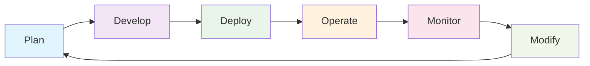

# 🚀 HashiCorp Terraform Associate Certification Training Program

## 📋 Module Overview

01. [Infrastructure as Code Concepts](#️-module-1-infrastructure-as-code-concepts)
02. [HashiCorp Introduction](#-module-2-hashicorp-introduction)  
03. [Terraform Basics](#-module-3-terraform-basics)
04. [Terraform Provisioners & Modern Infrastructure Configuration](#️-module-4-terraform-provisioners--modern-infrastructure-configuration)
05. [Terraform Providers](#-module-5-terraform-providers)
06. [Terraform Language](#-module-6-terraform-language)
07. [Variables and Data](#-module-7-variables-and-data)
08. [Meta Arguments](#-module-8-meta-arguments)
09. [Expressions](#-module-9-expressions)
10. [Terraform State](#-module-10-terraform-state)
11. [Initialization](#-module-11-initialization)
12. [Writing and Modifying](#️-module-12-writing-and-modifying)
13. [Plan and Apply](#-module-13-plan-and-apply)
14. [Resource Drift Management](#-module-14-resource-drift-management)
15. [Import and Refresh Operations](#-module-15-import-and-refresh-operations)
16. [Terraform Troubleshooting and Debugging](#-module-16-terraform-troubleshooting-and-debugging)
17. [Finding and Using Terraform Modules](#-module-17-finding-and-using-terraform-modules)
18. [Standard Module Structure and Development](#️-module-18-standard-module-structure-and-development)
19. [Publishing and Advanced Module Patterns](#-module-19-publishing-and-advanced-module-patterns)


## 📋 Course Prerequisites

### 🎯 Required Skills
Before starting this course, you should have:

- **🖥️ Basic Terminal/Command Line Skills**
  - Navigation (`cd`, `ls`, `pwd`)
  - File operations (`mkdir`, `rm`, `cp`, `mv`)
  - Text editing with `vscode`, or your preferred editor
  - Understanding of environment variables

- **☁️ Cloud Architecture Fundamentals**
  - Basic understanding of cloud concepts (compute, storage, networking)
  - Experience with at least one major cloud provider (AWS, Azure, or GCP)
  - Knowledge of basic infrastructure components (VMs, networks, security groups)

- **🛠️ Development Fundamentals**
  - Basic understanding of version control (Git)
  - Familiarity with JSON/YAML syntax
  - Basic scripting experience (Bash, PowerShell, or Python)

### 💻 Required Installations

#### Core Tools
```bash
# Terraform (Latest version)
# Visit: https://www.terraform.io/downloads.html
# Or use package manager:

# macOS
brew install terraform

# Windows (Chocolatey)
choco install terraform

# Linux (Ubuntu/Debian)
sudo apt-get update && sudo apt-get install -y gnupg software-properties-common curl
curl -fsSL https://apt.releases.hashicorp.com/gpg | sudo apt-key add -
sudo apt-add-repository "deb [arch=amd64] https://apt.releases.hashicorp.com $(lsb_release -cs) main"
sudo apt-get update && sudo apt-get install terraform
```

#### Code Editor (VS Code Required)
```bash
# Visual Studio Code - Download from https://code.visualstudio.com/
# Required Extensions:
code --install-extension HashiCorp.terraform
code --install-extension ms-vscode.vscode-json
code --install-extension redhat.vscode-yaml

# Optional but Recommended Extensions:
code --install-extension GitHub.copilot                    # AI assistance
code --install-extension ms-vscode.powershell             # PowerShell support
code --install-extension ms-vscode-remote.remote-ssh      # Remote development
code --install-extension eamodio.gitlens                  # Enhanced Git features
```

#### Cloud CLI Tools
```bash
# AWS CLI v2 (if using AWS)
curl "https://awscli.amazonaws.com/awscli-exe-linux-x86_64.zip" -o "awscliv2.zip"
unzip awscliv2.zip
sudo ./aws/install

# Azure CLI (if using Azure)
curl -sL https://aka.ms/InstallAzureCLIDeb | sudo bash

# Google Cloud SDK (if using GCP)
curl https://sdk.cloud.google.com | bash
exec -l $SHELL
```

#### Additional Tools
```bash
# Git (Version Control)
sudo apt-get install git  # Linux
brew install git          # macOS

# jq (JSON processor - helpful for parsing outputs)
sudo apt-get install jq   # Linux
brew install jq           # macOS

# curl (API testing)
# Usually pre-installed on most systems
```

### 🔐 Account Setup Required

- **HashiCorp Account**: Sign up at [HashiCorp Cloud Platform](https://portal.cloud.hashicorp.com/)
- **Cloud Provider Account**: At least one of:
  - AWS Free Tier Account
  - Azure Free Account  
  - Google Cloud Platform Free Tier
- **GitHub Account**: For version control and collaboration

---

## 🎯 Course Overview

### 🏆 Learning Outcomes
By the end of this course, you will be able to:

- ✅ **Understand Infrastructure as Code (IaC) concepts** and best practices
- ✅ **Master Terraform fundamentals** including syntax, workflow, and state management
- ✅ **Write, plan, and apply Terraform configurations** with confidence
- ✅ **Work with providers, resources, and data sources** effectively
- ✅ **Implement advanced Terraform features** like modules, expressions, and meta-arguments
- ✅ **Manage Terraform state** and understand state file operations
- ✅ **Use Terraform Cloud** for collaboration and remote operations
- ✅ **Use Terraform Modules** to create reusable infrastructure


### 📊 Course Structure

This course follows the official HashiCorp Terraform Associate exam objectives and is structured as follows:

| Module | Topic | Duration | Difficulty | Hands-On Labs |
|--------|-------|----------|------------|---------------|
| 1 | 🏗️ Infrastructure as Code Concepts | 2 hours | 🟢 Beginner | 2 labs |
| 2 | 🔷 HashiCorp Introduction | 1 hour | 🟢 Beginner | 1 lab |
| 3 | ⚡ Terraform Basics | 3 hours | 🟢 Beginner | 4 labs |
| 4 | 🛠️ Terraform Provisioners & Modern Infrastructure Configuration | 3 hours | 🟡 Intermediate | 5 labs |
| 5 | 🔌 Terraform Providers | 2 hours | 🟡 Intermediate | 2 labs |
| 6 | 📝 Terraform Language | 1.5 hours | 🟡 Intermediate | 2 labs |
| 7 | 📊 Variables and Data | 2.5 hours | 🟡 Intermediate | 3 labs |
| 8 | 🎯 Meta Arguments | 2 hours | 🟡 Intermediate | 3 labs |
| 9 | 🔧 Expressions | 2 hours | 🟡 Intermediate | 3 labs |
| 10 | 📁 Terraform State | 2.5 hours | 🟡 Intermediate | 3 labs |
| 11 | 🚀 Initialization | 1.5 hours | 🟡 Intermediate | 2 labs |
| 12 | ✍️ Writing and Modifying | 2 hours | 🟡 Intermediate | 3 labs |
| 13 | 🚀 Plan and Apply | 2.5 hours | 🟡 Intermediate | 4 labs |
| 14 | 🔄 Resource Drift Management | 1.5 hours | 🟡 Intermediate | 2 labs |
| 15 | 📥 Import and Refresh Operations | 2 hours | 🔴 Advanced | 3 labs |
| 16 | 🔧 Terraform Troubleshooting and Debugging | 1.5 hours | 🔴 Advanced | 2 labs |
| 17 | 📦 Finding and Using Terraform Modules | 2 hours | 🟡 Intermediate | 3 labs |
| 18 | 🏗️ Standard Module Structure and Development | 3 hours | 🔴 Advanced | 4 labs |
| 19 | 📝 Publishing and Advanced Module Patterns | 2.5 hours | 🔴 Advanced | 3 labs |
| 20 | 🚀 Terraform Workflows | 2 hours | 🟡 Intermediate | 4 labs |
| 21 | 🚀 Terraform Backends | 3 hours | 🟡 Intermediate | 6 labs |
| 22 | 📝 Resources and Complex Types | 2.5 hours | 🟡 Intermediate | 4 labs |
| 23 | 🚀 Built-In Functions | 2 hours | 🔴 Advanced | 4 labs |


**Total Course Time**: ~38 hours of content + ~55 hands-on labs

---

## 📚 Study Recommendations

### 🎯 Study Timeline by Experience Level

#### 🔰 **Beginner** (New to IaC, 30+ hours recommended)
- **Week 1-2**: Complete Modules 1-3 (Foundation building)
- **Week 3**: Complete Modules 4-6 (Core concepts)
- **Week 4**: Complete Modules 7-9 (Advanced topics)
- **Week 5**: Practice exams and review
- **Daily commitment**: 1-2 hours

#### 🎓 **Intermediate** (Some IaC experience, 15-20 hours recommended)
- **Week 1**: Complete Modules 1-5 (Quick foundation + focus areas)
- **Week 2**: Complete Modules 6-9 (Advanced concepts)
- **Week 3**: Practice exams and hands-on projects
- **Daily commitment**: 1.5 hours

#### 🚀 **Advanced** (Experienced with IaC/DevOps, 10-12 hours recommended)
- **Week 1**: Review Modules 1-6 (Focus on Terraform-specific concepts)
- **Week 2**: Deep dive Modules 7-9 + Practice exams
- **Daily commitment**: 1-2 hours

### 📖 Recommended Study Strategy

1. **🎬 Watch Module Content** - Understand concepts first
2. **💻 Complete Hands-On Labs** - Apply knowledge immediately  
3. **📝 Take Notes** - Document key commands and concepts
4. **🔄 Practice Regularly** - Repetition builds muscle memory
5. **🧪 Experiment** - Try variations of examples
6. **📊 Take Practice Exams** - Test your knowledge

### 📚 Additional Resources

#### Official Documentation
- [Terraform Documentation](https://www.terraform.io/docs)
- [HashiCorp Learn](https://learn.hashicorp.com/terraform)
- [HashiCorp Terraform Associate Questions](https://developer.hashicorp.com/terraform/tutorials/certification-003/associate-questions)
- [Terraform Registry](https://registry.terraform.io/)

#### Community Resources
- [Terraform Best Practices](https://www.terraform-best-practices.com/)
- [Terraform AWS Examples](https://github.com/terraform-aws-modules)
- [r/Terraform Subreddit](https://www.reddit.com/r/Terraform/)

---

## 🗓️ Module Structure & Learning Objectives

### 📋 Learning Approach
Each module follows this proven structure:
- **🎯 Learning Objectives** - Clear goals for the module
- **📖 Concept Introduction** - Theory and background
- **💡 Pro Tips** - Expert insights and best practices  
- **💻 Hands-On Exercises** - Practical application
- **✅ Knowledge Check** - Validate understanding
- **🎯 Module Summary** - Key takeaways

---

## 🏗️ Module 1: Infrastructure as Code Concepts
*Duration: 2 hours | Labs: 2*

### 🎯 Learning Objectives
By the end of this module, you will be able to:
- ✅ Define Infrastructure as Code and explain its benefits
- ✅ Compare declarative vs imperative approaches
- ✅ Understand infrastructure lifecycle management
- ✅ Explain idempotency and its importance
- ✅ Distinguish between provisioning, deployment, and orchestration
- ✅ Identify configuration drift and mitigation strategies
- ✅ Compare mutable vs immutable infrastructure
- ✅ Understand GitOps principles

### 📚 Topics Covered

#### 🔍 What is Infrastructure as Code?
Infrastructure as Code (IaC) is the practice of managing and provisioning computing infrastructure through machine-readable definition files, rather than physical hardware configuration or interactive configuration tools.

**🔑 Key Benefits:**
- **⚡ Speed & Efficiency**: Automated provisioning vs manual setup
- **🔄 Consistency**: Eliminates configuration drift
- **📋 Documentation**: Infrastructure becomes self-documenting
- **🔄 Version Control**: Track changes and rollback capabilities
- **💰 Cost Management**: Better resource optimization
- **🔒 Security**: Standardized security configurations

#### 🛠️ Popular Infrastructure as Code Tools

| Tool | Type | Cloud Focus | Language |
|------|------|-------------|----------|
| **Terraform** | Declarative | Multi-cloud | HCL |
| **CloudFormation** | Declarative | AWS-only | JSON/YAML |
| **Azure ARM** | Declarative | Azure-only | JSON |
| **Pulumi** | Imperative | Multi-cloud | Multiple |
| **Ansible** | Declarative | Multi-cloud | YAML |

💡 **Pro Tip**: Terraform's cloud-agnostic approach makes it the most versatile choice for multi-cloud strategies!

#### 📋 Declarative vs Imperative

**🎯 Declarative Approach** (Terraform's approach):
```hcl
# You declare WHAT you want
resource "aws_instance" "web" {
  ami           = "ami-0c02fb55956c7d316"
  instance_type = "t2.micro"
  
  tags = {
    Name = "WebServer"
  }
}
```

**⚙️ Imperative Approach**:
```bash
# You specify HOW to do it
aws ec2 run-instances \
  --image-id ami-0c02fb55956c7d316 \
  --instance-type t2.micro \
  --tag-specifications 'ResourceType=instance,Tags=[{Key=Name,Value=WebServer}]'
```

#### 🔄 Infrastructure Lifecycle



**🎯 Lifecycle Advantages:**

- **🔄 Repeatable**: Same process every time
- **📊 Predictable**: Known outcomes and timelines
- **🔍 Auditable**: Every change is tracked
- **⚡ Scalable**: Process works for 1 or 1000 resources

#### 🗓️ Infrastructure Lifecycle: Day Zero, One, and Two

The transcript emphasizes a **simplified 3-phase approach** to infrastructure lifecycle:

**📅 Phase Zero - Planning & Design Phase**

```hcl
# Example: Initial planning configuration
terraform {
  required_version = ">= 1.0"
  required_providers {
    aws = {
      source  = "hashicorp/aws"
      version = "~> 6.11.0"
    }
  }
}

# Planning the infrastructure architecture
locals {
  environment = "production"
  region      = "us-west-2"
  
  # Day Zero: Define what we need
  infrastructure_requirements = {
    compute_instances = 3
    database_required = true
    load_balancer     = true
  }
}
```

**🔨 Phase One - Development & Iteration Phase**
```hcl
# Phase One: Implementing and testing the infrastructure
resource "aws_instance" "web" {
  count         = local.infrastructure_requirements.compute_instances
  ami           = "ami-0c02fb55956c7d316"
  instance_type = "t2.micro"
  
  # Iterating and testing configurations
  tags = {
    Name        = "WebServer-${count.index + 1}"
    Environment = local.environment
    Phase       = "day-one-testing"
  }
}

# Testing with terraform plan/apply cycles
```

**🚀 Phase Two - Production & Maintenance Phase**
```hcl
# Phase Two: Production-ready with monitoring and maintenance
resource "aws_instance" "production_web" {
  count                  = local.infrastructure_requirements.compute_instances
  ami                   = "ami-0c02fb55956c7d316"
  instance_type         = "t2.medium"  # Upgraded for production
  monitoring            = true
  disable_api_termination = true      # Production protection
  
  tags = {
    Name        = "ProdWebServer-${count.index + 1}"
    Environment = "production"
    Phase       = "day-two-live"
    Backup      = "daily"
  }
}
```

💡 **Pro Tip**: IaC starts on **Day Zero**! The earlier you involve infrastructure as code in your project, the better your outcomes will be.

⚠️ **Important**: These broad phases represent the typical phases of your infrastructure project lifecycle.

#### 🎯 Idempotency Explained

**❌ Non-Idempotent Example**:
```bash
# Running this twice creates two instances!
aws ec2 run-instances --image-id ami-12345 --instance-type t2.micro
```

**✅ Idempotent Example**:
```hcl
# Running terraform apply multiple times = same result
resource "aws_instance" "web" {
  ami           = "ami-12345"
  instance_type = "t2.micro"
}
```

💡 **Pro Tip**: Idempotency means you can run the same operation multiple times with the same result - no duplicates, no errors!

#### 🔄 Configuration Drift Management

**Configuration Drift** occurs when the actual infrastructure differs from what's defined in your IaC configuration files.

**❌ Common Drift Scenarios:**

```bash
# Someone manually modifies resources in AWS Console
aws ec2 modify-instance-attribute --instance-id i-1234567890abcdef0 --instance-type t2.large

# Security team adds manual firewall rules
aws ec2 authorize-security-group-ingress --group-id sg-12345678 --protocol tcp --port 3306

# Database admin changes RDS settings manually
aws rds modify-db-instance --db-instance-identifier mydb --allocated-storage 200
```

**✅ Terraform's Drift Detection:**

```hcl
# Your Terraform configuration
resource "aws_instance" "web" {
  ami           = "ami-0c02fb55956c7d316"
  instance_type = "t2.micro"  # Original configuration
  
  tags = {
    Name = "WebServer"
  }
}

# After manual change, Terraform detects drift
# terraform plan will show:
# ~ instance_type = "t2.large" -> "t2.micro" (drift detected)
```

**🔧 Drift Remediation Commands:**

```bash
# 1. Detect drift
terraform plan

# 2. Fix drift (apply desired state)
terraform apply

# 3. Import manually created resources
terraform import aws_instance.manual i-1234567890abcdef0

# 4. Refresh state to detect changes
terraform refresh
```

🎯 **Key Insight**: Terraform is **exceptionally good at drift detection and remediation** compared to other IaC tools - this is one of its major strengths!

### 💻 **Exercise 1.1**: IaC Concepts Quiz
**Duration**: 15 minutes

Answer these questions to test your understanding:

1. **What is the main advantage of declarative over imperative IaC?**
   - A) Faster execution
   - B) You specify what you want, not how to get it
   - C) Better error handling
   - D) More programming languages supported

2. **Which scenario demonstrates idempotency?**
   - A) Running a script that creates a new file each time
   - B) Running a command that ensures a service is started (no change if already started)
   - C) Deleting all files in a directory
   - D) Adding a new user account

3. **What is configuration drift?**
   - A) Moving infrastructure between regions
   - B) When actual infrastructure differs from the defined configuration
   - C) Network latency issues
   - D) Version control conflicts

<details>
<summary>🔍 Click for Answers</summary>

1. **B** - Declarative IaC lets you specify the desired end state
2. **B** - Idempotent operations produce the same result regardless of how many times they're run
3. **B** - Configuration drift occurs when manual changes cause actual infrastructure to differ from IaC definitions

</details>

### 💻 **Exercise 1.2**: Infrastructure Lifecycle Planning
**Duration**: 30 minutes

**Scenario**: Your company wants to migrate from manual server provisioning to IaC.

**Task**: Create a migration plan that addresses:

1. **📋 Current State Assessment**
   - List 3 problems with manual provisioning
   - Identify infrastructure components to migrate

2. **🎯 Target State Design**
   - Choose IaC tool and justify your choice
   - Define success criteria

3. **🗺️ Migration Strategy**
   - Plan the migration phases
   - Identify risks and mitigation strategies

**📝 Template**:
```markdown
## Migration Plan: Manual to IaC

### Current State Problems
1. 
2. 
3. 

### Target State
- **IaC Tool**: [Your choice]
- **Justification**: 
- **Success Criteria**:
  - [ ] 
  - [ ] 
  - [ ] 

### Migration Phases
**Phase 1**: 
**Phase 2**: 
**Phase 3**: 

### Risk Mitigation
| Risk | Impact | Mitigation |
|------|---------|------------|
|      |         |            |
```

---

## ✅ Module 1 Summary

### 🎯 Key Takeaways
- **🏗️ IaC transforms infrastructure management** from manual to automated
- **📋 Declarative approach** focuses on desired state, not steps
- **🔄 Idempotency ensures consistency** and prevents duplicate resources
- **⚡ Infrastructure lifecycle** provides structure and repeatability
- **🎯 GitOps principles** bring software development practices to infrastructure

### 🔑 Essential Commands Learned
```bash
# Verification commands you should know
terraform version    # Check Terraform installation
which terraform     # Locate Terraform binary
echo $PATH          # Verify PATH includes Terraform
```

### 💡 Pro Tips Recap
- Always prefer declarative over imperative for infrastructure
- Idempotency is your friend - embrace it!
- Configuration drift is the enemy - detect and prevent it
- Infrastructure should be treated like application code

---

**🎉 Congratulations!** You've completed Module 1. You now understand the fundamental concepts that make Infrastructure as Code so powerful. 

**➡️ Ready for Module 2?** Let me know when you'd like to continue with the HashiCorp Introduction module!

---
