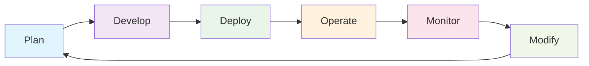

## 🏗️ Module 1: Infrastructure as Code Concepts
*Duration: 2 hours | Labs: 2*

### 🎯 Learning Objectives
By the end of this module, you will be able to:
- ✅ Define Infrastructure as Code and explain its benefits
- ✅ Compare declarative vs imperative approaches
- ✅ Understand infrastructure lifecycle management
- ✅ Explain idempotency and its importance
- ✅ Distinguish between provisioning, deployment, and orchestration
- ✅ Identify configuration drift and mitigation strategies
- ✅ Compare mutable vs immutable infrastructure
- ✅ Understand GitOps principles

### 📚 Topics Covered

#### 🔍 What is Infrastructure as Code?
Infrastructure as Code (IaC) is the practice of managing and provisioning computing infrastructure through machine-readable definition files, rather than physical hardware configuration or interactive configuration tools.

**🔑 Key Benefits:**
- **⚡ Speed & Efficiency**: Automated provisioning vs manual setup
- **🔄 Consistency**: Eliminates configuration drift
- **📋 Documentation**: Infrastructure becomes self-documenting
- **🔄 Version Control**: Track changes and rollback capabilities
- **💰 Cost Management**: Better resource optimization
- **🔒 Security**: Standardized security configurations

#### 🛠️ Popular Infrastructure as Code Tools

| Tool | Type | Cloud Focus | Language |
|------|------|-------------|----------|
| **Terraform** | Declarative | Multi-cloud | HCL |
| **CloudFormation** | Declarative | AWS-only | JSON/YAML |
| **Azure ARM** | Declarative | Azure-only | JSON |
| **Pulumi** | Imperative | Multi-cloud | Multiple |
| **Ansible** | Declarative | Multi-cloud | YAML |

💡 **Pro Tip**: Terraform's cloud-agnostic approach makes it the most versatile choice for multi-cloud strategies!

#### 📋 Declarative vs Imperative

**🎯 Declarative Approach** (Terraform's approach):
```hcl
# You declare WHAT you want
resource "aws_instance" "web" {
  ami           = "ami-0c02fb55956c7d316"
  instance_type = "t2.micro"
  
  tags = {
    Name = "WebServer"
  }
}
```

**⚙️ Imperative Approach**:
```bash
# You specify HOW to do it
aws ec2 run-instances \
  --image-id ami-0c02fb55956c7d316 \
  --instance-type t2.micro \
  --tag-specifications 'ResourceType=instance,Tags=[{Key=Name,Value=WebServer}]'
```

#### 🔄 Infrastructure Lifecycle



**🎯 Lifecycle Advantages:**

- **🔄 Repeatable**: Same process every time
- **📊 Predictable**: Known outcomes and timelines
- **🔍 Auditable**: Every change is tracked
- **⚡ Scalable**: Process works for 1 or 1000 resources

#### 🗓️ Infrastructure Lifecycle: Day Zero, One, and Two

The transcript emphasizes a **simplified 3-phase approach** to infrastructure lifecycle:

**📅 Phase Zero - Planning & Design Phase**

```hcl
# Example: Initial planning configuration
terraform {
  required_version = ">= 1.0"
  required_providers {
    aws = {
      source  = "hashicorp/aws"
      version = "~> 6.11.0"
    }
  }
}

# Planning the infrastructure architecture
locals {
  environment = "production"
  region      = "us-west-2"
  
  # Day Zero: Define what we need
  infrastructure_requirements = {
    compute_instances = 3
    database_required = true
    load_balancer     = true
  }
}
```

**🔨 Phase One - Development & Iteration Phase**
```hcl
# Phase One: Implementing and testing the infrastructure
resource "aws_instance" "web" {
  count         = local.infrastructure_requirements.compute_instances
  ami           = "ami-0c02fb55956c7d316"
  instance_type = "t2.micro"
  
  # Iterating and testing configurations
  tags = {
    Name        = "WebServer-${count.index + 1}"
    Environment = local.environment
    Phase       = "day-one-testing"
  }
}

# Testing with terraform plan/apply cycles
```

**🚀 Phase Two - Production & Maintenance Phase**
```hcl
# Phase Two: Production-ready with monitoring and maintenance
resource "aws_instance" "production_web" {
  count                  = local.infrastructure_requirements.compute_instances
  ami                   = "ami-0c02fb55956c7d316"
  instance_type         = "t2.medium"  # Upgraded for production
  monitoring            = true
  disable_api_termination = true      # Production protection
  
  tags = {
    Name        = "ProdWebServer-${count.index + 1}"
    Environment = "production"
    Phase       = "day-two-live"
    Backup      = "daily"
  }
}
```

💡 **Pro Tip**: IaC starts on **Day Zero**! The earlier you involve infrastructure as code in your project, the better your outcomes will be.

⚠️ **Important**: These broad phases represent the typical phases of your infrastructure project lifecycle.

#### 🎯 Idempotency Explained

**❌ Non-Idempotent Example**:
```bash
# Running this twice creates two instances!
aws ec2 run-instances --image-id ami-12345 --instance-type t2.micro
```

**✅ Idempotent Example**:
```hcl
# Running terraform apply multiple times = same result
resource "aws_instance" "web" {
  ami           = "ami-12345"
  instance_type = "t2.micro"
}
```

💡 **Pro Tip**: Idempotency means you can run the same operation multiple times with the same result - no duplicates, no errors!

#### 🔄 Configuration Drift Management

**Configuration Drift** occurs when the actual infrastructure differs from what's defined in your IaC configuration files.

**❌ Common Drift Scenarios:**

```bash
# Someone manually modifies resources in AWS Console
aws ec2 modify-instance-attribute --instance-id i-1234567890abcdef0 --instance-type t2.large

# Security team adds manual firewall rules
aws ec2 authorize-security-group-ingress --group-id sg-12345678 --protocol tcp --port 3306

# Database admin changes RDS settings manually
aws rds modify-db-instance --db-instance-identifier mydb --allocated-storage 200
```

**✅ Terraform's Drift Detection:**

```hcl
# Your Terraform configuration
resource "aws_instance" "web" {
  ami           = "ami-0c02fb55956c7d316"
  instance_type = "t2.micro"  # Original configuration
  
  tags = {
    Name = "WebServer"
  }
}

# After manual change, Terraform detects drift
# terraform plan will show:
# ~ instance_type = "t2.large" -> "t2.micro" (drift detected)
```

**🔧 Drift Remediation Commands:**

```bash
# 1. Detect drift
terraform plan

# 2. Fix drift (apply desired state)
terraform apply

# 3. Import manually created resources
terraform import aws_instance.manual i-1234567890abcdef0

# 4. Refresh state to detect changes
terraform refresh
```

🎯 **Key Insight**: Terraform is **exceptionally good at drift detection and remediation** compared to other IaC tools - this is one of its major strengths!

### 💻 **Exercise 1.1**: IaC Concepts Quiz
**Duration**: 15 minutes

Answer these questions to test your understanding:

1. **What is the main advantage of declarative over imperative IaC?**
   - A) Faster execution
   - B) You specify what you want, not how to get it
   - C) Better error handling
   - D) More programming languages supported

2. **Which scenario demonstrates idempotency?**
   - A) Running a script that creates a new file each time
   - B) Running a command that ensures a service is started (no change if already started)
   - C) Deleting all files in a directory
   - D) Adding a new user account

3. **What is configuration drift?**
   - A) Moving infrastructure between regions
   - B) When actual infrastructure differs from the defined configuration
   - C) Network latency issues
   - D) Version control conflicts

<details>
<summary>🔍 Click for Answers</summary>

1. **B** - Declarative IaC lets you specify the desired end state
2. **B** - Idempotent operations produce the same result regardless of how many times they're run
3. **B** - Configuration drift occurs when manual changes cause actual infrastructure to differ from IaC definitions

</details>

### 💻 **Exercise 1.2**: Infrastructure Lifecycle Planning
**Duration**: 30 minutes

**Scenario**: Your company wants to migrate from manual server provisioning to IaC.

**Task**: Create a migration plan that addresses:

1. **📋 Current State Assessment**
   - List 3 problems with manual provisioning
   - Identify infrastructure components to migrate

2. **🎯 Target State Design**
   - Choose IaC tool and justify your choice
   - Define success criteria

3. **🗺️ Migration Strategy**
   - Plan the migration phases
   - Identify risks and mitigation strategies

**📝 Template**:
```markdown
## Migration Plan: Manual to IaC

### Current State Problems
1. 
2. 
3. 

### Target State
- **IaC Tool**: [Your choice]
- **Justification**: 
- **Success Criteria**:
  - [ ] 
  - [ ] 
  - [ ] 

### Migration Phases
**Phase 1**: 
**Phase 2**: 
**Phase 3**: 

### Risk Mitigation
| Risk | Impact | Mitigation |
|------|---------|------------|
|      |         |            |
```

---

## ✅ Module 1 Summary

### 🎯 Key Takeaways
- **🏗️ IaC transforms infrastructure management** from manual to automated
- **📋 Declarative approach** focuses on desired state, not steps
- **🔄 Idempotency ensures consistency** and prevents duplicate resources
- **⚡ Infrastructure lifecycle** provides structure and repeatability
- **🎯 GitOps principles** bring software development practices to infrastructure

### 🔑 Essential Commands Learned
```bash
# Verification commands you should know
terraform version    # Check Terraform installation
which terraform     # Locate Terraform binary
echo $PATH          # Verify PATH includes Terraform
```

### 💡 Pro Tips Recap
- Always prefer declarative over imperative for infrastructure
- Idempotency is your friend - embrace it!
- Configuration drift is the enemy - detect and prevent it
- Infrastructure should be treated like application code

---

**🎉 Congratulations!** You've completed Module 1. You now understand the fundamental concepts that make Infrastructure as Code so powerful.

---

## 🔗 **Next Steps**

Ready to continue your Terraform journey? Proceed to the next module:

**➡️ [Module 2: HashiCorp Introduction](./module_02_hashicorp_introduction.md)**

Learn about HashiCorp's ecosystem, tools, and how Terraform fits into the broader infrastructure automation landscape.

---
