# 🏗️ Module 01: Infrastructure as Code Concepts

*Duration: 1.5 hours | Labs: 0 | Difficulty: 🟢 Beginner*
---

### 🎯 Learning Objectives
By the end of this module, you will be able to:
- ✅ Define Infrastructure as Code and explain its benefits
- ✅ Compare declarative vs imperative approaches
- ✅ Understand infrastructure lifecycle management
- ✅ Explain idempotency and its importance
- ✅ Distinguish between provisioning, deployment, and orchestration
- ✅ Identify configuration drift and mitigation strategies
- ✅ Compare mutable vs immutable infrastructure
- ✅ Understand GitOps principles

### 📚 Topics Covered

#### 🔍 What is Infrastructure as Code?
Infrastructure as Code (IaC) is the practice of managing and provisioning computing infrastructure through machine-readable definition files, rather than physical hardware configuration or interactive configuration tools.

**🔑 Key Benefits:**
- **⚡ Speed & Efficiency**: Automated provisioning vs manual setup
- **🔄 Consistency**: Eliminates configuration drift
- **📋 Documentation**: Infrastructure becomes self-documenting
- **🔄 Version Control**: Track changes and rollback capabilities
- **💰 Cost Management**: Better resource optimization
- **🔒 Security**: Standardized security configurations

#### 🛠️ Popular Infrastructure as Code Tools

| Tool | Type | Cloud Focus | Language |
|------|------|-------------|----------|
| **Terraform** | Declarative | Multi-cloud | HCL |
| **CloudFormation** | Declarative | AWS-only | JSON/YAML |
| **Azure ARM** | Declarative | Azure-only | JSON |
| **Pulumi** | Imperative | Multi-cloud | Multiple |
| **Ansible** | Declarative | Multi-cloud | YAML |

💡 **Pro Tip**: Terraform's cloud-agnostic approach makes it the most versatile choice for multi-cloud strategies!

#### 📋 Declarative vs Imperative

**🎯 Declarative Approach** (Terraform's approach):
```hcl
# You declare WHAT you want
resource "aws_instance" "web" {
  ami           = "ami-0c02fb55956c7d316"
  instance_type = "t2.micro"
  
  tags = {
    Name = "WebServer"
  }
}
```

**⚙️ Imperative Approach**:
```bash
# You specify HOW to do it
aws ec2 run-instances \
  --image-id ami-0c02fb55956c7d316 \
  --instance-type t2.micro \
  --tag-specifications 'ResourceType=instance,Tags=[{Key=Name,Value=WebServer}]'
```

#### 🏛️ The Evolution of Infrastructure Management

Understanding how infrastructure management has evolved helps us appreciate why Infrastructure as Code emerged and became essential for modern operations.

**Infrastructure Management Evolution Timeline:**


**📚 Learn More:**
- 🔗 [The History of Infrastructure Management](https://www.redhat.com/en/topics/automation/what-is-infrastructure-as-code-iac)
- 🔗 [Evolution of IT Operations](https://www.atlassian.com/devops/what-is-devops/history-of-devops)

#### 🐕 vs 🐄 Pets vs Cattle: A Fundamental Paradigm Shift

The "Pets vs Cattle" analogy, popularized by Randy Bias, perfectly illustrates the shift from traditional to modern infrastructure management approaches.

**Pets vs Cattle Infrastructure Comparison:**

```mermaid
graph TB
    subgraph "🐕 Traditional 'Pets' Approach"
        PETS_CHAR["🏷️ Characteristics<br/>• Named servers (web01, db02)<br/>• Unique configurations<br/>• Lovingly maintained<br/>• Irreplaceable<br/>• Manual updates"]
        PETS_PROBLEMS["❌ Problems<br/>• Snowflake servers<br/>• Configuration drift<br/>• Single points of failure<br/>• Difficult to scale<br/>• High maintenance cost"]
        PETS_EXAMPLE["📝 Example<br/>SSH into web01<br/>sudo apt update<br/>vim /etc/nginx/nginx.conf<br/>systemctl restart nginx<br/>'Hope nothing breaks!'"]
    end
    
    subgraph "🐄 Modern 'Cattle' Approach"
        CATTLE_CHAR["🏷️ Characteristics<br/>• Numbered instances (web-001, web-002)<br/>• Identical configurations<br/>• Disposable & replaceable<br/>• Automated provisioning<br/>• Immutable updates"]
        CATTLE_BENEFITS["✅ Benefits<br/>• Consistent environments<br/>• Easy horizontal scaling<br/>• Fault tolerance<br/>• Rapid recovery<br/>• Lower operational cost"]
        CATTLE_EXAMPLE["📝 Example<br/>terraform apply<br/>Auto Scaling Group creates<br/>identical instances from<br/>golden AMI template<br/>'Consistent every time!'"]
    end
    
    PETS_CHAR --> PETS_PROBLEMS
    PETS_PROBLEMS --> PETS_EXAMPLE
    
    CATTLE_CHAR --> CATTLE_BENEFITS
    CATTLE_BENEFITS --> CATTLE_EXAMPLE
    
    style PETS_CHAR fill:#ffebee
    style PETS_PROBLEMS fill:#ffcdd2
    style CATTLE_CHAR fill:#e8f5e8
    style CATTLE_BENEFITS fill:#c8e6c9
```


**🐕 Traditional "Pets" Example (What NOT to do):**
```bash
#!/bin/bash
# Traditional manual server setup - AVOID THIS APPROACH!

# SSH into each server individually
ssh admin@web01.company.com

# Manual package installation (varies by server)
sudo apt update
sudo apt install nginx -y

# Manual configuration (prone to human error)
sudo vim /etc/nginx/sites-available/default
# Each admin configures slightly differently!

# Manual SSL certificate installation
sudo certbot --nginx -d example.com
# Different expiry dates, different renewal processes

# Manual application deployment
cd /var/www/html
sudo git pull origin main  # What if git isn't configured?
sudo systemctl restart nginx

# Result: Each server is slightly different (snowflake servers)
# Problems: Configuration drift, difficult maintenance, no consistency
```

**🐄 Modern "Cattle" Example (IaC Approach):**
```hcl
# Modern Infrastructure as Code - RECOMMENDED APPROACH!

# Terraform configuration for identical, replaceable infrastructure
resource "aws_launch_template" "web_server" {
  name_prefix   = "web-server-"
  image_id      = data.aws_ami.app_ami.id  # Golden AMI with app pre-installed
  instance_type = "t3.micro"
  
  # Every instance gets identical configuration
  vpc_security_group_ids = [aws_security_group.web.id]
  
  # User data script ensures consistent setup
  user_data = base64encode(templatefile("${path.module}/user_data.sh", {
    app_version    = var.app_version
    database_url   = aws_rds_instance.main.endpoint
    ssl_cert_arn   = aws_acm_certificate.main.arn
  }))
  
  tag_specifications {
    resource_type = "instance"
    tags = {
      Name        = "web-server"  # Will be numbered automatically
      Environment = var.environment
      ManagedBy   = "terraform"   # Clear ownership
      Replaceable = "true"        # Cattle mindset!
    }
  }
}

# Auto Scaling Group creates identical, replaceable instances
resource "aws_autoscaling_group" "web" {
  name                = "web-servers"
  vpc_zone_identifier = var.private_subnet_ids
  target_group_arns   = [aws_lb_target_group.web.arn]
  
  min_size         = 2  # Minimum cattle in the herd
  max_size         = 10 # Maximum cattle in the herd
  desired_capacity = 3  # Desired cattle in the herd
  
  # Launch template ensures every instance is identical
  launch_template {
    id      = aws_launch_template.web_server.id
    version = "$Latest"  # Always use latest configuration
  }
  
  # Automatic replacement of unhealthy instances
  health_check_type         = "ELB"
  health_check_grace_period = 300
  
  # Rolling updates maintain service availability
  instance_refresh {
    strategy = "Rolling"
    preferences {
      min_healthy_percentage = 50  # Always keep half the herd healthy
    }
  }
  
  tag {
    key                 = "Name"
    value               = "web-server-asg"
    propagate_at_launch = false
  }
}

# Result: Identical, replaceable, scalable infrastructure
# Benefits: Consistency, scalability, fault tolerance, easy updates
```

**📚 Learn More:**
- 🔗 [Pets vs Cattle - The Original Blog Post](https://cloudscaling.com/blog/cloud-computing/the-history-of-pets-vs-cattle/)
- 🔗 [Immutable Infrastructure Patterns](https://www.hashicorp.com/resources/what-is-mutable-vs-immutable-infrastructure)

#### ♻️ Complete Infrastructure Lifecycle (Cradle to Grave)

Modern infrastructure follows a complete lifecycle from initial planning through final decommissioning. Understanding this lifecycle helps you apply IaC principles at every stage.

**Complete Infrastructure Lifecycle:**

```mermaid
flowchart TD
    subgraph "🎯 Planning Phase"
        PLAN_START["📋 Requirements Gathering<br/>• Business requirements<br/>• Technical specifications<br/>• Compliance needs<br/>• Budget constraints"]
        DESIGN["🏗️ Architecture Design<br/>• Infrastructure blueprints<br/>• Network topology<br/>• Security architecture<br/>• Disaster recovery planning"]
        CAPACITY["📊 Capacity Planning<br/>• Performance requirements<br/>• Scalability projections<br/>• Resource estimation<br/>• Cost modeling"]
    end
    
    subgraph "🚀 Provisioning Phase"
        PROVISION["⚡ Resource Provisioning<br/>• Cloud resource creation<br/>• Network setup<br/>• Security group configuration<br/>• Identity and access management"]
        CONFIGURE["🔧 Configuration Management<br/>• Operating system setup<br/>• Application installation<br/>• Service configuration<br/>• Monitoring agent deployment"]
        VALIDATE["✅ Validation & Testing<br/>• Infrastructure testing<br/>• Security scanning<br/>• Performance benchmarking<br/>• Compliance verification"]
    end
    
    subgraph "🔄 Operation Phase"
        MONITOR["📊 Monitoring & Alerting<br/>• Performance monitoring<br/>• Health checks<br/>• Log aggregation<br/>• Alert management"]
        MAINTAIN["🛠️ Maintenance & Updates<br/>• Security patching<br/>• Software updates<br/>• Configuration changes<br/>• Backup management"]
        OPTIMIZE["⚡ Optimization<br/>• Performance tuning<br/>• Cost optimization<br/>• Resource right-sizing<br/>• Automation improvements"]
    end
    
    subgraph "📈 Evolution Phase"
        SCALE["📈 Scaling Operations<br/>• Horizontal scaling<br/>• Vertical scaling<br/>• Geographic expansion<br/>• Multi-region deployment"]
        UPGRADE["🔄 Technology Upgrades<br/>• Platform migrations<br/>• Version upgrades<br/>• Architecture evolution<br/>• Feature additions"]
        ADAPT["🎯 Adaptation<br/>• Business requirement changes<br/>• Technology shifts<br/>• Compliance updates<br/>• Market demands"]
    end
    
    subgraph "🗑️ Decommissioning Phase"
        MIGRATE["📦 Data Migration<br/>• Data backup<br/>• System migration<br/>• Service transition<br/>• User communication"]
        CLEANUP["🧹 Resource Cleanup<br/>• Resource termination<br/>• DNS cleanup<br/>• Certificate revocation<br/>• Access removal"]
        ARCHIVE["📚 Documentation & Archive<br/>• Final documentation<br/>• Lessons learned<br/>• Audit trail preservation<br/>• Knowledge transfer"]
    end
    
    %% Phase connections
    PLAN_START --> DESIGN
    DESIGN --> CAPACITY
    CAPACITY --> PROVISION
    
    PROVISION --> CONFIGURE
    CONFIGURE --> VALIDATE
    VALIDATE --> MONITOR
    
    MONITOR --> MAINTAIN
    MAINTAIN --> OPTIMIZE
    OPTIMIZE --> SCALE
    
    SCALE --> UPGRADE
    UPGRADE --> ADAPT
    ADAPT --> MIGRATE
    
    MIGRATE --> CLEANUP
    CLEANUP --> ARCHIVE
    
    %% Feedback loops
    MONITOR -.-> PLAN_START
    OPTIMIZE -.-> DESIGN
    ADAPT -.-> CAPACITY
    ARCHIVE -.-> PLAN_START
    
    style PLAN_START fill:#e3f2fd
    style PROVISION fill:#e8f5e8
    style MONITOR fill:#fff3e0
    style SCALE fill:#f3e5f5
    style CLEANUP fill:#ffebee
```


**🎯 Lifecycle Phase Examples with IaC:**

**1. Planning Phase:**
```hcl
# infrastructure/planning/requirements.tf
# Planning phase: Define infrastructure requirements as code

locals {
  # Business requirements translated to technical specs
  project_name = "ecommerce-platform"
  environment  = "production"
  
  # Capacity planning based on business projections
  infrastructure_requirements = {
    # Web tier capacity planning
    web_tier = {
      min_instances     = 2   # High availability minimum
      max_instances     = 20  # Black Friday scaling capacity
      instance_type     = "t3.medium"
      target_cpu_usage  = 70  # Scaling trigger
    }
    
    # Database tier planning
    database_tier = {
      engine         = "postgres"
      version        = "14.9"
      instance_class = "db.t3.large"
      storage_gb     = 500
      backup_days    = 30
      multi_az       = true  # High availability requirement
    }
    
    # Security requirements
    security_requirements = {
      encryption_at_rest     = true
      encryption_in_transit  = true
      vpc_isolation         = true
      waf_protection        = true
    }
  }
  
  # Cost planning and budgets
  monthly_budget_usd = 2000
  
  # Compliance requirements
  compliance_frameworks = ["SOC2", "PCI-DSS"]
}
```

**2. Decommissioning Phase:**
```hcl
# infrastructure/decommissioning/cleanup.tf
# Decommissioning phase: Safe resource cleanup

# Data backup before decommissioning
resource "aws_db_snapshot" "final_backup" {
  count                          = var.create_final_backup ? 1 : 0
  db_instance_identifier         = aws_db_instance.main.id
  db_snapshot_identifier         = "${aws_db_instance.main.id}-final-backup-${formatdate("YYYY-MM-DD-hhmm", timestamp())}"
  
  tags = {
    Phase       = "decommissioning"
    Purpose     = "final-backup"
    RetainUntil = timeadd(timestamp(), "2160h") # 90 days retention
  }
}

# Graceful application shutdown
resource "aws_autoscaling_group" "web" {
  # Decommissioning: Graceful scale-down
  min_size         = var.decommissioning_mode ? 0 : 2
  max_size         = var.decommissioning_mode ? 0 : 20
  desired_capacity = var.decommissioning_mode ? 0 : 2
  
  # Lifecycle hook for graceful shutdown
  initial_lifecycle_hook {
    name                 = "graceful-shutdown"
    default_result       = "ABANDON"
    heartbeat_timeout    = 300
    lifecycle_transition = "autoscaling:EC2_INSTANCE_TERMINATING"
  }
}

# Output decommissioning checklist
output "decommissioning_checklist" {
  value = var.decommissioning_mode ? [
    "✅ Final backup created: ${try(aws_db_snapshot.final_backup[0].id, "N/A")}",
    "✅ Auto Scaling Group scaled to 0",
    "✅ DNS records removed",
    "✅ SSL certificates cleaned up",
    "⚠️  Manual verification needed:",
    "   - Remove any manual security group rules",
    "   - Verify no manual EBS volumes remain",
    "   - Check for any manual Route53 entries"
  ] : []
}
```

**📚 Learn More:**
- 🔗 [Infrastructure Lifecycle Best Practices](https://cloud.google.com/architecture/framework/system-design/lifecycle)
- 🔗 [AWS Well-Architected Framework](https://aws.amazon.com/architecture/well-architected/)

#### 🔄 Mutable vs Immutable Infrastructure

One of the most important concepts in modern infrastructure management is the shift from mutable to immutable infrastructure patterns.

**Mutable vs Immutable Infrastructure Patterns:**

```mermaid
graph TB
    subgraph "🔧 Mutable Infrastructure (Traditional)"
        MUT_SERVER["🖥️ Long-Lived Servers<br/>• Update in place<br/>• Patch and modify<br/>• Accumulate changes<br/>• Configuration drift risk"]
        MUT_UPDATE["🔄 Update Process<br/>• SSH into server<br/>• Apply patches<br/>• Modify configuration<br/>• Restart services<br/>• Hope nothing breaks"]
        MUT_PROBLEMS["❌ Problems<br/>• Configuration drift<br/>• Snowflake servers<br/>• Difficult rollbacks<br/>• Inconsistent environments<br/>• Hard to debug issues"]
    end
    
    subgraph "🏗️ Immutable Infrastructure (Modern)"
        IMMUT_SERVER["🖥️ Disposable Servers<br/>• Replace entire server<br/>• Never modify in place<br/>• Fresh deployment<br/>• Consistent every time"]
        IMMUT_UPDATE["🔄 Update Process<br/>• Build new server image<br/>• Deploy new instances<br/>• Route traffic gradually<br/>• Terminate old instances<br/>• Automated rollback"]
        IMMUT_BENEFITS["✅ Benefits<br/>• No configuration drift<br/>• Identical environments<br/>• Easy rollbacks<br/>• Predictable deployments<br/>• Simplified debugging"]
    end
    
    MUT_SERVER --> MUT_UPDATE
    MUT_UPDATE --> MUT_PROBLEMS
    
    IMMUT_SERVER --> IMMUT_UPDATE
    IMMUT_UPDATE --> IMMUT_BENEFITS
    
    style MUT_SERVER fill:#ffebee
    style MUT_PROBLEMS fill:#ffcdd2
    style IMMUT_SERVER fill:#e8f5e8
    style IMMUT_BENEFITS fill:#c8e6c9
```


**🔧 Mutable Infrastructure Example (Traditional):**
```bash
#!/bin/bash
# Mutable infrastructure update - AVOID THIS APPROACH!

# Connect to existing production server
ssh -i ~/.ssh/production.pem admin@web01.company.com

# Update system packages (risky on production!)
sudo apt update
sudo apt upgrade -y  # Hope nothing breaks!

# Modify configuration files in place
sudo vim /etc/nginx/sites-available/default
# Manual editing introduces human error

# Update application code
cd /var/www/html
sudo git pull origin main
# What if the git repository state is different?

# Restart services (potential downtime)
sudo systemctl restart nginx

# Problems with this approach:
# 1. Each server becomes unique (snowflake servers)
# 2. Configuration drift over time
# 3. Difficult to replicate exact environment
# 4. No easy rollback mechanism
# 5. Manual process prone to human error

echo "Update complete - hope nothing broke!"
```

**🏗️ Immutable Infrastructure Example (Modern):**
```hcl
# Immutable infrastructure with Terraform - RECOMMENDED APPROACH!

# Define the current application version
variable "app_version" {
  description = "Application version to deploy"
  type        = string
  default     = "v2.1.0"
}

# Data source to get the latest AMI with our application
data "aws_ami" "app" {
  most_recent = true
  owners      = ["self"]  # AMIs built by our CI/CD pipeline
  
  filter {
    name   = "name"
    values = ["web-app-${var.app_version}-*"]
  }
}

# Launch template defines the immutable server configuration
resource "aws_launch_template" "web" {
  name_prefix   = "web-"
  image_id      = data.aws_ami.app.id  # Immutable golden image
  instance_type = "t3.medium"
  
  # Immutable approach: never modify, always replace
  lifecycle {
    create_before_destroy = true
  }
  
  tag_specifications {
    resource_type = "instance"
    tags = {
      Name               = "web-server"
      AppVersion         = var.app_version
      InfrastructureType = "immutable"
      ManagedBy          = "terraform"
    }
  }
}

# Auto Scaling Group manages immutable server fleet
resource "aws_autoscaling_group" "web" {
  name                = "web-asg"
  vpc_zone_identifier = var.private_subnet_ids
  
  min_size         = 2
  max_size         = 10
  desired_capacity = 3
  
  # Launch template ensures every instance is identical
  launch_template {
    id      = aws_launch_template.web.id
    version = "$Latest"  # Always use latest immutable template
  }
  
  # Immutable updates: replace instances, don't modify
  instance_refresh {
    strategy = "Rolling"
    preferences {
      min_healthy_percentage = 50   # Always keep half the fleet healthy
      instance_warmup       = 300  # Time for new instances to be ready
    }
  }
}

# Benefits of this immutable approach:
# 1. Every server is identical (cattle, not pets)
# 2. No configuration drift - servers are replaced, not modified
# 3. Easy rollbacks - just deploy previous AMI version
# 4. Consistent across all environments
# 5. Zero-downtime deployments with rolling updates
# 6. Automated health checks and replacement
```

**📚 Learn More:**
- 🔗 [Immutable Infrastructure Patterns](https://martinfowler.com/bliki/ImmutableServer.html)
- 🔗 [AWS Auto Scaling Instance Refresh](https://docs.aws.amazon.com/autoscaling/ec2/userguide/asg-instance-refresh.html)

#### 🔄 Traditional vs Modern Infrastructure Workflows

Understanding the workflow differences between traditional and modern approaches highlights why IaC became essential.

**Traditional vs Modern Infrastructure Workflows:**

```mermaid
flowchart TD
    subgraph "❌ Traditional Manual Workflow"
        TRAD_REQUEST["📋 Infrastructure Request<br/>Email or ticket system<br/>Manual approval process<br/>Days/weeks timeline"]
        TRAD_PLAN["📝 Manual Planning<br/>Word documents<br/>Excel spreadsheets<br/>PowerPoint diagrams<br/>Email discussions"]
        TRAD_PROCURE["💰 Procurement Process<br/>Hardware ordering<br/>Vendor coordination<br/>Budget approvals<br/>Weeks/months delay"]
        TRAD_INSTALL["🔧 Manual Installation<br/>Rack and stack servers<br/>Cable management<br/>OS installation<br/>Manual configuration"]
        TRAD_CONFIG["⚙️ Manual Configuration<br/>SSH into each server<br/>Copy-paste commands<br/>Different admins = drift<br/>No version control"]
        TRAD_TEST["🧪 Manual Testing<br/>Ad-hoc testing<br/>Checklist validation<br/>Hope nothing breaks<br/>No automated verification"]
        TRAD_DOCUMENT["📚 Manual Documentation<br/>Update Word docs<br/>Screenshots<br/>Outdated immediately<br/>Lost knowledge"]
        TRAD_MAINTAIN["🛠️ Manual Maintenance<br/>Individual server updates<br/>Snowflake servers<br/>Configuration drift<br/>Tribal knowledge"]
    end
    
    subgraph "✅ Modern IaC Workflow"
        MOD_REQUEST["📋 Infrastructure Request<br/>Git pull request<br/>Automated validation<br/>Hours timeline"]
        MOD_PLAN["📝 Code-Based Planning<br/>Terraform configurations<br/>Version controlled<br/>Peer reviewed<br/>Automated validation"]
        MOD_PROVISION["⚡ Automated Provisioning<br/>Cloud APIs<br/>Terraform apply<br/>Minutes to provision<br/>Consistent every time"]
        MOD_CONFIG["⚙️ Automated Configuration<br/>Infrastructure as Code<br/>Configuration management<br/>Identical configurations<br/>Version controlled"]
        MOD_TEST["🧪 Automated Testing<br/>Terraform plan<br/>Automated validation<br/>Integration tests<br/>Compliance checks"]
        MOD_DEPLOY["🚀 Automated Deployment<br/>CI/CD pipelines<br/>Blue-green deployments<br/>Rollback capabilities<br/>Zero-downtime updates"]
        MOD_MONITOR["📊 Automated Monitoring<br/>Infrastructure monitoring<br/>Drift detection<br/>Self-healing systems<br/>Proactive alerting"]
        MOD_MAINTAIN["🔄 Automated Maintenance<br/>Immutable infrastructure<br/>Replace vs patch<br/>Consistent environments<br/>Documented in code"]
    end
    
    %% Traditional workflow connections
    TRAD_REQUEST --> TRAD_PLAN
    TRAD_PLAN --> TRAD_PROCURE
    TRAD_PROCURE --> TRAD_INSTALL
    TRAD_INSTALL --> TRAD_CONFIG
    TRAD_CONFIG --> TRAD_TEST
    TRAD_TEST --> TRAD_DOCUMENT
    TRAD_DOCUMENT --> TRAD_MAINTAIN
    
    %% Modern workflow connections
    MOD_REQUEST --> MOD_PLAN
    MOD_PLAN --> MOD_PROVISION
    MOD_PROVISION --> MOD_CONFIG
    MOD_CONFIG --> MOD_TEST
    MOD_TEST --> MOD_DEPLOY
    MOD_DEPLOY --> MOD_MONITOR
    MOD_MONITOR --> MOD_MAINTAIN
    
    %% Feedback loops in modern workflow
    MOD_MONITOR -.-> MOD_PLAN
    MOD_MAINTAIN -.-> MOD_REQUEST
    
    style TRAD_REQUEST fill:#ffebee
    style TRAD_MAINTAIN fill:#ffcdd2
    style MOD_REQUEST fill:#e8f5e8
    style MOD_MAINTAIN fill:#c8e6c9
```


**⏱️ Timeline Comparison:**
- **Traditional**: Weeks to months for infrastructure changes
- **Modern**: Hours to days for infrastructure changes
- **Traditional**: Manual, error-prone processes
- **Modern**: Automated, repeatable processes
- **Traditional**: Unique snowflake servers
- **Modern**: Consistent, identical infrastructure

**📚 Learn More:**
- 🔗 [DevOps Transformation Guide](https://cloud.google.com/solutions/devops)
- 🔗 [Infrastructure Automation Best Practices](https://www.terraform.io/docs/cloud/guides/recommended-practices/index.html)

#### 🎯 Idempotency Explained

**❌ Non-Idempotent Example**:
```bash
# Running this twice creates two instances!
aws ec2 run-instances --image-id ami-12345 --instance-type t2.micro
```

**✅ Idempotent Example**:
```hcl
# Running terraform apply multiple times = same result
resource "aws_instance" "web" {
  ami           = "ami-12345"
  instance_type = "t2.micro"
}
```

💡 **Pro Tip**: Idempotency means you can run the same operation multiple times with the same result - no duplicates, no errors!

#### 🔄 Configuration Drift Management

**Configuration Drift** occurs when the actual infrastructure differs from what's defined in your IaC configuration files.

**❌ Common Drift Scenarios:**

```bash
# Someone manually modifies resources in AWS Console
aws ec2 modify-instance-attribute --instance-id i-1234567890abcdef0 --instance-type t2.large

# Security team adds manual firewall rules
aws ec2 authorize-security-group-ingress --group-id sg-12345678 --protocol tcp --port 3306

# Database admin changes RDS settings manually
aws rds modify-db-instance --db-instance-identifier mydb --allocated-storage 200
```

**✅ Terraform's Drift Detection:**

```hcl
# Your Terraform configuration
resource "aws_instance" "web" {
  ami           = "ami-0c02fb55956c7d316"
  instance_type = "t2.micro"  # Original configuration
  
  tags = {
    Name = "WebServer"
  }
}

# After manual change, Terraform detects drift
# terraform plan will show:
# ~ instance_type = "t2.large" -> "t2.micro" (drift detected)
```

**🔧 Drift Remediation Commands:**

```bash
# 1. Detect drift
terraform plan

# 2. Fix drift (apply desired state)
terraform apply

# 3. Import manually created resources
terraform import aws_instance.manual i-1234567890abcdef0

# 4. Refresh state to detect changes
terraform refresh
```

🎯 **Key Insight**: Terraform is **exceptionally good at drift detection and remediation** compared to other IaC tools - this is one of its major strengths!

### 💻 **Exercise 1.1**: IaC Concepts Quiz
**Duration**: 15 minutes

Answer these questions to test your understanding:

1. **What is the main advantage of declarative over imperative IaC?**
   - A) Faster execution
   - B) You specify what you want, not how to get it
   - C) Better error handling
   - D) More programming languages supported

2. **Which scenario demonstrates idempotency?**
   - A) Running a script that creates a new file each time
   - B) Running a command that ensures a service is started (no change if already started)
   - C) Deleting all files in a directory
   - D) Adding a new user account

3. **What is configuration drift?**
   - A) Moving infrastructure between regions
   - B) When actual infrastructure differs from the defined configuration
   - C) Network latency issues
   - D) Version control conflicts

<details>
<summary>🔍 Click for Answers</summary>

1. **B** - Declarative IaC lets you specify the desired end state
2. **B** - Idempotent operations produce the same result regardless of how many times they're run
3. **B** - Configuration drift occurs when manual changes cause actual infrastructure to differ from IaC definitions

</details>

### 💻 **Exercise 1.2**: Infrastructure Lifecycle Planning
**Duration**: 30 minutes

**Scenario**: Your company wants to migrate from manual server provisioning to IaC.

**Task**: Create a migration plan that addresses:

1. **📋 Current State Assessment**
   - List 3 problems with manual provisioning
   - Identify infrastructure components to migrate

2. **🎯 Target State Design**
   - Choose IaC tool and justify your choice
   - Define success criteria

3. **🗺️ Migration Strategy**
   - Plan the migration phases
   - Identify risks and mitigation strategies

**📝 Template**:
```markdown
## Migration Plan: Manual to IaC

### Current State Problems
1. 
2. 
3. 

### Target State
- **IaC Tool**: [Your choice]
- **Justification**: 
- **Success Criteria**:
  - [ ] 
  - [ ] 
  - [ ] 

### Migration Phases
**Phase 1**: 
**Phase 2**: 
**Phase 3**: 

### Risk Mitigation
| Risk | Impact | Mitigation |
|------|---------|------------|
|      |         |            |
```

---

## ✅ Module 1 Summary

### 🎯 Key Takeaways
- **🏗️ IaC transforms infrastructure management** from manual to automated
- **📋 Declarative approach** focuses on desired state, not steps
- **🔄 Idempotency ensures consistency** and prevents duplicate resources
- **⚡ Infrastructure lifecycle** provides structure and repeatability
- **🎯 GitOps principles** bring software development practices to infrastructure

### 🔑 Essential Commands Learned
```bash
# Verification commands you should know
terraform version    # Check Terraform installation
which terraform     # Locate Terraform binary
echo $PATH          # Verify PATH includes Terraform
```

### 💡 Pro Tips Recap
- Always prefer declarative over imperative for infrastructure
- Idempotency is your friend - embrace it!
- Configuration drift is the enemy - detect and prevent it
- Infrastructure should be treated like application code

---

**🎉 Congratulations!** You've completed Module 1. You now understand the fundamental concepts that make Infrastructure as Code so powerful.

---

## 🔗 **Next Steps**

Ready to continue your Terraform journey? Proceed to the next module:

**➡️ [Module 2: Configuration as Code Concepts](./module_02_configuration_as_code_concepts.md)**

Learn about HashiCorp's ecosystem, tools, and how Terraform fits into the broader infrastructure automation landscape.

---
