# 🔧 Module 02: Configuration as Code Concepts

## _Duration: 1.5 hours | Labs: 0 | 🟢 Beginner_

## 🎯 Learning Objectives

By the end of this module, you will be able to:

- ✅ Define Configuration as Code and distinguish it from Infrastructure as Code
- ✅ Explain why manual GUI administration fails at scale and creates operational bottlenecks
- ✅ Understand the architectural limitations of traditional tools like Ansible for SaaS API management
- ✅ Compare imperative scripting approaches with declarative configuration management
- ✅ Analyze the complexity differences between Python/Ansible API scripts and Terraform resources
- ✅ Explain how Terraform's state management enables idempotency and drift detection
- ✅ Identify scenarios where Configuration as Code provides the greatest organizational benefits
- ✅ Understand the paradigm shift from custom API automation to declarative resource management

### 📚 Topics Covered

#### 🔍 What is Configuration as Code?

**Configuration as Code (CaC)** is the practice of managing **SaaS service configurations, policies, and resources** through machine-readable definition files and API interactions, rather than manual GUI administration or imperative scripts.

💡 **Key Term**: Throughout this module, "imperative" means giving explicit step-by-step instructions (like a recipe: "first do this, then do that, then check if..."), while "declarative" means describing the desired end result (like ordering from a menu: "I want this dish" - the chef handles all the steps).

**🔑 The Fundamental Distinction:**

| Aspect        | Infrastructure as Code                                   | Configuration as Code                                                   |
| ------------- | -------------------------------------------------------- | ----------------------------------------------------------------------- |
| **Scope**     | Physical/Virtual Infrastructure                          | SaaS Service Settings & Resources                                       |
| **Examples**  | EC2 instances, VPCs, Load Balancers                      | User accounts, Security policies, Device configurations, Certificates   |
| **APIs**      | Cloud Provider APIs (AWS, Azure, GCP)                    | SaaS Platform APIs (Microsoft 365, Jamf Pro, Okta)                      |
| **Resources** | Compute, Network, Storage                                | Users, Groups, Policies, Applications                                   |
| **Lifecycle** | Provision → Configure → Terminate                        | Configure → Deploy → Update → Delete                                    |
| **Drift**     | Infrastructure changes (instance types, security groups) | Configuration changes (policy settings, user permissions, integrations) |

**🎯 SaaS API and Configuration Management EvolutionTimeline:**

**🏢 The On-Premises Era Foundation:**

Historically, enterprise workplace tools and services were predominantly **on-premises solutions** with limited or no API capabilities. Organizations relied on tools like **Microsoft Exchange Server**, **System Center Configuration Manager (SCCM)**, **on-premises Jamf Pro**, **Active Directory**, **GroupWise**, and **Lotus Notes** - all deployed within corporate data centers. These systems were primarily managed through **GUI-based administrative consoles**, **command-line utilities**, or **proprietary management interfaces**. Configuration changes required direct server access, manual registry edits, or complex PowerShell scripts with limited programmatic interfaces.

**☁️ The SaaS Transformation and API Revolution:**

The fundamental shift occurred as these traditional on-premises solutions **migrated to cloud-based SaaS offerings** - Microsoft 365 (formerly Office 365), **Jamf Pro Cloud**, **Azure Active Directory**, **Google Workspace**, **Okta**, and countless other cloud services. This migration was **enabled and accelerated by the development of comprehensive REST APIs** that allowed programmatic management of these services. What once required physical server access and manual configuration could now be managed through HTTP requests from anywhere in the world. This API-first approach didn't just replicate the old functionality - it **enabled entirely new paradigms** like Configuration as Code, automated compliance enforcement, and real-time drift detection that were impossible with traditional on-premises tools.


**📚 Research References:**

- [Salesforce API History - First Web API (2000)](https://www.twinword.com/blog/who-launched-the-first-api-in-history/)
- [API Evolution Timeline - Postman](https://blog.postman.com/intro-to-apis-history-of-apis/)

#### 😫 Current State: How Organizations Manage SaaS Configuration Today

Understanding the current landscape of SaaS configuration management approaches helps illustrate why Configuration as Code represents such a significant improvement. Most organizations use one of these three approaches, each with distinct characteristics:

**🖱️ Approach 1: Manual GUI Administration**

This is the **most common approach** where IT administrators manage SaaS platforms through web-based administrative consoles.

**Characteristics:**

- Point-and-click configuration through web interfaces (Jamf Pro, Microsoft 365, Okta, etc.)
- Manual navigation through multiple screens and settings pages
- Copy-paste configurations between environments
- Screenshots and documentation for change tracking
- Email/Slack/MS Teams communication for approvals

---

**🔧 Approach 2: Custom Scripts and CI/CD Pipelines**

Organizations recognizing GUI limitations often develop **custom automation scripts** that interact directly with SaaS APIs.

**Characteristics:**

- PowerShell, Python, Bash scripts making HTTP API calls
- CI/CD pipelines (Jenkins, GitHub Actions, Azure DevOps) orchestrating script execution
- Custom authentication and error handling in each script. This can vary between teams and individuals too. each script requires the logic to be present.
- Manual state checking (GET requests to determine if resources exist)
- Imperative operations (explicit CREATE, UPDATE, DELETE logic)

---

**🤖 Approach 3: Configuration Management Tools (Ansible, Chef, Puppet)**

Some organizations attempt to use traditional **configuration management tools** for SaaS API management, typically through generic HTTP modules.

**Characteristics:**

- Ansible playbooks using `uri` module for API calls
- Chef recipes with HTTP resources for SaaS configuration
- Puppet manifests with REST API providers
- YAML/DSL syntax for defining desired configurations
- Built-in task orchestration and error handling

---

#### 🔄 The Universal SaaS Resource Lifecycle

Regardless of the approach used (manual GUI, scripts, or automation tools), every SaaS resource follows the same fundamental lifecycle:

```mermaid
flowchart LR
    CREATE[🔨 Create a Resource]
    TEST[🧪 Test the Resource]
    DEPLOY[🚀 Deploy to Production]
    UPDATE[📝 Update the Resource]
    DELETE[🗑️ Delete the Resource]

    CREATE --> TEST
    TEST --> DEPLOY
    DEPLOY --> UPDATE
    UPDATE --> TEST
    DEPLOY --> DELETE

    style CREATE fill:#e8f5e8
    style TEST fill:#fff3e0
    style DEPLOY fill:#e3f2fd
    style UPDATE fill:#f3e5f5
    style DELETE fill:#ffebee
```



The challenge is **how** each approach handles this lifecycle - with varying degrees of complexity, reliability, maintainability, ease of repeatability and the ability to scale to large numbers of resources.

**💥 Universal Pain Points (Shared by GUI, Scripts, and Traditional Config Mgmt):**

All three traditional approaches share fundamental limitations that declarative Configuration as Code (CaC) seeks to address. Configuration drift represents one of the most persistent challenges, where manual changes inevitably cause environments to diverge from their intended state, creating inconsistencies that compound over time. These approaches also lack built-in drift detection capabilities, making it difficult to track and automatically identify when configurations have changed, often leaving organizations unaware of critical deviations until problems occur.

Scaling presents another significant barrier, as these approaches simply don't scale efficiently when managing hundreds or thousands of resources across multiple environments and platforms. The manual effort required grows exponentially with complexity, creating operational bottlenecks that slow business delivery. When failures occur, there is typically no systematic way to rollback failed changes or recover from partial failures, forcing teams into time-consuming manual remediation processes.

Knowledge silos compound these challenges, as implementation details and tribal knowledge often remain concentrated with single individuals, creating organizational risk and limiting collaboration effectiveness. Finally, the constant evolution of SaaS platform APIs requires manual updates across all custom implementations, creating an ongoing maintenance burden that diverts resources from strategic initiatives to keeping basic automation functional.

**🔄 The Manual GUI Administration Lifecycle:**

```mermaid
flowchart TB
    START([Configuration Change Request])

    subgraph DECISION ["🤔 Change Type Decision"]
        CHANGETYPE{Change Type?}
        GLOBAL[🌐 Global Settings<br/>Affects ALL users/devices<br/>Examples: Password policy,<br/>Security baselines, API settings]
        SCOPED[🎯 Scoped Changes<br/>Targets specific groups<br/>Examples: App deployments,<br/>Device policies, User groups]
    end

    subgraph DEV ["🔓 Development Environment"]
        DEV1[Admin logs into Dev GUI]
        DEV2[Navigate through multiple screens]
        DEV3[Click, type, select options]
        DEV4[Save configuration]
        DEV5[🧪 Test manually<br/>Limited dev data/users<br/>May not reveal all issues]
        DEV6[📝 Document changes<br/>Quality varies by person<br/>May skip if simple change]
        DEV7[👥 Request peer review<br/>Email/Slack screenshots<br/>Schedule review meeting]

        DEV1 --> DEV2 --> DEV3 --> DEV4 --> DEV5 --> DEV6 --> DEV7
    end

    subgraph STAGE ["🔒 Staging Environment"]
        STAGE1[Admin logs into Staging GUI]
        STAGE2[Try to remember dev changes]
        STAGE3[Navigate same screens again]
        STAGE4[Recreate configuration manually]
        STAGE5[Hope settings match dev]
        STAGE6[🧪 Test with staging data<br/>Different users/devices<br/>Unintended consequences emerge]
        STAGE7[👥 Second peer review<br/>Compare with dev screenshots<br/>Manual verification]
        STAGEFAIL{🚨 Testing reveals issues?}
        STAGEFIX[🔧 Debug and fix issues<br/>Update documentation<br/>Start over in staging]

        STAGE1 --> STAGE2 --> STAGE3 --> STAGE4 --> STAGE5 --> STAGE6 --> STAGEFAIL
        STAGEFAIL -->|Issues Found| STAGEFIX
        STAGEFAIL -->|Looks Good| STAGE7
        STAGEFIX --> STAGE2
    end

    subgraph PROD ["🚨 Production Environment"]
        PROD1[👥 Final approval meeting<br/>Review change documentation<br/>Sign-off from stakeholders]
        PROD2[Admin logs into Prod GUI]
        PROD3[Reference documentation/notes]
        PROD4[Navigate screens third time]
        PROD5G[🌐 Apply GLOBAL changes<br/>⚠️ IMMEDIATE effect on ALL users<br/>❌ NO ROLLBACK possible]
        PROD5S[🎯 Apply SCOPED changes<br/>✅ Limited blast radius<br/>🔄 Usually reversible]
        PROD6[🧪 Monitor production impact<br/>Real users, real data<br/>New issues may emerge]
        PRODFAIL{🚨 Production issues discovered?}
        PRODFIX[🔥 Emergency response<br/>Rollback if possible<br/>All hands on deck]
        PRODDOC[📝 Post-change documentation<br/>Update if remembered<br/>Often skipped under pressure]

        PROD1 --> PROD2 --> PROD3 --> PROD4
        PROD4 --> PROD5G
        PROD4 --> PROD5S
        PROD5G --> PROD6
        PROD5S --> PROD6
        PROD6 --> PRODFAIL
        PRODFAIL -->|Issues Found| PRODFIX
        PRODFAIL -->|Success| PRODDOC
        PRODFIX --> PRODDOC
    end

    subgraph FAIL ["💥 Common Failure Points"]
        FAIL1[🖱️ Manual GUI Errors<br/>Wrong setting clicked<br/>Typo in configuration<br/>Missed a screen/option]
        FAIL4[Environment differences]
        FAIL5[Documentation out of date]
        FAIL6[Admin unavailable/leaves company]
        FAIL7G[🌐 Global setting breaks<br/>ALL users affected<br/>❌ Cannot undo]
        FAIL7S[🎯 Scoped setting breaks<br/>Limited user impact<br/>🔄 Can target different group]
        FAIL8[🧪 Testing inadequacy<br/>Config valid but unintended consequences<br/>Rinse & repeat cycle begins]
        FAIL9[📝 Documentation inconsistency<br/>Quality varies by person<br/>Skipped under pressure/time constraints]
    end

    subgraph DRIFT ["🔍 Post-Change Reality"]
        DRIFT1[Environments now different]
        DRIFT2[No change audit trail]
        DRIFT3[Manual verification required]
        DRIFT4[Issues discovered weeks later]
        DRIFT5G[🌐 Global issues = Major incident<br/>All hands on deck]
        DRIFT5S[🎯 Scoped issues = Targeted fix<br/>Manageable scope]

        DRIFT1 --> DRIFT2 --> DRIFT3 --> DRIFT4
        DRIFT4 --> DRIFT5G
        DRIFT4 --> DRIFT5S
    end

    START --> CHANGETYPE
    CHANGETYPE --> GLOBAL
    CHANGETYPE --> SCOPED
    GLOBAL --> DEV1
    SCOPED --> DEV1
    DEV7 --> STAGE1
    STAGE7 --> PROD1
    PRODDOC --> DRIFT1

    DEV3 -.->|Human Error| FAIL1
    DEV4 -.->|Human Error| FAIL1
    DEV5 -.->|Inadequate Testing| FAIL8
    DEV6 -.->|Documentation Gap| FAIL9
    DEV7 -.->|Review Failure| FAIL6
    STAGE4 -.->|Human Error| FAIL1
    STAGE5 -.->|Human Error| FAIL4
    STAGE6 -.->|Environment Differences| FAIL8
    STAGE7 -.->|Review Failure| FAIL6
    STAGEFIX -.->|Rinse & Repeat| FAIL8
    PROD1 -.->|Process Failure| FAIL5
    PROD3 -.->|Knowledge Gap| FAIL6
    PROD5G -.->|Global Failure| FAIL7G
    PROD5S -.->|Scoped Failure| FAIL7S
    PRODFIX -.->|Emergency Pressure| FAIL9
    PRODDOC -.->|Documentation Neglect| FAIL9

    FAIL1 -.->|Recovery| START
    FAIL4 -.->|Recovery| START
    FAIL5 -.->|Recovery| START
    FAIL6 -.->|Recovery| START
    FAIL7G -.->|⚠️ Difficult Recovery| START
    FAIL7S -.->|🔄 Easier Recovery| START
    FAIL8 -.->|🔄 Back to Development| DEV1
    FAIL9 -.->|📝 Knowledge Loss| DRIFT1

    style START fill:#e3f2fd
    style GLOBAL fill:#ffcdd2
    style SCOPED fill:#c8e6c9
    style STAGEFAIL fill:#fff3e0
    style STAGEFIX fill:#ffcc80
    style PRODFAIL fill:#ffebee
    style PRODFIX fill:#ffab91
    style PRODDOC fill:#e1f5fe
    style FAIL1 fill:#ffebee
    style FAIL4 fill:#ffebee
    style FAIL5 fill:#ffebee
    style FAIL6 fill:#ffebee
    style FAIL7G fill:#d32f2f
    style FAIL7S fill:#ff9800
    style FAIL8 fill:#9c27b0
    style FAIL9 fill:#795548
    style DRIFT5G fill:#d32f2f
    style DRIFT5S fill:#ff9800
```



**⚠️ The Problem with Manual GUI Administration:**

Manual GUI administration is inherently time-consuming and error-prone because it requires administrators to navigate through multiple web interface screens, manually enter configuration values, and remember complex sequences of clicks and form submissions. A simple task like updating password policies across an organization might require visiting dozens of different configuration pages, each with multiple fields that must be filled out precisely. Human error inevitably creeps in through typos, missed checkboxes, or selecting the wrong dropdown values, and these mistakes often aren't discovered until they cause production issues affecting end users.

The approach fundamentally fails to scale because every configuration change requires linear human effort that cannot be parallelized or automated. Adding 100 new users to Jamf Pro means manually clicking through the user creation process 100 times, with each iteration taking 5-10 minutes of careful form filling. When organizations grow beyond a few dozen resources or need to manage multiple environments (development, staging, production), the administrative overhead becomes overwhelming, creating bottlenecks that slow business operations and requiring large IT teams just to maintain basic configurations.

Repeatability becomes impossible with manual GUI administration because human administrators cannot perfectly replicate the exact same sequence of actions across different environments or time periods. Even with detailed documentation, subtle differences emerge - perhaps staging uses slightly different security settings than production, or a critical checkbox gets missed during the recreation process. This leads to configuration drift where environments that should be identical slowly diverge over time, making it impossible to confidently promote changes from development to production or quickly recreate configurations in disaster recovery scenarios.

Auditability suffers severely under manual GUI administration because most SaaS platforms provide limited logging of who changed what configuration and when. While some platforms log administrative actions, they rarely capture the complete context of changes, making it difficult to understand why modifications were made or to trace issues back to their root cause. Without proper audit trails, organizations struggle to maintain compliance with regulations like SOX or SOC2 that require detailed change tracking, and troubleshooting configuration-related problems becomes a time-consuming detective process.

Finally, manual GUI administration makes testing nearly impossible because there's no systematic way to validate configuration changes before applying them to production environments. Administrators typically test changes by manually clicking through applications and hoping nothing breaks, but this approach cannot comprehensively test all edge cases or interactions between different configuration elements. Complex configurations involving multiple interconnected policies, groups, and applications are particularly problematic because the combinatorial complexity makes manual testing incomplete and unreliable, leading to production surprises when subtle configuration interactions cause unexpected behavior.

#### 🚫 Why Traditional Approaches Fall Short for SaaS Configuration Management

**The Evolution Challenge:**

As organizations recognized the limitations of manual GUI administration, they naturally turned to existing automation tools. However, **each approach brings its own set of challenges** when applied to modern SaaS API management. Understanding these limitations helps explain why Configuration as Code represents such a significant paradigm shift.

**🔧 Why Custom Scripts and Pipelines Fall Short:**

Custom scripting seems like the obvious first step beyond GUI administration, but organizations quickly discover the complexity:

**Core Issues:**

- **Imperative Complexity**: Must explicitly handle CREATE, READ, UPDATE, DELETE logic for every resource type
- **API SDKs**: Each SaaS platform has its own SDK (typically), which can vary significantly in complexity and feature completeness. there can also be challenges in functionality gaps between the SDK and the actual API.
- **State Management Nightmare**: No built-in way to track what resources exist or their current configuration
- **Authentication Overhead**: Every script must implement OAuth flows, token refresh, rate limiting
- **Error Handling Burden**: Must build robust retry logic, partial failure recovery, and rollback mechanisms
- **API Evolution Tax**: Each API change requires updating all existing api management scripts across the organization
- **Testing Complexity**: Mocking API responses, handling edge cases, integration testing

---

**🤖 Why Ansible/Chef/Puppet Fall Short for SaaS APIs:**

Traditional configuration management tools were **architecturally designed** for a different problem space, creating fundamental impedance mismatches when applied to SaaS APIs:

**Architectural Mismatch:**

- **File-Based Assumptions**: Tools assume managing files, packages, and services on servers
- **Agent/SSH Model**: Designed for connecting to servers, not making HTTP API calls
- **Convergence Model**: Built for eventual consistency, not immediate API state synchronization
- **Resource Abstraction**: HTTP modules are generic and don't understand SaaS resource semantics

**Specific SaaS API Challenges:**

- **No Native Idempotency**: HTTP modules don't understand when a POST creates vs. updates a resource
- **Manual State Checking**: Must implement custom logic to determine if resources exist
- **Resource Relationships**: Cannot automatically handle dependencies between SaaS resources
- **API Schema Evolution**: No type safety or automatic handling of API changes
- **Complex Authentication**: Generic HTTP modules don't handle OAuth flows, token refresh, etc.

**The Verbose Reality**: Here's what "simple" looks like in Ansible for Jamf Pro:

```yaml
# Just to create ONE script in Jamf Pro requires:
- name: "Check if script exists" (30 lines of YAML)
- name: "Get authentication token" (15 lines of YAML)
- name: "Create script if missing" (25 lines of YAML)
- name: "Update script if exists" (25 lines of YAML)
- name: "Verify operation" (15 lines of YAML)
- name: "Clean up token" (10 lines of YAML)
# Total: ~120 lines of YAML for one resource!
```

**Compared to Terraform:**

```hcl
resource "jamfpro_script" "security_check" {
  name            = "Security Compliance Check"
  script_contents = file("security_check.sh")
  category_id     = -1
}
# Total: 4 lines of HCL for the same resource!
```

---

**🔄 Why CI/CD Pipeline Orchestration Isn't Enough:**

Many organizations try to solve scripting limitations by adding CI/CD orchestration, but this **compounds rather than solves** the core problems:

**Additional Complexity Layers:**

- **Pipeline Configuration**: Complex YAML/JSON pipeline definitions with custom logic for each SaaS platform
- **Secret Management**: Securing and rotating API credentials across multiple pipeline environments and stages
- **Environment Coordination**: Orchestrating deployment sequences and dependencies between dev/staging/prod environments
- **Failure Recovery**: Building custom rollback mechanisms when scripts fail partway through multi-resource operations
- **Resource State Tracking**: No built-in way to track what resources exist or detect when manual changes occur between pipeline runs

**The Result**: Organizations end up with **thousands of lines** of pipeline configuration, custom scripts, and orchestration logic that must be maintained, tested, and debugged - essentially **building their own configuration management platform**.

---

**🎯 The Fundamental Problem: Imperative vs. Declarative**

All traditional approaches share the same core limitation: they are **imperative** (telling the system _how_ to do something) rather than **declarative** (describing _what_ you want the end result to be).

**Imperative Approach Problems:**

```bash
# Traditional approach - imperative steps
1. Authenticate to API
2. Check if resource exists
3. If exists, GET current configuration
4. Compare with desired configuration
5. If different, PUT updated configuration
6. If doesn't exist, POST new resource
7. Handle errors at each step
8. Clean up authentication
9. Log results
10. Update tracking systems
```

**Declarative Approach Solution:**

```hcl
# Terraform approach - declarative desired state
resource "jamfpro_script" "security_check" {
  name            = "Security Compliance Check"
  script_contents = file("security_check.sh")
  category_id     = -1
}
# Terraform handles all imperative steps automatically by abstracting the API complexity into the terraform provider!
```

---

**📊 The Maintenance Burden Reality:**

Organizations using traditional approaches typically end up with:

- **10,000+ lines** of custom script code to maintain
- **50+ API endpoints** to handle individually
- **3-5 different authentication methods** across SaaS platforms
- **Hundreds of hours annually** spent on maintenance and updates
- **Multiple single points of failure** when key script maintainers leave

**Configuration as Code Approach:**

- **100 lines** of declarative configuration
- **Single provider interface** handling all API complexity
- **Unified authentication** through provider configuration
- **Minutes annually** spent on provider updates
- **Self-documenting configuration** that any team member can understand

#### 🔧 The Imperative Approach: Manual CRUD Operations

Having recognized the limitations of manual GUI administration and basic configuration management tools, many organizations turn to custom scripting as their next evolution. This approach represents a significant step forward in automation, allowing teams to interact directly with SaaS platform APIs to perform programmatic configuration management. However, as we'll see, this imperative approach introduces its own complex set of challenges that ultimately highlight why declarative Configuration as Code became necessary.

The following Python script demonstrates how organizations typically implement comprehensive resource lifecycle management when working directly with APIs like Jamf Pro. This example illustrates the intricate complexity required to handle what should be simple operations: creating, reading, updating, and deleting a single script resource. Notice how the majority of the code deals with authentication, state checking, error handling, and pagination rather than the actual business logic of managing the script itself.

<details>
<summary>🔍 Python Script Example: Jamf Pro Script Lifecycle Management</summary>

```python
#!/usr/bin/env python3
"""
manage_jamf_script_lifecycle.py
Demonstrates imperative API management challenges in Python
"""

import urllib.request
import urllib.parse
import urllib.error
import json
import time
import sys

#==============================================================================
# CONFIGURATION
#==============================================================================

JAMF_URL = "https://some_jamf_pro_url"
CLIENT_ID = "some_jamf_pro_client_id"
CLIENT_SECRET = "some_jamf_pro_client_secret"
SCRIPT_NAME = "Security Compliance Check"

# Global state
access_token = None
token_expiration = 0

#==============================================================================
# AUTHENTICATION BLOCK
#==============================================================================

def get_oauth_token():
    """Get OAuth access token from Jamf Pro API"""
    global access_token, token_expiration

    print("🔐 Requesting OAuth token...")

    url = f"{JAMF_URL}/api/oauth/token"
    data = urllib.parse.urlencode({
        "client_id": CLIENT_ID,
        "grant_type": "client_credentials",
        "client_secret": CLIENT_SECRET
    }).encode('utf-8')

    req = urllib.request.Request(
        url,
        data=data,
        headers={"Content-Type": "application/x-www-form-urlencoded"}
    )

    try:
        with urllib.request.urlopen(req, timeout=30) as response:
            response_data = response.read().decode('utf-8')
            token_data = json.loads(response_data)

            access_token = token_data.get("access_token")
            expires_in = token_data.get("expires_in", 1800)
            token_expiration = int(time.time()) + expires_in - 60

            print(f"✅ OAuth token acquired")
            return True

    except Exception as e:
        print(f"❌ Authentication failed: {e}")
        return False

def invalidate_token():
    """Invalidate the current OAuth token"""
    global access_token

    if not access_token:
        return

    print("🧹 Invalidating token...")

    url = f"{JAMF_URL}/api/v1/auth/invalidate-token"
    req = urllib.request.Request(
        url,
        method='POST',
        headers={"Authorization": f"Bearer {access_token}"}
    )

    try:
        with urllib.request.urlopen(req, timeout=10) as response:
            print("✅ Token invalidated")
    except:
        print("⚠️ Token cleanup failed")

    access_token = None

#==============================================================================
# PAGINATION HELPER FUNCTION
#==============================================================================

def get_paginated_results(endpoint, page_size=100, max_pages=50):
    """
    Helper function to handle pagination for Jamf Pro API endpoints
    Demonstrates the complexity of manual pagination handling
    """

    print(f"📄 Starting paginated retrieval from {endpoint}")
    all_results = []
    current_page = 0
    total_count = None

    while current_page < max_pages:  # Safety limit to prevent infinite loops
        print(f"🔄 Fetching page {current_page + 1}...")

        # Construct paginated URL
        url = f"{JAMF_URL}{endpoint}?page={current_page}&page-size={page_size}&sort=name%3Aasc"
        req = urllib.request.Request(
            url,
            headers={
                "accept": "application/json",
                "Authorization": f"Bearer {access_token}"
            }
        )

        try:
            with urllib.request.urlopen(req, timeout=30) as response:
                response_data = response.read().decode('utf-8')
                data = json.loads(response_data)

                # Extract pagination info
                page_results = data.get("results", [])
                current_total = data.get("totalCount", 0)

                if total_count is None:
                    total_count = current_total
                    print(f"📊 Total resources available: {total_count}")

                # Add results to our collection
                all_results.extend(page_results)

                print(f"✅ Page {current_page + 1}: Retrieved {len(page_results)} items")
                print(f"📈 Progress: {len(all_results)}/{total_count} items collected")

                # Check if we've retrieved all results
                if len(page_results) < page_size or len(all_results) >= total_count:
                    print(f"🎉 Pagination complete: {len(all_results)} total items retrieved")
                    break

                current_page += 1

        except urllib.error.HTTPError as e:
            error_data = e.read().decode('utf-8')
            print(f"❌ HTTP error on page {current_page + 1}: {e.code}")
            print(f"📄 Error response: {error_data}")
            break
        except Exception as e:
            print(f"❌ Pagination error on page {current_page + 1}: {e}")
            break

    if current_page >= max_pages:
        print(f"⚠️ Hit pagination safety limit ({max_pages} pages)")
        print(f"📊 Retrieved {len(all_results)} items before stopping")

    return all_results

#==============================================================================
# GET RESOURCE LIST BLOCK
#==============================================================================

def get_resource_list():
    """Get list of all scripts from Jamf Pro API with pagination handling"""

    print("🔍 Getting complete script list with pagination...")

    try:
        # Use pagination helper to get all scripts
        all_scripts = get_paginated_results("/api/v1/scripts")

        if all_scripts is not None:
            print(f"📊 Successfully retrieved {len(all_scripts)} total scripts")
            return all_scripts
        else:
            print("❌ Failed to retrieve scripts via pagination")
            return None

    except Exception as e:
        print(f"❌ Failed to get script list: {e}")
        return None

#==============================================================================
# GET BY ID BLOCK
#==============================================================================

def get_by_id(script_id):
    """Get script details by ID"""

    print(f"🔍 Getting script details for ID: {script_id}")

    url = f"{JAMF_URL}/api/v1/scripts/{script_id}"
    req = urllib.request.Request(
        url,
        headers={
            "accept": "application/json",
            "Authorization": f"Bearer {access_token}"
        }
    )

    try:
        with urllib.request.urlopen(req, timeout=30) as response:
            response_data = response.read().decode('utf-8')
            script_data = json.loads(response_data)

            script_name = script_data.get("name", "Unknown")
            print(f"✅ Retrieved script: {script_name}")
            return script_data

    except Exception as e:
        print(f"❌ Failed to get script: {e}")
        return None

#==============================================================================
# SCRIPT PAYLOAD BLOCK
#==============================================================================

def build_script_payload(operation):
    """Build JSON payload for script operations"""

    script_content = '''#!/bin/bash
echo "🔍 Starting security compliance check..."

# FileVault validation
FILEVAULT_STATUS=$(fdesetup status | head -1)
if [[ "$FILEVAULT_STATUS" == "FileVault is On." ]]; then
    echo "✅ FileVault: Enabled"
    FILEVAULT_OK=1
else
    echo "❌ FileVault: Disabled"
    FILEVAULT_OK=0
fi

# Firewall validation
FIREWALL_STATUS=$(defaults read /Library/Preferences/com.apple.alf globalstate 2>/dev/null)
if [[ "$FIREWALL_STATUS" == "1" ]]; then
    echo "✅ Firewall: Enabled"
    FIREWALL_OK=1
else
    echo "❌ Firewall: Disabled"
    FIREWALL_OK=0
fi

# Calculate compliance
TOTAL_CHECKS=2
PASSED_CHECKS=$((FILEVAULT_OK + FIREWALL_OK))
COMPLIANCE_PCT=$(((PASSED_CHECKS * 100) / TOTAL_CHECKS))
echo "📊 Compliance Score: ${COMPLIANCE_PCT}%"

if [[ $COMPLIANCE_PCT -ge 80 ]]; then
    echo "✅ Device is compliant"
    exit 0
else
    echo "❌ Device requires remediation"
    exit 1
fi'''

    info_suffix = " - UPDATED" if operation == "UPDATE" else ""

    return {
        "name": SCRIPT_NAME,
        "info": f"Security compliance validation script{info_suffix}",
        "notes": f"{operation} via Python Script - {time.strftime('%Y-%m-%d %H:%M:%S')}",
        "priority": "BEFORE",
        "categoryId": "-1",
        "parameter4": "environment_type",
        "parameter5": "compliance_threshold",
        "osRequirements": "13",
        "scriptContents": script_content
    }

#==============================================================================
# CREATE BLOCK
#==============================================================================

def create_script():
    """Create new script in Jamf Pro"""

    print("🔄 Creating new script...")

    url = f"{JAMF_URL}/api/v1/scripts"
    payload = build_script_payload("CREATE")
    data = json.dumps(payload).encode('utf-8')

    req = urllib.request.Request(
        url,
        data=data,
        headers={
            "accept": "application/json",
            "content-type": "application/json",
            "Authorization": f"Bearer {access_token}"
        }
    )

    try:
        with urllib.request.urlopen(req, timeout=30) as response:
            if response.status == 201:
                response_data = response.read().decode('utf-8')
                script_data = json.loads(response_data)
                script_id = str(script_data.get("id"))
                print("✅ Script created successfully")
                return script_id
            else:
                print(f"❌ Create failed: HTTP {response.status}")
                return None

    except urllib.error.HTTPError as e:
        error_data = e.read().decode('utf-8')
        print(f"❌ Script creation failed with HTTP {e.code}")
        print(f"📄 Response: {error_data}")
        return None
    except Exception as e:
        print(f"❌ Create request failed: {e}")
        return None

#==============================================================================
# UPDATE BLOCK
#==============================================================================

def update_script(script_id):
    """Update existing script in Jamf Pro"""

    print(f"🔄 Updating script ID: {script_id}...")

    url = f"{JAMF_URL}/api/v1/scripts/{script_id}"
    payload = build_script_payload("UPDATE")
    data = json.dumps(payload).encode('utf-8')

    req = urllib.request.Request(
        url,
        data=data,
        method='PUT',
        headers={
            "accept": "application/json",
            "content-type": "application/json",
            "Authorization": f"Bearer {access_token}"
        }
    )

    try:
        with urllib.request.urlopen(req, timeout=30) as response:
            if response.status == 200:
                print("✅ Script updated successfully")
                return True
            else:
                print(f"❌ Update failed: HTTP {response.status}")
                return False

    except urllib.error.HTTPError as e:
        error_data = e.read().decode('utf-8')
        print(f"❌ Script update failed with HTTP {e.code}")
        print(f"📄 Response: {error_data}")
        return False
    except Exception as e:
        print(f"❌ Update request failed: {e}")
        return False

#==============================================================================
# MAIN WORKFLOW
#==============================================================================

def find_script_by_name(script_name):
    """Find script ID by name - Manual state checking"""

    print(f"🔍 Looking for script: '{script_name}'")

    scripts = get_resource_list()
    if not scripts:
        return None

    # Manual iteration through all scripts
    for script in scripts:
        if script.get("name") == script_name:
            script_id = str(script.get("id"))
            print(f"✅ Found existing script with ID: {script_id}")
            return script_id

    print("📋 No existing script found")
    return None

def main():
    """Main execution function"""

    print("🚀 Starting Jamf Pro Script Lifecycle Management...")
    print(f"📋 Script: {SCRIPT_NAME}")
    print(f"🌐 Instance: {JAMF_URL}")
    print("🐍 Python Implementation")
    print("")

    try:
        # Step 1: Authentication
        print("🔐 Authenticating with Jamf Pro API...")
        if not get_oauth_token():
            return 1

        # Step 2: Manual state checking - determine operation
        print("🔧 Determining operation type...")
        existing_script_id = find_script_by_name(SCRIPT_NAME)

        # Step 3: Execute operation based on manual state check
        if existing_script_id:
            print(f"📋 Found existing script, will update ID: {existing_script_id}")
            success = update_script(existing_script_id)
            result_script_id = existing_script_id if success else None
        else:
            print("📋 No existing script found, will create new one")
            result_script_id = create_script()

        if not result_script_id:
            print("💥 Operation failed")
            return 1

        # Step 4: Verify operation
        print("🔍 Verifying operation...")
        script_data = get_by_id(result_script_id)
        if script_data:
            print("✅ Verification successful")

        print("")
        print("🎉 Script lifecycle management complete!")

    except KeyboardInterrupt:
        print("\n⚠️ Operation interrupted")
        return 1
    except Exception as e:
        print(f"💥 Unexpected error: {e}")
        return 1
    finally:
        # Cleanup
        print("")
        print("🧹 Performing cleanup...")
        invalidate_token()
    return 0

if __name__ == "__main__":
    sys.exit(main())

```

</details>

**🚨 Challenges with this Imperative Scripting Approach:**

- Repeated Error Handling: Each script needs to handle HTTP errors, JSON errors, network timeouts. duplicating logic.
- Token Management Overhead: Each script Must handle OAuth lifecycle manually. duplicating logic
- Custom Retry Logic: Each script Must implement exponential backoff for failed API calls. duplicating logic
- Pagination Complexity: Each script needs to implement it's own pagiantion logic.
- No Automatic Rollback: Failed operations leave inconsistent resource state behind.
- Race Conditions: Multiple runs can conflict with each other
- No Drift Detection: Cannot detect manual GUI changes between runs
- No Type Safety: Runtime errors for API schema changes
- No Resource Dependencies: Cannot manage relationships dynamically or easily.
- No Idempotency Guarantees: Same script can produce different results
- API Version Management: Must handle API changes and deprecation manually for each script.
- No Concurrent Access Control: No locking for shared resources
- Testing Complexity: Each endpoint needs individual mocking and testing

**⚖️ The Evolution: Understanding Each Approach's Trade-offs**

**🐍 Python Scripts vs. Manual GUI:**

This Python script approach **is a significant improvement** over manual GUI administration. It provides **automation**, **repeatability**, **version control**, and **better error handling** that eliminates the human errors and time consumption of clicking through web interfaces. Organizations can deploy consistent configurations, track changes through Git, integrate with CI/CD pipelines, and benefit from Python's strong JSON handling and exception management.

However, the **fundamental challenges remain substantial**. You've eliminated manual GUI problems but **traded them for complex development and maintenance burdens**: building robust HTTP request handling, managing authentication tokens, implementing manual state checking through API iteration, and handling edge cases. The result is often **hundreds of lines of Python code** with extensive try/catch blocks that must be developed, tested, debugged, and maintained by your team - essentially **building your own API management framework** from scratch.

**🤖 Configuration Management Tools vs. Custom Scripts:**

Recognizing these limitations, many organizations turn to **configuration management tools** like Ansible, which provide more structured approaches to API automation. Ansible offers several advantages over custom scripts:

**✅ Ansible Advantages over Custom Scripts:**

- **Structured YAML**: More readable than procedural Python/PowerShell code
- **Built-in Error Handling**: Automatic retry logic and failure handling
- **Task Orchestration**: Better organization of complex multi-step operations
- **Inventory Management**: Built-in support for managing multiple environments
- **Community Modules**: Reusable components for common operations
- **Idempotency Framework**: Structure for implementing idempotent operations

**❌ But Ansible Still Falls Short for SaaS APIs:**

However, Ansible still **shares the core limitations** of custom scripting when applied to SaaS API management:

- **Generic HTTP Module**: The `uri` module doesn't understand SaaS resource semantics
- **Manual State Logic**: Still must implement custom logic to check if resources exist
- **Verbose Configuration**: Simple operations require extensive YAML definitions
- **No Native Relationships**: Cannot automatically handle resource dependencies
- **Custom Authentication**: Must implement OAuth flows and token management manually
- **API Evolution Burden**: Updates required when SaaS platforms change their APIs

The result is **more organized complexity**, but still **hundreds of lines of YAML** that must be maintained for what should be simple resource definitions.

**Ansible Implementation for Jamf Pro Scripts Management**

To illustrate these limitations, here's how organizations typically implement SaaS API management with Ansible using the [official URI module documentation](https://docs.ansible.com/ansible/latest/collections/ansible/builtin/uri_module.html). This example demonstrates the complexity required for even basic script management:

<details>
<summary>🔍 Ansible Implementation for Jamf Pro Scripts Management</summary>

```yaml
# Complete Ansible playbook for Jamf Pro Scripts CRUD operations
# Demonstrates the limitations of imperative API management

---
- name: "Manage Jamf Pro Scripts via Ansible"
  hosts: localhost
  gather_facts: no
  vars:
    jamf_url: "{{ jamf_pro_url }}"
    jamf_user: "{{ jamf_pro_username }}"
    jamf_password: "{{ jamf_pro_password }}"
    script_name: "Security Compliance Check"

  tasks:
    # Step 1: Authenticate and get Bearer token
    - name: "Get Bearer Token from Jamf Pro"
      ansible.builtin.uri:
        url: "{{ jamf_url }}/api/v1/auth/token"
        method: POST
        user: "{{ jamf_user }}"
        password: "{{ jamf_password }}"
        force_basic_auth: yes
        status_code: 200
        validate_certs: yes
      register: auth_response

    - name: "Set authentication token"
      ansible.builtin.set_fact:
        auth_token: "{{ auth_response.json.token }}"

    # Step 2: Check if script already exists (manual state checking)
    - name: "Get existing scripts to check for duplicates"
      ansible.builtin.uri:
        url: "{{ jamf_url }}/api/v1/scripts"
        method: GET
        headers:
          Authorization: "Bearer {{ auth_token }}"
        status_code: 200
        validate_certs: yes
      register: existing_scripts

    - name: "Find existing script ID"
      ansible.builtin.set_fact:
        existing_script_id: "{{ item.id }}"
      loop: "{{ existing_scripts.json.results }}"
      when: item.name == script_name

    # Step 3: Create script if it doesn't exist
    - name: "Create new script in Jamf Pro"
      ansible.builtin.uri:
        url: "{{ jamf_url }}/api/v1/scripts"
        method: POST
        headers:
          Authorization: "Bearer {{ auth_token }}"
          Content-Type: "application/json"
        body_format: json
        body:
          name: "{{ script_name }}"
          info: "Security compliance validation script"
          notes: "Created via Ansible - DO NOT MODIFY MANUALLY"
          priority: "BEFORE"
          categoryId: "-1"
          parameter4: "environment_type"
          parameter5: "compliance_threshold"
          osRequirements: "13"
          scriptContents: |
            #!/bin/bash
            # Security Compliance Check Script
            echo "Starting security compliance check..."

            # FileVault check
            FILEVAULT_STATUS=$(fdesetup status | head -1)
            if [[ "$FILEVAULT_STATUS" == "FileVault is On." ]]; then
                echo "✅ FileVault: Enabled"
                FILEVAULT_OK=1
            else
                echo "❌ FileVault: Disabled"
                FILEVAULT_OK=0
            fi

            # Firewall check
            FIREWALL_STATUS=$(defaults read /Library/Preferences/com.apple.alf globalstate)
            if [[ "$FIREWALL_STATUS" == "1" ]]; then
                echo "✅ Firewall: Enabled"
                FIREWALL_OK=1
            else
                echo "❌ Firewall: Disabled"
                FIREWALL_OK=0
            fi

            # Calculate compliance
            TOTAL_CHECKS=2
            PASSED_CHECKS=$((FILEVAULT_OK + FIREWALL_OK))
            COMPLIANCE_PCT=$(((PASSED_CHECKS * 100) / TOTAL_CHECKS))

            echo "Compliance Score: ${COMPLIANCE_PCT}%"

            if [[ $COMPLIANCE_PCT -ge 80 ]]; then
                exit 0
            else
                exit 1
            fi
        status_code: 201
        validate_certs: yes
      register: create_result
      when: existing_script_id is not defined

    # Step 4: Update script if it exists
    - name: "Update existing script in Jamf Pro"
      ansible.builtin.uri:
        url: "{{ jamf_url }}/api/v1/scripts/{{ existing_script_id }}"
        method: PUT
        headers:
          Authorization: "Bearer {{ auth_token }}"
          Content-Type: "application/json"
        body_format: json
        body:
          name: "{{ script_name }}"
          info: "Security compliance validation script - UPDATED"
          notes: "Updated via Ansible on {{ ansible_date_time.date }}"
          priority: "BEFORE"
          categoryId: "-1"
          parameter4: "environment_type"
          parameter5: "compliance_threshold"
          osRequirements: "13"
          scriptContents: |
            #!/bin/bash
            # Security Compliance Check Script - UPDATED VERSION
            echo "Starting enhanced security compliance check..."

            # Enhanced FileVault check
            FILEVAULT_STATUS=$(fdesetup status | head -1)
            if [[ "$FILEVAULT_STATUS" == "FileVault is On." ]]; then
                echo "✅ FileVault: Enabled"
                FILEVAULT_OK=1
            else
                echo "❌ FileVault: Disabled"
                FILEVAULT_OK=0
            fi

            # Enhanced Firewall check with stealth mode
            FIREWALL_STATUS=$(defaults read /Library/Preferences/com.apple.alf globalstate)
            STEALTH_MODE=$(defaults read /Library/Preferences/com.apple.alf stealthenabled)
            if [[ "$FIREWALL_STATUS" == "1" && "$STEALTH_MODE" == "1" ]]; then
                echo "✅ Firewall: Enabled with stealth mode"
                FIREWALL_OK=1
            else
                echo "❌ Firewall: Needs configuration"
                FIREWALL_OK=0
            fi

            # NEW: Password policy check
            PWD_LENGTH=$(pwpolicy -n /Local/Default -getglobalpolicy | grep minChars | cut -d'=' -f2)
            if [[ $PWD_LENGTH -ge 8 ]]; then
                echo "✅ Password Policy: Compliant"
                PASSWORD_OK=1
            else
                echo "❌ Password Policy: Non-compliant"
                PASSWORD_OK=0
            fi

            # Calculate enhanced compliance
            TOTAL_CHECKS=3
            PASSED_CHECKS=$((FILEVAULT_OK + FIREWALL_OK + PASSWORD_OK))
            COMPLIANCE_PCT=$(((PASSED_CHECKS * 100) / TOTAL_CHECKS))

            echo "Enhanced Compliance Score: ${COMPLIANCE_PCT}%"

            if [[ $COMPLIANCE_PCT -ge 90 ]]; then
                exit 0
            else
                exit 1
            fi
        status_code: 200
        validate_certs: yes
      register: update_result
      when: existing_script_id is defined

    # Step 5: Verify the operation
    - name: "Get updated script details"
      ansible.builtin.uri:
        url: "{{ jamf_url }}/api/v1/scripts/{{ existing_script_id | default(create_result.json.id) }}"
        method: GET
        headers:
          Authorization: "Bearer {{ auth_token }}"
        status_code: 200
        validate_certs: yes
      register: script_details

    - name: "Display script information"
      ansible.builtin.debug:
        msg: |
          Script Operation: {{ 'Updated' if existing_script_id is defined else 'Created' }}
          Script ID: {{ script_details.json.id }}
          Script Name: {{ script_details.json.name }}
          Last Modified: {{ script_details.json.lastModified }}

    # Step 6: Cleanup - invalidate token
    - name: "Invalidate authentication token"
      ansible.builtin.uri:
        url: "{{ jamf_url }}/api/v1/auth/invalidate-token"
        method: POST
        headers:
          Authorization: "Bearer {{ auth_token }}"
        status_code: 204
        validate_certs: yes
# PROBLEMS WITH THIS ANSIBLE APPROACH:
# 1. ❌ No Native Idempotency: Must manually check for existing resources
# 2. ❌ Complex State Management: Manual tracking of IDs and relationships
# 3. ❌ No Drift Detection: Cannot detect manual changes between runs
# 4. ❌ Fragile Error Handling: Must handle each HTTP status code manually
# 5. ❌ No Rollback Capability: Failed operations leave inconsistent state
# 6. ❌ Manual Dependency Management: Must orchestrate resource creation order
# 7. ❌ Token Management Overhead: Authentication/cleanup in every playbook
# 8. ❌ No Type Validation: JSON structure errors only discovered at runtime
# 9. ❌ Verbose Configuration: ~150 lines for single script management
# 10. ❌ No Resource Relationships: Cannot reference other Jamf resources easily
```

</details>

**⚖️ The Trade-off: Better than Manual, But Still Problematic**

To be fair, this Ansible approach **is a significant improvement** over manual GUI administration. It provides **version control**, **repeatability**, and **automation** that completely eliminates the human errors, time consumption, and inconsistencies of clicking through web interfaces. Organizations using this method can deploy the same configuration across multiple environments, track changes through Git, and integrate with CI/CD pipelines for automated deployments.

However, the **fundamental limitations remain substantial**. While you've eliminated the manual GUI problems, you've **traded them for a different set of challenges**: building and maintaining extensive custom automation, managing state manually, handling API changes, and creating robust error recovery mechanisms. The result is often **hundreds or thousands of lines of playbook code** that must be developed, tested, debugged, and maintained by your team - essentially **building your own configuration management system** on top of generic HTTP modules.

**The core issue**: You're still working **imperatively** (telling the system _how_ to do things step-by-step) rather than **declaratively** (describing _what_ you want the end result to be). This fundamental difference becomes critical as your SaaS configuration complexity grows beyond simple script management to include policies, groups, applications, certificates, and their interdependencies.

**🔄 The Evolution Pattern: Each Step Forward, Persistent Core Challenges**

We've now examined the **natural progression** organizations follow as they mature their SaaS configuration management:

```mermaid
graph LR
    subgraph "🖱️ Stage 1: Manual GUI"
        GUI[Manual Administration<br/>• Point & click<br/>• Screenshots<br/>• Email approvals<br/>• Manual verification]
    end

    subgraph "🔧 Stage 2: Custom Scripts"
        SCRIPTS[Custom API Scripts<br/>• Python/PowerShell<br/>• HTTP requests<br/>• Custom error handling<br/>• Manual state checking]
    end

    subgraph "🤖 Stage 3: Config Management"
        ANSIBLE[Ansible/Chef/Puppet<br/>• YAML/DSL syntax<br/>• Task orchestration<br/>• Generic HTTP modules<br/>• Manual state logic]
    end

    subgraph "🎯 Stage 4: Configuration as Code"
        TERRAFORM[Terraform/Pulumi<br/>• Declarative resources<br/>• Native state management<br/>• Automatic dependencies<br/>• Built-in drift detection]
    end

    GUI -->|"❌ Too manual<br/>❌ Error-prone<br/>❌ Not scalable"| SCRIPTS
    SCRIPTS -->|"❌ Complex development<br/>❌ Maintenance burden<br/>❌ No idempotency"| ANSIBLE
    ANSIBLE -->|"❌ Verbose config<br/>❌ Manual state mgmt<br/>❌ Generic HTTP only"| TERRAFORM

    style GUI fill:#ffebee
    style SCRIPTS fill:#fff3e0
    style ANSIBLE fill:#e8f5e8
    style TERRAFORM fill:#e3f2fd
```



**🚧 The Persistent Challenge:**

However, **stages 1-3 all share fundamental architectural limitations** when applied to SaaS API management:

| **Core Limitation**       | **GUI Impact**      | **Scripts Impact**   | **Ansible Impact**    |
| ------------------------- | ------------------- | -------------------- | --------------------- |
| **Imperative Approach**   | Manual steps        | Custom CRUD logic    | Task-based operations |
| **State Management**      | None                | Custom tracking      | Manual implementation |
| **Drift Detection**       | Manual checking     | Custom monitoring    | Custom validation     |
| **Resource Dependencies** | Manual coordination | Custom orchestration | Manual task ordering  |
| **API Evolution**         | GUI updates         | Script maintenance   | Playbook updates      |
| **Idempotency**           | None                | Custom logic         | Framework-assisted    |

**📈 The Improvement Pattern:**

Each evolution **genuinely improves** upon the previous approach:

1. **GUI → Scripts**: Adds automation, repeatability, version control
2. **Scripts → Ansible**: Adds structure, error handling, task orchestration
3. **Ansible → Terraform**: Adds declarative syntax, native state management, idempotency

**🎯 The Paradigm Shift: Declarative Configuration as Code**

The industry recognized these **persistent patterns** and developed a fundamentally different approach. Instead of **incrementally improving imperative methods**, Configuration as Code tools like Terraform represent a **paradigm shift**:

**From Imperative ("How")** → **To Declarative ("What")**

- ❌ "Execute these 10 API calls in sequence"
- ✅ "Ensure this resource exists with these properties"

**From Custom Development** → **To Provider Abstraction**

- ❌ "Build HTTP client, handle auth, parse JSON"
- ✅ "Use provider that handles all API interactions"

**From Manual State** → **To Automatic State Management**

- ❌ "Track resource IDs in files/databases"
- ✅ "Terraform automatically tracks all resource state"

**From Custom Drift Detection** → **To Built-in Comparison**

- ❌ "Build monitoring to detect manual changes"
- ✅ "`terraform plan` shows any configuration drift"

This is why **Configuration as Code** with tools like Terraform represents such a significant leap forward - it doesn't just improve the existing approach, it **fundamentally changes the approach**.

**📊 Comparison: SaaS Configuration Management Approaches**

| **Aspect**                 | **🖱️ Manual GUI**                      | **🔧 Custom Scripts/Pipelines** | **🤖 Ansible/Chef/Puppet**     | **🎯 Terraform (CaC)**                     |
| -------------------------- | -------------------------------------- | ------------------------------- | ------------------------------ | ------------------------------------------ |
| **Learning Curve**         | Low - point & click                    | Medium - scripting knowledge    | Medium - tool-specific DSL     | Medium - HCL syntax                        |
| **Initial Setup Time**     | Minutes                                | Hours/Days                      | Hours/Days                     | Hours                                      |
| **Scalability**            | Poor - manual effort                   | Good - automated execution      | Good - orchestrated tasks      | Excellent - declarative                    |
| **Idempotency**            | None - always manual                   | Manual implementation           | Manual implementation          | Built-in                                   |
| **State Management**       | None                                   | Custom file/database            | Custom implementation          | Native state tracking                      |
| **Drift Detection**        | Manual verification                    | Custom monitoring               | Custom monitoring              | Built-in (`terraform plan`)                |
| **Error Recovery**         | Manual rollback                        | Custom rollback logic           | Custom rollback logic          | State-aware recovery\*                     |
| **Multi-Environment**      | Manual replication                     | Script parameterization         | Playbook variables             | Workspace/variables                        |
| **Dependency Management**  | Manual coordination                    | Manual orchestration            | Manual orchestration           | Automatic tf graph resolution              |
| **Version Control**        | Screenshots/docs only                  | Git + script versioning         | Git + playbook versioning      | Git + module versioning + state versioning |
| **Collaboration**          | Email/meetings                         | Code reviews                    | Code reviews                   | Code reviews + tf plan review              |
| **Audit Trail**            | Platform logs only                     | Custom logging + Git history    | Built-in logging + Git history | State versioning + Git history\*           |
| **API Changes**            | Manual GUI updates                     | Script maintenance              | Playbook maintenance           | Provider updates                           |
| **Testing**                | Manual validation                      | Custom test scripts             | Built-in test modules          | Plan validation + testing frameworks       |
| **Resource Relationships** | Manual tracking                        | Custom logic                    | Custom logic                   | Automatic references                       |
| **Rollback Capability**    | Manual reversal                        | Custom implementation           | Custom implementation          | Built-in state management                  |
| **Time to Deploy**         | Hours/Days                             | Minutes/Hours                   | Minutes/Hours                  | Minutes                                    |
| **Maintenance Overhead**   | High - manual effort                   | High - custom code              | Medium - tool maintenance      | Low - provider updates                     |
| **Risk of Human Error**    | Very High                              | Medium                          | Low                            | Very Low                                   |
| **Peer Review**            | Only if saas tools offers this feature | Code reviews (GitOps)           | Code reviews (GitOps)          | Code reviews (GitOps)                      |
| **Compliance/Governance**  | Manual processes                       | Custom validation               | Custom validation              | Policy as Code integration                 |
| **Documentation**          | Screenshots/docs                       | Script documentation            | playbook documentation         | hcl is self-documenting                    |

**\*Terraform Nuances:**

- **Audit Trail**: Complete state history requires specific backend configurations (S3 with versioning, Terraform Cloud/Enterprise) or external tooling. Open-source Terraform with local state provides limited historical tracking without additional setup.
- **Error Recovery**: Terraform does not automatically rollback on failure. Instead, it maintains state awareness of partially completed operations, allowing for informed manual recovery using `terraform plan` and `terraform apply` to reach desired state.
- **Version Control**: Terraform provides multiple layers of versioning: Git for configuration files, semantic versioning for modules (e.g., `version = "~> 1.0"`), provider version constraints, and state file versioning with compatible backends. This enables precise dependency management and reproducible deployments across environments.\*

#### 🎯 The Terraform Advantage for SaaS Configuration

**Terraform's Design Philosophy for APIs:**

Terraform was specifically designed to handle **API-driven resource management** with built-in:

1. **🔄 Native Idempotency**: Same configuration = same result, every time
2. **📊 Comprehensive State Management**: Tracks all resource attributes and relationships
3. **🧩 Automatic Dependency Resolution**: Handles resource dependencies automatically
4. **🔍 Built-in Drift Detection**: `terraform plan` compares desired vs actual state
5. **🛠️ CRUD Abstraction**: Provider handles Create/Read/Update/Delete complexity
6. **🔗 Resource Relationships**: Manages complex interdependencies seamlessly

**Terraform Configuration as Code Principles:**

```mermaid
graph TB
    subgraph "🎯 Configuration Layer"
        CONFIG["Terraform Configuration<br/>• Resources (jamfpro_script)<br/>• Variables & validation<br/>• Dependencies & references"]
    end

    subgraph "⚙️ Terraform Core Engine"
        CORE["Terraform Core<br/>• Configuration parsing<br/>• Dependency graph<br/>• Plan generation<br/>• Operation orchestration"]
    end

    subgraph "🔌 Provider Layer"
        PROVIDER["Jamf Pro Provider<br/>• API authentication<br/>• HTTP calls & JSON parsing<br/>• CRUD operations<br/>• Error handling & retries<br/>• State mapping"]
    end

    subgraph "🌐 SaaS Platform"
        API["Jamf Pro REST API<br/>• /api/oauth/token<br/>• /api/v1/resource_type<br/>• Authentication & endpoints"]
        PLATFORM["Jamf Pro Platform<br/>• Actual resources<br/>• Policies & groups<br/>• Configuration profiles"]
    end

    subgraph "📊 State Management"
        STATE["Terraform State File<br/>• Resource attributes<br/>• Resource relationships<br/>• Provider metadata<br/>• Dependency tracking"]
    end

    CONFIG --> CORE
    CORE --> PROVIDER
    PROVIDER --> API
    API --> PLATFORM

    PROVIDER <--> STATE
    CORE --> STATE

    CORE -.->|"terraform plan<br/>drift detection"| CONFIG
    PLATFORM -.->|"current state<br/>comparison"| STATE

    style CONFIG fill:#e3f2fd
    style CORE fill:#e8f5e8
    style PROVIDER fill:#fff3e0
    style API fill:#f3e5f5
    style STATE fill:#fce4ec
```



#### ✅ The Declarative Approach: Terraform Configuration

Now let's see how Terraform transforms this complex CRUD nightmare into simple, declarative configuration management:

```hcl
# jamfpro/security_script.tf - DECLARATIVE CONFIGURATION AS CODE
# This single file replaces all the imperative scripts above!

terraform {
  required_providers {
    jamfpro = {
      source  = "deploymenttheory/jamfpro"
      version = "~> 0.25.0"
    }
  }
}

# Provider configuration - handles authentication automatically
provider "jamfpro" {
  # Credentials via environment variables:
  # JAMFPRO_INSTANCE_FQDN, JAMFPRO_CLIENT_ID, JAMFPRO_CLIENT_SECRET
  jamfpro_load_balancer_lock = true
  log_level                  = "INFO"
}

# Single resource definition - Terraform handles all CRUD operations!
resource "jamfpro_script" "security_compliance_check" {
  name            = "Security Compliance Check"
  category_id     = -1
  info            = "Security compliance validation script"
  notes           = "Created via Terraform - DO NOT MODIFY MANUALLY"
  priority        = "BEFORE"
  parameter4      = "environment_type"
  parameter5      = "compliance_threshold"
  os_requirements = "13"

  # Embedded script contents - same as Python/Ansible examples
  script_contents = <<-EOF
    #!/bin/bash
    echo "🔍 Starting security compliance check..."

    # FileVault validation
    FILEVAULT_STATUS=$(fdesetup status | head -1)
    if [[ "$FILEVAULT_STATUS" == "FileVault is On." ]]; then
        echo "✅ FileVault: Enabled"
        FILEVAULT_OK=1
    else
        echo "❌ FileVault: Disabled"
        FILEVAULT_OK=0
    fi

    # Firewall validation
    FIREWALL_STATUS=$(defaults read /Library/Preferences/com.apple.alf globalstate 2>/dev/null)
    if [[ "$FIREWALL_STATUS" == "1" ]]; then
        echo "✅ Firewall: Enabled"
        FIREWALL_OK=1
    else
        echo "❌ Firewall: Disabled"
        FIREWALL_OK=0
    fi

    # Calculate compliance
    TOTAL_CHECKS=2
    PASSED_CHECKS=$((FILEVAULT_OK + FIREWALL_OK))
    COMPLIANCE_PCT=$(((PASSED_CHECKS * 100) / TOTAL_CHECKS))
    echo "📊 Compliance Score: ${COMPLIANCE_PCT}%"

    if [[ $COMPLIANCE_PCT -ge 80 ]]; then
        echo "✅ Device is compliant"
        exit 0
    else
        echo "❌ Device requires remediation"
        exit 1
    fi
  EOF
}

```

**🎯 The Transformative Benefits of Declarative Configuration as Code:**

The contrast between the imperative Python script approach and this declarative Terraform configuration is striking. Where the Python implementation required over 400 lines of code handling authentication, pagination, error recovery, and manual state checking, the Terraform approach accomplishes the exact same goal with fewer than 50 lines of simple, readable configuration. This isn't just a matter of brevity - it represents a fundamental shift in how we think about and manage saas resources.

Terraform's single source of truth principle means that this one configuration file becomes the authoritative definition of how the example's security script should exist in your Jamf Pro environment. Unlike the imperative approach where logic is scattered across multiple files and you must mentally reconstruct the intended state, everything about this resource is visible and declarative in one place. The provider handles all the complex API orchestration automatically, including authentication token management, HTTP retry logic, JSON parsing, and response validation that consumed hundreds of lines in the Python implementation.

The built-in idempotency guarantee eliminates the entire class of problems that plague imperative scripting. Running `terraform apply` ten times produces identical results, with no risk of duplicate resources, failed updates, or inconsistent state. Terraform automatically determines whether to create, update, or leave unchanged each resource based on comparing the desired state in your configuration with the actual state in Jamf Pro. This eliminates the complex conditional logic and manual state checking that made the Python approach so fragile and error-prone.

Perhaps most powerfully, Terraform's sophisticated state management provides automatic drift detection that would be nearly impossible to implement reliably with custom scripts. Running `terraform plan` instantly shows you exactly what has changed in your Jamf Pro environment since your last deployment, whether those changes were made through Terraform or manually through the GUI. This visibility into configuration drift, combined with the ability to remediate it simply by running `terraform apply`, transforms how organizations maintain consistency across their SaaS platforms and provides the foundation for truly reliable configuration management at scale.

#### 🎯 Configuration as Code: Use Cases and Benefits

**1. 🏢 SaaS Configuration Management**

**Statement**: Manage SaaS platform configurations (users, groups, policies, device settings) as version-controlled code instead of manual GUI administration.

**Example**: Instead of manually clicking through Jamf Pro's web interface to create 50 computer policies across development, staging, and production environments, you define them once in Terraform:

```hcl
resource "jamfpro_policy" "security_baseline" {
  for_each = var.environments

  name     = "Security Baseline - ${each.key}"
  enabled  = true
  frequency = "Once per day"

  payloads {
    scripts {
      id = jamfpro_script.security_check.id
      parameter4 = each.value.compliance_threshold
    }
  }
}

resource "jamfpro_script" "remove_group_membership" {
  name            = "tf-example-script-fileupload"
  script_contents = file("support_files/scripts/Add or Remove Group Membership.zsh")
  category_id     = 5
  os_requirements = "13"
  priority        = "BEFORE"
  info            = "Adds target user or group to specified group membership, or removes said membership."
  notes           = "Jamf Pro script parameters 4 -> 7"
  parameter4      = "100"           // targetID
  parameter5      = "group"         // Target Type - Must be either "user" or "group"
  parameter6      = "someGroupName" // targetMembership
  parameter7      = "add"           // Script Action - Must be either "add" or "remove"
}

```

**Benefit**: **95% time reduction** in deployment across multiple environments, **zero configuration drift** between environments, and **complete audit trail** of all changes through Git history.

---

**2. 🔄 Automated, Auditable Change Management**

**Statement**: Use Git-based workflows to preview, approve, and track every SaaS configuration change with full audit trails.

**Example**: Security team needs to update password policies across Microsoft 365. Instead of direct admin portal changes, they create a pull request:

```hcl
resource "azuread_group_policy" "password_policy" {
  display_name = "Corporate Password Policy"

  password_rule_settings {
    minimum_length = 12  # Changed from 8
    maximum_age_days = 90  # Changed from 180
    require_special_characters = true
  }
}
```

**Benefit**: **100% change approval** through code reviews, **complete rollback capability** via Git, and **automatic compliance documentation** for security audits (SOX, SOC2, ISO 27001).

---

**3. 🌐 Environment Replication and Drift Detection**

**Statement**: Reproduce identical SaaS configurations across multiple environments and automatically detect when manual changes create drift.

**Example**: Your Jamf Pro development environment should mirror production security policies. Terraform detects when someone manually disables FileVault requirements in dev:

```bash
$ terraform plan
# jamfpro_configuration_profile.filevault will be updated in-place
~ resource "jamfpro_configuration_profile" "filevault" {
    name = "FileVault Enforcement"
  ~ payloads {
      ~ filevault_enabled = false -> true  # Manual change detected!
    }
}
```

**Benefit**: **Instant drift detection** within minutes vs. weeks of manual discovery, **guaranteed environment consistency** for testing, and **prevention of production surprises** from configuration differences.

---

**4. 🛡️ Disaster Recovery and Rapid Rebuilds**

**Statement**: Store complete SaaS platform configurations in code for instant recovery from accidental deletions, corrupted settings, or tenant migration needs.

**Example**: Jamf Pro admin accidentally deletes 200 computer groups. Instead of manual recreation taking weeks:

```bash
$ terraform apply
# Recreates all 200 groups in 10 minutes with exact settings
jamfpro_computer_group.security_team: Creating...
jamfpro_computer_group.marketing_team: Creating...
# ... all groups restored from code definitions
```

**Benefit**: **Recovery time from weeks to minutes**, **zero data loss** of configuration settings, and **business continuity** during SaaS platform migrations or disasters.

---

**5. 👥 Collaboration and Delegation**

**Statement**: Enable multiple teams to safely collaborate on SaaS configurations through code reviews and automated testing, without requiring full admin access.

**Example**: Marketing team needs new Jamf Pro policies for their devices. Instead of IT bottleneck, they submit self-service changes:

```hcl
# marketing-team/policies.tf
resource "jamfpro_policy" "marketing_app_installs" {
  name = "Marketing Application Suite"
  scope {
    computer_group_ids = [data.jamfpro_computer_group.marketing.id]
  }

  payloads {
    packages {
      id = data.jamfpro_package.creative_suite.id
    }
  }
}
```

**Benefit**: **75% reduction** in IT tickets, **faster business delivery** from days to hours, and **maintained security** through automated policy validation and approval workflows.

---

**6. 📋 Bulk and Consistent Policy Enforcement**

**Statement**: Apply security, compliance, and operational policies consistently across thousands of resources, eliminating manual configuration errors.

**Example**: Apply new security baselines to 5,000 managed devices across 50 locations. Traditional approach: months of manual work. Configuration as Code approach:

```hcl
resource "jamfpro_configuration_profile" "security_baseline" {
  for_each = var.locations

  name = "Security Baseline - ${each.value.name}"
  scope {
    computer_group_ids = [
      for group in each.value.computer_groups : group.id
    ]
  }

  # 47 security settings applied consistently
  payloads {
    filevault_enabled = true
    firewall_enabled = true
    screen_lock_timeout = 300
    # ... 44 more settings
  }
}
```

**Benefit**: **99.9% policy consistency** vs. 60-70% with manual deployment, **90% time reduction** in policy rollouts, and **zero human error** in complex configuration deployment.

---

**7. 🔧 Self-Service via Terraform Modules**

**Statement**: Create reusable modules that let teams provision SaaS resources independently while maintaining organizational standards.

**Example**: Engineering teams need standardized Okta application configurations. IT creates a reusable module:

```hcl
# Call the module
module "engineering_app" {
  source = "./modules/okta-saml-app"

  app_name = "Engineering Portal"
  team_name = "platform-engineering"
  sso_url = "https://portal.engineering.company.com"

  # Standards automatically applied:
  # - Security groups
  # - Lifecycle policies
  # - Audit logging
  # - Multi-factor authentication
}
```

**Benefit**: **85% reduction** in provisioning time, **100% compliance** with security standards, and **developer productivity** through self-service capabilities.

---

**8. 🛡️ Integration with Policy-as-Code (OPA/Conftest)**

**Statement**: Enforce organizational standards and compliance requirements automatically before any SaaS configuration changes are applied.

**Example**: Prevent deployment of Jamf Pro policies that don't meet security standards:

```bash
# policy-validation.rego (Open Policy Agent)
deny[msg] {
  resource := input.resource_changes[_]
  resource.type == "jamfpro_policy"

  # Require all policies to have FileVault enabled
  not resource.change.after.payloads.filevault_enabled

  msg := "Policy must enforce FileVault encryption"
}

$ terraform plan | conftest verify --policy policy-validation.rego
FAIL - Policy must enforce FileVault encryption
```

**Benefit**: **100% compliance** with security policies before deployment, **prevention of costly violations** (GDPR fines average $4.8M), and **automated governance** at scale.

---

**9. 🚨 Guardrailed Deployments**

**Statement**: Implement automated safety checks that prevent dangerous misconfigurations and enforce operational best practices.

**Example**: Prevent accidental deletion of production Jamf Pro policies and require approval for high-risk changes:

```hcl
resource "jamfpro_policy" "critical_security" {
  name = "Critical Security Policy"

  lifecycle {
    prevent_destroy = true  # Cannot be deleted

    # Require manual approval for changes
    precondition {
      condition = var.approved_by_security_team == true
      error_message = "Security team approval required for critical policy changes"
    }
  }
}
```

**Benefit**: **Zero accidental deletions** of critical configurations, **99% reduction** in security incidents from misconfigurations, and **compliance with change management** processes (ITIL, SOX).

**📚 Research References:**

- [Salesforce API History - First Web API (2000)](https://www.twinword.com/blog/who-launched-the-first-api-in-history/)
- [API Evolution Timeline - Postman](https://blog.postman.com/intro-to-apis-history-of-apis/)
- [Jamf Pro API Documentation](https://developer.jamf.com/jamf-pro/reference/jamf-pro-api)
- [Microsoft Graph API Documentation](https://learn.microsoft.com/en-us/graph/use-the-api)

### 🧠 **Knowledge Check Questions**

Test your understanding of Configuration as Code concepts covered in this module:

**Question 1: What is the fundamental difference between Configuration as Code and Infrastructure as Code?**

<details>
<summary>🔍 Click to reveal answer</summary>

**Infrastructure as Code** manages physical/virtual infrastructure (EC2 instances, VPCs, load balancers) through cloud provider APIs, while **Configuration as Code** manages SaaS service settings and resources (user accounts, security policies, device configurations) through SaaS platform APIs. IaC provisions compute/network/storage resources, while CaC configures applications and services running on that infrastructure.

</details>

**Question 2: Why can't traditional tools like Ansible handle SaaS APIs effectively?**

<details>
<summary>🔍 Click to reveal answer</summary>

Ansible was designed for file-based server management, not API-driven resources. Its generic HTTP modules don't understand SaaS resource semantics, requiring extensive custom YAML (often 100+ lines) for simple operations. It lacks native idempotency for API resources and requires manual state checking to determine if resources exist before operations.

</details>

**Question 3: What does "imperative vs declarative" mean in configuration management?**

<details>
<summary>🔍 Click to reveal answer</summary>

**Imperative** tells the system _how_ to do something step-by-step: "First authenticate, check if resource exists, then create or update." **Declarative** describes _what_ you want the end result to be: "Ensure this script exists with these properties." Terraform handles all the "how" automatically through its providers.

</details>

**Question 4: How does Terraform's state management solve problems that custom scripts create?**

<details>
<summary>🔍 Click to reveal answer</summary>

Terraform automatically tracks all resource attributes and relationships in its state file, eliminating custom tracking systems. `terraform plan` instantly detects drift by comparing desired vs actual state. State enables automatic dependency resolution and provides idempotency guarantees that custom scripts must implement manually with hundreds of lines of code.

</details>

**Question 5: What specific problems does manual GUI administration create at scale?**

<details>
<summary>🔍 Click to reveal answer</summary>

GUI administration creates inevitable human errors (typos, missed checkboxes), cannot scale beyond small numbers of resources, creates configuration drift between environments, provides poor audit trails, and makes systematic testing impossible. These problems compound exponentially as organizations grow.

</details>

**Question 6: Why is Configuration as Code called a "paradigm shift" rather than just better automation?**

<details>
<summary>🔍 Click to reveal answer</summary>

It's a fundamental change in thinking: from building custom API automation systems to defining desired state in purpose-built tools. Instead of solving "how to make API calls," you solve "what should my configuration look like." The provider handles all implementation complexity, representing a complete reconceptualization of configuration management.

</details>

**Question 7: When should you choose Configuration as Code over traditional IT approaches?**

<details>
<summary>🔍 Click to reveal answer</summary>

Choose CaC for API-driven SaaS platforms, multi-environment consistency needs, compliance requirements, large-scale resource management (hundreds/thousands of resources), collaborative change management, drift detection requirements, and disaster recovery scenarios where quick recreation of complex configurations is critical.

</details>

**Question 8: What are the most important organizational considerations when adopting Configuration as Code?**

<details>
<summary>🔍 Click to reveal answer</summary>

Focus on cultural change management (shifting from GUI to code workflows), skill development for teams, gradual adoption starting with non-critical resources, proper security/access controls for configuration repositories, and integration with existing change management processes rather than replacing them entirely.

</details>

---

## ✅ Module 2 Summary

### 🎯 Key Takeaways

- **🔧 Configuration as Code** manages SaaS service configurations through declarative code instead of manual GUI administration
- **📈 SaaS Evolution**: Traditional on-premises tools migrated to cloud-based APIs, enabling programmable configuration management
- **🚫 Manual GUI Limitations**: Point-and-click administration fails at scale due to human error, time consumption, and inability to track changes
- **⚙️ Traditional Automation Challenges**: Custom scripts and Ansible require extensive imperative logic for basic SaaS resource management
- **📊 Terraform's Paradigm Shift**: Declarative resource definitions with built-in state management, idempotency, and drift detection

### 🔑 Essential Concepts Learned

- **Infrastructure vs Configuration as Code**: IaC manages infrastructure (servers, networks), CaC manages service settings (policies, users)
- **Imperative vs Declarative**: Imperative tells "how" step-by-step, declarative describes "what" the end result should be
- **SaaS Resource Lifecycle**: Universal CREATE → TEST → DEPLOY → UPDATE → DELETE pattern across all platforms
- **State Management**: Terraform automatically tracks resource attributes and relationships vs manual custom tracking
- **Drift Detection**: Built-in comparison of desired configuration vs actual SaaS platform state

### 🛠️ Practical Skills Developed

- **API Evolution Understanding**: How SaaS platforms evolved from on-premises GUI tools to API-driven cloud services
- **Complexity Analysis**: Comparing 400+ line Python scripts vs 50-line Terraform configurations for identical outcomes
- **Traditional Tool Limitations**: Why Ansible's generic HTTP modules struggle with SaaS-specific resource semantics
- **Terraform Architecture**: How providers abstract API complexity while Core manages state and dependencies
- **Use Case Identification**: When Configuration as Code provides maximum organizational benefit

### 💡 Pro Tips Recap

- Configuration as Code is most valuable for API-driven SaaS platforms with complex interdependent resources
- Manual GUI administration becomes exponentially problematic as organizations scale beyond dozens of resources
- Custom scripting trades GUI problems for development/maintenance burdens without solving core architectural issues
- Terraform's declarative approach eliminates entire classes of problems rather than just improving existing solutions
- Start with non-critical resources when adopting Configuration as Code to build team confidence and skills

---

**🎉 Congratulations!** You've completed Module 2 and now understand how Configuration as Code extends Infrastructure as Code principles to SaaS platform management. You've seen the dramatic difference between imperative API scripting and declarative resource management, and understand why Terraform's approach is superior for managing modern cloud services.

## 🔗 **Next Steps**

Ready to continue your Terraform journey? Proceed to the next module:

**➡️ [Module 3: Lab Setup](./module_03_lab_setup.md)**

where we'll explore the broader HashiCorp ecosystem and Terraform's role within it.

---
