# 🔧 Module 2: Configuration as Code Concepts
*Duration: 2.5 hours | Labs: 3 | 🟢 Beginner*

## 🎯 Learning Objectives

By the end of this module, you will be able to:

- ✅ Define Configuration as Code and distinguish it from Infrastructure as Code
- ✅ Understand why traditional configuration management tools fail with modern SaaS APIs
- ✅ Explain the evolution from imperative scripting to declarative configuration management
- ✅ Demonstrate the benefits of Terraform's idempotent approach for SaaS configuration
- ✅ Implement Jamf Pro configuration management using both imperative and declarative approaches
- ✅ Apply Configuration as Code principles to Microsoft 365 and other SaaS platforms
- ✅ Understand configuration drift detection and remediation for cloud services
- ✅ Implement GitOps workflows for collaborative SaaS configuration management

### 📚 Topics Covered

#### 🔍 What is Configuration as Code?

**Configuration as Code (CaC)** is the practice of managing **SaaS service configurations, policies, and resources** through machine-readable definition files and APIs, rather than manual GUI administration or imperative scripts.

**🔑 The Fundamental Distinction:**

| Aspect | Infrastructure as Code | Configuration as Code |
|--------|----------------------|----------------------|
| **Scope** | Physical/Virtual Infrastructure | SaaS Service Settings & Resources |
| **Examples** | EC2 instances, VPCs, Load Balancers | User accounts, Security policies, Device configurations, Certificates |
| **APIs** | Cloud Provider APIs (AWS, Azure, GCP) | SaaS Platform APIs (Microsoft 365, Jamf Pro, Okta) |
| **Resources** | Compute, Network, Storage | Users, Groups, Policies, Applications |
| **Lifecycle** | Provision → Configure → Terminate | Configure → Deploy → Update → Delete |
| **Drift** | Infrastructure changes (instance types, security groups) | Configuration changes (policy settings, user permissions, integrations) |

**🎯 SaaS API and Configuration Management Timeline:**

**🏢 The On-Premises Era Foundation:**

Historically, enterprise workplace tools and services were predominantly **on-premises solutions** with limited or no API capabilities. Organizations relied on tools like **Microsoft Exchange Server**, **System Center Configuration Manager (SCCM)**, **on-premises Jamf Pro**, **Active Directory**, **GroupWise**, and **Lotus Notes** - all deployed within corporate data centers. These systems were primarily managed through **GUI-based administrative consoles**, **command-line utilities**, or **proprietary management interfaces**. Configuration changes required direct server access, manual registry edits, or complex PowerShell scripts with limited programmatic interfaces.

**☁️ The SaaS Transformation and API Revolution:**

The fundamental shift occurred as these traditional on-premises solutions **migrated to cloud-based SaaS offerings** - Microsoft 365 (formerly Office 365), **Jamf Pro Cloud**, **Azure Active Directory**, **Google Workspace**, **Okta**, and countless other cloud services. This migration was **enabled and accelerated by the development of comprehensive REST APIs** that allowed programmatic management of these services. What once required physical server access and manual configuration could now be managed through HTTP requests from anywhere in the world. This API-first approach didn't just replicate the old functionality - it **enabled entirely new paradigms** like Configuration as Code, automated compliance enforcement, and real-time drift detection that were impossible with traditional on-premises tools.


**📚 Research References:**
- [Salesforce API History - First Web API (2000)](https://www.twinword.com/blog/who-launched-the-first-api-in-history/)
- [API Evolution Timeline - Postman](https://blog.postman.com/intro-to-apis-history-of-apis/)

#### 😫 Current State Problems: How Organizations Manage SaaS Configuration Today

Understanding the current landscape of SaaS configuration management approaches helps illustrate why Configuration as Code represents such a significant improvement. Most organizations use one of these three approaches, each with distinct characteristics and limitations:

**🖱️ Approach 1: Manual GUI Administration**

This is the **most common approach** where IT administrators manage SaaS platforms through web-based administrative consoles.

**Characteristics:**
- Point-and-click configuration through web interfaces (Jamf Pro, Microsoft 365, Okta, etc.)
- Manual navigation through multiple screens and settings pages
- Copy-paste configurations between environments
- Screenshots and documentation for change tracking
- Email/Slack communication for approvals

**Specific Pain Points:**
- **Human Error**: Clicking wrong buttons, typos in configuration fields, missed settings
- **Time Consumption**: Hours spent clicking through interfaces for simple changes
- **Inconsistency**: Different administrators configure things differently
- **No Audit Trail**: Limited visibility into who changed what and when
- **Environment Drift**: Dev/staging/prod environments become inconsistent over time
- **Knowledge Silos**: Configuration knowledge trapped in individuals' heads
- **No Rollback**: Cannot easily undo complex configuration changes

---

**🔧 Approach 2: Custom Scripts and CI/CD Pipelines**

Organizations recognizing GUI limitations often develop **custom automation scripts** that interact directly with SaaS APIs.

**Characteristics:**
- PowerShell, Python, Bash scripts making HTTP API calls
- CI/CD pipelines (Jenkins, GitHub Actions, Azure DevOps) orchestrating script execution
- Custom authentication and error handling in each script
- Manual state checking (GET requests to determine if resources exist)
- Imperative operations (explicit CREATE, UPDATE, DELETE logic)

**Specific Pain Points:**
- **Development Overhead**: Building custom HTTP clients, JSON parsers, retry logic
- **Maintenance Burden**: Each script needs individual updates when APIs change
- **No Idempotency**: Running scripts multiple times can create duplicates or errors
- **State Management Complexity**: Manually tracking resource IDs and relationships
- **Fragile Error Handling**: Scripts often fail partway through operations
- **Authentication Complexity**: Managing OAuth tokens, API keys, rate limiting
- **Testing Challenges**: Mocking API responses, handling edge cases

---

**🤖 Approach 3: Configuration Management Tools (Ansible, Chef, Puppet)**

Some organizations attempt to use traditional **configuration management tools** for SaaS API management, typically through generic HTTP modules.

**Characteristics:**
- Ansible playbooks using `uri` module for API calls
- Chef recipes with HTTP resources for SaaS configuration
- Puppet manifests with REST API providers
- YAML/DSL syntax for defining desired configurations
- Built-in task orchestration and error handling

**Specific Pain Points:**
- **API Impedance Mismatch**: Tools designed for file/package management, not API resources
- **Manual State Reconciliation**: Must implement custom logic to check if resources exist
- **No Native Idempotency**: HTTP modules don't understand SaaS resource semantics
- **Complex Dependency Management**: Manual orchestration of resource creation order
- **Limited Type Safety**: Runtime discovery of API schema changes
- **Verbose Configuration**: Hundreds of lines for simple resource management

---

**📊 Comprehensive Comparison: SaaS Configuration Management Approaches**

| **Aspect** | **🖱️ Manual GUI** | **🔧 Custom Scripts/Pipelines** | **🤖 Ansible/Chef/Puppet** | **🎯 Terraform (CaC)** |
|------------|-------------------|--------------------------------|----------------------------|------------------------|
| **Learning Curve** | Low - point & click | Medium - scripting knowledge | Medium - tool-specific DSL | Medium - HCL syntax |
| **Initial Setup Time** | Minutes | Hours/Days | Hours/Days | Hours |
| **Scalability** | Poor - manual effort | Good - automated execution | Good - orchestrated tasks | Excellent - declarative |
| **Idempotency** | None - always manual | Manual implementation | Manual implementation | Built-in |
| **State Management** | None | Custom file/database | Custom implementation | Native state tracking |
| **Drift Detection** | Manual verification | Custom monitoring | Custom monitoring | Built-in (`terraform plan`) |
| **Error Recovery** | Manual rollback | Custom rollback logic | Custom rollback logic | Automatic rollback |
| **Multi-Environment** | Manual replication | Script parameterization | Playbook variables | Workspace/variables |
| **Dependency Management** | Manual coordination | Manual orchestration | Manual orchestration | Automatic graph resolution |
| **Version Control** | Screenshots/docs | Script files | Playbook files | Configuration files |
| **Collaboration** | Email/meetings | Code reviews | Code reviews | Code reviews + plan review |
| **Audit Trail** | Platform logs only | Custom logging | Custom logging | Complete state history |
| **API Changes** | Manual GUI updates | Script maintenance | Playbook maintenance | Provider updates |
| **Testing** | Manual validation | Custom test scripts | Custom test cases | Plan validation |
| **Resource Relationships** | Manual tracking | Custom logic | Custom logic | Automatic references |
| **Rollback Capability** | Manual reversal | Custom implementation | Custom implementation | Built-in state management |
| **Time to Deploy** | Hours/Days | Minutes/Hours | Minutes/Hours | Minutes |
| **Maintenance Overhead** | High - manual effort | High - custom code | Medium - tool maintenance | Low - provider updates |
| **Risk of Human Error** | Very High | Medium | Low | Very Low |
| **Compliance/Governance** | Manual processes | Custom validation | Custom validation | Policy as Code integration |

**💥 Universal Pain Points (Shared by GUI, Scripts, and Traditional Config Mgmt):**

All three traditional approaches share these fundamental limitations that Configuration as Code solves:

- **Configuration Drift**: Manual changes cause environments to diverge from intended state
- **No Built-in Drift Detection**: Changes are difficult to track and detect automatically  
- **Scaling Challenges**: Approaches don't scale efficiently to hundreds or thousands of resources
- **Error Recovery**: No systematic way to rollback failed changes or recover from partial failures
- **Knowledge Silos**: Implementation details often known by single individuals
- **API Evolution**: Manual updates required when SaaS platforms change their APIs

**🔄 The Manual GUI Administration Lifecycle:**


**⚠️ The Problem with Manual GUI Administration:**

- **Manual GUI Administration is time-consuming and error-prone**
- **Manual GUI Administration is not scalable**
- **Manual GUI Administration is not repeatable**
- **Manual GUI Administration is not auditable**
- **Manual GUI Administration is not easily testable**

**🔄 The Universal SaaS Resource Lifecycle**

Following on from the challenges of managing resources within a saas tool, regardless of the approach used (manual GUI, scripts, or automation tools), every SaaS resource follows the same fundamental lifecycle:

```mermaid
flowchart LR
    CREATE[🔨 Create a Resource] 
    TEST[🧪 Test the Resource]
    DEPLOY[🚀 Deploy to Production]
    UPDATE[📝 Update the Resource]
    DELETE[🗑️ Delete the Resource]
    
    CREATE --> TEST
    TEST --> DEPLOY
    DEPLOY --> UPDATE
    UPDATE --> TEST
    TEST --> DEPLOY
    DEPLOY --> DELETE
    
    style CREATE fill:#e8f5e8
    style TEST fill:#fff3e0
    style DEPLOY fill:#e3f2fd
    style UPDATE fill:#f3e5f5
    style DELETE fill:#ffebee
```



The challenge is **how** each approach handles this lifecycle - with varying degrees of complexity, reliability, and maintainability.

#### 🚫 Why Other Methods Fall Short for SaaS Configuration Management

**The Evolution of API Management Approaches:**

As organizations moved from manual GUI administration to programmatic management, various approaches emerged to handle REST API CRUD workflows. These methods evolved from simple scripts to sophisticated automation tools, each attempting to solve the fundamental challenge of managing SaaS configurations at scale.

**Common Approaches Organizations Use:**

1. **🔧 Custom Scripts**: PowerShell, Bash, Python scripts calling APIs directly
2. **🤖 Configuration Management Tools**: Ansible, Chef, Puppet using HTTP modules
3. **🔄 CI/CD Pipeline Scripts**: Jenkins, GitHub Actions, Azure DevOps with API calls
4. **📦 Custom Applications**: Internal tools built around specific SaaS APIs
5. **🌐 Infrastructure as Code Tools**: Terraform, Pulumi with SaaS providers

While these approaches can work, they all share **fundamental limitations** when applied to modern SaaS API management.

**The Core Challenge:**

Traditional configuration management tools were designed for **infrastructure configuration** (installing packages, editing files, managing services), but struggle with **API-driven SaaS resource management** because:

- **APIs are stateful** - resources have IDs, relationships, and complex interdependencies
- **SaaS platforms evolve rapidly** - APIs change frequently, requiring constant maintenance
- **Resource lifecycle management** - Create, Read, Update, Delete operations must be coordinated
- **State reconciliation** - Desired state vs. actual state comparison is complex

#### 🔧 The Imperative Approach: Manual CRUD Operations

**⚠️ The Pain Points We'll Observe:**
- **Complex lifecycle management** requiring multiple coordinated operations
- **Manual state checking** to determine create vs. update operations
- **Fragile JSON/response parsing** that breaks on API changes
- **No automatic rollback** when operations fail partway
- **Authentication token management** in every script operation
- **Error handling** that must be implemented from scratch
- **No idempotency guarantees** without extensive custom logic

Here's how organizations might implement a solution to this challenge with Python scripts that seek to implement atomic operations using the Jamf Pro API:

**Python Script Example: Jamf Pro Script Lifecycle Management**

```python
#!/usr/bin/env python3
"""
manage_jamf_script_lifecycle.py
Demonstrates imperative API management challenges in Python
"""

import urllib.request
import urllib.parse
import urllib.error
import json
import time
import sys

#==============================================================================
# CONFIGURATION
#==============================================================================

JAMF_URL = "https://some_jamf_pro_url"
CLIENT_ID = "some_jamf_pro_client_id"
CLIENT_SECRET = "some_jamf_pro_client_secret"
SCRIPT_NAME = "Security Compliance Check"

# Global state
access_token = None
token_expiration = 0

#==============================================================================
# AUTHENTICATION BLOCK
#==============================================================================

def get_oauth_token():
    """Get OAuth access token from Jamf Pro API"""
    global access_token, token_expiration
    
    print("🔐 Requesting OAuth token...")
    
    url = f"{JAMF_URL}/api/oauth/token"
    data = urllib.parse.urlencode({
        "client_id": CLIENT_ID,
        "grant_type": "client_credentials",
        "client_secret": CLIENT_SECRET
    }).encode('utf-8')
    
    req = urllib.request.Request(
        url,
        data=data,
        headers={"Content-Type": "application/x-www-form-urlencoded"}
    )
    
    try:
        with urllib.request.urlopen(req, timeout=30) as response:
            response_data = response.read().decode('utf-8')
            token_data = json.loads(response_data)
            
            access_token = token_data.get("access_token")
            expires_in = token_data.get("expires_in", 1800)
            token_expiration = int(time.time()) + expires_in - 60
            
            print(f"✅ OAuth token acquired")
            return True
        
    except Exception as e:
        print(f"❌ Authentication failed: {e}")
        return False

def invalidate_token():
    """Invalidate the current OAuth token"""
    global access_token
    
    if not access_token:
        return
    
    print("🧹 Invalidating token...")
    
    url = f"{JAMF_URL}/api/v1/auth/invalidate-token"
    req = urllib.request.Request(
        url,
        method='POST',
        headers={"Authorization": f"Bearer {access_token}"}
    )
    
    try:
        with urllib.request.urlopen(req, timeout=10) as response:
            print("✅ Token invalidated")
    except:
        print("⚠️ Token cleanup failed")
    
    access_token = None

#==============================================================================
# PAGINATION HELPER FUNCTION
#==============================================================================

def get_paginated_results(endpoint, page_size=100, max_pages=50):
    """
    Helper function to handle pagination for Jamf Pro API endpoints
    Demonstrates the complexity of manual pagination handling
    """
    
    print(f"📄 Starting paginated retrieval from {endpoint}")
    all_results = []
    current_page = 0
    total_count = None
    
    while current_page < max_pages:  # Safety limit to prevent infinite loops
        print(f"🔄 Fetching page {current_page + 1}...")
        
        # Construct paginated URL
        url = f"{JAMF_URL}{endpoint}?page={current_page}&page-size={page_size}&sort=name%3Aasc"
        req = urllib.request.Request(
            url,
            headers={
                "accept": "application/json",
                "Authorization": f"Bearer {access_token}"
            }
        )
        
        try:
            with urllib.request.urlopen(req, timeout=30) as response:
                response_data = response.read().decode('utf-8')
                data = json.loads(response_data)
                
                # Extract pagination info
                page_results = data.get("results", [])
                current_total = data.get("totalCount", 0)
                
                if total_count is None:
                    total_count = current_total
                    print(f"📊 Total resources available: {total_count}")
                
                # Add results to our collection
                all_results.extend(page_results)
                
                print(f"✅ Page {current_page + 1}: Retrieved {len(page_results)} items")
                print(f"📈 Progress: {len(all_results)}/{total_count} items collected")
                
                # Check if we've retrieved all results
                if len(page_results) < page_size or len(all_results) >= total_count:
                    print(f"🎉 Pagination complete: {len(all_results)} total items retrieved")
                    break
                
                current_page += 1
                
        except urllib.error.HTTPError as e:
            error_data = e.read().decode('utf-8')
            print(f"❌ HTTP error on page {current_page + 1}: {e.code}")
            print(f"📄 Error response: {error_data}")
            break
        except Exception as e:
            print(f"❌ Pagination error on page {current_page + 1}: {e}")
            break
    
    if current_page >= max_pages:
        print(f"⚠️ Hit pagination safety limit ({max_pages} pages)")
        print(f"📊 Retrieved {len(all_results)} items before stopping")
    
    return all_results

#==============================================================================
# GET RESOURCE LIST BLOCK
#==============================================================================

def get_resource_list():
    """Get list of all scripts from Jamf Pro API with pagination handling"""
    
    print("🔍 Getting complete script list with pagination...")
    
    try:
        # Use pagination helper to get all scripts
        all_scripts = get_paginated_results("/api/v1/scripts")
        
        if all_scripts is not None:
            print(f"📊 Successfully retrieved {len(all_scripts)} total scripts")
            return all_scripts
        else:
            print("❌ Failed to retrieve scripts via pagination")
            return None
            
    except Exception as e:
        print(f"❌ Failed to get script list: {e}")
        return None

#==============================================================================
# GET BY ID BLOCK
#==============================================================================

def get_by_id(script_id):
    """Get script details by ID"""
    
    print(f"🔍 Getting script details for ID: {script_id}")
    
    url = f"{JAMF_URL}/api/v1/scripts/{script_id}"
    req = urllib.request.Request(
        url,
        headers={
            "accept": "application/json",
            "Authorization": f"Bearer {access_token}"
        }
    )
    
    try:
        with urllib.request.urlopen(req, timeout=30) as response:
            response_data = response.read().decode('utf-8')
            script_data = json.loads(response_data)
            
            script_name = script_data.get("name", "Unknown")
            print(f"✅ Retrieved script: {script_name}")
            return script_data
        
    except Exception as e:
        print(f"❌ Failed to get script: {e}")
        return None

#==============================================================================
# SCRIPT PAYLOAD BLOCK
#==============================================================================

def build_script_payload(operation):
    """Build JSON payload for script operations"""
    
    script_content = '''#!/bin/bash
echo "🔍 Starting security compliance check..."

# FileVault validation
FILEVAULT_STATUS=$(fdesetup status | head -1)
if [[ "$FILEVAULT_STATUS" == "FileVault is On." ]]; then
    echo "✅ FileVault: Enabled"
    FILEVAULT_OK=1
else
    echo "❌ FileVault: Disabled"
    FILEVAULT_OK=0
fi

# Firewall validation
FIREWALL_STATUS=$(defaults read /Library/Preferences/com.apple.alf globalstate 2>/dev/null)
if [[ "$FIREWALL_STATUS" == "1" ]]; then
    echo "✅ Firewall: Enabled"
    FIREWALL_OK=1
else
    echo "❌ Firewall: Disabled"  
    FIREWALL_OK=0
fi

# Calculate compliance
TOTAL_CHECKS=2
PASSED_CHECKS=$((FILEVAULT_OK + FIREWALL_OK))
COMPLIANCE_PCT=$(((PASSED_CHECKS * 100) / TOTAL_CHECKS))
echo "📊 Compliance Score: ${COMPLIANCE_PCT}%"

if [[ $COMPLIANCE_PCT -ge 80 ]]; then
    echo "✅ Device is compliant"
    exit 0
else
    echo "❌ Device requires remediation"
    exit 1
fi'''
    
    info_suffix = " - UPDATED" if operation == "UPDATE" else ""
    
    return {
        "name": SCRIPT_NAME,
        "info": f"Security compliance validation script{info_suffix}",
        "notes": f"{operation} via Python Script - {time.strftime('%Y-%m-%d %H:%M:%S')}",
        "priority": "BEFORE",
        "categoryId": "-1",
        "parameter4": "environment_type",
        "parameter5": "compliance_threshold",
        "osRequirements": "13",
        "scriptContents": script_content
    }

#==============================================================================
# CREATE BLOCK
#==============================================================================

def create_script():
    """Create new script in Jamf Pro"""
    
    print("🔄 Creating new script...")
    
    url = f"{JAMF_URL}/api/v1/scripts"
    payload = build_script_payload("CREATE")
    data = json.dumps(payload).encode('utf-8')
    
    req = urllib.request.Request(
        url,
        data=data,
        headers={
            "accept": "application/json",
            "content-type": "application/json",
            "Authorization": f"Bearer {access_token}"
        }
    )
    
    try:
        with urllib.request.urlopen(req, timeout=30) as response:
            if response.status == 201:
                response_data = response.read().decode('utf-8')
                script_data = json.loads(response_data)
                script_id = str(script_data.get("id"))
                print("✅ Script created successfully")
                return script_id
            else:
                print(f"❌ Create failed: HTTP {response.status}")
                return None
                
    except urllib.error.HTTPError as e:
        error_data = e.read().decode('utf-8')
        print(f"❌ Script creation failed with HTTP {e.code}")
        print(f"📄 Response: {error_data}")
        return None
    except Exception as e:
        print(f"❌ Create request failed: {e}")
        return None

#==============================================================================
# UPDATE BLOCK
#==============================================================================

def update_script(script_id):
    """Update existing script in Jamf Pro"""
    
    print(f"🔄 Updating script ID: {script_id}...")
    
    url = f"{JAMF_URL}/api/v1/scripts/{script_id}"
    payload = build_script_payload("UPDATE")
    data = json.dumps(payload).encode('utf-8')
    
    req = urllib.request.Request(
        url,
        data=data,
        method='PUT',
        headers={
            "accept": "application/json",
            "content-type": "application/json",
            "Authorization": f"Bearer {access_token}"
        }
    )
    
    try:
        with urllib.request.urlopen(req, timeout=30) as response:
            if response.status == 200:
                print("✅ Script updated successfully")
                return True
            else:
                print(f"❌ Update failed: HTTP {response.status}")
                return False
                
    except urllib.error.HTTPError as e:
        error_data = e.read().decode('utf-8')
        print(f"❌ Script update failed with HTTP {e.code}")
        print(f"📄 Response: {error_data}")
        return False
    except Exception as e:
        print(f"❌ Update request failed: {e}")
        return False

#==============================================================================
# MAIN WORKFLOW
#==============================================================================

def find_script_by_name(script_name):
    """Find script ID by name - Manual state checking"""
    
    print(f"🔍 Looking for script: '{script_name}'")
    
    scripts = get_resource_list()
    if not scripts:
        return None
    
    # Manual iteration through all scripts
    for script in scripts:
        if script.get("name") == script_name:
            script_id = str(script.get("id"))
            print(f"✅ Found existing script with ID: {script_id}")
            return script_id
    
    print("📋 No existing script found")
    return None

def main():
    """Main execution function"""
    
    print("🚀 Starting Jamf Pro Script Lifecycle Management...")
    print(f"📋 Script: {SCRIPT_NAME}")
    print(f"🌐 Instance: {JAMF_URL}")
    print("🐍 Python Implementation")
    print("")
    
    try:
        # Step 1: Authentication
        print("🔐 Authenticating with Jamf Pro API...")
        if not get_oauth_token():
            return 1
        
        # Step 2: Manual state checking - determine operation
        print("🔧 Determining operation type...")
        existing_script_id = find_script_by_name(SCRIPT_NAME)
        
        # Step 3: Execute operation based on manual state check
        if existing_script_id:
            print(f"📋 Found existing script, will update ID: {existing_script_id}")
            success = update_script(existing_script_id)
            result_script_id = existing_script_id if success else None
        else:
            print("📋 No existing script found, will create new one")
            result_script_id = create_script()
        
        if not result_script_id:
            print("💥 Operation failed")
            return 1
        
        # Step 4: Verify operation
        print("🔍 Verifying operation...")
        script_data = get_by_id(result_script_id)
        if script_data:
            print("✅ Verification successful")
        
        print("")
        print("🎉 Script lifecycle management complete!")
        
    except KeyboardInterrupt:
        print("\n⚠️ Operation interrupted")
        return 1
    except Exception as e:
        print(f"💥 Unexpected error: {e}")
        return 1
    finally:
        # Cleanup
        print("")
        print("🧹 Performing cleanup...")
        invalidate_token()
    return 0

if __name__ == "__main__":
    sys.exit(main())

```

**🚨 Challenges with this Imperative Scripting Approach:**

- Repeated Error Handling: Each script needs to handle HTTP errors, JSON errors, network timeouts. duplicating logic.
- Token Management Overhead: Each script Must handle OAuth lifecycle manually. duplicating logic
- Custom Retry Logic: Each script Must implement exponential backoff for failed API calls. duplicating logic 
- Pagination Complexity: Each script needs to implement it's own pagiantion logic. 
- No Automatic Rollback: Failed operations leave inconsistent resource state behind.
- Race Conditions: Multiple runs can conflict with each other
- No Drift Detection: Cannot detect manual GUI changes between runs
- No Type Safety: Runtime errors for API schema changes
- No Resource Dependencies: Cannot manage relationships dynamically or easily.
- No Idempotency Guarantees: Same script can produce different results
- API Version Management: Must handle API changes and deprecation manually for each script.
- No Concurrent Access Control: No locking for shared resources
- Testing Complexity: Each endpoint needs individual mocking and testing

**⚖️ The Evolution: Python Scripts vs. Manual GUI**

To be fair, this Python script approach **is a significant improvement** over manual GUI administration. It provides **automation**, **repeatability**, **version control**, and **better error handling** that eliminates the human errors and time consumption of clicking through web interfaces. Organizations can deploy consistent configurations, track changes through Git, integrate with CI/CD pipelines, and benefit from Python's strong JSON handling and exception management.

However, the **fundamental challenges remain substantial**. You've eliminated manual GUI problems but **traded them for complex development and maintenance burdens**: building robust HTTP request handling, managing authentication tokens, implementing manual state checking through API iteration, and handling edge cases. The result is often **hundreds of lines of Python code** with extensive try/catch blocks that must be developed, tested, debugged, and maintained by your team - essentially **building your own API management framework** from scratch.

**🤖 The Next Evolution: Configuration Management Tools**

Recognizing these limitations, many organizations turn to **configuration management tools** like Ansible, which provide more structured approaches to API automation. Let's examine how Ansible addresses some of the Python script challenges while introducing its own complexities:

**Ansible Implementation for Jamf Pro Scripts Management**

To illustrate these limitations, here's how organizations typically implement SaaS API management with Ansible using the [official URI module documentation](https://docs.ansible.com/ansible/latest/collections/ansible/builtin/uri_module.html). This example demonstrates the complexity required for even basic script management:

```yaml
# Complete Ansible playbook for Jamf Pro Scripts CRUD operations
# Demonstrates the limitations of imperative API management

---
- name: "Manage Jamf Pro Scripts via Ansible"
  hosts: localhost
  gather_facts: no
  vars:
    jamf_url: "{{ jamf_pro_url }}"
    jamf_user: "{{ jamf_pro_username }}"
    jamf_password: "{{ jamf_pro_password }}"
    script_name: "Security Compliance Check"
    
  tasks:
    # Step 1: Authenticate and get Bearer token
    - name: "Get Bearer Token from Jamf Pro"
      ansible.builtin.uri:
        url: "{{ jamf_url }}/api/v1/auth/token"
        method: POST
        user: "{{ jamf_user }}"
        password: "{{ jamf_password }}"
        force_basic_auth: yes
        status_code: 200
        validate_certs: yes
      register: auth_response
      
    - name: "Set authentication token"
      ansible.builtin.set_fact:
        auth_token: "{{ auth_response.json.token }}"

    # Step 2: Check if script already exists (manual state checking)
    - name: "Get existing scripts to check for duplicates"
      ansible.builtin.uri:
        url: "{{ jamf_url }}/api/v1/scripts"
        method: GET
        headers:
          Authorization: "Bearer {{ auth_token }}"
        status_code: 200
        validate_certs: yes
      register: existing_scripts
      
    - name: "Find existing script ID"
      ansible.builtin.set_fact:
        existing_script_id: "{{ item.id }}"
      loop: "{{ existing_scripts.json.results }}"
      when: item.name == script_name
      
    # Step 3: Create script if it doesn't exist
    - name: "Create new script in Jamf Pro"
      ansible.builtin.uri:
        url: "{{ jamf_url }}/api/v1/scripts"
        method: POST
        headers:
          Authorization: "Bearer {{ auth_token }}"
          Content-Type: "application/json"
        body_format: json
        body:
          name: "{{ script_name }}"
          info: "Security compliance validation script"
          notes: "Created via Ansible - DO NOT MODIFY MANUALLY"
          priority: "BEFORE"
          categoryId: "-1"
          parameter4: "environment_type"
          parameter5: "compliance_threshold"
          osRequirements: "13"
          scriptContents: |
            #!/bin/bash
            # Security Compliance Check Script
            echo "Starting security compliance check..."
            
            # FileVault check
            FILEVAULT_STATUS=$(fdesetup status | head -1)
            if [[ "$FILEVAULT_STATUS" == "FileVault is On." ]]; then
                echo "✅ FileVault: Enabled"
                FILEVAULT_OK=1
            else
                echo "❌ FileVault: Disabled"
                FILEVAULT_OK=0
            fi
            
            # Firewall check
            FIREWALL_STATUS=$(defaults read /Library/Preferences/com.apple.alf globalstate)
            if [[ "$FIREWALL_STATUS" == "1" ]]; then
                echo "✅ Firewall: Enabled"
                FIREWALL_OK=1
            else
                echo "❌ Firewall: Disabled"
                FIREWALL_OK=0
            fi
            
            # Calculate compliance
            TOTAL_CHECKS=2
            PASSED_CHECKS=$((FILEVAULT_OK + FIREWALL_OK))
            COMPLIANCE_PCT=$(((PASSED_CHECKS * 100) / TOTAL_CHECKS))
            
            echo "Compliance Score: ${COMPLIANCE_PCT}%"
            
            if [[ $COMPLIANCE_PCT -ge 80 ]]; then
                exit 0
            else
                exit 1
            fi
        status_code: 201
        validate_certs: yes
      register: create_result
      when: existing_script_id is not defined
      
    # Step 4: Update script if it exists
    - name: "Update existing script in Jamf Pro"
      ansible.builtin.uri:
        url: "{{ jamf_url }}/api/v1/scripts/{{ existing_script_id }}"
        method: PUT
        headers:
          Authorization: "Bearer {{ auth_token }}"
          Content-Type: "application/json"
        body_format: json
        body:
          name: "{{ script_name }}"
          info: "Security compliance validation script - UPDATED"
          notes: "Updated via Ansible on {{ ansible_date_time.date }}"
          priority: "BEFORE"
          categoryId: "-1"
          parameter4: "environment_type"
          parameter5: "compliance_threshold"
          osRequirements: "13"
          scriptContents: |
            #!/bin/bash
            # Security Compliance Check Script - UPDATED VERSION
            echo "Starting enhanced security compliance check..."
            
            # Enhanced FileVault check
            FILEVAULT_STATUS=$(fdesetup status | head -1)
            if [[ "$FILEVAULT_STATUS" == "FileVault is On." ]]; then
                echo "✅ FileVault: Enabled"
                FILEVAULT_OK=1
            else
                echo "❌ FileVault: Disabled"
                FILEVAULT_OK=0
            fi
            
            # Enhanced Firewall check with stealth mode
            FIREWALL_STATUS=$(defaults read /Library/Preferences/com.apple.alf globalstate)
            STEALTH_MODE=$(defaults read /Library/Preferences/com.apple.alf stealthenabled)
            if [[ "$FIREWALL_STATUS" == "1" && "$STEALTH_MODE" == "1" ]]; then
                echo "✅ Firewall: Enabled with stealth mode"
                FIREWALL_OK=1
            else
                echo "❌ Firewall: Needs configuration"
                FIREWALL_OK=0
            fi
            
            # NEW: Password policy check
            PWD_LENGTH=$(pwpolicy -n /Local/Default -getglobalpolicy | grep minChars | cut -d'=' -f2)
            if [[ $PWD_LENGTH -ge 8 ]]; then
                echo "✅ Password Policy: Compliant"
                PASSWORD_OK=1
            else
                echo "❌ Password Policy: Non-compliant"
                PASSWORD_OK=0
            fi
            
            # Calculate enhanced compliance
            TOTAL_CHECKS=3
            PASSED_CHECKS=$((FILEVAULT_OK + FIREWALL_OK + PASSWORD_OK))
            COMPLIANCE_PCT=$(((PASSED_CHECKS * 100) / TOTAL_CHECKS))
            
            echo "Enhanced Compliance Score: ${COMPLIANCE_PCT}%"
            
            if [[ $COMPLIANCE_PCT -ge 90 ]]; then
                exit 0
            else
                exit 1
            fi
        status_code: 200
        validate_certs: yes
      register: update_result
      when: existing_script_id is defined
      
    # Step 5: Verify the operation
    - name: "Get updated script details"
      ansible.builtin.uri:
        url: "{{ jamf_url }}/api/v1/scripts/{{ existing_script_id | default(create_result.json.id) }}"
        method: GET
        headers:
          Authorization: "Bearer {{ auth_token }}"
        status_code: 200
        validate_certs: yes
      register: script_details
      
    - name: "Display script information"
      ansible.builtin.debug:
        msg: |
          Script Operation: {{ 'Updated' if existing_script_id is defined else 'Created' }}
          Script ID: {{ script_details.json.id }}
          Script Name: {{ script_details.json.name }}
          Last Modified: {{ script_details.json.lastModified }}
          
    # Step 6: Cleanup - invalidate token
    - name: "Invalidate authentication token"
      ansible.builtin.uri:
        url: "{{ jamf_url }}/api/v1/auth/invalidate-token"
        method: POST
        headers:
          Authorization: "Bearer {{ auth_token }}"
        status_code: 204
        validate_certs: yes

# PROBLEMS WITH THIS ANSIBLE APPROACH:
# 1. ❌ No Native Idempotency: Must manually check for existing resources
# 2. ❌ Complex State Management: Manual tracking of IDs and relationships  
# 3. ❌ No Drift Detection: Cannot detect manual changes between runs
# 4. ❌ Fragile Error Handling: Must handle each HTTP status code manually
# 5. ❌ No Rollback Capability: Failed operations leave inconsistent state
# 6. ❌ Manual Dependency Management: Must orchestrate resource creation order
# 7. ❌ Token Management Overhead: Authentication/cleanup in every playbook
# 8. ❌ No Type Validation: JSON structure errors only discovered at runtime
# 9. ❌ Verbose Configuration: ~150 lines for single script management
# 10. ❌ No Resource Relationships: Cannot reference other Jamf resources easily
```

**⚖️ The Trade-off: Better than Manual, But Still Problematic**

To be fair, this Ansible approach **is a significant improvement** over manual GUI administration. It provides **version control**, **repeatability**, and **automation** that completely eliminates the human errors, time consumption, and inconsistencies of clicking through web interfaces. Organizations using this method can deploy the same configuration across multiple environments, track changes through Git, and integrate with CI/CD pipelines for automated deployments.

However, the **fundamental limitations remain substantial**. While you've eliminated the manual GUI problems, you've **traded them for a different set of  challenges**: building and maintaining extensive custom automation, managing state manually, handling API changes, and creating robust error recovery mechanisms. The result is often **hundreds or thousands of lines of playbook code** that must be developed, tested, debugged, and maintained by your team - essentially **building your own configuration management system** on top of generic HTTP modules.

**The core issue**: You're still working **imperatively** (telling the system *how* to do things step-by-step) rather than **declaratively** (describing *what* you want the end result to be). This fundamental difference becomes critical as your SaaS configuration complexity grows beyond simple script management to include policies, groups, applications, certificates, and their interdependencies.

**🔄 The Pattern: Incremental Improvements, Persistent Challenges**

We've now seen the **evolution of SaaS configuration management approaches**:

1. **Manual GUI Administration** → Time-consuming, error-prone, not scalable
2. **Python Scripts** → Better error handling but still requires extensive custom development  
3. **Ansible Playbooks** → More structured but still complex custom automation

Each approach **improves upon the previous** by adding automation, structure, and repeatability. However, **all three share fundamental limitations**:

- **🔧 Custom Development Burden**: Building your own configuration management framework
- **📊 Manual State Management**: No built-in tracking of resource states and relationships  
- **🔍 No Native Drift Detection**: Cannot automatically detect manual changes
- **🛠️ Imperative Complexity**: Must specify *how* to achieve desired state step-by-step
- **⚙️ Maintenance Overhead**: Hundreds or thousands of lines of code to maintain

**The industry recognized these patterns** and developed a new category of tools specifically designed for **declarative infrastructure and configuration management**. These tools shift the paradigm from "how to do it" to "what you want" - this is where **Terraform** and the concept of **Configuration as Code** truly shine.

#### 🎯 The Terraform Advantage for SaaS Configuration

**Terraform's Design Philosophy for APIs:**

Terraform was specifically designed to handle **API-driven resource management** with built-in:

1. **🔄 Native Idempotency**: Same configuration = same result, every time
2. **📊 Comprehensive State Management**: Tracks all resource attributes and relationships
3. **🧩 Automatic Dependency Resolution**: Handles resource dependencies automatically
4. **🔍 Built-in Drift Detection**: `terraform plan` compares desired vs actual state
5. **🛠️ CRUD Abstraction**: Provider handles Create/Read/Update/Delete complexity
6. **🔗 Resource Relationships**: Manages complex interdependencies seamlessly

**Terraform Configuration as Code Principles:**

```mermaid
graph TB
    subgraph "🎯 Desired State (Terraform Configuration)"
        CONFIG["Terraform Resources<br/>• jamfpro_script<br/>• jamfpro_policy<br/>• jamfpro_computer_group"]
        VARIABLES["Variables & Dependencies<br/>• Resource references<br/>• Automatic dependency graph<br/>• Type validation"]
    end
    
    subgraph "🔌 Terraform Provider Layer"
        PROVIDER["Jamf Pro Provider<br/>• API authentication<br/>• CRUD operations<br/>• Error handling<br/>• State mapping"]
        ABSTRACTION["API Abstraction<br/>• HTTP calls<br/>• JSON/XML parsing<br/>• Response validation<br/>• Error translation"]
    end
    
    subgraph "🌐 SaaS Platform (Jamf Pro)"
        API["Jamf Pro REST API<br/>• Authentication endpoints<br/>• Resource endpoints<br/>• CRUD operations<br/>• Response formats"]
        PLATFORM["Jamf Pro Platform<br/>• Scripts<br/>• Policies<br/>• Computer Groups<br/>• Configuration Profiles"]
    end
    
    subgraph "📊 State Management"
        STATE["Terraform State<br/>• Resource attributes<br/>• Resource relationships<br/>• Provider metadata<br/>• Dependency tracking"]
        DRIFT["Drift Detection<br/>• terraform plan<br/>• Compare state vs reality<br/>• Show differences<br/>• Plan remediation"]
    end
    
    CONFIG --> VARIABLES
    VARIABLES --> PROVIDER
    PROVIDER --> ABSTRACTION
    ABSTRACTION --> API
    API --> PLATFORM
    
    PROVIDER --> STATE
    STATE --> DRIFT
    DRIFT -.-> CONFIG
    PLATFORM -.-> DRIFT
    
    style CONFIG fill:#e3f2fd
    style PROVIDER fill:#fff3e0
    style API fill:#e8f5e8
    style STATE fill:#f3e5f5
```



#### 📱 Real-World Case Study: The Imperative API Scripting Nightmare

**🎯 Learning Objective Demonstration:** 
To illustrate why Configuration as Code is essential, we'll walk through a **real-world scenario** that shows the complexity, fragility, and maintenance burden of managing SaaS resources through imperative API scripting.

**📋 The Scenario:**
Your organization needs to manage a **security compliance script** across multiple Jamf Pro environments (development, staging, production). This script needs to:
- ✅ Check device security settings (FileVault, Firewall, etc.)
- ✅ Be deployed consistently across environments  
- ✅ Support version updates and rollback capabilities
- ✅ Handle configuration drift when someone makes manual changes

**🔍 What We're Demonstrating:**
The following **4 CRUD scripts** represent the **real-world complexity** that organizations face when trying to manage SaaS configurations without proper tooling. Each script highlights different aspects of the imperative approach's fundamental flaws:

1. **CREATE Script** → Shows authentication complexity, payload construction, error handling
2. **READ Script** → Demonstrates fragile XML parsing and data extraction challenges  
3. **UPDATE Script** → Reveals state comparison complexity and multi-step operations
4. **DELETE Script** → Exposes dependency checking and safe deletion procedures

**🎓 Key Learning Points:**
- How quickly **simple API operations become complex scripts**
- Why **idempotency is nearly impossible** to achieve manually
- How **state management becomes a manual nightmare**
- Why **error recovery and rollback are extremely difficult**
- How **drift detection requires separate monitoring solutions**


#### ✅ The Declarative Approach: Terraform Configuration

Now let's see how Terraform transforms this complex CRUD nightmare into simple, declarative configuration management:

```hcl
# jamfpro/security_script.tf - DECLARATIVE CONFIGURATION AS CODE
# This single file replaces all four imperative scripts above!

terraform {
  required_providers {
    jamfpro = {
      source  = "deploymenttheory/jamfpro"
      version = "~> 0.0.49"
    }
  }
}

# Provider configuration - handles authentication automatically
provider "jamfpro" {
  # Credentials via environment variables:
  # JAMFPRO_INSTANCE_FQDN, JAMFPRO_CLIENT_ID, JAMFPRO_CLIENT_SECRET
  jamfpro_load_balancer_lock = true
  log_level                  = "INFO"
}

# Single resource definition - Terraform handles all CRUD operations!
resource "jamfpro_script" "security_compliance_check" {
  name     = "Security Compliance Check - Terraform Managed"
  filename = "security_compliance_check.sh"
  category_id = -1  # Default category
  info        = "Corporate security compliance validation script - managed via Terraform"
  notes       = "Version controlled via Terraform - DO NOT MODIFY MANUALLY"
  priority    = "Before"
  parameter4  = var.environment_type
  parameter5  = var.compliance_threshold
  
  # OS requirements
  os_requirements = "macOS 12.0"
  
  # Script contents with proper variable interpolation
  script_contents = templatefile("${path.module}/scripts/security_compliance.sh", {
    environment_type       = var.environment_type
    compliance_threshold   = var.compliance_threshold
    required_apps         = var.required_applications
    min_password_length   = var.password_policy.min_length
    screensaver_timeout   = var.security_settings.screensaver_timeout
    company_name          = var.company_name
    report_webhook_url    = var.monitoring.webhook_url
  })
  
  # Lifecycle management
  lifecycle {
    # Prevent accidental deletion of critical security script
    prevent_destroy = var.environment_type == "production"
    
    # Ignore manual changes to notes field (for emergency updates)
    ignore_changes = [notes]
  }
}

# Variables for configuration
variable "environment_type" {
  description = "Environment type (development, staging, production)"
  type        = string
  default     = "development"
  
  validation {
    condition     = contains(["development", "staging", "production"], var.environment_type)
    error_message = "Environment type must be development, staging, or production."
  }
}

variable "compliance_threshold" {
  description = "Minimum compliance percentage required"
  type        = number
  default     = 80
  
  validation {
    condition     = var.compliance_threshold >= 50 && var.compliance_threshold <= 100
    error_message = "Compliance threshold must be between 50 and 100."
  }
}

variable "required_applications" {
  description = "List of required applications with minimum versions"
  type = list(object({
    name         = string
    path         = string
    min_version  = string
    critical     = bool
  }))
  default = [
    {
      name         = "Google Chrome"
      path         = "/Applications/Google Chrome.app"
      min_version  = "100.0"
      critical     = true
    },
    {
      name         = "Microsoft Excel"
      path         = "/Applications/Microsoft Excel.app"  
      min_version  = "16.0"
      critical     = true
    },
    {
      name         = "CrowdStrike Falcon"
      path         = "/Applications/Falcon.app"
      min_version  = "6.0"
      critical     = true
    }
  ]
}

variable "password_policy" {
  description = "Password policy requirements"
  type = object({
    min_length              = number
    require_special_chars   = bool
    require_numbers         = bool
    max_age_days           = number
  })
  default = {
    min_length              = 8
    require_special_chars   = true
    require_numbers         = true  
    max_age_days           = 90
  }
}

variable "security_settings" {
  description = "Security configuration settings"
  type = object({
    screensaver_timeout    = number
    require_filevault      = bool
    require_firewall       = bool
    require_stealth_mode   = bool
    auto_lock_enabled      = bool
  })
  default = {
    screensaver_timeout    = 300  # 5 minutes
    require_filevault      = true
    require_firewall       = true
    require_stealth_mode   = true
    auto_lock_enabled      = true
  }
}

variable "company_name" {
  description = "Company name for reporting"
  type        = string
  default     = "Your Company"
}

variable "monitoring" {
  description = "Monitoring and alerting configuration"
  type = object({
    webhook_url           = string
    enable_slack_alerts   = bool
    enable_email_reports  = bool
    report_schedule       = string
  })
  default = {
    webhook_url           = ""
    enable_slack_alerts   = false
    enable_email_reports  = true
    report_schedule       = "daily"
  }
}

# Outputs for integration with other resources
output "security_script" {
  description = "Security compliance script details"
  value = {
    id       = jamfpro_script.security_compliance_check.id
    name     = jamfpro_script.security_compliance_check.name
    category = jamfpro_script.security_compliance_check.category_id
  }
}

output "script_reference_for_policies" {
  description = "Script reference for use in Jamf Pro policies"
  value = {
    script_id   = jamfpro_script.security_compliance_check.id
    script_name = jamfpro_script.security_compliance_check.name
  }
}

# Example policy that uses this script (dependency management!)
resource "jamfpro_policy" "security_compliance_enforcement" {
  name                        = "Security Compliance Enforcement"
  enabled                     = true
  trigger_checkin             = true
  trigger_enrollment_complete = true
  frequency                   = "Once per day"
  
  # Terraform automatically handles the dependency relationship!
  payloads {
    scripts {
      id         = jamfpro_script.security_compliance_check.id
      priority   = "Before"
      parameter4 = var.environment_type
      parameter5 = tostring(var.compliance_threshold)
    }
  }
  
  scope {
    all_computers = var.environment_type != "production"
    # In production, target specific groups for gradual rollout
    computer_group_ids = var.environment_type == "production" ? var.production_target_groups : []
  }
}

# BENEFITS OF THIS DECLARATIVE TERRAFORM APPROACH:
# 
# 🎯 SINGLE SOURCE OF TRUTH:
# - One configuration file manages entire script lifecycle
# - All CRUD operations handled automatically by Terraform
# - Configuration and deployment logic combined
#
# 🔄 IDEMPOTENCY BUILT-IN:
# - Running 'terraform apply' multiple times = same result
# - No duplicate creation, no failed updates
# - Automatic state reconciliation
#
# 📊 COMPREHENSIVE STATE MANAGEMENT:
# - Terraform tracks all resource attributes
# - Automatic drift detection with 'terraform plan'
# - No manual state files or ID tracking
#
# 🧩 AUTOMATIC DEPENDENCY MANAGEMENT:
# - Policy automatically references script ID
# - Terraform calculates dependency graph
# - Handles creation/deletion order automatically
#
# 🔍 BUILT-IN DRIFT DETECTION:
# - 'terraform plan' shows any manual changes
# - Compare desired state vs actual state
# - Clear remediation path with 'terraform apply'
#
# 🛠️ API ABSTRACTION:
# - No manual HTTP calls or XML parsing
# - Provider handles authentication, retries, errors
# - Consistent interface across all resources
#
# ✅ VALIDATION & TYPE SAFETY:
# - Variable validation at plan time
# - Type checking prevents configuration errors
# - Clear error messages for invalid configurations
#
# 🔒 LIFECYCLE MANAGEMENT:
# - prevent_destroy for production safety
# - ignore_changes for operational flexibility
# - Proper resource dependencies and ordering
#
# 📋 DECLARATIVE SYNTAX:
# - Describe WHAT you want, not HOW to get it
# - Self-documenting configuration
# - Version control friendly
#
# 🎯 OPERATIONAL BENEFITS:
# - Same workflow for all environments
# - Easy rollbacks with version control
# - Integration with CI/CD pipelines
# - Collaborative change management
```

#### 🔄 Script Template with Dynamic Configuration

The referenced script template (`scripts/security_compliance.sh`) shows how Terraform enables dynamic, parameterized configuration:

```bash
#!/bin/bash
# scripts/security_compliance.sh - TERRAFORM TEMPLATE
# This script is dynamically generated by Terraform with proper parameterization

# Security Compliance Check Script - Terraform Managed
# Environment: ${environment_type}
# Company: ${company_name}
# Generated: $(date)

echo "🔍 Starting ${company_name} security compliance check..."
echo "🏷️  Environment: ${environment_type}"
echo "🎯 Compliance threshold: ${compliance_threshold}%"

# FileVault validation
check_filevault() {
    echo "🔐 Checking FileVault encryption..."
    
    FILEVAULT_STATUS=$(fdesetup status | head -1)
    if [[ "$FILEVAULT_STATUS" == "FileVault is On." ]]; then
        echo "✅ FileVault: Enabled"
        return 0
    else
        echo "❌ FileVault: Disabled"
        return 1
    fi
}

# Firewall validation with stealth mode check
check_firewall() {
    echo "🔥 Checking firewall configuration..."
    
    FIREWALL_STATUS=$(defaults read /Library/Preferences/com.apple.alf globalstate 2>/dev/null)
    %{ if security_settings.require_stealth_mode }
    STEALTH_MODE=$(defaults read /Library/Preferences/com.apple.alf stealthenabled 2>/dev/null)
    %{ endif }
    
    if [[ "$FIREWALL_STATUS" == "1" ]]; then
        echo "✅ Firewall: Enabled"
        %{ if security_settings.require_stealth_mode }
        if [[ "$STEALTH_MODE" == "1" ]]; then
            echo "✅ Stealth mode: Enabled"
            return 0
        else
            echo "❌ Stealth mode: Required but disabled"
            return 1
        fi
        %{ else }
        return 0
        %{ endif }
    else
        echo "❌ Firewall: Disabled"
        return 1
    fi
}

# Application compliance check
check_applications() {
    echo "📱 Checking required applications..."
    
    local apps_compliant=1
    
    %{ for app in required_apps }
    echo "🔍 Checking: ${app.name}"
    if [[ -d "${app.path}" ]]; then
        APP_VERSION=$(defaults read "${app.path}/Contents/Info.plist" CFBundleShortVersionString 2>/dev/null || echo "unknown")
        echo "✅ ${app.name}: Installed (v$APP_VERSION)"
        
        # Version comparison (simplified)
        if [[ "$APP_VERSION" != "unknown" ]]; then
            REQUIRED_VERSION="${app.min_version}"
            echo "   Required version: $REQUIRED_VERSION"
        fi
    else
        echo "❌ ${app.name}: Missing"
        %{ if app.critical }
        echo "   ⚠️  CRITICAL APPLICATION MISSING!"
        apps_compliant=0
        %{ endif }
    fi
    %{ endfor }
    
    return $apps_compliant
}

# Password policy validation  
check_password_policy() {
    echo "🔑 Checking password policy..."
    
    PWD_MIN_LENGTH=$(pwpolicy -n /Local/Default -getglobalpolicy | grep -o 'minChars=[0-9]*' | cut -d'=' -f2 2>/dev/null || echo "0")
    REQUIRED_LENGTH=${min_password_length}
    
    if [[ $PWD_MIN_LENGTH -ge $REQUIRED_LENGTH ]]; then
        echo "✅ Password policy: Compliant (min $PWD_MIN_LENGTH chars, required $REQUIRED_LENGTH)"
        return 0
    else
        echo "❌ Password policy: Non-compliant (min $PWD_MIN_LENGTH chars, required $REQUIRED_LENGTH)"
        return 1
    fi
}

# Screen saver security check
check_screensaver() {
    echo "🔒 Checking screen saver security..."
    
    SCREENSAVER_DELAY=$(defaults read /Library/Preferences/com.apple.screensaver idleTime 2>/dev/null || echo "0")
    ASK_FOR_PASSWORD=$(defaults read /Library/Preferences/com.apple.screensaver askForPassword 2>/dev/null || echo "0")
    REQUIRED_TIMEOUT=${screensaver_timeout}
    
    if [[ $SCREENSAVER_DELAY -le $REQUIRED_TIMEOUT && $ASK_FOR_PASSWORD == "1" ]]; then
        echo "✅ Screen saver: Secure (locks in $SCREENSAVER_DELAY seconds, required ≤$REQUIRED_TIMEOUT)"
        return 0
    else
        echo "❌ Screen saver: Insecure (timeout: $SCREENSAVER_DELAY, password required: $ASK_FOR_PASSWORD)"
        return 1
    fi
}

# Execute compliance checks
FILEVAULT_OK=0
FIREWALL_OK=0  
APPS_OK=0
PASSWORD_OK=0
SCREENSAVER_OK=0

%{ if security_settings.require_filevault }
check_filevault && FILEVAULT_OK=1
%{ else }
FILEVAULT_OK=1  # Not required, count as passing
%{ endif }

%{ if security_settings.require_firewall }
check_firewall && FIREWALL_OK=1
%{ else }
FIREWALL_OK=1   # Not required, count as passing
%{ endif }

check_applications && APPS_OK=1
check_password_policy && PASSWORD_OK=1

%{ if security_settings.auto_lock_enabled }
check_screensaver && SCREENSAVER_OK=1
%{ else }
SCREENSAVER_OK=1  # Not required, count as passing
%{ endif }

# Calculate compliance score
TOTAL_CHECKS=5
PASSED_CHECKS=$((FILEVAULT_OK + FIREWALL_OK + APPS_OK + PASSWORD_OK + SCREENSAVER_OK))
COMPLIANCE_PERCENTAGE=$(((PASSED_CHECKS * 100) / TOTAL_CHECKS))

echo ""
echo "📊 ${company_name} Compliance Report"
echo "===================================="
echo "Environment: ${environment_type}"
echo "Device: $(hostname)"
echo "Timestamp: $(date)"
echo ""
echo "FileVault Encryption: $([ $FILEVAULT_OK -eq 1 ] && echo "✅ PASS" || echo "❌ FAIL")"
echo "Firewall Protection: $([ $FIREWALL_OK -eq 1 ] && echo "✅ PASS" || echo "❌ FAIL")"
echo "Required Applications: $([ $APPS_OK -eq 1 ] && echo "✅ PASS" || echo "❌ FAIL")"
echo "Password Policy: $([ $PASSWORD_OK -eq 1 ] && echo "✅ PASS" || echo "❌ FAIL")"
echo "Screen Lock Security: $([ $SCREENSAVER_OK -eq 1 ] && echo "✅ PASS" || echo "❌ FAIL")"
echo ""
echo "Overall Compliance: $COMPLIANCE_PERCENTAGE% ($PASSED_CHECKS/$TOTAL_CHECKS checks passed)"
echo "Required Threshold: ${compliance_threshold}%"

# Webhook notification (if configured)
%{ if webhook_url != "" }
if command -v curl >/dev/null 2>&1; then
    WEBHOOK_PAYLOAD=$(cat << EOF
{
    "text": "${company_name} Security Compliance Report",
    "attachments": [{
        "color": "$([ $COMPLIANCE_PERCENTAGE -ge ${compliance_threshold} ] && echo "good" || echo "danger")",
        "fields": [
            {"title": "Device", "value": "$(hostname)", "short": true},
            {"title": "Environment", "value": "${environment_type}", "short": true},
            {"title": "Compliance Score", "value": "$COMPLIANCE_PERCENTAGE%", "short": true},
            {"title": "Status", "value": "$([ $COMPLIANCE_PERCENTAGE -ge ${compliance_threshold} ] && echo "COMPLIANT" || echo "NON-COMPLIANT")", "short": true}
        ],
        "timestamp": $(date +%s)
    }]
}
EOF
    )
    
    curl -X POST -H 'Content-type: application/json' \
        --data "$WEBHOOK_PAYLOAD" \
        "${webhook_url}" >/dev/null 2>&1 || echo "⚠️  Failed to send webhook notification"
fi
%{ endif }

# Update Jamf Pro inventory
echo "📡 Updating inventory..."
/usr/local/jamf/bin/jamf recon

# Exit with appropriate code
if [[ $COMPLIANCE_PERCENTAGE -ge ${compliance_threshold} ]]; then
    echo "✅ Device meets compliance requirements"
    exit 0
else
    echo "❌ Device requires remediation"
    exit 1
fi

# BENEFITS OF TERRAFORM TEMPLATE APPROACH:
# 1. Dynamic configuration based on environment
# 2. Type-safe variable interpolation  
# 3. Conditional logic based on Terraform variables
# 4. Consistent parameterization across environments
# 5. Version controlled alongside infrastructure configuration
# 6. Easy testing with different variable values
# 7. Integration with Terraform's validation system
# 8. Self-documenting through variable definitions
```


#### 🎯 Configuration as Code: Use Cases and Benefits

**1. 🏢 SaaS Configuration Management**

**Statement**: Manage SaaS platform configurations (users, groups, policies, device settings) as version-controlled code instead of manual GUI administration.

**Example**: Instead of manually clicking through Jamf Pro's web interface to create 50 computer policies across development, staging, and production environments, you define them once in Terraform:
```hcl
resource "jamfpro_policy" "security_baseline" {
  for_each = var.environments
  
  name     = "Security Baseline - ${each.key}"
  enabled  = true
  frequency = "Once per day"
  
  payloads {
    scripts {
      id = jamfpro_script.security_check.id
      parameter4 = each.value.compliance_threshold
    }
  }
}

resource "jamfpro_script" "remove_group_membership" {
  name            = "tf-example-script-fileupload"
  script_contents = file("support_files/scripts/Add or Remove Group Membership.zsh")
  category_id     = 5
  os_requirements = "13"
  priority        = "BEFORE"
  info            = "Adds target user or group to specified group membership, or removes said membership."
  notes           = "Jamf Pro script parameters 4 -> 7"
  parameter4      = "100"           // targetID
  parameter5      = "group"         // Target Type - Must be either "user" or "group"
  parameter6      = "someGroupName" // targetMembership
  parameter7      = "add"           // Script Action - Must be either "add" or "remove"
}

```

**Benefit**: **95% time reduction** in deployment across multiple environments, **zero configuration drift** between environments, and **complete audit trail** of all changes through Git history.

---

**2. 🔄 Automated, Auditable Change Management**

**Statement**: Use Git-based workflows to preview, approve, and track every SaaS configuration change with full audit trails.

**Example**: Security team needs to update password policies across Microsoft 365. Instead of direct admin portal changes, they create a pull request:
```hcl
resource "azuread_group_policy" "password_policy" {
  display_name = "Corporate Password Policy"
  
  password_rule_settings {
    minimum_length = 12  # Changed from 8
    maximum_age_days = 90  # Changed from 180
    require_special_characters = true
  }
}
```

**Benefit**: **100% change approval** through code reviews, **complete rollback capability** via Git, and **automatic compliance documentation** for security audits (SOX, SOC2, ISO 27001).

---

**3. 🌐 Environment Replication and Drift Detection**

**Statement**: Reproduce identical SaaS configurations across multiple environments and automatically detect when manual changes create drift.

**Example**: Your Jamf Pro development environment should mirror production security policies. Terraform detects when someone manually disables FileVault requirements in dev:
```bash
$ terraform plan
# jamfpro_configuration_profile.filevault will be updated in-place
~ resource "jamfpro_configuration_profile" "filevault" {
    name = "FileVault Enforcement"
  ~ payloads {
      ~ filevault_enabled = false -> true  # Manual change detected!
    }
}
```

**Benefit**: **Instant drift detection** within minutes vs. weeks of manual discovery, **guaranteed environment consistency** for testing, and **prevention of production surprises** from configuration differences.

---

**4. 🛡️ Disaster Recovery and Rapid Rebuilds**

**Statement**: Store complete SaaS platform configurations in code for instant recovery from accidental deletions, corrupted settings, or tenant migration needs.

**Example**: Jamf Pro admin accidentally deletes 200 computer groups. Instead of manual recreation taking weeks:
```bash
$ terraform apply
# Recreates all 200 groups in 10 minutes with exact settings
jamfpro_computer_group.security_team: Creating...
jamfpro_computer_group.marketing_team: Creating...
# ... all groups restored from code definitions
```

**Benefit**: **Recovery time from weeks to minutes**, **zero data loss** of configuration settings, and **business continuity** during SaaS platform migrations or disasters.

---

**5. 👥 Collaboration and Delegation**

**Statement**: Enable multiple teams to safely collaborate on SaaS configurations through code reviews and automated testing, without requiring full admin access.

**Example**: Marketing team needs new Jamf Pro policies for their devices. Instead of IT bottleneck, they submit self-service changes:
```hcl
# marketing-team/policies.tf
resource "jamfpro_policy" "marketing_app_installs" {
  name = "Marketing Application Suite"
  scope {
    computer_group_ids = [data.jamfpro_computer_group.marketing.id]
  }
  
  payloads {
    packages {
      id = data.jamfpro_package.creative_suite.id
    }
  }
}
```

**Benefit**: **75% reduction** in IT tickets, **faster business delivery** from days to hours, and **maintained security** through automated policy validation and approval workflows.

---

**6. 📋 Bulk and Consistent Policy Enforcement**

**Statement**: Apply security, compliance, and operational policies consistently across thousands of resources, eliminating manual configuration errors.

**Example**: Apply new security baselines to 5,000 managed devices across 50 locations. Traditional approach: months of manual work. Configuration as Code approach:
```hcl
resource "jamfpro_configuration_profile" "security_baseline" {
  for_each = var.locations
  
  name = "Security Baseline - ${each.value.name}"
  scope {
    computer_group_ids = [
      for group in each.value.computer_groups : group.id
    ]
  }
  
  # 47 security settings applied consistently
  payloads {
    filevault_enabled = true
    firewall_enabled = true
    screen_lock_timeout = 300
    # ... 44 more settings
  }
}
```

**Benefit**: **99.9% policy consistency** vs. 60-70% with manual deployment, **90% time reduction** in policy rollouts, and **zero human error** in complex configuration deployment.

---

**7. 🔧 Self-Service via Terraform Modules**

**Statement**: Create reusable modules that let teams provision SaaS resources independently while maintaining organizational standards.

**Example**: Engineering teams need standardized Okta application configurations. IT creates a reusable module:
```hcl
# Call the module
module "engineering_app" {
  source = "./modules/okta-saml-app"
  
  app_name = "Engineering Portal"
  team_name = "platform-engineering"
  sso_url = "https://portal.engineering.company.com"
  
  # Standards automatically applied:
  # - Security groups
  # - Lifecycle policies  
  # - Audit logging
  # - Multi-factor authentication
}
```

**Benefit**: **85% reduction** in provisioning time, **100% compliance** with security standards, and **developer productivity** through self-service capabilities.

---

**8. 🛡️ Integration with Policy-as-Code (OPA/Conftest)**

**Statement**: Enforce organizational standards and compliance requirements automatically before any SaaS configuration changes are applied.

**Example**: Prevent deployment of Jamf Pro policies that don't meet security standards:
```bash
# policy-validation.rego (Open Policy Agent)
deny[msg] {
  resource := input.resource_changes[_]
  resource.type == "jamfpro_policy"
  
  # Require all policies to have FileVault enabled
  not resource.change.after.payloads.filevault_enabled
  
  msg := "Policy must enforce FileVault encryption"
}

$ terraform plan | conftest verify --policy policy-validation.rego
FAIL - Policy must enforce FileVault encryption
```

**Benefit**: **100% compliance** with security policies before deployment, **prevention of costly violations** (GDPR fines average $4.8M), and **automated governance** at scale.

---

**9. 🚨 Guardrailed Deployments**

**Statement**: Implement automated safety checks that prevent dangerous misconfigurations and enforce operational best practices.

**Example**: Prevent accidental deletion of production Jamf Pro policies and require approval for high-risk changes:
```hcl
resource "jamfpro_policy" "critical_security" {
  name = "Critical Security Policy"
  
  lifecycle {
    prevent_destroy = true  # Cannot be deleted
    
    # Require manual approval for changes
    precondition {
      condition = var.approved_by_security_team == true
      error_message = "Security team approval required for critical policy changes"
    }
  }
}
```

**Benefit**: **Zero accidental deletions** of critical configurations, **99% reduction** in security incidents from misconfigurations, and **compliance with change management** processes (ITIL, SOX).


**📚 Research References:**
- [Salesforce API History - First Web API (2000)](https://www.twinword.com/blog/who-launched-the-first-api-in-history/)
- [API Evolution Timeline - Postman](https://blog.postman.com/intro-to-apis-history-of-apis/)
- [Jamf Pro API Documentation](https://developer.jamf.com/jamf-pro/reference/jamf-pro-api)
- [Microsoft Graph API Documentation](https://learn.microsoft.com/en-us/graph/use-the-api)

### 💻 **Exercise 2.1**: Imperative vs Declarative Comparison
**Duration**: 30 minutes

**Task**: Compare the imperative script approach with the Terraform declarative approach for Jamf Pro script management.

**Analysis Questions:**

1. **🔧 CRUD Operations Complexity:**
   - Count the lines of code in the 4 imperative scripts vs the Terraform configuration
   - How many API calls are required for each approach?
   - What happens if you need to modify the script content?

2. **🔄 Idempotency:**
   - What happens if you run the imperative CREATE script twice?
   - What happens if you run `terraform apply` twice?
   - How does each approach handle existing resources?

3. **📊 State Management:**
   - How do the imperative scripts track resource IDs and relationships?
   - How does Terraform manage state and dependencies?
   - Which approach is more reliable for managing complex configurations?

4. **🔍 Error Handling:**
   - How do the imperative scripts handle API errors and failures?
   - How does Terraform handle errors and partial failures?
   - Which approach provides better recovery mechanisms?

**📝 Comparison Template:**

```markdown
## Imperative vs Declarative Analysis

### Code Complexity
- **Imperative Scripts**: ___ lines total
- **Terraform Configuration**: ___ lines total  
- **Maintenance Overhead**: ___

### Operational Differences
| Aspect | Imperative Scripts | Terraform |
|--------|-------------------|-----------|
| **Idempotency** | | |
| **State Management** | | |
| **Error Handling** | | |
| **Dependency Management** | | |
| **Rollback Capability** | | |

### Key Advantages
**Imperative:**
- 
- 

**Declarative (Terraform):**
- 
- 

### Recommendation
___
```

### 💻 **Exercise 2.2**: Configuration Drift Simulation
**Duration**: 45 minutes

**Scenario**: Simulate configuration drift in a Jamf Pro environment and demonstrate detection and remediation.

**Setup Steps:**

1. **Deploy Initial Configuration**
```bash
# Deploy the Terraform-managed script
terraform init
terraform plan -out=initial.tfplan
terraform apply initial.tfplan
```

2. **Simulate Manual Changes**
   - Use Jamf Pro GUI to modify the script (change name, notes, or content)
   - This simulates the "manual drift" that occurs in real environments

3. **Detect Drift**
```bash
# Run terraform plan to detect drift
terraform plan -detailed-exitcode

# Analyze the output - what changes does Terraform detect?
```

4. **Remediate Drift**
```bash
# Option 1: Revert manual changes
terraform apply

# Option 2: Accept manual changes (import them)
terraform import jamfpro_script.security_compliance_check <script_id>
terraform plan  # Should show no changes after import
```

**Analysis Questions:**
- How quickly did Terraform detect the manual changes?
- What specific attributes did Terraform identify as changed?
- How would you handle this drift in a production environment?
- What policies would you implement to prevent unauthorized manual changes?

### 💻 **Exercise 2.3**: Multi-Environment Configuration Management
**Duration**: 60 minutes

**Scenario**: Design a Configuration as Code setup that manages the same security script across development, staging, and production environments with different parameters.

**Task**: Create environment-specific configurations that demonstrate:

1. **Environment-Specific Variables**
```hcl
# environments/development.tfvars
environment_type = "development"
compliance_threshold = 60
required_applications = [
  {
    name = "Google Chrome"
    path = "/Applications/Google Chrome.app"
    min_version = "90.0"
    critical = false
  }
]

security_settings = {
  screensaver_timeout = 600  # 10 minutes for development
  require_filevault = false  # Not required in dev
  require_firewall = true
  require_stealth_mode = false
  auto_lock_enabled = false
}
```

```hcl
# environments/production.tfvars  
environment_type = "production"
compliance_threshold = 95
required_applications = [
  {
    name = "Google Chrome"
    path = "/Applications/Google Chrome.app"
    min_version = "100.0"
    critical = true
  },
  {
    name = "CrowdStrike Falcon"
    path = "/Applications/Falcon.app"
    min_version = "6.0"
    critical = true
  }
]

security_settings = {
  screensaver_timeout = 300  # 5 minutes for production
  require_filevault = true   # Required in production
  require_firewall = true
  require_stealth_mode = true
  auto_lock_enabled = true
}
```

2. **Deployment Workflow**
```bash
# Development deployment
terraform workspace select development
terraform plan -var-file="environments/development.tfvars"
terraform apply -var-file="environments/development.tfvars"

# Production deployment (with approval process)
terraform workspace select production  
terraform plan -var-file="environments/production.tfvars" -out=prod.tfplan
# Review plan, get approval, then apply
terraform apply prod.tfplan
```

3. **Configuration Validation**
   - Ensure production has stricter requirements than development
   - Validate that critical applications are enforced in production
   - Confirm that security settings escalate appropriately across environments

---

## ✅ Module 2 Summary

### 🎯 Key Takeaways
- **🔧 Configuration as Code** extends declarative principles to **SaaS platform management**
- **🚫 Traditional tools** like Ansible and Chef **struggle with modern SaaS APIs** due to lack of idempotency and state management
- **📊 Terraform's API-first design** provides **native idempotency, state management, and drift detection** for SaaS services
- **🔄 Imperative scripting** requires complex CRUD operations, while **declarative configuration** handles all operations automatically
- **🌐 SaaS platforms** benefit from the same IaC principles as cloud infrastructure: version control, peer review, and automated deployment

### 🔑 Essential Concepts Learned
- **API-Driven Management**: Using Terraform providers to abstract SaaS platform APIs
- **Declarative Configuration**: Describing desired state vs imperative step-by-step operations
- **State Management**: Automatic tracking of resource attributes and relationships
- **Drift Detection**: Built-in comparison of desired vs actual configuration state
- **Idempotency**: Same configuration produces same result regardless of current state

### 🛠️ Practical Skills Developed
- **CRUD vs Declarative**: Understanding the complexity difference between manual API management and Terraform resources
- **Template Configuration**: Using Terraform's templating capabilities for dynamic script generation
- **Multi-Environment Management**: Applying the same configuration patterns across different environments
- **Configuration Drift**: Detecting and remediating unauthorized manual changes

### 💡 Pro Tips Recap
- Use Configuration as Code for any system with a REST API and meaningful state
- Terraform's provider ecosystem covers most major SaaS platforms
- Always implement drift detection for critical configuration management
- Treat SaaS configuration with the same rigor as infrastructure configuration
- Document configuration decisions and rationale in code comments

---

**🎉 Congratulations!** You've completed Module 2 and now understand how Configuration as Code extends Infrastructure as Code principles to SaaS platform management. You've seen the dramatic difference between imperative API scripting and declarative resource management, and understand why Terraform's approach is superior for managing modern cloud services.

**➡️ Ready for Module 3?** Let me know when you'd like to continue with HashiCorp Introduction, where we'll explore the broader HashiCorp ecosystem and Terraform's role within it!

---