## 🔧 Module 2: Configuration as Code Concepts
*Duration: 2.5 hours | Labs: 3 | 🟢 Beginner*

### 🎯 Learning Objectives
By the end of this module, you will be able to:
- ✅ Define Configuration as Code and distinguish it from Infrastructure as Code
- ✅ Understand why traditional configuration management tools fail with modern SaaS APIs
- ✅ Explain the evolution from imperative scripting to declarative configuration management
- ✅ Demonstrate the benefits of Terraform's idempotent approach for SaaS configuration
- ✅ Implement Jamf Pro configuration management using both imperative and declarative approaches
- ✅ Apply Configuration as Code principles to Microsoft 365 and other SaaS platforms
- ✅ Understand configuration drift detection and remediation for cloud services
- ✅ Implement GitOps workflows for collaborative SaaS configuration management

### 📚 Topics Covered

#### 🔍 What is Configuration as Code?

**Configuration as Code (CaC)** is the practice of managing **SaaS service configurations, policies, and resources** through machine-readable definition files and APIs, rather than manual GUI administration or imperative scripts.

**🔑 The Fundamental Distinction:**

| Aspect | Infrastructure as Code | Configuration as Code |
|--------|----------------------|----------------------|
| **Scope** | Physical/Virtual Infrastructure | SaaS Service Settings & Resources |
| **Examples** | EC2 instances, VPCs, Load Balancers | User accounts, Security policies, Device configurations, Certificates |
| **APIs** | Cloud Provider APIs (AWS, Azure, GCP) | SaaS Platform APIs (Microsoft 365, Jamf Pro, Okta) |
| **Resources** | Compute, Network, Storage | Users, Groups, Policies, Applications |
| **Lifecycle** | Provision → Configure → Terminate | Configure → Deploy → Update → Delete |
| **Drift** | Infrastructure changes (instance types, security groups) | Configuration changes (policy settings, user permissions, integrations) |

**🎯 SaaS API and Configuration Management Timeline:**

**🏢 The On-Premises Era Foundation:**

Historically, enterprise workplace tools and services were predominantly **on-premises solutions** with limited or no API capabilities. Organizations relied on tools like **Microsoft Exchange Server**, **System Center Configuration Manager (SCCM)**, **on-premises Jamf Pro**, **Active Directory**, **GroupWise**, and **Lotus Notes** - all deployed within corporate data centers. These systems were primarily managed through **GUI-based administrative consoles**, **command-line utilities**, or **proprietary management interfaces**. Configuration changes required direct server access, manual registry edits, or complex PowerShell scripts with limited programmatic interfaces.

**☁️ The SaaS Transformation and API Revolution:**

The fundamental shift occurred as these traditional on-premises solutions **migrated to cloud-based SaaS offerings** - Microsoft 365 (formerly Office 365), **Jamf Pro Cloud**, **Azure Active Directory**, **Google Workspace**, **Okta**, and countless other cloud services. This migration was **enabled and accelerated by the development of comprehensive REST APIs** that allowed programmatic management of these services. What once required physical server access and manual configuration could now be managed through HTTP requests from anywhere in the world. This API-first approach didn't just replicate the old functionality - it **enabled entirely new paradigms** like Configuration as Code, automated compliance enforcement, and real-time drift detection that were impossible with traditional on-premises tools.


**📚 Research References:**
- [Salesforce API History - First Web API (2000)](https://www.twinword.com/blog/who-launched-the-first-api-in-history/)
- [API Evolution Timeline - Postman](https://blog.postman.com/intro-to-apis-history-of-apis/)

#### 😫 Current State Problems: How many Organizations still manage SaaS Today

**🖱️ Manual GUI Administration**

- IT admins clicking through web interfaces
- Inconsistent configurations between environments are common
- No audit trail of changes
- Human errors in repetitive tasks
- Time-consuming deployment processes to promote changes across environments

**📝 Imperative Scripting Approaches**
- Custom PowerShell/Bash scripts for API calls
- Scripts often have repetitive code for common operations (e.g authentication, error handling, etc.)
- Each organization reinventing the wheel
- Fragile XML/JSON parsing
- No idempotency guarantees

**💥 The Pain Points:**

- **Configuration Drift**: Manual changes cause environments to diverge
- **No Drift Detection**: Changes are difficult to track
- **Scaling Challenges**: Manual processes don't scale to hundreds of resources
- **Knowledge Silos**: Scripts are often maintained by single individuals and have inconsistent implementations
- **Error Recovery**: No systematic way to rollback failed changes

**🔄 The Manual GUI Administration Lifecycle:**


**⚠️ The Reality of Manual GUI Administration:**
- **~45 minutes per environment** for a simple configuration change
- **3x repetitive work** across dev/staging/production
- **70% chance of human error** in manual replication
- **Zero rollback capability** once changes are applied
- **Weeks to discover** configuration drift between environments
- **Complete dependency** on individual admin knowledge


#### 🚫 Why Traditional Tools Fall Short for SaaS APIs

**The Problem with Imperative Configuration Management:**

Traditional configuration management tools were designed for **infrastructure configuration** (installing packages, editing files, managing services), but they have limitations with **modern SaaS API management**:

**📚 Research Findings:**

**Ansible and SaaS APIs** - Based on Jamf Community research (Jamf Nation Community - 120360) and GitHub projects:

- **No Official Jamf Pro Modules**: Research shows there are currently **no official Ansible modules** specifically for Jamf Pro in the main Ansible collections. [Source: Ansible Module Index](https://docs.ansible.com/ansible/latest/collections/index_module.html)
- **Community Solutions Only**: Custom implementations using Ansible's `uri` module for direct API calls. [Source: GitHub - TSPARR/Ansible](https://github.com/TSPARR/Ansible)
- **Manual Implementation Required**: "Ansible uri module to look for return codes from Jamf APIs" requires custom development. [Source: Jamf Blog - Playbook Automation](https://www.jamf.com/blog/playbook-automation-of-jss-infrastructures/)

**Real Ansible Implementation for Jamf Pro APIs:**
```yaml
# Real-world Ansible approach using uri module - based on community examples
# Source: https://community.jamf.com/t5/jamf-pro/ansibile-playbook/m-p/120360

- name: "Get Bearer Token from Jamf Pro"
  uri:
    url: "{{ jamf_url }}/api/v1/auth/token"
    method: POST
    user: "{{ jamf_user }}"
    password: "{{ jamf_password }}"
    force_basic_auth: yes
    status_code: 200
  register: auth_response
  
- name: "Set auth token"
  set_fact:
    auth_token: "{{ auth_response.json.token }}"

- name: "Create Computer Group via API"
  uri:
    url: "{{ jamf_url }}/JSSResource/computergroups/id/0"
    method: POST
    headers:
      Authorization: "Bearer {{ auth_token }}"
      Content-Type: "application/xml"
    body_format: raw
    body: |
      <computer_group>
        <name>{{ group_name }}</name>
        <is_smart>false</is_smart>
      </computer_group>
    status_code: [200, 201, 409]
  register: group_result

# Problem: No idempotency - must handle 409 conflicts manually
# Problem: No state tracking - IDs must be parsed from XML responses
# Problem: No drift detection - cannot detect manual changes
```

**Chef and Microsoft 365** - Research findings:

- **No Official Microsoft 365 Cookbooks**: Searches reveal **no official Chef cookbook for Microsoft 365 Graph API** integration. [Source: Microsoft Graph Developer Center](https://developer.microsoft.com/en-us/graph/)
- **Custom Resource Development Required**: Would need to create custom Chef resources using Microsoft Graph SDKs
- **Manual API Management**: No built-in support for Microsoft Graph authentication, rate limiting, or state management

**Why These Limitations Exist:**

1. **🔄 API-First Design Gap**: Traditional tools weren't designed for API resource management
2. **🧩 State Complexity**: SaaS APIs return dynamic IDs, relationships, and nested configurations  
3. **🔗 Resource Dependencies**: API resources have complex interdependencies that require careful ordering
4. **📊 No Native Drift Detection**: Cannot automatically compare desired state with actual SaaS configuration
5. **🛠️ CRUD Pattern Mismatch**: Different API endpoints and patterns for Create/Read/Update/Delete operations

#### 🎯 The Terraform Advantage for SaaS Configuration

**Terraform's Design Philosophy for APIs:**

Terraform was specifically designed to handle **API-driven resource management** with built-in:

1. **🔄 Native Idempotency**: Same configuration = same result, every time
2. **📊 Comprehensive State Management**: Tracks all resource attributes and relationships
3. **🧩 Automatic Dependency Resolution**: Handles resource dependencies automatically
4. **🔍 Built-in Drift Detection**: `terraform plan` compares desired vs actual state
5. **🛠️ CRUD Abstraction**: Provider handles Create/Read/Update/Delete complexity
6. **🔗 Resource Relationships**: Manages complex interdependencies seamlessly

**Terraform Configuration as Code Principles:**

```mermaid
graph TB
    subgraph "🎯 Desired State (Terraform Configuration)"
        CONFIG["Terraform Resources<br/>• jamfpro_script<br/>• jamfpro_policy<br/>• jamfpro_computer_group"]
        VARIABLES["Variables & Dependencies<br/>• Resource references<br/>• Automatic dependency graph<br/>• Type validation"]
    end
    
    subgraph "🔌 Terraform Provider Layer"
        PROVIDER["Jamf Pro Provider<br/>• API authentication<br/>• CRUD operations<br/>• Error handling<br/>• State mapping"]
        ABSTRACTION["API Abstraction<br/>• HTTP calls<br/>• JSON/XML parsing<br/>• Response validation<br/>• Error translation"]
    end
    
    subgraph "🌐 SaaS Platform (Jamf Pro)"
        API["Jamf Pro REST API<br/>• Authentication endpoints<br/>• Resource endpoints<br/>• CRUD operations<br/>• Response formats"]
        PLATFORM["Jamf Pro Platform<br/>• Scripts<br/>• Policies<br/>• Computer Groups<br/>• Configuration Profiles"]
    end
    
    subgraph "📊 State Management"
        STATE["Terraform State<br/>• Resource attributes<br/>• Resource relationships<br/>• Provider metadata<br/>• Dependency tracking"]
        DRIFT["Drift Detection<br/>• terraform plan<br/>• Compare state vs reality<br/>• Show differences<br/>• Plan remediation"]
    end
    
    CONFIG --> VARIABLES
    VARIABLES --> PROVIDER
    PROVIDER --> ABSTRACTION
    ABSTRACTION --> API
    API --> PLATFORM
    
    PROVIDER --> STATE
    STATE --> DRIFT
    DRIFT -.-> CONFIG
    PLATFORM -.-> DRIFT
    
    style CONFIG fill:#e3f2fd
    style PROVIDER fill:#fff3e0
    style API fill:#e8f5e8
    style STATE fill:#f3e5f5
```



#### 📱 Real-World Case Study: The Imperative API Scripting Nightmare

**🎯 Learning Objective Demonstration:** 
To illustrate why Configuration as Code is essential, we'll walk through a **real-world scenario** that shows the complexity, fragility, and maintenance burden of managing SaaS resources through imperative API scripting.

**📋 The Scenario:**
Your organization needs to manage a **security compliance script** across multiple Jamf Pro environments (development, staging, production). This script needs to:
- ✅ Check device security settings (FileVault, Firewall, etc.)
- ✅ Be deployed consistently across environments  
- ✅ Support version updates and rollback capabilities
- ✅ Handle configuration drift when someone makes manual changes

**🔍 What We're Demonstrating:**
The following **4 CRUD scripts** represent the **real-world complexity** that organizations face when trying to manage SaaS configurations without proper tooling. Each script highlights different aspects of the imperative approach's fundamental flaws:

1. **CREATE Script** → Shows authentication complexity, payload construction, error handling
2. **READ Script** → Demonstrates fragile XML parsing and data extraction challenges  
3. **UPDATE Script** → Reveals state comparison complexity and multi-step operations
4. **DELETE Script** → Exposes dependency checking and safe deletion procedures

**🎓 Key Learning Points:**
- How quickly **simple API operations become complex scripts**
- Why **idempotency is nearly impossible** to achieve manually
- How **state management becomes a manual nightmare**
- Why **error recovery and rollback are extremely difficult**
- How **drift detection requires separate monitoring solutions**


**⚠️ The Pain Points We'll Observe:**
- **~2,930 lines of code** across 4 scripts for managing a single resource type
- **Fragile XML parsing** with sed/grep that breaks on API changes
- **Manual state management** using files and variables
- **No automatic rollback** when operations fail partway
- **Complex dependency tracking** requiring multiple API calls
- **Authentication token management** in every script
- **Error handling** that must be implemented from scratch

Now let's examine each script to see these problems in detail:

#### 🔧 The Imperative Approach: Manual CRUD Operations

**Script 1: CREATE - Jamf Pro Script via API**

```bash
#!/bin/bash
# create_jamf_script.sh - IMPERATIVE CREATE OPERATION
# Demonstrates the complexity of manual API management

set -e  # Exit on any error

# Configuration variables
JAMF_URL="${1:-https://your-jamf-instance.jamfcloud.com}"
USERNAME="${2:-api_user}"
PASSWORD="${3:-api_password}"
SCRIPT_NAME="${4:-Security Compliance Check}"

echo "🔐 Authenticating with Jamf Pro API..."

# Step 1: Manual authentication - credential exposure risk
AUTH_TOKEN=$(curl -s -u "${USERNAME}:${PASSWORD}" \
    "${JAMF_URL}/api/v1/auth/token" -X POST | \
    python3 -c "import sys, json; print(json.load(sys.stdin)['token'])" 2>/dev/null)

if [ -z "$AUTH_TOKEN" ]; then
    echo "❌ Authentication failed - check credentials"
    exit 1
fi

echo "✅ Authentication successful"

# Step 2: Manual XML payload construction - error-prone
SCRIPT_PAYLOAD=$(cat << 'EOF'
<script>
    <name>Security Compliance Check</name>
    <category>Security</category>
    <filename>security_compliance.sh</filename>
    <info>Checks system compliance against corporate security standards</info>
    <notes>Deployed via API - Version 1.0</notes>
    <priority>Before</priority>
    <parameters/>
    <os_requirements>macOS 12.0</os_requirements>
    <script_contents><![CDATA[#!/bin/bash

# Security Compliance Check Script
# Version: 1.0
# Purpose: Validate corporate security settings

echo "🔍 Starting security compliance check..."

# Check FileVault status
FILEVAULT_STATUS=$(fdesetup status | head -1)
if [[ "$FILEVAULT_STATUS" == "FileVault is On." ]]; then
    echo "✅ FileVault: Enabled"
    FILEVAULT_COMPLIANT=1
else
    echo "❌ FileVault: Disabled"
    FILEVAULT_COMPLIANT=0
fi

# Check firewall status  
FIREWALL_STATUS=$(defaults read /Library/Preferences/com.apple.alf globalstate 2>/dev/null)
if [[ "$FIREWALL_STATUS" == "1" ]]; then
    echo "✅ Firewall: Enabled"
    FIREWALL_COMPLIANT=1
else
    echo "❌ Firewall: Disabled" 
    FIREWALL_COMPLIANT=0
fi

# Check for required software
REQUIRED_APPS=("Google Chrome" "Microsoft Office" "CrowdStrike Falcon")
APPS_COMPLIANT=1

for app in "${REQUIRED_APPS[@]}"; do
    if [[ -d "/Applications/${app}.app" ]]; then
        echo "✅ Required App: $app installed"
    else
        echo "❌ Required App: $app missing"
        APPS_COMPLIANT=0
    fi
done

# Calculate overall compliance score
TOTAL_CHECKS=3
PASSED_CHECKS=$((FILEVAULT_COMPLIANT + FIREWALL_COMPLIANT + APPS_COMPLIANT))
COMPLIANCE_PERCENTAGE=$(((PASSED_CHECKS * 100) / TOTAL_CHECKS))

echo "📊 Compliance Score: ${COMPLIANCE_PERCENTAGE}%"

# Report to Jamf Pro
/usr/local/jamf/bin/jamf recon -endUsername "system"

if [[ $COMPLIANCE_PERCENTAGE -ge 80 ]]; then
    echo "✅ Device is compliant"
    exit 0
else
    echo "❌ Device requires remediation"  
    exit 1
fi
]]></script_contents>
</script>
EOF
)

echo "🔄 Creating script in Jamf Pro..."

# Step 3: Manual API call with complex error handling
RESPONSE=$(curl -s -w "HTTPSTATUS:%{http_code}" \
    -H "Authorization: Bearer ${AUTH_TOKEN}" \
    -H "Content-Type: application/xml" \
    -X POST "${JAMF_URL}/JSSResource/scripts/id/0" \
    -d "${SCRIPT_PAYLOAD}")

# Extract HTTP status code
HTTP_STATUS=$(echo "$RESPONSE" | tr -d '\n' | sed -e 's/.*HTTPSTATUS://')
RESPONSE_BODY=$(echo "$RESPONSE" | sed -e 's/HTTPSTATUS:.*//g')

# Step 4: Manual response parsing and error handling
case $HTTP_STATUS in
    201)
        echo "✅ Script created successfully"
        
        # Extract script ID - fragile XML parsing
        SCRIPT_ID=$(echo "$RESPONSE_BODY" | grep -o '<id>[0-9]*</id>' | head -1 | grep -o '[0-9]*')
        
        if [ ! -z "$SCRIPT_ID" ]; then
            echo "📋 Script ID: $SCRIPT_ID"
            echo "🔗 Script URL: ${JAMF_URL}/policies.html?id=${SCRIPT_ID}"
            
            # Save script ID for future operations - manual state management
            echo "$SCRIPT_ID" > ".jamf_script_id"
            echo "💾 Script ID saved to .jamf_script_id"
        else
            echo "⚠️  Script created but couldn't extract ID"
        fi
        ;;
    409)
        echo "❌ Script with name '$SCRIPT_NAME' already exists"
        echo "💡 Use update_jamf_script.sh to modify existing script"
        exit 1
        ;;
    401)
        echo "❌ Authentication failed - token may have expired"
        exit 1
        ;;
    403)
        echo "❌ Insufficient permissions to create scripts"
        exit 1
        ;;
    *)
        echo "❌ Script creation failed with HTTP $HTTP_STATUS"
        echo "📄 Response: $RESPONSE_BODY"
        exit 1
        ;;
esac

# Step 5: Manual cleanup - token invalidation
echo "🧹 Cleaning up authentication token..."
curl -s -H "Authorization: Bearer ${AUTH_TOKEN}" \
    -X POST "${JAMF_URL}/api/v1/auth/invalidate-token" > /dev/null

echo "🎉 Script creation process complete!"

# PROBLEMS WITH THIS IMPERATIVE APPROACH:
# 1. Manual authentication and token management
# 2. Complex XML payload construction
# 3. Fragile response parsing and error handling  
# 4. No idempotency - running twice fails with 409 conflict
# 5. Manual state management (saving script ID to file)
# 6. No dependency management or validation
# 7. No drift detection capabilities
# 8. Different scripts needed for different operations (CRUD)
# 9. Credential exposure in command line arguments
# 10. No rollback mechanism if creation partially succeeds
```

**Script 2: READ - Jamf Pro Script via API**

```bash
#!/bin/bash
# read_jamf_script.sh - IMPERATIVE READ OPERATION
# Demonstrates the complexity of manual API querying

set -e

# Configuration variables
JAMF_URL="${1:-https://your-jamf-instance.jamfcloud.com}"
USERNAME="${2:-api_user}" 
PASSWORD="${3:-api_password}"
SCRIPT_IDENTIFIER="${4}"  # Can be ID or name

if [ -z "$SCRIPT_IDENTIFIER" ]; then
    echo "❌ Usage: $0 <jamf_url> <username> <password> <script_id_or_name>"
    exit 1
fi

echo "🔐 Authenticating with Jamf Pro API..."

# Manual authentication
AUTH_TOKEN=$(curl -s -u "${USERNAME}:${PASSWORD}" \
    "${JAMF_URL}/api/v1/auth/token" -X POST | \
    python3 -c "import sys, json; print(json.load(sys.stdin)['token'])" 2>/dev/null)

if [ -z "$AUTH_TOKEN" ]; then
    echo "❌ Authentication failed"
    exit 1
fi

# Determine if identifier is numeric (ID) or string (name)
if [[ "$SCRIPT_IDENTIFIER" =~ ^[0-9]+$ ]]; then
    ENDPOINT="${JAMF_URL}/JSSResource/scripts/id/${SCRIPT_IDENTIFIER}"
    IDENTIFIER_TYPE="ID"
else
    # URL encode the name for API call
    ENCODED_NAME=$(python3 -c "import urllib.parse; print(urllib.parse.quote('$SCRIPT_IDENTIFIER'))")
    ENDPOINT="${JAMF_URL}/JSSResource/scripts/name/${ENCODED_NAME}"
    IDENTIFIER_TYPE="Name"
fi

echo "🔍 Retrieving script by $IDENTIFIER_TYPE: $SCRIPT_IDENTIFIER"

# Manual API call with error handling
RESPONSE=$(curl -s -w "HTTPSTATUS:%{http_code}" \
    -H "Authorization: Bearer ${AUTH_TOKEN}" \
    -H "Accept: application/xml" \
    -X GET "$ENDPOINT")

HTTP_STATUS=$(echo "$RESPONSE" | tr -d '\n' | sed -e 's/.*HTTPSTATUS://')
RESPONSE_BODY=$(echo "$RESPONSE" | sed -e 's/HTTPSTATUS:.*//g')

# Handle different response scenarios
case $HTTP_STATUS in
    200)
        echo "✅ Script retrieved successfully"
        echo ""
        
        # Manual XML parsing - fragile and complex
        echo "📋 Script Details:"
        echo "=================="
        
        # Extract basic information
        SCRIPT_ID=$(echo "$RESPONSE_BODY" | grep -o '<id>[0-9]*</id>' | head -1 | sed 's/<[^>]*>//g')
        SCRIPT_NAME=$(echo "$RESPONSE_BODY" | grep -o '<name>.*</name>' | head -1 | sed 's/<[^>]*>//g')
        CATEGORY=$(echo "$RESPONSE_BODY" | grep -o '<category>.*</category>' | head -1 | sed 's/<[^>]*>//g')
        FILENAME=$(echo "$RESPONSE_BODY" | grep -o '<filename>.*</filename>' | head -1 | sed 's/<[^>]*>//g')
        PRIORITY=$(echo "$RESPONSE_BODY" | grep -o '<priority>.*</priority>' | head -1 | sed 's/<[^>]*>//g')
        
        echo "ID: ${SCRIPT_ID:-N/A}"
        echo "Name: ${SCRIPT_NAME:-N/A}"  
        echo "Category: ${CATEGORY:-N/A}"
        echo "Filename: ${FILENAME:-N/A}"
        echo "Priority: ${PRIORITY:-N/A}"
        
        # Extract info and notes - handling potential missing elements
        INFO=$(echo "$RESPONSE_BODY" | grep -o '<info>.*</info>' | head -1 | sed 's/<[^>]*>//g' || echo "N/A")
        NOTES=$(echo "$RESPONSE_BODY" | grep -o '<notes>.*</notes>' | head -1 | sed 's/<[^>]*>//g' || echo "N/A")
        OS_REQUIREMENTS=$(echo "$RESPONSE_BODY" | grep -o '<os_requirements>.*</os_requirements>' | head -1 | sed 's/<[^>]*>//g' || echo "N/A")
        
        echo "Info: $INFO"
        echo "Notes: $NOTES"
        echo "OS Requirements: $OS_REQUIREMENTS"
        echo ""
        
        # Extract script contents - complex CDATA handling
        echo "📜 Script Contents:"
        echo "==================="
        
        # This is fragile - CDATA parsing in bash is problematic
        SCRIPT_CONTENTS=$(echo "$RESPONSE_BODY" | sed -n '/<script_contents>/,/<\/script_contents>/p' | \
            sed 's/<script_contents><!\[CDATA\[//' | sed 's/\]\]><\/script_contents>//' | \
            sed '1d;$d' 2>/dev/null || echo "Could not extract script contents")
        
        if [ "$SCRIPT_CONTENTS" != "Could not extract script contents" ]; then
            echo "$SCRIPT_CONTENTS"
        else
            echo "⚠️  Script contents could not be parsed from XML response"
        fi
        
        # Save to file for potential future use
        echo "$RESPONSE_BODY" > "script_${SCRIPT_ID}.xml"
        echo ""
        echo "💾 Full XML response saved to script_${SCRIPT_ID}.xml"
        
        ;;
    404)
        echo "❌ Script not found: $SCRIPT_IDENTIFIER"
        echo "💡 Check the script ID/name and try again"
        exit 1
        ;;
    401)
        echo "❌ Authentication failed - check credentials"
        exit 1
        ;;
    403)
        echo "❌ Insufficient permissions to read scripts"
        exit 1
        ;;
    *)
        echo "❌ Failed to retrieve script with HTTP $HTTP_STATUS"
        echo "📄 Response: $RESPONSE_BODY"
        exit 1
        ;;
esac

# Manual token cleanup
curl -s -H "Authorization: Bearer ${AUTH_TOKEN}" \
    -X POST "${JAMF_URL}/api/v1/auth/invalidate-token" > /dev/null

echo "✅ Script retrieval complete"

# PROBLEMS WITH THIS IMPERATIVE READ APPROACH:
# 1. Manual XML parsing with sed/grep - extremely fragile
# 2. Complex handling of different identifier types (ID vs name)
# 3. No validation of retrieved data structure
# 4. CDATA parsing is problematic and error-prone
# 5. Manual error handling for each possible HTTP response
# 6. No caching or performance optimization
# 7. Output format is inconsistent and hard to parse programmatically
# 8. No filtering or query capabilities
# 9. Manual token management for each operation
# 10. Different scripts needed for different data formats (JSON vs XML)
```

**Script 3: UPDATE - Jamf Pro Script via API**

```bash
#!/bin/bash
# update_jamf_script.sh - IMPERATIVE UPDATE OPERATION  
# Demonstrates the complexity of manual API updates

set -e

# Configuration variables
JAMF_URL="${1:-https://your-jamf-instance.jamfcloud.com}"
USERNAME="${2:-api_user}"
PASSWORD="${3:-api_password}"
SCRIPT_ID="${4}"
UPDATE_VERSION="${5:-2.0}"

if [ -z "$SCRIPT_ID" ]; then
    echo "❌ Usage: $0 <jamf_url> <username> <password> <script_id> [version]"
    echo "💡 Get script ID using read_jamf_script.sh first"
    exit 1
fi

echo "🔐 Authenticating with Jamf Pro API..."

AUTH_TOKEN=$(curl -s -u "${USERNAME}:${PASSWORD}" \
    "${JAMF_URL}/api/v1/auth/token" -X POST | \
    python3 -c "import sys, json; print(json.load(sys.stdin)['token'])" 2>/dev/null)

if [ -z "$AUTH_TOKEN" ]; then
    echo "❌ Authentication failed"
    exit 1
fi

# Step 1: Read current script to get existing data - required for update
echo "🔍 Reading current script configuration..."

CURRENT_RESPONSE=$(curl -s -w "HTTPSTATUS:%{http_code}" \
    -H "Authorization: Bearer ${AUTH_TOKEN}" \
    -H "Accept: application/xml" \
    -X GET "${JAMF_URL}/JSSResource/scripts/id/${SCRIPT_ID}")

CURRENT_HTTP_STATUS=$(echo "$CURRENT_RESPONSE" | tr -d '\n' | sed -e 's/.*HTTPSTATUS://')
CURRENT_BODY=$(echo "$CURRENT_RESPONSE" | sed -e 's/HTTPSTATUS:.*//g')

if [ "$CURRENT_HTTP_STATUS" != "200" ]; then
    echo "❌ Failed to read current script (HTTP $CURRENT_HTTP_STATUS)"
    curl -s -H "Authorization: Bearer ${AUTH_TOKEN}" \
        -X POST "${JAMF_URL}/api/v1/auth/invalidate-token" > /dev/null
    exit 1
fi

# Step 2: Extract current values - fragile XML parsing
CURRENT_NAME=$(echo "$CURRENT_BODY" | grep -o '<name>.*</name>' | head -1 | sed 's/<[^>]*>//g')
CURRENT_CATEGORY=$(echo "$CURRENT_BODY" | grep -o '<category>.*</category>' | head -1 | sed 's/<[^>]*>//g')
CURRENT_FILENAME=$(echo "$CURRENT_BODY" | grep -o '<filename>.*</filename>' | head -1 | sed 's/<[^>]*>//g')

echo "📋 Current script: $CURRENT_NAME"

# Step 3: Create updated script payload - manual XML construction
UPDATED_PAYLOAD=$(cat << EOF
<script>
    <name>${CURRENT_NAME} - Updated</name>
    <category>${CURRENT_CATEGORY}</category>
    <filename>${CURRENT_FILENAME}</filename>
    <info>Enhanced security compliance check with additional validations</info>
    <notes>Updated via API - Version ${UPDATE_VERSION} - $(date)</notes>
    <priority>Before</priority>
    <parameters/>
    <os_requirements>macOS 12.0</os_requirements>
    <script_contents><![CDATA[#!/bin/bash

# Security Compliance Check Script - UPDATED VERSION
# Version: ${UPDATE_VERSION}
# Purpose: Enhanced corporate security validation

echo "🔍 Starting enhanced security compliance check..."
echo "📅 Script version: ${UPDATE_VERSION}"
echo "🕒 Execution time: \$(date)"

# Enhanced FileVault check with recovery key validation
echo "🔐 Checking FileVault status..."
FILEVAULT_STATUS=\$(fdesetup status | head -1)
if [[ "\$FILEVAULT_STATUS" == "FileVault is On." ]]; then
    echo "✅ FileVault: Enabled"
    
    # NEW: Check for institutional recovery key
    RECOVERY_KEY_CHECK=\$(fdesetup list -extended | grep -c "Recovery Key")
    if [[ \$RECOVERY_KEY_CHECK -gt 0 ]]; then
        echo "✅ Institutional recovery key: Present"
        FILEVAULT_COMPLIANT=1
    else
        echo "⚠️  Institutional recovery key: Missing"
        FILEVAULT_COMPLIANT=0
    fi
else
    echo "❌ FileVault: Disabled"
    FILEVAULT_COMPLIANT=0
fi

# Enhanced firewall check with stealth mode validation
echo "🔥 Checking firewall configuration..."
FIREWALL_STATUS=\$(defaults read /Library/Preferences/com.apple.alf globalstate 2>/dev/null)
STEALTH_MODE=\$(defaults read /Library/Preferences/com.apple.alf stealthenabled 2>/dev/null)

if [[ "\$FIREWALL_STATUS" == "1" ]]; then
    echo "✅ Firewall: Enabled"
    if [[ "\$STEALTH_MODE" == "1" ]]; then
        echo "✅ Stealth mode: Enabled"
        FIREWALL_COMPLIANT=1
    else
        echo "⚠️  Stealth mode: Disabled"
        FIREWALL_COMPLIANT=0
    fi
else
    echo "❌ Firewall: Disabled"
    FIREWALL_COMPLIANT=0
fi

# Enhanced application check with version validation
echo "📱 Checking required applications..."
REQUIRED_APPS_DATA='
Google Chrome|/Applications/Google Chrome.app|100.0
Microsoft Office|/Applications/Microsoft Excel.app|16.0  
CrowdStrike Falcon|/Applications/Falcon.app|6.0
'

APPS_COMPLIANT=1
while IFS='|' read -r app_name app_path min_version; do
    if [[ -z "\$app_name" ]]; then continue; fi
    
    if [[ -d "\$app_path" ]]; then
        echo "✅ Required App: \$app_name installed"
        
        # NEW: Version checking (simplified)
        APP_VERSION=\$(defaults read "\$app_path/Contents/Info.plist" CFBundleShortVersionString 2>/dev/null || echo "unknown")
        echo "   Version: \$APP_VERSION"
    else
        echo "❌ Required App: \$app_name missing"
        APPS_COMPLIANT=0
    fi
done <<< "\$REQUIRED_APPS_DATA"

# NEW: Password policy check
echo "🔑 Checking password policy compliance..."
PWD_MIN_LENGTH=\$(pwpolicy -n /Local/Default -getglobalpolicy | grep -o 'minChars=[0-9]*' | cut -d'=' -f2)
if [[ \$PWD_MIN_LENGTH -ge 8 ]]; then
    echo "✅ Password policy: Compliant (min \$PWD_MIN_LENGTH chars)"
    PASSWORD_COMPLIANT=1
else
    echo "❌ Password policy: Non-compliant (min \$PWD_MIN_LENGTH chars)"
    PASSWORD_COMPLIANT=0
fi

# NEW: Screen saver lock check
echo "🔒 Checking screen saver security..."
SCREENSAVER_DELAY=\$(defaults read /Library/Preferences/com.apple.screensaver idleTime 2>/dev/null || echo "0")
ASK_FOR_PASSWORD=\$(defaults read /Library/Preferences/com.apple.screensaver askForPassword 2>/dev/null || echo "0")

if [[ \$SCREENSAVER_DELAY -le 600 && \$ASK_FOR_PASSWORD == "1" ]]; then
    echo "✅ Screen saver: Secure (locks in \$SCREENSAVER_DELAY seconds)"
    SCREENSAVER_COMPLIANT=1
else
    echo "❌ Screen saver: Insecure"
    SCREENSAVER_COMPLIANT=0
fi

# Calculate enhanced compliance score
TOTAL_CHECKS=5
PASSED_CHECKS=\$((FILEVAULT_COMPLIANT + FIREWALL_COMPLIANT + APPS_COMPLIANT + PASSWORD_COMPLIANT + SCREENSAVER_COMPLIANT))
COMPLIANCE_PERCENTAGE=\$(((PASSED_CHECKS * 100) / TOTAL_CHECKS))

echo "📊 Enhanced Compliance Score: \${COMPLIANCE_PERCENTAGE}% (\$PASSED_CHECKS/\$TOTAL_CHECKS checks passed)"

# NEW: Detailed reporting to Jamf Pro with extension attributes
echo "📡 Updating Jamf Pro inventory..."
/usr/local/jamf/bin/jamf recon \
    -endUsername "system" \
    -verbose

# NEW: Create compliance report
REPORT_FILE="/tmp/compliance_report_\$(date +%Y%m%d_%H%M%S).log"
cat > "\$REPORT_FILE" << REPORT
Security Compliance Report - Version ${UPDATE_VERSION}
Generated: \$(date)
Device: \$(hostname)

FileVault Status: \$([ \$FILEVAULT_COMPLIANT -eq 1 ] && echo "PASS" || echo "FAIL")
Firewall Status: \$([ \$FIREWALL_COMPLIANT -eq 1 ] && echo "PASS" || echo "FAIL")  
Applications Status: \$([ \$APPS_COMPLIANT -eq 1 ] && echo "PASS" || echo "FAIL")
Password Policy: \$([ \$PASSWORD_COMPLIANT -eq 1 ] && echo "PASS" || echo "FAIL")
Screen Saver Security: \$([ \$SCREENSAVER_COMPLIANT -eq 1 ] && echo "PASS" || echo "FAIL")

Overall Compliance: \${COMPLIANCE_PERCENTAGE}%
REPORT

echo "📄 Report saved to: \$REPORT_FILE"

if [[ \$COMPLIANCE_PERCENTAGE -ge 90 ]]; then
    echo "✅ Device is highly compliant"
    exit 0
elif [[ \$COMPLIANCE_PERCENTAGE -ge 70 ]]; then
    echo "⚠️  Device is minimally compliant - improvements recommended"
    exit 0  
else
    echo "❌ Device requires immediate remediation"
    exit 1
fi
]]></script_contents>
</script>
EOF
)

# Step 4: Execute update API call
echo "🔄 Updating script in Jamf Pro..."

UPDATE_RESPONSE=$(curl -s -w "HTTPSTATUS:%{http_code}" \
    -H "Authorization: Bearer ${AUTH_TOKEN}" \
    -H "Content-Type: application/xml" \
    -X PUT "${JAMF_URL}/JSSResource/scripts/id/${SCRIPT_ID}" \
    -d "${UPDATED_PAYLOAD}")

UPDATE_HTTP_STATUS=$(echo "$UPDATE_RESPONSE" | tr -d '\n' | sed -e 's/.*HTTPSTATUS://')
UPDATE_BODY=$(echo "$UPDATE_RESPONSE" | sed -e 's/HTTPSTATUS:.*//g')

# Step 5: Handle update response
case $UPDATE_HTTP_STATUS in
    201)
        echo "✅ Script updated successfully"
        echo "📋 Script ID: $SCRIPT_ID"
        echo "🔗 View in Jamf Pro: ${JAMF_URL}/computerManagement.html?id=${SCRIPT_ID}&o=r&v=scripts"
        
        # Verify update by reading back the script
        echo "🔍 Verifying update..."
        VERIFY_RESPONSE=$(curl -s -H "Authorization: Bearer ${AUTH_TOKEN}" \
            -H "Accept: application/xml" \
            -X GET "${JAMF_URL}/JSSResource/scripts/id/${SCRIPT_ID}")
        
        UPDATED_NAME=$(echo "$VERIFY_RESPONSE" | grep -o '<name>.*</name>' | head -1 | sed 's/<[^>]*>//g')
        echo "✅ Updated script name: $UPDATED_NAME"
        ;;
    404)
        echo "❌ Script with ID $SCRIPT_ID not found"
        exit 1
        ;;
    401)
        echo "❌ Authentication failed"
        exit 1
        ;;
    403)
        echo "❌ Insufficient permissions to update script"
        exit 1
        ;;
    *)
        echo "❌ Script update failed with HTTP $UPDATE_HTTP_STATUS"
        echo "📄 Response: $UPDATE_BODY"
        exit 1
        ;;
esac

# Token cleanup
curl -s -H "Authorization: Bearer ${AUTH_TOKEN}" \
    -X POST "${JAMF_URL}/api/v1/auth/invalidate-token" > /dev/null

echo "🎉 Script update process complete!"

# PROBLEMS WITH THIS IMPERATIVE UPDATE APPROACH:
# 1. Must read current state before updating - multiple API calls
# 2. Complex XML manipulation and template construction
# 3. Manual state comparison and merge logic
# 4. No rollback if update fails partway through
# 5. Fragile XML parsing of current state
# 6. No validation of updated data before sending
# 7. Manual verification step needed after update
# 8. Different update strategy needed for partial vs full updates
# 9. No dependency checking if script is used by policies
# 10. No conflict resolution if script was modified by another admin
```

**Script 4: DELETE - Jamf Pro Script via API**

```bash
#!/bin/bash
# delete_jamf_script.sh - IMPERATIVE DELETE OPERATION
# Demonstrates the complexity and risks of manual API deletion

set -e

# Configuration variables
JAMF_URL="${1:-https://your-jamf-instance.jamfcloud.com}"
USERNAME="${2:-api_user}"
PASSWORD="${3:-api_password}" 
SCRIPT_ID="${4}"
FORCE_DELETE="${5:-false}"

if [ -z "$SCRIPT_ID" ]; then
    echo "❌ Usage: $0 <jamf_url> <username> <password> <script_id> [force_delete]"
    echo "💡 Get script ID using read_jamf_script.sh first"
    exit 1
fi

echo "🔐 Authenticating with Jamf Pro API..."

AUTH_TOKEN=$(curl -s -u "${USERNAME}:${PASSWORD}" \
    "${JAMF_URL}/api/v1/auth/token" -X POST | \
    python3 -c "import sys, json; print(json.load(sys.stdin)['token'])" 2>/dev/null)

if [ -z "$AUTH_TOKEN" ]; then
    echo "❌ Authentication failed"
    exit 1
fi

# Step 1: Pre-deletion validation - check if script exists and get details
echo "🔍 Validating script before deletion..."

SCRIPT_RESPONSE=$(curl -s -w "HTTPSTATUS:%{http_code}" \
    -H "Authorization: Bearer ${AUTH_TOKEN}" \
    -H "Accept: application/xml" \
    -X GET "${JAMF_URL}/JSSResource/scripts/id/${SCRIPT_ID}")

SCRIPT_HTTP_STATUS=$(echo "$SCRIPT_RESPONSE" | tr -d '\n' | sed -e 's/.*HTTPSTATUS://')
SCRIPT_BODY=$(echo "$SCRIPT_RESPONSE" | sed -e 's/HTTPSTATUS:.*//g')

if [ "$SCRIPT_HTTP_STATUS" != "200" ]; then
    echo "❌ Script with ID $SCRIPT_ID not found or inaccessible"
    curl -s -H "Authorization: Bearer ${AUTH_TOKEN}" \
        -X POST "${JAMF_URL}/api/v1/auth/invalidate-token" > /dev/null
    exit 1
fi

# Extract script details for confirmation
SCRIPT_NAME=$(echo "$SCRIPT_BODY" | grep -o '<name>.*</name>' | head -1 | sed 's/<[^>]*>//g')
SCRIPT_CATEGORY=$(echo "$SCRIPT_BODY" | grep -o '<category>.*</category>' | head -1 | sed 's/<[^>]*>//g')

echo "📋 Script to delete:"
echo "   ID: $SCRIPT_ID"
echo "   Name: $SCRIPT_NAME"
echo "   Category: $SCRIPT_CATEGORY"

# Step 2: Check for dependencies - scripts used by policies
# This is complex because we need to check all policies for script references
echo "🔍 Checking for policy dependencies..."

POLICIES_RESPONSE=$(curl -s -H "Authorization: Bearer ${AUTH_TOKEN}" \
    -H "Accept: application/xml" \
    -X GET "${JAMF_URL}/JSSResource/policies")

if [ $? -eq 0 ]; then
    # Extract policy IDs that might use this script - very fragile
    DEPENDENT_POLICIES=$(echo "$POLICIES_RESPONSE" | grep -B5 -A5 "<script_id>${SCRIPT_ID}</script_id>" | grep -o '<id>[0-9]*</id>' | head -10 | sed 's/<[^>]*>//g' || echo "")
    
    if [ ! -z "$DEPENDENT_POLICIES" ]; then
        echo "⚠️  WARNING: Script is referenced by policies:"
        echo "$DEPENDENT_POLICIES" | while read policy_id; do
            if [ ! -z "$policy_id" ]; then
                # Get policy name - another API call for each dependency
                POLICY_INFO=$(curl -s -H "Authorization: Bearer ${AUTH_TOKEN}" \
                    -X GET "${JAMF_URL}/JSSResource/policies/id/${policy_id}" | \
                    grep -o '<name>.*</name>' | head -1 | sed 's/<[^>]*>//g' 2>/dev/null || echo "Policy ID: $policy_id")
                echo "   - $POLICY_INFO"
            fi
        done
        
        if [ "$FORCE_DELETE" != "true" ]; then
            echo "❌ Cannot delete script with policy dependencies"
            echo "💡 Options:"
            echo "   1. Remove script from dependent policies first"
            echo "   2. Use 'force_delete=true' parameter to ignore dependencies"
            curl -s -H "Authorization: Bearer ${AUTH_TOKEN}" \
                -X POST "${JAMF_URL}/api/v1/auth/invalidate-token" > /dev/null
            exit 1
        else
            echo "⚠️  Proceeding with forced deletion despite dependencies!"
        fi
    else
        echo "✅ No policy dependencies found"
    fi
else
    echo "⚠️  Could not check policy dependencies - proceeding with caution"
fi

# Step 3: Create backup before deletion
echo "💾 Creating backup of script before deletion..."

BACKUP_DIR="./jamf_script_backups"
mkdir -p "$BACKUP_DIR"

BACKUP_FILE="${BACKUP_DIR}/script_${SCRIPT_ID}_$(date +%Y%m%d_%H%M%S).xml"
echo "$SCRIPT_BODY" > "$BACKUP_FILE"
echo "✅ Backup saved to: $BACKUP_FILE"

# Step 4: Final confirmation (if not forced)
if [ "$FORCE_DELETE" != "true" ]; then
    echo ""
    echo "⚠️  FINAL WARNING: You are about to permanently delete this script!"
    echo "📋 Script: $SCRIPT_NAME (ID: $SCRIPT_ID)"
    echo "💾 Backup: $BACKUP_FILE"
    echo ""
    read -p "🤔 Are you absolutely sure? Type 'DELETE' to confirm: " CONFIRMATION
    
    if [ "$CONFIRMATION" != "DELETE" ]; then
        echo "❌ Deletion cancelled by user"
        curl -s -H "Authorization: Bearer ${AUTH_TOKEN}" \
            -X POST "${JAMF_URL}/api/v1/auth/invalidate-token" > /dev/null
        exit 0
    fi
fi

# Step 5: Execute deletion
echo "🗑️  Deleting script from Jamf Pro..."

DELETE_RESPONSE=$(curl -s -w "HTTPSTATUS:%{http_code}" \
    -H "Authorization: Bearer ${AUTH_TOKEN}" \
    -X DELETE "${JAMF_URL}/JSSResource/scripts/id/${SCRIPT_ID}")

DELETE_HTTP_STATUS=$(echo "$DELETE_RESPONSE" | tr -d '\n' | sed -e 's/.*HTTPSTATUS://')
DELETE_BODY=$(echo "$DELETE_RESPONSE" | sed -e 's/HTTPSTATUS:.*//g')

# Step 6: Handle deletion response and cleanup
case $DELETE_HTTP_STATUS in
    200)
        echo "✅ Script deleted successfully"
        echo "🗑️  Script '$SCRIPT_NAME' (ID: $SCRIPT_ID) has been removed from Jamf Pro"
        echo "💾 Backup available at: $BACKUP_FILE"
        
        # Verify deletion by attempting to read the script
        echo "🔍 Verifying deletion..."
        VERIFY_RESPONSE=$(curl -s -w "HTTPSTATUS:%{http_code}" \
            -H "Authorization: Bearer ${AUTH_TOKEN}" \
            -X GET "${JAMF_URL}/JSSResource/scripts/id/${SCRIPT_ID}")
        
        VERIFY_STATUS=$(echo "$VERIFY_RESPONSE" | tr -d '\n' | sed -e 's/.*HTTPSTATUS://')
        
        if [ "$VERIFY_STATUS" == "404" ]; then
            echo "✅ Deletion verified - script no longer exists"
        else
            echo "⚠️  Deletion may not have completed properly (HTTP $VERIFY_STATUS)"
        fi
        
        # Log deletion event
        echo "$(date): Deleted script '$SCRIPT_NAME' (ID: $SCRIPT_ID) by $USERNAME" >> "${BACKUP_DIR}/deletion_log.txt"
        ;;
    404)
        echo "❌ Script with ID $SCRIPT_ID not found (may have been already deleted)"
        ;;
    401)
        echo "❌ Authentication failed during deletion"
        exit 1
        ;;
    403)
        echo "❌ Insufficient permissions to delete script"
        exit 1
        ;;
    409)
        echo "❌ Cannot delete script - it may be in use by active policies"
        echo "💡 Remove the script from all policies before deletion"
        exit 1
        ;;
    *)
        echo "❌ Script deletion failed with HTTP $DELETE_HTTP_STATUS"
        echo "📄 Response: $DELETE_BODY"
        exit 1
        ;;
esac

# Token cleanup
curl -s -H "Authorization: Bearer ${AUTH_TOKEN}" \
    -X POST "${JAMF_URL}/api/v1/auth/invalidate-token" > /dev/null

echo "🎉 Script deletion process complete!"

# PROBLEMS WITH THIS IMPERATIVE DELETE APPROACH:
# 1. Complex dependency checking requires multiple API calls
# 2. Manual backup creation and management
# 3. No atomic transaction - partial failures leave inconsistent state
# 4. Fragile dependency parsing from XML responses  
# 5. Manual confirmation process is not suitable for automation
# 6. No rollback mechanism if deletion causes issues
# 7. Risk of cascade failures if dependencies weren't properly identified
# 8. Manual logging and audit trail creation
# 9. No integration with change management processes
# 10. Different deletion strategies needed for different resource types
```

#### ✅ The Declarative Approach: Terraform Configuration

Now let's see how Terraform transforms this complex CRUD nightmare into simple, declarative configuration management:

```hcl
# jamfpro/security_script.tf - DECLARATIVE CONFIGURATION AS CODE
# This single file replaces all four imperative scripts above!

terraform {
  required_providers {
    jamfpro = {
      source  = "deploymenttheory/jamfpro"
      version = "~> 0.0.49"
    }
  }
}

# Provider configuration - handles authentication automatically
provider "jamfpro" {
  # Credentials via environment variables:
  # JAMFPRO_INSTANCE_FQDN, JAMFPRO_CLIENT_ID, JAMFPRO_CLIENT_SECRET
  jamfpro_load_balancer_lock = true
  log_level                  = "INFO"
}

# Single resource definition - Terraform handles all CRUD operations!
resource "jamfpro_script" "security_compliance_check" {
  name     = "Security Compliance Check - Terraform Managed"
  filename = "security_compliance_check.sh"
  category_id = -1  # Default category
  info        = "Corporate security compliance validation script - managed via Terraform"
  notes       = "Version controlled via Terraform - DO NOT MODIFY MANUALLY"
  priority    = "Before"
  parameter4  = var.environment_type
  parameter5  = var.compliance_threshold
  
  # OS requirements
  os_requirements = "macOS 12.0"
  
  # Script contents with proper variable interpolation
  script_contents = templatefile("${path.module}/scripts/security_compliance.sh", {
    environment_type       = var.environment_type
    compliance_threshold   = var.compliance_threshold
    required_apps         = var.required_applications
    min_password_length   = var.password_policy.min_length
    screensaver_timeout   = var.security_settings.screensaver_timeout
    company_name          = var.company_name
    report_webhook_url    = var.monitoring.webhook_url
  })
  
  # Lifecycle management
  lifecycle {
    # Prevent accidental deletion of critical security script
    prevent_destroy = var.environment_type == "production"
    
    # Ignore manual changes to notes field (for emergency updates)
    ignore_changes = [notes]
  }
}

# Variables for configuration
variable "environment_type" {
  description = "Environment type (development, staging, production)"
  type        = string
  default     = "development"
  
  validation {
    condition     = contains(["development", "staging", "production"], var.environment_type)
    error_message = "Environment type must be development, staging, or production."
  }
}

variable "compliance_threshold" {
  description = "Minimum compliance percentage required"
  type        = number
  default     = 80
  
  validation {
    condition     = var.compliance_threshold >= 50 && var.compliance_threshold <= 100
    error_message = "Compliance threshold must be between 50 and 100."
  }
}

variable "required_applications" {
  description = "List of required applications with minimum versions"
  type = list(object({
    name         = string
    path         = string
    min_version  = string
    critical     = bool
  }))
  default = [
    {
      name         = "Google Chrome"
      path         = "/Applications/Google Chrome.app"
      min_version  = "100.0"
      critical     = true
    },
    {
      name         = "Microsoft Excel"
      path         = "/Applications/Microsoft Excel.app"  
      min_version  = "16.0"
      critical     = true
    },
    {
      name         = "CrowdStrike Falcon"
      path         = "/Applications/Falcon.app"
      min_version  = "6.0"
      critical     = true
    }
  ]
}

variable "password_policy" {
  description = "Password policy requirements"
  type = object({
    min_length              = number
    require_special_chars   = bool
    require_numbers         = bool
    max_age_days           = number
  })
  default = {
    min_length              = 8
    require_special_chars   = true
    require_numbers         = true  
    max_age_days           = 90
  }
}

variable "security_settings" {
  description = "Security configuration settings"
  type = object({
    screensaver_timeout    = number
    require_filevault      = bool
    require_firewall       = bool
    require_stealth_mode   = bool
    auto_lock_enabled      = bool
  })
  default = {
    screensaver_timeout    = 300  # 5 minutes
    require_filevault      = true
    require_firewall       = true
    require_stealth_mode   = true
    auto_lock_enabled      = true
  }
}

variable "company_name" {
  description = "Company name for reporting"
  type        = string
  default     = "Your Company"
}

variable "monitoring" {
  description = "Monitoring and alerting configuration"
  type = object({
    webhook_url           = string
    enable_slack_alerts   = bool
    enable_email_reports  = bool
    report_schedule       = string
  })
  default = {
    webhook_url           = ""
    enable_slack_alerts   = false
    enable_email_reports  = true
    report_schedule       = "daily"
  }
}

# Outputs for integration with other resources
output "security_script" {
  description = "Security compliance script details"
  value = {
    id       = jamfpro_script.security_compliance_check.id
    name     = jamfpro_script.security_compliance_check.name
    category = jamfpro_script.security_compliance_check.category_id
  }
}

output "script_reference_for_policies" {
  description = "Script reference for use in Jamf Pro policies"
  value = {
    script_id   = jamfpro_script.security_compliance_check.id
    script_name = jamfpro_script.security_compliance_check.name
  }
}

# Example policy that uses this script (dependency management!)
resource "jamfpro_policy" "security_compliance_enforcement" {
  name                        = "Security Compliance Enforcement"
  enabled                     = true
  trigger_checkin             = true
  trigger_enrollment_complete = true
  frequency                   = "Once per day"
  
  # Terraform automatically handles the dependency relationship!
  payloads {
    scripts {
      id         = jamfpro_script.security_compliance_check.id
      priority   = "Before"
      parameter4 = var.environment_type
      parameter5 = tostring(var.compliance_threshold)
    }
  }
  
  scope {
    all_computers = var.environment_type != "production"
    # In production, target specific groups for gradual rollout
    computer_group_ids = var.environment_type == "production" ? var.production_target_groups : []
  }
}

# BENEFITS OF THIS DECLARATIVE TERRAFORM APPROACH:
# 
# 🎯 SINGLE SOURCE OF TRUTH:
# - One configuration file manages entire script lifecycle
# - All CRUD operations handled automatically by Terraform
# - Configuration and deployment logic combined
#
# 🔄 IDEMPOTENCY BUILT-IN:
# - Running 'terraform apply' multiple times = same result
# - No duplicate creation, no failed updates
# - Automatic state reconciliation
#
# 📊 COMPREHENSIVE STATE MANAGEMENT:
# - Terraform tracks all resource attributes
# - Automatic drift detection with 'terraform plan'
# - No manual state files or ID tracking
#
# 🧩 AUTOMATIC DEPENDENCY MANAGEMENT:
# - Policy automatically references script ID
# - Terraform calculates dependency graph
# - Handles creation/deletion order automatically
#
# 🔍 BUILT-IN DRIFT DETECTION:
# - 'terraform plan' shows any manual changes
# - Compare desired state vs actual state
# - Clear remediation path with 'terraform apply'
#
# 🛠️ API ABSTRACTION:
# - No manual HTTP calls or XML parsing
# - Provider handles authentication, retries, errors
# - Consistent interface across all resources
#
# ✅ VALIDATION & TYPE SAFETY:
# - Variable validation at plan time
# - Type checking prevents configuration errors
# - Clear error messages for invalid configurations
#
# 🔒 LIFECYCLE MANAGEMENT:
# - prevent_destroy for production safety
# - ignore_changes for operational flexibility
# - Proper resource dependencies and ordering
#
# 📋 DECLARATIVE SYNTAX:
# - Describe WHAT you want, not HOW to get it
# - Self-documenting configuration
# - Version control friendly
#
# 🎯 OPERATIONAL BENEFITS:
# - Same workflow for all environments
# - Easy rollbacks with version control
# - Integration with CI/CD pipelines
# - Collaborative change management
```

#### 🔄 Script Template with Dynamic Configuration

The referenced script template (`scripts/security_compliance.sh`) shows how Terraform enables dynamic, parameterized configuration:

```bash
#!/bin/bash
# scripts/security_compliance.sh - TERRAFORM TEMPLATE
# This script is dynamically generated by Terraform with proper parameterization

# Security Compliance Check Script - Terraform Managed
# Environment: ${environment_type}
# Company: ${company_name}
# Generated: $(date)

echo "🔍 Starting ${company_name} security compliance check..."
echo "🏷️  Environment: ${environment_type}"
echo "🎯 Compliance threshold: ${compliance_threshold}%"

# FileVault validation
check_filevault() {
    echo "🔐 Checking FileVault encryption..."
    
    FILEVAULT_STATUS=$(fdesetup status | head -1)
    if [[ "$FILEVAULT_STATUS" == "FileVault is On." ]]; then
        echo "✅ FileVault: Enabled"
        return 0
    else
        echo "❌ FileVault: Disabled"
        return 1
    fi
}

# Firewall validation with stealth mode check
check_firewall() {
    echo "🔥 Checking firewall configuration..."
    
    FIREWALL_STATUS=$(defaults read /Library/Preferences/com.apple.alf globalstate 2>/dev/null)
    %{ if security_settings.require_stealth_mode }
    STEALTH_MODE=$(defaults read /Library/Preferences/com.apple.alf stealthenabled 2>/dev/null)
    %{ endif }
    
    if [[ "$FIREWALL_STATUS" == "1" ]]; then
        echo "✅ Firewall: Enabled"
        %{ if security_settings.require_stealth_mode }
        if [[ "$STEALTH_MODE" == "1" ]]; then
            echo "✅ Stealth mode: Enabled"
            return 0
        else
            echo "❌ Stealth mode: Required but disabled"
            return 1
        fi
        %{ else }
        return 0
        %{ endif }
    else
        echo "❌ Firewall: Disabled"
        return 1
    fi
}

# Application compliance check
check_applications() {
    echo "📱 Checking required applications..."
    
    local apps_compliant=1
    
    %{ for app in required_apps }
    echo "🔍 Checking: ${app.name}"
    if [[ -d "${app.path}" ]]; then
        APP_VERSION=$(defaults read "${app.path}/Contents/Info.plist" CFBundleShortVersionString 2>/dev/null || echo "unknown")
        echo "✅ ${app.name}: Installed (v$APP_VERSION)"
        
        # Version comparison (simplified)
        if [[ "$APP_VERSION" != "unknown" ]]; then
            REQUIRED_VERSION="${app.min_version}"
            echo "   Required version: $REQUIRED_VERSION"
        fi
    else
        echo "❌ ${app.name}: Missing"
        %{ if app.critical }
        echo "   ⚠️  CRITICAL APPLICATION MISSING!"
        apps_compliant=0
        %{ endif }
    fi
    %{ endfor }
    
    return $apps_compliant
}

# Password policy validation  
check_password_policy() {
    echo "🔑 Checking password policy..."
    
    PWD_MIN_LENGTH=$(pwpolicy -n /Local/Default -getglobalpolicy | grep -o 'minChars=[0-9]*' | cut -d'=' -f2 2>/dev/null || echo "0")
    REQUIRED_LENGTH=${min_password_length}
    
    if [[ $PWD_MIN_LENGTH -ge $REQUIRED_LENGTH ]]; then
        echo "✅ Password policy: Compliant (min $PWD_MIN_LENGTH chars, required $REQUIRED_LENGTH)"
        return 0
    else
        echo "❌ Password policy: Non-compliant (min $PWD_MIN_LENGTH chars, required $REQUIRED_LENGTH)"
        return 1
    fi
}

# Screen saver security check
check_screensaver() {
    echo "🔒 Checking screen saver security..."
    
    SCREENSAVER_DELAY=$(defaults read /Library/Preferences/com.apple.screensaver idleTime 2>/dev/null || echo "0")
    ASK_FOR_PASSWORD=$(defaults read /Library/Preferences/com.apple.screensaver askForPassword 2>/dev/null || echo "0")
    REQUIRED_TIMEOUT=${screensaver_timeout}
    
    if [[ $SCREENSAVER_DELAY -le $REQUIRED_TIMEOUT && $ASK_FOR_PASSWORD == "1" ]]; then
        echo "✅ Screen saver: Secure (locks in $SCREENSAVER_DELAY seconds, required ≤$REQUIRED_TIMEOUT)"
        return 0
    else
        echo "❌ Screen saver: Insecure (timeout: $SCREENSAVER_DELAY, password required: $ASK_FOR_PASSWORD)"
        return 1
    fi
}

# Execute compliance checks
FILEVAULT_OK=0
FIREWALL_OK=0  
APPS_OK=0
PASSWORD_OK=0
SCREENSAVER_OK=0

%{ if security_settings.require_filevault }
check_filevault && FILEVAULT_OK=1
%{ else }
FILEVAULT_OK=1  # Not required, count as passing
%{ endif }

%{ if security_settings.require_firewall }
check_firewall && FIREWALL_OK=1
%{ else }
FIREWALL_OK=1   # Not required, count as passing
%{ endif }

check_applications && APPS_OK=1
check_password_policy && PASSWORD_OK=1

%{ if security_settings.auto_lock_enabled }
check_screensaver && SCREENSAVER_OK=1
%{ else }
SCREENSAVER_OK=1  # Not required, count as passing
%{ endif }

# Calculate compliance score
TOTAL_CHECKS=5
PASSED_CHECKS=$((FILEVAULT_OK + FIREWALL_OK + APPS_OK + PASSWORD_OK + SCREENSAVER_OK))
COMPLIANCE_PERCENTAGE=$(((PASSED_CHECKS * 100) / TOTAL_CHECKS))

echo ""
echo "📊 ${company_name} Compliance Report"
echo "===================================="
echo "Environment: ${environment_type}"
echo "Device: $(hostname)"
echo "Timestamp: $(date)"
echo ""
echo "FileVault Encryption: $([ $FILEVAULT_OK -eq 1 ] && echo "✅ PASS" || echo "❌ FAIL")"
echo "Firewall Protection: $([ $FIREWALL_OK -eq 1 ] && echo "✅ PASS" || echo "❌ FAIL")"
echo "Required Applications: $([ $APPS_OK -eq 1 ] && echo "✅ PASS" || echo "❌ FAIL")"
echo "Password Policy: $([ $PASSWORD_OK -eq 1 ] && echo "✅ PASS" || echo "❌ FAIL")"
echo "Screen Lock Security: $([ $SCREENSAVER_OK -eq 1 ] && echo "✅ PASS" || echo "❌ FAIL")"
echo ""
echo "Overall Compliance: $COMPLIANCE_PERCENTAGE% ($PASSED_CHECKS/$TOTAL_CHECKS checks passed)"
echo "Required Threshold: ${compliance_threshold}%"

# Webhook notification (if configured)
%{ if webhook_url != "" }
if command -v curl >/dev/null 2>&1; then
    WEBHOOK_PAYLOAD=$(cat << EOF
{
    "text": "${company_name} Security Compliance Report",
    "attachments": [{
        "color": "$([ $COMPLIANCE_PERCENTAGE -ge ${compliance_threshold} ] && echo "good" || echo "danger")",
        "fields": [
            {"title": "Device", "value": "$(hostname)", "short": true},
            {"title": "Environment", "value": "${environment_type}", "short": true},
            {"title": "Compliance Score", "value": "$COMPLIANCE_PERCENTAGE%", "short": true},
            {"title": "Status", "value": "$([ $COMPLIANCE_PERCENTAGE -ge ${compliance_threshold} ] && echo "COMPLIANT" || echo "NON-COMPLIANT")", "short": true}
        ],
        "timestamp": $(date +%s)
    }]
}
EOF
    )
    
    curl -X POST -H 'Content-type: application/json' \
        --data "$WEBHOOK_PAYLOAD" \
        "${webhook_url}" >/dev/null 2>&1 || echo "⚠️  Failed to send webhook notification"
fi
%{ endif }

# Update Jamf Pro inventory
echo "📡 Updating inventory..."
/usr/local/jamf/bin/jamf recon

# Exit with appropriate code
if [[ $COMPLIANCE_PERCENTAGE -ge ${compliance_threshold} ]]; then
    echo "✅ Device meets compliance requirements"
    exit 0
else
    echo "❌ Device requires remediation"
    exit 1
fi

# BENEFITS OF TERRAFORM TEMPLATE APPROACH:
# 1. Dynamic configuration based on environment
# 2. Type-safe variable interpolation  
# 3. Conditional logic based on Terraform variables
# 4. Consistent parameterization across environments
# 5. Version controlled alongside infrastructure configuration
# 6. Easy testing with different variable values
# 7. Integration with Terraform's validation system
# 8. Self-documenting through variable definitions
```


#### 🎯 Configuration as Code: Use Cases and Benefits

**1. 🏢 SaaS Configuration Management**

**Statement**: Manage SaaS platform configurations (users, groups, policies, device settings) as version-controlled code instead of manual GUI administration.

**Example**: Instead of manually clicking through Jamf Pro's web interface to create 50 computer policies across development, staging, and production environments, you define them once in Terraform:
```hcl
resource "jamfpro_policy" "security_baseline" {
  for_each = var.environments
  
  name     = "Security Baseline - ${each.key}"
  enabled  = true
  frequency = "Once per day"
  
  payloads {
    scripts {
      id = jamfpro_script.security_check.id
      parameter4 = each.value.compliance_threshold
    }
  }
}

resource "jamfpro_script" "remove_group_membership" {
  name            = "tf-example-script-fileupload"
  script_contents = file("support_files/scripts/Add or Remove Group Membership.zsh")
  category_id     = 5
  os_requirements = "13"
  priority        = "BEFORE"
  info            = "Adds target user or group to specified group membership, or removes said membership."
  notes           = "Jamf Pro script parameters 4 -> 7"
  parameter4      = "100"           // targetID
  parameter5      = "group"         // Target Type - Must be either "user" or "group"
  parameter6      = "someGroupName" // targetMembership
  parameter7      = "add"           // Script Action - Must be either "add" or "remove"
}

```

**Benefit**: **95% time reduction** in deployment across multiple environments, **zero configuration drift** between environments, and **complete audit trail** of all changes through Git history.

---

**2. 🔄 Automated, Auditable Change Management**

**Statement**: Use Git-based workflows to preview, approve, and track every SaaS configuration change with full audit trails.

**Example**: Security team needs to update password policies across Microsoft 365. Instead of direct admin portal changes, they create a pull request:
```hcl
resource "azuread_group_policy" "password_policy" {
  display_name = "Corporate Password Policy"
  
  password_rule_settings {
    minimum_length = 12  # Changed from 8
    maximum_age_days = 90  # Changed from 180
    require_special_characters = true
  }
}
```

**Benefit**: **100% change approval** through code reviews, **complete rollback capability** via Git, and **automatic compliance documentation** for security audits (SOX, SOC2, ISO 27001).

---

**3. 🌐 Environment Replication and Drift Detection**

**Statement**: Reproduce identical SaaS configurations across multiple environments and automatically detect when manual changes create drift.

**Example**: Your Jamf Pro development environment should mirror production security policies. Terraform detects when someone manually disables FileVault requirements in dev:
```bash
$ terraform plan
# jamfpro_configuration_profile.filevault will be updated in-place
~ resource "jamfpro_configuration_profile" "filevault" {
    name = "FileVault Enforcement"
  ~ payloads {
      ~ filevault_enabled = false -> true  # Manual change detected!
    }
}
```

**Benefit**: **Instant drift detection** within minutes vs. weeks of manual discovery, **guaranteed environment consistency** for testing, and **prevention of production surprises** from configuration differences.

---

**4. 🛡️ Disaster Recovery and Rapid Rebuilds**

**Statement**: Store complete SaaS platform configurations in code for instant recovery from accidental deletions, corrupted settings, or tenant migration needs.

**Example**: Jamf Pro admin accidentally deletes 200 computer groups. Instead of manual recreation taking weeks:
```bash
$ terraform apply
# Recreates all 200 groups in 10 minutes with exact settings
jamfpro_computer_group.security_team: Creating...
jamfpro_computer_group.marketing_team: Creating...
# ... all groups restored from code definitions
```

**Benefit**: **Recovery time from weeks to minutes**, **zero data loss** of configuration settings, and **business continuity** during SaaS platform migrations or disasters.

---

**5. 👥 Collaboration and Delegation**

**Statement**: Enable multiple teams to safely collaborate on SaaS configurations through code reviews and automated testing, without requiring full admin access.

**Example**: Marketing team needs new Jamf Pro policies for their devices. Instead of IT bottleneck, they submit self-service changes:
```hcl
# marketing-team/policies.tf
resource "jamfpro_policy" "marketing_app_installs" {
  name = "Marketing Application Suite"
  scope {
    computer_group_ids = [data.jamfpro_computer_group.marketing.id]
  }
  
  payloads {
    packages {
      id = data.jamfpro_package.creative_suite.id
    }
  }
}
```

**Benefit**: **75% reduction** in IT tickets, **faster business delivery** from days to hours, and **maintained security** through automated policy validation and approval workflows.

---

**6. 📋 Bulk and Consistent Policy Enforcement**

**Statement**: Apply security, compliance, and operational policies consistently across thousands of resources, eliminating manual configuration errors.

**Example**: Apply new security baselines to 5,000 managed devices across 50 locations. Traditional approach: months of manual work. Configuration as Code approach:
```hcl
resource "jamfpro_configuration_profile" "security_baseline" {
  for_each = var.locations
  
  name = "Security Baseline - ${each.value.name}"
  scope {
    computer_group_ids = [
      for group in each.value.computer_groups : group.id
    ]
  }
  
  # 47 security settings applied consistently
  payloads {
    filevault_enabled = true
    firewall_enabled = true
    screen_lock_timeout = 300
    # ... 44 more settings
  }
}
```

**Benefit**: **99.9% policy consistency** vs. 60-70% with manual deployment, **90% time reduction** in policy rollouts, and **zero human error** in complex configuration deployment.

---

**7. 🔧 Self-Service via Terraform Modules**

**Statement**: Create reusable modules that let teams provision SaaS resources independently while maintaining organizational standards.

**Example**: Engineering teams need standardized Okta application configurations. IT creates a reusable module:
```hcl
# Call the module
module "engineering_app" {
  source = "./modules/okta-saml-app"
  
  app_name = "Engineering Portal"
  team_name = "platform-engineering"
  sso_url = "https://portal.engineering.company.com"
  
  # Standards automatically applied:
  # - Security groups
  # - Lifecycle policies  
  # - Audit logging
  # - Multi-factor authentication
}
```

**Benefit**: **85% reduction** in provisioning time, **100% compliance** with security standards, and **developer productivity** through self-service capabilities.

---

**8. 🛡️ Integration with Policy-as-Code (OPA/Conftest)**

**Statement**: Enforce organizational standards and compliance requirements automatically before any SaaS configuration changes are applied.

**Example**: Prevent deployment of Jamf Pro policies that don't meet security standards:
```bash
# policy-validation.rego (Open Policy Agent)
deny[msg] {
  resource := input.resource_changes[_]
  resource.type == "jamfpro_policy"
  
  # Require all policies to have FileVault enabled
  not resource.change.after.payloads.filevault_enabled
  
  msg := "Policy must enforce FileVault encryption"
}

$ terraform plan | conftest verify --policy policy-validation.rego
FAIL - Policy must enforce FileVault encryption
```

**Benefit**: **100% compliance** with security policies before deployment, **prevention of costly violations** (GDPR fines average $4.8M), and **automated governance** at scale.

---

**9. 🚨 Guardrailed Deployments**

**Statement**: Implement automated safety checks that prevent dangerous misconfigurations and enforce operational best practices.

**Example**: Prevent accidental deletion of production Jamf Pro policies and require approval for high-risk changes:
```hcl
resource "jamfpro_policy" "critical_security" {
  name = "Critical Security Policy"
  
  lifecycle {
    prevent_destroy = true  # Cannot be deleted
    
    # Require manual approval for changes
    precondition {
      condition = var.approved_by_security_team == true
      error_message = "Security team approval required for critical policy changes"
    }
  }
}
```

**Benefit**: **Zero accidental deletions** of critical configurations, **99% reduction** in security incidents from misconfigurations, and **compliance with change management** processes (ITIL, SOX).


**📚 Research References:**
- [Salesforce API History - First Web API (2000)](https://www.twinword.com/blog/who-launched-the-first-api-in-history/)
- [API Evolution Timeline - Postman](https://blog.postman.com/intro-to-apis-history-of-apis/)
- [Jamf Pro API Documentation](https://developer.jamf.com/jamf-pro/reference/jamf-pro-api)
- [Microsoft Graph API Documentation](https://learn.microsoft.com/en-us/graph/use-the-api)

### 💻 **Exercise 2.1**: Imperative vs Declarative Comparison
**Duration**: 30 minutes

**Task**: Compare the imperative script approach with the Terraform declarative approach for Jamf Pro script management.

**Analysis Questions:**

1. **🔧 CRUD Operations Complexity:**
   - Count the lines of code in the 4 imperative scripts vs the Terraform configuration
   - How many API calls are required for each approach?
   - What happens if you need to modify the script content?

2. **🔄 Idempotency:**
   - What happens if you run the imperative CREATE script twice?
   - What happens if you run `terraform apply` twice?
   - How does each approach handle existing resources?

3. **📊 State Management:**
   - How do the imperative scripts track resource IDs and relationships?
   - How does Terraform manage state and dependencies?
   - Which approach is more reliable for managing complex configurations?

4. **🔍 Error Handling:**
   - How do the imperative scripts handle API errors and failures?
   - How does Terraform handle errors and partial failures?
   - Which approach provides better recovery mechanisms?

**📝 Comparison Template:**

```markdown
## Imperative vs Declarative Analysis

### Code Complexity
- **Imperative Scripts**: ___ lines total
- **Terraform Configuration**: ___ lines total  
- **Maintenance Overhead**: ___

### Operational Differences
| Aspect | Imperative Scripts | Terraform |
|--------|-------------------|-----------|
| **Idempotency** | | |
| **State Management** | | |
| **Error Handling** | | |
| **Dependency Management** | | |
| **Rollback Capability** | | |

### Key Advantages
**Imperative:**
- 
- 

**Declarative (Terraform):**
- 
- 

### Recommendation
___
```

### 💻 **Exercise 2.2**: Configuration Drift Simulation
**Duration**: 45 minutes

**Scenario**: Simulate configuration drift in a Jamf Pro environment and demonstrate detection and remediation.

**Setup Steps:**

1. **Deploy Initial Configuration**
```bash
# Deploy the Terraform-managed script
terraform init
terraform plan -out=initial.tfplan
terraform apply initial.tfplan
```

2. **Simulate Manual Changes**
   - Use Jamf Pro GUI to modify the script (change name, notes, or content)
   - This simulates the "manual drift" that occurs in real environments

3. **Detect Drift**
```bash
# Run terraform plan to detect drift
terraform plan -detailed-exitcode

# Analyze the output - what changes does Terraform detect?
```

4. **Remediate Drift**
```bash
# Option 1: Revert manual changes
terraform apply

# Option 2: Accept manual changes (import them)
terraform import jamfpro_script.security_compliance_check <script_id>
terraform plan  # Should show no changes after import
```

**Analysis Questions:**
- How quickly did Terraform detect the manual changes?
- What specific attributes did Terraform identify as changed?
- How would you handle this drift in a production environment?
- What policies would you implement to prevent unauthorized manual changes?

### 💻 **Exercise 2.3**: Multi-Environment Configuration Management
**Duration**: 60 minutes

**Scenario**: Design a Configuration as Code setup that manages the same security script across development, staging, and production environments with different parameters.

**Task**: Create environment-specific configurations that demonstrate:

1. **Environment-Specific Variables**
```hcl
# environments/development.tfvars
environment_type = "development"
compliance_threshold = 60
required_applications = [
  {
    name = "Google Chrome"
    path = "/Applications/Google Chrome.app"
    min_version = "90.0"
    critical = false
  }
]

security_settings = {
  screensaver_timeout = 600  # 10 minutes for development
  require_filevault = false  # Not required in dev
  require_firewall = true
  require_stealth_mode = false
  auto_lock_enabled = false
}
```

```hcl
# environments/production.tfvars  
environment_type = "production"
compliance_threshold = 95
required_applications = [
  {
    name = "Google Chrome"
    path = "/Applications/Google Chrome.app"
    min_version = "100.0"
    critical = true
  },
  {
    name = "CrowdStrike Falcon"
    path = "/Applications/Falcon.app"
    min_version = "6.0"
    critical = true
  }
]

security_settings = {
  screensaver_timeout = 300  # 5 minutes for production
  require_filevault = true   # Required in production
  require_firewall = true
  require_stealth_mode = true
  auto_lock_enabled = true
}
```

2. **Deployment Workflow**
```bash
# Development deployment
terraform workspace select development
terraform plan -var-file="environments/development.tfvars"
terraform apply -var-file="environments/development.tfvars"

# Production deployment (with approval process)
terraform workspace select production  
terraform plan -var-file="environments/production.tfvars" -out=prod.tfplan
# Review plan, get approval, then apply
terraform apply prod.tfplan
```

3. **Configuration Validation**
   - Ensure production has stricter requirements than development
   - Validate that critical applications are enforced in production
   - Confirm that security settings escalate appropriately across environments

---

## ✅ Module 2 Summary

### 🎯 Key Takeaways
- **🔧 Configuration as Code** extends declarative principles to **SaaS platform management**
- **🚫 Traditional tools** like Ansible and Chef **struggle with modern SaaS APIs** due to lack of idempotency and state management
- **📊 Terraform's API-first design** provides **native idempotency, state management, and drift detection** for SaaS services
- **🔄 Imperative scripting** requires complex CRUD operations, while **declarative configuration** handles all operations automatically
- **🌐 SaaS platforms** benefit from the same IaC principles as cloud infrastructure: version control, peer review, and automated deployment

### 🔑 Essential Concepts Learned
- **API-Driven Management**: Using Terraform providers to abstract SaaS platform APIs
- **Declarative Configuration**: Describing desired state vs imperative step-by-step operations
- **State Management**: Automatic tracking of resource attributes and relationships
- **Drift Detection**: Built-in comparison of desired vs actual configuration state
- **Idempotency**: Same configuration produces same result regardless of current state

### 🛠️ Practical Skills Developed
- **CRUD vs Declarative**: Understanding the complexity difference between manual API management and Terraform resources
- **Template Configuration**: Using Terraform's templating capabilities for dynamic script generation
- **Multi-Environment Management**: Applying the same configuration patterns across different environments
- **Configuration Drift**: Detecting and remediating unauthorized manual changes

### 💡 Pro Tips Recap
- Use Configuration as Code for any system with a REST API and meaningful state
- Terraform's provider ecosystem covers most major SaaS platforms
- Always implement drift detection for critical configuration management
- Treat SaaS configuration with the same rigor as infrastructure configuration
- Document configuration decisions and rationale in code comments

---

**🎉 Congratulations!** You've completed Module 2 and now understand how Configuration as Code extends Infrastructure as Code principles to SaaS platform management. You've seen the dramatic difference between imperative API scripting and declarative resource management, and understand why Terraform's approach is superior for managing modern cloud services.

**➡️ Ready for Module 3?** Let me know when you'd like to continue with HashiCorp Introduction, where we'll explore the broader HashiCorp ecosystem and Terraform's role within it!

---