## 🔧 Module 2: Configuration as Code Concepts
*Duration: 2.5 hours | Labs: 3*

### 🎯 Learning Objectives
By the end of this module, you will be able to:
- ✅ Define Configuration as Code and distinguish it from Infrastructure as Code
- ✅ Understand stateful management of SaaS services through APIs
- ✅ Explain the benefits of managing service configurations declaratively
- ✅ Implement Microsoft 365 configurations using Terraform
- ✅ Manage Jamf Pro device management policies as code
- ✅ Compare traditional GUI-based vs code-based configuration management
- ✅ Understand configuration drift detection and remediation for SaaS services
- ✅ Implement GitOps workflows for configuration management

### 📚 Topics Covered

#### 🔍 What is Configuration as Code?

**Configuration as Code (CaC)** extends the Infrastructure as Code paradigm to **service configuration management**. While IaC manages the underlying infrastructure (servers, networks, storage), CaC manages the **configuration and policies** of services, applications, and platforms.

**🔑 Key Distinctions:**

| Aspect | Infrastructure as Code | Configuration as Code |
|--------|----------------------|----------------------|
| **Scope** | Physical/Virtual Resources | Service Settings & Policies |
| **Examples** | EC2 instances, VPCs, Load Balancers | User accounts, Security policies, Application settings |
| **APIs** | Cloud Provider APIs | SaaS Service APIs |
| **State** | Resource existence & properties | Service configuration & policies |
| **Drift** | Resource configuration changes | Settings modified via GUI/manual changes |

**🎯 Configuration as Code Evolution:**


**📚 Learn More:**
- 🔗 [Configuration as Code Best Practices](https://www.hashicorp.com/resources/what-is-configuration-as-code)
- 🔗 [GitOps for Configuration Management](https://www.weave.works/technologies/gitops/)

#### 🌐 SaaS Service Management: Traditional vs Modern

The shift from traditional GUI-based administration to code-based configuration management represents a fundamental change in how we manage modern SaaS services.

**Traditional vs Modern SaaS Management:**

```mermaid
graph TB
    subgraph "❌ Traditional Imperative Scripting"
        SCRIPT_ADMIN["🔧 Imperative Script Administration<br/>• PowerShell/Bash scripts<br/>• Step-by-step API calls<br/>• Manual error handling<br/>• Hardcoded configurations<br/>• No state management"]
        SCRIPT_PROBLEMS["❌ Problems<br/>• No idempotency<br/>• Complex error handling<br/>• No drift detection<br/>• Fragile dependencies<br/>• Manual rollback<br/>• Credential exposure"]
        SCRIPT_EXAMPLE["📝 Example Workflow<br/>1. Write imperative script<br/>2. Manual authentication<br/>3. Step-by-step API calls<br/>4. Hope nothing fails<br/>5. Manual verification<br/>6. Different scripts for CRUD"]
    end
    
    subgraph "✅ Modern Configuration as Code"
        CAC_ADMIN["📋 Declarative Configuration<br/>• Terraform configurations<br/>• Desired state definition<br/>• Automatic state management<br/>• Version controlled<br/>• Idempotent operations"]
        CAC_BENEFITS["✅ Benefits<br/>• Idempotent execution<br/>• State drift detection<br/>• Plan before apply<br/>• Automated rollback<br/>• Dependency management<br/>• Secure credential handling"]
        CAC_EXAMPLE["📝 Example Workflow<br/>1. Define desired state<br/>2. terraform plan (preview)<br/>3. Peer review changes<br/>4. terraform apply<br/>5. Automatic state tracking<br/>6. Drift detection built-in"]
    end
    
    SCRIPT_ADMIN --> SCRIPT_PROBLEMS
    SCRIPT_PROBLEMS --> SCRIPT_EXAMPLE
    
    CAC_ADMIN --> CAC_BENEFITS
    CAC_BENEFITS --> CAC_EXAMPLE
    
    style SCRIPT_ADMIN fill:#ffebee
    style SCRIPT_PROBLEMS fill:#ffcdd2
    style CAC_ADMIN fill:#e8f5e8
    style CAC_BENEFITS fill:#c8e6c9
```


**❌ Traditional Imperative Scripting (What we're moving away from):**
```powershell
# Traditional PowerShell script approach - IMPERATIVE AUTOMATION
# Based on Microsoft.Graph.Authentication module

[CmdletBinding()]
param (
    [Parameter(Mandatory=$true)]
    [string]$TenantId,
    
    [Parameter(Mandatory=$true)]
    [string]$ClientId,
    
    [Parameter(Mandatory=$true)]
    [string]$ClientSecret,
    
    [Parameter(Mandatory=$false)]
    [string]$PolicyNameSuffix = "PowerShell-Creation-Test"
)

# Import required modules - dependency management nightmare
Import-Module Microsoft.Graph.Authentication
Import-Module Microsoft.Graph.Identity.SignIns

# Manual authentication setup - credentials scattered
$secureClientSecret = ConvertTo-SecureString -String $ClientSecret -AsPlainText -Force
$clientSecretCredential = New-Object System.Management.Automation.PSCredential($ClientId, $secureClientSecret)
Connect-MgGraph -ClientSecretCredential $clientSecretCredential -TenantId $TenantId

# Hardcoded policy payload - no reusability
$testPolicyPayload = @'
{
    "displayName": "TEST-PowerShell-Creation-Test",
    "state": "disabled",
    "conditions": {
        "applications": {
            "includeApplications": ["All"]
        },
        "users": {
            "includeUsers": ["All"],
            "excludeGroups": ["11111111-1111-1111-1111-111111111111"]
        },
        "clientAppTypes": ["browser", "mobileAppsAndDesktopClients"],
        "locations": {
            "includeLocations": ["All"]
        }
    },
    "grantControls": {
        "operator": "OR",
        "builtInControls": ["mfa"]
    }
}
'@

# Imperative step-by-step execution - error-prone
try {
    Write-Host "🔄 Creating conditional access policy..." -ForegroundColor Cyan
    
    # Manual JSON manipulation - fragile
    $policyObject = $testPolicyPayload | ConvertFrom-Json
    $policyObject.displayName = "TEST-$PolicyNameSuffix"
    $finalPayload = $policyObject | ConvertTo-Json -Depth 10
    
    # Direct API call - no state management
    $uri = "https://graph.microsoft.com/beta/identity/conditionalAccess/policies"
    $response = Invoke-MgGraphRequest -Method POST -Uri $uri -Body $finalPayload -ContentType "application/json"
    
    Write-Host "✅ Policy creation request completed!" -ForegroundColor Green
    
    # Manual verification - no drift detection
    Start-Sleep -Seconds 5
    $checkUri = "https://graph.microsoft.com/beta/identity/conditionalAccess/policies"
    $allPolicies = Invoke-MgGraphRequest -Method GET -Uri $checkUri
    $foundPolicy = $allPolicies.value | Where-Object { $_.displayName -eq "TEST-$PolicyNameSuffix" }
    
    if ($foundPolicy) {
        Write-Host "✅ Found created policy: $($foundPolicy.id)" -ForegroundColor Green
        
        # Manual cleanup decision - no lifecycle management
        $deleteChoice = Read-Host "Delete test policy? (y/N)"
        if ($deleteChoice -eq "y") {
            $deleteUri = "https://graph.microsoft.com/beta/identity/conditionalAccess/policies/$($foundPolicy.id)"
            Invoke-MgGraphRequest -Method DELETE -Uri $deleteUri
            Write-Host "✅ Test policy deleted" -ForegroundColor Green
        }
    }
}
catch {
    Write-Host "❌ Script failed: $_" -ForegroundColor Red
    # No rollback mechanism - partial state left behind
    exit 1
}
finally {
    # Manual cleanup - connection management
    Disconnect-MgGraph 2>$null
}

# Problems with this imperative PowerShell approach:
# 1. No state management - can't detect drift or changes
# 2. No idempotency - running twice creates duplicates or errors
# 3. Hard-coded values scattered throughout script
# 4. Manual error handling and rollback procedures
# 5. Difficult to version control the actual configuration
# 6. No dependency management between resources
# 7. Scripts become complex and unmaintainable at scale
# 8. No plan/preview capability - changes are immediate
# 9. Credential management is manual and insecure
# 10. Different scripts for create/update/delete operations

Write-Host "Configuration applied - hope nothing broke and no duplicates created!"
```

**🔧 Traditional Jamf Pro Bash Scripting (What we're evolving from):**
```bash
#!/bin/bash
# Traditional Jamf Pro bash script approach - IMPERATIVE AUTOMATION
# Based on Jamf Pro API recipes: https://developer.jamf.com/jamf-pro/recipes

# Script parameters - scattered configuration
JAMF_URL="${1}"
API_USERNAME="${2}"
API_PASSWORD="${3}"
POLICY_NAME="${4:-Test-Bash-Policy}"

# Manual authentication - credential exposure
echo "🔐 Authenticating with Jamf Pro API..."
AUTH_TOKEN=$(curl -s -u "${API_USERNAME}:${API_PASSWORD}" \
    "${JAMF_URL}/api/v1/auth/token" -X POST | \
    plutil -extract token raw -)

if [ -z "$AUTH_TOKEN" ]; then
    echo "❌ Authentication failed"
    exit 1
fi

echo "✅ Authentication successful"

# Hardcoded XML payload - no reusability
COMPUTER_GROUP_XML='<computer_group>
    <name>Finance-Computers-Bash</name>
    <is_smart>false</is_smart>
    <site>
        <id>-1</id>
        <name>None</name>
    </site>
</computer_group>'

POLICY_XML='<policy>
    <general>
        <name>'${POLICY_NAME}'</name>
        <enabled>true</enabled>
        <frequency>Once per computer</frequency>
        <category>
            <id>-1</id>
        </category>
    </general>
    <scope>
        <all_computers>false</all_computers>
        <computers/>
        <computer_groups>
            <computer_group>
                <id>REPLACE_GROUP_ID</id>
            </computer_group>
        </computer_groups>
    </scope>
    <package_configuration>
        <packages>
            <size>1</size>
            <package>
                <id>123</id>
                <name>Security-Tool</name>
                <action>Install</action>
            </package>
        </packages>
    </package_configuration>
</policy>'

# Imperative step-by-step execution - fragile
echo "🔄 Creating computer group..."
GROUP_RESPONSE=$(curl -s -H "Authorization: Bearer ${AUTH_TOKEN}" \
    -H "Content-Type: application/xml" \
    -X POST "${JAMF_URL}/JSSResource/computergroups/id/0" \
    -d "${COMPUTER_GROUP_XML}")

# Manual XML parsing - error-prone
GROUP_ID=$(echo "${GROUP_RESPONSE}" | xpath '/computer_group/id/text()' 2>/dev/null)

if [ -z "$GROUP_ID" ]; then
    echo "❌ Failed to create computer group"
    # Manual cleanup - no rollback mechanism
    curl -s -H "Authorization: Bearer ${AUTH_TOKEN}" \
        -X POST "${JAMF_URL}/api/v1/auth/invalidate-token"
    exit 1
fi

echo "✅ Computer group created with ID: ${GROUP_ID}"

# Manual string replacement - fragile
UPDATED_POLICY_XML=$(echo "${POLICY_XML}" | sed "s/REPLACE_GROUP_ID/${GROUP_ID}/g")

echo "🔄 Creating policy..."
POLICY_RESPONSE=$(curl -s -H "Authorization: Bearer ${AUTH_TOKEN}" \
    -H "Content-Type: application/xml" \
    -X POST "${JAMF_URL}/JSSResource/policies/id/0" \
    -d "${UPDATED_POLICY_XML}")

# Manual verification - no state tracking
POLICY_ID=$(echo "${POLICY_RESPONSE}" | xpath '/policy/id/text()' 2>/dev/null)

if [ -z "$POLICY_ID" ]; then
    echo "❌ Failed to create policy"
    # Partial cleanup - manual and incomplete
    echo "🗑️ Cleaning up computer group..."
    curl -s -H "Authorization: Bearer ${AUTH_TOKEN}" \
        -X DELETE "${JAMF_URL}/JSSResource/computergroups/id/${GROUP_ID}"
    
    curl -s -H "Authorization: Bearer ${AUTH_TOKEN}" \
        -X POST "${JAMF_URL}/api/v1/auth/invalidate-token"
    exit 1
fi

echo "✅ Policy created with ID: ${POLICY_ID}"

# Manual status check - no drift detection
echo "🔍 Verifying configuration..."
VERIFY_RESPONSE=$(curl -s -H "Authorization: Bearer ${AUTH_TOKEN}" \
    -X GET "${JAMF_URL}/JSSResource/policies/id/${POLICY_ID}")

if echo "${VERIFY_RESPONSE}" | grep -q "${POLICY_NAME}"; then
    echo "✅ Policy verification successful"
else
    echo "⚠️ Policy verification failed - manual check required"
fi

# Manual cleanup decision - no lifecycle management
echo "❓ Delete test resources? (y/N): "
read -r DELETE_CHOICE

if [ "$DELETE_CHOICE" = "y" ] || [ "$DELETE_CHOICE" = "Y" ]; then
    echo "🗑️ Deleting test policy..."
    curl -s -H "Authorization: Bearer ${AUTH_TOKEN}" \
        -X DELETE "${JAMF_URL}/JSSResource/policies/id/${POLICY_ID}"
    
    echo "🗑️ Deleting test computer group..."
    curl -s -H "Authorization: Bearer ${AUTH_TOKEN}" \
        -X DELETE "${JAMF_URL}/JSSResource/computergroups/id/${GROUP_ID}"
    
    echo "✅ Cleanup completed"
else
    echo "⚠️ Test resources left in place:"
    echo "   Policy ID: ${POLICY_ID}"
    echo "   Computer Group ID: ${GROUP_ID}"
    echo "   Manual cleanup required"
fi

# Token cleanup
curl -s -H "Authorization: Bearer ${AUTH_TOKEN}" \
    -X POST "${JAMF_URL}/api/v1/auth/invalidate-token"

# Problems with this imperative bash approach:
# 1. No state management - can't track or detect changes
# 2. No idempotency - running twice creates duplicates
# 3. Manual XML manipulation and string replacement
# 4. Complex error handling and partial rollback scenarios
# 5. Hard to version control the actual configuration
# 6. No dependency management between API calls
# 7. Credential management is manual and insecure
# 8. No plan/preview - changes are immediate and irreversible
# 9. Different scripts needed for CRUD operations
# 10. Difficult to maintain and scale across environments

echo "Configuration applied - hope the XML was valid and nothing broke!"
```

#### 🏢 Microsoft 365 Configuration as Code

Microsoft 365 provides extensive APIs that can be managed through Terraform, enabling declarative management of users, groups, applications, and security policies.

**Microsoft 365 Configuration Architecture:**

```mermaid
flowchart TD
    subgraph "🔧 Terraform Configuration"
        TF_CONFIG["terraform/microsoft365/<br/>• main.tf<br/>• variables.tf<br/>• outputs.tf"]
        TF_MODULES["Terraform Modules<br/>• users.tf<br/>• groups.tf<br/>• applications.tf<br/>• security-policies.tf"]
    end
    
    subgraph "🌐 Microsoft Graph API"
        GRAPH_API["Microsoft Graph API<br/>• Authentication endpoint<br/>• User management<br/>• Group management<br/>• Application registration<br/>• Security policies"]
        API_RESOURCES["API Resources<br/>• /users<br/>• /groups<br/>• /applications<br/>• /policies<br/>• /conditionalAccess"]
    end
    
    subgraph "☁️ Microsoft 365 Services"
        M365_SERVICES["Microsoft 365 Services<br/>• Azure Active Directory<br/>• Exchange Online<br/>• SharePoint Online<br/>• Microsoft Teams<br/>• Intune"]
        SERVICE_CONFIG["Service Configurations<br/>• User accounts & licenses<br/>• Security groups<br/>• Conditional access policies<br/>• Application permissions<br/>• Device compliance"]
    end
    
    subgraph "🔄 State Management"
        TF_STATE["Terraform State<br/>• Current configuration<br/>• Resource dependencies<br/>• Change tracking"]
        DRIFT_DETECT["Drift Detection<br/>• terraform plan<br/>• Compare desired vs actual<br/>• Identify manual changes"]
    end
    
    %% Connections
    TF_CONFIG --> TF_MODULES
    TF_MODULES --> GRAPH_API
    GRAPH_API --> API_RESOURCES
    API_RESOURCES --> M365_SERVICES
    M365_SERVICES --> SERVICE_CONFIG
    
    %% State management
    TF_MODULES --> TF_STATE
    TF_STATE --> DRIFT_DETECT
    DRIFT_DETECT -.-> TF_CONFIG
    
    %% Feedback loop for drift remediation
    SERVICE_CONFIG -.-> DRIFT_DETECT
    
    style TF_CONFIG fill:#e3f2fd
    style GRAPH_API fill:#fff3e0
    style M365_SERVICES fill:#e8f5e8
    style TF_STATE fill:#f3e5f5
```


**🏢 Microsoft 365 Configuration Examples:**

**1. User and Group Management:**
```hcl
# microsoft365/users-and-groups.tf
# Configuration as Code for Microsoft 365 user and group management

terraform {
  required_providers {
    microsoft365 = {
      source  = "deploymenttheory/microsoft365"
      version = "~> 0.27"
    }
  }
}

# Configure the Microsoft 365 provider
provider "microsoft365" {
  # Authentication handled via environment variables:
  # MICROSOFT365_CLIENT_ID, MICROSOFT365_CLIENT_SECRET, MICROSOFT365_TENANT_ID
  # Supports multiple auth methods: client secret, certificate, device code, etc.
}

# Create security groups for different departments
resource "microsoft365_group" "departments" {
  for_each = toset([
    "Engineering",
    "Marketing", 
    "Sales",
    "HR",
    "Finance"
  ])
  
  display_name         = "${each.key} Department"
  description          = "${each.key} department security group - managed by Terraform"
  mail_enabled         = false
  security_enabled     = true
  mail_nickname        = lower("${each.key}-dept")
  
  # Configuration as Code: Consistent group settings
  visibility = "Private"
  
  # Group types for different purposes
  group_types = []  # Empty for security groups
}

# Create Microsoft 365 users with standardized configuration
resource "microsoft365_user" "employees" {
  for_each = var.employees
  
  # User principal name follows company standard
  user_principal_name = "${each.value.username}@${var.tenant_domain}"
  display_name        = each.value.display_name
  mail_nickname       = each.value.username
  
  # Configuration as Code: Standardized user settings
  given_name = each.value.first_name
  surname    = each.value.last_name
  job_title  = each.value.job_title
  department = each.value.department
  
  # Office location and contact info
  office_location = each.value.office
  mobile_phone    = each.value.mobile_phone
  
  # Account settings
  account_enabled = true
  
  # Password policy
  password_profile {
    password                      = each.value.temporary_password
    force_change_password_next_sign_in = true
  }
  
  # Usage location for license assignment
  usage_location = "US"
  
  # Lifecycle management
  lifecycle {
    # Prevent accidental user deletion
    prevent_destroy = true
    # Ignore password changes made outside Terraform
    ignore_changes = [password_profile[0].password]
  }
}

# Assign users to department groups
resource "microsoft365_group_member" "department_memberships" {
  for_each = var.employees
  
  group_id = microsoft365_group.departments[each.value.department].id
  member_id = microsoft365_user.employees[each.key].id
  
  # Configuration as Code: Automated group assignment
  # No manual clicking through admin portals!
}

# Administrative group with elevated permissions
resource "microsoft365_group" "global_admins" {
  display_name     = "Terraform Managed Admins"
  description      = "Administrative users managed by Terraform - elevated permissions"
  mail_enabled     = false
  security_enabled = true
  mail_nickname    = "terraform-admins"
  visibility       = "Private"
  
  # Restrict group membership to prevent unauthorized access
  group_types = []
}

# Assign admin users to administrative group
resource "microsoft365_group_member" "admin_memberships" {
  for_each = {
    for user_key, user_data in var.employees : user_key => user_data
    if user_data.is_admin == true
  }
  
  group_id  = microsoft365_group.global_admins.id
  member_id = microsoft365_user.employees[each.key].id
}

# Variables definition
variable "employees" {
  description = "Map of employees to create in Microsoft 365"
  type = map(object({
    username           = string
    display_name       = string
    first_name         = string
    last_name          = string
    job_title          = string
    department         = string
    office             = string
    mobile_phone       = optional(string)
    temporary_password = string
    is_admin           = optional(bool, false)
  }))
  
  # Example usage in terraform.tfvars:
  # employees = {
  #   "jdoe" = {
  #     username           = "jdoe"
  #     display_name       = "John Doe"
  #     first_name         = "John"
  #     last_name          = "Doe"
  #     job_title          = "Software Engineer"
  #     department         = "Engineering"
  #     office             = "New York"
  #     mobile_phone       = "+1-555-0123"
  #     temporary_password = "TempPass123!"
  #     is_admin           = false
  #   }
  # }
}

variable "tenant_domain" {
  description = "Microsoft 365 tenant domain"
  type        = string
  default     = "company.onmicrosoft.com"
}

# Outputs for other modules or verification
output "created_users" {
  description = "List of created users with their IDs"
  value = {
    for key, user in microsoft365_user.employees : key => {
      id                  = user.id
      user_principal_name = user.user_principal_name
      display_name        = user.display_name
    }
  }
}

output "department_groups" {
  description = "Department groups with member counts"
  value = {
    for name, group in microsoft365_group.departments : name => {
      id           = group.id
      display_name = group.display_name
      member_count = length([
        for user_key, user_data in var.employees : user_key
        if user_data.department == name
      ])
    }
  }
}

# Benefits of this Configuration as Code approach:
# 1. Consistent user creation across environments
# 2. Automated group membership based on department
# 3. Version controlled user and group definitions
# 4. Easy to replicate entire org structure
# 5. Audit trail of all changes
# 6. Drift detection - terraform plan shows manual changes
# 7. Scalable - add 100 users as easily as 1 user
# 8. Multi-cloud and government cloud support
```

**2. Conditional Access Policies:**
```hcl
# microsoft365/conditional-access.tf
# Configuration as Code for Microsoft 365 security policies

# Conditional Access Policy: Require MFA for all users
resource "azuread_conditional_access_policy" "require_mfa" {
  display_name = "Require MFA for All Users"
  state        = "enabled"  # Can be: enabled, disabled, enabledForReportingButNotEnforced
  
  # Configuration as Code: Define exactly who this applies to
  conditions {
    users {
      included_users = ["All"]
      # Exclude emergency access accounts
      excluded_users = [azuread_user.emergency_access.object_id]
    }
    
    applications {
      included_applications = ["All"]
      # Exclude specific apps if needed
      excluded_applications = []
    }
    
    # Apply to all locations except trusted networks
    locations {
      included_locations = ["All"]
      excluded_locations = [azuread_named_location.corporate_network.id]
    }
    
    # Apply to all platforms
    platforms {
      included_platforms = ["all"]
    }
    
    # Risk-based conditions
    sign_in_risk_levels = ["medium", "high"]
    user_risk_levels    = ["medium", "high"]
  }
  
  # Configuration as Code: Explicit grant controls
  grant_controls {
    operator          = "OR"  # User must satisfy ONE of these requirements
    built_in_controls = ["mfa"]  # Require multi-factor authentication
    
    # Additional controls can be added
    # built_in_controls = ["mfa", "compliantDevice", "domainJoinedDevice"]
  }
  
  # Session controls for additional security
  session_controls {
    application_enforced_restrictions_enabled = true
    cloud_app_security_policy                = "monitorOnly"
    sign_in_frequency                        = 24  # Hours
    sign_in_frequency_period                 = "hours"
  }
}

# Conditional Access Policy: Block legacy authentication
resource "azuread_conditional_access_policy" "block_legacy_auth" {
  display_name = "Block Legacy Authentication"
  state        = "enabled"
  
  conditions {
    users {
      included_users = ["All"]
      # Exclude service accounts that might need legacy auth temporarily
      excluded_users = var.legacy_auth_service_accounts
    }
    
    applications {
      included_applications = ["All"]
    }
    
    # Target legacy authentication protocols
    client_app_types = [
      "exchangeActiveSync",
      "other"  # Covers IMAP, POP, SMTP, etc.
    ]
  }
  
  # Configuration as Code: Explicit block control
  grant_controls {
    operator          = "OR"
    built_in_controls = ["block"]  # Block access entirely
  }
}

# Conditional Access Policy: Require compliant devices for sensitive apps
resource "azuread_conditional_access_policy" "compliant_devices_sensitive_apps" {
  display_name = "Require Compliant Devices for Sensitive Applications"
  state        = "enabled"
  
  conditions {
    users {
      # Apply to specific high-privilege groups
      included_groups = [
        azuread_group.global_admins.object_id,
        azuread_group.departments["Finance"].object_id,
        azuread_group.departments["HR"].object_id
      ]
    }
    
    applications {
      # Sensitive applications requiring device compliance
      included_applications = [
        "00000003-0000-0000-c000-000000000000",  # Microsoft Graph
        "00000002-0000-0ff1-ce00-000000000000"   # Exchange Online
      ]
    }
    
    platforms {
      included_platforms = ["android", "iOS", "windows", "macOS"]
    }
  }
  
  grant_controls {
    operator = "AND"  # User must satisfy ALL requirements
    built_in_controls = [
      "mfa",
      "compliantDevice"  # Device must be Intune compliant
    ]
  }
}

# Named location for corporate network (trusted location)
resource "azuread_named_location" "corporate_network" {
  display_name = "Corporate Network"
  
  ip {
    ip_ranges_ipv4 = [
      "203.0.113.0/24",  # Main office
      "198.51.100.0/24"  # Branch office
    ]
    trusted = true  # Mark as trusted location
  }
}

# Emergency access account (break-glass account)
resource "azuread_user" "emergency_access" {
  user_principal_name   = "emergency@${data.azuread_domains.company.domains[0].domain_name}"
  display_name          = "Emergency Access Account"
  mail_nickname         = "emergency"
  password              = var.emergency_account_password
  force_password_change = false  # Don't force password change for emergency account
  
  # Configuration as Code: Specific settings for emergency account
  account_enabled = true
  
  # Lifecycle management for critical account
  lifecycle {
    prevent_destroy = true  # Never accidentally delete emergency access
    ignore_changes  = [password]  # Manage password outside Terraform
  }
}

# Variables for conditional access policies
variable "legacy_auth_service_accounts" {
  description = "List of service account object IDs that need legacy auth temporarily"
  type        = list(string)
  default     = []
}

variable "emergency_account_password" {
  description = "Password for emergency access account"
  type        = string
  sensitive   = true
}

# Outputs for monitoring and compliance
output "conditional_access_policies" {
  description = "Created conditional access policies"
  value = {
    mfa_policy = {
      id           = azuread_conditional_access_policy.require_mfa.id
      display_name = azuread_conditional_access_policy.require_mfa.display_name
      state        = azuread_conditional_access_policy.require_mfa.state
    }
    legacy_auth_block = {
      id           = azuread_conditional_access_policy.block_legacy_auth.id
      display_name = azuread_conditional_access_policy.block_legacy_auth.display_name
      state        = azuread_conditional_access_policy.block_legacy_auth.state
    }
    compliant_devices = {
      id           = azuread_conditional_access_policy.compliant_devices_sensitive_apps.id
      display_name = azuread_conditional_access_policy.compliant_devices_sensitive_apps.display_name
      state        = azuread_conditional_access_policy.compliant_devices_sensitive_apps.state
    }
  }
}

# Benefits of Configuration as Code for Conditional Access:
# 1. Consistent security policies across environments
# 2. Version controlled security configuration
# 3. Peer review of security policy changes
# 4. Automated deployment of security policies
# 5. Easy replication for new tenants
# 6. Audit trail of all policy changes
# 7. Drift detection for unauthorized policy modifications
# 8. Documentation embedded in code comments
```

**📚 Learn More:**
- 🔗 [Microsoft Graph API Documentation](https://docs.microsoft.com/en-us/graph/)
- 🔗 [Microsoft 365 Terraform Provider](https://github.com/deploymenttheory/terraform-provider-microsoft365)
- 🔗 [Microsoft 365 Provider Registry](https://registry.terraform.io/providers/deploymenttheory/microsoft365/latest)

#### 📱 Jamf Pro Configuration as Code

Jamf Pro provides comprehensive APIs for managing Apple device configurations, policies, and compliance. Terraform enables declarative management of the entire Jamf Pro environment.

**Jamf Pro Configuration Architecture:**

```mermaid
flowchart TD
    subgraph "🔧 Terraform Configuration"
        JAMF_CONFIG["terraform/jamfpro/<br/>• main.tf<br/>• policies.tf<br/>• profiles.tf<br/>• groups.tf"]
        JAMF_MODULES["Terraform Modules<br/>• device-groups.tf<br/>• configuration-profiles.tf<br/>• policies.tf<br/>• applications.tf"]
    end
    
    subgraph "🌐 Jamf Pro API"
        JAMF_API["Jamf Pro REST API<br/>• Authentication<br/>• Device management<br/>• Policy management<br/>• Configuration profiles<br/>• Application deployment"]
        API_ENDPOINTS["API Endpoints<br/>• /JSSResource/computergroups<br/>• /JSSResource/policies<br/>• /JSSResource/osxconfigurationprofiles<br/>• /JSSResource/packages<br/>• /JSSResource/scripts"]
    end
    
    subgraph "📱 Managed Devices"
        DEVICES["Apple Devices<br/>• macOS computers<br/>• iOS devices<br/>• iPadOS devices<br/>• tvOS devices"]
        DEVICE_CONFIG["Device Configurations<br/>• Security policies<br/>• Application installations<br/>• System preferences<br/>• Compliance settings"]
    end
    
    subgraph "🔄 State Management"
        JAMF_STATE["Terraform State<br/>• Policy definitions<br/>• Profile configurations<br/>• Group memberships"]
        CONFIG_DRIFT["Configuration Drift<br/>• terraform plan detection<br/>• Policy modifications<br/>• Profile changes"]
    end
    
    %% Connections
    JAMF_CONFIG --> JAMF_MODULES
    JAMF_MODULES --> JAMF_API
    JAMF_API --> API_ENDPOINTS
    API_ENDPOINTS --> DEVICES
    DEVICES --> DEVICE_CONFIG
    
    %% State management
    JAMF_MODULES --> JAMF_STATE
    JAMF_STATE --> CONFIG_DRIFT
    CONFIG_DRIFT -.-> JAMF_CONFIG
    
    %% Feedback loop
    DEVICE_CONFIG -.-> CONFIG_DRIFT
    
    style JAMF_CONFIG fill:#e3f2fd
    style JAMF_API fill:#fff3e0
    style DEVICES fill:#e8f5e8
    style JAMF_STATE fill:#f3e5f5
```


**📱 Jamf Pro Configuration Examples:**

**1. Device Groups and Smart Groups:**
```hcl
# jamfpro/device-groups.tf
# Configuration as Code for Jamf Pro device organization

terraform {
  required_providers {
    jamfpro = {
      source  = "deploymenttheory/jamfpro"
      version = "~> 0.0.49"
    }
  }
}

# Configure Jamf Pro provider
provider "jamfpro" {
  # Authentication via environment variables:
  # JAMFPRO_INSTANCE_FQDN, JAMFPRO_CLIENT_ID, JAMFPRO_CLIENT_SECRET
  jamfpro_load_balancer_lock = true
  log_level                  = "INFO"
}

# Static computer groups for organizational structure
resource "jamfpro_static_computer_group" "departments" {
  for_each = toset([
    "Engineering",
    "Marketing",
    "Sales", 
    "HR",
    "Finance",
    "Executive"
  ])
  
  name = "${each.key} Computers"
  
  # Configuration as Code: Consistent group settings
  site_id = -1  # Default site
  
  # Optional: Pre-assign specific computers to static groups
  assigned_computer_ids = var.department_computer_assignments[each.key]
  
  # Lifecycle management
  lifecycle {
    prevent_destroy = true  # Prevent accidental deletion of department groups
  }
}

# Smart group for macOS version compliance
resource "jamfpro_smart_computer_group" "macos_compliance" {
  name    = "macOS Version Compliance"
  site_id = -1
  
  # Configuration as Code: Define compliance criteria declaratively
  criteria {
    name          = "Operating System Version"
    priority      = 0
    and_or        = "and"
    search_type   = "greater than or equal"
    value         = var.minimum_macos_version
    opening_paren = false
    closing_paren = false
  }
  
  criteria {
    name          = "Computer Group"
    priority      = 1
    and_or        = "and"
    search_type   = "not member of"
    value         = "Test Devices"  # Exclude test devices
    opening_paren = false
    closing_paren = false
  }
}

# Smart group for devices needing security updates
resource "jamfpro_smart_computer_group" "security_update_needed" {
  name    = "Security Updates Required"
  site_id = -1
  
  # Configuration as Code: Automated security update detection
  criteria {
    name          = "Number of Available Updates"
    priority      = 0
    and_or        = "and"
    search_type   = "greater than"
    value         = "0"
    opening_paren = false
    closing_paren = false
  }
}

# Smart group for FileVault encryption compliance
resource "jamfpro_smart_computer_group" "filevault_non_compliant" {
  name    = "FileVault Not Enabled"
  site_id = -1
  
  # Configuration as Code: Encryption compliance monitoring
  criteria {
    name          = "FileVault 2 Status"
    priority      = 0
    and_or        = "and"
    search_type   = "is not"
    value         = "Encrypted"
    opening_paren = false
    closing_paren = false
  }
  
  criteria {
    name          = "Computer Group"
    priority      = 1
    and_or        = "and"
    search_type   = "member of"
    value         = "Finance Computers"  # Target specific department
    opening_paren = false
    closing_paren = false
  }
}

# Smart group for high-risk users (executives)
resource "jamfpro_smart_computer_group" "executive_devices" {
  name    = "Executive Devices - High Security"
  site_id = -1
  
  # Configuration as Code: Risk-based device grouping
  criteria {
    name          = "Computer Group"
    priority      = 0
    and_or        = "and"
    search_type   = "member of"
    value         = "Executive Computers"
    opening_paren = false
    closing_paren = false
  }
}

# Variables for group configuration
variable "minimum_macos_version" {
  description = "Minimum required macOS version for compliance"
  type        = string
  default     = "13.0"  # macOS Ventura
}

variable "department_computer_assignments" {
  description = "Computer IDs assigned to each department"
  type        = map(list(number))
  default = {
    Engineering = [1, 2, 3]
    Marketing   = [4, 5]
    Sales       = [6, 7, 8, 9]
    HR          = [10, 11]
    Finance     = [12, 13, 14]
    Executive   = [15, 16]
  }
}

# Outputs for policy targeting
output "computer_groups" {
  description = "Created computer groups for policy targeting"
  value = {
    static_groups = {
      for name, group in jamfpro_static_computer_group.departments : name => {
        id   = group.id
        name = group.name
      }
    }
    smart_groups = {
      macos_compliance = {
        id   = jamfpro_smart_computer_group.macos_compliance.id
        name = jamfpro_smart_computer_group.macos_compliance.name
      }
      security_updates = {
        id   = jamfpro_smart_computer_group.security_update_needed.id
        name = jamfpro_smart_computer_group.security_update_needed.name
      }
      filevault_non_compliant = {
        id   = jamfpro_smart_computer_group.filevault_non_compliant.id
        name = jamfpro_smart_computer_group.filevault_non_compliant.name
      }
      executive_devices = {
        id   = jamfpro_smart_computer_group.executive_devices.id
        name = jamfpro_smart_computer_group.executive_devices.name
      }
    }
  }
}

# Benefits of Configuration as Code for device groups:
# 1. Consistent group structure across Jamf Pro instances
# 2. Version controlled group definitions and criteria
# 3. Automated smart group creation with complex criteria
# 4. Easy replication of group structure for new environments
# 5. Documentation of group purpose embedded in code
# 6. Drift detection for unauthorized group modifications
# 7. Scalable group management for large device fleets
```

**2. Security Policies and Configuration Profiles:**
```hcl
# jamfpro/security-policies.tf
# Configuration as Code for Jamf Pro security policies and profiles

# FileVault encryption configuration profile using plist source
resource "jamfpro_macos_configuration_profile_plist" "filevault_encryption" {
  name                = "FileVault Full Disk Encryption"
  description         = "Enforces FileVault encryption on all managed devices"
  level               = "System"
  distribution_method = "Install Automatically"
  redeploy_on_update  = "Newly Assigned"
  user_removable      = false
  payload_validate    = true
  
  # Configuration as Code: Load FileVault profile from file
  payloads = file("${path.module}/profiles/filevault.mobileconfig")
  
  # Target specific device groups
  scope {
    all_computers      = false
    computer_group_ids = [
      jamfpro_static_computer_group.departments["Finance"].id,
      jamfpro_static_computer_group.departments["HR"].id,
      jamfpro_smart_computer_group.executive_devices.id
    ]
  }
  
  # Lifecycle management
  lifecycle {
    prevent_destroy = true  # Critical security profile
  }
}

# Firewall configuration profile
resource "jamfpro_macos_configuration_profile_plist" "firewall_config" {
  name                = "macOS Firewall Configuration"
  description         = "Configures and enables macOS application firewall"
  level               = "System"
  distribution_method = "Install Automatically"
  redeploy_on_update  = "Newly Assigned"
  user_removable      = false
  payload_validate    = true
  
  # Load firewall configuration from file
  payloads = file("${path.module}/profiles/firewall.mobileconfig")
  
  scope {
    all_computers = true  # Apply to all managed devices
  }
}

# Password policy configuration profile
resource "jamfpro_macos_configuration_profile_plist" "password_policy" {
  name                = "Password Policy - Corporate Standard"
  description         = "Enforces corporate password requirements"
  level               = "System"
  distribution_method = "Install Automatically"
  redeploy_on_update  = "Newly Assigned"
  user_removable      = false
  payload_validate    = true
  
  # Load password policy from file
  payloads = file("${path.module}/profiles/password-policy.mobileconfig")
  
  scope {
    all_computers      = false
    computer_group_ids = [
      jamfpro_static_computer_group.departments["Finance"].id,
      jamfpro_static_computer_group.departments["HR"].id,
      jamfpro_smart_computer_group.executive_devices.id
    ]
  }
}

# Software update policy with comprehensive configuration
resource "jamfpro_policy" "software_updates" {
  name                        = "Automated Software Updates"
  enabled                     = true
  trigger_checkin             = true
  trigger_enrollment_complete = false
  trigger_login               = false
  trigger_startup             = false
  frequency                   = "Once per day"
  retry_event                 = "none"
  category_id                 = -1
  site_id                     = -1
  
  # Configuration as Code: Define update scope and timing
  scope {
    all_computers      = false
    computer_group_ids = [jamfpro_smart_computer_group.security_update_needed.id]
  }
  
  # User interaction settings
  user_interaction {
    message_start            = "Corporate security updates are being installed. Please save your work."
    allow_users_to_defer     = true
    allow_deferral_minutes   = 60  # Allow 1 hour deferral
    message_finish           = "Security updates have been installed successfully."
  }
  
  # Maintenance payload for updates
  payloads {
    maintenance {
      recon                       = true
      install_all_cached_packages = true
      permissions                 = false
      heal                        = false
    }
  }
}

# FileVault enforcement policy with disk encryption payload
resource "jamfpro_policy" "filevault_enforcement" {
  name                        = "FileVault Encryption Enforcement"
  enabled                     = true
  trigger_checkin             = true
  trigger_enrollment_complete = true
  frequency                   = "Once per computer"
  retry_event                 = "none"
  category_id                 = -1
  site_id                     = -1
  
  scope {
    all_computers      = false
    computer_group_ids = [jamfpro_smart_computer_group.filevault_non_compliant.id]
  }
  
  # FileVault enforcement settings
  payloads {
    disk_encryption {
      action                                     = "apply"
      disk_encryption_configuration_id           = 1  # Reference to disk encryption config
      auth_restart                               = false
      remediate_key_type                         = "Individual"
      remediate_disk_encryption_configuration_id = 1
    }
  }
  
  user_interaction {
    message_start            = "FileVault encryption is required for security compliance. Your device will restart after encryption begins."
    allow_users_to_defer     = true
    allow_deferral_minutes   = 240  # Allow 4 hours to prepare
  }
}

# Application deployment policy for security tools
resource "jamfpro_policy" "security_tools_deployment" {
  name                        = "Deploy Security Tools"
  enabled                     = true
  trigger_checkin             = true
  trigger_enrollment_complete = true
  frequency                   = "Once per computer"
  retry_event                 = "none"
  category_id                 = -1
  site_id                     = -1
  
  scope {
    all_computers = true
  }
  
  # Package deployment
  payloads {
    packages {
      distribution_point = "default"
      package {
        id                          = 123  # Package ID for security tool
        action                      = "Install"
        fill_user_template          = false
        fill_existing_user_template = false
      }
    }
  }
  
  # Run security configuration script after installation
  payloads {
    scripts {
      id         = 456  # Script ID for security configuration
      priority   = "After"
      parameter4 = var.security_config_param
    }
  }
  
  user_interaction {
    message_start = "Installing required security tools. This may take a few minutes."
    message_finish = "Security tools have been installed successfully."
  }
}

# Variables for policy configuration
variable "security_config_param" {
  description = "Configuration parameter for security script"
  type        = string
  default     = "production"
}

# Outputs for monitoring and compliance reporting
output "security_policies" {
  description = "Deployed security policies and profiles"
  value = {
    configuration_profiles = {
      filevault = {
        id   = jamfpro_macos_configuration_profile_plist.filevault_encryption.id
        name = jamfpro_macos_configuration_profile_plist.filevault_encryption.name
      }
      firewall = {
        id   = jamfpro_macos_configuration_profile_plist.firewall_config.id
        name = jamfpro_macos_configuration_profile_plist.firewall_config.name
      }
      password_policy = {
        id   = jamfpro_macos_configuration_profile_plist.password_policy.id
        name = jamfpro_macos_configuration_profile_plist.password_policy.name
      }
    }
    policies = {
      software_updates = {
        id   = jamfpro_policy.software_updates.id
        name = jamfpro_policy.software_updates.name
      }
      filevault_enforcement = {
        id   = jamfpro_policy.filevault_enforcement.id
        name = jamfpro_policy.filevault_enforcement.name
      }
      security_tools = {
        id   = jamfpro_policy.security_tools_deployment.id
        name = jamfpro_policy.security_tools_deployment.name
      }
    }
  }
}

# Benefits of Configuration as Code for Jamf Pro security:
# 1. Consistent security policies across all environments
# 2. Version controlled security configuration changes
# 3. Automated deployment of security updates
# 4. Standardized compliance enforcement
# 5. Easy replication of security posture for new Jamf instances
# 6. Audit trail of all security policy changes
# 7. Drift detection for unauthorized policy modifications
# 8. Documentation of security requirements in code
# 9. Scalable security management for large device fleets
# 10. Integration with CI/CD for security policy testing
```

**📚 Learn More:**
- 🔗 [Jamf Pro API Documentation](https://developer.jamf.com/jamf-pro/reference)
- 🔗 [Jamf Pro Terraform Provider](https://registry.terraform.io/providers/deploymenttheory/jamfpro/latest/docs)

#### 🔄 Configuration Drift Detection and Remediation

One of the most powerful aspects of Configuration as Code is the ability to detect and remediate configuration drift in SaaS services, just like we do with infrastructure.

**Configuration Drift Management Workflow:**

```mermaid
flowchart TD
    subgraph "📝 Desired State (Code)"
        TERRAFORM_CONFIG["Terraform Configuration<br/>• Service policies<br/>• User accounts<br/>• Security settings<br/>• Application configs"]
        VERSION_CONTROL["Version Control<br/>• Git repository<br/>• Peer review process<br/>• Change approval<br/>• Audit trail"]
    end
    
    subgraph "☁️ Actual State (SaaS Service)"
        SAAS_STATE["SaaS Service State<br/>• Current policies<br/>• Existing users<br/>• Active settings<br/>• Live configurations"]
        MANUAL_CHANGES["Manual Changes<br/>• GUI modifications<br/>• API changes<br/>• Emergency fixes<br/>• Unauthorized changes"]
    end
    
    subgraph "🔍 Drift Detection"
        TERRAFORM_PLAN["terraform plan<br/>• Compare desired vs actual<br/>• Identify differences<br/>• Show proposed changes<br/>• Calculate impact"]
        DRIFT_REPORT["Drift Report<br/>• Changed resources<br/>• Modified attributes<br/>• Risk assessment<br/>• Remediation options"]
    end
    
    subgraph "🛠️ Drift Remediation"
        REMEDIATION_CHOICE{Remediation Strategy}
        APPLY_CHANGES["terraform apply<br/>• Revert to desired state<br/>• Override manual changes<br/>• Restore compliance"]
        UPDATE_CODE["Update Configuration<br/>• Accept manual changes<br/>• Update Terraform code<br/>• Commit new desired state"]
        HYBRID_APPROACH["Hybrid Approach<br/>• Import some changes<br/>• Revert others<br/>• Document decisions"]
    end
    
    subgraph "📊 Monitoring & Alerting"
        SCHEDULED_CHECKS["Scheduled Drift Checks<br/>• Daily/weekly terraform plan<br/>• Automated reporting<br/>• CI/CD integration<br/>• Slack/email alerts"]
        COMPLIANCE_DASHBOARD["Compliance Dashboard<br/>• Drift status<br/>• Policy compliance<br/>• Change history<br/>• Risk metrics"]
    end
    
    %% Workflow connections
    TERRAFORM_CONFIG --> VERSION_CONTROL
    VERSION_CONTROL --> TERRAFORM_PLAN
    
    SAAS_STATE --> MANUAL_CHANGES
    MANUAL_CHANGES --> TERRAFORM_PLAN
    
    TERRAFORM_PLAN --> DRIFT_REPORT
    DRIFT_REPORT --> REMEDIATION_CHOICE
    
    REMEDIATION_CHOICE -->|Revert Changes| APPLY_CHANGES
    REMEDIATION_CHOICE -->|Accept Changes| UPDATE_CODE
    REMEDIATION_CHOICE -->|Selective| HYBRID_APPROACH
    
    APPLY_CHANGES --> SAAS_STATE
    UPDATE_CODE --> TERRAFORM_CONFIG
    HYBRID_APPROACH --> SAAS_STATE
    HYBRID_APPROACH --> TERRAFORM_CONFIG
    
    %% Monitoring connections
    TERRAFORM_PLAN --> SCHEDULED_CHECKS
    DRIFT_REPORT --> COMPLIANCE_DASHBOARD
    SCHEDULED_CHECKS --> COMPLIANCE_DASHBOARD
    
    %% Feedback loops
    COMPLIANCE_DASHBOARD -.-> TERRAFORM_CONFIG
    SCHEDULED_CHECKS -.-> REMEDIATION_CHOICE
    
    style TERRAFORM_CONFIG fill:#e3f2fd
    style SAAS_STATE fill:#fff3e0
    style DRIFT_REPORT fill:#ffebee
    style APPLY_CHANGES fill:#e8f5e8
    style COMPLIANCE_DASHBOARD fill:#f3e5f5
```


**🔍 Configuration Drift Examples:**

**Microsoft 365 Drift Detection:**
```bash
#!/bin/bash
# Configuration drift detection for Microsoft 365

# Run terraform plan to detect configuration drift
echo "🔍 Checking for Microsoft 365 configuration drift..."
terraform plan -detailed-exitcode -out=drift-check.tfplan

# Capture the exit code
PLAN_EXIT_CODE=$?

case $PLAN_EXIT_CODE in
  0)
    echo "✅ No configuration drift detected - all configurations match desired state"
    ;;
  1)
    echo "❌ Terraform plan failed - check configuration syntax and authentication"
    exit 1
    ;;
  2)
    echo "⚠️  Configuration drift detected!"
    echo "📋 Generating detailed drift report..."
    
    # Show the planned changes
    terraform show drift-check.tfplan
    
    # Extract specific drift information
    echo "🔍 Drift Summary:"
    terraform show -json drift-check.tfplan | jq -r '
      .resource_changes[] | 
      select(.change.actions[] | contains("update")) |
      "Resource: \(.address)\nChanges: \(.change.before // {}) -> \(.change.after // {})\n"
    '
    
    # Common drift scenarios in Microsoft 365
    echo "📝 Common causes of Microsoft 365 configuration drift:"
    echo "  • Manual changes in Microsoft 365 Admin Center"
    echo "  • Security policies modified by other admins"
    echo "  • Conditional access policies changed via PowerShell"
    echo "  • User group memberships modified manually"
    echo "  • Application permissions granted outside of Terraform"
    
    # Remediation options
    echo "🛠️  Remediation Options:"
    echo "  1. Run 'terraform apply' to revert to desired state"
    echo "  2. Update Terraform configuration to accept changes"
    echo "  3. Use 'terraform import' for resources created manually"
    
    # Send alert (example with Slack webhook)
    if [ ! -z "$SLACK_WEBHOOK_URL" ]; then
      curl -X POST -H 'Content-type: application/json' \
        --data '{"text":"⚠️ Microsoft 365 Configuration Drift Detected! Check Terraform pipeline for details."}' \
        $SLACK_WEBHOOK_URL
    fi
    ;;
esac

# Clean up plan file
rm -f drift-check.tfplan
```

**Jamf Pro Drift Detection:**
```bash
#!/bin/bash
# Configuration drift detection for Jamf Pro

echo "🔍 Checking for Jamf Pro configuration drift..."

# Set Jamf Pro credentials from environment variables
export JAMFPRO_INSTANCE_FQDN="${JAMF_INSTANCE_URL}"
export JAMFPRO_CLIENT_ID="${JAMF_CLIENT_ID}"
export JAMFPRO_CLIENT_SECRET="${JAMF_CLIENT_SECRET}"

# Run terraform plan with detailed output
terraform plan -detailed-exitcode -var-file="jamfpro.tfvars" -out=jamf-drift.tfplan

PLAN_EXIT_CODE=$?

case $PLAN_EXIT_CODE in
  0)
    echo "✅ No Jamf Pro configuration drift detected"
    ;;
  1)
    echo "❌ Terraform plan failed - check Jamf Pro connectivity and credentials"
    exit 1
    ;;
  2)
    echo "⚠️  Jamf Pro configuration drift detected!"
    
    # Show detailed changes
    terraform show jamf-drift.tfplan
    
    # Parse specific Jamf Pro drift patterns
    echo "🔍 Jamf Pro Drift Analysis:"
    terraform show -json jamf-drift.tfplan | jq -r '
      .resource_changes[] |
      select(.change.actions[] | contains("update")) |
      select(.type | startswith("jamfpro_")) |
      "Resource Type: \(.type)\nResource Name: \(.name)\nChanges: \(.change.before // {}) -> \(.change.after // {})\n---"
    '
    
    # Common Jamf Pro drift scenarios
    echo "📝 Common causes of Jamf Pro configuration drift:"
    echo "  • Policies modified in Jamf Pro GUI"
    echo "  • Configuration profiles updated manually"
    echo "  • Computer groups changed via web interface"
    echo "  • Smart group criteria modified by other admins"
    echo "  • Application deployment settings changed"
    echo "  • Security policies updated outside of Terraform"
    
    # Generate compliance report
    echo "📊 Generating compliance report..."
    cat > jamf-drift-report.md << EOF
# Jamf Pro Configuration Drift Report
**Date:** $(date)
**Environment:** ${JAMF_INSTANCE_URL}

## Drift Summary
$(terraform show jamf-drift.tfplan | grep -E "^\s*[~+-]" | head -20)

## Recommended Actions
1. Review changes with Jamf Pro administrators
2. Determine if changes should be accepted or reverted
3. Update Terraform configuration if changes are approved
4. Run \`terraform apply\` to remediate unauthorized changes

## Resources Affected
$(terraform show -json jamf-drift.tfplan | jq -r '.resource_changes[].address' | sort)
EOF
    
    echo "📄 Drift report saved to jamf-drift-report.md"
    
    # Send alert to monitoring system
    if [ ! -z "$MONITORING_WEBHOOK" ]; then
      curl -X POST "$MONITORING_WEBHOOK" \
        -H "Content-Type: application/json" \
        -d '{
          "alert": "Jamf Pro Configuration Drift",
          "severity": "warning",
          "message": "Configuration drift detected in Jamf Pro. Review required.",
          "environment": "'$JAMF_INSTANCE_URL'",
          "timestamp": "'$(date -Iseconds)'"
        }'
    fi
    ;;
esac

# Cleanup
rm -f jamf-drift.tfplan

# Exit with the plan exit code for CI/CD integration
exit $PLAN_EXIT_CODE
```

#### 🚀 GitOps Workflows for Configuration Management

GitOps brings the power of Git-based workflows to configuration management, enabling collaborative, auditable, and automated configuration changes.

**GitOps Configuration Management Workflow:**

```mermaid
flowchart TD
    subgraph "👨‍💻 Development Process"
        DEV_CHANGE["Configuration Change Request<br/>• New security policy<br/>• User group modification<br/>• Application deployment"]
        FEATURE_BRANCH["Create Feature Branch<br/>• git checkout -b feature/new-policy<br/>• Isolated development<br/>• Safe experimentation"]
        CODE_CHANGES["Update Terraform Code<br/>• Modify .tf files<br/>• Update variables<br/>• Add documentation"]
    end
    
    subgraph "🔍 Review & Validation"
        PULL_REQUEST["Create Pull Request<br/>• Describe changes<br/>• Link to requirements<br/>• Request reviewers"]
        AUTOMATED_TESTS["Automated Testing<br/>• terraform fmt -check<br/>• terraform validate<br/>• terraform plan<br/>• Security scanning"]
        PEER_REVIEW["Peer Review<br/>• Security team approval<br/>• Technical review<br/>• Compliance check"]
        APPROVAL["Change Approval<br/>• All checks passed<br/>• Reviewers approved<br/>• Ready to merge"]
    end
    
    subgraph "🚀 Deployment Pipeline"
        MERGE_MAIN["Merge to Main Branch<br/>• git merge<br/>• Trigger CI/CD<br/>• Deploy to staging"]
        STAGING_DEPLOY["Staging Deployment<br/>• terraform plan<br/>• terraform apply<br/>• Integration tests"]
        PRODUCTION_GATE["Production Gate<br/>• Manual approval<br/>• Change window<br/>• Stakeholder sign-off"]
        PROD_DEPLOY["Production Deployment<br/>• terraform apply<br/>• Monitor changes<br/>• Rollback ready"]
    end
    
    subgraph "📊 Monitoring & Feedback"
        CHANGE_MONITORING["Change Monitoring<br/>• Configuration compliance<br/>• Service health checks<br/>• User impact assessment"]
        DRIFT_DETECTION["Continuous Drift Detection<br/>• Scheduled terraform plan<br/>• Alert on drift<br/>• Auto-remediation options"]
        FEEDBACK_LOOP["Feedback Loop<br/>• Lessons learned<br/>• Process improvements<br/>• Update procedures"]
    end
    
    %% Development flow
    DEV_CHANGE --> FEATURE_BRANCH
    FEATURE_BRANCH --> CODE_CHANGES
    CODE_CHANGES --> PULL_REQUEST
    
    %% Review flow
    PULL_REQUEST --> AUTOMATED_TESTS
    AUTOMATED_TESTS --> PEER_REVIEW
    PEER_REVIEW --> APPROVAL
    
    %% Deployment flow
    APPROVAL --> MERGE_MAIN
    MERGE_MAIN --> STAGING_DEPLOY
    STAGING_DEPLOY --> PRODUCTION_GATE
    PRODUCTION_GATE --> PROD_DEPLOY
    
    %% Monitoring flow
    PROD_DEPLOY --> CHANGE_MONITORING
    CHANGE_MONITORING --> DRIFT_DETECTION
    DRIFT_DETECTION --> FEEDBACK_LOOP
    
    %% Feedback loops
    FEEDBACK_LOOP -.-> DEV_CHANGE
    DRIFT_DETECTION -.-> FEATURE_BRANCH
    AUTOMATED_TESTS -.->|Failed| CODE_CHANGES
    PEER_REVIEW -.->|Changes Requested| CODE_CHANGES
    
    style DEV_CHANGE fill:#e3f2fd
    style APPROVAL fill:#e8f5e8
    style PROD_DEPLOY fill:#fff3e0
    style DRIFT_DETECTION fill:#ffebee
```


### 💻 **Exercise 2.1**: Configuration as Code Concepts Quiz
**Duration**: 20 minutes

Test your understanding of Configuration as Code concepts:

1. **What is the primary difference between Infrastructure as Code and Configuration as Code?**
   - A) IaC uses Terraform, CaC uses Ansible
   - B) IaC manages infrastructure resources, CaC manages service configurations
   - C) IaC is for cloud, CaC is for on-premises
   - D) There is no difference

2. **Which of the following is an example of Configuration as Code?**
   - A) Creating an EC2 instance with Terraform
   - B) Managing Microsoft 365 user accounts with Terraform
   - C) Setting up a VPC with CloudFormation
   - D) Installing Docker on a server

3. **What is configuration drift in the context of SaaS services?**
   - A) Moving services between cloud providers
   - B) When service configurations differ from what's defined in code
   - C) Network latency affecting service performance
   - D) Version control conflicts in configuration files

4. **How does GitOps improve configuration management?**
   - A) It makes configurations faster to deploy
   - B) It provides version control, peer review, and audit trails
   - C) It reduces the cost of configuration changes
   - D) It eliminates the need for testing

<details>
<summary>🔍 Click for Answers</summary>

1. **B** - IaC manages infrastructure resources (servers, networks), while CaC manages service configurations (policies, users, settings)
2. **B** - Managing Microsoft 365 user accounts with Terraform is Configuration as Code
3. **B** - Configuration drift occurs when actual service configurations differ from what's defined in your code
4. **B** - GitOps provides version control, peer review, and complete audit trails for configuration changes

</details>

### 💻 **Exercise 2.2**: Microsoft 365 Configuration Planning
**Duration**: 45 minutes

**Scenario**: Your company is implementing Configuration as Code for Microsoft 365 management.

**Task**: Design a Terraform configuration structure for managing:

1. **👥 User Management**
   - Create a plan for managing 50 users across 5 departments
   - Define consistent user attributes and group memberships
   - Plan for automated user provisioning/deprovisioning

2. **🔒 Security Policies**
   - Design conditional access policies for different user types
   - Plan multi-factor authentication requirements
   - Define device compliance requirements

3. **📊 Monitoring and Compliance**
   - Plan for configuration drift detection
   - Design compliance reporting
   - Define rollback procedures

**📝 Template**:
```hcl
# microsoft365/main.tf
# Your Microsoft 365 Configuration as Code structure

terraform {
  required_providers {
    azuread = {
      source  = "hashicorp/azuread"
      version = "~> 2.0"
    }
  }
}

# TODO: Add your user management configuration
resource "azuread_user" "employees" {
  # Your implementation here
}

# TODO: Add your security policies
resource "azuread_conditional_access_policy" "mfa_policy" {
  # Your implementation here
}

# TODO: Add monitoring and outputs
output "deployment_summary" {
  # Your implementation here
}
```

### 💻 **Exercise 2.3**: Jamf Pro Policy Configuration
**Duration**: 45 minutes

**Scenario**: Design a Jamf Pro Configuration as Code setup for a company with 200 macOS devices.

**Task**: Create Terraform configurations for:

1. **📱 Device Organization**
   - Smart groups for different device types and compliance states
   - Department-based static groups
   - Security-focused device groupings

2. **🔐 Security Policies**
   - FileVault encryption enforcement
   - Software update automation
   - Security configuration profiles

3. **📋 Compliance Monitoring**
   - Configuration drift detection
   - Policy compliance reporting
   - Automated remediation

**📝 Template**:
```hcl
# jamfpro/main.tf
# Your Jamf Pro Configuration as Code structure

terraform {
  required_providers {
    jamfpro = {
      source  = "deploymenttheory/jamfpro"
      version = "~> 0.0.49"
    }
  }
}

# TODO: Add device groups
resource "jamfpro_computer_group" "departments" {
  # Your implementation here
}

# TODO: Add security policies
resource "jamfpro_policy" "security_updates" {
  # Your implementation here
}

# TODO: Add configuration profiles
resource "jamfpro_macos_configuration_profile" "security_baseline" {
  # Your implementation here
}
```

---

## ✅ Module 2 Summary

### 🎯 Key Takeaways
- **🔧 Configuration as Code extends IaC principles** to service and application configuration management
- **🌐 SaaS services can be managed declaratively** through APIs and Terraform providers
- **🔍 Configuration drift detection** is crucial for maintaining compliance and consistency
- **🚀 GitOps workflows** enable collaborative, auditable configuration management
- **📊 Automated monitoring** provides continuous compliance and security oversight

### 🔑 Essential Concepts Learned
- **Configuration vs Infrastructure**: Understanding the distinction and overlap
- **API-Driven Management**: Leveraging service APIs for declarative configuration
- **State Management**: Tracking configuration state across SaaS services
- **Drift Remediation**: Strategies for handling configuration drift
- **GitOps Integration**: Implementing collaborative configuration workflows

### 💡 Pro Tips Recap
- Always use Configuration as Code for critical service configurations
- Implement continuous drift detection for compliance monitoring
- Use GitOps workflows for collaborative configuration management
- Document configuration decisions and rationale in code comments
- Plan for rollback scenarios and emergency access procedures

---

**🎉 Congratulations!** You've completed Module 2. You now understand how to extend Infrastructure as Code principles to service configuration management, enabling declarative, version-controlled management of SaaS services like Microsoft 365 and Jamf Pro.

---

## 🔗 **Next Steps**

Ready to continue your Terraform journey? Proceed to the next module:

**➡️ [Module 3: HashiCorp Introduction](./module_03_hashicorp_introduction.md)**

Learn about HashiCorp's ecosystem, tools, and how Terraform fits into the broader infrastructure automation landscape.

---
