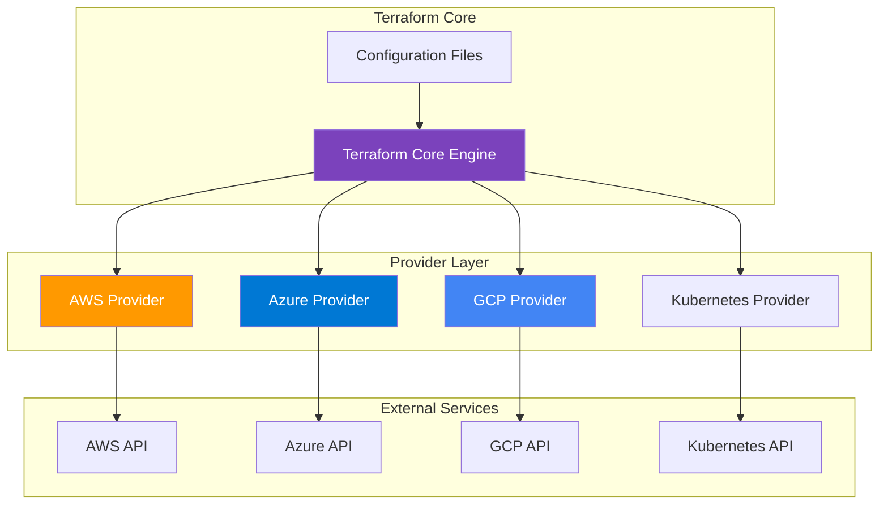

---

## 🔌 Module 06: Terraform Providers
*Duration: 2.5 hours | Labs: 4 | Difficulty: 🟡 Intermediate*

### 🎯 Learning Objectives
By the end of this module, you will be able to:
- ✅ Understand what Terraform providers are and how they work
- ✅ Navigate and use the Terraform Registry
- ✅ Configure multiple providers in a single configuration
- ✅ Use provider aliases for multi-region deployments
- ✅ Understand provider versioning and constraints
- ✅ Work with major cloud providers (AWS, Azure, GCP)
- ✅ Use community and partner providers
- ✅ Debug provider-related issues

### 📚 Topics Covered

#### 🔌 What are Terraform Providers?

Terraform providers are **plugins** that enable Terraform to interact with APIs, cloud services, and other platforms. They act as a **translation layer** between Terraform's configuration language and external services.

**🎯 Key Concepts:**
- **🔧 Plugins**: Providers are executable plugins that Terraform downloads and runs
- **📡 API Interface**: Each provider knows how to communicate with specific APIs
- **🏗️ Resource Management**: Providers define what resources and data sources are available
- **🔄 CRUD Operations**: Providers handle Create, Read, Update, Delete operations

**🏗️ Provider Architecture:**


#### 🏪 Terraform Registry

The [Terraform Registry](https://registry.terraform.io/) is the **central repository** for Terraform providers and modules.

**🌟 Registry Categories:**
- **🏢 Official Providers**: Maintained by HashiCorp (AWS, Azure, GCP, etc.)
- **🤝 Partner Providers**: Maintained by technology partners
- **👥 Community Providers**: Maintained by the community

**📊 Popular Providers:**
| Provider | Maintainer | Resources | Use Case |
|----------|------------|-----------|----------|
| **AWS** | HashiCorp | 900+ | Amazon Web Services |
| **Azure** | HashiCorp | 500+ | Microsoft Azure |
| **Google** | HashiCorp | 400+ | Google Cloud Platform |
| **Kubernetes** | HashiCorp | 100+ | Kubernetes clusters |
| **Docker** | Community | 50+ | Container management |
| **Helm** | HashiCorp | 20+ | Kubernetes package management |

#### ⚙️ Provider Configuration

**📝 Basic Provider Configuration:**
```hcl
terraform {
  required_version = ">= 1.0"
  
  required_providers {
    aws = {
      source  = "hashicorp/aws"
      version = "~> 5.0"
    }
    azurerm = {
      source  = "hashicorp/azurerm"
      version = "~> 3.0"
    }
  }
}

# Configure AWS Provider
provider "aws" {
  region = "us-west-2"
}

# Configure Azure Provider
provider "azurerm" {
  features {}
}
```

**🔧 Advanced Provider Configuration:**
```hcl
terraform {
  required_providers {
    aws = {
      source  = "hashicorp/aws"
      version = "~> 5.0"
    }
  }
}

provider "aws" {
  region = var.aws_region
  
  # Authentication (multiple options)
  access_key = var.aws_access_key  # Not recommended
  secret_key = var.aws_secret_key  # Not recommended
  profile    = "default"           # AWS CLI profile
  
  # Assume role for cross-account access
  assume_role {
    role_arn     = "arn:aws:iam::123456789012:role/TerraformRole"
    session_name = "terraform-session"
  }
  
  # Default tags for all resources
  default_tags {
    tags = {
      Environment = "production"
      ManagedBy   = "terraform"
      Owner       = "platform-team"
    }
  }
  
  # Retry configuration
  retry_mode      = "adaptive"
  max_retries     = 3
  
  # Endpoints (for testing or custom endpoints)
  endpoints {
    s3  = "http://localhost:4566"  # LocalStack
    ec2 = "http://localhost:4566"
  }
}
```

#### 🏷️ Provider Aliases

Provider aliases allow you to use **multiple configurations** of the same provider (e.g., different regions or accounts).

**🌍 Multi-Region Example:**
```hcl
terraform {
  required_providers {
    aws = {
      source  = "hashicorp/aws"
      version = "~> 5.0"
    }
  }
}

# Default provider (us-west-2)
provider "aws" {
  region = "us-west-2"
}

# Alias for East Coast
provider "aws" {
  alias  = "east"
  region = "us-east-1"
}

# Alias for Europe
provider "aws" {
  alias  = "europe"
  region = "eu-west-1"
}

# Resources using different providers
resource "aws_s3_bucket" "west_coast" {
  bucket = "my-app-west-coast-bucket"
  # Uses default provider (us-west-2)
}

resource "aws_s3_bucket" "east_coast" {
  provider = aws.east
  bucket   = "my-app-east-coast-bucket"
}

resource "aws_s3_bucket" "europe" {
  provider = aws.europe
  bucket   = "my-app-europe-bucket"
}
```

**🏢 Multi-Account Example:**
```hcl
provider "aws" {
  alias  = "production"
  region = "us-west-2"
  
  assume_role {
    role_arn = "arn:aws:iam::111111111111:role/TerraformRole"
  }
}

provider "aws" {
  alias  = "staging"
  region = "us-west-2"
  
  assume_role {
    role_arn = "arn:aws:iam::222222222222:role/TerraformRole"
  }
}

# Production resources
resource "aws_vpc" "prod" {
  provider   = aws.production
  cidr_block = "10.0.0.0/16"
  
  tags = {
    Name = "production-vpc"
  }
}

# Staging resources
resource "aws_vpc" "staging" {
  provider   = aws.staging
  cidr_block = "10.1.0.0/16"
  
  tags = {
    Name = "staging-vpc"
  }
}
```

#### 📊 Provider Versioning

Provider versioning ensures **consistency** and **compatibility** across your infrastructure.

**🔍 Version Constraint Operators:**
- **`= 1.2.3`**: Exactly version 1.2.3
- **`>= 1.2`**: Version 1.2 or newer
- **`~> 1.2`**: Any version in the 1.2.x series
- **`~> 1.2.0`**: Any version from 1.2.0 to 1.2.x (but not 1.3.0)
- **`>= 1.2, < 2.0`**: Version 1.2 or newer, but less than 2.0

**📝 Version Examples:**
```hcl
terraform {
  required_providers {
    # Exact version (not recommended for production)
    aws = {
      source  = "hashicorp/aws"
      version = "= 5.31.0"
    }
    
    # Pessimistic constraint (recommended)
    azurerm = {
      source  = "hashicorp/azurerm"
      version = "~> 3.80"  # 3.80.x series
    }
    
    # Range constraint
    google = {
      source  = "hashicorp/google"
      version = ">= 4.0, < 6.0"
    }
    
    # Minimum version
    kubernetes = {
      source  = "hashicorp/kubernetes"
      version = ">= 2.0"
    }
  }
}
```

💡 **Pro Tip**: Use `~>` (pessimistic constraint) for production to get patch updates while avoiding breaking changes!

### 💻 **Exercise 5.1**: Multi-Cloud Provider Configuration
**Duration**: 30 minutes

Let's practice configuring multiple providers and using aliases for a multi-cloud deployment.

**Step 1: Setup Project Structure**
```bash
# Create new project directory
mkdir ~/terraform-multi-cloud
cd ~/terraform-multi-cloud

# Create directories
mkdir scripts
mkdir configs

# Open in VS Code
code .
```

**Step 2: Create Multi-Cloud Configuration**

Create `main.tf`:
```hcl
terraform {
  required_version = ">= 1.0"
  
  required_providers {
    aws = {
      source  = "hashicorp/aws"
      version = "~> 5.0"
    }
    azurerm = {
      source  = "hashicorp/azurerm"
      version = "~> 3.0"
    }
    google = {
      source  = "hashicorp/google"
      version = "~> 4.0"
    }
    random = {
      source  = "hashicorp/random"
      version = "~> 3.0"
    }
  }
}

# Generate random suffix for unique resource names
resource "random_id" "suffix" {
  byte_length = 4
}

locals {
  suffix = random_id.suffix.hex
  common_tags = {
    Project     = "multi-cloud-demo"
    Environment = "learning"
    ManagedBy   = "terraform"
  }
}
```

**Step 3: Configure AWS Providers**

Add to `main.tf`:
```hcl
# AWS Primary Region (us-west-2)
provider "aws" {
  region = "us-west-2"
  
  default_tags {
    tags = local.common_tags
  }
}

# AWS Secondary Region (us-east-1)
provider "aws" {
  alias  = "east"
  region = "us-east-1"
  
  default_tags {
    tags = local.common_tags
  }
}

# AWS Resources
resource "aws_s3_bucket" "west" {
  bucket = "terraform-demo-west-${local.suffix}"
}

resource "aws_s3_bucket" "east" {
  provider = aws.east
  bucket   = "terraform-demo-east-${local.suffix}"
}

resource "aws_s3_bucket_versioning" "west" {
  bucket = aws_s3_bucket.west.id
  versioning_configuration {
    status = "Enabled"
  }
}

resource "aws_s3_bucket_versioning" "east" {
  provider = aws.east
  bucket   = aws_s3_bucket.east.id
  versioning_configuration {
    status = "Enabled"
  }
}
```

**Step 4: Configure Azure Provider**

Add to `main.tf`:
```hcl
# Azure Provider
provider "azurerm" {
  features {}
}

# Azure Resources
resource "azurerm_resource_group" "main" {
  name     = "terraform-demo-${local.suffix}"
  location = "West US 2"
  
  tags = local.common_tags
}

resource "azurerm_storage_account" "main" {
  name                     = "terraformdemo${local.suffix}"
  resource_group_name      = azurerm_resource_group.main.name
  location                 = azurerm_resource_group.main.location
  account_tier             = "Standard"
  account_replication_type = "LRS"
  
  tags = local.common_tags
}

resource "azurerm_storage_container" "main" {
  name                  = "demo-container"
  storage_account_name  = azurerm_storage_account.main.name
  container_access_type = "private"
}
```

**Step 5: Configure Google Cloud Provider**

Add to `main.tf`:
```hcl
# Google Cloud Provider
provider "google" {
  project = var.gcp_project_id
  region  = "us-west1"
}

# Google Cloud Resources
resource "google_storage_bucket" "main" {
  name          = "terraform-demo-gcp-${local.suffix}"
  location      = "US-WEST1"
  force_destroy = true
  
  versioning {
    enabled = true
  }
  
  labels = {
    project     = "multi-cloud-demo"
    environment = "learning"
    managed-by  = "terraform"
  }
}

resource "google_storage_bucket_object" "demo" {
  name    = "demo.txt"
  bucket  = google_storage_bucket.main.name
  content = "Hello from Google Cloud Storage!"
}
```

**Step 6: Create Variables and Outputs**

Create `variables.tf`:
```hcl
variable "gcp_project_id" {
  description = "Google Cloud Project ID"
  type        = string
  default     = "my-demo-project"  # Replace with your project ID
}

variable "aws_region_primary" {
  description = "Primary AWS region"
  type        = string
  default     = "us-west-2"
}

variable "aws_region_secondary" {
  description = "Secondary AWS region"
  type        = string
  default     = "us-east-1"
}
```

Create `outputs.tf`:
```hcl
# AWS Outputs
output "aws_s3_buckets" {
  description = "AWS S3 bucket information"
  value = {
    west = {
      name   = aws_s3_bucket.west.bucket
      region = aws_s3_bucket.west.region
      arn    = aws_s3_bucket.west.arn
    }
    east = {
      name   = aws_s3_bucket.east.bucket
      region = aws_s3_bucket.east.region
      arn    = aws_s3_bucket.east.arn
    }
  }
}

# Azure Outputs
output "azure_storage" {
  description = "Azure storage account information"
  value = {
    resource_group   = azurerm_resource_group.main.name
    storage_account  = azurerm_storage_account.main.name
    container_name   = azurerm_storage_container.main.name
    location         = azurerm_resource_group.main.location
  }
}

# Google Cloud Outputs
output "gcp_storage" {
  description = "Google Cloud storage information"
  value = {
    bucket_name = google_storage_bucket.main.name
    bucket_url  = google_storage_bucket.main.url
    location    = google_storage_bucket.main.location
  }
}

# Provider Information
output "provider_versions" {
  description = "Provider versions used"
  value = {
    random_suffix = local.suffix
    terraform_version = "Used Terraform >= 1.0"
  }
}
```

**Step 7: Deploy and Test**
```bash
# Initialize Terraform
terraform init

# Validate configuration
terraform validate

# Plan the deployment
terraform plan

# Apply (Note: This requires valid cloud credentials)
# terraform apply

# View provider information
terraform providers

# Check lock file
cat .terraform.lock.hcl
```

💡 **Pro Tip**: Notice how each provider has its own authentication method and resource naming conventions!

#### 🛠️ Provider Commands

**🔍 Essential Provider Commands:**
```bash
# Initialize and download providers
terraform init

# List installed providers
terraform providers

# Show provider requirements
terraform version

# Force provider re-initialization
terraform init -upgrade

# Lock provider versions
terraform providers lock

# Mirror providers for air-gapped environments
terraform providers mirror ./mirror

# Debug provider issues
export TF_LOG=DEBUG
terraform plan
```

#### 🐛 Debugging Provider Issues

**🔧 Common Provider Problems:**

1. **Authentication Issues:**
```bash
# Check AWS credentials
aws sts get-caller-identity

# Check Azure login
az account show

# Check GCP authentication
gcloud auth list
```

2. **Version Conflicts:**
```bash
# Check lock file
cat .terraform.lock.hcl

# Update providers
terraform init -upgrade

# Force specific version
terraform init -upgrade -provider=hashicorp/aws
```

3. **Provider Download Issues:**
```bash
# Use different registry mirror
terraform init -plugin-dir=/path/to/providers

# Skip provider verification (not recommended)
terraform init -verify-plugins=false
```

#### 🏢 Enterprise Provider Considerations

**🔒 Security Best Practices:**
- **🔐 Never hardcode credentials** in configuration files
- **🎭 Use IAM roles and service principals** for authentication
- **🔄 Rotate credentials regularly** using automated tools
- **📊 Monitor provider API usage** for cost and security
- **🛡️ Use least-privilege access** for Terraform service accounts

**🏭 Enterprise Features:**
```hcl
# Provider configuration with enterprise features
provider "aws" {
  region = var.aws_region
  
  # Use assume role for cross-account access
  assume_role {
    role_arn     = var.terraform_role_arn
    session_name = "terraform-${var.environment}"
    external_id  = var.external_id
  }
  
  # Default tags for compliance
  default_tags {
    tags = {
      ManagedBy    = "terraform"
      Environment  = var.environment
      CostCenter   = var.cost_center
      Owner        = var.owner_email
      Compliance   = "required"
    }
  }
  
  # Retry configuration for reliability
  retry_mode  = "adaptive"
  max_retries = 5
}
```

---

## ✅ Module 5 Summary

### 🎯 Key Takeaways
- **🔌 Providers** are plugins that enable Terraform to interact with external APIs
- **🏪 Terraform Registry** is the central hub for finding and using providers
- **🏷️ Provider aliases** enable multi-region and multi-account deployments
- **📊 Version constraints** ensure consistency and prevent breaking changes
- **🔧 Provider configuration** supports authentication, retry logic, and defaults
- **🌍 Multi-cloud strategies** are enabled by provider flexibility
- **🛡️ Security best practices** are essential for enterprise deployments

### 🔑 Essential Commands Learned
```bash
terraform init              # Download and install providers
terraform providers         # List installed providers  
terraform providers lock    # Lock provider versions
terraform init -upgrade     # Update providers
terraform version          # Show Terraform and provider versions
```

### 💡 Pro Tips Recap
- 🟢 **Use `~>` version constraints** for production stability
- 🔵 **Always use provider aliases** for multi-region deployments
- 🔴 **Never hardcode credentials** in configuration files
- 🟡 **Use default tags** for consistent resource management
- 🟠 **Monitor provider API usage** for cost optimization
- 🟣 **Test provider configurations** in development first

---

## 🚀 Practical Provider Labs

### 🎯 Lab 3: Working with Multiple Provider Types

**Scenario**: Build a practical application using common providers that work together - no multiple cloud accounts needed!

**📁 File: `providers.tf` - Training-Friendly Multi-Provider Setup**
```hcl
# 🏗️ Practical multi-provider configuration for learning
terraform {
  required_version = ">= 1.0"
  
  # 🔌 Required providers - all training-friendly!
  required_providers {
    # 🟠 AWS Provider - Primary cloud provider
    aws = {
      source  = "hashicorp/aws"
      version = "~> 5.0"
    }
    
    # 🎲 Random Provider - Generate random values
    random = {
      source  = "hashicorp/random"
      version = "~> 3.4"
    }
    
    # 🌐 HTTP Provider - Make HTTP requests
    http = {
      source  = "hashicorp/http"
      version = "~> 3.4"
    }
    
    # 📁 Local Provider - Work with local files
    local = {
      source  = "hashicorp/local"
      version = "~> 2.4"
    }
    
    # 🕒 Time Provider - Time-based resources
    time = {
      source  = "hashicorp/time"
      version = "~> 0.9"
    }
    
    # 🔗 External Provider - Execute external programs
    external = {
      source  = "hashicorp/external"
      version = "~> 2.3"
    }
  }
}

# 🟠 AWS Provider - Primary provider
provider "aws" {
  region = var.aws_region
  
  # 🏷️ Default tags for all AWS resources
  default_tags {
    tags = {
      Environment = var.environment
      Project     = "terraform-training"
      ManagedBy   = "terraform"
      Owner       = var.owner_name
    }
  }
}

# 🟠 AWS Provider Alias - Different region for DR
provider "aws" {
  alias  = "backup_region"
  region = var.backup_region
  
  default_tags {
    tags = {
      Environment = var.environment
      Project     = "terraform-training"
      ManagedBy   = "terraform"
      Owner       = var.owner_name
      Purpose     = "disaster-recovery"
    }
  }
}
```

**📁 File: `main.tf` - Practical Multi-Provider Resources**
```hcl
# 🎲 Generate random values for unique naming
resource "random_pet" "app_name" {
  length = 2
  separator = "-"
}

resource "random_password" "db_password" {
  length  = 16
  special = true
  
  # Ensure password meets AWS RDS requirements
  min_lower   = 2
  min_upper   = 2
  min_numeric = 2
  min_special = 2
}

resource "random_id" "bucket_suffix" {
  byte_length = 4
}

# 🕒 Create timestamps for resource lifecycle
resource "time_static" "deployment_time" {}

resource "time_rotating" "monthly_rotation" {
  rotation_days = 30
}

# 🌐 Fetch current IP address for security groups
data "http" "current_ip" {
  url = "https://ipv4.icanhazip.com"
  
  # Strip whitespace from response
  lifecycle {
    postcondition {
      condition     = can(regex("^\\d{1,3}\\.\\d{1,3}\\.\\d{1,3}\\.\\d{1,3}$", trimspace(self.response_body)))
      error_message = "Response must be a valid IPv4 address."
    }
  }
}

# 🔗 Get AWS account information
data "external" "aws_account_info" {
  program = ["bash", "-c", "aws sts get-caller-identity --output json"]
}

# 📁 Create local configuration file
resource "local_file" "app_config" {
  content = templatefile("${path.module}/templates/config.json.tpl", {
    app_name        = random_pet.app_name.id
    environment     = var.environment
    deployment_time = time_static.deployment_time.rfc3339
    aws_account_id  = data.external.aws_account_info.result.Account
    current_ip      = trimspace(data.http.current_ip.response_body)
  })
  filename = "${path.module}/generated/app-config.json"
  
  # Set file permissions
  file_permission = "0644"
}

# 🟠 AWS Resources using values from other providers
resource "aws_s3_bucket" "app_storage" {
  bucket = "${random_pet.app_name.id}-storage-${random_id.bucket_suffix.hex}"
}

resource "aws_s3_bucket_versioning" "app_storage" {
  bucket = aws_s3_bucket.app_storage.id
  versioning_configuration {
    status = "Enabled"
  }
}

resource "aws_s3_bucket_server_side_encryption_configuration" "app_storage" {
  bucket = aws_s3_bucket.app_storage.id

  rule {
    apply_server_side_encryption_by_default {
      sse_algorithm = "AES256"
    }
  }
}

# 🔐 Security group using HTTP provider data
resource "aws_security_group" "app_sg" {
  name        = "${random_pet.app_name.id}-sg"
  description = "Security group for ${random_pet.app_name.id} application"

  # Allow HTTP access from current IP
  ingress {
    description = "HTTP from current IP"
    from_port   = 80
    to_port     = 80
    protocol    = "tcp"
    cidr_blocks = ["${trimspace(data.http.current_ip.response_body)}/32"]
  }

  # Allow HTTPS access from current IP
  ingress {
    description = "HTTPS from current IP"
    from_port   = 443
    to_port     = 443
    protocol    = "tcp"
    cidr_blocks = ["${trimspace(data.http.current_ip.response_body)}/32"]
  }

  egress {
    from_port   = 0
    to_port     = 0
    protocol    = "-1"
    cidr_blocks = ["0.0.0.0/0"]
  }

  tags = {
    Name = "${random_pet.app_name.id}-security-group"
    CreatedAt = time_static.deployment_time.rfc3339
  }
}

# 🗄️ RDS database with random password
resource "aws_db_subnet_group" "app_db" {
  name       = "${random_pet.app_name.id}-db-subnet-group"
  subnet_ids = data.aws_subnets.default.ids

  tags = {
    Name = "${random_pet.app_name.id} DB Subnet Group"
  }
}

resource "aws_db_instance" "app_database" {
  identifier     = "${random_pet.app_name.id}-database"
  engine         = "mysql"
  engine_version = "8.0"
  instance_class = "db.t3.micro"
  
  allocated_storage     = 20
  max_allocated_storage = 100
  storage_type          = "gp2"
  storage_encrypted     = true

  db_name  = "appdb"
  username = "admin"
  password = random_password.db_password.result
  
  vpc_security_group_ids = [aws_security_group.app_sg.id]
  db_subnet_group_name   = aws_db_subnet_group.app_db.name
  
  backup_window      = "03:00-04:00"
  backup_retention_period = 7
  maintenance_window = "sun:04:00-sun:05:00"
  
  # Prevent accidental deletion
  deletion_protection = false  # Set to false for training
  skip_final_snapshot = true   # Set to true for training

  tags = {
    Name = "${random_pet.app_name.id} Database"
    PasswordRotation = time_rotating.monthly_rotation.rfc3339
  }
}

# 🔄 Backup resources in different region
resource "aws_s3_bucket" "backup_storage" {
  provider = aws.backup_region
  bucket   = "${random_pet.app_name.id}-backup-${random_id.bucket_suffix.hex}"
}

# 📊 Create local report file
resource "local_file" "deployment_report" {
  content = <<-EOT
# 📋 Deployment Report
Generated: ${time_static.deployment_time.rfc3339}
App Name: ${random_pet.app_name.id}
Environment: ${var.environment}
AWS Account: ${data.external.aws_account_info.result.Account}
Current IP: ${trimspace(data.http.current_ip.response_body)}

## 🏗️ Resources Created:
- S3 Bucket: ${aws_s3_bucket.app_storage.bucket}
- Backup Bucket: ${aws_s3_bucket.backup_storage.bucket}
- Database: ${aws_db_instance.app_database.identifier}
- Security Group: ${aws_security_group.app_sg.name}

## 🔐 Generated Values:
- Database Password: [HIDDEN - Check Terraform state]
- Bucket Suffix: ${random_id.bucket_suffix.hex}

## 🕒 Scheduled Actions:
- Password Rotation: ${time_rotating.monthly_rotation.rfc3339}
EOT
  
  filename = "${path.module}/generated/deployment-report.md"
}

# 📡 Data sources for existing AWS resources
data "aws_vpc" "default" {
  default = true
}

data "aws_subnets" "default" {
  filter {
    name   = "vpc-id"
    values = [data.aws_vpc.default.id]
  }
}
```

**📁 File: `templates/config.json.tpl` - JSON Configuration Template**
```json
{
  "application": {
    "name": "${app_name}",
    "environment": "${environment}",
    "version": "1.0.0",
    "deployment_time": "${deployment_time}"
  },
  "aws": {
    "account_id": "${aws_account_id}",
    "region": "us-west-2"
  },
  "security": {
    "allowed_ip": "${current_ip}",
    "encryption_enabled": true,
    "ssl_required": true
  },
  "features": {
    "database_enabled": true,
    "backup_enabled": true,
    "monitoring_enabled": true,
    "auto_scaling": false
  }
}
```

**📁 File: `variables.tf` - Training Variables**
```hcl
variable "aws_region" {
  description = "🌍 Primary AWS region"
  type        = string
  default     = "us-west-2"
}

variable "backup_region" {
  description = "🔄 Backup AWS region"
  type        = string
  default     = "us-east-1"
}

variable "environment" {
  description = "🏷️ Environment name"
  type        = string
  default     = "dev"
  
  validation {
    condition     = contains(["dev", "staging", "prod"], var.environment)
    error_message = "Environment must be dev, staging, or prod."
  }
}

variable "owner_name" {
  description = "👤 Owner of the resources"
  type        = string
  default     = "terraform-student"
}
```

### 🎯 Lab 4: Provider Commands & Debugging

**🔧 Essential Provider Commands:**
```bash
# 🚀 Initialize providers
terraform init

# 📋 List installed providers
terraform providers

# 🔍 Show provider schemas (helpful for learning!)
terraform providers schema -json | jq '.provider_schemas."registry.terraform.io/hashicorp/aws"'

# 🔒 Lock provider versions
terraform providers lock -platform=linux_amd64 -platform=darwin_amd64

# 🆙 Upgrade providers
terraform init -upgrade

# 🧹 Clear provider cache
rm -rf .terraform/providers/

# 🔍 Debug provider issues
TF_LOG=DEBUG terraform plan
TF_LOG_PROVIDER=DEBUG terraform apply

# 📊 Validate provider configurations  
terraform validate
```

**🐛 Common Provider Debugging:**
```hcl
# 🔍 Debug provider authentication
resource "aws_caller_identity" "current" {}

output "debug_aws_account" {
  value = {
    account_id = aws_caller_identity.current.account_id
    arn        = aws_caller_identity.current.arn
    user_id    = aws_caller_identity.current.user_id
  }
}

# 🌐 Test HTTP provider connectivity
data "http" "connectivity_test" {
  url = "https://httpbin.org/json"
  
  request_headers = {
    Accept = "application/json"
  }
}

output "debug_http_response" {
  value = jsondecode(data.http.connectivity_test.response_body)
}

# 📁 Verify local provider file operations
resource "local_file" "test_file" {
  content  = "Provider test successful at ${timestamp()}"
  filename = "${path.module}/test-output.txt"
}
```

---

## 🧠 Knowledge Check: Module 5 Quiz

Test your understanding of Terraform Providers with these questions:

### 📝 Quiz Questions

**1. What are Terraform providers?**
- A) Configuration files for infrastructure
- B) Plugins that enable Terraform to interact with APIs and services
- C) Command-line tools for deployment
- D) Version control systems

**2. Which provider version constraint allows patch updates but prevents minor version changes?**
- A) `>= 5.0`
- B) `~> 5.31.0`
- C) `= 5.31.0`
- D) `< 6.0`

**3. What is the purpose of provider aliases?**
- A) To rename providers for clarity
- B) To use multiple configurations of the same provider
- C) To create shortcuts for long provider names
- D) To version providers differently

**4. Which provider is useful for generating random values in training environments?**
- A) local
- B) http
- C) random
- D) external

**5. What does the `http` provider allow you to do?**
- A) Host web servers
- B) Make HTTP requests and fetch data
- C) Configure network protocols
- D) Manage DNS records

**6. Which command initializes providers in your Terraform configuration?**
- A) `terraform providers`
- B) `terraform init`
- C) `terraform apply`
- D) `terraform plan`

**7. What is the purpose of the `.terraform.lock.hcl` file?**
- A) Lock the Terraform binary version
- B) Lock provider versions for consistency
- C) Lock state files from modification
- D) Lock configuration files

**8. Which provider is best for working with local files and directories?**
- A) file
- B) local
- C) directory
- D) filesystem

**9. In a multi-provider setup, which resource attribute specifies which provider to use?**
- A) `source`
- B) `version`
- C) `provider`
- D) `alias`

**10. What does the `external` provider allow you to do?**
- A) Manage external APIs only
- B) Execute external programs and use their output
- C) Connect to external databases
- D) Import external configurations

**11. Which of these is a practical combination for training environments?**
- A) aws + azure + gcp
- B) aws + random + http + local
- C) kubernetes + docker + helm
- D) vault + consul + nomad

**12. What happens when you run `terraform init -upgrade`?**
- A) Upgrades Terraform binary
- B) Upgrades providers to latest versions within constraints
- C) Upgrades all infrastructure resources
- D) Upgrades the lock file format

<details>
<summary>🔍 Click for Answers</summary>

1. **B** - Providers are plugins that enable Terraform to interact with APIs and services
2. **B** - `~> 5.31.0` allows patch updates (5.31.1, 5.31.2) but prevents minor version changes
3. **B** - Provider aliases allow using multiple configurations of the same provider (e.g., different regions)
4. **C** - The `random` provider generates random values like passwords, IDs, and pet names
5. **B** - The `http` provider makes HTTP requests and fetches data from APIs or web endpoints
6. **B** - `terraform init` downloads and installs providers specified in your configuration
7. **B** - The lock file ensures consistent provider versions across different environments
8. **B** - The `local` provider works with local files, directories, and file operations
9. **C** - The `provider` attribute specifies which provider configuration to use for a resource
10. **B** - The `external` provider executes external programs and uses their output in Terraform
11. **B** - This combination works well for training as it doesn't require multiple cloud accounts
12. **B** - This command upgrades providers to their latest versions within the specified constraints

</details>

---

**🎉 Congratulations!** You've completed Module 5 and now understand how to work with Terraform providers effectively. You've learned about the registry, versioning, aliases, and practical multi-provider configurations!

**➡️ Ready for Module 6?** Let me know when you'd like to continue with Terraform Language - where we'll dive deep into HCL syntax and advanced language features!

---

---

## 🔗 **Next Steps**

Ready to continue your Terraform journey? Proceed to the next module:

**➡️ [Module 7: Terraform Language and HashiCorp Language](./module_07_terraform_language_and_hashicorp_language.md)**

Deep dive into HCL syntax and Terraform's configuration language.

---
