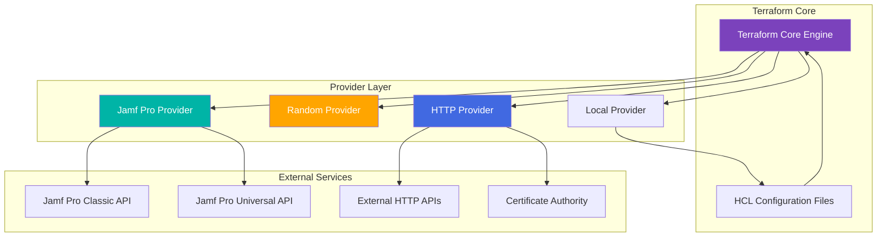

---

## 🔌 Module 06: Terraform Providers
*Duration: 2.5 hours | Labs: 4 | Difficulty: 🟡 Intermediate*

### 🎯 Learning Objectives
By the end of this module, you will be able to:
- ✅ Understand what Terraform providers are and how they work
- ✅ Navigate and use the Terraform Registry
- ✅ Configure multiple providers in a single configuration
- ✅ Use provider aliases for multi-region deployments
- ✅ Understand provider versioning and constraints
- ✅ Work with supporting providers (random, http, local, time)
- ✅ Use community and partner providers
- ✅ Debug provider-related issues

### 📚 Topics Covered

#### 🔌 What are Terraform Providers?

Terraform providers are **plugins** that enable Terraform to interact with APIs, device management platforms, and other services. They act as a **translation layer** between Terraform's configuration language and external services like Jamf Pro.

**🎯 Key Concepts:**
- **🔧 Plugins**: Providers are executable plugins that Terraform downloads and runs
- **📡 API Interface**: Each provider knows how to communicate with specific APIs
- **🏗️ Resource Management**: Providers define what resources and data sources are available
- **🔄 CRUD Operations**: Providers handle Create, Read, Update, Delete operations

**🏗️ Jamf Pro Provider Architecture:**


#### 🏪 Terraform Registry

The [Terraform Registry](https://registry.terraform.io/) is the **central repository** for Terraform providers and modules.

**🌟 Registry Categories:**
- **🏢 Official Providers**: Maintained by HashiCorp (Random, HTTP, Local, etc.)
- **🤝 Partner Providers**: Maintained by technology partners
- **👥 Community Providers**: Maintained by the community

**📊 Device Management Providers:**
| Provider | Maintainer | Resources | Use Case |
|----------|------------|-----------|----------|
| **Jamf Pro** | DeploymentTheory | 50+ | Jamf Pro device management |
| **Random** | HashiCorp | 10+ | Generate unique identifiers |
| **HTTP** | HashiCorp | 5+ | Fetch external configuration data |
| **Local** | HashiCorp | 5+ | Manage local files and certificates |
| **Time** | HashiCorp | 5+ | Time-based operations |
| **External** | HashiCorp | 2+ | Execute external programs |

#### ⚙️ Provider Configuration

**📝 Basic Jamf Pro Provider Configuration:**

```hcl
terraform {
  required_version = ">= 1.0"
  
  required_providers {
    jamfpro = {
      source  = "deploymenttheory/jamfpro"
      version = "~> 0.24.0"
    }
    random = {
      source  = "hashicorp/random"
      version = "~> 3.4"
    }
  }
}

# Configure Jamf Pro Provider
provider "jamfpro" {
  jamfpro_instance_fqdn = "https://your-company.jamfcloud.com"
  auth_method           = "oauth2"
  client_id             = var.jamfpro_client_id
  client_secret         = var.jamfpro_client_secret
}

# Configure Random Provider for unique naming
provider "random" {
  # No configuration needed
}
```

**🔧 Advanced Jamf Pro Provider Configuration:**

```hcl
terraform {
  required_providers {
    jamfpro = {
      source  = "deploymenttheory/jamfpro"
      version = "~> 0.24.0"
    }
  }
}

provider "jamfpro" {
  jamfpro_instance_fqdn = var.jamfpro_instance_fqdn
  
  # Authentication methods (choose one)
  auth_method   = "oauth2"  # Recommended for production
  client_id     = var.jamfpro_client_id
  client_secret = var.jamfpro_client_secret
  
  # Alternative: Basic authentication
  # auth_method = "basic"
  # username    = var.jamfpro_username
  # password    = var.jamfpro_password
  
  # Alternative: Bearer token
  # auth_method   = "bearer"
  # bearer_token  = var.jamfpro_bearer_token
  
  # Performance and reliability settings
  jamfpro_load_balancer_lock    = true   # Prevent concurrent API calls
  jamfpro_api_timeout           = 30     # API timeout in seconds
  jamfpro_max_retry_attempts    = 3      # Retry failed requests
  
  # Custom HTTP client settings
  client_sdk_log_level = "INFO"  # DEBUG, INFO, WARN, ERROR
  
  # Hide sensitive values in logs
  hide_sensitive_data = true
  
  # Custom User-Agent for API requests
  custom_cookies = {
    "terraform-managed" = "true"
  }
}
```

#### 🏷️ Provider Aliases

Provider aliases allow you to use **multiple configurations** of the same provider (e.g., different Jamf Pro instances or environments).

**🏢 Multi-Environment Jamf Pro Example:**

```hcl
terraform {
  required_providers {
    jamfpro = {
      source  = "deploymenttheory/jamfpro"
      version = "~> 0.24.0"
    }
  }
}

# Default provider (Production)
provider "jamfpro" {
  jamfpro_instance_fqdn = "https://company-prod.jamfcloud.com"
  auth_method           = "oauth2"
  client_id             = var.prod_client_id
  client_secret         = var.prod_client_secret
}

# Alias for Staging environment
provider "jamfpro" {
  alias                 = "staging"
  jamfpro_instance_fqdn = "https://company-staging.jamfcloud.com"
  auth_method           = "oauth2"
  client_id             = var.staging_client_id
  client_secret         = var.staging_client_secret
}

# Alias for Development environment
provider "jamfpro" {
  alias                 = "dev"
  jamfpro_instance_fqdn = "https://company-dev.jamfcloud.com"
  auth_method           = "basic"
  username              = var.dev_username
  password              = var.dev_password
}

# Resources using different Jamf Pro instances
resource "jamfpro_category" "production" {
  name     = "Production Software"
  priority = 10
  # Uses default provider (production)
}

resource "jamfpro_category" "staging_test" {
  provider = jamfpro.staging
  name     = "Staging Test Software"
  priority = 5
}

resource "jamfpro_policy" "dev_testing" {
  provider = jamfpro.dev
  name     = "Development Testing Policy"
  enabled  = true
}
```

**🏭 Multi-Organization Jamf Pro Example:**

```hcl
provider "jamfpro" {
  alias                 = "corp_main"
  jamfpro_instance_fqdn = "https://corporate.jamfcloud.com"
  auth_method           = "oauth2"
  client_id             = var.corp_client_id
  client_secret         = var.corp_client_secret
  
  # Corporate-specific settings
  jamfpro_load_balancer_lock = true
  jamfpro_api_timeout        = 60
}

provider "jamfpro" {
  alias                 = "subsidiary"
  jamfpro_instance_fqdn = "https://subsidiary.jamfcloud.com"
  auth_method           = "oauth2"
  client_id             = var.sub_client_id
  client_secret         = var.sub_client_secret
  
  # Subsidiary-specific settings
  jamfpro_load_balancer_lock = false
  jamfpro_api_timeout        = 30
}

# Corporate policies
resource "jamfpro_policy" "corporate_security" {
  provider = jamfpro.corp_main
  name     = "Corporate Security Baseline"
  enabled  = true
  
  category {
    name = "Corporate IT"
  }
}

# Subsidiary policies
resource "jamfpro_policy" "subsidiary_apps" {
  provider = jamfpro.subsidiary
  name     = "Subsidiary Application Install"
  enabled  = true
  
  category {
    name = "Local IT"
  }
}
```

#### 📊 Provider Versioning

Provider versioning ensures **consistency** and **compatibility** across your infrastructure.

**🔍 Version Constraint Operators:**
- **`= 1.2.3`**: Exactly version 1.2.3
- **`>= 1.2`**: Version 1.2 or newer
- **`~> 1.2`**: Any version in the 1.2.x series
- **`~> 1.2.0`**: Any version from 1.2.0 to 1.2.x (but not 1.3.0)
- **`>= 1.2, < 2.0`**: Version 1.2 or newer, but less than 2.0

**📝 Jamf Pro Provider Version Examples:**

```hcl
terraform {
  required_providers {
    # Exact version (not recommended for production)
    jamfpro = {
      source  = "deploymenttheory/jamfpro"
      version = "= 0.24.0"
    }
    
    # Pessimistic constraint (recommended for Jamf Pro)
    jamfpro = {
      source  = "deploymenttheory/jamfpro"
      version = "~> 0.24.0"  # 0.24.x series
    }
    
    # Range constraint
    jamfpro = {
      source  = "deploymenttheory/jamfpro"
      version = ">= 0.20.0, < 1.0.0"
    }
    
    # Minimum version (for newer features)
    jamfpro = {
      source  = "deploymenttheory/jamfpro"
      version = ">= 0.24.0"
    }
    
    # Supporting providers with compatible versions
    random = {
      source  = "hashicorp/random"
      version = "~> 3.4"
    }
    
    http = {
      source  = "hashicorp/http"
      version = "~> 3.4"
    }
  }
}
```

💡 **Pro Tip**: Use `~>` (pessimistic constraint) for the Jamf Pro provider to get bug fixes and new resources while avoiding breaking API changes!

### 💻 **Exercise 6.1**: Basic Jamf Pro Provider Configuration
**Duration**: 30 minutes

Let's practice configuring the Jamf Pro provider with proper authentication and basic resource management.

**Step 1: Setup Project Structure**

```bash
# Create new project directory
mkdir ~/terraform-jamfpro-basics
cd ~/terraform-jamfpro-basics

# Create directories for organization
mkdir templates
mkdir scripts

# Open in VS Code
code .
```

**Step 2: Create Jamf Pro Configuration**

Create `main.tf`:

```hcl
terraform {
  required_version = ">= 1.0"
  
  required_providers {
    jamfpro = {
      source  = "deploymenttheory/jamfpro"
      version = "~> 0.24.0"
    }
    random = {
      source  = "hashicorp/random"
      version = "~> 3.4"
    }
    time = {
      source  = "hashicorp/time"
      version = "~> 0.9"
    }
  }
}

# Generate random suffix for unique resource names
resource "random_pet" "app_name" {
  length    = 2
  separator = "-"
}

resource "random_id" "suffix" {
  byte_length = 3
}

# Create timestamp for resource tracking
resource "time_static" "deployment_time" {}

locals {
  app_name = random_pet.app_name.id
  suffix   = random_id.suffix.hex
  
  common_labels = {
    project     = "jamfpro-terraform-training"
    environment = var.environment
    managed_by  = "terraform"
    created_at  = formatdate("YYYY-MM-DD", time_static.deployment_time.rfc3339)
  }
}
```

**Step 3: Configure Jamf Pro Provider**

Add to `main.tf`:

```hcl
# Configure Jamf Pro Provider
provider "jamfpro" {
  jamfpro_instance_fqdn = var.jamfpro_instance_fqdn
  auth_method           = "oauth2"
  client_id             = var.jamfpro_client_id
  client_secret         = var.jamfpro_client_secret
  
  # Performance settings
  jamfpro_load_balancer_lock = true
  jamfpro_api_timeout        = 30
}

# Create a category for organization
resource "jamfpro_category" "terraform_managed" {
  name     = "Terraform Managed - ${local.app_name}"
  priority = 10
}

# Create a smart computer group
resource "jamfpro_smart_computer_group" "test_devices" {
  name = "Test Devices - ${local.app_name} - ${local.suffix}"
  
  criteria {
    name          = "Computer Name"
    priority      = 0
    and_or        = "and"
    search_type   = "like"
    value         = "test"
    opening_paren = false
    closing_paren = false
  }
}

# Create a policy using the category and group
resource "jamfpro_policy" "inventory_update" {
  name                        = "Inventory Update - ${local.app_name}"
  enabled                     = true
  trigger_checkin             = true
  trigger_enrollment_complete = false
  frequency                   = "Once per day"
  target_drive                = "/"
  category_id                 = jamfpro_category.terraform_managed.id
  
  scope {
    all_computers      = false
    computer_group_ids = [jamfpro_smart_computer_group.test_devices.id]
  }
  
  payloads {
    maintenance {
      recon = true
    }
  }
}
```

**Step 4: Create Variables File**

Create `variables.tf`:

```hcl
variable "jamfpro_instance_fqdn" {
  description = "Jamf Pro instance FQDN (e.g., https://company.jamfcloud.com)"
  type        = string
  validation {
    condition     = can(regex("^https://.*", var.jamfpro_instance_fqdn))
    error_message = "Jamf Pro instance FQDN must start with 'https://'."
  }
}

variable "jamfpro_client_id" {
  description = "Jamf Pro OAuth2 Client ID"
  type        = string
  sensitive   = true
}

variable "jamfpro_client_secret" {
  description = "Jamf Pro OAuth2 Client Secret"
  type        = string
  sensitive   = true
}

variable "environment" {
  description = "Environment name for resource naming"
  type        = string
  default     = "dev"
  
  validation {
    condition     = contains(["dev", "staging", "prod"], var.environment)
    error_message = "Environment must be dev, staging, or prod."
  }
}
```

**Step 5: Create Terraform Variables File**

Create `terraform.tfvars.example`:

```hcl
# Copy this file to terraform.tfvars and update with your values

# Jamf Pro Configuration
jamfpro_instance_fqdn = "https://your-company.jamfcloud.com"
jamfpro_client_id     = "your-oauth2-client-id"
jamfpro_client_secret = "your-oauth2-client-secret"

# Environment
environment = "dev"
```

**Step 6: Create Outputs File**

Create `outputs.tf`:

```hcl
# Jamf Pro Resource Outputs
output "jamfpro_resources" {
  description = "Information about created Jamf Pro resources"
  value = {
    category = {
      id   = jamfpro_category.terraform_managed.id
      name = jamfpro_category.terraform_managed.name
    }
    computer_group = {
      id   = jamfpro_smart_computer_group.test_devices.id
      name = jamfpro_smart_computer_group.test_devices.name
    }
    policy = {
      id   = jamfpro_policy.inventory_update.id
      name = jamfpro_policy.inventory_update.name
    }
  }
}

# Generated Values
output "generated_values" {
  description = "Random values generated for this deployment"
  value = {
    app_name      = local.app_name
    suffix        = local.suffix
    deployment_id = "${local.app_name}-${local.suffix}"
    created_at    = time_static.deployment_time.rfc3339
  }
}

# Provider Information
output "provider_info" {
  description = "Provider configuration information"
  value = {
    jamfpro_instance = var.jamfpro_instance_fqdn
    environment      = var.environment
    terraform_version = ">= 1.0"
    provider_versions = {
      jamfpro = "~> 0.24.0"
      random  = "~> 3.4"
      time    = "~> 0.9"
    }
  }
}
```

**Step 7: Deploy and Test**
```bash
# Initialize Terraform
terraform init

# Validate configuration
terraform validate

# Plan the deployment
terraform plan

# Apply (requires valid Jamf Pro credentials)
# terraform apply

# View provider information
terraform providers

# Check lock file
cat .terraform.lock.hcl
```

💡 **Pro Tip**: Notice how each provider has its own authentication method and resource naming conventions!

#### 🛠️ Provider Commands

**🔍 Essential Provider Commands:**
```bash
# Initialize and download providers
terraform init

# List installed providers
terraform providers

# Show provider requirements
terraform version

# Force provider re-initialization
terraform init -upgrade

# Lock provider versions
terraform providers lock

# Mirror providers for air-gapped environments
terraform providers mirror ./mirror

# Debug provider issues
export TF_LOG=DEBUG
terraform plan
```

#### 🐛 Debugging Jamf Pro Provider Issues

**🔧 Common Jamf Pro Provider Problems:**

**1. Authentication Issues:**

```bash
# Test OAuth2 credentials (if using curl)
curl -X POST "https://your-instance.jamfcloud.com/api/oauth/token" \
  -H "Content-Type: application/x-www-form-urlencoded" \
  -d "grant_type=client_credentials&client_id=YOUR_CLIENT_ID&client_secret=YOUR_CLIENT_SECRET"

# Test basic auth credentials
curl -u "username:password" "https://your-instance.jamfcloud.com/JSSResource/categories"

# Check Jamf Pro instance accessibility
curl -I "https://your-instance.jamfcloud.com"
```

**2. Provider Version Issues:**

```bash
# Check current provider version
terraform providers

# Check lock file for Jamf Pro provider
grep -A 5 "deploymenttheory/jamfpro" .terraform.lock.hcl

# Update to latest compatible version
terraform init -upgrade

# Force specific Jamf Pro provider version
terraform init -upgrade -provider=deploymenttheory/jamfpro
```

**3. API Rate Limiting:**

```bash
# Enable detailed logging
export TF_LOG=DEBUG
export TF_LOG_PROVIDER=DEBUG

# Run with increased timeout
terraform apply -parallelism=1

# Check for load balancer lock issues
terraform apply -target=jamfpro_category.test
```

**4. Resource Configuration Issues:**

```bash
# Validate Jamf Pro resource syntax
terraform validate

# Plan with detailed output
terraform plan -detailed-exitcode

# Import existing Jamf Pro resources
terraform import jamfpro_category.existing 123
```

### 💻 **Exercise 6.3**: Provider Integration with External Data
**Duration**: 25 minutes

Let's practice integrating the Jamf Pro provider with external data sources using HTTP and local providers.

**Step 1: Setup Integration Project**

```bash
# Create new project directory
mkdir ~/terraform-jamfpro-integration
cd ~/terraform-jamfpro-integration

# Create directories
mkdir data
mkdir templates

code .
```

**Step 2: Create Configuration with External Data**

Create `main.tf`:

```hcl
terraform {
  required_version = ">= 1.0"
  
  required_providers {
    jamfpro = {
      source  = "deploymenttheory/jamfpro"
      version = "~> 0.24.0"
    }
    http = {
      source  = "hashicorp/http"
      version = "~> 3.4"
    }
    local = {
      source  = "hashicorp/local"
      version = "~> 2.4"
    }
    random = {
      source  = "hashicorp/random"
      version = "~> 3.4"
    }
  }
}

# Configure Jamf Pro Provider
provider "jamfpro" {
  jamfpro_instance_fqdn = var.jamfpro_instance_fqdn
  auth_method           = "oauth2"
  client_id             = var.jamfpro_client_id
  client_secret         = var.jamfpro_client_secret
}

# Fetch department list from external API
data "http" "department_list" {
  url = "https://jsonplaceholder.typicode.com/users"
  
  request_headers = {
    Accept = "application/json"
  }
}

# Parse department data
locals {
  departments = [for user in jsondecode(data.http.department_list.response_body) : user.company.name]
  unique_departments = toset(local.departments)
}

# Generate random deployment ID
resource "random_uuid" "deployment" {}

# Create local configuration file
resource "local_file" "deployment_config" {
  content = templatefile("${path.module}/templates/config.json.tpl", {
    deployment_id = random_uuid.deployment.result
    departments   = local.unique_departments
    jamf_instance = var.jamfpro_instance_fqdn
  })
  filename = "${path.module}/data/deployment-config.json"
}

# Create categories for each department
resource "jamfpro_category" "departments" {
  for_each = local.unique_departments
  
  name     = "${each.value} Department"
  priority = 10
}

# Create smart computer groups for departments
resource "jamfpro_smart_computer_group" "dept_computers" {
  for_each = local.unique_departments
  
  name = "${each.value} Computers"
  
  criteria {
    name          = "Department"
    priority      = 0
    and_or        = "and"
    search_type   = "is"
    value         = each.value
    opening_paren = false
    closing_paren = false
  }
}

# Create policies for each department
resource "jamfpro_policy" "dept_policies" {
  for_each = local.unique_departments
  
  name                = "${each.value} Department Policy"
  enabled             = true
  trigger_checkin     = true
  frequency          = "Once per day"
  category_id        = jamfpro_category.departments[each.key].id
  
  scope {
    all_computers      = false
    computer_group_ids = [jamfpro_smart_computer_group.dept_computers[each.key].id]
  }
  
  payloads {
    maintenance {
      recon = true
    }
  }
}
```

**Step 3: Create Template File**

Create `templates/config.json.tpl`:

```json
{
  "deployment": {
    "id": "${deployment_id}",
    "jamf_instance": "${jamf_instance}",
    "created_at": "${timestamp()}"
  },
  "departments": [
%{ for dept in departments ~}
    {
      "name": "${dept}",
      "category": "${dept} Department",
      "computer_group": "${dept} Computers"
    }%{ if dept != departments[length(departments)-1] },%{ endif }
%{ endfor ~}
  ],
  "terraform_managed": true
}
```

**Step 4: Create Variables and Outputs**

Create `variables.tf`:

```hcl
variable "jamfpro_instance_fqdn" {
  description = "Jamf Pro instance FQDN"
  type        = string
}

variable "jamfpro_client_id" {
  description = "Jamf Pro OAuth2 Client ID"
  type        = string
  sensitive   = true
}

variable "jamfpro_client_secret" {
  description = "Jamf Pro OAuth2 Client Secret"
  type        = string
  sensitive   = true
}
```

Create `outputs.tf`:

```hcl
output "external_data_summary" {
  description = "Summary of external data integration"
  value = {
    departments_found    = length(local.unique_departments)
    categories_created   = length(jamfpro_category.departments)
    computer_groups_created = length(jamfpro_smart_computer_group.dept_computers)
    policies_created     = length(jamfpro_policy.dept_policies)
    deployment_id        = random_uuid.deployment.result
  }
}

output "department_resources" {
  description = "Resources created for each department"
  value = {
    for dept in local.unique_departments : dept => {
      category       = jamfpro_category.departments[dept].name
      computer_group = jamfpro_smart_computer_group.dept_computers[dept].name
      policy         = jamfpro_policy.dept_policies[dept].name
    }
  }
}

output "config_file_location" {
  description = "Location of generated configuration file"
  value       = local_file.deployment_config.filename
}
```

💡 **Pro Tip**: Integrating external data sources with Jamf Pro provider enables dynamic infrastructure that adapts to organizational changes!

#### 🏭 Enterprise Jamf Pro Provider Considerations

**🔒 Security Best Practices:**
- **🔐 Never hardcode credentials** in configuration files
- **🔑 Use OAuth2 with scoped permissions** for API access
- **🔄 Rotate credentials regularly** using automated tools
- **📊 Monitor API usage** for performance and security
- **🛡️ Use least-privilege access** for Jamf Pro API accounts

**🏭 Enterprise Jamf Pro Configuration:**

```hcl
# Enterprise Jamf Pro provider configuration
provider "jamfpro" {
  jamfpro_instance_fqdn = var.jamfpro_instance_fqdn
  auth_method           = "oauth2"
  client_id             = var.jamfpro_client_id
  client_secret         = var.jamfpro_client_secret
  
  # Enterprise performance settings
  jamfpro_load_balancer_lock    = true   # Prevent API conflicts
  jamfpro_api_timeout           = 120    # Extended timeout for large operations
  jamfpro_max_retry_attempts    = 5      # Retry failed requests
  
  # Security and logging
  hide_sensitive_data          = true    # Hide credentials in logs
  client_sdk_log_level         = "INFO"  # Appropriate logging level
  
  # Custom headers for enterprise compliance
  custom_cookies = {
    "terraform-managed"     = "true"
    "environment"          = var.environment
    "compliance-required"  = "true"
  }
}
```

### 💻 **Exercise 6.4**: Provider Commands & Debugging
**Duration**: 20 minutes

Let's practice essential provider commands and troubleshoot common issues with the Jamf Pro provider.

**Step 1: Provider Information Commands**

```bash
# Initialize a new Terraform project
mkdir ~/terraform-provider-debugging
cd ~/terraform-provider-debugging

# Create a basic configuration
cat > main.tf << EOF
terraform {
  required_version = ">= 1.0"
  
  required_providers {
    jamfpro = {
      source  = "deploymenttheory/jamfpro"
      version = "~> 0.24.0"
    }
    random = {
      source  = "hashicorp/random"
      version = "~> 3.4"
    }
  }
}
EOF

# Initialize and examine providers
terraform init

# List installed providers
terraform providers

# Show detailed provider information
terraform version

# Examine provider lock file
cat .terraform.lock.hcl | grep -A 10 "deploymenttheory/jamfpro"
```

**Step 2: Provider Debugging Commands**

```bash
# Enable debug logging for providers
export TF_LOG=DEBUG
export TF_LOG_PROVIDER=DEBUG

# Create a test configuration with authentication
cat > provider-test.tf << EOF
provider "jamfpro" {
  jamfpro_instance_fqdn = "https://test.jamfcloud.com"
  auth_method           = "oauth2"
  client_id             = "test-client"
  client_secret         = "test-secret"
}

resource "jamfpro_category" "debug_test" {
  name     = "Debug Test Category"
  priority = 1
}
EOF

# Validate the configuration
terraform validate

# Plan with debugging (will show authentication attempts)
terraform plan 2>&1 | head -50

# Disable debug logging
unset TF_LOG
unset TF_LOG_PROVIDER
```

**Step 3: Provider Version Management**

```bash
# Check current provider versions
terraform providers

# Update providers to latest versions
terraform init -upgrade

# Lock provider versions for consistency
terraform providers lock -platform=darwin_amd64 -platform=linux_amd64

# Check what changed
git diff .terraform.lock.hcl  # if using git

# Show provider schema (helpful for development)
terraform providers schema -json | jq '.provider_schemas."registry.terraform.io/deploymenttheory/jamfpro"' > jamfpro-schema.json

# View available resources and data sources
terraform providers schema -json | jq '.provider_schemas."registry.terraform.io/deploymenttheory/jamfpro".resource_schemas | keys[]'
```

**Step 4: Troubleshooting Common Issues**

Create `debug-scenarios.tf`:

```hcl
# Test authentication with debug resource
resource "jamfpro_api_authentication" "debug" {
  # This resource helps test API connectivity
  jamfpro_instance_fqdn = var.jamfpro_instance_fqdn
}

# Test resource creation with validation
resource "jamfpro_category" "test_validation" {
  name = "Test-${random_id.test.hex}"
  
  # Validation to catch common errors
  validation {
    condition     = length(self.name) > 0 && length(self.name) <= 100
    error_message = "Category name must be between 1 and 100 characters."
  }
}

resource "random_id" "test" {
  byte_length = 4
}

# Output for debugging
output "debug_info" {
  value = {
    category_id   = jamfpro_category.test_validation.id
    category_name = jamfpro_category.test_validation.name
    auth_test     = "Check logs for authentication details"
  }
}
```

**Step 5: Provider Mirror for Offline Use**

```bash
# Create provider mirror for air-gapped environments
mkdir provider-mirror

# Mirror the Jamf Pro provider
terraform providers mirror -platform=darwin_amd64 -platform=linux_amd64 ./provider-mirror

# Check mirrored providers
ls -la provider-mirror/registry.terraform.io/deploymenttheory/jamfpro/

# Use mirrored providers (for offline scenarios)
cat > .terraformrc << EOF
provider_installation {
  filesystem_mirror {
    path    = "./provider-mirror"
    include = ["deploymenttheory/*"]
  }
  direct {
    exclude = ["deploymenttheory/*"]
  }
}
EOF
```

💡 **Pro Tip**: Regular provider debugging helps identify API issues early and ensures reliable infrastructure deployments!

---

## ✅ Module 6 Summary

### 🎯 Key Takeaways
- **🔌 Providers** are plugins that enable Terraform to interact with external APIs
- **🏪 Terraform Registry** is the central hub for finding and using providers
- **🏷️ Provider aliases** enable multi-region and multi-account deployments
- **📊 Version constraints** ensure consistency and prevent breaking changes
- **🔧 Provider configuration** supports authentication, retry logic, and defaults
- **🔗 Multi-provider integration** enables comprehensive device management workflows
- **🛡️ Security best practices** are essential for enterprise deployments

### 🔑 Essential Commands Learned
```bash
terraform init              # Download and install providers
terraform providers         # List installed providers  
terraform providers lock    # Lock provider versions
terraform init -upgrade     # Update providers
terraform version          # Show Terraform and provider versions
```

### 💡 Pro Tips Recap
- 🟢 **Use `~>` version constraints** for production stability
- 🔵 **Always use provider aliases** for multi-region deployments
- 🔴 **Never hardcode credentials** in configuration files
- 🟡 **Use default tags** for consistent resource management
- 🟠 **Monitor provider API usage** for cost optimization
- 🟣 **Test provider configurations** in development first

---

## 🧜 Knowledge Check: Module 6 Quiz

Test your understanding of Terraform Providers with Jamf Pro:

### 📝 Quiz Questions

**1. What is the Jamf Pro Terraform provider source?**
- A) hashicorp/jamfpro
- B) deploymenttheory/jamfpro
- C) jamf/jamfpro
- D) terraform/jamfpro

**2. Which authentication method is recommended for production Jamf Pro instances?**
- A) basic
- B) bearer
- C) oauth2
- D) api_key

**3. What provider alias syntax allows multiple Jamf Pro environments?**
- A) `provider "jamfpro" { environment = "staging" }`
- B) `provider "jamfpro" { alias = "staging" }`
- C) `provider "jamfpro.staging" {}`
- D) `provider "jamfpro_staging" {}`

**4. Which version constraint allows patch updates for the Jamf Pro provider?**
- A) `version = "= 0.24.0"`
- B) `version = ">= 0.24.0"`
- C) `version = "~> 0.24.0"`
- D) `version = "< 1.0.0"`

**5. What provider performance setting prevents API conflicts in Jamf Pro?**
- A) `jamfpro_api_timeout`
- B) `jamfpro_load_balancer_lock`
- C) `jamfpro_max_retry_attempts`
- D) `hide_sensitive_data`

**6. Which provider helps generate unique names for Jamf Pro resources?**
- A) local
- B) http
- C) random
- D) external

**7. What command shows the Jamf Pro provider resource schema?**
- A) `terraform providers`
- B) `terraform show`
- C) `terraform providers schema -json`
- D) `terraform validate`

**8. How do you specify a provider alias for a Jamf Pro resource?**
- A) `jamfpro = jamfpro.staging`
- B) `provider = jamfpro.staging`
- C) `alias = "staging"`
- D) `environment = "staging"`

<details>
<summary>🔍 Click for Answers</summary>

1. **B** - deploymenttheory/jamfpro is the official provider source
2. **C** - OAuth2 is recommended for production security and scalability
3. **B** - `alias = "staging"` is the correct syntax for provider aliases
4. **C** - `~> 0.24.0` allows patch updates while maintaining compatibility
5. **B** - `jamfpro_load_balancer_lock` prevents concurrent API calls
6. **C** - The random provider generates unique identifiers and names
7. **C** - `terraform providers schema -json` shows detailed provider schemas
8. **B** - `provider = jamfpro.staging` specifies which provider alias to use

</details>

**📁 File: `providers.tf` - Training-Friendly Multi-Provider Setup**
```hcl
# 🏗️ Practical multi-provider configuration for learning
terraform {
  required_version = ">= 1.0"
  
  # 🔌 Required providers - all training-friendly!
  required_providers {
    # 🟠 AWS Provider - Primary cloud provider
    aws = {
      source  = "hashicorp/aws"
      version = "~> 5.0"
    }
    
    # 🎲 Random Provider - Generate random values
    random = {
      source  = "hashicorp/random"
      version = "~> 3.4"
    }
    
    # 🌐 HTTP Provider - Make HTTP requests
    http = {
      source  = "hashicorp/http"
      version = "~> 3.4"
    }
    
    # 📁 Local Provider - Work with local files
    local = {
      source  = "hashicorp/local"
      version = "~> 2.4"
    }
    
    # 🕒 Time Provider - Time-based resources
    time = {
      source  = "hashicorp/time"
      version = "~> 0.9"
    }
    
    # 🔗 External Provider - Execute external programs
    external = {
      source  = "hashicorp/external"
      version = "~> 2.3"
    }
  }
}

# 🟠 AWS Provider - Primary provider
provider "aws" {
  region = var.aws_region
  
  # 🏷️ Default tags for all AWS resources
  default_tags {
    tags = {
      Environment = var.environment
      Project     = "terraform-training"
      ManagedBy   = "terraform"
      Owner       = var.owner_name
    }
  }
}

# 🟠 AWS Provider Alias - Different region for DR
provider "aws" {
  alias  = "backup_region"
  region = var.backup_region
  
  default_tags {
    tags = {
      Environment = var.environment
      Project     = "terraform-training"
      ManagedBy   = "terraform"
      Owner       = var.owner_name
      Purpose     = "disaster-recovery"
    }
  }
}
```

**📁 File: `main.tf` - Practical Multi-Provider Resources**
```hcl
# 🎲 Generate random values for unique naming
resource "random_pet" "app_name" {
  length = 2
  separator = "-"
}

resource "random_password" "db_password" {
  length  = 16
  special = true
  
  # Ensure password meets AWS RDS requirements
  min_lower   = 2
  min_upper   = 2
  min_numeric = 2
  min_special = 2
}

resource "random_id" "bucket_suffix" {
  byte_length = 4
}

# 🕒 Create timestamps for resource lifecycle
resource "time_static" "deployment_time" {}

resource "time_rotating" "monthly_rotation" {
  rotation_days = 30
}

# 🌐 Fetch current IP address for security groups
data "http" "current_ip" {
  url = "https://ipv4.icanhazip.com"
  
  # Strip whitespace from response
  lifecycle {
    postcondition {
      condition     = can(regex("^\\d{1,3}\\.\\d{1,3}\\.\\d{1,3}\\.\\d{1,3}$", trimspace(self.response_body)))
      error_message = "Response must be a valid IPv4 address."
    }
  }
}

# 🔗 Get AWS account information
data "external" "aws_account_info" {
  program = ["bash", "-c", "aws sts get-caller-identity --output json"]
}

# 📁 Create local configuration file
resource "local_file" "app_config" {
  content = templatefile("${path.module}/templates/config.json.tpl", {
    app_name        = random_pet.app_name.id
    environment     = var.environment
    deployment_time = time_static.deployment_time.rfc3339
    aws_account_id  = data.external.aws_account_info.result.Account
    current_ip      = trimspace(data.http.current_ip.response_body)
  })
  filename = "${path.module}/generated/app-config.json"
  
  # Set file permissions
  file_permission = "0644"
}

# 🟠 AWS Resources using values from other providers
resource "aws_s3_bucket" "app_storage" {
  bucket = "${random_pet.app_name.id}-storage-${random_id.bucket_suffix.hex}"
}

resource "aws_s3_bucket_versioning" "app_storage" {
  bucket = aws_s3_bucket.app_storage.id
  versioning_configuration {
    status = "Enabled"
  }
}

resource "aws_s3_bucket_server_side_encryption_configuration" "app_storage" {
  bucket = aws_s3_bucket.app_storage.id

  rule {
    apply_server_side_encryption_by_default {
      sse_algorithm = "AES256"
    }
  }
}

# 🔐 Security group using HTTP provider data
resource "aws_security_group" "app_sg" {
  name        = "${random_pet.app_name.id}-sg"
  description = "Security group for ${random_pet.app_name.id} application"

  # Allow HTTP access from current IP
  ingress {
    description = "HTTP from current IP"
    from_port   = 80
    to_port     = 80
    protocol    = "tcp"
    cidr_blocks = ["${trimspace(data.http.current_ip.response_body)}/32"]
  }

  # Allow HTTPS access from current IP
  ingress {
    description = "HTTPS from current IP"
    from_port   = 443
    to_port     = 443
    protocol    = "tcp"
    cidr_blocks = ["${trimspace(data.http.current_ip.response_body)}/32"]
  }

  egress {
    from_port   = 0
    to_port     = 0
    protocol    = "-1"
    cidr_blocks = ["0.0.0.0/0"]
  }

  tags = {
    Name = "${random_pet.app_name.id}-security-group"
    CreatedAt = time_static.deployment_time.rfc3339
  }
}

# 🗄️ RDS database with random password
resource "aws_db_subnet_group" "app_db" {
  name       = "${random_pet.app_name.id}-db-subnet-group"
  subnet_ids = data.aws_subnets.default.ids

  tags = {
    Name = "${random_pet.app_name.id} DB Subnet Group"
  }
}

resource "aws_db_instance" "app_database" {
  identifier     = "${random_pet.app_name.id}-database"
  engine         = "mysql"
  engine_version = "8.0"
  instance_class = "db.t3.micro"
  
  allocated_storage     = 20
  max_allocated_storage = 100
  storage_type          = "gp2"
  storage_encrypted     = true

  db_name  = "appdb"
  username = "admin"
  password = random_password.db_password.result
  
  vpc_security_group_ids = [aws_security_group.app_sg.id]
  db_subnet_group_name   = aws_db_subnet_group.app_db.name
  
  backup_window      = "03:00-04:00"
  backup_retention_period = 7
  maintenance_window = "sun:04:00-sun:05:00"
  
  # Prevent accidental deletion
  deletion_protection = false  # Set to false for training
  skip_final_snapshot = true   # Set to true for training

  tags = {
    Name = "${random_pet.app_name.id} Database"
    PasswordRotation = time_rotating.monthly_rotation.rfc3339
  }
}

# 🔄 Backup resources in different region
resource "aws_s3_bucket" "backup_storage" {
  provider = aws.backup_region
  bucket   = "${random_pet.app_name.id}-backup-${random_id.bucket_suffix.hex}"
}

# 📊 Create local report file
resource "local_file" "deployment_report" {
  content = <<-EOT
# 📋 Deployment Report
Generated: ${time_static.deployment_time.rfc3339}
App Name: ${random_pet.app_name.id}
Environment: ${var.environment}
AWS Account: ${data.external.aws_account_info.result.Account}
Current IP: ${trimspace(data.http.current_ip.response_body)}

## 🏗️ Resources Created:
- S3 Bucket: ${aws_s3_bucket.app_storage.bucket}
- Backup Bucket: ${aws_s3_bucket.backup_storage.bucket}
- Database: ${aws_db_instance.app_database.identifier}
- Security Group: ${aws_security_group.app_sg.name}

## 🔐 Generated Values:
- Database Password: [HIDDEN - Check Terraform state]
- Bucket Suffix: ${random_id.bucket_suffix.hex}

## 🕒 Scheduled Actions:
- Password Rotation: ${time_rotating.monthly_rotation.rfc3339}
EOT
  
  filename = "${path.module}/generated/deployment-report.md"
}

# 📡 Data sources for existing AWS resources
data "aws_vpc" "default" {
  default = true
}

data "aws_subnets" "default" {
  filter {
    name   = "vpc-id"
    values = [data.aws_vpc.default.id]
  }
}
```

**📁 File: `templates/config.json.tpl` - JSON Configuration Template**
```json
{
  "application": {
    "name": "${app_name}",
    "environment": "${environment}",
    "version": "1.0.0",
    "deployment_time": "${deployment_time}"
  },
  "aws": {
    "account_id": "${aws_account_id}",
    "region": "us-west-2"
  },
  "security": {
    "allowed_ip": "${current_ip}",
    "encryption_enabled": true,
    "ssl_required": true
  },
  "features": {
    "database_enabled": true,
    "backup_enabled": true,
    "monitoring_enabled": true,
    "auto_scaling": false
  }
}
```

**📁 File: `variables.tf` - Training Variables**
```hcl
variable "aws_region" {
  description = "🌍 Primary AWS region"
  type        = string
  default     = "us-west-2"
}

variable "backup_region" {
  description = "🔄 Backup AWS region"
  type        = string
  default     = "us-east-1"
}

variable "environment" {
  description = "🏷️ Environment name"
  type        = string
  default     = "dev"
  
  validation {
    condition     = contains(["dev", "staging", "prod"], var.environment)
    error_message = "Environment must be dev, staging, or prod."
  }
}

variable "owner_name" {
  description = "👤 Owner of the resources"
  type        = string
  default     = "terraform-student"
}
```

### 🎯 Lab 4: Provider Commands & Debugging

**🔧 Essential Provider Commands:**
```bash
# 🚀 Initialize providers
terraform init

# 📋 List installed providers
terraform providers

# 🔍 Show provider schemas (helpful for learning!)
terraform providers schema -json | jq '.provider_schemas."registry.terraform.io/hashicorp/aws"'

# 🔒 Lock provider versions
terraform providers lock -platform=linux_amd64 -platform=darwin_amd64

# 🆙 Upgrade providers
terraform init -upgrade

# 🧹 Clear provider cache
rm -rf .terraform/providers/

# 🔍 Debug provider issues
TF_LOG=DEBUG terraform plan
TF_LOG_PROVIDER=DEBUG terraform apply

# 📊 Validate provider configurations  
terraform validate
```

**🐛 Common Provider Debugging:**
```hcl
# 🔍 Debug provider authentication
resource "aws_caller_identity" "current" {}

output "debug_aws_account" {
  value = {
    account_id = aws_caller_identity.current.account_id
    arn        = aws_caller_identity.current.arn
    user_id    = aws_caller_identity.current.user_id
  }
}

# 🌐 Test HTTP provider connectivity
data "http" "connectivity_test" {
  url = "https://httpbin.org/json"
  
  request_headers = {
    Accept = "application/json"
  }
}

output "debug_http_response" {
  value = jsondecode(data.http.connectivity_test.response_body)
}

# 📁 Verify local provider file operations
resource "local_file" "test_file" {
  content  = "Provider test successful at ${timestamp()}"
  filename = "${path.module}/test-output.txt"
}
```

---

## 🧠 Knowledge Check: Module 5 Quiz

Test your understanding of Terraform Providers with these questions:

### 📝 Quiz Questions

**1. What are Terraform providers?**
- A) Configuration files for infrastructure
- B) Plugins that enable Terraform to interact with APIs and services
- C) Command-line tools for deployment
- D) Version control systems

**2. Which provider version constraint allows patch updates but prevents minor version changes?**
- A) `>= 5.0`
- B) `~> 5.31.0`
- C) `= 5.31.0`
- D) `< 6.0`

**3. What is the purpose of provider aliases?**
- A) To rename providers for clarity
- B) To use multiple configurations of the same provider
- C) To create shortcuts for long provider names
- D) To version providers differently

**4. Which provider is useful for generating random values in training environments?**
- A) local
- B) http
- C) random
- D) external

**5. What does the `http` provider allow you to do?**
- A) Host web servers
- B) Make HTTP requests and fetch data
- C) Configure network protocols
- D) Manage DNS records

**6. Which command initializes providers in your Terraform configuration?**
- A) `terraform providers`
- B) `terraform init`
- C) `terraform apply`
- D) `terraform plan`

**7. What is the purpose of the `.terraform.lock.hcl` file?**
- A) Lock the Terraform binary version
- B) Lock provider versions for consistency
- C) Lock state files from modification
- D) Lock configuration files

**8. Which provider is best for working with local files and directories?**
- A) file
- B) local
- C) directory
- D) filesystem

**9. In a multi-provider setup, which resource attribute specifies which provider to use?**
- A) `source`
- B) `version`
- C) `provider`
- D) `alias`

**10. What does the `external` provider allow you to do?**
- A) Manage external APIs only
- B) Execute external programs and use their output
- C) Connect to external databases
- D) Import external configurations

**11. Which of these is a practical combination for training environments?**
- A) aws + azure + gcp
- B) aws + random + http + local
- C) kubernetes + docker + helm
- D) vault + consul + nomad

**12. What happens when you run `terraform init -upgrade`?**
- A) Upgrades Terraform binary
- B) Upgrades providers to latest versions within constraints
- C) Upgrades all infrastructure resources
- D) Upgrades the lock file format

<details>
<summary>🔍 Click for Answers</summary>

1. **B** - Providers are plugins that enable Terraform to interact with APIs and services
2. **B** - `~> 5.31.0` allows patch updates (5.31.1, 5.31.2) but prevents minor version changes
3. **B** - Provider aliases allow using multiple configurations of the same provider (e.g., different regions)
4. **C** - The `random` provider generates random values like passwords, IDs, and pet names
5. **B** - The `http` provider makes HTTP requests and fetches data from APIs or web endpoints
6. **B** - `terraform init` downloads and installs providers specified in your configuration
7. **B** - The lock file ensures consistent provider versions across different environments
8. **B** - The `local` provider works with local files, directories, and file operations
9. **C** - The `provider` attribute specifies which provider configuration to use for a resource
10. **B** - The `external` provider executes external programs and uses their output in Terraform
11. **B** - This combination works well for training as it doesn't require multiple cloud accounts
12. **B** - This command upgrades providers to their latest versions within the specified constraints

</details>

---

**🎉 Congratulations!** You've completed Module 6 and now understand how to work with Terraform providers effectively, specifically focusing on the Jamf Pro provider for device management infrastructure!

**➡️ Ready for Module 7?** Let me know when you'd like to continue with Terraform Language - where we'll dive deep into HCL syntax and advanced language features!

---

## 🔗 **Next Steps**

Ready to continue your Terraform journey? Proceed to the next module:

**➡️ [Module 7: Terraform Language and HashiCorp Language](./module_07_terraform_language_and_hashicorp_language.md)**

Deep dive into HCL syntax and Terraform's configuration language.

---
