# Module 06: Terraform Providers

---

## 🔌 Terraform Providers

*Duration: 2.5 hours | Labs: 4 | Difficulty: 🟡 Intermediate*

### 🎯 Learning Objectives

By the end of this module, you will be able to:

- ✅ Understand what Terraform providers are and how they work
- ✅ Navigate and use the Terraform Registry
- ✅ Configure multiple providers in a single configuration
- ✅ Use provider aliases for multi-region deployments
- ✅ Understand provider versioning and constraints
- ✅ Work with supporting providers (random, http, local, time)
- ✅ Use community and partner providers
- ✅ Debug provider-related issues

### 📚 Topics Covered

#### 🔌 What are Terraform Providers?

Terraform providers are **plugins** that enable Terraform to interact with APIs, device management platforms, and other services. They act as a **translation layer** between Terraform's configuration language and external services like Jamf Pro.

**🎯 Key Concepts:**

- **🔧 Plugins**: Providers are executable plugins that Terraform downloads and runs
- **📡 API Interface**: Each provider knows how to communicate with specific APIs
- **🏗️ Resource Management**: Providers define what resources and data sources are available
- **🔄 CRUD Operations**: Providers handle Create, Read, Update, Delete operations

**🏗️ Terraform Provider Registry Ecosystem:**

```mermaid
flowchart TB
    subgraph "Provider Development & Release"
        Dev[Provider Developers]
        GoSDK[Terraform Go SDK]
        DevProcess[Development Process]
        
        subgraph "Build & Release"
            GoReleaser[GoReleaser]
            Platforms[Multi-Platform Builds]
            Signing[GPG Signing]
        end
    end
    
    subgraph "Terraform Registry"
        Registry["🏪 registry.terraform.io"]
        
        subgraph "Provider Tiers"
            Official["🏢 Official\n(hashicorp)"]
            Partner["🤝 Partner\n(mongodb/mongodbatlas)"]
            Community["👥 Community\n(deploymenttheory/jamfpro)"]
            Archived["📦 Archived"]
        end
        
        subgraph "Validation Process"
            PartnerProgram[Partner Development Program]
            ValidationTesting[Validation & Testing]
        end
    end
    
    subgraph "Required Platforms"
        Darwin_AMD64[Darwin/AMD64]
        Darwin_ARM64[Darwin/ARM64]
        Linux_AMD64["Linux/AMD64\n(Required for HCP Terraform)"]
        Linux_ARM64[Linux/ARM64]
        Windows_AMD64[Windows/AMD64]
    end
    
    Dev --> GoSDK
    GoSDK --> DevProcess
    DevProcess --> GoReleaser
    GoReleaser --> Platforms
    Platforms --> Signing
    Signing --> Registry
    
    Registry --> Official
    Registry --> Partner
    Registry --> Community
    Registry --> Archived
    
    Partner --> PartnerProgram
    PartnerProgram --> ValidationTesting
    
    Platforms --> Darwin_AMD64
    Platforms --> Darwin_ARM64
    Platforms --> Linux_AMD64
    Platforms --> Linux_ARM64
    Platforms --> Windows_AMD64
    
    style Registry fill:#7B42BC,color:#fff
    style Official fill:#FF6B35,color:#fff
    style Partner fill:#4ECDC4,color:#fff
    style Community fill:#45B7D1,color:#fff
    style Linux_AMD64 fill:#FF9F43,color:#fff
```



**🔄 Provider Initialization Flow:**


#### 🏪 Terraform Registry Overview

**Providers are how Terraform integrates with any upstream API.** The [Terraform Registry](https://registry.terraform.io/) is the main source for publicly available Terraform providers. It offers a browsable and searchable interface for finding providers, and makes it possible for Terraform CLI to automatically install any of the providers it hosts.

If you want Terraform to support a new infrastructure service, you can create your own provider using Terraform's Go SDK. Once you've developed a provider, you can use the Registry to share it with the rest of the community.

**Using Providers From the Registry:** The Registry is directly integrated with Terraform. To use any provider from the Registry, all you need to do is require it within your Terraform configuration; Terraform can then automatically install that provider when initializing a working directory, and your configuration can take advantage of any resources implemented by that provider.

#### 🔧 Provider Installation Methods

Terraform supports multiple methods for provider installation, each suited for different deployment scenarios and security requirements. Understanding these installation methods is crucial for enterprise environments and air-gapped deployments.

**Direct Registry Installation (Default Method):** The standard method where Terraform directly contacts the official registry to download providers. This is the most common approach for development and standard deployments where internet access is available. During `terraform init`, Terraform queries the registry for provider metadata, downloads the appropriate binaries based on your platform, verifies signatures and checksums, and installs providers to the `.terraform/providers/` directory.

**Filesystem Mirror Installation:** For air-gapped environments or organizations with strict security policies, Terraform supports filesystem mirrors. This method allows you to pre-download providers to a local directory structure and configure Terraform to use this local mirror instead of contacting the registry directly. You can create a filesystem mirror using `terraform providers mirror ./mirror-directory`, which downloads all required providers for your configuration.

**Network Mirror Installation:** Network mirrors provide a middle ground between direct registry access and filesystem mirrors. Organizations can set up internal HTTP servers that mirror provider binaries, allowing centralized control over which provider versions are available while still supporting dynamic installation. This method is particularly useful for large organizations that want to maintain control over provider versions while supporting multiple development teams.

**Provider Plugin Caching:** To improve performance and reduce bandwidth usage, Terraform supports provider plugin caching. When enabled, Terraform stores downloaded providers in a shared cache directory that can be reused across multiple Terraform configurations. This is especially beneficial in CI/CD environments where multiple projects might use the same providers. You can enable caching by setting the `TF_PLUGIN_CACHE_DIR` environment variable or configuring it in the CLI configuration file.

**Development Overrides for Provider Development:** Provider developers can use development overrides to test local provider builds without publishing to the registry. This feature allows you to override specific provider sources with local filesystem paths, enabling rapid development and testing cycles. Development overrides are configured in the CLI configuration file and only affect the local development environment, ensuring that production configurations remain unaffected.

Each installation method serves different organizational needs, from the simplicity of direct registry access to the security and control of filesystem mirrors. The choice of method depends on your security requirements, network access, and organizational policies regarding third-party software.

**🎖️ Provider Tiers & Namespaces:**

Terraform providers are published and maintained by a variety of sources. The Registry uses tiers and badges to denote the source of a provider:

| Tier | Description | Namespace | Example |
|------|-------------|-----------|----------|
| **🏢 Official** | Owned and maintained by HashiCorp | `hashicorp` | `hashicorp/random` |
| **🤝 Partner** | Written, maintained, validated and published by third-party companies through the HashiCorp Technology Partner Program | Third-party organization | `mongodb/mongodbatlas` |
| **👥 Community** | Published by individual maintainers, groups, or community members | Individual or organization account | `deploymenttheory/jamfpro` |
| **📦 Archived** | Official or Partner providers no longer maintained | `hashicorp` or third-party | Deprecated APIs |

**🏆 Partner Provider Development Program:** Sets standards for publishing providers and marks approved providers with a Partner badge. This program ensures quality and compatibility standards.

**🛠️ Provider Binary Requirements:**

Recommended operating system and architecture combinations for compiled binaries:
- **Darwin/AMD64** & **Darwin/ARM64** - macOS support
- **Linux/AMD64** - **Required for HCP Terraform compatibility**
- **Linux/ARM64** - Modern ARM processors
- **Windows/AMD64** - Windows support

*Note: Providers must not have CGO enabled and should not depend on external tools for HCP Terraform compatibility.*

#### ⚙️ Provider Plugin Caching Configuration

Provider plugin caching significantly improves Terraform's performance by storing downloaded providers in a shared cache directory, eliminating redundant downloads across multiple configurations. This is particularly valuable in CI/CD environments where multiple pipelines might use identical providers, and in development environments where engineers work on multiple Terraform projects.

**Configuring Provider Caching:** You can enable provider caching through environment variables or CLI configuration. The simplest method is setting the `TF_PLUGIN_CACHE_DIR` environment variable to point to your desired cache directory. For example, `export TF_PLUGIN_CACHE_DIR="$HOME/.terraform.d/plugin-cache"` creates a cache in your home directory. Alternatively, you can configure caching in the Terraform CLI configuration file located at `~/.terraformrc` (Unix) or `%APPDATA%\terraform.rc` (Windows).

**Cache Directory Structure:** The cache directory follows a specific structure based on provider registry hostname, namespace, type, and version. When Terraform downloads a provider, it stores both the provider binary and associated metadata. The cache is shared across all Terraform configurations on the system, but each configuration maintains its own `.terraform/providers` directory with symlinks to the cached providers.

**Enterprise Caching Strategies:** In enterprise environments, organizations often implement centralized caching strategies. This might involve mounting shared cache directories across development machines, configuring CI/CD runners to use persistent cache volumes, or implementing cache warming strategies where commonly used providers are pre-downloaded during system setup. These approaches can significantly reduce bandwidth usage and improve deployment times.

#### 🛠️ Development Overrides for Provider Development

Development overrides provide a powerful mechanism for provider developers and organizations building custom providers to test local provider builds without the need to publish them to a registry. This feature streamlines the development workflow by allowing developers to point Terraform to local provider binaries, enabling rapid iteration and testing of provider changes.

**Configuring Development Overrides:** Development overrides are configured in the Terraform CLI configuration file, typically located at `~/.terraformrc` on Unix systems or `%APPDATA%\terraform.rc` on Windows. The configuration uses a `provider_installation` block with a `dev_overrides` section that maps provider addresses to local filesystem paths. For example, you might override the Jamf Pro provider during development by pointing it to a local build directory where your custom provider binary resides.

**Override Scope and Behavior:** Development overrides apply globally to all Terraform configurations on the system where they're configured, but they only affect the local development environment. When an override is active, Terraform completely bypasses the normal provider installation process for that specific provider, instead using the binary at the specified local path. This means that version constraints and provider lock files are ignored for overridden providers, giving developers complete control over which provider version is used.

**Production Safety and Best Practices:** Development overrides include several safety features to prevent accidental use in production environments. Terraform prominently displays warnings when dev overrides are active, making it clear that non-standard provider installation is occurring. The overrides only affect the local machine where they're configured and have no impact on other team members or production deployments. However, it's crucial to remove or comment out development overrides before committing Terraform configurations to version control, as team members without the same local provider builds would encounter errors.

**Integration with Provider Development Workflows:** Development overrides integrate seamlessly with typical provider development workflows. Developers can build their provider locally, install it to a known directory, configure the override to point to that directory, and immediately test changes without needing to publish releases or manage complex installation procedures. This is particularly valuable when developing new resources, fixing bugs, or testing compatibility changes, as it allows for immediate feedback and iteration.

🔗 **Learn More:** [Provider Development Documentation](https://developer.hashicorp.com/terraform/registry/providers)

**📊 Jamf Pro Ecosystem Providers:**

| Provider | Tier | Namespace | Resources | Use Case |
|----------|------|-----------|-----------|----------|
| **Jamf Pro** | 👥 Community | `deploymenttheory/jamfpro` | 50+ | Jamf Pro device management |
| **Random** | 🏢 Official | `hashicorp/random` | 10+ | Generate unique identifiers |
| **HTTP** | 🏢 Official | `hashicorp/http` | 5+ | Fetch external configuration data |
| **Local** | 🏢 Official | `hashicorp/local` | 5+ | Manage local files and certificates |
| **Time** | 🏢 Official | `hashicorp/time` | 5+ | Time-based operations |
| **External** | 🏢 Official | `hashicorp/external` | 2+ | Execute external programs |

#### ⚙️ Provider Configuration

**📝 Basic Jamf Pro Provider Configuration:**

```hcl
terraform {
  required_version = ">= 1.0"
  
  required_providers {
    jamfpro = {
      source  = "deploymenttheory/jamfpro"
      version = "~> 0.24.0"
    }
    random = {
      source  = "hashicorp/random"
      version = "~> 3.4"
    }
  }
}

# Configure Jamf Pro Provider
provider "jamfpro" {
  jamfpro_instance_fqdn = "https://your-company.jamfcloud.com"
  auth_method           = "oauth2"
  client_id             = var.jamfpro_client_id
  client_secret         = var.jamfpro_client_secret
}

# Configure Random Provider for unique naming
provider "random" {
  # No configuration needed
}
```

**🔧 Advanced Jamf Pro Provider Configuration:**

```hcl
terraform {
  required_providers {
    jamfpro = {
      source  = "deploymenttheory/jamfpro"
      version = "~> 0.24.0"
    }
  }
}

provider "jamfpro" {
  jamfpro_instance_fqdn = var.jamfpro_instance_fqdn
  
  # Authentication methods (choose one)
  auth_method   = "oauth2"  # Recommended for production
  client_id     = var.jamfpro_client_id
  client_secret = var.jamfpro_client_secret
  
  # Alternative: Basic authentication
  # auth_method = "basic"
  # username    = var.jamfpro_username
  # password    = var.jamfpro_password
  
  # Alternative: Bearer token
  # auth_method   = "bearer"
  # bearer_token  = var.jamfpro_bearer_token
  
  # Performance and reliability settings
  jamfpro_load_balancer_lock    = true   # Prevent concurrent API calls
  jamfpro_api_timeout           = 30     # API timeout in seconds
  jamfpro_max_retry_attempts    = 3      # Retry failed requests
  
  # Custom HTTP client settings
  client_sdk_log_level = "INFO"  # DEBUG, INFO, WARN, ERROR
  
  # Hide sensitive values in logs
  hide_sensitive_data = true
  
  # Custom User-Agent for API requests
  custom_cookies = {
    "terraform-managed" = "true"
  }
}
```

#### 🏷️ Provider Aliases

Provider aliases allow you to use **multiple configurations** of the same provider (e.g., different Jamf Pro instances or environments).

**🏢 Multi-Environment Jamf Pro Example:**

```hcl
terraform {
  required_providers {
    jamfpro = {
      source  = "deploymenttheory/jamfpro"
      version = "~> 0.24.0"
    }
  }
}
# Default provider (Production)
provider "jamfpro" {
  jamfpro_instance_fqdn = "https://company-prod.jamfcloud.com"
  auth_method           = "oauth2"
  client_id             = var.prod_client_id
  client_secret         = var.prod_client_secret
}

# Alias for Staging environment
provider "jamfpro" {
  alias                 = "staging"
  jamfpro_instance_fqdn = "https://company-staging.jamfcloud.com"
  auth_method           = "oauth2"
  client_id             = var.staging_client_id
  client_secret         = var.staging_client_secret
}

# Alias for Development environment
provider "jamfpro" {
  alias                 = "dev"
  jamfpro_instance_fqdn = "https://company-dev.jamfcloud.com"
  auth_method           = "basic"
  username              = var.dev_username
  password              = var.dev_password
}

# Resources using different Jamf Pro instances
resource "jamfpro_category" "production" {
  name     = "Production Software"
  priority = 10
  # Uses default provider (production)
}


# Example resources using aliases - these would fail with fudged credentials
# but demonstrate the correct syntax for multi-tenancy

# Uncomment to test staging provider (will fail authentication)
# resource "jamfpro_category" "staging_test" {
#   provider = jamfpro.staging
#   name     = "Staging Test Software"  
#   priority = 5
# }

# Uncomment to test dev provider (will fail authentication)
# resource "jamfpro_policy" "dev_testing" {
#   provider = jamfpro.dev
#   name     = "Development Testing Policy"
#   enabled  = true
# }

# Working example that only uses the default provider
resource "jamfpro_smart_computer_group" "production_servers" {
  name = "Production Servers"
  
  criteria {
    name          = "Computer Name"
    priority      = 0
    and_or        = "and"
    search_type   = "like"
    value         = "prod"
    opening_paren = false
    closing_paren = false
  }
}
```

**🏭 Multi-Organization Jamf Pro Example:**

```hcl
provider "jamfpro" {
  alias                 = "corp_main"
  jamfpro_instance_fqdn = "https://corporate.jamfcloud.com"
  auth_method           = "oauth2"
  client_id             = var.corp_client_id
  client_secret         = var.corp_client_secret
  
  # Corporate-specific settings
  jamfpro_load_balancer_lock = true
  jamfpro_api_timeout        = 60
}

provider "jamfpro" {
  alias                 = "subsidiary"
  jamfpro_instance_fqdn = "https://subsidiary.jamfcloud.com"
  auth_method           = "oauth2"
  client_id             = var.sub_client_id
  client_secret         = var.sub_client_secret
  
  # Subsidiary-specific settings
  jamfpro_load_balancer_lock = false
  jamfpro_api_timeout        = 30
}

# Corporate policies
resource "jamfpro_policy" "corporate_security" {
  provider = jamfpro.corp_main
  name     = "Corporate Security Baseline"
  enabled  = true
  
  category {
    name = "Corporate IT"
  }
}

# Subsidiary policies
resource "jamfpro_policy" "subsidiary_apps" {
  provider = jamfpro.subsidiary
  name     = "Subsidiary Application Install"
  enabled  = true
  
  category {
    name = "Local IT"
  }
}
```

#### 📊 Provider Versioning

Provider versioning ensures **consistency** and **compatibility** across your infrastructure.

**🔍 Version Constraint Operators:**
- **`= 1.2.3`**: Exactly version 1.2.3
- **`>= 1.2`**: Version 1.2 or newer
- **`~> 1.2`**: Any version in the 1.2.x series
- **`~> 1.2.0`**: Any version from 1.2.0 to 1.2.x (but not 1.3.0)
- **`>= 1.2, < 2.0`**: Version 1.2 or newer, but less than 2.0

**📝 Jamf Pro Provider Version Examples:**

```hcl
terraform {
  required_providers {
    # Exact version (not recommended for production)
    jamfpro = {
      source  = "deploymenttheory/jamfpro"
      version = "= 0.24.0"
    }
    
    # Pessimistic constraint (recommended for Jamf Pro)
    jamfpro = {
      source  = "deploymenttheory/jamfpro"
      version = "~> 0.24.0"  # 0.24.x series
    }
    
    # Range constraint
    jamfpro = {
      source  = "deploymenttheory/jamfpro"
      version = ">= 0.20.0, < 1.0.0"
    }
    
    # Minimum version (for newer features)
    jamfpro = {
      source  = "deploymenttheory/jamfpro"
      version = ">= 0.24.0"
    }
    
    # Supporting providers with compatible versions
    random = {
      source  = "hashicorp/random"
      version = "~> 3.4"
    }
    
    http = {
      source  = "hashicorp/http"
      version = "~> 3.4"
    }
  }
}
```

💡 **Pro Tip**: Use `~>` (pessimistic constraint) for the Jamf Pro provider to get bug fixes and new resources while avoiding breaking API changes!

### 💻 **Exercise 6.1**: Basic Jamf Pro Provider Configuration
**Duration**: 30 minutes

Let's practice configuring the Jamf Pro provider with proper authentication and basic resource management.

**Step 1: Setup Project Structure**

```bash
# Create new project directory
mkdir ~/terraform-jamfpro-basics
cd ~/terraform-jamfpro-basics

# Create directories for organization
mkdir templates
mkdir scripts

# Open in VS Code
code .
```

**Step 2: Create Jamf Pro Configuration**

Create `main.tf`:

```hcl
terraform {
  required_version = ">= 1.0"
  
  required_providers {
    jamfpro = {
      source  = "deploymenttheory/jamfpro"
      version = "~> 0.24.0"
    }
    random = {
      source  = "hashicorp/random"
      version = "~> 3.4"
    }
    time = {
      source  = "hashicorp/time"
      version = "~> 0.9"
    }
  }
}

# Generate random suffix for unique resource names
resource "random_pet" "app_name" {
  length    = 2
  separator = "-"
}

resource "random_id" "suffix" {
  byte_length = 3
}

# Create timestamp for resource tracking
resource "time_static" "deployment_time" {}

locals {
  app_name = random_pet.app_name.id
  suffix   = random_id.suffix.hex
  
  common_labels = {
    project     = "jamfpro-terraform-training"
    environment = var.environment
    managed_by  = "terraform"
    created_at  = formatdate("YYYY-MM-DD", time_static.deployment_time.rfc3339)
  }
}
```

**Step 3: Configure Jamf Pro Provider**

Add to `main.tf`:

```hcl
# Configure Jamf Pro Provider
provider "jamfpro" {
  jamfpro_instance_fqdn = var.jamfpro_instance_fqdn
  auth_method           = "oauth2"
  client_id             = var.jamfpro_client_id
  client_secret         = var.jamfpro_client_secret
  
  # Performance settings
  jamfpro_load_balancer_lock = true
  jamfpro_api_timeout        = 30
}

# Create a category for organization
resource "jamfpro_category" "terraform_managed" {
  name     = "Terraform Managed - ${local.app_name}"
  priority = 10
}

# Create a smart computer group
resource "jamfpro_smart_computer_group" "test_devices" {
  name = "Test Devices - ${local.app_name} - ${local.suffix}"
  
  criteria {
    name          = "Computer Name"
    priority      = 0
    and_or        = "and"
    search_type   = "like"
    value         = "test"
    opening_paren = false
    closing_paren = false
  }
}

# Create a policy using the category and group
resource "jamfpro_policy" "inventory_update" {
  name                        = "Inventory Update - ${local.app_name}"
  enabled                     = true
  trigger_checkin             = true
  trigger_enrollment_complete = false
  frequency                   = "Once per day"
  target_drive                = "/"
  category_id                 = jamfpro_category.terraform_managed.id
  
  scope {
    all_computers      = false
    computer_group_ids = [jamfpro_smart_computer_group.test_devices.id]
  }
  
  payloads {
    maintenance {
      recon = true
    }
  }
}
```

**Step 4: Create Variables File**

Create `variables.tf`:

```hcl
variable "jamfpro_instance_fqdn" {
  description = "Jamf Pro instance FQDN (e.g., https://company.jamfcloud.com)"
  type        = string
  validation {
    condition     = can(regex("^https://.*", var.jamfpro_instance_fqdn))
    error_message = "Jamf Pro instance FQDN must start with 'https://'."
  }
}

variable "jamfpro_client_id" {
  description = "Jamf Pro OAuth2 Client ID"
  type        = string
  sensitive   = true
}

variable "jamfpro_client_secret" {
  description = "Jamf Pro OAuth2 Client Secret"
  type        = string
  sensitive   = true
}

variable "environment" {
  description = "Environment name for resource naming"
  type        = string
  default     = "dev"
  
  validation {
    condition     = contains(["dev", "staging", "prod"], var.environment)
    error_message = "Environment must be dev, staging, or prod."
  }
}
```

**Step 5: Create Terraform Variables File**

Create `terraform.tfvars.example`:

```hcl
# Copy this file to terraform.tfvars and update with your values

# Jamf Pro Configuration
jamfpro_instance_fqdn = "https://your-company.jamfcloud.com"
jamfpro_client_id     = "your-oauth2-client-id"
jamfpro_client_secret = "your-oauth2-client-secret"

# Environment
environment = "dev"
```

**Step 6: Create Outputs File**

Create `outputs.tf`:

```hcl
# Jamf Pro Resource Outputs
output "jamfpro_resources" {
  description = "Information about created Jamf Pro resources"
  value = {
    category = {
      id   = jamfpro_category.terraform_managed.id
      name = jamfpro_category.terraform_managed.name
    }
    computer_group = {
      id   = jamfpro_smart_computer_group.test_devices.id
      name = jamfpro_smart_computer_group.test_devices.name
    }
    policy = {
      id   = jamfpro_policy.inventory_update.id
      name = jamfpro_policy.inventory_update.name
    }
  }
}

# Generated Values
output "generated_values" {
  description = "Random values generated for this deployment"
  value = {
    app_name      = local.app_name
    suffix        = local.suffix
    deployment_id = "${local.app_name}-${local.suffix}"
    created_at    = time_static.deployment_time.rfc3339
  }
}

# Provider Information
output "provider_info" {
  description = "Provider configuration information"
  value = {
    jamfpro_instance = var.jamfpro_instance_fqdn
    environment      = var.environment
    terraform_version = ">= 1.0"
    provider_versions = {
      jamfpro = "~> 0.24.0"
      random  = "~> 3.4"
      time    = "~> 0.9"
    }
  }
}
```

**Step 7: Deploy and Test**

```bash
# Initialize Terraform
terraform init
```

Expected output:
```
Initializing the backend...
Initializing provider plugins...
- Finding hashicorp/random versions matching "~> 3.4"...
- Finding hashicorp/time versions matching "~> 0.9"...
- Finding deploymenttheory/jamfpro versions matching "~> 0.24.0"...
- Installing hashicorp/random v3.7.2...
- Installed hashicorp/random v3.7.2 (signed by HashiCorp)
- Installing hashicorp/time v0.13.1...
- Installed hashicorp/time v0.13.1 (signed by HashiCorp)
- Installing deploymenttheory/jamfpro v0.24.0...
- Installed deploymenttheory/jamfpro v0.24.0 (self-signed, key ID DB95CA76A94A208C)

Partner and community providers are signed by their developers.
If you'd like to know more about provider signing, you can read about it here:
https://developer.hashicorp.com/terraform/cli/plugins/signing

Terraform has been successfully initialized!
```

```bash
# Validate configuration
terraform validate
```

Expected output:
```
Success! The configuration is valid.
```

```bash
# Plan the deployment
terraform plan
```

Expected output:
```
Terraform used the selected providers to generate the following execution
plan. Resource actions are indicated with the following symbols:
  + create

Terraform will perform the following actions:

  # jamfpro_category.terraform_managed will be created
  + resource "jamfpro_category" "terraform_managed" {
      + id       = (known after apply)
      + name     = (known after apply)
      + priority = 10
    }

  # jamfpro_policy.inventory_update will be created
  + resource "jamfpro_policy" "inventory_update" {
      + category_id                   = (known after apply)
      + enabled                       = true
      + frequency                     = "Once every day"
      + id                            = (known after apply)
      + name                          = (known after apply)
      + trigger_checkin               = true
      + trigger_enrollment_complete   = false
      # ... additional attributes shown
    }

  # jamfpro_smart_computer_group.test_devices will be created
  + resource "jamfpro_smart_computer_group" "test_devices" {
      + id       = (known after apply)
      + name     = (known after apply)
      # ... additional attributes and criteria shown
    }

  # random_id.suffix will be created
  + resource "random_id" "suffix" {
      + byte_length = 3
      + hex         = (known after apply)
      + id          = (known after apply)
    }

  # random_pet.app_name will be created
  + resource "random_pet" "app_name" {
      + id        = (known after apply)
      + length    = 2
      + separator = "-"
    }

  # time_static.deployment_time will be created
  + resource "time_static" "deployment_time" {
      + rfc3339 = (known after apply)
      # ... additional time attributes
    }

Plan: 6 to add, 0 to change, 0 to destroy.

Changes to Outputs:
  + generated_values  = {
      + app_name      = (known after apply)
      + created_at    = (known after apply)
      + deployment_id = (known after apply)
      + suffix        = (known after apply)
    }
  + jamfpro_resources = {
      + category       = {
          + id   = (known after apply)
          + name = (known after apply)
        }
      + computer_group = {
          + id   = (known after apply)
          + name = (known after apply)
        }
      + policy         = {
          + id   = (known after apply)
          + name = (known after apply)
        }
    }
  + provider_info     = {
      + environment       = "dev"
      + jamfpro_instance  = "https://lbgsandbox.jamfcloud.com"
      + provider_versions = {
          + jamfpro = "~> 0.24.0"
          + random  = "~> 3.4"
          + time    = "~> 0.9"
        }
      + terraform_version = ">= 1.0"
    }
```

```bash
# View provider information
terraform providers
```

Expected output:
```
Providers required by configuration:
.
├── provider[registry.terraform.io/deploymenttheory/jamfpro] ~> 0.24.0
├── provider[registry.terraform.io/hashicorp/random] ~> 3.4
└── provider[registry.terraform.io/hashicorp/time] ~> 0.9
```

```bash
# Check Terraform and provider versions
terraform version
```

Expected output:
```
Terraform v1.13.1
on darwin_arm64
+ provider registry.terraform.io/deploymenttheory/jamfpro v0.24.0
+ provider registry.terraform.io/hashicorp/random v3.7.2
+ provider registry.terraform.io/hashicorp/time v0.13.1
```

```bash
# Check lock file for provider versions
cat .terraform.lock.hcl
```

Expected output (truncated):
```
# This file is maintained automatically by "terraform init".
# Manual edits may be lost in future updates.

provider "registry.terraform.io/deploymenttheory/jamfpro" {
  version     = "0.24.0"
  constraints = "~> 0.24.0"
  hashes = [
    "h1:K/qgJG1kj+QTiLFkdyV0aZj8o17jYOul00lSxi94sJ8=",
    "zh:004b72c3ccf7aea115f2ddb190e9d6ec6e7642e0a5790da4bea1017e86feeb6f",
    # ... additional checksums
  ]
}

provider "registry.terraform.io/hashicorp/random" {
  version     = "3.7.2"
  constraints = "~> 3.4"
  hashes = [
    "h1:KG4NuIBl1mRWU0KD/BGfCi1YN/j3F7H4YgeeM7iSdNs=",
    # ... additional checksums
  ]
}
```

💡 **Pro Tip**: Notice how each provider has its own authentication method and resource naming conventions!

#### 🛠️ Provider Commands & Registry Authentication

**Registry Authentication and Login:** The Terraform Registry supports authentication mechanisms for private registries and providers. While the public registry doesn't require authentication for public providers, private registries and enterprise installations often require login credentials. Terraform supports various authentication methods including API tokens, OAuth flows, and credential helpers that integrate with existing enterprise identity systems.

**Provider Registry Login:** When working with private registries or publishing providers, you can use `terraform login` to authenticate with the registry. This command guides you through an OAuth flow and stores the resulting credentials locally for future use. The credentials are stored securely in the CLI configuration directory and are automatically used for subsequent registry operations.

**Essential Provider Commands:** Understanding Terraform's provider commands is crucial for managing provider lifecycles, troubleshooting issues, and optimizing development workflows. The `terraform init` command is the cornerstone of provider management, downloading and installing all required providers based on your configuration. The `terraform providers` command provides visibility into installed providers, their versions, and installation sources, which is invaluable for debugging and ensuring consistency across environments.

**Provider Version Management Commands:** Version management commands help maintain consistency and security in your infrastructure deployments. The `terraform providers lock` command creates or updates the dependency lock file, pinning provider versions and checksums to ensure reproducible builds. The `terraform init -upgrade` command updates providers to the latest versions allowed by your version constraints, while `terraform providers mirror` creates local mirrors for air-gapped environments.

**Debugging and Troubleshooting Commands:** When provider issues occur, several debugging commands can help identify and resolve problems. Setting the `TF_LOG=DEBUG` environment variable enables detailed logging that shows provider communication, authentication attempts, and error details. The `terraform validate` command checks provider configuration syntax, while `terraform providers schema` provides detailed information about available resources and data sources.

```bash
# Initialize and download providers
terraform init

# List installed providers with versions
terraform providers

# Show provider requirements and versions
terraform version

# Update providers to latest allowed versions
terraform init -upgrade

# Lock provider versions for reproducible builds
terraform providers lock

# Create provider mirror for air-gapped environments
terraform providers mirror ./mirror

# Debug provider communication issues
export TF_LOG=DEBUG
terraform plan

# Login to private registries
terraform login

# Show provider schemas for development
terraform providers schema -json
```

#### 🐛 Debugging Jamf Pro Provider Issues

**🔧 Common Jamf Pro Provider Problems:**

**1. Authentication Issues:**

```bash
# Test OAuth2 credentials (if using curl)
curl -X POST "https://your-instance.jamfcloud.com/api/oauth/token" \
  -H "Content-Type: application/x-www-form-urlencoded" \
  -d "grant_type=client_credentials&client_id=YOUR_CLIENT_ID&client_secret=YOUR_CLIENT_SECRET"

# Test basic auth credentials
curl -u "username:password" "https://your-instance.jamfcloud.com/JSSResource/categories"

# Check Jamf Pro instance accessibility
curl -I "https://your-instance.jamfcloud.com"
```

**2. Provider Version Issues:**

```bash
# Check current provider version
terraform providers

# Check lock file for Jamf Pro provider
grep -A 5 "deploymenttheory/jamfpro" .terraform.lock.hcl

# Update to latest compatible version
terraform init -upgrade

# Force specific Jamf Pro provider version
terraform init -upgrade -provider=deploymenttheory/jamfpro
```

**3. API Rate Limiting:**

```bash
# Enable detailed logging
export TF_LOG=DEBUG
export TF_LOG_PROVIDER=DEBUG

# Run with increased timeout
terraform apply -parallelism=1

# Check for load balancer lock issues
terraform apply -target=jamfpro_category.test
```

**4. Resource Configuration Issues:**

```bash
# Validate Jamf Pro resource syntax
terraform validate

# Plan with detailed output
terraform plan -detailed-exitcode

# Import existing Jamf Pro resources
terraform import jamfpro_category.existing 123
```

### 💻 **Exercise 6.3**: Provider Integration with External Data
**Duration**: 25 minutes

Let's practice integrating the Jamf Pro provider with external data sources using HTTP and local providers.

**Step 1: Setup Integration Project**

```bash
# Create new project directory
mkdir ~/terraform-jamfpro-integration
cd ~/terraform-jamfpro-integration

# Create directories
mkdir data
mkdir templates

code .
```

**Step 2: Create Configuration with External Data**

Create `main.tf`:

```hcl
terraform {
  required_version = ">= 1.0"
  
  required_providers {
    jamfpro = {
      source  = "deploymenttheory/jamfpro"
      version = "~> 0.24.0"
    }
    http = {
      source  = "hashicorp/http"
      version = "~> 3.4"
    }
    local = {
      source  = "hashicorp/local"
      version = "~> 2.4"
    }
    random = {
      source  = "hashicorp/random"
      version = "~> 3.4"
    }
  }
}

# Configure Jamf Pro Provider
provider "jamfpro" {
  jamfpro_instance_fqdn = var.jamfpro_instance_fqdn
  auth_method           = "oauth2"
  client_id             = var.jamfpro_client_id
  client_secret         = var.jamfpro_client_secret
}

# Fetch department list from external API
data "http" "department_list" {
  url = "https://jsonplaceholder.typicode.com/users"
  
  request_headers = {
    Accept = "application/json"
  }
}

# Parse department data
locals {
  departments = [for user in jsondecode(data.http.department_list.response_body) : user.company.name]
  unique_departments = toset(local.departments)
}

# Generate random deployment ID
resource "random_uuid" "deployment" {}

# Create local configuration file
resource "local_file" "deployment_config" {
  content = templatefile("${path.module}/templates/config.json.tpl", {
    deployment_id = random_uuid.deployment.result
    departments   = local.unique_departments
    jamf_instance = var.jamfpro_instance_fqdn
  })
  filename = "${path.module}/data/deployment-config.json"
}

# Create categories for each department
resource "jamfpro_category" "departments" {
  for_each = local.unique_departments
  
  name     = "${each.value} Department"
  priority = 10
}

# Create smart computer groups for departments
resource "jamfpro_smart_computer_group" "dept_computers" {
  for_each = local.unique_departments
  
  name = "${each.value} Computers"
  
  criteria {
    name          = "Department"
    priority      = 0
    and_or        = "and"
    search_type   = "is"
    value         = each.value
    opening_paren = false
    closing_paren = false
  }
}

# Create policies for each department
resource "jamfpro_policy" "dept_policies" {
  for_each = local.unique_departments
  
  name                = "${each.value} Department Policy"
  enabled             = true
  trigger_checkin     = true
  frequency          = "Once per day"
  category_id        = jamfpro_category.departments[each.key].id
  
  scope {
    all_computers      = false
    computer_group_ids = [jamfpro_smart_computer_group.dept_computers[each.key].id]
  }
  
  payloads {
    maintenance {
      recon = true
    }
  }
}
```

**Step 3: Create Template File**

Create `templates/config.json.tpl`:

```json
{
  "deployment": {
    "id": "${deployment_id}",
    "jamf_instance": "${jamf_instance}",
    "created_at": "${timestamp()}"
  },
  "departments": [
%{ for dept in departments ~}
    {
      "name": "${dept}",
      "category": "${dept} Department",
      "computer_group": "${dept} Computers"
    }%{ if dept != departments[length(departments)-1] },%{ endif }
%{ endfor ~}
  ],
  "terraform_managed": true
}
```

**Step 4: Create Variables and Outputs**

Create `variables.tf`:

```hcl
variable "jamfpro_instance_fqdn" {
  description = "Jamf Pro instance FQDN"
  type        = string
}

variable "jamfpro_client_id" {
  description = "Jamf Pro OAuth2 Client ID"
  type        = string
  sensitive   = true
}

variable "jamfpro_client_secret" {
  description = "Jamf Pro OAuth2 Client Secret"
  type        = string
  sensitive   = true
}
```

Create `outputs.tf`:

```hcl
output "external_data_summary" {
  description = "Summary of external data integration"
  value = {
    departments_found    = length(local.unique_departments)
    categories_created   = length(jamfpro_category.departments)
    computer_groups_created = length(jamfpro_smart_computer_group.dept_computers)
    policies_created     = length(jamfpro_policy.dept_policies)
    deployment_id        = random_uuid.deployment.result
  }
}

output "department_resources" {
  description = "Resources created for each department"
  value = {
    for dept in local.unique_departments : dept => {
      category       = jamfpro_category.departments[dept].name
      computer_group = jamfpro_smart_computer_group.dept_computers[dept].name
      policy         = jamfpro_policy.dept_policies[dept].name
    }
  }
}

output "config_file_location" {
  description = "Location of generated configuration file"
  value       = local_file.deployment_config.filename
}
```

💡 **Pro Tip**: Integrating external data sources with Jamf Pro provider enables dynamic infrastructure that adapts to organizational changes!

#### 🏭 Enterprise Jamf Pro Provider Considerations

**🔒 Security Best Practices:**
- **🔐 Never hardcode credentials** in configuration files
- **🔑 Use OAuth2 with scoped permissions** for API access
- **🔄 Rotate credentials regularly** using automated tools
- **📊 Monitor API usage** for performance and security
- **🛡️ Use least-privilege access** for Jamf Pro API accounts

**🏭 Enterprise Jamf Pro Configuration:**

```hcl
# Enterprise Jamf Pro provider configuration
provider "jamfpro" {
  jamfpro_instance_fqdn = var.jamfpro_instance_fqdn
  auth_method           = "oauth2"
  client_id             = var.jamfpro_client_id
  client_secret         = var.jamfpro_client_secret
  
  # Enterprise performance settings
  jamfpro_load_balancer_lock    = true   # Prevent API conflicts
  jamfpro_api_timeout           = 120    # Extended timeout for large operations
  jamfpro_max_retry_attempts    = 5      # Retry failed requests
  
  # Security and logging
  hide_sensitive_data          = true    # Hide credentials in logs
  client_sdk_log_level         = "INFO"  # Appropriate logging level
  
  # Custom headers for enterprise compliance
  custom_cookies = {
    "terraform-managed"     = "true"
    "environment"          = var.environment
    "compliance-required"  = "true"
  }
}
```

### 💻 **Exercise 6.4**: Provider Commands & Debugging
**Duration**: 20 minutes

Let's practice essential provider commands and troubleshoot common issues with the Jamf Pro provider.

**Step 1: Provider Information Commands**

```bash
# Initialize a new Terraform project
mkdir ~/terraform-provider-debugging
cd ~/terraform-provider-debugging

# Create a basic configuration
cat > main.tf << EOF
terraform {
  required_version = ">= 1.0"
  
  required_providers {
    jamfpro = {
      source  = "deploymenttheory/jamfpro"
      version = "~> 0.24.0"
    }
    random = {
      source  = "hashicorp/random"
      version = "~> 3.4"
    }
  }
}
EOF

# Initialize and examine providers
terraform init
```

Expected output:
```
Initializing the backend...
Initializing provider plugins...
- Finding deploymenttheory/jamfpro versions matching "~> 0.24.0"...
- Finding hashicorp/random versions matching "~> 3.4"...
- Installing deploymenttheory/jamfpro v0.24.0...
- Installed deploymenttheory/jamfpro v0.24.0 (self-signed, key ID DB95CA76A94A208C)
- Installing hashicorp/random v3.7.2...
- Installed hashicorp/random v3.7.2 (signed by HashiCorp)

Partner and community providers are signed by their developers.
If you'd like to know more about provider signing, you can read about it here:
https://developer.hashicorp.com/terraform/cli/plugins/signing

Terraform has been successfully initialized!
```

```bash
# List installed providers
terraform providers
```

Expected output:
```
Providers required by configuration:
.
├── provider[registry.terraform.io/deploymenttheory/jamfpro] ~> 0.24.0
└── provider[registry.terraform.io/hashicorp/random] ~> 3.4
```

```bash
# Show detailed provider information
terraform version
```

Expected output:
```
Terraform v1.13.1
on darwin_arm64
+ provider registry.terraform.io/deploymenttheory/jamfpro v0.24.0
+ provider registry.terraform.io/hashicorp/random v3.7.2
```

```bash
# Examine provider lock file
cat .terraform.lock.hcl | grep -A 10 "deploymenttheory/jamfpro"
```

Expected output:
```
provider "registry.terraform.io/deploymenttheory/jamfpro" {
  version     = "0.24.0"
  constraints = "~> 0.24.0"
  hashes = [
    "h1:K/qgJG1kj+QTiLFkdyV0aZj8o17jYOul00lSxi94sJ8=",
    "zh:004b72c3ccf7aea115f2ddb190e9d6ec6e7642e0a5790da4bea1017e86feeb6f",
    "zh:1dbe91954d22c0acb2e98313a4a826b05abfccc196550443f8c011e4f483f4b6",
    "zh:28b9ddffc34e041ebc3dc02b58b3e8fccf328fa4fa561064550b16708fb11010",
    "zh:2cccca2b4382b687da7d68cd724dcbec51d12ed9673494c987585de650067b5e",
    "zh:6f39ab26162d16771689f53083b723df9802070618379209958a1638f13dea49",
    "zh:8585c992a71a06a09f7d20a52bfd3b15ae30b1b956c3af6efd357adc57f7ca3a",
```

**Step 2: Provider Debugging Commands**

```bash
# Enable debug logging for providers
export TF_LOG=DEBUG
export TF_LOG_PROVIDER=DEBUG

# Create a test configuration with authentication
cat > provider-test.tf << EOF
provider "jamfpro" {
  jamfpro_instance_fqdn = "https://test.jamfcloud.com"
  auth_method           = "oauth2"
  client_id             = "test-client"
  client_secret         = "test-secret"
}

resource "jamfpro_category" "debug_test" {
  name     = "Debug Test Category"
  priority = 1
}
EOF

# Validate the configuration
terraform validate

# Plan with debugging (will show authentication attempts)
terraform plan 2>&1 | head -50

# Disable debug logging
unset TF_LOG
unset TF_LOG_PROVIDER
```

**Step 3: Provider Version Management**

```bash
# Check current provider versions
terraform providers
```

Expected output:
```
Providers required by configuration:
.
├── provider[registry.terraform.io/deploymenttheory/jamfpro] ~> 0.24.0
└── provider[registry.terraform.io/hashicorp/random] ~> 3.4
```

```bash
# Update providers to latest versions
terraform init -upgrade
```

Expected output:
```
Initializing the backend...
Initializing provider plugins...
- Finding deploymenttheory/jamfpro versions matching "~> 0.24.0"...
- Finding hashicorp/random versions matching "~> 3.4"...
- Using previously-installed deploymenttheory/jamfpro v0.24.0
- Using previously-installed hashicorp/random v3.7.2

Terraform has been successfully initialized!
```

```bash
# Lock provider versions for consistency
terraform providers lock -platform=darwin_amd64 -platform=linux_amd64
```

Expected output:
```
- Fetching deploymenttheory/jamfpro 0.24.0 for darwin_amd64...
- Retrieved deploymenttheory/jamfpro 0.24.0 for darwin_amd64 (self-signed, key ID DB95CA76A94A208C)
- Fetching hashicorp/random 3.7.2 for darwin_amd64...
- Retrieved hashicorp/random 3.7.2 for darwin_amd64 (signed by HashiCorp)
- Fetching deploymenttheory/jamfpro 0.24.0 for linux_amd64...
- Retrieved deploymenttheory/jamfpro 0.24.0 for linux_amd64 (self-signed, key ID DB95CA76A94A208C)
- Fetching hashicorp/random 3.7.2 for linux_amd64...
- Retrieved hashicorp/random 3.7.2 for linux_amd64 (signed by HashiCorp)

Success! Terraform has updated the lock file.

Review the changes in .terraform.lock.hcl and then commit to your
version control system to retain the new checksums.
```

```bash
# Show provider schema (helpful for development)
terraform providers schema -json | jq '.provider_schemas."registry.terraform.io/deploymenttheory/jamfpro"' > jamfpro-schema.json
echo "Provider schema saved to jamfpro-schema.json"

# View available resources and data sources
terraform providers schema -json | jq '.provider_schemas."registry.terraform.io/deploymenttheory/jamfpro".resource_schemas | keys[]'
```

Expected output (sample):
```
"jamfpro_category"
"jamfpro_computer_group"
"jamfpro_policy"
"jamfpro_script"
"jamfpro_smart_computer_group"
"jamfpro_user_group"
# ... and many more resources
```

**Step 4: Troubleshooting Common Issues**

Create `debug-scenarios.tf`:

```hcl
# Test authentication with debug resource
resource "jamfpro_api_authentication" "debug" {
  # This resource helps test API connectivity
  jamfpro_instance_fqdn = var.jamfpro_instance_fqdn
}

# Test resource creation with validation
resource "jamfpro_category" "test_validation" {
  name = "Test-${random_id.test.hex}"
  
  # Validation to catch common errors
  validation {
    condition     = length(self.name) > 0 && length(self.name) <= 100
    error_message = "Category name must be between 1 and 100 characters."
  }
}

resource "random_id" "test" {
  byte_length = 4
}

# Output for debugging
output "debug_info" {
  value = {
    category_id   = jamfpro_category.test_validation.id
    category_name = jamfpro_category.test_validation.name
    auth_test     = "Check logs for authentication details"
  }
}
```

**Step 5: Provider Mirror for Offline Use**

```bash
# Create provider mirror for air-gapped environments
mkdir provider-mirror

# Mirror the Jamf Pro provider
terraform providers mirror -platform=darwin_amd64 -platform=linux_amd64 ./provider-mirror

# Check mirrored providers
ls -la provider-mirror/registry.terraform.io/deploymenttheory/jamfpro/

# Use mirrored providers (for offline scenarios)
cat > .terraformrc << EOF
provider_installation {
  filesystem_mirror {
    path    = "./provider-mirror"
    include = ["deploymenttheory/*"]
  }
  direct {
    exclude = ["deploymenttheory/*"]
  }
}
EOF
```

💡 **Pro Tip**: Regular provider debugging helps identify API issues early and ensures reliable infrastructure deployments!

---

## ✅ Module 6 Summary

### 🎯 Key Takeaways
- **🔌 Providers** are plugins that enable Terraform to interact with external APIs
- **🏪 Terraform Registry** is the central hub for finding and using providers
- **🏷️ Provider aliases** enable multi-region and multi-account deployments
- **📊 Version constraints** ensure consistency and prevent breaking changes
- **🔧 Provider configuration** supports authentication, retry logic, and defaults
- **🔗 Multi-provider integration** enables comprehensive device management workflows
- **🛡️ Security best practices** are essential for enterprise deployments

### 🔑 Essential Commands Learned

The provider management commands you've learned form the foundation of effective Terraform operations. The `terraform init` command not only downloads and installs providers but also establishes the provider ecosystem for your configuration, setting up the necessary plugin architecture that enables Terraform to communicate with external APIs. Understanding the nuances of provider initialization, including upgrade paths and troubleshooting scenarios, is crucial for maintaining reliable infrastructure deployments.

```bash
terraform init              # Download and install providers
terraform providers         # List installed providers  
terraform providers lock    # Lock provider versions
terraform init -upgrade     # Update providers
terraform version          # Show Terraform and provider versions
```

### 💡 Pro Tips Recap

**Version Management Best Practices:** Using pessimistic version constraints with `~>` provides the optimal balance between stability and feature updates. This constraint allows patch-level updates that include bug fixes and minor improvements while preventing potentially breaking changes that could destabilize your infrastructure. This approach is particularly important for production environments where reliability is paramount.

**Multi-Environment Architecture:** Provider aliases enable sophisticated multi-environment and multi-region deployments that are essential for modern infrastructure management. Rather than maintaining separate configurations for each environment, aliases allow you to define multiple provider configurations within a single codebase, promoting consistency while accommodating environment-specific requirements such as different authentication methods or performance settings.

**Security and Credential Management:** Never hardcoding credentials in configuration files is a fundamental security principle that extends beyond just Terraform. This practice prevents accidental exposure of sensitive information in version control systems and promotes the use of proper secrets management solutions. Combined with OAuth2 authentication where available, this approach significantly reduces the attack surface of your infrastructure management processes.

**Resource Organization and Monitoring:** Implementing consistent tagging strategies through default provider tags ensures that all resources are properly categorized and traceable. This practice becomes increasingly important as infrastructure scales, enabling effective cost allocation, security auditing, and operational monitoring. Monitoring provider API usage helps prevent rate limiting issues and enables cost optimization through usage pattern analysis.

---

## 🧜 Knowledge Check: Module 6 Quiz

Test your understanding of Terraform Providers with Jamf Pro:

### 📝 Quiz Questions

**1. What is the Jamf Pro Terraform provider source?**
- A) hashicorp/jamfpro
- B) deploymenttheory/jamfpro
- C) jamf/jamfpro
- D) terraform/jamfpro

**2. Which authentication method is recommended for production Jamf Pro instances?**
- A) basic
- B) bearer
- C) oauth2
- D) api_key

**3. What provider alias syntax allows multiple Jamf Pro environments?**
- A) `provider "jamfpro" { environment = "staging" }`
- B) `provider "jamfpro" { alias = "staging" }`
- C) `provider "jamfpro.staging" {}`
- D) `provider "jamfpro_staging" {}`

**4. Which version constraint allows patch updates for the Jamf Pro provider?**
- A) `version = "= 0.24.0"`
- B) `version = ">= 0.24.0"`
- C) `version = "~> 0.24.0"`
- D) `version = "< 1.0.0"`

**5. What provider performance setting prevents API conflicts in Jamf Pro?**
- A) `jamfpro_api_timeout`
- B) `jamfpro_load_balancer_lock`
- C) `jamfpro_max_retry_attempts`
- D) `hide_sensitive_data`

**6. Which provider helps generate unique names for Jamf Pro resources?**
- A) local
- B) http
- C) random
- D) external

**7. What command shows the Jamf Pro provider resource schema?**
- A) `terraform providers`
- B) `terraform show`
- C) `terraform providers schema -json`
- D) `terraform validate`

**8. How do you specify a provider alias for a Jamf Pro resource?**
- A) `jamfpro = jamfpro.staging`
- B) `provider = jamfpro.staging`
- C) `alias = "staging"`
- D) `environment = "staging"`

<details>
<summary>🔍 Click for Answers</summary>

1. **B** - deploymenttheory/jamfpro is the official provider source
2. **C** - OAuth2 is recommended for production security and scalability
3. **B** - `alias = "staging"` is the correct syntax for provider aliases
4. **C** - `~> 0.24.0` allows patch updates while maintaining compatibility
5. **B** - `jamfpro_load_balancer_lock` prevents concurrent API calls
6. **C** - The random provider generates unique identifiers and names
7. **C** - `terraform providers schema -json` shows detailed provider schemas
8. **B** - `provider = jamfpro.staging` specifies which provider alias to use

</details>

**📁 File: `providers.tf` - Training-Friendly Multi-Provider Setup**
```hcl
# 🏗️ Practical multi-provider configuration for learning
terraform {
  required_version = ">= 1.0"
  
  # 🔌 Required providers - all training-friendly!
  required_providers {
    # 🟠 AWS Provider - Primary cloud provider
    aws = {
      source  = "hashicorp/aws"
      version = "~> 5.0"
    }
    
    # 🎲 Random Provider - Generate random values
    random = {
      source  = "hashicorp/random"
      version = "~> 3.4"
    }
    
    # 🌐 HTTP Provider - Make HTTP requests
    http = {
      source  = "hashicorp/http"
      version = "~> 3.4"
    }
    
    # 📁 Local Provider - Work with local files
    local = {
      source  = "hashicorp/local"
      version = "~> 2.4"
    }
    
    # 🕒 Time Provider - Time-based resources
    time = {
      source  = "hashicorp/time"
      version = "~> 0.9"
    }
    
    # 🔗 External Provider - Execute external programs
    external = {
      source  = "hashicorp/external"
      version = "~> 2.3"
    }
  }
}

# 🟠 AWS Provider - Primary provider
provider "aws" {
  region = var.aws_region
  
  # 🏷️ Default tags for all AWS resources
  default_tags {
    tags = {
      Environment = var.environment
      Project     = "terraform-training"
      ManagedBy   = "terraform"
      Owner       = var.owner_name
    }
  }
}

# 🟠 AWS Provider Alias - Different region for DR
provider "aws" {
  alias  = "backup_region"
  region = var.backup_region
  
  default_tags {
    tags = {
      Environment = var.environment
      Project     = "terraform-training"
      ManagedBy   = "terraform"
      Owner       = var.owner_name
      Purpose     = "disaster-recovery"
    }
  }
}
```

**📁 File: `main.tf` - Practical Multi-Provider Resources**
```hcl
# 🎲 Generate random values for unique naming
resource "random_pet" "app_name" {
  length = 2
  separator = "-"
}

resource "random_password" "db_password" {
  length  = 16
  special = true
  
  # Ensure password meets AWS RDS requirements
  min_lower   = 2
  min_upper   = 2
  min_numeric = 2
  min_special = 2
}

resource "random_id" "bucket_suffix" {
  byte_length = 4
}

# 🕒 Create timestamps for resource lifecycle
resource "time_static" "deployment_time" {}

resource "time_rotating" "monthly_rotation" {
  rotation_days = 30
}

# 🌐 Fetch current IP address for security groups
data "http" "current_ip" {
  url = "https://ipv4.icanhazip.com"
  
  # Strip whitespace from response
  lifecycle {
    postcondition {
      condition     = can(regex("^\\d{1,3}\\.\\d{1,3}\\.\\d{1,3}\\.\\d{1,3}$", trimspace(self.response_body)))
      error_message = "Response must be a valid IPv4 address."
    }
  }
}

# 🔗 Get AWS account information
data "external" "aws_account_info" {
  program = ["bash", "-c", "aws sts get-caller-identity --output json"]
}

# 📁 Create local configuration file
resource "local_file" "app_config" {
  content = templatefile("${path.module}/templates/config.json.tpl", {
    app_name        = random_pet.app_name.id
    environment     = var.environment
    deployment_time = time_static.deployment_time.rfc3339
    aws_account_id  = data.external.aws_account_info.result.Account
    current_ip      = trimspace(data.http.current_ip.response_body)
  })
  filename = "${path.module}/generated/app-config.json"
  
  # Set file permissions
  file_permission = "0644"
}

# 🟠 AWS Resources using values from other providers
resource "aws_s3_bucket" "app_storage" {
  bucket = "${random_pet.app_name.id}-storage-${random_id.bucket_suffix.hex}"
}

resource "aws_s3_bucket_versioning" "app_storage" {
  bucket = aws_s3_bucket.app_storage.id
  versioning_configuration {
    status = "Enabled"
  }
}

resource "aws_s3_bucket_server_side_encryption_configuration" "app_storage" {
  bucket = aws_s3_bucket.app_storage.id

  rule {
    apply_server_side_encryption_by_default {
      sse_algorithm = "AES256"
    }
  }
}

# 🔐 Security group using HTTP provider data
resource "aws_security_group" "app_sg" {
  name        = "${random_pet.app_name.id}-sg"
  description = "Security group for ${random_pet.app_name.id} application"

  # Allow HTTP access from current IP
  ingress {
    description = "HTTP from current IP"
    from_port   = 80
    to_port     = 80
    protocol    = "tcp"
    cidr_blocks = ["${trimspace(data.http.current_ip.response_body)}/32"]
  }

  # Allow HTTPS access from current IP
  ingress {
    description = "HTTPS from current IP"
    from_port   = 443
    to_port     = 443
    protocol    = "tcp"
    cidr_blocks = ["${trimspace(data.http.current_ip.response_body)}/32"]
  }

  egress {
    from_port   = 0
    to_port     = 0
    protocol    = "-1"
    cidr_blocks = ["0.0.0.0/0"]
  }

  tags = {
    Name = "${random_pet.app_name.id}-security-group"
    CreatedAt = time_static.deployment_time.rfc3339
  }
}

# 🗄️ RDS database with random password
resource "aws_db_subnet_group" "app_db" {
  name       = "${random_pet.app_name.id}-db-subnet-group"
  subnet_ids = data.aws_subnets.default.ids

  tags = {
    Name = "${random_pet.app_name.id} DB Subnet Group"
  }
}

resource "aws_db_instance" "app_database" {
  identifier     = "${random_pet.app_name.id}-database"
  engine         = "mysql"
  engine_version = "8.0"
  instance_class = "db.t3.micro"
  
  allocated_storage     = 20
  max_allocated_storage = 100
  storage_type          = "gp2"
  storage_encrypted     = true

  db_name  = "appdb"
  username = "admin"
  password = random_password.db_password.result
  
  vpc_security_group_ids = [aws_security_group.app_sg.id]
  db_subnet_group_name   = aws_db_subnet_group.app_db.name
  
  backup_window      = "03:00-04:00"
  backup_retention_period = 7
  maintenance_window = "sun:04:00-sun:05:00"
  
  # Prevent accidental deletion
  deletion_protection = false  # Set to false for training
  skip_final_snapshot = true   # Set to true for training

  tags = {
    Name = "${random_pet.app_name.id} Database"
    PasswordRotation = time_rotating.monthly_rotation.rfc3339
  }
}

# 🔄 Backup resources in different region
resource "aws_s3_bucket" "backup_storage" {
  provider = aws.backup_region
  bucket   = "${random_pet.app_name.id}-backup-${random_id.bucket_suffix.hex}"
}

# 📊 Create local report file
resource "local_file" "deployment_report" {
  content = <<-EOT
# 📋 Deployment Report
Generated: ${time_static.deployment_time.rfc3339}
App Name: ${random_pet.app_name.id}
Environment: ${var.environment}
AWS Account: ${data.external.aws_account_info.result.Account}
Current IP: ${trimspace(data.http.current_ip.response_body)}

## 🏗️ Resources Created:
- S3 Bucket: ${aws_s3_bucket.app_storage.bucket}
- Backup Bucket: ${aws_s3_bucket.backup_storage.bucket}
- Database: ${aws_db_instance.app_database.identifier}
- Security Group: ${aws_security_group.app_sg.name}

## 🔐 Generated Values:
- Database Password: [HIDDEN - Check Terraform state]
- Bucket Suffix: ${random_id.bucket_suffix.hex}

## 🕒 Scheduled Actions:
- Password Rotation: ${time_rotating.monthly_rotation.rfc3339}
EOT
  
  filename = "${path.module}/generated/deployment-report.md"
}

# 📡 Data sources for existing AWS resources
data "aws_vpc" "default" {
  default = true
}

data "aws_subnets" "default" {
  filter {
    name   = "vpc-id"
    values = [data.aws_vpc.default.id]
  }
}
```

**📁 File: `templates/config.json.tpl` - JSON Configuration Template**
```json
{
  "application": {
    "name": "${app_name}",
    "environment": "${environment}",
    "version": "1.0.0",
    "deployment_time": "${deployment_time}"
  },
  "aws": {
    "account_id": "${aws_account_id}",
    "region": "us-west-2"
  },
  "security": {
    "allowed_ip": "${current_ip}",
    "encryption_enabled": true,
    "ssl_required": true
  },
  "features": {
    "database_enabled": true,
    "backup_enabled": true,
    "monitoring_enabled": true,
    "auto_scaling": false
  }
}
```

**📁 File: `variables.tf` - Training Variables**
```hcl
variable "aws_region" {
  description = "🌍 Primary AWS region"
  type        = string
  default     = "us-west-2"
}

variable "backup_region" {
  description = "🔄 Backup AWS region"
  type        = string
  default     = "us-east-1"
}

variable "environment" {
  description = "🏷️ Environment name"
  type        = string
  default     = "dev"
  
  validation {
    condition     = contains(["dev", "staging", "prod"], var.environment)
    error_message = "Environment must be dev, staging, or prod."
  }
}

variable "owner_name" {
  description = "👤 Owner of the resources"
  type        = string
  default     = "terraform-student"
}
```

### 🎯 Lab 4: Provider Commands & Debugging

**🔧 Essential Provider Commands:**
```bash
# 🚀 Initialize providers
terraform init

# 📋 List installed providers
terraform providers

# 🔍 Show provider schemas (helpful for learning!)
terraform providers schema -json | jq '.provider_schemas."registry.terraform.io/deploymenttheory/jamfpro"'

# 🔒 Lock provider versions
terraform providers lock -platform=linux_amd64 -platform=darwin_amd64

# 🆙 Upgrade providers
terraform init -upgrade

# 🧹 Clear provider cache
rm -rf .terraform/providers/

# 🔍 Debug provider issues
TF_LOG=DEBUG terraform plan
TF_LOG_PROVIDER=DEBUG terraform apply

# 📊 Validate provider configurations  
terraform validate
```

**🐛 Common Jamf Pro Provider Debugging:**

```hcl
# 🔍 Test Jamf Pro provider connectivity
resource "jamfpro_category" "debug_test" {
  name     = "Debug Test - ${timestamp()}"
  priority = 1
}

output "jamfpro_debug_info" {
  value = {
    category_id     = jamfpro_category.debug_test.id
    category_name   = jamfpro_category.debug_test.name
    provider_status = "Connected to Jamf Pro successfully"
  }
}

# 🌐 Test HTTP provider connectivity
data "http" "connectivity_test" {
  url = "https://httpbin.org/json"
  
  request_headers = {
    Accept = "application/json"
  }
}

output "debug_http_response" {
  value = jsondecode(data.http.connectivity_test.response_body)
}

# 📁 Verify local provider file operations
resource "local_file" "test_file" {
  content  = "Jamf Pro provider test successful at ${timestamp()}"
  filename = "${path.module}/jamfpro-test-output.txt"
}
```

---

## 🧜 Knowledge Check: Module 6 Quiz

Test your understanding of Terraform Providers with Jamf Pro:

### 📝 Quiz Questions

**1. What is the Jamf Pro Terraform provider source?**
- A) hashicorp/jamfpro
- B) deploymenttheory/jamfpro
- C) jamf/jamfpro
- D) terraform/jamfpro

**2. Which authentication method is recommended for production Jamf Pro instances?**
- A) basic
- B) bearer
- C) oauth2
- D) api_key

**3. What provider alias syntax allows multiple Jamf Pro environments?**
- A) `provider "jamfpro" { environment = "staging" }`
- B) `provider "jamfpro" { alias = "staging" }`
- C) `provider "jamfpro.staging" {}`
- D) `provider "jamfpro_staging" {}`

**4. Which version constraint allows patch updates for the Jamf Pro provider?**
- A) `version = "= 0.24.0"`
- B) `version = ">= 0.24.0"`
- C) `version = "~> 0.24.0"`
- D) `version = "< 1.0.0"`

**5. What provider performance setting prevents API conflicts in Jamf Pro?**
- A) `jamfpro_api_timeout`
- B) `jamfpro_load_balancer_lock`
- C) `jamfpro_max_retry_attempts`
- D) `hide_sensitive_data`

**6. Which provider helps generate unique names for Jamf Pro resources?**
- A) local
- B) http
- C) random
- D) external

**7. What command shows the Jamf Pro provider resource schema?**
- A) `terraform providers`
- B) `terraform show`
- C) `terraform providers schema -json`
- D) `terraform validate`

**8. How do you specify a provider alias for a Jamf Pro resource?**
- A) `jamfpro = jamfpro.staging`
- B) `provider = jamfpro.staging`
- C) `alias = "staging"`
- D) `environment = "staging"`

<details>
<summary>🔍 Click for Answers</summary>

1. **B** - deploymenttheory/jamfpro is the official provider source
2. **C** - OAuth2 is recommended for production security and scalability
3. **B** - `alias = "staging"` is the correct syntax for provider aliases
4. **C** - `~> 0.24.0` allows patch updates while maintaining compatibility
5. **B** - `jamfpro_load_balancer_lock` prevents concurrent API calls
6. **C** - The random provider generates unique identifiers and names
7. **C** - `terraform providers schema -json` shows detailed provider schemas
8. **B** - `provider = jamfpro.staging` specifies which provider alias to use

</details>

---

**🎉 Congratulations!** You've completed Module 6 and now understand how to work with Terraform providers effectively, specifically focusing on the Jamf Pro provider for device management infrastructure!

**➡️ Ready for Module 7?** Let me know when you'd like to continue with Terraform Language - where we'll dive deep into HCL syntax and advanced language features!

---

## 🔗 **Next Steps**

Ready to continue your Terraform journey? Proceed to the next module:

**➡️ [Module 7: Terraform Language and HashiCorp Language](./module_07_terraform_language_and_hashicorp_language.md)**

Deep dive into HCL syntax and Terraform's configuration language.

---
