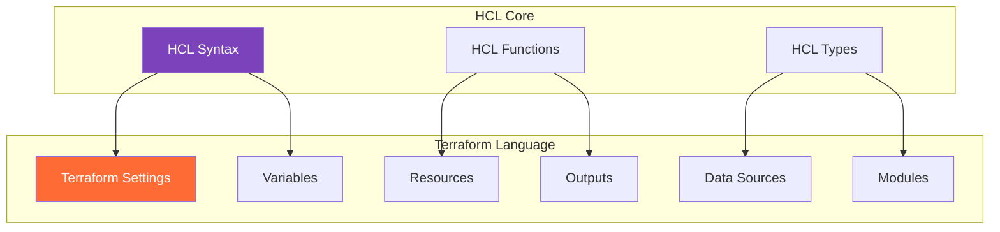

---

## 📝 Module 07: Terraform Language
*Duration: 1.5 hours | Labs: 2*

### 🎯 Learning Objectives
By the end of this module, you will be able to:
- ✅ Understand HCL (HashiCorp Configuration Language) syntax and structure
- ✅ Use Terraform settings blocks effectively
- ✅ Work with alternate JSON syntax when needed
- ✅ Understand the relationship between HCL and Terraform language
- ✅ Apply proper syntax for blocks, arguments, and expressions
- ✅ Use comments and formatting best practices
- ✅ Debug syntax errors and language issues

### 📚 Topics Covered

#### 📖 HashiCorp Configuration Language (HCL)

**HCL** is the underlying language that powers Terraform configurations. It's designed to be both **human-readable** and **machine-friendly**.

**🎯 Key Characteristics:**
- **👥 Human-friendly**: Easy to read and write
- **🤖 Machine-friendly**: Structured and parseable
- **🔧 Extensible**: Can be extended for different use cases
- **🌍 Multi-purpose**: Used across HashiCorp products

**🏗️ HCL vs Terraform Language:**


**📋 HCL is used in:**
- **Terraform**: Infrastructure as Code
- **Vault**: Secrets management policies
- **Consul**: Service configuration
- **Nomad**: Job specifications
- **Packer**: Template definitions
- **Waypoint**: Application configuration

#### 🔍 Understanding Terraform Language vs HCL

**💡 Important Distinction**: 
The **Terraform Language** is built on top of **HCL (HashiCorp Configuration Language)**. Think of HCL as the foundational syntax and grammar, while the Terraform Language adds specific meaning and functionality for infrastructure management.

**🧩 Terraform Language Elements:**

According to the official documentation, the Terraform language consists of only a few basic elements:

1. **📦 Blocks**: Containers for other content that represent an object
   - Have a **block type** (like `resource`, `variable`, `terraform`)
   - Can have **zero or more labels** (like `"aws_instance"` and `"web"`)
   - Contain a **body** with arguments and nested blocks

2. **🏷️ Block Labels**: Names that identify specific instances of blocks

3. **⚙️ Arguments**: Assign values to names within blocks
   - Appear as `name = value` assignments
   - Use identifiers mapped to expressions

4. **🔧 Expressions**: Represent values, either literally or by referencing other values
   - Can appear as argument values
   - Can be used within other expressions
   - Enable dynamic configuration

**📊 Practical Example of Language Elements:**
```hcl
# BLOCK TYPE: "resource"
# BLOCK LABELS: "jamfpro_policy" and "demo_policy"  
resource "jamfpro_policy" "demo_policy" {
  # ARGUMENTS (identifier = expression)
  name                        = "tf-demo-policy"           # Literal string expression
  enabled                     = var.policy_enabled         # Reference expression
  frequency                   = "Once per computer"        # Literal string expression
  trigger_checkin             = true                       # Boolean expression
  category_id                 = jamfpro_category.demo.id   # Reference expression
  
  # NESTED BLOCK
  scope {
    all_computers = false
    computer_ids  = var.target_computer_ids  # Reference to list variable
  }
  
  # NESTED BLOCK
  payloads {
    maintenance {
      recon = true  # Boolean expression
    }
  }
}
```

**🎯 Key Takeaway**: If you encounter **HCL** in documentation or discussions, think "Terraform Language" - they're essentially the same in the context of Terraform configurations!

#### 🧱 HCL Syntax Fundamentals

**📝 Basic Structure:**
```hcl
# This is a comment

# Block with type and label
block_type "label" {
  # Arguments (key-value pairs)
  argument_name = "value"
  another_arg   = 123
  
  # Nested block
  nested_block {
    nested_argument = true
  }
}
```

**🔧 HCL Block Examples:**

**1. Terraform Settings Block**
```hcl
terraform {
  required_version = ">= 1.0"
  required_providers {
    jamfpro = {
      source  = "deploymenttheory/jamfpro"
      version = "~> 0.24"
    }
  }
}
```
The `terraform` block configures Terraform's behavior and requirements. It specifies the minimum Terraform version needed and declares which providers the configuration uses. This block must be present in every Terraform configuration to ensure compatibility and proper provider installation.

**2. Provider Block**
```hcl
provider "jamfpro" {
  jamfpro_instance_fqdn = var.jamfpro_url
  auth_method           = "oauth2"
  client_id             = var.jamfpro_client_id
  client_secret         = var.jamfpro_client_secret
}
```
The `provider` block configures connection details for external APIs or services. Here it establishes authentication with a JamfPro server using OAuth2 credentials. Provider blocks tell Terraform how to communicate with the target infrastructure platform.

**3. Resource Block**
```hcl
resource "jamfpro_category" "demo" {
  name     = "Terraform Demo"
  priority = 10
}
```
Resource blocks define infrastructure objects that Terraform should create, update, or delete. This example creates a new category in JamfPro with specific properties. Resources are the core building blocks of Terraform configurations.

**4. Data Source Block**
```hcl
data "jamfpro_category" "existing" {
  name = "Production"
}
```
Data sources allow Terraform to read information from external systems without managing those resources. This block retrieves details about an existing JamfPro category named "Production". Data sources provide read-only access to infrastructure information for use in other resources.

**5. Variable Block**
```hcl
variable "jamfpro_url" {
  description = "Jamf Pro server URL"
  type        = string
  default     = "https://company.jamfcloud.com"
}
```
Variable blocks define input parameters that make configurations flexible and reusable. This variable allows users to specify different JamfPro server URLs without modifying the main configuration. Variables enable parameterization of Terraform configurations.

**6. Local Values Block**
```hcl
locals {
  common_tags = {
    Environment = "production"
    ManagedBy   = "terraform"
    Project     = "jamfpro-demo"
  }
}
```
Local values compute and store expressions for reuse throughout the configuration. This example defines common tags that can be applied to multiple resources. Locals help reduce duplication and improve maintainability by centralizing computed values.

**7. Output Block**
```hcl
output "category_id" {
  description = "ID of the created demo category"
  value       = jamfpro_category.demo.id
}
```
Output blocks expose values from your configuration for use by other Terraform configurations or external systems. This output provides the ID of a created category for reference elsewhere. Outputs are essential for sharing data between Terraform modules and configurations.

#### ⚙️ Terraform Settings Block

The `terraform` block configures Terraform behavior and requirements.

**📋 Basic Terraform Settings:**
```hcl
terraform {
  # Minimum Terraform version
  required_version = ">= 1.0"
  
  # Required providers
  required_providers {
    jamfpro = {
      source  = "deploymenttheory/jamfpro"
      version = "~> 0.24"
    }
    random = {
      source  = "hashicorp/random"
      version = "~> 3.0"
    }
  }
  
  # Backend configuration
  backend "s3" {
    bucket = "jamfpro-terraform-state"
    key    = "jamfpro-infrastructure/terraform.tfstate"
    region = "us-west-2"
  }
  
  # Experimental features
  experiments = [
    example_alt_syntax
  ]
}
```

**🔧 Advanced Settings:**
```hcl
terraform {
  required_version = ">= 1.0, < 2.0"
  
  required_providers {
    jamfpro = {
      source                = "deploymenttheory/jamfpro"
      version               = "~> 0.24"
      configuration_aliases = [jamfpro.prod, jamfpro.staging]
    }
  }
  
  # Cloud backend (Terraform Cloud)
  cloud {
    organization = "jamfpro-org"
    
    workspaces {
      name = "jamfpro-infrastructure"
    }
  }
  
  # Provider metadata
  provider_meta "jamfpro" {
    module_name = "jamfpro-baseline"
  }
}
```

#### 📊 Version Constraint Operators

Understanding version constraints is crucial for managing provider and Terraform versions effectively. These operators control which versions are acceptable.

**🔧 Version Constraint Operators:**

**1. Exact Version (`=`)**
```hcl
terraform {
  required_providers {
    jamfpro = {
      source  = "deploymenttheory/jamfpro"
      version = "= 0.24.0"  # Exactly version 0.24.0
    }
  }
}
```
Use when you need a specific version for stability or compatibility. Most restrictive option.

**2. Greater Than or Equal (`>=`)**
```hcl
terraform {
  required_version = ">= 1.0"  # Terraform 1.0 or higher
  
  required_providers {
    jamfpro = {
      source  = "deploymenttheory/jamfpro"
      version = ">= 0.20.0"  # Version 0.20.0 or higher
    }
  }
}
```
Ensures minimum version requirements while allowing newer versions. Good for minimum compatibility.

**3. Less Than (`<`)**
```hcl
terraform {
  required_version = "< 2.0"  # Below version 2.0
  
  required_providers {
    jamfpro = {
      source  = "deploymenttheory/jamfpro"
      version = "< 1.0.0"  # Below version 1.0.0
    }
  }
}
```
Prevents using versions above a certain threshold. Useful to avoid breaking changes.

**4. Pessimistic Constraint (`~>`)**
```hcl
terraform {
  required_providers {
    jamfpro = {
      source  = "deploymenttheory/jamfpro"
      version = "~> 0.24"  # 0.24.x (allows 0.24.0, 0.24.1, etc.)
    }
    random = {
      source  = "hashicorp/random"
      version = "~> 3.1.0"  # 3.1.x (allows 3.1.0, 3.1.1, etc.)
    }
  }
}
```
The "pessimistic" operator allows patch-level changes but prevents minor version updates. Most commonly used for stability.

**5. Range Constraints**
```hcl
terraform {
  required_version = ">= 1.0, < 2.0"  # Between 1.0 and 2.0
  
  required_providers {
    jamfpro = {
      source  = "deploymenttheory/jamfpro"
      version = ">= 0.20.0, < 0.30.0"  # Between 0.20.0 and 0.30.0
    }
  }
}
```
Combines multiple constraints for precise version control. Provides flexibility within defined bounds.

**📋 Practical Examples:**

**Conservative Approach (Recommended for Production):**
```hcl
terraform {
  required_version = "~> 1.5"  # 1.5.x series
  
  required_providers {
    jamfpro = {
      source  = "deploymenttheory/jamfpro"
      version = "~> 0.24.0"  # 0.24.x series
    }
  }
}
```

**Flexible Development Approach:**
```hcl
terraform {
  required_version = ">= 1.0"  # Any version 1.0+
  
  required_providers {
    jamfpro = {
      source  = "deploymenttheory/jamfpro"
      version = ">= 0.20.0"  # Any version 0.20.0+
    }
  }
}
```

**🎯 Best Practices:**
- **Production**: Use `~>` for predictable updates (`~> 0.24.0`)
- **Development**: Use `>=` for flexibility (`>= 0.20.0`)
- **Testing**: Use exact versions for reproducibility (`= 0.24.0`)
- **Always specify upper bounds** to avoid unexpected breaking changes

#### 💬 Comments and Formatting

**📝 Comment Styles:**
```hcl
# Single line comment

// Alternative single line comment

/*
  Multi-line comment
  Can span multiple lines
  Useful for documentation blocks
*/

resource "jamfpro_policy" "demo_policy" {
  name                        = "Demo Policy"  # Inline comment
  enabled                     = true           // Alternative inline comment
  frequency                   = "Once per computer"
  trigger_checkin             = true
  
  /*
    Use this for multi line comments
  */
  payloads {
    maintenance {
      recon                       = true
      install_all_cached_packages = var.install_packages
    }
  }
  
  scope {
    all_computers = false
    computer_ids  = var.target_computers
  }
}
```

**🎨 Formatting Best Practices:**
```hcl
# Use consistent indentation (2 spaces recommended)
resource "jamfpro_building" "headquarters" {
  name            = "Corporate HQ"
  street_address1 = "123 Tech Street"
  
  # Align equals signs for readability
  city            = "San Francisco"
  state_province  = "California"
  zip_postal_code = "94105"
  country         = "United States"
}

resource "jamfpro_category" "demo" {
  name     = "Terraform Demo"
  priority = var.category_priority
}

# Use blank lines to separate logical sections
variable "category_priority" {
  description = "Priority level for the category"
  type        = number
  default     = 10
}

variable "jamfpro_environment" {
  description = "JamfPro environment identifier"
  type        = string
  default     = "production"
}
```

#### 🔄 Alternate JSON Syntax

Terraform supports **JSON syntax** as an alternative to HCL for programmatic generation. This is particularly useful when you need to generate Terraform configurations dynamically using existing JSON libraries or APIs.

**📁 File Extensions:**
- **HCL files**: `.tf` 
- **JSON files**: `.tf.json`

**⚠️ Important**: Terraform expects JSON syntax files to be named with the `.tf.json` extension, not just `.json`.

**📝 HCL vs JSON Comparison:**

**HCL Syntax:**
```hcl
resource "jamfpro_category" "demo" {
  name     = "Terraform Demo"
  priority = 10
}
```

**JSON Syntax:**
```json
{
  "resource": {
    "jamfpro_category": {
      "demo": {
        "name": "Terraform Demo",
        "priority": 10
      }
    }
  }
}
```

**🔧 When to Use JSON:**
- **🤖 Programmatic generation**: When generating configs with scripts
- **🔗 API integration**: When receiving configurations from APIs
- **📊 Data processing**: When converting from other data formats
- **🛠️ Tool integration**: When integrating with JSON-based tools

**⚠️ JSON Limitations:**
- **💬 No comments**: JSON doesn't support comments
- **📖 Less readable**: More verbose than HCL
- **🔧 Limited expressions**: Some Terraform features work better in HCL

**🐍 Practical Example: Generating JSON with Python**

Here's how you might programmatically generate Terraform JSON configurations:

```python
#!/usr/bin/env python3
import json

def generate_terraform_json(categories):
    """Generate Terraform JSON configuration for multiple JamfPro categories"""
    
    terraform_config = {
        "terraform": {
            "required_providers": {
                "jamfpro": {
                    "source": "deploymenttheory/jamfpro",
                    "version": "~> 0.24"
                }
            }
        },
        "resource": {
            "jamfpro_category": {}
        }
    }
    
    # Dynamically add categories
    for category in categories:
        terraform_config["resource"]["jamfpro_category"][category["name"]] = {
            "name": category["display_name"],
            "priority": category["priority"]
        }
    
    return terraform_config

# Example usage
categories_data = [
    {
        "name": "security_tools", 
        "display_name": "Security Tools", 
        "priority": 5
    },
    {
        "name": "productivity_apps", 
        "display_name": "Productivity Applications", 
        "priority": 10
    }
]

# Generate and save configuration
config = generate_terraform_json(categories_data)
with open("main.tf.json", "w") as f:
    json.dump(config, f, indent=2)

print("Generated main.tf.json successfully!")
```

**📄 Generated `main.tf.json`:**
```json
{
  "terraform": {
    "required_providers": {
      "jamfpro": {
        "source": "deploymenttheory/jamfpro",
        "version": "~> 0.24"
      }
    }
  },
  "resource": {
    "jamfpro_category": {
      "security_tools": {
        "name": "Security Tools",
        "priority": 5
      },
      "productivity_apps": {
        "name": "Productivity Applications",
        "priority": 10
      }
    }
  }
}
```

### 💻 **Exercise 6.1**: HCL Syntax and Structure
**Duration**: 20 minutes

Let's practice HCL syntax by creating a well-structured Terraform configuration.

**Step 1: Setup Project Structure**
```bash
# Create new project directory
mkdir ~/terraform-language-demo
cd ~/terraform-language-demo

# Open in VS Code
code .
```

**Step 2: Create a Comprehensive Configuration**

Create `main.tf` with proper HCL syntax:
```hcl
/*
  Terraform Language Demo
  
  This configuration demonstrates proper HCL syntax,
  formatting, and structure best practices.
*/

terraform {
  required_version = ">= 1.0"
  
  required_providers {
    aws = {
      source  = "hashicorp/aws"
      version = "~> 5.0"
    }
    random = {
      source  = "hashicorp/random"
      version = "~> 3.0"
    }
    local = {
      source  = "hashicorp/local"
      version = "~> 2.0"
    }
  }
}

# Provider configuration with proper formatting
provider "aws" {
  region = var.aws_region
  
  # Default tags applied to all resources
  default_tags {
    tags = local.common_tags
  }
}

# Local values for computed and reusable values
locals {
  # Environment-specific settings
  environment = var.environment
  
  # Common tags applied to all resources
  common_tags = {
    Environment = local.environment
    Project     = "terraform-language-demo"
    ManagedBy   = "terraform"
    Owner       = "platform-team"
  }
  
  # Computed naming convention
  name_prefix = "${local.environment}-demo"
  
  # Configuration map
  instance_config = {
    dev = {
      instance_type = "t2.micro"
      volume_size   = 20
    }
    staging = {
      instance_type = "t2.small"
      volume_size   = 30
    }
    prod = {
      instance_type = "t2.medium"
      volume_size   = 50
    }
  }
}

# Random ID for unique resource naming
resource "random_id" "suffix" {
  byte_length = 4
}

# Data source to get latest AMI
data "aws_ami" "ubuntu" {
  most_recent = true
  owners      = ["099720109477"] # Canonical
  
  filter {
    name   = "name"
    values = ["ubuntu/images/hvm-ssd/ubuntu-jammy-22.04-amd64-server-*"]
  }
  
  filter {
    name   = "virtualization-type"
    values = ["hvm"]
  }
}

# VPC for our resources
resource "aws_vpc" "main" {
  cidr_block           = "10.0.0.0/16"
  enable_dns_hostnames = true
  enable_dns_support   = true
  
  tags = merge(local.common_tags, {
    Name = "${local.name_prefix}-vpc"
  })
}

# Internet Gateway
resource "aws_internet_gateway" "main" {
  vpc_id = aws_vpc.main.id
  
  tags = merge(local.common_tags, {
    Name = "${local.name_prefix}-igw"
  })
}

# Public subnet
resource "aws_subnet" "public" {
  vpc_id                  = aws_vpc.main.id
  cidr_block              = "10.0.1.0/24"
  availability_zone       = data.aws_availability_zones.available.names[0]
  map_public_ip_on_launch = true
  
  tags = merge(local.common_tags, {
    Name = "${local.name_prefix}-public-subnet"
    Type = "public"
  })
}

# Data source for availability zones
data "aws_availability_zones" "available" {
  state = "available"
}

# Security group with proper formatting
resource "aws_security_group" "web" {
  name_prefix = "${local.name_prefix}-web-"
  vpc_id      = aws_vpc.main.id
  description = "Security group for web servers"
  
  # HTTP access
  ingress {
    description = "HTTP"
    from_port   = 80
    to_port     = 80
    protocol    = "tcp"
    cidr_blocks = ["0.0.0.0/0"]
  }
  
  # HTTPS access
  ingress {
    description = "HTTPS"
    from_port   = 443
    to_port     = 443
    protocol    = "tcp"
    cidr_blocks = ["0.0.0.0/0"]
  }
  
  # SSH access (conditional based on environment)
  dynamic "ingress" {
    for_each = local.environment != "prod" ? [1] : []
    
    content {
      description = "SSH"
      from_port   = 22
      to_port     = 22
      protocol    = "tcp"
      cidr_blocks = [aws_vpc.main.cidr_block]
    }
  }
  
  # All outbound traffic
  egress {
    from_port   = 0
    to_port     = 0
    protocol    = "-1"
    cidr_blocks = ["0.0.0.0/0"]
  }
  
  tags = merge(local.common_tags, {
    Name = "${local.name_prefix}-web-sg"
  })
}

# EC2 instance with environment-specific configuration
resource "aws_instance" "web" {
  ami           = data.aws_ami.ubuntu.id
  instance_type = local.instance_config[local.environment].instance_type
  subnet_id     = aws_subnet.public.id
  
  vpc_security_group_ids = [aws_security_group.web.id]
  
  root_block_device {
    volume_type = "gp3"
    volume_size = local.instance_config[local.environment].volume_size
    encrypted   = true
    
    tags = merge(local.common_tags, {
      Name = "${local.name_prefix}-web-root-volume"
    })
  }
  
  user_data = base64encode(templatefile("${path.module}/user_data.sh", {
    environment = local.environment
    project     = "terraform-language-demo"
  }))
  
  tags = merge(local.common_tags, {
    Name = "${local.name_prefix}-web-${random_id.suffix.hex}"
    Type = "web-server"
  })
}

# Local file to demonstrate local provider
resource "local_file" "deployment_info" {
  filename = "${path.module}/deployment-info.json"
  
  content = jsonencode({
    deployment_id = random_id.suffix.hex
    environment   = local.environment
    timestamp     = timestamp()
    resources = {
      vpc_id      = aws_vpc.main.id
      subnet_id   = aws_subnet.public.id
      instance_id = aws_instance.web.id
    }
  })
}
```

**Step 3: Create Supporting Files**

Create `variables.tf`:
```hcl
# Input variables with proper documentation and validation

variable "aws_region" {
  description = "AWS region for resource deployment"
  type        = string
  default     = "us-west-2"
  
  validation {
    condition     = can(regex("^[a-z0-9-]+$", var.aws_region))
    error_message = "AWS region must be a valid region identifier."
  }
}

variable "environment" {
  description = "Environment name (dev, staging, prod)"
  type        = string
  default     = "dev"
  
  validation {
    condition     = contains(["dev", "staging", "prod"], var.environment)
    error_message = "Environment must be one of: dev, staging, prod."
  }
}

variable "allowed_cidr_blocks" {
  description = "List of CIDR blocks allowed to access resources"
  type        = list(string)
  default     = ["0.0.0.0/0"]
  
  validation {
    condition = alltrue([
      for cidr in var.allowed_cidr_blocks :
      can(cidrhost(cidr, 0))
    ])
    error_message = "All values must be valid CIDR blocks."
  }
}
```

Create `outputs.tf`:
```hcl
# Output values with proper descriptions

output "vpc_info" {
  description = "VPC information"
  value = {
    id         = aws_vpc.main.id
    cidr_block = aws_vpc.main.cidr_block
    arn        = aws_vpc.main.arn
  }
}

output "instance_info" {
  description = "EC2 instance information"
  value = {
    id          = aws_instance.web.id
    public_ip   = aws_instance.web.public_ip
    private_ip  = aws_instance.web.private_ip
    ami_id      = aws_instance.web.ami
    type        = aws_instance.web.instance_type
  }
}

output "deployment_metadata" {
  description = "Deployment metadata"
  value = {
    environment     = local.environment
    deployment_id   = random_id.suffix.hex
    name_prefix     = local.name_prefix
    availability_zone = aws_subnet.public.availability_zone
  }
}

# Sensitive output example
output "internal_endpoints" {
  description = "Internal service endpoints"
  sensitive   = true
  value = {
    private_ip = aws_instance.web.private_ip
    subnet_id  = aws_subnet.public.id
  }
}
```

Create `user_data.sh`:
```bash
#!/bin/bash
# User data script with template variables

# Update system
apt-get update
apt-get upgrade -y

# Install basic packages
apt-get install -y nginx htop curl wget

# Create index page
cat > /var/www/html/index.html << EOF
<!DOCTYPE html>
<html>
<head>
    <title>Terraform Language Demo</title>
    <style>
        body { font-family: Arial, sans-serif; margin: 40px; }
        .info { background: #f0f8ff; padding: 20px; border-radius: 5px; }
        .highlight { color: #7B42BC; font-weight: bold; }
    </style>
</head>
<body>
    <h1>📝 Terraform Language Demo</h1>
    <div class="info">
        <h2>Configuration Details</h2>
        <p><strong>Environment:</strong> <span class="highlight">${environment}</span></p>
        <p><strong>Project:</strong> <span class="highlight">${project}</span></p>
        <p><strong>Deployed:</strong> $(date)</p>
        <p><strong>Server:</strong> $(hostname)</p>
    </div>
    <p>This server was provisioned using proper HCL syntax and formatting!</p>
</body>
</html>
EOF

# Start nginx
systemctl start nginx
systemctl enable nginx

# Log deployment
echo "$(date): Server provisioned for environment: ${environment}" >> /var/log/terraform-deployment.log
```

**Step 4: Test and Validate**
```bash
# Initialize Terraform
terraform init

# Validate syntax and configuration
terraform validate

# Format code (notice the improvements)
terraform fmt

# Plan with different environments
terraform plan -var="environment=dev"
terraform plan -var="environment=staging"
terraform plan -var="environment=prod"

# Check for syntax issues
terraform plan -detailed-exitcode
```

💡 **Pro Tip**: Notice how proper formatting and comments make the configuration much more readable and maintainable!

#### 🐛 Debugging Language Issues

**🔧 Common HCL Syntax Errors:**

1. **Missing Quotes:**
```hcl
# ❌ Incorrect
resource aws_instance web {
  ami = ami-12345
}

# ✅ Correct  
resource "aws_instance" "web" {
  ami = "ami-12345"
}
```

2. **Incorrect Block Structure:**
```hcl
# ❌ Incorrect
resource "aws_instance" "web" 
  ami = "ami-12345"
  instance_type = "t2.micro"

# ✅ Correct
resource "aws_instance" "web" {
  ami           = "ami-12345"
  instance_type = "t2.micro"
}
```

3. **Invalid Characters in Identifiers:**
```hcl
# ❌ Incorrect
resource "aws_instance" "web-server-1" {
  # Hyphens not allowed in resource names
}

# ✅ Correct
resource "aws_instance" "web_server_1" {
  # Underscores are allowed
}
```

**🛠️ Debugging Commands:**
```bash
# Check syntax
terraform validate

# Format and check for issues
terraform fmt -check

# Detailed validation
terraform validate -json

# Enable debug logging
export TF_LOG=DEBUG
terraform plan
```

#### 🎨 Style Guide and Best Practices

**📏 Formatting Standards:**
- **Indentation**: Use 2 spaces (not tabs)
- **Alignment**: Align equals signs for readability
- **Spacing**: Use blank lines to separate logical sections
- **Comments**: Use `#` for single-line, `/* */` for multi-line

**🏗️ Structure Best Practices:**
```hcl
# 1. Terraform settings at the top
terraform {
  required_version = ">= 1.0"
  # ... provider requirements
}

# 2. Provider configurations
provider "aws" {
  # ... configuration
}

# 3. Local values
locals {
  # ... computed values
}

# 4. Data sources
data "aws_ami" "ubuntu" {
  # ... data source configuration
}

# 5. Resources (grouped logically)
resource "aws_vpc" "main" {
  # ... resource configuration
}

# 6. Outputs at the end
output "vpc_id" {
  # ... output configuration
}
```

**📝 Naming Conventions:**
- **Resources**: Use descriptive names (`web_server`, not `instance1`)
- **Variables**: Use snake_case (`instance_type`, not `instanceType`)
- **Outputs**: Be descriptive (`vpc_info`, not `vpc`)
- **Tags**: Use consistent naming (`Environment`, `Project`, `ManagedBy`)

---

## ✅ Module 6 Summary

### 🎯 Key Takeaways
- **📖 HCL** is the human-friendly language that powers Terraform
- **⚙️ Terraform settings block** configures behavior and requirements
- **🔄 JSON syntax** is available for programmatic generation
- **💬 Comments and formatting** improve code readability and maintainability
- **🐛 Proper syntax** prevents errors and improves debugging
- **🎨 Style consistency** makes configurations more professional
- **🏗️ Structure standards** improve code organization

### 🔑 Essential Concepts Learned
- HCL syntax fundamentals (blocks, arguments, expressions)
- Terraform settings block configuration
- Comment styles and formatting best practices
- JSON vs HCL syntax comparison
- Debugging and validation techniques
- Professional style guidelines

### 💡 Pro Tips Recap
- Always use `terraform fmt` to maintain consistent formatting
- Add meaningful comments for complex configurations
- Use descriptive names for resources and variables
- Structure files logically with clear sections
- Validate syntax regularly during development
- Prefer HCL over JSON for human-written configurations

---

## 📚 Quiz - Module 7: Terraform Language & HCL

**Test your knowledge of HCL syntax, Terraform Language, and configuration best practices!**

### 🧠 Knowledge Check Questions

**1. What is the relationship between HCL and Terraform Language?**
- a) They are the same thing
- b) HCL is the foundational syntax, Terraform Language adds infrastructure-specific meaning
- c) Terraform Language is older than HCL
- d) HCL is only used for JSON configurations

<details>
<summary>📖 <strong>Answer</strong></summary>

**✅ Correct Answer: b) HCL is the foundational syntax, Terraform Language adds infrastructure-specific meaning**

**📝 Explanation**: 
HCL (HashiCorp Configuration Language) provides the foundational syntax and grammar, while the Terraform Language builds on top of HCL to add specific meaning and functionality for infrastructure management. HCL is used across multiple HashiCorp tools (Vault, Consul, Nomad, etc.), while Terraform Language is specific to infrastructure configurations.
</details>

---

**2. Which of the following are the four basic elements of the Terraform Language?**
- a) Resources, Data Sources, Variables, Outputs
- b) Blocks, Block Labels, Arguments, Expressions
- c) HCL, JSON, YAML, TOML
- d) Providers, Resources, Modules, State

<details>
<summary>📖 <strong>Answer</strong></summary>

**✅ Correct Answer: b) Blocks, Block Labels, Arguments, Expressions**

**📝 Explanation**: 
According to the Terraform documentation, the language consists of only these four basic elements:
- **Blocks**: Containers for content representing objects
- **Block Labels**: Names identifying specific block instances  
- **Arguments**: Name-value assignments within blocks
- **Expressions**: Values that can be literal or reference other values
</details>

---

**3. What file extension should you use for Terraform files written in JSON syntax?**
- a) `.json`
- b) `.tf`
- c) `.tf.json`
- d) `.hcl.json`

<details>
<summary>📖 <strong>Answer</strong></summary>

**✅ Correct Answer: c) `.tf.json`**

**📝 Explanation**: 
Terraform expects JSON syntax files to be named with the `.tf.json` extension, not just `.json`. This tells Terraform to parse the file as a Terraform configuration written in JSON syntax rather than HCL syntax.
</details>

---

**4. In this code block, identify the block type and block labels:**
```hcl
resource "aws_instance" "web_server" {
  ami = "ami-12345"
}
```
- a) Block type: `aws_instance`, Block labels: `web_server`
- b) Block type: `resource`, Block labels: `aws_instance`, `web_server`
- c) Block type: `resource`, Block labels: `aws_instance`
- d) Block type: `web_server`, Block labels: `aws_instance`

<details>
<summary>📖 <strong>Answer</strong></summary>

**✅ Correct Answer: b) Block type: `resource`, Block labels: `aws_instance`, `web_server`**

**📝 Explanation**: 
- **Block type**: `resource` (the first identifier)
- **Block labels**: `"aws_instance"` and `"web_server"` (the quoted strings that follow)
- The block type defines what kind of object this represents, while the labels identify the specific resource type and instance name.
</details>

---

**5. Which comment styles are supported in HCL? (Select all that apply)**
- a) `# Single line comment`
- b) `// Alternative single line comment` 
- c) `/* Multi-line comment */`
- d) `<!-- XML-style comment -->`

<details>
<summary>📖 <strong>Answer</strong></summary>

**✅ Correct Answers: a, b, c**

**📝 Explanation**: 
HCL supports three comment styles:
- `# Single line comment` - Hash-style comments
- `// Alternative single line comment` - C++-style comments  
- `/* Multi-line comment */` - C-style multi-line comments

XML-style comments (`<!-- -->`) are not supported in HCL.
</details>

---

**6. What is a major limitation of using JSON syntax instead of HCL for Terraform configurations?**
- a) JSON syntax doesn't support resources
- b) JSON files are larger than HCL files
- c) JSON doesn't support comments
- d) JSON syntax is slower to parse

<details>
<summary>📖 <strong>Answer</strong></summary>

**✅ Correct Answer: c) JSON doesn't support comments**

**📝 Explanation**: 
One of the major limitations of JSON syntax is that it doesn't support comments, making it harder to document your configurations. Other limitations include being more verbose and less readable than HCL, but the lack of comment support is the most significant practical limitation.
</details>

---

**7. In which scenarios would you choose JSON syntax over HCL? (Select all that apply)**
- a) When writing configurations manually
- b) When generating configurations programmatically  
- c) When integrating with APIs that return JSON
- d) When you need to add detailed comments

<details>
<summary>📖 <strong>Answer</strong></summary>

**✅ Correct Answers: b, c**

**📝 Explanation**: 
JSON syntax is most useful for:
- **Programmatic generation**: When scripts or tools generate configurations
- **API integration**: When receiving configurations from APIs in JSON format
- **Data processing**: When converting from other JSON-based data formats

You would not choose JSON for manual writing (HCL is more readable) or when you need comments (JSON doesn't support them).
</details>

---

**8. What does this Terraform settings block configure?**
```hcl
terraform {
  required_version = ">= 1.0"
  required_providers {
    aws = {
      source  = "hashicorp/aws"
      version = "~> 5.0"
    }
  }
}
```
- a) Only the minimum Terraform version
- b) Only the required providers
- c) Both minimum Terraform version and required providers
- d) Backend configuration

<details>
<summary>📖 <strong>Answer</strong></summary>

**✅ Correct Answer: c) Both minimum Terraform version and required providers**

**📝 Explanation**: 
This Terraform settings block configures:
- **Required version**: Specifies minimum Terraform version (1.0 or higher)
- **Required providers**: Specifies the AWS provider with source and version constraints
- It does not configure backend settings (that would require a `backend` block)
</details>

---

**9. Which HashiCorp tools use HCL as their configuration language? (Select all that apply)**
- a) Terraform
- b) Vault  
- c) Consul
- d) Docker
- e) Packer

<details>
<summary>📖 <strong>Answer</strong></summary>

**✅ Correct Answers: a, b, c, e**

**📝 Explanation**: 
HCL is used by multiple HashiCorp tools:
- **Terraform**: Infrastructure as Code configurations
- **Vault**: Secrets management policies  
- **Consul**: Service configuration
- **Packer**: Template definitions
- **Nomad**: Job specifications
- **Waypoint**: Application configuration

Docker is not a HashiCorp product and uses its own configuration formats.
</details>

---

**10. What makes HCL "human-friendly" compared to other configuration languages?**
- a) It uses XML syntax
- b) It's designed to be easy to read and write
- c) It only supports simple data types
- d) It doesn't allow nested structures

<details>
<summary>📖 <strong>Answer</strong></summary>

**✅ Correct Answer: b) It's designed to be easy to read and write**

**📝 Explanation**: 
HCL is considered "human-friendly" because:
- Clean, readable syntax similar to other modern languages
- Supports both simple and complex data structures  
- Allows comments for documentation
- Balances readability with machine-parseability
- Less verbose than JSON while maintaining structure

It supports complex data types and nested structures, making it more powerful than simpler formats.
</details>

---

### 🎯 **Module 6 Summary**

**🏆 Key Learning Achievements:**
- ✅ Distinguished between **HCL** and **Terraform Language**
- ✅ Mastered the **four basic elements**: Blocks, Labels, Arguments, Expressions
- ✅ Understood **Terraform settings** block configuration
- ✅ Learned **alternate JSON syntax** and when to use it
- ✅ Applied **best practices** for syntax and formatting
- ✅ Practiced with **comprehensive examples** and hands-on exercises

**🎉 Congratulations!** You've completed Module 6 and now understand HCL syntax, Terraform language features, and best practices for writing clean, maintainable configurations!

**➡️ Ready for Module 7?** Let me know when you'd like to continue with Variables and Data - where we'll explore advanced variable types, validation, and data sources!

---

---

## 🔗 **Next Steps**

Ready to continue your Terraform journey? Proceed to the next module:

**➡️ [Module 8: Variables and Data](./module_08_variables_and_data.md)**

Master variable management, data sources, and configuration flexibility.

---
