---

## 📝 Module 07: Terraform Language
*Duration: 1.5 hours | Labs: 2*

### 🎯 Learning Objectives
By the end of this module, you will be able to:
- ✅ Understand HCL (HashiCorp Configuration Language) syntax and structure
- ✅ Use Terraform settings blocks effectively
- ✅ Work with alternate JSON syntax when needed
- ✅ Understand the relationship between HCL and Terraform language
- ✅ Apply proper syntax for blocks, arguments, and expressions
- ✅ Use comments and formatting best practices
- ✅ Debug syntax errors and language issues

### 📚 Topics Covered

#### 📖 HashiCorp Configuration Language (HCL)

**HCL** is the underlying language that powers Terraform configurations and all HashiCorp products. It's designed to be both **human-readable** and **machine-friendly**.

**🎯 Key Characteristics:**
- **👥 Human-friendly**: Easy to read and write
- **🤖 Machine-friendly**: Structured and parseable
- **🔧 Extensible**: Can be extended for different use cases
- **🌍 Multi-purpose**: Used across HashiCorp products

**🏗️ HCL Foundation vs Terraform Language:**

**💡 Key Relationship**: HCL provides the foundational syntax and capabilities, while Terraform Language uses these foundations to create infrastructure-specific constructs.

```mermaid
graph LR
    HCL["🏗️ HCL Foundation<br/>• Syntax & Grammar<br/>• Functions & Types<br/>• Comments & Structure"] 
    TF["⚙️ Terraform Language<br/>• Infrastructure Blocks<br/>• Resource Management<br/>• Configuration Logic"]
    
    HCL --> TF
    
    style HCL fill:#7B42BC,color:#fff
    style TF fill:#FF6B35,color:#fff
```



**📚 Throughout this module, we'll explore each HCL foundation layer in detail with supporting diagrams.**

**📋 HCL is used in:**

- **Terraform**: Infrastructure as Code / Configuration as Code
- **Vault**: Secure, store, and tightly control access to tokens, passwords, certificates, encryption keys for protecting secrets, and other sensitive data using a UI, CLI, or HTTP API.
- **Consul**: service networking solution that enables teams to manage secure network connectivity between services, across on-prem, hybrid cloud, and multi-cloud environments and runtimes. Consul offers service discovery, service mesh, identity-based authorization, L7 traffic management, and secure service-to-service encryption.
- **Nomad**: A simple and flexible scheduler and orchestrator to deploy and manage containers and non-containerized applications across on-prem and clouds at scale
- **Packer**: a tool that lets you create identical machine OS images for multiple platforms from a single source template. Packer can create golden images to use in image pipelines.
- **Waypoint**: lets platform teams define golden patterns and workflows for developers to manage applications at scale.

#### 🔍 Understanding Terraform Language vs HCL

**💡 Important Distinction**: 
The **Terraform Language** is built on top of **HCL (HashiCorp Configuration Language)**. Think of HCL as the foundational syntax and grammar, while the Terraform Language adds specific meaning and functionality for infrastructure management.

**🧩 Terraform Language Elements:**

The Terraform language consists of only a few basic elements:

1. **📦 Blocks**: Containers for other content that represent an object
   - Each block has a **block type** (like `resource`, `variable`, `terraform`)
   - Can have **zero or more labels** (like `"aws_instance"` and `"web"`)
   - Contain a **body** with arguments and nested blocks

2. **🏷️ Block Labels**: Names that identify specific instances of blocks (like `"policy_example_1"` and `"policy_example_2"`)

3. **⚙️ Arguments**: Assign values to names within blocks
   - Appear as `name = value` assignments
   - Use identifiers mapped to expressions

4. **🔧 Expressions**: Represent values, either literally or by referencing other values
   - Can appear as argument values
   - Can be used within other expressions
   - Enable dynamic configuration

**📊 Practical Example of Language Elements:**

In this example, we have a `resource` block with the type `jamfpro_policy` and the label `demo_policy`. The block has a body with arguments and nested blocks. The arguments are `name`, `enabled`, `frequency`, `trigger_checkin`, and `category_id`. The nested block is `scope` with the arguments `all_computers` and `computer_ids`.

```hcl
# BLOCK TYPE: "resource"
# BLOCK LABELS: "jamfpro_policy" and "demo_policy"  
resource "jamfpro_policy" "demo_policy" {
  # ARGUMENTS (identifier = expression)
  name                        = "tf-demo-policy"           # Literal string expression
  enabled                     = var.policy_enabled         # Reference expression
  frequency                   = "Once per computer"        # Literal string expression
  trigger_checkin             = true                       # Boolean expression
  category_id                 = jamfpro_category.demo.id   # Reference expression
  
  # NESTED BLOCK
  scope {
    all_computers = false
    computer_ids  = var.target_computer_ids  # References to a list variable
  }
  
  # NESTED BLOCK
  payloads {
    maintenance {
      recon = true  # Boolean expression
    }
  }
}
```

**🎯 Key Takeaway**: If you encounter **HCL** in documentation or discussions, think "Terraform Language" - they're essentially the same in the context of Terraform configurations! HCL is also used across all other hashicorp products.

#### 🧱 HCL Syntax Fundamentals

**📊 HCL Syntax Components:**


**📝 Basic Structure:**
```hcl
# This is a comment

# Block with type and label
block_type "label" {
  # Arguments (key-value pairs)
  argument_name = "value"
  another_arg   = 123
  
  # Nested block
  nested_block {
    nested_argument = true
  }
}
```

**🔧 HCL Block Examples:**

**1. Terraform Settings Block**
```hcl
terraform {
  required_version = ">= 1.0"
  required_providers {
    jamfpro = {
      source  = "deploymenttheory/jamfpro"
      version = "~> 0.24"
    }
  }
}
```
The `terraform` block configures Terraform's behavior and defines the provider requirements for the configuration. It specifies the Terraform version needed and declares which providers versions are required too. LAter we shall look at how to define these using version constraints. 

This block must be present in every Terraform configuration created, it won't work without it. This is also known as the root module.

**2. Provider Block**
```hcl
provider "jamfpro" {
  jamfpro_instance_fqdn = var.jamfpro_url
  auth_method           = "oauth2"
  client_id             = var.jamfpro_client_id
  client_secret         = var.jamfpro_client_secret
}
```
The `provider` block configures connection details for external APIs or services. Here it establishes authentication with a JamfPro server using OAuth2 credentials. Provider blocks tell Terraform how to communicate with the target infrastructure platform. This block must also be present in every Terraform configuration created, it won't work without it. For each provider defined in the `terraform` block, a correlating `provider` block must be present. The specifics of each provider block will vary based on the provider. You should always check the provider documentation in the terraform [registry](https://registry.terraform.io/) for the correct syntax.

**3. Resource Block**
```hcl
resource "jamfpro_category" "demo" {
  name     = "Terraform Demo"
  priority = 10
}
```
Resource blocks define infrastructure objects or saas resources that Terraform should create, update, or delete. This example creates a new category in JamfPro with specific properties. Resources are the core building blocks of Terraform configurations.

**4. Data Source Block**
```hcl
data "jamfpro_category" "existing" {
  name = "Production"
}
```
Data sources allow Terraform to read information from external systems without managing those resources directly. This block retrieves details about an existing JamfPro category named "Production". Data sources provide read-only access to infrastructure / saas resource information for use in other resources. A common use case for data sources are for referencing pre-existing resources that was implemented outside of Terraform.

**5. Variable Block**
```hcl
variable "jamfpro_url" {
  description = "Jamf Pro server URL"
  type        = string
  default     = "https://company.jamfcloud.com"
}
```
Variable blocks define input parameters that make configurations flexible and reusable. This variable allows users to specify different JamfPro server URLs without modifying the main configuration. Variables enable parameterization of Terraform configurations and can support validation logic to ensure the correct values are passed in. A common use case for variables are for passing in environment variables or other configuration values that are different for each environment. Another common use case is for passing in sensitive values that should not be stored in the configuration file.

**6. Local Values Block**
```hcl
locals {
  common_tags = {
    Environment = "production"
    ManagedBy   = "terraform"
    Project     = "jamfpro-demo"
  }
}
```
Local values compute and store expressions for reuse throughout the configuration. This example defines common tags that can be applied to multiple resources. Locals help reduce duplication (DRY principle) and improve maintainability by centralizing computed values.

**7. Output Block**
```hcl
output "category_id" {
  description = "ID of the created demo category"
  value       = jamfpro_category.demo.id
}
```
Output blocks expose values from your configuration for use by other Terraform configurations or external systems. This output provides the ID of a created category for reference elsewhere. Outputs are essential for sharing data between Terraform modules and configurations.

#### ⚙️ Compilation Process

**🔄 HCL Runtime Compilation:**

Terraform compiles all HCL files at runtime, meaning **file names don't affect functionality**. All `.tf` files in a directory are parsed and merged into a single configuration.

**📁 File Naming Conventions:**

While file names are arbitrary, the Terraform community follows these conventional patterns:

**🏗️ Core Configuration Files:**
```hcl
# terraform.tf - Terraform settings and requirements
terraform {
  required_version = ">= 1.0"
  required_providers {
    jamfpro = {
      source  = "deploymenttheory/jamfpro"
      version = "~> 0.24"
    }
  }
}

# providers.tf - Provider configurations
provider "jamfpro" {
  jamfpro_instance_fqdn = var.jamfpro_instance_fqdn
  auth_method          = "oauth2"
  client_id            = var.client_id
  client_secret        = var.client_secret
}

# variables.tf - Input variable declarations  
variable "jamfpro_instance_fqdn" {
  description = "FQDN of the Jamf Pro instance"
  type        = string
  sensitive   = true
}

# locals.tf - Local value definitions
locals {
  environment_prefix = "${var.environment}-${var.organization}"
  common_tags = {
    Environment   = var.environment
    ManagedBy    = "terraform"
    Project      = "jamfpro-infrastructure"
  }
}

# data.tf - Data source declarations
data "jamfpro_site" "default" {
  name = "Default Site"
}

# main.tf - Primary resource definitions
resource "jamfpro_category" "security" {
  name     = "${local.environment_prefix}-Security"
  priority = 10
}

# outputs.tf - Output value definitions
output "category_id" {
  description = "ID of the security category"
  value       = jamfpro_category.security.id
}
```


**💡 Key Points:**
- **Runtime Parsing**: All `.tf` files are loaded simultaneously
- **Order Independence**: Files are processed in alphabetical order, but dependencies determine execution
- **Naming Freedom**: You could name files `apple.tf`, `banana.tf` - functionality remains identical
- **Convention Benefits**: Standard naming improves team collaboration and code maintainability

**🔍 Alternative Naming Patterns:**
```
# Feature-based naming
jamfpro-app-installers.tf
jamfpro-policies.tf
jamfpro-groups.tf

# Environment-based naming  
production.tf
staging.tf
development.tf

# Component-based naming
networking.tf
security.tf
monitoring.tf
cisv1-baseline.tf
```

**💡 Pro Tip for Larger Configurations:**

In larger Terraform projects, consider additional organizational factors:

- **File Length**: Keep individual files manageable (typically under 500-1000 lines)
- **Logical Type Grouping**: Group similar resource types together (all policies, all groups, all categories)
- **Logical Outcome Grouping**: Group resources that work together to achieve a specific outcome or business function
- **Module Structure**: Break complex configurations into reusable modules for better maintainability

#### ⚙️ Terraform Settings Block

The `terraform` block configures Terraform behavior and requirements.

**📋 Basic Terraform Settings:**
```hcl
terraform {
  # Minimum Terraform version
  required_version = ">= 1.0"
  
  # Required providers
  required_providers {
    jamfpro = {
      source  = "deploymenttheory/jamfpro"
      version = "~> 0.24"
    }
    random = {
      source  = "hashicorp/random"
      version = "~> 3.0"
    }
  }
  
  # Backend configuration
  backend "s3" {
    bucket = "jamfpro-terraform-state"
    key    = "jamfpro-infrastructure/terraform.tfstate"
    region = "us-west-2"
  }
  
  # Experimental features
  experiments = [
    example_alt_syntax
  ]
}
```

**🔧 Advanced Settings:**
```hcl
terraform {
  required_version = ">= 1.0, < 2.0"
  
  required_providers {
    jamfpro = {
      source                = "deploymenttheory/jamfpro"
      version               = "~> 0.24"
      configuration_aliases = [jamfpro.prod, jamfpro.staging]
    }
  }
  
  # Cloud backend (Terraform Cloud)
  cloud {
    organization = "jamfpro-org"
    
    workspaces {
      name = "jamfpro-infrastructure"
    }
  }
  
  # Provider metadata
  provider_meta "jamfpro" {
    module_name = "jamfpro-baseline"
  }
}
```

#### 📊 Version Constraint Operators

**🔢 HCL Types in Version Constraints:**


Understanding version constraints is crucial for managing Terraform provider and terraform moduleversions effectively. These operators control which versions are acceptable.

**🔧 Version Constraint Operators:**

**1. Exact Version (`=`)**
```hcl
terraform {
  required_providers {
    jamfpro = {
      source  = "deploymenttheory/jamfpro"
      version = "= 0.24.0"  # Exactly version 0.24.0
    }
  }
}
```
Use when you need a specific version for stability or compatibility. Most restrictive option.

**2. Greater Than or Equal (`>=`)**
```hcl
terraform {
  required_version = ">= 1.0"  # Terraform 1.0 or higher
  
  required_providers {
    jamfpro = {
      source  = "deploymenttheory/jamfpro"
      version = ">= 0.20.0"  # Version 0.20.0 or higher
    }
  }
}
```
Ensures minimum version requirements while allowing newer versions. Good for minimum compatibility.

**3. Less Than (`<`)**
```hcl
terraform {
  required_version = "< 2.0"  # Below version 2.0
  
  required_providers {
    jamfpro = {
      source  = "deploymenttheory/jamfpro"
      version = "< 1.0.0"  # Below version 1.0.0
    }
  }
}
```
Prevents using versions above a certain threshold. Useful to avoid breaking changes.

**4. Pessimistic Constraint (`~>`)**
```hcl
terraform {
  required_providers {
    jamfpro = {
      source  = "deploymenttheory/jamfpro"
      version = "~> 0.24"  # 0.24.x (allows 0.24.0, 0.24.1, etc.)
    }
    random = {
      source  = "hashicorp/random"
      version = "~> 3.1.0"  # 3.1.x (allows 3.1.0, 3.1.1, etc.)
    }
  }
}
```
The "pessimistic" operator allows patch-level changes but prevents minor version updates. Most commonly used for stability.

**5. Range Constraints**
```hcl
terraform {
  required_version = ">= 1.0, < 2.0"  # Between 1.0 and 2.0
  
  required_providers {
    jamfpro = {
      source  = "deploymenttheory/jamfpro"
      version = ">= 0.20.0, < 0.30.0"  # Between 0.20.0 and 0.30.0
    }
  }
}
```
Combines multiple constraints for precise version control. Provides flexibility within defined bounds.

**📋 Practical Examples:**

**Conservative Approach (Recommended for Production):**
```hcl
terraform {
  required_version = "~> 1.5"  # 1.5.x series
  
  required_providers {
    jamfpro = {
      source  = "deploymenttheory/jamfpro"
      version = "~> 0.24.0"  # 0.24.x series
    }
  }
}
```

**Flexible Development Approach:**
```hcl
terraform {
  required_version = ">= 1.0"  # Any version 1.0+
  
  required_providers {
    jamfpro = {
      source  = "deploymenttheory/jamfpro"
      version = ">= 0.20.0"  # Any version 0.20.0+
    }
  }
}
```

**🎯 Best Practices:**
- **Production**: Use `~>` for predictable updates (`~> 0.24.0`)
- **Development**: Use `>=` for flexibility (`>= 0.20.0`)
- **Testing**: Use exact versions for reproducibility (`= 0.24.0`)
- **Always specify upper bounds** to avoid unexpected breaking changes

#### 💬 Comments and Formatting

**💬 HCL Comment System:**


**📝 Comment Styles:**
```hcl
# Single line comment

// Alternative single line comment

resource "jamfpro_policy" "demo_policy" {
  name                        = "Demo Policy"  # Inline comment
  enabled                     = true           // Alternative inline comment
  frequency                   = "Once per computer"
  trigger_checkin             = true
  
  /*
  Multi-line comment
  Can span multiple lines
  Useful for documentation blocks
 */
  payloads {
    maintenance {
      recon                       = true
      install_all_cached_packages = var.install_packages
    }
  }
  
  scope {
    all_computers = false
    computer_ids  = var.target_computers
  }
}
```

**🎨 Formatting Best Practices:**
```hcl
# Use consistent indentation (2 spaces recommended)
resource "jamfpro_building" "headquarters" {
  name            = "Corporate HQ"
  street_address1 = "123 Tech Street"
  
  # Align equals signs for readability
  city            = "San Francisco"
  state_province  = "California"
  zip_postal_code = "94105"
  country         = "United States"
}

resource "jamfpro_category" "demo" {
  name     = "Terraform Demo"
  priority = var.category_priority
}

# Use blank lines to separate logical sections
variable "category_priority" {
  description = "Priority level for the category"
  type        = number
  default     = 10
}

variable "jamfpro_environment" {
  description = "JamfPro environment identifier"
  type        = string
  default     = "production"
}
```

**💡 Pro Tip:**
- **Formatting**: You can use the `terraform fmt` command to auto-format your code to ensure consistent formatting.

#### 🔄 Alternate JSON Syntax

**🔄 HCL Functions in Action:**

```mermaid
graph TB
    subgraph "HCL Built-in Functions"
        STR["📝 String Functions<br/>format(), join(), split()<br/>upper(), lower(), trim()"]
        MATH["🔢 Math Functions<br/>max(), min(), ceil()<br/>floor(), abs()"]
        COL["📋 Collection Functions<br/>length(), keys(), values()<br/>merge(), concat()"]
        DT["📅 Date/Time Functions<br/>timestamp(), formatdate()<br/>timeadd()"]
    end
    
    subgraph "Usage Contexts"
        VAR["Variables<br/>default values"]
        RES["Resources<br/>dynamic values"]
        OUT["Outputs<br/>computed values"]
        LOC["Locals<br/>calculations"]
    end
    
    STR --> VAR
    STR --> RES
    MATH --> RES
    MATH --> LOC
    COL --> OUT
    COL --> LOC
    DT --> OUT
    
    style STR fill:#3498DB,color:#fff
    style MATH fill:#E74C3C,color:#fff
    style COL fill:#2ECC71,color:#fff
    style DT fill:#F39C12,color:#fff
    style VAR fill:#9B59B6,color:#fff
    style RES fill:#8E44AD,color:#fff
    style OUT fill:#A569BD,color:#fff
    style LOC fill:#7B68EE,color:#fff
```


Terraform supports **JSON syntax** as an alternative to HCL for programmatic generation. This is particularly useful when you need to generate Terraform configurations dynamically using existing JSON libraries or APIs.

**📁 File Extensions:**
- **HCL files**: `.tf` 
- **JSON files**: `.tf.json`

**⚠️ Important**: Terraform expects JSON syntax files to be named with the `.tf.json` extension, not just `.json`.

**📝 HCL vs JSON Comparison:**

**HCL Syntax:**
```hcl
resource "jamfpro_category" "demo" {
  name     = "Terraform Demo"
  priority = 10
}
```

**JSON Syntax:**
```json
{
  "resource": {
    "jamfpro_category": {
      "demo": {
        "name": "Terraform Demo",
        "priority": 10
      }
    }
  }
}
```

**🔧 When to Use JSON:**
- **🤖 Programmatic generation**: When generating configs with scripts
- **🔗 API integration**: When receiving configurations from APIs
- **📊 Data processing**: When converting from other data formats
- **🛠️ Tool integration**: When integrating with JSON-based tools

**⚠️ JSON Limitations:**
- **💬 No comments**: JSON doesn't support comments
- **📖 Less readable**: More verbose than HCL
- **🔧 Limited expressions**: Some Terraform features work better in HCL

**🐍 Practical Example: Generating JSON with Python**

Here's how you might programmatically generate Terraform JSON configurations:

```python
#!/usr/bin/env python3
import json

def generate_terraform_json(categories):
    """Generate Terraform JSON configuration for multiple JamfPro categories"""
    
    terraform_config = {
        "terraform": {
            "required_providers": {
                "jamfpro": {
                    "source": "deploymenttheory/jamfpro",
                    "version": "~> 0.24"
                }
            }
        },
        "resource": {
            "jamfpro_category": {}
        }
    }
    
    # Dynamically add categories
    for category in categories:
        terraform_config["resource"]["jamfpro_category"][category["name"]] = {
            "name": category["display_name"],
            "priority": category["priority"]
        }
    
    return terraform_config

# Example usage
categories_data = [
    {
        "name": "security_tools", 
        "display_name": "Security Tools", 
        "priority": 5
    },
    {
        "name": "productivity_apps", 
        "display_name": "Productivity Applications", 
        "priority": 10
    }
]

# Generate and save configuration
config = generate_terraform_json(categories_data)
with open("main.tf.json", "w") as f:
    json.dump(config, f, indent=2)

print("Generated main.tf.json successfully!")
```

**📄 Generated `main.tf.json`:**
```json
{
  "terraform": {
    "required_providers": {
      "jamfpro": {
        "source": "deploymenttheory/jamfpro",
        "version": "~> 0.24"
      }
    }
  },
  "resource": {
    "jamfpro_category": {
      "security_tools": {
        "name": "Security Tools",
        "priority": 5
      },
      "productivity_apps": {
        "name": "Productivity Applications",
        "priority": 10
      }
    }
  }
}
```

### 💻 **Unit Exercises**: HCL Language Practice

**🎯 Goal**: Master HCL syntax through focused, bite-sized exercises

#### **Exercise 1: Terraform Settings Block**
**Duration**: 3 minutes

**Task**: Create a `terraform.tf` file with proper version constraints

```hcl
# Create terraform.tf
terraform {
  required_version = "~> 1.5"
  
  required_providers {
    jamfpro = {
      source  = "deploymenttheory/jamfpro"
      version = "~> 0.24.0"
    }
  }
}
```

**Expected Terminal Output:**

```bash
$ terraform init
```

```
Initializing the backend...
Initializing provider plugins...
- Finding deploymenttheory/jamfpro versions matching "~> 0.24.0"...
- Installing deploymenttheory/jamfpro v0.24.0...
- Installed deploymenttheory/jamfpro v0.24.0 (self-signed, key ID DB95CA76A94A208C)

Partner and community providers are signed by their developers.
If you'd like to know more about provider signing, you can read about it here:
https://developer.hashicorp.com/terraform/cli/plugins/signing

Terraform has created a lock file .terraform.lock.hcl to record the provider
selections it made above. Include this file in your version control repository
so that Terraform can guarantee to make the same selections by default when
you run "terraform init" in the future.

Terraform has been successfully initialized!

You may now begin working with Terraform. Try running "terraform plan" to see
any changes that are required for your infrastructure. All Terraform commands
should now work.

If you ever set or change modules or backend configuration for Terraform,
rerun this command to reinitialize your working directory. If you forget, other
commands will detect it and remind you to do so if necessary.
```

```bash
$ terraform validate
```

```
Success! The configuration is valid.
```

**Practice**: Try different version constraints (`>=`, `<`, `~>`, exact versions)

**Testing Different Version Constraints:**
*For each test, update your `terraform.tf` file with the new version constraint, remove existing `.terraform` directory and `.terraform.lock.hcl` file, then run `terraform init` to see the behavior.*

**1. Exact Version (`= 0.24.0`):**

Update your `terraform.tf`:
```hcl
terraform {
  required_version = "~> 1.5"
  
  required_providers {
    jamfpro = {
      source  = "deploymenttheory/jamfpro"
      version = "= 0.24.0"  # Exact version
    }
  }
}
```

Clean and initialize:
```bash
$ rm -rf .terraform .terraform.lock.hcl
$ terraform init
```
```bash
$ terraform init
```
```
Initializing the backend...
Initializing provider plugins...
- Finding deploymenttheory/jamfpro versions matching "0.24.0"...
- Installing deploymenttheory/jamfpro v0.24.0...
- Installed deploymenttheory/jamfpro v0.24.0 (self-signed, key ID DB95CA76A94A208C)

Terraform has been successfully initialized!
```

**2. Pessimistic Constraint (`~> 0.24`):**

Update your `terraform.tf`:
```hcl
terraform {
  required_version = "~> 1.5"
  
  required_providers {
    jamfpro = {
      source  = "deploymenttheory/jamfpro"
      version = "~> 0.24"  # Pessimistic constraint
    }
  }
}
```

Clean and initialize:
```bash
$ rm -rf .terraform .terraform.lock.hcl
$ terraform init
```
```
Initializing the backend...
Initializing provider plugins...
- Finding deploymenttheory/jamfpro versions matching "~> 0.24"...
- Installing deploymenttheory/jamfpro v0.24.0...
- Installed deploymenttheory/jamfpro v0.24.0 (self-signed, key ID DB95CA76A94A208C)

Terraform has been successfully initialized!
```

**3. Greater Than or Equal (`>= 0.20.0`):**

Update your `terraform.tf`:
```hcl
terraform {
  required_version = "~> 1.5"
  
  required_providers {
    jamfpro = {
      source  = "deploymenttheory/jamfpro"
      version = ">= 0.20.0"  # Greater than or equal
    }
  }
}
```

Clean and initialize:
```bash
$ rm -rf .terraform .terraform.lock.hcl
$ terraform init
```
```
Initializing the backend...
Initializing provider plugins...
- Finding deploymenttheory/jamfpro versions matching ">= 0.20.0"...
- Installing deploymenttheory/jamfpro v0.24.0...
- Installed deploymenttheory/jamfpro v0.24.0 (self-signed, key ID DB95CA76A94A208C)

Terraform has been successfully initialized!
```

**4. Less Than Constraint (`< 0.25.0`):**

Update your `terraform.tf`:
```hcl
terraform {
  required_version = "~> 1.5"
  
  required_providers {
    jamfpro = {
      source  = "deploymenttheory/jamfpro"
      version = "< 0.25.0"  # Less than
    }
  }
}
```

Clean and initialize:
```bash
$ rm -rf .terraform .terraform.lock.hcl
$ terraform init
```
```
Initializing the backend...
Initializing provider plugins...
- Finding deploymenttheory/jamfpro versions matching "< 0.25.0"...
- Installing deploymenttheory/jamfpro v0.24.0...
- Installed deploymenttheory/jamfpro v0.24.0 (self-signed, key ID DB95CA76A94A208C)

Terraform has been successfully initialized!
```

**5. Restrictive Less Than (`< 0.20.0`) - Uses Older Version:**

Update your `terraform.tf`:
```hcl
terraform {
  required_version = "~> 1.5"
  
  required_providers {
    jamfpro = {
      source  = "deploymenttheory/jamfpro"
      version = "< 0.20.0"  # Restrictive less than
    }
  }
}
```

Clean and initialize:
```bash
$ rm -rf .terraform .terraform.lock.hcl
$ terraform init
```
```
Initializing the backend...
Initializing provider plugins...
- Finding deploymenttheory/jamfpro versions matching "< 0.20.0"...
- Installing deploymenttheory/jamfpro v0.19.1...
- Installed deploymenttheory/jamfpro v0.19.1 (self-signed, key ID DB95CA76A94A208C)

Terraform has been successfully initialized!
```

**6. Invalid Version (`= 0.99.0`) - Shows Error:**

Update your `terraform.tf`:
```hcl
terraform {
  required_version = "~> 1.5"
  
  required_providers {
    jamfpro = {
      source  = "deploymenttheory/jamfpro"
      version = "= 0.99.0"  # Non-existent version
    }
  }
}
```

Clean and initialize:
```bash
$ rm -rf .terraform .terraform.lock.hcl
$ terraform init
```
```
Error: Failed to query available provider packages

Could not retrieve the list of available versions for provider
deploymenttheory/jamfpro: no available releases match the given constraints
0.99.0

To see which modules are currently depending on deploymenttheory/jamfpro
and what versions are specified, run the following command:
    terraform providers

Initializing the backend...
Initializing provider plugins...
- Finding deploymenttheory/jamfpro versions matching "0.99.0"...
```

**7. Range Constraints (Combined `>=` and `<`):**

Update your `terraform.tf`:
```hcl
terraform {
  required_version = "~> 1.5"
  
  required_providers {
    jamfpro = {
      source  = "deploymenttheory/jamfpro"
      version = ">= 0.20.0, < 0.25.0"  # Range constraint
    }
  }
}
```

Clean and initialize:
```bash
$ rm -rf .terraform .terraform.lock.hcl
$ terraform init
```
```
Initializing the backend...
Initializing provider plugins...
- Finding deploymenttheory/jamfpro versions matching ">= 0.20.0, < 0.25.0"...
- Installing deploymenttheory/jamfpro v0.24.0...
- Installed deploymenttheory/jamfpro v0.24.0 (self-signed, key ID DB95CA76A94A208C)

Terraform has been successfully initialized!
```

**8. Pessimistic Constraint Examples with AWS Provider:**

Let's test pessimistic constraints with AWS provider to see major/minor version behavior:

Update your `terraform.tf`:
```hcl
terraform {
  required_version = "~> 1.5"
  
  required_providers {
    jamfpro = {
      source  = "deploymenttheory/jamfpro"
      version = "~> 0.24.0"
    }
    aws = {
      source  = "hashicorp/aws"
      version = "~> 5.31"  # Allows 5.31.x but not 5.32.x
    }
  }
}
```

Clean and initialize:
```bash
$ rm -rf .terraform .terraform.lock.hcl
$ terraform init
```
```
Initializing the backend...
Initializing provider plugins...
- Finding deploymenttheory/jamfpro versions matching "~> 0.24.0"...
- Finding hashicorp/aws versions matching "~> 5.31"...
- Installing deploymenttheory/jamfpro v0.24.0...
- Installing hashicorp/aws v5.31.0...
- Installed deploymenttheory/jamfpro v0.24.0 (self-signed, key ID DB95CA76A94A208C)
- Installed hashicorp/aws v5.31.0 (signed by HashiCorp)

Terraform has been successfully initialized!
```

Now try with a broader pessimistic constraint:

Update your `terraform.tf`:
```hcl
terraform {
  required_version = "~> 1.5"
  
  required_providers {
    aws = {
      source  = "hashicorp/aws"
      version = "~> 5.0"  # Allows any 5.x version
    }
  }
}
```

Clean and initialize:
```bash
$ rm -rf .terraform .terraform.lock.hcl
$ terraform init
```
```
Initializing the backend...
Initializing provider plugins...
- Finding hashicorp/aws versions matching "~> 5.0"...
- Installing hashicorp/aws v5.75.0...  # Latest 5.x version
- Installed hashicorp/aws v5.75.0 (signed by HashiCorp)

Terraform has been successfully initialized!
```

**9. Advanced Constraint Examples with Azure Provider:**

Let's test the `!=` (not equal) operator and more complex constraints:

Update your `terraform.tf`:
```hcl
terraform {
  required_version = "~> 1.5"
  
  required_providers {
    azurerm = {
      source  = "hashicorp/azurerm"
      version = ">= 3.0, != 3.45.0, < 4.0"  # Complex constraint
    }
  }
}
```

Clean and initialize:
```bash
$ rm -rf .terraform .terraform.lock.hcl
$ terraform init
```
```
Initializing the backend...
Initializing provider plugins...
- Finding hashicorp/azurerm versions matching ">= 3.0.0, != 3.45.0, < 4.0.0"...
- Installing hashicorp/azurerm v3.117.1...
- Installed hashicorp/azurerm v3.117.1 (signed by HashiCorp)

Terraform has been successfully initialized!
```

**10. Pre-release Version Example:**

Update your `terraform.tf`:
```hcl
terraform {
  required_version = "~> 1.5"
  
  required_providers {
    # Note: This is a hypothetical example - most providers don't have pre-release versions available
    example = {
      source  = "hashicorp/example"
      version = "= 2.1.0-beta"  # Exact pre-release version
    }
  }
}
```
*Note: Pre-release versions require exact matching with `=` operator*

**📚 Official Documentation:**
For complete details on version constraints, see: [Terraform Version Constraints Documentation](https://developer.hashicorp.com/terraform/language/expressions/version-constraints)

**🔧 Complete Version Constraint Operator Reference:**

| Operator | Description | Example | Behavior |
|----------|-------------|---------|----------|
| `=` or none | Allows only exact version | `= 1.2.0` or `1.2.0` | Installs exactly version 1.2.0 |
| `!=` | Excludes exact version | `!= 1.2.0` | Any version except 1.2.0 |
| `>`, `>=` | Greater than (or equal) | `>= 1.2.0` | Version 1.2.0 or newer |
| `<`, `<=` | Less than (or equal) | `< 2.0.0` | Any version before 2.0.0 |
| `~>` | Pessimistic constraint | `~> 1.2.0` | Allows 1.2.x but not 1.3.0 |
| `,` | Multiple constraints | `>= 1.2.0, < 2.0.0` | Version between 1.2.0 and 2.0.0 |

**Key Observations:**
- **Exact matching**: `=` and no operator work identically for exact versions
- **Exclusion**: `!=` excludes specific problematic versions while allowing others
- **Range constraints** (`>= 0.20.0, < 0.25.0`) allow precise control over acceptable versions
- **Pessimistic constraints** (`~>`) behavior depends on precision:
  - `~> 5.31.0` allows 5.31.1, 5.31.2, etc. but NOT 5.32.0
  - `~> 5.31` allows 5.31.0, 5.32.0, 5.99.0, etc. but NOT 6.0.0
  - `~> 5.0` allows 5.1.0, 5.75.0, etc. but NOT 6.0.0
- **Pre-release versions** require exact matching and don't work with range operators
- **Complex constraints** can combine multiple operators for fine-grained control
- Invalid version constraints result in clear error messages
- Terraform provides helpful suggestions when constraints fail
- Multiple providers with different constraints can be specified in the same block

**🎯 Best Practices from HashiCorp:**
- **Root modules**: Use `~>` constraints to set both lower and upper bounds
- **Reusable modules**: Constrain only minimum versions (e.g., `>= 0.12.0`) for flexibility
- **Production environments**: Pin to specific ranges to avoid unexpected updates
- **Development**: Use broader constraints for latest features and bug fixes

---

#### **Exercise 2: Provider Configuration**
**Duration**: 5 minutes

**Task**: Create a `providers.tf` file with JamfPro provider setup using official configuration from the [Terraform Registry](https://registry.terraform.io/providers/deploymenttheory/jamfpro/latest/docs)

**OAuth2 Authentication (Recommended):**

Create `providers.tf`:
```hcl
# JamfPro provider configuration using OAuth2 authentication
provider "jamfpro" {
  jamfpro_instance_fqdn    = "https://company.jamfcloud.com"  # Your JamfPro server URL
  auth_method              = "oauth2"                         # Authentication method (oauth2 or basic_auth)
  client_id                = "your-client-id"                 # OAuth2 client ID
  client_secret            = "your-client-secret"             # OAuth2 client secret
  jamfpro_load_balancer_lock = true                          # Recommended for Jamf Cloud instances
}
```

**Expected Terminal Output:**

```bash
$ terraform init
```

```
Initializing the backend...
Initializing provider plugins...
- Finding deploymenttheory/jamfpro versions matching "~> 0.24.0"...
- Installing deploymenttheory/jamfpro v0.24.0...
- Installed deploymenttheory/jamfpro v0.24.0 (self-signed, key ID DB95CA76A94A208C)

Partner and community providers are signed by their developers.
If you'd like to know more about provider signing, you can read about it here:
https://developer.hashicorp.com/terraform/cli/plugins/signing

Terraform has created a lock file .terraform.lock.hcl to record the provider
selections it made above. Include this file in your version control repository
so that Terraform can guarantee to make the same selections by default when
you run "terraform init" in the future.

Terraform has been successfully initialized!
```

```bash
$ terraform validate
```

```
Success! The configuration is valid.
```

**Alternative: Basic Authentication**

You can also use basic authentication (though OAuth2 is recommended):

```hcl
# JamfPro provider configuration using basic authentication
provider "jamfpro" {
  jamfpro_instance_fqdn = "https://company.jamfcloud.com"  # Your JamfPro server URL
  auth_method           = "basic_auth"                     # Authentication method (oauth2 or basic_auth)
  username              = "your-username"                  # Basic auth username
  password              = "your-password"                  # Basic auth password
  jamfpro_load_balancer_lock = true                       # Recommended for Jamf Cloud instances
}
```

**Key Provider Configuration Options:**

| Parameter | Required | Description |
|-----------|----------|-------------|
| `jamfpro_instance_fqdn` | Yes | Full URL of your JamfPro instance |
| `auth_method` | Yes | `"oauth2"` or `"basic_auth"` |
| `client_id` | OAuth2 only | OAuth2 client identifier |
| `client_secret` | OAuth2 only | OAuth2 client secret |
| `username` | Basic Auth only | Username for basic authentication |
| `password` | Basic Auth only | Password for basic authentication |
| `jamfpro_load_balancer_lock` | No | `true` (recommended for Jamf Cloud) |

**🔧 Important Notes:**
- **OAuth2 is recommended** for production environments
- **`jamfpro_load_balancer_lock = true`** is recommended for Jamf Cloud instances
- The provider supports both on-premises and cloud JamfPro instances
- Set `parallelism = 1` in terraform commands for reliability (covered in advanced topics)

**Practice**: Try both authentication methods and observe the validation behavior

---

#### **Exercise 3: Simple Resource Block**
**Duration**: 5 minutes

**Task**: Create a `category.tf` file with a JamfPro category

```hcl
# Create category.tf
resource "jamfpro_category" "security" {
  name     = "Security Tools"  # Category display name
  priority = 10               # Priority level (1-20)
}
```

**Expected Terminal Output:**

```bash
$ terraform validate
```

```
Success! The configuration is valid.
```

```bash
$ terraform plan
```

```
Terraform used the selected providers to generate the following execution
plan. Resource actions are indicated with the following symbols:
  + create

Terraform will perform the following actions:

  # jamfpro_category.security will be created
  + resource "jamfpro_category" "security" {
      + id       = (known after apply)
      + name     = "Security Tools"
      + priority = 10
    }

Plan: 1 to add, 0 to change, 0 to destroy.
```

```bash
$ terraform apply -auto-approve
```

```
Terraform used the selected providers to generate the following execution
plan. Resource actions are indicated with the following symbols:
  + create

Terraform will perform the following actions:

  # jamfpro_category.security will be created
  + resource "jamfpro_category" "security" {
      + id       = (known after apply)
      + name     = "Security Tools"
      + priority = 10
    }

Plan: 1 to add, 0 to change, 0 to destroy.
jamfpro_category.security: Creating...
jamfpro_category.security: Creation complete after 1s [id=36650]

Apply complete! Resources: 1 added, 0 changed, 0 destroyed.
```

**Practice**: 
- Add inline comments explaining each parameter
- Try different category names and priority values
- Observe the resource creation process and assigned ID

---

#### **Exercise 4: Data Source Practice**
**Duration**: 5 minutes

**Task**: Create a `data.tf` file to read existing JamfPro data (references the category created in Exercise 3)

```hcl
# Create data.tf
data "jamfpro_category" "existing" {
  name = "Security Tools"  # References the category created in Exercise 3
}
```

**Expected Terminal Output:**

```bash
$ terraform plan
```

```
data.jamfpro_category.existing: Reading...
jamfpro_category.security: Refreshing state... [id=36650]
data.jamfpro_category.existing: Read complete after 0s [id=36650]

No changes. Your infrastructure matches the configuration.

Terraform has compared your real infrastructure against your configuration
and found no differences, so no changes are needed.
```

**Practice**: Use the data source in a resource reference

**Example of referencing data source attributes:**
```hcl
# Example: Create another resource that references the data source
resource "jamfpro_policy" "example" {
  name                        = "Example Policy"
  enabled                     = true
  category_id                 = data.jamfpro_category.existing.id  # Reference data source ID
  frequency                   = "Once per computer"
  trigger_checkin             = true
}
```

**Key Observations:**
- Data sources are **read-only** - they retrieve information without managing resources
- Data sources are evaluated during `terraform plan` and `terraform apply`
- You can reference data source attributes using `data.<type>.<name>.<attribute>` syntax
- Data sources must reference **existing** resources (created in Exercise 3)
- The data source ID matches the resource ID (`36650` in this example)

---

#### **Exercise 5: Variables and Outputs**
**Duration**: 7 minutes

**Task**: Create `variables.tf` and `outputs.tf` files, then test variables and view outputs

**Step 1**: Create variables.tf
```hcl
# Input variables for JamfPro configuration
variable "category_name" {
  description = "Name of the JamfPro category"
  type        = string
  default     = "Security Tools"
}

variable "category_priority" {
  description = "Priority level for the category (1-20)"
  type        = number
  default     = 10
  
  validation {
    condition     = var.category_priority >= 1 && var.category_priority <= 20
    error_message = "Category priority must be between 1 and 20."
  }
}

variable "environment" {
  description = "Environment name"
  type        = string
  default     = "sandbox"
}
```

**Step 2**: Create outputs.tf
```hcl
# Output values from JamfPro resources
output "category_id" {
  description = "ID of the created JamfPro category"
  value       = jamfpro_category.security.id
}

output "category_name" {
  description = "Name of the created JamfPro category"
  value       = jamfpro_category.security.name
}

output "category_priority" {
  description = "Priority of the created JamfPro category"
  value       = jamfpro_category.security.priority
}

output "data_source_reference" {
  description = "Category name from data source"
  value       = data.jamfpro_category.existing.name
}
```

**Step 3**: Update category.tf to use variables
```hcl
# Create a JamfPro category using variables
resource "jamfpro_category" "security" {
  name     = var.category_name     # Category display name from variable
  priority = var.category_priority # Priority level from variable (1-20)
}
```

**Step 4**: Validate and apply to see outputs
```bash
terraform validate
```
**Expected Output:**
```
Success! The configuration is valid.
```

```bash
terraform plan
```
**Expected Output:**
```
data.jamfpro_category.existing: Reading...
jamfpro_category.security: Refreshing state... [id=36650]
data.jamfpro_category.existing: Read complete after 1s [id=36650]

Changes to Outputs:
  + category_id           = "36650"
  + category_name         = "Security Tools"
  + category_priority     = 10
  + data_source_reference = "Security Tools"

You can apply this plan to save these new output values to the Terraform
state, without changing any real infrastructure.
```

```bash
terraform apply -auto-approve
```
**Expected Output:**
```
data.jamfpro_category.existing: Reading...
jamfpro_category.security: Refreshing state... [id=36650]
data.jamfpro_category.existing: Read complete after 0s [id=36650]

Changes to Outputs:
  + category_id           = "36650"
  + category_name         = "Security Tools"
  + category_priority     = 10
  + data_source_reference = "Security Tools"

You can apply this plan to save these new output values to the Terraform
state, without changing any real infrastructure.

Apply complete! Resources: 0 added, 0 changed, 0 destroyed.

Outputs:

category_id = "36650"
category_name = "Security Tools"
category_priority = 10
data_source_reference = "Security Tools"
```

**Step 5**: Test with custom variable values
```bash
terraform plan -var="category_name=Development Tools" -var="category_priority=5"
```
**Expected Output:**
```
data.jamfpro_category.existing: Reading...
jamfpro_category.security: Refreshing state... [id=36650]
data.jamfpro_category.existing: Read complete after 0s [id=36650]

Terraform used the selected providers to generate the following execution
plan. Resource actions are indicated with the following symbols:
  ~ update in-place

Terraform will perform the following actions:

  # jamfpro_category.security will be updated in-place
  ~ resource "jamfpro_category" "security" {
        id       = "36650"
      ~ name     = "Security Tools" -> "Development Tools"
      ~ priority = 10 -> 5
    }

Plan: 0 to add, 1 to change, 0 to destroy.

Changes to Outputs:
  ~ category_name         = "Security Tools" -> "Development Tools"
  ~ category_priority     = 10 -> 5
```

**Step 6**: Test variable validation
```bash
terraform plan -var="category_priority=25"
```
**Expected Output:**
```
╷
│ Error: Invalid value for variable
│ 
│   on variables.tf line 8:
│    8: variable "category_priority" {
│     ├────────────────
│     │ var.category_priority is 25
│ 
│ Category priority must be between 1 and 20.
│ 
│ This was checked by the validation rule at variables.tf:13,3-13.
╵
```

**Step 7**: View outputs
```bash
terraform output
```
**Expected Output:**
```
category_id = "36650"
category_name = "Security Tools"
category_priority = 10
data_source_reference = "Security Tools"
```

```bash
terraform output category_id
```
**Expected Output:**
```
"36650"
```

**Step 8**: Create terraform.tfvars (optional)
```hcl
# Example variable values file
category_name     = "Security Tools"
category_priority = 10
environment      = "sandbox"
```

**Practice**: Variables provide flexibility and reusability. Outputs expose values for other configurations or external systems to use.

---

#### **Exercise 6: Local Values**
**Duration**: 4 minutes

**Task**: Create `locals.tf` for computed values and use them in resources

**Step 1**: Create locals.tf
```hcl
# Local values for computed expressions
locals {
  environment = "production"
  
  common_tags = {
    Environment = local.environment
    ManagedBy   = "terraform"
    Team        = "platform"
  }
  
  category_name = "${local.environment}-${var.category_name}"
  category_full_name = "${local.common_tags.Team}-${local.category_name}"
}
```

**Step 2**: Update category.tf to use local value
```hcl
# Create a JamfPro category using variables and locals
resource "jamfpro_category" "security" {
  name     = local.category_name   # Category display name from local value
  priority = var.category_priority # Priority level from variable (1-20)
}
```

**Step 3**: Update data.tf to use local value
```hcl
# Read an existing JamfPro category using data source
data "jamfpro_category" "existing" {
  name = local.category_name  # References the category with computed local name
}
```

**Step 4**: Add local outputs to outputs.tf
```hcl
output "local_environment" {
  description = "Environment from local value"
  value       = local.environment
}

output "local_common_tags" {
  description = "Common tags from local value"
  value       = local.common_tags
}

output "local_category_name" {
  description = "Computed category name from local"
  value       = local.category_name
}

output "local_category_full_name" {
  description = "Full computed category name"
  value       = local.category_full_name
}
```

**Step 5**: Validate and apply
```bash
terraform validate
```
**Expected Output:**
```
Success! The configuration is valid.
```

```bash
terraform apply -auto-approve
```
**Expected Output:**
```
data.jamfpro_category.existing: Reading...
jamfpro_category.security: Refreshing state... [id=36650]
data.jamfpro_category.existing: Read complete after 0s [id=36650]

Changes to Outputs:
  ~ data_source_reference    = "Security Tools" -> "production-Security Tools"
  + local_category_full_name = "platform-production-Security Tools"
  + local_category_name      = "production-Security Tools"
  + local_common_tags        = {
      + Environment = "production"
      + ManagedBy   = "terraform"
      + Team        = "platform"
    }
  + local_environment        = "production"

You can apply this plan to save these new output values to the Terraform
state, without changing any real infrastructure.

Apply complete! Resources: 0 added, 0 changed, 0 destroyed.

Outputs:

category_id = "36650"
category_name = "production-Security Tools"
category_priority = 10
data_source_reference = "production-Security Tools"
local_category_full_name = "platform-production-Security Tools"
local_category_name = "production-Security Tools"
local_common_tags = {
  "Environment" = "production"
  "ManagedBy" = "terraform"
  "Team" = "platform"
}
local_environment = "production"
```

**Step 6**: View specific local outputs
```bash
terraform output local_environment
```
**Expected Output:**
```
"production"
```

```bash
terraform output local_common_tags
```
**Expected Output:**
```
{
  "Environment" = "production"
  "ManagedBy" = "terraform"
  "Team" = "platform"
}
```

**Practice**: Locals compute and store expressions for reuse. They help reduce duplication and improve maintainability by centralizing computed values.

---

#### **Exercise 7: Comments Practice**
**Duration**: 3 minutes

**Task**: Add all three comment styles to your existing files

**Step 1**: Add comprehensive comments to category.tf
```hcl
# Create a JamfPro category using variables and locals
# This category will be used to organize security-related policies and packages
resource "jamfpro_category" "security" {
  name     = local.category_name   // Uses computed local value for consistency
  priority = var.category_priority // Inline comment: Priority affects ordering in JamfPro UI
  
  /*
    Multi-line comment explaining the purpose:
    This category serves as an organizational structure for security tools
    and policies within the JamfPro environment. The priority setting
    determines where this category appears in lists and menus.
  */
}
```

**Step 2**: Add comments to variables.tf demonstrating all three styles
```hcl
# Input variables for JamfPro configuration
# These variables allow customization of the category configuration

/*
  The category_name variable defines the base name for our JamfPro category.
  This will be combined with environment prefixes in local values
  to create a consistent naming convention across environments.
*/
variable "category_name" {
  description = "Name of the JamfPro category"
  type        = string
  default     = "Security Tools" // Default focuses on security tooling
}

# Priority variable with validation to ensure JamfPro compatibility
variable "category_priority" {
  description = "Priority level for the category (1-20)"
  type        = number
  default     = 10 // Mid-range priority for general security tools
  
  /*
    Validation block ensures the priority value is within JamfPro's
    accepted range. Values outside 1-20 would cause API errors
    when creating or updating categories in JamfPro.
  */
  validation {
    condition     = var.category_priority >= 1 && var.category_priority <= 20
    error_message = "Category priority must be between 1 and 20."
  }
}
```

**Step 3**: Add comments to locals.tf
```hcl
# Local values for computed expressions
# These locals centralize string manipulation and tagging logic

/*
  Local values help avoid repetition and provide computed values
  that can be reused throughout the configuration. This approach
  ensures consistency and makes it easier to maintain naming conventions.
*/
locals {
  environment = "production" // Override for production deployment
  
  /*
    Standard tags applied to all resources for:
    - Environment identification
    - Resource ownership tracking  
    - Team accountability
  */
  common_tags = {
    Environment = local.environment  // References the local environment value
    ManagedBy   = "terraform"        // Indicates infrastructure as code
    Team        = "platform"         // Responsible team for maintenance
  }
  
  # Computed category name with environment prefix for uniqueness
  category_name = "${local.environment}-${var.category_name}"
  
  # Full category name including team prefix for complete identification
  category_full_name = "${local.common_tags.Team}-${local.category_name}" // Combines team and category info
}
```

**Step 4**: Validate configuration with comments
```bash
terraform validate
```
**Expected Output:**
```
Success! The configuration is valid.
```

```bash
terraform plan
```
**Expected Output:**
```
data.jamfpro_category.existing: Reading...
jamfpro_category.security: Refreshing state... [id=36650]
data.jamfpro_category.existing: Read complete after 0s [id=36650]

No changes. Your infrastructure matches the configuration.

Terraform has compared your real infrastructure against your configuration
and found no differences, so no changes are needed.
```

**Comment Style Guidelines:**
- **Single-line comments (#)**: Use for brief explanations above blocks
- **Inline comments (//)**: Use for short clarifications on specific lines  
- **Multi-line comments (/* */)**: Use for detailed explanations of complex logic

**Practice**: Document your configuration with 'why' comments, not 'what' comments. Comments should explain the reasoning and context behind decisions.

---

#### **Exercise 8: JSON Syntax Conversion**
**Duration**: 8 minutes

**Task**: Convert your category resource to JSON syntax and compare with HCL

**Step 1**: Create JSON variables file (variables.tf.json)
```json
{
  "variable": {
    "json_category_name": {
      "description": "Category name for JSON example",
      "type": "string",
      "default": "JSON Security Tools"
    },
    "json_priority": {
      "description": "Priority for JSON category",
      "type": "number",
      "default": 15
    }
  }
}
```

**Step 2**: Create JSON resource file (category.tf.json)
```json
{
  "resource": {
    "jamfpro_category": {
      "json_example": {
        "name": "${var.json_category_name}",
        "priority": "${var.json_priority}"
      }
    }
  },
  "output": {
    "json_category_id": {
      "description": "ID of the JSON-defined category",
      "value": "${jamfpro_category.json_example.id}"
    },
    "json_category_name": {
      "description": "Name of the JSON-defined category", 
      "value": "${jamfpro_category.json_example.name}"
    }
  }
}
```

**Step 3**: Validate both HCL and JSON together
```bash
terraform validate
```
**Expected Output:**
```
Success! The configuration is valid.
```

**Step 4**: Plan to see both resources
```bash
terraform plan
```
**Expected Output:**
```
data.jamfpro_category.existing: Reading...
jamfpro_category.security: Refreshing state... [id=36650]
data.jamfpro_category.existing: Read complete after 0s [id=36650]

Terraform used the selected providers to generate the following execution
plan. Resource actions are indicated with the following symbols:
  + create

Terraform will perform the following actions:

  # jamfpro_category.json_example will be created
  + resource "jamfpro_category" "json_example" {
      + id       = (known after apply)
      + name     = "JSON Security Tools"
      + priority = 15
    }

Plan: 1 to add, 0 to change, 0 to destroy.

Changes to Outputs:
  + json_category_id         = (known after apply)
  + json_category_name       = "JSON Security Tools"
```

**Step 5**: Apply to create JSON-defined resource
```bash
terraform apply -auto-approve
```
**Expected Output:**
```
jamfpro_category.json_example: Creating...
jamfpro_category.json_example: Creation complete after 0s [id=36651]

Apply complete! Resources: 1 added, 0 changed, 0 destroyed.

Outputs:

category_id = "36650"
category_name = "production-Security Tools"
category_priority = 10
data_source_reference = "production-Security Tools"
json_category_id = "36651"
json_category_name = "JSON Security Tools"
local_category_full_name = "platform-production-Security Tools"
local_category_name = "production-Security Tools"
local_common_tags = {
  "Environment" = "production"
  "ManagedBy" = "terraform"
  "Team" = "platform"
}
local_environment = "production"
```

**Step 6**: Compare syntax styles

**HCL Syntax (more readable):**
```hcl
resource "jamfpro_category" "example" {
  name     = "Security Tools"
  priority = 10
}
```

**JSON Syntax (more verbose):**
```json
{
  "resource": {
    "jamfpro_category": {
      "example": {
        "name": "Security Tools",
        "priority": 10
      }
    }
  }
}
```

**Key Differences:**
- **HCL**: More readable, supports comments, less quotes
- **JSON**: More verbose, no comments, strict formatting
- **Both**: Functionally equivalent, same Terraform behavior

**Practice**: Compare readability between HCL and JSON. Notice how both create identical infrastructure but HCL is more human-friendly.

---

#### **Exercise 9: Error Debugging**
**Duration**: 5 minutes

**Task**: Fix these intentional syntax errors and learn debugging techniques

**Step 1**: Create error_demo.tf with intentional errors
```hcl
# Error 1: Missing quotes
resource jamfpro_category demo {
  name = Security Tools
}

# Error 2: Wrong block structure  
resource "jamfpro_building" "office" 
  name = "Branch Office"
  city = "New York"

# Error 3: Invalid identifier (number starting)
resource "jamfpro_category" "1invalid_name" {
  name = "Test Category"
}
```

**Step 2**: Run validation to see errors
```bash
terraform validate
```
**Expected Output:**
```
╷
│ Error: Missing newline after argument
│ 
│   on error_demo.tf line 3, in resource "jamfpro_category" "demo":
│    3:   name = Security Tools
│ 
│ An argument definition must end with a newline.
╵
╷
│ Error: Invalid block definition
│ 
│   on error_demo.tf line 7:
│    7: resource "jamfpro_building" "office" 
│    8:   name = "Branch Office"
│ 
│ A block definition must have block content delimited by "{" and "}",
│ starting on the same line as the block header.
╵
╷
│ Error: Invalid resource name
│ 
│   on error_demo.tf line 13, in resource "jamfpro_category" "1invalid_name":
│   13: resource "jamfpro_category" "1invalid_name" {
│ 
│ A name must start with a letter or underscore and may contain only letters,
│ digits, underscores, and dashes.
╵
```

**Step 3**: Fix Error 1 - Add missing quotes
```hcl
# Error 1: Fixed - Added missing quotes
resource "jamfpro_category" "demo" {
  name = "Security Tools"
}
```

**Step 4**: Fix Error 2 - Add missing braces
```hcl
# Error 2: Fixed - Added missing braces
resource "jamfpro_building" "office" {
  name = "Branch Office"
  city = "New York"
}
```

**Step 5**: Fix Error 3 - Use valid identifier
```hcl
# Error 3: Fixed - Valid identifier
resource "jamfpro_category" "valid_name" {
  name = "Test Category"
}
```

**Step 6**: Validate all fixes
```bash
terraform validate
```
**Expected Output:**
```
Success! The configuration is valid.
```

**Step 7**: Demonstrate formatting
Create a poorly formatted file:
```hcl
resource "jamfpro_category"     "poorly_formatted"   {
name="Test"
     priority=5
}
```

Run terraform fmt:
```bash
terraform fmt
```
**Expected Output:**
```
format_demo.tf
```

**After formatting:**
```hcl
resource "jamfpro_category" "poorly_formatted" {
  name     = "Test"
  priority = 5
}
```

**Common Error Types:**
- **Syntax Errors**: Missing quotes, braces, or semicolons
- **Block Structure**: Incorrect resource/data block formatting
- **Identifier Rules**: Names must start with letter/underscore
- **Argument Issues**: Invalid or missing required arguments

**Debugging Commands:**
- `terraform validate` - Check syntax and configuration errors
- `terraform fmt` - Auto-format code for consistency
- `terraform plan` - Preview changes and catch logic errors

**Practice**: Always validate after making changes. Use terraform fmt to maintain consistent code style.

---

#### **🎯 Quick Setup Guide**

**Create Project Structure:**
```bash
mkdir ~/jamfpro-hcl-practice
cd ~/jamfpro-hcl-practice

# Create separate files for each exercise
touch terraform.tf providers.tf category.tf data.tf
touch variables.tf outputs.tf locals.tf
```

**Validation Commands:**
```bash
# Initialize and validate after each exercise
terraform init
terraform validate
terraform fmt
terraform plan -var="category_name=Test"
```

**💡 Pro Tips:**
- Complete exercises in order (1-10)
- Validate syntax after each exercise
- Experiment with different values
- Use `terraform fmt` to auto-format your code
- Each exercise builds on previous concepts

#### 🐛 Debugging Language Issues

**🔧 Common HCL Syntax Errors:**

1. **Missing Quotes:**
```hcl
# ❌ Incorrect
resource jamfpro_category security {
  name = Security Tools
}

# ✅ Correct  
resource "jamfpro_category" "security" {
  name = "Security Tools"
}
```

2. **Incorrect Block Structure:**
```hcl
# ❌ Incorrect
resource "jamfpro_building" "hq" 
  name = "Headquarters"
  city = "San Francisco"

# ✅ Correct
resource "jamfpro_building" "hq" {
  name = "Headquarters"
  city = "San Francisco"
}
```

3. **Invalid Characters in Identifiers:**
```hcl
# ❌ Incorrect
resource "jamfpro_category" "security-tools" {
  # Hyphens not allowed in resource names
}

# ✅ Correct
resource "jamfpro_category" "security_tools" {
  # Underscores are allowed
}
```

**🛠️ Debugging Commands:**
```bash
# Check syntax
terraform validate

# Format and check for issues
terraform fmt -check

# Detailed validation
terraform validate -json

# Enable debug logging
export TF_LOG=DEBUG
terraform plan
```

#### 🎨 Style Guide and Best Practices

**📏 Formatting Standards:**
- **Indentation**: Use 2 spaces (not tabs)
- **Alignment**: Align equals signs for readability
- **Spacing**: Use blank lines to separate logical sections
- **Comments**: Use `#` for single-line, `/* */` for multi-line

**🏗️ Structure Best Practices:**
```hcl
# 1. Terraform settings at the top
terraform {
  required_version = ">= 1.0"
  # ... provider requirements
}

# 2. Provider configurations
provider "jamfpro" {
  # ... configuration
}

# 3. Local values
locals {
  # ... computed values
}

# 4. Data sources
data "jamfpro_category" "existing" {
  # ... data source configuration
}

# 5. Resources (grouped logically)
resource "jamfpro_building" "main" {
  # ... resource configuration
}

# 6. Outputs at the end
output "building_id" {
  # ... output configuration
}
```

**📝 Naming Conventions:**
- **Resources**: Use descriptive names (`security_category`, not `category1`)
- **Variables**: Use snake_case (`jamfpro_url`, not `jamfproUrl`)
- **Outputs**: Be descriptive (`category_info`, not `category`)
- **Locals**: Use consistent naming (`Environment`, `Project`, `ManagedBy`)

---

## ✅ Module 6 Summary

### 🎯 Key Takeaways
- **📖 HCL** is the human-friendly language that powers Terraform
- **⚙️ Terraform settings block** configures behavior and requirements
- **🔄 JSON syntax** is available for programmatic generation
- **💬 Comments and formatting** improve code readability and maintainability
- **🐛 Proper syntax** prevents errors and improves debugging
- **🎨 Style consistency** makes configurations more professional
- **🏗️ Structure standards** improve code organization

### 🔑 Essential Concepts Learned
- HCL syntax fundamentals (blocks, arguments, expressions)
- Terraform settings block configuration
- Comment styles and formatting best practices
- JSON vs HCL syntax comparison
- Debugging and validation techniques
- Professional style guidelines

### 💡 Pro Tips Recap
- Always use `terraform fmt` to maintain consistent formatting
- Add meaningful comments for complex configurations
- Use descriptive names for resources and variables
- Structure files logically with clear sections
- Validate syntax regularly during development
- Prefer HCL over JSON for human-written configurations

---

## 📚 Quiz - Module 7: Terraform Language & HCL

**Test your knowledge of HCL syntax, Terraform Language, and configuration best practices!**

### 🧠 Knowledge Check Questions

**1. What is the relationship between HCL and Terraform Language?**
- a) They are the same thing
- b) HCL is the foundational syntax, Terraform Language adds infrastructure-specific meaning
- c) Terraform Language is older than HCL
- d) HCL is only used for JSON configurations

<details>
<summary>📖 <strong>Answer</strong></summary>

**✅ Correct Answer: b) HCL is the foundational syntax, Terraform Language adds infrastructure-specific meaning**

**📝 Explanation**: 
HCL (HashiCorp Configuration Language) provides the foundational syntax and grammar, while the Terraform Language builds on top of HCL to add specific meaning and functionality for infrastructure management. HCL is used across multiple HashiCorp tools (Vault, Consul, Nomad, etc.), while Terraform Language is specific to infrastructure configurations.
</details>

---

**2. Which of the following are the four basic elements of the Terraform Language?**
- a) Resources, Data Sources, Variables, Outputs
- b) Blocks, Block Labels, Arguments, Expressions
- c) HCL, JSON, YAML, TOML
- d) Providers, Resources, Modules, State

<details>
<summary>📖 <strong>Answer</strong></summary>

**✅ Correct Answer: b) Blocks, Block Labels, Arguments, Expressions**

**📝 Explanation**: 
According to the Terraform documentation, the language consists of only these four basic elements:
- **Blocks**: Containers for content representing objects
- **Block Labels**: Names identifying specific block instances  
- **Arguments**: Name-value assignments within blocks
- **Expressions**: Values that can be literal or reference other values
</details>

---

**3. What file extension should you use for Terraform files written in JSON syntax?**
- a) `.json`
- b) `.tf`
- c) `.tf.json`
- d) `.hcl.json`

<details>
<summary>📖 <strong>Answer</strong></summary>

**✅ Correct Answer: c) `.tf.json`**

**📝 Explanation**: 
Terraform expects JSON syntax files to be named with the `.tf.json` extension, not just `.json`. This tells Terraform to parse the file as a Terraform configuration written in JSON syntax rather than HCL syntax.
</details>

---

**4. In this code block, identify the block type and block labels:**
```hcl
resource "jamfpro_category" "security_tools" {
  name = "Security Tools"
}
```
- a) Block type: `jamfpro_category`, Block labels: `security_tools`
- b) Block type: `resource`, Block labels: `jamfpro_category`, `security_tools`
- c) Block type: `resource`, Block labels: `jamfpro_category`
- d) Block type: `security_tools`, Block labels: `jamfpro_category`

<details>
<summary>📖 <strong>Answer</strong></summary>

**✅ Correct Answer: b) Block type: `resource`, Block labels: `jamfpro_category`, `security_tools`**

**📝 Explanation**: 
- **Block type**: `resource` (the first identifier)
- **Block labels**: `"jamfpro_category"` and `"security_tools"` (the quoted strings that follow)
- The block type defines what kind of object this represents, while the labels identify the specific resource type and instance name.
</details>

---

**5. Which comment styles are supported in HCL? (Select all that apply)**
- a) `# Single line comment`
- b) `// Alternative single line comment` 
- c) `/* Multi-line comment */`
- d) `<!-- XML-style comment -->`

<details>
<summary>📖 <strong>Answer</strong></summary>

**✅ Correct Answers: a, b, c**

**📝 Explanation**: 
HCL supports three comment styles:
- `# Single line comment` - Hash-style comments
- `// Alternative single line comment` - C++-style comments  
- `/* Multi-line comment */` - C-style multi-line comments

XML-style comments (`<!-- -->`) are not supported in HCL.
</details>

---

**6. What is a major limitation of using JSON syntax instead of HCL for Terraform configurations?**
- a) JSON syntax doesn't support resources
- b) JSON files are larger than HCL files
- c) JSON doesn't support comments
- d) JSON syntax is slower to parse

<details>
<summary>📖 <strong>Answer</strong></summary>

**✅ Correct Answer: c) JSON doesn't support comments**

**📝 Explanation**: 
One of the major limitations of JSON syntax is that it doesn't support comments, making it harder to document your configurations. Other limitations include being more verbose and less readable than HCL, but the lack of comment support is the most significant practical limitation.
</details>

---

**7. In which scenarios would you choose JSON syntax over HCL? (Select all that apply)**
- a) When writing configurations manually
- b) When generating configurations programmatically  
- c) When integrating with APIs that return JSON
- d) When you need to add detailed comments

<details>
<summary>📖 <strong>Answer</strong></summary>

**✅ Correct Answers: b, c**

**📝 Explanation**: 
JSON syntax is most useful for:
- **Programmatic generation**: When scripts or tools generate configurations
- **API integration**: When receiving configurations from APIs in JSON format
- **Data processing**: When converting from other JSON-based data formats

You would not choose JSON for manual writing (HCL is more readable) or when you need comments (JSON doesn't support them).
</details>

---

**8. What does this Terraform settings block configure?**
```hcl
terraform {
  required_version = ">= 1.0"
  required_providers {
    jamfpro = {
      source  = "deploymenttheory/jamfpro"
      version = "~> 0.24"
    }
  }
}
```
- a) Only the minimum Terraform version
- b) Only the required providers
- c) Both minimum Terraform version and required providers
- d) Backend configuration

<details>
<summary>📖 <strong>Answer</strong></summary>

**✅ Correct Answer: c) Both minimum Terraform version and required providers**

**📝 Explanation**: 
This Terraform settings block configures:
- **Required version**: Specifies minimum Terraform version (1.0 or higher)
- **Required providers**: Specifies the JamfPro provider with source and version constraints
- It does not configure backend settings (that would require a `backend` block)
</details>

---

**9. Which HashiCorp tools use HCL as their configuration language? (Select all that apply)**
- a) Terraform
- b) Vault  
- c) Consul
- d) Docker
- e) Packer

<details>
<summary>📖 <strong>Answer</strong></summary>

**✅ Correct Answers: a, b, c, e**

**📝 Explanation**: 
HCL is used by multiple HashiCorp tools:
- **Terraform**: Infrastructure as Code configurations
- **Vault**: Secrets management policies  
- **Consul**: Service configuration
- **Packer**: Template definitions
- **Nomad**: Job specifications
- **Waypoint**: Application configuration

Docker is not a HashiCorp product and uses its own configuration formats.
</details>

---

**10. What makes HCL "human-friendly" compared to other configuration languages?**
- a) It uses XML syntax
- b) It's designed to be easy to read and write
- c) It only supports simple data types
- d) It doesn't allow nested structures

<details>
<summary>📖 <strong>Answer</strong></summary>

**✅ Correct Answer: b) It's designed to be easy to read and write**

**📝 Explanation**: 
HCL is considered "human-friendly" because:
- Clean, readable syntax similar to other modern languages
- Supports both simple and complex data structures  
- Allows comments for documentation
- Balances readability with machine-parseability
- Less verbose than JSON while maintaining structure

It supports complex data types and nested structures, making it more powerful than simpler formats.
</details>

---

### 🎯 **Module 7 Summary**

**🏆 Key Learning Achievements:**

- ✅ Distinguished between **HCL** and **Terraform Language**
- ✅ Mastered the **four basic elements**: Blocks, Labels, Arguments, Expressions
- ✅ Understood **Terraform settings** block configuration
- ✅ Learned **alternate JSON syntax** and when to use it
- ✅ Applied **best practices** for syntax and formatting
- ✅ Practiced with **comprehensive examples** and hands-on exercises

**🎉 Congratulations!** You've completed Module 6 and now understand HCL syntax, Terraform language features, and best practices for writing clean, maintainable configurations!

**➡️ Ready for Module 7?** Let me know when you'd like to continue with Variables and Data - where we'll explore advanced variable types, validation, and data sources!

---

---

## 🔗 **Next Steps**

Ready to continue your Terraform journey? Proceed to the next module:

**➡️ [Module 8: Variables and Data](./module_08_variables_and_data.md)**

Master variable management, data sources, and configuration flexibility.

---
