# 🚀 Module 13: Plan and Apply

**⏱️ Duration**: 40 minutes  
**🎯 Difficulty**: Intermediate  
**📋 Prerequisites**: Completed Modules 1-12

## 🎯 Learning Objectives

By the end of this module, you will be able to:

- ✅ **Master terraform plan** for change preview and validation
- ✅ **Execute terraform apply** safely and effectively
- ✅ **Work with saved plans** for controlled deployments
- ✅ **Understand execution workflows** and best practices
- ✅ **Implement approval processes** for infrastructure changes
- ✅ **Troubleshoot plan and apply issues** efficiently

---

## 📋 terraform plan - Execution Planning

**Complete Terraform Plan Process Flow:**

```mermaid
flowchart TD
    START["🚀 terraform plan"] --> INIT_CHECK{Terraform Initialized?}
    
    INIT_CHECK -->|No| NEED_INIT["❌ Run terraform init first"]
    INIT_CHECK -->|Yes| LOAD_CONFIG["📋 Load Configuration<br/>• Parse .tf files<br/>• Load variables<br/>• Validate syntax"]
    
    LOAD_CONFIG --> REFRESH["🔄 Refresh State<br/>• Query current resources<br/>• Update state file<br/>• Detect external changes"]
    
    REFRESH --> CALCULATE_DIFF["⚖️ Calculate Differences<br/>• Compare desired vs current<br/>• Identify required actions<br/>• Build dependency graph"]
    
    CALCULATE_DIFF --> PLAN_ACTIONS{Plan Contains Changes?}
    
    PLAN_ACTIONS -->|No Changes| NO_CHANGES["✅ No Changes Required<br/>Exit Code: 0<br/>Infrastructure matches config"]
    PLAN_ACTIONS -->|Changes Found| SHOW_PLAN["📊 Display Execution Plan<br/>• Show resource actions<br/>• List affected resources<br/>• Display change summary"]
    
    SHOW_PLAN --> SAVE_OPTION{Save Plan?}
    
    SAVE_OPTION -->|Yes| SAVE_PLAN["💾 Save Plan File<br/>terraform plan -out=planfile<br/>• Binary format<br/>• Contains exact changes"]
    SAVE_OPTION -->|No| PLAN_COMPLETE["📋 Plan Complete<br/>Exit Code: 2<br/>Ready for apply"]
    
    SAVE_PLAN --> PLAN_COMPLETE
    
    %% Error handling
    LOAD_CONFIG -->|Syntax Error| CONFIG_ERROR["❌ Configuration Error<br/>Exit Code: 1<br/>Fix syntax issues"]
    REFRESH -->|Provider Error| PROVIDER_ERROR["❌ Provider Error<br/>Exit Code: 1<br/>Check credentials/connectivity"]
    CALCULATE_DIFF -->|Validation Error| VALIDATION_ERROR["❌ Validation Error<br/>Exit Code: 1<br/>Fix resource constraints"]
    
    style START fill:#e3f2fd
    style NO_CHANGES fill:#e8f5e8
    style PLAN_COMPLETE fill:#fff3e0
    style CONFIG_ERROR fill:#ffebee
    style PROVIDER_ERROR fill:#ffebee
    style VALIDATION_ERROR fill:#ffebee
```


The `terraform plan` command creates an **execution plan** showing what actions Terraform will take to achieve the desired state defined in your configuration.

### 🔧 Basic terraform plan Usage

```bash
# Basic plan - shows what will change
terraform plan

# Plan with variable file
terraform plan -var-file="production.tfvars"

# Plan with inline variables
terraform plan -var="environment=prod" -var="instance_count=3"

# Plan with detailed output
terraform plan -detailed-exitcode

# Plan and save to file
terraform plan -out=tfplan

# Plan with refresh disabled
terraform plan -refresh=false

# Plan targeting specific resources
terraform plan -target=aws_instance.web
```

### 📊 Understanding Plan Output

**Plan Output Structure:**
```bash
$ terraform plan

Terraform used the selected providers to generate the following execution plan.
Resource actions are indicated with the following symbols:
  + create
  ~ update in-place
  - destroy
  +/- create_replacement (destroy and then create)

Terraform will perform the following actions:

  # aws_instance.web will be created
  + resource "aws_instance" "web" {
      + ami                                  = "ami-12345"
      + arn                                  = (known after apply)
      + associate_public_ip_address          = (known after apply)
      + availability_zone                    = (known after apply)
      + cpu_core_count                       = (known after apply)
      + cpu_threads_per_core                 = (known after apply)
      + disable_api_stop                     = (known after apply)
      + disable_api_termination              = (known after apply)
      + ebs_optimized                        = (known after apply)
      + get_password_data                    = false
      + host_id                              = (known after apply)
      + id                                   = (known after apply)
      + instance_initiated_shutdown_behavior = (known after apply)
      + instance_state                       = (known after apply)
      + instance_type                        = "t3.micro"
      + ipv6_address_count                   = (known after apply)
      + ipv6_addresses                       = (known after apply)
      + key_name                             = (known after apply)
      + monitoring                           = (known after apply)
      + outpost_arn                          = (known after apply)
      + password_data                        = (known after apply)
      + placement_group                      = (known after apply)
      + placement_partition_number           = (known after apply)
      + primary_network_interface_id         = (known after apply)
      + private_dns_name_options             = (known after apply)
      + private_ip                           = (known after apply)
      + public_dns                           = (known after apply)
      + public_ip                            = (known after apply)
      + secondary_private_ips                = (known after apply)
      + security_groups                      = (known after apply)
      + source_dest_check                    = true
      + subnet_id                            = (known after apply)
      + tags_all                             = (known after apply)
      + tenancy                              = (known after apply)
      + user_data                            = (known after apply)
      + user_data_base64                     = (known after apply)
      + user_data_replace_on_change          = false
      + vpc_security_group_ids               = (known after apply)
    }

Plan: 1 to add, 0 to change, 0 to destroy.
```

### 🎯 Plan Action Symbols

**Plan Action Symbols and Resource States:**

```mermaid
graph TB
    subgraph "📊 Plan Action Symbols"
        CREATE["+ CREATE<br/>New resource will be created<br/>No existing state"]
        UPDATE["~ UPDATE<br/>Resource modified in-place<br/>Preserves resource identity"]
        DESTROY["- DESTROY<br/>Resource will be deleted<br/>Removes from state"]
        REPLACE["+/- REPLACE<br/>Destroy then recreate<br/>Changes require replacement"]
        READ["<= READ<br/>Data source query<br/>No state modification"]
    end
    
    subgraph "🔄 Resource Lifecycle States"
        NOT_EXISTS["Resource Does Not Exist<br/>• No cloud resource<br/>• No state entry"]
        EXISTS_MANAGED["Resource Exists (Managed)<br/>• Cloud resource exists<br/>• Tracked in state<br/>• Matches configuration"]
        EXISTS_DRIFT["Resource Exists (Drift)<br/>• Cloud resource exists<br/>• Tracked in state<br/>• Differs from configuration"]
        EXISTS_UNMANAGED["Resource Exists (Unmanaged)<br/>• Cloud resource exists<br/>• Not in state<br/>• Needs import"]
    end
    
    subgraph "⚡ Action Triggers"
        ATTR_CHANGE["Attribute Changes<br/>• Instance type<br/>• Security groups<br/>• Tags"]
        FORCE_REPLACE["Force Replacement<br/>• AMI change<br/>• Subnet change<br/>• Name change"]
        CONFIG_REMOVE["Configuration Removal<br/>• Resource deleted from .tf<br/>• Count reduced<br/>• Conditional false"]
        NEW_RESOURCE["New Configuration<br/>• Resource added to .tf<br/>• Count increased<br/>• Conditional true"]
    end
    
    %% State to Action mappings
    NOT_EXISTS --> CREATE
    EXISTS_MANAGED --> UPDATE
    EXISTS_DRIFT --> UPDATE
    EXISTS_UNMANAGED --> CREATE
    
    %% Action triggers
    ATTR_CHANGE --> UPDATE
    FORCE_REPLACE --> REPLACE
    CONFIG_REMOVE --> DESTROY
    NEW_RESOURCE --> CREATE
    
    %% Special cases
    EXISTS_MANAGED -->|Force Replace| REPLACE
    EXISTS_DRIFT -->|Cannot Update| REPLACE
    
    style CREATE fill:#e8f5e8
    style UPDATE fill:#fff3e0
    style DESTROY fill:#ffebee
    style REPLACE fill:#f3e5f5
    style READ fill:#e3f2fd
```


**📝 Action Symbols Explained:**
- **`+`** - **Create**: New resource will be created
- **`~`** - **Update**: Resource will be modified in-place
- **`-`** - **Destroy**: Resource will be deleted
- **`+/-`** - **Replace**: Resource will be destroyed and recreated
- **`<=`** - **Read**: Data source will be read
- **`#`** - **Comment**: Explanatory text about the action

### 🔄 Advanced Plan Options

```bash
# Plan with specific output format
terraform plan -json > plan.json

# Plan with parallelism control
terraform plan -parallelism=10

# Plan with refresh only (no changes)
terraform plan -refresh-only

# Plan to destroy all resources
terraform plan -destroy

# Plan with resource targeting
terraform plan -target=module.database
terraform plan -target=aws_instance.web[0]

# Plan with variable validation
terraform plan -var="instance_count=0"  # May trigger validation errors

# Plan with state file specification
terraform plan -state=custom.tfstate
```

### 📊 Plan Exit Codes

```bash
# Check plan exit codes for automation
terraform plan -detailed-exitcode
echo $?

# Exit code meanings:
# 0 = No changes needed
# 1 = Error occurred
# 2 = Changes are needed

# Use in CI/CD scripts
if terraform plan -detailed-exitcode; then
  case $? in
    0)
      echo "✅ No changes needed"
      ;;
    1)
      echo "❌ Plan failed"
      exit 1
      ;;
    2)
      echo "📋 Changes detected, proceeding with apply"
      terraform apply -auto-approve
      ;;
  esac
fi
```

---

## ⚡ terraform apply - Executing Changes

**Complete Terraform Apply Process Flow:**

```mermaid
flowchart TD
    START["⚡ terraform apply"] --> PLAN_SOURCE{Plan Source?}
    
    PLAN_SOURCE -->|Saved Plan| LOAD_PLAN["💾 Load Saved Plan<br/>• Read plan file<br/>• Skip planning phase<br/>• No approval needed"]
    PLAN_SOURCE -->|No Saved Plan| GENERATE_PLAN["📋 Generate New Plan<br/>• Run planning process<br/>• Calculate changes<br/>• Show proposed actions"]
    
    GENERATE_PLAN --> SHOW_CHANGES["📊 Display Proposed Changes<br/>• Resource actions<br/>• Change summary<br/>• Impact analysis"]
    
    SHOW_CHANGES --> APPROVAL{Approval Required?}
    
    APPROVAL -->|Auto-Approve| SKIP_APPROVAL["⚡ Skip Approval<br/>-auto-approve flag<br/>Proceed directly"]
    APPROVAL -->|Manual Approval| REQUEST_APPROVAL["🔐 Request Approval<br/>Enter a value: "]
    
    REQUEST_APPROVAL --> USER_INPUT{User Input?}
    USER_INPUT -->|'yes'| APPROVED["✅ Changes Approved"]
    USER_INPUT -->|Other| CANCELLED["❌ Apply Cancelled<br/>No changes made"]
    
    LOAD_PLAN --> APPROVED
    SKIP_APPROVAL --> APPROVED
    
    APPROVED --> ACQUIRE_LOCK["🔒 Acquire State Lock<br/>• Prevent concurrent runs<br/>• Ensure consistency<br/>• Set lock timeout"]
    
    ACQUIRE_LOCK --> LOCK_SUCCESS{Lock Acquired?}
    
    LOCK_SUCCESS -->|No| LOCK_FAILED["❌ Lock Failed<br/>Another apply running<br/>Wait or force unlock"]
    LOCK_SUCCESS -->|Yes| EXECUTE_CHANGES["⚡ Execute Changes<br/>• Create resources<br/>• Update resources<br/>• Destroy resources"]
    
    EXECUTE_CHANGES --> PARALLEL_EXEC["🔄 Parallel Execution<br/>• Respect dependencies<br/>• Handle parallelism<br/>• Monitor progress"]
    
    PARALLEL_EXEC --> RESOURCE_STATUS{Resource Operations}
    
    RESOURCE_STATUS -->|Success| UPDATE_STATE["📝 Update State File<br/>• Record new state<br/>• Update metadata<br/>• Save changes"]
    RESOURCE_STATUS -->|Partial Failure| PARTIAL_STATE["⚠️ Partial State Update<br/>• Save successful changes<br/>• Mark failed resources<br/>• Maintain consistency"]
    RESOURCE_STATUS -->|Complete Failure| ROLLBACK["🔄 Rollback Attempt<br/>• Undo partial changes<br/>• Restore previous state<br/>• Report errors"]
    
    UPDATE_STATE --> RELEASE_LOCK["🔓 Release State Lock<br/>• Free for other operations<br/>• Clean up lock file"]
    PARTIAL_STATE --> RELEASE_LOCK
    ROLLBACK --> RELEASE_LOCK
    
    RELEASE_LOCK --> SHOW_RESULTS["📊 Show Results<br/>• Resources changed<br/>• Output values<br/>• Summary statistics"]
    
    SHOW_RESULTS --> SUCCESS["✅ Apply Complete"]
    
    %% Error paths
    EXECUTE_CHANGES -->|Provider Error| PROVIDER_FAIL["❌ Provider Error<br/>API failures<br/>Permission issues"]
    PARALLEL_EXEC -->|Resource Error| RESOURCE_FAIL["❌ Resource Error<br/>Invalid configuration<br/>Dependency issues"]
    
    PROVIDER_FAIL --> PARTIAL_STATE
    RESOURCE_FAIL --> PARTIAL_STATE
    
    style START fill:#e3f2fd
    style SUCCESS fill:#e8f5e8
    style CANCELLED fill:#ffebee
    style LOCK_FAILED fill:#ffebee
    style PROVIDER_FAIL fill:#ffebee
    style RESOURCE_FAIL fill:#ffebee
    style APPROVED fill:#e8f5e8
```


The `terraform apply` command **executes the actions** proposed in a Terraform plan to reach the desired state.

### 🔧 Basic terraform apply Usage

```bash
# Apply with interactive approval
terraform apply

# Apply with auto-approval (use with caution)
terraform apply -auto-approve

# Apply from saved plan
terraform apply tfplan

# Apply with variable file
terraform apply -var-file="production.tfvars"

# Apply with inline variables
terraform apply -var="environment=prod"

# Apply targeting specific resources
terraform apply -target=aws_instance.web

# Apply with parallelism control
terraform apply -parallelism=5
```

### 📋 Apply Process Flow

**Apply Execution Steps:**
1. **Plan Generation**: Creates execution plan (unless using saved plan)
2. **Plan Review**: Shows proposed changes for approval
3. **User Confirmation**: Waits for "yes" confirmation (unless auto-approved)
4. **Resource Operations**: Executes create, update, destroy operations
5. **State Update**: Updates state file with new resource information
6. **Output Display**: Shows results and any output values

### 💻 Apply Output Example

```bash
$ terraform apply

Terraform used the selected providers to generate the following execution plan.
Resource actions are indicated with the following symbols:
  + create

Terraform will perform the following actions:

  # aws_instance.web will be created
  + resource "aws_instance" "web" {
      + ami           = "ami-12345"
      + instance_type = "t3.micro"
      # ... (truncated for brevity)
    }

Plan: 1 to add, 0 to change, 0 to destroy.

Do you want to perform these actions?
  Terraform will perform the actions described above.
  Only 'yes' will be accepted to approve.

  Enter a value: yes

aws_instance.web: Creating...
aws_instance.web: Still creating... [10s elapsed]
aws_instance.web: Still creating... [20s elapsed]
aws_instance.web: Creation complete after 22s [id=i-1234567890abcdef0]

Apply complete! Resources: 1 added, 0 changed, 0 destroyed.

Outputs:

instance_id = "i-1234567890abcdef0"
public_ip = "54.123.45.67"
```

### 🔄 Advanced Apply Options

```bash
# Apply with JSON output
terraform apply -json

# Apply with custom state file
terraform apply -state=custom.tfstate

# Apply with backup state file
terraform apply -backup=backup.tfstate

# Apply without backup (not recommended)
terraform apply -backup="-"

# Apply with lock timeout
terraform apply -lock-timeout=60s

# Apply with input disabled
terraform apply -input=false

# Apply and replace specific resource
terraform apply -replace=aws_instance.web[0]
```

---

## 💾 Saved Plans - Controlled Deployments

**Saved Plans Workflow and Security:**

```mermaid
flowchart TD
    subgraph "📋 Plan Creation Phase"
        CREATE_PLAN["terraform plan -out=planfile<br/>• Generate execution plan<br/>• Save to binary format<br/>• Include all variables"]
        PLAN_REVIEW["terraform show planfile<br/>• Human-readable format<br/>• Review proposed changes<br/>• Generate summary"]
        PLAN_ANALYSIS["Plan Analysis<br/>• Security impact<br/>• Cost implications<br/>• Risk assessment"]
    end
    
    subgraph "🔐 Security & Storage"
        SENSITIVE_CHECK["🔍 Sensitive Data Check<br/>• Scan for secrets<br/>• Identify sensitive values<br/>• Mask in outputs"]
        ENCRYPTION["🔒 Plan Encryption<br/>• GPG encryption<br/>• KMS encryption<br/>• Secure storage"]
        ACCESS_CONTROL["👥 Access Control<br/>• File permissions (600)<br/>• Role-based access<br/>• Audit logging"]
    end
    
    subgraph "✅ Approval Process"
        SUBMIT_APPROVAL["📤 Submit for Approval<br/>• Git commit<br/>• Ticket creation<br/>• Review request"]
        STAKEHOLDER_REVIEW["👥 Stakeholder Review<br/>• Security team<br/>• Operations team<br/>• Business approval"]
        APPROVAL_DECISION{Approval Decision}
    end
    
    subgraph "⚡ Execution Phase"
        PLAN_VALIDATION["🔍 Plan Validation<br/>• Verify plan integrity<br/>• Check expiration<br/>• Validate environment"]
        EXECUTE_PLAN["terraform apply planfile<br/>• No additional approval<br/>• Exact plan execution<br/>• Consistent deployment"]
        EXECUTION_MONITORING["📊 Monitor Execution<br/>• Track progress<br/>• Handle failures<br/>• Log activities"]
    end
    
    subgraph "🧹 Cleanup & Audit"
        CLEANUP_PLANS["🗑️ Cleanup Plan Files<br/>• Remove temporary files<br/>• Secure deletion<br/>• Retention policy"]
        AUDIT_TRAIL["📋 Audit Trail<br/>• Execution logs<br/>• Change records<br/>• Compliance reporting"]
        POST_VALIDATION["✅ Post-Apply Validation<br/>• Verify deployment<br/>• Test functionality<br/>• Update documentation"]
    end
    
    %% Flow connections
    CREATE_PLAN --> PLAN_REVIEW
    PLAN_REVIEW --> PLAN_ANALYSIS
    PLAN_ANALYSIS --> SENSITIVE_CHECK
    
    SENSITIVE_CHECK --> ENCRYPTION
    ENCRYPTION --> ACCESS_CONTROL
    ACCESS_CONTROL --> SUBMIT_APPROVAL
    
    SUBMIT_APPROVAL --> STAKEHOLDER_REVIEW
    STAKEHOLDER_REVIEW --> APPROVAL_DECISION
    
    APPROVAL_DECISION -->|Approved| PLAN_VALIDATION
    APPROVAL_DECISION -->|Rejected| CLEANUP_PLANS
    APPROVAL_DECISION -->|Changes Requested| CREATE_PLAN
    
    PLAN_VALIDATION --> EXECUTE_PLAN
    EXECUTE_PLAN --> EXECUTION_MONITORING
    EXECUTION_MONITORING --> POST_VALIDATION
    
    POST_VALIDATION --> AUDIT_TRAIL
    AUDIT_TRAIL --> CLEANUP_PLANS
    
    %% Security considerations
    SENSITIVE_CHECK -.-> ENCRYPTION
    ACCESS_CONTROL -.-> AUDIT_TRAIL
    EXECUTION_MONITORING -.-> AUDIT_TRAIL
    
    style CREATE_PLAN fill:#e3f2fd
    style APPROVAL_DECISION fill:#fff3e0
    style EXECUTE_PLAN fill:#e8f5e8
    style CLEANUP_PLANS fill:#ffebee
    style ENCRYPTION fill:#f3e5f5
```


**Saved plans** allow you to **separate planning from execution**, enabling better **change control** and **approval workflows**.

### 🔧 Creating and Using Saved Plans

```bash
# Create and save plan
terraform plan -out=production.tfplan

# Review saved plan (human readable)
terraform show production.tfplan

# Review saved plan (JSON format)
terraform show -json production.tfplan > production-plan.json

# Apply saved plan
terraform apply production.tfplan

# Apply saved plan with auto-approval (plan already approved)
terraform apply production.tfplan  # No additional confirmation needed
```

### 📊 Saved Plan Benefits

**🎯 Change Control Benefits:**
- **Separation of Concerns**: Planning and execution can be done by different people/systems
- **Approval Workflows**: Plans can be reviewed and approved before execution
- **Consistency**: Exact same plan is executed regardless of time delay
- **Audit Trail**: Plans can be stored and versioned for compliance
- **Rollback Planning**: Can create destroy plans for rollback scenarios

### 🔄 Saved Plan Workflow Example

```bash
# Step 1: Developer creates plan
terraform plan -var-file="production.tfvars" -out=prod-$(date +%Y%m%d-%H%M%S).tfplan

# Step 2: Save plan details for review
terraform show prod-20231201-143000.tfplan > plan-review.txt

# Step 3: Submit for approval (via Git, ticketing system, etc.)
git add prod-20231201-143000.tfplan plan-review.txt
git commit -m "Production infrastructure changes for deployment #123"
git push

# Step 4: After approval, apply the exact plan
terraform apply prod-20231201-143000.tfplan

# Step 5: Clean up plan files
rm prod-20231201-143000.tfplan plan-review.txt
```

### 🔒 Saved Plan Security Considerations

```bash
# Saved plans contain sensitive data - handle carefully
terraform show -json production.tfplan | jq '.planned_values.root_module.resources[].values' | grep -i password

# Encrypt saved plans if storing long-term
gpg --symmetric --cipher-algo AES256 production.tfplan

# Decrypt when needed
gpg --decrypt production.tfplan.gpg > production.tfplan

# Set proper file permissions
chmod 600 *.tfplan

# Use secure storage for plan files
aws s3 cp production.tfplan s3://secure-terraform-plans/ --sse aws:kms
```

---

## 🔄 Plan and Apply Workflows

**Development vs Production Workflows:**

```mermaid
graph TB
    subgraph "🛠️ Development Workflow"
        DEV_START["👨‍💻 Developer Workflow"]
        DEV_EDIT["📝 Edit Configuration<br/>• Quick iterations<br/>• Local testing<br/>• Immediate feedback"]
        DEV_PLAN["📋 terraform plan<br/>• Interactive review<br/>• No saved plans<br/>• Quick validation"]
        DEV_APPLY["⚡ terraform apply<br/>• Manual approval<br/>• Direct execution<br/>• Fast iteration"]
        DEV_TEST["🧪 Test & Iterate<br/>• Functional testing<br/>• Quick fixes<br/>• Continuous improvement"]
    end
    
    subgraph "🏢 Production Workflow"
        PROD_START["🏢 Production Workflow"]
        PROD_PLAN["📋 Create Saved Plan<br/>• terraform plan -out=plan<br/>• Comprehensive review<br/>• Security scanning"]
        PROD_REVIEW["👥 Multi-Stage Review<br/>• Security team<br/>• Operations team<br/>• Change approval board"]
        PROD_APPROVE["✅ Formal Approval<br/>• Documented approval<br/>• Risk assessment<br/>• Rollback planning"]
        PROD_SCHEDULE["📅 Scheduled Deployment<br/>• Maintenance window<br/>• Resource coordination<br/>• Stakeholder notification"]
        PROD_APPLY["⚡ terraform apply plan<br/>• No additional approval<br/>• Exact plan execution<br/>• Monitoring & logging"]
        PROD_VALIDATE["🔍 Post-Deploy Validation<br/>• Health checks<br/>• Performance validation<br/>• Rollback readiness"]
    end
    
    subgraph "🤖 CI/CD Integration"
        CICD_START["🤖 CI/CD Pipeline"]
        CICD_TRIGGER["🔄 Trigger Events<br/>• Git push<br/>• Pull request<br/>• Scheduled runs"]
        CICD_VALIDATE["✅ Validation Stage<br/>• terraform fmt -check<br/>• terraform validate<br/>• Security scanning"]
        CICD_PLAN["📋 Plan Stage<br/>• Generate plan<br/>• Save as artifact<br/>• Comment on PR"]
        CICD_APPROVE["👥 Manual Gate<br/>• Human approval<br/>• Environment promotion<br/>• Release gate"]
        CICD_DEPLOY["🚀 Deploy Stage<br/>• Download plan artifact<br/>• terraform apply<br/>• Update status"]
        CICD_NOTIFY["📢 Notifications<br/>• Slack/Teams<br/>• Email alerts<br/>• Status updates"]
    end
    
    %% Development flow
    DEV_START --> DEV_EDIT
    DEV_EDIT --> DEV_PLAN
    DEV_PLAN --> DEV_APPLY
    DEV_APPLY --> DEV_TEST
    DEV_TEST --> DEV_EDIT
    
    %% Production flow
    PROD_START --> PROD_PLAN
    PROD_PLAN --> PROD_REVIEW
    PROD_REVIEW --> PROD_APPROVE
    PROD_APPROVE --> PROD_SCHEDULE
    PROD_SCHEDULE --> PROD_APPLY
    PROD_APPLY --> PROD_VALIDATE
    
    %% CI/CD flow
    CICD_START --> CICD_TRIGGER
    CICD_TRIGGER --> CICD_VALIDATE
    CICD_VALIDATE --> CICD_PLAN
    CICD_PLAN --> CICD_APPROVE
    CICD_APPROVE --> CICD_DEPLOY
    CICD_DEPLOY --> CICD_NOTIFY
    
    %% Cross-workflow relationships
    DEV_TEST -.->|Promote to Prod| PROD_START
    PROD_VALIDATE -.->|Feedback| DEV_START
    CICD_PLAN -.->|Automated| PROD_REVIEW
    CICD_DEPLOY -.->|Production| PROD_APPLY
    
    style DEV_START fill:#e8f5e8
    style PROD_START fill:#fff3e0
    style CICD_START fill:#e3f2fd
    style DEV_APPLY fill:#e8f5e8
    style PROD_APPLY fill:#fff3e0
    style CICD_DEPLOY fill:#e3f2fd
```


### 🎯 Development Workflow

```bash
# Development iteration cycle
while true; do
  # 1. Make configuration changes
  vim main.tf
  
  # 2. Format and validate
  terraform fmt
  terraform validate
  
  # 3. Plan changes
  terraform plan
  
  # 4. Review and apply if acceptable
  read -p "Apply changes? (y/n): " -n 1 -r
  echo
  if [[ $REPLY =~ ^[Yy]$ ]]; then
    terraform apply
  fi
  
  # 5. Test and iterate
  echo "Testing infrastructure..."
  # ... testing commands ...
  
  read -p "Continue development? (y/n): " -n 1 -r
  echo
  if [[ ! $REPLY =~ ^[Yy]$ ]]; then
    break
  fi
done
```

### 🏢 Production Workflow

```bash
#!/bin/bash
# production-deploy.sh

set -e

ENVIRONMENT="production"
PLAN_FILE="${ENVIRONMENT}-$(date +%Y%m%d-%H%M%S).tfplan"
PLAN_SUMMARY="${ENVIRONMENT}-plan-summary.txt"

echo "🚀 Starting production deployment workflow"

# Step 1: Validate configuration
echo "📋 Validating configuration..."
terraform fmt -check
terraform validate

# Step 2: Create execution plan
echo "📊 Creating execution plan..."
terraform plan \
  -var-file="${ENVIRONMENT}.tfvars" \
  -out="${PLAN_FILE}" \
  -detailed-exitcode

PLAN_EXIT_CODE=$?

# Step 3: Handle plan results
case $PLAN_EXIT_CODE in
  0)
    echo "✅ No changes needed"
    exit 0
    ;;
  1)
    echo "❌ Planning failed"
    exit 1
    ;;
  2)
    echo "📋 Changes detected, creating plan summary"
    ;;
esac

# Step 4: Generate plan summary
terraform show "${PLAN_FILE}" > "${PLAN_SUMMARY}"

echo "📄 Plan summary created: ${PLAN_SUMMARY}"
echo "💾 Plan file created: ${PLAN_FILE}"

# Step 5: Manual approval checkpoint
echo "⏸️  Please review the plan and approve before continuing"
echo "   Plan file: ${PLAN_FILE}"
echo "   Summary: ${PLAN_SUMMARY}"
echo ""
read -p "🔐 Type 'APPROVE' to continue with deployment: " approval

if [ "$approval" != "APPROVE" ]; then
  echo "❌ Deployment cancelled"
  exit 1
fi

# Step 6: Execute approved plan
echo "⚡ Executing approved plan..."
terraform apply "${PLAN_FILE}"

# Step 7: Cleanup
echo "🧹 Cleaning up plan files..."
rm "${PLAN_FILE}" "${PLAN_SUMMARY}"

echo "✅ Production deployment completed successfully!"
```

### 🔄 CI/CD Integration

```yaml
# .github/workflows/terraform.yml
name: Terraform CI/CD

on:
  pull_request:
    branches: [main]
  push:
    branches: [main]

jobs:
  plan:
    runs-on: ubuntu-latest
    steps:
      - uses: actions/checkout@v3
      
      - name: Setup Terraform
        uses: hashicorp/setup-terraform@v2
        with:
          terraform_version: 1.6.0
          
      - name: Terraform Init
        run: terraform init
        
      - name: Terraform Format Check
        run: terraform fmt -check
        
      - name: Terraform Validate
        run: terraform validate
        
      - name: Terraform Plan
        id: plan
        run: |
          terraform plan -detailed-exitcode -out=tfplan
          echo "exitcode=$?" >> $GITHUB_OUTPUT
          
      - name: Save Plan
        if: steps.plan.outputs.exitcode == 2
        uses: actions/upload-artifact@v3
        with:
          name: terraform-plan
          path: tfplan
          
      - name: Comment PR
        if: github.event_name == 'pull_request'
        uses: actions/github-script@v6
        with:
          script: |
            const output = `
            #### Terraform Format and Style 🖌️ \`${{ steps.fmt.outcome }}\`
            #### Terraform Initialization ⚙️ \`${{ steps.init.outcome }}\`
            #### Terraform Validation 🤖 \`${{ steps.validate.outcome }}\`
            #### Terraform Plan 📖 \`${{ steps.plan.outcome }}\`
            
            <details><summary>Show Plan</summary>
            
            \`\`\`terraform
            ${{ steps.plan.outputs.stdout }}
            \`\`\`
            
            </details>
            `;
            
            github.rest.issues.createComment({
              issue_number: context.issue.number,
              owner: context.repo.owner,
              repo: context.repo.repo,
              body: output
            });

  apply:
    needs: plan
    runs-on: ubuntu-latest
    if: github.ref == 'refs/heads/main' && github.event_name == 'push'
    environment: production
    
    steps:
      - uses: actions/checkout@v3
      
      - name: Setup Terraform
        uses: hashicorp/setup-terraform@v2
        with:
          terraform_version: 1.6.0
          
      - name: Terraform Init
        run: terraform init
        
      - name: Download Plan
        uses: actions/download-artifact@v3
        with:
          name: terraform-plan
          
      - name: Terraform Apply
        run: terraform apply tfplan
```

---

## 💻 **Exercise 13.1**: Complete Plan and Apply Workflow
**Duration**: 25 minutes

**Complete Plan and Apply Lab Workflow:**

```mermaid
flowchart TD
    subgraph "🏗️ Lab Setup"
        SETUP["Setup Project<br/>mkdir terraform-plan-apply-demo<br/>Create configuration files"]
        CONFIG_FILES["Create Configuration<br/>• main.tf (infrastructure)<br/>• user_data.sh (bootstrap)<br/>• *.tfvars (variables)"]
        INIT["Initialize Project<br/>terraform init<br/>Download providers"]
    end
    
    subgraph "📋 Basic Plan & Apply"
        VALIDATE["Validate Configuration<br/>terraform fmt<br/>terraform validate"]
        BASIC_PLAN["Basic Planning<br/>terraform plan<br/>Review proposed changes"]
        BASIC_APPLY["Apply Changes<br/>terraform apply<br/>Interactive approval"]
        TEST_BASIC["Test Infrastructure<br/>Verify deployment<br/>Check outputs"]
    end
    
    subgraph "💾 Saved Plans Practice"
        CREATE_SAVED["Create Saved Plan<br/>terraform plan -out=plan.tfplan<br/>Production variables"]
        REVIEW_SAVED["Review Saved Plan<br/>terraform show plan.tfplan<br/>Generate summary"]
        APPLY_SAVED["Apply Saved Plan<br/>terraform apply plan.tfplan<br/>No additional approval"]
        VERIFY_SAVED["Verify Execution<br/>Check infrastructure<br/>Compare with plan"]
    end
    
    subgraph "🔍 Plan Analysis"
        EXIT_CODES["Test Exit Codes<br/>terraform plan -detailed-exitcode<br/>Understand return values"]
        TARGETING["Practice Targeting<br/>terraform plan -target=resource<br/>Selective planning"]
        JSON_OUTPUT["JSON Analysis<br/>terraform plan -json<br/>Parse with jq"]
        DESTROY_PLAN["Destruction Planning<br/>terraform plan -destroy<br/>Cleanup preparation"]
    end
    
    subgraph "🔄 Workflow Automation"
        APPROVAL_SCRIPT["Create Approval Script<br/>deploy.sh<br/>Automated workflow"]
        TEST_WORKFLOW["Test Workflow<br/>./deploy.sh env<br/>End-to-end process"]
        CHANGE_MANAGEMENT["Change Management<br/>Modify configuration<br/>Plan and apply changes"]
        VALIDATION["Post-Change Validation<br/>terraform output<br/>Infrastructure testing"]
    end
    
    subgraph "🧹 Cleanup"
        PLAN_DESTROY["Plan Destruction<br/>terraform plan -destroy<br/>Review cleanup plan"]
        EXECUTE_DESTROY["Execute Cleanup<br/>terraform destroy<br/>Remove infrastructure"]
        VERIFY_CLEANUP["Verify Cleanup<br/>Check cloud console<br/>Confirm removal"]
    end
    
    %% Lab progression
    SETUP --> CONFIG_FILES
    CONFIG_FILES --> INIT
    INIT --> VALIDATE
    
    VALIDATE --> BASIC_PLAN
    BASIC_PLAN --> BASIC_APPLY
    BASIC_APPLY --> TEST_BASIC
    
    TEST_BASIC --> CREATE_SAVED
    CREATE_SAVED --> REVIEW_SAVED
    REVIEW_SAVED --> APPLY_SAVED
    APPLY_SAVED --> VERIFY_SAVED
    
    VERIFY_SAVED --> EXIT_CODES
    EXIT_CODES --> TARGETING
    TARGETING --> JSON_OUTPUT
    JSON_OUTPUT --> DESTROY_PLAN
    
    DESTROY_PLAN --> APPROVAL_SCRIPT
    APPROVAL_SCRIPT --> TEST_WORKFLOW
    TEST_WORKFLOW --> CHANGE_MANAGEMENT
    CHANGE_MANAGEMENT --> VALIDATION
    
    VALIDATION --> PLAN_DESTROY
    PLAN_DESTROY --> EXECUTE_DESTROY
    EXECUTE_DESTROY --> VERIFY_CLEANUP
    
    %% Parallel learning paths
    BASIC_APPLY -.-> CREATE_SAVED
    REVIEW_SAVED -.-> EXIT_CODES
    TEST_WORKFLOW -.-> PLAN_DESTROY
    
    style SETUP fill:#e3f2fd
    style BASIC_APPLY fill:#e8f5e8
    style APPLY_SAVED fill:#fff3e0
    style TEST_WORKFLOW fill:#f3e5f5
    style VERIFY_CLEANUP fill:#ffebee
```


Let's practice the complete plan and apply workflow with saved plans and approval processes.

**Step 1: Setup Infrastructure Project**
```bash
mkdir terraform-plan-apply-demo
cd terraform-plan-apply-demo
```

Create `main.tf`:
```hcl
terraform {
  required_providers {
    aws = {
      source  = "hashicorp/aws"
      version = "~> 5.0"
    }
  }
}

provider "aws" {
  region = var.aws_region
}

variable "aws_region" {
  type        = string
  description = "AWS region"
  default     = "us-west-2"
}

variable "environment" {
  type        = string
  description = "Environment name"
  default     = "dev"
}

variable "instance_count" {
  type        = number
  description = "Number of instances"
  default     = 1
  
  validation {
    condition     = var.instance_count >= 1 && var.instance_count <= 5
    error_message = "Instance count must be between 1 and 5."
  }
}

locals {
  common_tags = {
    Environment = var.environment
    Project     = "plan-apply-demo"
    ManagedBy   = "terraform"
  }
}

data "aws_availability_zones" "available" {
  state = "available"
}

data "aws_ami" "ubuntu" {
  most_recent = true
  owners      = ["099720109477"]
  
  filter {
    name   = "name"
    values = ["ubuntu/images/hvm-ssd/ubuntu-jammy-22.04-amd64-server-*"]
  }
}

resource "aws_vpc" "main" {
  cidr_block           = "10.0.0.0/16"
  enable_dns_hostnames = true
  enable_dns_support   = true
  
  tags = merge(local.common_tags, {
    Name = "${var.environment}-vpc"
  })
}

resource "aws_internet_gateway" "main" {
  vpc_id = aws_vpc.main.id
  
  tags = merge(local.common_tags, {
    Name = "${var.environment}-igw"
  })
}

resource "aws_subnet" "public" {
  count = min(var.instance_count, length(data.aws_availability_zones.available.names))
  
  vpc_id                  = aws_vpc.main.id
  cidr_block              = "10.0.${count.index + 1}.0/24"
  availability_zone       = data.aws_availability_zones.available.names[count.index]
  map_public_ip_on_launch = true
  
  tags = merge(local.common_tags, {
    Name = "${var.environment}-public-${count.index + 1}"
    Type = "public"
  })
}

resource "aws_route_table" "public" {
  vpc_id = aws_vpc.main.id
  
  route {
    cidr_block = "0.0.0.0/0"
    gateway_id = aws_internet_gateway.main.id
  }
  
  tags = merge(local.common_tags, {
    Name = "${var.environment}-public-rt"
  })
}

resource "aws_route_table_association" "public" {
  count = length(aws_subnet.public)
  
  subnet_id      = aws_subnet.public[count.index].id
  route_table_id = aws_route_table.public.id
}

resource "aws_security_group" "web" {
  name_prefix = "${var.environment}-web-"
  vpc_id      = aws_vpc.main.id
  description = "Security group for web servers"
  
  ingress {
    description = "HTTP"
    from_port   = 80
    to_port     = 80
    protocol    = "tcp"
    cidr_blocks = ["0.0.0.0/0"]
  }
  
  ingress {
    description = "SSH"
    from_port   = 22
    to_port     = 22
    protocol    = "tcp"
    cidr_blocks = ["10.0.0.0/8"]
  }
  
  egress {
    from_port   = 0
    to_port     = 0
    protocol    = "-1"
    cidr_blocks = ["0.0.0.0/0"]
  }
  
  tags = merge(local.common_tags, {
    Name = "${var.environment}-web-sg"
  })
}

resource "aws_instance" "web" {
  count = var.instance_count
  
  ami                    = data.aws_ami.ubuntu.id
  instance_type          = "t2.micro"
  subnet_id              = aws_subnet.public[count.index % length(aws_subnet.public)].id
  vpc_security_group_ids = [aws_security_group.web.id]
  
  user_data = base64encode(templatefile("${path.module}/user_data.sh", {
    instance_name = "${var.environment}-web-${count.index + 1}"
    environment   = var.environment
  }))
  
  tags = merge(local.common_tags, {
    Name = "${var.environment}-web-${count.index + 1}"
  })
}

output "vpc_id" {
  description = "VPC ID"
  value       = aws_vpc.main.id
}

output "instance_details" {
  description = "Instance details"
  value = {
    for idx, instance in aws_instance.web : idx => {
      id        = instance.id
      public_ip = instance.public_ip
      az        = instance.availability_zone
    }
  }
}

output "web_urls" {
  description = "Web server URLs"
  value       = [for instance in aws_instance.web : "http://${instance.public_ip}"]
}
```

Create `user_data.sh`:
```bash
#!/bin/bash
apt-get update
apt-get install -y nginx

cat > /var/www/html/index.html << EOF
<!DOCTYPE html>
<html>
<head>
    <title>${instance_name}</title>
</head>
<body>
    <h1>Welcome to ${instance_name}</h1>
    <p>Environment: ${environment}</p>
    <p>Instance ID: \$(curl -s http://169.254.169.254/latest/meta-data/instance-id)</p>
    <p>Availability Zone: \$(curl -s http://169.254.169.254/latest/meta-data/placement/availability-zone)</p>
    <p>Deployed at: \$(date)</p>
</body>
</html>
EOF

systemctl start nginx
systemctl enable nginx
```

Create `dev.tfvars`:
```hcl
aws_region     = "us-west-2"
environment    = "dev"
instance_count = 1
```

Create `prod.tfvars`:
```hcl
aws_region     = "us-west-2"
environment    = "prod"
instance_count = 3
```

**Step 2: Basic Plan and Apply**
```bash
# Initialize
terraform init

# Format and validate
terraform fmt
terraform validate

# Basic plan
terraform plan

# Plan with variables
terraform plan -var-file="dev.tfvars"

# Apply with interactive approval
terraform apply -var-file="dev.tfvars"
```

**Step 3: Saved Plans Workflow**
```bash
# Create saved plan
terraform plan -var-file="prod.tfvars" -out=production.tfplan

# Review the saved plan
terraform show production.tfplan

# Create human-readable summary
terraform show production.tfplan > production-plan-summary.txt

# Review the summary
cat production-plan-summary.txt

# Apply the saved plan (no additional approval needed)
terraform apply production.tfplan
```

**Step 4: Plan Analysis and Exit Codes**
```bash
# Test plan exit codes
terraform plan -var-file="prod.tfvars" -detailed-exitcode
echo "Exit code: $?"

# Make a change and test again
echo '# This is a comment' >> main.tf
terraform plan -var-file="prod.tfvars" -detailed-exitcode
echo "Exit code: $?"

# Revert change
git checkout main.tf
```

**Step 5: Advanced Planning**
```bash
# Plan with targeting
terraform plan -target=aws_instance.web[0]

# Plan for destruction
terraform plan -destroy -var-file="prod.tfvars"

# Plan with JSON output
terraform plan -var-file="prod.tfvars" -json > plan.json
cat plan.json | jq '.resource_changes[].change.actions'

# Plan with refresh only
terraform plan -refresh-only
```

**Step 6: Approval Workflow Script**
Create `deploy.sh`:
```bash
#!/bin/bash

set -e

ENVIRONMENT=${1:-dev}
PLAN_FILE="${ENVIRONMENT}-$(date +%Y%m%d-%H%M%S).tfplan"

echo "🚀 Starting deployment for environment: $ENVIRONMENT"

# Validate
terraform fmt -check
terraform validate

# Create plan
echo "📋 Creating execution plan..."
terraform plan -var-file="${ENVIRONMENT}.tfvars" -out="$PLAN_FILE" -detailed-exitcode

case $? in
  0)
    echo "✅ No changes needed"
    exit 0
    ;;
  1)
    echo "❌ Planning failed"
    exit 1
    ;;
  2)
    echo "📊 Changes detected"
    ;;
esac

# Show plan summary
echo "📄 Plan Summary:"
terraform show "$PLAN_FILE" | head -20

# Manual approval
echo ""
read -p "🔐 Approve deployment? Type 'yes' to continue: " approval

if [ "$approval" != "yes" ]; then
  echo "❌ Deployment cancelled"
  rm "$PLAN_FILE"
  exit 1
fi

# Apply
echo "⚡ Applying changes..."
terraform apply "$PLAN_FILE"

# Cleanup
rm "$PLAN_FILE"
echo "✅ Deployment completed!"
```

```bash
chmod +x deploy.sh
./deploy.sh dev
```

**Step 7: Testing Changes**
```bash
# Make infrastructure change
sed -i 's/instance_count = 1/instance_count = 2/' dev.tfvars

# Plan the change
terraform plan -var-file="dev.tfvars"

# Apply with auto-approval
terraform apply -var-file="dev.tfvars" -auto-approve

# Verify outputs
terraform output
```

**Step 8: Cleanup**
```bash
# Plan destruction
terraform plan -destroy -var-file="dev.tfvars"

# Destroy infrastructure
terraform destroy -var-file="dev.tfvars" -auto-approve
```

💡 **Pro Tip**: Always use saved plans for production deployments to ensure exact change control and enable proper approval workflows!

---

## ✅ Module 13 Summary

**🎯 Learning Objectives Achieved:**
- ✅ Mastered **terraform plan** for comprehensive change preview and validation
- ✅ Executed **terraform apply** safely with proper approval workflows
- ✅ Implemented **saved plans** for controlled and auditable deployments
- ✅ Understood **execution workflows** and industry best practices
- ✅ Established **approval processes** for infrastructure change management
- ✅ Developed **troubleshooting skills** for plan and apply operations

**🔑 Key Concepts Covered:**
- **Execution Planning**: Plan generation, output interpretation, exit codes
- **Change Application**: Apply processes, approval workflows, automation
- **Saved Plans**: Plan storage, security, approval workflows, consistency
- **Workflow Integration**: Development cycles, production processes, CI/CD
- **Change Control**: Approval gates, audit trails, rollback strategies

**💼 Professional Skills Developed:**
- **Change Management**: Controlled infrastructure deployment processes
- **Risk Mitigation**: Safe application of infrastructure changes
- **Workflow Design**: Efficient development and production workflows  
- **Automation Integration**: CI/CD pipeline implementation
- **Compliance**: Audit trails and approval documentation

**🌟 Advanced Techniques Mastered:**
- **Plan Analysis**: Understanding complex change sets and dependencies
- **Approval Workflows**: Manual and automated approval processes
- **Security Practices**: Secure handling of sensitive plan data
- **Production Deployment**: Enterprise-grade change control processes
- **Troubleshooting**: Resolving plan and apply issues effectively

**➡️ Next Steps**: Ready to explore **Resource Drift Management** where you'll learn to detect, understand, and resolve infrastructure drift scenarios!

---

---

## 🔗 **Next Steps**

Ready to continue your Terraform journey? Proceed to the next module:

**➡️ [Module 14: Resource Drift Management](./module_14_resource_drift_management.md)**

Detect and manage configuration drift in your infrastructure.

---
