# 🔄 Module 14: Resource Drift Management

**⏱️ Duration**: 35 minutes  
**🎯 Difficulty**: Intermediate to Advanced  
**📋 Prerequisites**: Completed Modules 1-13

## 🎯 Learning Objectives

By the end of this module, you will be able to:

- ✅ **Understand configuration drift** and its impact on infrastructure
- ✅ **Detect drift scenarios** using Terraform tools and techniques
- ✅ **Resolve drift issues** with appropriate Terraform commands
- ✅ **Use terraform apply -replace** for damaged or degraded resources
- ✅ **Master resource addressing** for precise resource targeting
- ✅ **Implement drift prevention** strategies and best practices

---

## 🌊 Understanding Configuration Drift

**Configuration drift** occurs when your **actual infrastructure state** differs from your **expected infrastructure state** as defined in your Terraform configuration.

### 🔍 What is Configuration Drift?

**Configuration drift** is when provisioned infrastructure has an **unexpected configuration change** due to:

- **👥 Manual Changes**: Team members manually adjusting resources via cloud consoles
- **🔒 Security Incidents**: Malicious actors modifying infrastructure
- **🤖 Automated Systems**: Other automation tools making conflicting changes
- **⚠️ System Failures**: Infrastructure components failing or degrading
- **🔧 Maintenance Activities**: Uncoordinated maintenance or updates

### 📊 Types of Drift

**Configuration Drift Overview and Impact:**

```mermaid
graph TB
    subgraph "🌊 Configuration Drift Sources"
        MANUAL["👥 Manual Changes<br/>Cloud console modifications<br/>Direct CLI changes"]
        SECURITY["🔒 Security Incidents<br/>Malicious modifications<br/>Unauthorized access"]
        AUTOMATION["🤖 Automated Systems<br/>Other IaC tools<br/>Competing automation"]
        FAILURE["⚠️ System Failures<br/>Component degradation<br/>Infrastructure failures"]
        MAINTENANCE["🔧 Maintenance Activities<br/>Uncoordinated updates<br/>Emergency fixes"]
    end
    
    subgraph "📊 Drift Types"
        PROPERTY["🎯 Resource Property Drift<br/>• Security group rules<br/>• Instance types<br/>• Tags and metadata<br/>• Network configurations"]
        DELETION["🗑️ Resource Deletion Drift<br/>• Manual console deletion<br/>• External automation<br/>• Policy enforcement<br/>• Billing cleanup"]
        ADDITION["➕ Resource Addition Drift<br/>• Manual resource creation<br/>• Auto-scaling events<br/>• Other IaC tools<br/>• Emergency resources"]
    end
    
    subgraph "💥 Impact Categories"
        SEC_RISK["🚨 Security Risks<br/>• Open security groups<br/>• Exposed services<br/>• Compliance violations"]
        COST_IMPACT["💸 Cost Impact<br/>• Oversized instances<br/>• Untracked resources<br/>• Budget overruns"]
        OPS_ISSUES["🔧 Operational Issues<br/>• Service disruption<br/>• Monitoring gaps<br/>• Backup failures"]
    end
    
    %% Source to drift type relationships
    MANUAL --> PROPERTY
    MANUAL --> DELETION
    MANUAL --> ADDITION
    SECURITY --> PROPERTY
    AUTOMATION --> PROPERTY
    AUTOMATION --> ADDITION
    FAILURE --> DELETION
    MAINTENANCE --> PROPERTY
    
    %% Drift type to impact relationships
    PROPERTY --> SEC_RISK
    PROPERTY --> COST_IMPACT
    DELETION --> OPS_ISSUES
    ADDITION --> COST_IMPACT
    
    style MANUAL fill:#ffebee
    style SECURITY fill:#ffcdd2
    style PROPERTY fill:#fff3e0
    style SEC_RISK fill:#ffcdd2
    style COST_IMPACT fill:#ffe0b2
```


**🎯 Resource Property Drift:**
- Security group rules changed manually
- Instance types modified outside Terraform
- Tags added, removed, or modified
- Network configurations altered

**🗑️ Resource Deletion Drift:**
- Resources deleted manually from cloud console
- Resources terminated by external automation
- Resources removed due to billing or policy enforcement

**➕ Resource Addition Drift:**
- New resources created manually
- Resources created by other IaC tools
- Auto-scaling creating unmanaged resources

### 💥 Impact of Configuration Drift

**🚨 Security Risks:**
```hcl
# Expected: Restrictive security group
resource "aws_security_group" "web" {
  name = "web-sg"
  
  ingress {
    from_port   = 443
    to_port     = 443
    protocol    = "tcp"
    cidr_blocks = ["10.0.0.0/8"]  # Internal only
  }
}

# Reality: Someone opened it to the world via console
# ingress {
#   from_port   = 443
#   to_port     = 443
#   protocol    = "tcp"
#   cidr_blocks = ["0.0.0.0/0"]  # ⚠️ SECURITY RISK!
# }
```

**💸 Cost Impact:**
```hcl
# Expected: Cost-optimized instance
resource "aws_instance" "web" {
  ami           = "ami-12345"
  instance_type = "t3.micro"  # Expected: $8.50/month
}

# Reality: Someone upgraded via console
# instance_type = "m5.xlarge"  # Actual: $140/month ⚠️
```

**🔧 Operational Issues:**
- **Service Disruption**: Critical features disabled
- **Compliance Violations**: Security policies not enforced
- **Backup Failures**: Backup configurations removed
- **Monitoring Gaps**: Monitoring configurations lost

---

## 🔍 Detecting Configuration Drift

**Complete Drift Detection Workflow:**

```mermaid
flowchart TD
    START["🔍 Drift Detection Process"] --> PLAN_CHECK["terraform plan<br/>Compare desired vs actual state"]
    
    PLAN_CHECK --> DRIFT_STATUS{Changes Detected?}
    
    DRIFT_STATUS -->|No Changes| NO_DRIFT["✅ No Drift Detected<br/>Infrastructure matches configuration"]
    DRIFT_STATUS -->|Changes Found| ANALYZE_DRIFT["📊 Analyze Drift Type"]
    
    ANALYZE_DRIFT --> REFRESH_ONLY["terraform plan -refresh-only<br/>Show external changes only"]
    
    REFRESH_ONLY --> DRIFT_CATEGORY{Categorize Drift}
    
    DRIFT_CATEGORY -->|Property Changes| PROP_DRIFT["🎯 Property Drift<br/>• Modified security rules<br/>• Changed instance types<br/>• Updated tags"]
    DRIFT_CATEGORY -->|Resource Missing| DEL_DRIFT["🗑️ Deletion Drift<br/>• Resources deleted externally<br/>• Manual termination<br/>• Policy enforcement"]
    DRIFT_CATEGORY -->|New Resources| ADD_DRIFT["➕ Addition Drift<br/>• Unmanaged resources<br/>• Manual creation<br/>• Auto-scaling events"]
    
    PROP_DRIFT --> ASSESS_IMPACT["⚖️ Assess Impact<br/>Security, Cost, Operations"]
    DEL_DRIFT --> ASSESS_IMPACT
    ADD_DRIFT --> ASSESS_IMPACT
    
    ASSESS_IMPACT --> RESOLUTION_PLAN["📋 Plan Resolution<br/>Choose appropriate method"]
    
    NO_DRIFT --> MONITOR["👁️ Continue Monitoring<br/>Schedule next check"]
    RESOLUTION_PLAN --> IMPLEMENT["🔧 Implement Resolution<br/>Apply, Update, or Accept"]
    
    IMPLEMENT --> VERIFY["✅ Verify Resolution<br/>terraform plan to confirm"]
    VERIFY --> MONITOR
    
    style START fill:#e3f2fd
    style NO_DRIFT fill:#e8f5e8
    style PROP_DRIFT fill:#fff3e0
    style DEL_DRIFT fill:#ffebee
    style ADD_DRIFT fill:#f3e5f5
    style VERIFY fill:#e8f5e8
```


Terraform provides several methods to detect when your infrastructure has drifted from the expected state.

### 📋 terraform plan - Primary Drift Detection

The most common way to detect drift is through `terraform plan`:

```bash
# Run plan to detect drift
terraform plan

# Example output showing drift:
Terraform will perform the following actions:

  # aws_security_group.web will be updated in-place
  ~ resource "aws_security_group" "web" {
        id                     = "sg-12345678"
        name                   = "web-sg"
        # ... other attributes unchanged

      ~ ingress {
          ~ cidr_blocks      = [
              - "0.0.0.0/0",    # Someone opened this manually
              + "10.0.0.0/8",   # Terraform wants to restrict it
            ]
            from_port        = 443
            protocol         = "tcp"
            to_port          = 443
        }
    }

Plan: 0 to add, 1 to change, 0 to destroy.
```

### 🔄 terraform plan -refresh-only - State Synchronization

Use refresh-only mode to see what has changed without proposing fixes:

```bash
# Check for drift without proposing changes
terraform plan -refresh-only

# Example output:
Note: Objects have changed outside of Terraform

Terraform detected the following changes made outside of Terraform since the
last "terraform apply":

  # aws_instance.web has been deleted
  - resource "aws_instance" "web" {
      - ami                                  = "ami-12345" -> null
      - instance_type                        = "t3.micro" -> null
      - id                                   = "i-1234567890abcdef0" -> null
      # ... (12 unchanged attributes hidden)
    }

This is a refresh-only plan, so Terraform will not take any actions, but it
can update the Terraform state to reflect the updated values.
```

---

## 🔧 Resolving Configuration Drift

**Drift Resolution Decision Tree:**

```mermaid
flowchart TD
    DRIFT_DETECTED["🌊 Configuration Drift Detected"] --> EVALUATE{Evaluate Change}
    
    EVALUATE -->|Unauthorized/Accidental| UNAUTHORIZED["❌ Unauthorized Change<br/>• Security risk<br/>• Policy violation<br/>• Accidental modification"]
    EVALUATE -->|Beneficial/Planned| BENEFICIAL["✅ Beneficial Change<br/>• Operational improvement<br/>• Planned update<br/>• Emergency fix"]
    EVALUATE -->|External Deletion| DELETED["🗑️ Resource Deleted<br/>• Manual termination<br/>• External automation<br/>• Policy enforcement"]
    
    UNAUTHORIZED --> METHOD1["🔄 Method 1: Standard Apply<br/>terraform apply<br/>Restore desired state"]
    
    BENEFICIAL --> DECISION1{Should preserve change?}
    DECISION1 -->|Yes| METHOD2["📝 Method 2: Update Configuration<br/>1. Modify .tf files<br/>2. terraform plan<br/>3. terraform apply"]
    DECISION1 -->|No| METHOD1
    
    DELETED --> DECISION2{Intentional deletion?}
    DECISION2 -->|Yes| METHOD3["🔄 Method 3: Refresh-Only<br/>terraform apply -refresh-only<br/>Sync state with reality"]
    DECISION2 -->|No| METHOD1
    
    METHOD1 --> VERIFY1["✅ Verify: terraform plan<br/>Should show no changes"]
    METHOD2 --> VERIFY2["✅ Verify: terraform plan<br/>Should show no changes"]
    METHOD3 --> VERIFY3["✅ Verify: State updated<br/>Plan shows recreation if needed"]
    
    VERIFY1 --> SUCCESS["🎯 Resolution Complete"]
    VERIFY2 --> SUCCESS
    VERIFY3 --> SUCCESS
    
    SUCCESS --> PREVENT["🛡️ Implement Prevention<br/>• Access controls<br/>• Monitoring<br/>• Automation"]
    
    style DRIFT_DETECTED fill:#f3e5f5
    style UNAUTHORIZED fill:#ffebee
    style BENEFICIAL fill:#e8f5e8
    style DELETED fill:#fff3e0
    style METHOD1 fill:#e3f2fd
    style METHOD2 fill:#e8f5e8
    style METHOD3 fill:#fff3e0
    style SUCCESS fill:#e8f5e8
```


Terraform provides three primary methods to resolve configuration drift depending on the scenario.

### 🔄 Method 1: Standard Apply (Most Common)

When drift is detected and you want to **restore the desired state**:

```bash
# Detect drift
terraform plan

# Apply corrections to restore desired state
terraform apply

# Example scenario: Security group rule was opened manually
# Terraform will close it back to the configured state
```

**📋 When to Use:**
- Manual changes should be reverted
- Configuration represents the desired state
- Changes were unauthorized or accidental

### 🔄 Method 2: Update Configuration (Accept Changes)

When manual changes should be **accepted and codified**:

```bash
# Someone manually added a useful tag
# Instead of reverting, update your configuration

# Before (in main.tf):
resource "aws_instance" "web" {
  ami           = "ami-12345"
  instance_type = "t3.micro"
  
  tags = {
    Name = "web-server"
  }
}

# After (accepting the manual change):
resource "aws_instance" "web" {
  ami           = "ami-12345"
  instance_type = "t3.micro"
  
  tags = {
    Name        = "web-server"
    Environment = "production"  # Accept this manual addition
    Owner       = "team-alpha"  # Accept this manual addition
  }
}

# Now plan should show no changes
terraform plan
```

**📋 When to Use:**
- Manual changes were beneficial improvements
- Changes align with operational requirements
- Changes should be preserved going forward

### 🔄 Method 3: Refresh-Only (Sync State)

When you want to **acknowledge changes without correcting them**:

```bash
# Update state to match reality without changing infrastructure
terraform apply -refresh-only

# This updates your state file to reflect current reality
# Useful when resources were intentionally deleted/modified
```

**📋 When to Use:**
- Resources were intentionally removed outside Terraform
- Want to sync state with reality
- Planning to update configuration later

---

## 🔁 Resource Replacement for Damaged Resources

When resources become **damaged or degraded** beyond what Terraform can detect, you need to force replacement.

### ⚠️ When Resources Need Replacement

**Resource Replacement Process:**

```mermaid
flowchart TD
    ISSUE_DETECTED["⚠️ Resource Issue Detected"] --> ASSESS_DAMAGE{Assess Resource State}
    
    ASSESS_DAMAGE -->|System Issues| SYSTEM_ISSUES["🔧 System-Level Problems<br/>• VM corrupted/unresponsive<br/>• Database inconsistent<br/>• Load balancer failing<br/>• Container stuck"]
    ASSESS_DAMAGE -->|Security Concerns| SECURITY_ISSUES["🔒 Security Concerns<br/>• Potential compromise<br/>• Leaked credentials<br/>• Unknown modifications<br/>• Access violations"]
    ASSESS_DAMAGE -->|Performance Issues| PERF_ISSUES["📊 Performance Problems<br/>• Significant degradation<br/>• Memory leaks<br/>• Resource exhaustion<br/>• Network issues"]
    
    SYSTEM_ISSUES --> REPLACEMENT_NEEDED["🔄 Replacement Required"]
    SECURITY_ISSUES --> REPLACEMENT_NEEDED
    PERF_ISSUES --> REPLACEMENT_NEEDED
    
    REPLACEMENT_NEEDED --> PLAN_REPLACE["📋 Plan Replacement<br/>terraform plan -replace=resource"]
    
    PLAN_REPLACE --> REVIEW_PLAN{Review Replacement Plan}
    
    REVIEW_PLAN -->|Acceptable| EXECUTE_REPLACE["⚡ Execute Replacement<br/>terraform apply -replace=resource"]
    REVIEW_PLAN -->|Issues Found| ADJUST_PLAN["🔧 Adjust Plan<br/>• Check dependencies<br/>• Review timing<br/>• Coordinate downtime"]
    
    ADJUST_PLAN --> PLAN_REPLACE
    
    EXECUTE_REPLACE --> REPLACEMENT_STAGES["🔄 Replacement Stages<br/>1. Create new resource<br/>2. Update dependencies<br/>3. Destroy old resource"]
    
    REPLACEMENT_STAGES --> VERIFY_REPLACEMENT["✅ Verify Replacement<br/>• Resource health<br/>• Connectivity<br/>• Performance<br/>• Dependencies"]
    
    VERIFY_REPLACEMENT --> REPLACEMENT_SUCCESS{Replacement Successful?}
    
    REPLACEMENT_SUCCESS -->|Yes| SUCCESS_COMPLETE["🎯 Replacement Complete<br/>• Monitor new resource<br/>• Update documentation<br/>• Review incident"]
    REPLACEMENT_SUCCESS -->|No| TROUBLESHOOT["🔍 Troubleshoot Issues<br/>• Check logs<br/>• Verify configuration<br/>• Review dependencies"]
    
    TROUBLESHOOT --> PLAN_REPLACE
    
    style ISSUE_DETECTED fill:#ffebee
    style SYSTEM_ISSUES fill:#ffcdd2
    style SECURITY_ISSUES fill:#ffcdd2
    style PERF_ISSUES fill:#fff3e0
    style EXECUTE_REPLACE fill:#e3f2fd
    style SUCCESS_COMPLETE fill:#e8f5e8
```


**🔧 System-Level Issues:**
- Virtual machine corrupted or unresponsive
- Database instance in inconsistent state
- Load balancer not routing traffic properly
- Container instances stuck in unhealthy state

**🔒 Security Concerns:**
- Instance potentially compromised
- Certificates or keys may be leaked
- Unknown modifications to system files

**📊 Performance Degradation:**
- Resource performance significantly degraded
- Memory leaks or resource exhaustion
- Network connectivity issues

### 🔄 terraform apply -replace (Current Method)

```bash
# Replace a single resource
terraform apply -replace=aws_instance.web

# Replace specific instance in a count/for_each
terraform apply -replace=aws_instance.web[0]
terraform apply -replace='aws_instance.web["primary"]'

# Replace resource in a module
terraform apply -replace=module.database.aws_db_instance.main

# Plan replacement first (recommended)
terraform plan -replace=aws_instance.web
# Review the plan, then apply
terraform apply -replace=aws_instance.web
```

### ⚠️ Deprecated: terraform taint

```bash
# OLD METHOD (deprecated in v0.15.2)
terraform taint aws_instance.web
terraform apply

# NEW METHOD (current)
terraform apply -replace=aws_instance.web

# Why the change?
# - taint didn't show you what would happen
# - replace shows plan before execution
# - replace is safer and more explicit
```

---

## 📍 Resource Addressing

**Resource addressing** is crucial for targeting specific resources in drift resolution and replacement operations.

### 🎯 Address Structure

**Resource Addressing Guide:**


A resource address identifies resources in your configuration:

```
[module path]resource_type.resource_name[instance key]
```

**📋 Components:**
- **Module Path**: `module.module_name.` (optional)
- **Resource Type**: `aws_instance`, `aws_s3_bucket`, etc.
- **Resource Name**: User-defined name in configuration
- **Instance Key**: `[0]`, `["key"]` for count/for_each (optional)

### 💻 Resource Addressing Examples

```hcl
# Configuration examples for addressing
resource "aws_instance" "web" {
  count         = 3
  ami           = "ami-12345"
  instance_type = "t3.micro"
}

resource "aws_instance" "database" {
  for_each = {
    primary   = "t3.large"
    secondary = "t3.medium"
  }
  
  ami           = "ami-12345"
  instance_type = each.value
}

module "networking" {
  source = "./modules/vpc"
}
```

```bash
# Addressing examples:

# Single resource
aws_instance.web

# Specific instance with count
aws_instance.web[0]    # First instance (index 0)
aws_instance.web[2]    # Third instance (index 2)

# Specific instance with for_each
aws_instance.database["primary"]
aws_instance.database["secondary"]

# All instances
aws_instance.web       # All instances in count/for_each

# Module resources
module.networking.aws_vpc.main
module.networking.aws_subnet.public[0]

# Complex module addressing
module.web_tier.aws_instance.servers[0]
```

### 🔍 Finding Resource Addresses

```bash
# List all resources to find addresses
terraform state list

# Example output:
aws_instance.web[0]
aws_instance.web[1]
aws_instance.web[2]
aws_instance.database["primary"]
aws_instance.database["secondary"]
aws_security_group.web
aws_vpc.main

# Show specific resource details
terraform state show 'aws_instance.web[0]'

# Use addresses in commands
terraform plan -target=aws_instance.web[0]
terraform apply -replace='aws_instance.database["primary"]'
```

---

## 💻 **Exercise 14.1**: Drift Detection and Resolution
**Duration**: 25 minutes

**Complete Drift Management Lab Workflow:**

```mermaid
flowchart TD
    subgraph "🏗️ Lab Setup"
        SETUP_ENV["Setup Environment<br/>mkdir terraform-drift-demo<br/>Create main.tf"]
        DEPLOY_INFRA["Deploy Infrastructure<br/>terraform init<br/>terraform apply"]
        GET_IDS["Capture Resource IDs<br/>Security Group & Instance IDs"]
    end
    
    subgraph "🌊 Simulate Drift"
        MANUAL_CHANGE["Simulate Manual Change<br/>Open security group to world<br/>aws ec2 authorize-security-group-ingress"]
        DRIFT_CREATED["⚠️ Drift Created<br/>Security group now open<br/>Configuration mismatch"]
    end
    
    subgraph "🔍 Detection Practice"
        DETECT_PLAN["Detect with Plan<br/>terraform plan<br/>Shows proposed changes"]
        DETECT_REFRESH["Detect with Refresh<br/>terraform plan -refresh-only<br/>Shows external changes"]
        TARGET_CHECK["Targeted Detection<br/>terraform plan -target=resource<br/>Focus on specific resource"]
    end
    
    subgraph "🔧 Resolution Practice"
        RESTORE_STATE["Restore Desired State<br/>terraform apply -target=resource<br/>Close security group"]
        VERIFY_FIX["Verify Resolution<br/>terraform plan<br/>Should show no changes"]
    end
    
    subgraph "🔄 Replacement Practice"
        PLAN_REPLACEMENT["Plan Replacement<br/>terraform plan -replace=resource<br/>Preview replacement"]
        EXECUTE_REPLACEMENT["Execute Replacement<br/>terraform apply -replace=resource<br/>Replace instance"]
        VERIFY_REPLACEMENT["Verify New Resource<br/>terraform state show<br/>Confirm replacement"]
    end
    
    subgraph "🤖 Automation"
        CREATE_SCRIPT["Create Drift Detection Script<br/>drift-check.sh<br/>Automated monitoring"]
        TEST_SCRIPT["Test Automation<br/>./drift-check.sh<br/>Verify detection works"]
    end
    
    subgraph "🧹 Cleanup"
        DESTROY_INFRA["Cleanup Resources<br/>terraform destroy<br/>Remove all infrastructure"]
    end
    
    %% Lab progression
    SETUP_ENV --> DEPLOY_INFRA
    DEPLOY_INFRA --> GET_IDS
    GET_IDS --> MANUAL_CHANGE
    MANUAL_CHANGE --> DRIFT_CREATED
    
    DRIFT_CREATED --> DETECT_PLAN
    DETECT_PLAN --> DETECT_REFRESH
    DETECT_REFRESH --> TARGET_CHECK
    
    TARGET_CHECK --> RESTORE_STATE
    RESTORE_STATE --> VERIFY_FIX
    
    VERIFY_FIX --> PLAN_REPLACEMENT
    PLAN_REPLACEMENT --> EXECUTE_REPLACEMENT
    EXECUTE_REPLACEMENT --> VERIFY_REPLACEMENT
    
    VERIFY_REPLACEMENT --> CREATE_SCRIPT
    CREATE_SCRIPT --> TEST_SCRIPT
    
    TEST_SCRIPT --> DESTROY_INFRA
    
    %% Parallel learning paths
    DETECT_PLAN -.-> RESTORE_STATE
    DETECT_REFRESH -.-> PLAN_REPLACEMENT
    
    style SETUP_ENV fill:#e3f2fd
    style DRIFT_CREATED fill:#ffebee
    style DETECT_PLAN fill:#fff3e0
    style RESTORE_STATE fill:#e8f5e8
    style EXECUTE_REPLACEMENT fill:#f3e5f5
    style DESTROY_INFRA fill:#ffebee
```


Let's practice detecting and resolving various drift scenarios in a realistic infrastructure setup.

**Step 1: Setup Infrastructure with Drift Potential**
```bash
mkdir terraform-drift-demo
cd terraform-drift-demo
```

Create `main.tf`:
```hcl
terraform {
  required_providers {
    aws = {
      source  = "hashicorp/aws"
      version = "~> 5.0"
    }
  }
}

provider "aws" {
  region = "us-west-2"
}

variable "environment" {
  type    = string
  default = "drift-demo"
}

locals {
  common_tags = {
    Environment = var.environment
    Project     = "drift-management"
    ManagedBy   = "terraform"
  }
}

# VPC and networking
resource "aws_vpc" "main" {
  cidr_block           = "10.0.0.0/16"
  enable_dns_hostnames = true
  enable_dns_support   = true
  
  tags = merge(local.common_tags, {
    Name = "${var.environment}-vpc"
  })
}

resource "aws_subnet" "public" {
  count = 2
  
  vpc_id                  = aws_vpc.main.id
  cidr_block              = "10.0.${count.index + 1}.0/24"
  availability_zone       = data.aws_availability_zones.available.names[count.index]
  map_public_ip_on_launch = true
  
  tags = merge(local.common_tags, {
    Name = "${var.environment}-public-${count.index + 1}"
    Type = "public"
  })
}

# Security group with restrictive rules
resource "aws_security_group" "web" {
  name_prefix = "${var.environment}-web-"
  vpc_id      = aws_vpc.main.id
  description = "Security group for web servers"
  
  # Restrictive HTTPS access
  ingress {
    description = "HTTPS from internal"
    from_port   = 443
    to_port     = 443
    protocol    = "tcp"
    cidr_blocks = ["10.0.0.0/8"]  # Internal only
  }
  
  egress {
    from_port   = 0
    to_port     = 0
    protocol    = "-1"
    cidr_blocks = ["0.0.0.0/0"]
  }
  
  tags = merge(local.common_tags, {
    Name = "${var.environment}-web-sg"
  })
}

# Web servers
resource "aws_instance" "web" {
  count = 2
  
  ami           = data.aws_ami.ubuntu.id
  instance_type = "t2.micro"  # Cost-optimized
  subnet_id     = aws_subnet.public[count.index].id
  
  vpc_security_group_ids = [aws_security_group.web.id]
  
  tags = merge(local.common_tags, {
    Name = "${var.environment}-web-${count.index + 1}"
    Role = "webserver"
  })
}

# Data sources
data "aws_availability_zones" "available" {
  state = "available"
}

data "aws_ami" "ubuntu" {
  most_recent = true
  owners      = ["099720109477"]
  
  filter {
    name   = "name"
    values = ["ubuntu/images/hvm-ssd/ubuntu-jammy-22.04-amd64-server-*"]
  }
}

# Outputs
output "security_group_id" {
  value = aws_security_group.web.id
}

output "web_instance_ids" {
  value = aws_instance.web[*].id
}
```

**Step 2: Deploy and Simulate Drift**
```bash
# Deploy infrastructure
terraform init
terraform apply

# Get resource IDs for drift simulation
SG_ID=$(terraform output -raw security_group_id)
INSTANCE_ID=$(terraform output -json web_instance_ids | jq -r '.[0]')

echo "Security Group: $SG_ID"
echo "Instance: $INSTANCE_ID"

# Simulate drift: Open security group to world (DANGEROUS in real environments)
aws ec2 authorize-security-group-ingress \
  --group-id $SG_ID \
  --protocol tcp \
  --port 443 \
  --cidr 0.0.0.0/0

echo "✅ Simulated security drift"
```

**Step 3: Detect Drift**
```bash
# Detect drift with plan
terraform plan

# Use refresh-only to see changes
terraform plan -refresh-only

# Check specific resource
terraform plan -target=aws_security_group.web
```

**Step 4: Resolve Drift**
```bash
# Method 1: Restore desired state
terraform apply -target=aws_security_group.web

# Verify fix
terraform plan -target=aws_security_group.web
```

**Step 5: Practice Resource Replacement**
```bash
# Simulate damaged instance scenario
terraform plan -replace=aws_instance.web[0]

# Execute replacement
terraform apply -replace=aws_instance.web[0]

# Verify new instance
terraform state show aws_instance.web[0]
```

**Step 6: Create Drift Detection Script**
Create `drift-check.sh`:
```bash
#!/bin/bash
set -e

echo "🔍 Infrastructure Drift Detection"
echo "================================="

terraform plan -detailed-exitcode -refresh-only > /dev/null 2>&1

case $? in
  0)
    echo "✅ No drift detected"
    ;;
  1)
    echo "❌ Error during detection"
    exit 1
    ;;
  2)
    echo "⚠️  DRIFT DETECTED"
    terraform plan -refresh-only
    ;;
esac
```

```bash
chmod +x drift-check.sh
./drift-check.sh
```

**Step 7: Cleanup**
```bash
terraform destroy
```

💡 **Pro Tip**: Implement automated drift detection with alerting to catch configuration changes quickly!

---

## ✅ Module 14 Summary

**🎯 Learning Objectives Achieved:**
- ✅ Understood **configuration drift** and its various causes and impacts
- ✅ Mastered **drift detection** using `terraform plan` and refresh-only mode
- ✅ Learned **drift resolution strategies** for different scenarios
- ✅ Implemented **resource replacement** with `terraform apply -replace`
- ✅ Mastered **resource addressing** for precise resource targeting
- ✅ Developed **drift prevention** and monitoring strategies

**🔑 Key Concepts Covered:**
- **Drift Types**: Property changes, resource deletion, resource addition
- **Detection Methods**: Plan-based detection, refresh-only mode, automated monitoring
- **Resolution Strategies**: Restore desired state, accept changes, sync state
- **Resource Replacement**: Handling damaged or degraded resources
- **Resource Addressing**: Targeting specific resources in complex infrastructures

**💼 Professional Skills Developed:**
- **Drift Management**: Systematic approach to detecting and resolving drift
- **Infrastructure Monitoring**: Continuous drift detection and alerting
- **Incident Response**: Rapid resolution of infrastructure issues
- **Resource Targeting**: Precise control over infrastructure changes
- **Operational Excellence**: Maintaining infrastructure consistency and reliability

**➡️ Next Steps**: Ready to explore **Import and Refresh Operations** where you'll learn to bring existing resources under Terraform management and synchronize state!

---

---

## 🔗 **Next Steps**

Ready to continue your Terraform journey? Proceed to the next module:

**➡️ [Module 15: State Import and Refresh Operations](./module_15_state_import_and_refresh_operations.md)**

Import existing resources and manage state operations.

---
