# 📥 Module 15: Import and Refresh Operations

**⏱️ Duration**: 40 minutes  
**🎯 Difficulty**: Intermediate to Advanced  
**📋 Prerequisites**: Completed Modules 1-14

## 🎯 Learning Objectives

By the end of this module, you will be able to:

- ✅ **Import existing resources** into Terraform state using `terraform import`
- ✅ **Understand import workflows** and best practices for resource adoption
- ✅ **Master refresh operations** with `terraform apply -refresh-only`
- ✅ **Synchronize state** with real infrastructure effectively
- ✅ **Handle import limitations** and troubleshoot common issues
- ✅ **Implement bulk import strategies** for large-scale adoption
- ✅ **Design migration workflows** from manual to Terraform-managed infrastructure

---

## 📥 terraform import - Bringing Existing Resources Under Management

The `terraform import` command allows you to **bring existing infrastructure** under Terraform management by importing it into your Terraform state.

### 🎯 What is terraform import?

**terraform import** is used to import existing resources into your Terraform state file so that Terraform can manage them going forward. This is essential when:

- **🏗️ Adopting Terraform**: You have existing infrastructure created manually or by other tools
- **🔄 Migration Scenarios**: Moving from other IaC tools to Terraform
- **🚨 Recovery Situations**: Rebuilding state after corruption or loss
- **🔗 External Resources**: Incorporating resources created by other teams or processes

### 🔧 Basic Import Syntax

```bash
# Basic import syntax
terraform import [options] ADDRESS ID

# ADDRESS: Resource address in your configuration
# ID: Cloud provider's unique identifier for the resource
```

### 💻 Import Process Workflow

**Complete Terraform Import Process:**

```mermaid
flowchart TD
    subgraph "🔍 Discovery Phase"
        DISCOVER["Identify Existing Resources<br/>AWS CLI, Console, APIs"]
        DOCUMENT["Document Resource IDs<br/>Instance IDs, ARNs, Names"]
        RELATIONSHIPS["Map Resource Dependencies<br/>VPC → Subnet → Instance"]
    end
    
    subgraph "📝 Configuration Phase"
        CREATE_EMPTY["Create Empty Resource Block<br/>resource aws_instance web {}"]
        TERRAFORM_INIT["Initialize Terraform<br/>terraform init"]
    end
    
    subgraph "📥 Import Phase"
        IMPORT_CMD["Execute Import Command<br/>terraform import aws_instance.web i-12345"]
        IMPORT_SUCCESS{"Import Successful?"}
        IMPORT_ERROR["Troubleshoot Import Error<br/>Check ID, permissions, syntax"]
    end
    
    subgraph "🔧 Configuration Matching"
        SHOW_STATE["View Imported State<br/>terraform show aws_instance.web"]
        UPDATE_CONFIG["Update Configuration<br/>Match imported attributes"]
        PLAN_CHECK["Verify Configuration<br/>terraform plan"]
        CONFIG_MATCH{"Plan Shows No Changes?"}
        FIX_CONFIG["Fix Configuration Mismatches<br/>Add missing attributes"]
    end
    
    subgraph "✅ Verification Phase"
        FINAL_PLAN["Final Plan Check<br/>terraform plan"]
        APPLY_TEST["Test Apply Optional<br/>terraform apply"]
        IMPORT_COMPLETE["Import Complete<br/>Resource Under Management"]
    end
    
    %% Discovery flow
    DISCOVER --> DOCUMENT
    DOCUMENT --> RELATIONSHIPS
    
    %% Configuration flow
    RELATIONSHIPS --> CREATE_EMPTY
    CREATE_EMPTY --> TERRAFORM_INIT
    
    %% Import flow
    TERRAFORM_INIT --> IMPORT_CMD
    IMPORT_CMD --> IMPORT_SUCCESS
    IMPORT_SUCCESS -->|Yes| SHOW_STATE
    IMPORT_SUCCESS -->|No| IMPORT_ERROR
    IMPORT_ERROR --> IMPORT_CMD
    
    %% Configuration matching
    SHOW_STATE --> UPDATE_CONFIG
    UPDATE_CONFIG --> PLAN_CHECK
    PLAN_CHECK --> CONFIG_MATCH
    CONFIG_MATCH -->|No| FIX_CONFIG
    FIX_CONFIG --> PLAN_CHECK
    CONFIG_MATCH -->|Yes| FINAL_PLAN
    
    %% Final verification
    FINAL_PLAN --> APPLY_TEST
    APPLY_TEST --> IMPORT_COMPLETE
    
    %% Parallel processes for dependencies
    RELATIONSHIPS -.-> CREATE_EMPTY
    IMPORT_COMPLETE -.-> DISCOVER
    
    style DISCOVER fill:#e3f2fd
    style IMPORT_COMPLETE fill:#e8f5e8
    style IMPORT_ERROR fill:#ffebee
    style CONFIG_MATCH fill:#fff3e0
```


**Step 1: Create Resource Configuration**
```hcl
# Create empty resource block first
resource "aws_instance" "web" {
  # Leave empty initially - will fill after import
}
```

**Step 2: Import the Resource**
```bash
# Import using the resource's cloud provider ID
terraform import aws_instance.web i-1234567890abcdef0
```

**Step 3: Update Configuration**
```hcl
# Fill in configuration to match imported resource
resource "aws_instance" "web" {
  ami           = "ami-12345"
  instance_type = "t3.micro"
  subnet_id     = "subnet-12345"
  
  tags = {
    Name = "imported-web-server"
  }
}
```

**Step 4: Verify Import**
```bash
# Plan should show no changes if configuration matches
terraform plan
```

---

## 🔄 Import Examples by Resource Type

**AWS Infrastructure Import Architecture:**

```mermaid
graph TB
    subgraph "🌐 Network Layer"
        VPC[AWS VPC<br/>vpc-12345<br/>terraform import aws_vpc.main]
        IGW[Internet Gateway<br/>igw-12345<br/>terraform import aws_internet_gateway.main]
        RT[Route Table<br/>rtb-12345<br/>terraform import aws_route_table.public]
    end
    
    subgraph "🔒 Security Layer"
        SG[Security Group<br/>sg-12345<br/>terraform import aws_security_group.web]
        NACL[Network ACL<br/>acl-12345<br/>terraform import aws_network_acl.main]
    end
    
    subgraph "🏗️ Subnet Layer"
        PUB_SUBNET[Public Subnet<br/>subnet-12345<br/>terraform import aws_subnet.public]
        PRIV_SUBNET[Private Subnet<br/>subnet-67890<br/>terraform import aws_subnet.private]
    end
    
    subgraph "🖥️ Compute Layer"
        EC2[EC2 Instance<br/>i-12345<br/>terraform import aws_instance.web]
        ELB[Load Balancer<br/>elb-12345<br/>terraform import aws_lb.main]
        ASG[Auto Scaling Group<br/>asg-12345<br/>terraform import aws_autoscaling_group.web]
    end
    
    subgraph "🗄️ Storage Layer"
        S3[S3 Bucket<br/>my-bucket<br/>terraform import aws_s3_bucket.data]
        EBS[EBS Volume<br/>vol-12345<br/>terraform import aws_ebs_volume.data]
    end
    
    subgraph "🔑 IAM Layer"
        IAM_ROLE[IAM Role<br/>MyRole<br/>terraform import aws_iam_role.main]
        IAM_POLICY[IAM Policy<br/>arn:aws:iam::123:policy/MyPolicy<br/>terraform import aws_iam_policy.main]
        INSTANCE_PROFILE[Instance Profile<br/>MyProfile<br/>terraform import aws_iam_instance_profile.main]
    end
    
    %% Network dependencies
    VPC --> PUB_SUBNET
    VPC --> PRIV_SUBNET
    VPC --> SG
    VPC --> NACL
    VPC --> IGW
    IGW --> RT
    
    %% Security dependencies
    SG --> EC2
    NACL --> PUB_SUBNET
    NACL --> PRIV_SUBNET
    
    %% Compute dependencies
    PUB_SUBNET --> EC2
    PUB_SUBNET --> ELB
    PRIV_SUBNET --> ASG
    ELB --> ASG
    
    %% Storage dependencies
    EC2 --> EBS
    
    %% IAM dependencies
    IAM_ROLE --> INSTANCE_PROFILE
    IAM_POLICY --> IAM_ROLE
    INSTANCE_PROFILE --> EC2
    
    %% Import order indicators
    subgraph "📋 Import Order"
        ORDER1[1. Network Layer<br/>VPC, IGW, Route Tables]
        ORDER2[2. Security Layer<br/>Security Groups, NACLs]
        ORDER3[3. Subnet Layer<br/>Public/Private Subnets]
        ORDER4[4. IAM Layer<br/>Roles, Policies, Profiles]
        ORDER5[5. Compute Layer<br/>Instances, Load Balancers]
        ORDER6[6. Storage Layer<br/>S3, EBS Volumes]
    end
    
    ORDER1 --> ORDER2
    ORDER2 --> ORDER3
    ORDER3 --> ORDER4
    ORDER4 --> ORDER5
    ORDER5 --> ORDER6
    
    style VPC fill:#e3f2fd
    style EC2 fill:#fff3e0
    style S3 fill:#e8f5e8
    style IAM_ROLE fill:#f3e5f5
    style ORDER1 fill:#ffebee
```


### 🖥️ AWS EC2 Instance Import

```bash
# Step 1: Find existing instance
aws ec2 describe-instances --query 'Reservations[*].Instances[*].[InstanceId,Tags[?Key==`Name`].Value|[0],InstanceType,State.Name]' --output table

# Step 2: Create resource block
cat > import.tf << EOF
resource "aws_instance" "existing_web" {
  # Configuration will be filled after import
}
EOF

# Step 3: Import the instance
terraform import aws_instance.existing_web i-1234567890abcdef0

# Step 4: Get current configuration
terraform show aws_instance.existing_web

# Step 5: Update configuration to match
cat > import.tf << EOF
resource "aws_instance" "existing_web" {
  ami                    = "ami-0abcdef1234567890"
  instance_type          = "t3.micro"
  availability_zone      = "us-west-2a"
  subnet_id              = "subnet-12345"
  vpc_security_group_ids = ["sg-12345"]
  
  tags = {
    Name = "existing-web-server"
  }
}
EOF

# Step 6: Verify
terraform plan  # Should show no changes
```

### 🔐 AWS Security Group Import

```bash
# Import security group
terraform import aws_security_group.web sg-1234567890abcdef0

# Configuration example
resource "aws_security_group" "web" {
  name        = "web-sg"
  description = "Security group for web servers"
  vpc_id      = "vpc-12345"

  ingress {
    from_port   = 80
    to_port     = 80
    protocol    = "tcp"
    cidr_blocks = ["0.0.0.0/0"]
  }

  ingress {
    from_port   = 443
    to_port     = 443
    protocol    = "tcp"
    cidr_blocks = ["0.0.0.0/0"]
  }

  egress {
    from_port   = 0
    to_port     = 0
    protocol    = "-1"
    cidr_blocks = ["0.0.0.0/0"]
  }

  tags = {
    Name = "web-sg"
  }
}
```

### 🗄️ AWS S3 Bucket Import

```bash
# Import S3 bucket
terraform import aws_s3_bucket.data my-existing-bucket-name

# Configuration example
resource "aws_s3_bucket" "data" {
  bucket = "my-existing-bucket-name"
}

resource "aws_s3_bucket_versioning" "data" {
  bucket = aws_s3_bucket.data.id
  versioning_configuration {
    status = "Enabled"
  }
}

resource "aws_s3_bucket_encryption" "data" {
  bucket = aws_s3_bucket.data.id

  server_side_encryption_configuration {
    rule {
      apply_server_side_encryption_by_default {
        sse_algorithm = "AES256"
      }
    }
  }
}
```

### 🌐 AWS VPC and Networking Import

```bash
# Import VPC
terraform import aws_vpc.main vpc-1234567890abcdef0

# Import subnets
terraform import aws_subnet.public subnet-1234567890abcdef0
terraform import aws_subnet.private subnet-0987654321fedcba0

# Import internet gateway
terraform import aws_internet_gateway.main igw-1234567890abcdef0

# Configuration example
resource "aws_vpc" "main" {
  cidr_block           = "10.0.0.0/16"
  enable_dns_hostnames = true
  enable_dns_support   = true

  tags = {
    Name = "main-vpc"
  }
}

resource "aws_subnet" "public" {
  vpc_id                  = aws_vpc.main.id
  cidr_block              = "10.0.1.0/24"
  availability_zone       = "us-west-2a"
  map_public_ip_on_launch = true

  tags = {
    Name = "public-subnet"
    Type = "public"
  }
}

resource "aws_internet_gateway" "main" {
  vpc_id = aws_vpc.main.id

  tags = {
    Name = "main-igw"
  }
}
```

---

## 🔄 Advanced Import Scenarios

### 📊 Importing Resources with Count/For_Each

```bash
# Import multiple instances with count
terraform import 'aws_instance.web[0]' i-1234567890abcdef0
terraform import 'aws_instance.web[1]' i-0987654321fedcba0

# Configuration with count
resource "aws_instance" "web" {
  count = 2
  
  ami           = "ami-12345"
  instance_type = "t3.micro"
  
  tags = {
    Name = "web-${count.index + 1}"
  }
}

# Import with for_each
terraform import 'aws_instance.servers["web"]' i-1234567890abcdef0
terraform import 'aws_instance.servers["api"]' i-0987654321fedcba0

# Configuration with for_each
resource "aws_instance" "servers" {
  for_each = {
    web = "t3.micro"
    api = "t3.small"
  }
  
  ami           = "ami-12345"
  instance_type = each.value
  
  tags = {
    Name = each.key
    Role = each.key
  }
}
```

### 🏗️ Module Resource Import

```bash
# Import resource within a module
terraform import module.networking.aws_vpc.main vpc-1234567890abcdef0
terraform import module.web.aws_instance.server i-1234567890abcdef0

# Import resource in nested module
terraform import module.app.module.database.aws_db_instance.main myapp-prod-db
```

### 🔍 Import with State File Targeting

```bash
# Import to specific state file
terraform import -state=production.tfstate aws_instance.web i-1234567890abcdef0

# Import with backend configuration
terraform import -backend-config="bucket=my-state-bucket" aws_instance.web i-1234567890abcdef0
```

---

## ⚠️ Import Limitations and Considerations

### 🚫 What Import Cannot Do

**❌ Automatic Configuration Generation:**
- Import does NOT generate configuration automatically
- You must manually create and maintain resource blocks
- Configuration must match the imported resource exactly

**❌ Resource Dependencies:**
- Import does not automatically import related resources
- You must import dependencies separately
- Relationships must be established manually in configuration

**❌ Resource-Specific Limitations:**
```bash
# Some resources cannot be imported
terraform import aws_autoscaling_attachment.example  # ❌ Not supported
terraform import aws_route.example                   # ❌ Complex import process

# Check provider documentation for import support
# Look for "Import" section in resource docs
```

### ⚠️ Import Best Practices

**🔍 Pre-Import Investigation:**
```bash
# Investigate existing resources before import
aws ec2 describe-instances --instance-ids i-1234567890abcdef0
aws s3api get-bucket-location --bucket my-bucket
aws iam get-role --role-name my-role

# Document resource relationships
aws ec2 describe-instances --instance-ids i-1234567890abcdef0 \
  --query 'Reservations[*].Instances[*].[InstanceId,SubnetId,SecurityGroups[*].GroupId]'
```

**📝 Configuration Matching:**
```bash
# Import resource first
terraform import aws_instance.web i-1234567890abcdef0

# Use terraform show to see current state
terraform show aws_instance.web > current_config.txt

# Create configuration matching the output
# Focus on required and significant optional attributes
```

**🔄 Iterative Import Process:**
```bash
# Import core resources first
terraform import aws_vpc.main vpc-12345
terraform import aws_subnet.public subnet-12345

# Then import dependent resources
terraform import aws_security_group.web sg-12345
terraform import aws_instance.web i-12345

# Verify after each import
terraform plan
```

---

## 🔄 terraform apply -refresh-only - State Synchronization

The `terraform apply -refresh-only` command synchronizes your Terraform state with the actual infrastructure without making any changes.

### 🎯 What is Refresh-Only Mode?

**Terraform Refresh Operation Architecture:**

```mermaid
flowchart TD
    subgraph "🔍 Current State"
        TF_STATE[Terraform State File<br/>terraform.tfstate<br/>Last Known State]
        CONFIG[Terraform Configuration<br/>*.tf files<br/>Desired State]
    end
    
    subgraph "☁️ Real Infrastructure"
        AWS_INFRA[Actual AWS Resources<br/>Current Reality<br/>May have changed externally]
        EXTERNAL_CHANGES[External Modifications<br/>• Manual console changes<br/>• Other tools/scripts<br/>• Auto-scaling events]
    end
    
    subgraph "🔄 Refresh Operations"
        PLAN_REFRESH[terraform plan -refresh-only<br/>Preview state changes<br/>Show differences]
        APPLY_REFRESH[terraform apply -refresh-only<br/>Update state file<br/>Sync with reality]
        DETECT_DRIFT[Drift Detection<br/>Compare state vs reality<br/>Identify discrepancies]
    end
    
    subgraph "📊 Refresh Scenarios"
        DELETED[Resource Deleted Externally<br/>State: exists → null<br/>Action: Remove from state]
        MODIFIED[Resource Modified Externally<br/>State: old values → new values<br/>Action: Update state attributes]
        ADDED_TAGS[Tags Added Externally<br/>State: partial tags → full tags<br/>Action: Update tag state]
    end
    
    subgraph "⚡ Post-Refresh Actions"
        PLAN_AFTER[terraform plan<br/>Compare updated state<br/>vs configuration]
        DECIDE{Decision Point}
        UPDATE_CONFIG[Update Configuration<br/>Accept external changes<br/>Match new reality]
        REVERT_CHANGES[Apply Configuration<br/>Revert external changes<br/>Restore desired state]
    end
    
    %% Flow relationships
    TF_STATE --> DETECT_DRIFT
    AWS_INFRA --> DETECT_DRIFT
    EXTERNAL_CHANGES --> AWS_INFRA
    
    %% Refresh operations
    DETECT_DRIFT --> PLAN_REFRESH
    PLAN_REFRESH --> APPLY_REFRESH
    
    %% Scenario handling
    APPLY_REFRESH --> DELETED
    APPLY_REFRESH --> MODIFIED
    APPLY_REFRESH --> ADDED_TAGS
    
    %% Post-refresh workflow
    DELETED --> PLAN_AFTER
    MODIFIED --> PLAN_AFTER
    ADDED_TAGS --> PLAN_AFTER
    PLAN_AFTER --> DECIDE
    
    DECIDE -->|Accept Changes| UPDATE_CONFIG
    DECIDE -->|Reject Changes| REVERT_CHANGES
    
    %% Continuous cycle
    UPDATE_CONFIG -.-> CONFIG
    REVERT_CHANGES -.-> AWS_INFRA
    
    style TF_STATE fill:#e3f2fd
    style AWS_INFRA fill:#fff3e0
    style EXTERNAL_CHANGES fill:#ffebee
    style APPLY_REFRESH fill:#e8f5e8
    style DECIDE fill:#f3e5f5
```


**Refresh-only mode** updates your state file to reflect the current reality of your infrastructure without applying any configuration changes.

**🔍 Key Differences:**
- **`terraform plan -refresh-only`**: Shows what would change in state (preview)
- **`terraform apply -refresh-only`**: Actually updates the state file (execution)

### 🔧 Refresh-Only Usage

```bash
# Preview state changes
terraform plan -refresh-only

# Apply state changes
terraform apply -refresh-only

# Refresh with auto-approval
terraform apply -refresh-only -auto-approve

# Refresh specific resources
terraform apply -refresh-only -target=aws_instance.web
```

### 📊 Refresh-Only Scenarios

**Scenario 1: Resource Deleted Externally**
```bash
# Someone deleted an instance via AWS console
terraform plan -refresh-only

# Output:
Note: Objects have changed outside of Terraform

  # aws_instance.web has been deleted
  - resource "aws_instance" "web" {
      - ami           = "ami-12345" -> null
      - instance_type = "t3.micro" -> null
      - id            = "i-1234567890abcdef0" -> null
      # ... other attributes
    }

# Apply refresh to update state
terraform apply -refresh-only

# Now state reflects that resource is gone
terraform plan  # Will show it wants to recreate the instance
```

**Scenario 2: Resource Modified Externally**
```bash
# Someone changed instance type via console
terraform plan -refresh-only

# Output:
Note: Objects have changed outside of Terraform

  ~ resource "aws_instance" "web" {
        id            = "i-1234567890abcdef0"
      ~ instance_type = "t3.micro" -> "t3.small"
        # ... other attributes
    }

# Apply refresh to update state
terraform apply -refresh-only

# Now you can decide: revert change or update configuration
terraform plan  # Will show it wants to change back to t3.micro
```

**Scenario 3: Tags Added Externally**
```bash
# Someone added tags via console
terraform plan -refresh-only

# Output shows new tags in state
terraform apply -refresh-only

# Update configuration to include the new tags
resource "aws_instance" "web" {
  ami           = "ami-12345"
  instance_type = "t3.micro"
  
  tags = {
    Name        = "web-server"
    Environment = "production"  # Added externally
    Owner       = "team-alpha"  # Added externally
  }
}

terraform plan  # Should show no changes
```

---

## 🔄 Refresh vs Import Decision Matrix

**Import vs Refresh Decision Tree:**


| Scenario | Use Import | Use Refresh-Only |
|----------|------------|------------------|
| **New resource created outside Terraform** | ✅ Import the resource | ❌ Cannot refresh non-managed resources |
| **Managed resource deleted outside Terraform** | ❌ Resource no longer exists | ✅ Refresh to sync state |
| **Managed resource modified outside Terraform** | ❌ Already in state | ✅ Refresh to see changes |
| **Want to adopt existing infrastructure** | ✅ Import all resources | ❌ Refresh won't add to management |
| **State file lost or corrupted** | ✅ Re-import all resources | ❌ No state to refresh |
| **Migrating from other IaC tools** | ✅ Import resources | ❌ Resources not in Terraform state |

---

## 💻 **Exercise 15.1**: Import and Refresh Workflow
**Duration**: 30 minutes

**Complete Import and Refresh Lab Architecture:**

```mermaid
flowchart TD
    subgraph "🏗️ Infrastructure Creation (Simulate External)"
        CREATE_SCRIPT[Create External Infrastructure<br/>create-existing.sh<br/>AWS CLI commands]
        VPC_CREATE[Create VPC<br/>10.0.0.0/16 CIDR]
        IGW_CREATE[Create Internet Gateway<br/>Attach to VPC]
        SUBNET_CREATE[Create Public Subnet<br/>10.0.1.0/24]
        SG_CREATE[Create Security Group<br/>HTTP/HTTPS rules]
        EC2_CREATE[Create EC2 Instance<br/>Ubuntu t2.micro]
        S3_CREATE[Create S3 Bucket<br/>Random unique name]
        SAVE_IDS[Save Resource IDs<br/>resource_ids.txt]
    end
    
    subgraph "📝 Terraform Project Setup"
        TF_INIT_PROJECT[Initialize Project<br/>main.tf with provider]
        TF_INIT_CMD[terraform init<br/>Download AWS provider]
    end
    
    subgraph "📥 Import Phase (Incremental)"
        IMPORT_VPC[Import VPC<br/>terraform import aws_vpc.main]
        IMPORT_IGW[Import Internet Gateway<br/>terraform import aws_internet_gateway.main]
        IMPORT_SUBNET[Import Subnet<br/>terraform import aws_subnet.public]
        IMPORT_SG[Import Security Group<br/>terraform import aws_security_group.web]
        IMPORT_EC2[Import EC2 Instance<br/>terraform import aws_instance.web]
        IMPORT_S3[Import S3 Bucket<br/>terraform import aws_s3_bucket.demo]
    end
    
    subgraph "🔧 Configuration Matching"
        SHOW_STATE[terraform show<br/>Inspect imported state]
        CREATE_CONFIG[Create Configuration<br/>Match imported attributes]
        VERIFY_PLAN[terraform plan<br/>Verify no changes needed]
        FIX_MISMATCHES[Fix Configuration<br/>Address plan differences]
    end
    
    subgraph "🔄 Refresh Operations Practice"
        MANUAL_CHANGE[Make Manual Changes<br/>Add tags via AWS console]
        PLAN_REFRESH[terraform plan -refresh-only<br/>Preview state changes]
        APPLY_REFRESH[terraform apply -refresh-only<br/>Update state file]
        UPDATE_CONFIG_MATCH[Update Configuration<br/>Match new state]
    end
    
    subgraph "✅ Validation & Testing"
        FINAL_PLAN[Final terraform plan<br/>Verify complete import]
        TEST_MANAGEMENT[Test Terraform Management<br/>Make controlled changes]
        CLEANUP[terraform destroy<br/>Clean up resources]
    end
    
    %% Infrastructure creation flow
    CREATE_SCRIPT --> VPC_CREATE
    VPC_CREATE --> IGW_CREATE
    IGW_CREATE --> SUBNET_CREATE
    SUBNET_CREATE --> SG_CREATE
    SG_CREATE --> EC2_CREATE
    EC2_CREATE --> S3_CREATE
    S3_CREATE --> SAVE_IDS
    
    %% Project setup
    SAVE_IDS --> TF_INIT_PROJECT
    TF_INIT_PROJECT --> TF_INIT_CMD
    
    %% Import sequence (order matters)
    TF_INIT_CMD --> IMPORT_VPC
    IMPORT_VPC --> IMPORT_IGW
    IMPORT_IGW --> IMPORT_SUBNET
    IMPORT_SUBNET --> IMPORT_SG
    IMPORT_SG --> IMPORT_EC2
    IMPORT_EC2 --> IMPORT_S3
    
    %% Configuration matching (after each import)
    IMPORT_VPC -.-> SHOW_STATE
    IMPORT_IGW -.-> SHOW_STATE
    IMPORT_SUBNET -.-> SHOW_STATE
    IMPORT_SG -.-> SHOW_STATE
    IMPORT_EC2 -.-> SHOW_STATE
    IMPORT_S3 -.-> SHOW_STATE
    
    SHOW_STATE --> CREATE_CONFIG
    CREATE_CONFIG --> VERIFY_PLAN
    VERIFY_PLAN --> FIX_MISMATCHES
    FIX_MISMATCHES --> VERIFY_PLAN
    
    %% Refresh operations
    IMPORT_S3 --> MANUAL_CHANGE
    MANUAL_CHANGE --> PLAN_REFRESH
    PLAN_REFRESH --> APPLY_REFRESH
    APPLY_REFRESH --> UPDATE_CONFIG_MATCH
    
    %% Final validation
    UPDATE_CONFIG_MATCH --> FINAL_PLAN
    FINAL_PLAN --> TEST_MANAGEMENT
    TEST_MANAGEMENT --> CLEANUP
    
    %% Parallel verification processes
    VERIFY_PLAN -.-> FINAL_PLAN
    
    style CREATE_SCRIPT fill:#e3f2fd
    style IMPORT_VPC fill:#e8f5e8
    style SHOW_STATE fill:#fff3e0
    style APPLY_REFRESH fill:#f3e5f5
    style FINAL_PLAN fill:#e8f5e8
    style CLEANUP fill:#ffebee
```


Let's practice importing existing resources and using refresh operations in realistic scenarios.

**Step 1: Create Existing Infrastructure (Simulate External Creation)**
```bash
mkdir terraform-import-demo
cd terraform-import-demo

# Create resources manually via AWS CLI (simulating existing infrastructure)
```

Create `create-existing.sh`:
```bash
#!/bin/bash
set -e

echo "🏗️ Creating existing infrastructure to import..."

# Create VPC
VPC_ID=$(aws ec2 create-vpc --cidr-block 10.0.0.0/16 --query 'Vpc.VpcId' --output text)
aws ec2 create-tags --resources $VPC_ID --tags Key=Name,Value=import-demo-vpc

# Enable DNS support
aws ec2 modify-vpc-attribute --vpc-id $VPC_ID --enable-dns-support
aws ec2 modify-vpc-attribute --vpc-id $VPC_ID --enable-dns-hostnames

# Create Internet Gateway
IGW_ID=$(aws ec2 create-internet-gateway --query 'InternetGateway.InternetGatewayId' --output text)
aws ec2 attach-internet-gateway --vpc-id $VPC_ID --internet-gateway-id $IGW_ID
aws ec2 create-tags --resources $IGW_ID --tags Key=Name,Value=import-demo-igw

# Create subnet
SUBNET_ID=$(aws ec2 create-subnet --vpc-id $VPC_ID --cidr-block 10.0.1.0/24 --query 'Subnet.SubnetId' --output text)
aws ec2 create-tags --resources $SUBNET_ID --tags Key=Name,Value=import-demo-subnet

# Create security group
SG_ID=$(aws ec2 create-security-group --group-name import-demo-sg --description "Import demo security group" --vpc-id $VPC_ID --query 'GroupId' --output text)

# Add security group rules
aws ec2 authorize-security-group-ingress --group-id $SG_ID --protocol tcp --port 80 --cidr 0.0.0.0/0
aws ec2 authorize-security-group-ingress --group-id $SG_ID --protocol tcp --port 443 --cidr 0.0.0.0/0

# Get latest Ubuntu AMI
AMI_ID=$(aws ec2 describe-images --owners 099720109477 --filters "Name=name,Values=ubuntu/images/hvm-ssd/ubuntu-jammy-22.04-amd64-server-*" --query 'Images | sort_by(@, &CreationDate) | [-1].ImageId' --output text)

# Create EC2 instance
INSTANCE_ID=$(aws ec2 run-instances --image-id $AMI_ID --count 1 --instance-type t2.micro --subnet-id $SUBNET_ID --security-group-ids $SG_ID --associate-public-ip-address --query 'Instances[0].InstanceId' --output text)
aws ec2 create-tags --resources $INSTANCE_ID --tags Key=Name,Value=import-demo-web

# Create S3 bucket
BUCKET_NAME="import-demo-$(date +%s)-$(openssl rand -hex 4)"
aws s3 mb s3://$BUCKET_NAME
aws s3api put-bucket-tagging --bucket $BUCKET_NAME --tagging 'TagSet=[{Key=Name,Value=import-demo-bucket},{Key=Purpose,Value=demo}]'

# Output resource IDs for import
echo ""
echo "📋 Resources created for import:"
echo "VPC ID: $VPC_ID"
echo "IGW ID: $IGW_ID"
echo "Subnet ID: $SUBNET_ID"
echo "Security Group ID: $SG_ID"
echo "Instance ID: $INSTANCE_ID"
echo "Bucket Name: $BUCKET_NAME"

# Save to file for later use
cat > resource_ids.txt << EOF
VPC_ID=$VPC_ID
IGW_ID=$IGW_ID
SUBNET_ID=$SUBNET_ID
SG_ID=$SG_ID
INSTANCE_ID=$INSTANCE_ID
BUCKET_NAME=$BUCKET_NAME
AMI_ID=$AMI_ID
EOF

echo "✅ Infrastructure created successfully!"
echo "💾 Resource IDs saved to resource_ids.txt"
```

```bash
chmod +x create-existing.sh
./create-existing.sh
```

**Step 2: Initialize Terraform Project**
```bash
# Create Terraform configuration
cat > main.tf << EOF
terraform {
  required_providers {
    aws = {
      source  = "hashicorp/aws"
      version = "~> 5.0"
    }
  }
}

provider "aws" {
  region = "us-west-2"
}

# We'll add resource blocks as we import
EOF

terraform init
```

**Step 3: Import VPC and Networking**
```bash
# Load resource IDs
source resource_ids.txt

# Add VPC resource block
cat >> main.tf << EOF

resource "aws_vpc" "main" {
  # Will be filled after import
}
EOF

# Import VPC
terraform import aws_vpc.main $VPC_ID

# Check what was imported
terraform show aws_vpc.main

# Update configuration to match
cat > vpc.tf << EOF
resource "aws_vpc" "main" {
  cidr_block           = "10.0.0.0/16"
  enable_dns_hostnames = true
  enable_dns_support   = true
  
  tags = {
    Name = "import-demo-vpc"
  }
}
EOF

# Verify import
terraform plan -target=aws_vpc.main
```

**Step 4: Import Internet Gateway**
```bash
# Add IGW resource block
cat >> vpc.tf << EOF

resource "aws_internet_gateway" "main" {
  vpc_id = aws_vpc.main.id
  
  tags = {
    Name = "import-demo-igw"
  }
}
EOF

# Import IGW
terraform import aws_internet_gateway.main $IGW_ID

# Verify
terraform plan -target=aws_internet_gateway.main
```

**Step 5: Import Subnet**
```bash
# Add subnet resource block
cat >> vpc.tf << EOF

resource "aws_subnet" "public" {
  vpc_id                  = aws_vpc.main.id
  cidr_block              = "10.0.1.0/24"
  map_public_ip_on_launch = false
  
  tags = {
    Name = "import-demo-subnet"
  }
}
EOF

# Import subnet
terraform import aws_subnet.public $SUBNET_ID

# Check configuration match
terraform plan -target=aws_subnet.public

# Fix any discrepancies (e.g., availability_zone)
terraform show aws_subnet.public | grep availability_zone
```

**Step 6: Import Security Group**
```bash
# Add security group resource block
cat >> security.tf << EOF
resource "aws_security_group" "web" {
  name        = "import-demo-sg"
  description = "Import demo security group"
  vpc_id      = aws_vpc.main.id

  ingress {
    from_port   = 80
    to_port     = 80
    protocol    = "tcp"
    cidr_blocks = ["0.0.0.0/0"]
  }

  ingress {
    from_port   = 443
    to_port     = 443
    protocol    = "tcp"
    cidr_blocks = ["0.0.0.0/0"]
  }

  egress {
    from_port   = 0
    to_port     = 0
    protocol    = "-1"
    cidr_blocks = ["0.0.0.0/0"]
  }

  tags = {
    Name = "import-demo-sg"
  }
}
EOF

# Import security group
terraform import aws_security_group.web $SG_ID

# Verify
terraform plan -target=aws_security_group.web
```

**Step 7: Import EC2 Instance**
```bash
# Add instance resource block
cat >> instances.tf << EOF
resource "aws_instance" "web" {
  ami                    = "$AMI_ID"
  instance_type          = "t2.micro"
  subnet_id              = aws_subnet.public.id
  vpc_security_group_ids = [aws_security_group.web.id]
  
  associate_public_ip_address = true
  
  tags = {
    Name = "import-demo-web"
  }
}
EOF

# Import instance
terraform import aws_instance.web $INSTANCE_ID

# Check for configuration mismatches
terraform plan -target=aws_instance.web

# Fix any issues (common: availability_zone, security_groups vs vpc_security_group_ids)
```

**Step 8: Import S3 Bucket**
```bash
# Add S3 bucket resources
cat >> storage.tf << EOF
resource "aws_s3_bucket" "demo" {
  bucket = "$BUCKET_NAME"
}

resource "aws_s3_bucket_tagging" "demo" {
  bucket = aws_s3_bucket.demo.id

  tag_set = {
    Name    = "import-demo-bucket"
    Purpose = "demo"
  }
}
EOF

# Import S3 bucket
terraform import aws_s3_bucket.demo $BUCKET_NAME
terraform import aws_s3_bucket_tagging.demo $BUCKET_NAME

# Verify
terraform plan
```

**Step 9: Practice Refresh Operations**
```bash
# Make manual change to test refresh
aws ec2 create-tags --resources $INSTANCE_ID --tags Key=Environment,Value=imported

# Detect change with refresh-only
terraform plan -refresh-only

# Apply refresh to update state
terraform apply -refresh-only

# Update configuration to match
sed -i '/tags = {/a\    Environment = "imported"' instances.tf

# Verify no changes needed
terraform plan
```

**Step 10: Test Complete Infrastructure**
```bash
# Run full plan to verify everything is imported correctly
terraform plan

# If plan shows no changes, import was successful!
echo "✅ All resources successfully imported!"

# Test infrastructure management
terraform plan -target=aws_instance.web
```

**Step 11: Cleanup**
```bash
# Clean up imported infrastructure
terraform destroy

# Verify cleanup
aws ec2 describe-vpcs --filters "Name=tag:Name,Values=import-demo-vpc" --query 'Vpcs[*].VpcId'
```

💡 **Pro Tip**: Always import resources incrementally and verify each step before proceeding to the next resource!

---

## ✅ Module 15 Summary

**🎯 Learning Objectives Achieved:**
- ✅ Mastered **resource import** using `terraform import` with various resource types
- ✅ Understood **import workflows** and best practices for adopting existing infrastructure
- ✅ Implemented **refresh operations** with `terraform apply -refresh-only` for state synchronization
- ✅ Learned to **synchronize state** effectively with real infrastructure changes
- ✅ Handled **import limitations** and troubleshot common import issues
- ✅ Practiced **bulk import strategies** for complex infrastructure adoption
- ✅ Designed **migration workflows** for transitioning to Terraform management

**🔑 Key Concepts Covered:**
- **Import Process**: Resource identification, configuration creation, import execution, verification
- **Import Scenarios**: Single resources, count/for_each resources, module resources
- **Refresh Operations**: State synchronization, external change detection, state updates
- **Import Limitations**: Configuration requirements, dependency management, unsupported resources
- **Best Practices**: Incremental import, configuration matching, verification procedures

**💼 Professional Skills Developed:**
- **Infrastructure Adoption**: Systematic approach to bringing existing resources under management
- **State Synchronization**: Maintaining accurate state representation of infrastructure
- **Migration Planning**: Strategies for transitioning from manual to automated infrastructure
- **Troubleshooting**: Resolving import conflicts and configuration mismatches
- **Workflow Design**: Efficient processes for large-scale infrastructure adoption

**🌟 Advanced Techniques Mastered:**
- **Complex Resource Import**: Handling networking, security, and compute resources
- **Bulk Import Operations**: Strategies for importing multiple related resources
- **State Refresh Workflows**: Maintaining state accuracy with external changes
- **Configuration Matching**: Ensuring imported resources match Terraform expectations
- **Migration Automation**: Scripts and processes for systematic infrastructure adoption

**➡️ Next Steps**: Ready to master **Terraform Troubleshooting and Debugging** where you'll learn to diagnose and resolve any Terraform issues like a pro!

---

---

## 🔗 **Next Steps**

Ready to continue your Terraform journey? Proceed to the next module:

**➡️ [Module 16: Terraform Troubleshooting and Debugging](./module_16_terraform_troubleshooting_and_debugging.md)**

Debug and troubleshoot common Terraform issues.

---
