# 🔧 Module 28: Terraform Troubleshooting and Debugging

**⏱️ Duration**: 35 minutes  
**🎯 Difficulty**: Intermediate to Advanced  
**📋 Prerequisites**: Completed Modules 1-15

## 🎯 Learning Objectives

By the end of this module, you will be able to:

- ✅ **Identify and classify** the four types of Terraform errors
- ✅ **Configure debugging** using TF_LOG environment variables effectively
- ✅ **Analyze crash logs** and panic messages for core issues
- ✅ **Apply resolution strategies** for each type of error systematically
- ✅ **Use advanced debugging** techniques for complex scenarios
- ✅ **Report GitHub issues** with proper information and context
- ✅ **Implement proactive debugging** workflows in development and production

---

## 🚨 Understanding Terraform Error Types

**Terraform Error Classification Overview:**

```mermaid
graph TD
    subgraph "🚨 Terraform Errors"
        ERROR[Terraform Error Occurred]
    end
    
    subgraph "📝 Language Errors"
        LANG[Language Errors<br/>🟢 Easy to Fix<br/>Minutes to resolve]
        LANG_CAUSES[Common Causes:<br/>• Invalid HCL syntax<br/>• Missing brackets/quotes<br/>• Malformed expressions]
        LANG_TOOLS[Resolution Tools:<br/>• terraform validate<br/>• terraform fmt<br/>• terraform version]
    end
    
    subgraph "🔄 State Errors" 
        STATE[State Errors<br/>🟢 Easy to Fix<br/>Minutes to Hours]
        STATE_CAUSES[Common Causes:<br/>• Resources modified externally<br/>• State file corruption<br/>• Configuration drift]
        STATE_TOOLS[Resolution Tools:<br/>• terraform refresh<br/>• terraform import<br/>• terraform replace]
    end
    
    subgraph "🔧 Core Errors"
        CORE[Core Errors<br/>🔴 Hard to Fix<br/>Days to Weeks]
        CORE_CAUSES[Common Causes:<br/>• Terraform core bugs<br/>• Memory issues<br/>• Plugin communication failures]
        CORE_TOOLS[Resolution Tools:<br/>• TF_LOG=DEBUG<br/>• Crash log analysis<br/>• GitHub issues]
    end
    
    subgraph "🔌 Provider Errors"
        PROVIDER[Provider Errors<br/>🔴 Hard to Fix<br/>Days to Weeks]
        PROVIDER_CAUSES[Common Causes:<br/>• Provider API changes<br/>• Authentication issues<br/>• Rate limiting]
        PROVIDER_TOOLS[Resolution Tools:<br/>• Provider logging<br/>• Credential verification<br/>• GitHub issues]
    end
    
    %% Error classification flow
    ERROR --> LANG
    ERROR --> STATE
    ERROR --> CORE
    ERROR --> PROVIDER
    
    %% Internal relationships
    LANG --> LANG_CAUSES
    LANG --> LANG_TOOLS
    STATE --> STATE_CAUSES
    STATE --> STATE_TOOLS
    CORE --> CORE_CAUSES
    CORE --> CORE_TOOLS
    PROVIDER --> PROVIDER_CAUSES
    PROVIDER --> PROVIDER_TOOLS
    
    style LANG fill:#e8f5e8
    style STATE fill:#e8f5e8
    style CORE fill:#ffebee
    style PROVIDER fill:#ffebee
    style ERROR fill:#f3e5f5
```


Terraform errors can be classified into **four distinct categories**, each requiring different troubleshooting approaches:

### 1. 📝 **Language Errors** (Easy to Fix)

**Definition**: Syntax errors in your Terraform configuration or HCL language.

**Common Causes:**
- Invalid HCL syntax
- Missing brackets, quotes, or commas
- Incorrect resource block structure
- Invalid variable references
- Malformed expressions

**Examples:**
```hcl
# ❌ Language Error: Missing closing brace
resource "aws_instance" "web" {
  ami           = "ami-12345"
  instance_type = "t3.micro"
  # Missing closing brace

# ❌ Language Error: Invalid syntax
resource "aws_s3_bucket" "data" {
  bucket = var.bucket_name,  # Extra comma
}

# ❌ Language Error: Invalid variable reference
resource "aws_vpc" "main" {
  cidr_block = var.vpc_cidr_block  # Variable doesn't exist
}
```

**Resolution Tools:**
```bash
# Check Terraform version
terraform version

# Validate configuration syntax
terraform validate

# Format configuration files
terraform fmt

# Example validation output
terraform validate
Error: Invalid expression

  on main.tf line 5, in resource "aws_instance" "web":
   5:   instance_type = var.instance_type

A reference to a resource type must be followed by at least one attribute access, specifying the resource name.
```

### 2. 🔄 **State Errors** (Easy to Fix)

**Definition**: Discrepancies between your Terraform state and actual infrastructure.

**Common Causes:**
- Resources modified outside Terraform
- State file corruption
- Manual infrastructure changes
- Failed previous operations
- State drift

**Examples:**
```bash
# State Error: Resource deleted externally
Error: Error reading EC2 Instance (i-1234567890abcdef0): 
InvalidInstanceID.NotFound: The instance ID 'i-1234567890abcdef0' does not exist

# State Error: Configuration drift
Note: Objects have changed outside of Terraform

  ~ resource "aws_instance" "web" {
        id            = "i-1234567890abcdef0"
      ~ instance_type = "t3.micro" -> "t3.small"
    }
```

**Resolution Tools:**
```bash
# Refresh state to sync with infrastructure
terraform apply -refresh-only

# Replace corrupted resources
terraform apply -replace=aws_instance.web

# Import missing resources
terraform import aws_instance.web i-1234567890abcdef0

# Remove resources from state
terraform state rm aws_instance.web
```

### 3. 🔧 **Core Errors** (Hard to Fix)

**Definition**: Bugs or issues within Terraform's core engine/library.

**Common Causes:**
- Terraform core bugs
- Memory issues
- Concurrent execution problems
- Plugin communication failures
- Resource graph calculation errors

**Examples:**
```bash
# Core Error: Terraform panic
Error: Terraform experienced an unexpected error

Terraform crashed! This is always indicative of a bug within Terraform.
Please report this to the Terraform developers.

When reporting bugs, please include your terraform version, the command
that triggered the error, and the output above.

# Core Error: Plugin crash
Error: Plugin did not respond

The plugin encountered an error, and failed to respond to the plugin.(*GRPCProvider).ApplyResourceChange call.
```

**Resolution Strategy:**
- Enable detailed logging
- Collect crash logs
- Report to Terraform GitHub repository
- Check for known issues
- Consider Terraform version upgrade/downgrade

### 4. 🔌 **Provider Errors** (Hard to Fix)

**Definition**: Issues with cloud provider APIs or Terraform provider implementations.

**Common Causes:**
- Provider API changes
- Authentication/authorization issues
- Rate limiting
- Provider bugs
- Network connectivity problems
- Resource limits exceeded

**Examples:**
```bash
# Provider Error: Authentication
Error: Error creating EC2 Instance: UnauthorizedOperation: 
You are not authorized to perform this operation.

# Provider Error: API limit
Error: Error creating S3 Bucket: BucketAlreadyExists: 
The requested bucket name is not available.

# Provider Error: Rate limiting
Error: Error reading EC2 Instance: RequestLimitExceeded: 
Request limit exceeded.

# Provider Error: API change
Error: Unsupported argument

  on main.tf line 8, in resource "aws_instance" "web":
   8:   deprecated_argument = "value"

An argument named "deprecated_argument" is not expected here.
```

**Resolution Strategy:**
- Check provider documentation
- Verify credentials and permissions
- Enable provider-specific logging
- Report to provider GitHub repository
- Check provider version compatibility

---

## 📊 Error Classification Matrix

| Error Type | Difficulty | Primary Tools | Resolution Time | Examples |
|------------|------------|---------------|-----------------|----------|
| **Language** | 🟢 Easy | `validate`, `fmt`, `version` | Minutes | Syntax errors, missing braces |
| **State** | 🟢 Easy | `refresh`, `import`, `replace` | Minutes to Hours | Drift, deleted resources |
| **Core** | 🔴 Hard | `TF_LOG`, GitHub issues | Days to Weeks | Terraform panics, crashes |
| **Provider** | 🔴 Hard | Provider logs, GitHub issues | Days to Weeks | API changes, auth issues |

## 🔍 Troubleshooting Decision Tree

**Systematic Error Resolution Workflow:**

```mermaid
flowchart TD
    START[Terraform Error Occurred] --> IDENTIFY{Identify Error Type}
    
    IDENTIFY -->|Syntax/Configuration Issues| LANG[📝 Language Error]
    IDENTIFY -->|Resource State Issues| STATE[🔄 State Error]  
    IDENTIFY -->|Terraform Crashes| CORE[🔧 Core Error]
    IDENTIFY -->|Provider API Issues| PROVIDER[🔌 Provider Error]
    
    %% Language Error Path
    LANG --> LANG_VALIDATE[Run terraform validate]
    LANG_VALIDATE --> LANG_VALID{Valid?}
    LANG_VALID -->|No| LANG_FIX[Fix syntax errors<br/>Check brackets, quotes, commas]
    LANG_FIX --> LANG_FORMAT[Run terraform fmt]
    LANG_FORMAT --> LANG_VALIDATE
    LANG_VALID -->|Yes| SUCCESS[✅ Error Resolved]
    
    %% State Error Path
    STATE --> STATE_REFRESH[Run terraform refresh]
    STATE_REFRESH --> STATE_PLAN[Run terraform plan]
    STATE_PLAN --> STATE_DRIFT{State Drift Detected?}
    STATE_DRIFT -->|Yes| STATE_CHOICE{Choose Action}
    STATE_CHOICE -->|Update Config| STATE_UPDATE[Update configuration to match]
    STATE_CHOICE -->|Replace Resource| STATE_REPLACE[terraform apply -replace]
    STATE_CHOICE -->|Import Resource| STATE_IMPORT[terraform import]
    STATE_UPDATE --> SUCCESS
    STATE_REPLACE --> SUCCESS
    STATE_IMPORT --> SUCCESS
    STATE_DRIFT -->|No| SUCCESS
    
    %% Core Error Path
    CORE --> CORE_LOG[Enable TF_LOG=DEBUG]
    CORE_LOG --> CORE_REPRODUCE[Reproduce the error]
    CORE_REPRODUCE --> CORE_CRASH{Crash Log Generated?}
    CORE_CRASH -->|Yes| CORE_ANALYZE[Analyze crash.log<br/>Extract panic message]
    CORE_CRASH -->|No| CORE_GITHUB[Search GitHub Issues]
    CORE_ANALYZE --> CORE_GITHUB
    CORE_GITHUB --> CORE_FOUND{Known Issue?}
    CORE_FOUND -->|Yes| CORE_WORKAROUND[Apply workaround<br/>or upgrade/downgrade]
    CORE_FOUND -->|No| CORE_REPORT[Create GitHub Issue<br/>Include debug logs]
    CORE_WORKAROUND --> SUCCESS
    CORE_REPORT --> WAIT[⏳ Wait for Fix]
    
    %% Provider Error Path
    PROVIDER --> PROVIDER_AUTH[Check credentials<br/>and permissions]
    PROVIDER_AUTH --> PROVIDER_LOG[Enable provider logging<br/>TF_LOG_PROVIDER=TRACE]
    PROVIDER_LOG --> PROVIDER_REPRODUCE[Reproduce the error]
    PROVIDER_REPRODUCE --> PROVIDER_API{API Issue?}
    PROVIDER_API -->|Rate Limiting| PROVIDER_RETRY[Implement retry logic<br/>or wait]
    PROVIDER_API -->|Auth Error| PROVIDER_CREDS[Fix credentials<br/>or permissions]
    PROVIDER_API -->|API Change| PROVIDER_VERSION[Check provider version<br/>compatibility]
    PROVIDER_API -->|Unknown| PROVIDER_GITHUB[Search Provider GitHub Issues]
    PROVIDER_RETRY --> SUCCESS
    PROVIDER_CREDS --> SUCCESS
    PROVIDER_VERSION --> PROVIDER_UPDATE[Update provider version]
    PROVIDER_UPDATE --> SUCCESS
    PROVIDER_GITHUB --> PROVIDER_FOUND{Known Issue?}
    PROVIDER_FOUND -->|Yes| PROVIDER_WORKAROUND[Apply workaround]
    PROVIDER_FOUND -->|No| PROVIDER_REPORT[Create Provider GitHub Issue]
    PROVIDER_WORKAROUND --> SUCCESS
    PROVIDER_REPORT --> WAIT
    
    style START fill:#f3e5f5
    style SUCCESS fill:#e8f5e8
    style WAIT fill:#fff3e0
    style LANG fill:#e8f5e8
    style STATE fill:#e8f5e8
    style CORE fill:#ffebee
    style PROVIDER fill:#ffebee
```


---

## 🔍 Terraform Debugging with TF_LOG

Terraform provides comprehensive logging capabilities through environment variables for detailed debugging.

### 🎚️ **TF_LOG Levels**

**Terraform Logging Architecture:**

```mermaid
graph TB
    subgraph "Logging Configuration"
        TF_LOG[TF_LOG Environment Variable<br/>Controls Overall Logging]
        TF_LOG_PATH[TF_LOG_PATH<br/>Custom Log File Location]
    end
    
    subgraph "Logging Levels (Most to Least Verbose)"
        TRACE[TRACE<br/>🔍 Most Detailed<br/>All operations, API calls, state changes]
        DEBUG[DEBUG<br/>🐛 Debugging Info<br/>Resource operations, provider calls]
        INFO[INFO<br/>ℹ️ General Messages<br/>Plan/apply progress, resource counts]
        WARN[WARN<br/>⚠️ Warnings Only<br/>Deprecation notices, potential issues]
        ERROR[ERROR<br/>❌ Errors Only<br/>Failures and critical issues]
        JSON[JSON<br/>📄 JSON Format<br/>Structured trace-level logs]
    end
    
    subgraph "Targeted Logging"
        CORE_LOG[TF_LOG_CORE<br/>Terraform Core Operations<br/>State management, planning]
        PROVIDER_LOG[TF_LOG_PROVIDER<br/>Provider Operations<br/>API calls, resource CRUD]
    end
    
    subgraph "Log Destinations"
        STDOUT[Standard Output<br/>Terminal/Console]
        FILE[Log Files<br/>Custom path via TF_LOG_PATH]
        BOTH[Both Destinations<br/>Console + File]
    end
    
    subgraph "Use Cases"
        DEVELOPMENT[Development<br/>DEBUG/INFO level<br/>Quick feedback]
        TROUBLESHOOTING[Troubleshooting<br/>TRACE level<br/>Maximum detail]
        PRODUCTION[Production<br/>WARN/ERROR level<br/>Issues only]
        AUTOMATION[CI/CD<br/>JSON format<br/>Structured parsing]
    end
    
    %% Configuration relationships
    TF_LOG --> TRACE
    TF_LOG --> DEBUG
    TF_LOG --> INFO
    TF_LOG --> WARN
    TF_LOG --> ERROR
    TF_LOG --> JSON
    
    %% Targeted logging
    TF_LOG --> CORE_LOG
    TF_LOG --> PROVIDER_LOG
    
    %% Output destinations
    TRACE --> STDOUT
    DEBUG --> FILE
    JSON --> BOTH
    TF_LOG_PATH --> FILE
    
    %% Use case mapping
    DEBUG --> DEVELOPMENT
    TRACE --> TROUBLESHOOTING
    ERROR --> PRODUCTION
    JSON --> AUTOMATION
    
    style TRACE fill:#ffebee
    style DEBUG fill:#fff3e0
    style INFO fill:#e3f2fd
    style JSON fill:#f3e5f5
    style TROUBLESHOOTING fill:#ffebee
```


```bash
# Available logging levels (from most to least verbose)
export TF_LOG=TRACE    # Most detailed - shows all operations
export TF_LOG=DEBUG    # Detailed debugging information
export TF_LOG=INFO     # General information messages
export TF_LOG=WARN     # Warning messages only
export TF_LOG=ERROR    # Error messages only
export TF_LOG=JSON     # JSON-formatted trace-level logs
```

### 🔧 **Basic TF_LOG Usage**

```bash
# Enable trace-level logging for everything
export TF_LOG=TRACE
terraform plan

# Enable debug logging with custom output file
export TF_LOG=DEBUG
export TF_LOG_PATH=./terraform-debug.log
terraform apply

# Disable logging
unset TF_LOG
unset TF_LOG_PATH
```

### 🎯 **Targeted Logging: Core vs Provider**

```bash
# Log only Terraform core operations
export TF_LOG_CORE=DEBUG
export TF_LOG_PROVIDER=OFF
terraform plan

# Log only provider operations
export TF_LOG_CORE=OFF
export TF_LOG_PROVIDER=TRACE
terraform apply

# Log both with different levels
export TF_LOG_CORE=INFO
export TF_LOG_PROVIDER=DEBUG
terraform plan
```

---

## 💥 Understanding Crash Logs

When Terraform crashes, it generates detailed crash logs in `crash.log` containing:
- **Panic message**: The specific error that caused the crash
- **Stack trace**: Go runtime information showing where the crash occurred
- **Debug logs**: Session logs leading up to the crash

**Crash Log Analysis:**
```bash
# Check for crash log
if [ -f crash.log ]; then
  echo "💥 CRASH DETECTED"
  grep -A 5 "panic:" crash.log          # Show panic message
  grep -A 10 "goroutine" crash.log      # Show stack trace
fi
```

---

## 💻 **Exercise 16.1**: Complete Troubleshooting Workflow
**Duration**: 25 minutes

**Comprehensive Debugging Environment Setup:**

```mermaid
graph TB
    subgraph "🔧 Debugging Environment"
        SETUP[Setup Debugging Environment<br/>Create directories, scripts, utilities]
    end
    
    subgraph "📝 Language Error Practice"
        LANG_CREATE[Create Intentional Errors<br/>Missing brackets, invalid syntax]
        LANG_VALIDATE[Practice Validation<br/>terraform validate, fmt]
        LANG_FIX[Fix Errors Step by Step<br/>Iterative debugging process]
    end
    
    subgraph "🔄 State Error Simulation"
        STATE_DRIFT[Simulate State Drift<br/>Manual resource changes]
        STATE_DETECT[Detect Drift<br/>terraform plan, refresh]
        STATE_RESOLVE[Resolve Drift<br/>import, replace, update]
    end
    
    subgraph "🔍 Advanced Debugging"
        ADV_LOG[Configure Comprehensive Logging<br/>TF_LOG, TF_LOG_CORE, TF_LOG_PROVIDER]
        ADV_CAPTURE[Capture Debug Output<br/>Timestamped log files]
        ADV_ANALYZE[Analyze Log Patterns<br/>Extract relevant information]
    end
    
    subgraph "📋 Issue Reporting"
        TEMPLATE[Create GitHub Issue Template<br/>Standardized reporting format]
        REPRODUCE[Minimal Reproduction Case<br/>Isolated test scenario]
        DOCUMENT[Document Environment<br/>Versions, OS, configuration]
    end
    
    subgraph "🔄 Error Recovery Testing"
        RECOVERY[Test Recovery Scenarios<br/>All four error types]
        AUTOMATION[Automated Recovery Scripts<br/>Reusable debugging tools]
        VALIDATION[Validate Recovery Process<br/>End-to-end testing]
    end
    
    %% Workflow progression
    SETUP --> LANG_CREATE
    LANG_CREATE --> LANG_VALIDATE
    LANG_VALIDATE --> LANG_FIX
    
    LANG_FIX --> STATE_DRIFT
    STATE_DRIFT --> STATE_DETECT
    STATE_DETECT --> STATE_RESOLVE
    
    STATE_RESOLVE --> ADV_LOG
    ADV_LOG --> ADV_CAPTURE
    ADV_CAPTURE --> ADV_ANALYZE
    
    ADV_ANALYZE --> TEMPLATE
    TEMPLATE --> REPRODUCE
    REPRODUCE --> DOCUMENT
    
    DOCUMENT --> RECOVERY
    RECOVERY --> AUTOMATION
    AUTOMATION --> VALIDATION
    
    %% Parallel processes
    LANG_FIX -.-> ADV_LOG
    STATE_RESOLVE -.-> TEMPLATE
    ADV_ANALYZE -.-> RECOVERY
    
    style SETUP fill:#e3f2fd
    style LANG_FIX fill:#e8f5e8
    style STATE_RESOLVE fill:#e8f5e8
    style ADV_ANALYZE fill:#fff3e0
    style VALIDATION fill:#f3e5f5
```


Practice comprehensive Terraform troubleshooting with realistic scenarios covering all error types.

**Step 1: Setup Debugging Environment**
```bash
mkdir terraform-troubleshooting-lab
cd terraform-troubleshooting-lab

# Create debugging utilities
cat > debug-setup.sh << EOF
#!/bin/bash
echo "🔧 Setting up debugging environment..."

mkdir -p logs
echo "✅ Debug environment ready!"
EOF

chmod +x debug-setup.sh
./debug-setup.sh
```

**Step 2: Language Error Practice**
```bash
# Create configuration with intentional errors
cat > language-errors.tf << EOF
# Error 1: Missing resource name
resource "aws_instance" {
  ami           = "ami-12345"
  instance_type = "t3.micro"
}

# Error 2: Invalid syntax
resource "aws_s3_bucket" "data" {
  bucket = var.bucket_name,  # Extra comma
}
EOF

# Practice debugging
terraform validate
# Fix errors step by step
terraform fmt
terraform validate
```

**Step 3: Advanced Debugging Practice**
```bash
# Create comprehensive debugging script
cat > advanced-debug.sh << EOF
#!/bin/bash
echo "🔍 Advanced Terraform Debugging Session"

# Enable comprehensive logging
export TF_LOG=DEBUG
export TF_LOG_PATH=./logs/debug-\$(date +%Y%m%d-%H%M%S).log

# Test different logging levels
export TF_LOG_PROVIDER=TRACE
export TF_LOG_CORE=DEBUG

terraform plan 2>&1 | head -10

echo "✅ Debug logs created in logs/ directory"
unset TF_LOG TF_LOG_CORE TF_LOG_PROVIDER TF_LOG_PATH
EOF

chmod +x advanced-debug.sh
./advanced-debug.sh
```

**Step 4: GitHub Issue Template Creation**
```bash
cat > github-issue-template.md << EOF
# Terraform Issue Report

## Environment
- **Terraform Version**: \$(terraform version | head -1)
- **Operating System**: \$(uname -a)

## Affected Resources
- List affected resources

## Configuration
\`\`\`hcl
# Include minimal reproduction case
\`\`\`

## Expected vs Actual Behavior
**Expected**: Describe expected behavior
**Actual**: Describe actual behavior

## Debug Output
\`\`\`
# Include TF_LOG=DEBUG output
\`\`\`

## Steps to Reproduce
1. \`terraform init\`
2. \`terraform plan\`
3. \`terraform apply\`
EOF

echo "📋 GitHub issue template created!"
```

**Step 5: Error Recovery Testing**
```bash
cat > error-recovery.sh << EOF
#!/bin/bash
echo "🔄 Error Recovery Scenarios"
echo "=========================="

echo "1. Language Errors: terraform validate, fmt, version"
echo "2. State Errors: terraform refresh, import, replace"
echo "3. Core Errors: TF_LOG=DEBUG, check crash.log, GitHub issue"
echo "4. Provider Errors: Provider logging, auth check, GitHub issue"

echo "✅ Recovery strategies documented!"
EOF

chmod +x error-recovery.sh
./error-recovery.sh
```

💡 **Pro Tip**: Always enable debug logging when troubleshooting and maintain organized logs by date and operation type!

---

## ✅ Module 16 Summary

**🎯 Learning Objectives Achieved:**
- ✅ **Mastered error classification** across all four Terraform error types
- ✅ **Configured advanced debugging** using TF_LOG environment variables effectively
- ✅ **Analyzed crash logs** and implemented systematic debugging workflows
- ✅ **Applied targeted resolution strategies** for each error category
- ✅ **Implemented proactive debugging** practices for development and production
- ✅ **Created professional GitHub issues** with comprehensive information
- ✅ **Developed troubleshooting expertise** for complex multi-component scenarios

**🔑 Key Concepts Covered:**
- **Error Classification**: Language, State, Core, and Provider error types with resolution difficulty
- **Advanced Logging**: TF_LOG levels, targeted logging, custom log paths, and JSON formatting
- **Crash Analysis**: Understanding panic messages, stack traces, and Go runtime information
- **Resolution Strategies**: Systematic approaches for each error type with practical examples
- **Proactive Debugging**: Development environment setup, monitoring, and CI/CD integration

**💼 Professional Skills Developed:**
- **Diagnostic Expertise**: Rapid error identification and classification capabilities
- **Advanced Debugging**: Comprehensive logging and trace analysis skills
- **Issue Resolution**: Systematic troubleshooting workflows for complex scenarios
- **Community Engagement**: Professional GitHub issue reporting and collaboration
- **Operational Excellence**: Proactive monitoring and error prevention strategies

**🌟 Advanced Techniques Mastered:**
- **Targeted Debugging**: Core vs. provider logging separation for efficient troubleshooting
- **Log Analysis**: Pattern recognition and information extraction from verbose debug output
- **Error Recovery**: State corruption recovery, lock management, and resource replacement
- **Automation Integration**: CI/CD debugging workflows and automated health checks
- **Documentation Standards**: Comprehensive issue reporting with reproduction cases

**🎯 Production-Ready Skills:**
- **Enterprise Debugging**: Systematic approaches suitable for large-scale infrastructure
- **Team Collaboration**: Standardized troubleshooting procedures and knowledge sharing
- **Incident Response**: Rapid diagnosis and resolution of critical infrastructure issues
- **Quality Assurance**: Proactive validation and error prevention workflows
- **Continuous Improvement**: Feedback loops and debugging process optimization

**➡️ Next Steps**: Ready to master **Finding and Using Terraform Modules** where you'll learn to leverage reusable infrastructure components like a pro!

---

---

## 🔗 **Next Steps**

Ready to continue your Terraform journey? Proceed to the next module:

**➡️ [Module 28: Finding and Using Terraform Modules](./module_17_finding_and_using_terraform_modules.md)**

Discover and consume modules from the Terraform Registry.

---
