# 🏗️ Module 18: Standard Module Structure and Development

**⏱️ Duration**: 40 minutes  
**🎯 Difficulty**: Intermediate to Advanced  
**📋 Prerequisites**: Completed Modules 1-17

## 🎯 Learning Objectives

By the end of this module, you will be able to:

- ✅ **Implement standard module structure** following HashiCorp best practices
- ✅ **Design effective module interfaces** with proper variables and outputs
- ✅ **Create reusable module components** with flexible configuration options
- ✅ **Apply module development patterns** for maintainability and scalability
- ✅ **Implement module validation** and testing strategies
- ✅ **Design nested module hierarchies** for complex infrastructure patterns
- ✅ **Follow module documentation standards** for professional quality modules

---

## 📁 Standard Module Structure

HashiCorp defines a standard module structure that ensures consistency and usability across the Terraform ecosystem.

### 🏛️ **Root Module Structure**

**Module Structure Visualization:**


**Required Files:**
```
my-terraform-module/
├── main.tf          # Primary entry point
├── variables.tf     # Input variable declarations
├── outputs.tf       # Output value declarations
├── README.md        # Module documentation
└── LICENSE          # License file
```

**Optional Files:**
```
my-terraform-module/
├── versions.tf      # Provider version constraints
├── locals.tf        # Local value definitions
├── data.tf          # Data source definitions
├── terraform.tf     # Terraform configuration
└── examples/        # Usage examples directory
    ├── basic/
    ├── advanced/
    └── complete/
```

### 🗂️ **Nested Module Structure**

**Nested Module Architecture:**


**With Submodules:**
```
terraform-aws-vpc/
├── main.tf
├── variables.tf
├── outputs.tf
├── README.md
├── LICENSE
├── versions.tf
├── modules/          # Nested modules directory
│   ├── vpc-endpoints/
│   │   ├── main.tf
│   │   ├── variables.tf
│   │   ├── outputs.tf
│   │   └── README.md
│   ├── nat-gateway/
│   │   ├── main.tf
│   │   ├── variables.tf
│   │   ├── outputs.tf
│   │   └── README.md
│   └── subnets/
│       ├── main.tf
│       ├── variables.tf
│       ├── outputs.tf
│       └── README.md
└── examples/
    ├── simple-vpc/
    ├── vpc-with-endpoints/
    └── complete-vpc/
```

### 📋 **File Responsibilities**

**Module Interface Design:**

```mermaid
graph LR
    subgraph "Input Layer"
        VARS[variables.tf<br/>📥 Input Variables]
        VALIDATION[Variable Validation<br/>🔍 Type Constraints<br/>🔍 Value Validation]
        DEFAULTS[Default Values<br/>⚙️ Sensible Defaults]
    end
    
    subgraph "Processing Layer"
        DATA[data.tf<br/>🔍 External Data]
        LOCALS[locals.tf<br/>🧮 Computed Values]
        MAIN[main.tf<br/>🏗️ Resource Logic]
    end
    
    subgraph "Output Layer"
        OUTPUTS[outputs.tf<br/>📤 Output Values]
        ATTRIBUTES[Resource Attributes<br/>📊 IDs, ARNs, Names]
        COMPUTED[Computed Outputs<br/>🧮 Derived Values]
    end
    
    subgraph "Documentation Layer"
        README[README.md<br/>📚 Usage Guide]
        EXAMPLES[examples/<br/>💡 Usage Examples]
        DOCS[Auto-generated Docs<br/>📋 terraform-docs]
    end
    
    %% Input flow
    VARS --> VALIDATION
    VALIDATION --> DEFAULTS
    DEFAULTS --> LOCALS
    
    %% Processing flow
    DATA --> LOCALS
    LOCALS --> MAIN
    VARS --> MAIN
    
    %% Output flow
    MAIN --> OUTPUTS
    MAIN --> ATTRIBUTES
    LOCALS --> COMPUTED
    ATTRIBUTES --> OUTPUTS
    COMPUTED --> OUTPUTS
    
    %% Documentation flow
    VARS --> README
    OUTPUTS --> README
    MAIN --> EXAMPLES
    VARS --> DOCS
    OUTPUTS --> DOCS
    
    style VARS fill:#e3f2fd
    style MAIN fill:#f1f8e9
    style OUTPUTS fill:#fff3e0
    style README fill:#ffebee
```


**main.tf:**
```hcl
# Primary module logic and resource definitions
# Should contain the core functionality

terraform {
  required_version = ">= 1.0"
  required_providers {
    aws = {
      source  = "hashicorp/aws"
      version = ">= 5.0"
    }
  }
}

# Main resource definitions
resource "aws_vpc" "main" {
  cidr_block           = var.cidr_block
  enable_dns_hostnames = var.enable_dns_hostnames
  enable_dns_support   = var.enable_dns_support

  tags = merge(
    var.tags,
    {
      Name = var.name
    }
  )
}

resource "aws_subnet" "public" {
  count = length(var.public_subnets)

  vpc_id                  = aws_vpc.main.id
  cidr_block              = var.public_subnets[count.index]
  availability_zone       = var.azs[count.index]
  map_public_ip_on_launch = var.map_public_ip_on_launch

  tags = merge(
    var.tags,
    {
      Name = "${var.name}-public-${count.index + 1}"
      Type = "public"
    }
  )
}
```

**variables.tf:**
```hcl
# Input variable declarations with descriptions, types, and defaults

variable "name" {
  description = "Name to be used on all resources as prefix"
  type        = string
}

variable "cidr_block" {
  description = "The CIDR block for the VPC"
  type        = string
  validation {
    condition     = can(cidrhost(var.cidr_block, 0))
    error_message = "The cidr_block value must be a valid CIDR block."
  }
}

variable "azs" {
  description = "A list of availability zones names or ids in the region"
  type        = list(string)
  default     = []
}

variable "public_subnets" {
  description = "A list of public subnets inside the VPC"
  type        = list(string)
  default     = []
}

variable "enable_dns_hostnames" {
  description = "Should be true to enable DNS hostnames in the VPC"
  type        = bool
  default     = true
}

variable "enable_dns_support" {
  description = "Should be true to enable DNS support in the VPC"
  type        = bool
  default     = true
}

variable "map_public_ip_on_launch" {
  description = "Should be false if you do not want to auto-assign public IP on launch"
  type        = bool
  default     = true
}

variable "tags" {
  description = "A map of tags to assign to the resource"
  type        = map(string)
  default     = {}
}
```

**outputs.tf:**
```hcl
# Output value declarations

output "vpc_id" {
  description = "The ID of the VPC"
  value       = aws_vpc.main.id
}

output "vpc_cidr_block" {
  description = "The CIDR block of the VPC"
  value       = aws_vpc.main.cidr_block
}

output "public_subnets" {
  description = "List of IDs of public subnets"
  value       = aws_subnet.public[*].id
}

output "public_subnet_arns" {
  description = "List of ARNs of public subnets"
  value       = aws_subnet.public[*].arn
}

output "public_subnets_cidr_blocks" {
  description = "List of cidr_blocks of public subnets"
  value       = aws_subnet.public[*].cidr_block
}

output "azs" {
  description = "A list of availability zones specified as argument to this module"
  value       = var.azs
}
```

---

## 🎯 Module Design Principles

### 🔧 **Single Responsibility Principle**

Each module should have a **single, well-defined purpose**.

**✅ Good Example - VPC Module:**
```hcl
# Focused on VPC creation and basic networking
module "vpc" {
  source = "./modules/vpc"
  
  name        = "production"
  cidr_block  = "10.0.0.0/16"
  azs         = ["us-west-2a", "us-west-2b"]
  
  public_subnets  = ["10.0.1.0/24", "10.0.2.0/24"]
  private_subnets = ["10.0.3.0/24", "10.0.4.0/24"]
}
```

**❌ Bad Example - Monolithic Module:**
```hcl
# Trying to do too much in one module
module "everything" {
  source = "./modules/complete-infrastructure"
  
  # VPC settings
  vpc_cidr = "10.0.0.0/16"
  
  # Database settings
  db_instance_class = "db.t3.micro"
  
  # Load balancer settings
  alb_certificate_arn = "arn:aws:acm:..."
  
  # Application settings
  app_image = "nginx:latest"
  
  # Monitoring settings
  enable_cloudwatch = true
}
```

### 🔄 **Composition over Inheritance**

**Module Composition Architecture:**


Build complex infrastructure by **composing multiple focused modules**.

```hcl
# Root module composing focused modules
module "networking" {
  source = "./modules/networking"
  
  name       = var.project_name
  cidr_block = "10.0.0.0/16"
}

module "security" {
  source = "./modules/security"
  
  vpc_id = module.networking.vpc_id
  name   = var.project_name
}

module "compute" {
  source = "./modules/compute"
  
  vpc_id         = module.networking.vpc_id
  subnet_ids     = module.networking.private_subnets
  security_groups = [module.security.web_sg_id]
}
```

### 🎛️ **Flexible Configuration**

Provide **sensible defaults** while allowing **customization**.

```hcl
variable "instance_type" {
  description = "The type of instance to start"
  type        = string
  default     = "t3.micro"
  
  validation {
    condition = contains([
      "t3.micro", "t3.small", "t3.medium",
      "t3.large", "t3.xlarge", "t3.2xlarge"
    ], var.instance_type)
    error_message = "Instance type must be a valid t3 instance type."
  }
}

variable "monitoring" {
  description = "Configuration for monitoring"
  type = object({
    enabled           = bool
    detailed_enabled  = bool
    log_group_name   = string
  })
  default = {
    enabled          = true
    detailed_enabled = false
    log_group_name   = null
  }
}

variable "backup_config" {
  description = "Backup configuration"
  type = object({
    enabled                = bool
    backup_retention_days  = number
    backup_window         = string
    maintenance_window    = string
  })
  default = {
    enabled                = true
    backup_retention_days  = 7
    backup_window         = "03:00-04:00"
    maintenance_window    = "sun:04:00-sun:05:00"
  }
}
```

---

## 🔧 Advanced Module Patterns

### 🎭 **Conditional Resources**

**Conditional Resource Pattern:**

```mermaid
graph TD
    subgraph "Input Variables"
        VAR1[enable_nat_gateway = true]
        VAR2[enable_vpc_endpoints = false]
        VAR3[enable_flow_logs = true]
    end
    
    subgraph "Conditional Logic"
        COND1{count = var.enable_nat_gateway ? 1 : 0}
        COND2{count = var.enable_vpc_endpoints ? 1 : 0}
        COND3{count = var.enable_flow_logs ? 1 : 0}
    end
    
    subgraph "Resources Created"
        NAT[NAT Gateway<br/>✅ Created]
        EIP[Elastic IP<br/>✅ Created]
        ENDPOINTS[VPC Endpoints<br/>❌ Not Created]
        LOGS[Flow Logs<br/>✅ Created]
    end
    
    subgraph "Dependencies"
        IGW[Internet Gateway<br/>Required for NAT]
        SUBNETS[Public Subnets<br/>Required for NAT]
    end
    
    %% Variable to condition mapping
    VAR1 --> COND1
    VAR2 --> COND2
    VAR3 --> COND3
    
    %% Condition to resource mapping
    COND1 -->|count = 1| NAT
    COND1 -->|count = 1| EIP
    COND2 -->|count = 0| ENDPOINTS
    COND3 -->|count = 1| LOGS
    
    %% Dependencies
    IGW --> NAT
    SUBNETS --> NAT
    NAT --> EIP
    
    style VAR1 fill:#e8f5e8
    style VAR3 fill:#e8f5e8
    style VAR2 fill:#ffebee
    style NAT fill:#e8f5e8
    style EIP fill:#e8f5e8
    style LOGS fill:#e8f5e8
    style ENDPOINTS fill:#ffebee
```


Create resources based on input variables or conditions.

```hcl
# Conditional NAT Gateway creation
resource "aws_nat_gateway" "main" {
  count = var.enable_nat_gateway ? length(var.public_subnets) : 0

  allocation_id = aws_eip.nat[count.index].id
  subnet_id     = aws_subnet.public[count.index].id

  tags = merge(
    var.tags,
    {
      Name = "${var.name}-nat-${count.index + 1}"
    }
  )

  depends_on = [aws_internet_gateway.main]
}

# Conditional EIP creation
resource "aws_eip" "nat" {
  count = var.enable_nat_gateway ? length(var.public_subnets) : 0

  domain = "vpc"

  tags = merge(
    var.tags,
    {
      Name = "${var.name}-nat-eip-${count.index + 1}"
    }
  )
}

# Conditional variable
variable "enable_nat_gateway" {
  description = "Should be true if you want to provision NAT Gateways"
  type        = bool
  default     = false
}
```

### 🔢 **Dynamic Blocks and For-Each**

**Dynamic Block Pattern:**


Handle variable numbers of similar resources.

```hcl
# Security group with dynamic ingress rules
resource "aws_security_group" "main" {
  name        = var.name
  description = var.description
  vpc_id      = var.vpc_id

  # Dynamic ingress rules
  dynamic "ingress" {
    for_each = var.ingress_rules
    content {
      description = ingress.value.description
      from_port   = ingress.value.from_port
      to_port     = ingress.value.to_port
      protocol    = ingress.value.protocol
      cidr_blocks = ingress.value.cidr_blocks
    }
  }

  # Dynamic egress rules
  dynamic "egress" {
    for_each = var.egress_rules
    content {
      description = egress.value.description
      from_port   = egress.value.from_port
      to_port     = egress.value.to_port
      protocol    = egress.value.protocol
      cidr_blocks = egress.value.cidr_blocks
    }
  }

  tags = var.tags
}

# Variable for dynamic rules
variable "ingress_rules" {
  description = "List of ingress rules"
  type = list(object({
    description = string
    from_port   = number
    to_port     = number
    protocol    = string
    cidr_blocks = list(string)
  }))
  default = []
}
```

### 🏗️ **Nested Module Calls**

Use submodules for complex functionality.

```hcl
# Main module calling submodules
module "vpc_endpoints" {
  source = "./modules/vpc-endpoints"
  count  = var.enable_vpc_endpoints ? 1 : 0

  vpc_id     = aws_vpc.main.id
  subnet_ids = aws_subnet.private[*].id
  
  endpoints = var.vpc_endpoints
  
  tags = var.tags
}

module "flow_logs" {
  source = "./modules/flow-logs"
  count  = var.enable_flow_logs ? 1 : 0

  vpc_id               = aws_vpc.main.id
  log_destination_type = var.flow_logs_destination_type
  log_destination      = var.flow_logs_destination
  
  tags = var.tags
}

# Submodule variables
variable "enable_vpc_endpoints" {
  description = "Should be true if you want to provision VPC endpoints"
  type        = bool
  default     = false
}

variable "vpc_endpoints" {
  description = "A map of VPC endpoints to create"
  type = map(object({
    service_name = string
    policy       = string
  }))
  default = {}
}
```

---

## 📝 Module Documentation Standards

### 📖 **README.md Structure**

```markdown
# Terraform AWS VPC Module

This module creates AWS VPC resources with optional components like NAT gateways, VPC endpoints, and flow logs.

## Features

- ✅ VPC with customizable CIDR block
- ✅ Public and private subnets across multiple AZs
- ✅ Optional NAT gateways for private subnet internet access
- ✅ Optional VPC endpoints for AWS services
- ✅ Optional VPC flow logs
- ✅ Comprehensive tagging support

## Usage

### Basic VPC

```hcl
module "vpc" {
  source = "terraform-aws-modules/vpc/aws"
  
  name = "my-vpc"
  cidr = "10.0.0.0/16"
  
  azs             = ["us-west-2a", "us-west-2b", "us-west-2c"]
  private_subnets = ["10.0.1.0/24", "10.0.2.0/24", "10.0.3.0/24"]
  public_subnets  = ["10.0.101.0/24", "10.0.102.0/24", "10.0.103.0/24"]
  
  enable_nat_gateway = true
  enable_vpn_gateway = true
  
  tags = {
    Terraform = "true"
    Environment = "dev"
  }
}
```

### Advanced VPC with Endpoints

```hcl
module "vpc" {
  source = "terraform-aws-modules/vpc/aws"
  
  name = "advanced-vpc"
  cidr = "10.0.0.0/16"
  
  azs             = ["us-west-2a", "us-west-2b", "us-west-2c"]
  private_subnets = ["10.0.1.0/24", "10.0.2.0/24", "10.0.3.0/24"]
  public_subnets  = ["10.0.101.0/24", "10.0.102.0/24", "10.0.103.0/24"]
  
  enable_nat_gateway = true
  enable_vpc_endpoints = true
  
  vpc_endpoints = {
    s3 = {
      service_name = "com.amazonaws.us-west-2.s3"
      policy       = null
    }
    dynamodb = {
      service_name = "com.amazonaws.us-west-2.dynamodb"
      policy       = null
    }
  }
  
  tags = {
    Terraform = "true"
    Environment = "production"
  }
}
```

## Requirements

| Name | Version |
|------|---------|
| terraform | >= 1.0 |
| aws | >= 5.0 |

## Providers

| Name | Version |
|------|---------|
| aws | >= 5.0 |

## Inputs

| Name | Description | Type | Default | Required |
|------|-------------|------|---------|:--------:|
| name | Name to be used on all resources as prefix | `string` | n/a | yes |
| cidr | The CIDR block for the VPC | `string` | n/a | yes |
| azs | A list of availability zones names or ids in the region | `list(string)` | `[]` | no |
| public_subnets | A list of public subnets inside the VPC | `list(string)` | `[]` | no |
| private_subnets | A list of private subnets inside the VPC | `list(string)` | `[]` | no |
| enable_nat_gateway | Should be true if you want to provision NAT Gateways | `bool` | `false` | no |
| tags | A map of tags to assign to the resource | `map(string)` | `{}` | no |

## Outputs

| Name | Description |
|------|-------------|
| vpc_id | The ID of the VPC |
| vpc_cidr_block | The CIDR block of the VPC |
| public_subnets | List of IDs of public subnets |
| private_subnets | List of IDs of private subnets |

## Examples

- [Basic VPC](examples/basic/)
- [VPC with NAT Gateway](examples/nat-gateway/)
- [Complete VPC](examples/complete/)

## License

Apache 2 Licensed. See LICENSE for full details.
```

### 📊 **Automated Documentation**

Use tools like `terraform-docs` to generate documentation automatically:

```bash
# Install terraform-docs
brew install terraform-docs

# Generate documentation
terraform-docs markdown table . > README.md

# Generate with custom template
terraform-docs --config .terraform-docs.yml .
```

**Configuration file (.terraform-docs.yml):**
```yaml
formatter: "markdown table"
header-from: main.tf
footer-from: ""
recursive:
  enabled: false
sections:
  hide: []
  show: []
content: |-
  {{ .Header }}
  
  ## Requirements
  
  {{ .Requirements }}
  
  ## Providers
  
  {{ .Providers }}
  
  ## Modules
  
  {{ .Modules }}
  
  ## Resources
  
  {{ .Resources }}
  
  ## Inputs
  
  {{ .Inputs }}
  
  ## Outputs
  
  {{ .Outputs }}
  
  {{ .Footer }}
output:
  file: "README.md"
  mode: inject
  template: |-
    <!-- BEGIN_TF_DOCS -->
    {{ .Content }}
    <!-- END_TF_DOCS -->
settings:
  anchor: true
  color: true
  default: true
  description: false
  escape: true
  hide-empty: false
  html: true
  indent: 2
  lockfile: true
  read-comments: true
  required: true
  sensitive: true
  type: true
```

---

## 💻 **Exercise 18.1**: Creating a Professional Terraform Module
**Duration**: 30 minutes

**Module Development Workflow:**

```mermaid
flowchart TD
    START[Start Module Development] --> PLAN[Step 1: Module Planning]
    
    PLAN --> STRUCT[Step 2: Create Structure<br/>- Core files<br/>- Examples<br/>- Tests]
    
    STRUCT --> PROVIDERS[Step 3: Define Providers<br/>- versions.tf<br/>- Provider constraints]
    
    PROVIDERS --> INTERFACE[Step 4: Design Interface<br/>- variables.tf<br/>- Input validation<br/>- Type constraints]
    
    INTERFACE --> DATA[Step 5: Data & Locals<br/>- data.tf<br/>- locals.tf<br/>- Computed values]
    
    DATA --> LOGIC[Step 6: Main Logic<br/>- main.tf<br/>- Resource definitions<br/>- Conditional resources]
    
    LOGIC --> OUTPUTS[Step 7: Define Outputs<br/>- outputs.tf<br/>- Resource attributes<br/>- Computed values]
    
    OUTPUTS --> EXAMPLES[Step 8: Create Examples<br/>- Basic usage<br/>- Advanced usage<br/>- Complete setup]
    
    EXAMPLES --> DOCS[Step 9: Documentation<br/>- README.md<br/>- terraform-docs<br/>- Usage examples]
    
    DOCS --> VALIDATE[Step 10: Validation<br/>- terraform validate<br/>- Security scan<br/>- Example testing]
    
    VALIDATE --> COMPLETE[Module Complete!<br/>✅ Production Ready]
    
    %% Quality gates
    subgraph "Quality Checks"
        LINT[Linting & Formatting]
        SECURITY[Security Scanning]
        TEST[Testing & Validation]
    end
    
    LOGIC --> LINT
    EXAMPLES --> SECURITY
    VALIDATE --> TEST
    
    style START fill:#e3f2fd
    style COMPLETE fill:#e8f5e8
    style VALIDATE fill:#fff3e0
    style LINT fill:#f3e5f5
    style SECURITY fill:#ffebee
    style TEST fill:#f1f8e9
```


Build a complete, production-ready Terraform module following all best practices and standards.

**Step 1: Module Planning and Structure**
```bash
mkdir terraform-aws-webserver-module
cd terraform-aws-webserver-module

# Create standard module structure
mkdir -p examples/{basic,advanced,complete} modules/security-group

# Create core module files
touch main.tf variables.tf outputs.tf versions.tf locals.tf data.tf
touch README.md LICENSE
touch examples/basic/{main.tf,variables.tf,outputs.tf,README.md}
touch examples/advanced/{main.tf,variables.tf,outputs.tf,README.md}
touch examples/complete/{main.tf,variables.tf,outputs.tf,README.md}

echo "📁 Module structure created!"
tree .
```

**Step 2: Define Module Requirements and Providers**
```bash
# Create versions.tf with provider constraints
cat > versions.tf << EOF
terraform {
  required_version = ">= 1.0"
  required_providers {
    aws = {
      source  = "hashicorp/aws"
      version = ">= 5.0"
    }
    random = {
      source  = "hashicorp/random"
      version = ">= 3.0"
    }
  }
}
EOF

echo "✅ Provider requirements defined!"
```

**Step 3: Design Module Variables Interface**
```bash
# Create comprehensive variables.tf
cat > variables.tf << EOF
# Required Variables
variable "name" {
  description = "Name to be used on all resources as prefix"
  type        = string
  
  validation {
    condition     = length(var.name) > 0 && length(var.name) <= 32
    error_message = "Name must be between 1 and 32 characters."
  }
}

variable "vpc_id" {
  description = "ID of the VPC where to create security group"
  type        = string
}

variable "subnet_ids" {
  description = "A list of subnet IDs to launch resources in"
  type        = list(string)
  
  validation {
    condition     = length(var.subnet_ids) > 0
    error_message = "At least one subnet ID must be provided."
  }
}

# Optional Variables with Defaults
variable "instance_type" {
  description = "The type of instance to start"
  type        = string
  default     = "t3.micro"
  
  validation {
    condition = contains([
      "t3.micro", "t3.small", "t3.medium", "t3.large", "t3.xlarge", "t3.2xlarge",
      "t2.micro", "t2.small", "t2.medium", "t2.large", "t2.xlarge", "t2.2xlarge"
    ], var.instance_type)
    error_message = "Instance type must be a valid t2 or t3 instance type."
  }
}

variable "ami_id" {
  description = "The AMI to use for the instance. If not provided, latest Amazon Linux 2 will be used"
  type        = string
  default     = null
}

variable "key_name" {
  description = "The key name to use for the instance"
  type        = string
  default     = null
}

variable "user_data" {
  description = "The user data to provide when launching the instance"
  type        = string
  default     = null
}

variable "associate_public_ip_address" {
  description = "Whether to associate a public IP address with an instance in a VPC"
  type        = bool
  default     = false
}

# Security Configuration
variable "allowed_cidr_blocks" {
  description = "List of CIDR blocks that can access the web server"
  type        = list(string)
  default     = ["0.0.0.0/0"]
}

variable "allowed_ports" {
  description = "List of ports to allow inbound traffic"
  type = list(object({
    port        = number
    protocol    = string
    description = string
  }))
  default = [
    {
      port        = 80
      protocol    = "tcp"
      description = "HTTP"
    },
    {
      port        = 443
      protocol    = "tcp"
      description = "HTTPS"
    }
  ]
}

# Advanced Configuration
variable "monitoring" {
  description = "Configuration for monitoring"
  type = object({
    enabled           = bool
    detailed_enabled  = bool
  })
  default = {
    enabled          = true
    detailed_enabled = false
  }
}

variable "root_block_device" {
  description = "Configuration block to customize details about the root block device of the instance"
  type = object({
    volume_type = string
    volume_size = number
    encrypted   = bool
  })
  default = {
    volume_type = "gp3"
    volume_size = 20
    encrypted   = true
  }
}

variable "tags" {
  description = "A map of tags to assign to the resource"
  type        = map(string)
  default     = {}
}

variable "enable_load_balancer" {
  description = "Whether to create an Application Load Balancer"
  type        = bool
  default     = false
}

variable "min_size" {
  description = "The minimum size of the auto scale group"
  type        = number
  default     = 1
  
  validation {
    condition     = var.min_size >= 1 && var.min_size <= 10
    error_message = "Min size must be between 1 and 10."
  }
}

variable "max_size" {
  description = "The maximum size of the auto scale group"
  type        = number
  default     = 3
  
  validation {
    condition     = var.max_size >= 1 && var.max_size <= 20
    error_message = "Max size must be between 1 and 20."
  }
}

variable "desired_capacity" {
  description = "The number of Amazon EC2 instances that should be running in the group"
  type        = number
  default     = 2
}
EOF

echo "✅ Module variables interface designed!"
```

**Step 4: Create Data Sources and Local Values**
```bash
# Create data.tf for external data
cat > data.tf << EOF
# Get latest Amazon Linux 2 AMI
data "aws_ami" "amazon_linux" {
  most_recent = true
  owners      = ["amazon"]

  filter {
    name   = "name"
    values = ["amzn2-ami-hvm-*-x86_64-gp2"]
  }

  filter {
    name   = "virtualization-type"
    values = ["hvm"]
  }
}

# Get availability zones
data "aws_availability_zones" "available" {
  state = "available"
}

# Get VPC information
data "aws_vpc" "selected" {
  id = var.vpc_id
}

# Get subnet information
data "aws_subnets" "selected" {
  filter {
    name   = "subnet-id"
    values = var.subnet_ids
  }
}
EOF

# Create locals.tf for computed values
cat > locals.tf << EOF
locals {
  # Use provided AMI or default to latest Amazon Linux 2
  ami_id = var.ami_id != null ? var.ami_id : data.aws_ami.amazon_linux.id
  
  # Common tags
  common_tags = merge(
    var.tags,
    {
      Name        = var.name
      ManagedBy   = "Terraform"
      Module      = "terraform-aws-webserver"
    }
  )
  
  # Security group name
  security_group_name = "\${var.name}-webserver-sg"
  
  # Launch template name
  launch_template_name = "\${var.name}-webserver-lt"
  
  # Auto Scaling Group name
  asg_name = "\${var.name}-webserver-asg"
  
  # User data script
  user_data = var.user_data != null ? var.user_data : base64encode(<<-EOF
    #!/bin/bash
    yum update -y
    yum install -y httpd
    systemctl start httpd
    systemctl enable httpd
    echo "<h1>Hello from \${var.name} Web Server</h1>" > /var/www/html/index.html
    echo "<p>Instance ID: \$(curl -s http://169.254.169.254/latest/meta-data/instance-id)</p>" >> /var/www/html/index.html
    echo "<p>Availability Zone: \$(curl -s http://169.254.169.254/latest/meta-data/placement/availability-zone)</p>" >> /var/www/html/index.html
  EOF
  )
}
EOF

echo "✅ Data sources and local values defined!"
```

**Step 5: Implement Main Module Logic**
```bash
# Create main.tf with primary resources
cat > main.tf << EOF
# Security Group for Web Server
resource "aws_security_group" "webserver" {
  name        = local.security_group_name
  description = "Security group for \${var.name} web server"
  vpc_id      = var.vpc_id

  # Dynamic ingress rules
  dynamic "ingress" {
    for_each = var.allowed_ports
    content {
      description = ingress.value.description
      from_port   = ingress.value.port
      to_port     = ingress.value.port
      protocol    = ingress.value.protocol
      cidr_blocks = var.allowed_cidr_blocks
    }
  }

  # SSH access (conditional)
  dynamic "ingress" {
    for_each = var.key_name != null ? [1] : []
    content {
      description = "SSH"
      from_port   = 22
      to_port     = 22
      protocol    = "tcp"
      cidr_blocks = var.allowed_cidr_blocks
    }
  }

  egress {
    description = "All outbound traffic"
    from_port   = 0
    to_port     = 0
    protocol    = "-1"
    cidr_blocks = ["0.0.0.0/0"]
  }

  tags = merge(
    local.common_tags,
    {
      Name = local.security_group_name
    }
  )
}

# Launch Template
resource "aws_launch_template" "webserver" {
  name_prefix   = "\${local.launch_template_name}-"
  image_id      = local.ami_id
  instance_type = var.instance_type
  key_name      = var.key_name
  user_data     = local.user_data

  vpc_security_group_ids = [aws_security_group.webserver.id]

  # Root block device
  block_device_mappings {
    device_name = "/dev/xvda"
    ebs {
      volume_type = var.root_block_device.volume_type
      volume_size = var.root_block_device.volume_size
      encrypted   = var.root_block_device.encrypted
    }
  }

  # Monitoring
  monitoring {
    enabled = var.monitoring.enabled
  }

  # Instance metadata options
  metadata_options {
    http_endpoint = "enabled"
    http_tokens   = "required"
  }

  tag_specifications {
    resource_type = "instance"
    tags = merge(
      local.common_tags,
      {
        Name = "\${var.name}-webserver"
      }
    )
  }

  lifecycle {
    create_before_destroy = true
  }
}

# Auto Scaling Group
resource "aws_autoscaling_group" "webserver" {
  name                = local.asg_name
  vpc_zone_identifier = var.subnet_ids
  target_group_arns   = var.enable_load_balancer ? [aws_lb_target_group.webserver[0].arn] : null
  health_check_type   = var.enable_load_balancer ? "ELB" : "EC2"
  health_check_grace_period = 300

  min_size         = var.min_size
  max_size         = var.max_size
  desired_capacity = var.desired_capacity

  launch_template {
    id      = aws_launch_template.webserver.id
    version = "\$Latest"
  }

  # Instance refresh
  instance_refresh {
    strategy = "Rolling"
    preferences {
      min_healthy_percentage = 50
    }
  }

  tag {
    key                 = "Name"
    value               = "\${var.name}-webserver-asg"
    propagate_at_launch = false
  }

  dynamic "tag" {
    for_each = local.common_tags
    content {
      key                 = tag.key
      value               = tag.value
      propagate_at_launch = true
    }
  }

  lifecycle {
    create_before_destroy = true
  }
}

# Application Load Balancer (conditional)
resource "aws_lb" "webserver" {
  count              = var.enable_load_balancer ? 1 : 0
  name               = "\${var.name}-webserver-alb"
  internal           = false
  load_balancer_type = "application"
  security_groups    = [aws_security_group.webserver.id]
  subnets            = var.subnet_ids

  enable_deletion_protection = false

  tags = merge(
    local.common_tags,
    {
      Name = "\${var.name}-webserver-alb"
    }
  )
}

# Target Group (conditional)
resource "aws_lb_target_group" "webserver" {
  count    = var.enable_load_balancer ? 1 : 0
  name     = "\${var.name}-webserver-tg"
  port     = 80
  protocol = "HTTP"
  vpc_id   = var.vpc_id

  health_check {
    enabled             = true
    healthy_threshold   = 2
    interval            = 30
    matcher             = "200"
    path                = "/"
    port                = "traffic-port"
    protocol            = "HTTP"
    timeout             = 5
    unhealthy_threshold = 2
  }

  tags = merge(
    local.common_tags,
    {
      Name = "\${var.name}-webserver-tg"
    }
  )
}

# Listener (conditional)
resource "aws_lb_listener" "webserver" {
  count             = var.enable_load_balancer ? 1 : 0
  load_balancer_arn = aws_lb.webserver[0].arn
  port              = "80"
  protocol          = "HTTP"

  default_action {
    type             = "forward"
    target_group_arn = aws_lb_target_group.webserver[0].arn
  }
}

# Random suffix for unique naming
resource "random_id" "suffix" {
  byte_length = 4
}
EOF

echo "✅ Main module logic implemented!"
```

**Step 6: Define Module Outputs**
```bash
# Create comprehensive outputs.tf
cat > outputs.tf << EOF
# Auto Scaling Group Outputs
output "asg_id" {
  description = "The ID of the Auto Scaling Group"
  value       = aws_autoscaling_group.webserver.id
}

output "asg_arn" {
  description = "The ARN of the Auto Scaling Group"
  value       = aws_autoscaling_group.webserver.arn
}

output "asg_name" {
  description = "The name of the Auto Scaling Group"
  value       = aws_autoscaling_group.webserver.name
}

# Launch Template Outputs
output "launch_template_id" {
  description = "The ID of the launch template"
  value       = aws_launch_template.webserver.id
}

output "launch_template_arn" {
  description = "The ARN of the launch template"
  value       = aws_launch_template.webserver.arn
}

output "launch_template_latest_version" {
  description = "The latest version of the launch template"
  value       = aws_launch_template.webserver.latest_version
}

# Security Group Outputs
output "security_group_id" {
  description = "The ID of the security group"
  value       = aws_security_group.webserver.id
}

output "security_group_arn" {
  description = "The ARN of the security group"
  value       = aws_security_group.webserver.arn
}

output "security_group_name" {
  description = "The name of the security group"
  value       = aws_security_group.webserver.name
}

# Load Balancer Outputs (conditional)
output "load_balancer_arn" {
  description = "The ARN of the load balancer (if enabled)"
  value       = var.enable_load_balancer ? aws_lb.webserver[0].arn : null
}

output "load_balancer_dns_name" {
  description = "The DNS name of the load balancer (if enabled)"
  value       = var.enable_load_balancer ? aws_lb.webserver[0].dns_name : null
}

output "load_balancer_zone_id" {
  description = "The canonical hosted zone ID of the load balancer (if enabled)"
  value       = var.enable_load_balancer ? aws_lb.webserver[0].zone_id : null
}

output "target_group_arn" {
  description = "The ARN of the target group (if load balancer enabled)"
  value       = var.enable_load_balancer ? aws_lb_target_group.webserver[0].arn : null
}

# Instance Information
output "ami_id" {
  description = "The AMI ID used by the launch template"
  value       = local.ami_id
}

output "instance_type" {
  description = "The instance type used by the launch template"
  value       = var.instance_type
}

# Network Information
output "vpc_id" {
  description = "The VPC ID where resources are created"
  value       = var.vpc_id
}

output "subnet_ids" {
  description = "The subnet IDs where the Auto Scaling Group will launch instances"
  value       = var.subnet_ids
}
EOF

echo "✅ Module outputs defined!"
```

**Step 7: Create Usage Examples**
```bash
# Create basic example
cat > examples/basic/main.tf << EOF
module "webserver" {
  source = "../../"

  name       = "basic-webserver"
  vpc_id     = var.vpc_id
  subnet_ids = var.subnet_ids

  instance_type = "t3.micro"
  min_size      = 1
  max_size      = 2
  desired_capacity = 1

  tags = {
    Environment = "development"
    Project     = "basic-example"
  }
}
EOF

cat > examples/basic/variables.tf << EOF
variable "vpc_id" {
  description = "VPC ID where to create resources"
  type        = string
}

variable "subnet_ids" {
  description = "Subnet IDs for the Auto Scaling Group"
  type        = list(string)
}
EOF

cat > examples/basic/outputs.tf << EOF
output "asg_id" {
  description = "Auto Scaling Group ID"
  value       = module.webserver.asg_id
}

output "security_group_id" {
  description = "Security Group ID"
  value       = module.webserver.security_group_id
}
EOF

# Create advanced example with load balancer
cat > examples/advanced/main.tf << EOF
module "webserver" {
  source = "../../"

  name       = "advanced-webserver"
  vpc_id     = var.vpc_id
  subnet_ids = var.subnet_ids

  instance_type = "t3.small"
  key_name     = var.key_name

  # Auto Scaling configuration
  min_size         = 2
  max_size         = 6
  desired_capacity = 3

  # Enable load balancer
  enable_load_balancer = true

  # Custom security configuration
  allowed_cidr_blocks = ["10.0.0.0/8"]
  allowed_ports = [
    {
      port        = 80
      protocol    = "tcp"
      description = "HTTP"
    },
    {
      port        = 443
      protocol    = "tcp"
      description = "HTTPS"
    },
    {
      port        = 8080
      protocol    = "tcp"
      description = "Custom App Port"
    }
  ]

  # Enhanced monitoring
  monitoring = {
    enabled          = true
    detailed_enabled = true
  }

  # Custom root volume
  root_block_device = {
    volume_type = "gp3"
    volume_size = 30
    encrypted   = true
  }

  tags = {
    Environment = "production"
    Project     = "advanced-example"
    Team        = "infrastructure"
  }
}
EOF

echo "✅ Usage examples created!"
```

**Step 8: Create Professional README**
```bash
# Create comprehensive README.md
cat > README.md << 'EOF'
# Terraform AWS Web Server Module

A comprehensive Terraform module for creating scalable web server infrastructure on AWS with Auto Scaling Groups, Launch Templates, and optional Application Load Balancer.

## Features

- ✅ Auto Scaling Group with configurable min/max/desired capacity
- ✅ Launch Template with customizable instance configuration
- ✅ Security Group with dynamic ingress rules
- ✅ Optional Application Load Balancer with health checks
- ✅ Comprehensive monitoring and logging options
- ✅ Flexible instance configuration (AMI, instance type, user data)
- ✅ Advanced security features (encrypted EBS, IMDSv2)
- ✅ Comprehensive tagging support

## Usage

### Basic Usage

```hcl
module "webserver" {
  source = "path/to/terraform-aws-webserver-module"

  name       = "my-webserver"
  vpc_id     = "vpc-12345678"
  subnet_ids = ["subnet-12345678", "subnet-87654321"]

  instance_type = "t3.micro"
  min_size      = 1
  max_size      = 3
  desired_capacity = 2

  tags = {
    Environment = "production"
    Team        = "web"
  }
}
```

### Advanced Usage with Load Balancer

```hcl
module "webserver" {
  source = "path/to/terraform-aws-webserver-module"

  name       = "production-webserver"
  vpc_id     = "vpc-12345678"
  subnet_ids = ["subnet-12345678", "subnet-87654321"]

  instance_type = "t3.small"
  key_name     = "my-keypair"

  # Auto Scaling configuration
  min_size         = 2
  max_size         = 10
  desired_capacity = 4

  # Enable load balancer
  enable_load_balancer = true

  # Custom security
  allowed_cidr_blocks = ["10.0.0.0/8"]
  allowed_ports = [
    {
      port        = 80
      protocol    = "tcp"
      description = "HTTP"
    },
    {
      port        = 443
      protocol    = "tcp"
      description = "HTTPS"
    }
  ]

  # Enhanced monitoring
  monitoring = {
    enabled          = true
    detailed_enabled = true
  }

  tags = {
    Environment = "production"
    Team        = "web"
    Project     = "main-app"
  }
}
```

## Examples

- [Basic Web Server](examples/basic/) - Simple web server setup
- [Advanced Web Server](examples/advanced/) - Production-ready setup with load balancer
- [Complete Setup](examples/complete/) - Full-featured example with all options

## Requirements

| Name | Version |
|------|---------|
| terraform | >= 1.0 |
| aws | >= 5.0 |
| random | >= 3.0 |

## Providers

| Name | Version |
|------|---------|
| aws | >= 5.0 |
| random | >= 3.0 |

## Resources

This module creates the following resources:

- AWS Auto Scaling Group
- AWS Launch Template
- AWS Security Group
- AWS Application Load Balancer (optional)
- AWS Load Balancer Target Group (optional)
- AWS Load Balancer Listener (optional)

## Inputs

| Name | Description | Type | Default | Required |
|------|-------------|------|---------|:--------:|
| name | Name to be used on all resources as prefix | `string` | n/a | yes |
| vpc_id | ID of the VPC where to create security group | `string` | n/a | yes |
| subnet_ids | A list of subnet IDs to launch resources in | `list(string)` | n/a | yes |
| instance_type | The type of instance to start | `string` | `"t3.micro"` | no |
| ami_id | The AMI to use for the instance | `string` | `null` | no |
| key_name | The key name to use for the instance | `string` | `null` | no |
| min_size | The minimum size of the auto scale group | `number` | `1` | no |
| max_size | The maximum size of the auto scale group | `number` | `3` | no |
| desired_capacity | The number of Amazon EC2 instances that should be running | `number` | `2` | no |
| enable_load_balancer | Whether to create an Application Load Balancer | `bool` | `false` | no |
| allowed_cidr_blocks | List of CIDR blocks that can access the web server | `list(string)` | `["0.0.0.0/0"]` | no |
| tags | A map of tags to assign to the resource | `map(string)` | `{}` | no |

## Outputs

| Name | Description |
|------|-------------|
| asg_id | The ID of the Auto Scaling Group |
| asg_arn | The ARN of the Auto Scaling Group |
| security_group_id | The ID of the security group |
| launch_template_id | The ID of the launch template |
| load_balancer_dns_name | The DNS name of the load balancer (if enabled) |

## License

Apache 2 Licensed. See [LICENSE](LICENSE) for full details.

## Contributing

Please see [CONTRIBUTING.md](CONTRIBUTING.md) for contribution guidelines.
EOF

echo "✅ Professional README created!"
```

**Step 9: Module Validation and Testing**
```bash
# Create validation script
cat > validate-module.sh << 'EOF'
#!/bin/bash
set -e

echo "🔍 Module Validation Started"
echo "=========================="

# Check Terraform formatting
echo "📋 Checking Terraform formatting..."
terraform fmt -check -recursive
if [ $? -eq 0 ]; then
    echo "✅ Formatting is correct"
else
    echo "❌ Formatting issues found"
    terraform fmt -recursive
    echo "✅ Formatting fixed"
fi

# Validate Terraform configuration
echo "📋 Validating Terraform configuration..."
terraform init -backend=false
terraform validate
if [ $? -eq 0 ]; then
    echo "✅ Configuration is valid"
else
    echo "❌ Configuration validation failed"
    exit 1
fi

# Check for security issues with tfsec (if available)
if command -v tfsec &> /dev/null; then
    echo "📋 Running security scan..."
    tfsec .
    echo "✅ Security scan completed"
else
    echo "⚠️ tfsec not available, skipping security scan"
fi

# Validate examples
echo "📋 Validating examples..."
for example in examples/*/; do
    if [ -d "$example" ]; then
        echo "Validating $example"
        cd "$example"
        terraform init -backend=false
        terraform validate
        cd - > /dev/null
        echo "✅ $example validated"
    fi
done

echo ""
echo "🎉 Module validation completed successfully!"
EOF

chmod +x validate-module.sh
./validate-module.sh
```

**Step 10: Documentation Generation**
```bash
# Install and run terraform-docs (if available)
if command -v terraform-docs &> /dev/null; then
    echo "📊 Generating documentation..."
    terraform-docs markdown table . > TERRAFORM_DOCS.md
    echo "✅ Documentation generated in TERRAFORM_DOCS.md"
else
    echo "⚠️ terraform-docs not available, install with: brew install terraform-docs"
fi

# Create module summary
cat > MODULE_SUMMARY.md << EOF
# Module Development Summary

## ✅ Standards Implemented:
1. **Standard Structure**: All required files (main.tf, variables.tf, outputs.tf, README.md)
2. **Provider Constraints**: Proper version constraints in versions.tf
3. **Input Validation**: Comprehensive variable validation rules
4. **Output Documentation**: Well-documented outputs with descriptions
5. **Examples**: Multiple usage examples (basic, advanced, complete)
6. **Documentation**: Professional README with usage examples
7. **Security**: IMDSv2, encrypted EBS, security groups
8. **Flexibility**: Conditional resources and dynamic blocks
9. **Best Practices**: Proper tagging, naming conventions, lifecycle rules

## 🎯 Module Features:
- Auto Scaling Group with Launch Template
- Optional Application Load Balancer
- Dynamic security group rules
- Comprehensive monitoring options
- Flexible instance configuration
- Professional documentation

## 📋 Next Steps:
1. Add automated testing with Terratest
2. Implement CI/CD pipeline for validation
3. Add more examples and use cases
4. Consider publishing to Terraform Registry
5. Add CONTRIBUTING.md and issue templates

## 🏆 Quality Score: A+ 
This module follows all HashiCorp best practices and industry standards!
EOF

echo "📋 Module development completed!"
echo "📊 Module summary created in MODULE_SUMMARY.md"
```

💡 **Pro Tip**: Always validate your modules with `terraform validate` and consider using tools like `tfsec` for security scanning!

---

## ✅ Module 18 Summary

**🎯 Learning Objectives Achieved:**
- ✅ **Implemented standard module structure** following HashiCorp best practices and conventions
- ✅ **Designed effective module interfaces** with comprehensive variables, validation, and outputs
- ✅ **Created reusable module components** with flexible configuration and conditional resources
- ✅ **Applied advanced development patterns** including dynamic blocks, nested modules, and composition
- ✅ **Implemented validation and testing** strategies for professional-quality modules
- ✅ **Designed nested module hierarchies** for complex infrastructure patterns and organization
- ✅ **Followed documentation standards** with comprehensive README and automated documentation

**🔑 Key Concepts Covered:**
- **Standard Structure**: Required and optional files, directory organization, naming conventions
- **Design Principles**: Single responsibility, composition over inheritance, flexible configuration
- **Advanced Patterns**: Conditional resources, dynamic blocks, nested modules, complex data types
- **Interface Design**: Variable validation, type constraints, sensible defaults, comprehensive outputs
- **Documentation**: Professional README structure, automated documentation, usage examples

**💼 Professional Skills Developed:**
- **Module Architecture**: Designing scalable, maintainable module structures
- **Interface Design**: Creating user-friendly APIs with proper validation and documentation
- **Code Quality**: Implementing validation, testing, and security best practices
- **Documentation**: Writing professional-grade documentation and examples
- **Standards Compliance**: Following HashiCorp conventions and industry best practices

**🌟 Advanced Techniques Mastered:**
- **Complex Variable Types**: Object types, validation rules, conditional defaults
- **Dynamic Resource Creation**: Count, for_each, conditional resources, dynamic blocks
- **Module Composition**: Nested modules, submodules, hierarchical organization
- **Security Implementation**: Proper security groups, encryption, IMDSv2, least privilege
- **Testing and Validation**: Automated validation, security scanning, example testing

**🎯 Production-Ready Skills:**
- **Enterprise Module Development**: Scalable patterns for large organizations
- **Quality Assurance**: Comprehensive testing and validation workflows
- **Security Best Practices**: Implementing security-first module design
- **Maintainability**: Creating modules that are easy to update and extend
- **Team Collaboration**: Standardized development practices and documentation

**➡️ Next Steps**: Ready to master **Publishing and Advanced Module Patterns** where you'll learn to share your modules with the world and implement enterprise-grade module governance!

---

---

## 🔗 **Next Steps**

Ready to continue your Terraform journey? Proceed to the next module:

**➡️ [Module 19: Publishing and Advanced Module Patterns](./module_19_publishing_and_advanced_module_patterns.md)**

Publish modules and implement advanced patterns.

---
