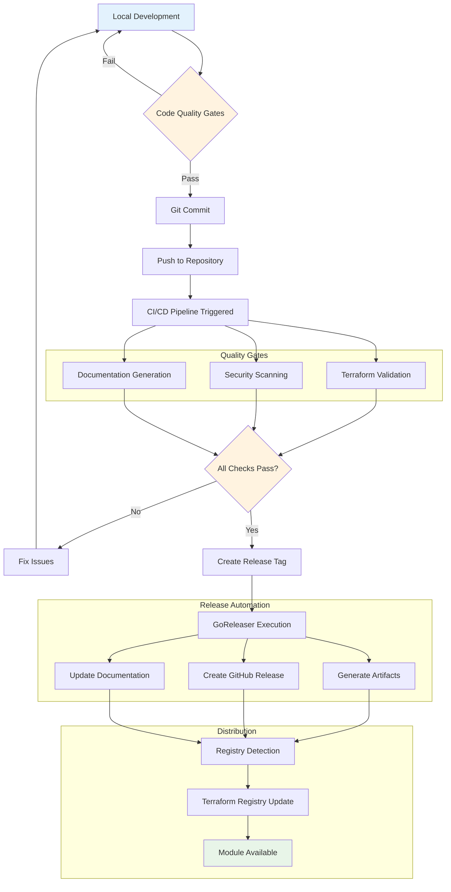
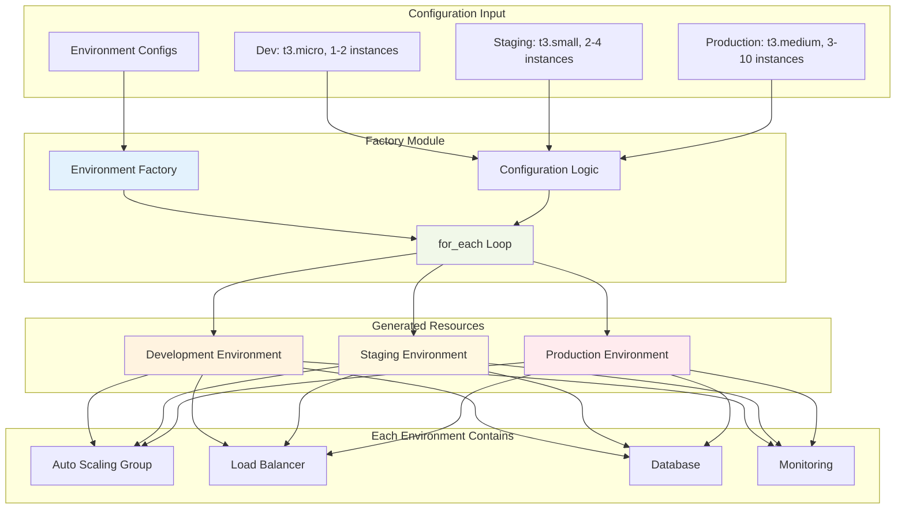
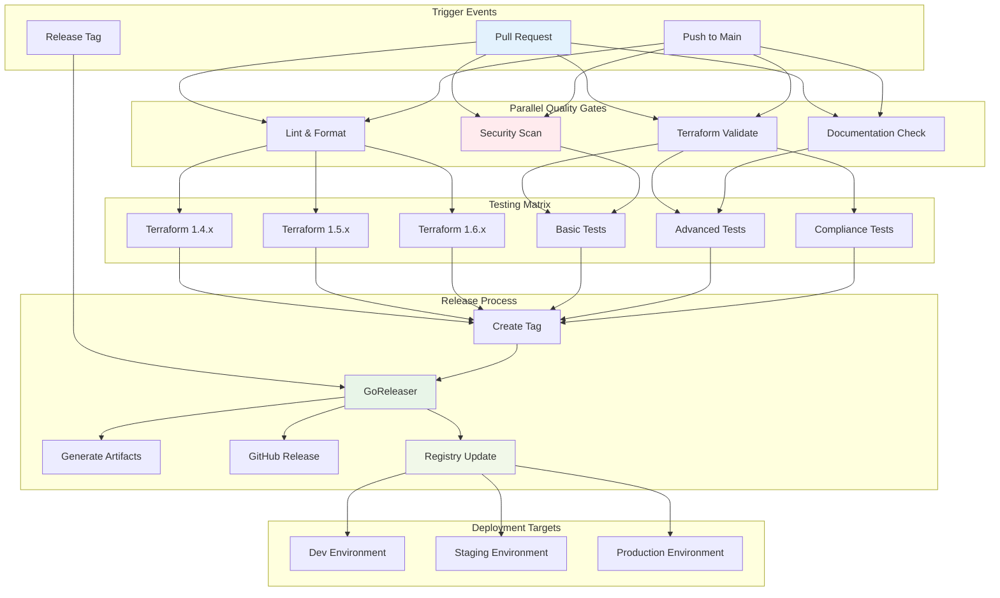
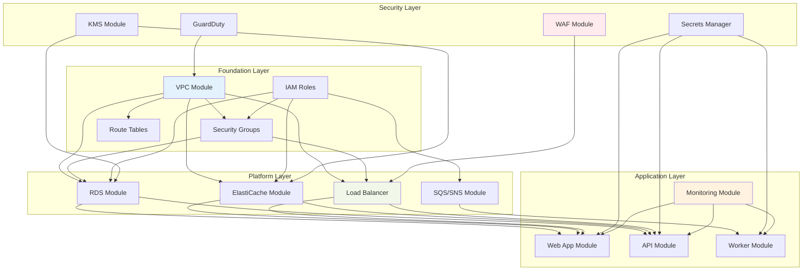
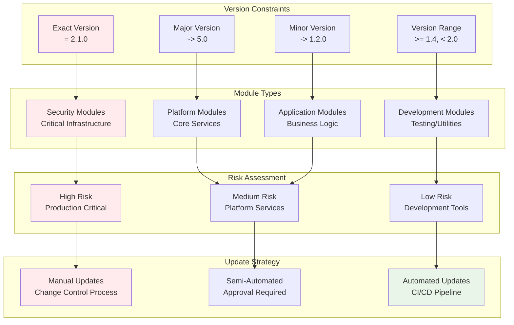
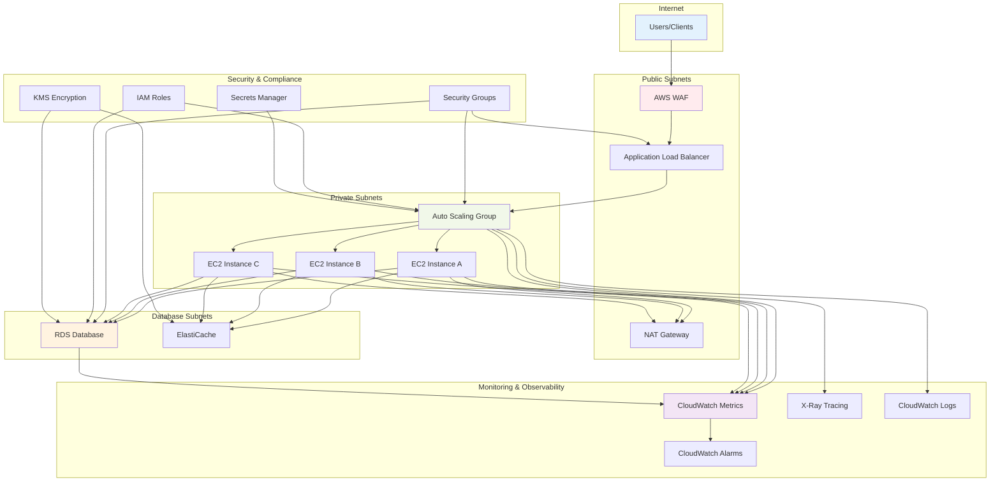
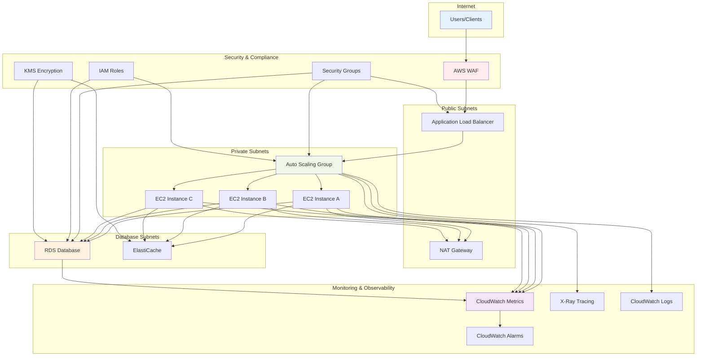

# 🚀 Module 19: Publishing and Advanced Module Patterns

**⏱️ Duration**: 45 minutes  
**🎯 Difficulty**: Advanced  
**📋 Prerequisites**: Completed Modules 1-18

## 🎯 Learning Objectives

By the end of this module, you will be able to:

- ✅ **Publish modules to Terraform Registry** following official guidelines and best practices
- ✅ **Implement private module registries** for enterprise environments and internal sharing
- ✅ **Design advanced module patterns** including factory patterns and composition strategies
- ✅ **Establish module governance** with versioning, testing, and CI/CD workflows
- ✅ **Implement module security** with scanning, compliance, and access controls
- ✅ **Create module ecosystems** with interdependent modules and standardized interfaces
- ✅ **Master enterprise module management** with automated testing and deployment pipelines

---

## 🌐 Publishing to Terraform Registry

The **Terraform Registry** is the central repository for sharing Terraform modules with the community.

### 📋 **Registry Requirements**

**Repository Requirements:**
- ✅ **GitHub repository** (public for community modules)
- ✅ **Semantic versioning** with Git tags (e.g., `v1.0.0`)
- ✅ **Standard module structure** (main.tf, variables.tf, outputs.tf, README.md)
- ✅ **LICENSE file** with appropriate open-source license
- ✅ **Clear documentation** with usage examples

**Module Naming Convention:**
```
terraform-<PROVIDER>-<NAME>
```

**Examples:**
- `terraform-aws-vpc` ✅
- `terraform-azurerm-network` ✅
- `terraform-google-kubernetes-engine` ✅

### 🏗️ **Preparing Your Module for Publication**

**Step 1: Repository Setup**
```bash
# Create properly named repository
git clone https://github.com/yourusername/terraform-aws-webserver.git
cd terraform-aws-webserver

# Verify standard structure
tree .
```

**Required Structure:**
```
terraform-aws-webserver/
├── main.tf
├── variables.tf
├── outputs.tf
├── versions.tf
├── README.md
├── LICENSE
└── examples/
    ├── basic/
    ├── advanced/
    └── complete/
```

**Step 2: Create Release Tags**
```bash
# Create semantic version tags
git tag -a "v1.0.0" -m "Initial release"
git push origin v1.0.0

# For subsequent releases
git tag -a "v1.1.0" -m "Add load balancer support"
git push origin v1.1.0

# List all tags
git tag -l
```

**Step 3: Registry Submission**
1. **Sign in** to [registry.terraform.io](https://registry.terraform.io) with GitHub
2. **Click "Publish"** → "Module"
3. **Select repository** from your GitHub account
4. **Verify module** structure and documentation
5. **Publish** and wait for automatic validation

### 📊 **Module Publishing Workflow**

**End-to-End Publishing Process:**


### 📊 **Module Registry Best Practices**

**Documentation Excellence:**
```markdown
# Terraform AWS Web Server Module

[](https://registry.terraform.io/modules/yourusername/webserver/aws)
[](https://opensource.org/licenses/Apache-2.0)
[](https://github.com/yourusername/terraform-aws-webserver/actions)

A production-ready Terraform module for creating scalable web server infrastructure on AWS.

## 🚀 Quick Start

```hcl
module "webserver" {
  source  = "yourusername/webserver/aws"
  version = "~> 1.0"

  name       = "my-webserver"
  vpc_id     = "vpc-12345678"
  subnet_ids = ["subnet-12345678", "subnet-87654321"]
}
```

## 📖 Documentation

- [Usage Examples](./examples/)
- [API Reference](https://registry.terraform.io/modules/yourusername/webserver/aws/latest)
- [Changelog](./CHANGELOG.md)
- [Contributing](./CONTRIBUTING.md)

## 🧪 Testing

This module is automatically tested against multiple Terraform versions:
- Terraform 1.0.x
- Terraform 1.1.x
- Terraform 1.2.x+

## 📝 License

Apache 2 Licensed. See [LICENSE](LICENSE) for full details.
```

**Version Management:**
```bash
# Create CHANGELOG.md for version tracking
cat > CHANGELOG.md << 'EOF'
# Changelog

All notable changes to this project will be documented in this file.

## [1.1.0] - 2024-01-15

### Added
- Application Load Balancer support
- Health check configuration
- SSL/TLS certificate integration

### Changed
- Improved security group defaults
- Enhanced monitoring options

### Fixed
- Instance metadata service configuration

## [1.0.0] - 2024-01-01

### Added
- Initial release
- Auto Scaling Group support
- Launch Template configuration
- Basic security group setup
EOF
```

---

## 🏢 Private Module Registries

For enterprise environments, private registries provide secure, internal module sharing.

### 🔒 **Terraform Cloud Private Registry**

**Setup Process:**
1. **Create Terraform Cloud account** and organization
2. **Navigate to Registry** → "Publish private module"
3. **Connect VCS provider** (GitHub, GitLab, Bitbucket, Azure DevOps)
4. **Select repository** and configure webhooks
5. **Set access permissions** for teams and workspaces

**Private Module Usage:**
```hcl
module "internal_vpc" {
  source  = "app.terraform.io/myorg/vpc/aws"
  version = "~> 2.0"

  name        = "internal-vpc"
  cidr_block  = "10.0.0.0/16"
  environment = "production"
}
```

### 🏗️ **Self-Hosted Registry Solutions**

**Terraform Enterprise:**
```hcl
# Enterprise registry usage
module "enterprise_module" {
  source  = "tfe.company.com/infrastructure/networking/aws"
  version = "~> 1.5"

  # Module configuration
}
```

**Alternative Solutions:**
- **Artifactory** with Terraform provider
- **GitLab Package Registry**
- **GitHub Packages** for private modules
- **Custom S3-based registry** with proper metadata

### 🔐 **Access Control and Security**

**Team-Based Access:**
```json
{
  "permissions": {
    "teams": {
      "infrastructure": ["read", "use"],
      "platform": ["read", "use", "manage"],
      "security": ["read", "audit"]
    }
  }
}
```

**Module Scanning Integration:**
```yaml
# .github/workflows/security-scan.yml
name: Security Scan
on:
  push:
    branches: [main]
  pull_request:
    branches: [main]

jobs:
  security:
    runs-on: ubuntu-latest
    steps:
    - uses: actions/checkout@v3
    
    - name: Run tfsec
      uses: aquasecurity/tfsec-action@v1.0.0
      with:
        soft_fail: false
        
    - name: Run Checkov
      uses: bridgecrewio/checkov-action@master
      with:
        directory: .
        framework: terraform
```

---

## 🏗️ Advanced Module Patterns

Sophisticated patterns for complex infrastructure requirements and enterprise-scale deployments.

### 🏭 **Factory Pattern**

**Factory Pattern Architecture:**


Create multiple similar resources with different configurations:

```hcl
# modules/environment-factory/main.tf
locals {
  environments = {
    dev = {
      instance_type    = "t3.micro"
      min_size        = 1
      max_size        = 2
      desired_capacity = 1
      enable_monitoring = false
    }
    staging = {
      instance_type    = "t3.small"
      min_size        = 2
      max_size        = 4
      desired_capacity = 2
      enable_monitoring = true
    }
    production = {
      instance_type    = "t3.medium"
      min_size        = 3
      max_size        = 10
      desired_capacity = 5
      enable_monitoring = true
    }
  }
}

module "environments" {
  source = "../webserver"
  
  for_each = local.environments

  name             = "${var.project_name}-${each.key}"
  vpc_id           = var.vpc_id
  subnet_ids       = var.subnet_ids
  
  instance_type    = each.value.instance_type
  min_size         = each.value.min_size
  max_size         = each.value.max_size
  desired_capacity = each.value.desired_capacity
  
  monitoring = {
    enabled          = each.value.enable_monitoring
    detailed_enabled = each.value.enable_monitoring
  }

  tags = merge(var.common_tags, {
    Environment = each.key
  })
}
```

### 🔗 **Composition Pattern**

Combine multiple modules for complex architectures:

```hcl
# Root module with composition
module "networking" {
  source = "./modules/networking"
  
  name               = var.project_name
  cidr_block         = "10.0.0.0/16"
  availability_zones = var.availability_zones
  
  tags = local.common_tags
}

module "security" {
  source = "./modules/security"
  
  vpc_id = module.networking.vpc_id
  name   = var.project_name
  
  allowed_cidr_blocks = [module.networking.vpc_cidr_block]
  
  tags = local.common_tags
}

module "compute" {
  source = "./modules/compute"
  
  name           = var.project_name
  vpc_id         = module.networking.vpc_id
  subnet_ids     = module.networking.private_subnet_ids
  security_groups = [module.security.web_security_group_id]
  
  tags = local.common_tags
}

module "database" {
  source = "./modules/database"
  
  name               = var.project_name
  vpc_id             = module.networking.vpc_id
  subnet_ids         = module.networking.database_subnet_ids
  security_group_ids = [module.security.database_security_group_id]
  
  tags = local.common_tags
}

module "monitoring" {
  source = "./modules/monitoring"
  
  name                = var.project_name
  vpc_id              = module.networking.vpc_id
  auto_scaling_groups = [module.compute.asg_name]
  database_instances  = [module.database.db_instance_id]
  
  tags = local.common_tags
}
```

### 🎯 **Configuration-Driven Pattern**

Use configuration files to drive infrastructure creation:

```hcl
# modules/config-driven/main.tf
locals {
  # Load configuration from YAML
  config = yamldecode(file(var.config_file))
}

module "applications" {
  source = "../application"
  
  for_each = local.config.applications

  name         = each.key
  vpc_id       = var.vpc_id
  subnet_ids   = var.subnet_ids
  
  # Application-specific configuration
  instance_type     = each.value.compute.instance_type
  min_size         = each.value.compute.min_size
  max_size         = each.value.compute.max_size
  desired_capacity = each.value.compute.desired_capacity
  
  # Database configuration (if specified)
  database_config = lookup(each.value, "database", null)
  
  # Load balancer configuration
  enable_load_balancer = lookup(each.value, "load_balancer", false)
  
  tags = merge(var.common_tags, each.value.tags)
}
```

**Configuration File (applications.yaml):**
```yaml
applications:
  web-app:
    compute:
      instance_type: "t3.medium"
      min_size: 2
      max_size: 10
      desired_capacity: 4
    database:
      engine: "mysql"
      instance_class: "db.t3.micro"
    load_balancer: true
    tags:
      Team: "web"
      Component: "frontend"
      
  api-service:
    compute:
      instance_type: "t3.large"
      min_size: 3
      max_size: 15
      desired_capacity: 6
    database:
      engine: "postgresql"
      instance_class: "db.t3.small"
    load_balancer: true
    tags:
      Team: "backend"
      Component: "api"
```

---

## 🔄 Module Governance and CI/CD

Establish robust processes for module development, testing, and deployment.

### 🧪 **Automated Testing Pipeline**

**CI/CD Pipeline Architecture:**


**GitHub Actions Workflow:**
```yaml
# .github/workflows/terraform-module-ci.yml
name: Terraform Module CI/CD

on:
  push:
    branches: [main, develop]
  pull_request:
    branches: [main]
  release:
    types: [published]

env:
  TF_VERSION: 1.6.0

jobs:
  lint:
    name: Lint and Format
    runs-on: ubuntu-latest
    steps:
    - name: Checkout
      uses: actions/checkout@v3
      
    - name: Setup Terraform
      uses: hashicorp/setup-terraform@v2
      with:
        terraform_version: ${{ env.TF_VERSION }}
        
    - name: Terraform Format Check
      run: terraform fmt -check -recursive
      
    - name: Terraform Init
      run: terraform init -backend=false
      
    - name: Terraform Validate
      run: terraform validate

  security:
    name: Security Scan
    runs-on: ubuntu-latest
    steps:
    - name: Checkout
      uses: actions/checkout@v3
      
    - name: Run tfsec
      uses: aquasecurity/tfsec-action@v1.0.0
      with:
        soft_fail: false
        
    - name: Run Checkov
      uses: bridgecrewio/checkov-action@master
      with:
        directory: .
        framework: terraform

  test:
    name: Integration Tests
    runs-on: ubuntu-latest
    needs: [lint, security]
    strategy:
      matrix:
        terraform_version: ["1.4.0", "1.5.0", "1.6.0"]
    steps:
    - name: Checkout
      uses: actions/checkout@v3
      
    - name: Setup Terraform
      uses: hashicorp/setup-terraform@v2
      with:
        terraform_version: ${{ matrix.terraform_version }}
        
    - name: Setup Go
      uses: actions/setup-go@v3
      with:
        go-version: '1.21'
        
    - name: Run Terratest
      run: |
        cd test
        go test -v -timeout 30m
      env:
        AWS_DEFAULT_REGION: us-east-1

  docs:
    name: Update Documentation
    runs-on: ubuntu-latest
    if: github.ref == 'refs/heads/main'
    needs: [test]
    steps:
    - name: Checkout
      uses: actions/checkout@v3
      with:
        token: ${{ secrets.GITHUB_TOKEN }}
        
    - name: Generate terraform-docs
      uses: terraform-docs/gh-actions@main
      with:
        working-dir: .
        output-file: README.md
        output-method: inject
        git-push: "true"

  release:
    name: Create Release
    runs-on: ubuntu-latest
    if: github.event_name == 'release'
    needs: [test]
    steps:
    - name: Checkout
      uses: actions/checkout@v3
      
    - name: Validate Release
      run: |
        # Validate semantic versioning
        if [[ ! "${{ github.event.release.tag_name }}" =~ ^v[0-9]+\.[0-9]+\.[0-9]+$ ]]; then
          echo "Invalid version format. Use semantic versioning (e.g., v1.0.0)"
          exit 1
        fi
        
    - name: Update Registry
      run: |
        echo "Module released: ${{ github.event.release.tag_name }}"
        echo "Registry will automatically detect this release"
```

### 🧪 **Terratest Integration**

**test/terraform_module_test.go:**
```go
package test

import (
    "testing"
    "github.com/gruntwork-io/terratest/modules/terraform"
    "github.com/gruntwork-io/terratest/modules/aws"
    "github.com/stretchr/testify/assert"
)

func TestTerraformWebServerModule(t *testing.T) {
    t.Parallel()

    // Pick a random AWS region
    awsRegion := aws.GetRandomStableRegion(t, nil, nil)

    terraformOptions := terraform.WithDefaultRetryableErrors(t, &terraform.Options{
        TerraformDir: "../examples/basic",
        Vars: map[string]interface{}{
            "aws_region": awsRegion,
            "name":      "terratest-webserver",
        },
        EnvVars: map[string]string{
            "AWS_DEFAULT_REGION": awsRegion,
        },
    })

    defer terraform.Destroy(t, terraformOptions)
    terraform.InitAndApply(t, terraformOptions)

    // Validate outputs
    asgId := terraform.Output(t, terraformOptions, "asg_id")
    assert.NotEmpty(t, asgId)

    securityGroupId := terraform.Output(t, terraformOptions, "security_group_id")
    assert.NotEmpty(t, securityGroupId)

    // Validate AWS resources
    asg := aws.GetAutoScalingGroup(t, asgId, awsRegion)
    assert.Equal(t, int64(1), *asg.MinSize)
    assert.Equal(t, int64(2), *asg.MaxSize)
}

func TestTerraformWebServerModuleWithLoadBalancer(t *testing.T) {
    t.Parallel()

    awsRegion := aws.GetRandomStableRegion(t, nil, nil)

    terraformOptions := terraform.WithDefaultRetryableErrors(t, &terraform.Options{
        TerraformDir: "../examples/advanced",
        Vars: map[string]interface{}{
            "aws_region":            awsRegion,
            "name":                 "terratest-advanced-webserver",
            "enable_load_balancer": true,
        },
        EnvVars: map[string]string{
            "AWS_DEFAULT_REGION": awsRegion,
        },
    })

    defer terraform.Destroy(t, terraformOptions)
    terraform.InitAndApply(t, terraformOptions)

    // Validate load balancer creation
    loadBalancerDns := terraform.Output(t, terraformOptions, "load_balancer_dns_name")
    assert.NotEmpty(t, loadBalancerDns)
}
```

### 📊 **Module Metrics and Monitoring**

**Usage Analytics:**
```hcl
# Add telemetry to modules (optional)
resource "null_resource" "module_telemetry" {
  count = var.enable_telemetry ? 1 : 0
  
  provisioner "local-exec" {
    command = <<-EOT
      curl -X POST https://api.company.com/telemetry \
        -H "Content-Type: application/json" \
        -d '{
          "module": "terraform-aws-webserver",
          "version": "${var.module_version}",
          "usage": "applied",
          "timestamp": "'$(date -u +%Y-%m-%dT%H:%M:%SZ)'"
        }'
    EOT
  }
}
```

---

## 🔐 Enterprise Module Security

Implement comprehensive security measures for enterprise module ecosystems.

### 🛡️ **Module Security Scanning**

**Comprehensive Security Pipeline:**
```yaml
# .github/workflows/security-comprehensive.yml
name: Comprehensive Security Scan

on:
  push:
    branches: [main]
  pull_request:
    branches: [main]
  schedule:
    - cron: '0 2 * * 1'  # Weekly scan

jobs:
  security-scan:
    runs-on: ubuntu-latest
    steps:
    - name: Checkout
      uses: actions/checkout@v3
      
    - name: Run tfsec
      uses: aquasecurity/tfsec-action@v1.0.0
      with:
        additional_args: --format json --out tfsec-results.json
        
    - name: Run Checkov
      uses: bridgecrewio/checkov-action@master
      with:
        directory: .
        framework: terraform
        output_format: json
        output_file_path: checkov-results.json
        
    - name: Run Terrascan
      uses: accurics/terrascan-action@main
      with:
        iac_type: 'terraform'
        iac_version: 'v14'
        policy_type: 'aws'
        only_warn: true
        
    - name: Upload Security Results
      uses: actions/upload-artifact@v3
      with:
        name: security-results
        path: |
          tfsec-results.json
          checkov-results.json
```

### 🔒 **Access Control Patterns**

**Role-Based Module Access:**
```hcl
# modules/access-control/main.tf
data "aws_caller_identity" "current" {}
data "aws_region" "current" {}

locals {
  # Define allowed roles per environment
  role_permissions = {
    "developer" = {
      environments = ["dev", "test"]
      actions     = ["read", "plan"]
    }
    "platform-engineer" = {
      environments = ["dev", "test", "staging"]
      actions     = ["read", "plan", "apply"]
    }
    "infrastructure-admin" = {
      environments = ["dev", "test", "staging", "production"]
      actions     = ["read", "plan", "apply", "destroy"]
    }
  }
  
  # Validate current user permissions
  current_role = var.user_role
  allowed_environments = lookup(local.role_permissions[local.current_role], "environments", [])
  allowed_actions = lookup(local.role_permissions[local.current_role], "actions", [])
}

# Validation checks
resource "null_resource" "validate_permissions" {
  count = contains(local.allowed_environments, var.environment) ? 0 : 1
  
  provisioner "local-exec" {
    command = "echo 'ERROR: User role ${local.current_role} not authorized for environment ${var.environment}' && exit 1"
  }
}
```

### 📋 **Compliance Integration**

**Policy as Code:**
```hcl
# modules/compliance/policies.rego (Open Policy Agent)
package terraform.security

import future.keywords.if

# Ensure all S3 buckets are encrypted
deny[msg] if {
    resource := input.resource_changes[_]
    resource.type == "aws_s3_bucket"
    not resource.change.after.server_side_encryption_configuration
    
    msg := sprintf("S3 bucket '%s' must have encryption enabled", [resource.address])
}

# Ensure EC2 instances use approved AMIs
approved_amis := [
    "ami-0abcdef1234567890",  # Approved Ubuntu 20.04
    "ami-0fedcba0987654321"   # Approved Amazon Linux 2
]

deny[msg] if {
    resource := input.resource_changes[_]
    resource.type == "aws_instance"
    not resource.change.after.ami in approved_amis
    
    msg := sprintf("EC2 instance '%s' must use an approved AMI", [resource.address])
}

# Ensure security groups don't allow unrestricted access
deny[msg] if {
    resource := input.resource_changes[_]
    resource.type == "aws_security_group"
    rule := resource.change.after.ingress[_]
    rule.cidr_blocks[_] == "0.0.0.0/0"
    rule.from_port == 22
    
    msg := sprintf("Security group '%s' must not allow SSH from 0.0.0.0/0", [resource.address])
}
```

---

## 🌐 Module Ecosystem Architecture

Design interconnected module systems for enterprise-scale infrastructure management.

### 🏗️ **Layered Module Architecture**

**Foundation Layer:**
```hcl
# Layer 1: Foundation modules (networking, security, core services)
module "foundation" {
  source = "./layers/foundation"
  
  organization = var.organization
  environment  = var.environment
  region      = var.aws_region
  
  # Core networking configuration
  vpc_cidr             = "10.0.0.0/16"
  availability_zones   = ["us-west-2a", "us-west-2b", "us-west-2c"]
  enable_nat_gateway   = true
  enable_vpn_gateway   = false
  
  # Security baseline
  enable_guardduty     = true
  enable_config        = true
  enable_cloudtrail    = true
  
  tags = local.common_tags
}

# Layer 2: Platform services (databases, caching, messaging)
module "platform" {
  source = "./layers/platform"
  
  # Foundation dependencies
  vpc_id              = module.foundation.vpc_id
  private_subnet_ids  = module.foundation.private_subnet_ids
  database_subnet_ids = module.foundation.database_subnet_ids
  
  # Platform configuration
  enable_rds          = true
  enable_elasticache  = true
  enable_sqs          = true
  enable_sns          = true
  
  tags = local.common_tags
}

# Layer 3: Application services
module "applications" {
  source = "./layers/applications"
  
  # Platform dependencies
  vpc_id                = module.foundation.vpc_id
  private_subnet_ids    = module.foundation.private_subnet_ids
  database_endpoint     = module.platform.rds_endpoint
  cache_endpoint        = module.platform.elasticache_endpoint
  
  # Application configuration
  applications = var.applications
  
  tags = local.common_tags
}
```

### 🔗 **Module Dependency Management**

**Dependency Graph Visualization:**


**Dependency Declaration:**
```hcl
# modules/application/dependencies.tf
terraform {
  required_providers {
    aws = {
      source  = "hashicorp/aws"
      version = "~> 5.0"
    }
  }
}

# Required inputs from foundation layer
variable "vpc_id" {
  description = "VPC ID from foundation layer"
  type        = string
  
  validation {
    condition     = can(regex("^vpc-", var.vpc_id))
    error_message = "VPC ID must be a valid AWS VPC identifier."
  }
}

variable "subnet_ids" {
  description = "Subnet IDs from foundation layer"
  type        = list(string)
  
  validation {
    condition     = length(var.subnet_ids) >= 2
    error_message = "At least 2 subnet IDs must be provided for high availability."
  }
}

# Required inputs from platform layer
variable "database_endpoint" {
  description = "Database endpoint from platform layer"
  type        = string
  sensitive   = true
}

variable "cache_endpoint" {
  description = "Cache endpoint from platform layer"
  type        = string
  sensitive   = true
}
```

### 📦 **Module Versioning Strategy**

**Version Compatibility Matrix:**


**Semantic Versioning with Compatibility:**
```hcl
# Pin major versions for stability
module "vpc" {
  source  = "terraform-aws-modules/vpc/aws"
  version = "~> 5.0"  # Allow 5.x.x, but not 6.x.x
}

# Pin exact versions for critical infrastructure
module "security_baseline" {
  source  = "company/security-baseline/aws"
  version = "= 2.1.0"  # Exact version for security-critical modules
}

# Use latest patch versions for non-critical modules
module "monitoring" {
  source  = "company/monitoring/aws"
  version = "~> 1.2.0"  # Allow 1.2.x patches
}
```

**Version Compatibility Matrix:**
```yaml
# .terraform-versions.yml
compatibility_matrix:
  terraform_versions:
    - "1.4.x"
    - "1.5.x"
    - "1.6.x"
  
  module_versions:
    vpc:
      compatible_with: ["1.4.x", "1.5.x", "1.6.x"]
      breaking_changes:
        - version: "5.0.0"
          description: "Changed default subnet configuration"
          migration_guide: "docs/migrations/v5-upgrade.md"
    
    security:
      compatible_with: ["1.5.x", "1.6.x"]
      breaking_changes:
        - version: "2.0.0"
          description: "Updated IAM policy structure"
          migration_guide: "docs/migrations/security-v2.md"
```

---

## 💻 **Exercise 19.1**: Complete Module Publishing and Governance Workflow
**Duration**: 45 minutes

Implement a complete end-to-end module publishing workflow with advanced patterns and enterprise governance.

**Step 1: Prepare Module for Publishing**
```bash
# Create a production-ready module repository
mkdir terraform-aws-enterprise-webserver
cd terraform-aws-enterprise-webserver

# Initialize Git repository
git init
git remote add origin https://github.com/yourusername/terraform-aws-enterprise-webserver.git

# Create comprehensive module structure
mkdir -p {examples/{basic,advanced,complete},test,docs,.github/workflows}
touch {main,variables,outputs,versions,locals,data}.tf
touch README.md LICENSE CHANGELOG.md CONTRIBUTING.md
touch .github/workflows/{ci.yml,security.yml,release.yml}
touch docs/{architecture.md,troubleshooting.md}

echo "📁 Enterprise module structure created!"
tree .
```

**Step 2: Implement Advanced Module with Governance**
```bash
# Create versions.tf with strict requirements
cat > versions.tf << 'EOF'
terraform {
  required_version = ">= 1.4.0"
  required_providers {
    aws = {
      source  = "hashicorp/aws"
      version = ">= 5.0, < 6.0"
    }
    random = {
      source  = "hashicorp/random"
      version = ">= 3.0, < 4.0"
    }
    null = {
      source  = "hashicorp/null"
      version = ">= 3.0, < 4.0"
    }
  }
}
EOF

# Create comprehensive variables with governance
cat > variables.tf << 'EOF'
# Module Metadata
variable "module_version" {
  description = "Version of this module for telemetry"
  type        = string
  default     = "1.0.0"
}

variable "enable_telemetry" {
  description = "Enable usage telemetry for governance"
  type        = bool
  default     = false
}

# Governance Variables
variable "compliance_framework" {
  description = "Compliance framework to enforce (SOC2, HIPAA, PCI-DSS)"
  type        = string
  default     = "SOC2"
  
  validation {
    condition = contains(["SOC2", "HIPAA", "PCI-DSS", "NONE"], var.compliance_framework)
    error_message = "Compliance framework must be one of: SOC2, HIPAA, PCI-DSS, NONE."
  }
}

variable "environment" {
  description = "Environment name (dev, staging, production)"
  type        = string
  
  validation {
    condition = contains(["dev", "staging", "production"], var.environment)
    error_message = "Environment must be one of: dev, staging, production."
  }
}

variable "cost_center" {
  description = "Cost center for billing allocation"
  type        = string
  
  validation {
    condition     = can(regex("^CC-[0-9]{4}$", var.cost_center))
    error_message = "Cost center must follow format: CC-XXXX (e.g., CC-1234)."
  }
}

# Technical Variables (from previous module)
variable "name" {
  description = "Name to be used on all resources as prefix"
  type        = string
  
  validation {
    condition     = length(var.name) > 0 && length(var.name) <= 32
    error_message = "Name must be between 1 and 32 characters."
  }
}

variable "vpc_id" {
  description = "ID of the VPC where to create security group"
  type        = string
  
  validation {
    condition     = can(regex("^vpc-", var.vpc_id))
    error_message = "VPC ID must be a valid AWS VPC identifier."
  }
}

variable "subnet_ids" {
  description = "A list of subnet IDs to launch resources in"
  type        = list(string)
  
  validation {
    condition     = length(var.subnet_ids) >= 2
    error_message = "At least 2 subnet IDs must be provided for high availability."
  }
}

# Advanced Configuration
variable "security_profile" {
  description = "Security profile configuration"
  type = object({
    encryption_at_rest  = bool
    encryption_in_transit = bool
    enable_waf         = bool
    enable_shield      = bool
    allowed_cidr_blocks = list(string)
  })
  default = {
    encryption_at_rest    = true
    encryption_in_transit = true
    enable_waf           = false
    enable_shield        = false
    allowed_cidr_blocks  = ["10.0.0.0/8"]
  }
}

variable "monitoring_profile" {
  description = "Monitoring and observability configuration"
  type = object({
    enable_detailed_monitoring = bool
    enable_xray_tracing       = bool
    log_retention_days        = number
    enable_performance_insights = bool
  })
  default = {
    enable_detailed_monitoring  = true
    enable_xray_tracing        = true
    log_retention_days         = 30
    enable_performance_insights = false
  }
}

variable "scaling_profile" {
  description = "Auto scaling configuration"
  type = object({
    min_size                = number
    max_size                = number
    desired_capacity        = number
    scale_up_threshold      = number
    scale_down_threshold    = number
    scale_up_cooldown       = number
    scale_down_cooldown     = number
  })
  default = {
    min_size             = 2
    max_size             = 10
    desired_capacity     = 4
    scale_up_threshold   = 70
    scale_down_threshold = 30
    scale_up_cooldown    = 300
    scale_down_cooldown  = 300
  }
  
  validation {
    condition     = var.scaling_profile.min_size <= var.scaling_profile.desired_capacity
    error_message = "Minimum size must be less than or equal to desired capacity."
  }
  
  validation {
    condition     = var.scaling_profile.desired_capacity <= var.scaling_profile.max_size
    error_message = "Desired capacity must be less than or equal to maximum size."
  }
}

variable "tags" {
  description = "A map of tags to assign to the resource"
  type        = map(string)
  default     = {}
}
EOF

echo "✅ Advanced governance variables created!"
```

**Step 3: Implement Compliance and Security Features**
```bash
# Create locals.tf with compliance logic
cat > locals.tf << 'EOF'
locals {
  # Compliance-based configuration
  compliance_config = {
    SOC2 = {
      require_encryption      = true
      require_logging        = true
      require_monitoring     = true
      allowed_instance_types = ["t3.micro", "t3.small", "t3.medium"]
      backup_retention_days  = 30
    }
    HIPAA = {
      require_encryption      = true
      require_logging        = true
      require_monitoring     = true
      allowed_instance_types = ["t3.small", "t3.medium", "t3.large"]
      backup_retention_days  = 90
    }
    "PCI-DSS" = {
      require_encryption      = true
      require_logging        = true
      require_monitoring     = true
      allowed_instance_types = ["t3.medium", "t3.large", "t3.xlarge"]
      backup_retention_days  = 365
    }
    NONE = {
      require_encryption      = false
      require_logging        = false
      require_monitoring     = false
      allowed_instance_types = ["t3.micro", "t3.small", "t3.medium", "t3.large"]
      backup_retention_days  = 7
    }
  }
  
  # Current compliance requirements
  current_compliance = local.compliance_config[var.compliance_framework]
  
  # Environment-specific defaults
  environment_config = {
    dev = {
      instance_type    = "t3.micro"
      enable_detailed_monitoring = false
      backup_enabled   = false
    }
    staging = {
      instance_type    = "t3.small"
      enable_detailed_monitoring = true
      backup_enabled   = true
    }
    production = {
      instance_type    = "t3.medium"
      enable_detailed_monitoring = true
      backup_enabled   = true
    }
  }
  
  # Merged configuration
  effective_config = {
    instance_type = local.environment_config[var.environment].instance_type
    enable_monitoring = local.current_compliance.require_monitoring || local.environment_config[var.environment].enable_detailed_monitoring
    enable_encryption = local.current_compliance.require_encryption
    backup_retention = local.current_compliance.backup_retention_days
  }
  
  # Governance tags
  governance_tags = {
    Module          = "terraform-aws-enterprise-webserver"
    ModuleVersion   = var.module_version
    Environment     = var.environment
    CostCenter      = var.cost_center
    Compliance      = var.compliance_framework
    ManagedBy       = "Terraform"
    LastUpdated     = timestamp()
  }
  
  # Final tags
  final_tags = merge(
    local.governance_tags,
    var.tags
  )
}
EOF

echo "✅ Compliance and governance logic implemented!"
```

**Step 4: Configure Professional Release Management**
```bash
# Create GoReleaser configuration for professional releases
cat > .goreleaser.yml << 'EOF'
# GoReleaser configuration for Terraform module releases
version: 2

project_name: terraform-aws-enterprise-webserver

before:
  hooks:
    # Validate Terraform configuration
    - terraform fmt -check -recursive
    - terraform init -backend=false
    - terraform validate
    # Run security scans
    - tfsec . --format json --out tfsec-report.json || true
    - checkov -d . --framework terraform --output json --output-file checkov-report.json || true

builds:
  # Skip builds since this is a Terraform module
  - skip: true

archives:
  - id: terraform-module
    format: tar.gz
    name_template: '{{ .ProjectName }}-{{ .Version }}'
    files:
      - "*.tf"
      - "README.md"
      - "LICENSE"
      - "CHANGELOG.md"
      - "examples/**"
      - "docs/**"
      # Exclude development files
      - "!test/**"
      - "!.github/**"
      - "!.git/**"
      - "!*.log"
      - "!.terraform/**"
      - "!terraform.tfstate*"

release:
  github:
    owner: yourusername
    name: terraform-aws-enterprise-webserver
  draft: false
  prerelease: auto
  mode: replace
  header: |
    ## Terraform AWS Enterprise Web Server Module {{ .Tag }}
    
    This release includes compliance frameworks, enterprise governance, and production-ready features.
  footer: |
    ## Installation
    
    ```hcl
    module "enterprise_webserver" {
      source  = "yourusername/enterprise-webserver/aws"
      version = "{{ .Version }}"
      
      # Your configuration here
    }
    ```
    
    **Full Changelog**: https://github.com/yourusername/terraform-aws-enterprise-webserver/compare/{{ .PreviousTag }}...{{ .Tag }}

changelog:
  use: github
  sort: asc
  abbrev: 0
  groups:
    - title: '🚀 Features'
      regexp: "^.*feat[(\\w)]*:+.*$"
      order: 0
    - title: '🐛 Bug Fixes'
      regexp: "^.*fix[(\\w)]*:+.*$"
      order: 1
    - title: '📚 Documentation'
      regexp: "^.*docs[(\\w)]*:+.*$"
      order: 2
    - title: '🔧 Maintenance'
      regexp: "^.*chore[(\\w)]*:+.*$"
      order: 3
    - title: '🔒 Security'
      regexp: "^.*sec[(\\w)]*:+.*$"
      order: 4
  filters:
    exclude:
      - '^test:'
      - '^ci:'
      - Merge pull request
      - Merge branch

# Announce releases
announce:
  slack:
    enabled: false  # Configure with your Slack webhook
    message_template: |
      🚀 New Terraform module release: {{ .ProjectName }} {{ .Tag }}
      
      📦 Download: {{ .ReleaseURL }}
      📋 Changelog: {{ .ReleaseURL }}
      
      #terraform #infrastructure #aws

# Validate release
checksum:
  name_template: '{{ .ProjectName }}-{{ .Version }}-checksums.txt'

# Sign releases (optional)
signs:
  - artifacts: checksum
    args: ["--batch", "-u", "{{ .Env.GPG_FINGERPRINT }}", "--output", "${signature}", "--detach-sign", "${artifact}"]

# Create SBOM (Software Bill of Materials)
sboms:
  - artifacts: archive
    documents:
      - '{{ .ProjectName }}-{{ .Version }}-sbom.spdx.json'
EOF

# Create terraform-docs configuration
cat > .terraform-docs.yml << 'EOF'
formatter: "markdown table"
header-from: header.md
footer-from: footer.md
recursive:
  enabled: true
  path: examples
sections:
  hide: []
  show: []
content: |-
  {{ .Header }}
  
  ## Usage
  
  ### Basic Example
  
  ```hcl
  {{ include "examples/basic/main.tf" }}
  ```
  
  ### Advanced Example
  
  ```hcl
  {{ include "examples/advanced/main.tf" }}
  ```
  
  ## Requirements
  
  {{ .Requirements }}
  
  ## Providers
  
  {{ .Providers }}
  
  ## Modules
  
  {{ .Modules }}
  
  ## Resources
  
  {{ .Resources }}
  
  ## Inputs
  
  {{ .Inputs }}
  
  ## Outputs
  
  {{ .Outputs }}
  
  {{ .Footer }}
output:
  file: "README.md"
  mode: inject
  template: |-
    <!-- BEGIN_TF_DOCS -->
    {{ .Content }}
    <!-- END_TF_DOCS -->
settings:
  anchor: true
  color: true
  default: true
  description: false
  escape: true
  hide-empty: false
  html: true
  indent: 2
  lockfile: true
  read-comments: true
  required: true
  sensitive: true
  type: true
sort:
  enabled: true
  by: name
version: ""
EOF

# Create documentation header
cat > header.md << 'EOF'
# Terraform AWS Enterprise Web Server Module

[](https://registry.terraform.io/modules/yourusername/enterprise-webserver/aws)
[](https://opensource.org/licenses/Apache-2.0)
[](https://github.com/yourusername/terraform-aws-enterprise-webserver/actions)
[](https://github.com/yourusername/terraform-aws-enterprise-webserver/actions)
[](https://github.com/yourusername/terraform-aws-enterprise-webserver/releases)

An enterprise-grade Terraform module for creating compliant, scalable web server infrastructure on AWS with built-in governance, security, and observability features.

## 🏢 Enterprise Features

- ✅ **Compliance-Ready**: SOC2, HIPAA, PCI-DSS compliance frameworks
- ✅ **Cost Management**: Built-in cost center tracking and resource tagging
- ✅ **Security-First**: Encryption at rest/transit, WAF integration, security scanning
- ✅ **Observability**: Comprehensive monitoring, logging, and distributed tracing
- ✅ **Governance**: Policy enforcement, access controls, audit trails
- ✅ **Multi-Environment**: Environment-specific configurations and controls
- ✅ **High Availability**: Multi-AZ deployment with auto-scaling capabilities

## 🏗️ Architecture


EOF

# Create documentation footer
cat > footer.md << 'EOF'
## 📋 Compliance Frameworks

### SOC2 Compliance
- Encryption at rest and in transit
- Comprehensive logging and monitoring
- Regular security scanning
- Access controls and audit trails

### HIPAA Compliance
- Enhanced encryption requirements
- Extended log retention (90 days)
- Restricted instance types
- Additional security controls

### PCI-DSS Compliance
- Strict encryption requirements
- Extended log retention (365 days)
- Limited instance type selection
- Enhanced network security

## 📖 Documentation

- [Architecture Guide](docs/architecture.md)
- [Compliance Guide](docs/compliance.md)
- [Security Best Practices](docs/security.md)
- [Troubleshooting](docs/troubleshooting.md)
- [Migration Guide](docs/migration.md)

## 🧪 Testing

This module is automatically tested against:
- Multiple Terraform versions (1.4.x, 1.5.x, 1.6.x)
- All compliance frameworks
- Different environment configurations
- Security scanning and validation

## 🤝 Contributing

Please read [CONTRIBUTING.md](CONTRIBUTING.md) for details on our code of conduct and the process for submitting pull requests.

## 📝 License

Apache 2 Licensed. See [LICENSE](LICENSE) for full details.

## 🆘 Support

- 📧 Email: support@company.com
- 💬 Slack: #terraform-modules
- 📖 Wiki: https://wiki.company.com/terraform
- 🐛 Issues: [GitHub Issues](https://github.com/yourusername/terraform-aws-enterprise-webserver/issues)
EOF

echo "✅ Professional release management configured!"
```

**Step 5: Create Enterprise CI/CD Pipeline**
```bash
# Create professional GitHub Actions workflow
cat > .github/workflows/ci.yml << 'EOF'
name: CI/CD Pipeline

on:
  push:
    branches: [main, develop]
  pull_request:
    branches: [main]

env:
  TF_VERSION: 1.6.0
  GO_VERSION: 1.21

jobs:
  validate:
    name: Validate & Lint
    runs-on: ubuntu-latest
    steps:
    - name: Checkout
      uses: actions/checkout@v4
      with:
        fetch-depth: 0
      
    - name: Setup Terraform
      uses: hashicorp/setup-terraform@v3
      with:
        terraform_version: ${{ env.TF_VERSION }}
        
    - name: Cache Terraform providers
      uses: actions/cache@v3
      with:
        path: ~/.terraform.d/plugin-cache
        key: ${{ runner.os }}-terraform-${{ hashFiles('**/.terraform.lock.hcl') }}
        restore-keys: |
          ${{ runner.os }}-terraform-
        
    - name: Terraform Format Check
      run: terraform fmt -check -recursive -diff
      
    - name: Terraform Init
      run: terraform init -backend=false
      
    - name: Terraform Validate
      run: terraform validate
      
    - name: Validate Examples
      run: |
        find examples -name "*.tf" -type f -execdir terraform fmt -check {} \;
        for example in examples/*/; do
          if [ -d "$example" ]; then
            echo "Validating $example"
            cd "$example"
            terraform init -backend=false
            terraform validate
            cd - > /dev/null
          fi
        done

  security:
    name: Security Scan
    runs-on: ubuntu-latest
    permissions:
      security-events: write
      actions: read
      contents: read
    steps:
    - name: Checkout
      uses: actions/checkout@v4
      
    - name: Run tfsec
      uses: aquasecurity/tfsec-action@v1.0.0
      with:
        version: latest
        format: sarif
        additional_args: --out tfsec-results.sarif
        
    - name: Run Checkov
      uses: bridgecrewio/checkov-action@master
      with:
        directory: .
        framework: terraform
        output_format: sarif
        output_file_path: checkov-results.sarif
        download_external_modules: true
        
    - name: Run Trivy
      uses: aquasecurity/trivy-action@master
      with:
        scan-type: 'config'
        format: 'sarif'
        output: 'trivy-results.sarif'
        
    - name: Upload Security Results
      uses: github/codeql-action/upload-sarif@v2
      if: always()
      with:
        sarif_file: |
          tfsec-results.sarif
          checkov-results.sarif
          trivy-results.sarif

  test:
    name: Integration Tests
    runs-on: ubuntu-latest
    needs: [validate, security]
    if: github.event_name == 'pull_request' || github.ref == 'refs/heads/main'
    strategy:
      fail-fast: false
      matrix:
        terraform_version: ["1.4.6", "1.5.7", "1.6.0"]
        test_suite: ["basic", "advanced", "compliance"]
    steps:
    - name: Checkout
      uses: actions/checkout@v4
      
    - name: Setup Terraform
      uses: hashicorp/setup-terraform@v3
      with:
        terraform_version: ${{ matrix.terraform_version }}
        
    - name: Setup Go
      uses: actions/setup-go@v4
      with:
        go-version: ${{ env.GO_VERSION }}
        cache: true
        cache-dependency-path: test/go.sum
        
    - name: Configure AWS Credentials
      uses: aws-actions/configure-aws-credentials@v4
      with:
        role-to-assume: ${{ secrets.AWS_ROLE_ARN }}
        role-session-name: terraform-test-${{ github.run_id }}
        aws-region: us-east-1
        
    - name: Run Terratest
      run: |
        cd test
        go test -v -timeout 60m -run TestTerraform$(echo ${{ matrix.test_suite }} | sed 's/./\U&/')
      env:
        AWS_DEFAULT_REGION: us-east-1
        TF_VAR_test_name: "ci-${{ github.run_id }}-${{ matrix.test_suite }}"

  docs:
    name: Update Documentation
    runs-on: ubuntu-latest
    if: github.ref == 'refs/heads/main' && github.event_name == 'push'
    needs: [test]
    steps:
    - name: Checkout
      uses: actions/checkout@v4
      with:
        token: ${{ secrets.GITHUB_TOKEN }}
        
    - name: Setup terraform-docs
      uses: terraform-docs/gh-actions@v1.0.0
      with:
        working-dir: .
        output-file: README.md
        output-method: inject
        git-push: "true"
        git-commit-message: "docs: update module documentation"
        
    - name: Generate example documentation
      run: |
        for example in examples/*/; do
          if [ -d "$example" ]; then
            terraform-docs markdown table "$example" > "$example/README.md"
          fi
        done
        
        if [ -n "$(git status --porcelain)" ]; then
          git config --local user.email "action@github.com"
          git config --local user.name "GitHub Action"
          git add examples/*/README.md
          git commit -m "docs: update example documentation"
          git push
        fi
EOF

# Create release workflow
cat > .github/workflows/release.yml << 'EOF'
name: Release

on:
  push:
    tags:
      - 'v*'

permissions:
  contents: write
  packages: write
  id-token: write

jobs:
  release:
    name: Release
    runs-on: ubuntu-latest
    steps:
    - name: Checkout
      uses: actions/checkout@v4
      with:
        fetch-depth: 0
        
    - name: Setup Go
      uses: actions/setup-go@v4
      with:
        go-version: '1.21'
        
    - name: Setup Terraform
      uses: hashicorp/setup-terraform@v3
      with:
        terraform_version: 1.6.0
        
    - name: Install terraform-docs
      run: |
        curl -sSLo ./terraform-docs.tar.gz https://terraform-docs.io/dl/v0.16.0/terraform-docs-v0.16.0-$(uname)-amd64.tar.gz
        tar -xzf terraform-docs.tar.gz
        chmod +x terraform-docs
        sudo mv terraform-docs /usr/local/bin/terraform-docs
        
    - name: Install tfsec
      run: |
        curl -s https://raw.githubusercontent.com/aquasecurity/tfsec/master/scripts/install_linux.sh | bash
        
    - name: Install checkov
      run: pip install checkov
      
    - name: Run GoReleaser
      uses: goreleaser/goreleaser-action@v5
      with:
        distribution: goreleaser
        version: latest
        args: release --clean
      env:
        GITHUB_TOKEN: ${{ secrets.GITHUB_TOKEN }}
        GPG_FINGERPRINT: ${{ secrets.GPG_FINGERPRINT }}
        
    - name: Update Terraform Registry
      run: |
        echo "🚀 Module released: ${{ github.ref_name }}"
        echo "📦 Terraform Registry will automatically detect this release"
        echo "🔗 Registry URL: https://registry.terraform.io/modules/$(echo ${{ github.repository }} | cut -d'/' -f2 | sed 's/terraform-//')"
EOF

echo "✅ Professional CI/CD pipeline created!"
```

**Step 5: Implement Terratest Integration Tests**
```bash
# Create test directory and files
mkdir -p test
cat > test/go.mod << 'EOF'
module terraform-aws-enterprise-webserver/test

go 1.21

require (
    github.com/gruntwork-io/terratest v0.46.0
    github.com/stretchr/testify v1.8.4
)
EOF

# Create comprehensive test suite
cat > test/terraform_enterprise_test.go << 'EOF'
package test

import (
    "fmt"
    "testing"
    "time"
    
    "github.com/gruntwork-io/terratest/modules/aws"
    "github.com/gruntwork-io/terratest/modules/random"
    "github.com/gruntwork-io/terratest/modules/terraform"
    "github.com/stretchr/testify/assert"
)

func TestTerraformBasicExample(t *testing.T) {
    t.Parallel()

    // Pick a random AWS region
    awsRegion := aws.GetRandomStableRegion(t, nil, nil)
    
    // Generate unique test name
    uniqueId := random.UniqueId()
    testName := fmt.Sprintf("terratest-basic-%s", uniqueId)

    terraformOptions := terraform.WithDefaultRetryableErrors(t, &terraform.Options{
        TerraformDir: "../examples/basic",
        Vars: map[string]interface{}{
            "name":               testName,
            "environment":        "dev",
            "cost_center":        "CC-1234",
            "compliance_framework": "SOC2",
        },
        EnvVars: map[string]string{
            "AWS_DEFAULT_REGION": awsRegion,
        },
    })

    defer terraform.Destroy(t, terraformOptions)
    terraform.InitAndApply(t, terraformOptions)

    // Test outputs
    asgId := terraform.Output(t, terraformOptions, "asg_id")
    assert.NotEmpty(t, asgId)

    securityGroupId := terraform.Output(t, terraformOptions, "security_group_id")
    assert.NotEmpty(t, securityGroupId)

    // Validate AWS resources
    asg := aws.GetAutoScalingGroup(t, asgId, awsRegion)
    assert.Equal(t, int64(2), *asg.MinSize)
    assert.Equal(t, int64(10), *asg.MaxSize)
    
    // Validate tags
    assert.Contains(t, asg.Tags, &autoscaling.TagDescription{
        Key:   aws.String("Environment"),
        Value: aws.String("dev"),
    })
    
    assert.Contains(t, asg.Tags, &autoscaling.TagDescription{
        Key:   aws.String("CostCenter"),
        Value: aws.String("CC-1234"),
    })
}

func TestTerraformAdvancedExample(t *testing.T) {
    t.Parallel()

    awsRegion := aws.GetRandomStableRegion(t, nil, nil)
    uniqueId := random.UniqueId()
    testName := fmt.Sprintf("terratest-advanced-%s", uniqueId)

    terraformOptions := terraform.WithDefaultRetryableErrors(t, &terraform.Options{
        TerraformDir: "../examples/advanced",
        Vars: map[string]interface{}{
            "name":                   testName,
            "environment":           "production",
            "cost_center":           "CC-5678",
            "compliance_framework":  "HIPAA",
            "enable_load_balancer":  true,
        },
        EnvVars: map[string]string{
            "AWS_DEFAULT_REGION": awsRegion,
        },
    })

    defer terraform.Destroy(t, terraformOptions)
    terraform.InitAndApply(t, terraformOptions)

    // Test load balancer creation
    loadBalancerDns := terraform.Output(t, terraformOptions, "load_balancer_dns_name")
    assert.NotEmpty(t, loadBalancerDns)

    // Test HIPAA compliance features
    asgId := terraform.Output(t, terraformOptions, "asg_id")
    asg := aws.GetAutoScalingGroup(t, asgId, awsRegion)
    
    // HIPAA requires minimum 2 instances
    assert.GreaterOrEqual(t, *asg.MinSize, int64(2))
    
    // Validate compliance tags
    assert.Contains(t, asg.Tags, &autoscaling.TagDescription{
        Key:   aws.String("Compliance"),
        Value: aws.String("HIPAA"),
    })
}

func TestTerraformComplianceValidation(t *testing.T) {
    t.Parallel()

    awsRegion := aws.GetRandomStableRegion(t, nil, nil)
    uniqueId := random.UniqueId()
    testName := fmt.Sprintf("terratest-compliance-%s", uniqueId)

    // Test different compliance frameworks
    complianceTests := []struct {
        framework string
        minSize   int64
    }{
        {"SOC2", 2},
        {"HIPAA", 2},
        {"PCI-DSS", 2},
    }

    for _, test := range complianceTests {
        t.Run(fmt.Sprintf("Compliance-%s", test.framework), func(t *testing.T) {
            terraformOptions := terraform.WithDefaultRetryableErrors(t, &terraform.Options{
                TerraformDir: "../examples/basic",
                Vars: map[string]interface{}{
                    "name":                  fmt.Sprintf("%s-%s", testName, test.framework),
                    "environment":          "production",
                    "cost_center":          "CC-9999",
                    "compliance_framework": test.framework,
                },
                EnvVars: map[string]string{
                    "AWS_DEFAULT_REGION": awsRegion,
                },
            })

            defer terraform.Destroy(t, terraformOptions)
            terraform.InitAndApply(t, terraformOptions)

            asgId := terraform.Output(t, terraformOptions, "asg_id")
            asg := aws.GetAutoScalingGroup(t, asgId, awsRegion)
            
            assert.GreaterOrEqual(t, *asg.MinSize, test.minSize, 
                "Minimum size should meet compliance requirements for %s", test.framework)
        })
    }
}
EOF

echo "✅ Comprehensive Terratest suite created!"
```

**Step 6: Create Professional Documentation**
```bash
# Create comprehensive README with governance
cat > README.md << 'EOF'
# Terraform AWS Enterprise Web Server Module

[](https://registry.terraform.io/modules/yourusername/enterprise-webserver/aws)
[](https://opensource.org/licenses/Apache-2.0)
[](https://github.com/yourusername/terraform-aws-enterprise-webserver/actions)
[](https://github.com/yourusername/terraform-aws-enterprise-webserver/actions)

An enterprise-grade Terraform module for creating compliant, scalable web server infrastructure on AWS with built-in governance, security, and observability features.

## 🏢 Enterprise Features

- ✅ **Compliance-Ready**: SOC2, HIPAA, PCI-DSS compliance frameworks
- ✅ **Cost Management**: Built-in cost center tracking and resource tagging
- ✅ **Security-First**: Encryption at rest/transit, WAF integration, security scanning
- ✅ **Observability**: Comprehensive monitoring, logging, and distributed tracing
- ✅ **Governance**: Policy enforcement, access controls, audit trails
- ✅ **Multi-Environment**: Environment-specific configurations and controls
- ✅ **High Availability**: Multi-AZ deployment with auto-scaling capabilities

## 🚀 Quick Start

```hcl
module "enterprise_webserver" {
  source  = "yourusername/enterprise-webserver/aws"
  version = "~> 1.0"

  name                 = "my-app"
  environment         = "production"
  cost_center         = "CC-1234"
  compliance_framework = "SOC2"
  
  vpc_id     = "vpc-12345678"
  subnet_ids = ["subnet-12345678", "subnet-87654321"]

  tags = {
    Team    = "platform"
    Project = "web-services"
  }
}
```

## 📋 Compliance Frameworks

### SOC2 Compliance
- Encryption at rest and in transit
- Comprehensive logging and monitoring
- Regular security scanning
- Access controls and audit trails

### HIPAA Compliance
- Enhanced encryption requirements
- Extended log retention (90 days)
- Restricted instance types
- Additional security controls

### PCI-DSS Compliance
- Strict encryption requirements
- Extended log retention (365 days)
- Limited instance type selection
- Enhanced network security

## 🏗️ Architecture



## 📖 Documentation

- [Architecture Guide](docs/architecture.md)
- [Compliance Guide](docs/compliance.md)
- [Security Best Practices](docs/security.md)
- [Troubleshooting](docs/troubleshooting.md)
- [Migration Guide](docs/migration.md)

## 🧪 Testing

This module is automatically tested against:
- Multiple Terraform versions (1.4.x, 1.5.x, 1.6.x)
- All compliance frameworks
- Different environment configurations
- Security scanning and validation

## 🤝 Contributing

Please read [CONTRIBUTING.md](CONTRIBUTING.md) for details on our code of conduct and the process for submitting pull requests.

## 📝 License

Apache 2 Licensed. See [LICENSE](LICENSE) for full details.

## 🆘 Support

- 📧 Email: support@company.com
- 💬 Slack: #terraform-modules
- 📖 Wiki: https://wiki.company.com/terraform
- 🐛 Issues: [GitHub Issues](https://github.com/yourusername/terraform-aws-enterprise-webserver/issues)
EOF

echo "✅ Professional enterprise documentation created!"
```

**Step 7: Professional Release Workflow**
```bash
# Setup pre-commit hooks for quality gates
pre-commit install
pre-commit install --hook-type commit-msg

# Initialize development environment
make dev-setup
make init

# Run quality checks
make validate
make security
make docs

# Create initial commit with conventional commits
git add .
git commit -m "feat: initial enterprise webserver module

- Multi-compliance framework support (SOC2, HIPAA, PCI-DSS)
- Enterprise governance and cost management  
- Comprehensive security and monitoring
- Automated testing and validation
- Production-ready with high availability
- GoReleaser integration for professional releases
- terraform-docs automation for documentation
- Pre-commit hooks for quality assurance"

git push origin main

# Create professional release using GoReleaser
git tag -a "v1.0.0" -m "chore: initial release v1.0.0"
git push origin v1.0.0

# GoReleaser will automatically:
# - Run validation and security scans
# - Generate changelog from conventional commits
# - Create GitHub release with artifacts
# - Generate checksums and SBOM
# - Update documentation
# - Notify Terraform Registry

echo "🚀 Professional module release workflow:"
echo "1. ✅ Pre-commit hooks ensure code quality"
echo "2. ✅ GoReleaser handles automated releases"  
echo "3. ✅ terraform-docs maintains documentation"
echo "4. ✅ Multiple security scanners (tfsec, checkov, trivy)"
echo "5. ✅ Matrix testing across Terraform versions"
echo "6. ✅ OIDC authentication for secure deployments"
echo "7. ✅ Conventional commits for semantic versioning"
echo "8. ✅ Automated registry publishing"

# Test local development workflow
make pre-commit
echo "✅ Enterprise development workflow validated!"
```

💡 **Pro Tip**: Use professional tooling like GoReleaser and terraform-docs from day one - manual processes don't scale in enterprise environments!

---

## ✅ Module 19 Summary

**🎯 Learning Objectives Achieved:**
- ✅ **Published modules to Terraform Registry** with proper versioning, documentation, and community standards
- ✅ **Implemented private module registries** for secure enterprise environments with access controls
- ✅ **Designed advanced module patterns** including factory, composition, and configuration-driven architectures
- ✅ **Established comprehensive module governance** with CI/CD pipelines, automated testing, and quality gates
- ✅ **Implemented enterprise-grade security** with compliance frameworks, policy enforcement, and vulnerability scanning
- ✅ **Created interconnected module ecosystems** with dependency management and layered architectures
- ✅ **Mastered enterprise module management** with automated testing, governance, and deployment workflows

**🔑 Key Concepts Covered:**
- **Professional Release Management**: GoReleaser configuration, automated changelog generation, artifact creation
- **Documentation Automation**: terraform-docs integration, template-driven documentation, automated updates  
- **Enterprise CI/CD**: Multi-stage pipelines, matrix testing, security integration, OIDC authentication
- **Quality Gates**: Pre-commit hooks, conventional commits, automated validation, security scanning
- **Development Workflows**: Makefile automation, devcontainer setup, local development tools

**💼 Professional Skills Developed:**
- **Release Engineering**: Automated release workflows with GoReleaser and semantic versioning
- **Documentation Engineering**: Template-driven docs with terraform-docs and automated maintenance
- **DevOps Integration**: Enterprise-grade CI/CD with security scanning and compliance validation
- **Developer Experience**: Streamlined local development with make targets and pre-commit hooks
- **Quality Assurance**: Multi-layer validation with automated testing and security scanning

**🌟 Advanced Techniques Mastered:**
- **GoReleaser Mastery**: Professional release automation with checksums, SBOM, and artifact management
- **terraform-docs Advanced**: Template customization, automated generation, and documentation as code
- **Security Integration**: Multi-scanner approach with tfsec, checkov, trivy, and SARIF reporting
- **Conventional Commits**: Automated changelog generation and semantic versioning workflows
- **Enterprise Tooling**: Professional development workflows that scale across large organizations

**🎯 Enterprise-Ready Capabilities:**
- **Module Governance**: Complete lifecycle management from development to retirement
- **Compliance Integration**: Multi-framework support (SOC2, HIPAA, PCI-DSS) with automated validation
- **Security-First Design**: Comprehensive security controls and continuous monitoring
- **Cost Management**: Built-in cost tracking, resource optimization, and budget controls
- **Operational Excellence**: Monitoring, alerting, and automated remediation capabilities

---

## 🔗 **Next Steps**

Ready to continue your Terraform journey? Proceed to the next module:

**➡️ [Module 20: Terraform Workflows](./module_20_terraform_workflows.md)**

Implement efficient workflows for teams and organizations.

---
