## 🔷 Module 23: Built in Functions
*Duration: 2 hours | Labs: 4*

### 🎯 Learning Objectives
By the end of this module, you will be able to:

- ✅ Understand Terraform's built-in function categories and their purposes
- ✅ Use numeric functions for mathematical operations and calculations
- ✅ Apply string functions for text manipulation and formatting
- ✅ Leverage collection functions to work with lists, maps, and sets
- ✅ Implement encoding/decoding functions for data transformation
- ✅ Utilize filesystem functions for file operations and templating
- ✅ Work with date/time functions for timestamp manipulation
- ✅ Apply hash and crypto functions for security operations
- ✅ Use IP network functions for network calculations
- ✅ Master type conversion functions for data type transformations

### 📚 Topics Covered

#### 🌟 Introduction to Built-in Functions

Terraform includes **over 100 built-in functions** that help you transform and combine values. These functions are essential for creating dynamic, flexible infrastructure configurations.

> **💡 Key Principle**: "Functions in Terraform are pure functions - they don't have side effects and always return the same output for the same input."

**🔑 Function Categories:**

```mermaid
graph TD
    A[Terraform Built-in Functions] --> B[🔢 Numeric Functions]
    A --> C[📝 String Functions]
    A --> D[📦 Collection Functions]
    A --> E[🔐 Encoding/Decoding]
    A --> F[📁 Filesystem Functions]
    A --> G[⏰ Date/Time Functions]
    A --> H[🔒 Hash/Crypto Functions]
    A --> I[🌐 IP Network Functions]
    A --> J[🔄 Type Conversion]
    
    B --> B1[max, min, abs]
    B --> B2[ceil, floor, log]
    C --> C1[upper, lower, split]
    C --> C2[replace, regex, format]
    D --> D1[merge, concat, flatten]
    D --> D2[sort, contains, keys]
```



#### 🔢 Numeric Functions

**Purpose**: Perform mathematical operations and calculations

**Most Common Functions:**

| Function | Purpose | Example | Result |
|----------|---------|---------|---------|
| **max()** | Find maximum value | `max(5, 12, 9)` | `12` |
| **min()** | Find minimum value | `min(5, 12, 9)` | `5` |
| **abs()** | Absolute value | `abs(-42)` | `42` |
| **ceil()** | Round up | `ceil(4.3)` | `5` |
| **floor()** | Round down | `floor(4.8)` | `4` |

**Real-World Example - Infrastructure Sizing:**
```hcl
locals {
  # Calculate appropriate instance count based on load
  base_instances = 2
  peak_multiplier = var.environment == "production" ? 3 : 1.5
  calculated_instances = ceil(local.base_instances * local.peak_multiplier)
  
  # Ensure we have at least 1 and at most 10 instances
  instance_count = max(1, min(local.calculated_instances, 10))
  
  # Calculate storage based on instance count
  base_storage = 20 # GB per instance
  total_storage = local.instance_count * local.base_storage
  
  # Round up to nearest 50GB increment for cost optimization
  optimized_storage = ceil(local.total_storage / 50) * 50
}

resource "aws_autoscaling_group" "web" {
  name                = "${var.project_name}-asg"
  min_size            = local.instance_count
  max_size            = local.instance_count * 2
  desired_capacity    = local.instance_count
  
  tag {
    key                 = "StorageAllocation"
    value               = "${local.optimized_storage}GB"
    propagate_at_launch = false
  }
}
```

#### 📝 String Functions

**Purpose**: Transform and manipulate text data

**Essential String Functions:**

| Function | Purpose | Example | Result |
|----------|---------|---------|---------|
| **upper()** | Convert to uppercase | `upper("hello")` | `"HELLO"` |
| **lower()** | Convert to lowercase | `lower("WORLD")` | `"world"` |
| **length()** | Get string length | `length("terraform")` | `9` |
| **substr()** | Extract substring | `substr("terraform", 0, 4)` | `"terr"` |
| **split()** | Split into list | `split(",", "a,b,c")` | `["a", "b", "c"]` |
| **join()** | Join list to string | `join("-", ["a", "b", "c"])` | `"a-b-c"` |
| **replace()** | Replace text | `replace("hello", "l", "r")` | `"herro"` |
| **format()** | Format string | `format("Hello %s", "World")` | `"Hello World"` |

**Advanced String Processing:**
```hcl
locals {
  # Environment-based naming with validation
  environment = lower(var.environment)
  project_code = upper(var.project_code)
  
  # Create standardized resource names
  resource_prefix = format("%s-%s", local.project_code, local.environment)
  
  # Clean and validate names
  sanitized_name = replace(replace(var.application_name, "_", "-"), " ", "-")
  final_name = format("%s-%s", local.resource_prefix, local.sanitized_name)
  
  # Validation
  name_length_valid = length(local.final_name) <= 63 # AWS resource name limit
  
  # Tag generation
  common_tags = {
    Name        = local.final_name
    Environment = title(local.environment)
    Project     = local.project_code
    ManagedBy   = "Terraform"
  }
}

# Use string functions for dynamic configuration
resource "aws_s3_bucket" "app_storage" {
  bucket = lower(replace(local.final_name, "_", "-"))
  
  tags = merge(local.common_tags, {
    Purpose = format("Storage for %s application", var.application_name)
  })
}
```

#### 📦 Collection Functions

**Purpose**: Work with lists, maps, and sets

**Core Collection Functions:**

| Function | Purpose | Example | Result |
|----------|---------|---------|---------|
| **length()** | Get collection size | `length([1, 2, 3])` | `3` |
| **keys()** | Get map keys | `keys({a = 1, b = 2})` | `["a", "b"]` |
| **values()** | Get map values | `values({a = 1, b = 2})` | `[1, 2]` |
| **merge()** | Merge maps | `merge({a = 1}, {b = 2})` | `{a = 1, b = 2}` |
| **concat()** | Combine lists | `concat([1, 2], [3, 4])` | `[1, 2, 3, 4]` |
| **flatten()** | Flatten nested lists | `flatten([[1, 2], [3, 4]])` | `[1, 2, 3, 4]` |
| **distinct()** | Remove duplicates | `distinct([1, 2, 2, 3])` | `[1, 2, 3]` |
| **sort()** | Sort collection | `sort([3, 1, 2])` | `[1, 2, 3]` |
| **contains()** | Check if contains | `contains([1, 2, 3], 2)` | `true` |

**Advanced Collection Processing:**
```hcl
variable "environments" {
  description = "Environment configurations"
  type = map(object({
    instance_type = string
    min_instances = number
    features      = list(string)
    tags          = map(string)
  }))
  default = {
    dev = {
      instance_type = "t3.micro"
      min_instances = 1
      features      = ["monitoring", "logging"]
      tags          = { Team = "DevOps", CostCenter = "Engineering" }
    }
    prod = {
      instance_type = "t3.medium"
      min_instances = 3
      features      = ["monitoring", "logging", "backup", "analytics"]
      tags          = { Team = "Platform", CostCenter = "Operations" }
    }
  }
}

locals {
  # Extract all unique features across environments
  all_features = distinct(flatten([
    for env, config in var.environments : config.features
  ]))
  
  # Calculate total minimum instances across all environments
  total_min_instances = sum([
    for env, config in var.environments : config.min_instances
  ])
  
  # Merge all environment tags with common tags
  environment_tags = {
    for env, config in var.environments : env => merge(
      config.tags,
      {
        Environment = env
        ManagedBy   = "Terraform"
        Features    = join(",", sort(config.features))
      }
    )
  }
  
  # Create environment-specific configurations
  environment_configs = {
    for env, config in var.environments : env => {
      name          = format("%s-%s", var.project_name, env)
      instance_type = config.instance_type
      min_size      = config.min_instances
      max_size      = config.min_instances * 3
      
      # Feature-based configurations
      monitoring_enabled = contains(config.features, "monitoring")
      backup_enabled     = contains(config.features, "backup")
      analytics_enabled  = contains(config.features, "analytics")
      
      tags = local.environment_tags[env]
    }
  }
}
```

#### 🔐 Encoding and Decoding Functions

**Purpose**: Transform data between different formats

**Key Encoding Functions:**

| Function | Purpose | Example | Use Case |
|----------|---------|---------|----------|
| **base64encode()** | Encode to base64 | `base64encode("hello")` | User data scripts |
| **base64decode()** | Decode from base64 | `base64decode("aGVsbG8=")` | Reading encoded data |
| **jsonencode()** | Convert to JSON | `jsonencode({a = 1})` | API configurations |
| **jsondecode()** | Parse JSON | `jsondecode('{"a": 1}')` | Processing API responses |
| **yamlencode()** | Convert to YAML | `yamlencode({a = 1})` | Kubernetes manifests |
| **yamldecode()** | Parse YAML | `yamldecode("a: 1")` | Reading YAML configs |

**Practical Example - Dynamic Configuration:**
```hcl
variable "application_config" {
  description = "Application configuration as YAML"
  type        = string
  default     = <<-EOT
    app:
      name: "my-application"
      version: "1.0.0"
      database:
        host: "db.example.com"
        port: 5432
        ssl: true
      features:
        - logging
        - monitoring
        - caching
  EOT
}

locals {
  # Parse YAML configuration
  config = yamldecode(var.application_config)
  
  # Create application metadata
  app_metadata = jsonencode({
    name        = local.config.app.name
    version     = local.config.app.version
    features    = local.config.app.features
    database_ssl = local.config.app.database.ssl
    deployed_at = timestamp()
  })
  
  # Generate user data script
  user_data_script = <<-EOF
    #!/bin/bash
    echo "Setting up ${local.config.app.name} v${local.config.app.version}"
    
    # Install features
    %{ for feature in local.config.app.features ~}
    systemctl enable ${feature}
    systemctl start ${feature}
    %{ endfor ~}
    
    # Configure database connection
    cat > /etc/app/database.conf << 'DBCONF'
    host=${local.config.app.database.host}
    port=${local.config.app.database.port}
    ssl=${local.config.app.database.ssl ? "enabled" : "disabled"}
    DBCONF
  EOF
  
  # Base64 encode for EC2 user data
  encoded_user_data = base64encode(local.user_data_script)
}

resource "aws_instance" "app" {
  ami           = var.ami_id
  instance_type = var.instance_type
  user_data     = local.encoded_user_data
  
  tags = merge(var.common_tags, {
    Name        = local.config.app.name
    Version     = local.config.app.version
    ConfigHash  = substr(sha256(var.application_config), 0, 8)
  })
}

# Store configuration metadata
resource "aws_ssm_parameter" "app_metadata" {
  name  = "/app/${local.config.app.name}/metadata"
  type  = "String"
  value = local.app_metadata
}
```

#### 📁 Filesystem Functions

**Purpose**: Read files and process templates

**Core Filesystem Functions:**

| Function | Purpose | Example | Use Case |
|----------|---------|---------|----------|
| **file()** | Read file content | `file("config.txt")` | Reading static configs |
| **filebase64()** | Read binary file | `filebase64("image.png")` | Binary data embedding |
| **templatefile()** | Process template | `templatefile("app.tpl", {name = "app"})` | Dynamic configurations |
| **dirname()** | Get directory path | `dirname("/path/to/file")` | Path manipulation |
| **basename()** | Get filename | `basename("/path/to/file.txt")` | Extracting filenames |
| **fileexists()** | Check file exists | `fileexists("config.json")` | Conditional logic |

**Advanced Template Processing:**
```hcl
# variables.tf
variable "application_settings" {
  description = "Application configuration settings"
  type = object({
    name           = string
    port           = number
    database_url   = string
    redis_url      = string
    log_level      = string
    features       = list(string)
    limits = object({
      max_connections = number
      timeout_seconds = number
      max_memory_mb   = number
    })
  })
}

variable "environment_secrets" {
  description = "Environment-specific secrets"
  type = map(string)
  sensitive = true
}

# Create application configuration template
resource "local_file" "app_config_template" {
  filename = "${path.module}/templates/application.conf.tpl"
  content  = <<-EOT
    # Application Configuration - Generated by Terraform
    # Environment: ${var.environment}
    # Generated: ${timestamp()}
    
    [application]
    name = "${var.application_settings.name}"
    port = ${var.application_settings.port}
    log_level = "${var.application_settings.log_level}"
    
    [database]
    url = "${var.application_settings.database_url}"
    max_connections = ${var.application_settings.limits.max_connections}
    timeout = ${var.application_settings.limits.timeout_seconds}s
    
    [cache]
    redis_url = "${var.application_settings.redis_url}"
    
    [features]
    %{ for feature in var.application_settings.features ~}
    ${feature} = true
    %{ endfor ~}
    
    [limits]
    max_memory = ${var.application_settings.limits.max_memory_mb}MB
    timeout = ${var.application_settings.limits.timeout_seconds}s
    
    [secrets]
    %{ for key, value in var.environment_secrets ~}
    ${key} = "${value}"
    %{ endfor ~}
  EOT
}

locals {
  # Process the template with current values
  rendered_config = templatefile("${path.module}/templates/application.conf.tpl", {
    environment = var.environment
    timestamp   = timestamp()
    
    # Pass through all variables
    application_settings = var.application_settings
    environment_secrets  = var.environment_secrets
  })
  
  # Create Kubernetes ConfigMap YAML
  k8s_configmap = yamlencode({
    apiVersion = "v1"
    kind       = "ConfigMap"
    metadata = {
      name      = "${var.application_settings.name}-config"
      namespace = var.environment
      labels = {
        app     = var.application_settings.name
        env     = var.environment
        version = fileexists("VERSION") ? trimspace(file("VERSION")) : "unknown"
      }
    }
    data = {
      "application.conf" = local.rendered_config
      "features.txt"     = join("\n", var.application_settings.features)
    }
  })
}

# Store configuration in multiple formats
resource "local_file" "app_config" {
  filename = "${path.module}/generated/application-${var.environment}.conf"
  content  = local.rendered_config
}

resource "local_file" "k8s_configmap" {
  filename = "${path.module}/generated/configmap-${var.environment}.yaml"
  content  = local.k8s_configmap
}
```

#### ⏰ Date and Time Functions

**Purpose**: Work with timestamps and dates

**Date/Time Functions:**

| Function | Purpose | Example | Result |
|----------|---------|---------|---------|
| **timestamp()** | Current timestamp | `timestamp()` | `"2023-12-07T10:30:00Z"` |
| **formatdate()** | Format timestamp | `formatdate("DD/MM/YYYY", timestamp())` | `"07/12/2023"` |
| **timeadd()** | Add duration | `timeadd(timestamp(), "24h")` | Tomorrow's timestamp |

**Time-Based Resource Management:**
```hcl
locals {
  # Current timestamp for tracking
  deployment_time = timestamp()
  
  # Format timestamps for different purposes
  deployment_date = formatdate("YYYY-MM-DD", local.deployment_time)
  deployment_datetime = formatdate("YYYY-MM-DD-hhmm", local.deployment_time)
  iso_timestamp = formatdate("YYYY-MM-DD'T'hh:mm:ssZ", local.deployment_time)
  
  # Calculate expiration times
  backup_retention_days = 30
  backup_expiry = timeadd(local.deployment_time, format("%dh", local.backup_retention_days * 24))
  
  # Create time-based tags
  time_based_tags = {
    CreatedDate     = local.deployment_date
    CreatedDateTime = local.deployment_datetime
    BackupExpiry    = formatdate("YYYY-MM-DD", local.backup_expiry)
    DeploymentID    = formatdate("YYYYMMDDhhmm", local.deployment_time)
  }
}

resource "aws_instance" "web" {
  ami           = var.ami_id
  instance_type = var.instance_type
  
  tags = merge(var.common_tags, local.time_based_tags, {
    Name = format("%s-%s", var.project_name, local.deployment_datetime)
  })
  
  # Lifecycle management based on time
  lifecycle {
    replace_triggered_by = [
      # Force replacement daily in dev environment
      var.environment == "dev" ? local.deployment_date : null
    ]
  }
}

# Scheduled backup with time-based naming
resource "aws_ebs_snapshot" "daily_backup" {
  volume_id = aws_ebs_volume.data.id
  
  description = format("Daily backup of %s - %s", 
                      var.project_name, 
                      local.deployment_datetime)
  
  tags = merge(var.common_tags, {
    Name      = format("%s-backup-%s", var.project_name, local.deployment_date)
    CreatedAt = local.iso_timestamp
    ExpiresAt = formatdate("YYYY-MM-DD'T'hh:mm:ssZ", local.backup_expiry)
    Type      = "automated-daily"
  })
}
```

#### 🔒 Hash and Crypto Functions

**Purpose**: Generate hashes, UUIDs, and handle cryptographic operations

**Hash and Crypto Functions:**

| Function | Purpose | Example | Use Case |
|----------|---------|---------|----------|
| **md5()** | MD5 hash | `md5("hello")` | Quick checksums |
| **sha256()** | SHA256 hash | `sha256("hello")` | Secure hashing |
| **uuid()** | Generate UUID | `uuid()` | Unique identifiers |
| **bcrypt()** | Hash password | `bcrypt("password")` | Password hashing |

**Security and Identification:**
```hcl
variable "sensitive_data" {
  description = "Sensitive configuration data"
  type        = string
  sensitive   = true
}

locals {
  # Generate unique identifiers
  deployment_uuid = uuid()
  resource_id = substr(local.deployment_uuid, 0, 8)
  
  # Create content hashes for change detection
  config_hash = sha256(jsonencode({
    environment = var.environment
    instance_type = var.instance_type
    application_config = var.application_config
  }))
  
  # Short hash for resource naming
  short_hash = substr(local.config_hash, 0, 8)
  
  # Security hashes
  data_checksum = sha256(var.sensitive_data)
  quick_checksum = md5(var.application_config)
}

# Use hash for immutable resource naming
resource "aws_launch_template" "app" {
  name = format("%s-template-%s", var.project_name, local.short_hash)
  
  image_id      = var.ami_id
  instance_type = var.instance_type
  
  user_data = base64encode(templatefile("${path.module}/user_data.sh", {
    deployment_id = local.resource_id
    config_hash   = local.short_hash
  }))
  
  tag_specifications {
    resource_type = "instance"
    tags = merge(var.common_tags, {
      Name           = format("%s-instance-%s", var.project_name, local.short_hash)
      DeploymentUUID = local.deployment_uuid
      ConfigHash     = local.config_hash
      DataChecksum   = local.data_checksum
    })
  }
}

# Use UUID for unique S3 bucket naming
resource "aws_s3_bucket" "app_storage" {
  bucket = format("%s-storage-%s", 
                 lower(var.project_name), 
                 substr(replace(local.deployment_uuid, "-", ""), 0, 12))
  
  tags = {
    Name           = format("%s Storage", var.project_name)
    DeploymentUUID = local.deployment_uuid
    ContentHash    = local.quick_checksum
  }
}

# Generate secure random passwords
resource "random_password" "database_password" {
  length  = 32
  special = true
}

# Hash the generated password for verification
locals {
  password_hash = bcrypt(random_password.database_password.result, 12)
}

# Store password hash (not the password itself)
resource "aws_ssm_parameter" "db_password_hash" {
  name  = format("/app/%s/database/password_hash", var.project_name)
  type  = "SecureString"
  value = local.password_hash
}
```

#### 🌐 IP Network Functions

**Purpose**: Perform network calculations and CIDR operations

**Network Functions:**

| Function | Purpose | Example | Result |
|----------|---------|---------|---------|
| **cidrhost()** | Get host IP | `cidrhost("10.0.0.0/24", 5)` | `"10.0.0.5"` |
| **cidrnetmask()** | Get netmask | `cidrnetmask("10.0.0.0/24")` | `"255.255.255.0"` |
| **cidrsubnet()** | Create subnet | `cidrsubnet("10.0.0.0/16", 8, 1)` | `"10.0.1.0/24"` |

**Advanced Network Planning:**
```hcl
variable "vpc_cidr" {
  description = "VPC CIDR block"
  type        = string
  default     = "10.0.0.0/16"
}

variable "availability_zones" {
  description = "List of availability zones"
  type        = list(string)
  default     = ["us-west-2a", "us-west-2b", "us-west-2c"]
}

locals {
  # Calculate subnet configurations
  subnet_count = length(var.availability_zones)
  
  # Create public subnets (first half of AZs)
  public_subnets = {
    for i, az in var.availability_zones : az => {
      cidr_block = cidrsubnet(var.vpc_cidr, 8, i)
      az = az
      type = "public"
      # Calculate gateway IP (first usable IP)
      gateway_ip = cidrhost(cidrsubnet(var.vpc_cidr, 8, i), 1)
    }
  }
  
  # Create private subnets (second half)
  private_subnets = {
    for i, az in var.availability_zones : az => {
      cidr_block = cidrsubnet(var.vpc_cidr, 8, i + local.subnet_count)
      az = az
      type = "private"
      # Calculate NAT gateway IP
      nat_gateway_ip = cidrhost(local.public_subnets[az].cidr_block, 10)
    }
  }
  
  # Calculate database subnet group (third set)
  database_subnets = {
    for i, az in var.availability_zones : az => {
      cidr_block = cidrsubnet(var.vpc_cidr, 8, i + (local.subnet_count * 2))
      az = az
      type = "database"
    }
  }
  
  # Network metadata
  network_info = {
    vpc_cidr = var.vpc_cidr
    netmask = cidrnetmask(var.vpc_cidr)
    total_ips = pow(2, 32 - tonumber(split("/", var.vpc_cidr)[1]))
    usable_ips = pow(2, 32 - tonumber(split("/", var.vpc_cidr)[1])) - 2
  }
}

# Create VPC
resource "aws_vpc" "main" {
  cidr_block           = var.vpc_cidr
  enable_dns_hostnames = true
  enable_dns_support   = true
  
  tags = merge(var.common_tags, {
    Name = format("%s-vpc", var.project_name)
    Netmask = local.network_info.netmask
    TotalIPs = local.network_info.total_ips
  })
}

# Create public subnets
resource "aws_subnet" "public" {
  for_each = local.public_subnets
  
  vpc_id            = aws_vpc.main.id
  cidr_block        = each.value.cidr_block
  availability_zone = each.value.az
  
  map_public_ip_on_launch = true
  
  tags = merge(var.common_tags, {
    Name = format("%s-public-%s", var.project_name, each.key)
    Type = "Public"
    AZ = each.value.az
    GatewayIP = each.value.gateway_ip
  })
}

# Create private subnets
resource "aws_subnet" "private" {
  for_each = local.private_subnets
  
  vpc_id            = aws_vpc.main.id
  cidr_block        = each.value.cidr_block
  availability_zone = each.value.az
  
  tags = merge(var.common_tags, {
    Name = format("%s-private-%s", var.project_name, each.key)
    Type = "Private"
    AZ = each.value.az
    NATGatewayIP = each.value.nat_gateway_ip
  })
}

# Create database subnets
resource "aws_subnet" "database" {
  for_each = local.database_subnets
  
  vpc_id            = aws_vpc.main.id
  cidr_block        = each.value.cidr_block
  availability_zone = each.value.az
  
  tags = merge(var.common_tags, {
    Name = format("%s-database-%s", var.project_name, each.key)
    Type = "Database"
    AZ = each.value.az
  })
}

# Output network calculations
output "network_summary" {
  value = {
    vpc_cidr = var.vpc_cidr
    network_info = local.network_info
    subnet_counts = {
      public = length(local.public_subnets)
      private = length(local.private_subnets)
      database = length(local.database_subnets)
    }
    subnet_details = {
      public = local.public_subnets
      private = local.private_subnets
      database = local.database_subnets
    }
  }
}
```

#### 🔄 Type Conversion Functions

**Purpose**: Convert between data types and handle errors gracefully

**Type Conversion Functions:**

| Function | Purpose | Example | Use Case |
|----------|---------|---------|----------|
| **can()** | Test if expression succeeds | `can(regex("^vpc-", var.vpc_id))` | Validation |
| **try()** | Try expression with fallback | `try(var.optional_value, "default")` | Default values |
| **type()** | Get value type | `type(var.my_var)` | Type inspection |
| **tostring()** | Convert to string | `tostring(42)` | Type conversion |
| **tonumber()** | Convert to number | `tonumber("42")` | Type conversion |

**Error Handling and Validation:**
```hcl
variable "instance_config" {
  description = "Instance configuration (can be string or object)"
  type        = any
}

variable "optional_settings" {
  description = "Optional configuration settings"
  type        = any
  default     = null
}

variable "user_input" {
  description = "User provided input that might be invalid"
  type        = string
  default     = ""
}

locals {
  # Type checking and conversion
  config_type = type(var.instance_config)
  
  # Handle different input types gracefully
  instance_config = try(
    # If it's already an object, use it
    var.instance_config.instance_type != null ? var.instance_config : null,
    # If it's a string, convert to object
    {
      instance_type = tostring(var.instance_config)
      instance_count = 1
    }
  )
  
  # Safe type conversions with validation
  instance_count = try(
    tonumber(local.instance_config.instance_count),
    1  # Default fallback
  )
  
  # Validate instance count is reasonable
  validated_instance_count = can(tonumber(local.instance_count)) && tonumber(local.instance_count) > 0 && tonumber(local.instance_count) <= 100 ? local.instance_count : 1
  
  # Handle optional settings with defaults
  settings = merge(
    {
      # Default settings
      monitoring_enabled = true
      backup_enabled     = false
      auto_scaling      = false
      max_instances     = local.validated_instance_count * 3
    },
    # Override with provided settings if valid
    try(var.optional_settings, {})
  )
  
  # Validate user input safely
  is_valid_vpc_id = can(regex("^vpc-[a-z0-9]{8,}$", var.user_input))
  vpc_id = local.is_valid_vpc_id ? var.user_input : null
  
  # Complex validation with multiple checks
  port_number = try(tonumber(var.user_input), null)
  is_valid_port = can(local.port_number) && local.port_number > 0 && local.port_number <= 65535
  validated_port = local.is_valid_port ? local.port_number : 8080
  
  # Error handling for file operations
  config_file_exists = try(fileexists("config.json"), false)
  config_data = local.config_file_exists ? try(
    jsondecode(file("config.json")),
    {} # Empty object if file exists but is invalid JSON
  ) : {}
  
  # Combine all validations
  final_config = {
    instance_type  = try(local.instance_config.instance_type, "t3.micro")
    instance_count = local.validated_instance_count
    port          = local.validated_port
    vpc_id        = local.vpc_id
    settings      = local.settings
    config_source = local.config_file_exists ? "file" : "defaults"
    
    # Metadata about the configuration
    metadata = {
      config_type = local.config_type
      has_vpc_id = local.is_valid_vpc_id
      has_valid_port = local.is_valid_port
      config_file_available = local.config_file_exists
      validation_timestamp = timestamp()
    }
  }
}

# Use validated configuration
resource "aws_launch_template" "app" {
  name_prefix   = format("%s-", var.project_name)
  image_id      = var.ami_id
  instance_type = local.final_config.instance_type
  
  vpc_security_group_ids = local.final_config.vpc_id != null ? [
    aws_security_group.app[0].id
  ] : []
  
  user_data = base64encode(jsonencode({
    app_config = local.final_config
    metadata   = local.final_config.metadata
  }))
  
  tag_specifications {
    resource_type = "instance"
    tags = merge(var.common_tags, {
      Name = format("%s-instance", var.project_name)
      ConfigType = local.final_config.metadata.config_type
      Port = tostring(local.final_config.port)
    })
  }
}

# Conditional resource creation
resource "aws_security_group" "app" {
  count = local.final_config.vpc_id != null ? 1 : 0
  
  name_prefix = format("%s-", var.project_name)
  vpc_id      = local.final_config.vpc_id
  
  ingress {
    from_port   = local.final_config.port
    to_port     = local.final_config.port
    protocol    = "tcp"
    cidr_blocks = ["0.0.0.0/0"]
  }
  
  egress {
    from_port   = 0
    to_port     = 0
    protocol    = "-1"
    cidr_blocks = ["0.0.0.0/0"]
  }
  
  tags = merge(var.common_tags, {
    Name = format("%s-sg", var.project_name)
    Port = tostring(local.final_config.port)
  })
}

# Output validation results
output "configuration_summary" {
  value = {
    final_config = local.final_config
    validation_results = {
      instance_config_type = local.config_type
      vpc_id_valid = local.is_valid_vpc_id
      port_valid = local.is_valid_port
      config_file_found = local.config_file_exists
    }
  }
}
```

### 📊 Function Processing Pipeline

```mermaid
flowchart LR
    A[Raw Data] --> B[Input Functions]
    B --> C[Processing Functions]
    C --> D[Output Functions]
    D --> E[Final Result]
    
    B --> B1[file(), jsondecode()]
    B --> B2[templatefile(), yamldecode()]
    C --> C1[merge(), format()]
    C --> C2[upper(), replace()]
    C --> C3[cidrsubnet(), sha256()]
    D --> D1[jsonencode(), base64encode()]
    D --> D2[yamlencode(), formatdate()]
```

### 🛡️ Error Handling Flow

```mermaid
flowchart TD
    A[Expression Evaluation] --> B{can() function}
    B -->|Success| C[Return Result]
    B -->|Error| D[try() function]
    D --> E{Fallback Available?}
    E -->|Yes| F[Return Fallback]
    E -->|No| G[Return null/error]
    
    G --> H[Plan Fails]
    F --> I[Continue Processing]
    C --> I
```

### 💻 **Exercise 23.1**: Numeric and String Functions Mastery
**Duration**: 30 minutes

Build a resource sizing and naming system using numeric and string functions.

**Step 1: Create the Configuration**
```bash
mkdir ~/terraform-functions-lab
cd ~/terraform-functions-lab
```

**Step 2: Create `main.tf`**
```hcl
variable "environment" {
  description = "Environment name"
  type        = string
  default     = "development"
}

variable "application_name" {
  description = "Application name"
  type        = string
  default     = "My Web App"
}

variable "base_instance_count" {
  description = "Base number of instances"
  type        = number
  default     = 2
}

variable "load_multiplier" {
  description = "Load multiplier factor"
  type        = number
  default     = 1.5
}

locals {
  # String transformations for naming
  clean_app_name = replace(lower(var.application_name), " ", "-")
  environment_code = upper(substr(var.environment, 0, 3))
  
  # Numeric calculations for sizing
  calculated_instances = ceil(var.base_instance_count * var.load_multiplier)
  min_instances = max(1, local.calculated_instances)
  max_instances = min(local.calculated_instances * 2, 10)
  
  # Complex naming with validation
  resource_name = format("%s-%s-%s", 
    local.environment_code,
    local.clean_app_name,
    formatdate("MMDD", timestamp())
  )
  
  # Ensure name length compliance
  final_name = length(local.resource_name) > 32 ? 
    substr(local.resource_name, 0, 32) : 
    local.resource_name
}

resource "local_file" "sizing_report" {
  filename = "sizing-report.txt"
  content  = format(<<-EOT
    Application Sizing Report
    ========================
    
    Application: %s
    Environment: %s
    Generated: %s
    
    Naming:
    - Clean Name: %s
    - Environment Code: %s
    - Resource Name: %s
    - Final Name: %s
    - Name Length: %d characters
    
    Sizing:
    - Base Instances: %d
    - Load Multiplier: %.1fx
    - Calculated: %d instances
    - Min Instances: %d
    - Max Instances: %d
    
    Validation:
    - Name Length OK: %s
    - Instance Count Valid: %s
  EOT
    , var.application_name
    , title(var.environment)
    , formatdate("YYYY-MM-DD hh:mm:ss", timestamp())
    , local.clean_app_name
    , local.environment_code
    , local.resource_name
    , local.final_name
    , length(local.final_name)
    , var.base_instance_count
    , var.load_multiplier
    , local.calculated_instances
    , local.min_instances
    , local.max_instances
    , length(local.final_name) <= 32 ? "✓" : "✗"
    , local.min_instances > 0 && local.max_instances <= 10 ? "✓" : "✗"
  )
}

output "sizing_summary" {
  value = {
    application_name = var.application_name
    final_resource_name = local.final_name
    instance_sizing = {
      min = local.min_instances
      max = local.max_instances
      calculated = local.calculated_instances
    }
  }
}
```

**Step 3: Test with Different Values**
```bash
# Test with default values
terraform init && terraform apply -auto-approve

# View the report
cat sizing-report.txt

# Test with different inputs
terraform apply -var="application_name=Super Long Application Name For Testing" \
                -var="environment=production" \
                -var="load_multiplier=2.8" \
                -auto-approve

# View updated report
cat sizing-report.txt

# Test edge cases
terraform apply -var="base_instance_count=1" \
                -var="load_multiplier=0.5" \
                -auto-approve
```

**Expected Results:**
- Resource names should be properly formatted and length-validated
- Instance counts should be calculated and bounded
- Report should show all transformations and validations

### 💻 **Exercise 23.2**: Collection Functions Deep Dive
**Duration**: 45 minutes

Build a comprehensive tag management and configuration system.

**Step 1: Create Advanced Configuration**
```hcl
variable "environments" {
  description = "Multi-environment configuration"
  type = map(object({
    instance_type = string
    min_instances = number
    features      = list(string)
    tags          = map(string)
    databases     = list(object({
      engine  = string
      version = string
      size    = string
    }))
  }))
  default = {
    dev = {
      instance_type = "t3.micro"
      min_instances = 1
      features      = ["logging", "monitoring"]
      tags          = { Team = "DevOps", CostCenter = "Engineering" }
      databases     = [{
        engine  = "mysql"
        version = "8.0"
        size    = "small"
      }]
    }
    staging = {
      instance_type = "t3.small"
      min_instances = 2
      features      = ["logging", "monitoring", "backup"]
      tags          = { Team = "QA", CostCenter = "Quality" }
      databases     = [
        {
          engine  = "mysql"
          version = "8.0"
          size    = "medium"
        },
        {
          engine  = "redis"
          version = "6.2"
          size    = "small"
        }
      ]
    }
    prod = {
      instance_type = "t3.medium"
      min_instances = 3
      features      = ["logging", "monitoring", "backup", "analytics", "security"]
      tags          = { Team = "Platform", CostCenter = "Operations" }
      databases     = [
        {
          engine  = "mysql"
          version = "8.0"
          size    = "large"
        },
        {
          engine  = "redis"
          version = "6.2"
          size    = "medium"
        },
        {
          engine  = "elasticsearch"
          version = "7.15"
          size    = "medium"
        }
      ]
    }
  }
}

locals {
  # Extract all unique features across environments
  all_features = distinct(flatten([
    for env, config in var.environments : config.features
  ]))
  
  # Calculate feature usage statistics
  feature_usage = {
    for feature in local.all_features : feature => length([
      for env, config in var.environments : env
      if contains(config.features, feature)
    ])
  }
  
  # Find most common features (used in all environments)
  common_features = [
    for feature, count in local.feature_usage : feature
    if count == length(var.environments)
  ]
  
  # Calculate total resources across environments
  total_instances = sum([
    for env, config in var.environments : config.min_instances
  ])
  
  total_databases = sum([
    for env, config in var.environments : length(config.databases)
  ])
  
  # Create consolidated tag map
  all_tags = merge(flatten([
    for env, config in var.environments : [config.tags]
  ])...)
  
  # Extract unique database engines
  unique_engines = distinct(flatten([
    for env, config in var.environments : [
      for db in config.databases : db.engine
    ]
  ]))
  
  # Database statistics by engine
  database_stats = {
    for engine in local.unique_engines : engine => {
      count = length(flatten([
        for env, config in var.environments : [
          for db in config.databases : db.engine if db.engine == engine
        ]
      ]))
      environments = keys({
        for env, config in var.environments : env => true
        if length([
          for db in config.databases : db.engine if db.engine == engine
        ]) > 0
      })
      sizes = distinct(flatten([
        for env, config in var.environments : [
          for db in config.databases : db.size if db.engine == engine
        ]
      ]))
    }
  }
  
  # Create environment-specific configurations with computed values
  processed_environments = {
    for env, config in var.environments : env => merge(config, {
      # Environment-specific calculations
      max_instances = config.min_instances * 3
      
      # Tag merging with computed values
      computed_tags = merge(
        config.tags,
        {
          Environment = env
          ManagedBy   = "Terraform"
          Features    = join(",", sort(config.features))
          DatabaseCount = length(config.databases)
          HasCommonFeatures = length(setintersection(config.features, local.common_features)) == length(local.common_features)
        }
      )
      
      # Database summary
      database_summary = {
        count = length(config.databases)
        engines = [for db in config.databases : db.engine]
        primary_engine = config.databases[0].engine
        has_cache = contains([for db in config.databases : db.engine], "redis")
        has_search = contains([for db in config.databases : db.engine], "elasticsearch")
      }
      
      # Feature analysis
      feature_analysis = {
        count = length(config.features)
        has_security = contains(config.features, "security")
        has_analytics = contains(config.features, "analytics")
        coverage_percentage = (length(config.features) / length(local.all_features)) * 100
      }
    })
  }
}

# Generate comprehensive reports
resource "local_file" "feature_analysis" {
  filename = "feature-analysis.json"
  content = jsonencode({
    all_features = local.all_features
    feature_usage = local.feature_usage
    common_features = local.common_features
    
    by_environment = {
      for env, config in local.processed_environments : env => {
        features = config.features
        feature_count = config.feature_analysis.count
        coverage_percentage = config.feature_analysis.coverage_percentage
        has_security = config.feature_analysis.has_security
        has_analytics = config.feature_analysis.has_analytics
      }
    }
    
    statistics = {
      total_unique_features = length(local.all_features)
      most_used_feature = keys(local.feature_usage)[
        index(values(local.feature_usage), max(values(local.feature_usage)...))
      ]
      least_used_features = [
        for feature, count in local.feature_usage : feature
        if count == min(values(local.feature_usage)...)
      ]
    }
  })
}

resource "local_file" "database_report" {
  filename = "database-report.yaml"
  content = yamlencode({
    summary = {
      total_databases = local.total_databases
      unique_engines = local.unique_engines
      database_stats = local.database_stats
    }
    
    by_environment = {
      for env, config in local.processed_environments : env => {
        database_count = config.database_summary.count
        engines = config.database_summary.engines
        primary_engine = config.database_summary.primary_engine
        has_cache = config.database_summary.has_cache
        has_search = config.database_summary.has_search
        
        databases = [
          for i, db in config.databases : {
            id = i + 1
            engine = db.engine
            version = db.version
            size = db.size
            environment = env
          }
        ]
      }
    }
  })
}

resource "local_file" "tag_consolidation" {
  filename = "tag-consolidation.txt"
  content = format(<<-EOT
    Tag Consolidation Report
    =======================
    Generated: %s
    
    All Unique Tags:
    %s
    
    Tags by Environment:
    %s
    
    Common Tag Keys: %s
    Common Tag Values: %s
    
    Tag Statistics:
    - Total unique tag keys: %d
    - Total unique tag values: %d
    - Most common team: %s
    - Cost centers: %s
  EOT
    , timestamp()
    , join("\n", [for k, v in local.all_tags : format("  %s: %s", k, v)])
    , join("\n", [
        for env, config in local.processed_environments : format("  %s:\n%s", 
          env,
          join("\n", [for k, v in config.computed_tags : format("    %s: %s", k, v)])
        )
      ])
    , join(", ", distinct(flatten([
        for env, config in var.environments : keys(config.tags)
      ])))
    , join(", ", distinct(flatten([
        for env, config in var.environments : values(config.tags)
      ])))
    , length(distinct(flatten([
        for env, config in var.environments : keys(config.tags)
      ])))
    , length(distinct(flatten([
        for env, config in var.environments : values(config.tags)
      ])))
    , try(
        local.all_tags["Team"],
        keys({
          for env, config in var.environments : config.tags["Team"] => true
          if contains(keys(config.tags), "Team")
        })[0]
      )
    , join(", ", distinct([
        for env, config in var.environments : config.tags["CostCenter"]
        if contains(keys(config.tags), "CostCenter")
      ]))
  )
}

output "collection_analysis" {
  value = {
    totals = {
      environments = length(var.environments)
      instances = local.total_instances
      databases = local.total_databases
      features = length(local.all_features)
    }
    
    features = {
      all = local.all_features
      common = local.common_features
      usage_stats = local.feature_usage
    }
    
    databases = {
      engines = local.unique_engines
      stats = local.database_stats
    }
    
    environments = {
      for env, config in local.processed_environments : env => {
        instances = {
          min = config.min_instances
          max = config.max_instances
        }
        feature_analysis = config.feature_analysis
        database_summary = config.database_summary
      }
    }
  }
}
```

**Step 2: Apply and Analyze**
```bash
# Apply configuration
terraform init && terraform apply -auto-approve

# Examine the generated reports
echo "=== Feature Analysis ==="
cat feature-analysis.json | jq '.'

echo "=== Database Report ==="
cat database-report.yaml

echo "=== Tag Consolidation ==="
cat tag-consolidation.txt

echo "=== Output Analysis ==="
terraform output collection_analysis
```

**Expected Results:**
- Comprehensive analysis of features across environments
- Database statistics and categorization
- Tag consolidation and standardization
- Usage patterns and recommendations

### 💻 **Exercise 23.3**: File and Template Processing
**Duration**: 45 minutes

Build a dynamic configuration system with templates and file processing.

**Step 1: Create Template Structure**
```bash
mkdir -p templates configs generated
```

**Step 2: Create Application Template (`templates/app.conf.tpl`)**
```bash
cat > templates/app.conf.tpl << 'EOF'
# Application Configuration
# Generated: ${timestamp}
# Environment: ${environment}
# Version: ${app_version}

[application]
name = "${app_name}"
port = ${app_port}
log_level = "${log_level}"
debug = ${debug_mode}

[database]
host = "${database_host}"
port = ${database_port}
name = "${database_name}"
ssl = ${database_ssl}
pool_size = ${database_pool_size}

[cache]
%{ if cache_enabled ~}
enabled = true
host = "${cache_host}"
port = ${cache_port}
ttl = ${cache_ttl}
%{ else ~}
enabled = false
%{ endif ~}

[features]
%{ for feature in features ~}
${feature} = true
%{ endfor ~}

[security]
secret_key = "${secret_key}"
session_timeout = ${session_timeout}
csrf_protection = ${csrf_enabled}

[monitoring]
%{ if monitoring_enabled ~}
enabled = true
endpoint = "${monitoring_endpoint}"
interval = ${monitoring_interval}
%{ else ~}
enabled = false
%{ endif ~}

# Environment-specific settings
%{ if environment == "production" ~}
[production]
strict_mode = true
performance_monitoring = true
error_reporting = true
%{ endif ~}

%{ if environment == "development" ~}
[development]
hot_reload = true
debug_toolbar = true
mock_external_apis = true
%{ endif ~}
EOF
```

**Step 3: Create Kubernetes Template (`templates/deployment.yaml.tpl`)**
```bash
cat > templates/deployment.yaml.tpl << 'EOF'
apiVersion: apps/v1
kind: Deployment
metadata:
  name: ${app_name}-${environment}
  namespace: ${namespace}
  labels:
    app: ${app_name}
    environment: ${environment}
    version: "${app_version}"
    managed-by: terraform
  annotations:
    deployment.kubernetes.io/revision: "${deployment_revision}"
    app.terraform.io/config-hash: "${config_hash}"
spec:
  replicas: ${replica_count}
  selector:
    matchLabels:
      app: ${app_name}
      environment: ${environment}
  template:
    metadata:
      labels:
        app: ${app_name}
        environment: ${environment}
        version: "${app_version}"
      annotations:
        config.hash: "${config_hash}"
    spec:
      containers:
      - name: ${app_name}
        image: ${container_image}:${app_version}
        ports:
        - containerPort: ${app_port}
          name: http
        env:
        - name: ENVIRONMENT
          value: "${environment}"
        - name: APP_PORT
          value: "${app_port}"
        - name: LOG_LEVEL
          value: "${log_level}"
%{ for key, value in environment_vars ~}
        - name: ${key}
          value: "${value}"
%{ endfor ~}
        resources:
          requests:
            memory: "${memory_request}"
            cpu: "${cpu_request}"
          limits:
            memory: "${memory_limit}"
            cpu: "${cpu_limit}"
        livenessProbe:
          httpGet:
            path: /health
            port: ${app_port}
          initialDelaySeconds: 30
          periodSeconds: 10
        readinessProbe:
          httpGet:
            path: /ready
            port: ${app_port}
          initialDelaySeconds: 5
          periodSeconds: 5
        volumeMounts:
        - name: config
          mountPath: /app/config
          readOnly: true
%{ if persistent_storage ~}
        - name: data
          mountPath: /app/data
%{ endif ~}
      volumes:
      - name: config
        configMap:
          name: ${app_name}-${environment}-config
%{ if persistent_storage ~}
      - name: data
        persistentVolumeClaim:
          claimName: ${app_name}-${environment}-data
%{ endif ~}
---
apiVersion: v1
kind: Service
metadata:
  name: ${app_name}-${environment}-service
  namespace: ${namespace}
  labels:
    app: ${app_name}
    environment: ${environment}
spec:
  type: ${service_type}
  ports:
  - port: 80
    targetPort: ${app_port}
    protocol: TCP
    name: http
  selector:
    app: ${app_name}
    environment: ${environment}
EOF
```

**Step 4: Create Configuration File (`configs/base-config.json`)**
```bash
cat > configs/base-config.json << 'EOF'
{
  "application": {
    "name": "sample-app",
    "version": "1.2.0",
    "port": 8080,
    "features": ["authentication", "logging", "monitoring", "api-v2"],
    "database": {
      "host": "localhost",
      "port": 5432,
      "name": "app_db",
      "ssl": true,
      "pool_size": 10
    },
    "cache": {
      "enabled": true,
      "host": "redis.example.com",
      "port": 6379,
      "ttl": 3600
    }
  },
  "environments": {
    "development": {
      "log_level": "debug",
      "debug_mode": true,
      "monitoring": false,
      "replicas": 1,
      "resources": {
        "memory_request": "256Mi",
        "cpu_request": "100m",
        "memory_limit": "512Mi",
        "cpu_limit": "200m"
      }
    },
    "staging": {
      "log_level": "info",
      "debug_mode": false,
      "monitoring": true,
      "replicas": 2,
      "resources": {
        "memory_request": "512Mi",
        "cpu_request": "200m",
        "memory_limit": "1Gi",
        "cpu_limit": "500m"
      }
    },
    "production": {
      "log_level": "warn",
      "debug_mode": false,
      "monitoring": true,
      "replicas": 5,
      "resources": {
        "memory_request": "1Gi",
        "cpu_request": "500m",
        "memory_limit": "2Gi",
        "cpu_limit": "1000m"
      }
    }
  }
}
EOF
```

**Step 5: Create Main Configuration (`main.tf`)**
```hcl
variable "environment" {
  description = "Target environment"
  type        = string
  default     = "development"
  
  validation {
    condition     = contains(["development", "staging", "production"], var.environment)
    error_message = "Environment must be development, staging, or production."
  }
}

variable "config_file" {
  description = "Path to configuration file"
  type        = string
  default     = "configs/base-config.json"
}

variable "additional_env_vars" {
  description = "Additional environment variables"
  type        = map(string)
  default     = {}
}

locals {
  # Check if config file exists and load it
  config_exists = fileexists(var.config_file)
  base_config = local.config_exists ? jsondecode(file(var.config_file)) : {}
  
  # Extract application configuration
  app_config = try(local.base_config.application, {})
  env_config = try(local.base_config.environments[var.environment], {})
  
  # Generate secure values
  secret_key = sha256(format("%s-%s-%s", 
                      local.app_config.name, 
                      var.environment, 
                      timestamp()))
  config_hash = substr(sha256(jsonencode({
    app_config = local.app_config
    env_config = local.env_config
    environment = var.environment
  })), 0, 8)
  
  # Merge environment variables
  environment_vars = merge(
    {
      DATABASE_URL = format("postgres://%s:%d/%s?sslmode=%s",
                           local.app_config.database.host,
                           local.app_config.database.port,
                           local.app_config.database.name,
                           local.app_config.database.ssl ? "require" : "disable")
      CACHE_URL = local.app_config.cache.enabled ? format("redis://%s:%d",
                                                          local.app_config.cache.host,
                                                          local.app_config.cache.port) : ""
      SECRET_KEY = local.secret_key
    },
    var.additional_env_vars
  )
  
  # Application configuration template variables
  app_template_vars = {
    timestamp = timestamp()
    environment = var.environment
    
    # Application settings
    app_name = try(local.app_config.name, "default-app")
    app_version = try(local.app_config.version, "1.0.0")
    app_port = try(local.app_config.port, 8080)
    
    # Environment-specific settings
    log_level = try(local.env_config.log_level, "info")
    debug_mode = try(local.env_config.debug_mode, false)
    
    # Database settings
    database_host = try(local.app_config.database.host, "localhost")
    database_port = try(local.app_config.database.port, 5432)
    database_name = try(local.app_config.database.name, "app_db")
    database_ssl = try(local.app_config.database.ssl, true)
    database_pool_size = try(local.app_config.database.pool_size, 10)
    
    # Cache settings
    cache_enabled = try(local.app_config.cache.enabled, false)
    cache_host = try(local.app_config.cache.host, "localhost")
    cache_port = try(local.app_config.cache.port, 6379)
    cache_ttl = try(local.app_config.cache.ttl, 3600)
    
    # Features
    features = try(local.app_config.features, [])
    
    # Security
    secret_key = local.secret_key
    session_timeout = 1800
    csrf_enabled = var.environment == "production"
    
    # Monitoring
    monitoring_enabled = try(local.env_config.monitoring, false)
    monitoring_endpoint = "http://monitoring.example.com/metrics"
    monitoring_interval = 60
  }
  
  # Kubernetes template variables
  k8s_template_vars = merge(local.app_template_vars, {
    namespace = var.environment
    replica_count = try(local.env_config.replicas, 1)
    container_image = format("myregistry/%s", local.app_template_vars.app_name)
    deployment_revision = formatdate("YYYYMMDDHHMM", timestamp())
    config_hash = local.config_hash
    
    # Resources
    memory_request = try(local.env_config.resources.memory_request, "256Mi")
    cpu_request = try(local.env_config.resources.cpu_request, "100m")
    memory_limit = try(local.env_config.resources.memory_limit, "512Mi")
    cpu_limit = try(local.env_config.resources.cpu_limit, "200m")
    
    # Service configuration
    service_type = var.environment == "production" ? "LoadBalancer" : "ClusterIP"
    persistent_storage = var.environment != "development"
    
    # Environment variables for Kubernetes
    environment_vars = local.environment_vars
  })
}

# Generate application configuration
resource "local_file" "app_config" {
  filename = "generated/${var.environment}-app.conf"
  content  = templatefile("${path.module}/templates/app.conf.tpl", local.app_template_vars)
  
  # File permissions
  file_permission = "0644"
}

# Generate Kubernetes deployment
resource "local_file" "k8s_deployment" {
  filename = "generated/${var.environment}-deployment.yaml"
  content  = templatefile("${path.module}/templates/deployment.yaml.tpl", local.k8s_template_vars)
  
  file_permission = "0644"
}

# Generate environment summary
resource "local_file" "env_summary" {
  filename = "generated/${var.environment}-summary.json"
  content = jsonencode({
    environment = var.environment
    generated_at = timestamp()
    config_hash = local.config_hash
    
    application = {
      name = local.app_template_vars.app_name
      version = local.app_template_vars.app_version
      port = local.app_template_vars.app_port
      features = local.app_template_vars.features
    }
    
    environment_config = local.env_config
    
    generated_files = [
      "${var.environment}-app.conf",
      "${var.environment}-deployment.yaml",
      "${var.environment}-summary.json"
    ]
    
    template_variables = {
      app_config_vars = keys(local.app_template_vars)
      k8s_config_vars = keys(local.k8s_template_vars)
    }
    
    validation = {
      config_file_exists = local.config_exists
      environment_valid = contains(["development", "staging", "production"], var.environment)
      cache_enabled = local.app_template_vars.cache_enabled
      monitoring_enabled = local.app_template_vars.monitoring_enabled
      debug_mode = local.app_template_vars.debug_mode
    }
  })
}

# Generate deployment script
resource "local_file" "deploy_script" {
  filename = "generated/deploy-${var.environment}.sh"
  content = format(<<-EOT
    #!/bin/bash
    # Deployment script for %s environment
    # Generated: %s
    
    set -e
    
    echo "🚀 Deploying %s v%s to %s environment"
    echo "Config Hash: %s"
    echo ""
    
    # Validate configuration
    if [ ! -f "%s-app.conf" ]; then
        echo "❌ Application config not found!"
        exit 1
    fi
    
    if [ ! -f "%s-deployment.yaml" ]; then
        echo "❌ Kubernetes deployment not found!"
        exit 1
    fi
    
    # Apply Kubernetes configuration
    echo "📋 Applying Kubernetes configuration..."
    kubectl apply -f %s-deployment.yaml
    
    # Create ConfigMap
    echo "⚙️  Creating ConfigMap..."
    kubectl create configmap %s-%s-config \
        --from-file=app.conf=%s-app.conf \
        --namespace=%s \
        --dry-run=client -o yaml | kubectl apply -f -
    
    # Wait for deployment
    echo "⏳ Waiting for deployment to be ready..."
    kubectl rollout status deployment/%s-%s --namespace=%s --timeout=300s
    
    # Get deployment status
    echo "✅ Deployment complete!"
    echo ""
    echo "📊 Deployment Status:"
    kubectl get deployment %s-%s --namespace=%s
    echo ""
    echo "🔗 Service Status:"
    kubectl get service %s-%s-service --namespace=%s
    
    echo ""
    echo "🎉 %s v%s successfully deployed to %s!"
  EOT
    , var.environment
    , timestamp()
    , local.app_template_vars.app_name
    , local.app_template_vars.app_version
    , var.environment
    , local.config_hash
    , var.environment
    , var.environment
    , var.environment
    , local.app_template_vars.app_name
    , var.environment
    , var.environment
    , var.environment
    , local.app_template_vars.app_name
    , var.environment
    , var.environment
    , local.app_template_vars.app_name
    , var.environment
    , var.environment
    , local.app_template_vars.app_name
    , var.environment
    , var.environment
    , local.app_template_vars.app_name
    , local.app_template_vars.app_version
    , var.environment
  )
  
  file_permission = "0755"
}

output "template_processing_summary" {
  value = {
    environment = var.environment
    config_hash = local.config_hash
    config_source = var.config_file
    config_exists = local.config_exists
    
    generated_files = {
      app_config = "${var.environment}-app.conf"
      k8s_deployment = "${var.environment}-deployment.yaml"
      summary = "${var.environment}-summary.json"
      deploy_script = "deploy-${var.environment}.sh"
    }
    
    application = {
      name = local.app_template_vars.app_name
      version = local.app_template_vars.app_version
      replicas = local.k8s_template_vars.replica_count
      features = local.app_template_vars.features
    }
    
    template_stats = {
      app_config_variables = length(keys(local.app_template_vars))
      k8s_config_variables = length(keys(local.k8s_template_vars))
      environment_variables = length(local.environment_vars)
    }
  }
}
```

**Step 6: Test Template Processing**
```bash
# Test with development environment
terraform init && terraform apply -auto-approve

# Check generated files
ls -la generated/

# View generated application config
echo "=== Application Configuration ==="
cat generated/development-app.conf

# View generated Kubernetes deployment
echo "=== Kubernetes Deployment ==="
cat generated/development-deployment.yaml

# View deployment summary
echo "=== Environment Summary ==="
cat generated/development-summary.json | jq '.'

# Test with different environments
terraform apply -var="environment=production" -auto-approve

# Compare configurations
echo "=== Production vs Development Config Diff ==="
diff generated/development-app.conf generated/production-app.conf || true

# Test deployment script
chmod +x generated/deploy-production.sh
echo "=== Deployment Script ==="
head -20 generated/deploy-production.sh
```

**Expected Results:**
- Dynamic configuration generation based on environment
- Template processing with conditional logic
- File existence checking and error handling
- Automated deployment script generation

### 💻 **Exercise 23.4**: Advanced Function Combinations
**Duration**: 45 minutes

Build a comprehensive infrastructure automation system combining all function categories.

**Step 1: Create Complex Configuration**
```hcl
variable "infrastructure_config" {
  description = "Complete infrastructure configuration"
  type        = string
  default     = <<-EOT
    environments:
      development:
        region: us-west-2
        instance_type: t3.micro
        min_instances: 1
        max_instances: 3
        features:
          - monitoring
          - logging
        database:
          engine: mysql
          version: "8.0"
          instance_class: db.t3.micro
        network:
          vpc_cidr: "10.0.0.0/16"
          availability_zones: 2
        tags:
          CostCenter: "Engineering"
          Team: "DevOps"
      
      staging:
        region: us-west-2
        instance_type: t3.small
        min_instances: 2
        max_instances: 6
        features:
          - monitoring
          - logging
          - backup
          - security
        database:
          engine: mysql
          version: "8.0"
          instance_class: db.t3.small
        network:
          vpc_cidr: "10.1.0.0/16"
          availability_zones: 2
        tags:
          CostCenter: "Quality"
          Team: "QA"
      
      production:
        region: us-east-1
        instance_type: t3.medium
        min_instances: 5
        max_instances: 20
        features:
          - monitoring
          - logging
          - backup
          - security
          - analytics
          - compliance
        database:
          engine: mysql
          version: "8.0"
          instance_class: db.t3.large
        network:
          vpc_cidr: "10.2.0.0/16"
          availability_zones: 3
        tags:
          CostCenter: "Operations"
          Team: "Platform"
  EOT
}

variable "target_environment" {
  description = "Target environment for deployment"
  type        = string
  default     = "development"
}

variable "override_settings" {
  description = "Override settings as JSON string"
  type        = string
  default     = "{}"
}

variable "deployment_date" {
  description = "Deployment date (YYYY-MM-DD) - leave empty for today"
  type        = string
  default     = ""
}

locals {
  # Parse YAML configuration with error handling
  config_parsed = try(
    yamldecode(var.infrastructure_config),
    {
      environments = {}
    }
  )
  
  # Validate target environment exists
  environment_exists = contains(keys(local.config_parsed.environments), var.target_environment)
  
  # Get environment configuration with fallback
  env_config = try(
    local.config_parsed.environments[var.target_environment],
    {
      region = "us-west-2"
      instance_type = "t3.micro"
      min_instances = 1
      max_instances = 3
      features = ["monitoring"]
      database = {
        engine = "mysql"
        version = "8.0"
        instance_class = "db.t3.micro"
      }
      network = {
        vpc_cidr = "10.0.0.0/16"
        availability_zones = 2
      }
      tags = {}
    }
  )
  
  # Parse override settings with error handling
  overrides = try(
    jsondecode(var.override_settings),
    {}
  )
  
  # Handle deployment date
  deployment_date = var.deployment_date != "" ? var.deployment_date : formatdate("YYYY-MM-DD", timestamp())
  is_valid_date = can(regex("^[0-9]{4}-[0-9]{2}-[0-9]{2}$", local.deployment_date))
  
  # Generate unique deployment ID
  deployment_id = format("%s-%s-%s", 
                        var.target_environment,
                        local.deployment_date,
                        substr(uuid(), 0, 8))
  
  # Network calculations using CIDR functions
  vpc_cidr = local.env_config.network.vpc_cidr
  az_count = local.env_config.network.availability_zones
  
  # Calculate subnet CIDRs
  public_subnets = {
    for i in range(local.az_count) : format("public-%d", i + 1) => {
      cidr_block = cidrsubnet(local.vpc_cidr, 8, i)
      az_index = i
      gateway_ip = cidrhost(cidrsubnet(local.vpc_cidr, 8, i), 1)
      broadcast_ip = cidrhost(cidrsubnet(local.vpc_cidr, 8, i), -1)
      usable_ips = pow(2, 32 - (tonumber(split("/", cidrsubnet(local.vpc_cidr, 8, i))[1]))) - 2
    }
  }
  
  private_subnets = {
    for i in range(local.az_count) : format("private-%d", i + 1) => {
      cidr_block = cidrsubnet(local.vpc_cidr, 8, i + local.az_count)
      az_index = i
      gateway_ip = cidrhost(cidrsubnet(local.vpc_cidr, 8, i + local.az_count), 1)
      nat_ip = cidrhost(local.public_subnets[format("public-%d", i + 1)].cidr_block, 10)
      usable_ips = pow(2, 32 - (tonumber(split("/", cidrsubnet(local.vpc_cidr, 8, i + local.az_count))[1]))) - 2
    }
  }
  
  # Security group configurations based on features
  security_groups = {
    web = {
      ingress_rules = [
        {
          from_port = 80
          to_port = 80
          protocol = "tcp"
          cidr_blocks = ["0.0.0.0/0"]
          description = "HTTP traffic"
        },
        {
          from_port = 443
          to_port = 443
          protocol = "tcp"
          cidr_blocks = ["0.0.0.0/0"]
          description = "HTTPS traffic"
        }
      ]
      egress_rules = [
        {
          from_port = 0
          to_port = 0
          protocol = "-1"
          cidr_blocks = ["0.0.0.0/0"]
          description = "All outbound traffic"
        }
      ]
    }
    
    database = merge(
      {
        ingress_rules = [
          {
            from_port = local.env_config.database.engine == "mysql" ? 3306 : 5432
            to_port = local.env_config.database.engine == "mysql" ? 3306 : 5432
            protocol = "tcp"
            cidr_blocks = [local.vpc_cidr]
            description = "${title(local.env_config.database.engine)} database access"
          }
        ]
      },
      # Add monitoring port if monitoring is enabled
      contains(local.env_config.features, "monitoring") ? {
        monitoring_rules = [
          {
            from_port = 9090
            to_port = 9090
            protocol = "tcp"
            cidr_blocks = [local.vpc_cidr]
            description = "Monitoring access"
          }
        ]
      } : {}
    )
  }
  
  # Generate comprehensive tags
  base_tags = merge(
    {
      Environment = var.target_environment
      ManagedBy = "Terraform"
      DeploymentID = local.deployment_id
      DeploymentDate = local.deployment_date
      ConfigHash = substr(sha256(var.infrastructure_config), 0, 8)
      Region = local.env_config.region
      Features = join(",", sort(local.env_config.features))
    },
    local.env_config.tags,
    # Add feature-specific tags
    {
      for feature in local.env_config.features : "Feature-${title(feature)}" => "enabled"
    }
  )
  
  # Calculate costs (simplified estimation)
  instance_costs = {
    "t3.micro"  = 0.0104
    "t3.small"  = 0.0208  
    "t3.medium" = 0.0416
    "t3.large"  = 0.0832
  }
  
  database_costs = {
    "db.t3.micro"  = 0.017
    "db.t3.small"  = 0.034
    "db.t3.medium" = 0.068
    "db.t3.large"  = 0.136
  }
  
  # Calculate monthly costs
  instance_hourly_cost = try(local.instance_costs[local.env_config.instance_type], 0.0208)
  database_hourly_cost = try(local.database_costs[local.env_config.database.instance_class], 0.034)
  
  monthly_compute_cost = local.instance_hourly_cost * local.env_config.min_instances * 24 * 30
  monthly_database_cost = local.database_hourly_cost * 24 * 30
  monthly_total_cost = local.monthly_compute_cost + local.monthly_database_cost
  
  # Generate resource names using string functions
  resource_prefix = format("%s-%s", 
                          lower(replace(var.target_environment, "_", "-")),
                          substr(local.deployment_id, -8, 8))
  
  # Validation results
  validation_results = {
    environment_exists = local.environment_exists
    date_valid = local.is_valid_date
    vpc_cidr_valid = can(cidrhost(local.vpc_cidr, 1))
    instance_type_valid = contains(keys(local.instance_costs), local.env_config.instance_type)
    database_class_valid = contains(keys(local.database_costs), local.env_config.database.instance_class)
    feature_count_reasonable = length(local.env_config.features) <= 10
    az_count_valid = local.az_count >= 1 && local.az_count <= 6
  }
  
  # Generate comprehensive infrastructure plan
  infrastructure_plan = {
    metadata = {
      environment = var.target_environment
      deployment_id = local.deployment_id
      deployment_date = local.deployment_date
      generated_at = timestamp()
      config_hash = substr(sha256(var.infrastructure_config), 0, 8)
      validation_passed = alltrue(values(local.validation_results))
    }
    
    networking = {
      vpc_cidr = local.vpc_cidr
      region = local.env_config.region
      availability_zones = local.az_count
      public_subnets = local.public_subnets
      private_subnets = local.private_subnets
      security_groups = local.security_groups
    }
    
    compute = {
      instance_type = local.env_config.instance_type
      min_instances = local.env_config.min_instances
      max_instances = local.env_config.max_instances
      scaling_ratio = local.env_config.max_instances / local.env_config.min_instances
      features = local.env_config.features
    }
    
    database = local.env_config.database
    
    costs = {
      instance_hourly = local.instance_hourly_cost
      database_hourly = local.database_hourly_cost
      monthly_compute = local.monthly_compute_cost
      monthly_database = local.monthly_database_cost
      monthly_total = local.monthly_total_cost
      annual_estimate = local.monthly_total_cost * 12
    }
    
    tags = local.base_tags
    validation = local.validation_results
  }
}

# Generate infrastructure plan document
resource "local_file" "infrastructure_plan" {
  filename = format("plans/%s-infrastructure-plan.json", var.target_environment)
  content  = jsonencode(local.infrastructure_plan)
}

# Generate Terraform variables file
resource "local_file" "terraform_vars" {
  filename = format("plans/%s-terraform.tfvars", var.target_environment)
  content  = format(<<-EOT
    # Generated Terraform variables for %s environment
    # Deployment ID: %s
    # Generated: %s
    
    environment = "%s"
    region = "%s"
    
    # Network Configuration
    vpc_cidr = "%s"
    availability_zones = %d
    
    # Compute Configuration  
    instance_type = "%s"
    min_instances = %d
    max_instances = %d
    
    # Database Configuration
    database_engine = "%s"
    database_version = "%s"
    database_instance_class = "%s"
    
    # Features
    features = %s
    
    # Tags
    common_tags = %s
    
    # Resource Naming
    resource_prefix = "%s"
    deployment_id = "%s"
  EOT
    , var.target_environment
    , local.deployment_id
    , timestamp()
    , var.target_environment
    , local.env_config.region
    , local.vpc_cidr
    , local.az_count
    , local.env_config.instance_type
    , local.env_config.min_instances
    , local.env_config.max_instances
    , local.env_config.database.engine
    , local.env_config.database.version
    , local.env_config.database.instance_class
    , jsonencode(local.env_config.features)
    , jsonencode(local.base_tags)
    , local.resource_prefix
    , local.deployment_id
  )
}

# Generate cost estimation report
resource "local_file" "cost_report" {
  filename = format("plans/%s-cost-report.txt", var.target_environment)
  content  = format(<<-EOT
    Infrastructure Cost Estimation Report
    ====================================
    Environment: %s
    Deployment ID: %s
    Generated: %s
    
    Configuration Summary:
    - Instance Type: %s
    - Min Instances: %d
    - Max Instances: %d
    - Database Class: %s
    - Features: %s
    
    Cost Breakdown (USD):
    - Instance Cost: $%.4f/hour x %d instances = $%.2f/hour
    - Database Cost: $%.4f/hour x 1 instance = $%.2f/hour
    - Total Hourly: $%.2f
    
    Monthly Estimates:
    - Compute (min instances): $%.2f
    - Database: $%.2f
    - Total Monthly: $%.2f
    - Annual Estimate: $%.2f
    
    Scaling Scenarios:
    - At max instances: $%.2f/month compute
    - Total at max scale: $%.2f/month
    
    Cost Optimization Notes:
    %s
    
    Network Resources:
    - VPC CIDR: %s (%s)
    - Public Subnets: %d
    - Private Subnets: %d
    - Security Groups: %d
    
    Feature Impact:
    %s
  EOT
    , var.target_environment
    , local.deployment_id
    , timestamp()
    , local.env_config.instance_type
    , local.env_config.min_instances
    , local.env_config.max_instances
    , local.env_config.database.instance_class
    , join(", ", local.env_config.features)
    , local.instance_hourly_cost
    , local.env_config.min_instances
    , local.monthly_compute_cost / 30 / 24
    , local.database_hourly_cost
    , local.database_hourly_cost
    , (local.monthly_compute_cost + local.monthly_database_cost) / 30 / 24
    , local.monthly_compute_cost
    , local.monthly_database_cost
    , local.monthly_total_cost
    , local.monthly_total_cost * 12
    , local.instance_hourly_cost * local.env_config.max_instances * 24 * 30
    , (local.instance_hourly_cost * local.env_config.max_instances * 24 * 30) + local.monthly_database_cost
    , var.target_environment == "production" ? "Consider reserved instances for production workloads to save 30-60%" : "Development environment - consider stopping instances outside business hours"
    , local.vpc_cidr
    , cidrnetmask(local.vpc_cidr)
    , length(local.public_subnets)
    , length(local.private_subnets)
    , length(local.security_groups)
    , join("\n", [
        for feature in local.env_config.features : format("- %s: %s", 
          title(feature), 
          feature == "monitoring" ? "Adds monitoring ports and potential CloudWatch costs" :
          feature == "backup" ? "Adds backup storage costs" :
          feature == "security" ? "May require additional security tools" :
          feature == "analytics" ? "May require additional data processing costs" :
          "Standard feature with minimal cost impact"
        )
      ])
  )
}

# Generate validation report
resource "local_file" "validation_report" {
  filename = format("plans/%s-validation.json", var.target_environment)
  content  = jsonencode({
    environment = var.target_environment
    deployment_id = local.deployment_id
    validation_timestamp = timestamp()
    
    results = local.validation_results
    
    details = {
      environment_check = {
        target = var.target_environment
        available = keys(local.config_parsed.environments)
        exists = local.environment_exists
      }
      
      date_check = {
        provided = var.deployment_date
        parsed = local.deployment_date
        valid = local.is_valid_date
      }
      
      network_check = {
        vpc_cidr = local.vpc_cidr
        valid = local.validation_results.vpc_cidr_valid
        subnets_calculated = length(local.public_subnets) + length(local.private_subnets)
      }
      
      resource_check = {
        instance_type = local.env_config.instance_type
        database_class = local.env_config.database.instance_class
        both_valid = local.validation_results.instance_type_valid && local.validation_results.database_class_valid
      }
      
      feature_check = {
        count = length(local.env_config.features)
        features = local.env_config.features
        reasonable_count = local.validation_results.feature_count_reasonable
      }
    }
    
    summary = {
      total_checks = length(local.validation_results)
      passed_checks = length([for result in values(local.validation_results) : result if result])
      failed_checks = length([for result in values(local.validation_results) : result if !result])
      overall_status = alltrue(values(local.validation_results)) ? "PASS" : "FAIL"
    }
    
    recommendations = [
      for check, result in local.validation_results : format("Fix %s validation failure", check)
      if !result
    ]
  })
}

output "infrastructure_analysis" {
  value = {
    deployment_info = {
      environment = var.target_environment
      deployment_id = local.deployment_id
      deployment_date = local.deployment_date
      validation_passed = alltrue(values(local.validation_results))
    }
    
    configuration_summary = {
      region = local.env_config.region
      instance_type = local.env_config.instance_type
      instances = {
        min = local.env_config.min_instances
        max = local.env_config.max_instances
        scaling_ratio = local.env_config.max_instances / local.env_config.min_instances
      }
      database = local.env_config.database
      features = local.env_config.features
      network = {
        vpc_cidr = local.vpc_cidr
        availability_zones = local.az_count
        public_subnets = length(local.public_subnets)
        private_subnets = length(local.private_subnets)
      }
    }
    
    cost_analysis = {
      monthly_total = local.monthly_total_cost
      annual_estimate = local.monthly_total_cost * 12
      breakdown = {
        compute_monthly = local.monthly_compute_cost
        database_monthly = local.monthly_database_cost
      }
      scaling_impact = {
        min_monthly = local.monthly_total_cost
        max_monthly = (local.instance_hourly_cost * local.env_config.max_instances * 24 * 30) + local.monthly_database_cost
      }
    }
    
    validation_results = local.validation_results
    
    generated_files = [
      format("%s-infrastructure-plan.json", var.target_environment),
      format("%s-terraform.tfvars", var.target_environment),
      format("%s-cost-report.txt", var.target_environment),
      format("%s-validation.json", var.target_environment)
    ]
  }
}
```

**Step 2: Create Plans Directory and Test**
```bash
mkdir -p plans

# Test with default development environment
terraform init && terraform apply -auto-approve

# View generated files
ls -la plans/

# Check validation results
echo "=== Validation Report ==="
cat plans/development-validation.json | jq '.summary'

# View cost analysis
echo "=== Cost Report ==="
head -30 plans/development-cost-report.txt

# Test with production environment
terraform apply -var="target_environment=production" -auto-approve

# Compare environments
echo "=== Environment Comparison ==="
echo "Development monthly cost: $(cat plans/development-infrastructure-plan.json | jq '.costs.monthly_total')"
echo "Production monthly cost: $(cat plans/production-infrastructure-plan.json | jq '.costs.monthly_total')"

# Test with overrides
terraform apply -var="target_environment=staging" \
                -var='override_settings={"instance_type":"t3.large","min_instances":4}' \
                -auto-approve

# Test with custom deployment date
terraform apply -var="deployment_date=2024-01-15" -auto-approve

# View comprehensive output
terraform output infrastructure_analysis
```

**Expected Results:**
- Comprehensive infrastructure analysis and planning
- Cost estimation with scaling scenarios
- Network calculations using CIDR functions
- Validation and error handling
- Multi-format output generation
- Dynamic configuration with overrides

---

## ✅ Module 23 Summary

### 🎯 Key Takeaways
- **🔧 Function Categories**: Terraform provides 100+ built-in functions across 9 major categories
- **🧮 Numeric Functions**: Essential for calculations, sizing, and mathematical operations
- **📝 String Functions**: Critical for naming, formatting, and text manipulation
- **📦 Collection Functions**: Powerful for data transformation and tag management
- **🔐 Encoding Functions**: Enable data format conversions and API integrations
- **📁 File Functions**: Allow dynamic configuration and template processing
- **⏰ Time Functions**: Support time-based operations and lifecycle management
- **🔒 Security Functions**: Provide hashing, encryption, and UUID generation
- **🌐 Network Functions**: Enable advanced network planning and CIDR calculations
- **🔄 Type Conversion**: Critical for validation, error handling, and type safety

### 🔑 Essential Functions Mastered
```bash
# Numeric: max(), min(), ceil(), floor(), abs()
# String: upper(), lower(), length(), split(), join(), format()
# Collection: merge(), concat(), flatten(), keys(), values(), distinct()
# Encoding: jsonencode(), jsondecode(), base64encode(), yamlencode()
# File: file(), templatefile(), fileexists()
# Time: timestamp(), formatdate(), timeadd()
# Hash: sha256(), md5(), uuid()
# Network: cidrsubnet(), cidrhost(), cidrnetmask()
# Type: can(), try(), type(), tostring(), tonumber()
```

### 💡 Pro Tips Recap
- Combine functions to create powerful expressions and dynamic configurations
- Use `can()` and `try()` for robust error handling and validation
- Leverage template functions for dynamic configuration generation
- Apply collection functions for complex data transformations
- Use hash functions for change detection and unique identifiers
- Implement network functions for automated subnet planning

### 📊 Function Performance Considerations
- **Complex expressions** may impact plan time - use locals for reusability
- **File functions** are evaluated during plan phase - keep files reasonably sized
- **Template functions** with many variables can be resource-intensive
- **Collection functions** with large datasets may require optimization

---

**🎉 Congratulations!** You've completed Module 23 and mastered Terraform's built-in functions! You can now create sophisticated, dynamic infrastructure configurations using the full power of Terraform's function library.

**➡️ Ready for the next module?** Let me know when you'd like to continue with the next section of the training!

---

---

## 🔗 **Next Steps**

Ready to continue your Terraform journey? Proceed to the next module:

**➡️ [Module 24: Terraform Cloud](./module_24_terraform_cloud.md)**

Learn about HashiCorp's managed service for team collaboration, governance, and automation.

---
