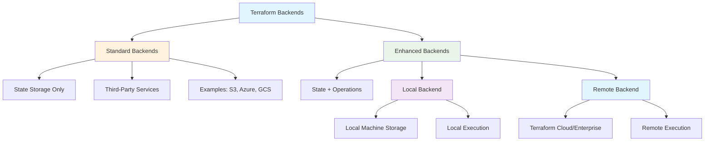
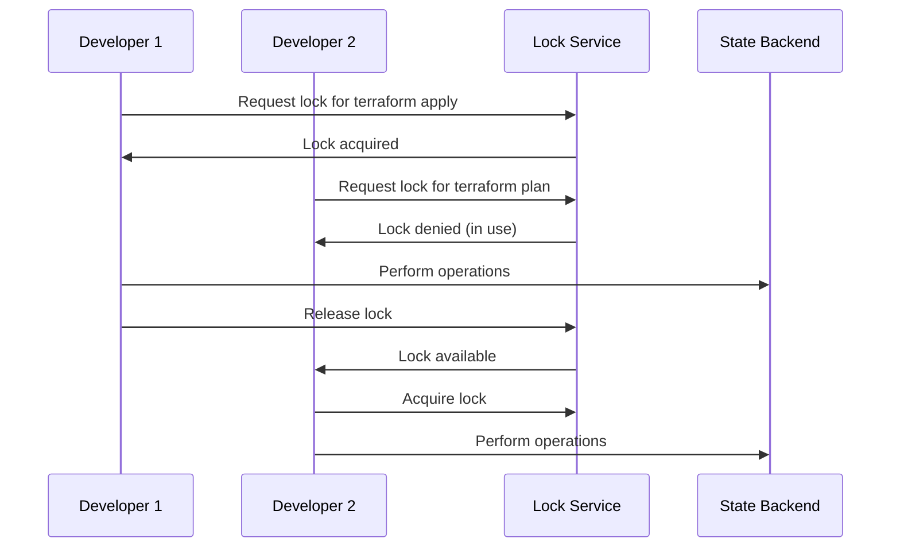

# ⚡ Module 23: Terraform Backends
*Duration: 3 hours | Labs: 6*

### 🎯 Learning Objectives
By the end of this module, you will be able to:
- ✅ Understand the differences between standard and enhanced backends
- ✅ Configure and migrate between different backend types
- ✅ Implement state locking and understand its importance
- ✅ Use terraform_remote_state for cross-referencing stacks
- ✅ Protect sensitive data in state files
- ✅ Handle force unlock operations safely
- ✅ Configure multiple workspaces and backend initialization
- ✅ Choose the appropriate backend for different scenarios

### 📚 Topics Covered

#### 🔍 Understanding Terraform Backends

Terraform backends define **where and how operations are performed** and **where state snapshots are stored**. Understanding backends is crucial for team collaboration and production deployments.

As the transcript emphasizes: *"each terraform configuration can specify a back end which defines where and how operations are performed and where State snapshots are stored"*

**🔑 Backend Categories:**
Terraform divides backends into **two main types**: Standard and Enhanced.



#### 📦 Standard Backends

Standard backends **only store state** and cannot perform terraform operations. From the transcript: *"standard back ends are basically third-party backends"*

**🔧 Standard Backend Characteristics:**
- **Storage Only**: Cannot execute `terraform apply` or other operations
- **Local CLI Required**: Must use CLI on local machine for operations
- **Third-Party Services**: AWS S3, Azure Storage, Google Cloud Storage, etc.

**🌐 Available Standard Backends:**

| Provider | Service | State Locking | Notes |
|----------|---------|---------------|-------|
| **AWS** | S3 | ✅ (via DynamoDB) | Most popular choice |
| **Azure** | Block Storage (RM) | ✅ | Resource Manager based |
| **Google** | Cloud Storage (GCS) | ✅ | Native locking |
| **Alibaba** | Cloud Storage | ✅ (via Table Store) | Asian market leader |
| **OpenStack** | Swift | ✅ | Private cloud option |
| **Tencent** | Cloud Object Storage | ✅ | Asian provider |
| **Joyent** | Manta | ✅ | Legacy provider |
| **HashiCorp** | Consul | ✅ | Service discovery integration |
| **Database** | PostgreSQL | ✅ | Familiar for DB teams |
| **Kubernetes** | Secrets | ✅ | K8s native storage |
| **JFrog** | Artifactory | ❌ | No locking support |

**💡 Pro Tip from Transcript:** The instructor notes that *"the only thing that doesn't have state locking is uh artifactory"* and mentions this might appear on the exam, though *"they would never ask that it's too minute"*.

**🔧 Standard Backend Example (S3):**
```hcl
# Standard S3 backend configuration
terraform {
  backend "s3" {
    bucket = "my-terraform-state-bucket"
    key    = "infrastructure/terraform.tfstate"
    region = "us-west-2"
  }
}
```

From the transcript: *"the backup of a state file will reside on your local machine so the backup's not going to be in S3"*

**✅ Benefits of Standard Backends:**
- **Familiar Services**: Use cloud storage you already know
- **Cost Effective**: Pay only for storage
- **No Vendor Lock-in**: Not tied to HashiCorp services
- **Team Sharing**: Centralized state storage

**⚠️ Limitations:**
- **No Remote Execution**: Must run terraform locally
- **Manual Locking Setup**: Need to configure DynamoDB, etc.
- **Credential Management**: Handle cloud credentials manually

#### ⚡ Enhanced Backends

Enhanced backends can **store state AND perform terraform operations**. The transcript explains: *"enhanced backends are subdivided further so we have local... and remote"*

**🔑 Enhanced Backend Types:**

##### 🖥️ Local Backend (Enhanced)

The **default backend** when no backend is specified.

```hcl
# Explicit local backend (usually omitted)
terraform {
  backend "local" {
    path = "terraform.tfstate"
  }
}

# Default behavior when no backend specified
terraform {
  # No backend block = local backend
}
```

**Key Characteristics:**
- **Default Choice**: *"by default you are using the backend State when you have not specified any kind of back end"*
- **Local Storage**: State stored on local filesystem
- **Local Execution**: Operations run on your machine
- **System Locking**: Uses system APIs for locking
- **Build Servers**: *"a code build server could also be considered a local machine"*

##### ☁️ Remote Backend (Enhanced)

Uses **Terraform Cloud or Terraform Enterprise** for both storage and execution.

```hcl
# Legacy remote backend syntax
terraform {
  backend "remote" {
    hostname     = "app.terraform.io"
    organization = "my-organization"
    
    workspaces {
      name = "production"
    }
  }
}

# Modern cloud backend syntax (recommended)
terraform {
  cloud {
    organization = "my-organization"
    
    workspaces {
      name = "production"
    }
  }
}
```

**🔧 Cloud Backend vs Remote Backend:**
The transcript explains the evolution: *"previously in previous uh terraform versions it would look like this so you'd have terraform back and remote... this has been changed so now that all you have to do is use this Cloud block"*

**Modern Cloud Backend:**
```hcl
terraform {
  cloud {
    organization = "my-company"
    
    # Single workspace
    workspaces {
      name = "production-infrastructure"
    }
    
    # OR multiple workspaces with prefix
    # workspaces {
    #   prefix = "myapp-"
    # }
  }
}
```

**🔑 Important Notes from Transcript:**
- *"you can only set either name or prefix you can't set both"*
- *"when you go to run terraform apply what it's going to do is prompt you to say which environment do you want to use"*

**⚠️ Critical Credential Consideration:**
The transcript emphasizes: *"because the terraform Cloud run environment is the one exiting the command your provider credentials need to be configured in the environment variables in terraform Cloud"*

This means:
- Local `.tfvars` files won't work
- Environment variables must be set in Terraform Cloud UI
- Credentials don't automatically transfer from local to cloud

#### 🔧 Backend Initialization and Configuration

**📋 Backend Initialization Process:**
```bash
# Initialize with backend
terraform init

# Reinitialize when changing backends
terraform init -reconfigure

# Migrate existing state to new backend
terraform init -migrate-state
```

**🔧 Partial Backend Configuration:**
For dynamic or sensitive backend settings, use the `-backend-config` flag.

The transcript explains: *"in situations where the back-end settings are dynamic or sensitive so they cannot be statically specified in your configuration file this is what you would do"*

**main.tf:**
```hcl
terraform {
  # Empty backend configuration
  backend "remote" {
    # Configuration provided via -backend-config
  }
}
```

**backend.hcl:**
```hcl
hostname     = "app.terraform.io"
organization = "my-organization"
workspaces {
  name = "production"
}
```

**Initialization:**
```bash
# Use external backend configuration
terraform init -backend-config="backend.hcl"
```

This approach is useful for:
- **CI/CD Pipelines**: Different environments
- **Sensitive Values**: Organization names, hostnames
- **Dynamic Configuration**: Generated backend configs

#### 🔄 Terraform Remote State Data Source

The transcript emphasizes this feature: *"I give this a lot more attention in the course because I feel that it gets overlooked within the terraform documentation it's such a powerful feature"*

**🎯 Purpose:** Cross-reference outputs between different Terraform configurations/stacks.

```hcl
# Reading from remote backend (Terraform Cloud)
data "terraform_remote_state" "vpc" {
  backend = "remote"
  
  config = {
    organization = "my-company"
    workspaces = {
      name = "vpc-infrastructure"
    }
  }
}

# Reading from local backend
data "terraform_remote_state" "database" {
  backend = "local"
  
  config = {
    path = "../database/terraform.tfstate"
  }
}

# Using the remote state data
resource "aws_instance" "web" {
  subnet_id = data.terraform_remote_state.vpc.outputs.public_subnet_id
  
  tags = {
    Name = "Web Server"
    VPC  = data.terraform_remote_state.vpc.outputs.vpc_id
  }
}
```

**🔑 Key Limitations from Transcript:**
- *"only the root level output values from the remote State snapshots are exposed"*
- *"resource data and output values from nested modules are not accessible"*

**🔧 Module Pass-Through Solution:**
```hcl
# In root module - make nested module outputs available
module "app" {
  source = "./modules/app"
  # ... configuration
}

# Pass-through nested module output to root level
output "app_database_endpoint" {
  description = "Database endpoint from nested module"
  value       = module.app.database_endpoint
}
```

**🎯 Alternatives to terraform_remote_state:**
The transcript recommends: *"it's recommended explicitly uh it it's recommended to explicitly publishing data for external consumption to a separate location instead of accessing it via a remote state"*

**Better Alternatives:**
```hcl
# Instead of terraform_remote_state, use data sources
data "aws_vpc" "main" {
  filter {
    name   = "tag:Environment"
    values = ["production"]
  }
}

data "aws_route53_zone" "main" {
  name = "example.com"
}

# These work with live data, not state snapshots
```

#### 🔒 State Locking

State locking prevents corruption from concurrent operations. The transcript notes: *"they're very important for your workflows"*

**🔄 How State Locking Works:**



**🔑 Key Behaviors:**
- **Automatic**: *"terraform will lock your state for all operations that could write State"*
- **Silent Success**: *"you won't see any message that it's happening"*  
- **Status Messages**: Only when *"acquiring the lock is taking longer than expected"*
- **Write Operations Only**: Read operations don't acquire locks

**🚨 State Locking by Backend:**

| Backend | Locking Mechanism | Notes |
|---------|------------------|--------|
| **S3** | DynamoDB table | Separate service required |
| **Azure** | Blob lease | Built-in mechanism |
| **GCS** | Native locking | Google Cloud handles it |
| **Consul** | KV store locks | Service discovery integration |
| **Local** | System file locks | OS-level locking |
| **Remote** | Terraform Cloud | Automatic in platform |

**⚙️ Disabling Locks (Not Recommended):**
```bash
# Disable locking for this operation
terraform apply -lock=false

# Generally not recommended!
```

#### 🆘 Force Unlock Operations

When automatic unlocking fails, manual intervention may be required.

**⚠️ When to Use Force Unlock:**
- Network interruption during terraform run
- Process killed unexpectedly
- Lock stuck after failed operation

**🔧 Force Unlock Process:**
```bash
# Terraform will provide the lock ID on failure
terraform force-unlock <LOCK_ID> -force
```

**🚨 Critical Safety Notes from Transcript:**
- *"Force unlock should only be used to unlock your own lock"*
- *"if you unlock the state when someone else is holding the lock it could cause multiple writers"*
- *"in the situation where automatic unlocked failed"*

**Example Scenario:**
```bash
# This command fails with a lock ID
terraform apply
# Error: state locked
# Lock ID: 12345678-1234-1234-1234-123456789abc

# Force unlock with the provided ID
terraform force-unlock 12345678-1234-1234-1234-123456789abc -force
```

#### 🛡️ Protecting Sensitive Data

State files can contain sensitive information and represent security risks.

**⚠️ Security Concerns from Transcript:**
*"terraform State file can contain sensitive data so long-lived database credentials and is possible attack Vector for malicious actors"*

**🔧 Local Backend Security Issues:**
- **Plain Text Storage**: *"the state is stored in plain text Json files"*
- **Sharing Risks**: *"you need to be careful you do not share the state file with anyone"*  
- **Git Commits**: *"you need to be careful you do not commit this file to your git repository"*

**✅ Remote Backend Security Benefits:**
- **Memory Only**: *"the save file is held in memory and is not persisted to disk"*
- **Encryption**: *"the state file is encrypted at rest"*
- **Transit Security**: *"the state file is encrypted in transit"*

**🔐 Security Best Practices:**
```bash
# Always exclude state files from git
echo "*.tfstate" >> .gitignore
echo "*.tfstate.*" >> .gitignore
echo ".terraform/" >> .gitignore

# Use remote backends for production
terraform {
  cloud {
    organization = "my-company"
    workspaces {
      name = "production"
    }
  }
}

# Mark sensitive outputs appropriately
output "database_password" {
  value     = aws_db_instance.main.password
  sensitive = true
}
```

#### 📁 Terraform Ignore Files

Control what gets uploaded to Terraform Cloud during remote operations.

**📋 Purpose:** *"when executing a remote plan or apply in a CLI driven run an archive of your configuration directory is uploaded to terraform cloud"*

**.terraformignore Example:**
```bash
# Terraform ignore file (like .gitignore)
*.log
.DS_Store
node_modules/
.vscode/
*.tmp
secrets.txt
development.tfvars

# Custom exclusions
local-scripts/
temp/
```

**🔑 Default Exclusions:**
If no `.terraformignore` exists, these are excluded automatically:
- `.git/`
- `.terraform/`
- `.terraformignore` (the file itself)

**Important Note from Transcript:**
*"you cannot have multiple dot terraform ignore files in subdirectories only the file in the root directory will be read"*

#### 🏢 Multiple Workspaces

Handle multiple environments with a single backend configuration.

**🔧 Workspace Configuration:**
```hcl
terraform {
  cloud {
    organization = "my-company"
    
    # Multiple workspaces with prefix
    workspaces {
      prefix = "myapp-"
    }
  }
}
```

**🔄 Workspace Selection:**
From transcript: *"when you go to run terraform apply what it's going to do is prompt you to say which environment do you want to use"*

```bash
# Terraform will prompt for workspace selection
terraform apply

# Available workspaces:
# 1. myapp-dev
# 2. myapp-staging  
# 3. myapp-production
#
# Enter a value: 1
```

**📋 Supported Backends for Multiple Workspaces:**
- Azure RM
- Consul  
- GCS (Google Cloud Storage)
- Kubernetes
- Local
- Manta
- PostgreSQL
- Remote (Terraform Cloud)
- S3

**💡 Use Case from Transcript:**
*"if let's say you're using terraform cloud and you've reached your limit of five users and it just gets too expensive to go to the sex user... then the thing is is that you know this is an option for you"*

### 💻 **Exercise 21.1**: Standard Backend Setup (S3 + DynamoDB)
**Duration**: 30 minutes

Configure a production-ready S3 backend with DynamoDB locking.

**Step 1: Create S3 Backend Infrastructure**
```bash
mkdir ~/terraform-s3-backend
cd ~/terraform-s3-backend
code .
```

Create `backend-infrastructure.tf`:
```hcl
# First create the backend infrastructure
terraform {
  required_providers {
    aws = {
      source  = "hashicorp/aws"
      version = "~> 5.0"
    }
  }
}

provider "aws" {
  region = var.aws_region
}

# Generate unique suffix for bucket name
resource "random_id" "bucket_suffix" {
  byte_length = 4
}

# S3 bucket for state storage
resource "aws_s3_bucket" "terraform_state" {
  bucket        = "${var.state_bucket_prefix}-${random_id.bucket_suffix.hex}"
  force_destroy = true # For lab cleanup only
  
  tags = {
    Name        = "Terraform State Bucket"
    Environment = "backend-infrastructure"
    Purpose     = "terraform-state-storage"
  }
}

# Enable versioning
resource "aws_s3_bucket_versioning" "terraform_state" {
  bucket = aws_s3_bucket.terraform_state.id
  versioning_configuration {
    status = "Enabled"
  }
}

# Enable server-side encryption
resource "aws_s3_bucket_server_side_encryption_configuration" "terraform_state" {
  bucket = aws_s3_bucket.terraform_state.id

  rule {
    apply_server_side_encryption_by_default {
      sse_algorithm = "AES256"
    }
  }
}

# Block public access
resource "aws_s3_bucket_public_access_block" "terraform_state" {
  bucket = aws_s3_bucket.terraform_state.id

  block_public_acls       = true
  block_public_policy     = true
  ignore_public_acls      = true
  restrict_public_buckets = true
}

# DynamoDB table for state locking
resource "aws_dynamodb_table" "terraform_locks" {
  name           = "${var.lock_table_prefix}-${random_id.bucket_suffix.hex}"
  billing_mode   = "PAY_PER_REQUEST"
  hash_key       = "LockID"

  attribute {
    name = "LockID"
    type = "S"
  }

  tags = {
    Name        = "Terraform State Locks"
    Environment = "backend-infrastructure"
    Purpose     = "terraform-state-locking"
  }
}
```

Create `variables.tf`:
```hcl
variable "aws_region" {
  description = "AWS region for backend infrastructure"
  type        = string
  default     = "us-west-2"
}

variable "state_bucket_prefix" {
  description = "Prefix for S3 state bucket name"
  type        = string
  default     = "terraform-state-backend"
}

variable "lock_table_prefix" {
  description = "Prefix for DynamoDB lock table name"
  type        = string
  default     = "terraform-locks"
}
```

Create `outputs.tf`:
```hcl
output "s3_bucket_name" {
  description = "Name of the S3 bucket for Terraform state"
  value       = aws_s3_bucket.terraform_state.bucket
}

output "s3_bucket_arn" {
  description = "ARN of the S3 bucket for Terraform state"
  value       = aws_s3_bucket.terraform_state.arn
}

output "dynamodb_table_name" {
  description = "Name of the DynamoDB table for state locking"
  value       = aws_dynamodb_table.terraform_locks.name
}

output "backend_configuration" {
  description = "Backend configuration block for other projects"
  value = <<-EOT
    terraform {
      backend "s3" {
        bucket         = "${aws_s3_bucket.terraform_state.bucket}"
        key            = "your-project/terraform.tfstate"
        region         = "${var.aws_region}"
        dynamodb_table = "${aws_dynamodb_table.terraform_locks.name}"
        encrypt        = true
      }
    }
  EOT
}
```

**Step 2: Deploy Backend Infrastructure**
```bash
# Initialize and apply
terraform init
terraform plan
terraform apply -auto-approve

# Note the outputs - you'll need them for the next step
terraform output
```

**Step 3: Create Test Project with S3 Backend**
```bash
mkdir ../terraform-s3-backend-test
cd ../terraform-s3-backend-test
```

Create `main.tf` using the backend configuration from Step 2:
```hcl
terraform {
  backend "s3" {
    bucket         = "terraform-state-backend-YOUR_SUFFIX"  # From output
    key            = "test-project/terraform.tfstate"
    region         = "us-west-2"
    dynamodb_table = "terraform-locks-YOUR_SUFFIX"        # From output
    encrypt        = true
  }
}

provider "aws" {
  region = "us-west-2"
}

# Simple test resource
resource "aws_s3_bucket" "test" {
  bucket = "s3-backend-test-${random_id.test_suffix.hex}"
  
  tags = {
    Name    = "S3 Backend Test"
    Purpose = "Testing S3 backend functionality"
  }
}

resource "random_id" "test_suffix" {
  byte_length = 4
}

output "test_bucket_name" {
  value = aws_s3_bucket.test.bucket
}
```

**Step 4: Test State Locking**
```bash
# Initialize with S3 backend
terraform init

# Apply - this should work
terraform apply -auto-approve

# In another terminal, try to run apply simultaneously
# (Open new terminal, cd to same directory)
terraform apply -auto-approve
# This should be blocked by state locking
```

**Step 5: Verify State Storage**
```bash
# Check that state is stored in S3 (not locally)
ls -la terraform.tfstate*  # Should not exist

# Verify state in S3 (optional)
aws s3 ls s3://YOUR_BUCKET_NAME/test-project/
```

**Step 6: Clean Up**
```bash
# Destroy test resources
terraform destroy -auto-approve

# Clean up backend infrastructure
cd ../terraform-s3-backend
terraform destroy -auto-approve
```

### 💻 **Exercise 21.2**: Backend Migration & Configuration
**Duration**: 25 minutes

Practice migrating between different backend types.

**Step 1: Start with Local Backend**
```bash
mkdir ~/terraform-backend-migration
cd ~/terraform-backend-migration
```

Create `main.tf` (no backend specified = local backend):
```hcl
terraform {
  required_providers {
    aws = {
      source  = "hashicorp/aws"
      version = "~> 5.0"
    }
  }
}

provider "aws" {
  region = "us-west-2"
}

# Simple infrastructure
resource "aws_s3_bucket" "migration_test" {
  bucket = "backend-migration-test-${random_id.suffix.hex}"
  
  tags = {
    Name        = "Backend Migration Test"
    Environment = "learning"
  }
}

resource "random_id" "suffix" {
  byte_length = 4
}

output "bucket_name" {
  value = aws_s3_bucket.migration_test.bucket
}
```

**Step 2: Deploy with Local Backend**
```bash
terraform init
terraform apply -auto-approve

# Verify local state file exists
ls -la terraform.tfstate
cat terraform.tfstate | jq '.resources[].instances[].attributes.bucket'
```

**Step 3: Create Terraform Cloud Workspace**
1. Go to https://app.terraform.io
2. Create organization: `terraform-backend-migration-[yourname]`
3. Create workspace: `backend-migration-test`
4. Set environment variables:
   - `AWS_ACCESS_KEY_ID` (sensitive)
   - `AWS_SECRET_ACCESS_KEY` (sensitive)

**Step 4: Migrate to Terraform Cloud Backend**
Update `main.tf` to add cloud backend:
```hcl
terraform {
  cloud {
    organization = "terraform-backend-migration-yourname"
    
    workspaces {
      name = "backend-migration-test"
    }
  }
  
  required_providers {
    aws = {
      source  = "hashicorp/aws"
      version = "~> 5.0"
    }
  }
}

# Rest of configuration remains the same...
```

**Step 5: Migrate State**
```bash
# Login to Terraform Cloud
terraform login

# Reinitialize to migrate state
terraform init -migrate-state

# Answer "yes" when prompted to migrate state
# Verify migration
terraform show
```

**Step 6: Test Remote Execution**
```bash
# Make a small change
# Edit main.tf and add a tag
terraform plan  # This runs remotely!
terraform apply  # This also runs remotely!
```

**Step 7: Demonstrate Partial Backend Configuration**
Create `backend.hcl`:
```hcl
organization = "terraform-backend-migration-yourname"
workspaces {
  name = "backend-migration-test"
}
```

Update `main.tf`:
```hcl
terraform {
  cloud {
    # Configuration from backend.hcl
  }
  
  # ... rest unchanged
}
```

**Step 8: Test Partial Configuration**
```bash
# Reinitialize with external config
terraform init -backend-config="backend.hcl"
```

**Step 9: Clean Up**
```bash
terraform destroy -auto-approve
```

### 💻 **Exercise 21.3**: Remote State Cross-Referencing
**Duration**: 35 minutes

Learn to share data between Terraform configurations using terraform_remote_state.

**Step 1: Create Network Infrastructure Stack**
```bash
mkdir ~/terraform-remote-state-demo
cd ~/terraform-remote-state-demo
mkdir network-stack
cd network-stack
```

Create `main.tf`:
```hcl
terraform {
  cloud {
    organization = "terraform-backend-migration-yourname"  # Use your org
    
    workspaces {
      name = "network-infrastructure"
    }
  }
  
  required_providers {
    aws = {
      source  = "hashicorp/aws"
      version = "~> 5.0"
    }
  }
}

provider "aws" {
  region = var.aws_region
}

# VPC
resource "aws_vpc" "main" {
  cidr_block           = "10.0.0.0/16"
  enable_dns_hostnames = true
  enable_dns_support   = true
  
  tags = {
    Name = "Remote State Demo VPC"
  }
}

# Internet Gateway
resource "aws_internet_gateway" "main" {
  vpc_id = aws_vpc.main.id
  
  tags = {
    Name = "Remote State Demo IGW"
  }
}

# Public Subnet
resource "aws_subnet" "public" {
  count             = 2
  vpc_id            = aws_vpc.main.id
  cidr_block        = "10.0.${count.index + 1}.0/24"
  availability_zone = data.aws_availability_zones.available.names[count.index]
  
  map_public_ip_on_launch = true
  
  tags = {
    Name = "Public Subnet ${count.index + 1}"
    Type = "public"
  }
}

# Private Subnet
resource "aws_subnet" "private" {
  count             = 2
  vpc_id            = aws_vpc.main.id
  cidr_block        = "10.0.${count.index + 10}.0/24"
  availability_zone = data.aws_availability_zones.available.names[count.index]
  
  tags = {
    Name = "Private Subnet ${count.index + 1}"
    Type = "private"
  }
}

# Route Table
resource "aws_route_table" "public" {
  vpc_id = aws_vpc.main.id
  
  route {
    cidr_block = "0.0.0.0/0"
    gateway_id = aws_internet_gateway.main.id
  }
  
  tags = {
    Name = "Public Route Table"
  }
}

# Route Table Association
resource "aws_route_table_association" "public" {
  count          = 2
  subnet_id      = aws_subnet.public[count.index].id
  route_table_id = aws_route_table.public.id
}

data "aws_availability_zones" "available" {
  state = "available"
}
```

Create `variables.tf`:
```hcl
variable "aws_region" {
  description = "AWS region"
  type        = string
  default     = "us-west-2"
}
```

Create `outputs.tf`:
```hcl
# These outputs will be accessible via terraform_remote_state
output "vpc_id" {
  description = "VPC ID for other stacks to reference"
  value       = aws_vpc.main.id
}

output "vpc_cidr" {
  description = "VPC CIDR block"
  value       = aws_vpc.main.cidr_block
}

output "public_subnet_ids" {
  description = "List of public subnet IDs"
  value       = aws_subnet.public[*].id
}

output "private_subnet_ids" {
  description = "List of private subnet IDs"
  value       = aws_subnet.private[*].id
}

output "availability_zones" {
  description = "Availability zones used"
  value       = aws_subnet.public[*].availability_zone
}
```

**Step 2: Deploy Network Stack**
```bash
# Create Terraform Cloud workspace for network
# Set AWS credentials in Terraform Cloud

terraform init
terraform apply -auto-approve
```

**Step 3: Create Application Stack That References Network**
```bash
cd ..
mkdir app-stack
cd app-stack
```

Create `main.tf`:
```hcl
terraform {
  cloud {
    organization = "terraform-backend-migration-yourname"  # Use your org
    
    workspaces {
      name = "application-infrastructure"
    }
  }
  
  required_providers {
    aws = {
      source  = "hashicorp/aws"
      version = "~> 5.0"
    }
  }
}

provider "aws" {
  region = "us-west-2"
}

# Reference the network stack using terraform_remote_state
data "terraform_remote_state" "network" {
  backend = "remote"
  
  config = {
    organization = "terraform-backend-migration-yourname"  # Use your org
    workspaces = {
      name = "network-infrastructure"
    }
  }
}

# Security Group using VPC from network stack
resource "aws_security_group" "app" {
  name_prefix = "app-sg"
  vpc_id      = data.terraform_remote_state.network.outputs.vpc_id
  
  ingress {
    description = "HTTP"
    from_port   = 80
    to_port     = 80
    protocol    = "tcp"
    cidr_blocks = [data.terraform_remote_state.network.outputs.vpc_cidr]
  }
  
  ingress {
    description = "SSH"
    from_port   = 22
    to_port     = 22
    protocol    = "tcp"
    cidr_blocks = ["0.0.0.0/0"]
  }
  
  egress {
    from_port   = 0
    to_port     = 0
    protocol    = "-1"
    cidr_blocks = ["0.0.0.0/0"]
  }
  
  tags = {
    Name = "Application Security Group"
  }
}

# EC2 instance in public subnet from network stack
resource "aws_instance" "app" {
  ami                    = data.aws_ami.amazon_linux.id
  instance_type          = "t2.micro"
  subnet_id             = data.terraform_remote_state.network.outputs.public_subnet_ids[0]
  vpc_security_group_ids = [aws_security_group.app.id]
  
  user_data = <<-EOF
    #!/bin/bash
    yum update -y
    yum install -y httpd
    systemctl start httpd
    systemctl enable httpd
    echo "<h1>Hello from Remote State Demo!</h1>" > /var/www/html/index.html
    echo "<p>VPC ID: ${data.terraform_remote_state.network.outputs.vpc_id}</p>" >> /var/www/html/index.html
  EOF
  
  tags = {
    Name = "Application Server"
  }
}

data "aws_ami" "amazon_linux" {
  most_recent = true
  owners      = ["amazon"]
  
  filter {
    name   = "name"
    values = ["amzn2-ami-hvm-*-x86_64-gp2"]
  }
}
```

Create `outputs.tf`:
```hcl
output "instance_id" {
  description = "EC2 instance ID"
  value       = aws_instance.app.id
}

output "instance_public_ip" {
  description = "Public IP address"
  value       = aws_instance.app.public_ip
}

output "security_group_id" {
  description = "Security group ID"
  value       = aws_security_group.app.id
}

# Show network information from remote state
output "network_info" {
  description = "Network information from remote state"
  value = {
    vpc_id             = data.terraform_remote_state.network.outputs.vpc_id
    public_subnet_ids  = data.terraform_remote_state.network.outputs.public_subnet_ids
    availability_zones = data.terraform_remote_state.network.outputs.availability_zones
  }
}
```

**Step 4: Deploy Application Stack**
```bash
# Create Terraform Cloud workspace for app
# Set AWS credentials in Terraform Cloud

terraform init
terraform apply -auto-approve

# View the cross-referenced data
terraform output network_info
```

**Step 5: Test the Cross-Reference**
```bash
# Get the public IP
PUBLIC_IP=$(terraform output -raw instance_public_ip)
echo "Testing application at: http://$PUBLIC_IP"

# Test the web server (wait a minute for user data to complete)
curl "http://$PUBLIC_IP"
```

**Step 6: Demonstrate Local Backend Cross-Reference**
Create a local backend example:
```bash
mkdir ../local-backend-test
cd ../local-backend-test
```

Create `main.tf`:
```hcl
# No backend specified = local backend
terraform {
  required_providers {
    aws = {
      source  = "hashicorp/aws"
      version = "~> 5.0"
    }
  }
}

provider "aws" {
  region = "us-west-2"
}

# Create a simple resource with outputs
resource "aws_s3_bucket" "local_test" {
  bucket = "local-backend-test-${random_id.suffix.hex}"
  
  tags = {
    Name = "Local Backend Test"
  }
}

resource "random_id" "suffix" {
  byte_length = 4
}

output "bucket_name" {
  value = aws_s3_bucket.local_test.bucket
}

output "bucket_arn" {
  value = aws_s3_bucket.local_test.arn
}
```

Deploy local stack:
```bash
terraform init
terraform apply -auto-approve
ls -la terraform.tfstate  # Verify local state file
```

Create another project that references the local state:
```bash
mkdir ../local-reference-test
cd ../local-reference-test
```

Create `main.tf`:
```hcl
terraform {
  required_providers {
    aws = {
      source  = "hashicorp/aws"
      version = "~> 5.0"
    }
  }
}

provider "aws" {
  region = "us-west-2"
}

# Reference local backend state file
data "terraform_remote_state" "local_bucket" {
  backend = "local"
  
  config = {
    path = "../local-backend-test/terraform.tfstate"
  }
}

# Create resource that references the local state
resource "aws_s3_bucket_notification" "bucket_notification" {
  bucket = data.terraform_remote_state.local_bucket.outputs.bucket_name
  
  # This is just an example - we won't configure actual notifications
  depends_on = [data.terraform_remote_state.local_bucket]
}

output "referenced_bucket" {
  description = "Bucket referenced from local state"
  value = {
    name = data.terraform_remote_state.local_bucket.outputs.bucket_name
    arn  = data.terraform_remote_state.local_bucket.outputs.bucket_arn
  }
}
```

Test local cross-reference:
```bash
terraform init
terraform plan  # Should show reference to local state
```

**Step 7: Clean Up**
```bash
# Clean up all stacks
cd ../app-stack
terraform destroy -auto-approve

cd ../network-stack  
terraform destroy -auto-approve

cd ../local-backend-test
terraform destroy -auto-approve

cd ../local-reference-test
# No resources to destroy
```

### 💻 **Exercise 21.4**: State Locking & Force Unlock
**Duration**: 20 minutes

Practice state locking scenarios and force unlock operations.

**Step 1: Setup Test Environment**
```bash
mkdir ~/terraform-state-locking
cd ~/terraform-state-locking
```

Create `main.tf`:
```hcl
terraform {
  cloud {
    organization = "terraform-backend-migration-yourname"  # Use your org
    
    workspaces {
      name = "state-locking-test"
    }
  }
  
  required_providers {
    aws = {
      source  = "hashicorp/aws"
      version = "~> 5.0"
    }
  }
}

provider "aws" {
  region = "us-west-2"
}

# Resource that takes time to create (for testing concurrent operations)
resource "aws_s3_bucket" "locking_test" {
  bucket = "state-locking-test-${random_id.suffix.hex}"
  
  tags = {
    Name        = "State Locking Test"
    Environment = "testing"
  }
}

resource "aws_s3_bucket_versioning" "locking_test" {
  bucket = aws_s3_bucket.locking_test.id
  versioning_configuration {
    status = "Enabled"
  }
}

# Add multiple resources to make apply take longer
resource "aws_s3_bucket" "additional" {
  count  = 3
  bucket = "additional-bucket-${count.index}-${random_id.suffix.hex}"
  
  tags = {
    Name  = "Additional Bucket ${count.index}"
    Index = count.index
  }
}

resource "random_id" "suffix" {
  byte_length = 4
}

# Simulate slow provisioner (for testing)
resource "null_resource" "slow_provisioner" {
  provisioner "local-exec" {
    command = "sleep 30"  # 30 second delay
  }
  
  depends_on = [aws_s3_bucket.locking_test]
}

output "bucket_names" {
  value = concat([aws_s3_bucket.locking_test.bucket], aws_s3_bucket.additional[*].bucket)
}
```

**Step 2: Test Successful Locking**
```bash
terraform init
terraform apply -auto-approve
```

**Step 3: Simulate Concurrent Operations**
Terminal 1:
```bash
# Start a long-running operation
terraform apply -auto-approve
# This will take ~30 seconds due to null_resource
```

Terminal 2 (immediately after starting Terminal 1):
```bash
# Try to run plan while apply is running
terraform plan
# Should show: "Acquiring state lock. This may take a few moments..."
```

**Step 4: Simulate Lock Acquisition Failure**
Create a script to simulate a stuck lock:
```bash
# Create a test script that simulates interrupted operation
cat > simulate_lock_failure.sh << 'EOF'
#!/bin/bash
echo "Starting terraform apply..."
timeout 5 terraform apply -auto-approve &
APPLY_PID=$!

# Wait a moment then kill terraform process
sleep 2
echo "Simulating process interruption..."
kill -9 $APPLY_PID

echo "Process interrupted. Lock may be stuck."
sleep 3

# Try to run terraform plan - should show lock error
echo "Attempting terraform plan..."
terraform plan
EOF

chmod +x simulate_lock_failure.sh
```

**Step 5: Handle Force Unlock (Demonstration Only)**
```bash
# If you encounter a stuck lock, Terraform will provide output like:
# Error: state locked
# Lock ID: 12345678-1234-1234-1234-123456789abc
# 
# Then you would run:
# terraform force-unlock 12345678-1234-1234-1234-123456789abc -force

# For this lab, let's just show the command format:
echo "Force unlock command format:"
echo "terraform force-unlock <LOCK_ID> -force"
```

**Step 6: Test Lock Disable (Not Recommended)**
```bash
# Show how to disable locking (demonstration only)
echo "Disabling state locking (NOT recommended):"
terraform plan -lock=false

# Warning message about why this is dangerous
cat << 'EOF'
WARNING: Disabling state locking is dangerous because:
1. Multiple people can modify infrastructure simultaneously  
2. State corruption can occur
3. Resources can be created/destroyed unexpectedly
4. Only use in emergency situations

From the transcript: "it's generally not recommended"
EOF
```

**Step 7: Verify Normal Lock Behavior**
```bash
# Run normal operations to verify locking works
terraform plan   # Should work normally
terraform apply -auto-approve  # Should work normally
```

**Step 8: Clean Up**
```bash
terraform destroy -auto-approve
```

### 💻 **Exercise 21.5**: Terraform Cloud Backend Migration
**Duration**: 30 minutes

Practice migrating from different backends to Terraform Cloud.

**Step 1: Create S3 Backend Project**
```bash
mkdir ~/terraform-cloud-migration
cd ~/terraform-cloud-migration
```

Set up S3 backend (using simplified setup for lab):
Create `main.tf`:
```hcl
terraform {
  # Start with local backend for simplicity
  required_providers {
    aws = {
      source  = "hashicorp/aws"
      version = "~> 5.0"
    }
  }
}

provider "aws" {
  region = "us-west-2"
}

# Infrastructure to migrate
resource "aws_s3_bucket" "migration_demo" {
  bucket = "cloud-migration-demo-${random_id.suffix.hex}"
  
  tags = {
    Name        = "Migration Demo Bucket"
    Environment = "migration-test"
    Owner       = "terraform-training"
  }
}

resource "aws_s3_bucket_versioning" "migration_demo" {
  bucket = aws_s3_bucket.migration_demo.id
  versioning_configuration {
    status = "Enabled"
  }
}

resource "aws_vpc" "migration_demo" {
  cidr_block           = "10.0.0.0/16"
  enable_dns_hostnames = true
  enable_dns_support   = true
  
  tags = {
    Name        = "Migration Demo VPC"
    Environment = "migration-test"
  }
}

resource "random_id" "suffix" {
  byte_length = 4
}

# Outputs to test migration
output "bucket_name" {
  description = "S3 bucket name"
  value       = aws_s3_bucket.migration_demo.bucket
}

output "bucket_arn" {
  description = "S3 bucket ARN"
  value       = aws_s3_bucket.migration_demo.arn
}

output "vpc_id" {
  description = "VPC ID"
  value       = aws_vpc.migration_demo.id
}
```

**Step 2: Deploy with Local Backend**
```bash
terraform init
terraform apply -auto-approve

# Verify local state
ls -la terraform.tfstate
terraform output
```

**Step 3: Create Terraform Cloud Workspace**
1. Go to Terraform Cloud
2. Create workspace: `backend-migration-demo`
3. Choose "CLI-driven workflow"
4. Configure environment variables:
   - `AWS_ACCESS_KEY_ID`
   - `AWS_SECRET_ACCESS_KEY`

**Step 4: Add Cloud Backend Configuration**
Update `main.tf` to add cloud backend:
```hcl
terraform {
  cloud {
    organization = "terraform-backend-migration-yourname"  # Your org
    
    workspaces {
      name = "backend-migration-demo"
    }
  }
  
  required_providers {
    aws = {
      source  = "hashicorp/aws"
      version = "~> 5.0"
    }
  }
}

# Rest of configuration unchanged...
```

**Step 5: Migrate State to Terraform Cloud**
```bash
# Login to Terraform Cloud
terraform login

# Migrate state
terraform init -migrate-state

# Terraform will prompt:
# "Do you want to copy existing state to the new backend?"
# Answer: yes

# Verify migration
terraform show
terraform output
```

**Step 6: Test Remote Operations**
```bash
# Make a change to test remote execution
# Add a tag to the VPC
# Update main.tf VPC resource:
```

```hcl
resource "aws_vpc" "migration_demo" {
  cidr_block           = "10.0.0.0/16"
  enable_dns_hostnames = true
  enable_dns_support   = true
  
  tags = {
    Name         = "Migration Demo VPC"
    Environment  = "migration-test"
    MigratedTo   = "terraform-cloud"  # New tag
  }
}
```

```bash
# Test remote execution
terraform plan  # Runs remotely
terraform apply # Runs remotely
```

**Step 7: Demonstrate Multiple Workspace Configuration**
Create another project for multiple workspaces:
```bash
mkdir ../multi-workspace-demo
cd ../multi-workspace-demo
```

Create `main.tf`:
```hcl
terraform {
  cloud {
    organization = "terraform-backend-migration-yourname"
    
    # Use prefix for multiple workspaces
    workspaces {
      prefix = "multienv-"
    }
  }
  
  required_providers {
    aws = {
      source  = "hashicorp/aws"
      version = "~> 5.0"
    }
  }
}

provider "aws" {
  region = "us-west-2"
}

# Environment-specific configuration
locals {
  environment = terraform.workspace == "multienv-prod" ? "production" : 
                terraform.workspace == "multienv-staging" ? "staging" : "development"
  
  instance_type = local.environment == "production" ? "t2.small" : "t2.micro"
}

resource "aws_s3_bucket" "env_bucket" {
  bucket = "${local.environment}-bucket-${random_id.suffix.hex}"
  
  tags = {
    Name        = "${title(local.environment)} Bucket"
    Environment = local.environment
    Workspace   = terraform.workspace
  }
}

resource "random_id" "suffix" {
  byte_length = 4
}

output "environment" {
  value = local.environment
}

output "workspace" {
  value = terraform.workspace
}

output "bucket_name" {
  value = aws_s3_bucket.env_bucket.bucket
}
```

**Step 8: Create Multiple Workspaces in Terraform Cloud**
1. Create workspaces:
   - `multienv-dev`
   - `multienv-staging`
   - `multienv-prod`
2. Set AWS credentials in each workspace

**Step 9: Test Workspace Selection**
```bash
terraform init

# Terraform will prompt for workspace selection
terraform plan
# Select different workspaces and note the differences

terraform apply -auto-approve
```

**Step 10: Clean Up**
```bash
# Clean up both projects
terraform destroy -auto-approve

cd ../terraform-cloud-migration
terraform destroy -auto-approve
```

### 💻 **Exercise 21.6**: Multiple Workspaces & Sensitive Data
**Duration**: 25 minutes

Practice workspace management and sensitive data protection.

**Step 1: Create Multi-Environment Project**
```bash
mkdir ~/terraform-workspaces-security
cd ~/terraform-workspaces-security
```

Create `main.tf`:
```hcl
terraform {
  cloud {
    organization = "terraform-backend-migration-yourname"
    
    workspaces {
      prefix = "secure-"
    }
  }
  
  required_providers {
    aws = {
      source  = "hashicorp/aws"
      version = "~> 5.0"
    }
  }
}

provider "aws" {
  region = var.aws_region
}

# Environment-specific locals
locals {
  environment = replace(terraform.workspace, "secure-", "")
  
  # Environment-specific configuration
  config = {
    dev = {
      instance_type = "t2.micro"
      min_size      = 1
      max_size      = 2
      db_instance   = "db.t3.micro"
    }
    staging = {
      instance_type = "t2.small"
      min_size      = 2
      max_size      = 4
      db_instance   = "db.t3.small"
    }
    prod = {
      instance_type = "t2.medium"
      min_size      = 3
      max_size      = 6
      db_instance   = "db.t3.medium"
    }
  }
  
  current_config = local.config[local.environment]
}

# RDS instance with sensitive password
resource "aws_db_instance" "main" {
  identifier     = "${local.environment}-database"
  engine         = "mysql"
  engine_version = "8.0"
  instance_class = local.current_config.db_instance
  
  allocated_storage     = 20
  max_allocated_storage = 100
  
  db_name  = "${local.environment}db"
  username = var.db_username
  password = var.db_password
  
  # Security
  skip_final_snapshot = true  # Only for demo
  deletion_protection = local.environment == "prod" ? true : false
  
  tags = {
    Name        = "${title(local.environment)} Database"
    Environment = local.environment
  }
}

# S3 bucket for sensitive data
resource "aws_s3_bucket" "secure_bucket" {
  bucket = "${local.environment}-secure-data-${random_id.suffix.hex}"
  
  tags = {
    Name          = "${title(local.environment)} Secure Bucket"
    Environment   = local.environment
    Sensitive     = "true"
  }
}

resource "aws_s3_bucket_server_side_encryption_configuration" "secure_bucket" {
  bucket = aws_s3_bucket.secure_bucket.id

  rule {
    apply_server_side_encryption_by_default {
      sse_algorithm = "AES256"
    }
  }
}

resource "random_id" "suffix" {
  byte_length = 4
}

# API key generation (sensitive)
resource "random_password" "api_key" {
  length  = 32
  special = true
}
```

Create `variables.tf`:
```hcl
variable "aws_region" {
  description = "AWS region"
  type        = string
  default     = "us-west-2"
}

variable "db_username" {
  description = "Database username"
  type        = string
  default     = "admin"
}

variable "db_password" {
  description = "Database password"
  type        = string
  sensitive   = true
}
```

Create `outputs.tf`:
```hcl
output "environment" {
  description = "Current environment"
  value       = local.environment
}

output "database_endpoint" {
  description = "Database connection endpoint"
  value       = aws_db_instance.main.endpoint
}

# Sensitive outputs - won't show in CLI but visible in state
output "database_password" {
  description = "Database password"
  value       = var.db_password
  sensitive   = true
}

output "api_key" {
  description = "Generated API key"
  value       = random_password.api_key.result
  sensitive   = true
}

output "secure_bucket_name" {
  description = "Name of secure S3 bucket"
  value       = aws_s3_bucket.secure_bucket.bucket
}

# Non-sensitive configuration info
output "configuration" {
  description = "Environment configuration"
  value = {
    environment   = local.environment
    instance_type = local.current_config.instance_type
    min_size      = local.current_config.min_size
    max_size      = local.current_config.max_size
    db_instance   = local.current_config.db_instance
  }
}
```

**Step 2: Create Terraform Cloud Workspaces**
Create three workspaces:
1. `secure-dev`
2. `secure-staging` 
3. `secure-prod`

For each workspace, set variables:

**Environment Variables (all workspaces):**
- `AWS_ACCESS_KEY_ID` (sensitive)
- `AWS_SECRET_ACCESS_KEY` (sensitive)

**Terraform Variables:**
- `db_password` (sensitive, different for each environment)
  - dev: `devpassword123`
  - staging: `stagingpassword456`
  - prod: `prodpassword789`

**Step 3: Test Development Environment**
```bash
terraform init

# Select dev workspace when prompted
terraform plan
terraform apply -auto-approve

# Test sensitive output handling
terraform output
# Sensitive outputs should be hidden

terraform output database_password
# Should show <sensitive>

# Force show sensitive output (be careful!)
terraform output -json | jq '.database_password.value'
```

**Step 4: Switch Between Workspaces**
```bash
# Apply to staging
terraform plan  # Select staging when prompted
terraform apply -auto-approve

# Apply to production
terraform plan   # Select prod when prompted
terraform apply -auto-approve

# Compare configurations
terraform output configuration
```

**Step 5: Demonstrate State File Security**
```bash
# Show local state security risk
terraform init -reconfigure  # Switch to local backend temporarily
# Remove cloud backend from main.tf temporarily

# Apply locally
terraform plan
# Notice warning about sensitive data in local state

# Check local state file content
cat terraform.tfstate | jq '.outputs'
# Sensitive data visible in plain text!

# This demonstrates why remote backends are important
echo "WARNING: Local state exposes sensitive data!"
```

**Step 6: Return to Secure Remote Backend**
```bash
# Restore cloud backend in main.tf
# Re-migrate to Terraform Cloud
terraform init -migrate-state
```

**Step 7: Create .terraformignore for Security**
Create `.terraformignore`:
```bash
# Terraform ignore file - exclude sensitive files
*.tfvars
*.tfvars.json
.env
secrets/
*.pem
*.key
override.tf
override.tf.json
*_override.tf
*_override.tf.json

# Development files
.vscode/
.idea/
*.swp
*.swo
*~

# OS files
.DS_Store
Thumbs.db

# Temporary files
*.tmp
*.log
```

Test the ignore functionality:
```bash
# Create test files that should be ignored
echo "db_password = \"secret123\"" > secrets.tfvars
echo "AWS_ACCESS_KEY = secret" > .env

# These should not be uploaded to Terraform Cloud
terraform plan
```

**Step 8: Clean Up**
```bash
# Clean up all environments
# Select each workspace and destroy

terraform destroy -auto-approve  # dev
# Switch workspace and repeat for staging and prod
```

---

## ✅ Module 21 Summary

### 🎯 Key Takeaways
- **🔧 Backend Types**: Standard backends only store state; Enhanced backends store state and execute operations
- **☁️ Remote Execution**: From transcript: *"your provider credentials need to be configured in the environment variables in terraform Cloud"*
- **🔒 State Locking**: *"terraform will lock your state for all operations that could write State"* - prevents corruption from concurrent access
- **🔄 Cross-Referencing**: *"terraform remote State data source retrieves the root module output values from another terraform configuration"*
- **🛡️ Security**: *"terraform State file can contain sensitive data"* - use remote backends for production
- **🆘 Force Unlock**: *"Force unlock should only be used to unlock your own lock"* - safety first
- **📁 File Exclusion**: Use `.terraformignore` to prevent sensitive file uploads to Terraform Cloud

### 🔑 Essential Commands Learned
```bash
# Backend management
terraform init                          # Initialize backend
terraform init -migrate-state          # Migrate between backends
terraform init -reconfigure           # Reconfigure backend
terraform init -backend-config="file.hcl"  # Partial configuration

# State locking
terraform force-unlock <ID> -force    # Force unlock stuck state
terraform apply -lock=false          # Disable locking (not recommended)

# Remote state
terraform_remote_state               # Data source for cross-referencing
terraform output -json               # Access outputs programmatically
```

### 💡 Pro Tips Recap
- **Always use remote backends for production** - local state is insecure and doesn't support collaboration
- **State locking is automatic** - you don't see success messages, only delays or failures
- **Use terraform_remote_state sparingly** - data sources are often better alternatives
- **Multiple workspaces with prefix** - *"you can only set either name or prefix you can't set both"*
- **Sensitive outputs are still in state** - mark as sensitive but understand limitations
- **Credentials must be in Terraform Cloud** - local credentials don't transfer automatically

### 🧠 Knowledge Check Questions

**1. What is the key difference between Standard and Enhanced backends?**
- A) Standard backends are faster
- B) Enhanced backends can perform operations, Standard backends only store state
- C) Standard backends are more secure
- D) Enhanced backends cost more

**2. According to the transcript, what happens when you migrate to Terraform Cloud backend?**
- A) Local credentials automatically transfer
- B) Provider credentials must be configured in Terraform Cloud environment variables
- C) All local files are uploaded automatically
- D) State locking is disabled

**3. When should you use terraform force-unlock?**
- A) When you want to run multiple applies simultaneously
- B) When automatic unlocking failed and it's your own lock
- C) When someone else is holding a lock you need
- D) As a regular part of the workflow

**4. What does terraform_remote_state expose from another configuration?**
- A) All resources and their attributes
- B) Only root-level output values
- C) All variables and locals
- D) The entire state file

**5. Which backend does NOT support state locking according to the transcript?**
- A) S3 with DynamoDB
- B) Consul
- C) Artifactory
- D) PostgreSQL

**6. What is the modern syntax for Terraform Cloud backend?**
- A) `backend "remote"`
- B) `backend "cloud"`  
- C) `cloud { }`
- D) `terraform_cloud { }`

<details>
<summary>🔍 Click for Answers</summary>

1. **B** - The transcript explains: *"standard back ends are basically third-party backends"* that only store state, while enhanced backends can both store state and perform operations
2. **B** - The transcript emphasizes: *"your provider credentials need to be configured in the environment variables in terraform Cloud"*
3. **B** - From transcript: *"Force unlock should only be used to unlock your own lock in the situation where automatic unlocked failed"*
4. **B** - The transcript states: *"only the root level output values from the remote State snapshots are exposed"*
5. **C** - The transcript notes: *"the only thing that doesn't have state locking is uh artifactory"*
6. **C** - The transcript shows the evolution: *"now that all you have to do is use this Cloud block"*

</details>

---

**🎉 Congratulations!** You've completed Module 21 and now understand Terraform backends comprehensively. You've learned to configure different backend types, migrate between them, implement state locking, cross-reference configurations, and protect sensitive data.

The transcript's key insight is crucial: *"I give this a lot more attention in the course because I feel that it gets overlooked within the terraform documentation it's such a powerful feature"* - referring to terraform_remote_state and backend concepts in general.

**➡️ Ready for Module 22?** You now have the foundation to understand more advanced Terraform topics with solid knowledge of how state management and backend configuration work in production environments!

---

---

## 🔗 **Next Steps**

Ready to continue your Terraform journey? Proceed to the next module:

**➡️ [Module 24: Resources and Complex Types](./module_24_resources_and_complex_types.md)**

Work with complex data types and advanced resource configurations.

---
