## 🔷 Module 25: Terraform Workspaces
*Duration: 2.5 hours | Labs: 3*

### 🎯 Learning Objectives
By the end of this module, you will be able to:
- ✅ Distinguish between CLI workspaces and Terraform Cloud workspaces
- ✅ Create and manage local workspaces using CLI commands
- ✅ Understand workspace internals and state file storage
- ✅ Use workspace interpolation with `terraform.workspace`
- ✅ Configure multiple workspaces with different backends
- ✅ Implement environment-specific configurations using workspaces
- ✅ Compare local vs. cloud workspace workflows
- ✅ Apply workspace best practices and limitations
- ✅ Troubleshoot common workspace issues

### 📚 Topics Covered

#### 🌟 Workspace Fundamentals

**Terraform Workspaces** allow you to manage multiple environments or alternate state files such as development and production using the same Terraform configuration.

> **💡 Key Principle**: "Workspaces are like having different branches in a Git repository - same code, different states."

There are **two variants** of workspaces that often cause confusion:

1. **CLI Workspaces**: Manage alternate state files locally or via remote backends
2. **Terraform Cloud Workspaces**: Act like completely separate working directories


#### 🔍 **Historical Context**
- In Terraform 0.9, workspaces were called **"environments"**
- Changed to "workspaces" to reduce confusion (ironically creating more confusion!)
- **Default workspace**: Always exists and cannot be deleted
- Even first-time Terraform users are already using the "default" workspace

#### ⚡ **Core Benefits**
- **State Isolation**: Each workspace maintains separate state
- **Same Configuration**: Use identical code across environments
- **Environment Management**: Development, staging, production workflows
- **Resource Naming**: Dynamic naming based on workspace context
- **Cost Efficiency**: Alternative to multiple Terraform Cloud workspaces

---

### 🛠️ CLI Workspace Management

#### 🏗️ **Workspace Internals**

Understanding how workspaces store state is crucial for effective usage:


#### 📁 **State Storage Patterns**

**Local Backend:**
- Default workspace: `terraform.tfstate` (root directory)
- Named workspaces: `terraform.tfstate.d/<workspace-name>/terraform.tfstate`

**Remote Backend:**
- State files stored directly in configured backend
- Workspace isolation handled by backend provider
- No local `terraform.tfstate.d` directory created

#### 🖥️ **CLI Commands Reference**


#### 📋 **Complete Command Reference**

| Command | Purpose | Example | Notes |
|---------|---------|---------|--------|
| `terraform workspace list` | List all workspaces | `terraform workspace list` | Current workspace marked with `*` |
| `terraform workspace show` | Show current workspace | `terraform workspace show` | Returns workspace name |
| `terraform workspace select` | Switch to workspace | `terraform workspace select prod` | Must exist first |
| `terraform workspace new` | Create and switch | `terraform workspace new dev` | Creates and switches |
| `terraform workspace delete` | Delete workspace | `terraform workspace delete dev` | Cannot delete current workspace |

#### 💻 **Practical Examples**

**Creating and Using Workspaces:**
```bash
# List current workspaces
$ terraform workspace list
* default

# Create development workspace
$ terraform workspace new development
Created and switched to workspace "development"!

# Create production workspace  
$ terraform workspace new production
Created and switched to workspace "production"!

# List all workspaces
$ terraform workspace list
  default
  development
* production

# Switch to development
$ terraform workspace select development
Switched to workspace "development".

# Show current workspace
$ terraform workspace show
development
```

---

### ⚙️ Workspace Configuration

#### 🔄 **Current Workspace Interpolation**

The `terraform.workspace` named value allows dynamic configuration based on the current workspace:


#### 🏷️ **Workspace-Based Resource Configuration**

**Dynamic Resource Naming:**
```hcl
resource "aws_instance" "web" {
  ami           = var.ami_id
  instance_type = var.instance_type
  
  tags = {
    Name        = "web-server-${terraform.workspace}"
    Environment = terraform.workspace
    Project     = "terraform-training"
  }
}
```

**Conditional Logic Based on Workspace:**
```hcl
locals {
  environment_config = {
    default = {
      instance_count = 1
      instance_type  = "t2.micro"
      enable_monitoring = false
    }
    development = {
      instance_count = 1
      instance_type  = "t2.micro" 
      enable_monitoring = false
    }
    staging = {
      instance_count = 2
      instance_type  = "t2.small"
      enable_monitoring = true
    }
    production = {
      instance_count = 3
      instance_type  = "t2.medium"
      enable_monitoring = true
    }
  }
  
  current_config = local.environment_config[terraform.workspace]
}

resource "aws_instance" "app" {
  count         = local.current_config.instance_count
  ami           = var.ami_id
  instance_type = local.current_config.instance_type
  
  monitoring = local.current_config.enable_monitoring
  
  tags = {
    Name        = "app-${terraform.workspace}-${count.index + 1}"
    Environment = terraform.workspace
    Monitoring  = local.current_config.enable_monitoring
  }
}
```

**Environment-Specific Variables:**
```hcl
variable "database_size" {
  description = "Database instance size"
  type        = string
  default     = "db.t3.micro"
}

locals {
  # Override database size for production
  db_instance_class = terraform.workspace == "production" ? "db.t3.large" : var.database_size
  
  # Enable backups only in production
  backup_retention = terraform.workspace == "production" ? 7 : 0
  
  # Multi-AZ only for production
  multi_az = terraform.workspace == "production" ? true : false
}

resource "aws_db_instance" "main" {
  identifier     = "app-db-${terraform.workspace}"
  engine         = "mysql"
  engine_version = "8.0"
  instance_class = local.db_instance_class
  
  backup_retention_period = local.backup_retention
  multi_az               = local.multi_az
  
  tags = {
    Name        = "app-database-${terraform.workspace}"
    Environment = terraform.workspace
  }
}
```

#### 🔧 **Multiple Workspace Backend Support**

Multiple workspaces are supported by the following backends:

```hcl
# Supported backends for multiple workspaces
backends = [
  "azurerm",    # Azure Resource Manager
  "consul",     # HashiCorp Consul
  "cos",        # Tencent Cloud Object Storage  
  "gcs",        # Google Cloud Storage
  "kubernetes", # Kubernetes
  "local",      # Local filesystem
  "manta",      # Joyent Manta
  "postgres",   # PostgreSQL
  "remote",     # Terraform Cloud/Enterprise
  "s3"          # Amazon S3
]
```

**S3 Backend with Workspaces:**
```hcl
terraform {
  backend "s3" {
    bucket = "my-terraform-state-bucket"
    key    = "infrastructure/terraform.tfstate"
    region = "us-west-2"
    
    # Workspace states will be stored as:
    # - Default: infrastructure/terraform.tfstate
    # - Dev: infrastructure/env:/dev/terraform.tfstate  
    # - Prod: infrastructure/env:/prod/terraform.tfstate
  }
}
```

**Remote Backend with Workspace Prefix:**
```hcl
terraform {
  backend "remote" {
    organization = "my-organization"
    
    workspaces {
      prefix = "app-infrastructure-"
      # Creates workspaces like:
      # - app-infrastructure-dev
      # - app-infrastructure-staging
      # - app-infrastructure-prod
    }
  }
}
```

---

### 🚀 Practical Implementation

#### 🏢 **Environment Management Patterns**


#### 📊 **Local vs Cloud Workspace Comparison**

```mermaid
graph TB
    subgraph "Local CLI Workspaces"
        LocalFeatures[
            ✅ Same configuration<br/>
            ✅ Different state files<br/>
            ✅ Local state management<br/>
            ✅ CLI-driven<br/>
            ✅ Individual developer use<br/>
            ✅ Quick environment switching
        ]
        LocalLimits[
            ❌ No collaboration<br/>
            ❌ No VCS integration<br/>
            ❌ No remote execution<br/>
            ❌ Manual state management<br/>
            ❌ No policy enforcement
        ]
    end
    
    subgraph "Terraform Cloud Workspaces"
        CloudFeatures[
            ✅ Separate working directories<br/>
            ✅ VCS integration<br/>
            ✅ Remote execution<br/>
            ✅ Team collaboration<br/>
            ✅ Policy enforcement<br/>
            ✅ Cost estimation
        ]
        CloudLimits[
            ❌ Requires cloud account<br/>
            ❌ Internet connectivity<br/>
            ❌ Potential costs<br/>
            ❌ Learning curve<br/>
            ❌ Less direct control
        ]
    end
    
    LocalFeatures -.->|vs| CloudFeatures
    LocalLimits -.->|vs| CloudLimits
    
    style LocalFeatures fill:#e8f5e8
    style LocalLimits fill:#ffebee
    style CloudFeatures fill:#e3f2fd
    style CloudLimits fill:#fff3e0
```



#### 📋 **Component Comparison Table**

| Component | Local CLI Workspaces | Terraform Cloud Workspaces |
|-----------|---------------------|----------------------------|
| **Configuration** | On disk | Linked VCS repositories or uploaded via API/CLI |
| **Variable Values** | `.tfvars` files or environment variables | Set in workspace UI or via API |
| **State** | On disk or remote backend | Stored in workspace |
| **Credentials** | Shell environment or credential files | Stored as sensitive workspace variables |
| **Runs** | Local execution | Remote execution in Terraform Cloud |
| **Collaboration** | Manual coordination | Built-in team features |
| **VCS Integration** | Manual | Automatic via webhooks |

#### 🎯 **When to Use Each Approach**

**Use CLI Workspaces When:**
- 👤 Individual developer workflows
- 🔧 Local development and testing
- 💰 Cost-sensitive environments
- 🚀 Quick prototyping
- 🔒 Air-gapped environments
- 📚 Learning and experimentation

**Use Terraform Cloud Workspaces When:**
- 👥 Team collaboration required
- 🔄 CI/CD integration needed
- 📊 Policy enforcement required
- 💵 Cost estimation important
- 📈 Audit trails necessary
- 🌐 Remote execution preferred

#### ⚠️ **Workspace Limitations and Best Practices**

**Limitations:**
- Cannot share resources between workspaces easily
- Workspace names must be valid identifiers
- Default workspace cannot be deleted
- Some backends don't support multiple workspaces
- Can lead to configuration drift if not managed properly

**Best Practices:**
- Use consistent naming conventions
- Document workspace purposes and owners
- Implement proper access controls
- Regular state file backups
- Monitor resource usage across workspaces
- Use workspace interpolation for environment-specific configurations

---

### 🧪 **Hands-on Labs**

#### 🔬 **Lab 25.1: CLI Workspace Basics**
*Duration: 30 minutes*

**Objective:** Master fundamental workspace operations and understand state isolation.

**Prerequisites:**
- Terraform CLI installed
- AWS credentials configured (or any cloud provider)
- Basic understanding of Terraform resources

**Lab Structure:**
```
lab-25-1-workspace-basics/
├── main.tf
├── variables.tf  
├── outputs.tf
└── README.md
```

**Step 1: Initial Setup**

Create the lab directory and basic configuration:

```hcl
# main.tf
terraform {
  required_version = ">= 1.0"
  required_providers {
    random = {
      source  = "hashicorp/random"
      version = "~> 3.1"
    }
    local = {
      source  = "hashicorp/local"
      version = "~> 2.1"
    }
  }
}

# Generate random resources that will differ per workspace
resource "random_pet" "workspace_pet" {
  length = 2
  prefix = terraform.workspace
}

resource "random_integer" "workspace_number" {
  min = terraform.workspace == "production" ? 100 : 1
  max = terraform.workspace == "production" ? 999 : 99
}

resource "random_password" "workspace_secret" {
  length  = terraform.workspace == "production" ? 32 : 16
  special = terraform.workspace == "production" ? true : false
}

# Create workspace-specific configuration file
resource "local_file" "workspace_config" {
  filename = "${terraform.workspace}-config.json"
  content = jsonencode({
    workspace     = terraform.workspace
    pet_name      = random_pet.workspace_pet.id
    magic_number  = random_integer.workspace_number.result
    environment   = terraform.workspace == "default" ? "development" : terraform.workspace
    created_at    = timestamp()
    config = {
      debug_mode    = terraform.workspace != "production"
      log_level     = terraform.workspace == "production" ? "ERROR" : "DEBUG"
      max_retries   = terraform.workspace == "production" ? 5 : 3
      timeout_seconds = terraform.workspace == "production" ? 300 : 60
    }
  })
}

# Create workspace summary
resource "local_file" "workspace_summary" {
  filename = "${terraform.workspace}-summary.txt"
  content = <<-EOT
    Workspace Summary
    =================
    
    Workspace Name: ${terraform.workspace}
    Pet Name: ${random_pet.workspace_pet.id}
    Magic Number: ${random_integer.workspace_number.result}
    Password Length: ${length(random_password.workspace_secret.result)}
    
    Environment Configuration:
    - Debug Mode: ${terraform.workspace != "production" ? "Enabled" : "Disabled"}
    - Log Level: ${terraform.workspace == "production" ? "ERROR" : "DEBUG"}
    - Max Retries: ${terraform.workspace == "production" ? "5" : "3"}
    - Timeout: ${terraform.workspace == "production" ? "300s" : "60s"}
    
    Created: ${timestamp()}
  EOT
}
```

```hcl
# variables.tf
variable "environment_configs" {
  description = "Environment-specific configurations"
  type = map(object({
    instance_count = number
    resource_tags  = map(string)
  }))
  default = {
    default = {
      instance_count = 1
      resource_tags = {
        Environment = "development"
        Purpose     = "testing"
      }
    }
    development = {
      instance_count = 1
      resource_tags = {
        Environment = "development"
        Purpose     = "feature-development"
      }
    }
    staging = {
      instance_count = 2
      resource_tags = {
        Environment = "staging"
        Purpose     = "pre-production-testing"
      }
    }
    production = {
      instance_count = 3
      resource_tags = {
        Environment = "production"
        Purpose     = "live-workload"
      }
    }
  }
}

locals {
  current_config = var.environment_configs[terraform.workspace]
}
```

```hcl
# outputs.tf
output "workspace_info" {
  description = "Information about the current workspace"
  value = {
    workspace_name = terraform.workspace
    pet_name      = random_pet.workspace_pet.id
    magic_number  = random_integer.workspace_number.result
    config_file   = local_file.workspace_config.filename
    summary_file  = local_file.workspace_summary.filename
  }
}

output "environment_config" {
  description = "Current environment configuration"
  value = local.current_config
}

output "workspace_resources" {
  description = "Resources created in this workspace"
  value = {
    random_resources = {
      pet_name = random_pet.workspace_pet.id
      number   = random_integer.workspace_number.result
      password_length = length(random_password.workspace_secret.result)
    }
    files_created = [
      local_file.workspace_config.filename,
      local_file.workspace_summary.filename
    ]
  }
}
```

**Step 2: Workspace Operations Practice**

Execute the following commands and observe the results:

```bash
# Initialize Terraform
terraform init

# Check current workspace (should be 'default')
terraform workspace show

# List all workspaces
terraform workspace list

# Apply in default workspace
terraform apply -auto-approve

# Examine created files
cat default-config.json
cat default-summary.txt

# Create development workspace
terraform workspace new development

# Apply in development workspace  
terraform apply -auto-approve

# Compare files
cat development-config.json
cat development-summary.txt

# Create staging workspace
terraform workspace new staging
terraform apply -auto-approve

# Create production workspace
terraform workspace new production
terraform apply -auto-approve

# List all workspaces
terraform workspace list

# Compare workspace outputs
terraform workspace select default
terraform output workspace_info

terraform workspace select development  
terraform output workspace_info

terraform workspace select staging
terraform output workspace_info

terraform workspace select production
terraform output workspace_info
```

**Step 3: State Isolation Verification**

```bash
# Verify state isolation by checking state files
ls -la terraform.tfstate*
ls -la terraform.tfstate.d/

# Check state in each workspace
terraform workspace select default
terraform state list

terraform workspace select development
terraform state list

terraform workspace select production  
terraform state list

# Modify resources in one workspace
terraform workspace select development
terraform apply -var='environment_configs={"development":{"instance_count":2,"resource_tags":{"Environment":"development","Purpose":"modified-config"}}}'

# Verify other workspaces unchanged
terraform workspace select production
terraform output workspace_info
```

**Step 4: Cleanup**

```bash
# Destroy resources in all workspaces
terraform workspace select default
terraform destroy -auto-approve

terraform workspace select development
terraform destroy -auto-approve

terraform workspace select staging
terraform destroy -auto-approve

terraform workspace select production
terraform destroy -auto-approve

# Delete non-default workspaces
terraform workspace select default
terraform workspace delete development
terraform workspace delete staging  
terraform workspace delete production

# Clean up files
rm -f *.json *.txt
```

**📝 Lab Questions:**
1. What files were created when you switched to different workspaces?
2. How did the random values differ between workspaces?
3. What happened to the state when you switched workspaces?
4. Why can't you delete the default workspace?

---

#### 🏗️ **Lab 25.2: Multi-Environment Infrastructure**
*Duration: 45 minutes*

**Objective:** Implement a realistic multi-environment setup with environment-specific configurations.

**Lab Structure:**
```
lab-25-2-multi-environment/
├── main.tf
├── variables.tf
├── outputs.tf
├── locals.tf
└── environments/
    ├── dev.tfvars
    ├── staging.tfvars
    └── prod.tfvars
```

**Step 1: Core Infrastructure Configuration**

```hcl
# main.tf
terraform {
  required_version = ">= 1.0"
  required_providers {
    random = {
      source  = "hashicorp/random"
      version = "~> 3.1"
    }
    local = {
      source  = "hashicorp/local"
      version = "~> 2.1"
    }
  }
}

# Simulate web servers
resource "random_pet" "web_servers" {
  count  = local.environment_config.web_server_count
  length = 2
  prefix = "${terraform.workspace}-web"
}

# Simulate database
resource "random_pet" "database" {
  count  = local.environment_config.database_count
  length = 2
  prefix = "${terraform.workspace}-db"
}

# Simulate load balancer
resource "random_pet" "load_balancer" {
  count  = local.environment_config.load_balancer_enabled ? 1 : 0
  length = 2
  prefix = "${terraform.workspace}-lb"
}

# Generate application configuration
resource "local_file" "app_config" {
  filename = "configs/${terraform.workspace}-app-config.yaml"
  content = yamlencode({
    environment = terraform.workspace
    application = {
      name    = "terraform-training-app"
      version = local.environment_config.app_version
      debug   = local.environment_config.debug_enabled
    }
    infrastructure = {
      web_servers = [
        for server in random_pet.web_servers : {
          name = server.id
          type = local.environment_config.web_server_type
        }
      ]
      databases = [
        for db in random_pet.database : {
          name = db.id
          type = local.environment_config.database_type
          size = local.environment_config.database_size
        }
      ]
      load_balancers = [
        for lb in random_pet.load_balancer : {
          name = lb.id
          type = local.environment_config.load_balancer_type
        }
      ]
    }
    monitoring = {
      enabled        = local.environment_config.monitoring_enabled
      retention_days = local.environment_config.log_retention_days
      alerts = {
        cpu_threshold    = local.environment_config.cpu_alert_threshold
        memory_threshold = local.environment_config.memory_alert_threshold
      }
    }
    security = {
      encryption_enabled = local.environment_config.encryption_enabled
      backup_enabled     = local.environment_config.backup_enabled
      backup_retention   = local.environment_config.backup_retention_days
    }
  })
}

# Generate deployment script
resource "local_file" "deploy_script" {
  filename = "scripts/deploy-${terraform.workspace}.sh"
  content = templatefile("${path.module}/templates/deploy.sh.tpl", {
    environment     = terraform.workspace
    web_servers     = random_pet.web_servers[*].id
    databases       = random_pet.database[*].id
    load_balancers  = random_pet.load_balancer[*].id
    app_version     = local.environment_config.app_version
    debug_enabled   = local.environment_config.debug_enabled
  })
  
  depends_on = [local_file.deploy_template]
}

# Create deploy template
resource "local_file" "deploy_template" {
  filename = "templates/deploy.sh.tpl"
  content = <<-EOT
#!/bin/bash
set -e

echo "==================================="
echo "Deploying to ${environment} environment"
echo "==================================="

echo "Environment: ${environment}"
echo "App Version: ${app_version}"
echo "Debug Mode: ${debug_enabled}"

echo ""
echo "Web Servers:"
%{ for server in web_servers ~}
echo "  - ${server}"
%{ endfor ~}

echo ""
echo "Databases:"
%{ for db in databases ~}
echo "  - ${db}"
%{ endfor ~}

%{ if length(load_balancers) > 0 ~}
echo ""
echo "Load Balancers:"
%{ for lb in load_balancers ~}
echo "  - ${lb}"
%{ endfor ~}
%{ endif ~}

echo ""
echo "Deployment completed successfully!"
  EOT
}

# Generate infrastructure summary
resource "local_file" "infrastructure_summary" {
  filename = "summaries/${terraform.workspace}-infrastructure.md"
  content = <<-EOT
# ${title(terraform.workspace)} Environment Infrastructure

## Overview
- **Environment**: ${terraform.workspace}
- **Created**: ${timestamp()}
- **Configuration Profile**: ${local.environment_config.profile_name}

## Infrastructure Components

### Web Servers (${length(random_pet.web_servers)})
%{for idx, server in random_pet.web_servers~}
- **${idx + 1}.** ${server.id} (${local.environment_config.web_server_type})
%{endfor~}

### Databases (${length(random_pet.database)})
%{for idx, db in random_pet.database~}
- **${idx + 1}.** ${db.id} (${local.environment_config.database_type}, ${local.environment_config.database_size})
%{endfor~}

%{if length(random_pet.load_balancer) > 0~}
### Load Balancers (${length(random_pet.load_balancer)})
%{for idx, lb in random_pet.load_balancer~}
- **${idx + 1}.** ${lb.id} (${local.environment_config.load_balancer_type})
%{endfor~}
%{endif~}

## Configuration

### Application Settings
- **Version**: ${local.environment_config.app_version}
- **Debug Mode**: ${local.environment_config.debug_enabled ? "Enabled" : "Disabled"}

### Monitoring
- **Enabled**: ${local.environment_config.monitoring_enabled ? "Yes" : "No"}
- **Log Retention**: ${local.environment_config.log_retention_days} days
- **CPU Alert Threshold**: ${local.environment_config.cpu_alert_threshold}%
- **Memory Alert Threshold**: ${local.environment_config.memory_alert_threshold}%

### Security
- **Encryption**: ${local.environment_config.encryption_enabled ? "Enabled" : "Disabled"}
- **Backups**: ${local.environment_config.backup_enabled ? "Enabled" : "Disabled"}
%{if local.environment_config.backup_enabled~}
- **Backup Retention**: ${local.environment_config.backup_retention_days} days
%{endif~}

## Resource Tags
%{for key, value in local.common_tags~}
- **${key}**: ${value}
%{endfor~}
  EOT
}
```

```hcl
# variables.tf
variable "environment_profiles" {
  description = "Environment-specific configuration profiles"
  type = map(object({
    profile_name            = string
    web_server_count       = number
    web_server_type        = string
    database_count         = number
    database_type          = string
    database_size          = string
    load_balancer_enabled  = bool
    load_balancer_type     = string
    app_version           = string
    debug_enabled         = bool
    monitoring_enabled    = bool
    log_retention_days    = number
    cpu_alert_threshold   = number
    memory_alert_threshold = number
    encryption_enabled    = bool
    backup_enabled        = bool
    backup_retention_days = number
  }))
  
  default = {
    development = {
      profile_name            = "Development"
      web_server_count       = 1
      web_server_type        = "t2.micro"
      database_count         = 1
      database_type          = "db.t3.micro"
      database_size          = "small"
      load_balancer_enabled  = false
      load_balancer_type     = "application"
      app_version           = "1.0.0-dev"
      debug_enabled         = true
      monitoring_enabled    = false
      log_retention_days    = 7
      cpu_alert_threshold   = 80
      memory_alert_threshold = 85
      encryption_enabled    = false
      backup_enabled        = false
      backup_retention_days = 1
    }
    
    staging = {
      profile_name            = "Staging"
      web_server_count       = 2
      web_server_type        = "t2.small"
      database_count         = 1
      database_type          = "db.t3.small"
      database_size          = "medium"
      load_balancer_enabled  = true
      load_balancer_type     = "application"
      app_version           = "1.0.0-rc"
      debug_enabled         = false
      monitoring_enabled    = true
      log_retention_days    = 30
      cpu_alert_threshold   = 70
      memory_alert_threshold = 75
      encryption_enabled    = true
      backup_enabled        = true
      backup_retention_days = 7
    }
    
    production = {
      profile_name            = "Production"
      web_server_count       = 3
      web_server_type        = "t2.medium"
      database_count         = 2
      database_type          = "db.t3.large"
      database_size          = "large"
      load_balancer_enabled  = true
      load_balancer_type     = "application"
      app_version           = "1.0.0"
      debug_enabled         = false
      monitoring_enabled    = true
      log_retention_days    = 90
      cpu_alert_threshold   = 60
      memory_alert_threshold = 70
      encryption_enabled    = true
      backup_enabled        = true
      backup_retention_days = 30
    }
  }
}

variable "global_tags" {
  description = "Global tags applied to all resources"
  type        = map(string)
  default = {
    Project     = "terraform-training"
    Module      = "25-workspaces"
    ManagedBy   = "terraform"
  }
}
```

```hcl
# locals.tf
locals {
  # Get environment configuration, fallback to development for unknown workspaces
  environment_config = lookup(var.environment_profiles, terraform.workspace, var.environment_profiles["development"])
  
  # Common tags for all resources
  common_tags = merge(var.global_tags, {
    Environment = terraform.workspace
    Profile     = local.environment_config.profile_name
    Timestamp   = timestamp()
  })
  
  # Environment-specific naming prefix
  name_prefix = "${terraform.workspace}-terraform-training"
  
  # Conditional configurations
  is_production = terraform.workspace == "production"
  is_staging    = terraform.workspace == "staging"
  is_development = terraform.workspace == "development" || terraform.workspace == "default"
  
  # Security settings based on environment
  security_config = {
    encryption_required = local.is_production || local.is_staging
    backup_required     = local.is_production || local.is_staging
    monitoring_required = local.is_production || local.is_staging
  }
}
```

```hcl
# outputs.tf
output "environment_summary" {
  description = "Summary of the deployed environment"
  value = {
    workspace           = terraform.workspace
    profile_name        = local.environment_config.profile_name
    web_server_count    = length(random_pet.web_servers)
    database_count      = length(random_pet.database)
    load_balancer_count = length(random_pet.load_balancer)
    files_created = {
      app_config            = local_file.app_config.filename
      deploy_script         = local_file.deploy_script.filename
      infrastructure_summary = local_file.infrastructure_summary.filename
    }
  }
}

output "infrastructure_components" {
  description = "Details of infrastructure components"
  value = {
    web_servers = {
      names = random_pet.web_servers[*].id
      type  = local.environment_config.web_server_type
      count = local.environment_config.web_server_count
    }
    databases = {
      names = random_pet.database[*].id
      type  = local.environment_config.database_type
      size  = local.environment_config.database_size
      count = local.environment_config.database_count
    }
    load_balancers = {
      names   = random_pet.load_balancer[*].id
      type    = local.environment_config.load_balancer_type
      enabled = local.environment_config.load_balancer_enabled
    }
  }
}

output "configuration_details" {
  description = "Environment configuration details"
  value = {
    application = {
      version       = local.environment_config.app_version
      debug_enabled = local.environment_config.debug_enabled
    }
    monitoring = {
      enabled               = local.environment_config.monitoring_enabled
      log_retention_days    = local.environment_config.log_retention_days
      cpu_alert_threshold   = local.environment_config.cpu_alert_threshold
      memory_alert_threshold = local.environment_config.memory_alert_threshold
    }
    security = {
      encryption_enabled    = local.environment_config.encryption_enabled
      backup_enabled        = local.environment_config.backup_enabled
      backup_retention_days = local.environment_config.backup_retention_days
    }
    tags = local.common_tags
  }
}

output "workspace_analysis" {
  description = "Analysis of current workspace"
  value = {
    workspace_name      = terraform.workspace
    is_production      = local.is_production
    is_staging         = local.is_staging
    is_development     = local.is_development
    security_level     = local.is_production ? "high" : (local.is_staging ? "medium" : "low")
    backup_strategy    = local.environment_config.backup_enabled ? "enabled" : "disabled"
    monitoring_level   = local.environment_config.monitoring_enabled ? "full" : "basic"
  }
}
```

**Step 2: Environment Variable Files**

```hcl
# environments/dev.tfvars
environment_profiles = {
  development = {
    profile_name            = "Development Enhanced"
    web_server_count       = 2
    web_server_type        = "t2.small"
    database_count         = 1
    database_type          = "db.t3.micro"
    database_size          = "small"
    load_balancer_enabled  = true
    load_balancer_type     = "application"
    app_version           = "2.0.0-dev"
    debug_enabled         = true
    monitoring_enabled    = true
    log_retention_days    = 14
    cpu_alert_threshold   = 85
    memory_alert_threshold = 90
    encryption_enabled    = false
    backup_enabled        = true
    backup_retention_days = 3
  }
}

global_tags = {
  Project     = "terraform-training"
  Module      = "25-workspaces"
  ManagedBy   = "terraform"
  Team        = "development"
  CostCenter  = "engineering"
}
```

```hcl
# environments/staging.tfvars
environment_profiles = {
  staging = {
    profile_name            = "Staging Enhanced"
    web_server_count       = 3
    web_server_type        = "t2.medium"
    database_count         = 2
    database_type          = "db.t3.medium"
    database_size          = "medium"
    load_balancer_enabled  = true
    load_balancer_type     = "network"
    app_version           = "2.0.0-rc2"
    debug_enabled         = false
    monitoring_enabled    = true
    log_retention_days    = 60
    cpu_alert_threshold   = 65
    memory_alert_threshold = 70
    encryption_enabled    = true
    backup_enabled        = true
    backup_retention_days = 14
  }
}

global_tags = {
  Project     = "terraform-training"
  Module      = "25-workspaces"
  ManagedBy   = "terraform"
  Team        = "qa"
  CostCenter  = "quality-assurance"
  Compliance  = "required"
}
```

```hcl
# environments/prod.tfvars
environment_profiles = {
  production = {
    profile_name            = "Production Enterprise"
    web_server_count       = 5
    web_server_type        = "t2.large"
    database_count         = 3
    database_type          = "db.t3.xlarge"
    database_size          = "xlarge"
    load_balancer_enabled  = true
    load_balancer_type     = "network"
    app_version           = "2.0.0"
    debug_enabled         = false
    monitoring_enabled    = true
    log_retention_days    = 365
    cpu_alert_threshold   = 50
    memory_alert_threshold = 60
    encryption_enabled    = true
    backup_enabled        = true
    backup_retention_days = 90
  }
}

global_tags = {
  Project     = "terraform-training"
  Module      = "25-workspaces"
  ManagedBy   = "terraform"
  Team        = "platform"
  CostCenter  = "production-operations"
  Compliance  = "required"
  DataClass   = "confidential"
  Backup      = "required"
}
```

**Step 3: Workspace Deployment and Testing**

```bash
# Create directory structure
mkdir -p configs scripts summaries templates environments

# Initialize Terraform
terraform init

# Deploy to development workspace
terraform workspace new development
terraform apply -var-file="environments/dev.tfvars" -auto-approve

# Deploy to staging workspace  
terraform workspace new staging
terraform apply -var-file="environments/staging.tfvars" -auto-approve

# Deploy to production workspace
terraform workspace new production
terraform apply -var-file="environments/prod.tfvars" -auto-approve

# Compare outputs across workspaces
echo "=== Development Environment ==="
terraform workspace select development
terraform output environment_summary

echo -e "\n=== Staging Environment ==="
terraform workspace select staging  
terraform output environment_summary

echo -e "\n=== Production Environment ==="
terraform workspace select production
terraform output environment_summary

# Examine generated files
echo -e "\n=== Generated Configuration Files ==="
ls -la configs/
ls -la scripts/
ls -la summaries/

# View environment-specific configurations
echo -e "\n=== Development Config ==="
cat configs/development-app-config.yaml

echo -e "\n=== Production Config ==="
cat configs/production-app-config.yaml

# Test deploy scripts
echo -e "\n=== Testing Deploy Scripts ==="
chmod +x scripts/*.sh
./scripts/deploy-development.sh
./scripts/deploy-production.sh
```

**Step 4: Advanced Workspace Analysis**

```bash
# Analyze workspace differences
terraform workspace select development
terraform output workspace_analysis

terraform workspace select staging
terraform output workspace_analysis  

terraform workspace select production
terraform output workspace_analysis

# Compare infrastructure components
terraform workspace select development
terraform output infrastructure_components > /tmp/dev-infra.json

terraform workspace select production  
terraform output infrastructure_components > /tmp/prod-infra.json

echo "Development vs Production Infrastructure:"
diff /tmp/dev-infra.json /tmp/prod-infra.json

# State analysis
echo -e "\n=== State File Analysis ==="
terraform workspace select development
terraform state list | wc -l
echo "Development resources: $(terraform state list | wc -l)"

terraform workspace select production
echo "Production resources: $(terraform state list | wc -l)"

# Workspace resource comparison
terraform workspace list
```

**📝 Lab Questions:**
1. How do the generated configurations differ between environments?
2. What security settings change based on the workspace?
3. How does resource scaling differ across environments?
4. What files were generated for each workspace?

---

#### 🔄 **Lab 25.3: Workspace Migration and Backend Integration**
*Duration: 30 minutes*

**Objective:** Understand workspace behavior with different backends and practice migration scenarios.

**Lab Structure:**
```
lab-25-3-backend-migration/
├── main.tf
├── backend-configs/
│   ├── local.hcl
│   ├── s3.hcl
│   └── remote.hcl
├── migration-scripts/
│   └── migrate.sh
└── README.md
```

**Step 1: Local Backend Setup**

```hcl
# main.tf
terraform {
  required_version = ">= 1.0"
  required_providers {
    random = {
      source  = "hashicorp/random"
      version = "~> 3.1"
    }
    local = {
      source  = "hashicorp/local"
      version = "~> 2.1"
    }
  }
  
  # Start with local backend (no backend configuration)
}

# Create workspace-aware resources
resource "random_uuid" "workspace_id" {
  keepers = {
    workspace = terraform.workspace
  }
}

resource "random_pet" "workspace_name" {
  length = 3
  prefix = terraform.workspace
  
  keepers = {
    workspace_id = random_uuid.workspace_id.result
  }
}

resource "local_file" "workspace_state_info" {
  filename = "state-info-${terraform.workspace}.json"
  content = jsonencode({
    workspace_id   = random_uuid.workspace_id.result
    workspace_name = random_pet.workspace_name.id
    backend_type   = "local"
    created_at     = timestamp()
    state_location = "local-filesystem"
    migration_step = 1
  })
}

# Simulate application data
resource "local_file" "app_data" {
  filename = "data/${terraform.workspace}-app-data.txt"
  content = <<-EOT
    Application Data for ${terraform.workspace}
    ========================================
    
    Workspace ID: ${random_uuid.workspace_id.result}
    Workspace Name: ${random_pet.workspace_name.id}
    Backend: Local
    Created: ${timestamp()}
    
    This file simulates application data that persists across backend migrations.
  EOT
}

output "workspace_state" {
  value = {
    workspace      = terraform.workspace
    workspace_id   = random_uuid.workspace_id.result
    workspace_name = random_pet.workspace_name.id
    backend_type   = "local"
    state_files = {
      main_config = local_file.workspace_state_info.filename
      app_data    = local_file.app_data.filename
    }
  }
}
```

**Step 2: Backend Configuration Files**

```hcl
# backend-configs/local.hcl
# Local backend configuration (default)
# No specific configuration needed for local backend
```

```hcl
# backend-configs/s3.hcl
bucket         = "terraform-training-state-bucket"
key            = "workspaces/terraform.tfstate"
region         = "us-west-2"
encrypt        = true
dynamodb_table = "terraform-training-locks"

# Workspace states will be stored as:
# - default: workspaces/terraform.tfstate  
# - dev: workspaces/env:/dev/terraform.tfstate
# - prod: workspaces/env:/prod/terraform.tfstate
```

```hcl
# backend-configs/remote.hcl
organization = "terraform-training-org"

workspaces {
  prefix = "workspace-migration-"
  # Creates workspaces like:
  # - workspace-migration-default
  # - workspace-migration-dev
  # - workspace-migration-prod
}
```

**Step 3: Migration Scripts**

```bash
#!/bin/bash
# migration-scripts/migrate.sh

set -e

echo "==================================="
echo "Terraform Workspace Backend Migration"
echo "==================================="

# Function to display current state
show_current_state() {
    echo "Current workspace: $(terraform workspace show)"
    echo "Available workspaces:"
    terraform workspace list
    echo "Resources in current workspace:"
    terraform state list
    echo ""
}

# Function to backup current state
backup_state() {
    local workspace=$1
    local backup_dir="backups/$(date +%Y%m%d_%H%M%S)"
    
    echo "Creating backup for workspace: $workspace"
    mkdir -p "$backup_dir"
    
    if [[ "$workspace" == "default" ]]; then
        cp terraform.tfstate "$backup_dir/${workspace}.tfstate" 2>/dev/null || echo "No default state file found"
    else
        cp "terraform.tfstate.d/$workspace/terraform.tfstate" "$backup_dir/${workspace}.tfstate" 2>/dev/null || echo "No state file found for $workspace"
    fi
    
    echo "Backup created in: $backup_dir"
    echo ""
}

# Function to migrate to S3 backend
migrate_to_s3() {
    echo "Step 1: Migrating to S3 backend..."
    
    # Update main.tf to use S3 backend
    cat > main.tf.tmp << 'EOF'
terraform {
  required_version = ">= 1.0"
  required_providers {
    random = {
      source  = "hashicorp/random"
      version = "~> 3.1"
    }
    local = {
      source  = "hashicorp/local"
      version = "~> 2.1"
    }
  }
  
  backend "s3" {
    # Configuration will be provided via backend config file
  }
}

# Create workspace-aware resources
resource "random_uuid" "workspace_id" {
  keepers = {
    workspace = terraform.workspace
  }
}

resource "random_pet" "workspace_name" {
  length = 3
  prefix = terraform.workspace
  
  keepers = {
    workspace_id = random_uuid.workspace_id.result
  }
}

resource "local_file" "workspace_state_info" {
  filename = "state-info-${terraform.workspace}.json"
  content = jsonencode({
    workspace_id   = random_uuid.workspace_id.result
    workspace_name = random_pet.workspace_name.id
    backend_type   = "s3"
    created_at     = timestamp()
    state_location = "s3-bucket"
    migration_step = 2
  })
}

# Simulate application data
resource "local_file" "app_data" {
  filename = "data/${terraform.workspace}-app-data.txt"
  content = <<-EOT
    Application Data for ${terraform.workspace}
    ========================================
    
    Workspace ID: ${random_uuid.workspace_id.result}
    Workspace Name: ${random_pet.workspace_name.id}
    Backend: S3
    Created: ${timestamp()}
    
    This file simulates application data that persists across backend migrations.
  EOT
}

output "workspace_state" {
  value = {
    workspace      = terraform.workspace
    workspace_id   = random_uuid.workspace_id.result
    workspace_name = random_pet.workspace_name.id
    backend_type   = "s3"
    state_files = {
      main_config = local_file.workspace_state_info.filename
      app_data    = local_file.app_data.filename
    }
  }
}
EOF

    # Replace main.tf
    mv main.tf.tmp main.tf
    
    echo "Updated main.tf with S3 backend configuration"
    echo "Initializing with backend migration..."
    
    # Note: In a real scenario, you would use actual S3 backend config
    # terraform init -backend-config=backend-configs/s3.hcl -migrate-state
    
    echo "S3 migration would be performed here with actual AWS credentials"
    echo ""
}

# Function to migrate to Terraform Cloud
migrate_to_cloud() {
    echo "Step 2: Migrating to Terraform Cloud backend..."
    
    # Update main.tf to use remote backend
    cat > main.tf.tmp << 'EOF'
terraform {
  required_version = ">= 1.0"
  required_providers {
    random = {
      source  = "hashicorp/random"
      version = "~> 3.1"
    }
    local = {
      source  = "hashicorp/local"
      version = "~> 2.1"
    }
  }
  
  backend "remote" {
    # Configuration will be provided via backend config file
  }
}

# Create workspace-aware resources
resource "random_uuid" "workspace_id" {
  keepers = {
    workspace = terraform.workspace
  }
}

resource "random_pet" "workspace_name" {
  length = 3
  prefix = terraform.workspace
  
  keepers = {
    workspace_id = random_uuid.workspace_id.result
  }
}

resource "local_file" "workspace_state_info" {
  filename = "state-info-${terraform.workspace}.json"
  content = jsonencode({
    workspace_id   = random_uuid.workspace_id.result
    workspace_name = random_pet.workspace_name.id
    backend_type   = "remote"
    created_at     = timestamp()
    state_location = "terraform-cloud"
    migration_step = 3
  })
}

# Simulate application data
resource "local_file" "app_data" {
  filename = "data/${terraform.workspace}-app-data.txt"
  content = <<-EOT
    Application Data for ${terraform.workspace}
    ========================================
    
    Workspace ID: ${random_uuid.workspace_id.result}
    Workspace Name: ${random_pet.workspace_name.id}
    Backend: Terraform Cloud
    Created: ${timestamp()}
    
    This file simulates application data that persists across backend migrations.
  EOT
}

output "workspace_state" {
  value = {
    workspace      = terraform.workspace
    workspace_id   = random_uuid.workspace_id.result
    workspace_name = random_pet.workspace_name.id
    backend_type   = "remote"
    state_files = {
      main_config = local_file.workspace_state_info.filename
      app_data    = local_file.app_data.filename
    }
  }
}
EOF

    # Replace main.tf
    mv main.tf.tmp main.tf
    
    echo "Updated main.tf with Terraform Cloud backend configuration"
    echo "Initializing with backend migration..."
    
    # Note: In a real scenario, you would use actual Terraform Cloud config
    # terraform init -backend-config=backend-configs/remote.hcl -migrate-state
    
    echo "Terraform Cloud migration would be performed here with actual credentials"
    echo ""
}

# Main migration workflow
main() {
    echo "Starting workspace backend migration demonstration..."
    echo ""
    
    # Show initial state
    echo "=== Initial State (Local Backend) ==="
    show_current_state
    
    # Backup all workspaces
    for workspace in $(terraform workspace list | sed 's/[* ]//g'); do
        terraform workspace select "$workspace"
        backup_state "$workspace"
    done
    
    # Return to default workspace
    terraform workspace select default
    
    # Demonstrate migration steps (simulation only)
    migrate_to_s3
    migrate_to_cloud
    
    echo "Migration demonstration completed!"
    echo "In a real scenario, you would:"
    echo "1. Create actual S3 bucket and DynamoDB table"
    echo "2. Set up Terraform Cloud organization and workspaces"
    echo "3. Run terraform init with -migrate-state flag"
    echo "4. Verify state integrity after migration"
    echo "5. Update team documentation and CI/CD pipelines"
}

# Run main function
main "$@"
```

**Step 4: Practical Migration Workflow**

```bash
# Create directory structure
mkdir -p backend-configs migration-scripts backups data

# Initialize with local backend
terraform init

# Create multiple workspaces with different resources
terraform workspace new development
terraform apply -auto-approve

terraform workspace new staging  
terraform apply -auto-approve

terraform workspace new production
terraform apply -auto-approve

# Return to default workspace
terraform workspace select default
terraform apply -auto-approve

# Show workspace state structure
echo "=== Local Backend State Structure ==="
ls -la terraform.tfstate*
find terraform.tfstate.d -name "*.tfstate" 2>/dev/null || echo "No workspace state files found"

# Examine workspace isolation
echo -e "\n=== Workspace Resource Isolation ==="
terraform workspace select development
echo "Development resources:"
terraform state list

terraform workspace select production
echo "Production resources:"  
terraform state list

# Compare workspace outputs
echo -e "\n=== Workspace Output Comparison ==="
terraform workspace select development
terraform output workspace_state

terraform workspace select production
terraform output workspace_state

# Run migration demonstration
chmod +x migration-scripts/migrate.sh
./migration-scripts/migrate.sh

# Verify file contents across workspaces
echo -e "\n=== Generated Files Comparison ==="
cat state-info-development.json
echo ""
cat state-info-production.json

# Show data persistence
echo -e "\n=== Application Data Persistence ==="
cat data/development-app-data.txt
echo ""
cat data/production-app-data.txt
```

**Step 5: Backend Comparison Analysis**

```bash
# Create comparison script
cat > analyze-backends.sh << 'EOF'
#!/bin/bash

echo "Backend Comparison Analysis"
echo "=========================="

echo ""
echo "1. Local Backend Characteristics:"
echo "   ✅ Simple setup, no external dependencies"
echo "   ✅ Fast operations, no network latency"
echo "   ✅ Full control over state files"
echo "   ❌ No collaboration features"
echo "   ❌ No state locking (except local file locking)"
echo "   ❌ Risk of state file loss"

echo ""
echo "2. S3 Backend Characteristics:"
echo "   ✅ Remote state storage with versioning"
echo "   ✅ State locking via DynamoDB"
echo "   ✅ Team collaboration support"
echo "   ✅ Cross-region replication possible"
echo "   ❌ Requires AWS credentials management"
echo "   ❌ Additional AWS costs"
echo "   ❌ Network dependency"

echo ""
echo "3. Terraform Cloud Backend Characteristics:"
echo "   ✅ Full collaboration features"
echo "   ✅ VCS integration"
echo "   ✅ Remote execution"
echo "   ✅ Policy enforcement"
echo "   ✅ Cost estimation"
echo "   ❌ Requires Terraform Cloud account"
echo "   ❌ Potential subscription costs"
echo "   ❌ Less direct control over execution"

echo ""
echo "Migration Considerations:"
echo "========================"
echo "• Always backup state before migration"
echo "• Test migration with non-critical workspaces first"
echo "• Verify state integrity after migration"
echo "• Update team documentation and processes"
echo "• Consider rollback procedures"
EOF

chmod +x analyze-backends.sh
./analyze-backends.sh

# Cleanup demonstration
echo -e "\n=== Cleanup ==="
terraform workspace select default

# Destroy resources in all workspaces
for workspace in development staging production default; do
    if terraform workspace list | grep -q "$workspace"; then
        terraform workspace select "$workspace"
        terraform destroy -auto-approve
    fi
done

# Delete non-default workspaces
terraform workspace select default
terraform workspace delete development
terraform workspace delete staging
terraform workspace delete production

# Clean up files
rm -rf data/ backups/ *.json
```

**📝 Lab Questions:**
1. How does state file storage differ between local and remote backends?
2. What are the key considerations when migrating between backends?
3. How do workspace names change with different backend types?
4. What backup strategies should be implemented before migration?

---

### 🧠 **Knowledge Assessment Questions**

#### **Section A: Workspace Fundamentals (25 points)**

**Question 1 (5 points):** What are the two main types of Terraform workspaces and how do they differ in their primary use cases?

<details>
<summary>🔍 Click for Answer</summary>

**Answer 1:**
- **CLI Workspaces**: Manage alternate state files locally or via remote backends, primarily for individual developer use and environment isolation
- **Terraform Cloud Workspaces**: Act like completely separate working directories with VCS integration, remote execution, and team collaboration features

</details>

**Question 2 (5 points):** What is the default workspace in Terraform and what are its special characteristics?

<details>
<summary>🔍 Click for Answer</summary>

**Answer 2:**
The **default** workspace is automatically created when you first use Terraform. It cannot be deleted and serves as the primary workspace. Even if you think you're not using workspaces, you're always working in the default workspace.

</details>

**Question 3 (5 points):** How are workspace state files stored differently between local and remote backends?

<details>
<summary>🔍 Click for Answer</summary>

**Answer 3:**
- **Local Backend**: Default workspace uses `terraform.tfstate`, named workspaces use `terraform.tfstate.d/<workspace-name>/terraform.tfstate`
- **Remote Backend**: All workspace states stored directly in the configured backend with backend-specific naming conventions

</details>

**Question 4 (5 points):** What was the original name for workspaces in Terraform 0.9 and why was it changed?

<details>
<summary>🔍 Click for Answer</summary>

**Answer 4:**
Originally called **"environments"** in Terraform 0.9, changed to "workspaces" to reduce confusion (though it ironically created more confusion with Terraform Cloud workspaces).

</details>

**Question 5 (5 points):** List three core benefits of using Terraform workspaces.

<details>
<summary>🔍 Click for Answer</summary>

**Answer 5:** Any three of:
- State isolation between environments
- Same configuration code across environments
- Dynamic resource naming based on workspace
- Cost-effective alternative to multiple configurations
- Environment-specific resource scaling
- Simplified multi-environment management

</details>

#### **Section B: CLI Operations (25 points)**

**Question 6 (5 points):** Write the command sequence to create a new workspace called "staging", switch to it, and then list all available workspaces.

<details>
<summary>🔍 Click for Answer</summary>

**Answer 6:**
```bash
terraform workspace new staging
terraform workspace list
```
Note: `terraform workspace new` automatically switches to the new workspace after creation.

</details>

**Question 7 (5 points):** What happens when you try to delete a workspace that you're currently working in?

<details>
<summary>🔍 Click for Answer</summary>

**Answer 7:**
You cannot delete the currently active workspace. You must first switch to a different workspace using `terraform workspace select <other-workspace>` before deleting the target workspace.

</details>

**Question 8 (5 points):** How can you identify which workspace is currently active when listing workspaces?

<details>
<summary>🔍 Click for Answer</summary>

**Answer 8:**
The current workspace is marked with an asterisk (*) when using `terraform workspace list`. You can also use `terraform workspace show` to display only the current workspace name.

</details>

**Question 9 (5 points):** What is the difference between `terraform workspace select` and `terraform workspace new`?

<details>
<summary>🔍 Click for Answer</summary>

**Answer 9:**
- **`terraform workspace select`**: Switches to an existing workspace (fails if workspace doesn't exist)
- **`terraform workspace new`**: Creates a new workspace and automatically switches to it

</details>

**Question 10 (5 points):** Which backends support multiple workspaces? Name at least 5.

<details>
<summary>🔍 Click for Answer</summary>

**Answer 10:** Any 5 of:
- azurerm (Azure Resource Manager)
- consul (HashiCorp Consul)
- gcs (Google Cloud Storage)
- kubernetes
- local
- postgres (PostgreSQL)
- remote (Terraform Cloud/Enterprise)
- s3 (Amazon S3)

</details>

#### **Section C: Configuration & Interpolation (25 points)**

**Question 11 (5 points):** How do you reference the current workspace name in your Terraform configuration?

<details>
<summary>🔍 Click for Answer</summary>

**Answer 11:**
Use the `terraform.workspace` named value to reference the current workspace name in expressions and resource configurations.

</details>

**Question 12 (5 points):** Write a resource configuration that creates different numbers of instances based on the workspace (1 for dev, 2 for staging, 3 for production).

<details>
<summary>🔍 Click for Answer</summary>

**Answer 12:**
```hcl
resource "aws_instance" "web" {
  count = terraform.workspace == "production" ? 3 : (terraform.workspace == "staging" ? 2 : 1)
  
  ami           = var.ami_id
  instance_type = "t2.micro"
  
  tags = {
    Name        = "web-${terraform.workspace}-${count.index + 1}"
    Environment = terraform.workspace
  }
}
```

</details>

**Question 13 (5 points):** How would you implement workspace-specific resource naming with a consistent pattern?

<details>
<summary>🔍 Click for Answer</summary>

**Answer 13:**
```hcl
resource "aws_instance" "app" {
  ami           = var.ami_id
  instance_type = var.instance_type
  
  tags = {
    Name        = "app-${terraform.workspace}-${random_id.server.hex}"
    Environment = terraform.workspace
    Project     = "my-project"
  }
}
```

</details>

**Question 14 (5 points):** Create a local value that provides different database sizes based on the workspace (micro for dev, small for staging, large for production).

<details>
<summary>🔍 Click for Answer</summary>

**Answer 14:**
```hcl
locals {
  db_size = terraform.workspace == "production" ? "large" : (terraform.workspace == "staging" ? "small" : "micro")
}

resource "aws_db_instance" "main" {
  instance_class = "db.t3.${local.db_size}"
  # ... other configuration
}
```

</details>

**Question 15 (5 points):** How would you implement conditional backup settings where backups are only enabled in staging and production workspaces?

<details>
<summary>🔍 Click for Answer</summary>

**Answer 15:**
```hcl
locals {
  enable_backups = terraform.workspace == "staging" || terraform.workspace == "production"
  backup_retention = terraform.workspace == "production" ? 30 : (terraform.workspace == "staging" ? 7 : 0)
}

resource "aws_db_instance" "main" {
  backup_retention_period = local.backup_retention
  backup_window          = local.enable_backups ? "03:00-04:00" : null
  # ... other configuration
}
```

</details>

#### **Section D: Advanced Patterns (25 points)**

**Question 16 (5 points):** When using an S3 backend with workspaces, how are the state files organized in the bucket?

<details>
<summary>🔍 Click for Answer</summary>

**Answer 16:**
- **Default workspace**: `<key-path>/terraform.tfstate`
- **Named workspaces**: `<key-path>/env:/<workspace-name>/terraform.tfstate`

Example: If key is "infrastructure/terraform.tfstate":
- Default: `infrastructure/terraform.tfstate`
- Dev: `infrastructure/env:/dev/terraform.tfstate`

</details>

**Question 17 (5 points):** What are the main limitations of using CLI workspaces for team collaboration?

<details>
<summary>🔍 Click for Answer</summary>

**Answer 17:**
- No built-in collaboration features
- No VCS integration
- Manual state management and coordination
- No policy enforcement
- Risk of state conflicts
- No audit trails or run history

</details>

**Question 18 (5 points):** When would you choose CLI workspaces over separate Terraform configurations?

<details>
<summary>🔍 Click for Answer</summary>

**Answer 18:**
Use CLI workspaces when:
- Same infrastructure pattern across environments
- Different scale/size but same architecture
- Individual developer workflows
- Quick environment switching needed
- Minimal configuration differences
- Cost-sensitive scenarios

</details>

**Question 19 (5 points):** How do you configure a Terraform Cloud backend to use workspace prefixes?

<details>
<summary>🔍 Click for Answer</summary>

**Answer 19:**
```hcl
terraform {
  backend "remote" {
    organization = "my-organization"
    
    workspaces {
      prefix = "my-app-"
    }
  }
}
```
This creates workspaces like `my-app-dev`, `my-app-staging`, `my-app-prod`.

</details>

**Question 20 (5 points):** What are the key steps to safely migrate workspaces from local to remote backend?

<details>
<summary>🔍 Click for Answer</summary>

**Answer 20:**
1. **Backup** all workspace state files
2. **Test** migration with non-critical workspace first
3. **Update** backend configuration in code
4. **Run** `terraform init -migrate-state`
5. **Verify** state integrity after migration
6. **Update** team documentation and CI/CD
7. **Plan** rollback procedures if needed

</details>

---

## ✅ Module 25 Summary

Congratulations! You have completed **Module 25: Terraform Workspaces**. This comprehensive module covered:

### 🎯 **What You've Learned**
- ✅ **Workspace Fundamentals**: Understanding CLI vs Cloud workspaces
- ✅ **CLI Management**: Complete command reference and operations
- ✅ **State Storage**: How workspaces isolate state across backends
- ✅ **Configuration**: Using `terraform.workspace` for dynamic configs
- ✅ **Environment Patterns**: Multi-environment management strategies
- ✅ **Backend Integration**: Workspace behavior with different backends
- ✅ **Best Practices**: When and how to use workspaces effectively

### 🧪 **Hands-on Experience**
- ✅ **Lab 25.1**: CLI workspace basics and state isolation
- ✅ **Lab 25.2**: Multi-environment infrastructure patterns
- ✅ **Lab 25.3**: Backend migration and integration

### 📊 **Visual Learning**
- ✅ **6 Mermaid Diagrams**: Architecture, workflows, and comparisons
- ✅ **Interactive Examples**: Real-world configuration patterns
- ✅ **Command References**: Complete CLI operation guides

### 🧠 **Knowledge Validation**
- ✅ **20 Assessment Questions**: Comprehensive coverage testing
- ✅ **Practical Scenarios**: Real-world problem solving
- ✅ **Interactive Answers**: Self-paced learning support

### 🚀 **Next Steps**
You're now prepared to:
- Implement workspace-based environment management
- Choose appropriate workspace strategies for your projects
- Migrate between different backend configurations
- Apply workspace best practices in team environments

**🎉 Module 25: Terraform Workspaces is now complete and ready for deployment!**

This module provides a solid foundation for understanding and implementing Terraform workspaces in both individual and team scenarios, with practical experience in real-world patterns and migration strategies.
