## 🔷 Module 26: Sentinel and Policy as Code
*Duration: 3 hours | Labs: 4*

### 🎯 Learning Objectives
By the end of this module, you will be able to:
- ✅ Understand Sentinel as an embedded policy-as-code framework
- ✅ Distinguish between advisory, soft mandatory, and hard mandatory policies
- ✅ Write Sentinel policies using the Sentinel language
- ✅ Integrate Sentinel with Terraform Cloud workflows
- ✅ Create policy sets and apply them to workspaces
- ✅ Implement governance controls for cloud resources
- ✅ Test and validate Sentinel policies
- ✅ Apply cost control and compliance policies
- ✅ Troubleshoot policy violations and enforcement issues

### 📚 Topics Covered

#### 🌟 Policy as Code Fundamentals

**Policy as Code** is the practice of writing code to automate regulatory or governance policies, transforming manual compliance processes into automated, testable, and version-controlled systems.

> **💡 Key Principle**: "Policy as Code enables proactive enforcement in the data path to actively reject violating behavior instead of passively detecting violations."

```mermaid
graph TB
    subgraph "Traditional Governance"
        Manual[Manual Reviews<br/>📋 Slow & Error-prone]
        Reactive[Reactive Detection<br/>🚨 After Problems Occur]
        Inconsistent[Inconsistent Enforcement<br/>🎯 Human Variability]
        Slow[Slow Feedback<br/>⏰ Days/Weeks]
    end
    
    subgraph "Policy as Code Benefits"
        Automated[Automated Enforcement<br/>🤖 Consistent & Fast]
        Proactive[Proactive Prevention<br/>🛡️ Before Deployment]
        Consistent[Consistent Rules<br/>⚖️ Same Standards Always]
        Fast[Fast Feedback<br/>⚡ Seconds/Minutes]
        Versioned[Version Controlled<br/>📚 History & Rollback]
        Testable[Testable Policies<br/>🧪 Validate Before Deploy]
    end
    
    Manual -.->|Transform| Automated
    Reactive -.->|Transform| Proactive
    Inconsistent -.->|Transform| Consistent
    Slow -.->|Transform| Fast
    
    style Automated fill:#e8f5e8
    style Proactive fill:#e3f2fd
    style Consistent fill:#fff3e0
    style Fast fill:#f3e5f5
    style Versioned fill:#fce4ec
    style Testable fill:#e0f2f1
```



#### 🔍 **Core Benefits of Policy as Code**

**🏗️ Sandboxing**: Create guardrails to avoid dangerous actions or remove the need for manual verification

**📖 Codification**: Policies are well-documented and exactly represent what is enforced

**🔄 Version Control**: Easy to modify or iterate on policies with a complete history of changes over time

**🧪 Testing**: Syntax and behavior can easily be validated ensuring policies are configured as expected

**🤖 Automation**: Policies existing as code allows direct integration in various systems for auto-remediation and notifications

---

### 🛡️ Sentinel Overview

**HashiCorp Sentinel** is an embedded policy-as-code framework integrated within the HashiCorp ecosystem, particularly Terraform Cloud and Enterprise.

#### 🎯 **Key Features**

**🔗 Embedded**: Enable policy enforcement in the data path to actively reject violating behavior

**🎛️ Fine-grained**: Make policy decisions based on the condition of other values with conditional logic

**📊 Multiple Enforcement Levels**: Advisory, soft mandatory, and hard mandatory levels allow policy writers to warn or reject behavior

**🌐 External Information**: Source external information to make holistic policy decisions

**☁️ Multi-cloud Compatible**: Ensure infrastructure changes are within business and regulatory policy across multiple providers

#### 💰 **Availability and Pricing**
- **Paid Service**: Part of Terraform Cloud Teams & Governance upgrade package
- **Available Tiers**: Teams & Governance, Business, and Enterprise
- **Not Available**: Free tier or Terraform Open Source

```mermaid
sequenceDiagram
    participant Dev as Developer
    participant TFC as Terraform Cloud
    participant VCS as Version Control
    participant Sentinel as Sentinel Engine
    participant Infra as Infrastructure
    
    Dev->>VCS: Push Terraform Code
    VCS->>TFC: Trigger Workflow
    TFC->>TFC: Generate Plan
    Note over TFC,Sentinel: Policy Evaluation Phase
    TFC->>Sentinel: Evaluate Policies
    
    alt Policy Pass
        Sentinel->>TFC: ✅ Allow Apply
        TFC->>Infra: Deploy Resources
        Infra->>TFC: Deployment Success
    else Policy Fail
        Sentinel->>TFC: ❌ Block Apply
        TFC->>Dev: Policy Violation Report
        Note over Dev: Fix Code & Retry
    end
    
    style Sentinel fill:#ffebee
    style TFC fill:#e3f2fd
    style Infra fill:#e8f5e8
```

---

### 📝 Sentinel Language Fundamentals

The **Sentinel language** is designed to be both programmer and non-programmer friendly, embeddable, and safe for policy development.

#### 🏗️ **Language Design Principles**
- **Readable**: Natural language-like syntax
- **Safe**: Sandboxed execution environment
- **Embeddable**: Integrates seamlessly with HashiCorp products
- **Testable**: Built-in testing framework
- **Deterministic**: Consistent results across executions

#### 📋 **Policy Structure**

```mermaid
graph TB
    subgraph "Sentinel Policy Structure"
        Imports[📦 Imports<br/>Standard Libraries<br/>Terraform Functions]
        Variables[🔧 Variables<br/>Configuration Values<br/>Allowed Lists]
        Functions[⚙️ Functions<br/>Reusable Logic<br/>Validation Rules]
        Rules[📏 Rules<br/>Main Policy Logic<br/>Pass/Fail Conditions]
    end
    
    subgraph "Terraform Imports"
        TFPlan[tfplan/v2<br/>📋 Planned Changes<br/>Resource Diffs]
        TFState[tfstate/v2<br/>💾 Current State<br/>Existing Resources]
        TFConfig[tfconfig/v2<br/>⚙️ Configuration<br/>Raw HCL Code]
    end
    
    Imports --> TFPlan
    Imports --> TFState
    Imports --> TFConfig
    
    Variables --> Functions
    Functions --> Rules
    Imports --> Functions
    
    style Imports fill:#e3f2fd
    style Variables fill:#fff3e0
    style Functions fill:#f3e5f5
    style Rules fill:#e8f5e8
```



#### 🔤 **Basic Syntax Example**

```hcl
# Import required libraries
import "tfplan/v2" as tfplan
import "strings"

# Define allowed instance types
allowed_instance_types = [
    "t2.micro",
    "t2.small",
    "t3.micro", 
    "t3.small"
]

# Function to get all EC2 instances from plan
get_ec2_instances = func() {
    instances = []
    for tfplan.resource_changes as address, rc {
        if rc.type is "aws_instance" and 
           rc.mode is "managed" and
           (rc.change.actions contains "create" or rc.change.actions contains "update") {
            instances = append(instances, rc)
        }
    }
    return instances
}

# Function to validate instance types
validate_instance_types = func() {
    validated = true
    instances = get_ec2_instances()
    
    for instances as instance {
        instance_type = instance.change.after.instance_type
        if instance_type not in allowed_instance_types {
            print("VIOLATION: Instance", instance.address, 
                  "uses disallowed instance type:", instance_type)
            validated = false
        }
    }
    
    return validated
}

# Main rule - this determines policy pass/fail
main = rule {
    validate_instance_types()
}
```

#### 🎚️ **Enforcement Levels**

```mermaid
graph TD
    subgraph "Policy Enforcement Levels"
        Advisory[⚠️ Advisory<br/>Warning Only<br/>Apply Continues<br/>Informational]
        SoftMandatory[🔶 Soft Mandatory<br/>Requires Override<br/>Can be Bypassed<br/>With Permissions]
        HardMandatory[🛑 Hard Mandatory<br/>Blocks Apply<br/>Cannot be Bypassed<br/>Absolute Enforcement]
    end
    
    subgraph "Use Cases"
        BestPractice[📋 Best Practices<br/>Recommendations<br/>Style Guidelines]
        Governance[🏛️ Governance<br/>Business Rules<br/>Operational Standards]
        Security[🔒 Security<br/>Critical Controls<br/>Compliance Requirements]
        Compliance[⚖️ Regulatory<br/>Legal Requirements<br/>Audit Standards]
    end
    
    BestPractice --> Advisory
    Governance --> SoftMandatory
    Security --> HardMandatory
    Compliance --> HardMandatory
    
    style Advisory fill:#fff3e0
    style SoftMandatory fill:#ffecb3
    style HardMandatory fill:#ffebee
```



**Advisory Policies**:
- Provide warnings and recommendations
- Do not block deployments
- Good for best practices and guidelines
- Help educate teams on standards

**Soft Mandatory Policies**:
- Block deployments by default
- Can be overridden by authorized users
- Require justification for override
- Suitable for governance requirements

**Hard Mandatory Policies**:
- Absolutely block violating deployments
- Cannot be overridden by any user
- Used for critical security and compliance
- Ensure non-negotiable requirements

---

### 🔗 Terraform Integration

Sentinel integrates with Terraform Cloud as part of the Infrastructure as Code provisioning pipeline, positioned strategically between the **plan** and **apply** phases.

#### 🔄 **Workflow Integration**

**Policy Execution Timing**:
1. **Terraform Plan**: Generate execution plan
2. **Sentinel Evaluation**: Run all applicable policies
3. **Policy Results**: Determine if apply can proceed
4. **Terraform Apply**: Execute changes (if policies pass)

```mermaid
flowchart LR
    subgraph "Terraform Cloud Workflow"
        Plan[📋 Terraform Plan<br/>Generate Changes]
        Sentinel[🛡️ Sentinel Policies<br/>Evaluate Compliance]
        Decision{Policy Results}
        Apply[🚀 Terraform Apply<br/>Deploy Resources]
        Block[❌ Block Deployment<br/>Report Violations]
    end
    
    Plan --> Sentinel
    Sentinel --> Decision
    Decision -->|✅ Pass| Apply
    Decision -->|❌ Fail| Block
    
    style Plan fill:#e3f2fd
    style Sentinel fill:#ffebee
    style Apply fill:#e8f5e8
    style Block fill:#ffcdd2
```



#### 📦 **Policy Sets**

**Policy Sets** are collections of related policies that can be applied to one or more workspaces.

**Policy Set Components**:
- **Policies**: Individual `.sentinel` files
- **Configuration**: `sentinel.hcl` defining enforcement levels
- **Test Data**: Mock files for testing
- **Documentation**: README and policy descriptions

**Example Policy Set Structure**:
```
security-policies/
├── sentinel.hcl                 # Policy set configuration
├── policies/
│   ├── require-tags.sentinel    # Tag enforcement policy
│   ├── restrict-instances.sentinel # Instance type limits
│   └── network-security.sentinel  # Network access controls
├── test/
│   ├── require-tags/
│   │   ├── mock-tfplan-pass.json
│   │   └── mock-tfplan-fail.json
│   └── restrict-instances/
│       ├── mock-tfplan-pass.json
│       └── mock-tfplan-fail.json
└── README.md
```

**sentinel.hcl Configuration**:
```hcl
policy "require-tags" {
    source            = "./policies/require-tags.sentinel"
    enforcement_level = "hard-mandatory"
}

policy "restrict-instances" {
    source            = "./policies/restrict-instances.sentinel"  
    enforcement_level = "soft-mandatory"
}

policy "network-security" {
    source            = "./policies/network-security.sentinel"
    enforcement_level = "advisory"
}
```

#### 🎯 **Workspace Assignment**

Policy sets can be applied to workspaces in multiple ways:

**Global Assignment**: Apply to all workspaces in organization
**Selective Assignment**: Apply to specific workspaces
**Tag-based Assignment**: Apply based on workspace tags
**VCS Integration**: Automatically sync from version control

---

### 🏗️ Policy Implementation Patterns

#### 🏷️ **Resource Tagging Policies**

Ensure consistent tagging across all cloud resources:

```hcl
# require-tags.sentinel
import "tfplan/v2" as tfplan
import "strings"

# Required tags for all resources
required_tags = [
    "Environment",
    "Project", 
    "Owner",
    "CostCenter"
]

# Get all resources that support tags
get_taggable_resources = func() {
    taggable_resources = []
    
    # AWS resources that support tags
    taggable_types = [
        "aws_instance",
        "aws_s3_bucket",
        "aws_rds_instance",
        "aws_vpc",
        "aws_subnet",
        "aws_security_group"
    ]
    
    for tfplan.resource_changes as address, rc {
        if rc.type in taggable_types and
           rc.mode is "managed" and
           (rc.change.actions contains "create" or rc.change.actions contains "update") {
            taggable_resources = append(taggable_resources, rc)
        }
    }
    
    return taggable_resources
}

# Validate required tags
validate_required_tags = func() {
    validated = true
    resources = get_taggable_resources()
    
    for resources as resource {
        resource_tags = resource.change.after.tags else {}
        
        for required_tags as required_tag {
            if required_tag not in keys(resource_tags) {
                print("VIOLATION:", resource.address, 
                      "missing required tag:", required_tag)
                validated = false
            } else if resource_tags[required_tag] is "" {
                print("VIOLATION:", resource.address, 
                      "has empty value for required tag:", required_tag)
                validated = false
            }
        }
    }
    
    return validated
}

# Main rule
main = rule {
    validate_required_tags()
}
```

#### 💰 **Cost Control Policies**

Implement spending controls and resource limits:

```hcl
# cost-control.sentinel
import "tfplan/v2" as tfplan
import "decimal"
import "strings"

# Instance type cost mapping (monthly USD)
instance_costs = {
    "t2.micro":  8.50,
    "t2.small":  17.00,
    "t2.medium": 34.00,
    "t2.large":  68.00,
    "t3.micro":  7.50,
    "t3.small":  15.00,
    "t3.medium": 30.00,
    "t3.large":  60.00,
    "m5.large":  87.60,
    "m5.xlarge": 175.20
}

# Maximum monthly cost per workspace
max_monthly_cost = 500.00

# Calculate estimated monthly cost
calculate_monthly_cost = func() {
    total_cost = 0.0
    
    for tfplan.resource_changes as address, rc {
        if rc.type is "aws_instance" and
           rc.mode is "managed" and
           rc.change.actions contains "create" {
            
            instance_type = rc.change.after.instance_type
            if instance_type in keys(instance_costs) {
                instance_cost = instance_costs[instance_type]
                total_cost += instance_cost
                
                print("INFO: Instance", address, 
                      "type", instance_type, 
                      "estimated monthly cost: $" + string(instance_cost))
            }
        }
    }
    
    return total_cost
}

# Validate cost limits
validate_cost_limits = func() {
    estimated_cost = calculate_monthly_cost()
    
    print("INFO: Total estimated monthly cost: $" + string(estimated_cost))
    print("INFO: Maximum allowed monthly cost: $" + string(max_monthly_cost))
    
    if estimated_cost > max_monthly_cost {
        print("VIOLATION: Estimated monthly cost ($" + string(estimated_cost) + 
              ") exceeds maximum allowed cost ($" + string(max_monthly_cost) + ")")
        return false
    }
    
    return true
}

# Main rule
main = rule {
    validate_cost_limits()
}
```

#### 🔒 **Security Compliance Policies**

Enforce security best practices and compliance requirements:

```hcl
# security-compliance.sentinel
import "tfplan/v2" as tfplan
import "strings"

# Prohibited CIDR blocks (anywhere access)
prohibited_cidrs = [
    "0.0.0.0/0"
]

# Required encryption for storage
require_encryption = true

# Get security groups
get_security_groups = func() {
    security_groups = []
    
    for tfplan.resource_changes as address, rc {
        if rc.type is "aws_security_group" and
           rc.mode is "managed" and
           (rc.change.actions contains "create" or rc.change.actions contains "update") {
            security_groups = append(security_groups, rc)
        }
    }
    
    return security_groups
}

# Get S3 buckets
get_s3_buckets = func() {
    buckets = []
    
    for tfplan.resource_changes as address, rc {
        if rc.type is "aws_s3_bucket" and
           rc.mode is "managed" and
           (rc.change.actions contains "create" or rc.change.actions contains "update") {
            buckets = append(buckets, rc)
        }
    }
    
    return buckets
}

# Validate security group rules
validate_security_groups = func() {
    validated = true
    security_groups = get_security_groups()
    
    for security_groups as sg {
        ingress_rules = sg.change.after.ingress else []
        
        for ingress_rules as rule {
            cidr_blocks = rule.cidr_blocks else []
            
            for cidr_blocks as cidr {
                if cidr in prohibited_cidrs {
                    print("VIOLATION:", sg.address, 
                          "allows ingress from prohibited CIDR:", cidr)
                    validated = false
                }
            }
        }
    }
    
    return validated
}

# Validate S3 encryption
validate_s3_encryption = func() {
    validated = true
    buckets = get_s3_buckets()
    
    for buckets as bucket {
        # Check for server-side encryption
        encryption = bucket.change.after.server_side_encryption_configuration else []
        
        if length(encryption) == 0 {
            print("VIOLATION:", bucket.address, 
                  "does not have server-side encryption configured")
            validated = false
        }
    }
    
    return validated
}

# Main rule
main = rule {
    validate_security_groups() and validate_s3_encryption()
}
```

---

### 🧪 Testing and Deployment

#### 🔬 **Policy Testing Framework**

Sentinel provides a comprehensive testing framework for validating policies before deployment:


**Test Structure Example**:
```
test/require-tags/
├── mock-tfplan-pass.json      # Mock data that should pass
├── mock-tfplan-fail.json      # Mock data that should fail  
├── require-tags_test.rego     # Test definitions
└── README.md                  # Test documentation
```

**Test Case Example**:
```hcl
# Test that policy passes with proper tags
test_require_tags_pass {
    result = policy.main with input as data.mock_tfplan_pass
    result is true
}

# Test that policy fails with missing tags
test_require_tags_fail {
    result = policy.main with input as data.mock_tfplan_fail
    result is false
}
```

#### 🚀 **Deployment Best Practices**

**Version Control Integration**:
- Store policies in Git repositories
- Use semantic versioning for policy releases
- Implement code review processes
- Maintain comprehensive documentation

**Gradual Rollout Strategy**:
1. **Development**: Test with development workspaces
2. **Advisory Mode**: Deploy as advisory to gather data
3. **Soft Mandatory**: Enable with override capability
4. **Hard Mandatory**: Full enforcement after validation

**Monitoring and Maintenance**:
- Track policy violation rates
- Monitor override usage patterns
- Regular policy effectiveness reviews
- Update policies based on feedback

---

### 🧪 **Hands-on Labs**

#### 🔬 **Lab 26.1: Sentinel Basics and Language Fundamentals**
*Duration: 45 minutes*

**Objective:** Learn Sentinel syntax, create basic policies, and understand enforcement levels.

**Prerequisites:**
- Terraform Cloud account with Teams & Governance tier
- Basic understanding of Terraform resources
- Text editor or IDE

**Lab Activities:**
1. **Environment Setup**: Install Sentinel CLI and create lab directory structure
2. **Basic Naming Policy**: Create policy to enforce resource naming conventions
3. **Instance Limits Policy**: Implement environment-specific resource limits
4. **Tag Validation Policy**: Create comprehensive tagging requirements
5. **Policy Testing**: Test policies with mock data and different scenarios

**Key Learning Outcomes:**
- Understand Sentinel language syntax and structure
- Implement different enforcement levels (advisory, soft mandatory, hard mandatory)
- Create reusable policy functions and validation logic
- Test policies with mock Terraform plans

---

#### 🏗️ **Lab 26.2: Terraform Integration and Policy Sets**
*Duration: 45 minutes*

**Objective:** Integrate Sentinel policies with Terraform Cloud workflows and manage policy sets.

**Lab Activities:**
1. **Terraform Configuration**: Create infrastructure that tests various policy scenarios
2. **Policy Repository**: Develop production-ready governance policies
3. **Policy Set Configuration**: Configure enforcement levels and policy organization
4. **Terraform Cloud Integration**: Connect policies to actual Terraform workflows
5. **Workflow Testing**: Validate policy enforcement in real deployment scenarios

**Key Learning Outcomes:**
- Integrate Sentinel with Terraform Cloud workflows
- Understand policy execution timing (plan → sentinel → apply)
- Configure policy sets and workspace assignments
- Experience policy enforcement in real infrastructure deployments

---

#### 🏛️ **Lab 26.3: Advanced Governance Policies**
*Duration: 60 minutes*

**Objective:** Implement complex governance and compliance policies for enterprise environments.

**Lab Activities:**
1. **Multi-Cloud Governance**: Create policies spanning AWS, Azure, and GCP
2. **Cost Control Policies**: Implement budget limits and cost optimization rules
3. **Security Compliance**: Enforce encryption, access controls, and data residency
4. **Regulatory Compliance**: Implement GDPR, HIPAA, or SOX compliance controls
5. **Policy Composition**: Build complex policies from reusable components

**Key Learning Outcomes:**
- Implement enterprise-grade governance policies
- Handle multi-cloud compliance requirements
- Create cost control and budget enforcement
- Build complex conditional logic and policy composition

---

#### 🧪 **Lab 26.4: Policy Testing and CI/CD Integration**
*Duration: 30 minutes*

**Objective:** Implement comprehensive policy testing and integrate with CI/CD pipelines.

**Lab Activities:**
1. **Test Suite Development**: Create comprehensive policy test cases
2. **Mock Data Generation**: Build realistic test data for various scenarios
3. **CI/CD Pipeline**: Integrate policy testing with GitHub Actions
4. **Policy Deployment**: Automate policy deployment to Terraform Cloud
5. **Monitoring Setup**: Implement policy violation tracking and alerting

**Key Learning Outcomes:**
- Build comprehensive policy testing frameworks
- Integrate policy validation with CI/CD pipelines
- Automate policy deployment and management
- Implement monitoring and alerting for policy violations

---

### 🧠 **Knowledge Assessment Questions**

#### **Section A: Policy as Code Fundamentals (25 points)**

**Question 1 (5 points):** What is Policy as Code and what are its main benefits over traditional manual governance processes?

<details>
<summary>🔍 Click for Answer</summary>

**Answer 1:**
Policy as Code is the practice of writing code to automate regulatory or governance policies. Main benefits include:
- **Sandboxing**: Create guardrails to avoid dangerous actions
- **Codification**: Policies are well-documented and exactly represent what is enforced
- **Version Control**: Easy to modify with complete history of changes
- **Testing**: Syntax and behavior can be validated before deployment
- **Automation**: Direct integration with systems for auto-remediation and notifications

</details>

**Question 2 (5 points):** What are the three enforcement levels available in Sentinel and when would you use each?

<details>
<summary>🔍 Click for Answer</summary>

**Answer 2:**
- **Advisory**: Warning only, apply continues (best practices, recommendations)
- **Soft Mandatory**: Requires override, can be bypassed with permissions (governance requirements)
- **Hard Mandatory**: Blocks apply, cannot be bypassed (critical security, compliance)

</details>

**Question 3 (5 points):** Which Terraform Cloud pricing tiers include Sentinel policy enforcement?

<details>
<summary>🔍 Click for Answer</summary>

**Answer 3:**
Sentinel is available in:
- Teams & Governance tier
- Business tier
- Enterprise tier

Not available in the free tier or Terraform Open Source.

</details>

**Question 4 (5 points):** At what point in the Terraform workflow does Sentinel policy evaluation occur?

<details>
<summary>🔍 Click for Answer</summary>

**Answer 4:**
Sentinel policy evaluation occurs between the **plan** and **apply** phases:
1. Terraform generates execution plan
2. Sentinel evaluates all applicable policies
3. If policies pass, terraform apply can proceed
4. If policies fail, deployment is blocked

</details>

**Question 5 (5 points):** What is the purpose of policy sets in Sentinel?

<details>
<summary>🔍 Click for Answer</summary>

**Answer 5:**
Policy sets are collections of related policies that can be applied to one or more workspaces. They include:
- Individual policy files (.sentinel)
- Configuration (sentinel.hcl) defining enforcement levels
- Test data and mock files
- Documentation and policy descriptions

</details>

#### **Section B: Sentinel Language and Syntax (25 points)**

**Question 6 (5 points):** What are the three main Terraform imports available in Sentinel and what does each provide access to?

<details>
<summary>🔍 Click for Answer</summary>

**Answer 6:**
- **tfplan/v2**: Access to planned changes and resource diffs
- **tfstate/v2**: Access to current state and existing resources
- **tfconfig/v2**: Access to raw HCL configuration code

</details>

**Question 7 (5 points):** Write a basic Sentinel policy structure that validates all AWS instances have a "Name" tag.

<details>
<summary>🔍 Click for Answer</summary>

**Answer 7:**
```hcl
import "tfplan/v2" as tfplan

validate_name_tags = func() {
    validated = true
    
    for tfplan.resource_changes as address, rc {
        if rc.type is "aws_instance" and
           rc.mode is "managed" and
           rc.change.actions contains "create" {
            
            tags = rc.change.after.tags else {}
            if "Name" not in keys(tags) {
                print("VIOLATION:", address, "missing Name tag")
                validated = false
            }
        }
    }
    
    return validated
}

main = rule {
    validate_name_tags()
}
```

</details>

**Question 8 (5 points):** How do you filter resources in Sentinel to only check managed resources being created or updated?

<details>
<summary>🔍 Click for Answer</summary>

**Answer 8:**
```hcl
for tfplan.resource_changes as address, rc {
    if rc.mode is "managed" and
       (rc.change.actions contains "create" or rc.change.actions contains "update") {
        # Process resource
    }
}
```

</details>

**Question 9 (5 points):** What is the difference between using `print()` statements and the `main` rule return value in Sentinel policies?

<details>
<summary>🔍 Click for Answer</summary>

**Answer 9:**
- **`print()` statements**: Provide informational output, warnings, and violation details to users
- **`main` rule return value**: Determines policy pass/fail status (true = pass, false = fail)

Both are important - print statements explain what happened, the return value determines enforcement action.

</details>

**Question 10 (5 points):** How would you implement conditional logic in a Sentinel policy based on the environment tag?

<details>
<summary>🔍 Click for Answer</summary>

**Answer 10:**
```hcl
validate_by_environment = func() {
    for tfplan.resource_changes as address, rc {
        tags = rc.change.after.tags else {}
        environment = tags["Environment"] else "dev"
        
        if environment is "prod" {
            # Strict production rules
        } else if environment is "staging" {
            # Moderate staging rules
        } else {
            # Relaxed development rules
        }
    }
}
```

</details>

#### **Section C: Advanced Policy Implementation (25 points)**

**Question 11 (5 points):** How would you implement a cost control policy that calculates estimated monthly costs and enforces budget limits?

<details>
<summary>🔍 Click for Answer</summary>

**Answer 11:**
```hcl
import "decimal"

instance_costs = {
    "t2.micro": 8.50,
    "t2.small": 17.00,
    "t3.micro": 7.50
}

calculate_monthly_cost = func() {
    total = decimal.new(0)
    
    for tfplan.resource_changes as address, rc {
        if rc.type is "aws_instance" and rc.change.actions contains "create" {
            instance_type = rc.change.after.instance_type
            if instance_type in keys(instance_costs) {
                cost = decimal.new(instance_costs[instance_type])
                total = decimal.add(total, cost)
            }
        }
    }
    return total
}

main = rule {
    decimal.less_than_or_equal_to(calculate_monthly_cost(), decimal.new(500))
}
```

</details>

**Question 12 (5 points):** What approach would you use to implement multi-cloud governance policies that work across AWS, Azure, and GCP?

<details>
<summary>🔍 Click for Answer</summary>

**Answer 12:**
Create provider-specific validation functions:
```hcl
validate_aws_resources = func() { /* AWS-specific rules */ }
validate_azure_resources = func() { /* Azure-specific rules */ }
validate_gcp_resources = func() { /* GCP-specific rules */ }
validate_common_requirements = func() { /* Cross-cloud rules */ }

main = rule {
    validate_aws_resources() and
    validate_azure_resources() and
    validate_gcp_resources() and
    validate_common_requirements()
}
```

</details>

**Question 13 (5 points):** How would you implement a policy that ensures S3 buckets have encryption enabled?

<details>
<summary>🔍 Click for Answer</summary>

**Answer 13:**
```hcl
validate_s3_encryption = func() {
    validated = true
    
    # Get all S3 buckets
    for tfplan.resource_changes as address, rc {
        if rc.type is "aws_s3_bucket" and rc.change.actions contains "create" {
            bucket_name = rc.change.after.bucket
            
            # Look for corresponding encryption configuration
            encryption_found = false
            for tfplan.resource_changes as enc_address, enc_rc {
                if enc_rc.type is "aws_s3_bucket_server_side_encryption_configuration" and
                   enc_rc.change.actions contains "create" {
                    if enc_rc.change.after.bucket == rc.change.after.id {
                        encryption_found = true
                        break
                    }
                }
            }
            
            if not encryption_found {
                print("VIOLATION:", address, "missing encryption configuration")
                validated = false
            }
        }
    }
    
    return validated
}
```

</details>

**Question 14 (5 points):** How would you implement data residency compliance in a Sentinel policy?

<details>
<summary>🔍 Click for Answer</summary>

**Answer 14:**
```hcl
data_residency_rules = {
    "EU-Personal-Data": ["eu-west-1", "eu-central-1"],
    "US-Financial-Data": ["us-east-1", "us-west-2"]
}

validate_data_residency = func() {
    validated = true
    
    for tfplan.resource_changes as address, rc {
        tags = rc.change.after.tags else {}
        
        if "DataClassification" in keys(tags) {
            data_class = tags["DataClassification"]
            if data_class in keys(data_residency_rules) {
                required_regions = data_residency_rules[data_class]
                
                # Check resource region
                region = rc.change.after.region else ""
                if region not in required_regions {
                    print("VIOLATION:", address, "data class", data_class, 
                          "must be in regions:", required_regions)
                    validated = false
                }
            }
        }
    }
    
    return validated
}
```

</details>

**Question 15 (5 points):** What is the best practice for organizing complex policies with multiple validation functions?

<details>
<summary>🔍 Click for Answer</summary>

**Answer 15:**
Best practices include:
- **Modular Functions**: Create specific validation functions for different concerns
- **Clear Naming**: Use descriptive function names like `validate_security_groups()`
- **Logical Grouping**: Group related validations together
- **Main Rule Composition**: Combine all validations in the main rule with `and` operators
- **Error Messages**: Provide clear, actionable violation messages
- **Documentation**: Comment complex logic and business rules

</details>

#### **Section D: Testing and Operations (25 points)**

**Question 16 (5 points):** What are the key components of a comprehensive Sentinel policy test suite?

<details>
<summary>🔍 Click for Answer</summary>

**Answer 16:**
Key components include:
- **Mock Data**: Realistic Terraform plan JSON files for testing
- **Test Cases**: Both passing and failing scenarios
- **Test Framework**: Automated test execution and validation
- **CI/CD Integration**: Automated testing on code changes
- **Documentation**: Clear test descriptions and expected outcomes
- **Coverage**: Tests for all policy rules and edge cases

</details>

**Question 17 (5 points):** How would you implement policy testing in a CI/CD pipeline?

<details>
<summary>🔍 Click for Answer</summary>

**Answer 17:**
```yaml
# GitHub Actions example
- name: Run Sentinel Tests
  run: |
    sentinel test
    
- name: Validate Policy Syntax
  run: |
    for policy in policies/*.sentinel; do
      sentinel fmt -check=true "$policy"
    done
    
- name: Deploy Policies
  if: github.ref == 'refs/heads/main'
  run: |
    # Deploy to Terraform Cloud via API
```

</details>

**Question 18 (5 points):** What metrics should you track to measure policy effectiveness?

<details>
<summary>🔍 Click for Answer</summary>

**Answer 18:**
Key metrics include:
- **Policy Violation Rates**: Percentage of runs that trigger policy failures
- **Override Usage**: Frequency and reasons for policy overrides
- **Policy Coverage**: Percentage of resources covered by policies
- **Compliance Trends**: Improvement in compliance over time
- **Time to Resolution**: How quickly policy violations are fixed
- **False Positive Rate**: Policies triggering incorrectly

</details>

**Question 19 (5 points):** How would you handle policy exceptions for emergency deployments?

<details>
<summary>🔍 Click for Answer</summary>

**Answer 19:**
Strategies include:
- **Soft Mandatory Policies**: Allow overrides with proper permissions
- **Emergency Workspaces**: Separate workspaces with relaxed policies
- **Temporary Policy Disable**: API-driven policy set management
- **Post-Deployment Review**: Automated tickets for compliance review
- **Audit Trail**: Log all overrides and emergency deployments
- **Time-based Exceptions**: Policies that allow exceptions during maintenance windows

</details>

**Question 20 (5 points):** What are the best practices for policy versioning and rollout in production environments?

<details>
<summary>🔍 Click for Answer</summary>

**Answer 20:**
Best practices include:
- **Semantic Versioning**: Use version numbers for policy releases
- **Gradual Rollout**: Deploy as advisory → soft mandatory → hard mandatory
- **Environment Progression**: Test in dev → staging → production
- **Rollback Procedures**: Ability to quickly revert problematic policies
- **Change Documentation**: Clear release notes and impact analysis
- **Stakeholder Communication**: Notify teams of policy changes
- **Monitoring**: Track policy impact after deployment

</details>

#### **Section E: Practical Scenarios (Bonus - 10 points)**

**Scenario Question (10 points):**
Your organization needs to implement a comprehensive governance policy that ensures:
- All production resources are properly tagged with Environment, Owner, CostCenter
- Production instances cannot exceed t3.large size
- S3 buckets must have encryption and cannot be public
- Security groups cannot allow 0.0.0.0/0 access on ports 22, 3389
- Estimated monthly costs cannot exceed $2000 for production workspaces

Write a complete Sentinel policy that implements these requirements with appropriate error messages and enforcement levels.

<details>
<summary>🔍 Click for Answer</summary>

**Answer - Complete Governance Policy:**

```hcl
import "tfplan/v2" as tfplan
import "strings"
import "decimal"

# Configuration
governance_config = {
    "required_tags": ["Environment", "Owner", "CostCenter"],
    "max_instance_types": {
        "prod": ["t3.micro", "t3.small", "t3.medium", "t3.large"]
    },
    "prohibited_cidrs": ["0.0.0.0/0"],
    "prohibited_ports": [22, 3389],
    "max_monthly_cost": 2000.00,
    "instance_costs": {
        "t3.micro": 7.50, "t3.small": 15.00,
        "t3.medium": 30.00, "t3.large": 60.00
    }
}

# Validate required tags for production
validate_production_tags = func() {
    validated = true
    
    for tfplan.resource_changes as address, rc {
        if rc.mode is "managed" and rc.change.actions contains "create" {
            tags = rc.change.after.tags else {}
            
            if "Environment" in keys(tags) and tags["Environment"] is "prod" {
                for governance_config.required_tags as required_tag {
                    if required_tag not in keys(tags) {
                        print("VIOLATION:", address, "production resource missing required tag:", required_tag)
                        validated = false
                    }
                }
            }
        }
    }
    
    return validated
}

# Validate instance size limits
validate_instance_limits = func() {
    validated = true
    
    for tfplan.resource_changes as address, rc {
        if rc.type is "aws_instance" and rc.change.actions contains "create" {
            tags = rc.change.after.tags else {}
            
            if "Environment" in keys(tags) and tags["Environment"] is "prod" {
                instance_type = rc.change.after.instance_type
                allowed_types = governance_config.max_instance_types["prod"]
                
                if instance_type not in allowed_types {
                    print("VIOLATION:", address, "production instance type", instance_type, 
                          "not allowed. Maximum: t3.large")
                    validated = false
                }
            }
        }
    }
    
    return validated
}

# Validate S3 security
validate_s3_security = func() {
    validated = true
    
    for tfplan.resource_changes as address, rc {
        if rc.type is "aws_s3_bucket" and rc.change.actions contains "create" {
            # Check for public ACL
            acl = rc.change.after.acl else "private"
            if acl in ["public-read", "public-read-write"] {
                print("VIOLATION:", address, "S3 bucket cannot have public ACL")
                validated = false
            }
            
            # Verify encryption exists
            encryption_found = false
            for tfplan.resource_changes as enc_addr, enc_rc {
                if enc_rc.type is "aws_s3_bucket_server_side_encryption_configuration" and
                   enc_rc.change.actions contains "create" {
                    encryption_found = true
                    break
                }
            }
            
            if not encryption_found {
                print("VIOLATION:", address, "S3 bucket must have server-side encryption")
                validated = false
            }
        }
    }
    
    return validated
}

# Validate security groups
validate_security_groups = func() {
    validated = true
    
    for tfplan.resource_changes as address, rc {
        if rc.type is "aws_security_group" and rc.change.actions contains "create" {
            ingress_rules = rc.change.after.ingress else []
            
            for ingress_rules as rule {
                cidr_blocks = rule.cidr_blocks else []
                from_port = rule.from_port
                
                for cidr_blocks as cidr {
                    if cidr in governance_config.prohibited_cidrs and
                       from_port in governance_config.prohibited_ports {
                        print("VIOLATION:", address, "cannot allow", cidr, "access on port", from_port)
                        validated = false
                    }
                }
            }
        }
    }
    
    return validated
}

# Validate production costs
validate_production_costs = func() {
    validated = true
    total_cost = decimal.new(0)
    
    for tfplan.resource_changes as address, rc {
        if rc.type is "aws_instance" and rc.change.actions contains "create" {
            tags = rc.change.after.tags else {}
            
            if "Environment" in keys(tags) and tags["Environment"] is "prod" {
                instance_type = rc.change.after.instance_type
                if instance_type in keys(governance_config.instance_costs) {
                    cost = decimal.new(governance_config.instance_costs[instance_type])
                    total_cost = decimal.add(total_cost, cost)
                }
            }
        }
    }
    
    max_cost = decimal.new(governance_config.max_monthly_cost)
    if decimal.greater_than(total_cost, max_cost) {
        print("VIOLATION: Production monthly cost estimate ($" + string(total_cost) + 
              ") exceeds limit ($" + string(max_cost) + ")")
        validated = false
    }
    
    return validated
}

# Main rule - hard mandatory for production compliance
main = rule {
    validate_production_tags() and
    validate_instance_limits() and
    validate_s3_security() and
    validate_security_groups() and
    validate_production_costs()
}
```

</details>

---

## ✅ Module 26 Summary

Congratulations! You have completed **Module 26: Sentinel and Policy as Code**. This comprehensive module covered:

### 🎯 **What You've Learned**
- ✅ **Policy as Code Fundamentals**: Understanding automated governance and compliance
- ✅ **Sentinel Overview**: HashiCorp's embedded policy framework and its capabilities
- ✅ **Sentinel Language**: Syntax, structure, and policy development patterns
- ✅ **Terraform Integration**: How Sentinel fits into Terraform Cloud workflows
- ✅ **Policy Implementation**: Real-world governance, security, and cost control policies
- ✅ **Testing and Operations**: Policy testing, CI/CD integration, and production management

### 🧪 **Hands-on Experience**
- ✅ **Lab 26.1**: Sentinel basics and language fundamentals
- ✅ **Lab 26.2**: Terraform Cloud integration and policy sets
- ✅ **Lab 26.3**: Advanced governance and compliance policies
- ✅ **Lab 26.4**: Policy testing and CI/CD automation

### 📊 **Visual Learning**
- ✅ **6 Mermaid Diagrams**: Policy benefits, Sentinel architecture, enforcement levels, language structure, development workflow, and multi-cloud patterns
- ✅ **Real-world Examples**: Production-ready policies for governance, security, and cost control
- ✅ **Best Practices**: Testing, deployment, and operational guidance

### 🧠 **Knowledge Validation**
- ✅ **25 Assessment Questions**: Comprehensive coverage across all topics
- ✅ **Practical Scenarios**: Enterprise governance policy implementation
- ✅ **Interactive Learning**: Self-paced assessment with detailed explanations

### 🚀 **Next Steps**
You're now prepared to:
- Implement automated governance controls in Terraform Cloud
- Write and test Sentinel policies for various compliance requirements
- Integrate policy enforcement into CI/CD pipelines
- Manage policy lifecycle in production environments
- Build enterprise-grade infrastructure governance frameworks

**🎉 Module 26: Sentinel and Policy as Code is now complete and ready for deployment!**

This module provides the essential knowledge and practical skills needed to implement automated governance, security, and compliance controls using HashiCorp Sentinel, enabling organizations to enforce consistent policies across their infrastructure as code workflows.
