## 🔷 Module 26: Sentinel and Policy as Code
*Duration: 3 hours | Labs: 4*

### 🎯 Learning Objectives
By the end of this module, you will be able to:
- ✅ Understand Sentinel as an embedded policy-as-code framework
- ✅ Distinguish between advisory, soft mandatory, and hard mandatory policies
- ✅ Write Sentinel policies using the Sentinel language
- ✅ Integrate Sentinel with Terraform Cloud workflows
- ✅ Create policy sets and apply them to workspaces
- ✅ Implement governance controls for cloud resources
- ✅ Test and validate Sentinel policies
- ✅ Apply cost control and compliance policies
- ✅ Troubleshoot policy violations and enforcement issues

### 📚 Topics Covered

#### 🌟 Policy as Code Fundamentals

**Policy as Code** is the practice of writing code to automate regulatory or governance policies, transforming manual compliance processes into automated, testable, and version-controlled systems.

> **💡 Key Principle**: "Policy as Code enables proactive enforcement in the data path to actively reject violating behavior instead of passively detecting violations."

```mermaid
graph TB
    subgraph "Traditional Governance"
        Manual[Manual Reviews<br/>📋 Slow & Error-prone]
        Reactive[Reactive Detection<br/>🚨 After Problems Occur]
        Inconsistent[Inconsistent Enforcement<br/>🎯 Human Variability]
        Slow[Slow Feedback<br/>⏰ Days/Weeks]
    end
    
    subgraph "Policy as Code Benefits"
        Automated[Automated Enforcement<br/>🤖 Consistent & Fast]
        Proactive[Proactive Prevention<br/>🛡️ Before Deployment]
        Consistent[Consistent Rules<br/>⚖️ Same Standards Always]
        Fast[Fast Feedback<br/>⚡ Seconds/Minutes]
        Versioned[Version Controlled<br/>📚 History & Rollback]
        Testable[Testable Policies<br/>🧪 Validate Before Deploy]
    end
    
    Manual -.->|Transform| Automated
    Reactive -.->|Transform| Proactive
    Inconsistent -.->|Transform| Consistent
    Slow -.->|Transform| Fast
    
    style Automated fill:#e8f5e8
    style Proactive fill:#e3f2fd
    style Consistent fill:#fff3e0
    style Fast fill:#f3e5f5
    style Versioned fill:#fce4ec
    style Testable fill:#e0f2f1
```



#### 🔍 **Core Benefits of Policy as Code**

**🏗️ Sandboxing**: Create guardrails to avoid dangerous actions or remove the need for manual verification

**📖 Codification**: Policies are well-documented and exactly represent what is enforced

**🔄 Version Control**: Easy to modify or iterate on policies with a complete history of changes over time

**🧪 Testing**: Syntax and behavior can easily be validated ensuring policies are configured as expected

**🤖 Automation**: Policies existing as code allows direct integration in various systems for auto-remediation and notifications

---

### 🛡️ Sentinel Overview

**HashiCorp Sentinel** is an embedded policy-as-code framework integrated within the HashiCorp ecosystem, particularly Terraform Cloud and Enterprise.

#### 🎯 **Key Features**

**🔗 Embedded**: Enable policy enforcement in the data path to actively reject violating behavior

**🎛️ Fine-grained**: Make policy decisions based on the condition of other values with conditional logic

**📊 Multiple Enforcement Levels**: Advisory, soft mandatory, and hard mandatory levels allow policy writers to warn or reject behavior

**🌐 External Information**: Source external information to make holistic policy decisions

**☁️ Multi-cloud Compatible**: Ensure infrastructure changes are within business and regulatory policy across multiple providers

#### 💰 **Availability and Pricing**
- **Paid Service**: Part of Terraform Cloud Teams & Governance upgrade package
- **Available Tiers**: Teams & Governance, Business, and Enterprise
- **Not Available**: Free tier or Terraform Open Source

```mermaid
sequenceDiagram
    participant Dev as Developer
    participant TFC as Terraform Cloud
    participant VCS as Version Control
    participant Sentinel as Sentinel Engine
    participant Infra as Infrastructure
    
    Dev->>VCS: Push Terraform Code
    VCS->>TFC: Trigger Workflow
    TFC->>TFC: Generate Plan
    Note over TFC,Sentinel: Policy Evaluation Phase
    TFC->>Sentinel: Evaluate Policies
    
    alt Policy Pass
        Sentinel->>TFC: ✅ Allow Apply
        TFC->>Infra: Deploy Resources
        Infra->>TFC: Deployment Success
    else Policy Fail
        Sentinel->>TFC: ❌ Block Apply
        TFC->>Dev: Policy Violation Report
        Note over Dev: Fix Code & Retry
    end
    
    style Sentinel fill:#ffebee
    style TFC fill:#e3f2fd
    style Infra fill:#e8f5e8
```

---

### 📝 Sentinel Language Fundamentals

The **Sentinel language** is designed to be both programmer and non-programmer friendly, embeddable, and safe for policy development.

#### 🏗️ **Language Design Principles**
- **Readable**: Natural language-like syntax
- **Safe**: Sandboxed execution environment
- **Embeddable**: Integrates seamlessly with HashiCorp products
- **Testable**: Built-in testing framework
- **Deterministic**: Consistent results across executions

#### 📋 **Policy Structure**

```mermaid
graph TB
    subgraph "Sentinel Policy Structure"
        Imports[📦 Imports<br/>Standard Libraries<br/>Terraform Functions]
        Variables[🔧 Variables<br/>Configuration Values<br/>Allowed Lists]
        Functions[⚙️ Functions<br/>Reusable Logic<br/>Validation Rules]
        Rules[📏 Rules<br/>Main Policy Logic<br/>Pass/Fail Conditions]
    end
    
    subgraph "Terraform Imports"
        TFPlan[tfplan/v2<br/>📋 Planned Changes<br/>Resource Diffs]
        TFState[tfstate/v2<br/>💾 Current State<br/>Existing Resources]
        TFConfig[tfconfig/v2<br/>⚙️ Configuration<br/>Raw HCL Code]
    end
    
    Imports --> TFPlan
    Imports --> TFState
    Imports --> TFConfig
    
    Variables --> Functions
    Functions --> Rules
    Imports --> Functions
    
    style Imports fill:#e3f2fd
    style Variables fill:#fff3e0
    style Functions fill:#f3e5f5
    style Rules fill:#e8f5e8
```



#### 🔤 **Basic Syntax Example**

```hcl
# Import required libraries
import "tfplan/v2" as tfplan
import "strings"

# Define allowed instance types
allowed_instance_types = [
    "t2.micro",
    "t2.small",
    "t3.micro", 
    "t3.small"
]

# Function to get all EC2 instances from plan
get_ec2_instances = func() {
    instances = []
    for tfplan.resource_changes as address, rc {
        if rc.type is "aws_instance" and 
           rc.mode is "managed" and
           (rc.change.actions contains "create" or rc.change.actions contains "update") {
            instances = append(instances, rc)
        }
    }
    return instances
}

# Function to validate instance types
validate_instance_types = func() {
    validated = true
    instances = get_ec2_instances()
    
    for instances as instance {
        instance_type = instance.change.after.instance_type
        if instance_type not in allowed_instance_types {
            print("VIOLATION: Instance", instance.address, 
                  "uses disallowed instance type:", instance_type)
            validated = false
        }
    }
    
    return validated
}

# Main rule - this determines policy pass/fail
main = rule {
    validate_instance_types()
}
```

#### 🎚️ **Enforcement Levels**

```mermaid
graph TD
    subgraph "Policy Enforcement Levels"
        Advisory[⚠️ Advisory<br/>Warning Only<br/>Apply Continues<br/>Informational]
        SoftMandatory[🔶 Soft Mandatory<br/>Requires Override<br/>Can be Bypassed<br/>With Permissions]
        HardMandatory[🛑 Hard Mandatory<br/>Blocks Apply<br/>Cannot be Bypassed<br/>Absolute Enforcement]
    end
    
    subgraph "Use Cases"
        BestPractice[📋 Best Practices<br/>Recommendations<br/>Style Guidelines]
        Governance[🏛️ Governance<br/>Business Rules<br/>Operational Standards]
        Security[🔒 Security<br/>Critical Controls<br/>Compliance Requirements]
        Compliance[⚖️ Regulatory<br/>Legal Requirements<br/>Audit Standards]
    end
    
    BestPractice --> Advisory
    Governance --> SoftMandatory
    Security --> HardMandatory
    Compliance --> HardMandatory
    
    style Advisory fill:#fff3e0
    style SoftMandatory fill:#ffecb3
    style HardMandatory fill:#ffebee
```



**Advisory Policies**:
- Provide warnings and recommendations
- Do not block deployments
- Good for best practices and guidelines
- Help educate teams on standards

**Soft Mandatory Policies**:
- Block deployments by default
- Can be overridden by authorized users
- Require justification for override
- Suitable for governance requirements

**Hard Mandatory Policies**:
- Absolutely block violating deployments
- Cannot be overridden by any user
- Used for critical security and compliance
- Ensure non-negotiable requirements

---

### 🔗 Terraform Integration

Sentinel integrates with Terraform Cloud as part of the Infrastructure as Code provisioning pipeline, positioned strategically between the **plan** and **apply** phases.

#### 🔄 **Workflow Integration**

**Policy Execution Timing**:
1. **Terraform Plan**: Generate execution plan
2. **Sentinel Evaluation**: Run all applicable policies
3. **Policy Results**: Determine if apply can proceed
4. **Terraform Apply**: Execute changes (if policies pass)

```mermaid
flowchart LR
    subgraph "Terraform Cloud Workflow"
        Plan[📋 Terraform Plan<br/>Generate Changes]
        Sentinel[🛡️ Sentinel Policies<br/>Evaluate Compliance]
        Decision{Policy Results}
        Apply[🚀 Terraform Apply<br/>Deploy Resources]
        Block[❌ Block Deployment<br/>Report Violations]
    end
    
    Plan --> Sentinel
    Sentinel --> Decision
    Decision -->|✅ Pass| Apply
    Decision -->|❌ Fail| Block
    
    style Plan fill:#e3f2fd
    style Sentinel fill:#ffebee
    style Apply fill:#e8f5e8
    style Block fill:#ffcdd2
```



#### 📦 **Policy Sets**

**Policy Sets** are collections of related policies that can be applied to one or more workspaces.

**Policy Set Components**:
- **Policies**: Individual `.sentinel` files
- **Configuration**: `sentinel.hcl` defining enforcement levels
- **Test Data**: Mock files for testing
- **Documentation**: README and policy descriptions

**Example Policy Set Structure**:
```
security-policies/
├── sentinel.hcl                 # Policy set configuration
├── policies/
│   ├── require-tags.sentinel    # Tag enforcement policy
│   ├── restrict-instances.sentinel # Instance type limits
│   └── network-security.sentinel  # Network access controls
├── test/
│   ├── require-tags/
│   │   ├── mock-tfplan-pass.json
│   │   └── mock-tfplan-fail.json
│   └── restrict-instances/
│       ├── mock-tfplan-pass.json
│       └── mock-tfplan-fail.json
└── README.md
```

**sentinel.hcl Configuration**:
```hcl
policy "require-tags" {
    source            = "./policies/require-tags.sentinel"
    enforcement_level = "hard-mandatory"
}

policy "restrict-instances" {
    source            = "./policies/restrict-instances.sentinel"  
    enforcement_level = "soft-mandatory"
}

policy "network-security" {
    source            = "./policies/network-security.sentinel"
    enforcement_level = "advisory"
}
```

#### 🎯 **Workspace Assignment**

Policy sets can be applied to workspaces in multiple ways:

**Global Assignment**: Apply to all workspaces in organization
**Selective Assignment**: Apply to specific workspaces
**Tag-based Assignment**: Apply based on workspace tags
**VCS Integration**: Automatically sync from version control

---

### 🏗️ Policy Implementation Patterns

#### 🏷️ **Resource Tagging Policies**

Ensure consistent tagging across all cloud resources:

```hcl
# require-tags.sentinel
import "tfplan/v2" as tfplan
import "strings"

# Required tags for all resources
required_tags = [
    "Environment",
    "Project", 
    "Owner",
    "CostCenter"
]

# Get all resources that support tags
get_taggable_resources = func() {
    taggable_resources = []
    
    # AWS resources that support tags
    taggable_types = [
        "aws_instance",
        "aws_s3_bucket",
        "aws_rds_instance",
        "aws_vpc",
        "aws_subnet",
        "aws_security_group"
    ]
    
    for tfplan.resource_changes as address, rc {
        if rc.type in taggable_types and
           rc.mode is "managed" and
           (rc.change.actions contains "create" or rc.change.actions contains "update") {
            taggable_resources = append(taggable_resources, rc)
        }
    }
    
    return taggable_resources
}

# Validate required tags
validate_required_tags = func() {
    validated = true
    resources = get_taggable_resources()
    
    for resources as resource {
        resource_tags = resource.change.after.tags else {}
        
        for required_tags as required_tag {
            if required_tag not in keys(resource_tags) {
                print("VIOLATION:", resource.address, 
                      "missing required tag:", required_tag)
                validated = false
            } else if resource_tags[required_tag] is "" {
                print("VIOLATION:", resource.address, 
                      "has empty value for required tag:", required_tag)
                validated = false
            }
        }
    }
    
    return validated
}

# Main rule
main = rule {
    validate_required_tags()
}
```

#### 💰 **Cost Control Policies**

Implement spending controls and resource limits:

```hcl
# cost-control.sentinel
import "tfplan/v2" as tfplan
import "decimal"
import "strings"

# Instance type cost mapping (monthly USD)
instance_costs = {
    "t2.micro":  8.50,
    "t2.small":  17.00,
    "t2.medium": 34.00,
    "t2.large":  68.00,
    "t3.micro":  7.50,
    "t3.small":  15.00,
    "t3.medium": 30.00,
    "t3.large":  60.00,
    "m5.large":  87.60,
    "m5.xlarge": 175.20
}

# Maximum monthly cost per workspace
max_monthly_cost = 500.00

# Calculate estimated monthly cost
calculate_monthly_cost = func() {
    total_cost = 0.0
    
    for tfplan.resource_changes as address, rc {
        if rc.type is "aws_instance" and
           rc.mode is "managed" and
           rc.change.actions contains "create" {
            
            instance_type = rc.change.after.instance_type
            if instance_type in keys(instance_costs) {
                instance_cost = instance_costs[instance_type]
                total_cost += instance_cost
                
                print("INFO: Instance", address, 
                      "type", instance_type, 
                      "estimated monthly cost: $" + string(instance_cost))
            }
        }
    }
    
    return total_cost
}

# Validate cost limits
validate_cost_limits = func() {
    estimated_cost = calculate_monthly_cost()
    
    print("INFO: Total estimated monthly cost: $" + string(estimated_cost))
    print("INFO: Maximum allowed monthly cost: $" + string(max_monthly_cost))
    
    if estimated_cost > max_monthly_cost {
        print("VIOLATION: Estimated monthly cost ($" + string(estimated_cost) + 
              ") exceeds maximum allowed cost ($" + string(max_monthly_cost) + ")")
        return false
    }
    
    return true
}

# Main rule
main = rule {
    validate_cost_limits()
}
```

#### 🔒 **Security Compliance Policies**

Enforce security best practices and compliance requirements:

```hcl
# security-compliance.sentinel
import "tfplan/v2" as tfplan
import "strings"

# Prohibited CIDR blocks (anywhere access)
prohibited_cidrs = [
    "0.0.0.0/0"
]

# Required encryption for storage
require_encryption = true

# Get security groups
get_security_groups = func() {
    security_groups = []
    
    for tfplan.resource_changes as address, rc {
        if rc.type is "aws_security_group" and
           rc.mode is "managed" and
           (rc.change.actions contains "create" or rc.change.actions contains "update") {
            security_groups = append(security_groups, rc)
        }
    }
    
    return security_groups
}

# Get S3 buckets
get_s3_buckets = func() {
    buckets = []
    
    for tfplan.resource_changes as address, rc {
        if rc.type is "aws_s3_bucket" and
           rc.mode is "managed" and
           (rc.change.actions contains "create" or rc.change.actions contains "update") {
            buckets = append(buckets, rc)
        }
    }
    
    return buckets
}

# Validate security group rules
validate_security_groups = func() {
    validated = true
    security_groups = get_security_groups()
    
    for security_groups as sg {
        ingress_rules = sg.change.after.ingress else []
        
        for ingress_rules as rule {
            cidr_blocks = rule.cidr_blocks else []
            
            for cidr_blocks as cidr {
                if cidr in prohibited_cidrs {
                    print("VIOLATION:", sg.address, 
                          "allows ingress from prohibited CIDR:", cidr)
                    validated = false
                }
            }
        }
    }
    
    return validated
}

# Validate S3 encryption
validate_s3_encryption = func() {
    validated = true
    buckets = get_s3_buckets()
    
    for buckets as bucket {
        # Check for server-side encryption
        encryption = bucket.change.after.server_side_encryption_configuration else []
        
        if length(encryption) == 0 {
            print("VIOLATION:", bucket.address, 
                  "does not have server-side encryption configured")
            validated = false
        }
    }
    
    return validated
}

# Main rule
main = rule {
    validate_security_groups() and validate_s3_encryption()
}
```

---

### 🧪 Testing and Deployment

#### 🔬 **Policy Testing Framework**

Sentinel provides a comprehensive testing framework for validating policies before deployment:


**Test Structure Example**:
```
test/require-tags/
├── mock-tfplan-pass.json      # Mock data that should pass
├── mock-tfplan-fail.json      # Mock data that should fail  
├── require-tags_test.rego     # Test definitions
└── README.md                  # Test documentation
```

**Test Case Example**:
```hcl
# Test that policy passes with proper tags
test_require_tags_pass {
    result = policy.main with input as data.mock_tfplan_pass
    result is true
}

# Test that policy fails with missing tags
test_require_tags_fail {
    result = policy.main with input as data.mock_tfplan_fail
    result is false
}
```

#### 🚀 **Deployment Best Practices**

**Version Control Integration**:
- Store policies in Git repositories
- Use semantic versioning for policy releases
- Implement code review processes
- Maintain comprehensive documentation

**Gradual Rollout Strategy**:
1. **Development**: Test with development workspaces
2. **Advisory Mode**: Deploy as advisory to gather data
3. **Soft Mandatory**: Enable with override capability
4. **Hard Mandatory**: Full enforcement after validation

**Monitoring and Maintenance**:
- Track policy violation rates
- Monitor override usage patterns
- Regular policy effectiveness reviews
- Update policies based on feedback

---

This completes the first major section of Module 26. The content covers policy as code fundamentals, Sentinel overview, language basics, Terraform integration, implementation patterns, and testing approaches. Would you like me to continue with the hands-on labs and knowledge assessment sections?
