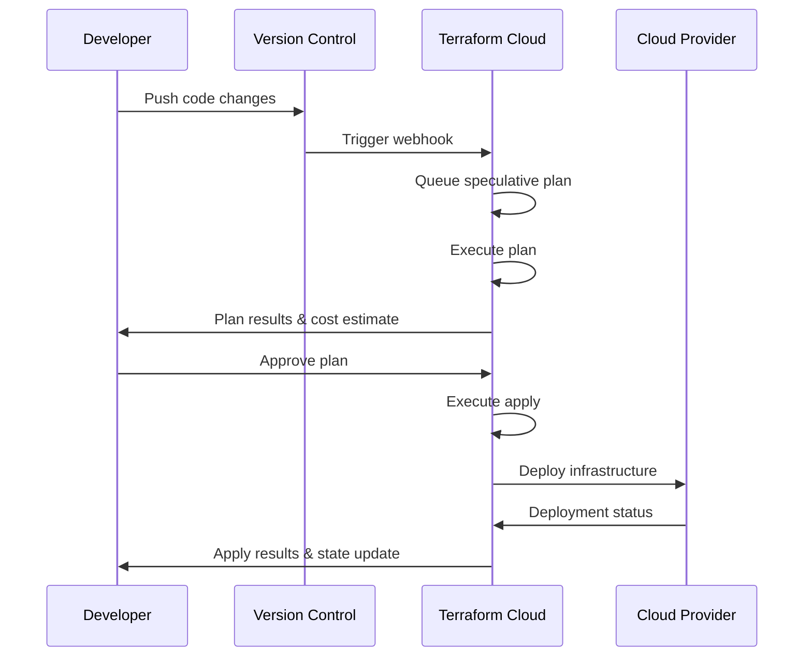
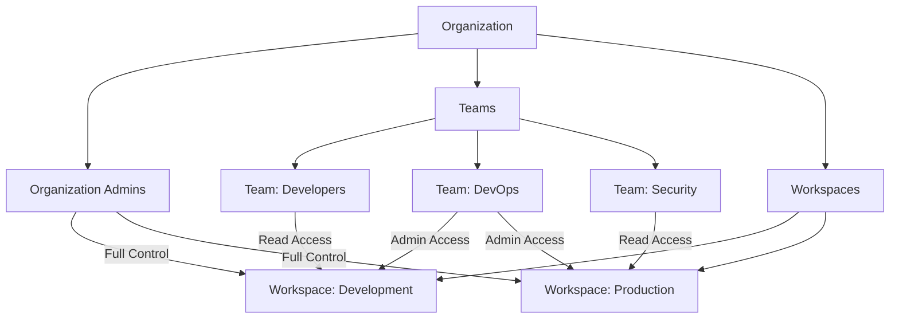
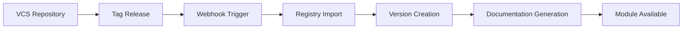
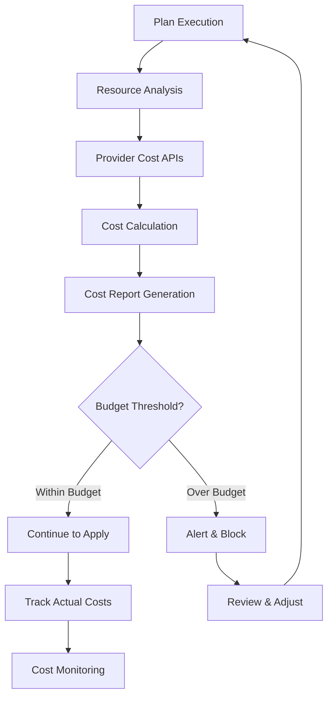
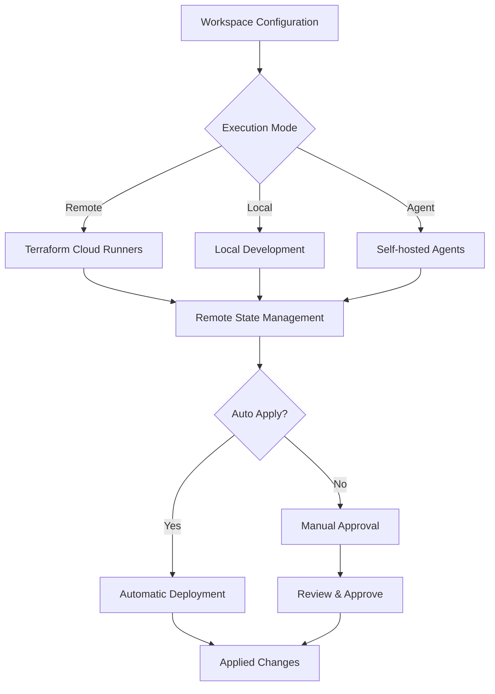
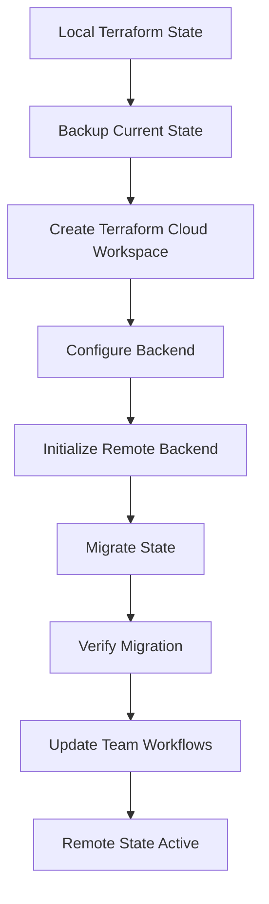
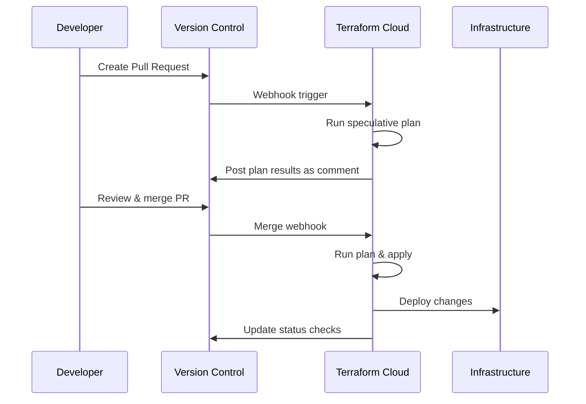
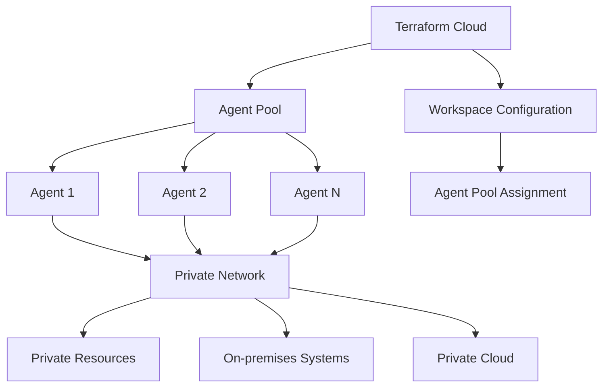

# 🔷 Module 26: Terraform Cloud
*Duration: 3 hours | Labs: 4*

### 🎯 Learning Objectives
By the end of this module, you will be able to:

- ✅ Understand Terraform Cloud architecture and core concepts
- ✅ Master Terraform Cloud terminology (Organizations, Workspaces, Runs)
- ✅ Configure and manage run workflows for different scenarios
- ✅ Implement proper permissions and team management
- ✅ Generate and manage API tokens for automation
- ✅ Utilize the private registry for module sharing
- ✅ Leverage cost estimation for infrastructure planning
- ✅ Configure advanced workflow options and triggers
- ✅ Migrate from local state to Terraform Cloud
- ✅ Set up VCS integration for automated workflows
- ✅ Configure run environments and cloud agents
- ✅ Implement enterprise-grade collaboration patterns

### 📚 Topics Covered

#### 🌟 Terraform Cloud Fundamentals

**Terraform Cloud** is HashiCorp's managed service that provides collaboration, governance, and self-service infrastructure provisioning for teams using Terraform.

> **💡 Key Principle**: "Terraform Cloud transforms infrastructure as code from a local development activity into a collaborative, governed, and automated workflow."

**🔑 Core Benefits:**

```mermaid
graph TD
    A[Terraform Cloud] --> B[🤝 Team Collaboration]
    A --> C[🔒 Secure State Management]
    A --> D[🔄 Automated Workflows]
    A --> E[💰 Cost Estimation]
    A --> F[🛡️ Policy Enforcement]
    A --> G[📊 Audit & Compliance]
    
    B --> B1[Shared Workspaces]
    B --> B2[Role-based Access]
    C --> C1[Remote State Storage]
    C --> C2[State Locking]
    D --> D1[VCS Integration]
    D --> D2[Auto Plan/Apply]
    E --> E1[Pre-deployment Costs]
    E --> E2[Budget Monitoring]
```



**Architecture Overview:**

Terraform Cloud operates as a Software-as-a-Service (SaaS) platform that orchestrates Terraform runs in a secure, managed environment:

- **🏢 Organizations**: Top-level containers for teams and resources
- **👥 Teams**: Groups of users with specific permissions
- **🏗️ Workspaces**: Individual Terraform configurations and their state
- **🔄 Runs**: Execution instances of plan and apply operations
- **📦 Private Registry**: Secure module and provider sharing
- **🔗 VCS Integration**: Automated workflows from version control

**Deployment Options:**
- **SaaS**: Fully managed by HashiCorp
- **Self-hosted**: Terraform Enterprise for on-premises deployment

#### 🏢 Terraform Cloud Terms and Concepts

Understanding Terraform Cloud terminology is essential for effective collaboration and workflow management.

**🔑 Core Concepts:**

| Concept | Description | Purpose | Example |
|---------|-------------|---------|---------|
| **Organization** | Top-level container | Billing, team management | `acme-corp` |
| **Workspace** | Terraform configuration + state | Environment isolation | `prod-web-app` |
| **Run** | Single plan/apply execution | Change management | `run-abc123` |
| **Team** | Group of users | Permission management | `platform-team` |
| **Variable** | Configuration values | Environment customization | `instance_count = 3` |

**Workspace Types:**

```mermaid
graph LR
    A[Workspace Types] --> B[🔗 VCS-driven]
    A --> C[📋 CLI-driven]
    A --> D[🔌 API-driven]
    
    B --> B1[Automatic runs from Git]
    B --> B2[Pull request integration]
    C --> C1[Manual terraform commands]
    C --> C2[Local development]
    D --> D1[Programmatic control]
    D --> D2[CI/CD integration]
```



**Real-World Example - Organization Structure:**
```hcl
# Conceptual organization structure
organization "acme-corp" {
  # Teams
  teams = {
    "platform-team" = {
      members = ["alice@acme.com", "bob@acme.com"]
      permissions = ["manage-workspaces", "manage-modules"]
    }
    "developers" = {
      members = ["dev1@acme.com", "dev2@acme.com"] 
      permissions = ["read-workspaces", "queue-plans"]
    }
  }
  
  # Workspaces by environment
  workspaces = {
    "prod-infrastructure" = {
      terraform_version = "1.6.0"
      working_directory = "infrastructure/"
      vcs_repo = {
        identifier = "acme-corp/infrastructure"
        branch = "main"
      }
      team_access = {
        "platform-team" = "admin"
        "developers" = "read"
      }
    }
    
    "dev-infrastructure" = {
      terraform_version = "1.6.0"
      working_directory = "infrastructure/"
      vcs_repo = {
        identifier = "acme-corp/infrastructure"
        branch = "develop"
      }
      team_access = {
        "platform-team" = "admin"
        "developers" = "write"
      }
    }
  }
}
```

#### 🔄 Run Workflows

Terraform Cloud orchestrates infrastructure changes through **runs** - structured workflows that ensure consistency, collaboration, and compliance.

**🔑 Run Types:**

| Run Type | Trigger | Purpose | Auto-apply |
|----------|---------|---------|------------|
| **Speculative Plan** | Pull Request | Preview changes | ❌ No |
| **Plan** | VCS push/manual | Review changes | ❌ No |
| **Plan & Apply** | VCS push (auto) | Deploy changes | ✅ Yes |
| **Destroy Plan** | Manual | Remove resources | ❌ No |

**Run Workflow Process:**



**Advanced Run Configuration:**
```hcl
# Workspace configuration for run behavior
resource "tfe_workspace" "example" {
  name         = "my-workspace"
  organization = var.organization_name
  
  # Run configuration
  auto_apply            = false  # Require manual approval
  file_triggers_enabled = true   # Run on any file change
  queue_all_runs       = false   # Allow concurrent runs
  
  # Trigger patterns
  trigger_prefixes = [
    "modules/",
    "environments/production/"
  ]
  
  # Working directory
  working_directory = "infrastructure/"
  
  # Terraform version
  terraform_version = "1.6.0"
  
  # Execution mode
  execution_mode = "remote"  # or "local" or "agent"
  
  # VCS configuration
  vcs_repo {
    identifier     = "company/infrastructure-repo"
    branch        = "main"
    ingress_submodules = false
  }
}
```

**Run Environment Variables:**
```hcl
# Terraform variables
resource "tfe_variable" "instance_count" {
  key          = "instance_count"
  value        = "3"
  category     = "terraform"
  workspace_id = tfe_workspace.example.id
  description  = "Number of instances to create"
}

# Environment variables
resource "tfe_variable" "aws_region" {
  key          = "AWS_DEFAULT_REGION"
  value        = "us-west-2"
  category     = "env"
  workspace_id = tfe_workspace.example.id
  description  = "Default AWS region"
}

# Sensitive variables
resource "tfe_variable" "database_password" {
  key          = "database_password"
  value        = var.db_password
  category     = "terraform"
  workspace_id = tfe_workspace.example.id
  sensitive    = true
  description  = "Database password"
}
```

#### 🔐 Permissions and Team Management

Terraform Cloud implements a comprehensive **Role-Based Access Control (RBAC)** system that enables fine-grained permission management across organizations, teams, and workspaces.

**🔑 Permission Levels:**



**Organization-level Permissions:**
- **Owners**: Full administrative access
- **Members**: Basic organization access
- **Billing Managers**: Billing and usage management

**Workspace-level Permissions:**

| Permission Level | Plan | Apply | Variables | Settings | State |
|-----------------|------|-------|-----------|----------|--------|
| **Read** | ✅ View | ❌ No | ✅ View | ❌ No | ✅ View |
| **Plan** | ✅ Queue | ❌ No | ✅ View | ❌ No | ✅ View |
| **Write** | ✅ Queue | ✅ Apply | ✅ Edit | ❌ No | ✅ View |
| **Admin** | ✅ Queue | ✅ Apply | ✅ Edit | ✅ Manage | ✅ Manage |

**Team Management Example:**
```hcl
# Create teams
resource "tfe_team" "platform" {
  name         = "platform-team"
  organization = var.organization_name
  
  visibility = "organization"  # or "secret"
}

resource "tfe_team" "developers" {
  name         = "developers"
  organization = var.organization_name
  
  visibility = "organization"
}

# Add team members
resource "tfe_team_member" "platform_alice" {
  team_id  = tfe_team.platform.id
  username = "alice"
}

resource "tfe_team_member" "platform_bob" {
  team_id  = tfe_team.platform.id
  username = "bob"
}

# Workspace access
resource "tfe_team_access" "platform_prod" {
  access       = "admin"
  team_id      = tfe_team.platform.id
  workspace_id = tfe_workspace.production.id
}

resource "tfe_team_access" "developers_dev" {
  access       = "write"
  team_id      = tfe_team.developers.id
  workspace_id = tfe_workspace.development.id
  
  permissions {
    runs              = "apply"
    variables         = "write"
    state_versions    = "read"
    sentinel_mocks    = "read"
    workspace_locking = false
  }
}

# Custom permissions
resource "tfe_team_access" "developers_staging" {
  access       = "custom"
  team_id      = tfe_team.developers.id
  workspace_id = tfe_workspace.staging.id
  
  permissions {
    runs              = "plan"      # Can plan but not apply
    variables         = "read"      # Read-only variables
    state_versions    = "read"      # View state
    sentinel_mocks    = "none"      # No sentinel access
    workspace_locking = false       # Cannot lock workspace
  }
}
```

#### 🔑 API Tokens

Terraform Cloud provides multiple types of API tokens for different use cases, enabling secure automation and integration with external systems.

**🔑 Token Types:**

| Token Type | Scope | Use Case | Expiration |
|------------|-------|----------|------------|
| **User Token** | Individual user | Personal automation | 30 days default |
| **Team Token** | Team-specific | Shared automation | No expiration |
| **Organization Token** | Organization-wide | Admin operations | No expiration |

**Token Management:**
```bash
# Using Terraform Cloud API with user token
export TFE_TOKEN="your-user-token-here"

# List organizations
curl \
  --header "Authorization: Bearer $TFE_TOKEN" \
  --header "Content-Type: application/vnd.api+json" \
  https://app.terraform.io/api/v2/organizations

# Create workspace via API
curl \
  --header "Authorization: Bearer $TFE_TOKEN" \
  --header "Content-Type: application/vnd.api+json" \
  --request POST \
  --data @workspace.json \
  https://app.terraform.io/api/v2/organizations/my-org/workspaces
```

**CI/CD Integration Example:**
```yaml
# GitHub Actions workflow
name: Terraform Cloud Integration
on:
  push:
    branches: [main]
  pull_request:
    branches: [main]

jobs:
  terraform:
    runs-on: ubuntu-latest
    steps:
    - uses: actions/checkout@v3
    
    - name: Setup Terraform
      uses: hashicorp/setup-terraform@v2
      with:
        cli_config_credentials_token: ${{ secrets.TF_API_TOKEN }}
    
    - name: Terraform Plan
      run: |
        terraform init
        terraform plan
      env:
        TF_WORKSPACE: production
        
    - name: Terraform Apply
      if: github.ref == 'refs/heads/main'
      run: terraform apply -auto-approve
```

**Team Token Configuration:**
```hcl
# Create team token for automation
resource "tfe_team_token" "automation" {
  team_id = tfe_team.platform.id
}

# Use team token in workspace
resource "tfe_variable" "team_token" {
  key          = "TFE_TOKEN"
  value        = tfe_team_token.automation.token
  category     = "env"
  workspace_id = tfe_workspace.example.id
  sensitive    = true
  description  = "Team token for API access"
}
```

#### 📦 Private Registry

The **Terraform Cloud Private Registry** enables secure sharing of modules and providers within your organization, promoting reusability and standardization.

**🔑 Registry Benefits:**
- **🔒 Secure Sharing**: Private modules within organization
- **📋 Version Management**: Semantic versioning and release management
- **📚 Documentation**: Automatic documentation generation
- **🔍 Discovery**: Searchable module catalog
- **✅ Validation**: Module validation and testing

**Module Publishing Workflow:**



**Publishing a Module:**
```hcl
# Module structure
# terraform-aws-vpc/
# ├── main.tf
# ├── variables.tf
# ├── outputs.tf
# ├── README.md
# └── examples/
#     └── basic/
#         ├── main.tf
#         └── README.md

# main.tf - VPC module
terraform {
  required_version = ">= 1.0"
  required_providers {
    aws = {
      source  = "hashicorp/aws"
      version = "~> 5.0"
    }
  }
}

variable "vpc_cidr" {
  description = "CIDR block for VPC"
  type        = string
  validation {
    condition     = can(cidrhost(var.vpc_cidr, 0))
    error_message = "VPC CIDR must be a valid IPv4 CIDR block."
  }
}

variable "availability_zones" {
  description = "List of availability zones"
  type        = list(string)
}

variable "environment" {
  description = "Environment name"
  type        = string
}

variable "tags" {
  description = "Additional tags"
  type        = map(string)
  default     = {}
}

# Create VPC
resource "aws_vpc" "main" {
  cidr_block           = var.vpc_cidr
  enable_dns_hostnames = true
  enable_dns_support   = true

  tags = merge(
    {
      Name        = "${var.environment}-vpc"
      Environment = var.environment
      ManagedBy   = "Terraform"
    },
    var.tags
  )
}

# Create subnets
resource "aws_subnet" "public" {
  count = length(var.availability_zones)

  vpc_id                  = aws_vpc.main.id
  cidr_block              = cidrsubnet(var.vpc_cidr, 8, count.index)
  availability_zone       = var.availability_zones[count.index]
  map_public_ip_on_launch = true

  tags = merge(
    {
      Name = "${var.environment}-public-${count.index + 1}"
      Type = "Public"
    },
    var.tags
  )
}

resource "aws_subnet" "private" {
  count = length(var.availability_zones)

  vpc_id            = aws_vpc.main.id
  cidr_block        = cidrsubnet(var.vpc_cidr, 8, count.index + length(var.availability_zones))
  availability_zone = var.availability_zones[count.index]

  tags = merge(
    {
      Name = "${var.environment}-private-${count.index + 1}"
      Type = "Private"
    },
    var.tags
  )
}

# outputs.tf
output "vpc_id" {
  description = "ID of the VPC"
  value       = aws_vpc.main.id
}

output "vpc_cidr_block" {
  description = "CIDR block of the VPC"
  value       = aws_vpc.main.cidr_block
}

output "public_subnet_ids" {
  description = "List of IDs of public subnets"
  value       = aws_subnet.public[*].id
}

output "private_subnet_ids" {
  description = "List of IDs of private subnets"
  value       = aws_subnet.private[*].id
}
```

**Consuming Private Modules:**
```hcl
# Using the private registry module
module "vpc" {
  source  = "app.terraform.io/acme-corp/vpc/aws"
  version = "~> 1.0"

  vpc_cidr           = "10.0.0.0/16"
  availability_zones = ["us-west-2a", "us-west-2b", "us-west-2c"]
  environment        = "production"
  
  tags = {
    Project     = "web-application"
    CostCenter  = "engineering"
    Owner       = "platform-team"
  }
}

# Reference module outputs
resource "aws_security_group" "web" {
  name_prefix = "web-"
  vpc_id      = module.vpc.vpc_id

  ingress {
    from_port   = 80
    to_port     = 80
    protocol    = "tcp"
    cidr_blocks = [module.vpc.vpc_cidr_block]
  }

  tags = {
    Name = "web-security-group"
  }
}
```

**Registry Configuration:**
```hcl
# Configure private registry in workspace
resource "tfe_workspace" "example" {
  name         = "my-workspace"
  organization = var.organization_name
  
  # Allow private registry modules
  global_remote_state = false
  
  # Specify allowed module sources
  # This is managed through organization settings
}

# Registry webhook for auto-publishing
resource "tfe_registry_module" "vpc" {
  vcs_repo {
    identifier     = "acme-corp/terraform-aws-vpc"
    oauth_token_id = var.oauth_token_id
  }
}
```

#### 💰 Cost Estimation

Terraform Cloud provides **integrated cost estimation** that helps teams understand the financial impact of infrastructure changes before deployment.

**🔑 Cost Estimation Features:**
- **Pre-deployment Analysis**: Cost estimates before apply
- **Resource Breakdown**: Detailed cost per resource
- **Monthly/Annual Projections**: Long-term cost planning
- **Delta Analysis**: Cost changes from previous state
- **Budget Alerts**: Notifications for cost thresholds

**Cost Estimation Workflow:**



**Enabling Cost Estimation:**
```hcl
# Workspace configuration with cost estimation
resource "tfe_workspace" "example" {
  name         = "cost-aware-workspace"
  organization = var.organization_name
  
  # Enable cost estimation
  assessments_enabled = true
  
  # Configure cost estimation settings
  # This is typically done through the UI or API
}

# Cost estimation via API
resource "tfe_workspace_settings" "example" {
  workspace_id = tfe_workspace.example.id
  
  # Enable cost estimation assessments
  assessments_enabled = true
}
```

**Cost Monitoring Configuration:**
```hcl
# Budget notification configuration
resource "tfe_notification_configuration" "cost_alerts" {
  name             = "cost-monitoring"
  enabled          = true
  destination_type = "slack"
  workspace_id     = tfe_workspace.example.id
  
  # Trigger on cost estimation
  triggers = [
    "assessment:check_failure",
    "assessment:drifted", 
    "assessment:failed"
  ]
  
  url = var.slack_webhook_url
}

# Email notifications for budget thresholds
resource "tfe_notification_configuration" "budget_email" {
  name             = "budget-alerts"
  enabled          = true
  destination_type = "email"
  workspace_id     = tfe_workspace.example.id
  
  triggers = [
    "assessment:check_failure"
  ]
  
  email_addresses = [
    "finance@company.com",
    "platform-team@company.com"
  ]
}
```

**Cost-Aware Infrastructure Planning:**
```hcl
# Example: Cost-optimized infrastructure
variable "environment" {
  description = "Environment name"
  type        = string
}

variable "cost_budget_monthly" {
  description = "Monthly cost budget in USD"
  type        = number
  default     = 1000
}

locals {
  # Environment-based sizing to control costs
  instance_config = {
    development = {
      instance_type = "t3.micro"
      min_size     = 1
      max_size     = 2
    }
    staging = {
      instance_type = "t3.small"
      min_size     = 2
      max_size     = 4
    }
    production = {
      instance_type = "t3.medium"
      min_size     = 3
      max_size     = 10
    }
  }
  
  # Cost-conscious resource selection
  selected_config = local.instance_config[var.environment]
  
  # Estimated monthly costs (simplified)
  instance_costs = {
    "t3.micro"  = 8.76   # $0.0104/hour * 24 * 30
    "t3.small"  = 17.52  # $0.0208/hour * 24 * 30  
    "t3.medium" = 35.04  # $0.0416/hour * 24 * 30
  }
  
  estimated_monthly_cost = local.instance_costs[local.selected_config.instance_type] * local.selected_config.min_size
  
  # Budget validation
  within_budget = local.estimated_monthly_cost <= var.cost_budget_monthly
}

# Cost-aware resource creation
resource "aws_autoscaling_group" "web" {
  name                = "${var.environment}-web-asg"
  min_size            = local.selected_config.min_size
  max_size            = local.selected_config.max_size
  desired_capacity    = local.selected_config.min_size
  vpc_zone_identifier = var.subnet_ids
  
  launch_template {
    id      = aws_launch_template.web.id
    version = "$Latest"
  }
  
  # Cost tracking tags
  tag {
    key                 = "Environment"
    value               = var.environment
    propagate_at_launch = true
  }
  
  tag {
    key                 = "CostCenter"
    value               = "engineering"
    propagate_at_launch = true
  }
  
  tag {
    key                 = "EstimatedMonthlyCost"
    value               = tostring(local.estimated_monthly_cost)
    propagate_at_launch = false
  }
  
  tag {
    key                 = "BudgetCompliant"
    value               = tostring(local.within_budget)
    propagate_at_launch = false
  }
  
  # Lifecycle management for cost optimization
  lifecycle {
    create_before_destroy = true
    
    # Prevent creation if over budget
    precondition {
      condition     = local.within_budget
      error_message = "Estimated cost $${local.estimated_monthly_cost} exceeds budget $${var.cost_budget_monthly}"
    }
  }
}

resource "aws_launch_template" "web" {
  name_prefix   = "${var.environment}-web-"
  image_id      = var.ami_id
  instance_type = local.selected_config.instance_type
  
  # Cost optimization settings
  instance_initiated_shutdown_behavior = "terminate"
  
  # Spot instances for non-production to reduce costs
  instance_market_options {
    market_type = var.environment != "production" ? "spot" : null
    
    dynamic "spot_options" {
      for_each = var.environment != "production" ? [1] : []
      content {
        spot_instance_type             = "one-time"
        instance_interruption_behavior = "terminate"
      }
    }
  }
  
  tag_specifications {
    resource_type = "instance"
    tags = {
      Name               = "${var.environment}-web-instance"
      Environment        = var.environment
      CostOptimized     = var.environment != "production" ? "spot-instance" : "on-demand"
      EstimatedHourlyCost = tostring(local.instance_costs[local.selected_config.instance_type] / 24 / 30)
    }
  }
}

# Output cost information
output "cost_summary" {
  value = {
    environment           = var.environment
    instance_type        = local.selected_config.instance_type
    min_instances        = local.selected_config.min_size
    max_instances        = local.selected_config.max_size
    estimated_monthly_cost = local.estimated_monthly_cost
    budget_monthly       = var.cost_budget_monthly
    within_budget        = local.within_budget
    cost_per_instance    = local.instance_costs[local.selected_config.instance_type]
    spot_instances       = var.environment != "production"
  }
}
```

#### ⚙️ Workflow Options

Terraform Cloud provides flexible **workflow options** that allow teams to customize how infrastructure changes are planned, reviewed, and deployed.

**🔑 Execution Modes:**

| Mode | Description | Use Case | State Location |
|------|-------------|----------|----------------|
| **Remote** | Runs in Terraform Cloud | Team collaboration | Terraform Cloud |
| **Local** | Runs locally, state remote | Development/debugging | Terraform Cloud |
| **Agent** | Runs on self-hosted agents | Private networks | Terraform Cloud |

**Workflow Configuration:**



**Advanced Workflow Configuration:**
```hcl
resource "tfe_workspace" "advanced_workflow" {
  name         = "advanced-workflow-example"
  organization = var.organization_name
  
  # Execution configuration
  execution_mode = "remote"  # "remote", "local", or "agent"
  
  # Agent pool for agent execution mode
  agent_pool_id = var.agent_pool_id  # Only for agent mode
  
  # Auto-apply configuration
  auto_apply = false  # Require manual approval
  
  # File triggers
  file_triggers_enabled = true
  trigger_prefixes = [
    "modules/",
    "environments/production/",
    "global/"
  ]
  
  # Working directory
  working_directory = "infrastructure/"
  
  # Terraform version
  terraform_version = "1.6.0"
  
  # Speculative plans
  speculative_enabled = true
  
  # Queue settings
  queue_all_runs = false  # Allow concurrent runs
  
  # Operations
  operations = true  # Enable remote operations
  
  # Global remote state
  global_remote_state = false  # Restrict state access
  
  # Structured run output
  structured_run_output_enabled = true
}
```

**Conditional Workflows:**
```hcl
# Environment-specific workflow configuration
locals {
  workflow_config = {
    development = {
      auto_apply              = true   # Fast iteration
      speculative_enabled     = true
      queue_all_runs         = false
      file_triggers_enabled  = true
      execution_mode         = "remote"
    }
    
    staging = {
      auto_apply              = false  # Manual review
      speculative_enabled     = true
      queue_all_runs         = true   # Serialize runs
      file_triggers_enabled  = true
      execution_mode         = "remote"
    }
    
    production = {
      auto_apply              = false  # Always manual
      speculative_enabled     = true
      queue_all_runs         = true   # Serialize runs
      file_triggers_enabled  = false  # Manual triggers only
      execution_mode         = "agent" # Secure environment
    }
  }
}

resource "tfe_workspace" "environment_workspace" {
  for_each = local.workflow_config
  
  name         = "${each.key}-infrastructure"
  organization = var.organization_name
  
  # Apply environment-specific configuration
  auto_apply              = each.value.auto_apply
  speculative_enabled     = each.value.speculative_enabled
  queue_all_runs         = each.value.queue_all_runs
  file_triggers_enabled  = each.value.file_triggers_enabled
  execution_mode         = each.value.execution_mode
  
  # Production-specific settings
  agent_pool_id = each.key == "production" ? var.production_agent_pool_id : null
  
  # Environment-specific VCS configuration
  vcs_repo {
    identifier     = "company/infrastructure-repo"
    branch        = each.key == "production" ? "main" : each.key
    ingress_submodules = false
  }
  
  # Environment-specific triggers
  trigger_prefixes = each.key == "production" ? [
    "environments/production/"
  ] : [
    "environments/${each.key}/",
    "modules/",
    "global/"
  ]
}
```

**Run Triggers and Dependencies:**
```hcl
# Workspace dependencies
resource "tfe_run_trigger" "network_to_app" {
  workspace_id    = tfe_workspace.app.id
  sourceable_id   = tfe_workspace.network.id
  sourceable_type = "workspace"
}

# Cross-workspace collaboration
resource "tfe_workspace" "network" {
  name         = "network-infrastructure"
  organization = var.organization_name
  
  # Network workspace configuration
  auto_apply = false
  
  # Global remote state sharing
  global_remote_state = true
}

resource "tfe_workspace" "app" {
  name         = "application-infrastructure"
  organization = var.organization_name
  
  # Application workspace depends on network
  auto_apply = false
  
  # Can access network workspace state
  global_remote_state = false
}

# Remote state access configuration
resource "tfe_workspace_remote_state_consumers" "network_consumers" {
  workspace_id = tfe_workspace.network.id
  
  consumer_ids = [
    tfe_workspace.app.id
  ]
}
```

#### 🔄 Migrating Default Local State

Migrating from **local state management** to **Terraform Cloud** is a critical step for teams adopting collaborative infrastructure workflows.

**🔑 Migration Benefits:**
- **🤝 Team Collaboration**: Shared state access
- **🔒 State Security**: Encrypted, versioned storage
- **🔄 State Locking**: Prevent concurrent modifications
- **📊 Audit Trail**: Complete change history
- **🚀 Automation**: Integrated CI/CD workflows

**Migration Process:**



**Step-by-Step Migration:**

**Step 1: Backup Current State**
```bash
# Backup existing state
cp terraform.tfstate terraform.tfstate.backup.$(date +%Y%m%d-%H%M%S)

# Verify current state
terraform show
terraform state list
```

**Step 2: Create Terraform Cloud Workspace**
```hcl
# terraform-cloud-setup.tf
terraform {
  required_providers {
    tfe = {
      source  = "hashicorp/tfe"
      version = "~> 0.51"
    }
  }
}

provider "tfe" {
  token = var.tfe_token
}

# Create organization (if needed)
resource "tfe_organization" "main" {
  name  = "my-organization"
  email = "admin@company.com"
}

# Create workspace for migration
resource "tfe_workspace" "migrated" {
  name         = "migrated-infrastructure"
  organization = tfe_organization.main.name
  
  # Configure for migration
  execution_mode = "remote"
  auto_apply    = false
  
  # VCS integration (optional)
  vcs_repo {
    identifier     = "company/infrastructure-repo"
    branch        = "main"
    oauth_token_id = var.oauth_token_id
  }
}

# Migrate variables
resource "tfe_variable" "region" {
  key          = "aws_region"
  value        = "us-west-2"
  category     = "terraform"
  workspace_id = tfe_workspace.migrated.id
  description  = "AWS region for resources"
}

resource "tfe_variable" "environment" {
  key          = "environment"
  value        = "production"
  category     = "terraform"
  workspace_id = tfe_workspace.migrated.id
  description  = "Environment name"
}

# Sensitive variables
resource "tfe_variable" "aws_access_key" {
  key          = "AWS_ACCESS_KEY_ID"
  value        = var.aws_access_key_id
  category     = "env"
  workspace_id = tfe_workspace.migrated.id
  sensitive    = true
  description  = "AWS access key"
}

resource "tfe_variable" "aws_secret_key" {
  key          = "AWS_SECRET_ACCESS_KEY"
  value        = var.aws_secret_access_key
  category     = "env"
  workspace_id = tfe_workspace.migrated.id
  sensitive    = true
  description  = "AWS secret key"
}
```

**Step 3: Update Backend Configuration**
```hcl
# Update main.tf with new backend
terraform {
  required_version = ">= 1.0"
  
  # Add Terraform Cloud backend
  cloud {
    organization = "my-organization"
    workspaces {
      name = "migrated-infrastructure"
    }
  }
  
  required_providers {
    aws = {
      source  = "hashicorp/aws"
      version = "~> 5.0"
    }
  }
}

# Remove local backend if present
# Comment out or remove:
# terraform {
#   backend "local" {}
# }
```

**Step 4: Migration Commands**
```bash
# Set Terraform Cloud token
export TF_TOKEN_app_terraform_io="your-terraform-cloud-token"

# Initialize with new backend
terraform init -migrate-state

# Terraform will prompt:
# Do you want to copy existing state to the new backend?
# Enter: yes

# Verify migration
terraform plan

# Check state location
terraform state list
```

**Step 5: Post-Migration Validation**
```bash
#!/bin/bash
# validate-migration.sh

echo "🔍 Validating Terraform Cloud Migration..."

# Check workspace exists and is accessible
terraform workspace show

# Verify state is remote
if terraform state list > /dev/null 2>&1; then
    echo "✅ Remote state accessible"
else
    echo "❌ Remote state not accessible"
    exit 1
fi

# Compare resource count
LOCAL_COUNT=$(terraform state list -state=terraform.tfstate.backup.* | wc -l)
REMOTE_COUNT=$(terraform state list | wc -l)

if [ "$LOCAL_COUNT" -eq "$REMOTE_COUNT" ]; then
    echo "✅ Resource count matches: $REMOTE_COUNT resources"
else
    echo "❌ Resource count mismatch: Local=$LOCAL_COUNT, Remote=$REMOTE_COUNT"
    exit 1
fi

# Test plan (should show no changes)
if terraform plan -detailed-exitcode; then
    echo "✅ No configuration drift detected"
else
    echo "⚠️  Configuration drift detected - review plan output"
fi

echo "🎉 Migration validation complete!"
```

#### 🔗 VCS Integration

**Version Control System (VCS) Integration** is one of Terraform Cloud's most powerful features, enabling automated workflows triggered by code changes.

**🔑 Supported VCS Providers:**
- **GitHub**: github.com and GitHub Enterprise
- **GitLab**: gitlab.com and self-hosted GitLab
- **Bitbucket**: bitbucket.org and Bitbucket Server
- **Azure DevOps**: Azure Repos

**VCS Workflow Benefits:**



**VCS Integration Setup:**
```hcl
# OAuth token configuration
resource "tfe_oauth_client" "github" {
  organization     = var.organization_name
  api_url         = "https://api.github.com"
  http_url        = "https://github.com"
  oauth_token     = var.github_oauth_token
  service_provider = "github"
}

# Workspace with VCS integration
resource "tfe_workspace" "vcs_integrated" {
  name         = "vcs-integrated-workspace"
  organization = var.organization_name
  
  # VCS configuration
  vcs_repo {
    identifier         = "company/infrastructure-repo"
    branch            = "main"
    oauth_token_id    = tfe_oauth_client.github.oauth_token_id
    ingress_submodules = false
  }
  
  # Trigger configuration
  file_triggers_enabled = true
  trigger_prefixes = [
    "infrastructure/",
    "modules/",
    "environments/"
  ]
  
  # Working directory
  working_directory = "infrastructure/"
  
  # Auto-apply for specific branches
  auto_apply = false
  
  # Speculative plans on PRs
  speculative_enabled = true
}
```

**Branch-based Workflows:**
```hcl
# Multi-environment VCS setup
locals {
  environments = {
    development = {
      branch = "develop"
      auto_apply = true
      working_directory = "environments/dev/"
    }
    
    staging = {
      branch = "staging"
      auto_apply = false
      working_directory = "environments/staging/"
    }
    
    production = {
      branch = "main"
      auto_apply = false
      working_directory = "environments/prod/"
    }
  }
}

resource "tfe_workspace" "environment_workspaces" {
  for_each = local.environments
  
  name         = "${each.key}-environment"
  organization = var.organization_name
  
  # Environment-specific VCS configuration
  vcs_repo {
    identifier         = "company/infrastructure-monorepo"
    branch            = each.value.branch
    oauth_token_id    = tfe_oauth_client.github.oauth_token_id
    ingress_submodules = false
  }
  
  # Environment-specific settings
  working_directory = each.value.working_directory
  auto_apply       = each.value.auto_apply
  
  # Trigger only on relevant paths
  trigger_prefixes = [
    each.value.working_directory,
    "modules/",
    "global/"
  ]
  
  # Production-specific restrictions
  file_triggers_enabled = each.key != "production"
  queue_all_runs       = each.key == "production"
}
```

**Advanced VCS Configuration:**
```hcl
# Monorepo with multiple workspaces
resource "tfe_workspace" "microservice_workspaces" {
  for_each = var.microservices
  
  name         = "microservice-${each.key}"
  organization = var.organization_name
  
  vcs_repo {
    identifier         = "company/microservices-monorepo"
    branch            = "main"
    oauth_token_id    = tfe_oauth_client.github.oauth_token_id
    ingress_submodules = true  # Include submodules
  }
  
  # Service-specific working directory
  working_directory = "services/${each.key}/infrastructure/"
  
  # Trigger only on service-specific changes
  trigger_prefixes = [
    "services/${each.key}/",
    "shared/modules/",
    "shared/policies/"
  ]
  
  # Service-specific variables
  dynamic "environment_variables" {
    for_each = each.value.env_vars
    content {
      key   = environment_variables.key
      value = environment_variables.value
    }
  }
}

# GitHub webhook configuration
resource "tfe_notification_configuration" "github_status" {
  for_each = tfe_workspace.microservice_workspaces
  
  name             = "github-status-${each.key}"
  enabled          = true
  destination_type = "generic"
  workspace_id     = each.value.id
  
  # Update GitHub status checks
  url = "https://api.github.com/repos/company/microservices-monorepo/statuses/$${run.commit_sha}"
  
  triggers = [
    "run:planning",
    "run:needs_attention",
    "run:applying",
    "run:completed",
    "run:errored"
  ]
}
```

#### 🖥️ Run Environment

The **run environment** in Terraform Cloud controls the execution context for your Terraform operations, including CLI versions, environment variables, and execution settings.

**🔑 Run Environment Components:**
- **Terraform CLI Version**: Specific Terraform version
- **Provider Versions**: Terraform provider constraints
- **Environment Variables**: Runtime configuration
- **Execution Timeout**: Maximum run duration
- **Custom Images**: Specialized execution environments

**Environment Configuration:**
```hcl
resource "tfe_workspace" "run_environment_example" {
  name         = "run-environment-demo"
  organization = var.organization_name
  
  # Terraform version pinning
  terraform_version = "1.6.0"
  
  # Execution settings
  execution_mode = "remote"
  
  # Timeout configuration (in minutes)
  # Default is 10 minutes, max depends on plan
}

# Environment variables
resource "tfe_variable" "terraform_vars" {
  for_each = {
    aws_region      = "us-west-2"
    environment     = "production"
    instance_count  = "3"
    enable_logging  = "true"
  }
  
  key          = each.key
  value        = each.value
  category     = "terraform"
  workspace_id = tfe_workspace.run_environment_example.id
  description  = "Terraform variable: ${each.key}"
}

# Environment variables for providers
resource "tfe_variable" "env_vars" {
  for_each = {
    AWS_DEFAULT_REGION    = "us-west-2"
    TF_LOG               = "INFO"
    TF_LOG_PATH          = "/tmp/terraform.log"
    CHECKPOINT_DISABLE   = "true"
  }
  
  key          = each.key
  value        = each.value
  category     = "env"
  workspace_id = tfe_workspace.run_environment_example.id
  sensitive    = contains(["AWS_ACCESS_KEY_ID", "AWS_SECRET_ACCESS_KEY"], each.key)
  description  = "Environment variable: ${each.key}"
}
```

**Version Management:**
```hcl
# Terraform version constraints in workspace
resource "tfe_workspace" "version_controlled" {
  name         = "version-controlled-workspace"
  organization = var.organization_name
  
  # Pin to specific version for stability
  terraform_version = "1.6.0"
  
  # Alternative: Use latest in version series
  # terraform_version = "~> 1.6"
}

# Provider version constraints in Terraform code
terraform {
  required_version = ">= 1.6.0"
  
  required_providers {
    aws = {
      source  = "hashicorp/aws"
      version = "~> 5.0"
    }
    
    random = {
      source  = "hashicorp/random" 
      version = "~> 3.1"
    }
    
    local = {
      source  = "hashicorp/local"
      version = "~> 2.1"
    }
  }
}

# Version-aware resource configuration
locals {
  # Feature flags based on Terraform version
  use_new_features = can(regex("^1\\.[6-9]\\.", var.terraform_version))
  
  # Provider-specific feature detection
  aws_provider_version = "5.0"  # Would be detected dynamically
  supports_ipv6 = tonumber(split(".", local.aws_provider_version)[0]) >= 5
}

# Conditional resource creation based on versions
resource "aws_vpc" "main" {
  cidr_block                       = "10.0.0.0/16"
  enable_dns_hostnames            = true
  enable_dns_support              = true
  assign_generated_ipv6_cidr_block = local.supports_ipv6
  
  tags = {
    Name = "main-vpc"
    TerraformVersion = var.terraform_version
    ProviderVersion  = local.aws_provider_version
  }
}
```

#### 🤖 Cloud Agents

**Terraform Cloud Agents** enable you to run Terraform operations in your own infrastructure while maintaining the benefits of Terraform Cloud's workflow and state management.

**🔑 Agent Use Cases:**
- **Private Networks**: Access resources not reachable from internet
- **Compliance Requirements**: Data sovereignty and security policies
- **Custom Tools**: Specialized software or configurations
- **Network Performance**: Reduced latency for large state files
- **Cost Optimization**: Use existing compute resources

**Agent Architecture:**



**Agent Pool Configuration:**
```hcl
# Create agent pool
resource "tfe_agent_pool" "main" {
  name         = "production-agents"
  organization = var.organization_name
}

# Generate agent token
resource "tfe_agent_token" "main" {
  agent_pool_id = tfe_agent_pool.main.id
  description   = "Token for production agents"
}

# Workspace using agent pool
resource "tfe_workspace" "agent_workspace" {
  name         = "private-infrastructure"
  organization = var.organization_name
  
  # Use agent execution mode
  execution_mode = "agent"
  agent_pool_id  = tfe_agent_pool.main.id
  
  # Other workspace configuration
  auto_apply = false
  
  vcs_repo {
    identifier     = "company/private-infrastructure"
    branch        = "main"
    oauth_token_id = var.oauth_token_id
  }
}
```

**Agent Deployment:**
```yaml
# docker-compose.yml for agent deployment
version: '3.8'
services:
  terraform-agent:
    image: hashicorp/tfc-agent:latest
    environment:
      - TFC_AGENT_TOKEN=${TFC_AGENT_TOKEN}
      - TFC_AGENT_NAME=production-agent-01
      - TFC_ADDRESS=https://app.terraform.io
      - TFC_AGENT_LOG_LEVEL=INFO
    volumes:
      - /var/run/docker.sock:/var/run/docker.sock
      - ./agent-data:/home/tfc-agent
    restart: unless-stopped
    
  # Multiple agents for redundancy
  terraform-agent-02:
    image: hashicorp/tfc-agent:latest
    environment:
      - TFC_AGENT_TOKEN=${TFC_AGENT_TOKEN}
      - TFC_AGENT_NAME=production-agent-02
      - TFC_ADDRESS=https://app.terraform.io
      - TFC_AGENT_LOG_LEVEL=INFO
    volumes:
      - /var/run/docker.sock:/var/run/docker.sock
      - ./agent-data-02:/home/tfc-agent
    restart: unless-stopped
```

**Kubernetes Agent Deployment:**
```yaml
# kubernetes-agent-deployment.yaml
apiVersion: apps/v1
kind: Deployment
metadata:
  name: terraform-cloud-agent
  namespace: terraform-system
spec:
  replicas: 3
  selector:
    matchLabels:
      app: terraform-cloud-agent
  template:
    metadata:
      labels:
        app: terraform-cloud-agent
    spec:
      containers:
      - name: tfc-agent
        image: hashicorp/tfc-agent:latest
        env:
        - name: TFC_AGENT_TOKEN
          valueFrom:
            secretKeyRef:
              name: tfc-agent-token
              key: token
        - name: TFC_AGENT_NAME
          valueFrom:
            fieldRef:
              fieldPath: metadata.name
        - name: TFC_ADDRESS
          value: "https://app.terraform.io"
        - name: TFC_AGENT_LOG_LEVEL
          value: "INFO"
        resources:
          requests:
            memory: "256Mi"
            cpu: "100m"
          limits:
            memory: "1Gi"
            cpu: "500m"
        volumeMounts:
        - name: docker-sock
          mountPath: /var/run/docker.sock
      volumes:
      - name: docker-sock
        hostPath:
          path: /var/run/docker.sock
---
apiVersion: v1
kind: Secret
metadata:
  name: tfc-agent-token
  namespace: terraform-system
type: Opaque
data:
  token: <base64-encoded-agent-token>
```

**Agent Monitoring and Management:**
```hcl
# Agent pool with monitoring
resource "tfe_agent_pool" "monitored" {
  name         = "monitored-agents"
  organization = var.organization_name
}

# Multiple agent tokens for different environments
resource "tfe_agent_token" "environment_tokens" {
  for_each = toset(["production", "staging", "development"])
  
  agent_pool_id = tfe_agent_pool.monitored.id
  description   = "Agent token for ${each.key} environment"
}

# Notification configuration for agent issues
resource "tfe_notification_configuration" "agent_alerts" {
  name             = "agent-monitoring"
  enabled          = true
  destination_type = "slack"
  workspace_id     = tfe_workspace.agent_workspace.id
  
  triggers = [
    "run:errored",
    "run:needs_attention"
  ]
  
  url = var.slack_webhook_url
}

# Output agent information
output "agent_pool_info" {
  value = {
    pool_id = tfe_agent_pool.monitored.id
    pool_name = tfe_agent_pool.monitored.name
    
    tokens = {
      for env, token in tfe_agent_token.environment_tokens : env => {
        id = token.id
        description = token.description
      }
    }
    
    deployment_command = "docker run -e TFC_AGENT_TOKEN=${tfe_agent_token.environment_tokens["production"].token} hashicorp/tfc-agent:latest"
  }
  
  sensitive = true
}
```

### 💻 **Exercise 24.1**: Terraform Cloud Setup and Basic Workflow
**Duration**: 45 minutes

Set up your first Terraform Cloud organization, workspace, and basic workflow.

**Step 1: Create Terraform Cloud Account**
```bash
# Navigate to https://app.terraform.io
# Sign up for a free account
# Create your organization
```

**Step 2: Create Initial Workspace**
```hcl
# main.tf - Simple infrastructure example
terraform {
  required_version = ">= 1.0"
  
  cloud {
    organization = "your-organization-name"
    workspaces {
      name = "terraform-cloud-lab"
    }
  }
  
  required_providers {
    random = {
      source  = "hashicorp/random"
      version = "~> 3.1"
    }
    
    local = {
      source  = "hashicorp/local"
      version = "~> 2.1"
    }
  }
}

# Generate random values
resource "random_pet" "server_name" {
  length = 3
}

resource "random_integer" "server_count" {
  min = 1
  max = 5
}

resource "random_password" "admin_password" {
  length  = 16
  special = true
}

# Create local files
resource "local_file" "server_config" {
  filename = "server-${random_pet.server_name.id}.conf"
  content  = <<-EOT
    # Server Configuration
    # Generated: ${timestamp()}
    
    server_name = "${random_pet.server_name.id}"
    server_count = ${random_integer.server_count.result}
    admin_user = "admin"
    created_at = "${timestamp()}"
    
    # Environment settings
    environment = "lab"
    terraform_cloud_workspace = "terraform-cloud-lab"
    
    # Resource identifiers
    pet_name = "${random_pet.server_name.id}"
    server_count = ${random_integer.server_count.result}
  EOT
}

# Output values
output "server_info" {
  value = {
    name = random_pet.server_name.id
    count = random_integer.server_count.result
    config_file = local_file.server_config.filename
  }
}

output "admin_password" {
  value     = random_password.admin_password.result
  sensitive = true
}
```

**Step 3: Configure Terraform Cloud**
```bash
# Install Terraform CLI (if not already installed)
# Configure authentication
terraform login

# Initialize with Terraform Cloud backend
terraform init

# Create workspace variables in Terraform Cloud UI:
# - Go to your workspace
# - Variables tab
# - Add environment variable: TF_LOG = INFO
# - Add terraform variable: environment = "development"

# Plan and apply
terraform plan
terraform apply
```

**Step 4: Explore Terraform Cloud UI**
```bash
# In Terraform Cloud UI, explore:
# 1. Workspace overview
# 2. Runs tab (see your apply run)
# 3. States tab (view current state)
# 4. Variables tab (see configured variables)
# 5. Settings tab (workspace configuration)

# Make a change to trigger another run
terraform apply -var="environment=production"
```

**Expected Results:**
- Successfully created Terraform Cloud workspace
- Executed remote runs
- Explored state management in UI
- Understood basic workflow

### 💻 **Exercise 24.2**: VCS Integration and Collaborative Workflows
**Duration**: 60 minutes

Set up VCS integration with GitHub and implement collaborative workflows.

**Step 1: Create GitHub Repository**
```bash
# Create new repository on GitHub
mkdir terraform-cloud-vcs-lab
cd terraform-cloud-vcs-lab
git init

# Create directory structure
mkdir -p {environments/{dev,staging,prod},modules/networking}
```

**Step 2: Create Infrastructure Code**
```hcl
# environments/dev/main.tf
terraform {
  required_version = ">= 1.0"
  
  cloud {
    organization = "your-organization-name"
    workspaces {
      name = "development-infrastructure"
    }
  }
  
  required_providers {
    random = {
      source  = "hashicorp/random"
      version = "~> 3.1"
    }
    local = {
      source  = "hashicorp/local"
      version = "~> 2.1"
    }
  }
}

# Use networking module
module "networking" {
  source = "../../modules/networking"
  
  environment = "development"
  vpc_cidr    = "10.0.0.0/16"
  
  tags = {
    Environment = "development"
    Project     = "terraform-cloud-lab"
    ManagedBy   = "terraform-cloud"
  }
}

# Development-specific resources
resource "random_pet" "dev_identifier" {
  length = 2
  prefix = "dev"
}

resource "local_file" "dev_config" {
  filename = "dev-config-${random_pet.dev_identifier.id}.json"
  content = jsonencode({
    environment = "development"
    identifier  = random_pet.dev_identifier.id
    networking  = module.networking.network_info
    timestamp   = timestamp()
  })
}

output "development_info" {
  value = {
    environment = "development"
    identifier  = random_pet.dev_identifier.id
    networking  = module.networking.network_info
  }
}
```

```hcl
# modules/networking/main.tf
variable "environment" {
  description = "Environment name"
  type        = string
}

variable "vpc_cidr" {
  description = "VPC CIDR block"
  type        = string
  default     = "10.0.0.0/16"
}

variable "tags" {
  description = "Resource tags"
  type        = map(string)
  default     = {}
}

# Simulate network configuration
locals {
  availability_zones = 3
  
  public_subnets = {
    for i in range(local.availability_zones) : "public-${i + 1}" => {
      cidr_block = cidrsubnet(var.vpc_cidr, 8, i)
      az_index   = i
    }
  }
  
  private_subnets = {
    for i in range(local.availability_zones) : "private-${i + 1}" => {
      cidr_block = cidrsubnet(var.vpc_cidr, 8, i + local.availability_zones)
      az_index   = i
    }
  }
}

resource "random_id" "vpc_id" {
  byte_length = 4
  prefix      = "${var.environment}-vpc-"
}

resource "local_file" "network_plan" {
  filename = "${var.environment}-network-plan.yaml"
  content = yamlencode({
    vpc = {
      id         = random_id.vpc_id.hex
      cidr_block = var.vpc_cidr
      environment = var.environment
    }
    
    public_subnets  = local.public_subnets
    private_subnets = local.private_subnets
    
    metadata = merge(var.tags, {
      CreatedAt = timestamp()
      VpcId     = random_id.vpc_id.hex
    })
  })
}

output "network_info" {
  value = {
    vpc_id          = random_id.vpc_id.hex
    vpc_cidr        = var.vpc_cidr
    public_subnets  = local.public_subnets
    private_subnets = local.private_subnets
    plan_file       = local_file.network_plan.filename
  }
}
```

**Expected Results:**
- VCS integration with automated workflows
- Multiple environment workspaces
- Pull request-driven speculative plans
- Understanding of collaborative workflows

### 💻 **Exercise 24.3**: State Migration and Private Registry
**Duration**: 45 minutes

Migrate existing local state to Terraform Cloud and set up team permissions.

**Step 1: Create Local Infrastructure**
```bash
# Create local project
mkdir terraform-migration-lab
cd terraform-migration-lab
```

```hcl
# main.tf - Local state initially
terraform {
  required_version = ">= 1.0"
  
  required_providers {
    random = {
      source  = "hashicorp/random"
      version = "~> 3.1"
    }
    
    local = {
      source  = "hashicorp/local"
      version = "~> 2.1"
    }
  }
}

# Create some resources with local state
resource "random_pet" "application_name" {
  length = 3
}

resource "random_integer" "port" {
  min = 8000
  max = 9000
}

resource "random_password" "api_key" {
  length  = 32
  special = true
}

locals {
  application_config = {
    name    = random_pet.application_name.id
    port    = random_integer.port.result
    api_key = random_password.api_key.result
    
    database = {
      host     = "localhost"
      port     = 5432
      name     = "${random_pet.application_name.id}_db"
      username = "app_user"
    }
    
    features = [
      "authentication",
      "logging",
      "monitoring",
      "api-v2"
    ]
  }
}

# Create multiple configuration files
resource "local_file" "app_config" {
  filename = "${random_pet.application_name.id}-config.json"
  content  = jsonencode(local.application_config)
}

resource "local_file" "docker_compose" {
  filename = "${random_pet.application_name.id}-docker-compose.yml"
  content = yamlencode({
    version = "3.8"
    
    services = {
      app = {
        image = "nginx:latest"
        ports = ["${random_integer.port.result}:80"]
        environment = [
          "APP_NAME=${random_pet.application_name.id}",
          "APP_PORT=${random_integer.port.result}"
        ]
        volumes = [
          "./${random_pet.application_name.id}-config.json:/etc/app/config.json"
        ]
      }
      
      database = {
        image = "postgres:13"
        environment = [
          "POSTGRES_DB=${local.application_config.database.name}",
          "POSTGRES_USER=${local.application_config.database.username}",
          "POSTGRES_PASSWORD=${random_password.api_key.result}"
        ]
      }
    }
  })
}

resource "local_file" "readme" {
  filename = "README.md"
  content = <<-EOT
    # ${title(random_pet.application_name.id)} Application
    
    ## Configuration
    
    - **Application Name**: ${random_pet.application_name.id}
    - **Port**: ${random_integer.port.result}
    - **Database**: ${local.application_config.database.name}
    
    ## Features
    
    ${join("\n", [for feature in local.application_config.features : "- ${feature}"])}
    
    ## Quick Start
    
    ```bash
    docker-compose -f ${random_pet.application_name.id}-docker-compose.yml up -d
    ```
    
    ## Configuration Files
    
    - \`${random_pet.application_name.id}-config.json\` - Application configuration
    - \`${random_pet.application_name.id}-docker-compose.yml\` - Docker Compose configuration
    
    Generated by Terraform on ${timestamp()}
  EOT
}

output "application_summary" {
  value = {
    name = random_pet.application_name.id
    port = random_integer.port.result
    
    files_created = [
      local_file.app_config.filename,
      local_file.docker_compose.filename,
      local_file.readme.filename
    ]
    
    database = local.application_config.database
    features = local.application_config.features
  }
}

output "api_key" {
  value     = random_password.api_key.result
  sensitive = true
}
```

**Step 2: Deploy with Local State**
```bash
# Initialize and apply with local state
terraform init
terraform apply

# Verify state is local
ls -la terraform.tfstate
terraform state list

# Backup current state
cp terraform.tfstate terraform.tfstate.backup.$(date +%Y%m%d-%H%M%S)
```

**Step 3: Prepare for Migration**
```hcl
# Update main.tf to use Terraform Cloud
terraform {
  required_version = ">= 1.0"
  
  # Add cloud backend
  cloud {
    organization = "your-organization-name"
    workspaces {
      name = "migrated-application"
    }
  }
  
  required_providers {
    random = {
      source  = "hashicorp/random"
      version = "~> 3.1"
    }
    
    local = {
      source  = "hashicorp/local"
      version = "~> 2.1"
    }
  }
}

# Rest of configuration remains the same...
```

**Step 4: Perform Migration**
```bash
# Migrate state to Terraform Cloud
terraform init -migrate-state

# When prompted "Do you want to copy existing state to the new backend?"
# Answer: yes

# Verify migration
terraform state list
terraform plan  # Should show no changes

# Validate state is now remote
ls -la terraform.tfstate*  # Should only show backup files
```

**Step 5: Create and Publish Private Module**
```bash
# Create module directory structure
mkdir -p terraform-modules/application-stack
cd terraform-modules/application-stack
```

```hcl
# main.tf - Application stack module
terraform {
  required_version = ">= 1.0"
  
  required_providers {
    random = {
      source  = "hashicorp/random"
      version = "~> 3.1"
    }
    local = {
      source  = "hashicorp/local"
      version = "~> 2.1"
    }
  }
}

variable "application_name" {
  description = "Name of the application"
  type        = string
  
  validation {
    condition     = length(var.application_name) > 0
    error_message = "Application name cannot be empty."
  }
}

variable "port_range" {
  description = "Port range for application"
  type = object({
    min = number
    max = number
  })
  default = {
    min = 8000
    max = 9000
  }
  
  validation {
    condition     = var.port_range.min < var.port_range.max
    error_message = "Minimum port must be less than maximum port."
  }
}

variable "features" {
  description = "List of features to enable"
  type        = list(string)
  default     = ["authentication", "logging"]
  
  validation {
    condition = alltrue([
      for feature in var.features : contains([
        "authentication", "logging", "monitoring", "api-v2", "analytics"
      ], feature)
    ])
    error_message = "Invalid feature specified."
  }
}

variable "environment" {
  description = "Environment name"
  type        = string
  default     = "development"
  
  validation {
    condition     = contains(["development", "staging", "production"], var.environment)
    error_message = "Environment must be development, staging, or production."
  }
}

# Generate application resources
resource "random_pet" "app_id" {
  length = 2
  prefix = var.application_name
}

resource "random_integer" "app_port" {
  min = var.port_range.min
  max = var.port_range.max
}

resource "random_password" "api_key" {
  length  = 32
  special = true
}

locals {
  app_config = {
    id       = random_pet.app_id.id
    name     = var.application_name
    port     = random_integer.app_port.result
    features = var.features
    environment = var.environment
    
    database = {
      host     = "${random_pet.app_id.id}-db.${var.environment}.local"
      port     = 5432
      name     = replace("${random_pet.app_id.id}_db", "-", "_")
      username = "${var.application_name}_user"
    }
  }
}

# Application configuration file
resource "local_file" "app_config" {
  filename = "${random_pet.app_id.id}-config.json"
  content = jsonencode({
    application = local.app_config
    generated_at = timestamp()
    api_key = random_password.api_key.result
  })
}

# Docker Compose file
resource "local_file" "docker_compose" {
  filename = "${random_pet.app_id.id}-docker-compose.yml"
  content = yamlencode({
    version = "3.8"
    
    services = {
      "${var.application_name}" = {
        image = "nginx:latest"
        container_name = random_pet.app_id.id
        ports = ["${random_integer.app_port.result}:80"]
        environment = {
          APP_NAME = random_pet.app_id.id
          APP_PORT = tostring(random_integer.app_port.result)
          ENVIRONMENT = var.environment
          FEATURES = join(",", var.features)
        }
        volumes = [
          "./${random_pet.app_id.id}-config.json:/etc/app/config.json:ro"
        ]
        labels = {
          "traefik.enable" = "true"
          "traefik.http.routers.${random_pet.app_id.id}.rule" = "Host(`${random_pet.app_id.id}.${var.environment}.local`)"
        }
      }
      
      "${var.application_name}-db" = {
        image = "postgres:13"
        container_name = "${random_pet.app_id.id}-db"
        environment = {
          POSTGRES_DB = local.app_config.database.name
          POSTGRES_USER = local.app_config.database.username
          POSTGRES_PASSWORD = random_password.api_key.result
        }
        volumes = [
          "${random_pet.app_id.id}-db-data:/var/lib/postgresql/data"
        ]
      }
    }
    
    volumes = {
      "${random_pet.app_id.id}-db-data" = {}
    }
  })
}

# Deployment script
resource "local_file" "deploy_script" {
  filename = "deploy-${random_pet.app_id.id}.sh"
  content = <<-EOT
    #!/bin/bash
    # Deployment script for ${random_pet.app_id.id}
    # Environment: ${var.environment}
    # Generated: ${timestamp()}
    
    set -e
    
    echo "🚀 Deploying ${random_pet.app_id.id} to ${var.environment}"
    echo "Features enabled: ${join(", ", var.features)}"
    echo ""
    
    # Create application directory
    mkdir -p /opt/${random_pet.app_id.id}
    
    # Copy configuration files
    cp ${random_pet.app_id.id}-config.json /opt/${random_pet.app_id.id}/
    cp ${random_pet.app_id.id}-docker-compose.yml /opt/${random_pet.app_id.id}/
    
    # Start services
    cd /opt/${random_pet.app_id.id}
    docker-compose -f ${random_pet.app_id.id}-docker-compose.yml up -d
    
    echo "✅ Deployment complete!"
    echo "Application available at: http://${random_pet.app_id.id}.${var.environment}.local:${random_integer.app_port.result}"
  EOT
  
  file_permission = "0755"
}
```

```hcl
# variables.tf
variable "application_name" {
  description = "Name of the application"
  type        = string
}

variable "port_range" {
  description = "Port range for application"
  type = object({
    min = number
    max = number
  })
  default = {
    min = 8000
    max = 9000
  }
}

variable "features" {
  description = "List of features to enable"
  type        = list(string)
  default     = ["authentication", "logging"]
}

variable "environment" {
  description = "Environment name"
  type        = string
  default     = "development"
}
```

```hcl
# outputs.tf
output "application_info" {
  description = "Application configuration information"
  value = {
    id           = random_pet.app_id.id
    name         = var.application_name
    port         = random_integer.app_port.result
    environment  = var.environment
    features     = var.features
    database     = local.app_config.database
    config_file  = local_file.app_config.filename
    compose_file = local_file.docker_compose.filename
    deploy_script = local_file.deploy_script.filename
  }
}

output "deployment_urls" {
  description = "Application deployment URLs"
  value = {
    local_url = "http://localhost:${random_integer.app_port.result}"
    internal_url = "http://${random_pet.app_id.id}.${var.environment}.local:${random_integer.app_port.result}"
  }
}

output "api_key" {
  description = "Generated API key for the application"
  value     = random_password.api_key.result
  sensitive = true
}
```

**Step 6: Test Module Consumption**
```hcl
# test-module/main.tf
terraform {
  required_version = ">= 1.0"
  
  cloud {
    organization = "your-organization-name"
    workspaces {
      name = "module-testing"
    }
  }
  
  required_providers {
    random = {
      source  = "hashicorp/random"
      version = "~> 3.1"
    }
    local = {
      source  = "hashicorp/local"
      version = "~> 2.1"
    }
  }
}

# Use the private module (after publishing to registry)
module "web_application" {
  source = "app.terraform.io/your-org/application-stack/local"
  version = "~> 1.0"
  
  application_name = "web-api"
  environment     = "development"
  
  port_range = {
    min = 3000
    max = 4000
  }
  
  features = [
    "authentication",
    "logging",
    "monitoring",
    "api-v2"
  ]
}

module "background_service" {
  source = "app.terraform.io/your-org/application-stack/local"
  version = "~> 1.0"
  
  application_name = "worker-service"
  environment     = "development"
  
  features = [
    "logging",
    "monitoring"
  ]
}

output "applications" {
  value = {
    web_api = module.web_application.application_info
    worker  = module.background_service.application_info
  }
}
```

**Expected Results:**
- Successfully migrated local state to Terraform Cloud
- Created and published reusable private module
- Demonstrated module consumption patterns
- Understood state management best practices

### 💻 **Exercise 24.4**: Enterprise Collaboration Patterns and Advanced Workflows
**Duration**: 60 minutes

Implement advanced enterprise patterns with multiple teams, environments, and sophisticated workflows.

**Step 1: Enterprise Organization Setup**
```hcl
# enterprise-setup.tf
terraform {
  required_providers {
    tfe = {
      source  = "hashicorp/tfe"
      version = "~> 0.51"
    }
  }
}

provider "tfe" {
  token = var.tfe_token
}

variable "tfe_token" {
  description = "Terraform Cloud token"
  type        = string
  sensitive   = true
}

variable "organization_name" {
  description = "Terraform Cloud organization name"
  type        = string
}

variable "github_oauth_token_id" {
  description = "GitHub OAuth token ID"
  type        = string
}

# Create teams with different responsibilities
locals {
  teams = {
    platform-engineering = {
      visibility = "organization"
      members = ["platform-lead", "senior-platform-engineer", "platform-engineer"]
    }
    
    application-developers = {
      visibility = "organization"
      members = ["app-dev-lead", "senior-developer", "developer-1", "developer-2"]
    }
    
    security-team = {
      visibility = "organization"
      members = ["security-lead", "security-engineer", "compliance-officer"]
    }
    
    devops-team = {
      visibility = "organization"
      members = ["devops-lead", "senior-devops", "devops-engineer"]
    }
    
    qa-team = {
      visibility = "organization"
      members = ["qa-lead", "senior-qa", "qa-engineer"]
    }
  }
  
  # Multi-environment workspace configuration
  environments = {
    development = {
      auto_apply = true
      execution_mode = "remote"
      terraform_version = "1.6.0"
      working_directory = "environments/dev"
      vcs_branch = "develop"
      team_access = {
        "platform-engineering" = "admin"
        "application-developers" = "write"
        "devops-team" = "write"
        "qa-team" = "read"
        "security-team" = "read"
      }
    }
    
    staging = {
      auto_apply = false
      execution_mode = "remote"
      terraform_version = "1.6.0"
      working_directory = "environments/staging"
      vcs_branch = "staging"
      team_access = {
        "platform-engineering" = "admin"
        "application-developers" = "plan"
        "devops-team" = "admin"
        "qa-team" = "write"
        "security-team" = "read"
      }
    }
    
    production = {
      auto_apply = false
      execution_mode = "agent"
      terraform_version = "1.6.0"
      working_directory = "environments/prod"
      vcs_branch = "main"
      team_access = {
        "platform-engineering" = "admin"
        "application-developers" = "read"
        "devops-team" = "admin"
        "qa-team" = "read"
        "security-team" = "admin"
      }
    }
  }
}

# Create teams
resource "tfe_team" "teams" {
  for_each = local.teams
  
  name         = each.key
  organization = var.organization_name
  visibility   = each.value.visibility
}

# Create agent pool for production
resource "tfe_agent_pool" "production" {
  name         = "production-agents"
  organization = var.organization_name
}

resource "tfe_agent_token" "production" {
  agent_pool_id = tfe_agent_pool.production.id
  description   = "Production environment agent token"
}

# Create workspaces for each environment
resource "tfe_workspace" "environments" {
  for_each = local.environments
  
  name         = "${each.key}-infrastructure"
  organization = var.organization_name
  
  # Execution configuration
  auto_apply        = each.value.auto_apply
  execution_mode    = each.value.execution_mode
  terraform_version = each.value.terraform_version
  
  # Agent pool for production
  agent_pool_id = each.key == "production" ? tfe_agent_pool.production.id : null
  
  # VCS configuration
  vcs_repo {
    identifier     = "company/enterprise-infrastructure"
    branch        = each.value.vcs_branch
    oauth_token_id = var.github_oauth_token_id
  }
  
  working_directory = each.value.working_directory
  
  # Trigger configuration
  file_triggers_enabled = true
  trigger_prefixes = [
    each.value.working_directory,
    "shared/modules/",
    "shared/policies/"
  ]
  
  # Queue management
  queue_all_runs = each.key == "production"
  
  # Cost estimation
  assessments_enabled = true
}

# Configure team access for workspaces
resource "tfe_team_access" "workspace_access" {
  for_each = merge([
    for env_name, env_config in local.environments : {
      for team_name, access_level in env_config.team_access :
      "${env_name}-${team_name}" => {
        workspace_id = tfe_workspace.environments[env_name].id
        team_id      = tfe_team.teams[team_name].id
        access       = access_level
        environment  = env_name
        team         = team_name
      }
    }
  ]...)
  
  access       = each.value.access
  team_id      = each.value.team_id
  workspace_id = each.value.workspace_id
  
  # Custom permissions for specific scenarios
  dynamic "permissions" {
    for_each = each.value.access == "plan" ? [1] : []
    content {
      runs              = "plan"
      variables         = "read"
      state_versions    = "read"
      sentinel_mocks    = "none"
      workspace_locking = false
    }
  }
}

# Create notification configurations
resource "tfe_notification_configuration" "slack_notifications" {
  for_each = tfe_workspace.environments
  
  name             = "slack-${each.key}"
  enabled          = true
  destination_type = "slack"
  workspace_id     = each.value.id
  
  triggers = [
    "run:planning",
    "run:needs_attention",
    "run:applying", 
    "run:completed",
    "run:errored",
    "assessment:check_failure"
  ]
  
  url = var.slack_webhook_url
}

# Cross-workspace run triggers
resource "tfe_run_trigger" "environment_promotion" {
  for_each = {
    "dev-to-staging" = {
      source = tfe_workspace.environments["development"].id
      target = tfe_workspace.environments["staging"].id
    }
    "staging-to-prod" = {
      source = tfe_workspace.environments["staging"].id
      target = tfe_workspace.environments["production"].id
    }
  }
  
  workspace_id    = each.value.target
  sourceable_id   = each.value.source
  sourceable_type = "workspace"
}

# Team tokens for automation
resource "tfe_team_token" "automation_tokens" {
  for_each = {
    platform = tfe_team.teams["platform-engineering"].id
    devops   = tfe_team.teams["devops-team"].id
  }
  
  team_id = each.value
}

# Variable sets for shared configuration
resource "tfe_variable_set" "global_variables" {
  name         = "global-configuration"
  description  = "Global variables shared across all workspaces"
  organization = var.organization_name
  global       = true
}

resource "tfe_variable" "global_vars" {
  for_each = {
    organization_name = var.organization_name
    terraform_version = "1.6.0"
    default_region   = "us-west-2"
    monitoring_enabled = "true"
    backup_retention_days = "30"
  }
  
  key             = each.key
  value           = each.value
  category        = "terraform"
  variable_set_id = tfe_variable_set.global_variables.id
  description     = "Global variable: ${each.key}"
}

# Environment-specific variable sets
resource "tfe_variable_set" "environment_variables" {
  for_each = local.environments
  
  name         = "${each.key}-variables"
  description  = "Variables specific to ${each.key} environment"
  organization = var.organization_name
}

resource "tfe_workspace_variable_set" "env_var_assignments" {
  for_each = local.environments
  
  variable_set_id = tfe_variable_set.environment_variables[each.key].id
  workspace_id    = tfe_workspace.environments[each.key].id
}

resource "tfe_variable" "environment_specific_vars" {
  for_each = merge([
    for env_name, env_config in local.environments : {
      for var_name, var_value in {
        environment = env_name
        auto_apply = tostring(env_config.auto_apply)
        execution_mode = env_config.execution_mode
        cost_budget_monthly = env_name == "production" ? "2000" : env_name == "staging" ? "500" : "200"
      } : "${env_name}-${var_name}" => {
        key = var_name
        value = var_value
        variable_set_id = tfe_variable_set.environment_variables[env_name].id
      }
    }
  ]...)
  
  key             = each.value.key
  value           = each.value.value
  category        = "terraform"
  variable_set_id = each.value.variable_set_id
  description     = "Environment-specific variable"
}
```

**Step 2: Advanced Workflow Patterns**
```hcl
# advanced-workflows.tf
# Policy sets for governance (requires Terraform Cloud Business/Enterprise)
resource "tfe_policy_set" "security_policies" {
  name         = "security-compliance"
  description  = "Security and compliance policies"
  organization = var.organization_name
  
  # Apply to all workspaces
  global = true
  
  # Policy enforcement level
  policies_path = "policies/"
  
  # VCS integration for policies
  vcs_repo {
    identifier     = "company/terraform-policies"
    branch        = "main"
    oauth_token_id = var.github_oauth_token_id
  }
}

# Registry modules for standardization
resource "tfe_registry_module" "standard_modules" {
  for_each = {
    vpc = "company/terraform-aws-vpc"
    database = "company/terraform-aws-database"
    application = "company/terraform-aws-application"
    monitoring = "company/terraform-aws-monitoring"
  }
  
  vcs_repo {
    identifier     = each.value
    oauth_token_id = var.github_oauth_token_id
  }
}

# Workspace-specific configuration templates
locals {
  workspace_templates = {
    microservice = {
      terraform_version = "1.6.0"
      execution_mode = "remote"
      auto_apply = false
      working_directory = "services"
      trigger_prefixes = ["services/", "shared/"]
    }
    
    infrastructure = {
      terraform_version = "1.6.0"
      execution_mode = "agent"
      auto_apply = false
      working_directory = "infrastructure"
      trigger_prefixes = ["infrastructure/", "modules/"]
    }
    
    data_pipeline = {
      terraform_version = "1.6.0"
      execution_mode = "remote"
      auto_apply = true
      working_directory = "pipelines"
      trigger_prefixes = ["pipelines/", "shared/"]
    }
  }
}

# Create template-based workspaces
resource "tfe_workspace" "template_workspaces" {
  for_each = {
    for combo in setproduct(keys(local.workspace_templates), ["dev", "staging", "prod"]) :
    "${combo[0]}-${combo[1]}" => {
      template = combo[0]
      environment = combo[1]
    }
  }
  
  name         = each.key
  organization = var.organization_name
  
  # Apply template configuration
  terraform_version     = local.workspace_templates[each.value.template].terraform_version
  execution_mode       = local.workspace_templates[each.value.template].execution_mode
  auto_apply          = each.value.environment == "dev" ? true : local.workspace_templates[each.value.template].auto_apply
  working_directory   = "${local.workspace_templates[each.value.template].working_directory}/${each.value.environment}"
  
  # Agent pool for infrastructure workspaces in production
  agent_pool_id = each.value.template == "infrastructure" && each.value.environment == "prod" ? tfe_agent_pool.production.id : null
  
  vcs_repo {
    identifier     = "company/enterprise-workloads"
    branch        = each.value.environment == "prod" ? "main" : each.value.environment
    oauth_token_id = var.github_oauth_token_id
  }
  
  trigger_prefixes = [
    for prefix in local.workspace_templates[each.value.template].trigger_prefixes :
    "${prefix}${each.value.environment}/"
  ]
  
  file_triggers_enabled = true
  queue_all_runs = each.value.environment == "prod"
}
```

**Step 3: Monitoring and Observability**
```hcl
# monitoring-setup.tf
# Comprehensive notification strategy
resource "tfe_notification_configuration" "comprehensive_monitoring" {
  for_each = merge(
    tfe_workspace.environments,
    tfe_workspace.template_workspaces
  )
  
  name             = "monitoring-${each.key}"
  enabled          = true
  destination_type = "generic"
  workspace_id     = each.value.id
  
  triggers = [
    "run:planning",
    "run:needs_attention",
    "run:applying",
    "run:completed", 
    "run:errored",
    "assessment:check_failure",
    "assessment:drifted",
    "assessment:failed"
  ]
  
  # Custom webhook for centralized monitoring
  url = "https://monitoring.company.com/terraform-cloud/webhooks"
}

# Cost monitoring notifications
resource "tfe_notification_configuration" "cost_monitoring" {
  for_each = {
    for name, workspace in merge(
      tfe_workspace.environments,
      tfe_workspace.template_workspaces
    ) : name => workspace
    if can(regex("prod|production", name))
  }
  
  name             = "cost-alerts-${each.key}"
  enabled          = true
  destination_type = "email"
  workspace_id     = each.value.id
  
  triggers = [
    "assessment:check_failure",
    "assessment:drifted"
  ]
  
  email_addresses = [
    "finance@company.com",
    "platform-team@company.com",
    "devops-team@company.com"
  ]
}

# Audit and compliance notifications
resource "tfe_notification_configuration" "audit_notifications" {
  for_each = {
    for name, workspace in tfe_workspace.environments : name => workspace
    if name == "production"
  }
  
  name             = "audit-${each.key}"
  enabled          = true
  destination_type = "email"
  workspace_id     = each.value.id
  
  triggers = [
    "run:applying",
    "run:completed",
    "run:errored"
  ]
  
  email_addresses = [
    "security-team@company.com",
    "compliance@company.com",
    "audit@company.com"
  ]
}
```

**Step 4: Test Enterprise Workflows**
```bash
# Test different workflow scenarios

# 1. Test development workflow (auto-apply)
echo "Testing development auto-apply workflow..."
git checkout develop
echo "# Development change" >> environments/dev/main.tf
git add . && git commit -m "Test dev auto-apply"
git push origin develop

# 2. Test staging workflow (manual approval)
echo "Testing staging manual approval workflow..."
git checkout staging
git merge develop
git push origin staging
# Check Terraform Cloud UI for manual approval

# 3. Test production workflow (agent-based, manual approval)
echo "Testing production agent-based workflow..."
git checkout main
git merge staging
git push origin main
# Verify agent picks up the run

# 4. Test cross-workspace triggers
echo "Testing cross-workspace run triggers..."
# Modify shared module
echo "# Shared module change" >> shared/modules/common/main.tf
git add . && git commit -m "Update shared module"
git push origin main
# Verify dependent workspaces are triggered

# 5. Test policy enforcement (if available)
echo "Testing policy enforcement..."
# Create a configuration that violates policy
# Verify policy check failures
```

**Expected Results:**
- Multi-team enterprise organization structure
- Environment-specific workflows with appropriate controls
- Cross-workspace collaboration and run triggers  
- Comprehensive monitoring and notification strategy
- Policy-based governance and compliance
- Agent-based execution for secure environments

### 🧠 **Knowledge Assessment Questions**

#### **Section A: Terraform Cloud Fundamentals (25 points)**

**Question 1 (5 points):** What are the three main execution modes available in Terraform Cloud, and when would you use each one?

<details>
<summary>🔍 Click for Answer</summary>

**Answer 1:** 
- **Remote**: Runs in Terraform Cloud's infrastructure (default, good for team collaboration)
- **Local**: Runs on local machine but stores state remotely (good for debugging/development)
- **Agent**: Runs on self-hosted agents (good for private networks/compliance requirements)

</details>

**Question 2 (5 points):** Explain the difference between a "speculative plan" and a "regular plan" in Terraform Cloud workflows.

<details>
<summary>🔍 Click for Answer</summary>

**Answer 2:** 
- **Speculative Plan**: Triggered by pull requests, shows preview of changes without affecting real infrastructure, doesn't require approval
- **Regular Plan**: Triggered by pushes to main branches, creates official plan that can be applied to infrastructure, may require approval

</details>

**Question 3 (5 points):** What is the primary advantage of using Terraform Cloud's remote state management over local state files?

<details>
<summary>🔍 Click for Answer</summary>

**Answer 3:** 
Remote state provides secure, encrypted storage with automatic locking, version history, team collaboration, and eliminates risk of state file loss or corruption.

</details>

**Question 4 (5 points):** List three core benefits that Terraform Cloud provides over running Terraform locally.

<details>
<summary>🔍 Click for Answer</summary>

**Answer 4:** Any three of:
- Team collaboration and shared state
- Automated workflows via VCS integration  
- Cost estimation before deployment
- Policy enforcement and governance
- Audit trails and compliance
- Secure variable management
- Private module registry

</details>

**Question 5 (5 points):** What is the relationship between Organizations, Teams, and Workspaces in Terraform Cloud's hierarchy?

<details>
<summary>🔍 Click for Answer</summary>

**Answer 5:** 
Organizations are top-level containers that contain Teams (groups of users) and Workspaces (individual Terraform configurations). Teams are assigned permissions to access specific Workspaces.

</details>

#### **Section B: Workflow Management (25 points)**

**Question 6 (5 points):** You have a production environment that requires manual approval for all changes and should use self-hosted agents for security. Configure a workspace with these requirements using Terraform code.

<details>
<summary>🔍 Click for Answer</summary>

**Answer 6:**
```hcl
resource "tfe_workspace" "production" {
  name         = "production-infrastructure"
  organization = var.organization_name
  
  execution_mode = "agent"
  agent_pool_id  = tfe_agent_pool.production.id
  auto_apply     = false  # Manual approval required
  
  queue_all_runs = true   # Serialize runs for safety
}
```

</details>

**Question 7 (5 points):** Explain how VCS integration works in Terraform Cloud and describe the workflow when a developer pushes code to a connected repository.

<details>
<summary>🔍 Click for Answer</summary>

**Answer 7:** 
VCS integration connects repositories to workspaces via webhooks. When code is pushed: webhook triggers → Terraform Cloud queues run → executes plan → posts results as PR comment (speculative) or requires approval (regular).

</details>

**Question 8 (5 points):** What is the purpose of run triggers, and provide an example scenario where you would use them?

<details>
<summary>🔍 Click for Answer</summary>

**Answer 8:** 
Run triggers automatically start runs in dependent workspaces when source workspaces complete. Example: Network workspace completes → triggers application workspace that depends on network outputs.

</details>

**Question 9 (5 points):** How do you configure a workspace to only trigger runs when specific files or directories are modified?

<details>
<summary>🔍 Click for Answer</summary>

**Answer 9:** 
Use `trigger_prefixes` in workspace configuration:
```hcl
trigger_prefixes = [
  "infrastructure/",
  "modules/networking/",
  "environments/production/"
]
```

</details>

**Question 10 (5 points):** What are the different permission levels available for workspace access, and what actions can each level perform?

<details>
<summary>🔍 Click for Answer</summary>

**Answer 10:**
- **Read**: View runs, variables, state (no execution)
- **Plan**: Queue plans but cannot apply
- **Write**: Queue plans and apply changes
- **Admin**: Full workspace management including settings

</details>

#### **Section C: Security and Team Management (25 points)**

**Question 11 (5 points):** What are the three types of API tokens in Terraform Cloud, and what is the appropriate use case for each?

<details>
<summary>🔍 Click for Answer</summary>

**Answer 11:**
- **User tokens**: Personal access (30-day expiration, individual use)
- **Team tokens**: Shared team access (no expiration, CI/CD automation)  
- **Organization tokens**: Admin operations (no expiration, org management)

</details>

**Question 12 (5 points):** How would you set up a team structure where developers can plan changes in staging but only read access in production?

<details>
<summary>🔍 Click for Answer</summary>

**Answer 12:**
```hcl
resource "tfe_team_access" "developers_staging" {
  access       = "write"
  team_id      = tfe_team.developers.id
  workspace_id = tfe_workspace.staging.id
}

resource "tfe_team_access" "developers_production" {
  access       = "read"
  team_id      = tfe_team.developers.id
  workspace_id = tfe_workspace.production.id
}
```

</details>

**Question 13 (5 points):** Explain the difference between workspace-level and organization-level permissions.

<details>
<summary>🔍 Click for Answer</summary>

**Answer 13:**
- **Organization-level**: Controls team management, billing, general settings across entire organization
- **Workspace-level**: Controls access to specific workspaces (read/plan/write/admin permissions)

</details>

**Question 14 (5 points):** What security considerations should you keep in mind when migrating from local state to Terraform Cloud?

<details>
<summary>🔍 Click for Answer</summary>

**Answer 14:**
- Backup local state before migration
- Review who has access to Terraform Cloud organization
- Ensure sensitive variables are properly marked as sensitive
- Verify state encryption and access controls
- Test migration with non-critical workspaces first

</details>

**Question 15 (5 points):** How do you securely store and manage sensitive variables in Terraform Cloud?

<details>
<summary>🔍 Click for Answer</summary>

**Answer 15:**
Mark variables as sensitive in Terraform Cloud UI or via API, use environment variables for provider credentials, leverage external secret management systems for highly sensitive data.

</details>

#### **Section D: Advanced Features (25 points)**

**Question 16 (5 points):** Describe the complete process of publishing a module to Terraform Cloud's private registry.

<details>
<summary>🔍 Click for Answer</summary>

**Answer 16:**
1. Create module repository with proper structure (main.tf, variables.tf, outputs.tf)
2. Tag releases with semantic versioning
3. Connect repository to Terraform Cloud via VCS integration  
4. Configure registry module in Terraform Cloud
5. Module automatically published on new tags

</details>

**Question 17 (5 points):** How does Terraform Cloud's cost estimation feature work, and what triggers cost alerts?

<details>
<summary>🔍 Click for Answer</summary>

**Answer 17:**
Cost estimation analyzes planned resources against cloud provider pricing APIs before apply. Triggered by plans, alerts sent when costs exceed configured thresholds via notifications.

</details>

**Question 18 (5 points):** When would you choose to use Terraform Cloud Agents instead of the default remote execution?

<details>
<summary>🔍 Click for Answer</summary>

**Answer 18:**
Use agents for:
- Private networks not accessible from internet
- Compliance requirements (data sovereignty)
- Custom tools/software requirements
- Reduced latency for large state files
- Existing compute resource utilization

</details>

**Question 19 (5 points):** Explain how to set up cross-workspace collaboration where one workspace's outputs are consumed by another.

<details>
<summary>🔍 Click for Answer</summary>

**Answer 19:**
1. Configure source workspace with `global_remote_state = true`
2. Add consumer workspace to allowed list
3. Use `data "terraform_remote_state"` in consumer workspace
4. Set up run triggers for automatic updates

</details>

**Question 20 (5 points):** What is the purpose of variable sets, and how do they differ from workspace-specific variables?

<details>
<summary>🔍 Click for Answer</summary>

**Answer 20:**
Variable sets are shared collections of variables that can be applied to multiple workspaces (global or specific assignment), while workspace variables are specific to individual workspaces only.

</details>

#### **Section E: Practical Scenarios (Bonus - 10 points)**

**Scenario Question (10 points):** 
Your organization has three environments (dev, staging, production) with the following requirements:
- Development: Auto-apply enabled, all developers have write access
- Staging: Manual approval required, only senior developers can apply
- Production: Agent-based execution, only DevOps team can apply, security team has read access

Write Terraform code that implements this complete setup including:
1. Team creation with appropriate members
2. Workspace configuration for each environment
3. Proper permission assignments
4. Agent pool setup for production
5. Notification configuration for production changes

<details>
<summary>🔍 Click for Answer</summary>

**Answer - Complete Enterprise Setup:**

```hcl
# Create teams
resource "tfe_team" "developers" {
  name         = "developers"
  organization = var.organization_name
}

resource "tfe_team" "senior_developers" {
  name         = "senior-developers"
  organization = var.organization_name
}

resource "tfe_team" "devops" {
  name         = "devops-team"
  organization = var.organization_name
}

resource "tfe_team" "security" {
  name         = "security-team"
  organization = var.organization_name
}

# Create agent pool for production
resource "tfe_agent_pool" "production" {
  name         = "production-agents"
  organization = var.organization_name
}

# Create workspaces
locals {
  environments = {
    development = {
      auto_apply     = true
      execution_mode = "remote"
    }
    staging = {
      auto_apply     = false
      execution_mode = "remote"
    }
    production = {
      auto_apply     = false
      execution_mode = "agent"
    }
  }
}

resource "tfe_workspace" "environments" {
  for_each = local.environments
  
  name           = "${each.key}-infrastructure"
  organization   = var.organization_name
  auto_apply     = each.value.auto_apply
  execution_mode = each.value.execution_mode
  
  # Use agent pool for production
  agent_pool_id = each.key == "production" ? tfe_agent_pool.production.id : null
}

# Configure team access
resource "tfe_team_access" "dev_access" {
  access       = "write"
  team_id      = tfe_team.developers.id
  workspace_id = tfe_workspace.environments["development"].id
}

resource "tfe_team_access" "senior_dev_staging" {
  access       = "write"
  team_id      = tfe_team.senior_developers.id
  workspace_id = tfe_workspace.environments["staging"].id
}

resource "tfe_team_access" "devops_prod" {
  access       = "admin"
  team_id      = tfe_team.devops.id
  workspace_id = tfe_workspace.environments["production"].id
}

resource "tfe_team_access" "security_prod" {
  access       = "read"
  team_id      = tfe_team.security.id
  workspace_id = tfe_workspace.environments["production"].id
}

# Production notifications
resource "tfe_notification_configuration" "prod_alerts" {
  name             = "production-alerts"
  enabled          = true
  destination_type = "email"
  workspace_id     = tfe_workspace.environments["production"].id
  
  triggers = [
    "run:applying",
    "run:completed",
    "run:errored"
  ]
  
  email_addresses = [
    "devops@company.com",
    "security@company.com"
  ]
}
```

</details>

---

## ✅ Module 24 Summary

### 🎯 Key Takeaways
- **🏢 Organization Structure**: Master organizations, teams, and workspace hierarchy
- **🔄 Workflow Automation**: Implement VCS-driven collaborative workflows
- **🔒 Security & Permissions**: Configure team-based access control and API tokens
- **💰 Cost Management**: Leverage integrated cost estimation and budget monitoring
- **📦 Module Sharing**: Utilize private registry for secure module distribution
- **🤖 Advanced Execution**: Deploy cloud agents for private network access
- **🔄 State Migration**: Successfully migrate from local to remote state management

### 🔑 Essential Features Mastered
```bash
# Core Terraform Cloud Components:
# - Organizations & Teams
# - Workspaces & Runs  
# - VCS Integration
# - State Management
# - Cost Estimation
# - Private Registry
# - API Automation
# - Cloud Agents
```

### 💡 Pro Tips Recap
- Start with simple workspaces and gradually add complexity
- Use VCS integration for automated, collaborative workflows
- Implement cost estimation early to prevent budget surprises
- Set up proper team permissions and access control
- Leverage private registry for module standardization
- Use cloud agents for secure, private network access
- Monitor and alert on cost thresholds and run failures

### 📊 Terraform Cloud Benefits
- **🤝 Collaboration**: Shared state, team workflows, and permissions
- **🔒 Security**: Encrypted state, audit logs, and access control  
- **🚀 Automation**: VCS-driven runs and API integration
- **💰 Cost Control**: Pre-deployment cost estimation and monitoring
- **📈 Scalability**: Support for large teams and complex workflows
- **🛡️ Compliance**: Audit trails, policy enforcement, and governance

---

**🎉 Congratulations!** You've completed Module 24 and mastered Terraform Cloud! You can now implement enterprise-grade infrastructure workflows with collaboration, security, and cost management.

---

## 🔗 **Next Steps**

Ready to continue your Terraform journey? Proceed to the next module:

**➡️ [Module 27: Terraform Cloud Workspaces](./module_27_terraform_cloud_workspaces.md)**

Learn how to manage multiple environments and alternate state files using Terraform workspaces, both locally and in the cloud.

