## 🔷 Module 27: HashiCorp Vault Integration
*Duration: 2.5 hours | Labs: 3*

### 🎯 Learning Objectives
By the end of this module, you will be able to:
- ✅ Understand HashiCorp Vault architecture and secret management concepts
- ✅ Install and configure Vault for development and production environments
- ✅ Integrate Vault with Terraform for secure secret injection
- ✅ Use Vault data sources to retrieve short-lived credentials
- ✅ Configure various Vault secret engines (KV, AWS, Database)
- ✅ Implement just-in-time access patterns with Terraform
- ✅ Apply Vault authentication methods and policies
- ✅ Secure Terraform workflows with dynamic credentials
- ✅ Troubleshoot common Vault integration issues

### 📚 Topics Covered

#### 🌟 HashiCorp Vault Fundamentals

**HashiCorp Vault** is a tool for securely accessing secrets from multiple secret data stores, providing a unified interface to manage sensitive information across your infrastructure.

> **💡 Key Principle**: "Vault transforms static, long-lived credentials into dynamic, short-lived secrets with just-in-time access and comprehensive audit trails."

```mermaid
graph TB
    subgraph "Traditional Secret Management"
        LongLived[Long-lived Credentials<br/>🔑 Static API Keys<br/>⚠️ Stored on Local Machine<br/>❌ High Attack Surface]
        Manual[Manual Rotation<br/>📝 Manual Updates<br/>⏰ Infrequent Changes<br/>👥 Human Error Risk]
        Scattered[Scattered Storage<br/>📁 Multiple Locations<br/>🔍 No Central Audit<br/>🚨 Compliance Issues]
    end
    
    subgraph "Vault Secret Management"
        ShortLived[Short-lived Credentials<br/>⚡ Dynamic Generation<br/>🔄 Automatic Expiration<br/>✅ Reduced Attack Surface]
        Automated[Automated Rotation<br/>🤖 Policy-driven<br/>⏱️ Frequent Updates<br/>🎯 Zero Human Touch]
        Centralized[Centralized Control<br/>🏛️ Single Source of Truth<br/>📊 Complete Audit Trail<br/>✅ Compliance Ready]
    end
    
    LongLived -.->|Transform| ShortLived
    Manual -.->|Transform| Automated
    Scattered -.->|Transform| Centralized
    
    style ShortLived fill:#e8f5e8
    style Automated fill:#e3f2fd
    style Centralized fill:#fff3e0
```



#### 🏗️ **Vault Architecture Components**

**Vault Stack Overview:**
- **Secrets Engines**: Third-party services or cloud services that store secrets
- **Vault Cluster**: Acts as the adapter between resources and secret stores
- **Resources**: Applications and services that need to access secrets
- **Authentication Methods**: Ways to verify identity (tokens, AWS IAM, Kubernetes)
- **Policies**: Define what secrets a client can access

#### 🔐 **Core Vault Capabilities**

**Unified Interface**: Access to any secret including AWS credentials, database passwords, API keys, certificates, and more

**Tight Access Control**:
- **Just-in-Time Access**: Reducing attack surface by providing credentials only when needed
- **Just-enough Privilege**: Minimum necessary permissions for specific tasks
- **Lease Management**: Automatic credential expiration and renewal

**Comprehensive Auditing**:
- Detailed audit logs for all secret access
- Tamper-evident logging for compliance
- Complete request/response tracking

---

### 🔗 Terraform and Vault Integration

The integration between Terraform and Vault solves the critical problem of credential management in Infrastructure as Code workflows.

#### 🎯 **The Credential Challenge**

**Traditional Approach Problems:**
- AWS credentials are long-lived (usable until deleted)
- Credentials reside on developer's local machine
- High risk of credential compromise
- No automatic rotation or expiration
- Difficult to audit and track usage

**Vault Solution Benefits:**
- Short-lived credentials generated just-in-time
- Credentials expire automatically after use
- Reduced attack surface on local machines
- Complete audit trail of credential usage
- Automatic rotation and policy enforcement


#### 📊 **Vault Injection via Data Source**

The integration works through Terraform data sources that retrieve secrets from Vault at runtime:

**Setup Process:**
1. **Vault Server Provisioned**: Vault cluster deployed and configured
2. **Secret Engine Configured**: AWS Secrets Engine or other backends enabled
3. **Machine User Created**: Vault creates service accounts in target systems
4. **Policies Applied**: Access control policies define permissions
5. **Data Source Integration**: Terraform uses `vault_*` data sources

**Runtime Flow:**
1. Terraform reads Vault data source
2. Vault generates short-lived credentials
3. Credentials used for current Terraform run
4. Credentials automatically expire
5. Next run gets fresh credentials

---

### 🛠️ Vault Installation and Setup

#### 🖥️ **Development Environment Setup**

**Installation on Linux/macOS:**
```bash
# Add HashiCorp GPG key
curl -fsSL https://apt.releases.hashicorp.com/gpg | sudo apt-key add -

# Add HashiCorp repository
sudo apt-add-repository "deb [arch=amd64] https://apt.releases.hashicorp.com $(lsb_release -cs) main"

# Install Vault
sudo apt-get update && sudo apt-get install vault

# Verify installation
vault version
```

**Installation on Windows:**
```powershell
# Using Chocolatey
choco install vault

# Using Scoop
scoop install vault

# Verify installation
vault version
```

#### 🚀 **Starting Vault in Development Mode**

**Development Server (Non-Production):**
```bash
# Start Vault in dev mode (NOT for production)
vault server -dev

# In another terminal, set environment variables
export VAULT_ADDR='http://127.0.0.1:8200'
export VAULT_TOKEN="your-dev-root-token"

# Verify Vault is accessible
vault status
```

**Key-Value Secret Engine (Default in Dev Mode):**
```bash
# Store a secret
vault kv put secret/myapp/config \
    database_url="postgresql://localhost:5432/myapp" \
    api_key="super-secret-key"

# Retrieve a secret
vault kv get secret/myapp/config

# Get specific field
vault kv get -field=api_key secret/myapp/config
```

#### 🏭 **Production Vault Setup**

**Production Configuration File (`vault.hcl`):**
```hcl
# Vault configuration for production
ui = true
api_addr = "https://vault.company.com:8200"
cluster_addr = "https://vault.company.com:8201"

# Storage backend (Consul example)
storage "consul" {
  address = "127.0.0.1:8500"
  path    = "vault/"
}

# HTTP listener
listener "tcp" {
  address = "0.0.0.0:8200"
  tls_cert_file = "/etc/vault/tls/vault.crt"
  tls_key_file  = "/etc/vault/tls/vault.key"
}

# Enable Prometheus metrics
telemetry {
  prometheus_retention_time = "30s"
  disable_hostname = true
}
```

**Initialize and Unseal Vault:**
```bash
# Initialize Vault (first time only)
vault operator init

# Unseal Vault (requires threshold of unseal keys)
vault operator unseal <unseal-key-1>
vault operator unseal <unseal-key-2>
vault operator unseal <unseal-key-3>

# Check status
vault status
```

---

### 🔑 Vault Secret Engines

#### 📦 **Key-Value (KV) Secret Engine**

The simplest secret engine for storing static key-value pairs:

```bash
# Enable KV v2 secret engine
vault secrets enable -version=2 kv

# Store secrets
vault kv put kv/terraform/aws \
    access_key="AKIA..." \
    secret_key="wJalrXUt..."

vault kv put kv/terraform/database \
    username="terraform_user" \
    password="super_secure_password"

# Retrieve secrets
vault kv get kv/terraform/aws
vault kv get -field=username kv/terraform/database
```

**Terraform Integration with KV Engine:**
```hcl
# Configure Vault provider
terraform {
  required_providers {
    vault = {
      source  = "hashicorp/vault"
      version = "~> 3.0"
    }
  }
}

provider "vault" {
  address = "https://vault.company.com:8200"
  # Token can be set via VAULT_TOKEN environment variable
}

# Read secrets from Vault KV store
data "vault_kv_secret_v2" "aws_credentials" {
  mount = "kv"
  name  = "terraform/aws"
}

data "vault_kv_secret_v2" "database_config" {
  mount = "kv"
  name  = "terraform/database"
}

# Use secrets in AWS provider
provider "aws" {
  access_key = data.vault_kv_secret_v2.aws_credentials.data["access_key"]
  secret_key = data.vault_kv_secret_v2.aws_credentials.data["secret_key"]
  region     = "us-west-2"
}

# Use secrets in RDS configuration
resource "aws_db_instance" "main" {
  identifier = "terraform-vault-demo"
  
  engine         = "mysql"
  engine_version = "8.0"
  instance_class = "db.t3.micro"
  
  allocated_storage = 20
  storage_encrypted = true
  
  db_name  = "myapp"
  username = data.vault_kv_secret_v2.database_config.data["username"]
  password = data.vault_kv_secret_v2.database_config.data["password"]
  
  skip_final_snapshot = true
  
  tags = {
    Name        = "terraform-vault-demo"
    Environment = "development"
    ManagedBy   = "terraform"
  }
}
```

#### ☁️ **AWS Secrets Engine**

Dynamic credential generation for AWS services:

```bash
# Enable AWS secrets engine
vault secrets enable aws

# Configure AWS secrets engine with root credentials
vault write aws/config/root \
    access_key="AKIA..." \
    secret_key="wJalrXUt..." \
    region="us-west-2"

# Create a role for EC2 management
vault write aws/roles/ec2-admin \
    credential_type="iam_user" \
    policy_document='{
      "Version": "2012-10-17",
      "Statement": [
        {
          "Effect": "Allow",
          "Action": [
            "ec2:*"
          ],
          "Resource": "*"
        }
      ]
    }'

# Generate dynamic credentials
vault read aws/creds/ec2-admin
```

**Terraform Integration with AWS Secrets Engine:**
```hcl
# Read dynamic AWS credentials from Vault
data "vault_aws_access_credentials" "aws_creds" {
  backend = "aws"
  role    = "ec2-admin"
}

# Configure AWS provider with dynamic credentials
provider "aws" {
  access_key = data.vault_aws_access_credentials.aws_creds.access_key
  secret_key = data.vault_aws_access_credentials.aws_creds.secret_key
  region     = "us-west-2"
}

# Create EC2 instance with dynamic credentials
resource "aws_instance" "vault_demo" {
  ami           = "ami-0c02fb55956c7d316"
  instance_type = "t2.micro"
  
  tags = {
    Name      = "vault-dynamic-creds-demo"
    CreatedBy = "terraform-vault"
    LeaseID   = data.vault_aws_access_credentials.aws_creds.lease_id
  }
}

# Output credential information (for demonstration)
output "aws_credentials_info" {
  value = {
    lease_id        = data.vault_aws_access_credentials.aws_creds.lease_id
    lease_duration  = data.vault_aws_access_credentials.aws_creds.lease_duration
    access_key      = data.vault_aws_access_credentials.aws_creds.access_key
    # Note: Don't output secret_key in real scenarios
  }
  sensitive = true
}
```

#### 🗄️ **Database Secrets Engine**

Dynamic database credential generation:

```bash
# Enable database secrets engine
vault secrets enable database

# Configure MySQL connection
vault write database/config/my-mysql-database \
    plugin_name="mysql-database-plugin" \
    connection_url="{{username}}:{{password}}@tcp(localhost:3306)/" \
    allowed_roles="my-role" \
    username="vault-admin" \
    password="vault-admin-password"

# Create a role for database access
vault write database/roles/my-role \
    db_name="my-mysql-database" \
    creation_statements="CREATE USER '{{name}}'@'%' IDENTIFIED BY '{{password}}';GRANT SELECT ON *.* TO '{{name}}'@'%';" \
    default_ttl="1h" \
    max_ttl="24h"

# Generate dynamic database credentials
vault read database/creds/my-role
```

**Terraform Integration with Database Engine:**
```hcl
# Read dynamic database credentials
data "vault_database_secret_backend_connection" "mysql" {
  backend = "database"
  name    = "my-mysql-database"
}

# Use dynamic credentials in application configuration
resource "kubernetes_secret" "app_db_config" {
  metadata {
    name      = "app-database-config"
    namespace = "default"
  }
  
  data = {
    DB_HOST     = "mysql.company.com"
    DB_PORT     = "3306"
    DB_NAME     = "myapp"
    DB_USERNAME = data.vault_database_secret_backend_connection.mysql.username
    DB_PASSWORD = data.vault_database_secret_backend_connection.mysql.password
  }
  
  type = "Opaque"
}
```

---

### 🔐 Authentication and Policies

#### 🎫 **Authentication Methods**

**Token Authentication (Default):**
```bash
# Create a token with specific policies
vault token create -policy="terraform-policy" -ttl="1h"

# Use token in Terraform
export VAULT_TOKEN="hvs.CAESIJ..."
```

**AWS IAM Authentication:**
```bash
# Enable AWS auth method
vault auth enable aws

# Configure AWS auth method
vault write auth/aws/config/client \
    secret_key="wJalrXUt..." \
    access_key="AKIA..."

# Create a role for EC2 instances
vault write auth/aws/role/terraform-role \
    auth_type="iam" \
    policies="terraform-policy" \
    max_ttl="1h" \
    bound_iam_principal_arn="arn:aws:iam::123456789012:role/terraform-role"
```

**Kubernetes Authentication:**
```bash
# Enable Kubernetes auth method
vault auth enable kubernetes

# Configure Kubernetes auth
vault write auth/kubernetes/config \
    token_reviewer_jwt="$(cat /var/run/secrets/kubernetes.io/serviceaccount/token)" \
    kubernetes_host="https://kubernetes.default.svc.cluster.local" \
    kubernetes_ca_cert=@/var/run/secrets/kubernetes.io/serviceaccount/ca.crt

# Create role for Terraform service account
vault write auth/kubernetes/role/terraform \
    bound_service_account_names="terraform" \
    bound_service_account_namespaces="default" \
    policies="terraform-policy" \
    ttl="1h"
```

#### 📜 **Vault Policies**

**Terraform Policy Example:**
```hcl
# terraform-policy.hcl
# Allow reading from KV secrets
path "kv/data/terraform/*" {
  capabilities = ["read"]
}

# Allow generating AWS credentials
path "aws/creds/ec2-admin" {
  capabilities = ["read"]
}

# Allow generating database credentials
path "database/creds/my-role" {
  capabilities = ["read"]
}

# Allow token self-renewal
path "auth/token/renew-self" {
  capabilities = ["update"]
}

# Allow checking token information
path "auth/token/lookup-self" {
  capabilities = ["read"]
}
```

```bash
# Create the policy
vault policy write terraform-policy terraform-policy.hcl

# Verify policy
vault policy read terraform-policy
```

---

### 🧪 **Hands-on Labs**

#### 🔬 **Lab 27.1: Vault Installation and Basic Configuration**
*Duration: 45 minutes*

**Objective:** Install Vault, configure basic secret storage, and integrate with Terraform.

**Prerequisites:**
- Local development environment (Linux/macOS/Windows)
- Terraform installed
- Basic understanding of secret management

**Lab Activities:**
1. **Vault Installation**: Install Vault CLI and start development server
2. **KV Secret Engine**: Store and retrieve static secrets
3. **Basic Terraform Integration**: Use Vault provider to read secrets
4. **Policy Configuration**: Create basic access policies
5. **Authentication Setup**: Configure token-based authentication

**Key Learning Outcomes:**
- Understand Vault installation and setup process
- Master basic secret storage and retrieval operations
- Integrate Vault with Terraform configurations
- Configure access policies and authentication

---

#### 🏗️ **Lab 27.2: Dynamic Credential Management**
*Duration: 60 minutes*

**Objective:** Implement dynamic credential generation using AWS and Database secret engines.

**Lab Activities:**
1. **AWS Secrets Engine**: Configure dynamic AWS credential generation
2. **Database Secrets Engine**: Set up dynamic database credentials
3. **Terraform Integration**: Use dynamic credentials in infrastructure deployment
4. **Credential Rotation**: Understand automatic credential lifecycle
5. **Monitoring and Auditing**: Review Vault audit logs and credential usage

**Key Learning Outcomes:**
- Configure and use dynamic secret engines
- Implement just-in-time credential access patterns
- Understand credential lifecycle and rotation
- Monitor and audit secret access patterns

---

#### 🏢 **Lab 27.3: Production Vault Deployment**
*Duration: 45 minutes*

**Objective:** Deploy production-ready Vault cluster with high availability and security.

**Lab Activities:**
1. **Production Configuration**: Configure Vault for production deployment
2. **High Availability**: Set up Vault cluster with Consul backend
3. **TLS Configuration**: Secure Vault with proper certificates
4. **Advanced Authentication**: Configure multiple authentication methods
5. **Backup and Recovery**: Implement Vault backup and disaster recovery

**Key Learning Outcomes:**
- Deploy production-ready Vault infrastructure
- Configure high availability and disaster recovery
- Implement enterprise-grade security controls
- Understand operational best practices

---

### 🧠 **Knowledge Assessment Questions**

#### **Section A: Vault Fundamentals (25 points)**

**Question 1 (5 points):** What are the main benefits of using HashiCorp Vault for secret management compared to traditional approaches?

<details>
<summary>🔍 Click for Answer</summary>

**Answer 1:**
Main benefits include:
- **Short-lived Credentials**: Dynamic generation with automatic expiration
- **Just-in-Time Access**: Credentials provided only when needed
- **Centralized Management**: Single source of truth for all secrets
- **Comprehensive Auditing**: Complete audit trail of all secret access
- **Policy-based Access**: Fine-grained access control with policies
- **Multiple Secret Engines**: Support for various credential types and systems

</details>

**Question 2 (5 points):** Explain the difference between Vault's development mode and production mode.

<details>
<summary>🔍 Click for Answer</summary>

**Answer 2:**
- **Development Mode**: 
  - Runs in-memory (no persistence)
  - Automatically unsealed
  - Root token provided
  - HTTP listener only
  - Not suitable for production
  
- **Production Mode**:
  - Persistent storage backend required
  - Manual initialization and unsealing
  - TLS encryption required
  - High availability support
  - Comprehensive security controls

</details>

**Question 3 (5 points):** What is the purpose of Vault's seal/unseal process?

<details>
<summary>🔍 Click for Answer</summary>

**Answer 3:**
The seal/unseal process provides security by:
- **Sealing**: Encrypts Vault's storage and makes it inaccessible
- **Unsealing**: Requires multiple unseal keys (Shamir's Secret Sharing)
- **Security**: Protects against unauthorized access to stored secrets
- **Key Distribution**: Distributes trust across multiple key holders
- **Automatic Sealing**: Can automatically seal on security events

</details>

**Question 4 (5 points):** What are secret engines in Vault and name three different types?

<details>
<summary>🔍 Click for Answer</summary>

**Answer 4:**
Secret engines are components that store, generate, or encrypt secrets. Three types:
- **Key-Value (KV)**: Static secret storage with versioning
- **AWS**: Dynamic AWS credential generation
- **Database**: Dynamic database credential generation
- **PKI**: Certificate authority and certificate generation
- **Transit**: Encryption as a service

</details>

**Question 5 (5 points):** How does Vault's lease system work for dynamic secrets?

<details>
<summary>🔍 Click for Answer</summary>

**Answer 5:**
Vault's lease system:
- **Lease Creation**: Every dynamic secret has an associated lease
- **TTL (Time To Live)**: Defines how long credentials are valid
- **Automatic Revocation**: Credentials automatically expire
- **Renewal**: Leases can be renewed before expiration
- **Revocation**: Leases can be manually revoked immediately

</details>

#### **Section B: Terraform Integration (25 points)**

**Question 6 (5 points):** How do you configure the Vault provider in Terraform?

<details>
<summary>🔍 Click for Answer</summary>

**Answer 6:**
```hcl
terraform {
  required_providers {
    vault = {
      source  = "hashicorp/vault"
      version = "~> 3.0"
    }
  }
}

provider "vault" {
  address = "https://vault.company.com:8200"
  # Authentication via VAULT_TOKEN environment variable
  # or other auth methods
}
```

</details>

**Question 7 (5 points):** Write a Terraform configuration to read a secret from Vault's KV store.

<details>
<summary>🔍 Click for Answer</summary>

**Answer 7:**
```hcl
# Read secret from KV v2 store
data "vault_kv_secret_v2" "app_config" {
  mount = "kv"
  name  = "myapp/config"
}

# Use the secret
resource "aws_db_instance" "main" {
  # ... other configuration ...
  username = data.vault_kv_secret_v2.app_config.data["db_username"]
  password = data.vault_kv_secret_v2.app_config.data["db_password"]
}
```

</details>

**Question 8 (5 points):** How do you use Vault's AWS secrets engine with Terraform?

<details>
<summary>🔍 Click for Answer</summary>

**Answer 8:**
```hcl
# Read dynamic AWS credentials
data "vault_aws_access_credentials" "aws_creds" {
  backend = "aws"
  role    = "ec2-admin"
}

# Configure AWS provider with dynamic credentials
provider "aws" {
  access_key = data.vault_aws_access_credentials.aws_creds.access_key
  secret_key = data.vault_aws_access_credentials.aws_creds.secret_key
  region     = "us-west-2"
}
```

</details>

**Question 9 (5 points):** What are the security benefits of using Vault with Terraform compared to static credentials?

<details>
<summary>🔍 Click for Answer</summary>

**Answer 9:**
Security benefits include:
- **Dynamic Credentials**: New credentials for each Terraform run
- **Short Lifespan**: Credentials expire automatically
- **Reduced Attack Surface**: No long-lived credentials on local machines
- **Audit Trail**: Complete logging of credential access
- **Policy Enforcement**: Fine-grained access control
- **Automatic Rotation**: No manual credential management

</details>

**Question 10 (5 points):** How do you handle Vault authentication in CI/CD pipelines?

<details>
<summary>🔍 Click for Answer</summary>

**Answer 10:**
Common approaches:
- **AWS IAM Authentication**: Use IAM roles for EC2/ECS/Lambda
- **Kubernetes Authentication**: Use service account tokens
- **JWT Authentication**: Use OIDC tokens from CI/CD systems
- **AppRole Authentication**: Use role-based authentication with secret IDs
- **Token Authentication**: Use short-lived tokens (less preferred)

</details>

#### **Section C: Advanced Configuration (25 points)**

**Question 11 (5 points):** How do you configure high availability for Vault in production?

<details>
<summary>🔍 Click for Answer</summary>

**Answer 11:**
High availability configuration:
- **Storage Backend**: Use HA-capable backend (Consul, etcd, DynamoDB)
- **Multiple Nodes**: Deploy Vault cluster with multiple nodes
- **Leader Election**: Automatic leader election for active/standby
- **Load Balancer**: Distribute traffic across Vault nodes
- **Health Checks**: Monitor node health and failover
- **Backup Strategy**: Regular snapshots and disaster recovery

</details>

**Question 12 (5 points):** What is the purpose of Vault policies and how do you create them?

<details>
<summary>🔍 Click for Answer</summary>

**Answer 12:**
Vault policies define access control:
```hcl
# policy.hcl
path "kv/data/myapp/*" {
  capabilities = ["read"]
}

path "aws/creds/ec2-role" {
  capabilities = ["read"]
}
```

```bash
# Create policy
vault policy write myapp-policy policy.hcl

# Assign to token
vault token create -policy="myapp-policy"
```

</details>

**Question 13 (5 points):** How do you configure the AWS secrets engine in Vault?

<details>
<summary>🔍 Click for Answer</summary>

**Answer 13:**
```bash
# Enable AWS secrets engine
vault secrets enable aws

# Configure root credentials
vault write aws/config/root \
    access_key="AKIA..." \
    secret_key="..." \
    region="us-west-2"

# Create role
vault write aws/roles/ec2-admin \
    credential_type="iam_user" \
    policy_document='{"Version":"2012-10-17","Statement":[{"Effect":"Allow","Action":"ec2:*","Resource":"*"}]}'
```

</details>

**Question 14 (5 points):** What are the different Vault authentication methods and when would you use each?

<details>
<summary>🔍 Click for Answer</summary>

**Answer 14:**
Authentication methods:
- **Token**: Default method, good for development and service-to-service
- **AWS IAM**: For AWS resources (EC2, Lambda, ECS)
- **Kubernetes**: For applications running in Kubernetes
- **LDAP/AD**: For human users with existing directory services
- **AppRole**: For applications and services with role-based access
- **JWT/OIDC**: For integration with identity providers
- **GitHub**: For developers using GitHub authentication

</details>

**Question 15 (5 points):** How do you implement secret rotation with Vault?

<details>
<summary>🔍 Click for Answer</summary>

**Answer 15:**
Secret rotation strategies:
- **Dynamic Secrets**: Automatically rotated via lease system
- **Static Secret Rotation**: Manual or scheduled rotation of static secrets
- **Database Rotation**: Automatic rotation of database root credentials
- **Key Rotation**: Regular rotation of encryption keys
- **Policy-driven**: Rotation based on time or usage policies
- **Integration**: Use with external systems for comprehensive rotation

</details>

#### **Section D: Production Operations (25 points)**

**Question 16 (5 points):** What monitoring and alerting should be implemented for Vault?

<details>
<summary>🔍 Click for Answer</summary>

**Answer 16:**
Key monitoring areas:
- **Health Checks**: Vault node health and availability
- **Seal Status**: Monitor for unexpected sealing events
- **Authentication**: Failed authentication attempts
- **Secret Access**: Unusual secret access patterns
- **Performance**: Response times and throughput
- **Storage**: Backend storage health and capacity
- **Audit Logs**: Comprehensive audit trail monitoring

</details>

**Question 17 (5 points):** How do you backup and restore Vault data?

<details>
<summary>🔍 Click for Answer</summary>

**Answer 17:**
Backup strategies:
- **Consul Snapshots**: Regular snapshots of Consul backend
- **Storage Backend Backups**: Native backup of storage system
- **Vault Enterprise Snapshots**: Built-in snapshot functionality
- **Disaster Recovery**: Cross-region replication and failover
- **Recovery Testing**: Regular testing of backup restoration
- **Encryption**: Ensure backups are encrypted at rest

</details>

**Question 18 (5 points):** What are the security best practices for Vault deployment?

<details>
<summary>🔍 Click for Answer</summary>

**Answer 18:**
Security best practices:
- **TLS Everywhere**: Encrypt all communication
- **Network Segmentation**: Isolate Vault network access
- **Least Privilege**: Minimal required permissions
- **Regular Rotation**: Rotate unseal keys and root tokens
- **Audit Logging**: Enable comprehensive audit logs
- **Access Reviews**: Regular review of policies and access
- **Security Updates**: Keep Vault updated with security patches

</details>

**Question 19 (5 points):** How do you troubleshoot common Vault integration issues with Terraform?

<details>
<summary>🔍 Click for Answer</summary>

**Answer 19:**
Common troubleshooting steps:
- **Authentication**: Verify VAULT_TOKEN or auth method configuration
- **Network**: Check connectivity to Vault server
- **Policies**: Verify required permissions in Vault policies
- **Lease Expiration**: Check if credentials expired during Terraform run
- **Provider Version**: Ensure compatible Vault provider version
- **Logs**: Review Terraform and Vault logs for error details
- **Vault Status**: Verify Vault is unsealed and healthy

</details>

**Question 20 (5 points):** What are the considerations for migrating from static credentials to Vault?

<details>
<summary>🔍 Click for Answer</summary>

**Answer 20:**
Migration considerations:
- **Inventory**: Catalog all existing static credentials
- **Prioritization**: Start with highest-risk credentials
- **Secret Engines**: Choose appropriate engines for each credential type
- **Authentication**: Plan authentication strategy for applications
- **Rollback Plan**: Maintain ability to revert if needed
- **Training**: Ensure team understands new processes
- **Monitoring**: Implement comprehensive monitoring during migration

</details>

---

## ✅ Module 27 Summary

Congratulations! You have completed **Module 27: HashiCorp Vault Integration**. This comprehensive module covered:

### 🎯 **What You've Learned**
- ✅ **Vault Fundamentals**: Understanding secret management architecture and benefits
- ✅ **Installation and Setup**: Development and production Vault deployment
- ✅ **Secret Engines**: KV, AWS, Database, and other dynamic credential systems
- ✅ **Terraform Integration**: Secure credential injection and management
- ✅ **Authentication and Policies**: Access control and security frameworks
- ✅ **Production Operations**: High availability, monitoring, and best practices

### 🧪 **Hands-on Experience**
- ✅ **Lab 27.1**: Vault installation and basic configuration
- ✅ **Lab 27.2**: Dynamic credential management with secret engines
- ✅ **Lab 27.3**: Production Vault deployment and operations

### 📊 **Visual Learning**
- ✅ **Mermaid Diagrams**: Secret management transformation and integration workflows
- ✅ **Real-world Examples**: Production-ready configurations and policies
- ✅ **Best Practices**: Security, operations, and troubleshooting guidance

### 🧠 **Knowledge Validation**
- ✅ **20 Assessment Questions**: Comprehensive coverage across all topics
- ✅ **Practical Scenarios**: Real-world Vault integration challenges
- ✅ **Interactive Learning**: Self-paced assessment with detailed explanations

### 🚀 **Next Steps**
You're now prepared to:
- Implement secure credential management with Vault and Terraform
- Deploy production-ready Vault infrastructure
- Configure dynamic secret engines for various systems
- Integrate Vault authentication with CI/CD pipelines
- Operate and maintain Vault in enterprise environments

**🎉 Module 27: HashiCorp Vault Integration is now complete and ready for deployment!**

This module provides the essential knowledge and practical skills needed to implement secure, dynamic credential management using HashiCorp Vault with Terraform, enabling organizations to eliminate static credentials and implement just-in-time access patterns.

---

## 🎓 **Course Completion**

**Congratulations!** You have successfully completed the comprehensive Terraform Training Program! 

### 🏆 **What You've Accomplished**
- ✅ **27 Complete Modules** covering Infrastructure as Code fundamentals through advanced enterprise patterns
- ✅ **Hands-on Labs** with real-world scenarios and practical implementations  
- ✅ **Production-Ready Skills** for managing infrastructure at scale
- ✅ **Enterprise Governance** knowledge including policy as code and compliance
- ✅ **Security Integration** with HashiCorp Vault for credential management
- ✅ **Cloud Expertise** across multiple providers and deployment patterns

### 🚀 **You're Now Ready To**
- Architect and implement enterprise-grade infrastructure as code solutions
- Lead infrastructure automation initiatives in your organization
- Implement governance, security, and compliance controls
- Design secure credential management systems
- Mentor other team members in Terraform best practices
- Contribute to the broader Terraform and infrastructure automation community

**Well done on this significant achievement in your infrastructure automation journey!**
